# 第7章 战术设计 - 聚合（Aggregate）与聚合根（Aggregate Root）

## 引子：订单和订单项必须"一起改"

某电商团队开发"取消订单"功能时，发生了这样一件事：

> **开发小王**："用户点击'取消订单'，我把 `t_order` 表的 `status` 字段改成 5（已取消）就好了。"
>
> **测试小李**："那 `t_order_item` 表里的订单项呢？要一起改吗？"
>
> **小王**："订单项不用改吧？它又没有状态。"
>
> **业务专家老张**（冲进来）："**订单项必须改**！订单取消后，每个订单项的'可售数量'要释放回库存池，并且订单项上的'退款状态'要变成'待退款'。"
>
> **小王**："那我在事务里把 `t_order` 和 `t_order_item` 都改了不就行了？"
>
> **老张**："等等，订单项里还嵌了**收货地址**和**优惠券快照**呢。地址取消时虽然不变，但**优惠券要回滚**。这一改就连改四张表。"
>
> **小王**："……"

这个场景的痛点在于：**订单、订单项、优惠券快照、收货地址这四类数据，必须作为一个整体被读取、修改和持久化**。如果只改了 `t_order` 而忘了改 `t_order_item`，系统就会进入"不一致状态"。

这种"必须作为一个整体"的对象群，在 DDD 中叫做**聚合（Aggregate）**，而对外代表这个整体的"带头大哥"，叫做**聚合根（Aggregate Root）**。

本章，我们就来彻底讲透这个 DDD 战术设计中最重要、也最容易踩坑的概念。

---

## 7.1 聚合的定义

### 7.1.1 Eric Evans 的原话

Eric Evans 在《领域驱动设计》中这样定义：

> **AGGREGATE** is a cluster of domain objects that can be treated as a single unit for the purpose of data changes. Each aggregate has a root and a boundary. The boundary defines what is inside the aggregate. The root is the only member of the aggregate that outside objects are allowed to hold references to.

翻译过来就是：

> 聚合是一组**领域对象**的集合，这组对象**作为一个整体**来处理数据变更。每个聚合有一个**根**和一条**边界**。边界定义了哪些对象在聚合内部。**根是聚合内唯一允许外部对象持有引用的成员**。

### 7.1.2 通俗理解

把聚合想象成**一个家庭**：
- 家庭有"户主"（聚合根）
- 家庭有成员（实体、值对象）
- 外部世界想联系这个家庭，必须通过户主
- 家庭内部的矛盾、决策，由户主对外负责
- "户主 + 成员"作为一个整体搬家、登记户口

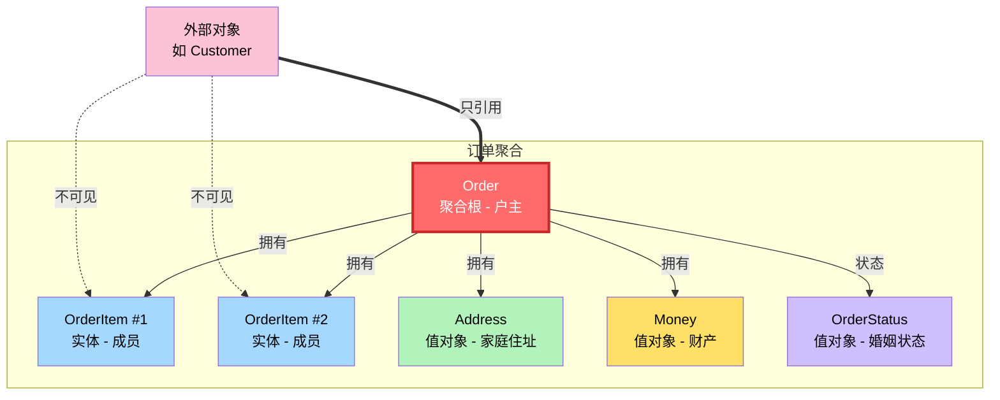

**关键点**：
- 聚合根是聚合的"对外窗口"，外部对象**只能引用聚合根**。
- 聚合内部的实体和值对象**对外不可见**。
- 聚合根承担**维护内部一致性**的责任。

---

## 7.2 聚合的本质：一致性边界 + 不变式

聚合的本质是**事务一致性边界**。一个聚合内的所有对象，必须在任何业务操作中**保持一致**。

### 7.2.1 什么是不变式（Invariant）

**不变式**是指在领域逻辑中**永远必须为真的业务规则**。例如：

- 订单的所有订单项金额之和，必须等于订单总金额
- 订单最多只能有 20 个订单项
- 订单状态为"已支付"时，必须有支付时间
- 订单项的"可售数量"之和，等于订单的"商品总数"

这些规则不是"建议"，而是**铁律**。无论发生什么业务操作，都必须维护这些铁律。

### 7.2.2 聚合 = 不变式的物理容器

为什么需要"聚合"这个概念？因为**不变式是有范围的**。一个不变式可能涉及多个对象，但**不会涉及所有对象**。聚合就是用来**圈定不变式作用范围**的物理容器。

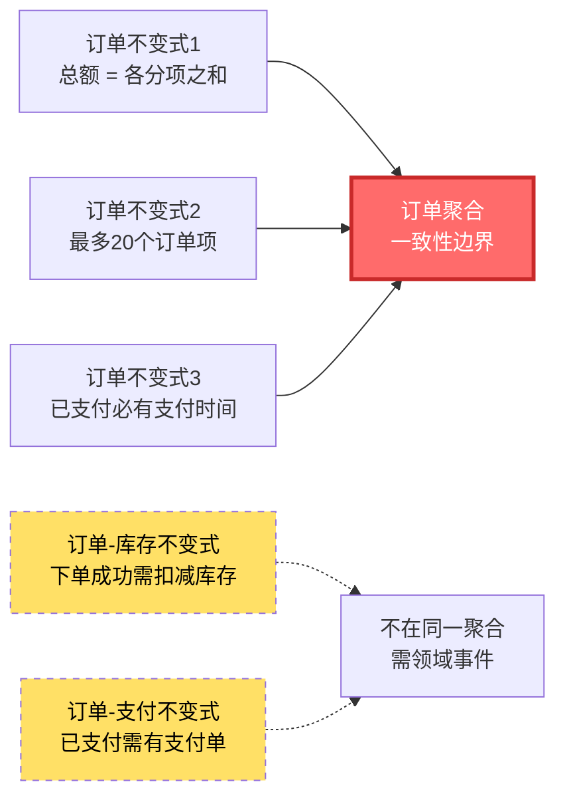

**关键判断**：
- **订单总额 = 各分项之和** —— 这个不变式涉及 `Order` 和 `OrderItem`，它们**必须**在同一个聚合。
- **下单成功要扣减库存** —— 这个不变式涉及 `Order` 和 `Inventory`，但**不必要**在同一个聚合（用领域事件实现最终一致即可）。

这就是"边界"的意义：**在边界内强一致，边界外最终一致**。

---

## 7.3 聚合根的责任

聚合根是聚合的"灵魂人物"，它承担三大核心责任。

### 7.3.1 责任一：作为聚合的唯一入口

聚合根是外部世界访问聚合内部对象的**唯一通道**。

```java
// 错误：外部直接操作订单项
order.getItems().get(0).setQuantity(10);  // 直接修改订单项

// 正确：所有修改都通过聚合根
order.changeItemQuantity(itemId, newQuantity);  // 由 Order 统一调度
```

外部对象**不能**通过 getter 拿到 `OrderItem` 然后直接修改它。如果允许这种"穿透"，聚合的封装就被打破，不变式就无法保证。

### 7.3.2 责任二：维护聚合内一致性

聚合根在每个业务方法中，**必须显式检查并维护不变式**。当一个操作可能破坏不变式时，应该**拒绝执行**并抛出异常，而不是悄悄违反。

```java
public void changeItemQuantity(OrderItemId itemId, int newQuantity) {
    // 1. 找到订单项
    OrderItem item = findItem(itemId);

    // 2. 检查不变式：订单项数量不能超过库存
    if (newQuantity > item.getMaxAllowedQuantity()) {
        throw new DomainException("订单项数量超过库存限制");
    }

    // 3. 修改
    item.changeQuantity(newQuantity);

    // 4. 重新计算订单总额
    this.totalAmount = recalculateTotal();
}
```

### 7.3.3 责任三：对外发布领域事件

聚合根在状态发生重要变化时，需要**发布领域事件**，通知其他上下文。事件发布通常在**领域方法内部**完成，存储在聚合的事件列表中，待仓储持久化时统一发出。

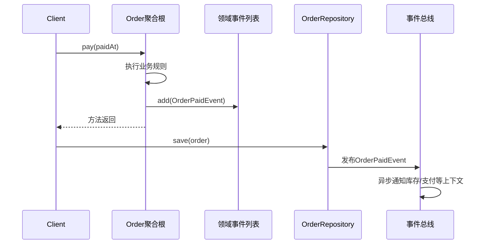

事件发布是聚合根**对外影响其他聚合**的唯一正确方式（第 7.9 节会详细讲）。

---

## 7.4 聚合的设计原则（核心）

这一节是本章**最核心的内容**，请务必读懂、记牢。

### 7.4.1 原则一：一致性边界内强一致，边界外最终一致

**这是聚合设计的"宪法"**。

- **聚合内部**：必须在**同一个数据库事务**中完成修改，确保**强一致**。
- **聚合之间**：通过**领域事件**实现**最终一致**，**不允许跨聚合事务**。

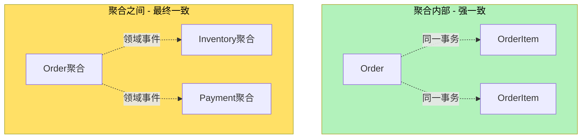

**为什么要这样设计？**

很多人会问：为什么不在一个大事务里把所有相关数据都改了？这样不是最简单吗？答案是**性能和可扩展性**。假设订单和库存放在同一事务里：

1. **锁竞争严重**：多个用户同时下单时，会竞争同一组数据库行锁，吞吐量急剧下降。
2. **死锁风险高**：事务越大，涉及的锁越多，死锁概率呈指数级上升。
3. **分布式部署困难**：微服务架构下，订单和库存很可能在不同的数据库、不同的服务，跨库事务（2PC）性能极差且容易失败。
4. **业务耦合严重**：一个业务变更要影响多个聚合，修改成本高。

把一致性要求"缩小"到聚合内部，把外部依赖"放宽"到最终一致，是**用业务可接受的延迟换取系统可扩展性**的经典权衡。

### 7.4.2 原则二：只通过聚合根修改聚合

**任何修改聚合内部对象的行为，都必须经过聚合根**。聚合根是"守门员"，没有它的允许，谁也进不来。

**反例**：

```java
// 错误：外部绕过 Order 直接改 OrderItem
OrderItem item = order.getItems().get(0);
item.setQuantity(10);
orderRepository.save(order);  // save 时 Order 总额根本没重算！
```

**正例**：

```java
// 正确：所有修改走 Order
order.changeItemQuantity(itemId, 10);
orderRepository.save(order);  // Order 内部已经重算总额
```

### 7.4.3 原则三：聚合间通过 ID 引用，而非对象引用

**聚合之间不能持有对方的对象引用，只能持有 ID**。这是为了**划清边界**、**解耦**、**避免误改**。

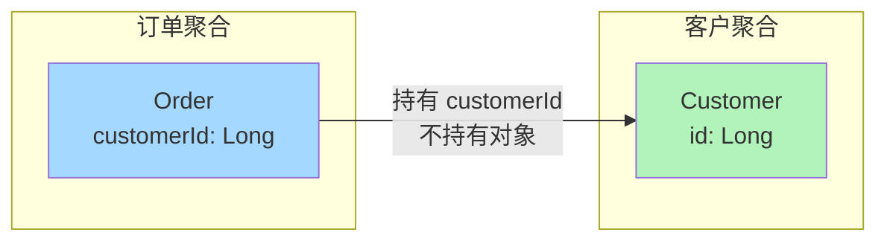

**为什么不能直接引用？**
1. **跨聚合事务风险**：如果 `Order` 持有了 `Customer` 对象，开发很容易写出"修改订单时同时改客户"这种**跨聚合事务**。
2. **数据加载浪费**：加载订单时，JPA/Hibernate 可能级联把客户数据也加载出来，浪费内存。
3. **分布式部署难**：订单和客户可能在不同的服务、不同的数据库，对象引用根本无法跨进程。

**正确写法**：

```java
// 正确：Order 只持有 customerId
public class Order {
    private OrderId id;
    private CustomerId customerId;  // ID 而非对象
    // ...
}

// 需要客户信息时，通过仓储查询
Customer customer = customerRepository.findById(order.getCustomerId())
    .orElseThrow(() -> new CustomerNotFoundException());
```

**一个真实踩坑案例**：

某团队初期为了"方便"，在 `OrderItem` 里直接持有了 `Product` 对象。几个月后问题暴露：

- 查一个订单，SQL 连带查出所有商品详情（包括商品描述、长文本介绍），单条订单查询从 5ms 涨到 200ms。
- 一个商品改价格时，**所有引用它的订单项都被 ORM 标记为脏数据**，导致订单表被意外更新，引发数据不一致事故。
- 拆分微服务时，订单上下文和商品上下文被迫一起拆分，复杂度翻倍。

这就是直接引用的"暗债"——短期方便，长期致命。

### 7.4.4 原则四：一次事务只修改一个聚合

**一个数据库事务，**只能**修改一个聚合**。这是上一条原则的自然推论。

```java
@Transactional  // 一个事务
public void cancelOrder(OrderId orderId) {
    Order order = orderRepository.findById(orderId);
    order.cancel();  // 只改 Order 聚合
    orderRepository.save(order);
    // 不在这里修改库存、不在这里修改支付
    // 这些由 OrderPaidEvent 等领域事件触发
}
```

**违反这条原则的代价**：
- 性能差（事务锁范围大、并发低）
- 容易死锁
- 拆分微服务时改不动
- 业务复杂时，事务回滚导致"部分成功部分失败"的不一致

### 7.4.5 原则五：小聚合原则

**聚合应该尽可能小**。Eric Evans 的忠告是：**优先用值对象建模**。

为什么要小？
- **小聚合并发好**：锁的范围小，并发能力高。
- **小聚合性能好**：加载快、占内存少。
- **小聚合易演进**：业务变化时，修改影响面小。

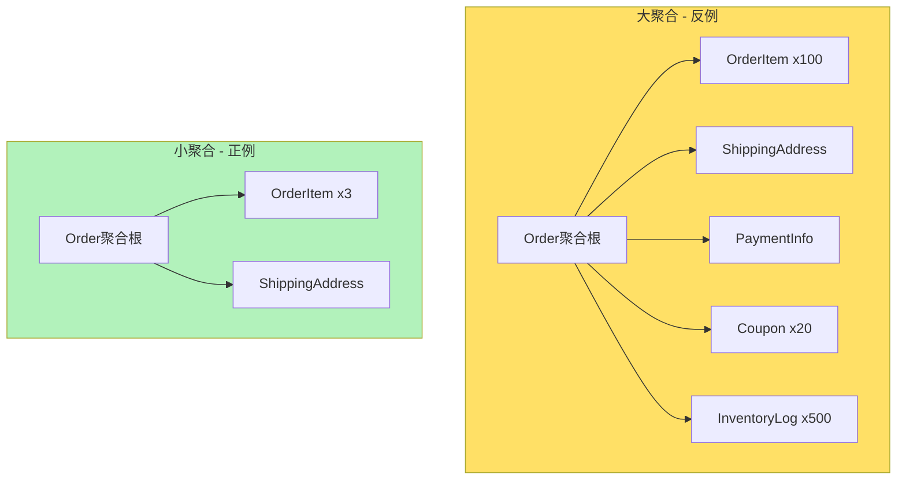

**判断聚合是否过大的标尺**：
- 聚合能否被**完整加载到内存**？如果不能，考虑拆分。
- 聚合内的实体**是否被不同的业务方法频繁同时修改**？如果否，考虑拆分。
- 聚合根的**业务方法是否过多**？如果超过 20 个，可能过于复杂。

### 7.4.6 原则六：通过不变式发现聚合边界

**不变式是聚合边界的"探测器"**。当你不确定哪些对象应该在同一个聚合时，问自己一个问题：**这两个对象之间有没有必须同时满足的不变式？**

- 有 → 同一个聚合
- 没有 → 不同聚合

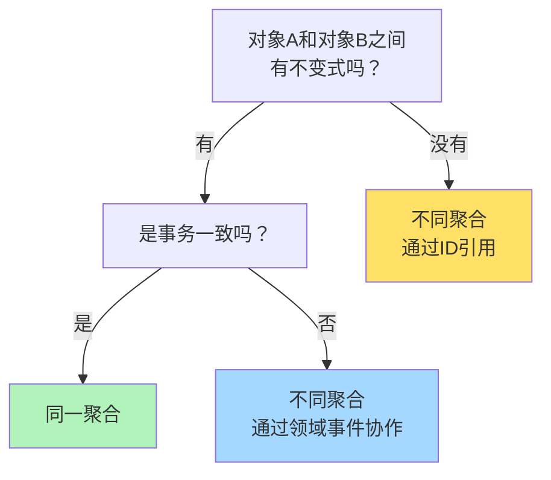

**实战案例**：
- "订单总额 = 各分项之和" → 涉及 `Order` 和 `OrderItem` → **同一聚合**。
- "下单成功要扣减库存" → 涉及 `Order` 和 `Inventory` → **不同聚合（领域事件）**。
- "客户改手机号" → 涉及 `Customer` 和 `Order`（订单上有收件人手机号）→ **不同聚合（订单上只存快照）**。

---

## 7.5 聚合的识别方法

识别聚合是 DDD 战术设计中最难的一步。下面提供三种识别方法。

### 7.5.1 方法一：从业务不变式出发

找出所有"必须同时为真"的业务规则，把这些规则涉及的对象**圈在一个聚合**里。

**实战**：
- 不变式"订单总额 = 订单项金额之和" → `Order` + `OrderItem` 同一聚合
- 不变式"客户 VIP 等级 = 历史消费金额映射" → `Customer` + `Order` 看似相关，但消费金额是**统计结果**，不要求强一致，可以**不同聚合**（用读模型统计）

### 7.5.2 方法二：从生命周期一致性出发

如果两个对象的**生命周期是绑定的**（一起创建、一起销毁、一起修改），那它们就应该在同一聚合。

- `Order` 和 `OrderItem`：订单项没有订单就没有意义 → **同一聚合**
- `Order` 和 `Inventory`：订单取消后库存要"回滚"，但**库存本身是独立商品的生命周期** → **不同聚合**

### 7.5.3 方法三：从并发写频率出发

如果两个对象的**并发修改频率差异很大**，把它们放一起会导致大量**不必要的锁竞争**。这种对象应该**分开聚合**。

- `Order` 状态：高频改（用户频繁切换状态）
- `Order` 备注：低频改（用户偶尔补充）
- 看似在同一聚合，但**并发写不集中**，可以考虑把"备注"作为单独实体（`OrderNote`），通过 ID 关联。

---

## 7.6 实战：订单聚合完整设计

### 7.6.1 聚合结构图

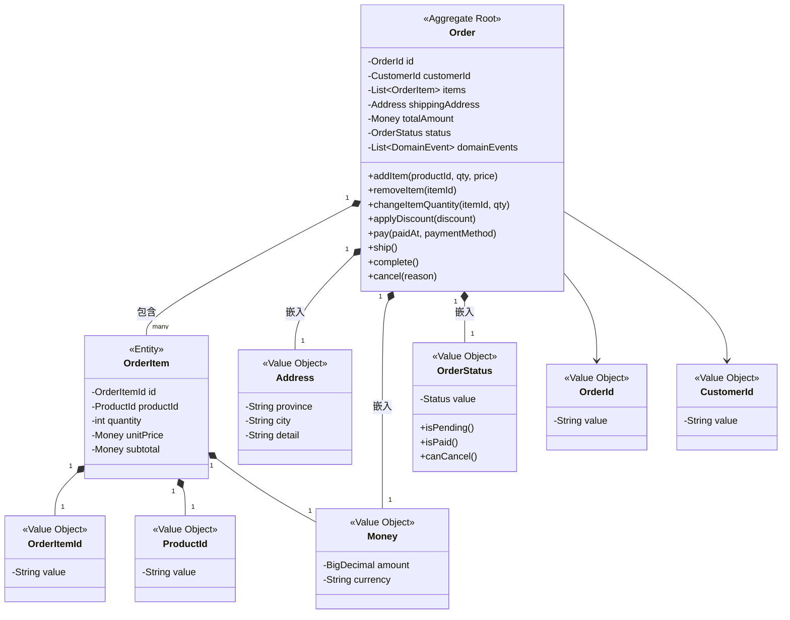

### 7.6.2 值对象代码

```java
// 订单 ID 值对象
public record OrderId(String value) {
    public OrderId {
        if (value == null || value.isBlank()) {
            throw new IllegalArgumentException("订单ID不能为空");
        }
    }
}

// 客户 ID 值对象（通过 ID 引用其他聚合）
public record CustomerId(String value) {
    public CustomerId {
        if (value == null || value.isBlank()) {
            throw new IllegalArgumentException("客户ID不能为空");
        }
    }
}

// 金额值对象
public record Money(BigDecimal amount, String currency) {
    public Money {
        if (amount == null || amount.signum() < 0) {
            throw new IllegalArgumentException("金额不能为负");
        }
    }

    public Money add(Money other) {
        if (!this.currency.equals(other.currency)) {
            throw new IllegalArgumentException("币种不一致");
        }
        return new Money(this.amount.add(other.amount), this.currency);
    }

    public Money multiply(int multiplier) {
        return new Money(this.amount.multiply(BigDecimal.valueOf(multiplier)), this.currency);
    }

    public static Money zero(String currency) {
        return new Money(BigDecimal.ZERO, currency);
    }
}

// 收货地址值对象（不可变）
public record Address(String province, String city, String detail) {
    public Address {
        if (province == null || city == null || detail == null) {
            throw new IllegalArgumentException("地址不完整");
        }
    }
}

// 订单状态值对象（状态机）
public class OrderStatus {
    public enum Status { PENDING, PAID, SHIPPED, COMPLETED, CANCELLED }

    private Status value;

    public OrderStatus() { this.value = Status.PENDING; }

    public OrderStatus(Status value) { this.value = value; }

    public boolean isPending() { return value == Status.PENDING; }
    public boolean isPaid() { return value == Status.PAID; }
    public boolean isShipped() { return value == Status.SHIPPED; }
    public boolean isCompleted() { return value == Status.COMPLETED; }
    public boolean isCancelled() { return value == Status.CANCELLED; }

    public boolean canPay() { return value == Status.PENDING; }
    public boolean canShip() { return value == Status.PAID; }
    public boolean canComplete() { return value == Status.SHIPPED; }
    public boolean canCancel() {
        return value == Status.PENDING || value == Status.PAID;
    }

    public void pay() {
        if (!canPay()) throw new IllegalStateException("当前状态不能支付");
        this.value = Status.PAID;
    }
    public void ship() {
        if (!canShip()) throw new IllegalStateException("当前状态不能发货");
        this.value = Status.SHIPPED;
    }
    public void complete() {
        if (!canComplete()) throw new IllegalStateException("当前状态不能完成");
        this.value = Status.COMPLETED;
    }
    public void cancel() {
        if (!canCancel()) throw new IllegalStateException("当前状态不能取消");
        this.value = Status.CANCELLED;
    }

    public Status getValue() { return value; }
}
```

### 7.6.3 订单项实体

```java
// 订单项实体 - 聚合内部实体
public class OrderItem {
    private OrderItemId id;
    private ProductId productId;   // 引用商品聚合的 ID
    private int quantity;
    private Money unitPrice;       // 下单时的快照价格
    private Money subtotal;        // 小计金额

    // 构造方法：只允许 Order 聚合根创建
    OrderItem(OrderItemId id, ProductId productId, int quantity, Money unitPrice) {
        if (quantity <= 0) {
            throw new IllegalArgumentException("订单项数量必须大于0");
        }
        this.id = id;
        this.productId = productId;
        this.quantity = quantity;
        this.unitPrice = unitPrice;
        this.subtotal = unitPrice.multiply(quantity);
    }

    // 修改数量 - 必须通过 Order 聚合根
    void changeQuantity(int newQuantity) {
        if (newQuantity <= 0) {
            throw new IllegalArgumentException("订单项数量必须大于0");
        }
        this.quantity = newQuantity;
        this.subtotal = this.unitPrice.multiply(newQuantity);
    }

    // Getter - 不暴露 setter
    public OrderItemId getId() { return id; }
    public ProductId getProductId() { return productId; }
    public int getQuantity() { return quantity; }
    public Money getUnitPrice() { return unitPrice; }
    public Money getSubtotal() { return subtotal; }
}
```

### 7.6.4 Order 聚合根完整代码

```java
// 订单聚合根 - 整个聚合的对外入口
public class Order {
    private OrderId id;
    private CustomerId customerId;       // 引用客户聚合的 ID
    private List<OrderItem> items;       // 聚合内部实体
    private Address shippingAddress;     // 嵌入值对象
    private Money totalAmount;           // 嵌入值对象
    private OrderStatus status;          // 嵌入值对象
    private LocalDateTime createdAt;
    private LocalDateTime paidAt;
    private List<DomainEvent> domainEvents = new ArrayList<>();  // 领域事件

    // 工厂方法：创建新订单
    public static Order create(OrderId id, CustomerId customerId, Address address) {
        Order order = new Order();
        order.id = id;
        order.customerId = customerId;
        order.shippingAddress = address;
        order.items = new ArrayList<>();
        order.totalAmount = Money.zero("CNY");
        order.status = new OrderStatus(OrderStatus.Status.PENDING);
        order.createdAt = LocalDateTime.now();
        order.domainEvents.add(new OrderCreatedEvent(id, customerId, LocalDateTime.now()));
        return order;
    }

    // 业务方法1：添加订单项 - 检查不变式
    public void addItem(ProductId productId, int quantity, Money unitPrice) {
        // 不变式检查：订单必须处于 PENDING 状态
        if (!status.isPending()) {
            throw new DomainException("只有待支付订单才能添加商品");
        }
        // 不变式检查：订单项数量限制
        if (items.size() >= 20) {
            throw new DomainException("订单最多包含20个商品");
        }
        // 不变式检查：同一商品不能重复添加
        if (items.stream().anyMatch(i -> i.getProductId().equals(productId))) {
            throw new DomainException("订单中已存在该商品");
        }

        OrderItemId itemId = OrderItemId.generate();
        OrderItem item = new OrderItem(itemId, productId, quantity, unitPrice);
        items.add(item);
        recalculateTotal();
    }

    // 业务方法2：修改订单项数量
    public void changeItemQuantity(OrderItemId itemId, int newQuantity) {
        if (!status.isPending()) {
            throw new DomainException("只有待支付订单才能修改商品");
        }
        OrderItem item = findItem(itemId);
        item.changeQuantity(newQuantity);
        recalculateTotal();
    }

    // 业务方法3：移除订单项
    public void removeItem(OrderItemId itemId) {
        if (!status.isPending()) {
            throw new DomainException("只有待支付订单才能删除商品");
        }
        items.removeIf(i -> i.getId().equals(itemId));
        recalculateTotal();
    }

    // 业务方法4：应用折扣
    public void applyDiscount(Money discount) {
        if (!status.isPending()) {
            throw new DomainException("只有待支付订单才能应用折扣");
        }
        if (discount.amount().compareTo(this.totalAmount.amount()) > 0) {
            throw new DomainException("折扣金额不能超过订单总额");
        }
        this.totalAmount = new Money(
            this.totalAmount.amount().subtract(discount.amount()),
            this.totalAmount.currency()
        );
    }

    // 业务方法5：支付订单 - 状态机转换
    public void pay(LocalDateTime paidAt, String paymentMethod) {
        // 状态机：PENDING -> PAID
        status.pay();
        this.paidAt = paidAt;
        // 发布领域事件（库存、支付上下文会监听）
        this.domainEvents.add(new OrderPaidEvent(this.id, this.customerId, paidAt, paymentMethod));
    }

    // 业务方法6：发货
    public void ship() {
        // 状态机：PAID -> SHIPPED
        status.ship();
        this.domainEvents.add(new OrderShippedEvent(this.id, LocalDateTime.now()));
    }

    // 业务方法7：完成订单
    public void complete() {
        // 状态机：SHIPPED -> COMPLETED
        status.complete();
    }

    // 业务方法8：取消订单
    public void cancel(String reason) {
        // 状态机：PENDING/PAID -> CANCELLED
        status.cancel();
        this.domainEvents.add(new OrderCancelledEvent(this.id, reason));
    }

    // 私有方法：重新计算订单总额（核心不变式）
    private void recalculateTotal() {
        this.totalAmount = items.stream()
            .map(OrderItem::getSubtotal)
            .reduce(Money.zero("CNY"), Money::add);
    }

    // 私有方法：查找订单项
    private OrderItem findItem(OrderItemId itemId) {
        return items.stream()
            .filter(i -> i.getId().equals(itemId))
            .findFirst()
            .orElseThrow(() -> new DomainException("订单项不存在: " + itemId));
    }

    // 仓储持久化前调用
    public void clearDomainEvents() {
        this.domainEvents.clear();
    }

    // Getter - 业务查询方法
    public OrderId getId() { return id; }
    public CustomerId getCustomerId() { return customerId; }
    public List<OrderItem> getItems() { return Collections.unmodifiableList(items); }
    public Address getShippingAddress() { return shippingAddress; }
    public Money getTotalAmount() { return totalAmount; }
    public OrderStatus getStatus() { return status; }
    public LocalDateTime getCreatedAt() { return createdAt; }
    public LocalDateTime getPaidAt() { return paidAt; }
    public List<DomainEvent> getDomainEvents() { return Collections.unmodifiableList(domainEvents); }
}
```

### 7.6.5 状态机图

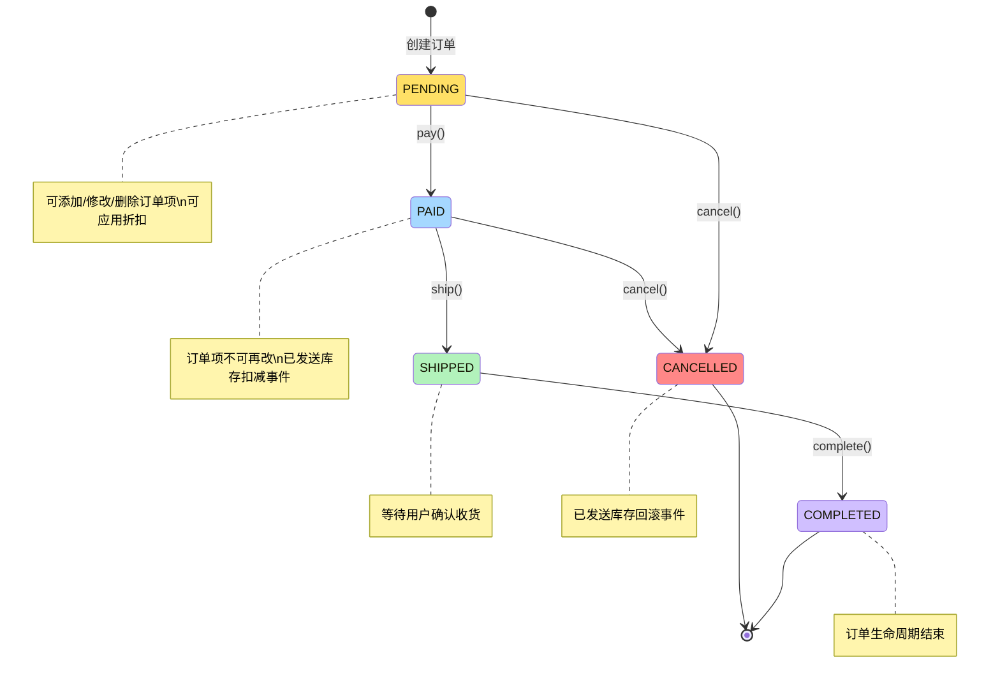

### 7.6.6 聚合根的单元测试

```java
// 演示业务规则和不变量约束
class OrderTest {

    @Test
    void should_calculate_total_amount_when_add_item() {
        Order order = Order.create(new OrderId("O001"),
            new CustomerId("C001"),
            new Address("广东省", "深圳市", "南山区xxx"));

        order.addItem(new ProductId("P001"), 2, new Money(new BigDecimal("100"), "CNY"));
        order.addItem(new ProductId("P002"), 1, new Money(new BigDecimal("50"), "CNY"));

        // 不变式：总额 = 2*100 + 1*50 = 250
        assertEquals(new BigDecimal("250"), order.getTotalAmount().amount());
    }

    @Test
    void should_throw_exception_when_add_more_than_20_items() {
        Order order = Order.create(new OrderId("O001"),
            new CustomerId("C001"),
            new Address("广东省", "深圳市", "南山区xxx"));

        // 不变式：最多20个订单项
        for (int i = 1; i <= 20; i++) {
            order.addItem(new ProductId("P" + i), 1, new Money(BigDecimal.TEN, "CNY"));
        }
        assertThrows(DomainException.class, () ->
            order.addItem(new ProductId("P21"), 1, new Money(BigDecimal.TEN, "CNY"))
        );
    }

    @Test
    void should_not_allow_modify_items_after_paid() {
        Order order = Order.create(new OrderId("O001"),
            new CustomerId("C001"),
            new Address("广东省", "深圳市", "南山区xxx"));
        order.addItem(new ProductId("P001"), 1, new Money(BigDecimal.TEN, "CNY"));
        order.pay(LocalDateTime.now(), "ALIPAY");

        // 状态机：已支付后不能修改订单项
        assertThrows(DomainException.class, () ->
            order.changeItemQuantity(order.getItems().get(0).getId(), 5)
        );
    }

    @Test
    void should_publish_event_when_paid() {
        Order order = Order.create(new OrderId("O001"),
            new CustomerId("C001"),
            new Address("广东省", "深圳市", "南山区xxx"));
        order.addItem(new ProductId("P001"), 1, new Money(BigDecimal.TEN, "CNY"));

        order.pay(LocalDateTime.now(), "ALIPAY");

        // 验证领域事件已发布
        assertEquals(2, order.getDomainEvents().size());
        assertTrue(order.getDomainEvents().get(1) instanceof OrderPaidEvent);
    }

    @Test
    void should_follow_state_machine() {
        Order order = Order.create(new OrderId("O001"),
            new CustomerId("C001"),
            new Address("广东省", "深圳市", "南山区xxx"));
        order.addItem(new ProductId("P001"), 1, new Money(BigDecimal.TEN, "CNY"));

        // PENDING -> PAID -> SHIPPED -> COMPLETED
        order.pay(LocalDateTime.now(), "ALIPAY");
        assertTrue(order.getStatus().isPaid());

        order.ship();
        assertTrue(order.getStatus().isShipped());

        order.complete();
        assertTrue(order.getStatus().isCompleted());
    }
}
```

---

## 7.7 聚合的大小问题

### 7.7.1 大聚合的问题

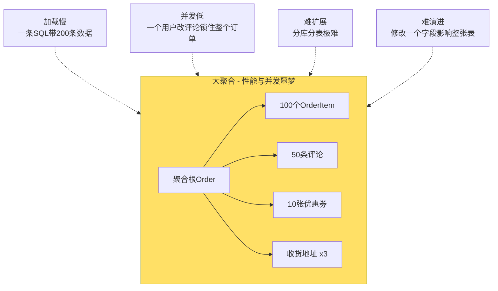

### 7.7.2 小聚合的优势

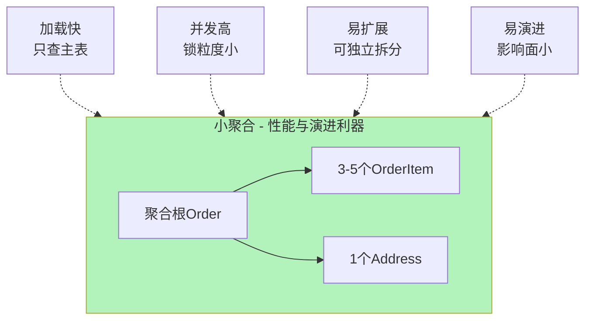

### 7.7.3 何时该拆分聚合

**拆分的三大信号**：

1. **信号一：性能下降**。聚合加载耗时 > 100ms，或单次 SQL 返回行数 > 100。
2. **信号二：并发瓶颈**。多个业务方**频繁同时**修改聚合的不同部分，造成锁竞争。
3. **信号三：业务边界清晰**。聚合内某部分实体**生命周期独立**（如订单评论、订单日志）。

### 7.7.4 实战对比

**场景**：订单要不要包含"订单评论"？

| 维度 | 大聚合（含评论） | 小聚合（独立评论聚合） |
|------|------------------|------------------------|
| 加载性能 | 查询订单时连带评论（即使不需要） | 查订单时只查订单 |
| 并发 | 用户 A 改评论时锁订单，用户 B 不能下单 | 互不影响 |
| 演进 | 评论字段改动需升级 Order 表 | 独立升级 |
| 业务一致 | 评论必须和订单一起查（实际不需要） | 通过 orderId 关联查询 |

**结论**：评论应该是**独立的 Comment 聚合**，通过 `orderId`（ID 引用）关联。

---

## 7.8 聚合间引用

### 7.8.1 正确方式：通过 ID 引用

```java
// 正确：Order 只持有 CustomerId
public class Order {
    private OrderId id;
    private CustomerId customerId;  // ID 引用
    // ...
}

// 业务代码：需要客户信息时再查询
public Customer getCustomer() {
    return customerRepository.findById(this.customerId)
        .orElseThrow(() -> new CustomerNotFoundException(this.customerId));
}
```

### 7.8.2 错误方式：直接对象引用

```java
// 错误：直接持有 Customer 对象
public class Order {
    private OrderId id;
    private Customer customer;  // 对象引用 - 错误！
    // ...
}
```

**错误引用的三大问题**：

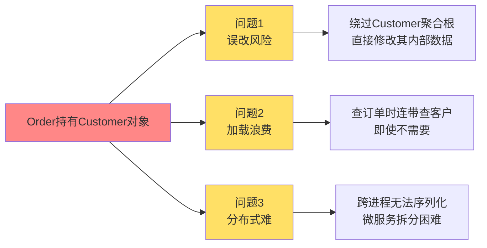

### 7.8.3 引用关系图

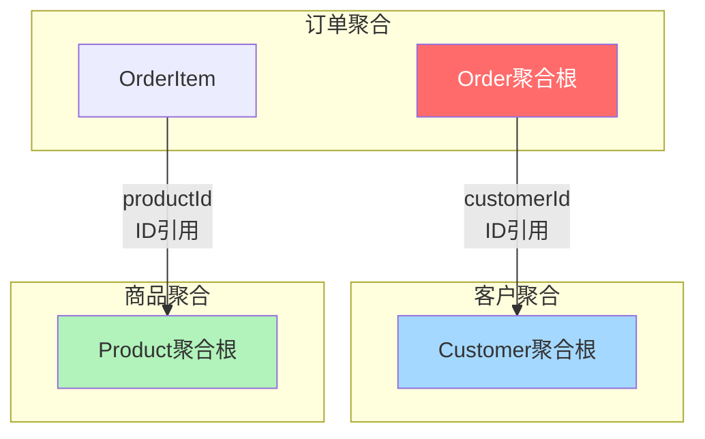

---

## 7.9 跨聚合数据一致性

### 7.9.1 强一致 vs 最终一致

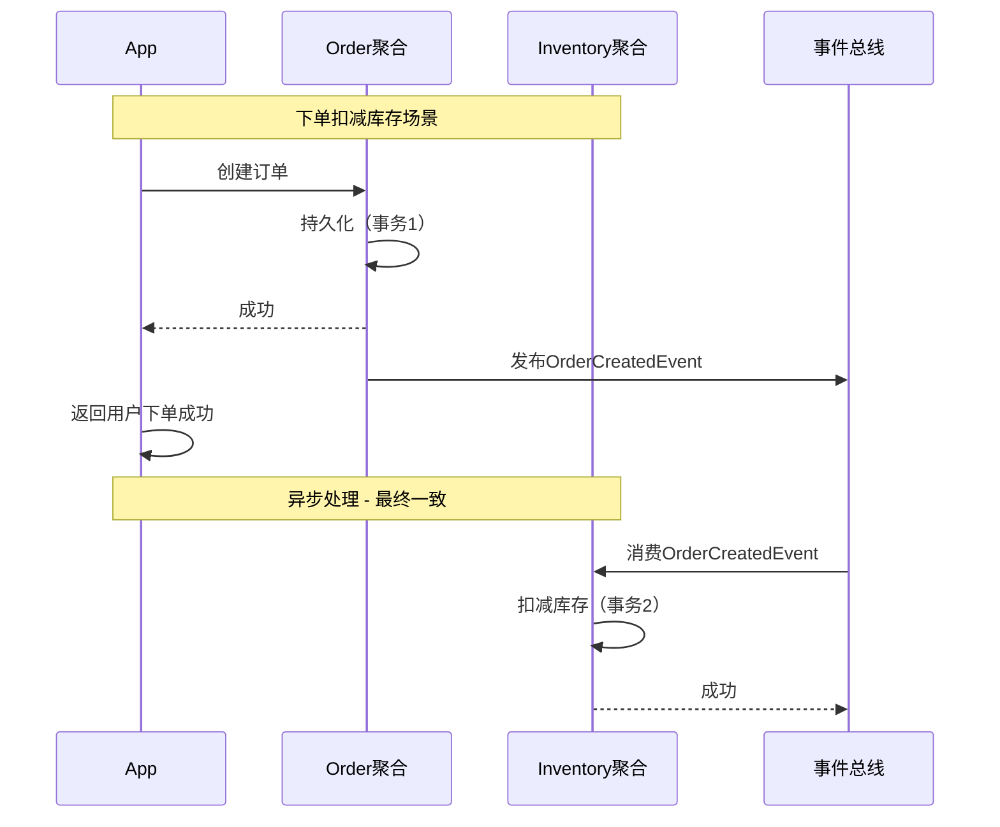

**关键点**：
- **下单成功**与**扣减库存**不在同一个事务中。
- 通过**领域事件**实现**最终一致**。
- 用户看到的"下单成功"是**即时的**，库存扣减是**准实时**的（毫秒级延迟可接受）。

### 7.9.2 实战：订单 + 库存的领域事件发布

```java
// 1. 领域事件定义
public record OrderCreatedEvent(
    OrderId orderId,
    CustomerId customerId,
    LocalDateTime occurredAt
) implements DomainEvent {}

// 2. Order 聚合根中发布事件
public static Order create(OrderId id, CustomerId customerId, Address address) {
    Order order = new Order();
    // ... 初始化字段
    order.domainEvents.add(new OrderCreatedEvent(id, customerId, LocalDateTime.now()));
    return order;
}

// 3. 仓储实现 - 保存时发布事件
public class OrderRepositoryImpl {
    private EventBus eventBus;

    public void save(Order order) {
        // 1. 持久化订单
        orderDao.save(toPO(order));
        // 2. 发布领域事件
        order.getDomainEvents().forEach(eventBus::publish);
        // 3. 清空事件列表
        order.clearDomainEvents();
    }
}

// 4. 库存上下文 - 监听事件
@Component
public class InventoryEventHandler {
    private final InventoryRepository inventoryRepository;

    @EventListener
    public void handle(OrderCreatedEvent event) {
        // 1. 加载订单获取订单项
        Order order = orderRepository.findById(event.orderId());
        // 2. 为每个订单项扣减库存
        for (OrderItem item : order.getItems()) {
            inventoryRepository.deduct(item.getProductId(), item.getQuantity());
        }
    }
}
```

### 7.9.3 时序图：跨聚合协作

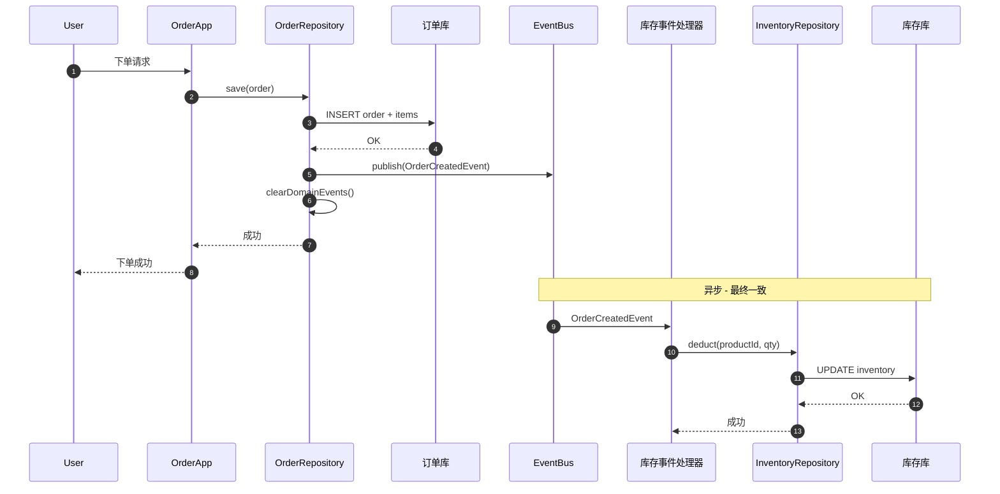

---

## 7.10 仓储与聚合

**核心原则：仓储以聚合根为单位，每个聚合根一个仓储**。

```java
// 正确：OrderRepository 操作整个聚合
public interface OrderRepository {
    Optional<Order> findById(OrderId id);
    void save(Order order);       // 持久化聚合根 + 内部所有实体
    void delete(OrderId id);
    List<Order> findByCustomerId(CustomerId customerId);
}

// 不应该有：OrderItemRepository
// 错误：每个实体一个仓储（违反聚合边界）
```

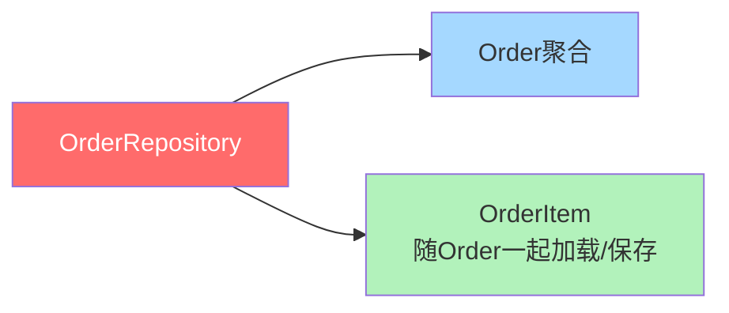

仓储的实现细节（数据库表结构、ORM 映射）由基础设施层处理，领域层只看到 `Order` 聚合根对象。

---

## 7.11 常见陷阱

### 7.11.1 陷阱一：聚合根暴露 setter

```java
// 错误：暴露 setter，外部可绕过业务规则
public class Order {
    private OrderStatus status;
    public void setStatus(OrderStatus status) { this.status = status; }  // 错误！
}

// 正确：暴露业务方法，内部维护不变式
public class Order {
    private OrderStatus status;
    public void pay(LocalDateTime paidAt) {
        status.pay();  // 状态机内部检查
        // ...
    }
}
```

### 7.11.2 陷阱二：跨聚合事务

```java
// 错误：在一个事务中修改两个聚合
@Transactional
public void placeOrder(Order order, Inventory inventory) {
    orderRepository.save(order);
    inventory.deduct(order.getItems());  // 跨聚合事务！
    inventoryRepository.save(inventory);
}

// 正确：拆成两个事务 + 领域事件
@Transactional
public void placeOrder(Order order) {
    orderRepository.save(order);  // 事务1：只管 Order
    // 领域事件触发库存扣减
}
```

### 7.11.3 陷阱三：聚合包含太多实体

```java
// 错误：聚合膨胀
public class Order {
    private List<OrderItem> items;        // 应该
    private List<OrderComment> comments;  // 不应该
    private List<Coupon> coupons;         // 视情况
    private Inventory inventory;          // 不应该
    // 几十个字段
}

// 正确：精简聚合
public class Order {
    private List<OrderItem> items;        // 必须
    private Address address;              // 必须
    // 精简字段
}
```

### 7.11.4 陷阱四：用继承代替聚合

```java
// 错误：用继承扩展 Order
public class VipOrder extends Order { }   // 继承增加复杂度
public class GroupOrder extends Order { } // 不同业务用不同聚合

// 正确：用策略模式 / 领域服务
public class Order {
    private DiscountPolicy discountPolicy;  // 组合
}
```

### 7.11.5 陷阱五：聚合根变成"上帝对象"

有些团队把"所有相关数据"都塞进一个聚合根，认为这才是"完整建模"。结果 `Order` 聚合根包含了 30+ 字段、20+ 业务方法，对外提供 50+ getter/setter，本质上又退化成了"贫血模型+大数据表"。

**正确做法**：聚合根只关注"它必须负责的不变式"。如果某字段对**订单的一致性约束没有影响**，它就不应该属于这个聚合。

### 7.11.6 陷阱六：忽略领域事件的发布时机

聚合根在状态变更时**必须**发布领域事件，否则其他上下文"听不到"你的变化。有人把事件发布放在"调用方 Service 里"，这是错误的——Service 是"指挥者"，不是聚合的"代言人"，事件必须由聚合根自己发布。

```java
// 错误：在 Service 中发布事件
@Service
public class OrderService {
    @Transactional
    public void payOrder(OrderId id) {
        Order order = orderRepository.findById(id);
        order.pay();  // 聚合根内部方法
        orderRepository.save(order);
        // 错误：Service 强行发布事件
        eventBus.publish(new OrderPaidEvent(id));
    }
}

// 正确：在聚合根内部发布事件
public class Order {
    public void pay(LocalDateTime paidAt) {
        status.pay();
        this.paidAt = paidAt;
        this.domainEvents.add(new OrderPaidEvent(this.id, this.customerId, paidAt, "ALIPAY"));
        // 事件由仓储持久化时统一发出
    }
}
```

---

## 小结与下一章预告

### 本章核心要点

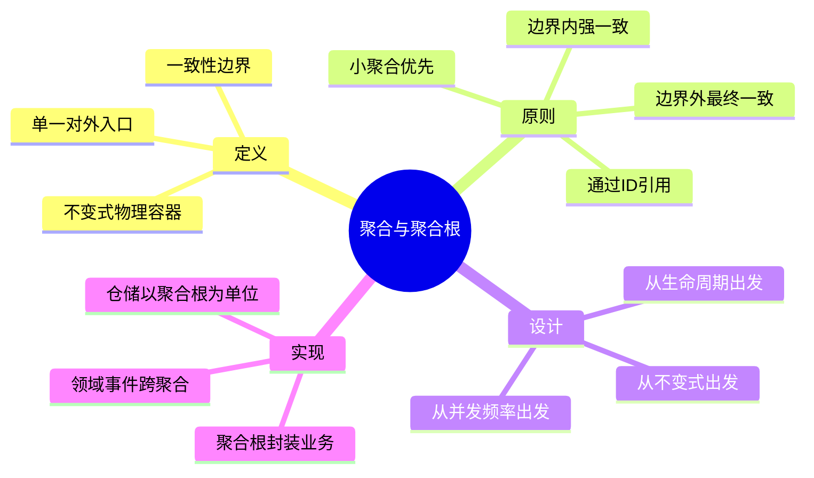

**一句话总结**：**聚合 = 一致性边界，聚合根 = 边界的守门员，领域事件 = 边界外的信使**。

### 关键原则速记

1. **强一致在聚合内，最终一致在聚合外**
2. **只通过聚合根修改聚合**
3. **聚合间通过 ID 引用**
4. **一次事务只改一个聚合**
5. **聚合要尽量小**
6. **不变式决定聚合边界**

### 下一章预告

第 8 章我们将进入**领域事件（Domain Event）**的专题。在本章中我们多次提到"发布领域事件"、"用事件实现最终一致"，下一章我们将深入讲解：
- 领域事件的定义与设计
- 事件发布与订阅机制
- 事件溯源（Event Sourcing）思想
- 事件驱动架构在 DDD 中的应用

敬请期待！

---

> **本章金句**：聚合设计的"道"，不在于画出多复杂的对象图，而在于**对"什么必须强一致、什么可以最终一致"的清醒判断**。
