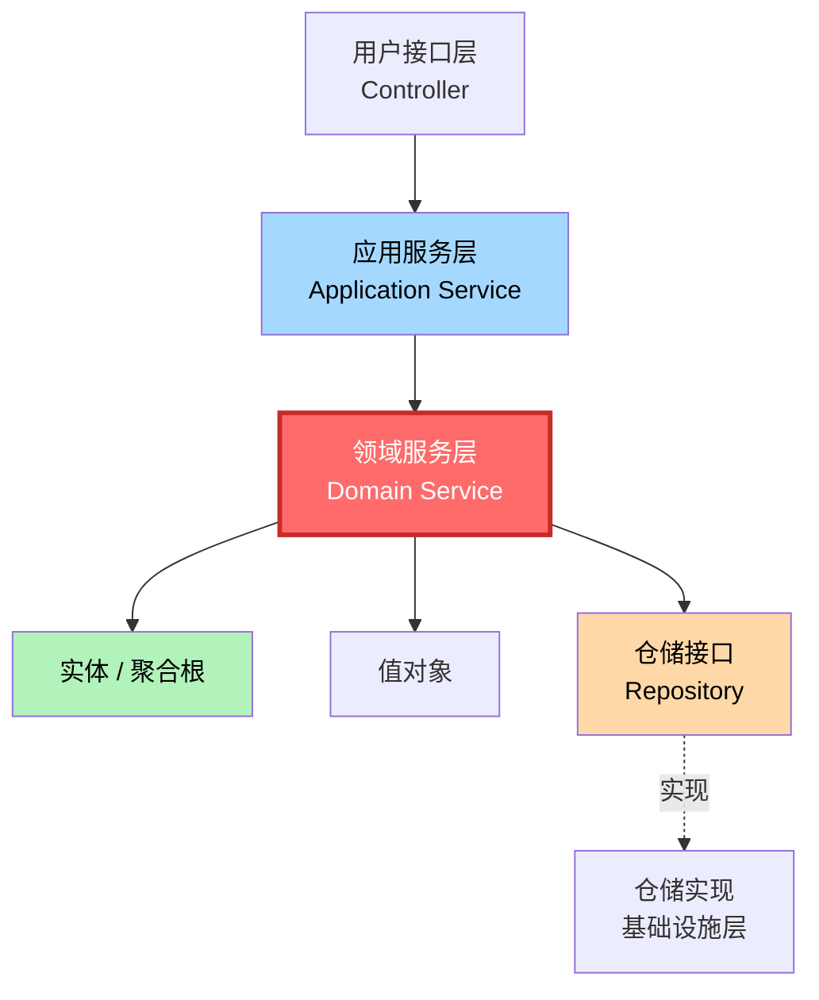
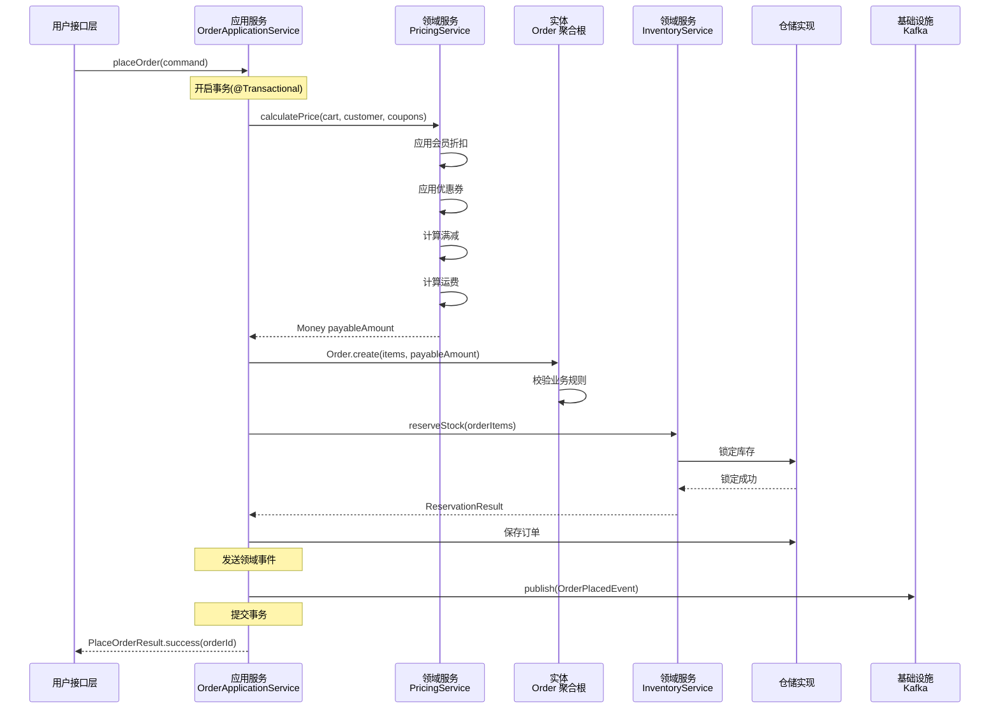
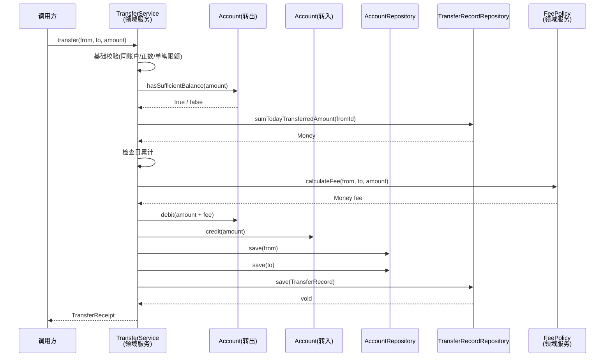
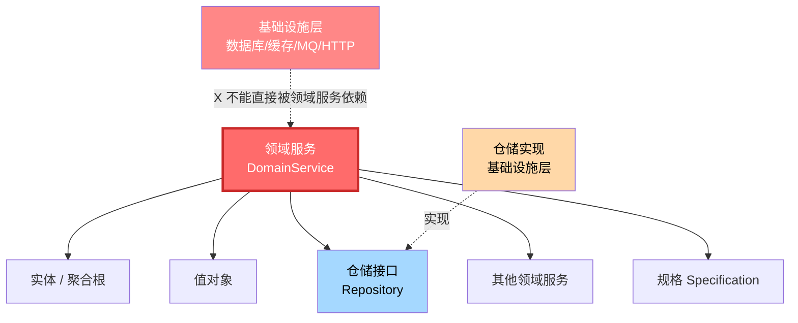

# 第8章 战术设计 - 领域服务（Domain Service）

> "有些领域动作不像属于任何一个对象。它们代表着一个领域中的重要过程，但把它们放到实体或值对象中都会破坏模型的清晰度。"
> —— Eric Evans，《领域驱动设计》

---

## 引子：转账的难题——这个动作该归谁？

某银行的核心系统里有个老问题：开发团队要为"转账"功能写代码。

"转账"这个动作看起来很简单——**账户 A 扣款，账户 B 加款**。但当开发开始动手时，问题来了：

- **账户 A 该负责转账吗？** A 实体上确实有 `debit()`（扣款）方法，但发起"转账"时 A 必须知道 B 的存在，必须跨账户操作，这违反"聚合根只管理自己内部状态"的原则。
- **账户 B 该负责转账吗？** B 实体上确实有 `credit()`（加款）方法，但同样的道理，B 也不该知道 A 的存在。
- **把转账逻辑塞到 A 内部？** 想象 A 上有 `transferTo(B, money)`，那么 A 就要知道资金清算、跨行手续费、行内限额、流水记录…… A 累不累？A 越来越像一个"上帝类"。

**这个"动作"不属于 A，也不属于 B**。它是发生在两个聚合之间的、跨边界的过程。

再深想一层：转账还需要调用**账户仓储**查询双方账户、调用**交易流水仓储**记录凭证、调用**限额服务**校验每日上限……如果硬塞进 A，B 不爽；如果硬塞进 B，A 不爽。

**领域服务（Domain Service）正是为了解决这类"无处安放"的业务逻辑**。它像一个中立的业务操作员，站在多个聚合之上协调它们完成一个完整的业务动作。**它本身不持有状态，它操作的对象才是状态的主人。**

下面就让我们系统地学习领域服务。

---

## 8.1 领域服务的定义

### 8.1.1 Eric Evans 的原话

在《领域驱动设计》中，Eric Evans 如此定义领域服务：

> "领域服务是用来表示**业务领域中一个无状态的操作或过程**。当一个重要的领域过程无法自然地归到实体或值对象上时，就可以把这个过程声明为领域服务。"

**关键词有三个**：

1. **业务领域中**：它属于领域层，承载的是业务规则，而不是技术实现。
2. **无状态**：它不保存业务状态，只对传入的对象进行操作。
3. **操作或过程**：它代表一个动作（动词），而不是一个东西（名词）。

### 8.1.2 通俗理解

**领域服务 = 一个会做"业务动作"但自己不存储状态的专家**。

就像医院里的"手术医生"：他不是病人（实体），也不是医疗器械（值对象），他是一个**执行手术这个动作**的专业角色。手术的过程（开刀、缝合、用药）由他负责，但病人本身的状态（心跳、血压、伤口愈合）由病人自己承载。

### 8.1.3 领域服务在四层架构中的位置



> **注意**：领域服务与实体、值对象**平级**，都属于领域层。它可以调用实体、值对象、仓储接口（领域层定义），但**不能调用仓储实现、消息队列、缓存、数据库**等基础设施。

---

## 8.2 领域服务的本质

**领域服务的本质：承载"不属于任何实体或值对象"的领域逻辑。**

这句话的每一个字都有深意，我们来拆解。

### 8.2.1 "不属于任何实体或值对象"

我们已经在引子里看过：转账不属于 A，也不属于 B。**当一个业务动作强行归属某一方时，就会产生别扭的设计**——要么违反"聚合边界"，要么产生上帝类，要么破坏单一职责。

判断一个业务逻辑"是否属于某实体"有个简单的标准：

> **如果强行把这个方法挂到某个实体上，会让这个实体感觉"这不关我的事"，那就该抽到领域服务里。**

### 8.2.2 "领域逻辑"——而非技术逻辑

领域服务承载的是**业务规则**，不是技术实现。

| 属于领域服务 | 不属于领域服务 |
| --- | --- |
| 余额是否足够？ | 数据库事务管理 |
| 是否跨行？是否要手续费？ | 发送 Kafka 消息 |
| 单笔/日累计是否超限？ | HTTP 接口调用 |
| 优惠如何叠加？ | 缓存读写 |
| 库存是否足够扣减？ | 日志打印 |

**关键检验**：如果业务专家在描述需求时会说这句话，那它就是业务逻辑；如果只是程序员为了"代码好维护"才做的事，那它就是技术关注点。

### 8.2.3 领域服务 vs 实体方法：边界判断

判断一个业务动作应该放在实体里还是领域服务里，**有四个经典判据**：

1. **单一聚合原则**：动作只涉及一个聚合内部 → 实体方法
2. **多聚合协作原则**：动作涉及多个聚合 → 领域服务
3. **无状态原则**：动作的执行不依赖任何历史状态 → 领域服务
4. **不破坏封装原则**：动作放到实体上需要暴露内部状态 → 领域服务

**举例**：

| 业务动作 | 归属 | 理由 |
| --- | --- | --- |
| 订单 `markAsPaid()` | Order 实体 | 只涉及 Order 自身 |
| 订单 `cancel()` | Order 实体 | 只涉及 Order 自身 |
| 订单 `addItem(product, qty)` | Order 实体 | 只涉及 Order 自身 |
| **转账** | **TransferService 领域服务** | 涉及 AccountA + AccountB 两个聚合 |
| **价格计算** | **PricingService 领域服务** | 涉及商品、会员、优惠券、运费多个领域 |
| **库存预占** | **InventoryService 领域服务** | 涉及订单、库存、仓储多个聚合 |

---

## 8.3 何时使用领域服务（重点）

领域服务不是万能解药，更不是放之四海而皆准的"垃圾桶"。**能用实体方法解决的，就别用领域服务**。

下面三种典型场景，是领域服务"正当登场"的时刻。

### 8.3.1 业务逻辑涉及多个聚合

**核心信号**：当一个业务动作必须跨越**两个或两个以上**的聚合边界时，领域服务就是最自然的选择。

**典型场景**：
- **转账**：账户 A 和账户 B 是两个独立的聚合，转账必须双方协调。
- **下单**：订单聚合、库存聚合、优惠券聚合、营销聚合必须协同。
- **退签**：订单聚合、退款聚合、库存聚合、信用分聚合必须联动。
- **物流调度**：订单聚合、运单聚合、车辆聚合、路径聚合必须联合决策。

> **原则**：聚合是"自治"的边界，**任何跨聚合的业务流程都应该由领域服务来编排**。

### 8.3.2 业务逻辑是无状态的

**核心信号**：当一段业务逻辑的执行**不依赖任何上下文历史**，每次执行都基于传入的参数时，领域服务是合适的。

**典型场景**：
- **价格计算**：传入商品列表、优惠券、会员等级，返回价格。无状态。
- **运费计算**：传入重量、目的地、运送方式，返回运费。无状态。
- **汇率换算**：传入金额、源币种、目标币种，返回换算后金额。无状态。
- **密码强度校验**：传入密码字符串，返回强度等级。无状态。

> **关键点**：领域服务对象**本身不保存业务状态**。它像一台"函数机器"，给什么参数就出什么结果。但请注意：领域服务**可以依赖仓储来查询状态**——查询得到的状态由仓储返回的实体承载，**领域服务本身仍然是 stateless**。

### 8.3.3 业务逻辑不能归属于某个实体

**核心信号**：当一段逻辑放到任何实体上都会让那个实体"变得四不像"时，领域服务就是归宿。

**典型场景**：
- **风控规则评估**：评估对象是"用户 + 设备 + 行为 + 时间窗口"四元组，强行挂到 User 实体上会让 User 变成"全能上帝"。
- **营销活动匹配**：商品、用户、促销规则三者匹配，让任何一个实体承担都会破坏其内聚性。
- **跨域计算**：聚合 A 的某个属性需要聚合 B、C、D 的数据才能算出，强行在 A 上计算会让 A 高度耦合其他聚合。

> **判断口诀**：**强归属 → 实体；弱归属 → 领域服务；多归属 → 领域服务**。

### 8.3.4 反向案例：什么时候**不**用领域服务

为了避免滥用，我们也要看清"不该用"的场景：

- **CRUD 操作**：单实体的增删改查，**不要**套个领域服务外壳——直接在仓储上做即可。
- **纯流程编排**：发消息、调外部接口、事务控制——这些是**应用服务**的职责（详见 8.5）。
- **技术工具方法**：字符串处理、日期格式化、加密解密——这些是**工具类（Utils）**的职责（详见 8.6）。

---

## 8.4 领域服务的特征

一个"合格的"领域服务通常具有以下特征。

### 8.4.1 无状态

领域服务**不持有任何业务状态**。每次方法调用都是独立的，调用结束不留痕迹。

```java
// 正确：领域服务无状态
public class PricingService {
    // 没有成员变量保存任何业务状态
    public Money calculatePrice(Cart cart, Customer customer, List<Coupon> coupons) {
        // ...
    }
}

// 错误：领域服务变成了有状态的"伪实体"
public class PricingService {
    private BigDecimal lastCalculatedPrice;  // 千万不要这样做！
    public Money calculatePrice(...) {
        // ...
    }
}
```

### 8.4.2 命名以业务动词为主

领域服务代表**业务动作**，所以命名**以动词或动名词短语**为主。

| 推荐命名 | 不推荐命名 |
| --- | --- |
| `TransferService`（转账服务） | `TransferHelper` |
| `PricingService`（定价服务） | `PriceUtils` |
| `RiskEvaluationService`（风控评估服务） | `RiskServiceImpl` |
| `InventoryAllocationService`（库存分配服务） | `InventoryManager` |

**命名公式**：`业务动词 + Service`，如 `CalculateTaxService`、`ValidateOrderService`、`AllocateInventoryService`。

### 8.4.3 接受领域对象作为参数

领域服务的方法签名里**应该出现领域对象**（实体、值对象、领域枚举），**不应该出现技术类型**（如 `HttpServletRequest`、`Map<String, Object>`、`Long userId`）。

```java
// 推荐：参数是领域对象，语义清晰
public TransferReceipt transfer(Account from, Account to, Money amount, TransferCommand cmd) { ... }

// 不推荐：参数是技术类型，语义丢失
public TransferResult transfer(Long fromId, Long toId, BigDecimal amount, Map<String, Object> params) { ... }
```

### 8.4.4 返回领域对象或基本类型

领域服务**返回领域对象**（实体、值对象）或**基本类型**（金额、布尔、整数），**不返回 DTO、不返回包装响应**。

```java
// 推荐：返回领域对象
public Money calculateFreight(Shipment shipment) { ... }
public TransferReceipt transfer(...) { ... }

// 不推荐：返回技术包装
public ResultDTO<Money> calculateFreight(...) { ... }  // 越界！这是应用服务的事
```

---

## 8.5 领域服务 vs 应用服务（重点对比）

这是初学者最常混淆的两种"服务"。它们名字像，位置近，协作多，但**职责完全不同**。

### 8.5.1 一句话区分

- **领域服务**：**做什么**（业务规则，无技术依赖）
- **应用服务**：**怎么调度**（用例编排，含事务、消息、安全等）

### 8.5.2 详细对比表

| 维度 | 领域服务 | 应用服务 |
| --- | --- | --- |
| **所属分层** | 领域层 | 应用层 |
| **核心职责** | 承载业务规则 | 编排用例流程 |
| **依赖** | 实体、值对象、仓储接口、其他领域服务 | 领域服务、仓储实现、外部客户端 |
| **能否调用基础设施** | 否（不直接调数据库、消息队列） | 是（可以调 MQ、HTTP、缓存） |
| **事务管理** | 不管 | 管（`@Transactional` 写在应用服务上） |
| **参数 / 返回** | 领域对象、值对象 | DTO、Command、Result |
| **命名** | 业务动词 + Service | 用例名 + Service / ApplicationService |
| **可复用性** | 高（纯业务，可被多个应用服务复用） | 低（贴合具体用例） |
| **测试** | 纯单元测试即可 | 需要 Mock 基础设施 |
| **典型示例** | `TransferService`、`PricingService` | `OrderApplicationService`、`UserRegistrationApplicationService` |

### 8.5.3 协作流程图

下面以"用户下单"为例，展示领域服务与应用服务的协作关系。



**注意图中的几个关键点**：

1. **应用服务是"调度者"**：它不写业务规则，它只负责"先做 A、再做 B、最后发消息"。
2. **领域服务是"业务专家"**：PricingService 自己完成所有的价格计算逻辑，AppSvc 不插手。
3. **基础设施只在应用服务层出现**：MQ、事务、HTTP 都由 AppSvc 处理。
4. **领域服务之间可以互相调用**：PricingService 内部如果需要调用别的领域服务，是允许的（详见 8.9）。

### 8.5.4 一个反例：把"事务"和"消息发送"放在领域服务

```java
// 反例：领域服务"越界"
public class TransferService {
    @Autowired
    private KafkaTemplate<String, String> kafkaTemplate;  // 基础设施！领域层不该有
    
    @Transactional  // 事务！领域层不该管
    public void transfer(Account from, Account to, Money amount) {
        // ... 业务逻辑
        kafkaTemplate.send("transfer-event", json);  // 越界
    }
}
```

这种代码会让领域服务**无法脱离 Spring / Kafka 框架单测**，违背了"领域层是纯 POJO"的原则。

---

## 8.6 领域服务 vs 工具类（Utils）

很多团队把"凡是涉及计算的逻辑"都做成 `XxxUtils`，这是非常常见的反模式。**领域服务与工具类的本质区别在于：它是"业务动作"还是"技术工具"**。

### 8.6.1 区分标准

| 维度 | 领域服务 | 工具类 |
| --- | --- | --- |
| **本质** | 业务动作 | 技术工具 |
| **承载内容** | 业务规则 | 数学/技术算法 |
| **依赖仓库/数据库** | 可以 | 不可以 |
| **参数** | 领域对象 | 基本类型或字符串 |
| **变更触发** | 业务专家说"规则变了" | 程序员说"算法需要优化" |
| **可被业务专家理解** | 是 | 否 |
| **例子** | `PricingService`（含会员折扣） | `BigDecimalUtils.round()`（四舍五入） |

### 8.6.2 反模式：把所有"计算"都做成 Utils

```java
// 反模式：把价格计算做成 Utils
public class PriceUtils {
    public static BigDecimal calculate(Long userId, List<Long> couponIds, BigDecimal originalAmount) {
        // 业务规则大杂烩：会员折扣、优惠券、满减、运费...
        // 1000 行代码，谁也不敢动
    }
}
```

**这种代码的问题**：
1. 入参是 `Long userId, List<Long> couponIds`，不是领域对象，业务语义丢失。
2. 业务规则和算法混在一起，无法独立演化。
3. 业务专家完全看不懂，无法参与设计。
4. 单测时需要 mock 各种外部依赖，复杂到无法编写。

### 8.6.3 正确做法：业务动作归领域服务，技术工具归 Utils

```java
// 业务动作 → 领域服务
public class PricingService {
    public PriceBreakdown calculatePrice(Cart cart, Customer customer, List<Coupon> coupons) {
        // 业务规则的编排
    }
}

// 技术工具 → 工具类
public class MoneyUtils {
    public static Money round(BigDecimal amount) { ... }       // 四舍五入
    public static Money add(Money a, Money b) { ... }          // 金额相加
    public static String format(Money amount) { ... }          // 金额格式化
}
```

**判断口诀**：
- 业务专家会讨论 → **领域服务**
- 只有程序员会讨论 → **工具类**

---

## 8.7 实战案例：转账领域服务

下面我们用完整的代码实现一个生产级的 `TransferService` 领域服务。

### 8.7.1 业务规则

- **BR-01**：转账金额必须大于 0，且不超过单笔上限 5 万元。
- **BR-02**：转出账户余额必须足够。
- **BR-03**：每日累计转账金额不超过 20 万元。
- **BR-04**：同行转账免手续费，跨行转账按 0.1% 收取手续费，最低 1 元、最高 25 元。
- **BR-05**：必须记录转账流水（包含转出、转入、金额、手续费、时间、状态）。
- **BR-06**：转账过程中若任一步骤失败，必须保证资金不丢失（最终一致性由应用服务事务保证）。

### 8.7.2 完整代码

```java
package com.bank.domain.service;

import com.bank.domain.model.Account;
import com.bank.domain.model.Money;
import com.bank.domain.model.TransferReceipt;
import com.bank.domain.model.TransferRecord;
import com.bank.domain.model.TransferStatus;
import com.bank.domain.repository.AccountRepository;
import com.bank.domain.repository.TransferRecordRepository;
import com.bank.domain.specification.DailyLimitSpec;
import com.bank.domain.specification.SingleLimitSpec;

import java.time.LocalDate;
import java.util.List;
import java.util.UUID;

/**
 * 转账领域服务
 * <p>
 * 负责协调两个账户聚合完成转账动作，承载余额检查、限额校验、手续费计算、流水记录等业务规则。
 * 本身无状态，不依赖任何基础设施。
 */
public class TransferService {

    /** 单笔转账上限 5 万元 */
    private static final Money SINGLE_LIMIT = Money.of(50_000);

    /** 日累计转账上限 20 万元 */
    private static final Money DAILY_LIMIT = Money.of(200_000);

    /** 跨行手续费率 */
    private static final double CROSS_BANK_FEE_RATE = 0.001;

    /** 跨行手续费最低值 */
    private static final Money CROSS_BANK_FEE_MIN = Money.of(1);

    /** 跨行手续费最高值 */
    private static final Money CROSS_BANK_FEE_MAX = Money.of(25);

    private final AccountRepository accountRepository;
    private final TransferRecordRepository transferRecordRepository;
    private final FeePolicy feePolicy;  // 也可以是另一个领域服务

    public TransferService(AccountRepository accountRepository,
                           TransferRecordRepository transferRecordRepository,
                           FeePolicy feePolicy) {
        this.accountRepository = accountRepository;
        this.transferRecordRepository = transferRecordRepository;
        this.feePolicy = feePolicy;
    }

    /**
     * 执行转账
     *
     * @param from   转出账户（聚合根）
     * @param to     转入账户（聚合根）
     * @param amount 转账金额
     * @return 转账回执
     */
    public TransferReceipt transfer(Account from, Account to, Money amount) {
        // ===== 1. 基础校验 =====
        if (from.getId().equals(to.getId())) {
            throw new IllegalTransferException("转出账户和转入账户不能相同");
        }
        if (!amount.isPositive()) {
            throw new IllegalTransferException("转账金额必须大于 0");
        }
        if (amount.isGreaterThan(SINGLE_LIMIT)) {
            throw new IllegalTransferException("单笔转账金额不能超过 " + SINGLE_LIMIT);
        }

        // ===== 2. 余额检查 =====
        if (!from.hasSufficientBalance(amount)) {
            throw new InsufficientBalanceException(
                    "账户 " + from.getId() + " 余额不足，当前余额：" + from.getBalance());
        }

        // ===== 3. 日累计限额检查 =====
        Money todayTransferred = transferRecordRepository
                .sumTodayTransferredAmount(from.getId(), LocalDate.now());
        if (todayTransferred.add(amount).isGreaterThan(DAILY_LIMIT)) {
            throw new DailyLimitExceededException(
                    "账户 " + from.getId() + " 今日累计转账将超限");
        }

        // ===== 4. 手续费计算 =====
        Money fee = feePolicy.calculateFee(from, to, amount);

        // ===== 5. 执行转账（双方账户状态变更） =====
        from.debit(amount.add(fee));   // 转出方：扣 金额 + 手续费
        to.credit(amount);              // 转入方：加 金额

        // ===== 6. 持久化账户状态 =====
        accountRepository.save(from);
        accountRepository.save(to);

        // ===== 7. 记录转账流水 =====
        TransferRecord record = new TransferRecord(
                UUID.randomUUID().toString(),
                from.getId(),
                to.getId(),
                amount,
                fee,
                from.getBankCode().equals(to.getBankCode()),
                LocalDate.now(),
                TransferStatus.SUCCESS
        );
        transferRecordRepository.save(record);

        // ===== 8. 返回回执 =====
        return new TransferReceipt(record.getId(), amount, fee, TransferStatus.SUCCESS);
    }
}
```

### 8.7.3 单元测试

```java
package com.bank.domain.service;

import com.bank.domain.model.*;
import com.bank.domain.repository.AccountRepository;
import com.bank.domain.repository.TransferRecordRepository;
import org.junit.jupiter.api.BeforeEach;
import org.junit.jupiter.api.DisplayName;
import org.junit.jupiter.api.Test;

import java.time.LocalDate;
import java.util.HashMap;
import java.util.Map;

import static org.junit.jupiter.api.Assertions.*;
import static org.mockito.Mockito.*;

@DisplayName("TransferService 领域服务单元测试")
class TransferServiceTest {

    private AccountRepository accountRepository;
    private TransferRecordRepository transferRecordRepository;
    private FeePolicy feePolicy;
    private TransferService transferService;

    @BeforeEach
    void setUp() {
        accountRepository = mock(AccountRepository.class);
        transferRecordRepository = mock(TransferRecordRepository.class);
        feePolicy = mock(FeePolicy.class);
        transferService = new TransferService(
                accountRepository, transferRecordRepository, feePolicy);
    }

    @Test
    @DisplayName("同行转账：成功完成，零手续费")
    void should_transfer_successfully_within_same_bank() {
        // Given: 同行两个账户，A 有 10 万余额
        Account from = new Account("A001", "BOC", Money.of(100_000));
        Account to = new Account("A002", "BOC", Money.of(0));
        when(transferRecordRepository.sumTodayTransferredAmount(eq("A001"), any()))
                .thenReturn(Money.of(0));
        when(feePolicy.calculateFee(from, to, Money.of(1_000))).thenReturn(Money.of(0));

        // When: A 给 B 转 1000 元
        TransferReceipt receipt = transferService.transfer(from, to, Money.of(1_000));

        // Then: 状态正确变更
        assertEquals(Money.of(99_000), from.getBalance());
        assertEquals(Money.of(1_000), to.getBalance());
        assertEquals(TransferStatus.SUCCESS, receipt.getStatus());
        assertEquals(Money.of(0), receipt.getFee());
        verify(accountRepository, times(1)).save(from);
        verify(accountRepository, times(1)).save(to);
        verify(transferRecordRepository, times(1)).save(any(TransferRecord.class));
    }

    @Test
    @DisplayName("余额不足：抛异常且账户余额不变")
    void should_throw_exception_when_balance_insufficient() {
        // Given: A 只有 100 元
        Account from = new Account("A001", "BOC", Money.of(100));
        Account to = new Account("A002", "BOC", Money.of(0));

        // When & Then: 转 1000 抛异常
        assertThrows(InsufficientBalanceException.class,
                () -> transferService.transfer(from, to, Money.of(1_000)));

        // 账户余额不变
        assertEquals(Money.of(100), from.getBalance());
        assertEquals(Money.of(0), to.getBalance());
        verify(accountRepository, never()).save(any());
        verify(transferRecordRepository, never()).save(any());
    }

    @Test
    @DisplayName("金额超单笔上限：抛异常")
    void should_throw_exception_when_amount_exceeds_single_limit() {
        Account from = new Account("A001", "BOC", Money.of(100_000));
        Account to = new Account("A002", "BOC", Money.of(0));

        assertThrows(IllegalTransferException.class,
                () -> transferService.transfer(from, to, Money.of(60_000)));
        verify(accountRepository, never()).save(any());
    }

    @Test
    @DisplayName("日累计超限：抛异常")
    void should_throw_exception_when_daily_limit_exceeded() {
        Account from = new Account("A001", "BOC", Money.of(300_000));
        Account to = new Account("A002", "BOC", Money.of(0));
        when(transferRecordRepository.sumTodayTransferredAmount(eq("A001"), any()))
                .thenReturn(Money.of(150_000));  // 今日已转 15 万

        assertThrows(DailyLimitExceededException.class,
                () -> transferService.transfer(from, to, Money.of(60_000)));
        verify(accountRepository, never()).save(any());
    }

    @Test
    @DisplayName("跨行转账：手续费正确扣除")
    void should_charge_cross_bank_fee() {
        Account from = new Account("A001", "BOC", Money.of(10_000));
        Account to = new Account("A002", "ICBC", Money.of(0));
        when(transferRecordRepository.sumTodayTransferredAmount(eq("A001"), any()))
                .thenReturn(Money.of(0));
        when(feePolicy.calculateFee(from, to, Money.of(1_000)))
                .thenReturn(Money.of(1));  // 跨行 1000 元，手续费 1 元

        TransferReceipt receipt = transferService.transfer(from, to, Money.of(1_000));

        // A 扣 1000 + 1 = 1001，B 加 1000
        assertEquals(Money.of(8_999), from.getBalance());
        assertEquals(Money.of(1_000), to.getBalance());
        assertEquals(Money.of(1), receipt.getFee());
    }
}
```

### 8.7.4 转账时序图



> **这张图清晰展示了领域服务的"调度者"角色**：它本身不存数据，但协调了 5 个外部协作方（From、To、两个仓储、一个领域服务）共同完成转账业务。

---

## 8.8 实战案例：订单价格计算服务

价格计算是另一个典型的领域服务场景。

### 8.8.1 业务规则

- **BR-01**：会员等级折扣：普通 9.5 折、银卡 9 折、金卡 8.5 折、钻石 8 折。
- **BR-02**：优惠券可与会员折扣叠加，先算会员折扣，再用优惠券。
- **BR-03**：满 100 减 10，满 200 减 25，满 500 减 70，三档取最优。
- **BR-04**：订单金额满 99 元免运费，否则收 10 元运费。
- **BR-05**：商品总价保留两位小数，按银行家舍入法（HALF_EVEN）。

### 8.8.2 完整代码

```java
package com.pricing.domain.service;

import com.pricing.domain.model.*;
import org.springframework.stereotype.Service;

import java.math.BigDecimal;
import java.math.RoundingMode;
import java.util.List;

/**
 * 订单价格计算领域服务
 * <p>
 * 负责协调会员折扣、优惠券、满减、运费等多个规则的叠加计算，
 * 本身无状态，输入 Cart + Customer + Coupons，输出 PriceBreakdown。
 */
public class PricingService {

    /** 免运费门槛 */
    private static final Money FREE_SHIPPING_THRESHOLD = Money.of(99);

    /** 运费 */
    private static final Money SHIPPING_FEE = Money.of(10);

    /** 满减档位 */
    private static final List<DiscountTier> DISCOUNT_TIERS = List.of(
            new DiscountTier(Money.of(100), Money.of(10)),
            new DiscountTier(Money.of(200), Money.of(25)),
            new DiscountTier(Money.of(500), Money.of(70))
    );

    /**
     * 计算订单价格
     */
    public PriceBreakdown calculatePrice(Cart cart, Customer customer, List<Coupon> coupons) {
        // 1. 商品总价
        Money originalAmount = cart.getOriginalAmount();

        // 2. 会员折扣
        Money membershipDiscount = applyMembershipDiscount(originalAmount, customer.getLevel());
        Money afterMembership = originalAmount.subtract(membershipDiscount);

        // 3. 优惠券
        Money couponDiscount = applyCoupons(afterMembership, coupons);
        Money afterCoupon = afterMembership.subtract(couponDiscount);

        // 4. 满减
        Money fullReductionDiscount = applyFullReduction(afterCoupon);

        // 5. 运费
        Money shippingFee = calculateShippingFee(afterCoupon);

        // 6. 实付金额
        Money payableAmount = afterCoupon.subtract(fullReductionDiscount).add(shippingFee);

        return new PriceBreakdown(
                round(originalAmount),
                round(membershipDiscount),
                round(couponDiscount),
                round(fullReductionDiscount),
                round(shippingFee),
                round(payableAmount)
        );
    }

    private Money applyMembershipDiscount(Money amount, MembershipLevel level) {
        return switch (level) {
            case NORMAL    -> Money.ZERO;
            case SILVER    -> amount.multiply(BigDecimal.valueOf(0.05));
            case GOLD      -> amount.multiply(BigDecimal.valueOf(0.15));
            case DIAMOND   -> amount.multiply(BigDecimal.valueOf(0.20));
        };
    }

    private Money applyCoupons(Money amount, List<Coupon> coupons) {
        return coupons.stream()
                .map(c -> c.calculateDiscount(amount))
                .reduce(Money.ZERO, Money::add);
    }

    private Money applyFullReduction(Money amount) {
        return DISCOUNT_TIERS.stream()
                .filter(tier -> amount.isGreaterThanOrEqual(tier.getThreshold()))
                .map(DiscountTier::getReduction)
                .max(BigDecimal::compareTo)
                .orElse(Money.ZERO);
    }

    private Money calculateShippingFee(Money amount) {
        return amount.isGreaterThanOrEqual(FREE_SHIPPING_THRESHOLD)
                ? Money.ZERO
                : SHIPPING_FEE;
    }

    /** 银行家舍入，保留两位小数 */
    private Money round(Money amount) {
        return Money.of(amount.getValue()
                .setScale(2, RoundingMode.HALF_EVEN));
    }
}
```

### 8.8.3 调用方（应用服务层）

```java
@Service
public class OrderApplicationService {

    private final PricingService pricingService;   // 领域服务
    private final OrderRepository orderRepository; // 仓储
    private final MessageSender messageSender;     // 基础设施：消息发送

    @Transactional
    public PlaceOrderResult placeOrder(PlaceOrderCommand cmd) {
        // 1. 加载数据
        Cart cart = cartRepository.findById(cmd.getCartId())
                .orElseThrow(() -> new CartNotFoundException(cmd.getCartId()));
        Customer customer = customerRepository.findById(cmd.getCustomerId())
                .orElseThrow(() -> new CustomerNotFoundException(cmd.getCustomerId()));
        List<Coupon> coupons = couponRepository.findByIds(cmd.getCouponIds());

        // 2. 调用领域服务计算价格
        PriceBreakdown price = pricingService.calculatePrice(cart, customer, coupons);

        // 3. 创建订单
        Order order = Order.create(cart, price);

        // 4. 保存
        orderRepository.save(order);

        // 5. 发送领域事件（基础设施关注点）
        messageSender.publish(new OrderPlacedEvent(order.getId(), price));

        return PlaceOrderResult.success(order.getId(), price);
    }
}
```

> **看这段代码：应用服务只做"调度"，所有的价格计算逻辑都在 `pricingService` 内部。这就是"业务规则归领域服务，用例编排归应用服务"的最佳示范。**

---

## 8.9 领域服务的依赖

领域服务的依赖关系是有严格限制的，**这是 DDD 分层架构的核心约束**。

### 8.9.1 领域服务的依赖关系图



### 8.9.2 允许的依赖

| 可以依赖 | 原因 |
| --- | --- |
| **实体 / 值对象** | 领域服务要操作它们 |
| **仓储接口** | 仓储接口属于领域层，定义"我能查询/保存什么"，不绑定实现 |
| **其他领域服务** | 业务规则可以由多个领域服务协作完成 |
| **Specification 规格** | 用来封装可复用的业务规则 |
| **领域枚举** | 业务状态、类型 |

### 8.9.3 禁止的依赖

| 禁止依赖 | 原因 |
| --- | --- |
| **仓储实现** | 领域服务依赖接口，不依赖实现（如不能直接 new JPA Repository） |
| **数据库** | 领域层是纯 POJO，不应该出现 JDBC、SQL、ORM 注解 |
| **缓存（Redis、Memcached）** | 技术关注点，应在应用服务层或基础设施层处理 |
| **消息队列（Kafka、RabbitMQ）** | 同上 |
| **HTTP 客户端（Feign、RestTemplate）** | 同上 |
| **Spring 框架注解（@Service、@Autowired）** | 严格 DDD 派系认为领域层不该出现框架注解（实际项目可酌情妥协） |

### 8.9.4 仓储接口放在哪里？

**重点澄清**：**仓储接口放在领域层**，由基础设施层去实现。这是 DDD 经典的"依赖倒置"。

```java
// 领域层：定义接口
package com.bank.domain.repository;

public interface AccountRepository {
    Account findById(AccountId id);
    void save(Account account);
    void delete(AccountId id);
}

// 基础设施层：实现接口
package com.bank.infrastructure.persistence;

@Repository
public class AccountRepositoryImpl implements AccountRepository {
    @Autowired
    private AccountJpaRepository jpaRepository;  // JPA 是基础设施

    @Override
    public Account findById(AccountId id) {
        return jpaRepository.findById(id.getValue())
                .map(AccountMapper::toDomain)
                .orElseThrow(() -> new AccountNotFoundException(id));
    }

    @Override
    public void save(Account account) {
        jpaRepository.save(AccountMapper.toPO(account));
    }
}
```

这样领域服务依赖的 `AccountRepository` 是个接口，具体怎么从数据库加载是基础设施的事，**领域层可以独立于任何持久化框架进行单元测试**。

---

## 8.10 常见反模式

下面是一些"把领域服务用歪了"的典型情况。

### 8.10.1 反模式一：把"事务管理"放在领域服务

**反模式表现**：

```java
// 错误：领域服务上标注 @Transactional
@Service
public class TransferService {
    @Transactional
    public void transfer(Account from, Account to, Money amount) {
        // ...
    }
}
```

**为什么错**：事务是**技术关注点**，应该由应用服务（`@Transactional` 写在 `ApplicationService` 上）负责。领域服务一旦带事务，就和 Spring 框架耦合了，无法在脱离 Spring 的环境下做单元测试。

**正确做法**：

```java
// 应用服务上写 @Transactional
@Service
public class TransferApplicationService {
    private final TransferService transferService;

    @Transactional
    public TransferReceipt execute(TransferCommand cmd) {
        return transferService.transfer(cmd.getFrom(), cmd.getTo(), cmd.getAmount());
    }
}
```

### 8.10.2 反模式二：领域服务变成"上帝类"

**反模式表现**：所有业务逻辑都塞进一个 `BusinessService`，类膨胀到几千行。

**为什么错**：领域服务应该是**单一业务动作**的承载者，不是大杂烩。每个领域服务要保持**单一职责**（Single Responsibility）。

**正确做法**：按业务动作拆分多个领域服务。

| 业务动作 | 领域服务 |
| --- | --- |
| 转账 | `TransferService` |
| 价格计算 | `PricingService` |
| 库存预占 | `InventoryAllocationService` |
| 风控评估 | `RiskEvaluationService` |

### 8.10.3 反模式三：实体方法都搬到领域服务

**反模式表现**：实体退化为"数据袋子"，所有方法都搬到 `XxxService` 上。

**为什么错**：这会导致**贫血领域模型**——实体失去行为，领域服务承担一切，最终变成"大泥球"。

**正确做法**：**能用实体方法解决的，绝不抽到领域服务**。判断标准详见 8.2.3 的"四原则"。

```java
// 正确：实体自己负责自己的行为
public class Order {
    public void markAsPaid(LocalDateTime paidAt, PaymentMethod method) {
        if (this.status != OrderStatus.PENDING) {
            throw new InvalidOrderStateException("只有待支付订单才能标记为已支付");
        }
        this.status = OrderStatus.PAID;
        this.paidAt = paidAt;
        this.paymentMethod = method;
        registerEvent(new OrderPaidEvent(this.id, paidAt));
    }
}
```

### 8.10.4 反模式四：领域服务依赖 Controller 或 DTO

**反模式表现**：

```java
// 错误：领域服务依赖表现层 DTO
public class PricingService {
    public PriceBreakdown calculatePrice(OrderRequestDTO request) { ... }  // DTO 污染！
}
```

**为什么错**：DTO 是表现层/应用层的产物，领域服务依赖它就破坏了分层。**DTO 应该在应用服务的"入口"和"出口"完成转换**。

**正确做法**：领域服务的入参是**领域对象**（如 `Cart`、`Customer`），由应用服务负责从 DTO 转换为领域对象后再传入。

---

## 8.11 领域服务的设计模式

领域服务经常作为某些设计模式的"宿主"。下面介绍三种最常用的模式。

### 8.11.1 策略模式（Strategy Pattern）

**场景**：同一个业务动作有多种不同的算法实现，由调用方在运行时选择。

**示例**：风控评估有"宽松"、"标准"、"严格"三种策略。

```java
// 策略接口
public interface RiskEvaluationStrategy {
    RiskLevel evaluate(RiskContext context);
}

// 具体策略
public class StrictRiskStrategy implements RiskEvaluationStrategy {
    @Override
    public RiskLevel evaluate(RiskContext context) {
        // 严格的评估规则
    }
}

public class LooseRiskStrategy implements RiskEvaluationStrategy {
    @Override
    public RiskLevel evaluate(RiskContext context) {
        // 宽松的评估规则
    }
}

// 领域服务持有策略
public class RiskEvaluationService {
    private final RiskEvaluationStrategy strategy;

    public RiskEvaluationService(RiskEvaluationStrategy strategy) {
        this.strategy = strategy;
    }

    public RiskLevel evaluate(RiskContext context) {
        return strategy.evaluate(context);
    }
}
```

### 8.11.2 工厂方法（Factory Method）

**场景**：领域服务负责创建复杂的领域对象，对象的构造过程需要协调多个数据源。

**示例**：`OrderFactory` 领域服务根据购物车、用户、优惠创建订单。

```java
public class OrderFactory {
    private final ProductRepository productRepository;
    private final CouponRepository couponRepository;
    private final PricingService pricingService;

    public Order createOrder(Cart cart, Customer customer, List<Coupon> coupons) {
        // 1. 加载商品
        List<OrderItem> items = cart.getItems().stream()
                .map(item -> new OrderItem(
                        productRepository.findById(item.getProductId()).orElseThrow(),
                        item.getQuantity()))
                .toList();

        // 2. 计算价格（调用另一个领域服务）
        PriceBreakdown price = pricingService.calculatePrice(cart, customer, coupons);

        // 3. 创建订单
        return new Order(OrderId.generate(), customer.getId(), items, price);
    }
}
```

### 8.11.3 装饰器模式（Decorator Pattern）

**场景**：在不修改领域服务本身的前提下，给它添加额外的横切关注点（日志、监控、安全检查）。注意：这些"装饰"如果涉及基础设施，**通常放在应用服务层更合适**；领域服务内部的装饰应保持纯业务。

**示例**：给 `TransferService` 添加"大额转账风控预检"的装饰。

```java
// 抽象装饰器
public abstract class TransferServiceDecorator implements TransferService {
    protected final TransferService delegate;

    protected TransferServiceDecorator(TransferService delegate) {
        this.delegate = delegate;
    }

    public TransferReceipt transfer(Account from, Account to, Money amount) {
        preCheck(from, to, amount);
        TransferReceipt receipt = delegate.transfer(from, to, amount);
        postCheck(from, to, amount, receipt);
        return receipt;
    }

    protected abstract void preCheck(Account from, Account to, Money amount);
    protected abstract void postCheck(Account from, Account to, Money amount, TransferReceipt receipt);
}

// 具体装饰器：大额风控
public class LargeAmountRiskDecorator extends TransferServiceDecorator {
    private static final Money LARGE_AMOUNT_THRESHOLD = Money.of(100_000);

    public LargeAmountRiskDecorator(TransferService delegate) {
        super(delegate);
    }

    @Override
    protected void preCheck(Account from, Account to, Money amount) {
        if (amount.isGreaterThan(LARGE_AMOUNT_THRESHOLD)) {
            // 触发大额风控预检（业务规则）
            if (!from.isHighCreditCustomer()) {
                throw new RiskCheckFailedException("大额转账需高信用客户");
            }
        }
    }

    @Override
    protected void postCheck(Account from, Account to, Money amount, TransferReceipt receipt) {
        // 记录大额转账审计日志
    }
}
```

> **使用方式**：`new LargeAmountRiskDecorator(new DefaultTransferService(...))`，在不修改 `TransferService` 的前提下扩展行为。

---

## 小结与下一章预告

### 本章小结

- **领域服务**承载"不属于任何实体或值对象"的业务逻辑，是 DDD 战术设计的关键构件。
- **使用时机**：业务逻辑涉及多个聚合、业务逻辑无状态、业务逻辑不能归属于某个实体。
- **核心特征**：无状态、命名以业务动词为主、入参是领域对象、返回领域对象或基本类型。
- **领域服务 vs 应用服务**：领域服务承载"做什么"（业务规则），应用服务承载"怎么调度"（用例编排、事务、消息）。
- **领域服务 vs 工具类**：领域服务是业务动作，工具类是技术工具。
- **依赖约束**：领域服务**只能**依赖实体、值对象、仓储接口、其他领域服务；**不能**依赖基础设施。
- **常见反模式**：把事务放在领域服务、领域服务变上帝类、实体方法全搬到领域服务、领域服务依赖 DTO。
- **设计模式**：策略、工厂方法、装饰器是领域服务最常用的三种模式。

### 关键收获

| 收获 | 一句话总结 |
| --- | --- |
| 领域服务是中立的业务操作员 | 跨聚合业务动作的归属 |
| 何时用领域服务 | 多聚合 / 无状态 / 弱归属 |
| 与应用服务的边界 | 业务规则归领域，用例编排归应用 |
| 与工具类的边界 | 业务动作归领域，技术工具归 Utils |
| 依赖要"洁癖" | 领域服务不能依赖任何基础设施 |

### 下一章预告

第 9 章我们将学习 DDD 战术设计的另一个核心构件——**领域事件（Domain Event）**。我们会深入探讨：

- 什么是领域事件？它和普通"消息"有什么区别？
- 如何在领域模型中发布领域事件？
- 领域事件如何跨限界上下文传递？
- 如何用事件驱动实现最终一致性？
- 实战案例：电商订单的"下单-支付-发货"事件链。

敬请期待。

---

> **作业**：根据本章内容，在你的项目中**识别一个跨聚合的业务动作**（如转账、下单、退款），把它从实体/Service 中抽离出来，封装为一个独立的领域服务。完成后用 JUnit 5 + Mockito 编写单元测试覆盖核心业务规则。欢迎在评论区分享你的设计。
