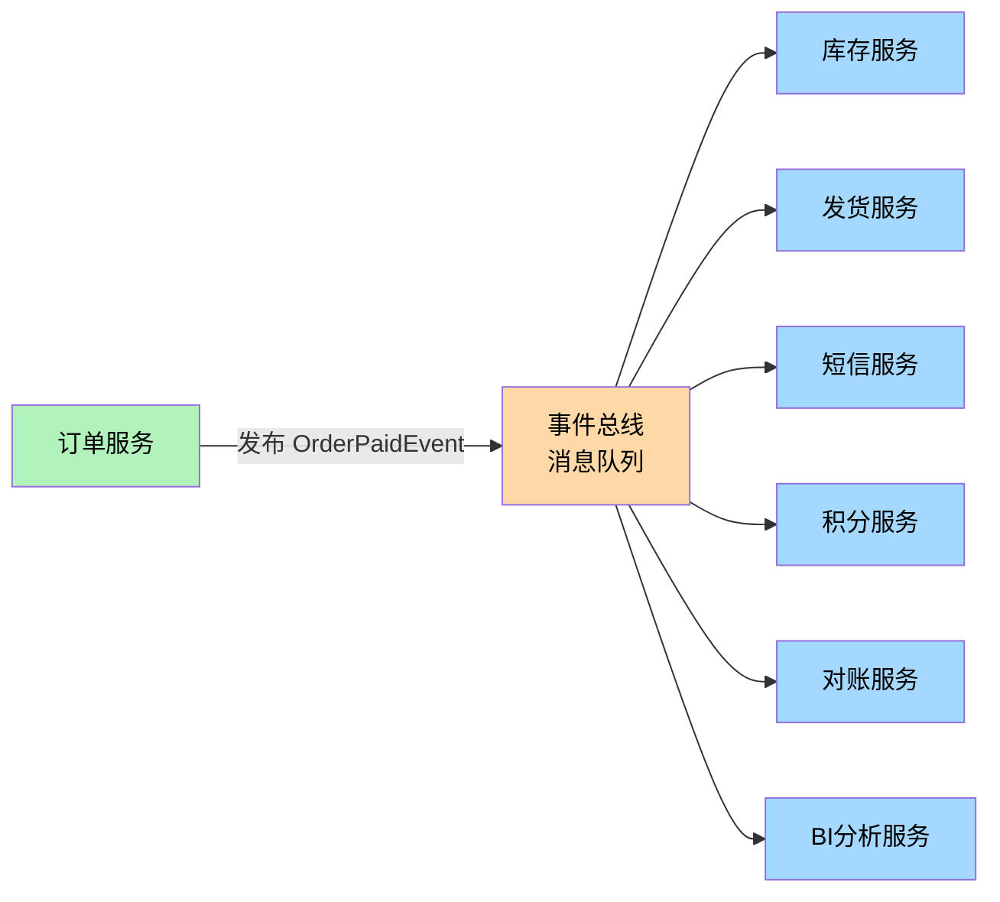
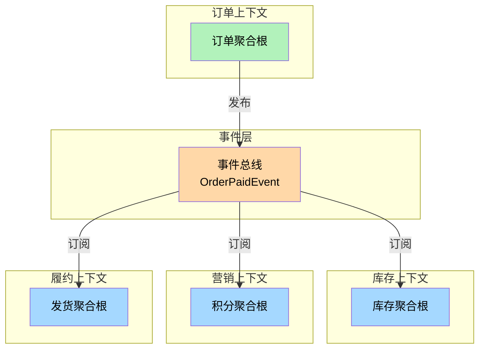
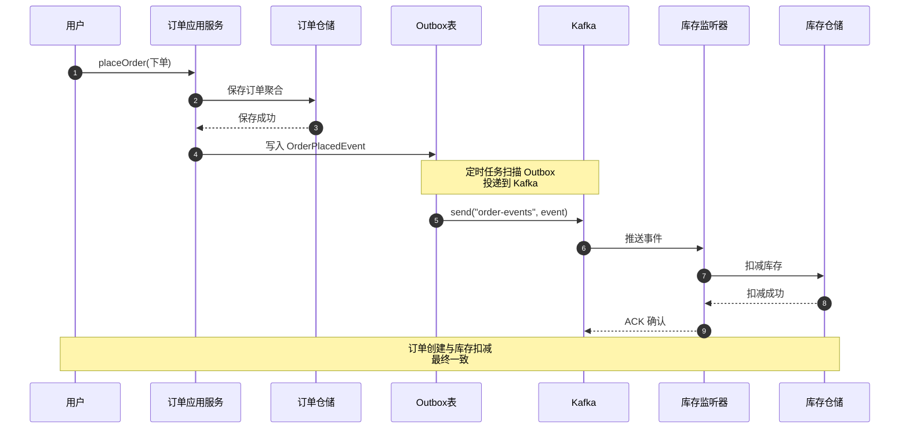
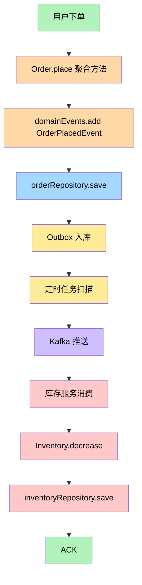
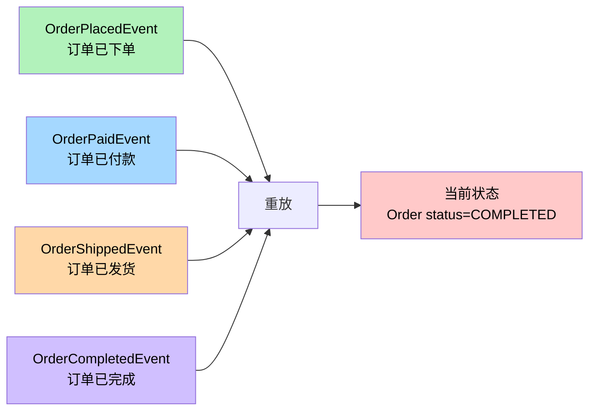

# 第9章 战术设计 - 领域事件（Domain Event）

> "如果一个模型的输出能被识别为其他领域专家所熟知的领域事件，那么这就是一个值得在系统中显式表达的领域事件。"
> —— Eric Evans，《领域驱动设计》

---

## 引子：订单付款成功后，到底发生了什么？

某电商系统的"订单付款"功能刚刚上线。开发同学小张写完代码兴冲冲地提交，PR 评论区里产品经理老王留下了一段话：

> "订单付款成功后，需要触发后续动作：通知仓库发货、扣减库存、给用户发短信、给用户加积分、给运营发对账消息、给 BI 系统推一条数据……后续可能还有更多。"

小张一看需求列表，倒吸一口凉气：直接在 `OrderService.payOrder()` 里挨个调用这些下游方法行不行？

```java
// 反面教材：把下游调用全堆在订单服务里
public void payOrder(Long orderId) {
    Order order = orderRepository.findById(orderId);
    order.markAsPaid();

    // 一堆下游调用全部硬塞进来
    inventoryService.decrease(order);   // 扣库存
    shippingService.createShipment(order); // 通知发货
    smsService.sendPaidNotice(order);   // 发短信
    pointService.addPoints(order);      // 加积分
    accountingService.notify(order);    // 对账
    biService.pushOrderEvent(order);    // BI 推数
    // ...以后还会更多
}
```

**这种写法会在几个月后把团队拖进地狱**：

1. **订单服务被下游绑架**：任何下游（短信、BI、积分）变动都要改订单服务的代码。
2. **耦合越来越重**：短信服务商一宕机，订单付款也跟着失败——明明两件事毫无关系。
3. **新需求疲于应对**：每加一个下游动作都得重新发布订单服务。
4. **事务边界失控**：这么多调用塞进一个事务，要么慢死、要么脏写、要么回滚到怀疑人生。
5. **想追溯"什么动作被谁触发"？日志散落各处，没法重放。**

**怎么办？答案是：把"订单已付款"这件事作为一个事件广播出去**。

订单服务只负责一件事——**"付款成功"这个事实已经发生**。它把这件事变成一个**领域事件**（`OrderPaidEvent`）抛出去，至于谁要监听、谁要处理、谁要通知……订单服务一概不关心。



订单服务只发一次事件，至于**有多少订阅者、谁来订阅、订阅者怎么处理、出错了怎么办**——全部由事件机制负责。这就是**领域事件（Domain Event）**的核心价值。

---

## 9.1 领域事件的定义

### 9.1.1 Eric Evans 的原话

Eric Evans 在《领域驱动设计》中对领域事件有如下描述：

> "领域事件是**领域专家所关心的、已经发生的事情**。当系统中其他部分对一个事件的发生感兴趣时，这些部分会订阅并响应该事件。"

关键词有三个：

1. **领域专家所关心**：必须是业务意义上的事件，而不是技术事件（比如"数据库连接已建立"不是领域事件）。
2. **已经发生的事情**：事件必须是"过去时"——它是对**已发生事实**的陈述，不是"将要发生"也不是"请求"。
3. **其他部分感兴趣**：事件的作用是**通知**，是"我做完了一件事，谁还想知道"。

### 9.1.2 领域事件的 3 大特征

#### 特征一：已发生的事实（Past Fact）

事件描述的是**已经完成的业务动作**，状态不可撤销——你不能让"订单已付款"变成"订单没付款"。

```java
// 正确：描述已发生事实
public class OrderPaidEvent { }   // 订单已付款
public class OrderShippedEvent { } // 订单已发货

// 错误：描述待发生或请求
public class PayOrderRequest { }  // 这是请求，不是事件
public class OrderWillBePaid { }  // 还没有事实发生
```

#### 特征二：不可变（Immutable）

事件一旦发布就**不能修改**。它的字段、它的状态、它代表的事实——全部冻结。

为什么不可变？因为事件会被**多个订阅者消费**，会被**持久化存储**，甚至会被**跨系统重放**。一旦中间有人改了事件内容，所有下游都会"看到不一样的历史"——这是数据灾难。

```java
public class OrderPaidEvent extends DomainEvent {
    private final Long orderId;
    private final BigDecimal paidAmount;
    private final LocalDateTime paidAt;
    // 所有字段都是 final，没有 setter
}
```

#### 特征三：过去时命名（Past Tense）

事件名是**过去时**的动词或动词短语。`OrderPlaced`（订单已下单）、`OrderPaid`（订单已付款）、`OrderShipped`（订单已发货）。

永远不要写成命令式或将来时：`PlaceOrder`、`PayOrder`、`DoShipping`——这些是**命令**（Command），不是事件。

| 错误（命令/将来时） | 正确（过去时事件） |
| --- | --- |
| `PlaceOrder` | `OrderPlaced` |
| `PayOrder` | `OrderPaid` |
| `ShipOrder` | `OrderShipped` |
| `CancelOrder` | `OrderCancelled` |
| `CompleteOrder` | `OrderCompleted` |

**为什么必须过去时？** 因为"事件"本身就在**事后**被发布——它是对已发生动作的记录。这个语法上的细节其实是**业务语义的精确表达**。

---

## 9.2 为什么需要领域事件

### 9.2.1 解决业务协作问题

在复杂的业务系统中，**一个业务动作的完成往往需要其他模块的配合**。比如"订单付款"这个动作——它本身只属于订单上下文，但它的"完成"会牵动库存、发货、营销、BI 等多个上下文。

**领域事件就是为这种"跨边界协作"而生的**：

- 订单上下文**只负责**把"付款成功"这个事实发布出去。
- 其他上下文**自行订阅**这个事件，并决定如何处理。
- 上下文之间**互不依赖、互不知道对方存在**。



### 9.2.2 实现最终一致性

在分布式系统中，**强一致性**（所有操作同时成功或同时失败）成本极高，常常需要分布式事务（2PC、Saga 等），性能和复杂度都难以接受。

**领域事件提供了一种"最终一致性"的思路**：

1. 订单付款这个核心动作在订单库中**立即强一致**地完成。
2. 之后的事件分发**异步进行**，库存、积分等下游**最终**会跟上。
3. 哪怕某个下游暂时宕机，事件也**不会丢失**（消息队列持久化），等下游恢复后继续消费。

这种"**先做核心，再异步协同**"的模式，**放弃了强一致性换来了高可用和可扩展性**——这是绝大多数互联网系统的现实选择。

### 9.2.3 解耦系统

**耦合是软件腐烂的根源**。领域事件是**最优雅的解耦手段**之一。

| 耦合方式 | 特点 | 后果 |
| --- | --- | --- |
| **直接调用**（`orderService.notifyInventory()`） | 订单服务硬编码调用库存服务 | 新增下游要改订单代码；下游挂掉订单挂掉 |
| **观察者模式**（`inventoryService.register(orderService)`） | 上层代码在启动时注册依赖 | 启动顺序敏感，单元测试困难 |
| **事件总线**（`eventBus.publish(OrderPaidEvent)`） | 订单只发事件，不知道订阅者 | 任意新增/删除订阅者，订单代码零改动 |

**领域事件让"调用关系"变成了"订阅关系"**。订单服务与下游是**零感知**的——它不知道也不关心谁会订阅它的事件。

---

## 9.3 领域事件的命名规范

### 9.3.1 必须是过去时

**事件是"对已发生事实的记录"，因此命名必须用过去时**。

```java
// 正确：过去时
OrderPlacedEvent       // 订单已下单
OrderPaidEvent         // 订单已付款
OrderShippedEvent      // 订单已发货
OrderCancelledEvent    // 订单已取消
OrderCompletedEvent    // 订单已完成
PaymentRefundedEvent   // 付款已退款
InventoryLockedEvent   // 库存已锁定
PointsAwardedEvent     // 积分已奖励
```

```java
// 错误：命令式 / 将来时 / 动词原形
PlaceOrderEvent        // "下单"是动作，不是事实
PayOrderEvent          // 同上
DoShipEvent            // 完全错误
OrderPayingEvent       // "正在付款"——这是过程，不是事实
```

**为什么这么严格？** 因为事件名是"业务语义"的精确表达。如果团队里出现 `PayOrderEvent`，产品经理会以为这是一个"发起付款的请求"，而不是"付款已经完成的通知"。

### 9.3.2 名词在前、动词在后

事件名的核心是**业务对象**（名词），业务动作（动词）作为修饰——这个顺序符合自然语言的"主谓"逻辑。

```
[业务对象] + [过去时动词] + Event
```

| 业务对象 | 过去时动词 | 事件名 |
| --- | --- | --- |
| Order | Placed | `OrderPlacedEvent` |
| Order | Paid | `OrderPaidEvent` |
| Payment | Refunded | `PaymentRefundedEvent` |
| Inventory | Locked | `InventoryLockedEvent` |
| Shipment | Delivered | `ShipmentDeliveredEvent` |

**反例**：`PlacedOrderEvent`、`PaidOrderEvent`——主语不清，读起来别扭。

### 9.3.3 用业务语言而非技术语言

事件名应该用**业务团队能听懂的语言**，而不是程序员自造的技术黑话。

| 业务事件（推荐） | 技术事件（不推荐） |
| --- | --- |
| `OrderPaidEvent` | `OrderStatusUpdatedEvent` |
| `PaymentReceivedEvent` | `PaymentTableRowInsertedEvent` |
| `InventoryLockedEvent` | `InventoryCacheInvalidateEvent` |
| `UserRegisteredEvent` | `UserRowInsertedToDBEvent` |

**判别标准**：如果业务专家在日常讨论中不会说"我们刚发生了一次 `OrderStatusUpdatedEvent`"，那就说明这个名字不够业务化。

---

## 9.4 领域事件的结构

一个标准的领域事件应该包含以下字段：

```java
public abstract class DomainEvent {
    private String eventId;          // 事件唯一 ID
    private LocalDateTime occurredOn;// 发生时间
    private String aggregateType;    // 聚合类型
    private String aggregateId;      // 聚合 ID
    private String eventType;        // 事件类型
    private Object payload;          // 业务数据
}
```

### 9.4.1 eventId（事件唯一标识）

每个事件必须**全局唯一**，用于：
- 消费端**去重**（防止重复消费）。
- 链路**追踪**（关联日志、监控、链路 ID）。
- 故障**重放**（按 ID 定位历史事件）。

通常使用 UUID 或雪花算法（Snowflake）生成。

### 9.4.2 occurredOn（发生时间）

事件**真实发生**的业务时间，不是"系统时间"，不是"发布到消息队列的时间"。

- 如果业务上有"延迟发货"逻辑，发货事件的 `occurredOn` 应该是**发货那一刻的业务时间**，而不是订单创建时间。

### 9.4.3 aggregateType 和 aggregateId

记录事件是**哪个聚合**发布的。这是事件溯源（Event Sourcing）的基础——重放事件时需要知道"这个事件属于谁"。

```java
// 订单聚合根发布的事件
aggregateType = "Order"
aggregateId   = "ORDER_20260605_001"
```

### 9.4.4 eventType（事件类型）

事件的**业务类型名**，比如 `OrderPaidEvent`。这一字段可以冗余存储，但**为消息队列的 topic 路由、监控分类提供便利**。

### 9.4.5 payload（业务数据）

事件**携带的业务数据**——下游需要用到的字段。

```java
public class OrderPaidEvent extends DomainEvent {
    private Long orderId;
    private Long userId;
    private BigDecimal paidAmount;
    private String paymentMethod;
    private LocalDateTime paidAt;
}
```

**关键原则：payload 应该只包含"下游真正需要"的字段**。不要把整个聚合对象序列化塞进 payload——那会导致：
- 事件臃肿，传输成本高。
- 敏感字段泄露。
- 聚合结构变更时影响所有下游。

**反模式**：
```java
// 反面教材：把整个聚合塞进事件
public class OrderPaidEvent {
    private Order order;  // 整个订单对象
}
```

**正面示例**：
```java
// 正确：只携带必要信息
public class OrderPaidEvent {
    private Long orderId;
    private BigDecimal paidAmount;
    private String paymentMethod;
    private LocalDateTime paidAt;
}
```

---

## 9.5 领域事件的发布机制

### 9.5.1 应用服务层发布

最简单直接的方式——在应用服务（Application Service）中，调用完聚合根的业务方法后，**手动发布事件**。

```java
@Service
public class OrderApplicationService {
    @Autowired private OrderRepository orderRepository;
    @Autowired private EventPublisher eventPublisher;

    public void payOrder(Long orderId) {
        Order order = orderRepository.findById(orderId);
        order.markAsPaid();
        orderRepository.save(order);

        // 手动发布事件
        eventPublisher.publish(new OrderPaidEvent(order));
    }
}
```

**优点**：简单直观，调用方清楚事件何时被发布。
**缺点**：业务逻辑和事件发布耦合在应用层；多个业务方法都要重复发布代码。

### 9.5.2 聚合根发布（推荐）⭐

**最推荐的做法**：在聚合根的业务方法中，把事件"暂存"到一个内部集合中，由基础设施层在事务提交时统一发布。

```java
public class Order {
    private List<DomainEvent> domainEvents = new ArrayList<>();

    // 业务方法中"记录"事件
    public void markAsPaid() {
        this.status = OrderStatus.PAID;
        this.paidAt = LocalDateTime.now();
        // 把事件暂存到聚合根内部
        this.domainEvents.add(new OrderPaidEvent(this.id, this.amount, ...));
    }

    // 提供给基础设施层调用的"取事件"方法
    public List<DomainEvent> getDomainEvents() {
        return Collections.unmodifiableList(domainEvents);
    }

    public void clearDomainEvents() {
        this.domainEvents.clear();
    }
}
```

应用服务在保存聚合根后，取出事件统一发布：

```java
@Service
public class OrderApplicationService {
    public void payOrder(Long orderId) {
        Order order = orderRepository.findById(orderId);
        order.markAsPaid();
        orderRepository.save(order);

        // 取出并发布聚合根中暂存的事件
        order.getDomainEvents().forEach(eventPublisher::publish);
        order.clearDomainEvents();
    }
}
```

**为什么推荐？** 因为：

1. **业务语义完整**："发布事件"是业务动作的一部分，聚合根作为业务的"主人"应该负责记录。
2. **业务方法更内聚**：`markAsPaid()` 既改状态又"宣告"事实，外部调用者无需重复触发。
3. **避免遗漏**：如果业务方法被多个调用入口调用，事件发布也不会漏。

### 9.5.3 领域服务发布

当事件的产生**依赖于多个聚合或外部服务**时，可以放在领域服务中发布。

```java
@Service
public class TransferDomainService {
    public void transfer(Account from, Account to, Money amount) {
        // 转账涉及两个账户
        from.debit(amount);
        to.credit(amount);

        // 领域服务发布跨聚合事件
        eventPublisher.publish(new MoneyTransferredEvent(from.getId(), to.getId(), amount));
    }
}
```

---

## 9.6 领域事件的存储与分发

领域事件发布出去后，需要**某种机制**把事件传递给订阅者。常见的分发方式有三种。

### 9.6.1 Spring Event（本地同步/异步）

Spring 框架内置的 `ApplicationEventPublisher` 可以在**同一个 JVM 内**发布/订阅事件。

```java
// 发布事件
applicationEventPublisher.publishEvent(new OrderPaidEvent(this));
```

```java
// 订阅事件
@Component
public class OrderPaidListener {
    @EventListener
    public void handle(OrderPaidEvent event) {
        // 处理事件
    }
}
```

**特点**：
- **本地**：只能在同一个 Java 进程内传递。
- **同步/异步可选**：默认同步，`@Async` 可开启异步。
- **解耦程度低**：发布者和订阅者仍在同一进程——适合单体内、模块间的解耦。
- **不持久化**：事件不会被存储——进程重启后丢失。

### 9.6.2 消息队列（Kafka、RabbitMQ）

**生产环境的主流方案**。事件被发布到 Kafka/RabbitMQ 等消息中间件，**跨服务、跨系统、跨语言**传递。

```java
@Component
public class OrderEventPublisher {
    @Autowired private KafkaTemplate<String, String> kafkaTemplate;

    public void publish(OrderPaidEvent event) {
        String json = objectMapper.writeValueAsString(event);
        kafkaTemplate.send("order-events", event.getOrderId().toString(), json);
    }
}
```

**特点**：
- **跨进程、跨服务**：发布者和订阅者可以在不同机器、不同语言实现。
- **持久化**：消息可以持久化存储，重启不丢失。
- **高吞吐**：Kafka 等系统可处理百万级 QPS。
- **可重放**：支持按 offset 重放历史事件。

### 9.6.3 事件总线

抽象的"事件总线"概念可以**屏蔽底层差异**——上层只看到 `EventBus.publish(event)`，底层可以是 Spring Event、可以是 Kafka、可以是 RocketMQ。

```java
public interface EventBus {
    void publish(DomainEvent event);
}
```

```java
@Component
public class KafkaEventBus implements EventBus {
    @Override
    public void publish(DomainEvent event) {
        // 序列化为 JSON，发到 Kafka
    }
}
```

**好处**：业务代码不绑定具体中间件，未来切换 Kafka 到 RocketMQ 不影响业务层。

---

## 9.7 实战：订单领域事件完整设计

下面我们完整地设计一个**订单上下文**的领域事件体系。

### 9.7.1 事件基类

```java
package com.example.order.domain.event;

import java.time.LocalDateTime;
import java.util.UUID;

/**
 * 领域事件基类
 * 所有具体的领域事件都继承自该类
 */
public abstract class DomainEvent {
    /** 事件唯一 ID（用于去重、追踪） */
    private final String eventId;

    /** 事件发生时间（业务时间） */
    private final LocalDateTime occurredOn;

    /** 聚合类型，例如 "Order" */
    private final String aggregateType;

    /** 聚合 ID，例如 "ORDER_001" */
    private final String aggregateId;

    protected DomainEvent(String aggregateType, String aggregateId) {
        this.eventId = UUID.randomUUID().toString();
        this.occurredOn = LocalDateTime.now();
        this.aggregateType = aggregateType;
        this.aggregateId = aggregateId;
    }

    public String getEventId() { return eventId; }
    public LocalDateTime getOccurredOn() { return occurredOn; }
    public String getAggregateType() { return aggregateType; }
    public String getAggregateId() { return aggregateId; }

    /** 子类必须提供事件类型名 */
    public abstract String getEventType();
}
```

### 9.7.2 5 个具体事件

#### 事件 1：订单已下单

```java
package com.example.order.domain.event;

import java.math.BigDecimal;
import java.util.List;

/**
 * 订单已下单事件
 * 触发时机：用户提交订单，订单状态变为"已下单"
 */
public class OrderPlacedEvent extends DomainEvent {
    private final Long orderId;
    private final Long userId;
    private final BigDecimal totalAmount;
    private final List<OrderItemDTO> items;

    public OrderPlacedEvent(Long orderId, Long userId, BigDecimal totalAmount, List<OrderItemDTO> items) {
        super("Order", String.valueOf(orderId));
        this.orderId = orderId;
        this.userId = userId;
        this.totalAmount = totalAmount;
        this.items = items;
    }

    @Override
    public String getEventType() { return "OrderPlaced"; }

    public Long getOrderId() { return orderId; }
    public Long getUserId() { return userId; }
    public BigDecimal getTotalAmount() { return totalAmount; }
    public List<OrderItemDTO> getItems() { return items; }
}
```

#### 事件 2：订单已付款

```java
/**
 * 订单已付款事件
 * 触发时机：支付成功，订单状态变为"已付款"
 */
public class OrderPaidEvent extends DomainEvent {
    private final Long orderId;
    private final Long userId;
    private final BigDecimal paidAmount;
    private final String paymentMethod;
    private final LocalDateTime paidAt;

    public OrderPaidEvent(Long orderId, Long userId, BigDecimal paidAmount,
                          String paymentMethod, LocalDateTime paidAt) {
        super("Order", String.valueOf(orderId));
        this.orderId = orderId;
        this.userId = userId;
        this.paidAmount = paidAmount;
        this.paymentMethod = paymentMethod;
        this.paidAt = paidAt;
    }

    @Override
    public String getEventType() { return "OrderPaid"; }

    public Long getOrderId() { return orderId; }
    public Long getUserId() { return userId; }
    public BigDecimal getPaidAmount() { return paidAmount; }
    public String getPaymentMethod() { return paymentMethod; }
    public LocalDateTime getPaidAt() { return paidAt; }
}
```

#### 事件 3：订单已发货

```java
/**
 * 订单已发货事件
 * 触发时机：仓库出库，物流揽件
 */
public class OrderShippedEvent extends DomainEvent {
    private final Long orderId;
    private final String shipmentId;
    private final String trackingNumber;
    private final String carrier;
    private final LocalDateTime shippedAt;

    public OrderShippedEvent(Long orderId, String shipmentId, String trackingNumber,
                             String carrier, LocalDateTime shippedAt) {
        super("Order", String.valueOf(orderId));
        this.orderId = orderId;
        this.shipmentId = shipmentId;
        this.trackingNumber = trackingNumber;
        this.carrier = carrier;
        this.shippedAt = shippedAt;
    }

    @Override
    public String getEventType() { return "OrderShipped"; }

    public Long getOrderId() { return orderId; }
    public String getShipmentId() { return shipmentId; }
    public String getTrackingNumber() { return trackingNumber; }
    public String getCarrier() { return carrier; }
    public LocalDateTime getShippedAt() { return shippedAt; }
}
```

#### 事件 4：订单已完成

```java
/**
 * 订单已完成事件
 * 触发时机：用户确认收货
 */
public class OrderCompletedEvent extends DomainEvent {
    private final Long orderId;
    private final Long userId;
    private final LocalDateTime completedAt;

    public OrderCompletedEvent(Long orderId, Long userId, LocalDateTime completedAt) {
        super("Order", String.valueOf(orderId));
        this.orderId = orderId;
        this.userId = userId;
        this.completedAt = completedAt;
    }

    @Override
    public String getEventType() { return "OrderCompleted"; }

    public Long getOrderId() { return orderId; }
    public Long getUserId() { return userId; }
    public LocalDateTime getCompletedAt() { return completedAt; }
}
```

#### 事件 5：订单已取消

```java
/**
 * 订单已取消事件
 * 触发时机：用户取消订单 / 超时未支付 / 风控拦截
 */
public class OrderCancelledEvent extends DomainEvent {
    private final Long orderId;
    private final Long userId;
    private final String reason;        // 取消原因
    private final String cancelledBy;   // 取消发起方：USER / SYSTEM / RISK
    private final LocalDateTime cancelledAt;

    public OrderCancelledEvent(Long orderId, Long userId, String reason,
                               String cancelledBy, LocalDateTime cancelledAt) {
        super("Order", String.valueOf(orderId));
        this.orderId = orderId;
        this.userId = userId;
        this.reason = reason;
        this.cancelledBy = cancelledBy;
        this.cancelledAt = cancelledAt;
    }

    @Override
    public String getEventType() { return "OrderCancelled"; }

    public Long getOrderId() { return orderId; }
    public Long getUserId() { return userId; }
    public String getReason() { return reason; }
    public String getCancelledBy() { return cancelledBy; }
    public LocalDateTime getCancelledAt() { return cancelledAt; }
}
```

### 9.7.3 聚合根内发布事件

`Order` 聚合根负责**记录**领域事件。

```java
package com.example.order.domain.aggregate;

import com.example.order.domain.event.*;
import java.util.*;

public class Order {
    private Long id;
    private Long userId;
    private OrderStatus status;
    private BigDecimal totalAmount;
    private LocalDateTime paidAt;
    private LocalDateTime shippedAt;

    /** 暂存本聚合产生的领域事件 */
    private final List<DomainEvent> domainEvents = new ArrayList<>();

    /**
     * 下单：用户提交订单
     */
    public static Order place(Long userId, List<OrderItem> items) {
        Order order = new Order();
        order.id = IdGenerator.next();
        order.userId = userId;
        order.status = OrderStatus.PLACED;
        order.totalAmount = items.stream().map(OrderItem::getSubtotal)
            .reduce(BigDecimal.ZERO, BigDecimal::add);

        // 记录"订单已下单"事件
        order.domainEvents.add(new OrderPlacedEvent(
            order.id, order.userId, order.totalAmount, items));
        return order;
    }

    /**
     * 付款
     */
    public void markAsPaid(BigDecimal paidAmount, String paymentMethod) {
        if (this.status != OrderStatus.PLACED) {
            throw new IllegalStateException("只有已下单的订单才能付款");
        }
        this.status = OrderStatus.PAID;
        this.paidAt = LocalDateTime.now();

        // 记录"订单已付款"事件
        this.domainEvents.add(new OrderPaidEvent(
            this.id, this.userId, paidAmount, paymentMethod, this.paidAt));
    }

    /**
     * 发货
     */
    public void markAsShipped(String shipmentId, String trackingNumber, String carrier) {
        if (this.status != OrderStatus.PAID) {
            throw new IllegalStateException("只有已付款的订单才能发货");
        }
        this.status = OrderStatus.SHIPPED;
        this.shippedAt = LocalDateTime.now();

        // 记录"订单已发货"事件
        this.domainEvents.add(new OrderShippedEvent(
            this.id, shipmentId, trackingNumber, carrier, this.shippedAt));
    }

    /**
     * 取消
     */
    public void cancel(String reason, String cancelledBy) {
        if (this.status == OrderStatus.COMPLETED || this.status == OrderStatus.SHIPPED) {
            throw new IllegalStateException("已发货或已完成的订单不能取消");
        }
        this.status = OrderStatus.CANCELLED;

        // 记录"订单已取消"事件
        this.domainEvents.add(new OrderCancelledEvent(
            this.id, this.userId, reason, cancelledBy, LocalDateTime.now()));
    }

    /** 仓储或应用服务在持久化后调用此方法取出事件 */
    public List<DomainEvent> getDomainEvents() {
        return Collections.unmodifiableList(domainEvents);
    }

    public void clearDomainEvents() {
        this.domainEvents.clear();
    }
}
```

### 9.7.4 应用服务层订阅事件、转发到消息队列

应用服务在**保存聚合根**之后，把聚合根中的事件**转发到消息队列**。

```java
package com.example.order.application;

import com.example.order.domain.aggregate.Order;
import com.example.order.domain.event.DomainEvent;
import com.example.order.domain.repository.OrderRepository;
import org.springframework.beans.factory.annotation.Autowired;
import org.springframework.context.ApplicationEventPublisher;
import org.springframework.stereotype.Service;
import org.springframework.transaction.annotation.Transactional;

@Service
public class OrderApplicationService {

    @Autowired private OrderRepository orderRepository;
    @Autowired private ApplicationEventPublisher springEventPublisher;
    @Autowired private OutboxEventPublisher outboxPublisher;

    /**
     * 付款：先保存聚合根，再发布事件
     */
    @Transactional
    public void payOrder(Long orderId, BigDecimal amount, String method) {
        // 1. 加载聚合根
        Order order = orderRepository.findById(orderId)
            .orElseThrow(() -> new IllegalArgumentException("订单不存在"));

        // 2. 执行业务方法（聚合根内部已记录事件）
        order.markAsPaid(amount, method);

        // 3. 保存聚合根
        orderRepository.save(order);

        // 4. 把事件转发出去：先入库到 outbox 表，再投递到 MQ
        for (DomainEvent event : order.getDomainEvents()) {
            outboxPublisher.publish(event);
        }
        order.clearDomainEvents();
    }
}
```

```java
package com.example.order.application;

import com.example.order.domain.event.DomainEvent;
import org.springframework.beans.factory.annotation.Autowired;
import org.springframework.kafka.core.KafkaTemplate;
import org.springframework.stereotype.Component;

/**
 * Outbox 事件发布器：先把事件写入数据库 outbox 表（与业务同事务），
 * 再由定时任务扫描 outbox 投递到 Kafka
 */
@Component
public class OutboxEventPublisher {

    @Autowired private OutboxRepository outboxRepository;
    @Autowired private KafkaTemplate<String, String> kafkaTemplate;
    @Autowired private ObjectMapper objectMapper;

    public void publish(DomainEvent event) {
        // 1. 持久化到 outbox 表（与业务事务同步）
        OutboxMessage msg = new OutboxMessage();
        msg.setEventId(event.getEventId());
        msg.setTopic("order-events");
        msg.setPayload(objectMapper.writeValueAsString(event));
        msg.setStatus("PENDING");
        outboxRepository.save(msg);
        // 定时任务会扫描 PENDING 状态并投递到 Kafka
    }
}
```

**为什么用 Outbox 模式？** 因为要解决"**业务保存成功 + 事件发布失败**"的**双写一致性问题**。事件先入库（与业务同一个数据库事务），再异步投递到消息队列——保证**事件不会丢**。

---

## 9.8 实战：事件驱动的跨聚合协作（重点）

### 9.8.1 业务场景

> **订单创建成功后，需要扣减库存**。

**传统做法（强耦合）**：

```java
// 订单服务直接调用库存服务
public void placeOrder(Long userId, List<OrderItem> items) {
    Order order = Order.place(userId, items);
    orderRepository.save(order);

    // 反模式：直接调用下游
    inventoryService.decrease(items);  // 订单服务硬编码依赖库存服务
}
```

**问题**：
- 订单服务硬编码依赖库存服务。
- 库存服务挂了，订单创建失败。
- 增加新的"扣减xxx"动作，必须改订单服务。

### 9.8.2 事件驱动的做法

订单服务发布 `OrderPlacedEvent`，库存服务订阅并处理。

#### 步骤 1：订单上下文发布事件

```java
// OrderApplicationService.java（订单上下文）
@Service
public class OrderApplicationService {

    @Autowired private OrderRepository orderRepository;
    @Autowired private OutboxEventPublisher outboxPublisher;

    @Transactional
    public Long placeOrder(PlaceOrderCommand cmd) {
        // 1. 创建订单聚合根
        Order order = Order.place(cmd.getUserId(), cmd.getItems());

        // 2. 保存
        orderRepository.save(order);

        // 3. 转发事件（订单上下文只负责发布，不关心谁订阅）
        order.getDomainEvents().forEach(outboxPublisher::publish);
        order.clearDomainEvents();
        return order.getId();
    }
}
```

#### 步骤 2：库存上下文订阅事件

```java
// InventoryEventListener.java（库存上下文）
@Component
public class InventoryEventListener {

    @Autowired private InventoryRepository inventoryRepository;

    /**
     * 监听订单已下单事件，执行库存扣减
     */
    @KafkaListener(topics = "order-events", groupId = "inventory-service")
    public void onOrderPlaced(OrderPlacedEvent event) {
        log.info("收到订单下单事件: orderId={}, 开始扣减库存", event.getOrderId());

        // 库存上下文独立完成自己的业务
        for (OrderItemDTO item : event.getItems()) {
            Inventory inv = inventoryRepository.findBySkuId(item.getSkuId())
                .orElseThrow(() -> new IllegalArgumentException("SKU 不存在"));
            inv.decrease(item.getQuantity());      // 库存扣减
            inventoryRepository.save(inv);
        }

        log.info("库存扣减完成: orderId={}", event.getOrderId());
    }
}
```

### 9.8.3 时序图



### 9.8.4 完整流程图



**对比收益**：

| 维度 | 直接调用 | 事件驱动 |
| --- | --- | --- |
| 订单服务是否知道库存服务存在 | 知道（硬编码） | 不知道（只发事件） |
| 库存挂掉，订单能否成功 | 失败 | 成功（异步扣减） |
| 增加"营销奖励"动作 | 改订单服务 | 营销服务订阅即可 |
| 一致性 | 强一致 | 最终一致 |

---

## 9.9 事件溯源（Event Sourcing）基础

### 9.9.1 核心思想

**事件溯源**是一种颠覆性的持久化思路：

> **不保存聚合的"当前状态"，而是保存"导致状态变化的所有事件"。** 当需要查询当前状态时，从头重放所有事件。

**传统做法**：每隔一段时间把"当前状态"覆盖式写入数据库（`UPDATE`）。
**事件溯源**：所有状态变化以**事件流**（Event Stream）形式**追加**到事件存储（Event Store），永远不修改、永远不删除。



### 9.9.2 优势

| 优势 | 说明 |
| --- | --- |
| **完整审计** | 任何时刻的状态都能从事件流推导——天然的审计日志 |
| **可重放** | 同一事件流可以重放到任意时间点——便于调试、回滚 |
| **时序回溯** | 能精确知道"谁在什么时间做了什么" |
| **业务洞察** | 事件流是天然的业务数据，可用于 BI 分析、用户行为画像 |
| **多模型** | 同一事件流可重放出不同的"读模型"——同一份数据支持多种查询 |

### 9.9.3 简化的代码示例

#### 事件存储

```java
/**
 * 事件存储（简化版）
 * 实际生产中会用专门的 EventStore（如 EventStoreDB、Axon）
 */
@Repository
public class EventStore {
    @Autowired private JdbcTemplate jdbc;

    /**
     * 追加事件
     */
    @Transactional
    public void append(String aggregateId, List<DomainEvent> events) {
        for (DomainEvent event : events) {
            jdbc.update(
                "INSERT INTO event_store(event_id, aggregate_id, event_type, payload, occurred_on) " +
                "VALUES (?, ?, ?, ?, ?)",
                event.getEventId(), aggregateId, event.getEventType(),
                serialize(event), event.getOccurredOn()
            );
        }
    }

    /**
     * 读取某个聚合的所有事件
     */
    public List<DomainEvent> loadEvents(String aggregateId) {
        return jdbc.query(
            "SELECT * FROM event_store WHERE aggregate_id = ? ORDER BY occurred_on ASC",
            (rs, rowNum) -> deserialize(rs.getString("payload"))
        );
    }
}
```

#### 聚合根（重放事件以恢复状态）

```java
/**
 * 订单聚合根（事件溯源版）
 * 不再有 setter，全部状态变化通过 apply(event) 触发
 */
public class Order {
    private Long id;
    private OrderStatus status;
    private BigDecimal totalAmount;

    /** 应用事件以改变状态 */
    public void apply(DomainEvent event) {
        if (event instanceof OrderPlacedEvent) {
            this.id = ((OrderPlacedEvent) event).getOrderId();
            this.status = OrderStatus.PLACED;
            this.totalAmount = ((OrderPlacedEvent) event).getTotalAmount();
        } else if (event instanceof OrderPaidEvent) {
            this.status = OrderStatus.PAID;
        } else if (event instanceof OrderShippedEvent) {
            this.status = OrderStatus.SHIPPED;
        } else if (event instanceof OrderCompletedEvent) {
            this.status = OrderStatus.COMPLETED;
        }
    }

    /**
     * 从事件流恢复聚合根
     */
    public static Order fromHistory(List<DomainEvent> events) {
        Order order = new Order();
        events.forEach(order::apply);
        return order;
    }
}
```

#### 仓储（用事件流代替"读取"）

```java
@Repository
public class OrderEventSourcedRepository {
    @Autowired private EventStore eventStore;

    /** 加载订单：从事件流重放得到当前状态 */
    public Order findById(Long orderId) {
        List<DomainEvent> events = eventStore.loadEvents(String.valueOf(orderId));
        return Order.fromHistory(events);
    }

    /** 保存订单：把新产生的事件追加到事件流 */
    public void save(Order order) {
        eventStore.append(String.valueOf(order.getId()), order.getDomainEvents());
    }
}
```

### 9.9.4 适用场景

事件溯源虽强大，但**不是所有系统都适用**。它适合：

- 业务对**审计追溯**有强需求（金融、医疗、政务）。
- 业务逻辑**复杂、状态变化频繁**。
- 需要**回放历史**做数据分析。

不适合：

- 简单 CRUD 业务。
- 对查询性能要求极高（每次查询都要重放事件）。
- 团队对 Event Sourcing 缺乏经验。

---

## 9.10 常见反模式

### 9.10.1 事件粒度过细（事件泛滥）

**反模式**：把每个属性的修改都发布成事件。

```java
// 反面教材：粒度过细
order.setStatus(PAID);            // 发布 OrderStatusChangedEvent
order.setPaidAt(...);             // 发布 OrderPaidAtUpdatedEvent
order.setPaymentMethod(...);      // 发布 OrderPaymentMethodChangedEvent
```

**问题**：
- 订阅者被淹没，要监听 N 个事件才能拼出"付款"这个语义。
- 网络开销剧增。
- 业务语义被切割。

**正确做法**：以"业务动作"为粒度，`markAsPaid()` 一次性发布 `OrderPaidEvent`。

### 9.10.2 事件粒度过粗（信息不足）

**反模式**：把"订单发生变化"作为唯一事件，丢失了具体语义。

```java
// 反面教材：粒度过粗
public class OrderChangedEvent {
    private Order order;  // "订单变了"，但不知道变什么
}
```

**问题**：订阅者无法区分"下单"和"付款"——下游要做大量"猜"的工作。

**正确做法**：每个业务动作对应一个具体事件。

### 9.10.3 同步调用消息队列

**反模式**：把消息队列当成"远程调用"，发布事件后**同步阻塞等待响应**。

```java
// 反面教材：同步等消息队列
kafkaTemplate.send(event).get();  // 同步等待发送成功
```

**问题**：
- 失去异步解耦的意义——发布者被消息队列性能绑架。
- 一旦 MQ 抖动，发布者被拖垮。

**正确做法**：发布事件后立即返回，**异常处理交给异步重试**。

### 9.10.4 事件丢失

事件丢失的常见原因：

| 原因 | 后果 | 解决 |
| --- | --- | --- |
| 应用崩溃时事件未持久化 | 事件丢 | 用 **Outbox 模式** |
| 消息队列未开启持久化 | 消息丢 | Kafka 开启 `acks=all`、副本 |
| 订阅者消费失败未重试 | 消息丢 | 死信队列 + 重试机制 |
| 事件未考虑幂等 | 重复消费 | 订阅端做**幂等校验**（按 eventId 去重） |

**核心**：事件发布与业务**必须同事务**（Outbox 模式），订阅端必须**幂等**。

---

## 9.11 事件版本管理

随着业务演进，事件结构会变化——比如 `OrderPaidEvent` 增加了 `couponId` 字段、删除了 `oldField` 字段。**如何兼容新旧版本？**

### 9.11.1 演进原则

1. **只增字段、不改字段**。
2. **删除字段时，先标记 deprecated**（保留 N 个版本后再删）。
3. **修改字段语义时，用新事件类型**（如 `OrderPaidEventV2`）。

### 9.11.2 用事件类型名携带版本

```java
// V1：原始版本
public class OrderPaidEvent extends DomainEvent {
    private Long orderId;
    private BigDecimal paidAmount;
}

// V2：新增 couponId 字段（不是修改）
public class OrderPaidEventV2 extends DomainEvent {
    private Long orderId;
    private BigDecimal paidAmount;
    private String couponId;  // 新增字段
}
```

订阅者**同时监听两个版本**，新版本部署后逐渐淘汰旧版本：

```java
@Component
public class InventoryEventListener {

    @KafkaListener(topics = "order-events")
    public void onEvent(@Payload DomainEvent event) {
        if (event instanceof OrderPaidEvent) {
            // 处理 V1
        } else if (event instanceof OrderPaidEventV2) {
            // 处理 V2
        }
    }
}
```

### 9.11.3 JSON Schema 的兼容性

使用 JSON 序列化时：

- **新增字段**：消费端反序列化时新字段为 `null`，兼容。
- **删除字段**：消费端反序列化时多余字段被忽略，兼容。
- **重命名字段**：不兼容——消费端读不到。

**结论**：JSON 序列化天然支持"**加法兼容**"，但**修改语义**必须用新事件类型。

---

## 9.12 小结

本章我们系统地学习了**领域事件**这一战术设计利器：

1. **领域事件是"对已发生事实的记录"**，具备已发生、不可变、过去时命名三大特征。
2. 它解决**跨聚合、跨上下文、跨系统**的业务协作问题，是实现**最终一致性**的优雅方案。
3. 事件命名应遵循**过去时 + 名词在前 + 业务语言**三原则。
4. 事件应包含 `eventId`、`occurredOn`、`aggregateType`、`aggregateId`、`eventType`、`payload` 等标准字段。
5. 推荐**聚合根内暂存事件 + 应用服务层发布**的模式，配合 **Outbox 模式**保证双写一致性。
6. 实战中用 **Kafka + Outbox** 跨上下文协作是工业界主流方案。
7. **事件溯源**用事件流重放历史状态，适合审计追溯场景。
8. 警惕**事件粒度过细/过粗**、**同步调用 MQ**、**事件丢失**等反模式。
9. 事件版本管理遵循**加法兼容**原则，业务语义变化时用新事件类型。

---

## 9.13 下一章预告

领域事件解决了"**已发生的事情如何通知出去**"的问题，但还有一类问题悬而未决——

> 当我们**想主动发起一个动作**时，比如"用户点击了退款按钮"、"管理员触发了重算任务"——这种"命令"该如何建模？
>
> 命令（Command）模式与领域事件是一对孪生兄弟：事件是"过去时"，命令是"祈使句"；事件是"通知"，命令是"请求"。

下一章我们将进入**第10章：战术设计 - 命令（Command）与应用服务编排**，看看 CQRS 架构、命令处理器、命令总线是如何与领域事件相互配合的。

---

> **本章金句**：
> *领域事件是"已经发生的事情"的精确表达。它让你的系统从"互相调用"走向"互相通知"，从"强耦合"走向"最终一致"。*
