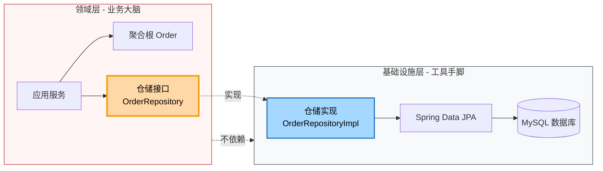
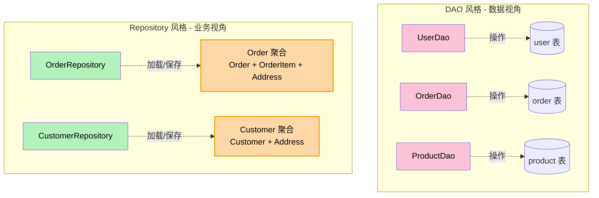
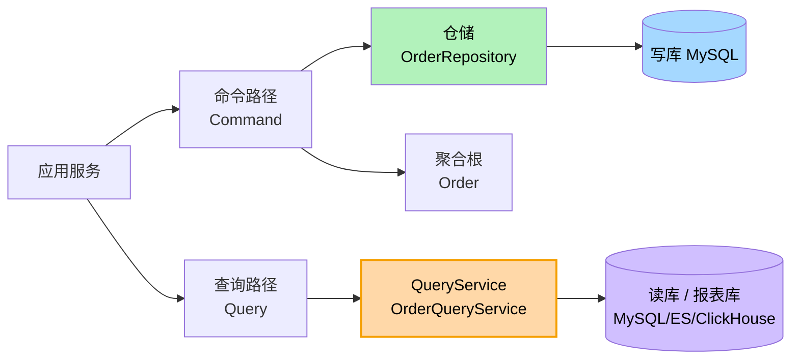
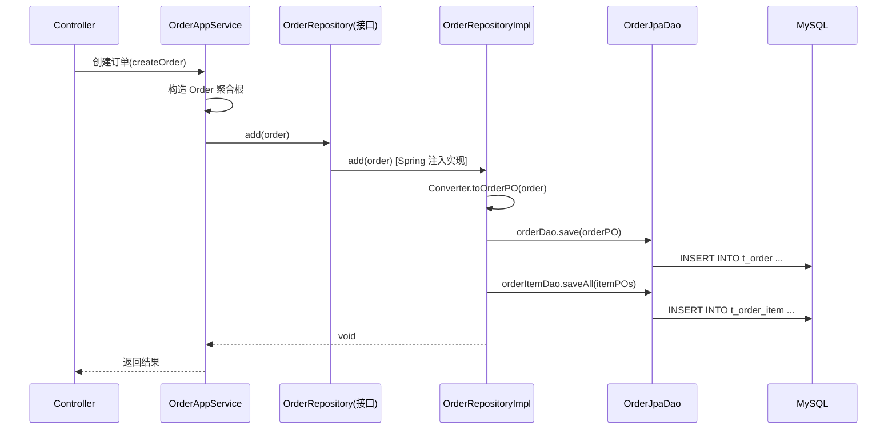

# 第10章 战术设计 - 仓储（Repository）

> "Repository 是一个封装了存储、查询和检索的机制。它为聚合提供了全局的访问点，使得领域代码可以像在内存中一样操作聚合。"
> —— Eric Evans，《领域驱动设计》

---

## 引子：领域层应该"看见"数据库吗？

某团队正在开发"创建订单"功能。开发小王写完领域代码，准备让订单入库，于是产生了下面这段对话：

> **小王（领域层）**："我有一个 `Order` 聚合根，里面有 `OrderItem` 列表和收货地址 `Address`。现在我需要把它存起来。"
>
> **同事（基础设施层）**："你直接 `new MySQLConnection()`，调 `INSERT INTO t_order ...` 不就行了？"
>
> **小王**："可是……我领域层根本不想知道底层是 MySQL 还是 MongoDB 还是 Oracle啊？"
>
> **同事**："那你打算怎么存？"
>
> **小王**："我希望**告诉我一个'能存东西的家伙'，把 Order 交给它就行**——它怎么存、存到哪、用什么技术，是它的事。"

这就是仓储（Repository）要解决的问题。

**领域层只负责"业务动作"：校验规则、扣库存、计算金额、发出领域事件。**至于"怎么持久化、怎么查"，领域层不应该知道。

> **一句话总结**：**领域层只依赖仓储接口（抽象），不依赖数据库（实现）。** 这是依赖倒置原则在 DDD 战术设计中的关键应用。

下面我们就来系统地学习仓储。

---

## 10.1 仓储的定义

### 10.1.1 Eric Evans 的原话

Eric Evans 在《领域驱动设计》中如此定义仓储：

> "REPOSITORY is a mechanism for encapsulating storage, retrieval, and search behavior, which emulates a collection of objects. For each type of object that needs global access, create an object that can provide the illusion of an in-memory collection of objects of that type."

翻译过来：

> **仓储**是一种封装了存储、检索、查询等行为的机制。它**模仿一个聚合根的内存集合**。对于每一种需要全局访问的对象，**创建一个仓储对象**让领域感觉像在操作一个内存中的集合一样访问该类型的所有对象。

### 10.1.2 三个关键词

1. **仿内存集合（emulates a collection）**——领域代码"以为"自己在操作一个 `List<Order>`，不"知道"背后是 MySQL。
2. **全局访问（global access）**——通过聚合根的唯一标识（如订单 ID）找到那个聚合。
3. **每一种聚合根一个仓储（per type of object）**——一个聚合根对应一个仓储接口。

### 10.1.3 通俗理解

> **仓储 = 一位"档案管理员"。**
>
> 你（领域代码）告诉他档案编号，他帮你取出来；你把档案交给他，他帮你归档。你从不需要知道档案室是用铁皮柜还是电子文档系统。

---

## 10.2 仓储的本质

**仓储的本质：在领域与基础设施之间架起一座"桥"，但只让领域看到桥的"接口面"，看不到桥的"实现面"。**



> **关键设计决策**：
> - **接口在领域层**：领域模型定义"我需要什么"，命名贴近业务（`findByCustomerId`）。
> - **实现在基础设施层**：技术细节（SQL、ORM、缓存、分布式锁）都被关在这里。
> - **依赖方向**：领域层 → 基础设施层 ❌，基础设施层 → 领域层 ✅（依赖倒置）。

这正是**依赖倒置原则（DIP）**和**稳定依赖原则（SDP）**的体现：业务核心是稳定的，技术实现是多变的，让多变的去依赖稳定的。

---

## 10.3 仓储的职责

仓储的职责**极其简单**，只需要做三件事：

| 职责 | 对应方法 | 说明 |
| --- | --- | --- |
| 加载聚合 | `findById`、`findAll`、`findByCriteria` | 从存储中取出完整的聚合根 |
| 保存聚合 | `save`（`add` / `update`）、`remove` | 把聚合的变更持久化 |
| 存在性判断 | `existsById`、`count` | 辅助判断（不返回聚合） |

**仓储不承担的职责**（这是非常常见的错误）：

- ❌ **不承担业务规则**：订单的"金额必须为正""状态不能跳跃"——这些是聚合根自己的事。
- ❌ **不管理事务**：事务边界在应用服务层（详见 10.9 节）。
- ❌ **不发送消息**：发送领域事件、调用外部 API 都不归仓储。
- ❌ **不缓存策略决策**：缓存是技术实现，可放在仓储实现内部，但**业务是否要缓存**由调用方决定。
- ❌ **不暴露 POJO 的 getter**：仓储返回的是领域模型，不是数据库表记录。

> **检验标准**：**如果你把仓储的实现（`OrderRepositoryImpl`）整个删掉、换成另一个文件，领域代码一行都不用改**——那你的仓储设计就是合格的。

---

## 10.4 仓储 vs DAO（Data Access Object）—— 重点对比

这是 DDD 学习者最容易混淆的一对概念。

**DAO** 是 Java 经典的"数据访问对象"，由 J2EE 模式提出；**Repository** 是 DDD 提出的"仓储"。它们看起来都"封装了数据访问"，但**抽象的对象、命名风格、关注点完全不同**。

### 10.4.1 一张表看清区别

| 维度 | DAO（Data Access Object） | Repository（仓储） |
| --- | --- | --- |
| **提出者/出处** | Sun J2EE BluePrints | Eric Evans DDD |
| **面向什么** | 面向**数据表** | 面向**聚合根** |
| **方法命名** | `findByName`、`findByAgeGreaterThan`（字段名） | `findByCustomerId`、`findUnpaidOrders`（业务概念） |
| **返回值** | 通常是 PO（Persistent Object，与表 1:1） | 完整的**聚合根**（包括实体、值对象） |
| **是否感知业务** | 否——纯数据视角 | 是——命名上贴近业务语言 |
| **归属层** | 基础设施层（无接口分离） | 接口在领域层，实现在基础设施层 |
| **保存语义** | `insert` / `update` / `save` 三态 | `add`（新增）/ `update`（修改）/ `remove`（删除） |
| **是否参与业务规则** | 否 | 否（与 DAO 一样不参与，但 DDD 中强调这一点） |
| **使用场景** | 传统 CRUD 系统、表驱动开发 | DDD 战术设计、复杂业务 |

### 10.4.2 代码风格对比

```java
// ============ DAO 风格：面向表 ============
public interface UserDao {
    UserPO findById(Long id);              // 返回 PO（与 user 表一一对应）
    List<UserPO> findByName(String name);  // 字段名
    List<UserPO> findByAgeGreaterThan(int age);
    void insert(UserPO user);
    void update(UserPO user);
}

// ============ Repository 风格：面向聚合根 ============
public interface OrderRepository {                       // 注意是聚合根 Order
    Order findById(OrderId orderId);                    // 返回聚合根（含 OrderItem）
    List<Order> findByCustomerId(CustomerId customerId); // 业务命名
    List<Order> findUnpaidOrders();                       // 业务意图
    void add(Order order);                               // add 而非 save
    void update(Order order);
    void remove(Order order);
}
```



> **为什么一定要分清**？
> 在 DDD 中，**业务概念先于数据表**。一个"订单"在业务里是一个聚合（订单+订单项+地址），但在表里可能是 3 张表。如果用 DAO 思维，开发者会按"我先有 user 表、order 表、order_item 表"去建三个 DAO，**业务语义就丢了**。Repository 强制你**先想清楚聚合是什么，再去定义仓储**。

---

## 10.5 仓储的设计原则

### 10.5.1 一个聚合根一个仓储接口

**原则**：**每一种聚合根对应一个仓储接口**。`Order` 聚合有 `OrderRepository`，`Customer` 聚合有 `CustomerRepository`。不允许出现 `OrderItemRepository`——因为 `OrderItem` 不是聚合根。

### 10.5.2 接口定义在领域层，实现在基础设施层

```java
// domain/repository/OrderRepository.java   ← 领域层
public interface OrderRepository {
    Order findById(OrderId orderId);
    void add(Order order);
    void update(Order order);
    void remove(Order order);
}

// infrastructure/persistence/OrderRepositoryImpl.java   ← 基础设施层
@Repository
public class OrderRepositoryImpl implements OrderRepository {
    @Autowired private OrderJpaDao orderDao;       // 这是 JPA 的 Dao
    // ... 实现略
}
```

### 10.5.3 仓储不暴露 `save(entity)`，应该暴露 `add`、`update`、`remove`

**这是与 Spring Data JPA 默认风格最大的差异**。

| 方法 | 语义 |
| --- | --- |
| `add(Order)` | **新建**一个聚合（数据库 INSERT） |
| `update(Order)` | **修改**已存在的聚合（数据库 UPDATE） |
| `remove(Order)` | **删除**一个聚合（数据库 DELETE） |

为什么不用单一的 `save()`？因为 `save()` 让领域代码无法表达意图——调用方不知道这次操作是 INSERT 还是 UPDATE，**业务语义被抹平了**。

### 10.5.4 仓储返回完整聚合（不是部分字段）

仓储 `findById` 返回的必须是**完整的聚合根**（含所有 `OrderItem`、`Address` 等）。如果只返回一个 `OrderPO` 的部分字段（比如不含订单项），那就是**漏了聚合的内部一致性约束**。

**反例**：

```java
// ❌ 错误：返回的是表的部分字段，不是聚合
public OrderDTO findBasicInfoById(OrderId id);
```

**正例**：

```java
// ✅ 正确：返回完整的 Order 聚合根
public Order findById(OrderId id);
```

### 10.5.5 仓储命名贴近业务，不贴近表字段

| 业务语言（推荐） | 表字段语言（不推荐） |
| --- | --- |
| `findByCustomerId(CustomerId)` | `findByUserId(Long)` |
| `findUnpaidOrders()` | `findByStatus(Integer)` |
| `findOrdersInDateRange(LocalDate, LocalDate)` | `findByCreateTimeBetween(Date, Date)` |

---

## 10.6 仓储的方法设计

### 10.6.1 基础 CRUD 方法

```java
public interface OrderRepository {
    // 加载
    Order findById(OrderId orderId);                   // 找不到抛异常
    Optional<Order> tryFindById(OrderId orderId);      // 找不到返回 Optional
    List<Order> findAll();

    // 存在性
    boolean existsById(OrderId orderId);
    long count();

    // 保存
    void add(Order order);
    void update(Order order);
    void remove(Order order);
}
```

### 10.6.2 业务查询方法

```java
public interface OrderRepository {
    // 业务命名（注意不是 findByStatus）
    List<Order> findUnpaidOrders();
    List<Order> findByCustomerId(CustomerId customerId);
    List<Order> findOverdueOrders(int days);
}
```

### 10.6.3 复杂查询怎么办？—— Criteria / Specification

如果查询条件多达七八个、动态组合怎么办？仓储方法会爆炸式膨胀（`findByStatusAndCustomerIdAndCreateTimeBetween...`）。

**方案 1：使用 Criteria 对象**

```java
public interface OrderRepository {
    List<Order> findByCriteria(OrderQueryCriteria criteria);
}

public class OrderQueryCriteria {
    private OrderStatus status;
    private CustomerId customerId;
    private LocalDate startDate;
    private LocalDate endDate;
    private BigDecimal minAmount;
    // ... getter / setter
}
```

**方案 2：使用 Specification 模式**（Spring Data JPA 提供）

```java
public interface OrderRepository extends JpaSpecificationExecutor<Order> {
    // 业务方法 + Specification 组合
}
```

**方案 3（推荐）：复杂查询下沉到 QueryService**——见下一节 10.7。

---

## 10.7 复杂查询的争议：CQRS 引入 QueryService

**争议**：仓储到底该不该包含复杂查询（比如多表 JOIN、分页聚合、统计报表）？

**反方观点**：仓储只做单表 CRUD，复杂查询交给专门的 QueryService。  
**正方观点**：仓储应该能表达所有数据访问需求。

**实战中的主流选择（也是 DDD 推崇的）**：**CQRS 思想 + 引入 QueryService / ReadModel**。



**实战建议**：

| 场景 | 处理方式 |
| --- | --- |
| 按 ID 查单个聚合 | 仓储 `findById` |
| 简单业务查询（如 `findByCustomerId`） | 仓储方法 |
| 多条件动态查询、报表、统计 | **QueryService + ReadModel** |
| 跨聚合的查询（如"查询某客户最近 30 天的订单和退款"） | **QueryService** |

> **一句话**：**仓储管"怎么取回一个完整的聚合"，QueryService 管"怎么高效地取到一个视图"**。两者关注点不同，强行混在一起会破坏仓储的清晰边界。

---

## 10.8 实战：订单仓储完整实现

### 10.8.1 领域模型回顾

```java
// 聚合根
public class Order {
    private OrderId id;                        // 唯一标识
    private CustomerId customerId;
    private OrderStatus status;                // 状态
    private Money totalAmount;                 // 金额
    private List<OrderItem> items;             // 订单项列表
    private Address shippingAddress;           // 收货地址
    private LocalDateTime createTime;
    // ... 业务方法（create、pay、cancel 等）
}

// 实体
public class OrderItem {
    private ProductId productId;
    private int quantity;
    private Money unitPrice;
}

// 值对象：OrderId、CustomerId、Address、Money
```

### 10.8.2 示例 1：领域层仓储接口

```java
package com.example.order.domain.repository;

import com.example.order.domain.model.Order;
import com.example.order.domain.model.OrderId;
import com.example.order.domain.model.CustomerId;
import com.example.order.domain.model.OrderStatus;
import java.util.List;
import java.util.Optional;

/**
 * 订单仓储接口（领域层）
 * <p>
 * 设计要点：
 * 1. 接口定义在领域层，命名贴近业务（findByCustomerId 而非 findByUserId）。
 * 2. 不暴露 save(entity)，而是 add/update/remove，语义更清晰。
 * 3. 返回完整聚合根 Order（含 items、address），不返回 PO 或 DTO。
 * 4. 接口完全无技术细节（不出现 JPA、SQL、Mongo 等字眼）。
 */
public interface OrderRepository {

    /** 根据订单 ID 加载完整订单聚合（含所有订单项、地址） */
    Optional<Order> findById(OrderId orderId);

    /** 加载某客户的所有订单 */
    List<Order> findByCustomerId(CustomerId customerId);

    /** 加载所有未支付订单（业务意图，而非 findByStatus(WAIT_PAY)） */
    List<Order> findUnpaidOrders();

    /** 新建订单（数据库 INSERT） */
    void add(Order order);

    /** 更新订单（数据库 UPDATE） */
    void update(Order order);

    /** 删除订单（一般做逻辑删除） */
    void remove(Order order);
}
```

### 10.8.3 示例 2：基础设施层 MySQL JPA 实现（含 PO 映射）

```java
package com.example.order.infrastructure.persistence;

import com.example.order.domain.model.*;
import com.example.order.domain.repository.OrderRepository;
import org.springframework.beans.factory.annotation.Autowired;
import org.springframework.stereotype.Repository;
import java.util.List;
import java.util.Optional;
import java.util.stream.Collectors;

/**
 * 订单仓储 MySQL 实现（基础设施层）
 * <p>
 * 设计要点：
 * 1. 位于基础设施层，依赖 Spring Data JPA、MySQL。
 * 2. 完全不暴露给领域层——领域层只看到 OrderRepository 接口。
 * 3. 内部完成 Order（领域模型）<-> OrderPO（数据库模型）的转换。
 * 4. 聚合的"全量加载"在此处完成：findByOrderIdWithItems 一次性 JOIN 出所有子表。
 */
@Repository
public class OrderRepositoryImpl implements OrderRepository {

    @Autowired
    private OrderJpaDao orderDao;          // Spring Data JPA 提供的 Dao

    @Autowired
    private OrderItemJpaDao orderItemDao;

    @Autowired
    private OrderConverter converter;      // 领域模型 <-> PO 转换器

    @Override
    public Optional<Order> findById(OrderId orderId) {
        // 1. 查主表
        OrderPO orderPO = orderDao.findById(orderId.getValue())
                .orElse(null);
        if (orderPO == null) return Optional.empty();

        // 2. 查子表（订单项）
        List<OrderItemPO> itemPOs = orderItemDao.findByOrderId(orderId.getValue());

        // 3. PO -> 聚合根
        Order order = converter.toAggregate(orderPO, itemPOs);
        return Optional.of(order);
    }

    @Override
    public List<Order> findByCustomerId(CustomerId customerId) {
        return orderDao.findByCustomerId(customerId.getValue()).stream()
                .map(po -> {
                    List<OrderItemPO> items = orderItemDao.findByOrderId(po.getId());
                    return converter.toAggregate(po, items);
                })
                .collect(Collectors.toList());
    }

    @Override
    public List<Order> findUnpaidOrders() {
        return orderDao.findByStatus(OrderStatus.WAIT_PAY.getCode()).stream()
                .map(po -> {
                    List<OrderItemPO> items = orderItemDao.findByOrderId(po.getId());
                    return converter.toAggregate(po, items);
                })
                .collect(Collectors.toList());
    }

    @Override
    public void add(Order order) {
        // 1. 拆聚合：Order -> OrderPO + List<OrderItemPO>
        OrderPO orderPO = converter.toOrderPO(order);
        List<OrderItemPO> itemPOs = converter.toItemPOs(order);

        // 2. 持久化（事务由应用服务层管理）
        orderDao.save(orderPO);
        orderItemDao.saveAll(itemPOs);
    }

    @Override
    public void update(Order order) {
        // 1. 拆聚合
        OrderPO orderPO = converter.toOrderPO(order);
        List<OrderItemPO> itemPOs = converter.toItemPOs(order);

        // 2. 更新（先删后插是简单做法；更稳妥的是差异化更新）
        orderItemDao.deleteByOrderId(order.getId().getValue());
        orderDao.save(orderPO);
        orderItemDao.saveAll(itemPOs);
    }

    @Override
    public void remove(Order order) {
        orderItemDao.deleteByOrderId(order.getId().getValue());
        orderDao.deleteById(order.getId().getValue());
    }
}
```

**PO 与领域模型（手写 Converter 示例）**：

```java
package com.example.order.infrastructure.persistence;

import com.example.order.domain.model.*;
import org.springframework.stereotype.Component;
import java.util.List;
import java.util.stream.Collectors;

/**
 * 领域模型 <-> PO 转换器
 * <p>
 * 设计要点：
 * 1. 领域模型（Order）关注"业务动作"——它有方法、行为、不变性约束。
 * 2. PO（OrderPO）关注"数据存储"——它有 getter/setter，与表 1:1。
 * 3. 两者通过 Converter 解耦：领域模型可以独立演化（添加业务方法），不会影响数据库结构。
 */
@Component
public class OrderConverter {

    /** PO -> 聚合根（含子实体） */
    public Order toAggregate(OrderPO orderPO, List<OrderItemPO> itemPOs) {
        List<OrderItem> items = itemPOs.stream()
                .map(this::toItemAggregate)
                .collect(Collectors.toList());

        Address address = new Address(
                orderPO.getShippingProvince(),
                orderPO.getShippingCity(),
                orderPO.getShippingDetail());

        Money totalAmount = new Money(orderPO.getTotalAmount());

        return Order.rebuild(
                new OrderId(orderPO.getId()),
                new CustomerId(orderPO.getCustomerId()),
                OrderStatus.of(orderPO.getStatus()),
                totalAmount,
                items,
                address,
                orderPO.getCreateTime());
    }

    /** 聚合根 -> PO（不含子项，子项单独转） */
    public OrderPO toOrderPO(Order order) {
        OrderPO po = new OrderPO();
        po.setId(order.getId().getValue());
        po.setCustomerId(order.getCustomerId().getValue());
        po.setStatus(order.getStatus().getCode());
        po.setTotalAmount(order.getTotalAmount().getAmount());
        po.setShippingProvince(order.getShippingAddress().getProvince());
        po.setShippingCity(order.getShippingAddress().getCity());
        po.setShippingDetail(order.getShippingAddress().getDetail());
        po.setCreateTime(order.getCreateTime());
        return po;
    }

    public List<OrderItemPO> toItemPOs(Order order) {
        return order.getItems().stream().map(item -> {
            OrderItemPO po = new OrderItemPO();
            po.setOrderId(order.getId().getValue());
            po.setProductId(item.getProductId().getValue());
            po.setQuantity(item.getQuantity());
            po.setUnitPrice(item.getUnitPrice().getAmount());
            return po;
        }).collect(Collectors.toList());
    }

    private OrderItem toItemAggregate(OrderItemPO po) {
        return new OrderItem(
                new ProductId(po.getProductId()),
                po.getQuantity(),
                new Money(po.getUnitPrice()));
    }
}
```

**完整调用时序图**：



### 10.8.4 示例 3：仓储的单元测试（使用 Mockito Mock 仓储）

```java
package com.example.order.application;

import com.example.order.application.service.OrderApplicationService;
import com.example.order.domain.model.*;
import com.example.order.domain.repository.OrderRepository;
import org.junit.jupiter.api.BeforeEach;
import org.junit.jupiter.api.Test;
import org.mockito.ArgumentCaptor;
import org.mockito.InjectMocks;
import org.mockito.Mock;
import org.mockito.MockitoAnnotations;

import java.math.BigDecimal;
import java.util.Optional;

import static org.assertj.core.api.Assertions.assertThat;
import static org.mockito.Mockito.*;

/**
 * 应用服务单元测试：Mock 掉仓储，只测"业务编排"逻辑
 * <p>
 * 设计要点：
 * 1. 仓储是"外部依赖"，用 Mockito 模拟；不连真实数据库。
 * 2. 用 ArgumentCaptor 验证传给仓储的对象是否符合预期。
 * 3. 测试聚焦"应用服务如何调用仓储"，不重复测聚合根的业务逻辑。
 */
class OrderApplicationServiceTest {

    @Mock
    private OrderRepository orderRepository;   // Mock 仓储：只测"调用方式"，不测"数据存取"

    @InjectMocks
    private OrderApplicationService orderAppService;

    @BeforeEach
    void setUp() {
        MockitoAnnotations.openMocks(this);
    }

    @Test
    void 创建订单_应调用仓储的add方法并保存完整聚合() {
        // 1. Given：构造命令 + 准备 Mock 行为
        CreateOrderCommand cmd = new CreateOrderCommand(
                new CustomerId(1001L),
                new ProductId(2001L),
                2,
                new Money(new BigDecimal("99.00"))
        );

        // 当调用 findById 时返回空（订单不存在）
        when(orderRepository.findById(any())).thenReturn(Optional.empty());

        // 2. When：执行业务
        OrderId newId = orderAppService.createOrder(cmd);

        // 3. Then：用 ArgumentCaptor 验证传给仓储的对象
        ArgumentCaptor<Order> orderCaptor = ArgumentCaptor.forClass(Order.class);
        verify(orderRepository, times(1)).add(orderCaptor.capture());
        Order savedOrder = orderCaptor.getValue();

        // 验证：保存的是包含完整 items、address 的聚合
        assertThat(savedOrder.getItems()).hasSize(1);
        assertThat(savedOrder.getCustomerId()).isEqualTo(cmd.getCustomerId());
        assertThat(savedOrder.getStatus()).isEqualTo(OrderStatus.WAIT_PAY);
    }

    @Test
    void 取消订单_应先加载聚合再调用update() {
        // 1. Given：仓储返回一个待支付订单
        Order existingOrder = Order.rebuild(
                new OrderId(1L),
                new CustomerId(1001L),
                OrderStatus.WAIT_PAY,
                new Money(new BigDecimal("99.00")),
                java.util.Collections.emptyList(),
                Address.defaultAddress(),
                java.time.LocalDateTime.now()
        );
        when(orderRepository.findById(new OrderId(1L))).thenReturn(Optional.of(existingOrder));

        // 2. When：执行取消
        orderAppService.cancelOrder(new OrderId(1L));

        // 3. Then：验证仓储被调用的顺序
        verify(orderRepository).findById(new OrderId(1L));
        verify(orderRepository).update(any(Order.class));
        verify(orderRepository, never()).add(any(Order.class));
    }
}
```

> **关键技巧**：**仓储的"使用方式"可以测试，"数据存取本身"不应该在单元测试中测**。后者属于集成测试（要连真实数据库或 Testcontainers）。在单元测试中，我们只验证：
> 1. 仓储的什么方法被调用了？
> 2. 调用的次数、顺序是否符合预期？
> 3. 传给仓储的参数（聚合根）是否完整、正确？

---

## 10.9 仓储与事务

**核心原则**：**仓储不管理事务，事务边界在应用服务层。**

为什么？因为事务是"业务用例"的边界。一个业务用例（如"创建订单并扣库存"）可能涉及多个仓储（`OrderRepository`、`InventoryRepository`）。**事务只能由调用方（应用服务）来开，仓储只是被调用的数据访问对象**。

```java
@Service
public class OrderApplicationService {
    @Autowired private OrderRepository orderRepository;
    @Autowired private InventoryRepository inventoryRepository;

    /**
     * 事务边界在应用服务层 —— 仓储不参与事务管理
     * 业务用例 "创建订单" 涉及订单仓储和库存仓储，事务由 @Transactional 统一管理
     */
    @Transactional(rollbackFor = Exception.class)
    public void createOrder(CreateOrderCommand cmd) {
        // 1. 扣库存
        Inventory inv = inventoryRepository.findByProductId(cmd.getProductId());
        inv.deduct(cmd.getQuantity());
        inventoryRepository.update(inv);

        // 2. 创建订单
        Order order = Order.create(cmd);
        orderRepository.add(order);

        // 3. 事务由 @Transactional 统一提交/回滚
    }
}
```

> **为什么仓储不管理事务**？
> 1. **跨仓储事务**：一个业务用例经常涉及多个仓储。仓储如果自己管事务，要么无事务（不一致），要么各管各的（无法保证原子性）。
> 2. **事务粒度不对**：事务的粒度是"业务用例"，不是"单次数据访问"。粒度判断错位，会带来性能问题（事务过长）或一致性 bug（事务过短）。
> 3. **职责单一**：仓储只关心"存取数据"，事务是横切关注点，交给 AOP 或应用服务层更合适。

---

## 10.10 仓储与缓存

**仓储内的缓存实现**：缓存是技术细节，所以"是否缓存"对领域层透明，**领域层只看到 `OrderRepository.findById` 永远能拿到订单**。

```java
@Repository
public class OrderRepositoryImpl implements OrderRepository {
    @Autowired private OrderJpaDao orderDao;
    @Autowired private OrderItemJpaDao orderItemDao;
    @Autowired private RedisTemplate<String, Order> redis;

    @Override
    public Optional<Order> findById(OrderId orderId) {
        String key = "order:" + orderId.getValue();

        // 1. 先查缓存
        Order cached = redis.opsForValue().get(key);
        if (cached != null) return Optional.of(cached);

        // 2. 查数据库
        OrderPO orderPO = orderDao.findById(orderId.getValue()).orElse(null);
        if (orderPO == null) return Optional.empty();

        List<OrderItemPO> itemPOs = orderItemDao.findByOrderId(orderId.getValue());
        Order order = converter.toAggregate(orderPO, itemPOs);

        // 3. 写缓存（设置过期时间防脏数据）
        redis.opsForValue().set(key, order, 30, TimeUnit.MINUTES);
        return Optional.of(order);
    }

    @Override
    public void update(Order order) {
        // ... 更新数据库
        // 缓存一致性：删除缓存（而非更新缓存）
        redis.delete("order:" + order.getId().getValue());
    }
}
```

**缓存一致性三大纪律**：

1. **更新数据库后删缓存**（而非更新缓存）——避免并发写覆盖。
2. **设置合理的过期时间**——防止永远读不到最新值。
3. **读不到缓存时**允许穿透到数据库——用布隆过滤器防穿透。

---

## 10.11 仓储的常见反模式

### 反模式 1：仓储接口过于通用

```java
// ❌ 错误：万能 BaseRepository
public interface BaseRepository<T, ID> {
    T findById(ID id);
    List<T> findAll();
    void add(T entity);
    void update(T entity);
    void remove(T entity);
}

// 任何实体都能用 —— 但这"什么都能存"的接口
// 完全丧失了业务语义
```

**问题**：业务概念被掩盖。`OrderRepository` 应该有 `findByCustomerId`，`CustomerRepository` 应该有 `findByPhoneNumber`——**接口应该反映业务，而非反映"所有实体都需要 CRUD"**。

### 反模式 2：仓储实现泄露技术细节

```java
// ❌ 错误：接口上出现 JPA 注解
public interface OrderRepository extends JpaRepository<OrderPO, Long> { ... }
```

**问题**：领域层被迫依赖 Spring Data JPA 的 `JpaRepository`——**技术细节污染了领域**。要彻底隔离，应该自定义接口，让 Spring 帮你做适配。

### 反模式 3：仓储承担业务规则

```java
// ❌ 错误：仓储里出现业务校验
public void add(Order order) {
    if (order.getTotalAmount().getAmount() < 0) {
        throw new IllegalArgumentException("金额不能为负");
    }
    orderDao.save(po);
}
```

**问题**：业务规则应该在 `Order.create()` 工厂方法或 `addItem()` 行为方法里——**这是聚合根的职责**。仓储只负责"存取"，不该校验"为什么存"。

---

## 10.12 Spring Data JPA 与 DDD 仓储

### 12.1 优势

- 零模板代码：自动实现 `findById`、`findAll`、`save` 等。
- 与 DDD 兼容：可以自定义接口 + `Impl` 类扩展业务方法。

### 12.2 局限性

| 局限 | 说明 |
| --- | --- |
| **`save` 语义不清** | 既是新增又是修改，业务意图模糊 |
| **领域模型不能直接是 `@Entity`** | 字段被 JPA 注解污染；充血模型丧失 |
| **复杂查询仍是 JPQL/原生 SQL** | 跨表 JOIN、统计报表写起来很痛苦 |
| **与 Repository 模式的"仿集合"理念冲突** | Spring Data 返回的是分页、流式结果，**不完全是"内存集合的错觉"** |

### 12.3 实战策略

```java
// 推荐做法：领域层接口 + 基础设施层自定义实现
// 不要直接暴露 JpaRepository 给领域层

// 领域层：自定义接口
public interface OrderRepository {
    Optional<Order> findById(OrderId orderId);
    void add(Order order);
    void update(Order order);
}

// 基础设施层：自定义实现
@Repository
public class OrderRepositoryImpl implements OrderRepository {
    @Autowired private OrderJpaDao dao;   // 内部用 JPA，对外隐藏
    // ... 自定义实现
}
```

> **关键技巧**：让领域层接口**完全无 Spring 依赖**（不继承 `JpaRepository`、不出现 `@Query`），技术实现由基础设施层决定。这样领域层就保持了纯净。

---

## 小结

本章我们系统学习了 DDD 战术设计中的**仓储模式**。让我们回顾核心要点：

| 要点 | 一句话 |
| --- | --- |
| **本质** | 领域层与基础设施层之间的桥，领域层只依赖接口 |
| **接口位置** | **领域层**（贴近业务，无技术细节） |
| **实现位置** | **基础设施层**（依赖倒置） |
| **职责** | 加载/保存聚合，**不**承担业务规则和事务 |
| **方法命名** | 业务语言（`findByCustomerId`）而非字段语言（`findByUserId`） |
| **vs DAO** | 仓储面向**聚合根**，DAO 面向**数据表** |
| **方法风格** | `add` / `update` / `remove`，**不**用万能 `save` |
| **返回类型** | 完整聚合根，**不**返回部分字段的 DTO |
| **复杂查询** | 复杂查询下沉到 **QueryService / ReadModel**（CQRS） |
| **事务** | 仓储不管理事务，事务在**应用服务层** |
| **缓存** | 缓存是技术实现，可放仓储内部（领域层无感） |

> **记住一句话**：**仓储是聚合的"内存错觉"，领域层只看见"集合"，看不见"数据库"。**

---

## 下一章预告

第11章，我们将进入战术设计的另一个重要模式——**应用服务（Application Service）**。

应用服务是**业务用例的编排者**：它不包含业务规则（那是领域层的职责），而是负责：
- 加载聚合（通过仓储）
- 调用领域逻辑（聚合根方法、领域服务）
- 管理事务边界
- 发送领域事件
- 权限校验、日志记录

如果说**聚合根是"做事的人"**，那**应用服务就是"指挥调度的人"**。下一章，我们来系统地看这位"指挥官"是怎么工作的。

---
