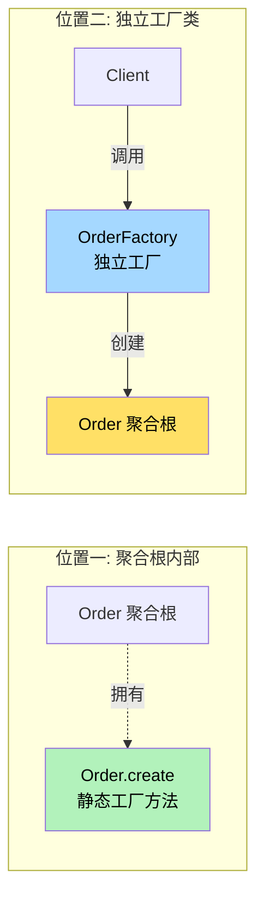
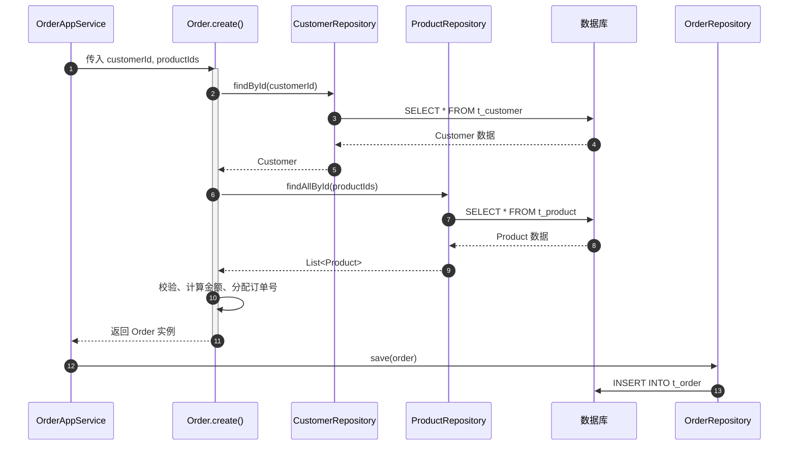

# 第11章 战术设计 - 工厂（Factory）

> "工厂应当被抽象为一种**所需接口的完整实现**，使得客户端无需了解具体实现类就能创建对象。当创建一个聚合的过程很复杂、或者当构造过程暴露了聚合的内部结构时，应当使用工厂。"
> —— Eric Evans，《领域驱动设计》

---

## 引子：一个 `new Order()` 背后的痛苦

某电商团队开发"下单"功能，开发小王写出了这样的代码：

```java
// 糟糕的客户端代码
public class OrderAppService {
    public void createOrder(Long customerId, List<Long> itemIds) {
        // 1. 加载客户
        Customer customer = customerRepository.findById(customerId)
            .orElseThrow(() -> new IllegalArgumentException("客户不存在"));

        // 2. 校验客户状态
        if (!customer.isActive()) {
            throw new BusinessException("客户已禁用");
        }

        // 3. 加载商品
        List<Product> products = productRepository.findAllById(itemIds);
        if (products.size() != itemIds.size()) {
            throw new BusinessException("部分商品不存在");
        }

        // 4. 校验库存
        for (Product p : products) {
            if (p.getStock() <= 0) {
                throw new BusinessException("商品 " + p.getName() + " 无库存");
            }
        }

        // 5. 计算金额（这里又得调优惠券、调促销规则……）
        // 6. 设置初始状态
        // 7. 设置创建时间
        // 8. 分配订单号
        // 9. 最后才 new Order(...)
        Order order = new Order(customer, products, ..., OrderStatus.PENDING);
    }
}
```

**问题出在哪？**

- **应用服务变得臃肿**：下单这件事有 9 步，但只有"加载"和"持久化"是应用服务该干的，中间 7 步都是 `Order` 的"出生"流程。
- **业务知识散落各处**：谁必须存在、状态必须是什么、金额如何算，这些"订单的诞生规则"散在应用服务里，**领域对象自己反倒不知道该怎么被创建**。
- **无法复用**：换另一个入口（比如"导入历史订单"），又得把这一坨逻辑抄一遍。
- **`new` 暴露了 Order 的内部结构**：应用服务得知道 `Order` 构造时需要哪些参数，违反了封装。

**解法是什么？**

把这些"创建 Order 所需的知识"封装起来，交给 Order 自己。这就是 DDD 中的**工厂（Factory）**。

---

## 11.1 工厂的定义

### 11.1.1 Eric Evans 的原话

Eric Evans 在《领域驱动设计》中对工厂的定义：

> "Factory encapsulates the knowledge needed to **create a complex object or aggregate**, and encapsulates it behind an abstract interface so that the client need not know the implementation class of the object it asks to be created."

翻译过来就是：

> **工厂封装了创建复杂对象或聚合所需的知识，并将其封装在一个抽象接口之后**，这样客户端就不需要知道被创建对象的实现类。

### 11.1.2 通俗理解

**工厂 = 对象出生时的"产房 + 护士 + 规则"**。

它解决三个问题：
1. **怎么生**：步骤是什么，先做什么后做什么。
2. **必须满足什么条件**：出生前要校验哪些规则。
3. **谁负责**：把创建逻辑从"调用方"挪到"领域对象自己"或者"专门的工厂"。

---

## 11.2 工厂的本质

工厂的本质可以用一句话概括：

> **将复杂的创建过程从"使用方"剥离，封装到"生产者"内部，让对象的使用与对象的创建解耦。**

它带来三个好处：

| 好处 | 说明 |
|------|------|
| **封装复杂度** | 客户端拿到的是"一个可用的对象"，不是"一堆需要自己装配的零件" |
| **保护不变式** | 对象的初始状态、必填字段、业务规则，由工厂在诞生时一并守住 |
| **隔离内部结构** | 客户端不依赖具体类、不必知道构造时需要哪些参数 |

### 11.2.1 创建与使用的分离

| 关注点 | 客户端负责 | 工厂负责 |
|--------|-----------|---------|
| 知道对象"怎么用" | ✅ | ❌ |
| 知道对象"怎么生" | ❌ | ✅ |
| 调用业务方法 | ✅ | ❌ |
| 校验创建规则 | ❌ | ✅ |
| 加载依赖对象 | ❌ | ✅（可能） |
| 计算初始值 | ❌ | ✅ |

---

## 11.3 何时使用工厂（重点）

工厂不是"必备品"，但有几种"创建"场景强烈建议使用：

### 场景一：聚合的创建涉及多个步骤

> 当 `new` 一个对象需要 5 步以上时，工厂是必备的。

例：创建 Order 要设置订单号、状态、创建时间、加载客户、加载商品、计算金额……

### 场景二：创建过程需要校验业务规则

> **对象不能以"非法状态"出生**。

例：用户注册时邮箱不能重复、密码强度必须达标；订单创建时客户必须存在、商品必须有库存。

### 场景三：创建过程需要调用仓储加载其他对象

> 工厂"知道"如何从仓储拿到依赖。

例：创建订单时需要通过 `CustomerRepository` 加载客户、通过 `ProductRepository` 加载商品。

### 场景四：客户端不应该知道对象的内部结构

> **对象的具体类、内部字段，应当对客户端隐藏**。

例：客户端只调 `Order.create(...)`，不需要知道 `Order` 内部有哪些字段、有没有 `OrderItem` 子表。

### 总结判断

| 场景 | 是否需要工厂 |
|------|------------|
| 简单的 `new User("zhangsan")` | ❌ 不需要 |
| 需要校验 + 加载 + 计算的多步创建 | ✅ **必须** |
| 创建过程可能产生多种子类 | ✅ 强烈建议 |
| 客户端想不依赖具体类 | ✅ 建议 |

---

## 11.4 工厂的位置

工厂可以放在两个地方，二者各有适用场景。



### 11.4.1 聚合根的静态工厂方法（**推荐**）

- 工厂方法直接定义在聚合根类上，如 `Order.create(...)`。
- **优点**：紧贴聚合根，调用方一看就知道"是 Order 在创建自己"；语义最强。
- **缺点**：如果构造逻辑非常复杂（比如需要访问多个仓储），会让聚合根类变得臃肿。

### 11.4.2 独立的工厂类（Domain Factory）

- 在领域层单独建一个 `OrderFactory` 类。
- **优点**：构造逻辑可以非常复杂，仓储依赖也方便注入。
- **缺点**：多一个类；如果只是简单创建，反而是过度设计。

> **经验法则**：先尝试静态工厂方法；如果确实复杂到"放不下"，再抽成独立工厂类。

---

## 11.5 静态工厂方法模式

这是**最推荐**的工厂形式。聚合根自己提供一个 `public static` 方法，专门负责创建自身。

### 11.5.1 经典命名

| 场景 | 命名 | 含义 |
|------|------|------|
| 下单 | `Order.create(customerId, items)` | 创建一个新订单 |
| 注册 | `User.register(email, password)` | 注册一个新用户 |
| 充值 | `Account.deposit(money, source)` | 用一个来源生成充值单 |
| 退款 | `Order.refund(reason)` | 从已有订单创建退款单 |
| 复制 | `Order.copyFrom(otherOrder)` | 从另一对象复制 |

### 11.5.2 命名原则

- 用**业务动词**（create、register、open、issue）而不是 `build` / `make`。
- 命名要**能念成一句完整的话**：`Order.create()` 念作"创建订单"。
- 避免用 `of`、`from` 这种过于通用的词，除非确实是从另一个对象"映射"。

### 11.5.3 优势

| 优势 | 说明 |
|------|------|
| **语义清晰** | `Order.create(...)` 比 `new Order(...)` 更能表达"创建一个订单"的业务动作 |
| **自动取名** | 调试时 `Order.create` 的栈帧一目了然，比一堆 `Order.<init>` 强 |
| **控制实例化** | 可以做缓存、做单例、做对象池、做返回子类 |
| **强制走工厂** | 构造方法设为 `private`，逼迫客户端必须走工厂方法 |
| **可读性强** | 参数顺序灵活、不必受构造方法签名限制 |

---

## 11.6 独立工厂类

当创建逻辑异常复杂（比如要协调多个仓储、做多步校验、跨多个聚合组装），把逻辑放在聚合根上会让类迅速膨胀。这时可以**抽出一个独立的 `XxxFactory` 类**。

### 适用场景

- 构造过程要访问 3 个以上仓储
- 构造过程涉及其他聚合的复杂组装
- 同一个聚合有多种创建方式（create、rebuild、import）

### 与静态工厂的关系

- 静态工厂是"嵌入式"，工厂类是"独立式"。
- 独立工厂**通常会调用静态工厂**来完成最终的 `new`，而不是直接 `new`。
- 独立工厂在领域层，但它**不是**实体或值对象，而是一个**无状态的服务**。

---

## 11.6.1 独立工厂类实战：OrderFactory

下面是一个独立的 `OrderFactory` 类的完整实现。它演示了"创建逻辑非常复杂"时，应当如何抽离：

```java
package com.example.ddd.order.domain;

import com.example.ddd.customer.domain.Customer;
import com.example.ddd.customer.domain.CustomerRepository;
import com.example.ddd.product.domain.Product;
import com.example.ddd.product.domain.ProductRepository;
import com.example.ddd.coupon.domain.Coupon;
import com.example.ddd.coupon.domain.CouponRepository;
import com.example.ddd.promotion.domain.PromotionEngine;
import com.example.ddd.common.exception.BusinessException;
import com.example.ddd.common.util.Money;

import java.util.ArrayList;
import java.util.List;

/**
 * 订单独立工厂类（Domain Factory）
 *
 * 适用场景：
 *   - 构造过程要协调 3 个以上仓储（客户、商品、优惠券）
 *   - 构造过程要调用多个领域服务（促销引擎）
 *   - 业务校验复杂（黑名单、地区限购、用户等级……）
 *
 * 与静态工厂方法的关系：
 *   内部最终仍调用 Order.reconstitute(...) 完成实例化，
 *   但 reconstitute() 设为 package-private，只允许本包内调用。
 */
public class OrderFactory {

    private final CustomerRepository customerRepo;
    private final ProductRepository productRepo;
    private final CouponRepository couponRepo;
    private final PromotionEngine promotionEngine;

    // 构造时注入所有依赖（由应用服务在 Spring 容器中装配）
    public OrderFactory(CustomerRepository customerRepo,
                        ProductRepository productRepo,
                        CouponRepository couponRepo,
                        PromotionEngine promotionEngine) {
        this.customerRepo = customerRepo;
        this.productRepo = productRepo;
        this.couponRepo = couponRepo;
        this.promotionEngine = promotionEngine;
    }

    /**
     * 完整创建流程：适用于"正常下单"场景
     * 涉及：客户校验、商品校验、库存校验、优惠券核销、促销计算
     */
    public Order create(Long customerId,
                        List<Long> productIds,
                        String couponCode) {

        // 1. 加载客户 + 校验状态
        Customer customer = customerRepo.findById(customerId)
            .orElseThrow(() -> new BusinessException("客户不存在"));
        if (!customer.isActive()) {
            throw new BusinessException("客户已禁用");
        }
        if (customer.isBlacklisted()) {
            throw new BusinessException("客户在黑名单中");
        }

        // 2. 加载商品 + 校验库存
        List<Product> products = productRepo.findAllById(productIds);
        if (products.size() != productIds.size()) {
            throw new BusinessException("部分商品不存在");
        }
        for (Product p : products) {
            if (p.getStock() <= 0) {
                throw new BusinessException("商品[" + p.getName() + "]已售罄");
            }
            // 地区限购校验
            if (!p.isShippableTo(customer.getAddress())) {
                throw new BusinessException("商品[" + p.getName() + "]不支持配送至该地区");
            }
        }

        // 3. 加载并核销优惠券（可选）
        Coupon coupon = null;
        if (couponCode != null) {
            coupon = couponRepo.findByCode(couponCode)
                .orElseThrow(() -> new BusinessException("优惠券不存在"));
            if (!coupon.isUsableBy(customer)) {
                throw new BusinessException("优惠券不可用");
            }
        }

        // 4. 调用促销引擎计算最终金额
        Money originalTotal = products.stream()
            .map(Product::getPrice)
            .reduce(Money.ZERO, Money::add);
        Money finalAmount = promotionEngine.apply(customer, products, coupon, originalTotal);

        // 5. 组装订单项
        List<OrderItem> items = new ArrayList<>();
        for (Product p : products) {
            items.add(OrderItem.of(p, 1));
        }

        // 6. 委托给聚合根的"内部构造"完成最终实例化
        return Order.reconstitute(customer, items, coupon, finalAmount);
    }

    /**
     * 导入历史订单：从外部系统（ERP、旧库）导入订单
     * 与 create() 不同，绕过了促销/优惠券逻辑
     */
    public Order importFromExternalSystem(String externalOrderId,
                                          Long customerId,
                                          List<OrderItem> items) {
        Customer customer = customerRepo.findById(customerId)
            .orElseThrow(() -> new BusinessException("客户不存在"));

        Money total = items.stream()
            .map(OrderItem::subtotal)
            .reduce(Money.ZERO, Money::add);

        // 导入订单的订单号沿用外部ID
        return Order.reconstituteWithId(externalOrderId, customer, items, total);
    }
}
```

> **设计要点**：
> - `OrderFactory` 内部**不再直接 `new Order`**，而是调用 `Order.reconstitute(...)` 这样的**包内构造方法**。这保证了"只有工厂或聚合自己"能造出 Order。
> - 当 `create()` 逻辑超过 30 行、依赖超过 2 个仓储时，就该考虑抽成独立工厂类了。

---

## 11.7 工厂方法 vs 构造方法

| 维度 | 构造方法 `new Xxx()` | 工厂方法 `Xxx.create()` |
|------|---------------------|------------------------|
| 命名 | 固定为类名 | **可自由命名**，语义化 |
| 返回值 | 无（必须返回自身） | **可以返回子类**、缓存、null |
| 参数顺序 | 必须固定 | 可灵活设计 |
| 业务校验 | 通常不做（一旦失败抛异常） | **可以做完整业务校验** |
| 访问仓储 | 不可以（构造时还没有依赖注入） | **可以**（可注入仓储） |
| 强制走工厂 | 不可控 | 可将构造方法设为 `private` |
| 可读性 | 弱（`new Order(id, c, p, s, t)` 一长串） | 强（`Order.create(c, p)`） |

**结论**：能用工厂方法，就不要直接 `new`。**`new` 是命令式的；工厂是声明式的。**

---

## 11.8 实战：Order 聚合的工厂方法

下面给出一个相对完整的 `Order` 聚合及其 `create` 静态工厂。

### 11.8.1 Order 聚合代码

```java
package com.example.ddd.order.domain;

import com.example.ddd.customer.domain.Customer;
import com.example.ddd.customer.domain.CustomerRepository;
import com.example.ddd.product.domain.Product;
import com.example.ddd.product.domain.ProductRepository;
import com.example.ddd.common.exception.BusinessException;
import com.example.ddd.common.util.Money;
import com.example.ddd.common.util.OrderIdGenerator;

import java.time.LocalDateTime;
import java.util.List;

/**
 * 订单聚合根
 *
 * 工厂方法 create() 负责"生"出一个合法可用的 Order：
 *   1. 入参校验
 *   2. 加载相关聚合（客户、商品）
 *   3. 校验业务规则（客户状态、库存）
 *   4. 计算金额
 *   5. 设置初始状态、订单号、创建时间
 *   6. 返回 Order 实例
 *
 * 构造方法设为 private，强制所有创建走 create()。
 */
public class Order {

    private String orderId;            // 订单号
    private Customer customer;         // 客户
    private List<OrderItem> items;     // 订单项
    private Money totalAmount;         // 订单总金额
    private OrderStatus status;        // 订单状态
    private LocalDateTime createdAt;   // 创建时间

    // 构造方法私有：禁止直接 new
    private Order() {}

    /**
     * 静态工厂方法：创建一个新订单
     *
     * @param customerId     客户ID
     * @param productIds     商品ID列表
     * @param customerRepo   客户仓储（由调用方注入）
     * @param productRepo    商品仓储
     * @return 一个合法的、处于"待支付"状态的 Order
     */
    public static Order create(Long customerId,
                               List<Long> productIds,
                               CustomerRepository customerRepo,
                               ProductRepository productRepo) {

        // ---------- 第 1 步：入参校验 ----------
        if (customerId == null) {
            throw new BusinessException("客户ID不能为空");
        }
        if (productIds == null || productIds.isEmpty()) {
            throw new BusinessException("订单必须包含至少一个商品");
        }
        if (productIds.size() > 20) {
            throw new BusinessException("单笔订单最多 20 个商品");
        }

        // ---------- 第 2 步：加载相关聚合 ----------
        Customer customer = customerRepo.findById(customerId)
            .orElseThrow(() -> new BusinessException("客户不存在: " + customerId));

        List<Product> products = productRepo.findAllById(productIds);
        if (products.size() != productIds.size()) {
            throw new BusinessException("部分商品不存在");
        }

        // ---------- 第 3 步：校验业务规则 ----------
        if (!customer.isActive()) {
            throw new BusinessException("客户已禁用，无法下单");
        }
        for (Product p : products) {
            if (p.getStock() <= 0) {
                throw new BusinessException("商品[" + p.getName() + "]库存不足");
            }
        }

        // ---------- 第 4 步：组装订单项 + 计算金额 ----------
        List<OrderItem> items = products.stream()
            .map(p -> OrderItem.of(p, 1))
            .toList();

        Money total = items.stream()
            .map(OrderItem::subtotal)
            .reduce(Money.ZERO, Money::add);

        // ---------- 第 5 步：分配订单号 + 设置初始状态 ----------
        String orderId = OrderIdGenerator.next();

        // ---------- 第 6 步：创建实例（通过私有构造） ----------
        Order order = new Order();
        order.orderId = orderId;
        order.customer = customer;
        order.items = items;
        order.totalAmount = total;
        order.status = OrderStatus.PENDING_PAYMENT;
        order.createdAt = LocalDateTime.now();
        return order;
    }

    // ---------- 业务方法（仅展示一个） ----------
    public void pay(Money paidAmount) {
        if (this.status != OrderStatus.PENDING_PAYMENT) {
            throw new BusinessException("订单当前状态不可支付");
        }
        if (!paidAmount.equals(this.totalAmount)) {
            throw new BusinessException("支付金额与订单金额不一致");
        }
        this.status = OrderStatus.PAID;
    }

    // ---------- 内部值对象 / 子类 ----------
    public enum OrderStatus { PENDING_PAYMENT, PAID, SHIPPED, CANCELLED }
}
```

### 11.8.2 单元测试

```java
package com.example.ddd.order.domain;

import com.example.ddd.customer.domain.*;
import com.example.ddd.product.domain.*;
import com.example.ddd.common.exception.BusinessException;
import com.example.ddd.common.util.Money;
import org.junit.jupiter.api.BeforeEach;
import org.junit.jupiter.api.Test;

import java.util.List;
import java.util.Optional;

import static org.junit.jupiter.api.Assertions.*;
import static org.mockito.Mockito.*;

/**
 * Order.create() 工厂方法的单元测试
 * 覆盖：正常创建、参数校验、业务规则校验、依赖加载失败
 */
class OrderFactoryTest {

    private CustomerRepository customerRepo;
    private ProductRepository productRepo;

    @BeforeEach
    void setUp() {
        customerRepo = mock(CustomerRepository.class);
        productRepo = mock(ProductRepository.class);
    }

    @Test
    void should_create_order_when_inputs_are_valid() {
        // Given: 一个有效客户 + 三个有库存的商品
        Customer customer = Customer.reconstitute(1L, "张三", true);
        Product p1 = Product.reconstitute(101L, "手机", Money.of(3000), 10);
        Product p2 = Product.reconstitute(102L, "耳机", Money.of(200),  50);
        Product p3 = Product.reconstitute(103L, "保护壳", Money.of(50), 100);

        when(customerRepo.findById(1L)).thenReturn(Optional.of(customer));
        when(productRepo.findAllById(List.of(101L, 102L, 103L)))
            .thenReturn(List.of(p1, p2, p3));

        // When: 调用工厂方法
        Order order = Order.create(1L, List.of(101L, 102L, 103L),
                                   customerRepo, productRepo);

        // Then: 订单属性正确
        assertNotNull(order.getOrderId());
        assertEquals(Order.OrderStatus.PENDING_PAYMENT, order.getStatus());
        assertEquals(Money.of(3250), order.getTotalAmount());
        assertEquals(3, order.getItems().size());
    }

    @Test
    void should_throw_exception_when_customer_not_found() {
        when(customerRepo.findById(999L)).thenReturn(Optional.empty());

        BusinessException ex = assertThrows(BusinessException.class,
            () -> Order.create(999L, List.of(101L), customerRepo, productRepo));
        assertTrue(ex.getMessage().contains("客户不存在"));
    }

    @Test
    void should_throw_exception_when_customer_is_disabled() {
        Customer disabled = Customer.reconstitute(1L, "张三", false);
        when(customerRepo.findById(1L)).thenReturn(Optional.of(disabled));

        assertThrows(BusinessException.class,
            () -> Order.create(1L, List.of(101L), customerRepo, productRepo));
    }

    @Test
    void should_throw_exception_when_product_out_of_stock() {
        Customer customer = Customer.reconstitute(1L, "张三", true);
        Product outOfStock = Product.reconstitute(101L, "手机", Money.of(3000), 0);

        when(customerRepo.findById(1L)).thenReturn(Optional.of(customer));
        when(productRepo.findAllById(List.of(101L)))
            .thenReturn(List.of(outOfStock));

        assertThrows(BusinessException.class,
            () -> Order.create(1L, List.of(101L), customerRepo, productRepo));
    }

    @Test
    void should_throw_exception_when_productIds_is_empty() {
        assertThrows(BusinessException.class,
            () -> Order.create(1L, List.of(), customerRepo, productRepo));
    }
}
```

---

## 11.9 工厂与仓储的协作

工厂和仓储经常被搞混。它们的分工如下：

| 维度 | 工厂 Factory | 仓储 Repository |
|------|-------------|-----------------|
| 职责 | **创建**领域对象 | **持久化/加载**领域对象 |
| 时机 | 对象"出生"时 | 对象"入库"或"出库"时 |
| 输入 | 业务参数（customerId、items） | ID（聚合根标识） |
| 输出 | 一个**内存中的、新生的**领域对象 | 一个**从存储中还原的**领域对象 |
| 是否写库 | **不写库** | **写库**（save）/ 读库（find） |
| 异常 | 业务异常（参数不合法、规则不满足） | 技术异常（DB 挂了） |

### 11.9.1 工厂在创建时加载依赖对象

工厂可以注入仓储**接口**（注意是接口，不是实现），用来在创建时加载其他聚合。但这要小心：**工厂不应直接和数据库交互**。



**关键点**：
- 工厂内部**只做创建**，**不做持久化**。
- 持久化由调用方（应用服务）调用仓储 `save()` 完成。
- 工厂方法**可注入仓储接口**来加载依赖，但仓库的具体实现由应用服务注入。

### 11.9.2 一个常见错误

```java
// 错误：工厂自己持久化
public static Order create(...) {
    Order order = new Order(...);
    orderRepository.save(order);  // 错！工厂不该写库
    return order;
}
```

工厂应保持"无副作用"——除了加载依赖，**不应有"写"的操作**。

---

## 11.10 常见反模式

### 11.10.1 反模式一：工厂膨胀成"上帝类"

> 症状：`OrderFactory` 类有 1000 行，依赖 8 个仓储，能造 5 种不同状态的 Order。

**纠正**：拆！让 `Order.create()` 处理正常下单，让专门的 `OrderFactory.importFromExcel()` 处理导入，**单一职责**。

### 11.10.2 反模式二：工厂承担业务逻辑

> 症状：工厂里出现"取消订单"、"退款"、"发货"等业务动作。

**纠正**：这些是业务方法，应当在聚合根的**实例方法**上（如 `order.cancel()`），而不是工厂里。工厂只负责"出生"。

### 11.10.3 反模式三：工厂暴露创建细节

> 症状：客户端必须传 8 个参数，少一个都不行，参数顺序还得记。

**纠正**：用**语义化的方法签名**（如 `Order.create(customerId, productIds)` 而不是 `Order.create(Long, String, Long, ...)`），或者用**参数对象**。

### 11.10.4 反模式四：所有对象都走工厂

> 症状：连 `Money.of(100)` 这种简单值对象都要写个 `MoneyFactory`。

**纠正**：工厂解决"复杂创建"。`new Money(100)` 不复杂，就直接用静态方法 `Money.of()`。

### 反模式速查表

| 反模式 | 后果 | 正确做法 |
|--------|------|---------|
| 工厂膨胀成上帝类 | 难维护、难测试 | 拆成多个小工厂 |
| 工厂里写业务逻辑 | 业务知识散落 | 业务方法归聚合根 |
| 工厂暴露过多参数 | 难用、易错 | 用参数对象 |
| 工厂做持久化 | 副作用大 | 持久化交给仓储 |
| 简单对象也上工厂 | 过度设计 | 用构造方法或简单静态方法 |

---

## 11.11 工厂与其他模式对比

### 11.11.1 工厂 vs 仓储

| 维度 | 工厂 Factory | 仓储 Repository |
|------|-------------|-----------------|
| 关键词 | **创建** | **持久化** |
| 关心 | "怎么生" | "怎么存、怎么取" |
| 是否访问 DB | 仅**读**（加载依赖） | **读写**都做 |
| 调用方 | 应用服务（创建时） | 应用服务（存/取时） |
| 返回值 | **新生**的对象 | **已存在**的对象 |

> 一句话：**工厂管"出生"，仓储管"户口"**。

### 11.11.2 工厂 vs 领域服务

| 维度 | 工厂 Factory | 领域服务 Domain Service |
|------|-------------|------------------------|
| 关键词 | **创建** | **业务过程** |
| 关心 | "怎么造一个 X" | "X 和 Y 之间如何协作" |
| 是否带状态 | 无状态 | 无状态 |
| 是否操作多个聚合 | 通常只造一个 | 通常**协调多个** |
| 调用时机 | 对象诞生时 | 业务过程执行时 |
| 命名 | `Order.create` | `TransferService.transfer` |

> 一句话：**工厂造"东西"，领域服务做"事情"**。

### 11.11.3 完整对比表

| 模式 | 输入 | 输出 | 状态 | 用途 |
|------|------|------|------|------|
| **工厂** | 业务参数 | **新生的**领域对象 | 无状态 | 复杂对象的创建 |
| **仓储** | ID | **已存在的**领域对象 | 无状态 | 对象的存取 |
| **领域服务** | 多个聚合 | 操作结果 | 无状态 | 跨聚合的业务过程 |
| **聚合根** | 调用 | 修改自身状态 | **有状态** | 业务行为的载体 |

---

## 小结

本章我们系统学习了 DDD 战术设计中的**工厂（Factory）**：

1. **工厂的本质**：把复杂的创建过程从客户端剥离，封装到领域对象内部或独立工厂类。
2. **何时使用**：聚合创建涉及多步、需要校验业务规则、需要加载依赖对象、或客户端不应知道内部结构。
3. **两种实现**：聚合根的静态工厂方法（推荐）、独立的工厂类（复杂场景）。
4. **与仓储协作**：工厂负责"出生"，仓储负责"存取"，**工厂不写库**。
5. **常见反模式**：上帝类、混入业务逻辑、暴露过多参数、对简单对象过度设计。
6. **与其他模式对比**：工厂创建、仓储存取、领域服务协调，三者各司其职。

> 记住一句话：**`new` 是反派的咒语，工厂是英雄的剧本**。能让工厂造的对象，绝不让客户端自己 `new`。

---

## 下一章预告

工厂讲完，我们已经能"造"出一个个合法的领域对象了。但这些对象**怎么被持久化到数据库？怎么从数据库里被取出来？**

下一章，我们就来聊 DDD 战术设计中的"档案管理员"——**仓储（Repository）**。它解决的是"对象与存储之间的解耦"问题，是 DDD 与具体技术（数据库、ORM）之间的桥梁。

> 第12章：战术设计 - 仓储（Repository）
