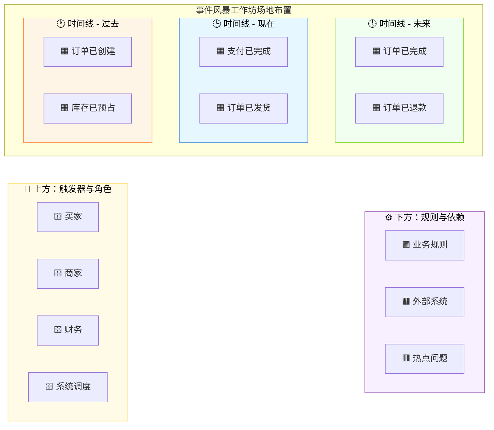
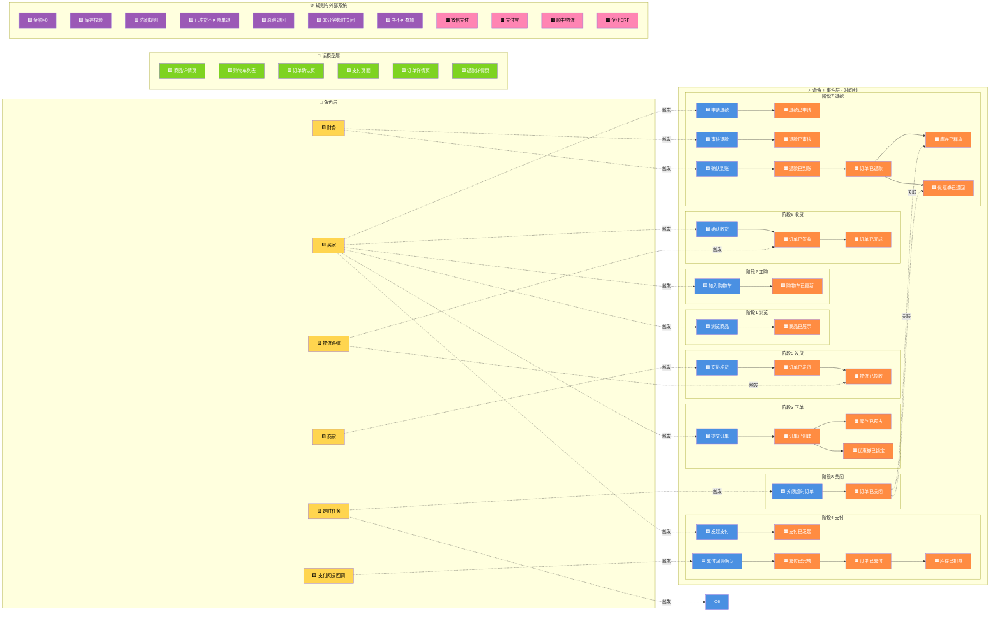
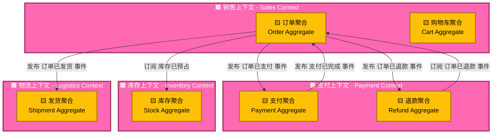
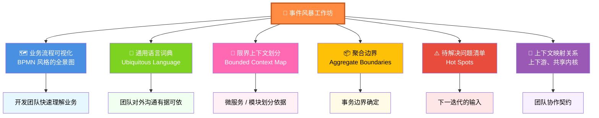

# 第12章 建模方法 - 事件风暴（Event Storming）

## 引子：会议室里的"信息黑洞"

某互联网公司的会议室里，业务专家、产品经理、架构师、开发者正围坐在长桌旁讨论"订单退款"需求。

> **业务专家老张**："用户提交退款申请后，我们要在 24 小时内审核。审核通过的话，钱原路返回；如果用了优惠券，券要退回到用户账户；如果是部分退款，那剩余订单项还要继续发货……"
>
> **产品经理小陈**（奋笔疾书）："等等，我记一下……退款申请、审核、返回金额、退券、继续发货……"
>
> **架构师老刘**："那这笔退款是走原支付渠道还是新开一个退款渠道？"
>
> **老张**："原路退啊。"
>
> **开发者小王**（小声）："那如果原渠道是微信支付、现在已经过了 7 天，还能原路退吗？"
>
> **老张**（皱眉）："这个……要查一下。"
>
> **小王**："退款审核通过后，是同步退款还是异步退款？"
>
> **老张**："应该是异步的……但财务说他们要看到'实际到账'才认为退款完成。所以你可能还得加一个'到账确认'。"
>
> **小陈**："……"（本子上已经画了三页流程图）
>
> **小王**："那如果用户多次提交退款申请呢？防重规则是什么？"
>
> **老张**："啊？这个没想过……"

会议开了 3 个小时，**会后**小陈整理出了 18 页 PRD，小王整理出了 32 条疑问。等到下周一开发评审时，老张又被问出 11 个"没想到"的问题。

这就是**传统需求讨论模式**的典型痛点：
- **信息丢失**：业务专家嘴上说的 30%，会后只剩 50% 被记住、被记录。
- **理解偏差**：每个角色脑子里的"流程"都不一样，没人敢说自己和别人想得一样。
- **隐性知识**：业务专家肚子里的"常识"（如"原路退的渠道限制"）从来没机会说出来。
- **顺序混乱**：文字版的 PRD 让人按"页面"思考，但业务是按"事件"流动的。

有没有一种方法，能让**所有人**在同一面墙上、**同时**、**用同一种语言**把业务流程"画"出来？

**事件风暴（Event Storming）** 就是答案。

---

## 12.1 事件风暴的起源

### 12.1.1 Alberto Brandolini 的灵感

2013 年，意大软件工艺师 **Alberto Brandolini** 在思考一个问题：

> "为什么我做的需求分析总是漏掉关键信息？为什么开发完总被业务说'这不对'？"

他意识到，传统需求分析的"瓶颈"不在分析技术本身，而在于**信息传递方式**：
- 业务专家**用嘴说**，开发者**用耳朵听**，信息在传递中衰减。
- 文字和图形是**静态**的，但业务是**动态**的。
- 会议室里的**权力关系**会压制真正的领域知识（业务专家不敢说、开发不敢问）。

Alberto 借鉴了 **Gamestorming**（一套游戏化会议方法）的思想，提出了一种**全视觉化、动手参与、领域事件驱动**的协作建模方法。他给它起了一个很有冲击力的名字：**Event Storming**——"事件风暴"。

### 12.1.2 为什么叫"风暴"？

"风暴"有两层含义：

1. **思维风暴（Brainstorm）**：像头脑风暴一样，所有人一起倾泻想法。
2. **事件如风暴**：业务流程中的"事件"像风暴一样一波接一波，从过去流向未来。

> "Events are like the wind. You cannot see them, but you can see the effects." —— Alberto Brandolini

事件本身不可见，但**事件留下的痕迹**（事实、状态、通知）我们可以建模。

### 12.1.3 它和 DDD 是什么关系？

事件风暴**不是 DDD 的一部分**，但它和 DDD **天作之合**：

- 事件风暴的产出（**领域事件、命令、聚合、限界上下文**）就是 DDD 战略+战术设计的核心元素。
- 事件风暴的"通用语言"理念，和 DDD 的**Ubiquitous Language**完全一致。
- 事件风暴的"协作"形式，正好弥补了 DDD 实践中最难的环节——**让业务专家真正参与建模**。

Vaughn Vernon 在《Implementing Domain-Driven Design》中专门推荐了事件风暴，作为 DDD 建模的主要工作坊形式。

---

## 12.2 事件风暴的核心思想

### 12.2.1 一句话概括

> **把业务流程当作一连串"已经发生的事实"（领域事件），用彩色便利贴贴满一整面墙。**

### 12.2.2 三个核心原则

**原则一：以领域事件为切入点**

业务专家最容易说的就是"**发生了什么**"——订单已下单、支付已成功、库存已扣减。这些都是**过去式**的事件，描述的是**业务事实**，不是"应该做什么"。

把"事件"作为讨论起点，业务专家几乎没有心理负担，反而能回忆起很多细节。

**原则二：把流程"画"出来，而不是"写"出来**

写文档是单向的、抽象的；画便利贴是**多维的、可触摸的、可移动的**。当业务专家发现便利贴顺序错了，他可以**亲手挪动**它，这比在文档里画箭头有力得多。

**原则三：所有人用同一种语言**

墙上贴的每一个名词、每一个动词，都是**通用语言**的候选词。业务专家看到"订单已创建"会立即点头；看到"OrderCreated"他也能接受——因为他知道这就是"订单已创建"。

### 12.2.3 它和"画流程图"有什么不同？

| 维度 | 传统流程图 | 事件风暴 |
|------|------------|----------|
| 表达单位 | 步骤 / 活动 | **事件**（已发生的事实） |
| 驱动者 | 分析师 | **业务专家** |
| 工具 | Visio / draw.io | **便利贴 + 白板** |
| 范围 | 单一流程 | **多流程并发**（整面墙） |
| 输出 | 流程图 | **领域模型**（含聚合、上下文） |
| 互动性 | 单向输出 | **双向协作** |

---

## 12.3 事件风暴的物料与场地

### 12.3.1 物料：彩色便利贴的"通用约定"

Alberto Brandolini 定义了一套**颜色协议**，不同颜色的便利贴代表不同的领域概念。这套协议后来成为业界事实标准。

```mermaid
graph LR
    subgraph 颜色协议[事件风暴便利贴颜色协议]
        direction TB
        A[🟧 橙色便利贴<br/>领域事件<br/>Domain Event<br/>过去时态、被动语态]
        B[🟦 蓝色便利贴<br/>命令<br/>Command<br/>动宾结构、意图驱动]
        C[🟨 黄色便利贴<br/>角色/参与者<br/>Actor<br/>人或系统角色]
        D[🟩 绿色便利贴<br/>读模型<br/>Read Model<br/>决策所需信息]
        E[🟪 紫色便利贴<br/>策略/不变量<br/>Policy<br/>业务规则]
        F[🟥 红色便利贴<br/>问题<br/>Hot Spot<br/>未决争议点]
        G[🟫 粉红色便利贴<br/>外部系统<br/>External System<br/>第三方依赖]
        H[🟨 大黄便利贴<br/>聚合<br/>Aggregate<br/>一致性边界]
        I[🟫 大粉便利贴<br/>限界上下文<br/>Bounded Context<br/>业务能力边界]
    end

    style A fill:#ff8c42,color:#fff,stroke:#c75b1f,stroke-width:2px
    style B fill:#4a90e2,color:#fff,stroke:#2c5d8f,stroke-width:2px
    style C fill:#ffd54f,color:#000,stroke:#b88800,stroke-width:2px
    style D fill:#7ed321,color:#fff,stroke:#4a7a13,stroke-width:2px
    style E fill:#9b59b6,color:#fff,stroke:#5e3370,stroke-width:2px
    style F fill:#e74c3c,color:#fff,stroke:#a82316,stroke-width:2px
    style G fill:#ff85b3,color:#000,stroke:#b8456e,stroke-width:2px
    style H fill:#ffc107,color:#000,stroke:#a07000,stroke-width:3px
    style I fill:#ff69b4,color:#fff,stroke:#a8366b,stroke-width:3px
```

**详细说明**：

| 颜色 | 名称 | 命名规则 | 含义 |
|------|------|----------|------|
| 橙色 | 领域事件（Domain Event） | 过去时、被动语态 | "订单已创建"、"支付已完成" |
| 蓝色 | 命令（Command） | 动宾结构、意图 | "创建订单"、"发起退款" |
| 黄色（小人） | 角色/参与者（Actor） | 业务术语 | "买家"、"商家"、"支付系统" |
| 绿色 | 读模型（Read Model） | 名词短语 | "商品详情"、"账户余额" |
| 紫色 | 策略/不变量（Policy） | 完整规则描述 | "金额 > 0 才允许下单" |
| 红色 | 问题（Hot Spot） | 简短的疑问 | "跨渠道退款规则？未确认" |
| 粉红色 | 外部系统（External System） | 系统名 | "微信支付"、"物流系统" |
| 黄色大号 | 聚合（Aggregate） | 聚合名 | 圈出命令+事件的边界 |
| 粉色大号 | 限界上下文（Bounded Context） | 上下文名 | 圈出多个聚合 |

### 12.3.2 场地：大白板或一面长墙

事件风暴需要**足够大**的物理空间，让所有事件可以**横向铺开**。

**场地要点**：
- **宽度**：建议至少 **5 米**，才能放下 30+ 个事件。
- **高度**：贴到 **1.5 米**左右，方便业务专家站着贴。
- **地面**：贴纸容易掉，**白板**或**大白纸**做底最佳。
- **流动性**：墙上不要放桌子，让人能**走到墙边**贴便利贴。

### 12.3.3 必备工具清单

- 橙色便利贴（1 沓，300 张）
- 蓝色便利贴（1 沓，200 张）
- 黄色便利贴（小人型 100 张，普通 100 张）
- 绿色、紫色、粉红色、红色便利贴（各 1 沓）
- 粗马克笔（**黑、蓝、红**三色，每人一支）
- 大号白板纸或长条白板
- 蓝色纸胶带（划分时间线）
- 相机（拍最终成果）

---

## 12.4 事件风暴的角色

事件风暴是一种**高度协作**的工作坊，角色配置至关重要。

### 12.4.1 主持人（Facilitator）——核心灵魂

**职责**：
- **引导话题**：用"然后呢？""谁触发的？""如果……会怎样？"等问题把业务专家的话引出来。
- **维持节奏**：控制时间、避免偏题、确保所有参与者发声。
- **记录疑问**：业务专家说"这个我得回去查"时，立即贴一张**红色便利贴**。
- **守护规则**：发现有人用技术术语（如"调用 API"）时，立即要求翻译成业务语言。

**素质要求**：
- **业务懂 30%**：能听懂业务专家的描述。
- **技术懂 50%**：能识别哪些事件、命令、聚合可以提取。
- **引导能力强**：比技术能力更重要。

> 主持人是**"翻译"**——把业务语言翻译成建模语言，把开发语言翻译成业务语言。

### 12.4.2 业务专家（Domain Expert）——知识源

**理想画像**：
- 在该业务领域工作 **3 年以上**。
- 既有**实操经验**（能说出"如果遇到 XX 情况"），又有**流程视角**（能说出"完整流程是"）。
- 表达能力清晰，**敢于说出"我不知道"**。

**注意**：
- 业务专家**不是产品经理**！产品经理是需求的"整合者"，业务专家是**业务的"原住民"**。
- 1 个工作坊中，业务专家 **1-2 人**足够，多了反而会相互干扰。

### 12.4.3 开发人员（Developer）

**职责**：
- **提技术问题**：例如"这个事件是同步还是异步？""数据量多大？"
- **把事件拆细**：业务专家说"订单完成了"，开发者要问"完成包含哪几步？"
- **识别聚合**：根据命令和事件的关系，圈出聚合边界。

### 12.4.4 测试人员（QA）

**职责**：
- **发现边界**：问"如果没有 XX 数据会怎样？""如果同时来两个请求会怎样？"
- **质疑规则**：紫色便利贴（业务规则）必须能转成测试用例。

### 12.4.5 设计师 / UX

**可选角色**。职责是关注**用户视角**：哪些事件会触发 UI 变化？哪些命令需要用户操作？

### 12.4.6 理想人数与比例

| 角色 | 人数 | 说明 |
|------|------|------|
| 主持人 | 1 | **必须独立** |
| 业务专家 | 1-2 | 多了会相互打断 |
| 开发 | 3-5 | 覆盖不同模块 |
| 测试 | 1-2 | 强边界意识 |
| 产品 / UX | 0-2 | 可选 |
| **合计** | **6-12 人** | 超过 12 人建议拆分会场 |

---

## 12.5 事件风暴的步骤（核心）

事件风暴**没有强制的标准流程**，但 Alberto 推荐的"9 步法"是社区最广泛使用的。

### Step 1：发现领域事件（橙色便利贴）

**目标**：让业务专家"讲故事"，把所有"已经发生的事情"用橙色便利贴贴出来。

**引导语**（主持人对业务专家说）：
> "请您像讲故事一样，从头到尾把整个流程讲一遍。每当说'XX 已经发生了'，我就帮您贴一张橙色的便利贴。"

**操作要点**：
- **命名规范**：必须是**过去时**、**被动语态**。
  - 正确：`订单已创建`、`支付已完成`、`库存已扣减`
  - 错误：`创建订单`、`支付`、`扣库存`（这些是"动作"，不是"事件"）
- **粒度适中**：1 个业务步骤 ≈ 1 个事件。
  - 太粗：`订单处理完成`（信息丢失）
  - 太细：`用户已点击提交按钮`（太接近 UI）
- **贴法**：从左到右**横向铺开**，相邻事件间距 5-10cm。
- **允许重排**：业务专家觉得顺序不对时，**鼓励他/她亲手挪动**便利贴。

**反模式**：
- 业务专家说"我们要开发一个下单功能"——这是**需求**，不是事件，要引导成"用户提交订单后会**发生什么**"。
- 把"调用 XX API"贴上去——这是实现，不是事件。

**产出**：一长条橙色便利贴，构成业务的"骨架"。

---

### Step 2：补充命令（蓝色便利贴）

**核心原则**：**每个领域事件前一定有触发它的命令。**

**引导语**：
> "现在我拿一张蓝色的便利贴，放在橙色事件**前面**。它代表的是**谁让这个事件发生的**。"

**操作要点**：
- 蓝色便利贴用**动词起头**：`创建订单`、`发起支付`、`确认收货`。
- 贴在橙色便利贴的**左侧 3-5cm**。
- 可以一个命令触发多个事件；可以多个命令触发一个事件（合并）。
- 业务专家说"系统自动做的"时——那也有命令！自动调度器、定时任务都是**"系统"角色**触发的。

**反模式**：
- 把命令和事件命名得**几乎一样**：
  - 错误：命令 = "订单已创建"，事件 = "订单已创建"（这是同一个东西的两份）
  - 正确：命令 = "提交订单"，事件 = "订单已创建"（一个是意图，一个是结果）
- 命令来自**系统内部**（如"校验用户"）——这不是业务命令，是**前置条件**或**读模型**。

**产出**：在橙色骨架的左侧，添加了蓝色命令。

---

### Step 3：识别角色/参与者（黄色便利贴）

**核心问题**：**这些命令是谁发起的？**

**引导语**：
> "这个命令是谁发出的？是用户？商家？系统自动？"

**操作要点**：
- 黄色便利贴画一个**小人**，旁边写角色名。
- 贴在对应蓝色命令的**上方**。
- 角色用**业务语言**：`买家`、`商家`、`运营`、`财务`、`系统调度器`。
- **不要**用"管理员"、"普通用户"这种系统术语。

**典型角色**：
- **人类角色**：买家、商家、客服、运营
- **系统角色**：定时任务、消息消费者、支付回调

**反模式**：
- 角色泛滥：每来一个用户就贴一个角色。角色是**稳定的、有业务含义的**人群划分。

**产出**：每个蓝色命令上方都有一个小黄人。

---

### Step 4：识别读模型（绿色便利贴）

**核心问题**：**做这个决定（执行命令）时，需要看到什么信息？**

**引导语**：
> "当买家点'提交订单'时，TA 屏幕上看到了什么？订单金额？库存数？优惠券？这些就是'读模型'。"

**操作要点**：
- 绿色便利贴贴在**蓝色命令和橙色事件之间**。
- 命名要**反映数据形态**：`商品详情`、`账户余额`、`购物车列表`、`优惠券列表`。
- 读模型是**只读的快照**，不是实时计算的结果。

**重要概念**：
- 读模型 = UI 看到的东西 = 决策依据
- 它**不是**领域模型（实体/聚合），而是一种"为查询优化的视图"

**反模式**：
- 把读模型命名为"订单聚合"——这是建模语言，不是读模型。
- 把读模型命名为"订单的所有信息"——粒度太粗，应该拆成"收货地址"、"支付方式"、"商品清单"等。

**产出**：在命令和事件之间，铺上绿色的"数据快照"。

---

### Step 5：识别策略/不变量（紫色便利贴）

**核心问题**：**有哪些铁打的规则必须遵守？**

**引导语**：
> "这个流程里有没有'无论发生什么，都必须'的规则？比如'库存不足就不允许下单'？"

**操作要点**：
- 紫色便利贴贴在**对应的命令或事件附近**。
- 描述要**完整、可执行**：`订单金额必须 > 0`、`同一用户 5 分钟内最多提交 3 笔订单`、`优惠券只能用于本品类商品`。
- 紫色便利贴 = **业务规则** = **可转测试用例**。

**反模式**：
- 写成"系统设计"：`使用 Redis 锁防重`——这是实现，不是规则。
- 写成"模糊描述"：`订单要合理`——不可验证。

**产出**：墙上散布着紫色便利贴，每个都是"铁律"。

---

### Step 6：识别外部系统（粉红色便利贴）

**核心问题**：**哪些步骤依赖第三方？**

**引导语**：
> "支付这一步，是不是要调微信支付？发货是不是要调物流系统？"

**操作要点**：
- 粉红色便利贴贴在**对应的命令或事件旁边**。
- 命名要**指明具体的外部系统**：`微信支付`、`顺丰物流`、`支付宝`、`企业 ERP`。
- 外部系统**是边界**：墙内是我们的系统，墙外是别人家的。

**反模式**：
- 把内部微服务也贴成外部系统——这要看团队边界。如果团队拥有那个服务，它就是**内部**模块。
- 把"数据库"贴成外部系统——数据库是基础设施，不是业务外部系统。

**产出**：墙上出现几个粉红色的"第三方图标"。

---

### Step 7：识别问题（红色便利贴）

**核心问题**：**有什么没想清楚的？**

**操作要点**：
- 红色便利贴贴在**存疑的位置**。
- 命名要**简短且具体**：`跨渠道退款规则？`、`优惠券是否可叠加？`、`并发库存如何扣减？`
- 红色便利贴是**TODO**，工作坊结束后要逐一跟进。

**关键原则**：
- 红色便利贴**不可耻**！它代表"我承认这里有坑"，比假装清楚要强 100 倍。
- 主持人要**主动问**："这里有没有什么您需要回去确认的？"业务专家会心一笑，贴上一堆红色便利贴。

**产出**：墙上散布着红色便利贴，构成"待解决问题清单"。

---

### Step 8：识别聚合（黄色大便利贴）

**目标**：把**命令和事件按一致性边界**分组。

**引导语**：
> "现在我们把所有蓝色和橙色便利贴分成几组，每一组内的事件必须**同时成功或同时失败**。"

**操作要点**：
- 黄色大便利贴**圈出**一组命令+事件。
- 圈出的整体就是**一个聚合**。
- 圈的时候问两个问题：
  1. **"如果 X 失败，Y 也必须回滚吗？"** —— 是 → 同一聚合。
  2. **"X 和 Y 会同时被修改吗？"** —— 是 → 同一聚合。

**典型分组示例**：
- 订单聚合：`创建订单`、`订单已创建` `订单已取消`、`订单已取消`
- 支付聚合：`发起支付`、`支付已发起` `支付已完成`、`支付已完成`
- 库存聚合：`扣减库存`、`库存已扣减` `释放库存`、`库存已释放`

**反模式**：
- 圈得太大：把"订单 + 支付 + 库存"全圈在一起——这就是大名鼎鼎的"上帝聚合"，**坚决禁止**。
- 圈得太小：每个事件一个聚合——失去了聚合的意义。

**产出**：墙上出现几个大黄色便利贴，每个圈着一组命令+事件。

---

### Step 9：识别限界上下文（粉色大便利贴）

**目标**：按**业务能力**把多个聚合**装进**一个上下文。

**引导语**：
> "现在我们看这些聚合，哪些聚合说的是同一门'业务方言'？它们应该在一个限界上下文里。"

**操作要点**：
- 粉色大便利贴**圈出**一组聚合。
- 圈的时候问：
  1. **"这些聚合用同一套术语吗？"** —— 是 → 同一上下文。
  2. **"这些聚合由同一个团队维护吗？"** —— 是 → 同一上下文。
  3. **"修改这些聚合是同一个发布节奏吗？"** —— 是 → 同一上下文。

**典型上下文划分**：
- **销售上下文**：`订单聚合`、`购物车聚合`
- **支付上下文**：`支付聚合`、`退款聚合`
- **库存上下文**：`库存聚合`、`仓储聚合`
- **物流上下文**：`发货聚合`、`配送聚合`

**反模式**：
- 按"技术分层"划分：`Service 层`、`Repository 层`——这不是限界上下文。
- 一个系统就一个限界上下文——大概率是**单体思维**。

**产出**：墙上最终被分成了几个"大粉色圈"，每个圈里有几个"大黄色圈"。

---

## 12.6 实战：电商订单系统事件风暴

### 12.6.1 业务背景

> 某电商平台，包含**商品浏览、下单、支付、发货、收货、退款**全流程。
> 团队想知道：完整的领域事件流是什么样的？应该划分几个聚合和限界上下文？

### 12.6.2 完整便利贴清单

下面是这场工作坊墙上的**所有便利贴**（已合并精简）：

| 类型 | 颜色 | 编号 | 内容 | 备注 |
|------|------|------|------|------|
| 角色 | 黄色 | A1 | 买家 | 终端用户 |
| 角色 | 黄色 | A2 | 商家 | 卖家 |
| 角色 | 黄色 | A3 | 财务 | 内部人员 |
| 角色 | 黄色 | A4 | 仓储系统 | 内部角色（自动） |
| 角色 | 黄色 | A5 | 支付网关回调 | 外部回调 |
| 角色 | 黄色 | A6 | 物流系统 | 外部系统 |
| 命令 | 蓝色 | C1 | 浏览商品 | 买家发起 |
| 命令 | 蓝色 | C2 | 加入购物车 | 买家发起 |
| 命令 | 蓝色 | C3 | 提交订单 | 买家发起 |
| 命令 | 蓝色 | C4 | 发起支付 | 买家发起 |
| 命令 | 蓝色 | C5 | 支付回调确认 | 支付网关发起 |
| 命令 | 蓝色 | C6 | 扣减库存 | 系统自动 |
| 命令 | 蓝色 | C7 | 安排发货 | 商家发起 |
| 命令 | 蓝色 | C8 | 确认收货 | 买家发起 |
| 命令 | 蓝色 | C9 | 申请退款 | 买家发起 |
| 命令 | 蓝色 | C10 | 审核退款 | 财务发起 |
| 命令 | 蓝色 | C11 | 确认退款到账 | 财务发起 |
| 命令 | 蓝色 | C12 | 关闭超时订单 | 定时任务 |
| 领域事件 | 橙色 | E1 | 商品已展示 | 浏览结果 |
| 领域事件 | 橙色 | E2 | 购物车已更新 | 加入购物车结果 |
| 领域事件 | 橙色 | E3 | 订单已创建 | 提交订单结果 |
| 领域事件 | 橙色 | E4 | 库存已预占 | 创建订单后 |
| 领域事件 | 橙色 | E5 | 优惠券已锁定 | 创建订单后 |
| 领域事件 | 橙色 | E6 | 支付已发起 | 发起支付结果 |
| 领域事件 | 橙色 | E7 | 支付已完成 | 支付回调结果 |
| 领域事件 | 橙色 | E8 | 订单已支付 | 支付完成后业务事件 |
| 领域事件 | 橙色 | E9 | 库存已扣减 | 支付完成后 |
| 领域事件 | 橙色 | E10 | 订单已发货 | 安排发货后 |
| 领域事件 | 橙色 | E11 | 物流已揽收 | 物流系统回调 |
| 领域事件 | 橙色 | E12 | 订单已签收 | 物流系统回调 |
| 领域事件 | 橙色 | E13 | 订单已完成 | 确认收货后 |
| 领域事件 | 橙色 | E14 | 退款已申请 | 申请退款结果 |
| 领域事件 | 橙色 | E15 | 退款已审核 | 财务审核后 |
| 领域事件 | 橙色 | E16 | 退款已到账 | 支付渠道确认 |
| 领域事件 | 橙色 | E17 | 订单已退款 | 业务最终事件 |
| 领域事件 | 橙色 | E18 | 库存已释放 | 退款/取消后 |
| 领域事件 | 橙色 | E19 | 优惠券已退回 | 退款/取消后 |
| 领域事件 | 橙色 | E20 | 订单已关闭 | 超时/取消结果 |
| 读模型 | 绿色 | R1 | 商品详情页 | 浏览时查看 |
| 读模型 | 绿色 | R2 | 购物车列表 | 下单时查看 |
| 读模型 | 绿色 | R3 | 订单确认页 | 提交订单时查看 |
| 读模型 | 绿色 | R4 | 支付页面 | 支付时查看 |
| 读模型 | 绿色 | R5 | 订单详情页 | 支付/查询时查看 |
| 读模型 | 绿色 | R6 | 退款详情页 | 退款时查看 |
| 策略 | 紫色 | P1 | 订单金额必须 > 0 | 业务规则 |
| 策略 | 紫色 | P2 | 库存不足不允许下单 | 业务规则 |
| 策略 | 紫色 | P3 | 同一用户 5 分钟最多 3 笔订单 | 防刷规则 |
| 策略 | 紫色 | P4 | 已发货订单不允许整单退款 | 业务规则 |
| 策略 | 紫色 | P5 | 退款必须原路返回 | 财务规则 |
| 策略 | 紫色 | P6 | 超时未支付订单 30 分钟自动关闭 | 业务规则 |
| 策略 | 紫色 | P7 | 优惠券不可叠加（满减 + 折扣） | 业务规则 |
| 外部系统 | 粉红 | X1 | 微信支付 | 支付渠道 |
| 外部系统 | 粉红 | X2 | 支付宝 | 支付渠道 |
| 外部系统 | 粉红 | X3 | 顺丰物流 | 物流查询 |
| 外部系统 | 粉红 | X4 | 企业 ERP（库存） | 内部但独立 |
| 问题 | 红色 | Q1 | 部分退款规则？ | 待确认 |
| 问题 | 红色 | Q2 | 跨支付渠道退款？ | 待确认 |
| 问题 | 红色 | Q3 | 库存预占多久后释放？ | 待确认 |
| 问题 | 红色 | Q4 | 优惠券叠加规则的边界？ | 待确认 |

**统计**：6 个角色 + 12 个命令 + 20 个领域事件 + 6 个读模型 + 7 个策略 + 4 个外部系统 + 4 个问题 = **61 张便利贴**。

### 12.6.3 事件风暴墙的 mermaid 模拟

下面用 mermaid 模拟这面墙的布局（**从左到右是时间线，从上到下是层次**）：

### 12.6.4 聚合与限界上下文的圈定结果

经过 Step 8 和 Step 9，最终圈定：

**4 个限界上下文、6 个聚合**——这就是这场事件风暴的核心产出。

---

## 12.7 事件风暴工作坊组织

### 12.7.1 持续时间

| 规模 | 时长 | 适用场景 |
|------|------|----------|
| **Big Picture**（大图） | 2-4 小时 | 探索整个业务流程，识别上下文 |
| **Process Modeling**（流程建模） | 1-2 天 | 深入某个上下文，识别聚合 |
| **Software Design**（软件设计） | 1-2 天 | 从流程到代码，识别服务、组件 |

> **建议**：第一次做事件风暴的团队，从 **Big Picture** 开始（2-4 小时），不要贪多。

### 12.7.2 准备清单

**会前一周**：
- [ ] 邀请业务专家（**最关键！**）
- [ ] 邀请主持人
- [ ] 提前 3 天发"会前阅读材料"：业务流程大纲、术语表
- [ ] 准备便利贴、马克笔、白板纸

**会前一小时**：
- [ ] 布置场地：白板 / 大白纸贴满一面墙
- [ ] 在墙上画一条**横向时间线**（左 = 过去，右 = 未来）
- [ ] 用纸胶带划分**4 个纵向区域**：角色区 / 命令+事件区 / 读模型区 / 规则&外部区
- [ ] 便利贴按颜色分装在 4 个篮子里
- [ ] 准备茶水、零食

### 12.7.3 主持人技巧

**开场（5 分钟）**：
> "今天我们做一件事：把'订单系统是怎么工作的'**画**出来。我不会写代码，您也不用写文档。我们只用便利贴。我问您答。"

**引导问题清单**（贴在墙上备用）：
- "接下来**发生了什么**？"
- "**谁**让它发生的？"
- "做这件事**之前**，需要看到什么？"
- "有没有**无论发生什么，都必须**的规则？"
- "这里有没有**您也不确定**的地方？"
- "如果**不这样做**，会怎样？"
- "如果**同时发生 100 笔**，会怎样？"

**中场休息**：90 分钟时强制休息 10 分钟，避免大脑过载。

**收尾（15 分钟）**：
- 拍**全景照** + **分区照**。
- 把所有**红色便利贴**编号，约定"下周三前解答"。
- 让每位参与者说**一句话**："今天最让我意外的是……"

### 12.7.4 失败模式与避免

| 失败模式 | 表现 | 应对 |
|----------|------|------|
| 业务专家一言堂 | 只有 1 人说话 | 主持人点名"小王，你怎么看？" |
| 开发主导 | 全是技术术语 | 主持人打断"这句话用业务语言怎么说？" |
| 偏题到 UI | 讨论按钮放哪 | 主持人说"UI 我们会后讨论" |
| 钻牛角尖 | 一个边界条件讨论 30 分钟 | 主持人贴红色便利贴"会后跟进"，**继续** |
| 业务专家沉默 | 不知道说什么 | 主持人"您上一次遇到这种情况，是怎么处理的？" |

---

## 12.8 事件风暴的产出

**详细说明**：

**1. 业务流程可视化**
- 墙上的便利贴排列就是一张**活的流程图**。
- 比 Visio 画的好 100 倍，因为它是**所有人共识的产物**。

**2. 通用语言词典**
- 每个橙色便利贴的措辞都是**通用语言的官方词条**。
- 后续代码中的**类名、方法名、字段名**应该和它一致。

**3. 限界上下文划分**
- Step 9 圈定的粉色区域就是**限界上下文**。
- 这是微服务/模块划分的**直接依据**。

**4. 聚合边界**
- Step 8 圈定的黄色区域就是**聚合**。
- 这是**事务边界、并发边界**的依据。

**5. 待解决问题清单**
- 红色便利贴是**项目风险清单**。
- 工作坊结束后应该逐一跟进、关闭。

**6. 上下文映射关系**
- 不同上下文之间的事件流揭示了**集成方式**（事件驱动 / 同步调用 / 共享内核）。

---

## 12.9 事件风暴 vs 用例分析 vs 用户故事

DDD 推荐**以事件风暴为主**作为探索阶段的方法。但其它方法各有适用场景。

| 维度 | 事件风暴 | 用例分析 | 用户故事 |
|------|----------|----------|----------|
| **核心抽象** | 领域事件 | 用例（Actor + 步骤） | 用户故事（As a...I want...） |
| **驱动者** | 业务专家 | 分析师 / 产品 | 产品经理 |
| **产出物** | 一面墙 + 通用语言 | 用例规约文档 | Story Card + 验收条件 |
| **关注点** | **业务流程 + 业务规则** | **功能边界 + 异常路径** | **用户价值 + 交付切片** |
| **适合阶段** | 探索期 / 战略建模 | 需求整理期 | 迭代规划期 |
| **DDD 契合度** | **★★★★★** | ★★★ | ★★ |
| **团队参与度** | **高** | 中 | 中 |
| **远程支持** | Miro/Mural | 在线文档 | Jira / 各种敏捷工具 |
| **缺点** | 需要资深主持人 | 容易写成"功能清单" | 容易写成"任务列表" |

**DDD 推荐做法**：
1. **战略建模**：用**事件风暴 Big Picture** 探索业务流程，识别上下文。
2. **战术建模**：用**事件风暴 Process Modeling** 深入上下文，识别聚合。
3. **需求拆分**：在已经识别出**通用语言 + 限界上下文**后，可以**配合用户故事**做迭代切片。
4. **测试用例**：把紫色便利贴（业务规则）转成**测试用例**。

> 事件风暴是**发现**业务，用户故事是**切片**业务，两者不矛盾。

---

## 12.10 远程事件风暴工具

远程团队也能做事件风暴，关键是**保留视觉化和可移动性**。

### 12.10.1 推荐工具

| 工具 | 便利贴支持 | 模板 | 实时协作 | 适合 |
|------|------------|------|----------|------|
| **Miro** | ✅ 内置便利贴形状 | 有官方 Event Storming 模板 | ✅ 实时 | 跨国团队首选 |
| **Mural** | ✅ 内置便利贴形状 | 有 Event Storming 模板 | ✅ 实时 | 设计思维工作坊 |
| **FigJam**（Figma） | ✅ 便利贴 | 自定义 | ✅ 实时 | 设计 + 工程混合 |
| **Whimsical** | ✅ 便利贴 + 流程图 | 自定义 | ✅ 实时 | 轻量协作 |
| **Microsoft Whiteboard** | ✅ 便利贴 | 自定义 | ✅ 实时 | 微软生态 |
| **Google Jamboard** | ✅ 便利贴 | 自定义 | ✅ 实时 | Google 生态 |

### 12.10.2 Miro 事件风暴最佳实践

**模板选择**：
- 搜 "Event Storming" 找现成模板。
- 推荐模板：Alberto Brandolini 官方模板。

**设置建议**：
- 网格背景，方便对齐。
- 用**快捷键**创建便利贴：`Shift + N`（Miro 便利贴）。
- 用**颜色标签**对应便利贴协议（橙、蓝、黄、绿、紫、红）。
- 用**便利贴分组**圈定聚合和上下文。

**远程主持技巧**：
- **开启摄像头**：业务专家必须露脸，否则参与度大降。
- **使用计时器**：每个 Step 严格限时。
- **语音 + 文字双通道**：重要结论打在便利贴上，闲聊用语音。

### 12.10.3 物理 vs 远程的差异

| 维度 | 物理便利贴 | Miro 便利贴 |
|------|------------|-------------|
| **触觉反馈** | 强（亲手贴） | 弱（鼠标拖拽） |
| **氛围感** | 强（仪式感） | 弱（容易走神） |
| **可移动性** | ✅ 易挪动 | ✅ 易拖拽 |
| **可持久性** | 弱（拍照存档） | **强**（永久保存） |
| **远程参与** | 不支持 | ✅ 完美支持 |
| **跨时区协作** | 不支持 | ✅ 异步也能编辑 |

**建议**：**有条件就做物理事件风暴**。那种"贴满一整面墙"的视觉冲击力，是远程工具无法替代的。

---

## 12.11 常见问题（FAQ）

### Q1：业务专家没时间参加？

**症状**：业务专家说"我太忙了，你们自己定"。

**应对**：
- **会前一对一预热**：主持人提前 30 分钟和业务专家过一遍流程，让他/她**预热**知识。
- **降低承诺**："您只需要 2 小时"，而不是"您来主持"。
- **价值展示**：给业务专家看上次事件风暴的产出，让他/她看到"被认真对待"。

### Q2：业务专家不会用便利贴？

**症状**：业务专家拒绝"我手写字丑"、"我不会用这个"。

**应对**：
- **主持人代笔**：主持人写，业务专家口述，降低门槛。
- **先口头后贴**：先讨论，再用便利贴"凝固"结论。
- **不要追求字迹美观**：歪歪扭扭的字反而更"真实"。

### Q3：参与者太多 / 太少？

**太多（> 12 人）**：
- **拆分小组**：每个小组负责一个上下文。
- **静默风暴**：所有人**同时**独立贴便利贴（5 分钟），避免一言堂。

**太少（< 4 人）**：
- 至少需要 **业务专家 1 人 + 主持人 1 人 + 开发 1 人**。
- 如果业务专家实在找不到，**推迟工作坊**——没有业务专家的事件风暴没有意义。

### Q4：主持人技术太多 / 太少？

**技术太多**：
- 表现为：满嘴"事件溯源"、"CQRS"、"Saga"。
- 应对：**让业务专家说话**。主持人是**翻译者**，不是**主导者**。

**技术太少**：
- 表现为：识别不出聚合和上下文，墙上乱七八糟。
- 应对：**技术专家当副主持**。主持人负责"业务"问题，副主持负责"建模"问题。

### Q5：业务专家和开发"吵起来"了？

**应对**：
- **划清战场**：业务专家的争论点是"业务应该是什么"，开发的争论点是"代码怎么写"。**两件事不要混在一起**。
- **红色便利贴**：把争议点贴成红色便利贴，**不现场解决**。
- **回顾阶段处理**：工作坊结束前用 10 分钟逐条红色便利贴确认"是否需要会后跟进"。

### Q6：一次工作坊能做完整个系统吗？

**诚实答案**：**不能**。

**Big Picture**（2-4 小时）只能识别**主流程 + 主上下文**。
**Process Modeling**（1-2 天）才能深入**某个上下文**。
**Software Design**（1-2 天）才能从流程到代码。

> 事件风暴是**分阶段、迭代进行**的，不是一次性活动。

### Q7：事件风暴的产出需要多久"保鲜"？

- 便利贴墙应该**拍照存档** + 录入**Confluence**等文档系统。
- 业务流程变化时，**重新做部分工作坊**（不需要全做）。
- **通用语言词典**需要长期维护，每次术语变化都要更新。

---

## 小结与下一章预告

### 本章小结

事件风暴是一种**视觉化、协作式、领域事件驱动**的建模方法，它的核心价值不在"分析方法"本身，而在**让业务专家真正参与到建模过程中**。

**关键要点回顾**：

1. **以领域事件为切入点**——从"发生了什么"开始，而不是"应该开发什么"。
2. **彩色便利贴协议**——橙色=事件、蓝色=命令、黄色=角色、绿色=读模型、紫色=策略、红色=问题、粉红=外部系统。
3. **9 步流程**——发现事件→补充命令→识别角色→读模型→策略→外部系统→问题→聚合→限界上下文。
4. **产出物**——业务流程图、通用语言词典、限界上下文、聚合边界、待解决问题清单。
5. **大图工作坊**建议 2-4 小时，6-12 人，至少 1 名业务专家。
6. **远程工具**用 Miro/Mural，物理工具用便利贴 + 白板。
7. **DDD 战略+战术建模都依赖事件风暴的产出**。

> **一句话总结**：**事件风暴不是流程图，是建模的"合影"——每个人都在照片里，所以没人能否认它**。

### 下一章预告

我们已经在第 12 章掌握了**如何用事件风暴探索业务流程**。那么问题来了：

> **当业务流程越来越复杂、上下文越来越多时，** **不同上下文之间怎么协作**？
>
> 一个上下文要"调用"另一个上下文的能力，应该用同步 RPC、异步消息、还是共享数据库？
>
> 团队与团队之间，谁听谁的？数据归属权怎么划分？

这就是**第 13 章：上下文映射（Context Map）** 要回答的问题。

我们将学习：
- 8 种**上下文映射模式**（共享内核、客户-供应商、防腐层、开放主机服务……）
- 团队协作的**权力关系**（支配 / 客户 / 协作者 / 分离）
- 如何**用事件风暴的输出**直接生成 Context Map
- 一个**实战案例**：电商系统的 Context Map 完整绘制

下一章，我们继续"画图"——把整面墙的事件，浓缩成一张**战略地图**。

---

> **思考题**：
> 1. 找一个你熟悉的业务流程（如"请假"），列出至少 10 个领域事件。
> 2. 区分其中的**命令**和**事件**——能否说出两者的本质区别？
> 3. 如果让你用便利贴做一次事件风暴，你会怎么准备场地？
