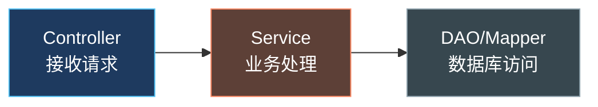
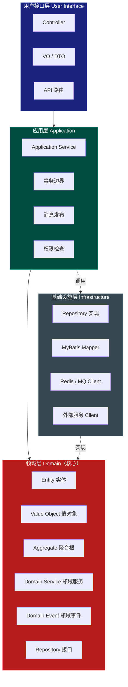
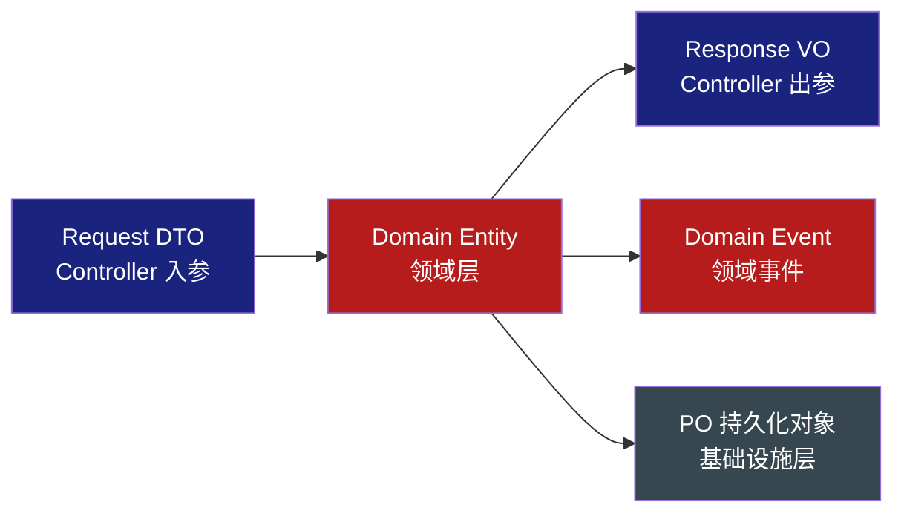
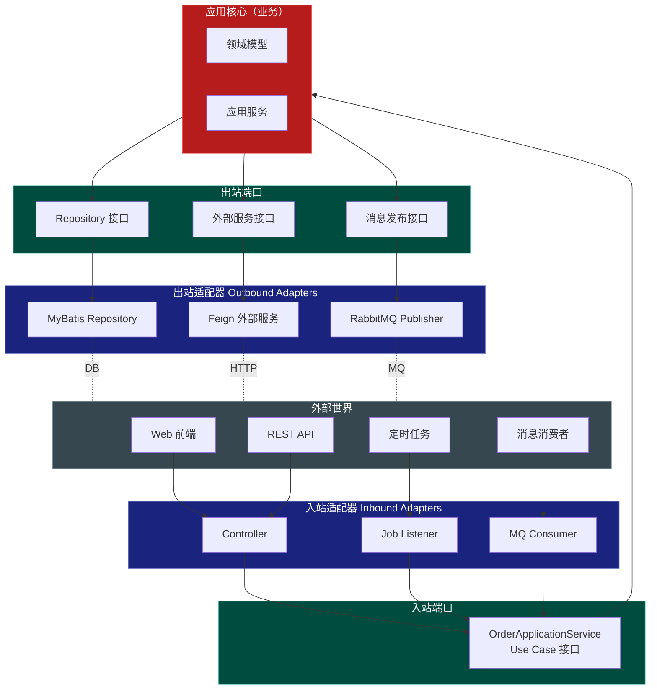
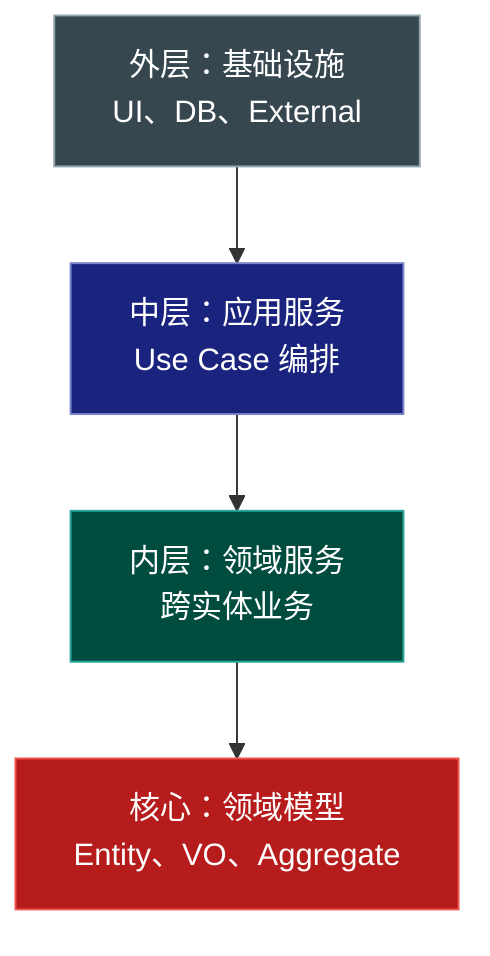
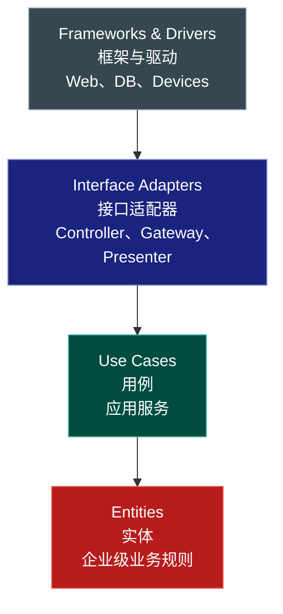
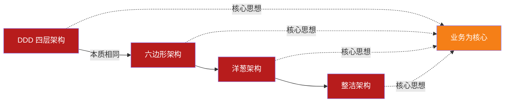
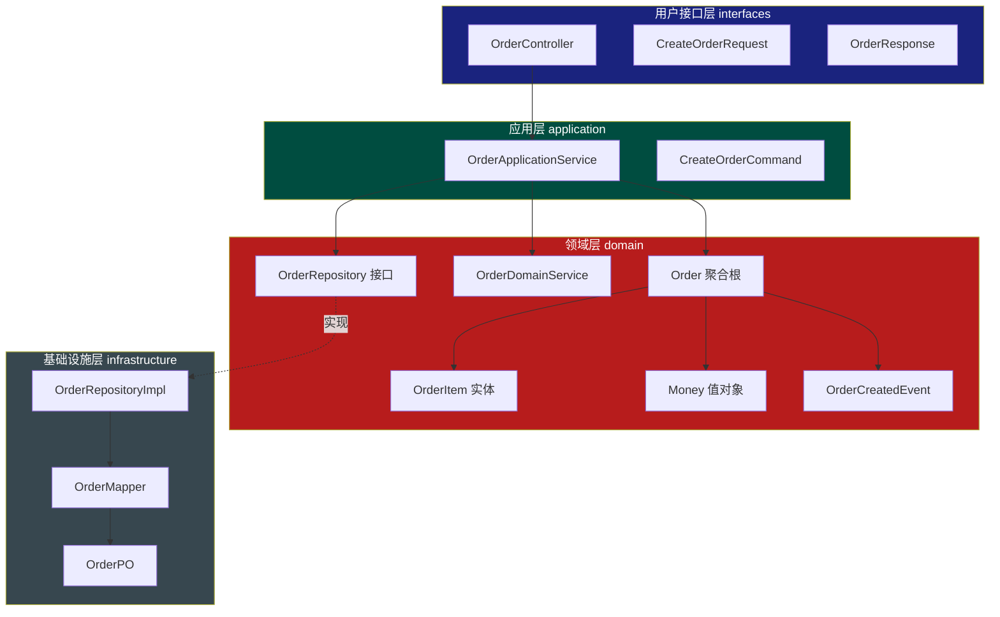
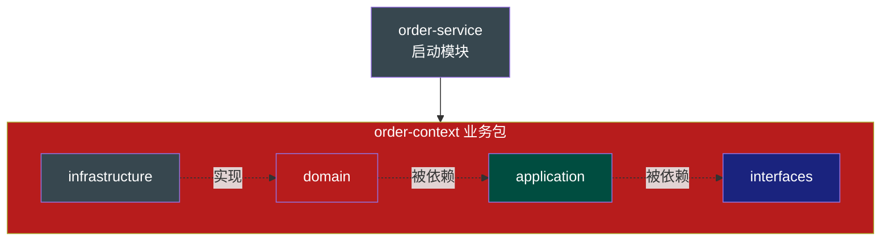

# 第13章 架构落地 - 分层架构与六边形架构

## 引子

回想一下你见过的绝大多数企业级 Java 项目：从 Controller 直接 `@Autowired` Service，Service 又直接 `@Autowired` Mapper，再加几个 `private static final Logger` 和 `try-catch` 满天飞。**业务代码与技术代码纠缠不清**，Service 层既要处理"订单总价计算"这种核心业务，又要处理"事务、缓存、MQ 发送、分布式锁、字段加解密"这种纯技术问题。

更糟糕的是，Service 层的代码一旦写完，几乎无法测试 —— 因为它对 MyBatis、Redis、RabbitMQ 强耦合，你要么启动整个 Spring 容器，要么就只能写一堆 `Mockito.when` 把它"伪装"起来。

这正是 DDD 要解决的核心问题之一：**通过分层架构让业务成为"一等公民"，让技术退居二线可替换**。本章我们将系统学习 DDD 四层架构，以及与之血脉相通的六边形架构（Hexagonal）、洋葱架构（Onion）和整洁架构（Clean Architecture），并用电商订单的实战案例，把分层从 PPT 落到代码上。

---

## 13.1 传统三层架构的局限

### 13.1.1 经典三层架构的样子

几乎所有 Java 培训教材的"用户管理"案例都是这样写的：



**Controller** 负责接收 HTTP 请求和参数校验；**Service** 负责"业务逻辑"；**DAO/Mapper** 负责 SQL。看似层次清晰，落地却一团乱。

### 13.1.2 三大典型问题

**问题一：Service 层既是业务又是技术**

```java
@Service
public class OrderService {
    @Autowired
    private OrderMapper orderMapper;       // 持久化
    @Autowired
    private RedisTemplate redis;           // 缓存
    @Autowired
    private RabbitTemplate rabbit;         // 消息
    @Autowired
    private InventoryFeignClient feign;    // 远程调用

    @Transactional
    public void createOrder(OrderDTO dto) {
        // 1. 业务：计算价格
        BigDecimal total = dto.getPrice().multiply(BigDecimal.valueOf(dto.getQty()));
        // 2. 技术：分布式锁
        RLock lock = redisson.getLock("stock:" + dto.getSkuId());
        lock.lock();
        try {
            // 3. 技术：远程调用
            InventoryDTO inv = feign.getStock(dto.getSkuId());
            if (inv.getStock() < dto.getQty()) throw new RuntimeException("库存不足");
            // 4. 技术：缓存预扣
            redis.opsForValue().decrement("stock:" + dto.getSkuId(), dto.getQty());
            // 5. 技术：持久化
            Order order = new Order();
            BeanUtils.copyProperties(dto, order);
            order.setTotal(total);
            orderMapper.insert(order);
            // 6. 技术：发消息
            rabbit.convertAndSend("order.created", order);
        } finally {
            lock.unlock();
        }
    }
}
```

一个方法 60 行，**业务规则（计算价格、扣库存判断）被淹没在 5 种技术细节中**。新人改这段代码时，根本分不清"动哪里会影响业务"。

**问题二：业务逻辑"下沉"到 Service，但仍直接依赖数据库**

传统架构号称"业务在 Service"，但 Service 里到处是 `orderMapper.selectById(id)`、`order.setStatus(1)` 这种**贫血模型式操作**。实体只是一堆 getter/setter，没有行为。当业务规则变化时，你要在 Service 散落的几十处地方同步修改。

**问题三：单元测试形同虚设**

Service 直接依赖 MyBatis、Redis、RabbitMQ。要测 `createOrder`，你必须启动 Spring 容器 + MySQL + Redis + RabbitMQ 环境，或者写一堆 `Mockito.when(orderMapper.insert(any())).thenReturn(1)`。结果就是：要么测试跑不起来，要么测试和实现强绑定，**重构时一改就全红**。

### 13.1.3 问题根因：依赖方向错了

所有这些问题的根因只有一个：**业务（领域）依赖了技术**。Service 层 import 了 MyBatis、Spring、Redis、Feign 的注解和类，业务规则被技术框架"绑架"了。

DDD 提出了**依赖倒置**：让领域层定义仓储接口（Repository），基础设施层去实现它。这样领域层不依赖任何技术框架，单元测试可以直接 new 一个聚合根，传入 mock 的 Repository，毫秒级运行。

---

## 13.2 DDD 四层架构

### 13.2.1 四层架构总览

DDD 经典四层架构是 Vaughn Vernon 在《实现领域驱动设计》中明确提出的：



**关键依赖关系：**
- 用户接口层 → 应用层 → 领域层
- 基础设施层 → 实现领域层接口（依赖倒置）
- **领域层不依赖任何其他层，也不依赖任何框架**

### 13.2.2 各层定位速记

| 层级 | 别名 | 关注点 | 典型代码 | 谁来写 |
|------|------|--------|---------|--------|
| 用户接口层 | Interface / Adapter-in | 协议转换、参数校验 | `@RestController`、`@RequestMapping` | 前端/接口工程师 |
| 应用层 | Application | 业务流程编排、跨聚合协作 | `OrderApplicationService` | 后端工程师 |
| 领域层 | Domain / Model | 业务规则、不变式、领域逻辑 | `Order`、`Money`、`OrderRepository`（接口） | 业务专家+架构师 |
| 基础设施层 | Infrastructure / Adapter-out | 技术实现 | `OrderRepositoryImpl`、`MyBatis Mapper` | 后端工程师 |

### 13.2.3 依赖倒置原则（DIP）的体现

在传统三层架构中：
```
Service → DAO（Service 依赖 DAO 接口和 MyBatis 实现）
```

在 DDD 四层架构中：
```
Domain 定义 OrderRepository 接口（领域层不依赖任何技术）
Infrastructure 实现 OrderRepositoryImpl implements OrderRepository（基础设施层依赖领域层）
```

**依赖箭头反过来了**。这就是 Robert C. Martin 提出的 Dependency Inversion Principle 在 DDD 中的应用。带来的好处是：
1. 领域层编译时**只依赖 JDK + 自己定义的接口**，不依赖 Spring、MyBatis、Redis
2. 单元测试可以毫秒级运行，无需 Spring 容器
3. 更换技术栈时（如 MyBatis 换 JPA），**领域层代码零修改**

---

## 13.3 各层职责详解

### 13.3.1 用户接口层（User Interface）

**职责清单：**
- 接收并解析 HTTP/RPC/GRPC/WebSocket 等协议请求
- 参数格式校验（`@Valid`、`@NotNull`）
- **调用应用层**，不直接调用领域层
- 将领域对象/应用服务返回值转为 VO/DTO 返回
- 处理用户友好的错误码和异常
- 不做任何业务计算

**反例（不该出现的代码）：**
```java
// 错误！在 Controller 里算价格
@PostMapping("/order")
public Result createOrder(@RequestBody OrderRequest req) {
    BigDecimal total = req.getPrice().multiply(BigDecimal.valueOf(req.getQty()));  // 业务计算
    // ...
}
```

**正例：**
```java
@PostMapping("/order")
public Result<OrderVO> createOrder(@Valid @RequestBody CreateOrderRequest req) {
    // 只做协议转换和参数校验
    OrderId orderId = orderApplicationService.createOrder(req);
    return Result.ok(new OrderVO(orderId.getValue()));
}
```

### 13.3.2 应用层（Application）

**职责清单：**
- 编排一个完整**用例（Use Case）**的步骤
- 跨聚合、跨限界上下文的协作
- 事务边界（`@Transactional` 放在这里，而不是领域服务）
- 安全/权限检查
- 消息发布（在事务提交后）
- **不包含核心业务规则**，业务规则在领域层

应用层是"指挥家"，领域层是"演奏家"。指挥家告诉演奏家"先做什么、再做什么"，但具体怎么演奏（业务规则）由演奏家决定。

### 13.3.3 领域层（Domain）

**职责清单：**
- 表达业务概念：实体、值对象、聚合
- 封装业务规则和不变式（Invariant）
- 定义领域服务处理跨实体的业务逻辑
- 定义领域事件表示已发生的事实
- 定义仓储**接口**（不实现）
- **不依赖** Spring、MyBatis、Redis、MQ

领域层是整个系统的"心脏"。它应该独立于任何具体技术，可以在不同技术栈下被复用（Web、微服务、CLI、Batch Job 等）。

### 13.3.4 基础设施层（Infrastructure）

**职责清单：**
- 实现领域层定义的仓储接口
- 数据库访问（MyBatis Mapper、JPA Repository）
- 缓存、消息、搜索引擎、定时任务
- 调用外部服务（HTTP Client、RPC Client）
- 通用工具（日期、ID 生成器、加密）
- 配置类（`@Configuration`、`@Bean`）

**注意**：基础设施层**向上依赖**领域层（实现领域层定义的接口），但**不应该被领域层依赖**。

---

## 13.4 各层通信规范

### 13.4.1 实体不跨层传输

一个常见错误是在 Controller 的方法签名里直接暴露领域实体：

```java
// 错误！领域实体暴露给前端
@PostMapping("/order")
public Order createOrder(@RequestBody Order order) { ... }
```

**为什么不行？**
1. 领域实体的字段（如 `internalStatus`、`auditInfo`）不该让前端看到
2. 领域实体会随业务演化（比如新增字段），会破坏 API 兼容性
3. 序列化框架（如 Jackson）会强制给领域实体加注解，污染业务代码

### 13.4.2 DTO/VO 转换

正确做法是**每层都有自己的对象表示**：



**转换时机：**
- Controller → Application：使用 Request DTO
- Application → Domain：使用 Command/Query 对象（或直接构造领域对象）
- Domain → Application：返回领域对象
- Application → Controller：转 VO
- Domain → Infrastructure：使用 PO 持久化（基础设施层内部转换）

### 13.4.3 防腐层（Anti-Corruption Layer, ACL）

当一个限界上下文需要调用另一个上下文（特别是外部系统）时，**必须**通过防腐层隔离。防腐层的作用是：
- **翻译**：将外部模型翻译成本地模型
- **隔离**：防止外部模型变化"污染"本地领域
- **适配**：协议转换、错误重试、降级

```java
// 防腐层：订单上下文调用库存上下文
@Component
public class InventoryServiceAcl implements InventoryService {  // 实现本地下游接口
    @Autowired
    private InventoryFeignClient feignClient;  // 外部客户端

    @Override
    public InventorySnapshot checkStock(SkuId skuId, int qty) {
        // 调用外部
        InventoryDTO external = feignClient.query(skuId.getValue());
        // 翻译成本地模型
        if (external == null) {
            return InventorySnapshot.empty(skuId);
        }
        return new InventorySnapshot(
            new SkuId(external.getSkuId()),
            external.getAvailable(),
            external.getLocked()
        );
    }
}
```

---

## 13.5 六边形架构（Hexagonal Architecture / Ports & Adapters）

### 13.5.1 起源与核心思想

2005 年，Alistair Cockburn 提出了六边形架构，也叫**端口与适配器架构（Ports & Adapters）**。

**核心思想：**
> 业务（应用核心）在中心；它通过**端口（Port）**与外界通信；**适配器（Adapter）**实现这些端口，从而让业务不关心具体技术（Web、DB、MQ）。

### 13.5.2 架构示意图



### 13.5.3 端口与适配器的关系

- **端口（Port）**：就是一个**接口**，定义"我能做什么"。例如 `OrderRepository`、`PaymentService`。
- **适配器（Adapter）**：是接口的**实现**，将外部技术与端口对接。例如 `OrderRepositoryMybatisImpl`、`PaymentServiceRestImpl`。

**入站（Driving）vs 出站（Driven）**：
- **入站适配器**：调用应用核心（如 Controller、MQ Consumer、Job）
- **出站适配器**：被应用核心调用（如 Repository、Feign Client、MQ Publisher）

### 13.5.4 六边形 vs DDD 四层

六边形架构其实**和 DDD 四层架构高度兼容**，只是视角不同：

| 六边形视角 | DDD 视角 |
|----------|---------|
| 应用核心 | 领域层 + 应用层 |
| 入站适配器 | 用户接口层 |
| 出站适配器 | 基础设施层 |
| 端口（接口） | 领域层定义的 Repository、外部服务接口 |

可以理解为：**六边形架构是 DDD 四层架构的另一种表达方式，更强调"端口隔离"**。

---

## 13.6 洋葱架构（Onion Architecture）

### 13.6.1 起源与同心圆结构

2008 年，Jeffrey Palermo 提出了洋葱架构。它用同心圆表示依赖关系：



### 13.6.2 洋葱架构的核心规则

1. **所有依赖指向圆心**：外圈依赖内圈，内圈不知道外圈存在
2. **核心是领域模型**：Entity、Value Object、Aggregate
3. **应用服务在外圈第二层**：编排用例
4. **基础设施在最外层**：UI、数据库、外部服务
5. **跨层通过接口（端口）**：内圈定义接口，外圈实现

### 13.6.3 与 DDD 的关系

洋葱架构实际上就是 DDD 四层架构的**几何可视化**。它的最大贡献是强调了"**领域模型位于最内层，是整个系统的中心**"。

---

## 13.7 整洁架构（Clean Architecture）

### 13.7.1 Uncle Bob 的同心圆

2012 年，Robert C. Martin（Uncle Bob）提出整洁架构。它和洋葱架构非常相似，但层次更明确：



### 13.7.2 整洁架构的依赖规则

> **源码依赖只能向内指向**。外圈的任何东西都不能被内圈引用。内圈对外圈一无所知。

- **Entities（实体）**：企业级业务规则，可在多种应用复用
- **Use Cases（用例）**：应用特定的业务规则，编排实体完成用例
- **Interface Adapters**：把数据从最方便的实体/用例形式，转换为外圈方便的格式
- **Frameworks & Drivers**：最外层，胶水代码

### 13.7.3 与 DDD 的关系

整洁架构的 Entities ≈ DDD 领域层
整洁架构的 Use Cases ≈ DDD 应用层
整洁架构的 Interface Adapters ≈ DDD 用户接口层 + 基础设施层
整洁架构的 Frameworks & Drivers ≈ DDD 基础设施层（最具体的部分）

---

## 13.8 架构对比

四种架构**本质相同**，都是"领域在中心、外部可替换"，只是表达方式略有差异：

| 维度 | DDD 四层架构 | 六边形架构 | 洋葱架构 | 整洁架构 |
|------|------------|-----------|---------|---------|
| 提出者 | Eric Evans / Vaughn Vernon | Alistair Cockburn (2005) | Jeffrey Palermo (2008) | Robert C. Martin (2012) |
| 表达方式 | 分层（横切） | 六边形（端口适配器） | 同心圆 | 同心圆 |
| 核心思想 | 业务为核心 | 业务在中心，端口隔离 | 依赖指向圆心 | 依赖只能向内 |
| 层次数 | 4 层 | 2 圈（核心 + 适配器） | 4 圈 | 4 圈 |
| 重点强调 | 业务规则在领域层 | 端口与适配器解耦 | 领域模型最内层 | 用例编排 |
| 适合规模 | 中大型 | 中大型 | 中大型 | 中大型 |
| 学习成本 | 中 | 中 | 低 | 中 |



**实践建议**：在团队中你可以选**任意一种**作为架构蓝图，但落地时建议用 DDD 四层架构的命名（用户接口层/应用层/领域层/基础设施层），因为它对国内团队更直观、更容易推广。

---

## 13.9 包结构与代码组织

### 13.9.1 两种代码组织方式

- **方式一：按层分包（layer-package）**
  ```
  com.example.order
  ├── controller/
  ├── service/
  ├── repository/
  └── domain/
  ```
  缺点：跨包调用频繁，类之间耦合度高。

- **方式二：按业务分包（feature-package）**（**推荐**）
  ```
  com.example.order
  ├── interfaces/      // 用户接口层
  ├── application/     // 应用层
  ├── domain/          // 领域层
  └── infrastructure/  // 基础设施层
  ```
  优点：高内聚低耦合，符合 DDD 限界上下文理念。

### 13.9.2 推荐的目录结构

```mermaid
flowchart TB
    ROOT[order-context<br/>订单限界上下文]
    ROOT --> IF[interfaces]
    ROOT --> AP[application]
    ROOT --> DM[domain]
    ROOT --> IN[infrastructure]
    ROOT --> BOOT[启动类]
    IF --> IF1[OrderController]
    IF --> IF2[OrderVO]
    AP --> AP1[OrderApplicationService]
    AP --> AP2[CreateOrderCmd]
    AP --> AP3[assembler 装配器]
    DM --> DM1[Order 聚合根]
    DM --> DM2[OrderItem 实体]
    DM --> DM3[Money 值对象]
    DM --> DM4[OrderStatus 枚举]
    DM --> DM5[OrderDomainService]
    DM --> DM6[OrderRepository 接口]
    DM --> DM7[OrderCreatedEvent]
    IN --> IN1[OrderRepositoryImpl]
    IN --> IN2[OrderMapper MyBatis]
    IN --> IN3[OrderPO 持久化对象]
    IN --> IN4[MQ Publisher 实现]

    style ROOT fill:#b71c1c,color:#fff
    style IF fill:#1a237e,color:#fff
    style AP fill:#004d40,color:#fff
    style DM fill:#b71c1c,color:#fff
    style IN fill:#37474f,color:#fff
```



### 13.9.3 完整目录树示例

```
order-context/                       # 订单限界上下文
├── interfaces/                       # 用户接口层
│   ├── web/
│   │   └── OrderController.java
│   ├── dto/
│   │   ├── CreateOrderRequest.java
│   │   └── OrderResponse.java
│   ├── vo/
│   │   └── OrderVO.java
│   └── assembler/
│       └── OrderAssembler.java       # VO/Request 转换
├── application/                      # 应用层
│   ├── service/
│   │   └── OrderApplicationService.java
│   ├── command/
│   │   └── CreateOrderCommand.java
│   ├── dto/
│   │   └── OrderDTO.java
│   └── event/
│       └── OrderEventPublisher.java
├── domain/                           # 领域层（核心）
│   ├── model/
│   │   ├── Order.java                # 聚合根
│   │   ├── OrderItem.java            # 实体
│   │   └── OrderId.java              # 实体标识
│   ├── valueobject/
│   │   ├── Money.java
│   │   ├── SkuId.java
│   │   └── Quantity.java
│   ├── enum/
│   │   └── OrderStatus.java
│   ├── service/
│   │   └── OrderDomainService.java
│   ├── event/
│   │   └── OrderCreatedEvent.java
│   ├── repository/
│   │   └── OrderRepository.java      # 接口
│   └── exception/
│       └── DomainException.java
└── infrastructure/                   # 基础设施层
    ├── persistence/
    │   ├── OrderRepositoryImpl.java
    │   ├── mapper/
    │   │   └── OrderMapper.java
    │   └── po/
    │       └── OrderPO.java
    ├── messaging/
    │   └── OrderEventPublisherImpl.java
    ├── external/
    │   └── InventoryServiceAcl.java
    └── config/
        └── OrderConfiguration.java
```

**核心原则**：
1. **domain** 包下不应出现 `org.springframework.*`、`com.baomidou.mybatisplus.*` 等任何技术框架 import
2. **interfaces** 只依赖 **application**，不直接依赖 **domain**
3. **application** 只依赖 **domain**（接口），不依赖 **infrastructure**
4. **infrastructure** 实现 **domain** 的接口，反向依赖 **domain**

---

## 13.10 实战：电商订单系统的四层架构落地

下面以"**创建订单**"用例展示完整的四层代码（精简版）。

### 13.10.1 完整包结构



### 13.10.2 领域层代码

**聚合根 Order.java**
```java
package com.example.order.domain.model;

import com.example.order.domain.event.OrderCreatedEvent;
import com.example.order.domain.valueobject.Money;
import com.example.order.domain.valueobject.Quantity;
import com.example.order.domain.valueobject.SkuId;
import com.example.order.domain.exception.DomainException;

import java.util.ArrayList;
import java.util.Collections;
import java.util.List;

/**
 * 订单聚合根
 * 包含业务规则：总价计算、状态流转、添加商品
 */
public class Order {
    private OrderId id;
    private String userId;
    private List<OrderItem> items = new ArrayList<>();
    private Money totalAmount;
    private OrderStatus status;
    private long createdAt;

    // 受保护的默认构造函数，给仓储使用
    protected Order() {}

    /**
     * 工厂方法：创建订单
     */
    public static Order create(String userId, List<OrderItem> items) {
        if (items == null || items.isEmpty()) {
            throw new DomainException("订单至少包含一个商品");
        }
        Order order = new Order();
        order.id = OrderId.generate();
        order.userId = userId;
        order.items = new ArrayList<>(items);
        order.totalAmount = order.calculateTotal();  // 业务规则
        order.status = OrderStatus.CREATED;
        order.createdAt = System.currentTimeMillis();
        // 发布领域事件
        order.registerEvent(new OrderCreatedEvent(order.id, order.totalAmount, order.createdAt));
        return order;
    }

    /**
     * 业务规则：计算订单总价
     */
    private Money calculateTotal() {
        return items.stream()
                .map(item -> item.getPrice().multiply(item.getQuantity().getValue()))
                .reduce(Money.ZERO, Money::add);
    }

    /**
     * 业务规则：支付
     */
    public void pay() {
        if (status != OrderStatus.CREATED) {
            throw new DomainException("只有已创建订单可支付");
        }
        this.status = OrderStatus.PAID;
    }

    /**
     * 业务规则：取消订单
     */
    public void cancel() {
        if (status == OrderStatus.PAID) {
            throw new DomainException("已支付订单不能直接取消");
        }
        this.status = OrderStatus.CANCELLED;
    }

    // 事件容器相关方法
    private final List<Object> domainEvents = new ArrayList<>();
    private void registerEvent(Object event) {
        this.domainEvents.add(event);
    }
    public List<Object> getDomainEvents() {
        return Collections.unmodifiableList(domainEvents);
    }
    public void clearDomainEvents() {
        this.domainEvents.clear();
    }

    // getters
    public OrderId getId() { return id; }
    public String getUserId() { return userId; }
    public List<OrderItem> getItems() { return Collections.unmodifiableList(items); }
    public Money getTotalAmount() { return totalAmount; }
    public OrderStatus getStatus() { return status; }
}
```

**仓储接口 OrderRepository.java**
```java
package com.example.order.domain.repository;

import com.example.order.domain.model.Order;
import com.example.order.domain.model.OrderId;

import java.util.Optional;

/**
 * 仓储接口：领域层定义，基础设施层实现
 * 这是依赖倒置的关键
 */
public interface OrderRepository {
    void save(Order order);
    Optional<Order> findById(OrderId id);
    void update(Order order);
}
```

### 13.10.3 应用层代码

```java
package com.example.order.application.service;

import com.example.order.application.command.CreateOrderCommand;
import com.example.order.application.event.OrderEventPublisher;
import com.example.order.domain.model.Order;
import com.example.order.domain.model.OrderId;
import com.example.order.domain.model.OrderItem;
import com.example.order.domain.repository.OrderRepository;
import com.example.order.domain.valueobject.Money;
import com.example.order.domain.valueobject.Quantity;
import com.example.order.domain.valueobject.SkuId;
import org.springframework.stereotype.Service;
import org.springframework.transaction.annotation.Transactional;

import java.util.List;
import java.util.stream.Collectors;

/**
 * 应用服务：编排"创建订单"用例
 * 不包含核心业务规则，只负责跨聚合协作、事务、事件发布
 */
@Service
public class OrderApplicationService {
    private final OrderRepository orderRepository;
    private final OrderEventPublisher eventPublisher;

    public OrderApplicationService(OrderRepository orderRepository,
                                   OrderEventPublisher eventPublisher) {
        this.orderRepository = orderRepository;
        this.eventPublisher = eventPublisher;
    }

    /**
     * 用例：创建订单
     * 1. 构造领域对象（业务规则在 Order.create 中）
     * 2. 持久化
     * 3. 发布事件
     */
    @Transactional
    public OrderId createOrder(CreateOrderCommand cmd) {
        // 1. 将 Command 转为领域对象
        List<OrderItem> items = cmd.getItems().stream()
                .map(c -> new OrderItem(
                        new SkuId(c.getSkuId()),
                        new Money(c.getPrice()),
                        new Quantity(c.getQuantity())))
                .collect(Collectors.toList());

        // 2. 调用领域逻辑（业务规则封装在聚合根里）
        Order order = Order.create(cmd.getUserId(), items);

        // 3. 持久化（接口在领域层，实现在基础设施层）
        orderRepository.save(order);

        // 4. 发布领域事件
        order.getDomainEvents().forEach(eventPublisher::publish);
        order.clearDomainEvents();

        return order.getId();
    }
}
```

### 13.10.4 用户接口层代码

```java
package com.example.order.interfaces.web;

import com.example.order.application.command.CreateOrderCommand;
import com.example.order.application.service.OrderApplicationService;
import com.example.order.domain.model.OrderId;
import com.example.order.interfaces.dto.CreateOrderRequest;
import com.example.order.interfaces.dto.OrderResponse;
import org.springframework.web.bind.annotation.*;

import javax.validation.Valid;

/**
 * 用户接口层：只做协议转换和参数校验
 */
@RestController
@RequestMapping("/api/orders")
public class OrderController {
    private final OrderApplicationService orderApplicationService;

    public OrderController(OrderApplicationService orderApplicationService) {
        this.orderApplicationService = orderApplicationService;
    }

    @PostMapping
    public OrderResponse createOrder(@Valid @RequestBody CreateOrderRequest request) {
        // 1. Request DTO 转 Command
        CreateOrderCommand command = new CreateOrderCommand(
                request.getUserId(),
                request.getItems());

        // 2. 调用应用服务
        OrderId orderId = orderApplicationService.createOrder(command);

        // 3. 返回 Response
        return new OrderResponse(orderId.getValue());
    }
}
```

### 13.10.5 基础设施层代码

```java
package com.example.order.infrastructure.persistence;

import com.example.order.domain.model.Order;
import com.example.order.domain.model.OrderId;
import com.example.order.domain.repository.OrderRepository;
import com.example.order.infrastructure.persistence.mapper.OrderMapper;
import com.example.order.infrastructure.persistence.po.OrderPO;
import org.springframework.stereotype.Repository;

import java.util.Optional;

/**
 * 仓储实现：基础设施层
 * 实现领域层定义的 OrderRepository 接口（依赖倒置）
 */
@Repository
public class OrderRepositoryImpl implements OrderRepository {
    private final OrderMapper orderMapper;

    public OrderRepositoryImpl(OrderMapper orderMapper) {
        this.orderMapper = orderMapper;
    }

    @Override
    public void save(Order order) {
        // 领域对象 → PO 持久化对象
        OrderPO po = toPO(order);
        orderMapper.insert(po);
    }

    @Override
    public Optional<Order> findById(OrderId id) {
        OrderPO po = orderMapper.selectById(id.getValue());
        return Optional.ofNullable(po).map(this::toDomain);
    }

    @Override
    public void update(Order order) {
        orderMapper.updateById(toPO(order));
    }

    private OrderPO toPO(Order order) {
        // 省略转换细节
        OrderPO po = new OrderPO();
        po.setId(order.getId().getValue());
        po.setUserId(order.getUserId());
        po.setTotalAmount(order.getTotalAmount().getAmount());
        po.setStatus(order.getStatus().name());
        return po;
    }

    private Order toDomain(OrderPO po) {
        // PO → 领域对象（省略）
        return null;
    }
}
```

### 13.10.6 依赖方向检查

让我们用表格验证依赖方向是否正确：

| 类 | 依赖的类 | 是否违规 |
|----|---------|---------|
| OrderController | OrderApplicationService | 无 |
| OrderApplicationService | OrderRepository(接口)、Order | 无 |
| Order(领域) | OrderItem, Money（值对象） | 无 |
| OrderRepositoryImpl | OrderRepository(接口), Order, OrderMapper | 无（实现接口属于合法依赖倒置） |
| Order | Spring、MyBatis、Redis | **绝不允许** |

---

## 13.11 Spring Boot 项目的 DDD 实践

### 13.11.1 模块化策略

Maven 多模块是落地 DDD 最自然的方式：



### 13.11.2 Maven 多模块示例

```
order-service/                    # 父 POM
├── pom.xml
├── order-start/                  # 启动模块（只放 main 方法和配置）
│   ├── pom.xml
│   └── src/main/java/
│       └── OrderApplication.java
├── order-context/                # 业务包（核心）
│   ├── pom.xml
│   └── src/main/java/com/example/order/
│       ├── interfaces/
│       ├── application/
│       ├── domain/
│       └── infrastructure/
└── order-client/                 # 对外 RPC 接口（可选）
    └── src/main/java/
```

**关键设计**：
- **`order-start`**：只放 SpringBoot 启动类和 `application.yml`，依赖 `order-context`
- **`order-context`**：纯业务包，按四层分包；Maven 中**不依赖 Spring Boot**，只依赖 Spring Context（因为要用 `@Service`、`@Transactional` 这些 POJO 注解）
- **`order-client`**：对外暴露的 Feign / Dubbo 接口定义，依赖 `order-context` 的领域模型做数据传输

### 13.11.3 领域层与 Spring 的边界

你可能疑惑：领域层用了 `@Service`、`@Transactional` 算不算依赖 Spring？

**原则**：
- **领域层允许**使用 Spring 的 **POJO 注解**（如 `@Service`、`@Component`、`@Autowired`），因为这些注解不会改变业务逻辑
- **领域层禁止**使用 Spring 的 **API 类**（如 `ApplicationContext`、`BeanFactory`）
- **领域层禁止**使用任何 ORM/MQ/缓存的 API

更严格的做法是领域层**完全无注解**，通过 `@Configuration` + `@Bean` 在基础设施层显式装配：

```java
@Configuration
public class OrderConfiguration {
    @Bean
    public OrderApplicationService orderApplicationService(OrderRepository repo, OrderEventPublisher pub) {
        return new OrderApplicationService(repo, pub);
    }
}
```

这样领域层就**真正零依赖**了。

### 13.11.4 常见踩坑

1. **DTO 在各层混用**：一个 `OrderDTO` 从 Controller 传到 Service 再传到 Mapper。正确做法是每层定义自己的对象。
2. **领域对象里出现 `@TableField`、`@Column` 等 ORM 注解**：领域对象被持久化框架污染。
3. **应用服务直接调用 Mapper**：绕过了领域层定义的 Repository 接口。
4. **基础设施层向上反向依赖**：基础设施层调用应用层或用户接口层，这是循环依赖。
5. **Service 里堆积所有逻辑**：业务规则散落在 Service 几十个方法里，没有封装到聚合根。

---

## 小结

本章我们系统学习了 DDD 落地的核心：架构分层。

- **13.1** 分析了传统三层架构的三大问题：业务与技术纠缠、贫血模型、测试困难
- **13.2** 给出了 DDD 四层架构：用户接口层、应用层、领域层、基础设施层；核心是**依赖倒置**
- **13.3** 详细讲解了各层职责：领域层封装业务规则，应用层编排用例，基础设施层实现技术
- **13.4** 规范了层间通信：DTO 转换、防腐层隔离
- **13.5/13.6/13.7** 分别介绍了六边形、洋葱、整洁架构，**它们本质相同**：业务在中心，外部可替换
- **13.8** 用表格对比了四种架构的异同
- **13.9** 给出了按业务分包（feature-package）的目录结构最佳实践
- **13.10** 用电商订单"创建订单"用例展示了完整四层代码实现
- **13.11** 给出 Spring Boot + Maven 多模块的落地策略

记住一句话：**"业务在内、技术在外；接口属于业务，实现在外"**。这 16 字真言，能帮你避免 90% 的分层架构问题。

## 下一章预告

第14章我们将进入**微服务架构与 DDD**：当限界上下文遇上微服务，如何做上下文映射？如何用 DDD 的思想拆分微服务？如何处理分布式事务、最终一致性、跨服务调用？敬请期待。
