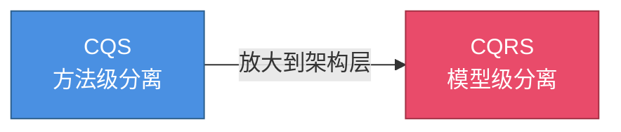
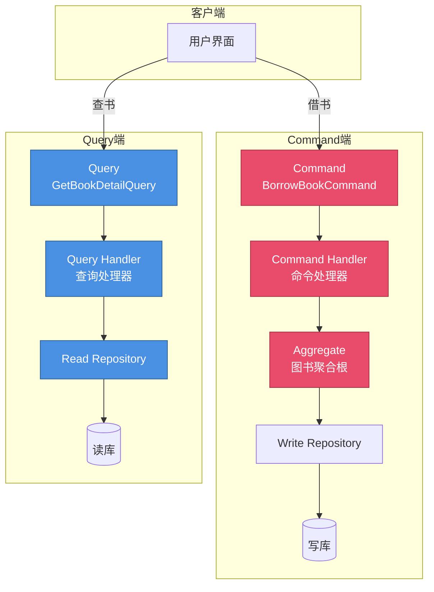
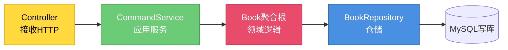
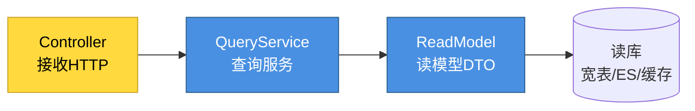
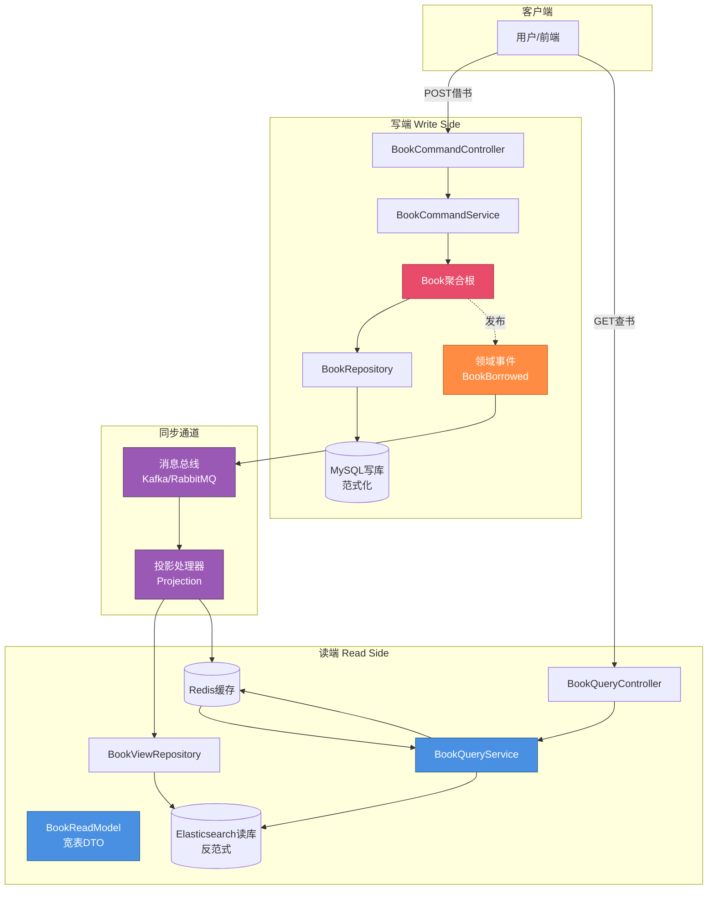
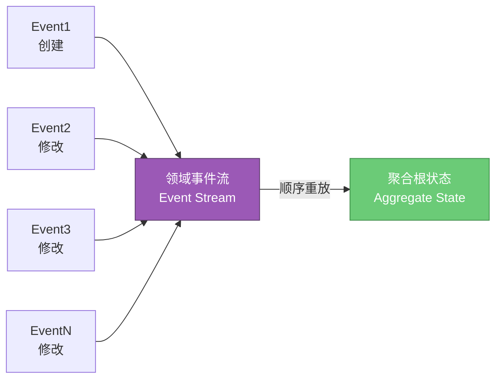
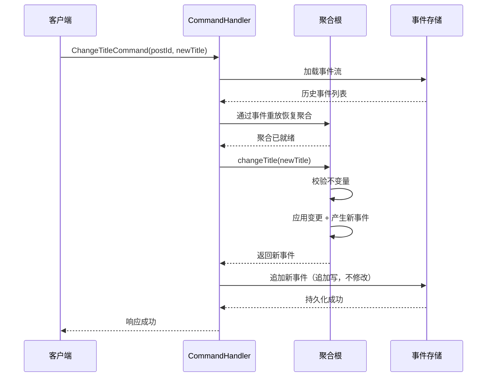
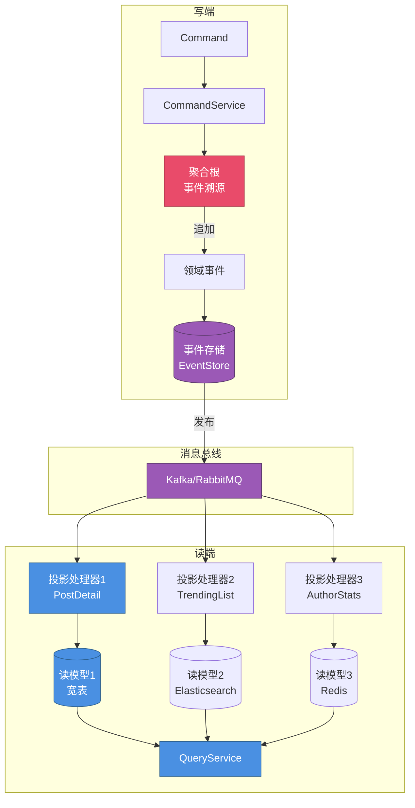
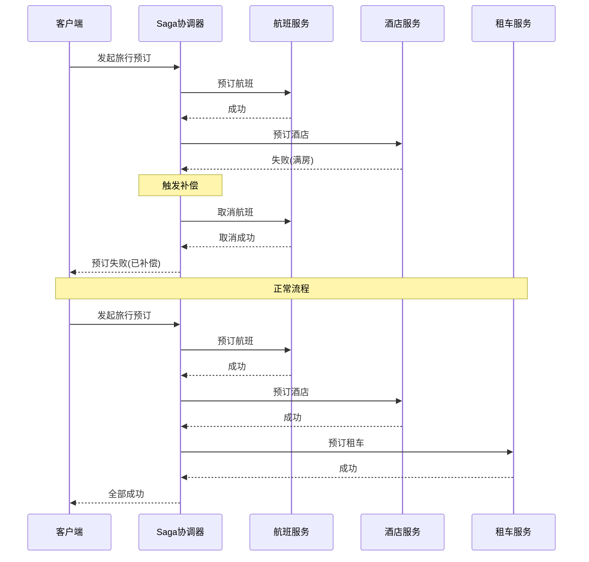
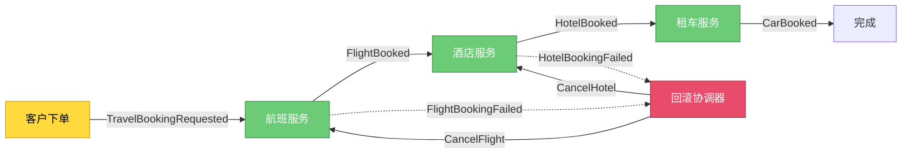

# 第14章 架构落地 - CQRS 与事件溯源

## 引子：报表页与下单页的"性格不合"

想象你正在维护一个图书借阅系统。后台运营同学每天要打开"借阅统计报表"页面：筛选最近 30 天、按图书分类聚合、显示每本书的借阅次数与热门读者排名，SQL 涉及 5 张表 JOIN、动辄返回上万行。

与此同时，客户端正在经历双 11 般的借书高峰：每秒钟数百个学生同时点击"借阅"按钮，调用图书聚合根的事务方法：扣减库存、生成借阅单、写入借阅历史。

这两种场景的需求**完全相反**：

| 维度 | 报表查询 | 下单写入 |
|------|----------|----------|
| 数据量 | 大结果集、聚合 | 单条精确写入 |
| 一致性 | 弱一致可接受 | 必须强一致 |
| 并发 | 读多写少 | 写密集、有竞争 |
| 索引 | 多维度联合索引 | 单一主键 |
| 性能要求 | 几百毫秒可接受 | 毫秒级响应 |

如果用**一套模型**同时满足两侧，开发者不得不做各种妥协：为了支持复杂查询引入大量反范式字段，聚合根因此变得臃肿；为了写入性能加上缓存，又让报表数据陈旧一周。**这种"读写同体"的妥协，正在杀死系统的可演化性**。

本章将介绍两种解决"读写性格不合"的工程范式：**CQRS**（命令查询职责分离）与**事件溯源**（Event Sourcing），以及它们组合下的最终一致性方案 **Saga**。

---

## 14.1 CQRS 的定义

**CQRS** 全称 **Command Query Responsibility Segregation**（命令查询职责分离），由 Greg Young 在 2010 年首次系统性地提出。它的核心思想只有一句话：

> **把"改变状态的写操作"和"读取状态的查询操作"，用两套完全独立的模型来表达。**

在传统的 CRUD 架构中，Repository 既提供 `save(Book)` 又提供 `findById(id)` 与各种查询方法，读写共用同一聚合根、同一份数据源。这种"读写同体"的设计来自 Bertrand Meyer 的 **CQS**（Command Query Separation）原则，但 Meyer 的主张是**方法级别**的分离（一个方法要么改状态要么返回值，不能又改又返），而 Greg Young 将这一思想**提升到架构级别**：读写用两套不同的对象、不同的仓储、甚至不同的数据库。

CQS 与 CQRS 的关系可以用一张图说明：



Greg Young 提出 CQRS 的背景，正是他在为复杂业务系统寻找"既能支持高频写、又能应对复杂查询"答案的过程中发现：**绝大多数业务系统的读模型与写模型，所服务的业务目的完全不同。**

---

## 14.2 为什么需要 CQRS

### 14.2.1 读模型与写模型的关注点不同

写模型（聚合根）关心的是**业务不变量**——借书时库存不能为负、还书时借阅单必须存在、同一本书不能被同一个人重复借阅。这些约束要求聚合根的字段"少而精"：库存量、当前借阅人列表、借阅状态。

而读模型（报表）关心的是**展示形态**——每本书的累计借阅次数、最近 30 天的借阅趋势、热门读者 Top10。这些"展示字段"在写模型里根本不存在，只能通过 JOIN 多个聚合才能算出来。

如果强行把读字段塞进写模型，聚合根就会爆炸：

```java
// 错误的写法：把报表字段塞进写模型
public class Book {
    private Long id;
    private String title;
    private int stock;             // 写关心
    private List<Loan> loans;      // 写关心
    // 以下都是查询关心
    private long loanCountLast30Days;
    private long totalLoanCount;
    private List<HotReader> topReaders;
    private String trendingRank;
    // ...
}
```

这种"超级实体"既难维护又难测试，因为它承担了太多职责。

### 14.2.2 复杂查询与聚合根的事务冲突

图书聚合根通常按"图书 ID"加锁（行锁 / 乐观锁）。当一个聚合根被某次写入事务锁定时，所有针对**同一本书**的读操作都会被阻塞。

但报表查询往往需要**跨聚合**统计，例如"统计全馆所有图书的借阅排行"。如果这些查询也走聚合根仓储，就会：
- 触发跨聚合的复杂 JOIN，性能极差；
- 锁竞争激烈，影响写入；
- 即便能查出来，查询字段和聚合根的业务字段含义也不同。

### 14.2.3 不同性能要求

写操作要求**强一致、低延迟、串行化**——一笔借书要么成功要么失败，不能因为缓存丢失导致"看起来借了但其实没借"。

读操作可以**最终一致、高吞吐、并行化**——报表晚 5 分钟刷新完全可接受。读者查询"我的借阅列表"时，哪怕后台聚合刚写完，读库延迟 1 秒再展示也毫无问题。

把这两种性能需求**强扭**到同一个数据库、同一套表结构上，是大部分系统性能不佳的根因。

---

## 14.3 CQRS 基础模型

CQRS 把所有操作分成两类：

- **Command（命令）**：表达"我要改变系统状态"的意图。例如 `BorrowBookCommand`、`ReturnBookCommand`、`RegisterBookCommand`。命令**有副作用**、**改变状态**、**通常不返回值**或只返回 ID。
- **Query（查询）**：表达"我要从系统读取数据"的请求。例如 `GetBookDetailQuery`、`GetLoanHistoryQuery`。查询**无副作用**、**不改状态**、**返回数据**。



注意图中的**颜色区分**：红色为命令端，蓝色为查询端。它们**没有共享任何对象**——命令端有自己的 `Book` 聚合根、`BookWriteRepository`，查询端有自己的 `BookReadModel`、`BookReadRepository`。

---

## 14.4 CQRS 的分层

### 14.4.1 写模型的分层

写模型沿用我们熟悉的 DDD 分层：

```
Command → Application Service（命令服务）→ Aggregate → Repository → Database
```

具体到图书借阅系统：



各层职责：
- **Controller**：接收 HTTP 请求，把 JSON 转成 Command 对象；不持有业务逻辑。
- **CommandService**：开启事务、加载聚合、调用聚合方法、保存聚合、发布领域事件。
- **Book 聚合根**：执行借书 / 还书等业务规则，触发领域事件。
- **BookRepository**：聚合的持久化抽象，针对聚合根的"整体保存"。

### 14.4.2 读模型的分层

读模型则**完全没有聚合根**：

```
Query → QueryService → Read DB / Cache
```



读模型直接走"DTO + 简化 SQL"，不再走 Repository 抽象。理由：
- 读模型**没有业务规则**，不需要聚合根保护不变量；
- 读模型往往是**多表 JOIN** 或 **Elasticsearch 搜索**，硬塞进 Repository 会过度抽象；
- 读模型的**字段会随前端变化**，DTO 直接面向界面灵活调整。

### 14.4.3 完整 CQRS 架构图



图中橙色箭头是**领域事件**的发布-订阅：写端产生事件，投影处理器订阅后更新读库。这是**异步 CQRS** 的典型形态。

---

## 14.5 同步 CQRS vs 异步 CQRS

### 14.5.1 同步 CQRS：读写同一数据库

最简形式：写端和读端**共用一个数据库**，但通过不同的 SQL 视图访问。读端不直接读 `book` 表，而是读一个为查询优化的视图 `v_book_detail`，里面 JOIN 了所有需要的字段。

```sql
-- 写表（范式化）
CREATE TABLE book (
    id BIGINT PRIMARY KEY,
    title VARCHAR(200),
    stock INT
);

-- 读视图（反范式）
CREATE VIEW v_book_detail AS
SELECT
    b.id, b.title, b.stock,
    a.name AS author_name,
    c.name AS category_name,
    (SELECT COUNT(*) FROM loan WHERE book_id = b.id) AS total_loans
FROM book b
LEFT JOIN book_author ba ON b.id = ba.book_id
LEFT JOIN author a ON ba.author_id = a.id
LEFT JOIN category c ON b.category_id = c.id;
```

同步 CQRS 的优点：**实现简单、强一致**。缺点：**读写仍争抢同一数据库连接池**，性能提升有限。

### 14.5.2 异步 CQRS：读通过领域事件同步

更彻底的形式：读端**使用独立的数据库**（如 Elasticsearch、宽表 ClickHouse、Redis 缓存），通过订阅领域事件来保持同步。

异步 CQRS 的优点：**读写彻底解耦、读端可任意扩展**。缺点：**最终一致**——从写入完成到读端可见，通常有 100ms ~ 数秒的延迟。

### 14.5.3 实战对比

| 维度 | 同步 CQRS | 异步 CQRS |
|------|-----------|-----------|
| 实现复杂度 | 低 | 高（需引入消息总线） |
| 一致性 | 强一致 | 最终一致 |
| 性能提升 | 有限 | 显著 |
| 适用场景 | 中小型系统 | 大型/高并发系统 |
| 团队技能 | 普通后端 | 需熟悉消息中间件 |

**经验法则**：如果你只是想解决"读写模型耦合"，先尝试同步 CQRS（读写分视图）；如果查询性能是核心瓶颈，再升级到异步 CQRS。

---

## 14.6 实战：图书管理系统的 CQRS 改造

下面我们把"图书借阅"系统改造成 CQRS 架构。写端用 MySQL，读端用一张宽表 + Redis 缓存。

### 14.6.1 命令端代码

**Command 对象**：表达意图的不可变对象。

```java
package com.example.library.command;

import lombok.Getter;
import lombok.RequiredArgsConstructor;

/**
 * 借书命令
 * 只描述意图，不携带任何业务逻辑
 */
@Getter
@RequiredArgsConstructor
public class BorrowBookCommand {
    /** 读者ID */
    private final String readerId;
    /** 图书ID */
    private final Long bookId;
    /** 借阅天数（业务规则校验在聚合根中） */
    private final int loanDays;
}
```

**Command Controller**：接收 HTTP，转 Command。

```java
package com.example.library.command;

import lombok.RequiredArgsConstructor;
import org.springframework.web.bind.annotation.*;

@RestController
@RequestMapping("/api/commands/books")
@RequiredArgsConstructor
public class BookCommandController {

    private final BookCommandService commandService;

    /**
     * 借书接口
     * 注意：这里没有返回值（或只返回订单ID），
     * 详细信息需要走 Query 端获取
     */
    @PostMapping("/borrow")
    public String borrow(@RequestBody BorrowBookCommand command) {
        return commandService.handle(command);
    }

    @PostMapping("/return")
    public void returnBook(@RequestBody ReturnBookCommand command) {
        commandService.handle(command);
    }
}
```

**Command Service（应用层）**：开启事务、加载聚合、执行业务、发布事件。

```java
package com.example.library.command;

import com.example.library.domain.Book;
import com.example.library.domain.BookRepository;
import com.example.library.event.BookBorrowedEvent;
import com.example.library.event.DomainEventPublisher;
import lombok.RequiredArgsConstructor;
import org.springframework.stereotype.Service;
import org.springframework.transaction.annotation.Transactional;

@Service
@RequiredArgsConstructor
public class BookCommandService {

    private final BookRepository bookRepository;
    private final DomainEventPublisher eventPublisher;

    /**
     * 处理借书命令
     * 1. 加载聚合
     * 2. 调用聚合的业务方法
     * 3. 保存聚合
     * 4. 发布领域事件（用于读模型同步）
     */
    @Transactional
    public String handle(BorrowBookCommand command) {
        // 1. 加载聚合
        Book book = bookRepository.findById(command.getBookId())
                .orElseThrow(() -> new IllegalArgumentException("图书不存在"));

        // 2. 调用聚合业务方法（封装所有不变量校验）
        String loanId = book.borrow(command.getReaderId(), command.getLoanDays());

        // 3. 保存聚合
        bookRepository.save(book);

        // 4. 发布领域事件
        eventPublisher.publish(new BookBorrowedEvent(
                book.getId(), loanId, command.getReaderId(), book.getTitle()
        ));

        return loanId;
    }
}
```

**聚合根（写端）**：包含借书的所有业务规则。

```java
package com.example.library.domain;

import com.example.library.event.BookBorrowedEvent;
import lombok.Getter;

import java.util.ArrayList;
import java.util.List;

/**
 * 图书聚合根（写模型）
 * 只关心业务不变量，不关心查询展示
 */
@Getter
public class Book {
    private Long id;
    private String title;
    private int stock;             // 库存
    private List<Loan> activeLoans = new ArrayList<>();

    protected Book() {}

    public Book(Long id, String title, int stock) {
        this.id = id;
        this.title = title;
        this.stock = stock;
    }

    /**
     * 借书业务规则：
     * 1. 库存必须 > 0
     * 2. 同一读者不能重复借同一本书
     * 3. 单本最多借30天
     */
    public String borrow(String readerId, int loanDays) {
        if (stock <= 0) {
            throw new IllegalStateException("库存不足");
        }
        if (loanDays <= 0 || loanDays > 30) {
            throw new IllegalArgumentException("借阅天数必须在1-30天之间");
        }
        boolean alreadyBorrowed = activeLoans.stream()
                .anyMatch(loan -> loan.getReaderId().equals(readerId));
        if (alreadyBorrowed) {
            throw new IllegalStateException("您已借阅此书，请先归还");
        }

        String loanId = "L" + System.currentTimeMillis();
        activeLoans.add(new Loan(loanId, readerId, loanDays));
        stock--;

        // 触发领域事件（注意：这里不直接发，等仓储保存后由应用服务发）
        registerEvent(new BookBorrowedEvent(id, loanId, readerId, title));
        return loanId;
    }

    /** 内部事件注册表，由仓储在保存时收集 */
    private final List<Object> domainEvents = new ArrayList<>();
    private void registerEvent(Object event) { domainEvents.add(event); }
    public List<Object> pullEvents() {
        List<Object> events = new ArrayList<>(domainEvents);
        domainEvents.clear();
        return events;
    }
}
```

### 14.6.2 查询端代码

**Query Controller 与 Service**：

```java
package com.example.library.query;

import lombok.RequiredArgsConstructor;
import org.springframework.web.bind.annotation.*;

@RestController
@RequestMapping("/api/queries/books")
@RequiredArgsConstructor
public class BookQueryController {

    private final BookQueryService queryService;

    /**
     * 查询图书详情（含借阅统计）
     * 该接口面向"展示"，字段是宽表反范式
     */
    @GetMapping("/{bookId}")
    public BookDetailView getDetail(@PathVariable Long bookId) {
        return queryService.getDetail(bookId);
    }

    @GetMapping("/hot")
    public List<BookDetailView> getHotBooks(@RequestParam int limit) {
        return queryService.getHotBooks(limit);
    }
}
```

```java
package com.example.library.query;

import lombok.RequiredArgsConstructor;
import org.springframework.stereotype.Service;

import java.util.List;

@Service
@RequiredArgsConstructor
public class BookQueryService {

    private final BookViewRepository viewRepository;
    private final BookCache cache;

    /**
     * 查询图书详情：先查Redis，未命中再查读库
     * 完全没有业务规则、不会修改状态
     */
    public BookDetailView getDetail(Long bookId) {
        BookDetailView cached = cache.get(bookId);
        if (cached != null) return cached;

        BookDetailView view = viewRepository.findById(bookId)
                .orElseThrow(() -> new IllegalArgumentException("图书不存在"));
        cache.put(bookId, view);
        return view;
    }

    public List<BookDetailView> getHotBooks(int limit) {
        return viewRepository.findTopByOrderByLoanCountDesc(limit);
    }
}
```

**读模型 DTO（宽表形态）**：

```java
package com.example.library.query;

import lombok.Data;

/**
 * 读模型 DTO
 * 字段直接面向前端展示，是反范式的
 * 与写模型的 Book 聚合根完全独立
 */
@Data
public class BookDetailView {
    private Long bookId;
    private String title;
    private String authorName;
    private String categoryName;
    private int stock;
    private long totalLoanCount;       // 累计借阅次数
    private long loanCountLast30Days;  // 近30天借阅次数
    private String trendingRank;       // 热度排名
    private long availableStock;       // 冗余字段：可借库存
}
```

### 14.6.3 事件处理：投影更新读模型

当 `BookBorrowedEvent` 发生时，需要更新读库。下面是事件处理器：

```java
package com.example.library.projection;

import com.example.library.event.BookBorrowedEvent;
import com.example.library.query.BookDetailView;
import com.example.library.query.BookViewRepository;
import lombok.RequiredArgsConstructor;
import org.springframework.context.event.EventListener;
import org.springframework.stereotype.Component;

/**
 * 投影处理器：监听领域事件，更新读库
 * 体现了 CQRS 中"读端通过事件订阅保持同步"
 */
@Component
@RequiredArgsConstructor
public class BookProjectionHandler {

    private final BookViewRepository viewRepository;

    @EventListener
    public void on(BookBorrowedEvent event) {
        // 1. 读取读模型当前状态
        BookDetailView view = viewRepository.findById(event.getBookId())
                .orElseGet(() -> {
                    BookDetailView v = new BookDetailView();
                    v.setBookId(event.getBookId());
                    v.setTitle(event.getTitle());
                    v.setAuthorName(event.getAuthorName());
                    v.setCategoryName(event.getCategoryName());
                    return v;
                });

        // 2. 更新累计借阅数
        view.setTotalLoanCount(view.getTotalLoanCount() + 1);
        view.setLoanCountLast30Days(view.getLoanCountLast30Days() + 1);
        view.setStock(view.getStock() - 1);
        view.setAvailableStock(view.getStock());

        // 3. 写回读库
        viewRepository.save(view);

        // 4. 失效缓存
        cache.invalidate(event.getBookId());
    }
}
```

经过这套改造，**写端和读端物理隔离**：
- 写端关注业务不变量，用聚合根保护；
- 读端关注展示形态，用宽表 + 缓存；
- 中间用领域事件连接，做到最终一致。

---

## 14.7 事件溯源（Event Sourcing）

### 14.7.1 核心思想

**事件溯源** 是一种颠覆性的持久化思路：与传统"存当前状态"相反，**只存储领域事件本身**，不存储状态。

举一个博客系统的例子：
- 传统方式：`post` 表里有 `title`、`content`、`status`、`viewCount`，每次修改都 UPDATE 当前行。
- 事件溯源：不存 `post` 表，只存事件流：
  ```
  PostCreatedEvent    { postId: 1, title: "DDD入门", author: "张三" }
  TitleChangedEvent   { postId: 1, oldTitle: "DDD入门", newTitle: "DDD实战入门" }
  ContentEditedEvent  { postId: 1, editor: "李四", delta: "..." }
  PublishedEvent      { postId: 1, publishedAt: "2024-01-01" }
  ViewCountIncreasedEvent { postId: 1, increment: 100 }
  ```

要得到文章当前状态，**按顺序重放（replay）所有事件**。

### 14.7.2 事件溯源原理



事件流就像"账本"——银行不会只告诉你账户余额，而是给你所有交易记录让你加总。**事件溯源把数据库变成了账本**。



注意一个关键点：**加载聚合的过程 = 重放历史事件**。这意味着：
- 第一次创建时，事件流只有 `PostCreatedEvent`；
- 修改后，事件流变成 `PostCreated + TitleChanged`；
- 要恢复当前聚合，就重放这两个事件。

### 14.7.3 与传统持久化的对比

| 维度 | 传统 CRUD | 事件溯源 |
|------|----------|----------|
| 存储内容 | 当前状态 | 完整事件流 |
| 写操作 | UPDATE 当前行 | 追加新事件（append-only） |
| 读操作 | SELECT 直接得状态 | 需重放事件得状态（通常用快照优化） |
| 历史追溯 | 需要额外审计表 | 天然自带 |
| 性能 | 单次读写快 | 重建慢（用快照） |
| 模式演进 | ALTER TABLE | 多版本事件兼容 |

---

## 14.8 事件溯源的优势

### 14.8.1 完整审计日志

事件流本身就是不可篡改的"账本"。任何一笔业务变更都有时间、操作者、原因（如有），天然满足金融、政务、医疗等强审计场景。

### 14.8.2 任意时间点状态重建（Time Travel）

想知道图书在 2024-06-01 时的状态？把截止到那一天的事件重放一次就行。这对调试、争议处理、监管检查极其有用。

### 14.8.3 与领域事件天然结合

事件溯源产出的"事件"和 DDD 中的"领域事件"是同一类东西。它们可以直接进入消息总线、驱动其他聚合、构建读模型投影，**几乎零成本地实现了 CQRS**。

### 14.8.4 业务洞察力

事件流是大数据分析的宝库：分析哪些文章被频繁修改、哪些借阅在深夜发生、哪些功能被高频使用。无需额外埋点，事件流里全有。

---

## 14.9 事件溯源的挑战

### 14.9.1 模式演进（Schema Evolution）

事件是"不可变的历史"。但业务字段会变化：某天你想给 `BookBorrowedEvent` 加一个 `deviceSource` 字段，标注"是来自 App 还是 Web 端"。

简单 ALTER TABLE 不行——历史事件里根本没有这个字段。重放时需要兼容老事件：
- **弱 Schema**（推荐）：用 JSON / Map 存储，缺字段用默认值；
- **强 Schema + 版本号**：每个事件打上 schemaVersion，重放时按版本分支处理。

### 14.9.2 投影（Projection）计算成本

读模型要靠订阅事件流来更新。如果某个聚合有几万条历史事件，每次加载都要重放——性能不可接受。**解决方案：**
- **快照（Snapshot）**：每隔 N 个事件存一份"当前状态"，加载时先取最新快照，再重放快照之后的事件；
- **物化视图**：用数据库视图 + 定时任务异步刷新。

### 14.9.3 学习曲线

事件溯源改变了程序员的思维方式：
- 调试时不能直接看"数据库里的当前值"；
- 测试时必须构造事件序列；
- 团队需要重新理解"聚合即函数"——`apply(event)` 是聚合的核心方法。

### 14.9.4 事件存储选型

可选项：
- **专用事件存储**：EventStoreDB、Axon Server，开箱即用但增加基础设施；
- **关系型数据库 + JSON 字段**：用 PostgreSQL 的 JSONB 字段存事件，简单可控；
- **Kafka + 业务表**：事件进 Kafka 当消息流，同时定期落库形成"事实表"。

---

## 14.10 实战：事件溯源简化实现（博客文章系统）

下面给出一个**教学目的的简化实现**——用内存中的事件存储展示事件溯源思想。生产环境请用 EventStoreDB 或类似专用存储。

### 14.10.1 领域事件

```java
package com.example.blog.event;

import java.time.Instant;

/**
 * 博客文章的领域事件基类
 */
public interface BlogEvent {
    /** 文章ID */
    Long getPostId();
    /** 事件发生时间 */
    Instant getOccurredAt();
}
```

```java
package com.example.blog.event;

import lombok.Getter;
import lombok.RequiredArgsConstructor;
import java.time.Instant;

@Getter
@RequiredArgsConstructor
public class PostCreatedEvent implements BlogEvent {
    private final Long postId;
    private final String title;
    private final String content;
    private final String authorId;
    private final Instant occurredAt = Instant.now();
}
```

```java
package com.example.blog.event;

import lombok.Getter;
import lombok.RequiredArgsConstructor;
import java.time.Instant;

@Getter
@RequiredArgsConstructor
public class PostPublishedEvent implements BlogEvent {
    private final Long postId;
    private final Instant publishedAt;
    private final Instant occurredAt = Instant.now();
}
```

### 14.10.2 事件溯源聚合根

```java
package com.example.blog.domain;

import com.example.blog.event.BlogEvent;
import com.example.blog.event.PostCreatedEvent;
import com.example.blog.event.PostPublishedEvent;
import lombok.Getter;

import java.util.ArrayList;
import java.util.List;

/**
 * 文章聚合根（事件溯源风格）
 * 关键设计：
 * 1. 不通过 setter 改状态，所有变更通过 apply(event) 接收
 * 2. 历史事件 + 待发布事件 = 完整事件流
 * 3. 工厂方法 fromEvents 用于从历史事件恢复
 */
@Getter
public class Post {
    private Long id;
    private String title;
    private String content;
    private String authorId;
    private boolean published;
    private long version;          // 乐观锁版本号

    /** 历史事件（已持久化） */
    private final List<BlogEvent> history = new ArrayList<>();
    /** 待发布事件（尚未持久化） */
    private final List<BlogEvent> pendingEvents = new ArrayList<>();

    /** 私有构造：从事件流恢复时使用 */
    private Post() {}

    /** 新建文章的工厂方法 */
    public static Post create(Long id, String title, String content, String authorId) {
        Post post = new Post();
        post.apply(new PostCreatedEvent(id, title, content, authorId));
        return post;
    }

    /** 从历史事件流恢复的工厂方法 */
    public static Post fromEvents(List<BlogEvent> events) {
        Post post = new Post();
        events.forEach(post::apply);
        post.history.addAll(events);
        return post;
    }

    /** 业务方法：发布文章 */
    public void publish() {
        if (published) {
            throw new IllegalStateException("文章已发布，不能重复发布");
        }
        apply(new PostPublishedEvent(id, java.time.Instant.now()));
    }

    /**
     * 核心方法：应用事件
     * 不变量校验 → 修改内部状态 → 记录事件
     */
    private void apply(BlogEvent event) {
        if (event instanceof PostCreatedEvent) {
            PostCreatedEvent e = (PostCreatedEvent) event;
            this.id = e.getPostId();
            this.title = e.getTitle();
            this.content = e.getContent();
            this.authorId = e.getAuthorId();
            this.published = false;
            this.version = 1;
        } else if (event instanceof PostPublishedEvent) {
            this.published = true;
            this.version++;
        }
        // 注意：新事件既加入 history（供持久化），也加入 pendingEvents
        if (!history.contains(event)) {
            pendingEvents.add(event);
        }
    }

    /** 仓储保存后调用，清空待发布列表 */
    public void markCommitted() {
        history.addAll(pendingEvents);
        pendingEvents.clear();
    }

    public List<BlogEvent> pullPendingEvents() {
        return new ArrayList<>(pendingEvents);
    }
}
```

### 14.10.3 事件存储

```java
package com.example.blog.eventstore;

import com.example.blog.event.BlogEvent;
import lombok.RequiredArgsConstructor;
import org.springframework.stereotype.Component;

import java.util.*;
import java.util.concurrent.ConcurrentHashMap;
import java.util.stream.Collectors;

/**
 * 事件存储（教学用内存实现）
 * 真实生产请用 EventStoreDB / Kafka + 数据库
 */
@Component
@RequiredArgsConstructor
public class InMemoryEventStore {

    /** postId -> 事件列表（按追加顺序） */
    private final Map<Long, List<BlogEvent>> streams = new ConcurrentHashMap<>();
    /** postId -> 当前快照（可选优化） */
    private final Map<Long, Object> snapshots = new ConcurrentHashMap<>();

    /** 加载某文章的全部事件 */
    public List<BlogEvent> loadEvents(Long postId) {
        return streams.getOrDefault(postId, Collections.emptyList());
    }

    /** 追加新事件（追加写，append-only） */
    public synchronized void append(Long postId, List<BlogEvent> newEvents, long expectedVersion) {
        List<BlogEvent> existing = streams.computeIfAbsent(postId, k -> new ArrayList<>());
        if (existing.size() != expectedVersion) {
            throw new OptimisticLockException(
                "并发冲突：期望版本 " + expectedVersion + "，实际 " + existing.size());
        }
        existing.addAll(newEvents);
    }

    /** 用于事件总线订阅 */
    public List<BlogEvent> allEvents() {
        return streams.values().stream()
                .flatMap(List::stream)
                .collect(Collectors.toList());
    }
}
```

### 14.10.4 仓储（事件溯源版）

```java
package com.example.blog.repository;

import com.example.blog.domain.Post;
import com.example.blog.event.BlogEvent;
import com.example.blog.eventstore.InMemoryEventStore;
import lombok.RequiredArgsConstructor;
import org.springframework.stereotype.Repository;

import java.util.List;

@Repository
@RequiredArgsConstructor
public class PostEventSourcedRepository {

    private final InMemoryEventStore eventStore;

    /** 加载聚合：从事件流重放 */
    public Post findById(Long postId) {
        List<BlogEvent> events = eventStore.loadEvents(postId);
        if (events.isEmpty()) return null;
        return Post.fromEvents(events);
    }

    /** 保存聚合：追加新事件 */
    public void save(Post post) {
        List<BlogEvent> newEvents = post.pullPendingEvents();
        long expectedVersion = post.getVersion() - newEvents.size();
        eventStore.append(post.getId(), newEvents, expectedVersion);
        post.markCommitted();
    }
}
```

### 14.10.5 调用流程

```java
@Service
@RequiredArgsConstructor
public class BlogService {
    private final PostEventSourcedRepository repository;

    @Transactional
    public Long createPost(String title, String content, String authorId) {
        Post post = Post.create(System.currentTimeMillis(), title, content, authorId);
        repository.save(post);
        return post.getId();
    }

    @Transactional
    public void publishPost(Long postId) {
        // 加载 = 重放历史事件
        Post post = repository.findById(postId);
        post.publish();   // 业务方法触发新事件
        repository.save(post);
    }
}
```

要查看文章当前状态？`repository.findById(postId)` 会自动重放所有历史事件，得到最新聚合。这就是**事件溯源的核心循环**。

---

## 14.11 CQRS + 事件溯源 组合

把 CQRS 和事件溯源组合起来，就是当前最强大的"读写性格不合"解决方案。架构图如下：



**核心优势**：
1. **写端极简**：聚合根只关心业务规则和事件产生，不关心"展示"；
2. **读端灵活**：可以为不同查询场景（详情页、排行榜、作者统计）建立**多个读模型**，每个读模型有自己的字段、索引、存储；
3. **天然可演化**：想加新读模型？只需新订阅事件流，写端零修改。

这是事件驱动架构（EDA）的精髓：**写端不变，读端按需构建**。

---

## 14.12 Saga 模式与最终一致性

### 14.12.1 跨服务事务的难题

当业务跨越多个微服务时，传统分布式事务（2PC / 3PC）变得不可行：
- **2PC 性能差**：所有参与者长时间持有锁；
- **3PC 易死锁**：网络分区下协调者状态不可知；
- **现代微服务倾向于 BASE 理论**（Basically Available, Soft state, Eventually consistent）—— 接受最终一致，放弃强一致。

### 14.12.2 Saga 解决方案

**Saga** 把一个跨服务长事务拆成**一系列本地事务**，每个本地事务都有对应的**补偿事务**（用以回滚）。

两种实现方式：
- **编排式（Orchestration）**：一个中央协调器（Orchestrator）显式调用各个服务并管理状态；
- **协调式（Choreography）**：没有中央协调器，每个服务通过发布/订阅事件驱动下一步。



### 14.12.3 实战：旅行预订 Saga（编排式）

业务流程：**订机票 → 订酒店 → 租车**，任一失败则反向补偿。

```java
package com.example.travel.saga;

import com.example.travel.service.FlightService;
import com.example.travel.service.HotelService;
import com.example.travel.service.CarService;
import lombok.RequiredArgsConstructor;
import lombok.extern.slf4j.Slf4j;
import org.springframework.stereotype.Service;

import java.util.UUID;

/**
 * 旅行预订 Saga（编排式）
 * 中央协调器按顺序调用各服务，并管理补偿
 */
@Service
@Slf4j
@RequiredArgsConstructor
public class TravelBookingSaga {

    private final FlightService flightService;
    private final HotelService hotelService;
    private final CarService carService;

    /**
     * 编排式 Saga 入口
     * 注意：每个步骤都有对应的补偿方法
     */
    public BookingResult bookTravel(TravelRequest request) {
        String sagaId = UUID.randomUUID().toString();
        BookingContext ctx = new BookingContext(sagaId, request);

        try {
            // 步骤1：预订航班
            ctx.flightBookingId = flightService.book(
                    request.getFlightNo(), request.getPassengerName());
            log.info("[{}] 航班预订成功: {}", sagaId, ctx.flightBookingId);

            // 步骤2：预订酒店
            ctx.hotelBookingId = hotelService.book(
                    request.getHotelName(), request.getCheckInDate());
            log.info("[{}] 酒店预订成功: {}", sagaId, ctx.hotelBookingId);

            // 步骤3：租车
            ctx.carBookingId = carService.book(
                    request.getCarModel(), request.getPickUpDate());
            log.info("[{}] 租车预订成功: {}", sagaId, ctx.carBookingId);

            return BookingResult.success(sagaId, ctx);

        } catch (Exception e) {
            log.error("[{}] 预订失败，开始补偿: {}", sagaId, e.getMessage());
            compensate(ctx);
            return BookingResult.failure(sagaId, e.getMessage());
        }
    }

    /**
     * 补偿逻辑：按相反顺序回滚已成功的步骤
     * 关键：补偿也要考虑失败（可能需要重试或人工介入）
     */
    private void compensate(BookingContext ctx) {
        // 反向补偿
        if (ctx.carBookingId != null) {
            try {
                carService.cancel(ctx.carBookingId);
                log.info("[{}] 租车已取消", ctx.sagaId);
            } catch (Exception e) {
                log.error("[{}] 租车补偿失败，需人工处理: {}",
                        ctx.sagaId, e.getMessage());
                // 真实场景：写入死信队列 + 告警
            }
        }
        if (ctx.hotelBookingId != null) {
            try {
                hotelService.cancel(ctx.hotelBookingId);
                log.info("[{}] 酒店已取消", ctx.sagaId);
            } catch (Exception e) {
                log.error("[{}] 酒店补偿失败，需人工处理", ctx.sagaId);
            }
        }
        if (ctx.flightBookingId != null) {
            try {
                flightService.cancel(ctx.flightBookingId);
                log.info("[{}] 航班已取消", ctx.sagaId);
            } catch (Exception e) {
                log.error("[{}] 航班补偿失败，需人工处理", ctx.sagaId);
            }
        }
    }
}
```

**上下文对象**：

```java
package com.example.travel.saga;

import lombok.Data;

/**
 * Saga 上下文：跟踪每一步的中间结果
 * 补偿时用这些 ID 找到要回滚的资源
 */
@Data
public class BookingContext {
    public final String sagaId;
    public final TravelRequest request;
    public String flightBookingId;   // 预订成功后才填
    public String hotelBookingId;
    public String carBookingId;

    public BookingContext(String sagaId, TravelRequest request) {
        this.sagaId = sagaId;
        this.request = request;
    }
}
```

**预订请求与结果**：

```java
package com.example.travel.saga;

import lombok.Data;
import java.time.LocalDate;

@Data
public class TravelRequest {
    private String flightNo;
    private String passengerName;
    private String hotelName;
    private LocalDate checkInDate;
    private String carModel;
    private LocalDate pickUpDate;
}
```

```java
package com.example.travel.saga;

import lombok.Getter;

@Getter
public class BookingResult {
    private final boolean success;
    private final String sagaId;
    private final String message;
    private final BookingContext context;

    private BookingResult(boolean success, String sagaId,
                          String message, BookingContext context) {
        this.success = success;
        this.sagaId = sagaId;
        this.message = message;
        this.context = context;
    }

    public static BookingResult success(String sagaId, BookingContext ctx) {
        return new BookingResult(true, sagaId, "预订成功", ctx);
    }
    public static BookingResult failure(String sagaId, String reason) {
        return new BookingResult(false, sagaId, reason, null);
    }
}
```

### 14.12.4 协调式实现（事件驱动）

协调式没有中央协调器，每个服务订阅上游事件：



**对比**：
- **编排式**：逻辑集中、便于追踪、但协调器本身复杂；
- **协调式**：服务自治、无单点、但流程分散、追踪困难。

经验法则：**3-4 步以内用协调式，超过 5 步用编排式**。

### 14.12.5 补偿事务的难点

补偿不是简单的"反向操作"：
- **幂等性**：补偿可能被多次执行（如网络重试），必须幂等；
- **补偿失败**：酒店已退款成功，但通知航班取消时网络断了——需要"对账"机制；
- **业务可见性**：在 Saga 跑完前，用户看到的是"中间态"——可能是"航班已订、酒店未订"。

---

## 14.13 何时使用 CQRS / 事件溯源

### 14.13.1 不适用场景

- **简单 CRUD 系统**：图书管理的小型后台、CMS 站点；
- **读写比例接近 1:1**：两端没有显著差异；
- **强一致查询要求**：如电商库存扣减时立即返回剩余数（其实库存可单独强一致，但报表页不行）；
- **团队无消息中间件经验**：异步 CQRS 引入 Kafka / RabbitMQ 是巨大认知负担。

### 14.13.2 适用场景

- **复杂业务领域**：规则多、约束多，需要聚合根保护；
- **读多写少**：如博客浏览、电商详情、报表分析；
- **报表多且复杂**：多个不同维度的查询需求；
- **审计要求高**：金融、政务、医疗需要完整历史；
- **高并发写 + 复杂查询**：双 11 般的写入高峰 + 海量查询；
- **业务可演化**：需要快速试错、调整读模型而不动写端。

### 14.13.3 决策表

| 维度 | 简单 CRUD | 同步 CQRS | 异步 CQRS | CQRS+ES |
|------|-----------|-----------|-----------|---------|
| 业务复杂度 | 低 | 中 | 中 | 高 |
| 团队规模 | 小 | 中 | 中大 | 大 |
| 性能需求 | 一般 | 中 | 高 | 极高 |
| 一致性要求 | 强 | 强 | 最终 | 最终 |
| 实施成本 | 1x | 2-3x | 4-6x | 6-10x |

---

## 14.14 常见反模式

### 14.14.1 为 CQRS 而 CQRS

最常见的错误：技术驱动业务。"听说 CQRS 很酷，所以我也用一下。"结果：
- 写端和读端字段几乎一样；
- 读写用同一张表的不同视图；
- 投入了大量基础设施，收益却为零。

**对策**：先识别真实痛点。"我的报表查询拖慢了下单" 是真实痛点；"我听说 CQRS 更好" 不是。

### 14.14.2 读写模型不分离

形似 CQRS 但本质未变：
- 查询端直接读 `book` 表的 `*` 字段；
- 命令端的"读"操作（如获取借阅详情）走聚合根；
- 两个端共用同一个 ORM 实体类。

**对策**：让读模型和写模型**在物理上独立**——不同表结构、不同 DTO、不同 Service。

### 14.14.3 同步阻塞的事件处理

在事务中同步处理事件：

```java
// 错误：事务还没提交，事件就被消费了
@Transactional
public void handle(BorrowBookCommand cmd) {
    bookRepository.save(book);
    eventPublisher.publish(event);  // 可能在事务提交前就发出
    projectionHandler.on(event);    // 读端立刻读会读不到
}
```

**对策**：使用**事务性发件箱模式**（Transactional Outbox）—— 事件先写入 outbox 表，事务提交后由单独进程投递到消息总线。

### 14.14.4 把"读模型"当成"实体"

读模型是**DTO 视图**，不是领域实体。常见的反模式：
- 给 `BookReadModel` 加 setter 让"调用方修改字段"；
- 让读模型参与业务计算（如"读模型扣减库存"）。

**对策**：读模型是**只读视图**，任何修改走命令端。

### 14.14.5 事件溯源中"用事件当状态"

事件是事实记录，不是状态。错误：

```java
// 错误：把"状态"塞进事件名
public class BookSetStockEvent {
    private int newStock;  // 看似事件，实为状态
}
```

**对策**：事件描述**业务动作**（`BookRestocked`），不是状态转换（`StockChanged`）。

---

## 小结与下一章预告

本章我们从"读写性格不合"这一业务痛点出发，依次介绍了：

1. **CQRS**：读写职责分离，从模型层面解耦；
2. **同步 vs 异步 CQRS**：根据性能与一致性需求选择；
3. **事件溯源**：用事件流代替状态存储，获得审计与回放能力；
4. **CQRS + 事件溯源组合**：写端零修改、读端按需扩展，是大规模系统的最佳实践；
5. **Saga 模式**：处理跨服务事务的最终一致性方案。

这套组合拳的背后，是 DDD 思想与事件驱动架构（EDA）的深度结合。当你真正理解"事件是事实，状态是事件的投影"这句话时，就掌握了现代分布式系统的核心思维方式。

**下一章预告：第15章 - 战略设计：限界上下文与微服务拆分**。当我们把领域切成多个有界上下文后，如何落地为微服务？如何避免"分布式单体"？如何设计服务间的契约？我们将系统讨论上下文映射、集成模式、反腐层等关键实践。

---

> **本章思考题**
> 1. 你的项目中是否有"读多写少"的报表场景？是否能用同步 CQRS 改造？
> 2. 事件溯源的"模式演进"在你的业务里会带来哪些字段变化？如何兼容老事件？
> 3. Saga 协调式与编排式各适合什么场景？旅行预订如果步骤超过 6 步，代码会怎样演化？
