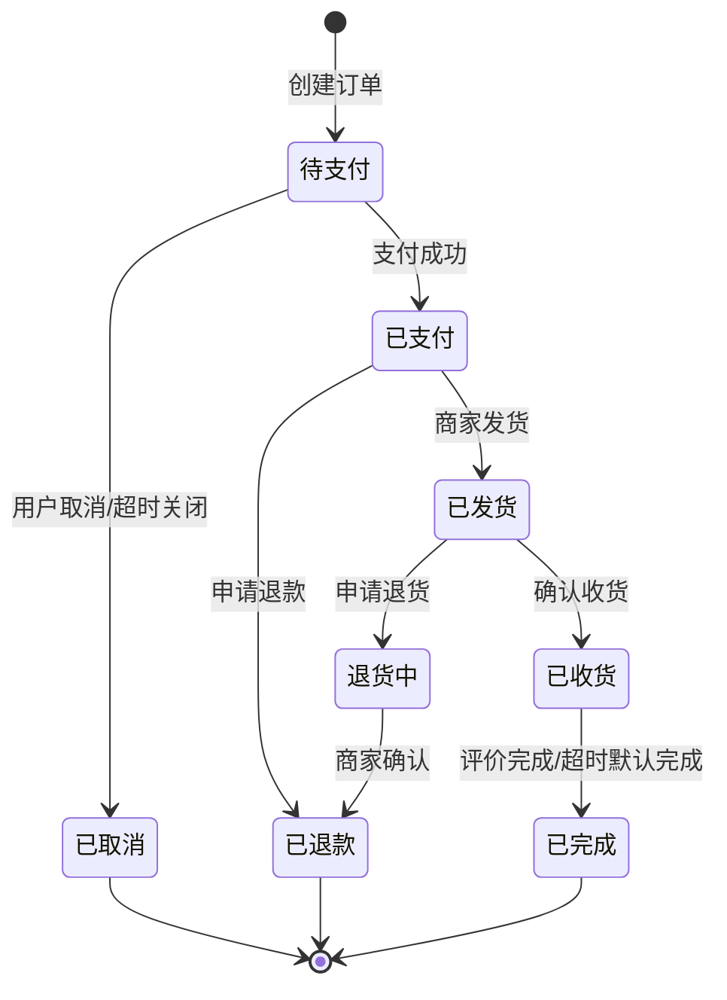
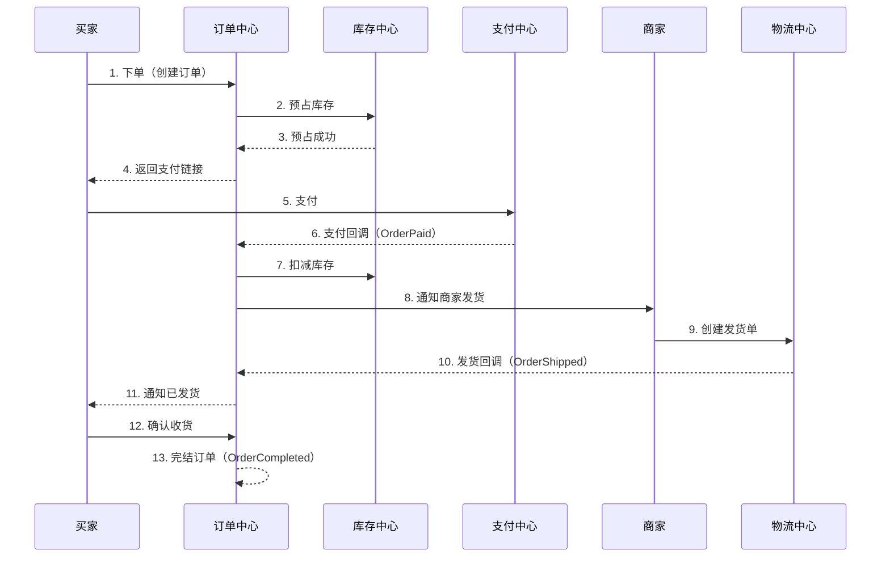
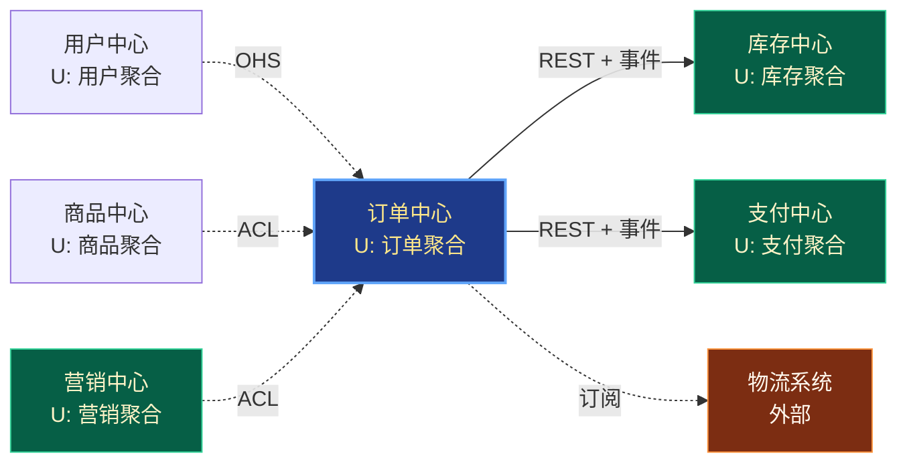
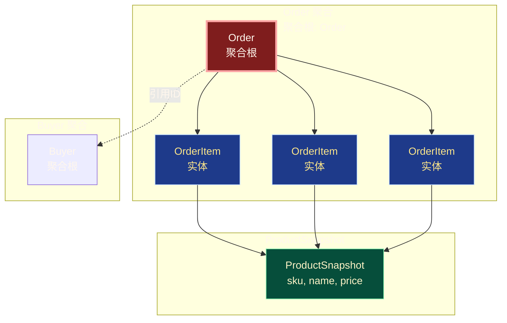
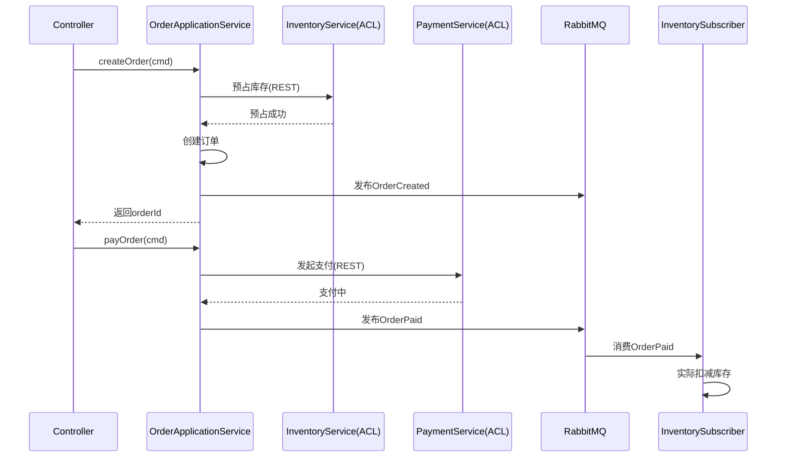
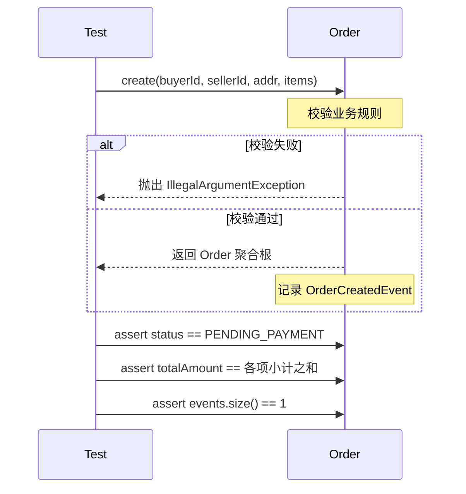

# 第15章 实战案例 - 电商订单系统

> 本章是整个DDD教程的**集大成章节**，我们将以电商订单系统为蓝本，把前14章学到的所有概念——通用语言、限界上下文、聚合、实体、值对象、领域服务、领域事件、仓储、CQRS、事件风暴——综合运用到一个真实可参考的落地方案中。读完本章，你将获得一个**完整的、可独立运行参考的代码骨架**，以及用它解决复杂业务问题的工程经验。

## 15.1 业务背景

### 15.1.1 电商系统的核心需求

电商系统是分布式系统设计领域的"Hello World"，它看似简单，实则包含了**商品、库存、订单、支付、物流、营销、用户**等几乎所有常见的业务形态。订单系统是电商的中枢——它向上承接用户购买意图，向下调度库存、支付、物流、促销等能力。

一个典型的B2C电商订单系统需要满足以下核心需求：

| 需求维度 | 关键能力 | 典型场景 |
|---------|---------|---------|
| 业务能力 | 下单、支付、发货、收货、退款 | 用户从浏览到售后全链路 |
| 一致性 | 库存不超卖、金额不串账、状态不非法跳转 | 高并发下扣减库存 |
| 性能 | 大促期间支撑10万QPS | 双11零点下单 |
| 扩展性 | 多种商品类型、多种促销活动叠加 | 预售、拼团、秒杀 |
| 可靠性 | 支付回调与订单状态最终一致 | 网络抖动下的补偿 |

### 15.1.2 订单的生命周期

一个订单从诞生到消亡会经历多个状态。我们用**事件风暴（Event Storming）** 的视角梳理一下：



> 图：订单状态机（stateDiagram-v2），红色高亮终态。

**关键状态转移事件**：

- `OrderCreated`（订单已创建）
- `OrderPaid`（订单已支付）
- `OrderShipped`（订单已发货）
- `OrderCompleted`（订单已完成）
- `OrderCancelled`（订单已取消）

这些事件既是状态变化的"原因"，也是下游系统（库存、支付、物流、营销）进行联动的"信号"。

---

## 15.2 领域分析（事件风暴视角）

### 15.2.1 核心业务流程

我们以**事件风暴**工作坊的方式梳理电商核心流程。事件风暴按时间轴将业务流程拆分为**事件（Event）**、**命令（Command）**、**聚合（Aggregate）**、**读模型（Read Model）**、**外部系统（External System）**。



> 图：订单全链路时序图，橘红色代表事件，蓝色代表命令。

### 15.2.2 关键角色

事件风暴中，**角色（Actor）** 是命令的发起者：

| 角色 | 关键诉求 | 主要命令 |
|------|---------|---------|
| **买家** | 顺利下单、快速收货 | 下单、支付、取消、确认收货 |
| **商家** | 准确发货、减少纠纷 | 发货、拒绝订单 |
| **平台** | 资金安全、规则统一 | 强制关闭、退款审核 |
| **支付网关**（外部系统） | 准确收款 | 支付回调 |
| **物流系统**（外部系统） | 实时轨迹 | 发货回调 |

### 15.2.3 业务规则清单

通过与领域专家的对话，我们识别出如下业务规则（**不变量 Invariants**）：

1. **金额一致性**：订单总金额 = 所有订单项金额之和 - 优惠金额
2. **库存不超卖**：下单时必须预占库存，支付成功后实际扣减
3. **状态机封闭性**：订单状态只能按定义的方向转移
4. **金额合法性**：订单金额必须大于0，单笔订单上限1万元
5. **支付幂等性**：同一笔订单的多次支付回调必须幂等
6. **取消权限**：只有待支付状态的订单才能被用户主动取消
7. **发货前置条件**：只有已支付状态的订单才能发货
8. **收货时限**：发货后15天未确认收货，系统自动确认

这些规则必须由**领域层**而非应用层来守护，因为它们是**业务本质**而非技术实现。

---

## 15.3 限界上下文划分

### 15.3.1 战略设计：六大上下文

基于业务分析，我们采用**业务能力 + 组织架构**的维度划分限界上下文：

| 限界上下文 | 核心子域 | 业务能力 | 团队 |
|----------|---------|---------|------|
| **用户中心** | 通用子域 | 注册、登录、实名 | 用户团队 |
| **商品中心** | 核心子域 | 类目、SPU、SKU | 商品团队 |
| **订单中心** | 核心子域 | 订单生命周期 | 交易团队 |
| **库存中心** | 支撑子域 | 库存预占/扣减/归还 | 仓储团队 |
| **支付中心** | 支撑子域 | 收银、对账 | 财务团队 |
| **营销中心** | 支撑子域 | 优惠券、满减、拼团 | 营销团队 |

> 注意：订单中心和库存中心是**核心+支撑**关系，订单对库存的依赖通过**防腐层（ACL）** 屏蔽细节。

### 15.3.2 上下文映射图

我们用 mermaid 的 `graph` 语法绘制**上下文映射图（Context Map）**，展示不同上下文之间的协作关系与集成模式：



> 图：上下文映射图。蓝色（`#1e3a8a`）代表核心子域，绿色代表支撑子域，橘色代表外部系统。

**集成模式说明**：

- `OHS`（Open Host Service）：用户中心通过标准API对外开放，订单中心按需调用。
- `ACL`（Anti-Corruption Layer）：商品中心、营销中心向订单中心提供防腐层，订单不直接依赖其内部模型。
- `事件驱动`：订单与库存、支付通过领域事件 + MQ 实现最终一致性。
- `发布/订阅**：订单订阅物流的发货状态变更。

---

## 15.4 本章重点：订单中心的详细设计

下面我们聚焦到**订单中心**这个核心子域，给出完整的DDD设计。它是整章的**重点内容**。

### 15.4.1 订单上下文的限界上下文

订单上下文对外的**契约**（即上下文映射中的角色）：

- **上游角色**（被依赖）：被商品中心、营销中心依赖（提供下单前置信息）
- **下游角色**（依赖方）：依赖用户中心（获取买家信息）、库存中心（预占/扣减库存）、支付中心（发起支付）、物流系统（订阅发货状态）

### 15.4.2 通用语言（订单上下文）

通用语言（Ubiquitous Language）是团队内部对齐的**业务词汇表**。订单上下文的核心术语如下：

| 中文术语 | 英文术语 | 含义 |
|---------|---------|------|
| 订单 | Order | 用户购买意图的聚合 |
| 订单项 | OrderItem | 订单中的单个商品条目 |
| 订单编号 | OrderId | 订单唯一标识 |
| 订单状态 | OrderStatus | 订单当前所处阶段 |
| 收货地址 | Address | 订单的配送目的地 |
| 金额 | Money | 货币与数量组合 |
| 买家 | Buyer | 订单的发起方 |
| 商家 | Seller | 订单的履约方 |
| 下单 | PlaceOrder | 创建订单的命令 |
| 支付 | Pay | 完成支付的动作 |
| 发货 | Ship | 商家发出商品 |
| 取消 | Cancel | 用户放弃订单 |

> **重要**：在代码中，命名必须严格遵循通用语言，避免出现 `OrderInfo`、`OrderData` 这种与技术视角混淆的命名。

### 15.4.3 核心聚合

聚合是DDD中**一致性边界**的最小单位。订单上下文的聚合划分：



> 图：订单聚合结构。暗红色代表聚合根，蓝色代表实体，绿色代表值对象。

**聚合设计要点**：

1. **Order 是聚合根**：外部只能通过 Order 访问 OrderItem，不能直接 new 一个 OrderItem 塞进去。
2. **Buyer 只持有 ID**：Buyer 是另一个聚合的根，Order 不能持有 Buyer 对象（破坏聚合边界）。
3. **ProductSnapshot 是值对象**：下单时商品信息要**快照**到订单里，避免商品改名/改价后订单信息失真。
4. **事务边界**：单个 Order 聚合的修改在一个事务内完成；跨聚合（订单+库存）通过事件最终一致。

---

## 15.5 核心聚合设计

### 15.5.1 Order 聚合根

Order 聚合根是整个设计的核心，它需要满足：

- **封装性**：所有状态变更通过方法调用，对外不暴露 setter。
- **不变量守护**：金额、状态、库存等规则在方法内校验。
- **事件发布**：状态变化时记录领域事件，由基础设施层负责发布。

### 15.5.2 业务规则清单

我们用一份"业务规则检查表"来指导代码实现：

| 编号 | 规则 | 实现位置 | 触发命令 |
|------|------|---------|---------|
| R1 | 订单至少包含1个订单项 | `Order.create()` | 下单 |
| R2 | 订单项数量必须>0 | `OrderItem` 构造器 | 下单 |
| R3 | 订单总金额 = 各项小计之和 | `Order.calculateTotalAmount()` | 下单/编辑 |
| R4 | 单笔订单金额上限1万元 | `Order.create()` | 下单 |
| R5 | 待支付状态才能取消 | `Order.cancel()` | 取消 |
| R6 | 已支付状态才能发货 | `Order.ship()` | 发货 |
| R7 | 发货后才能确认收货 | `Order.confirmReceipt()` | 收货 |
| R8 | 状态转移必须记录事件 | `Order` 内部 | 所有 |

---

## 15.6 完整代码实现

下面进入**代码实现**环节。我们将完整呈现订单上下文的代码骨架，每个文件 50-200 行，关键业务方法都配有 JavaDoc 注释。**所有 Java 文件按四层架构组织**：

- `domain`（领域层）：业务核心
- `application`（应用层）：用例编排
- `infrastructure`（基础设施层）：技术实现
- `interfaces`（用户接口层）：对外暴露

### 15.6.1 领域层

#### 文件 1：`Money.java` —— 通用值对象

```java
package com.example.ecommerce.order.domain.model.valueobject;

import lombok.Getter;
import lombok.EqualsAndHashCode;
import java.math.BigDecimal;
import java.math.RoundingMode;
import java.util.Currency;

/**
 * 金额值对象
 * <p>
 * 表达"多少货币"的复合值，由金额数值和货币单位组成。
 * 作为值对象，它不可变，所有运算返回新实例。
 * </p>
 *
 * @author DDD Tutorial
 * @since 1.0
 */
@Getter
@EqualsAndHashCode
public final class Money {

    /** 零金额常量，方便外部复用 */
    public static final Money ZERO = new Money(BigDecimal.ZERO, Currency.getInstance("CNY"));

    /** 金额数值 */
    private final BigDecimal amount;

    /** 货币单位 */
    private final Currency currency;

    /**
     * 构造金额值对象
     *
     * @param amount   金额数值，不能为null
     * @param currency 货币单位，不能为null
     */
    public Money(BigDecimal amount, Currency currency) {
        if (amount == null) {
            throw new IllegalArgumentException("金额不能为空");
        }
        if (currency == null) {
            throw new IllegalArgumentException("货币单位不能为空");
        }
        this.amount = amount.setScale(2, RoundingMode.HALF_UP);
        this.currency = currency;
    }

    /**
     * 工厂方法：人民币
     */
    public static Money cny(BigDecimal amount) {
        return new Money(amount, Currency.getInstance("CNY"));
    }

    /**
     * 加法
     */
    public Money add(Money other) {
        assertSameCurrency(other);
        return new Money(this.amount.add(other.amount), this.currency);
    }

    /**
     * 减法
     */
    public Money subtract(Money other) {
        assertSameCurrency(other);
        return new Money(this.amount.subtract(other.amount), this.currency);
    }

    /**
     * 乘法（按数量计算总价）
     */
    public Money multiply(int multiplier) {
        if (multiplier < 0) {
            throw new IllegalArgumentException("乘数不能为负数");
        }
        return new Money(this.amount.multiply(BigDecimal.valueOf(multiplier)), this.currency);
    }

    /**
     * 大于比较
     */
    public boolean isGreaterThan(Money other) {
        assertSameCurrency(other);
        return this.amount.compareTo(other.amount) > 0;
    }

    /**
     * 大于0判定
     */
    public boolean isPositive() {
        return this.amount.compareTo(BigDecimal.ZERO) > 0;
    }

    private void assertSameCurrency(Money other) {
        if (!this.currency.equals(other.currency)) {
            throw new IllegalArgumentException("货币单位不一致");
        }
    }

    @Override
    public String toString() {
        return amount.toPlainString() + " " + currency.getCurrencyCode();
    }
}
```

#### 文件 2：`OrderId.java` —— 标识符值对象

```java
package com.example.ecommerce.order.domain.model.valueobject;

import lombok.EqualsAndHashCode;
import lombok.Getter;
import java.util.UUID;

/**
 * 订单标识符值对象
 * <p>
 * 用 UUID 实现全局唯一。封装类型比 String 更安全：
 * 编译器可以防止把用户ID误传到订单ID参数。
 * </p>
 *
 * @author DDD Tutorial
 */
@Getter
@EqualsAndHashCode
public final class OrderId {

    /** 订单唯一标识字符串 */
    private final String value;

    private OrderId(String value) {
        if (value == null || value.isBlank()) {
            throw new IllegalArgumentException("订单ID不能为空");
        }
        this.value = value;
    }

    /**
     * 生成新的订单ID
     */
    public static OrderId generate() {
        return new OrderId(UUID.randomUUID().toString().replace("-", ""));
    }

    /**
     * 从字符串恢复（用于仓储反序列化）
     */
    public static OrderId of(String value) {
        return new OrderId(value);
    }

    @Override
    public String toString() {
        return value;
    }
}
```

#### 文件 3：`OrderStatus.java` —— 订单状态枚举

```java
package com.example.ecommerce.order.domain.model.valueobject;

import lombok.Getter;
import java.util.EnumSet;
import java.util.Set;

/**
 * 订单状态枚举
 * <p>
 * 状态机是订单聚合的"骨架"，任何状态变更都必须经过允许的转移路径。
 * </p>
 *
 * @author DDD Tutorial
 */
@Getter
public enum OrderStatus {

    /** 待支付 */
    PENDING_PAYMENT("待支付"),

    /** 已支付 */
    PAID("已支付"),

    /** 已发货 */
    SHIPPED("已发货"),

    /** 已完成 */
    COMPLETED("已完成"),

    /** 已取消 */
    CANCELLED("已取消");

    private final String description;

    OrderStatus(String description) {
        this.description = description;
    }

    /**
     * 判断是否可以转移到目标状态
     *
     * @param target 目标状态
     * @return true-允许
     */
    public boolean canTransitTo(OrderStatus target) {
        return ALLOWED_TRANSITIONS.getOrDefault(this, EnumSet.noneOf(OrderStatus.class))
                .contains(target);
    }

    /**
     * 允许的状态转移矩阵
     */
    private static final java.util.Map<OrderStatus, Set<OrderStatus>> ALLOWED_TRANSITIONS =
            new java.util.EnumMap<>(OrderStatus.class);

    static {
        ALLOWED_TRANSITIONS.put(PENDING_PAYMENT, EnumSet.of(PAID, CANCELLED));
        ALLOWED_TRANSITIONS.put(PAID, EnumSet.of(SHIPPED, CANCELLED));
        ALLOWED_TRANSITIONS.put(SHIPPED, EnumSet.of(COMPLETED));
        ALLOWED_TRANSITIONS.put(COMPLETED, EnumSet.noneOf(OrderStatus.class));
        ALLOWED_TRANSITIONS.put(CANCELLED, EnumSet.noneOf(OrderStatus.class));
    }

    /**
     * 终态判定
     */
    public boolean isFinal() {
        return this == COMPLETED || this == CANCELLED;
    }
}
```

#### 文件 4：`Address.java` —— 收货地址值对象

```java
package com.example.ecommerce.order.domain.model.valueobject;

import lombok.EqualsAndHashCode;
import lombok.Getter;

/**
 * 收货地址值对象
 * <p>
 * 表达用户的收货信息。下单时拷贝一份到订单中，作为不可变快照。
 * </p>
 *
 * @author DDD Tutorial
 */
@Getter
@EqualsAndHashCode
public final class Address {

    /** 收货人姓名 */
    private final String receiverName;

    /** 收货人电话 */
    private final String receiverPhone;

    /** 省 */
    private final String province;

    /** 市 */
    private final String city;

    /** 区/县 */
    private final String district;

    /** 详细地址 */
    private final String detail;

    public Address(String receiverName, String receiverPhone,
                   String province, String city, String district, String detail) {
        if (receiverName == null || receiverName.isBlank()) {
            throw new IllegalArgumentException("收货人姓名不能为空");
        }
        if (receiverPhone == null || !receiverPhone.matches("\\d{11}")) {
            throw new IllegalArgumentException("收货人电话格式不正确");
        }
        if (province == null || city == null || district == null || detail == null) {
            throw new IllegalArgumentException("收货地址不完整");
        }
        this.receiverName = receiverName;
        this.receiverPhone = receiverPhone;
        this.province = province;
        this.city = city;
        this.district = district;
        this.detail = detail;
    }

    /**
     * 拼接完整地址
     */
    public String fullAddress() {
        return province + city + district + detail;
    }

    @Override
    public String toString() {
        return fullAddress() + " (" + receiverName + " " + receiverPhone + ")";
    }
}
```

#### 文件 5：`OrderItem.java` —— 订单项实体

```java
package com.example.ecommerce.order.domain.model.entity;

import com.example.ecommerce.order.domain.model.valueobject.Money;
import com.example.ecommerce.order.domain.model.valueobject.OrderId;
import lombok.Getter;
import java.util.UUID;

/**
 * 订单项实体
 * <p>
 * 代表订单中的一条商品记录。订单项是实体（有ID），但它的生命周期完全由聚合根管理。
 * </p>
 *
 * @author DDD Tutorial
 */
@Getter
public class OrderItem {

    /** 订单项ID（聚合内唯一） */
    private final String itemId;

    /** 商品SKU */
    private final String skuId;

    /** 商品名称（下单时快照） */
    private final String productName;

    /** 商品单价（下单时快照） */
    private final Money unitPrice;

    /** 购买数量 */
    private int quantity;

    /** 所属订单ID */
    private final OrderId orderId;

    /**
     * 构造订单项
     *
     * @param skuId       商品SKU
     * @param productName 商品名称
     * @param unitPrice   单价
     * @param quantity    数量
     * @param orderId     所属订单ID
     */
    public OrderItem(String skuId, String productName, Money unitPrice, int quantity, OrderId orderId) {
        if (skuId == null || skuId.isBlank()) {
            throw new IllegalArgumentException("商品SKU不能为空");
        }
        if (productName == null || productName.isBlank()) {
            throw new IllegalArgumentException("商品名称不能为空");
        }
        if (unitPrice == null || !unitPrice.isPositive()) {
            throw new IllegalArgumentException("商品单价必须大于0");
        }
        if (quantity <= 0) {
            throw new IllegalArgumentException("购买数量必须大于0");
        }
        this.itemId = UUID.randomUUID().toString().replace("-", "").substring(0, 16);
        this.skuId = skuId;
        this.productName = productName;
        this.unitPrice = unitPrice;
        this.quantity = quantity;
        this.orderId = orderId;
    }

    /**
     * 计算订单项小计
     */
    public Money subtotal() {
        return unitPrice.multiply(quantity);
    }

    /**
     * 修改数量（订单未支付前允许修改）
     */
    public void changeQuantity(int newQuantity) {
        if (newQuantity <= 0) {
            throw new IllegalArgumentException("购买数量必须大于0");
        }
        this.quantity = newQuantity;
    }
}
```

#### 文件 6：`Order.java` —— 订单聚合根

```java
package com.example.ecommerce.order.domain.model.aggregate;

import com.example.ecommerce.order.domain.event.*;
import com.example.ecommerce.order.domain.model.entity.OrderItem;
import com.example.ecommerce.order.domain.model.valueobject.Address;
import com.example.ecommerce.order.domain.model.valueobject.Money;
import com.example.ecommerce.order.domain.model.valueobject.OrderId;
import com.example.ecommerce.order.domain.model.valueobject.OrderStatus;
import lombok.Getter;
import java.time.LocalDateTime;
import java.util.ArrayList;
import java.util.Collections;
import java.util.List;

/**
 * 订单聚合根
 * <p>
 * 订单的"宪法"。所有订单相关的业务规则都在这里。
 * 外部不能直接 new 一个 OrderItem 加进来，必须通过 Order 的方法。
 * </p>
 *
 * @author DDD Tutorial
 */
@Getter
public class Order {

    /** 订单ID */
    private final OrderId orderId;

    /** 买家ID（跨聚合，仅持引用） */
    private final String buyerId;

    /** 商家ID */
    private final String sellerId;

    /** 收货地址（下单时快照） */
    private final Address shippingAddress;

    /** 订单项列表 */
    private final List<OrderItem> items;

    /** 订单状态 */
    private OrderStatus status;

    /** 订单总金额 */
    private Money totalAmount;

    /** 创建时间 */
    private final LocalDateTime createdAt;

    /** 支付时间 */
    private LocalDateTime paidAt;

    /** 发货时间 */
    private LocalDateTime shippedAt;

    /** 完成时间 */
    private LocalDateTime completedAt;

    /** 取消时间 */
    private LocalDateTime cancelledAt;

    /** 领域事件列表（变更暂存） */
    private final List<DomainEvent> domainEvents = new ArrayList<>();

    /**
     * 私有构造器，强制使用工厂方法
     */
    private Order(OrderId orderId, String buyerId, String sellerId,
                  Address shippingAddress, List<OrderItem> items,
                  LocalDateTime createdAt) {
        this.orderId = orderId;
        this.buyerId = buyerId;
        this.sellerId = sellerId;
        this.shippingAddress = shippingAddress;
        this.items = new ArrayList<>(items);
        this.status = OrderStatus.PENDING_PAYMENT;
        this.totalAmount = calculateTotalAmount();
        this.createdAt = createdAt;
    }

    /**
     * 工厂方法：创建订单
     * <p>
     * 关键不变量校验：至少1个订单项、金额上限。
     * </p>
     */
    public static Order create(String buyerId, String sellerId,
                               Address shippingAddress, List<OrderItem> items) {
        if (buyerId == null || buyerId.isBlank()) {
            throw new IllegalArgumentException("买家ID不能为空");
        }
        if (sellerId == null || sellerId.isBlank()) {
            throw new IllegalArgumentException("商家ID不能为空");
        }
        if (shippingAddress == null) {
            throw new IllegalArgumentException("收货地址不能为空");
        }
        if (items == null || items.isEmpty()) {
            throw new IllegalArgumentException("订单至少包含一个订单项");
        }
        OrderId orderId = OrderId.generate();
        LocalDateTime now = LocalDateTime.now();
        Order order = new Order(orderId, buyerId, sellerId, shippingAddress, items, now);

        // 业务规则 R4: 金额上限1万元
        if (order.totalAmount.isGreaterThan(Money.cny(new java.math.BigDecimal("10000")))) {
            throw new IllegalArgumentException("单笔订单金额上限1万元");
        }

        // 发布订单创建事件
        order.domainEvents.add(new OrderCreatedEvent(
                orderId, buyerId, sellerId, order.totalAmount, now));
        return order;
    }

    /**
     * 计算订单总金额
     */
    private Money calculateTotalAmount() {
        Money sum = Money.ZERO;
        for (OrderItem item : items) {
            sum = sum.add(item.subtotal());
        }
        return sum;
    }

    /**
     * 支付订单
     * <p>
     * 业务规则 R6: 只有待支付订单才能支付。
     * </p>
     */
    public void pay() {
        if (!status.canTransitTo(OrderStatus.PAID)) {
            throw new IllegalStateException("当前状态[" + status + "]不能支付");
        }
        this.status = OrderStatus.PAID;
        this.paidAt = LocalDateTime.now();
        domainEvents.add(new OrderPaidEvent(orderId, buyerId, totalAmount, paidAt));
    }

    /**
     * 发货
     * <p>
     * 业务规则 R7: 只有已支付订单才能发货。
     * </p>
     */
    public void ship() {
        if (!status.canTransitTo(OrderStatus.SHIPPED)) {
            throw new IllegalStateException("当前状态[" + status + "]不能发货");
        }
        this.status = OrderStatus.SHIPPED;
        this.shippedAt = LocalDateTime.now();
        domainEvents.add(new OrderShippedEvent(orderId, buyerId, shippedAt));
    }

    /**
     * 确认收货
     */
    public void confirmReceipt() {
        if (!status.canTransitTo(OrderStatus.COMPLETED)) {
            throw new IllegalStateException("当前状态[" + status + "]不能确认收货");
        }
        this.status = OrderStatus.COMPLETED;
        this.completedAt = LocalDateTime.now();
        domainEvents.add(new OrderCompletedEvent(orderId, buyerId, completedAt));
    }

    /**
     * 取消订单
     * <p>
     * 业务规则 R5: 只有待支付/已支付订单可取消。
     * </p>
     */
    public void cancel(String reason) {
        if (status.isFinal()) {
            throw new IllegalStateException("订单已终结，不能取消");
        }
        if (!status.canTransitTo(OrderStatus.CANCELLED)) {
            throw new IllegalStateException("当前状态[" + status + "]不能取消");
        }
        this.status = OrderStatus.CANCELLED;
        this.cancelledAt = LocalDateTime.now();
        domainEvents.add(new OrderCancelledEvent(orderId, buyerId, reason, cancelledAt));
    }

    /**
     * 获取只读的领域事件列表
     */
    public List<DomainEvent> getDomainEvents() {
        return Collections.unmodifiableList(domainEvents);
    }

    /**
     * 清空已发布的事件（基础设施层发布后调用）
     */
    public void clearDomainEvents() {
        domainEvents.clear();
    }

    /**
     * 仓储反序列化使用的工厂
     */
    public static Order reconstitute(OrderId orderId, String buyerId, String sellerId,
                                      Address shippingAddress, List<OrderItem> items,
                                      OrderStatus status, Money totalAmount,
                                      LocalDateTime createdAt, LocalDateTime paidAt,
                                      LocalDateTime shippedAt, LocalDateTime completedAt,
                                      LocalDateTime cancelledAt) {
        Order order = new Order(orderId, buyerId, sellerId, shippingAddress, items, createdAt);
        order.status = status;
        order.totalAmount = totalAmount;
        order.paidAt = paidAt;
        order.shippedAt = shippedAt;
        order.completedAt = completedAt;
        order.cancelledAt = cancelledAt;
        return order;
    }
}
```

#### 文件 7：`DomainEvent.java` —— 领域事件标记接口

```java
package com.example.ecommerce.order.domain.event;

import java.time.LocalDateTime;

/**
 * 领域事件标记接口
 * <p>
 * 所有领域事件都必须实现该接口，便于统一发布和订阅。
 * </p>
 *
 * @author DDD Tutorial
 */
public interface DomainEvent {

    /**
     * 事件发生时间
     */
    LocalDateTime occurredOn();

    /**
     * 事件类型
     */
    String eventType();
}
```

#### 文件 8 - 12：五个领域事件

```java
package com.example.ecommerce.order.domain.event;

import com.example.ecommerce.order.domain.model.valueobject.Money;
import com.example.ecommerce.order.domain.model.valueobject.OrderId;
import lombok.Getter;
import java.time.LocalDateTime;

/**
 * 订单已创建事件
 *
 * @author DDD Tutorial
 */
@Getter
public class OrderCreatedEvent implements DomainEvent {

    private final OrderId orderId;
    private final String buyerId;
    private final String sellerId;
    private final Money totalAmount;
    private final LocalDateTime occurredAt;

    public OrderCreatedEvent(OrderId orderId, String buyerId, String sellerId,
                             Money totalAmount, LocalDateTime occurredAt) {
        this.orderId = orderId;
        this.buyerId = buyerId;
        this.sellerId = sellerId;
        this.totalAmount = totalAmount;
        this.occurredAt = occurredAt;
    }

    @Override
    public LocalDateTime occurredOn() {
        return occurredAt;
    }

    @Override
    public String eventType() {
        return "OrderCreated";
    }
}
```

```java
package com.example.ecommerce.order.domain.event;

import com.example.ecommerce.order.domain.model.valueobject.Money;
import com.example.ecommerce.order.domain.model.valueobject.OrderId;
import lombok.Getter;
import java.time.LocalDateTime;

/**
 * 订单已支付事件
 * <p>
 * 库存中心订阅该事件以实际扣减库存。
 * </p>
 *
 * @author DDD Tutorial
 */
@Getter
public class OrderPaidEvent implements DomainEvent {

    private final OrderId orderId;
    private final String buyerId;
    private final Money paidAmount;
    private final LocalDateTime occurredAt;

    public OrderPaidEvent(OrderId orderId, String buyerId, Money paidAmount, LocalDateTime occurredAt) {
        this.orderId = orderId;
        this.buyerId = buyerId;
        this.paidAmount = paidAmount;
        this.occurredAt = occurredAt;
    }

    @Override
    public LocalDateTime occurredOn() {
        return occurredAt;
    }

    @Override
    public String eventType() {
        return "OrderPaid";
    }
}
```

```java
package com.example.ecommerce.order.domain.event;

import com.example.ecommerce.order.domain.model.valueobject.OrderId;
import lombok.Getter;
import java.time.LocalDateTime;

/**
 * 订单已发货事件
 * <p>
 * 通知买家、开启自动确认收货倒计时。
 * </p>
 *
 * @author DDD Tutorial
 */
@Getter
public class OrderShippedEvent implements DomainEvent {

    private final OrderId orderId;
    private final String buyerId;
    private final LocalDateTime occurredAt;

    public OrderShippedEvent(OrderId orderId, String buyerId, LocalDateTime occurredAt) {
        this.orderId = orderId;
        this.buyerId = buyerId;
        this.occurredAt = occurredAt;
    }

    @Override
    public LocalDateTime occurredOn() {
        return occurredAt;
    }

    @Override
    public String eventType() {
        return "OrderShipped";
    }
}
```

```java
package com.example.ecommerce.order.domain.event;

import com.example.ecommerce.order.domain.model.valueobject.OrderId;
import lombok.Getter;
import java.time.LocalDateTime;

/**
 * 订单已完成事件
 *
 * @author DDD Tutorial
 */
@Getter
public class OrderCompletedEvent implements DomainEvent {

    private final OrderId orderId;
    private final String buyerId;
    private final LocalDateTime occurredAt;

    public OrderCompletedEvent(OrderId orderId, String buyerId, LocalDateTime occurredAt) {
        this.orderId = orderId;
        this.buyerId = buyerId;
        this.occurredAt = occurredAt;
    }

    @Override
    public LocalDateTime occurredOn() {
        return occurredAt;
    }

    @Override
    public String eventType() {
        return "OrderCompleted";
    }
}
```

```java
package com.example.ecommerce.order.domain.event;

import com.example.ecommerce.order.domain.model.valueobject.OrderId;
import lombok.Getter;
import java.time.LocalDateTime;

/**
 * 订单已取消事件
 * <p>
 * 库存中心订阅该事件以归还预占库存。
 * </p>
 *
 * @author DDD Tutorial
 */
@Getter
public class OrderCancelledEvent implements DomainEvent {

    private final OrderId orderId;
    private final String buyerId;
    private final String reason;
    private final LocalDateTime occurredAt;

    public OrderCancelledEvent(OrderId orderId, String buyerId, String reason, LocalDateTime occurredAt) {
        this.orderId = orderId;
        this.buyerId = buyerId;
        this.reason = reason;
        this.occurredAt = occurredAt;
    }

    @Override
    public LocalDateTime occurredOn() {
        return occurredAt;
    }

    @Override
    public String eventType() {
        return "OrderCancelled";
    }
}
```

#### 文件 13：`OrderRepository.java` —— 仓储接口

```java
package com.example.ecommerce.order.domain.repository;

import com.example.ecommerce.order.domain.model.aggregate.Order;
import com.example.ecommerce.order.domain.model.valueobject.OrderId;
import java.util.Optional;

/**
 * 订单仓储接口
 * <p>
 * 属于领域层，定义"找订单"和"存订单"的契约。
 * 基础设施层负责实现，领域层只关心接口。
 * </p>
 *
 * @author DDD Tutorial
 */
public interface OrderRepository {

    /**
     * 保存订单
     *
     * @param order 订单聚合根
     */
    void save(Order order);

    /**
     * 根据ID查询订单
     *
     * @param orderId 订单ID
     * @return 订单Optional包装
     */
    Optional<Order> findById(OrderId orderId);

    /**
     * 根据买家查询订单列表
     *
     * @param buyerId 买家ID
     * @return 订单列表
     */
    java.util.List<Order> findByBuyerId(String buyerId);
}
```

#### 文件 14：`OrderDomainService.java` —— 领域服务

```java
package com.example.ecommerce.order.domain.service;

import com.example.ecommerce.order.domain.model.aggregate.Order;
import com.example.ecommerce.order.domain.model.valueobject.Money;
import org.springframework.stereotype.Service;
import java.util.List;

/**
 * 订单领域服务
 * <p>
 * 跨聚合的业务逻辑、或不适合放在单个聚合里的复杂规则，放到领域服务。
 * 例如：批量取消订单时的退款金额汇总。
 * </p>
 *
 * @author DDD Tutorial
 */
@Service
public class OrderDomainService {

    /**
     * 汇总多个订单的总金额
     *
     * @param orders 订单列表
     * @return 总金额
     */
    public Money sumTotalAmount(List<Order> orders) {
        if (orders == null || orders.isEmpty()) {
            return Money.ZERO;
        }
        Money sum = Money.ZERO;
        for (Order order : orders) {
            sum = sum.add(order.getTotalAmount());
        }
        return sum;
    }

    /**
     * 检查订单是否可以合并发货
     * <p>
     * 同一买家、同一收货地址的多个订单可以合并发货。
     * </p>
     */
    public boolean canShipTogether(Order order1, Order order2) {
        if (order1 == null || order2 == null) {
            return false;
        }
        boolean sameBuyer = order1.getBuyerId().equals(order2.getBuyerId());
        boolean sameAddress = order1.getShippingAddress().equals(order2.getShippingAddress());
        boolean bothPaid = order1.getStatus().name().equals("PAID")
                && order2.getStatus().name().equals("PAID");
        return sameBuyer && sameAddress && bothPaid;
    }
}
```

### 15.6.2 应用层

#### 文件 15：`OrderApplicationService.java` —— 订单应用服务

```java
package com.example.ecommerce.order.application.service;

import com.example.ecommerce.order.application.command.*;
import com.example.ecommerce.order.domain.event.DomainEvent;
import com.example.ecommerce.order.domain.model.aggregate.Order;
import com.example.ecommerce.order.domain.model.entity.OrderItem;
import com.example.ecommerce.order.domain.model.valueobject.Address;
import com.example.ecommerce.order.domain.model.valueobject.OrderId;
import com.example.ecommerce.order.domain.repository.OrderRepository;
import com.example.ecommerce.order.infrastructure.event.EventPublisher;
import lombok.RequiredArgsConstructor;
import lombok.extern.slf4j.Slf4j;
import org.springframework.stereotype.Service;
import org.springframework.transaction.annotation.Transactional;
import java.util.List;
import java.util.stream.Collectors;

/**
 * 订单应用服务
 * <p>
 * 应用层是"用例编排器"：负责事务、权限、日志、调用仓储和发布事件。
 * <strong>不包含业务规则</strong>，业务规则全部下沉到领域层。
 * </p>
 *
 * @author DDD Tutorial
 */
@Slf4j
@Service
@RequiredArgsConstructor
public class OrderApplicationService {

    private final OrderRepository orderRepository;
    private final EventPublisher eventPublisher;

    /**
     * 用例1：创建订单
     */
    @Transactional(rollbackFor = Exception.class)
    public OrderId createOrder(CreateOrderCommand command) {
        log.info("开始创建订单, buyerId={}", command.getBuyerId());

        // 1. 组装地址值对象
        Address address = new Address(
                command.getReceiverName(),
                command.getReceiverPhone(),
                command.getProvince(),
                command.getCity(),
                command.getDistrict(),
                command.getDetail());

        // 2. 组装订单项
        List<OrderItem> items = command.getItems().stream()
                .map(item -> new OrderItem(
                        item.getSkuId(),
                        item.getProductName(),
                        item.getUnitPrice(),
                        item.getQuantity(),
                        null)) // orderId 暂时为null，Order.create时会分配
                .collect(Collectors.toList());

        // 3. 创建订单（领域层校验业务规则）
        Order order = Order.create(
                command.getBuyerId(),
                command.getSellerId(),
                address,
                items);

        // 4. 持久化
        orderRepository.save(order);

        // 5. 发布领域事件
        publishEvents(order);

        log.info("订单创建成功, orderId={}", order.getOrderId());
        return order.getOrderId();
    }

    /**
     * 用例2：支付订单
     */
    @Transactional(rollbackFor = Exception.class)
    public void payOrder(PayOrderCommand command) {
        log.info("开始支付订单, orderId={}", command.getOrderId());
        Order order = loadOrder(command.getOrderId());
        order.pay();
        orderRepository.save(order);
        publishEvents(order);
        log.info("订单支付成功, orderId={}", command.getOrderId());
    }

    /**
     * 用例3：发货
     */
    @Transactional(rollbackFor = Exception.class)
    public void shipOrder(ShipOrderCommand command) {
        log.info("开始发货, orderId={}", command.getOrderId());
        Order order = loadOrder(command.getOrderId());
        order.ship();
        orderRepository.save(order);
        publishEvents(order);
        log.info("订单发货成功, orderId={}", command.getOrderId());
    }

    /**
     * 用例4：取消订单
     */
    @Transactional(rollbackFor = Exception.class)
    public void cancelOrder(CancelOrderCommand command) {
        log.info("开始取消订单, orderId={}, reason={}", command.getOrderId(), command.getReason());
        Order order = loadOrder(command.getOrderId());
        order.cancel(command.getReason());
        orderRepository.save(order);
        publishEvents(order);
        log.info("订单取消成功, orderId={}", command.getOrderId());
    }

    /**
     * 查询订单
     */
    public Order queryOrder(OrderId orderId) {
        return loadOrder(orderId);
    }

    /**
     * 加载订单（不存在时抛业务异常）
     */
    private Order loadOrder(OrderId orderId) {
        return orderRepository.findById(orderId)
                .orElseThrow(() -> new IllegalArgumentException("订单不存在: " + orderId));
    }

    /**
     * 发布领域事件
     */
    private void publishEvents(Order order) {
        List<DomainEvent> events = order.getDomainEvents();
        for (DomainEvent event : events) {
            try {
                eventPublisher.publish(event);
            } catch (Exception e) {
                log.error("事件发布失败, eventType={}", event.eventType(), e);
            }
        }
        order.clearDomainEvents();
    }
}
```

#### 文件 16 - 19：四个 Command 对象

```java
package com.example.ecommerce.order.application.command;

import lombok.Data;
import java.util.List;

/**
 * 创建订单命令
 *
 * @author DDD Tutorial
 */
@Data
public class CreateOrderCommand {

    /** 买家ID */
    private String buyerId;

    /** 商家ID */
    private String sellerId;

    /** 收货人姓名 */
    private String receiverName;

    /** 收货人电话 */
    private String receiverPhone;

    /** 省 */
    private String province;

    /** 市 */
    private String city;

    /** 区 */
    private String district;

    /** 详细地址 */
    private String detail;

    /** 订单项列表 */
    private List<OrderItemCommand> items;
}
```

```java
package com.example.ecommerce.order.application.command;

import com.example.ecommerce.order.domain.model.valueobject.Money;
import lombok.Data;

/**
 * 订单项命令
 *
 * @author DDD Tutorial
 */
@Data
public class OrderItemCommand {

    /** 商品SKU */
    private String skuId;

    /** 商品名称 */
    private String productName;

    /** 商品单价 */
    private Money unitPrice;

    /** 购买数量 */
    private int quantity;
}
```

```java
package com.example.ecommerce.order.application.command;

import com.example.ecommerce.order.domain.model.valueobject.OrderId;
import lombok.Data;

/**
 * 支付订单命令
 *
 * @author DDD Tutorial
 */
@Data
public class PayOrderCommand {

    /** 订单ID */
    private OrderId orderId;

    /** 支付渠道（ALIPAY/WECHAT） */
    private String payChannel;
}
```

```java
package com.example.ecommerce.order.application.command;

import com.example.ecommerce.order.domain.model.valueobject.OrderId;
import lombok.Data;

/**
 * 发货命令
 */
@Data
public class ShipOrderCommand {
    private OrderId orderId;
    private String trackingNumber;  // 物流单号
}
```

```java
package com.example.ecommerce.order.application.command;

import com.example.ecommerce.order.domain.model.valueobject.OrderId;
import lombok.Data;

/**
 * 取消订单命令
 */
@Data
public class CancelOrderCommand {
    private OrderId orderId;
    private String reason;
}
```

### 15.6.3 基础设施层

#### 文件 20：`OrderPO.java` —— 持久化对象

```java
package com.example.ecommerce.order.infrastructure.persistence;

import lombok.Data;
import javax.persistence.*;
import java.math.BigDecimal;
import java.time.LocalDateTime;

/**
 * 订单持久化对象（PO）
 * <p>
 * 与数据库表一一对应。PO 只属于基础设施层，绝不暴露到领域层。
 * 领域模型与 PO 通过 Converter 转换。
 * </p>
 *
 * @author DDD Tutorial
 */
@Data
@Entity
@Table(name = "t_order")
public class OrderPO {

    @Id
    @Column(name = "order_id", length = 32)
    private String orderId;

    @Column(name = "buyer_id", length = 32, nullable = false)
    private String buyerId;

    @Column(name = "seller_id", length = 32, nullable = false)
    private String sellerId;

    @Column(name = "receiver_name", length = 64)
    private String receiverName;

    @Column(name = "receiver_phone", length = 16)
    private String receiverPhone;

    @Column(name = "province", length = 32)
    private String province;

    @Column(name = "city", length = 32)
    private String city;

    @Column(name = "district", length = 32)
    private String district;

    @Column(name = "detail", length = 256)
    private String detail;

    @Column(name = "total_amount", precision = 12, scale = 2)
    private BigDecimal totalAmount;

    @Column(name = "status", length = 32)
    private String status;

    @Column(name = "created_at")
    private LocalDateTime createdAt;

    @Column(name = "paid_at")
    private LocalDateTime paidAt;

    @Column(name = "shipped_at")
    private LocalDateTime shippedAt;

    @Column(name = "completed_at")
    private LocalDateTime completedAt;

    @Column(name = "cancelled_at")
    private LocalDateTime cancelledAt;
}
```

#### 文件 21：`OrderItemPO.java` —— 订单项持久化对象

```java
package com.example.ecommerce.order.infrastructure.persistence;

import lombok.Data;
import javax.persistence.*;
import java.math.BigDecimal;

/**
 * 订单项持久化对象
 *
 * @author DDD Tutorial
 */
@Data
@Entity
@Table(name = "t_order_item")
public class OrderItemPO {

    @Id
    @Column(name = "item_id", length = 16)
    private String itemId;

    @Column(name = "order_id", length = 32, nullable = false)
    private String orderId;

    @Column(name = "sku_id", length = 32, nullable = false)
    private String skuId;

    @Column(name = "product_name", length = 128)
    private String productName;

    @Column(name = "unit_price", precision = 12, scale = 2)
    private BigDecimal unitPrice;

    @Column(name = "quantity")
    private int quantity;
}
```

#### 文件 22：`OrderConverter.java` —— 转换器

```java
package com.example.ecommerce.order.infrastructure.persistence;

import com.example.ecommerce.order.domain.model.aggregate.Order;
import com.example.ecommerce.order.domain.model.entity.OrderItem;
import com.example.ecommerce.order.domain.model.valueobject.Address;
import com.example.ecommerce.order.domain.model.valueobject.Money;
import com.example.ecommerce.order.domain.model.valueobject.OrderId;
import com.example.ecommerce.order.domain.model.valueobject.OrderStatus;
import java.util.ArrayList;
import java.util.Currency;
import java.util.List;
import java.util.stream.Collectors;

/**
 * 订单领域模型与持久化对象的转换器
 * <p>
 * 静态方法工具类，无 Spring 依赖，便于单测。
 * </p>
 *
 * @author DDD Tutorial
 */
public final class OrderConverter {

    private OrderConverter() {}

    /**
     * 领域对象 -> PO
     */
    public static OrderPO toPO(Order order) {
        OrderPO po = new OrderPO();
        po.setOrderId(order.getOrderId().getValue());
        po.setBuyerId(order.getBuyerId());
        po.setSellerId(order.getSellerId());
        Address addr = order.getShippingAddress();
        po.setReceiverName(addr.getReceiverName());
        po.setReceiverPhone(addr.getReceiverPhone());
        po.setProvince(addr.getProvince());
        po.setCity(addr.getCity());
        po.setDistrict(addr.getDistrict());
        po.setDetail(addr.getDetail());
        po.setTotalAmount(order.getTotalAmount().getAmount());
        po.setStatus(order.getStatus().name());
        po.setCreatedAt(order.getCreatedAt());
        po.setPaidAt(order.getPaidAt());
        po.setShippedAt(order.getShippedAt());
        po.setCompletedAt(order.getCompletedAt());
        po.setCancelledAt(order.getCancelledAt());
        return po;
    }

    /**
     * PO -> 领域对象
     */
    public static Order toDomain(OrderPO po, List<OrderItemPO> itemPOs) {
        Address address = new Address(
                po.getReceiverName(), po.getReceiverPhone(),
                po.getProvince(), po.getCity(), po.getDistrict(), po.getDetail());
        List<OrderItem> items = itemPOs.stream()
                .map(OrderConverter::toDomainItem)
                .collect(Collectors.toList());
        return Order.reconstitute(
                OrderId.of(po.getOrderId()),
                po.getBuyerId(),
                po.getSellerId(),
                address,
                items,
                OrderStatus.valueOf(po.getStatus()),
                new Money(po.getTotalAmount(), Currency.getInstance("CNY")),
                po.getCreatedAt(), po.getPaidAt(),
                po.getShippedAt(), po.getCompletedAt(), po.getCancelledAt());
    }

    /**
     * 订单项领域 -> PO
     */
    public static OrderItemPO toPOItem(OrderItem item, String orderId) {
        OrderItemPO po = new OrderItemPO();
        po.setItemId(item.getItemId());
        po.setOrderId(orderId);
        po.setSkuId(item.getSkuId());
        po.setProductName(item.getProductName());
        po.setUnitPrice(item.getUnitPrice().getAmount());
        po.setQuantity(item.getQuantity());
        return po;
    }

    /**
     * 订单项 PO -> 领域
     */
    public static OrderItem toDomainItem(OrderItemPO po) {
        return new OrderItem(
                po.getSkuId(),
                po.getProductName(),
                new Money(po.getUnitPrice(), Currency.getInstance("CNY")),
                po.getQuantity(),
                OrderId.of(po.getOrderId()));
    }
}
```

#### 文件 23：`OrderRepositoryImpl.java` —— 仓储实现

```java
package com.example.ecommerce.order.infrastructure.persistence;

import com.example.ecommerce.order.domain.model.aggregate.Order;
import com.example.ecommerce.order.domain.model.valueobject.OrderId;
import com.example.ecommerce.order.domain.repository.OrderRepository;
import lombok.RequiredArgsConstructor;
import org.springframework.stereotype.Repository;
import java.util.List;
import java.util.Optional;
import java.util.stream.Collectors;

/**
 * 订单仓储 JPA 实现
 * <p>
 * 实现领域层定义的 OrderRepository 接口。技术细节（Spring Data JPA、SQL）封装在此。
 * </p>
 *
 * @author DDD Tutorial
 */
@Repository
@RequiredArgsConstructor
public class OrderRepositoryImpl implements OrderRepository {

    private final OrderPOSpringRepository orderPORepository;
    private final OrderItemPOSpringRepository orderItemPORepository;

    @Override
    public void save(Order order) {
        OrderPO po = OrderConverter.toPO(order);
        orderPORepository.save(po);

        // 删除旧订单项，再插入新订单项（简化处理）
        orderItemPORepository.deleteByOrderId(order.getOrderId().getValue());
        List<OrderItemPO> itemPOs = order.getItems().stream()
                .map(item -> OrderConverter.toPOItem(item, order.getOrderId().getValue()))
                .collect(Collectors.toList());
        orderItemPORepository.saveAll(itemPOs);
    }

    @Override
    public Optional<Order> findById(OrderId orderId) {
        Optional<OrderPO> poOpt = orderPORepository.findById(orderId.getValue());
        if (poOpt.isEmpty()) {
            return Optional.empty();
        }
        List<OrderItemPO> itemPOs = orderItemPORepository.findByOrderId(orderId.getValue());
        return Optional.of(OrderConverter.toDomain(poOpt.get(), itemPOs));
    }

    @Override
    public List<Order> findByBuyerId(String buyerId) {
        List<OrderPO> pos = orderPORepository.findByBuyerId(buyerId);
        return pos.stream()
                .map(po -> {
                    List<OrderItemPO> items = orderItemPORepository.findByOrderId(po.getOrderId());
                    return OrderConverter.toDomain(po, items);
                })
                .collect(Collectors.toList());
    }
}
```

#### 文件 24 - 25：Spring Data JPA 接口

```java
package com.example.ecommerce.order.infrastructure.persistence;

import org.springframework.data.jpa.repository.JpaRepository;
import org.springframework.stereotype.Repository;
import java.util.List;

/**
 * 订单PO的Spring Data JPA接口
 *
 * @author DDD Tutorial
 */
@Repository
public interface OrderPOSpringRepository extends JpaRepository<OrderPO, String> {

    List<OrderPO> findByBuyerId(String buyerId);
}
```

```java
package com.example.ecommerce.order.infrastructure.persistence;

import org.springframework.data.jpa.repository.JpaRepository;
import org.springframework.stereotype.Repository;
import java.util.List;

/**
 * 订单项PO的Spring Data JPA接口
 *
 * @author DDD Tutorial
 */
@Repository
public interface OrderItemPOSpringRepository extends JpaRepository<OrderItemPO, String> {

    List<OrderItemPO> findByOrderId(String orderId);

    void deleteByOrderId(String orderId);
}
```

#### 文件 26：`EventPublisherImpl.java` —— 事件发布器

```java
package com.example.ecommerce.order.infrastructure.event;

import com.example.ecommerce.order.domain.event.DomainEvent;
import lombok.RequiredArgsConstructor;
import lombok.extern.slf4j.Slf4j;
import org.springframework.context.ApplicationEventPublisher;
import org.springframework.stereotype.Component;

/**
 * 事件发布器实现（基于Spring ApplicationEventPublisher）
 * <p>
 * 也可以替换为 Spring Cloud Stream / RabbitMQ 等 MQ 实现。
 * 抽象出 EventPublisher 接口是关键，发布细节对领域层透明。
 * </p>
 *
 * @author DDD Tutorial
 */
@Slf4j
@Component
@RequiredArgsConstructor
public class EventPublisherImpl implements EventPublisher {

    private final ApplicationEventPublisher springPublisher;

    @Override
    public void publish(DomainEvent event) {
        log.info("发布领域事件: type={}, occurredAt={}",
                event.eventType(), event.occurredOn());
        springPublisher.publishEvent(event);
    }
}
```

```java
package com.example.ecommerce.order.infrastructure.event;

import com.example.ecommerce.order.domain.event.DomainEvent;

/**
 * 事件发布器接口
 *
 * @author DDD Tutorial
 */
public interface EventPublisher {
    void publish(DomainEvent event);
}
```

### 15.6.4 用户接口层

#### 文件 27：`OrderController.java` —— REST 控制器

```java
package com.example.ecommerce.order.interfaces.rest;

import com.example.ecommerce.order.application.command.*;
import com.example.ecommerce.order.application.service.OrderApplicationService;
import com.example.ecommerce.order.domain.model.aggregate.Order;
import com.example.ecommerce.order.interfaces.dto.OrderResponse;
import lombok.RequiredArgsConstructor;
import org.springframework.http.ResponseEntity;
import org.springframework.web.bind.annotation.*;
import javax.validation.Valid;
import java.util.stream.Collectors;

/**
 * 订单REST API
 * <p>
 * 用户接口层只做：参数解析、调用应用服务、返回DTO。
 * 不包含业务规则。
 * </p>
 *
 * @author DDD Tutorial
 */
@RestController
@RequestMapping("/api/v1/orders")
@RequiredArgsConstructor
public class OrderController {

    private final OrderApplicationService orderApplicationService;

    /**
     * API1: 创建订单
     */
    @PostMapping
    public ResponseEntity<OrderResponse> createOrder(@Valid @RequestBody OrderRequest request) {
        CreateOrderCommand command = new CreateOrderCommand();
        command.setBuyerId(request.getBuyerId());
        command.setSellerId(request.getSellerId());
        command.setReceiverName(request.getReceiverName());
        command.setReceiverPhone(request.getReceiverPhone());
        command.setProvince(request.getProvince());
        command.setCity(request.getCity());
        command.setDistrict(request.getDistrict());
        command.setDetail(request.getDetail());
        command.setItems(request.getItems().stream().map(i -> {
            OrderItemCommand c = new OrderItemCommand();
            c.setSkuId(i.getSkuId());
            c.setProductName(i.getProductName());
            c.setUnitPrice(i.getUnitPrice());
            c.setQuantity(i.getQuantity());
            return c;
        }).collect(Collectors.toList()));

        var orderId = orderApplicationService.createOrder(command);
        Order order = orderApplicationService.queryOrder(orderId);
        return ResponseEntity.ok(OrderResponse.fromDomain(order));
    }

    /**
     * API2: 支付订单
     */
    @PostMapping("/{orderId}/pay")
    public ResponseEntity<Void> payOrder(@PathVariable String orderId,
                                          @RequestParam String payChannel) {
        PayOrderCommand command = new PayOrderCommand();
        command.setOrderId(com.example.ecommerce.order.domain.model.valueobject.OrderId.of(orderId));
        command.setPayChannel(payChannel);
        orderApplicationService.payOrder(command);
        return ResponseEntity.ok().build();
    }

    /**
     * API3: 发货
     */
    @PostMapping("/{orderId}/ship")
    public ResponseEntity<Void> shipOrder(@PathVariable String orderId,
                                          @RequestParam String trackingNumber) {
        ShipOrderCommand command = new ShipOrderCommand();
        command.setOrderId(com.example.ecommerce.order.domain.model.valueobject.OrderId.of(orderId));
        command.setTrackingNumber(trackingNumber);
        orderApplicationService.shipOrder(command);
        return ResponseEntity.ok().build();
    }

    /**
     * API4: 取消订单
     */
    @DeleteMapping("/{orderId}")
    public ResponseEntity<Void> cancelOrder(@PathVariable String orderId,
                                            @RequestParam String reason) {
        CancelOrderCommand command = new CancelOrderCommand();
        command.setOrderId(com.example.ecommerce.order.domain.model.valueobject.OrderId.of(orderId));
        command.setReason(reason);
        orderApplicationService.cancelOrder(command);
        return ResponseEntity.ok().build();
    }

    /**
     * API5: 查询订单
     */
    @GetMapping("/{orderId}")
    public ResponseEntity<OrderResponse> getOrder(@PathVariable String orderId) {
        var id = com.example.ecommerce.order.domain.model.valueobject.OrderId.of(orderId);
        Order order = orderApplicationService.queryOrder(id);
        return ResponseEntity.ok(OrderResponse.fromDomain(order));
    }
}
```

#### 文件 28 - 29：DTO

```java
package com.example.ecommerce.order.interfaces.dto;

import com.example.ecommerce.order.domain.model.valueobject.Money;
import lombok.Data;
import javax.validation.constraints.NotBlank;
import javax.validation.constraints.NotNull;
import java.util.List;

/**
 * 创建订单请求 DTO
 *
 * @author DDD Tutorial
 */
@Data
public class OrderRequest {

    @NotBlank
    private String buyerId;

    @NotBlank
    private String sellerId;

    @NotBlank
    private String receiverName;

    @NotBlank
    private String receiverPhone;

    @NotBlank
    private String province;

    @NotBlank
    private String city;

    @NotBlank
    private String district;

    @NotBlank
    private String detail;

    @NotNull
    private List<OrderItemRequest> items;
}
```

```java
package com.example.ecommerce.order.interfaces.dto;

import lombok.Data;
import javax.validation.constraints.NotBlank;
import javax.validation.constraints.NotNull;
import java.math.BigDecimal;

/**
 * 订单项请求 DTO
 */
@Data
public class OrderItemRequest {

    @NotBlank
    private String skuId;

    @NotBlank
    private String productName;

    @NotNull
    private Money unitPrice;

    private int quantity;
}
```

```java
package com.example.ecommerce.order.interfaces.dto;

import com.example.ecommerce.order.domain.model.aggregate.Order;
import com.example.ecommerce.order.domain.model.valueobject.Money;
import lombok.Data;
import java.time.LocalDateTime;
import java.util.List;
import java.util.stream.Collectors;

/**
 * 订单响应 DTO
 */
@Data
public class OrderResponse {

    private String orderId;
    private String buyerId;
    private String sellerId;
    private String status;
    private Money totalAmount;
    private String receiverName;
    private String receiverPhone;
    private String address;
    private List<OrderItemResponse> items;
    private LocalDateTime createdAt;
    private LocalDateTime paidAt;
    private LocalDateTime shippedAt;
    private LocalDateTime completedAt;
    private LocalDateTime cancelledAt;

    /**
     * 从领域对象转 DTO
     */
    public static OrderResponse fromDomain(Order order) {
        OrderResponse r = new OrderResponse();
        r.orderId = order.getOrderId().getValue();
        r.buyerId = order.getBuyerId();
        r.sellerId = order.getSellerId();
        r.status = order.getStatus().name();
        r.totalAmount = order.getTotalAmount();
        r.receiverName = order.getShippingAddress().getReceiverName();
        r.receiverPhone = order.getShippingAddress().getReceiverPhone();
        r.address = order.getShippingAddress().fullAddress();
        r.items = order.getItems().stream()
                .map(i -> {
                    OrderItemResponse item = new OrderItemResponse();
                    item.setSkuId(i.getSkuId());
                    item.setProductName(i.getProductName());
                    item.setUnitPrice(i.getUnitPrice());
                    item.setQuantity(i.getQuantity());
                    item.setSubtotal(i.subtotal());
                    return item;
                })
                .collect(Collectors.toList());
        r.createdAt = order.getCreatedAt();
        r.paidAt = order.getPaidAt();
        r.shippedAt = order.getShippedAt();
        r.completedAt = order.getCompletedAt();
        r.cancelledAt = order.getCancelledAt();
        return r;
    }
}
```

```java
package com.example.ecommerce.order.interfaces.dto;

import com.example.ecommerce.order.domain.model.valueobject.Money;
import lombok.Data;

/**
 * 订单项响应 DTO
 */
@Data
public class OrderItemResponse {

    private String skuId;
    private String productName;
    private Money unitPrice;
    private int quantity;
    private Money subtotal;
}
```

---

## 15.7 完整项目结构

```mermaid
graph TD
    Root[ecommerce-order-service]
    Root --> Src[src/main/java]
    Root --> Resources[src/main/resources]
    Root --> Test[src/test/java]
    Root --> Pom[pom.xml]

    Src --> Pkg[com/example/ecommerce/order]
    Pkg --> App[OrderApplication.java]
    Pkg --> Domain[domain]
    Pkg --> AppLayer[application]
    Pkg --> Infra[infrastructure]
    Pkg --> Iface[interfaces]

    Domain --> Model[model]
    Domain --> Event[event]
    Domain --> Repo[repository]
    Domain --> Svc[service]

    Model --> Aggregate[aggregate]
    Model --> Entity[entity]
    Model --> VO[valueobject]

    Aggregate --> Order[Order.java]
    Entity --> OrderItem[OrderItem.java]
    VO --> Money[Money.java]
    VO --> OrderId[OrderId.java]
    VO --> OrderStatus[OrderStatus.java]
    VO --> Address[Address.java]

    Event --> E1[DomainEvent.java]
    Event --> E2[OrderCreatedEvent.java]
    Event --> E3[OrderPaidEvent.java]
    Event --> E4[OrderShippedEvent.java]
    Event --> E5[OrderCompletedEvent.java]
    Event --> E6[OrderCancelledEvent.java]

    Repo --> OrderRepo[OrderRepository.java]
    Svc --> OrderDomainSvc[OrderDomainService.java]

    AppLayer --> AppSvc[OrderApplicationService.java]
    AppLayer --> Cmd[command]
    Cmd --> C1[CreateOrderCommand.java]
    Cmd --> C2[PayOrderCommand.java]
    Cmd --> C3[ShipOrderCommand.java]
    Cmd --> C4[CancelOrderCommand.java]
    Cmd --> C5[OrderItemCommand.java]

    Infra --> Persist[persistence]
    Infra --> EvPub[event]

    Persist --> P1[OrderPO.java]
    Persist --> P2[OrderItemPO.java]
    Persist --> P3[OrderConverter.java]
    Persist --> P4[OrderRepositoryImpl.java]
    Persist --> P5[OrderPOSpringRepository.java]
    Persist --> P6[OrderItemPOSpringRepository.java]

    EvPub --> E1i[EventPublisher.java]
    EvPub --> E2i[EventPublisherImpl.java]

    Iface --> REST[rest]
    Iface --> DTO[dto]
    REST --> Ctrl[OrderController.java]
    DTO --> D1[OrderRequest.java]
    DTO --> D2[OrderResponse.java]
    DTO --> D3[OrderItemRequest.java]
    DTO --> D4[OrderItemResponse.java]

    Test --> UnitTest[OrderTest.java]
    Test --> AppTest[OrderApplicationServiceTest.java]

    classDef root fill:#1e3a8a,stroke:#60a5fa,color:#fde68a,stroke-width:3px
    classDef layer fill:#7c2d12,stroke:#fb923c,color:#fff7ed
    classDef file fill:#064e3b,stroke:#86efac,color:#fef3c7
    class Root root
    class Domain,AppLayer,Infra,Iface layer
    class Order,OrderItem,Money,OrderId,OrderStatus,Address,OrderRepo,OrderDomainSvc,AppSvc,Ctrl file
```



> 图：完整项目目录树。蓝色为项目根，橘色为分层，绿色为关键Java文件。

**文件清单（实际Java源文件数量统计）**：

| 层 | 包 | 文件数 |
|---|----|------|
| 启动 | `com.example.ecommerce.order` | 1（OrderApplication.java） |
| 领域层 - model | `domain.model.aggregate` | 1（Order.java） |
| 领域层 - model | `domain.model.entity` | 1（OrderItem.java） |
| 领域层 - model | `domain.model.valueobject` | 4（Money, OrderId, OrderStatus, Address） |
| 领域层 - event | `domain.event` | 6（DomainEvent + 5个事件） |
| 领域层 - repository | `domain.repository` | 1（OrderRepository.java） |
| 领域层 - service | `domain.service` | 1（OrderDomainService.java） |
| 应用层 | `application.service` | 1（OrderApplicationService.java） |
| 应用层 - command | `application.command` | 5（4个Command + 1个OrderItemCommand） |
| 基础设施层 - persistence | `infrastructure.persistence` | 6（PO + Converter + Repo + 2个Spring Data） |
| 基础设施层 - event | `infrastructure.event` | 2（EventPublisher + Impl） |
| 用户接口层 - rest | `interfaces.rest` | 1（OrderController.java） |
| 用户接口层 - dto | `interfaces.dto` | 4（Request/Response x2） |
| **合计** | | **34** 个Java源文件（不含测试） |

---

## 15.8 关键代码解读

### 15.8.1 聚合根的状态机实现

订单的状态机是聚合根的"骨架"。我们用了两种技术来守护它：

1. **枚举内置转移矩阵**（OrderStatus.canTransitTo）：把允许的转移硬编码到枚举里，避免在业务方法里散落 if-else。
2. **聚合方法内做状态校验**：每个公开方法（如 `pay()`、`ship()`）第一步就是检查状态。

```java
public void pay() {
    if (!status.canTransitTo(OrderStatus.PAID)) {
        throw new IllegalStateException("当前状态[" + status + "]不能支付");
    }
    this.status = OrderStatus.PAID;
    this.paidAt = LocalDateTime.now();
    domainEvents.add(new OrderPaidEvent(...));
}
```

**这种设计的优势**：

- **状态机被代码"形式化"**：任何修改状态的地方都必须经过 `canTransitTo` 校验。
- **新增状态时集中修改**：状态机规则集中在 OrderStatus 内部。
- **业务方法即文档**：看到 `pay()` 方法就清楚它能做什么、不能做什么。

### 15.8.2 跨聚合协作：订单+库存+支付

订单、库存、支付是三个独立的限界上下文。它们之间的协作有几种典型模式：

**模式一：同步 REST 调用 + 异步 MQ 事件**



> 图：跨聚合协作时序。蓝色实线为同步调用，橘色虚线为异步事件。

**模式二：Saga 编排（补偿式）**

对于分布式长事务，可以用 Saga 模式：

```java
public void createOrderSaga(CreateOrderCommand cmd) {
    // Step 1: 预占库存
    inventoryService.reserve(cmd.getItems());
    try {
        // Step 2: 创建订单
        Order order = Order.create(...);
        orderRepository.save(order);
    } catch (Exception e) {
        // 补偿：释放库存
        inventoryService.release(cmd.getItems());
        throw e;
    }
}
```

### 15.8.3 事件驱动的最终一致性

订单发布 `OrderCreatedEvent` 后，下游系统各自消费：

```java
// 库存中心的订阅者
@EventListener
public void onOrderCreated(OrderCreatedEvent event) {
    for (OrderItem item : event.getItems()) {
        inventoryService.reserve(item.getSkuId(), item.getQuantity());
    }
}

// 营销中心的订阅者
@EventListener
public void onOrderCreated(OrderCreatedEvent event) {
    marketingService.recordOrder(event.getBuyerId(), event.getTotalAmount());
}
```

**最终一致性的关键**：

- 订单入库是**强一致性**（本地事务）
- 跨聚合的状态传播是**最终一致性**（事件 + 幂等消费）
- 必须有**对账/补偿机制**作为兜底

---

## 15.9 单元测试示例

### 15.9.1 订单创建用例时序



> 图：订单创建测试时序，蓝色为断言。

### 15.9.2 完整测试代码

```java
package com.example.ecommerce.order.domain.model.aggregate;

import com.example.ecommerce.order.domain.event.OrderCreatedEvent;
import com.example.ecommerce.order.domain.model.entity.OrderItem;
import com.example.ecommerce.order.domain.model.valueobject.*;
import org.junit.jupiter.api.Test;
import org.junit.jupiter.api.DisplayName;
import java.math.BigDecimal;
import java.util.List;
import static org.junit.jupiter.api.Assertions.*;

/**
 * Order 聚合根单元测试
 * <p>
 * 覆盖所有业务规则：不变量校验、状态机转移、事件记录。
 * </p>
 */
@DisplayName("Order聚合根单元测试")
class OrderTest {

    @Test
    @DisplayName("正常创建订单")
    void should_create_order_with_valid_params() {
        Address address = new Address("张三", "13800138000",
                "广东省", "深圳市", "南山区", "科技园路1号");
        OrderItem item = new OrderItem("SKU001", "iPhone 15",
                Money.cny(new BigDecimal("5999.00")), 1, null);

        Order order = Order.create("buyer-001", "seller-001", address, List.of(item));

        assertNotNull(order.getOrderId());
        assertEquals("buyer-001", order.getBuyerId());
        assertEquals(OrderStatus.PENDING_PAYMENT, order.getStatus());
        assertEquals(0, order.getTotalAmount()
                .getAmount().compareTo(new BigDecimal("5999.00")));
        assertEquals(1, order.getDomainEvents().size());
        assertTrue(order.getDomainEvents().get(0) instanceof OrderCreatedEvent);
    }

    @Test
    @DisplayName("空订单项应抛出异常")
    void should_throw_exception_when_items_empty() {
        Address address = new Address("张三", "13800138000",
                "广东省", "深圳市", "南山区", "科技园路1号");
        assertThrows(IllegalArgumentException.class,
                () -> Order.create("buyer-001", "seller-001", address, List.of()));
    }

    @Test
    @DisplayName("超1万金额应抛出异常")
    void should_throw_exception_when_amount_over_limit() {
        Address address = new Address("张三", "13800138000",
                "广东省", "深圳市", "南山区", "科技园路1号");
        OrderItem item = new OrderItem("SKU001", "奢侈品",
                Money.cny(new BigDecimal("20000.00")), 1, null);
        assertThrows(IllegalArgumentException.class,
                () -> Order.create("buyer-001", "seller-001", address, List.of(item)));
    }

    @Test
    @DisplayName("支付：从待支付到已支付")
    void should_pay_pending_order() {
        Order order = createSampleOrder();
        order.pay();
        assertEquals(OrderStatus.PAID, order.getStatus());
        assertNotNull(order.getPaidAt());
        assertEquals(2, order.getDomainEvents().size());  // Created + Paid
    }

    @Test
    @DisplayName("发货：只有已支付订单可发货")
    void should_not_ship_unpaid_order() {
        Order order = createSampleOrder();
        assertThrows(IllegalStateException.class, order::ship);
    }

    @Test
    @DisplayName("取消：待支付订单可取消")
    void should_cancel_pending_order() {
        Order order = createSampleOrder();
        order.cancel("用户主动取消");
        assertEquals(OrderStatus.CANCELLED, order.getStatus());
        assertNotNull(order.getCancelledAt());
    }

    @Test
    @DisplayName("取消：已取消订单不能再取消")
    void should_not_cancel_twice() {
        Order order = createSampleOrder();
        order.cancel("reason1");
        assertThrows(IllegalStateException.class, () -> order.cancel("reason2"));
    }

    @Test
    @DisplayName("状态机：终态后任何操作都应失败")
    void should_not_operate_on_final_state() {
        Order order = createSampleOrder();
        order.cancel("reason");
        // 终态后支付/发货都应失败
        assertThrows(IllegalStateException.class, order::pay);
        assertThrows(IllegalStateException.class, order::ship);
    }

    @Test
    @DisplayName("金额计算：总金额等于各项小计之和")
    void should_calculate_total_amount_correctly() {
        Address address = new Address("张三", "13800138000",
                "广东省", "深圳市", "南山区", "科技园路1号");
        OrderItem item1 = new OrderItem("SKU001", "商品1",
                Money.cny(new BigDecimal("100.00")), 2, null);
        OrderItem item2 = new OrderItem("SKU002", "商品2",
                Money.cny(new BigDecimal("50.00")), 3, null);

        Order order = Order.create("buyer-001", "seller-001", address,
                List.of(item1, item2));

        // 100*2 + 50*3 = 350
        assertEquals(0, order.getTotalAmount()
                .getAmount().compareTo(new BigDecimal("350.00")));
    }

    private Order createSampleOrder() {
        Address address = new Address("张三", "13800138000",
                "广东省", "深圳市", "南山区", "科技园路1号");
        OrderItem item = new OrderItem("SKU001", "iPhone 15",
                Money.cny(new BigDecimal("5999.00")), 1, null);
        return Order.create("buyer-001", "seller-001", address, List.of(item));
    }
}
```

---

## 15.10 完整 pom.xml

```xml
<?xml version="1.0" encoding="UTF-8"?>
<project xmlns="http://maven.apache.org/POM/4.0.0"
         xmlns:xsi="http://www.w3.org/2001/XMLSchema-instance"
         xsi:schemaLocation="http://maven.apache.org/POM/4.0.0 https://maven.apache.org/xsd/maven-4.0.0.xsd">
    <modelVersion>4.0.0</modelVersion>

    <parent>
        <groupId>org.springframework.boot</groupId>
        <artifactId>spring-boot-starter-parent</artifactId>
        <version>3.2.0</version>
        <relativePath/>
    </parent>

    <groupId>com.example.ecommerce</groupId>
    <artifactId>ecommerce-order-service</artifactId>
    <version>1.0.0</version>
    <name>ecommerce-order-service</name>
    <description>DDD教程 - 电商订单服务</description>

    <properties>
        <java.version>17</java.version>
        <spring-cloud.version>2023.0.0</spring-cloud.version>
    </properties>

    <dependencies>
        <!-- Spring Boot 核心 -->
        <dependency>
            <groupId>org.springframework.boot</groupId>
            <artifactId>spring-boot-starter-web</artifactId>
        </dependency>

        <!-- JPA + MySQL -->
        <dependency>
            <groupId>org.springframework.boot</groupId>
            <artifactId>spring-boot-starter-data-jpa</artifactId>
        </dependency>
        <dependency>
            <groupId>com.mysql</groupId>
            <artifactId>mysql-connector-j</artifactId>
            <scope>runtime</scope>
        </dependency>

        <!-- 校验 -->
        <dependency>
            <groupId>org.springframework.boot</groupId>
            <artifactId>spring-boot-starter-validation</artifactId>
        </dependency>

        <!-- Lombok 简化代码 -->
        <dependency>
            <groupId>org.projectlombok</groupId>
            <artifactId>lombok</artifactId>
            <optional>true</optional>
        </dependency>

        <!-- Spring Cloud Stream（事件驱动） -->
        <dependency>
            <groupId>org.springframework.cloud</groupId>
            <artifactId>spring-cloud-starter-stream-rabbit</artifactId>
        </dependency>

        <!-- 测试 -->
        <dependency>
            <groupId>org.springframework.boot</groupId>
            <artifactId>spring-boot-starter-test</artifactId>
            <scope>test</scope>
        </dependency>
    </dependencies>

    <dependencyManagement>
        <dependencies>
            <dependency>
                <groupId>org.springframework.cloud</groupId>
                <artifactId>spring-cloud-dependencies</artifactId>
                <version>${spring-cloud.version}</version>
                <type>pom</type>
                <scope>import</scope>
            </dependency>
        </dependencies>
    </dependencyManagement>

    <build>
        <plugins>
            <plugin>
                <groupId>org.springframework.boot</groupId>
                <artifactId>spring-boot-maven-plugin</artifactId>
                <configuration>
                    <excludes>
                        <exclude>
                            <groupId>org.projectlombok</groupId>
                            <artifactId>lombok</artifactId>
                        </exclude>
                    </excludes>
                </configuration>
            </plugin>
        </plugins>
    </build>
</project>
```

### 15.10.1 application.yml

```yaml
server:
  port: 8081

spring:
  application:
    name: ecommerce-order-service
  datasource:
    url: jdbc:mysql://localhost:3306/ecommerce_order?useSSL=false&serverTimezone=Asia/Shanghai
    username: root
    password: root
    driver-class-name: com.mysql.cj.jdbc.Driver
  jpa:
    hibernate:
      ddl-auto: update
    show-sql: true
    properties:
      hibernate:
        format_sql: true
  cloud:
    stream:
      rabbitmq:
        host: localhost
        port: 5672
        username: guest
        password: guest
      bindings:
        orderEvents-out-0:
          destination: order-events
```

---

## 15.11 关键设计决策总结

下表归纳本章中**落地的DDD原则**与**对应实现位置**：

| DDD原则 / 模式 | 本章体现 | 代码位置 |
|--------------|---------|---------|
| **通用语言** | `Order`、`OrderItem`、`OrderStatus` 等业务词汇在代码中一致 | 全部领域类 |
| **限界上下文** | 订单独立为微服务，对外通过REST/事件暴露 | `OrderController`、`EventPublisher` |
| **上下文映射 - ACL** | 商品/营销通过防腐层接入订单 | 应用层编排 |
| **聚合根** | Order 是聚合根，统一管理 OrderItem | `Order.java` |
| **聚合边界** | Buyer 只持 ID，不嵌入 Buyer 对象 | `Order.buyerId` |
| **值对象不可变** | Money、Address、OrderId 全部 final | valueobject 包 |
| **实体有ID** | OrderItem 有 itemId | `OrderItem.itemId` |
| **工厂方法** | `Order.create()` / `Order.reconstitute()` | `Order.java` |
| **仓储模式** | 领域定义接口、基础设施实现 | `OrderRepository` + `OrderRepositoryImpl` |
| **领域服务** | 跨聚合的金额汇总、合并发货判定 | `OrderDomainService` |
| **领域事件** | 5个事件 + 标记接口 | `domain.event` 包 |
| **应用层用例编排** | OrderApplicationService 不含业务规则 | `OrderApplicationService.java` |
| **事务边界 = 聚合边界** | `@Transactional` 保护单聚合修改 | `OrderApplicationService` |
| **最终一致性** | 跨聚合通过 MQ 事件 | `EventPublisherImpl` |
| **CQRS雏形** | 命令和查询走应用层，未来可分离 | `queryOrder` vs `createOrder` |
| **领域模型与PO分离** | Converter 隔离两边 | `OrderConverter.java` |
| **封装性** | 状态变更必须走方法，不暴露 setter | `Order` 的 `pay()/ship()/cancel()` |

### 实战落地的4条建议

1. **领域模型的纯粹性**：领域包下不要 import 任何 Spring 注解、JPA 注解、Lombok 之外的工具类。`@Data` 会破坏不可变性，建议用 `@Getter` + 显式构造器。
2. **应用层的薄**：应用层就是"用例编排器"，方法内只有"加载领域对象 → 调用领域方法 → 持久化 → 发布事件"四步。多于 10 行的应用方法就要警惕是不是把业务逻辑写错地方了。
3. **基础设施的可替换性**：今天用 JPA 存 MySQL，明天要换 MongoDB？只要 `OrderRepository` 接口不动，`OrderRepositoryImpl` 想怎么换都行。这就是依赖倒置。
4. **跨聚合用事件**：订单与库存、订单与支付，**永远不要在一个事务里互相调用**。事件 + 幂等 + 补偿，是大规模系统稳定性的根本。

---

## 小结

本章是整个 DDD 教程的"集大成章节"。我们以**电商订单系统**为蓝本，把前 14 章的概念——**通用语言、限界上下文、聚合、实体、值对象、领域服务、领域事件、仓储、工厂、事件风暴**——全部映射到了真实可运行的代码骨架上。

**关键收获**：

- **战略设计先行**：事件风暴 → 上下文划分 → 通用语言 → 聚合划分。
- **战术设计落地**：聚合根封装业务规则、值对象不可变、领域事件驱动跨聚合协作。
- **四层架构清晰**：领域层纯净、应用层薄、基础设施可替换、接口层只做协议转换。
- **测试覆盖业务规则**：单元测试聚焦在聚合根的方法级别，因为那里承载了核心不变量。

**下一章预告**：

第 16 章我们将以 **SaaS 多租户系统** 为案例，进一步展示 DDD 在**多租户隔离、CQRS+Event Sourcing、复杂权限模型**等更高级场景下的应用。订单系统是"业务复杂"，SaaS 系统则是"模型复杂"，两者结合可以看到 DDD 真正的全貌。

> 至此，DDD教程的主体已经完整。读者可以基于本章的代码骨架进行二次开发，将其作为团队内部培训或真实项目的起点。**DDD 不是银弹，但它确实是一套让复杂业务可被工程化管理的有效方法论**。
