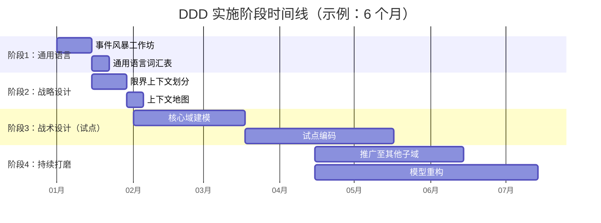
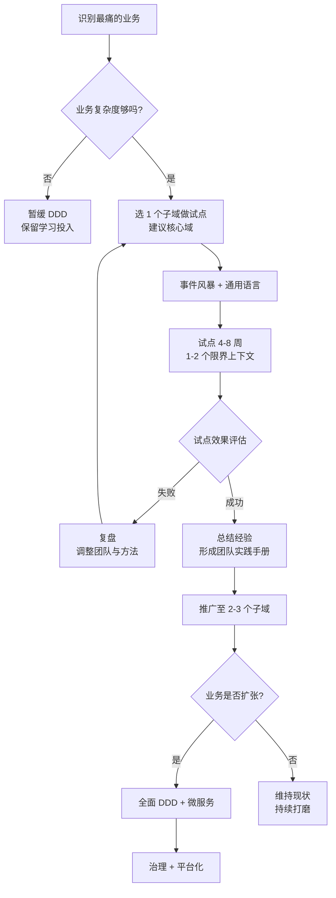
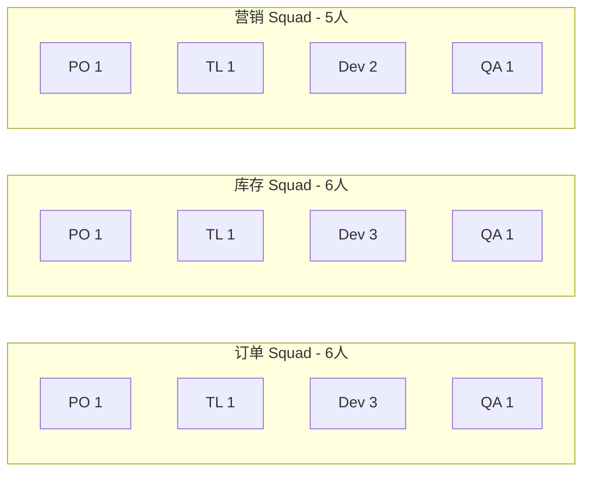
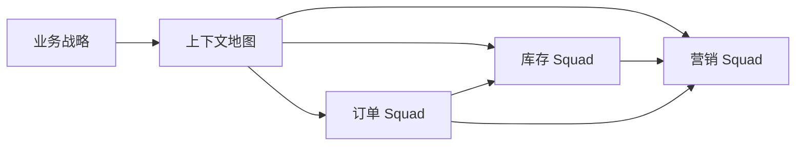
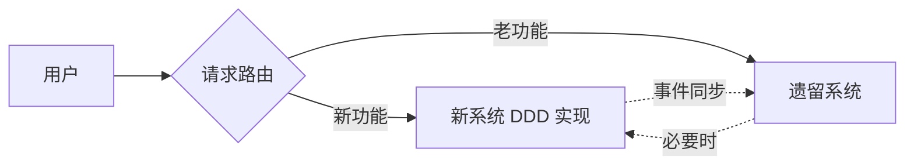
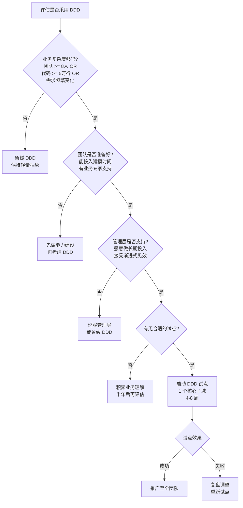

# 第16章 DDD 实施指南与陷阱

> 本章是一份"踩坑指南"。前面15章我们讲了 DDD 的概念、模式、案例，本章换一个视角：把过去十几年团队在 DDD 落地中**反复犯过的错**、**真正好用的方法**、**判断要不要做 DDD 的尺子**摆到桌面上。如果你正准备在公司里推动 DDD，本章的实战价值，可能比任何 UML 图都大。

## 引子：为什么 DDD 推行后反而更累？

我见过太多团队"引入 DDD"之后的状态：

- **战术派**：上来就讲实体、值对象、聚合根、领域服务，代码里堆了一堆 `XxxFactory`、`XxxRepository`，但业务逻辑全在 Service 里飘着——贫血模型换了个马甲。
- **文档派**：通用语言写了一墙的 Wiki，但代码里仍是 `userInfo.name`、`orderDto.create()`，文档和代码完全脱节。
- **激进派**：直接把"微服务+DDD"打包卖给老板，第一周就要拆 50 个微服务，三个季度后系统跑不起来。

> DDD 不是银弹。它是一把手术刀——用对了可以精准切除业务复杂度的肿瘤；用错了会把健康的组织切得千疮百孔。

本章的目的，是把**"什么时候用、怎么用、用了之后怎么避坑"**讲透。

---

## 16.1 DDD 实施的阶段论

> 经验法则：DDD 实施不是"一次性项目"，而是**四阶段持续演进**的过程。把它当"一次性改革"，一定会失败。

### 16.1.1 阶段 1：通用语言与事件风暴（1-2 周）

**目标**：在技术团队与业务团队之间建立**共同词汇**，画出**业务流程全景图**。

**关键动作**：

- 召集**业务专家、产品、技术、测试**四方，举办 1-2 次**事件风暴工作坊**（每次 2-4 小时）。
- 输出物：**领域事件清单**（如 `OrderCreated`、`PaymentReceived`）、**核心命令清单**、**角色清单**。
- 形成一份**通用语言词汇表**（Glossary），每个术语必须有 1-2 句话的精确定义。

**避坑提示**：

- 业务专家不能"挂名"，必须能回答"这个业务规则在什么条件下成立"。
- 不要试图一次梳理完所有流程。**核心域优先**，支撑子域下次再战。

### 16.1.2 阶段 2：限界上下文与战略设计（2-3 周）

**目标**：把**领域**切成**限界上下文**，明确上下文之间的**集成方式**。

**关键动作**：

- 依据**语义相关性**和**团队 Conway 定律**划分限界上下文。
- 识别**核心域、支撑子域、通用子域**——核心域要投入最优秀的人。
- 绘制**上下文地图**（Context Map），标注 `OHS`、`ACL`、`CF`、`PL` 等集成模式。

### 16.1.3 阶段 3：战术设计与领域模型实现（持续）

**目标**：在**一个限界上下文**内落地**实体、值对象、聚合、领域服务、领域事件、仓储**。

**关键动作**：

- 选 1 个最有价值的子域做**试点**（建议从核心域开始）。
- 严格遵守**分层架构 / 六边形架构**，保持领域层纯净。
- 边写代码边**用代码复现通用语言**——命名必须与词汇表一致。

### 16.1.4 阶段 4：持续重构与精炼（持续）

**目标**：模型**不会一次到位**，需要**持续打磨**。

**关键动作**：

- 定期回顾"领域模型是否还在表达业务"，出现"过载的实体"或"扭曲的概念"就要重构。
- 通用语言**随业务演进**——新术语加入、过时术语删除。
- 把"重构模型"写进迭代计划，**不能等到系统崩了才动**。

### 16.1.5 实施阶段甘特图

> 图：DDD 实施四阶段时间线。阶段 3-4 实际是**长期并行的**——试点完成一个上下文就推广一个，不要等所有试点做完。

---

## 16.2 何时引入 DDD

### 16.2.1 业务复杂度的三个临界点

不是所有项目都需要 DDD。判断的**关键变量**有三个：

| 维度 | 临界点 | 触发的征兆 |
|------|--------|----------|
| **团队规模** | ≥ 8 人 | 多人修改同一份代码、合并冲突频繁 |
| **代码规模** | ≥ 5 万行 | Service 类超过 2000 行、改一处崩三处 |
| **需求变化率** | ≥ 2 次/迭代 | 业务规则频繁调整、每次调整都涉及多模块 |

只要**任意两个**满足，就值得引入 DDD。

### 16.2.2 决策表：项目阶段 vs 团队规模

| 项目阶段 \ 团队规模 | < 5 人 | 5-12 人 | 12-30 人 | > 30 人 |
|---------------------|--------|---------|----------|---------|
| **初创期**（MVP 验证） | 不要 DDD | 轻量通用语言 | 不推荐 | 不推荐 |
| **成长期**（模式跑通） | 不需要 | 试点 DDD（1 个上下文） | 全面 DDD + 微服务 | 平台化 DDD |
| **成熟期**（规模化） | — | 持续打磨模型 | 多团队 + 上下文地图 | 治理 + 平台支撑 |
| **维护期**（增量迭代） | — | 选择性引入 | 全面 DDD 治理 | 治理 + 拆分 |

> 注：这张表是**经验法则**，不是教条。如果业务是"100 万行代码 + 5 个人"，也应该 DDD；反之，"10 个人做一个增删改查系统"，DDD 是过度设计。

---

## 16.3 渐进式引入 DDD

### 16.3.1 不要"一刀切"

**反面教材**：老板听完一场 DDD 培训，回来就要求"全公司 6 个团队下个季度全部上 DDD"。结果：

- 3 个团队既不懂业务也写不出好模型。
- 通用语言定了一堆名词，但代码里没人用。
- 半年后，DDD 项目变成"上面检查就应付、平时还是老办法"。

**正确姿势**：**试点 → 推广 → 全面**。

### 16.3.2 渐进式引入流程图

> 图：从一个痛点切入，逐步推广。**试点失败不可怕**——复盘比面子重要。

### 16.3.3 试点选型的三个原则

1. **业务价值高**：选核心域，不要选"用户中心"这种通用子域（太简单，验不出方法）。
2. **业务专家可得**：能找到一个能讲清楚规则的领域专家。
3. **代码可重塑**：不要选"完全不能动的遗留系统"做第一个试点。

---

## 16.4 团队能力建设

### 16.4.1 业务专家参与

**DDD 不是开发者的独角戏**。没有业务专家，模型就是开发者的"自嗨"。

| 角色 | 投入度 | 主要职责 |
|------|--------|----------|
| **领域专家**（业务方） | 50%+ | 解答业务规则、参与事件风暴、审阅模型 |
| **产品经理** | 100% | 翻译业务为需求、组织会议、推动通用语言落地 |
| **架构师** | 30% | 把控限界上下文边界、上下文地图设计 |
| **开发者** | 100% | 模型设计、代码实现、单元测试 |
| **测试** | 30% | 用通用语言编写验收用例 |

> 关键：业务专家的"业务会议时间"必须被尊重——不能被各种需求评审挤掉。

### 16.4.2 开发者能力要求

DDD 对开发者的要求**比 CRUD 高**：

- **建模能力**：能从需求中识别概念、抽象出模型。
- **OO 设计能力**：熟练使用封装、继承、组合、多态。
- **重构能力**：识别代码坏味道并持续改进。
- **沟通能力**：能和业务专家"平等对话"，不被技术术语绑架。

> 一句话：DDD 要的是"工程师 + 半个领域专家"，不是"CRUD 程序员"。

### 16.4.3 团队规模建议

**理想规模**：**6-12 人**（一个 Squad 负责一个限界上下文）。

> 图：**Conway 定律** 的体现——团队结构对齐系统结构。每个 Squad **全栈**（前端、后端、测试），减少跨团队协作。

**为什么是 6-12 人**？

- **太小**（< 4 人）：覆盖不了全栈，跨上下文协作负担重。
- **太大**（> 15 人）：沟通成本指数级上升，需要再拆分。

---

## 16.5 与敏捷开发的结合

### 16.5.1 Scrum + 事件风暴

Scrum 的**Sprint Planning** 与 DDD 的**事件风暴**可以无缝衔接：

| Scrum 仪式 | DDD 配合动作 |
|-----------|-------------|
| **Sprint 0** | 举办事件风暴，识别本迭代要交付的领域事件 |
| **Sprint Planning** | 把领域事件拆分成 User Story，明确聚合与命令 |
| **Daily Standup** | 用通用语言沟通（"昨天搞定了 OrderPaid 的处理"） |
| **Sprint Review** | 业务专家验收的不是"页面"，而是"模型行为" |
| **Retrospective** | 复盘通用语言是否需要更新 |

### 16.5.2 限界上下文 = 跨职能团队边界

**Bounded Context 不仅仅是技术边界，更是组织边界**。一个 Squad 拥有 1 个限界上下文的"端到端"所有权：

- 该上下文的**业务规则**由它定义。
- 该上下文的**API** 由它发布。
- 该上下文的**数据**由它管理。

> 图：业务战略 → 上下文地图 → 团队划分 → 团队间协作（带箭头的边表示集成关系）。**Squad 之间的箭头**就是 **Context Map 的集成模式**（OHS、ACL 等）。

### 16.5.3 反例：按技术分层划分团队

❌ 错误做法：前端组、后端组、测试组、运维组分开。

后果：每个 Story 要跨 4 个团队排期，"做完一个需求要协调 10 个人"。

✅ 正确做法：跨职能 Squad。

好处：Story 交付链路短、决策快、通用语言在 Squad 内自然统一。

---

## 16.6 常见陷阱 Top 15

> 以下 15 个陷阱，按**出现频率**和**破坏力**综合排序。每个陷阱都是真实项目里反复出现过的"老朋友"。

### 陷阱 1：盲从战术设计

**症状**：上来就讲实体、值对象、聚合根，把"是否用了值对象"当成 DDD 的标志。

**真相**：**战略设计（限界上下文、通用语言）才是 DDD 的核心**。战术设计只是"把已经想清楚的概念落到代码"。

**对策**：先做事件风暴 + 限界上下文划分，再写代码。

### 陷阱 2：通用语言只停留在文档

**症状**：写了精美的 Wiki 词汇表，但代码里仍是 `userInfo`、`orderDto`。

**真相**：通用语言如果不能体现在代码里，它就死了。

**对策**：**代码命名与词汇表一一对应**。Code Review 时检查命名。

### 陷阱 3：边界划分错误

**症状**：按技术分层划分上下文（`order-dao`、`order-service`、`order-web`）。

**真相**：限界上下文是**业务边界**，不是技术边界。

**对策**：用"语言是否一致"判断——两个模块讲的是**同一个领域名词**吗？是，就在同一上下文；否，拆开。

### 陷阱 4：聚合过粗

**症状**：把订单、订单项、收货地址、支付记录、物流单全部塞进 Order 聚合。

**真相**：聚合过粗会导致：

- 频繁的并发冲突。
- 一次修改要加载整个聚合。
- 数据库锁范围过大。

**对策**：遵守"**一个事务 = 一个聚合修改**"原则。聚合之间用 ID 引用，不用对象引用。

### 陷阱 5：聚合过细

**症状**：把订单项、收货地址都做成独立聚合。

**真相**：聚合过细导致**事务一致性丢失**——修改订单和订单项不在同一事务，状态可能不一致。

**对策**：用**业务不变条件**（Invariant）判断——"订单和订单项必须同时修改"？是，就在同一聚合；否，拆。

### 陷阱 6：贫血模型回潮

**症状**：实体只有 getter/setter，业务逻辑全在 Service。

**真相**：这不是 DDD，这是"披着 DDD 外衣的过程式编程"。

**对策**：业务规则**优先放实体**。当一个 Service 方法全是 `entity.setXxx()` 时，问自己"为什么不在实体里做？"。

### 陷阱 7：领域层被污染

**症状**：领域实体里出现 `@Entity`（JPA）、`@JsonProperty`、`RestTemplate` 等。

**真相**：领域层一旦依赖基础设施，就**没法测试、没法换数据库、没法换框架**。

**对策**：**严格分层**。领域层只依赖 POJO 和自己定义的仓储接口（领域层定义接口，基础设施层实现）。

### 陷阱 8：领域服务膨胀

**症状**：所有业务方法都搬到 DomainService，实体变成"纯数据"。

**真相**：领域服务是"**不属于任何实体的业务逻辑**"的归宿，不是"所有业务逻辑的回收站"。

**对策**：能用实体方法解决的，**优先用实体**。领域服务只承担"跨实体协调"或"无状态业务规则"。

### 陷阱 9：仓储泄露技术细节

**症状**：`OrderRepository.findByStatusAndCreateTimeBetween(status, start, end)`。

**真相**：这是把"按字段查询"暴露在仓储接口上，本质是 DAO，不是 Repository。

**对策**：仓储接口用**通用语言**命名：`findActiveOrders()`、`findOrdersForCustomer(CustomerId)`。复杂查询用 **Specification 模式**或独立的 **Query Service**。

### 陷阱 10：跨聚合事务

**症状**：在一个事务里同时修改订单、库存、账户。

**真相**：跨聚合的强一致性是**分布式事务灾难**的前兆——性能差、耦合紧、扩展难。

**对策**：**跨聚合用最终一致性**。通过领域事件 + 异步消息 + 幂等消费实现"最终对齐"。

### 陷阱 11：领域事件命名错误

**症状**：事件叫 `CreateOrderEvent`（命令式）。

**真相**：领域事件是"**已经发生的事**"，应该用**过去时**：`OrderCreated`、`OrderPaid`。

**对策**：领域事件命名**永远是过去时**。这是 DDD 的硬性约定。

### 陷阱 12：同步处理领域事件

**症状**：在领域方法里直接调用 `eventBus.publish(event)`，然后下游逻辑同步执行。

**真相**：同步处理失去解耦意义——领域方法要等所有订阅者执行完才返回，性能差且耦合。

**对策**：**领域事件通过消息中间件异步投递**。订阅者独立处理、独立伸缩。

### 陷阱 13：CQRS 滥用

**症状**：简单的增删改查系统也要搞 CQRS + Event Sourcing。

**真相**：CQRS 有显著复杂度代价——多一套读模型、事件回放、一致性延迟。

**对策**：**只有查询模型与命令模型差异巨大**时（如报表、搜索、聚合分析）才用 CQRS。CRUD 为主就别上。

### 陷阱 14：忽略遗留系统

**症状**：DDD 推行时直接放弃老系统，全部重写。

**真相**：重写成本是"**3 倍于预估**"——业务规则比你想象的复杂。

**对策**：用**绞杀者模式**（Strangler Fig Pattern）——新功能用 DDD 实现，老功能继续维护，**逐步替换**。

### 陷阱 15：缺乏持续打磨

**症状**：建模完成后再也没动过模型，模型逐渐与业务脱节。

**真相**：业务在变，模型必须跟着变。"**设计完成即结束**"是 DDD 失败的最常见原因。

**对策**：**定期做模型回顾**（建议每个迭代 1 次）。识别"过载的实体"、"扭曲的概念"，安排重构。

---

## 16.7 常见陷阱的应对速查表

> 把上一节的 15 个陷阱浓缩成一张表，方便 Code Review 时对照。

| 编号 | 陷阱 | 检测信号 | 重构建议 |
|------|------|----------|----------|
| 1 | 盲从战术设计 | 没有上下文地图，代码直接开写 | 补做事件风暴 + 战略设计 |
| 2 | 通用语言只停留在文档 | 词汇表与代码命名不一致 | 把代码命名按词汇表重命名 |
| 3 | 边界划分错误 | 按技术分层（dao/service/web） | 按业务语义重新划分 |
| 4 | 聚合过粗 | 聚合 > 5 个实体，并发冲突频繁 | 拆聚合，ID 引用 |
| 5 | 聚合过细 | 业务不变条件被破坏 | 合并相关实体到同一聚合 |
| 6 | 贫血模型回潮 | 实体只有 getter/setter | 业务逻辑下沉到实体 |
| 7 | 领域层被污染 | 领域层有 @Entity、@JsonProperty | 防腐层隔离，依赖倒置 |
| 8 | 领域服务膨胀 | DomainService 超过 500 行 | 拆分服务，逻辑回沉实体 |
| 9 | 仓储泄露技术细节 | findByXxxAndYxx 等面向字段方法 | 改用业务命名 + Specification |
| 10 | 跨聚合事务 | 多聚合修改在同一事务 | 改成最终一致性 + 事件 |
| 11 | 领域事件命名错误 | 事件名为 CreateOrder | 改为 OrderCreated（过去时） |
| 12 | 同步处理领域事件 | publish 后同步等待 | 改成消息队列异步 |
| 13 | CQRS 滥用 | 简单 CRUD 上了读写分离 | 拆掉 CQRS，普通架构 |
| 14 | 忽略遗留系统 | 直接重写老系统 | 绞杀者模式逐步替换 |
| 15 | 缺乏持续打磨 | 建模后再没动过 | 迭代回顾中安排模型重构 |

---

## 16.8 评估 DDD 实施效果

### 16.8.1 业务响应速度

**指标**：新需求从"提出"到"上线"的平均时长。

- DDD 实施前：2-3 个月。
- DDD 实施后（健康状态）：2-4 周。

如果实施 DDD 后业务响应速度反而**变慢**，说明模型没设计好，陷入了"过度抽象"。

### 16.8.2 团队沟通效率

**指标**：

- **会议时长**：领域相关会议是否变短（因为通用语言已经建立）。
- **需求评审轮次**：从 3-5 轮降到 1-2 轮。
- **跨团队争议**：从"我说的是 A 意思"到"我们用词汇表定义的 X 是"。

### 16.8.3 代码质量指标

| 指标 | 健康值 | 警戒值 |
|------|--------|--------|
| **领域实体平均行数** | 100-300 | > 500 |
| **Service 类平均行数** | < 200 | > 500 |
| **单元测试覆盖率（领域层）** | > 80% | < 50% |
| **循环依赖** | 0 | > 0 |
| **技术债务积压** | < 2 周 | > 1 个月 |

### 16.8.4 业务专家满意度

最容易被忽略的指标。**做一份季度问卷**问业务专家：

- 模型是否还在表达业务？
- 通用语言是否一致？
- 提需求时是否还要"翻译"成技术语言？

> 如果业务专家满意度下降，DDD 一定出了问题。

---

## 16.9 性能与可扩展性的考虑

### 16.9.1 聚合与数据库分片

聚合是**事务边界**，也是**数据分布的边界**。

- 聚合**A、B** 在数据库层面可以**分到不同分片**。
- 聚合**内部**应保持**单分片**，避免分布式事务。

**经验法则**：

- 高频写操作：每个聚合一个分片。
- 大聚合（聚合根有大量子实体）：考虑**CQRS 读模型**独立分片。

### 16.9.2 限界上下文与微服务

**限界上下文 ≈ 微服务**。但有微妙差别：

- 限界上下文是**逻辑边界**（领域概念）。
- 微服务是**物理边界**（部署单元）。

**一个限界上下文**通常对应**一个微服务**，但**初期**一个微服务可以包含 2-3 个简单限界上下文（避免过度拆分）。

### 16.9.3 事件溯源与性能

事件溯源（Event Sourcing）有**读性能问题**——重放所有事件才能得到当前状态。

**优化手段**：

- **快照**（Snapshot）：每 N 个事件保存一次聚合状态。
- **物化视图**（Materialized View）：从事件流构建读模型。
- **CQRS**：命令模型事件溯源，查询模型用传统数据库。

---

## 16.10 遗留系统 DDD 改造

### 16.10.1 绞杀者模式（Strangler Fig Pattern）

**核心理念**：不去直接修改老系统，而是在老系统**外围**搭建新系统，逐步**截获**老系统的请求，直到老系统被完全替换。

> 图：绞杀者模式。新老系统共存，逐步迁移。

### 16.10.2 领域抽取策略

从老系统里**抽取领域模型**时，建议**自下而上**：

1. **抽取值对象**：把散落的 `String`、`Date`、`Enum` 抽成值对象（如 `Money`、`OrderId`）。
2. **抽取实体**：把 `XxxPO` 抽成领域实体，去掉持久化注解。
3. **抽取领域服务**：把 Service 里的业务逻辑剥离到领域服务。
4. **抽取聚合**：识别聚合根，重新组织实体关系。
5. **最后才动限界上下文**：上下文划分是战略决策，最难改。

### 16.10.3 风险控制

| 风险 | 应对 |
|------|------|
| **业务规则遗漏** | 业务专家全程参与，对每个改动做 UAT |
| **数据迁移出错** | 双写 + 校验 + 灰度切换 |
| **进度失控** | 分阶段交付，每阶段可独立回滚 |
| **团队士气** | 让团队看到"小胜利"（1-2 周内出可演示成果） |

---

## 16.11 DDD 与其他方法论的关系

### 16.11.1 DDD + 敏捷

- 敏捷解决"**如何交付**"的问题。
- DDD 解决"**交付什么**"的问题。
- **结合点**：Sprint 0 做事件风暴，User Story 用领域事件组织。

### 16.11.2 DDD + 微服务

- DDD 提供**拆分依据**（限界上下文）。
- 微服务提供**物理实现**（独立部署）。
- **警告**：**没有 DDD 指导的微服务是灾难**——按技术拆、按人拆、按领导喜好拆。

### 16.11.3 DDD + 函数式编程

- 函数式编程强调**不可变值** + **纯函数**。
- DDD 中的**值对象**天然适合函数式（不可变、无副作用）。
- 实体可以借鉴函数式思想：**所有修改都返回新对象**（如 Java 的 record + copy constructor）。

### 16.11.4 DDD + TDD

- **TDD** 强迫你在写代码前**想清楚行为**。
- **DDD** 强迫你在写代码前**想清楚模型**。
- **结合**：用 TDD 驱动领域模型——测试用例用通用语言描述，模型行为一目了然。

---

## 16.12 决策框架：是否采用 DDD？

> 这是本章的"压轴"。在决定上不上 DDD 之前，先用下面这张流程图判断。

> 图：DDD 决策流程图。**回答"否"不丢人**——DDD 不是越多越好。

### 决策框架的三个关键问题

1. **业务复杂度够吗？** 简单 CRUD 用了反而是负担。
2. **团队准备好接受"长期投入"了吗？** DDD 见效至少 3-6 个月。
3. **管理层能接受"渐进式落地"吗？** 高层一急，下面就乱。

---

## 小结与下一章预告

### 本章小结

DDD 实施是**四阶段演进**：通用语言 → 战略设计 → 战术设计 → 持续打磨。**试点 → 推广 → 全面**是唯一正确的推广路径。15 个陷阱反复出现，但只要团队保持"问题 → 信号 → 对策"的反思节奏，绝大多数都能在初期识别。

### 关键 takeaway

- **DDD 是组织变革，不是技术改造**。
- **没有业务专家，就没有 DDD**。
- **试点比全面铺开重要 100 倍**。
- **模型是活的，要持续打磨**。

### 下一章预告

第17章 **DDD 与现代软件工程实践**，我们将探讨 DDD 在**云原生、Service Mesh、Serverless**等新技术背景下的演化方向，以及如何与 **DDD + AI 辅助建模** 等前沿话题结合。

---

> **本章金句**：DDD 的失败从来不是因为"技术太难"，而是因为"组织没准备好"。先解决人，再解决代码。
