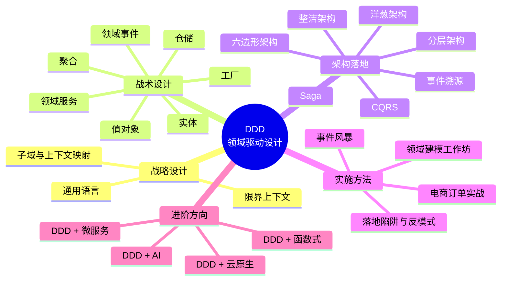
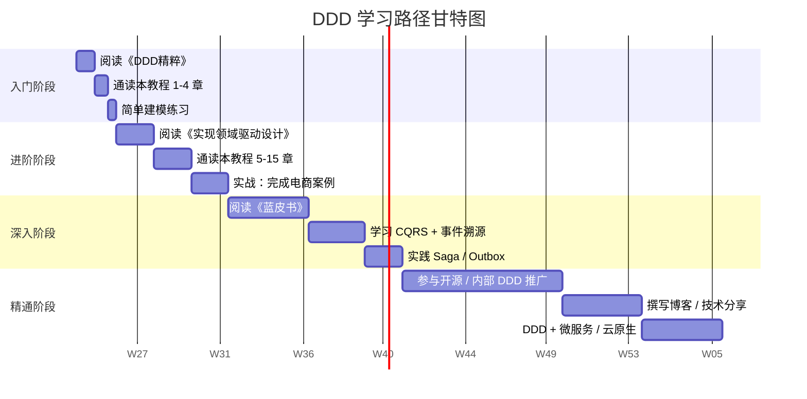
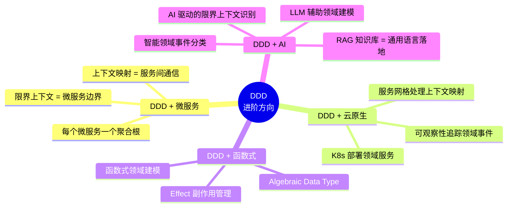

# 第17章 总结与学习资源

> 至此，整个 DDD 教程的 17 章内容已经全部走完。本章不引入新概念，而是带你**纵向回顾**这趟旅程、**横向串联**所有知识点，并给你一份**面向未来的学习地图**——无论你是要继续深耕 DDD，还是要把 DDD 与微服务、云原生、AI 等新范式结合，都能从这里找到方向。

---

## 17.1 知识体系全景图

如果把 DDD 看作一座城市，那本教程就是带我们从"市中心"出发，一路走到"郊区"的徒步指南。17 个章节大致可以归为 **四大板块**：**战略设计**、**战术设计**、**架构落地**、**实施方法**。下面这张思维导图把全部知识点铺开，方便你随时回来查漏补缺。

> 图：DDD 知识体系全景 mindmap。每个叶子节点都对应教程中的一章或一节，结构上遵循"战略—战术—架构—方法"四阶递进。

---

## 17.2 DDD 核心要点回顾

这一节是**全章的精华**，把 16 章里反复出现的概念压缩成几组"关键词卡片"，帮你建立"概念之间如何互相支撑"的全景认知。

### 17.2.1 战略设计三件套

战略设计回答的是 **"软件应该被切分成几块"** 的问题。它不关心一个类怎么写，只关心业务如何划分、团队如何对齐。

| 概念 | 一句话定义 | 解决的核心问题 |
|------|----------|--------------|
| **限界上下文（Bounded Context）** | 一个模型适用的边界，边界内术语含义唯一 | 避免"上帝模型"和"语义冲突" |
| **子域（Subdomain）** | 业务领域按重要性划分出的子集 | 区分核心域、支撑域、通用域 |
| **上下文映射（Context Map）** | 描述限界上下文之间如何协作 | 明确集成方式与团队边界 |

**三者关系**：子域是 **"业务的真相"**，限界上下文是 **"模型的边界"**，上下文映射是 **"边界之间的对话方式"**。三者共同构成了 DDD 战略设计的铁三角。

### 17.2.2 战术设计七要素

战术设计回答的是 **"一个限界上下文内部，代码应该怎么组织"** 的问题。

| 序号 | 概念 | 角色定位 | 典型场景 |
|------|------|---------|---------|
| 1 | **实体（Entity）** | 有唯一标识、可变、有生命周期 | `Order`、`User` |
| 2 | **值对象（Value Object）** | 无标识、不可变、用值判等 | `Money`、`Address` |
| 3 | **聚合（Aggregate）** | 一组强一致性对象的根边界 | `Order` + `OrderItem` |
| 4 | **领域服务（Domain Service）** | 不属于任何实体的业务逻辑 | 跨聚合的金额计算 |
| 5 | **领域事件（Domain Event）** | 已发生的业务事实 | `OrderPaid`、`StockDeducted` |
| 6 | **仓储（Repository）** | 聚合的持久化抽象 | `OrderRepository` |
| 7 | **工厂（Factory）** | 复杂聚合的创建封装 | `OrderFactory.createOrder()` |

**记忆口诀**：实体有 ID，值对象没 ID；聚合是边界，仓储管落地；事件传事实，服务补缝隙；工厂只造物，不掺业务。

### 17.2.3 架构落地四件套

DDD 是一种**思想**，落地要靠**架构**。下面四种架构都与 DDD 天然契合：

1. **分层架构（Layered Architecture）**：经典的"四层蛋糕"——用户接口、应用、领域、基础设施。最容易上手，适合绝大多数项目。
2. **六边形架构（Hexagonal / Ports & Adapters）**：核心是"业务在内、技术在外"，通过端口（Port）和适配器（Adapter）解耦领域与技术实现。
3. **洋葱架构（Onion Architecture）**：以"领域模型"为圆心，向外依次是领域服务、应用服务、基础设施。和六边形同根同源。
4. **整洁架构（Clean Architecture）**：Robert Martin 提出的同心圆架构，把"业务实体"放在最内圈，外圈是"业务用例"，最外圈是"框架和驱动"。

它们本质上**殊途同归**：都是把"易变的外部技术"和"稳定的领域核心"分离开。

### 17.2.4 进阶模式

当业务复杂到一定程度，光靠"分分层、写写领域服务"就不够用了，需要更"重"的武器：

- **CQRS（Command Query Responsibility Segregation）**：读写分离。写模型保证强一致，读模型为查询优化，可以是不同的数据库甚至不同的技术栈。
- **事件溯源（Event Sourcing）**：不保存对象当前状态，而是保存"导致状态变化的所有事件"。要重建状态，从头回放事件即可。
- **Saga**：长事务的最终一致性解决方案。把一个跨多个聚合的复杂流程拆成一组"本地事务 + 补偿动作"，靠事件驱动逐步推进。

这三种模式是 DDD 在高并发、高复杂度场景下的"重型武器"，但也意味着更高的学习与运维成本。

### 17.2.5 方法论

工具再强，方法不对也是白搭。DDD 配套的两大方法论是：

- **通用语言（Ubiquitous Language）**：开发者和业务专家用**同一套词**沟通，词要落到代码里。**不是文档里的口号，而是 git blame 里能看到的命名。**
- **事件风暴（Event Storming）**：一种高效的领域建模工作坊。用便签纸把业务流程拆解为**事件、命令、聚合、读模型、外部系统**等元素，让团队在 1-2 天内对齐领域模型。

---

## 17.3 DDD 思想的精髓

如果说前面 16 章是在教你"招式"，这一节我们回到"内功"。DDD 的核心思想可以归纳为四句话：

1. **"以领域为中心"而非"以数据为中心"**。传统开发先设计数据库表，再倒推对象；DDD 先理解业务，再考虑持久化。**业务是因，技术是果。**
2. **"业务与代码同构"**。代码的结构应该和业务人员的认知结构一致。当业务人员说"一笔订单包含多个商品项"，代码里就应该有 `Order` 和 `OrderItem`，而不是 `OrderDO` 和 `OrderItemPO`。
3. **"边界划分解决复杂度"**。复杂度的本质是"边界不清"。DDD 用限界上下文、子域、聚合三道边界，把大系统切成可治理的小块。
4. **"通用语言消除沟通"**。很多项目的最大成本不是写代码，而是**对齐认知**。通用语言让业务、产品、开发、测试都说同一种话，从根上减少扯皮。

> **一句话总结 DDD：把业务知识显式地建模到软件中，并用代码持续守护它。**

---

## 17.4 推荐学习资源

### 17.4.1 经典书籍

下表是公认的 DDD 学习"必读书单"，按推荐顺序排列：

| 序号 | 书名 | 作者 | 推荐理由 | 难度 | 适合阶段 |
|------|------|------|---------|------|---------|
| 1 | 《领域驱动设计：软件核心复杂性应对之道》（蓝皮书） | Eric Evans | DDD 奠基之作，概念权威 | ★★★★ | 入门-进阶 |
| 2 | 《实现领域驱动设计》（红皮书） | Vaughn Vernon | 代码示例最丰富，实战首选 | ★★★ | 进阶 |
| 3 | 《领域驱动设计精粹》 | Vaughn Vernon | 浓缩版蓝皮书，速读神器 | ★★ | 入门 |
| 4 | 《领域事件模式》/《事件驱动微服务》 | Vaughn Vernon | 事件架构三件套之一 | ★★★★ | 深入 |
| 5 | 《领域驱动设计实践》 | 张逸 | 中文实战视角 | ★★★ | 进阶 |
| 6 | 《Java 开发手册》 | 阿里 | 工程规范与编码实践 | ★★ | 工程化 |

**读书建议**：
- 第一次接触 DDD：先读《精粹》建立全貌 → 再读《蓝皮书》理解思想 → 实战中对照《红皮书》。
- 已经熟悉 DDD 但要做事件驱动：补充 Vaughn Vernon 的事件系列。
- 中文读者：从《领域驱动设计实践》入手，可以降低阅读门槛。

### 17.4.2 博客与社区

- **Martin Fowler 的网站（martinfowler.com）**：DDD 相关文章权威且易懂，搜索 "Domain-Driven Design" 即可。
- **Vaughn Vernon 官网（vaughnvernon.com）**：作者本人的最新思考、演讲视频、IDDD Workshop 资料。
- **DDD 社区**：
  - ddd-crew（GitHub 组织）
  - ddd-cqrs-es（领域事件与 CQRS 资料汇总）
- **国内博客**：InfoQ、CSDN、掘金上搜索"领域驱动设计"，关注张逸、汤雪平等作者。
- **视频资源**：B 站搜索"DDD 实战"有大量中文实战课程。

---

## 17.5 学习路径建议

DDD 不是看完一本书就能"会"的，它需要**理解 → 实践 → 反思 → 再实践**的循环。下面给出一条经过验证的学习路径：

> 图：DDD 学习路径甘特图。**入门 1-2 周、进阶 2-4 周、深入 1-2 月、精通是持续过程。** 根据个人背景可压缩或拉长。

**关键里程碑**：
- 入门结束标志：能用 5 个聚合画出自己负责模块的领域模型。
- 进阶结束标志：能在真实项目中独立完成一个限界上下文的代码骨架。
- 深入结束标志：能讲清楚 CQRS、事件溯源、Saga 的**适用边界与代价**。
- 精通没有终点：能向团队讲清楚"为什么这里用 DDD，那里不用"。

---

## 17.6 实战项目建议

"看十遍不如写一遍"。下面按复杂度递进，给出 3 个练手项目：

| 项目 | 复杂度 | 涉及知识点 | 推荐指数 |
|------|-------|----------|---------|
| **图书馆管理系统** | ★★ | 实体、值对象、聚合、仓储 | ★★★★★（入门首选） |
| **电商订单系统** | ★★★★ | 七要素全部 + CQRS + 事件 | ★★★★★（本教程第15章） |
| **物流跟踪系统** | ★★★★★ | 事件驱动 + Saga + 事件溯源 | ★★★★（进阶挑战） |

**项目练习小贴士**：
1. **不要追求"功能完整"**。重点是让领域模型跑通 3-5 个核心场景。
2. **先画聚合图，再写代码**。用事件风暴工作坊梳理一遍，比上来就写要快得多。
3. **刻意练习"边界划分"**。在做项目时尝试切分 2-3 个限界上下文，感受边界带来的复杂度下降。
4. **写回顾笔记**。每完成一个项目，回头对照 17 章总结，写下"我学到了什么、哪里理解错了"。

---

## 17.7 进阶方向

DDD 不是一个孤岛，它和当下流行的技术范式天然契合。下面是几个值得探索的进阶方向：

> 图：DDD 进阶方向思维导图。

**重点方向展开**：

- **DDD + 微服务**：这是当下最热门的组合。**一个限界上下文 = 一个微服务**几乎成了行业共识。上下文映射里的防腐层、开放主机服务、共享内核等模式，正好对应微服务间的 API 网关、BFF、共享库等实践。
- **DDD + 云原生**：Kubernetes 的 Pod 对应限界上下文的部署单元，Service Mesh（Istio/Linkerd）天然适合做"上下文映射"的网络层，可观察性（Tracing/Metrics/Logging）让领域事件的链路追踪成为可能。
- **DDD + 函数式**：函数式编程的 Algebraic Data Type（代数数据类型）非常适合表达领域模型，`Sum Type` 表示状态、`Product Type` 表示属性，**让领域模型在类型系统中就保证正确性**。
- **DDD + AI**：这是一个全新的方向。可以用 LLM 辅助做：
  - 从业务文档中提取候选聚合
  - 自动识别通用语言词汇
  - 根据代码生成领域事件文档
  - 通过 RAG 把通用语言沉淀为团队可查询的知识库

---

## 17.8 常见迷思澄清

最后澄清几个 DDD 圈的"老谣言"，避免新手踩坑：

| 迷思 | 真相 |
|------|------|
| **"DDD = 微服务"** | 错误。DDD 是设计方法，微服务是部署架构。**限界上下文可以是一个微服务，也可以是一个模块。** |
| **"DDD = 复杂"** | 错误。DDD 本身不复杂，**它让原本失控的复杂变得可控**。简单项目也可以用 DDD 的通用语言和实体/值对象。 |
| **"DDD 是银弹"** | 错误。DDD 对**复杂业务**价值巨大，但对**简单 CRUD** 反而是负担。**该用才用，不用强上。** |
| **"DDD 适合所有项目"** | 错误。业务稳定、需求清晰、团队规模中等时，DDD 收益最大。**初创期 MVP、超小型工具**，DDD 反而是累赘。 |
| **"用了 DDD 就一定要 CQRS + 事件溯源"** | 错误。CQRS 和事件溯源是 DDD 的"重型武器"，**默认应该从最简的分层架构开始**，需要时再升级。 |
| **"DDD 是一次性大设计"** | 错误。DDD 是**持续重构**的过程。**第一次建模几乎一定是错的**，要在实践中反复迭代。 |

---

## 17.9 寄语

写到这里，17 章的教程就到了尾声。最后想对你说几句心里话：

1. **DDD 不是银弹，但它是处理复杂业务的有效武器。** 当你面对一个"谁也说不清"的业务系统时，DDD 给出的限界上下文、聚合、领域事件这些"思维工具"，会让你突然有了一种"可以切分它"的底气。
2. **实践出真知。** 看完教程只是"认识 DDD"，真正的"掌握 DDD" 是在一次次写代码、一次次和业务专家对齐、一次次推翻重来中完成的。**不要害怕推翻自己的模型，那才是进步。**
3. **与业务专家同频共振。** DDD 最反常识的一点是——**它要求开发者走出工位、走进业务**。当你能用业务专家的语言和他对话，能用业务专家的视角看代码，你就真正"懂 DDD"了。
4. **保持谦逊和好奇。** DDD 已经发展了 20 多年，但它仍在演化——和微服务、和云原生、和 AI 的结合，每天都在诞生新的实践。**保持学习，永远在路上。**

> **"模型不是被'设计'出来的，而是和业务一起'长'出来的。"** —— 这是 DDD 给所有软件工程师最珍贵的礼物。

---

## 17.10 教程完整索引

最后，附上本教程全部 17 章的一句话索引，方便你回顾与查阅。

| 章节 | 标题 | 一句话概括 |
|------|------|----------|
| 第1章 | DDD 概述与起源 | 了解 DDD 的来龙去脉与核心思想 |
| 第2章 | 战略设计 - 限界上下文 | 用边界切分复杂业务 |
| 第3章 | 子域与上下文映射 | 识别核心域，画出系统间协作图 |
| 第4章 | 通用语言 | 让业务与代码说同一种话 |
| 第5章 | 战术设计 - 实体 | 有 ID、有生命周期的领域主角 |
| 第6章 | 战术设计 - 值对象 | 用值说话，没有身份只有属性 |
| 第7章 | 战术设计 - 聚合 | 一致性边界与事务的根 |
| 第8章 | 战术设计 - 领域服务 | 不属于任何实体的业务逻辑 |
| 第9章 | 战术设计 - 领域事件 | 把"已经发生的事"广播给世界 |
| 第10章 | 战术设计 - 仓储 | 聚合的"仓库管理员" |
| 第11章 | 战术设计 - 工厂 | 复杂对象的"生产线" |
| 第12章 | 事件风暴 | 1-2 天对齐领域建模工作坊 |
| 第13章 | 分层架构 | 经典四层架构与各层职责 |
| 第14章 | CQRS 与事件溯源 | 读写分离与事件回放 |
| 第15章 | 实战案例 - 电商订单系统 | 把前面 14 章串成一个真实可参考的方案 |
| 第16章 | DDD 落地陷阱与反模式 | 那些年我们踩过的坑 |
| 第17章 | 总结与学习资源 | 回顾全貌、指明方向（**本章**） |

---

## 结语

感谢你读到这里。

DDD 是一场关于"如何与业务共舞"的修行。它不会让你写出更短的代码，但会让你写出**更接近业务真相**的代码；它不会让你的项目一夜之间变好，但会让你的项目**在复杂度的侵蚀下保持可治理**。

愿你在每一个看似混沌的业务里，都能找到那根"切分复杂"的线。

**—— 教程完 ——**
