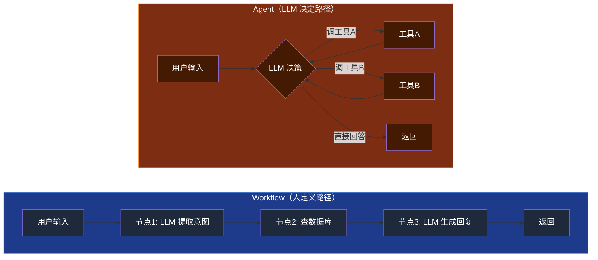
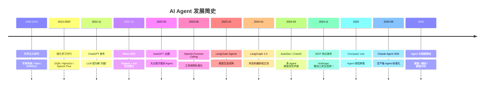
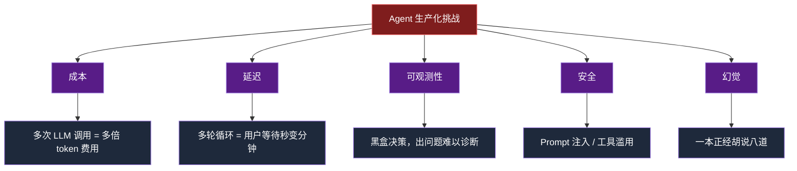
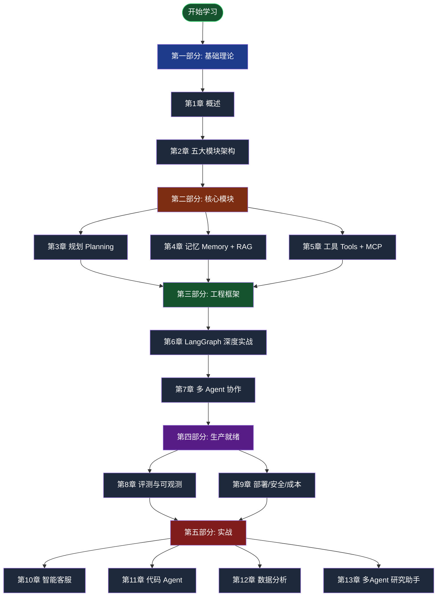

# 第 1 章 AI Agent 概述与发展历程

> 本章目标：建立对 AI Agent 的完整心智模型。读完后你能清晰回答："什么是 Agent？它和我以前写的代码有什么不同？为什么 2023 年之后突然火起来？我什么时候该用它？"

---

## 1.1 什么是 AI Agent

### 学术定义

最早的 Agent 定义来自人工智能领域的经典教材 Russell & Norvig《Artificial Intelligence: A Modern Approach》：

> **An agent is anything that can be viewed as perceiving its environment through sensors and acting upon that environment through actuators.**
>
> 智能体是任何能够通过传感器感知其环境，并通过执行器对环境作出行动的事物。

这个定义抽象到能涵盖一只蚂蚁、一辆自动驾驶汽车、一个温控器。但它给我们留下了三个关键词：**感知（perceive）、环境（environment）、行动（act）**。

### 工业界共识定义

到了 LLM 时代，工业界对 Agent 收敛出更具体的定义。Anthropic 在 2024 年发表的《Building Effective Agents》给出了被广泛引用的解释：

> **Agents are systems where LLMs dynamically direct their own processes and tool usage, maintaining control over how they accomplish tasks.**
>
> Agent 是 LLM 自主决定流程和工具使用、自主掌控如何完成任务的系统。

注意关键词："**dynamically direct their own**"。这里有一个重要对比：

- **Workflow**：LLM 按预定义路径执行（人写好流程，LLM 只在节点里干活）
- **Agent**：LLM 自己决定下一步做什么（流程由 LLM 在运行时决定）

### 一句话定义

把所有定义浓缩成一行：

> **Agent = LLM + Memory + Tools + Loop**

- **LLM** 是大脑（推理与决策）
- **Memory** 是记忆（短期上下文 + 长期知识）
- **Tools** 是手脚（连接外部世界）
- **Loop** 是循环（感知 → 决策 → 行动 → 观察，反复直到完成）

少了任何一个，都只能称为"LLM 应用"而非"Agent"。

> **小结**：Agent 不是某种神秘技术，而是一种"让 LLM 在循环中调用工具和记忆，自主推进任务"的工程范式。

---

## 1.2 AI Agent vs 传统软件 vs 纯 LLM 调用

三者有本质区别。我用一张表对比：

| 维度 | 传统软件 | 纯 LLM 调用 | AI Agent |
|------|---------|------------|----------|
| **控制流** | 人工编码（if/else） | 单次输入→单次输出 | LLM 动态决策 |
| **状态管理** | 显式（数据库/变量） | 无状态（每次独立） | 显式 State + 隐式上下文 |
| **决策依据** | 写死的规则 | 训练时的统计模式 | Prompt + 实时观察 |
| **可解释性** | 高（代码即解释） | 低（黑盒） | 中（思考过程可读） |
| **适用场景** | 确定性逻辑 | 单步生成/转换 | 多步推理、动态决策 |
| **失败处理** | 异常机制 | 重试/降级 | 自我反思、重新规划 |
| **开发成本** | 中等 | 低 | 高（涉及评测、可观测） |
| **运行成本** | 低 | 中（按 token） | 高（多次 LLM 调用） |
| **可预测性** | 高 | 中 | 低 |

### 用代码直观感受差异

**传统软件**——查询订单状态：

```python
def get_order_status(order_id: str) -> str:
    order = db.query(Order).filter_by(id=order_id).first()
    if not order:
        return "订单不存在"
    return f"订单 {order_id} 状态：{order.status}"
```

完全确定，可单测，输入相同输出必相同。

**纯 LLM 调用**——回答用户问题：

```python
from openai import OpenAI

client = OpenAI()
response = client.chat.completions.create(
    model="gpt-4",
    messages=[
        {"role": "system", "content": "你是客服助手"},
        {"role": "user", "content": "我的订单 12345 到哪了？"}
    ]
)
print(response.choices[0].message.content)
# LLM 无法查询数据库，只能编造或拒答
```

LLM 知道"应该查数据库"，但它**没有手脚**。

**AI Agent**——动态决策 + 工具调用：

```python
from langchain_openai import ChatOpenAI
from langgraph.prebuilt import create_react_agent
from langchain_core.tools import tool

@tool
def get_order_status(order_id: str) -> str:
    """根据订单 ID 查询订单状态"""
    order = db.query(Order).filter_by(id=order_id).first()
    return f"订单 {order_id} 状态：{order.status}" if order else "订单不存在"

agent = create_react_agent(
    model=ChatOpenAI(model="gpt-4"),
    tools=[get_order_status]
)

# Agent 自己决定：先调用 get_order_status，再根据结果回答用户
result = agent.invoke({
    "messages": [("user", "我的订单 12345 到哪了？")]
})
print(result["messages"][-1].content)
# 输出："您好，您的订单 12345 当前状态为：已发货，预计明天送达。"
```

Agent 收到问题后：
1. **感知**："用户问订单 12345 的状态"
2. **规划**："我应该调用 `get_order_status` 工具"
3. **行动**：调用工具，参数 `order_id="12345"`
4. **观察**：收到结果 `"已发货"`
5. **决策**：信息足够，生成最终回答

这就是 Agent 的"动态决策"——你没告诉它"先查再答"，是它自己想出来的。

### Workflow vs Agent



> **小结**：能用 Workflow 解决的事就别上 Agent。Agent 的"灵活"是用"成本+不可预测"换来的。

---

## 1.3 发展历程

理解 Agent 的历史，能避免把"Agent"当成 2023 年才有的新概念。

### 时间线



### 关键里程碑

**1956-2010：符号主义 Agent**

最早的 Agent 是"基于规则"的。代表系统：

- **SHRDLU**（1970）：在虚拟积木世界中执行自然语言指令
- **Soar / ACT-R**：认知架构，模拟人类决策
- **专家系统**（如 MYCIN）：医疗诊断

特点：能力受限于人工编码的规则，无法泛化。

**2013-2020：强化学习 Agent**

DeepMind 把深度学习与 RL 结合：

- **DQN**（2013）：玩 Atari 游戏达人类水平
- **AlphaGo**（2016）：击败围棋世界冠军
- **OpenAI Five**（2018）：玩 Dota 2 击败职业战队

特点：在封闭、规则明确的环境强大，但难以迁移到开放任务。

**2022-11：ChatGPT 引爆，LLM 成为新"大脑"**

GPT-3.5 让大众第一次感受到"语言模型能推理"。但此时 LLM 还只是单次问答，不是 Agent。

**2022-12：ReAct 论文（Yao et al., Princeton）**

这是 LLM Agent 时代的"奠基论文"。核心思想：

> 让 LLM 交替输出"思考（Reasoning）"和"行动（Acting）"，并观察行动结果再继续。

这个简单的 `Thought → Action → Observation` 循环，至今仍是几乎所有 Agent 框架的内核。

**2023-03：AutoGPT 横空出世**

AutoGPT 是第一个让普通人感受到"Agent"概念的项目。它能自主规划、调用工具、读写文件。虽然实际效果差强人意（频繁陷入循环、烧钱），但点燃了行业热情。

**2023-06：OpenAI Function Calling**

OpenAI 在 API 中原生支持"函数调用"。LLM 不再需要解析 JSON 字符串，而是直接输出结构化调用。这让 Agent 工程化门槛大幅降低。

**2024：编排框架百花齐放**

- **LangGraph**（LangChain）：基于状态机和图
- **AutoGen**（微软）：对话驱动
- **CrewAI**：角色协作
- **MetaGPT**：模拟软件公司

**2024-11：MCP 协议（Anthropic）**

Model Context Protocol 试图统一工具/资源的接入标准，被誉为"AI 时代的 USB-C"。2025 年迅速被 OpenAI、Google 等采用。

**2025-2026：生产级落地**

- Claude Code、Cursor、Devin 等编程 Agent 大规模商用
- Sierra、Intercom Fin 等客服 Agent 替代人工
- Claude Agent SDK、OpenAI Agents SDK 标准化生产部署

> **小结**：Agent 不是 2023 年的发明。但 LLM 让 Agent 从"窄域专家系统"变成了"开放域通用智能"。

---

## 1.4 典型应用场景

不是所有问题都适合 Agent。看看真实世界里 Agent 最擅长什么。

### 生产力工具类

| 产品 | 公司 | 核心能力 |
|------|------|---------|
| **Claude Code** | Anthropic | 在终端中读写代码、运行命令、完成开发任务 |
| **Cursor** | Cursor | IDE 内 AI 协作，能跨文件理解和修改代码 |
| **Devin** | Cognition | 端到端软件工程师（写代码 + 调试 + 部署） |
| **GitHub Copilot Workspace** | GitHub | 从 issue 到 PR 的端到端 Agent |

### 客户服务类

| 产品 | 公司 | 替代人工的比例 |
|------|------|---------------|
| **Fin** | Intercom | 50%+ 工单自动解决 |
| **Agentforce** | Salesforce | 企业级客服 Agent 平台 |
| **Sierra** | Sierra | 高端 B2B 客服 Agent |

### 数据分析类

| 产品 | 能力 |
|------|-----|
| **Julius AI** | 自然语言对话生成图表、报告 |
| **ChatGPT Advanced Data Analysis** | 上传 CSV，自动分析 |
| **Hex Magic** | 数据团队的 Notebook Agent |

### 垂直领域

- **Harvey**（法律）：合同审查、案例研究
- **Hippocratic AI**（医疗）：患者沟通、病史采集
- **Bloomberg GPT**（金融）：财报分析、市场研究

### 多 Agent 协作

- **MetaGPT**：模拟软件公司（产品 → 架构 → 编码 → 测试）
- **ChatDev**：多角色协同开发

> **小结**：Agent 在"目标明确但路径开放"的任务上表现最好。如果路径完全确定，Workflow 更便宜；如果目标都不明确，需要人类。

---

## 1.5 Agent 的能力边界与挑战

### 当前能做什么（已成熟）

✅ **文本生成与改写**：写作、翻译、总结
✅ **结构化数据处理**：JSON 解析、SQL 生成
✅ **API 编排**：调用 5-10 个工具完成任务
✅ **文件读写**：读 PDF、写 Markdown、改代码
✅ **简单推理**：基于已有信息回答问题
✅ **多轮对话**：维持上下文连贯

### 当前做不好（要谨慎）

⚠️ **长程规划**：超过 10 步的任务容易跑偏
⚠️ **精确数学**：依赖 Python 工具，不能裸算
⚠️ **跨会话记忆**：需要外部存储 + 检索辅助
⚠️ **确定性输出**：相同输入可能不同输出
⚠️ **隐式知识**：训练数据外的领域知识需要 RAG
⚠️ **实时性**：单步可能 5-30 秒，多步可能数分钟

### 工程层面的挑战



这些挑战将贯穿后续章节：
- **成本**：第 9 章详谈
- **延迟**：第 6、9 章
- **可观测性**：第 8 章
- **安全**：第 9 章
- **幻觉**：第 4 章（RAG）、第 3 章（Reflexion）

> **小结**：Agent 是强大的工程范式，但不是银弹。生产落地需要正视它的不确定性。

---

## 1.6 本教程的学习路线图



### 推荐学习路径

**快速入门（1 周，每天 1-2 小时）**：

> 第 1 → 2 → 3 → 6 → 10 章

跑通一个能解决真实问题的 Agent。

**系统学习（4 周）**：

> 按顺序通读 1-9 章 → 选 2 个实战做完

掌握全栈能力。

**架构师视角**：

> 重读 2、7、8、9 章 → 全部实战

聚焦设计决策与权衡。

---

## 本章小结

- Agent = LLM + Memory + Tools + Loop，核心特征是"LLM 动态决策路径"
- Agent 不是新概念，但 LLM 让它从规则系统变成了通用智能体
- 能用 Workflow 解决就别上 Agent，Agent 的灵活是用成本换的
- Agent 当前的甜蜜点：目标明确、路径开放、容错可控的任务
- 生产落地的挑战不在"能不能跑"，而在"成本/延迟/安全/可观测"

## 下一章预告

第 2 章我们会拆开 Agent 的"五大模块"——感知、规划、记忆、工具、行动，建立完整的架构地图。后续 3-5 章会分别深入每个模块。

> **思考题**：如果让你用一句话向产品经理解释"我们为什么需要 Agent 而不是 Workflow"，你会怎么说？
