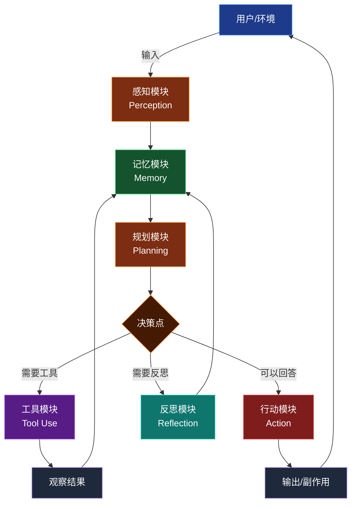
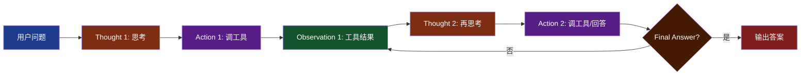
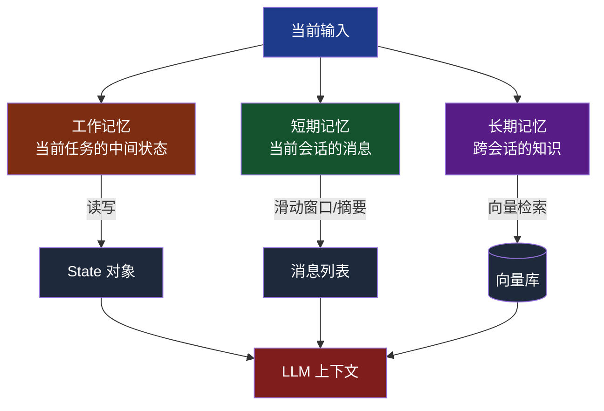
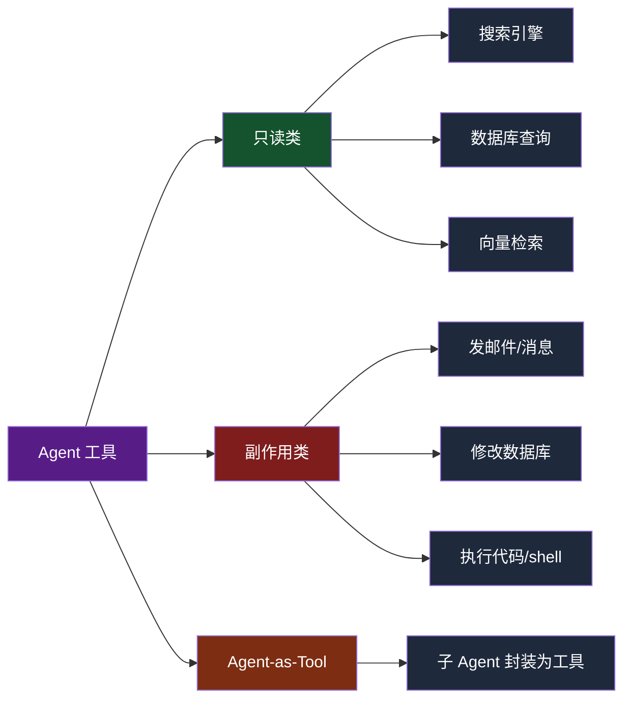
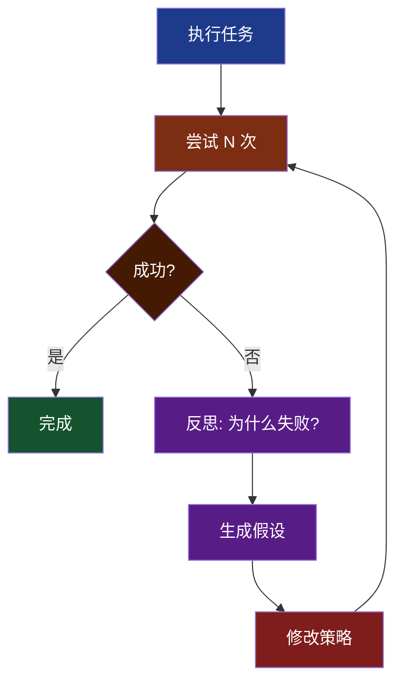
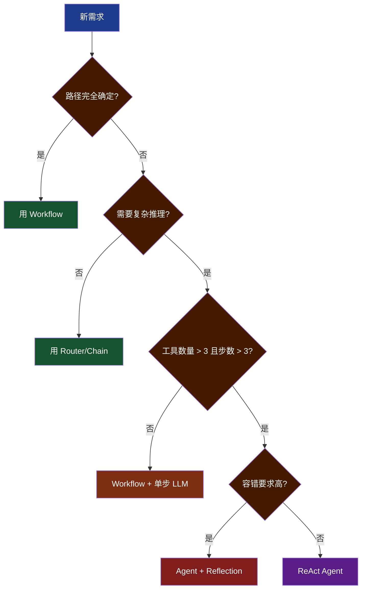

# 第 2 章 核心架构：五大模块全景

> 本章目标：建立 Agent 系统的完整架构视图。读完后你能画出 Agent 的"五大模块"，理解每个模块的职责、接口、典型实现，并能判断"我的场景需要哪些模块"。

---

## 2.1 五大核心模块全景

一个完整的 AI Agent 系统，无论框架如何，都可以拆解为五大核心模块 + 一个增强模块：



每个模块的职责：

| 模块 | 输入 | 输出 | 核心问题 |
|------|------|------|---------|
| **感知** | 用户消息、环境信号 | 结构化输入 | 我"看到"了什么？ |
| **记忆** | 历史信息、知识 | 相关上下文 | 哪些信息有用？ |
| **规划** | 当前状态 | 下一步动作 | 接下来该做什么？ |
| **工具** | 工具调用请求 | 观察结果 | 如何与外部交互？ |
| **行动** | LLM 输出 | 用户回复/副作用 | 如何完成任务？ |
| **反思** | 历史决策 | 修正建议 | 我做对了吗？ |

> **小结**：五大模块是"分类"，不是"步骤"。它们在 Agent 循环中反复交互，不是流水线。

---

## 2.2 经典 Agent 范式：从 ReAct 说起

理解五大模块，最快的方式是看 **ReAct**——LLM Agent 时代的"Hello World"。

### ReAct 论文核心思想

**ReAct = Reason + Act**

LLM 在每一步交替输出：

1. **Thought（思考）**：分析当前状态，规划下一步
2. **Action（行动）**：决定要做什么（调工具/回答）
3. **Observation（观察）**：从行动结果中学到的信息

然后回到 Thought，循环直至任务完成。



### ReAct 最小实现（伪代码 30 行内）

```python
def react_agent(question: str, tools: dict, llm, max_steps: int = 10) -> str:
    messages = [
        {"role": "system", "content": REACT_PROMPT},  # 教 LLM 输出 Thought/Action/Observation 格式
        {"role": "user", "content": question}
    ]

    for step in range(max_steps):
        response = llm.chat(messages)
        messages.append({"role": "assistant", "content": response})

        if "Final Answer:" in response:
            return response.split("Final Answer:")[-1].strip()

        # 解析 Action（如 "Action: search[Python history]"）
        action_name, action_input = parse_action(response)
        if action_name not in tools:
            obs = f"Error: unknown tool {action_name}"
        else:
            obs = tools[action_name](action_input)

        messages.append({"role": "user", "content": f"Observation: {obs}"})

    return "达到最大步数，未能完成任务"
```

这 30 行代码就涵盖了 Agent 的核心循环。**这就是 Agent 的本质：一个 while 循环里反复调 LLM 和工具。**

> **小结**：ReAct 之所以重要，是因为它让 LLM 的"推理"和"行动"显式化、可观测、可调试。

---

## 2.3 感知模块（Perception）

### 输入形式的演进

- **2023 年前**：纯文本（"我想退订单 123"）
- **2024 年**：多模态文本+图像（上传产品截图描述问题）
- **2025 年**：音频/视频（电话客服 Agent）
- **2026 年**：屏幕感知（Computer Use 类 Agent 看到完整 GUI）

### 感知阶段的处理

```python
class Perception:
    def __init__(self, sensitive_filter, intent_classifier):
        self.sensitive_filter = sensitive_filter
        self.intent_classifier = intent_classifier

    def process(self, raw_input: dict) -> dict:
        # 1. 敏感词过滤（防止 prompt 注入）
        cleaned = self.sensitive_filter(raw_input["text"])

        # 2. 意图分类（决定走哪条 Agent 链）
        intent = self.intent_classifier(cleaned)

        # 3. Token 长度控制
        if len(cleaned) > MAX_INPUT_TOKENS:
            cleaned = self._truncate(cleaned)

        # 4. 上下文增强（用户 ID、租户 ID、时区）
        return {
            "text": cleaned,
            "intent": intent,
            "user_context": raw_input.get("user_context", {})
        }
```

### 多模态输入的统一处理

现代 LLM（GPT-4V、Claude 3.5、Gemini）都支持多模态。感知层只需做"格式适配"：

```python
def to_llm_messages(user_input):
    content = []
    if user_input.get("text"):
        content.append({"type": "text", "text": user_input["text"]})
    for img in user_input.get("images", []):
        content.append({"type": "image_url", "image_url": img})
    return [{"role": "user", "content": content}]
```

> **小结**：感知模块不是"算法"，而是"预处理流水线"。它把杂乱的外部输入变成 Agent 内部可用的结构化数据。

---

## 2.4 规划模块（Planning）一览

规划是 Agent 的"大脑"，决定下一步行动。

### 三大策略

| 策略 | 代表算法 | 适用场景 |
|------|---------|---------|
| **直觉式** | ReAct、CoT | 短链推理、单一目标 |
| **计划式** | Plan-and-Execute、ToT | 复杂任务、需要全局视角 |
| **反思式** | Reflexion、Self-Refine | 容错要求高、可迭代 |

### 决策三问

规划模块本质是回答三个问题：

1. **要不要调工具？**（vs 直接回答）
2. **调哪个工具？**（在 N 个工具中选）
3. **传什么参数？**（结构化抽取）

```python
# 简化的决策逻辑（实际由 LLM 隐式完成）
def plan_next(state):
    if has_enough_info_to_answer(state):
        return Action(type="respond")
    elif need_more_data(state):
        tool, args = select_tool_and_args(state)
        return Action(type="use_tool", tool=tool, args=args)
    elif made_mistake(state):
        return Action(type="reflect")
```

具体规划算法（CoT/ReAct/ToT/Reflexion 等）详见**第 3 章**。

> **小结**：规划不是写死的 if/else，而是 LLM 在 Prompt 指导下"涌现"出的决策能力。

---

## 2.5 记忆模块（Memory）一览

### 三层记忆模型



### 上下文窗口管理

LLM 的上下文窗口虽大（Claude 200K、Gemini 2M），但放不下全人类知识。常用策略：

- **全量保留**：上下文够用时最简单
- **滑动窗口**：保留最近 N 轮
- **摘要压缩**：用 LLM 把老消息压缩成 1-2 段摘要
- **检索增强**：相关时再检索（RAG）

详见**第 4 章**。

> **小结**：记忆决定 Agent 是"金鱼"还是"老司机"。

---

## 2.6 工具模块（Tool Use）一览

### 工具定义协议

| 协议 | 厂商 | 特点 |
|------|------|------|
| **Function Calling** | OpenAI、Anthropic、Google | API 内置，单一供应商 |
| **MCP** | Anthropic（开放标准） | 跨供应商、可热插拔 |

### 工具分类



### 工具的"四要素"

一个好的工具必须有：

1. **名字**（snake_case，动词开头）：`get_weather`、`send_email`
2. **描述**（让 LLM 知道何时调用）：1-2 句话讲清"做什么、何时用"
3. **参数 Schema**（JSON Schema 或 Pydantic）
4. **执行函数**（实际跑的 Python 代码）

详见**第 5 章**。

> **小结**：工具是 Agent 唯一能影响外部世界的通路。"工具设计好坏"直接决定 Agent 能力上限。

---

## 2.7 行动模块（Action）

### 行动的形式

- **文本回复**：最常见，直接 return
- **API 调用**：调用外部服务
- **文件生成**：输出 Markdown、PDF、代码
- **结构化数据**：返回 JSON 给上层系统

### 副作用控制

副作用类操作（写数据库、发消息）必须做好：

- **幂等性**：重复执行不出问题（用 idempotency_key）
- **二次确认**：危险操作 HITL（Human-in-the-Loop）
- **回滚机制**：操作失败能恢复

```python
@tool
def send_refund(order_id: str, amount: float, confirmed: bool = False) -> str:
    """退款工具。confirmed 必须为 True 才会真正执行"""
    if not confirmed:
        return f"⚠️ 即将退款 {amount} 元给订单 {order_id}，请用户二次确认（再次调用时 confirmed=True）"
    result = payment_service.refund(order_id, amount)
    return f"退款成功，交易号 {result.txn_id}"
```

> **小结**：副作用类工具一定要"先确认再执行"，宁可多一次往返。

---

## 2.8 反思与自我修正

### 反思的价值

一个 LLM Agent 难免犯错：

- 工具调用参数错误
- 工具返回空结果
- 信息不足却强行回答
- LLM 输出格式不符合预期

**反思（Reflection）** 让 Agent 在错误后能"想想为什么错"，而不是机械重试。



### 反思的实现

```python
def reflect_and_retry(task, last_attempt, last_error, llm):
    reflection_prompt = f"""
    任务：{task}
    上次尝试：{last_attempt}
    错误：{last_error}

    请分析：
    1. 失败的根本原因
    2. 应该如何修改策略
    3. 给出新的执行计划
    """
    return llm.chat(reflection_prompt)
```

详见**第 3 章 Reflexion 部分**。

> **小结**：反思让 Agent 从"重复犯错"变成"举一反三"。

---

## 2.9 Agent 循环机制

### Agent Loop 完整框架

```python
def agent_loop(user_input, max_steps=20):
    state = {
        "messages": [user_input],
        "memory": Memory(),
        "step": 0,
        "done": False
    }

    while not state["done"] and state["step"] < max_steps:
        # 1. 感知：处理新输入
        perception = perceive(state)

        # 2. 记忆：检索相关上下文
        context = state["memory"].retrieve(perception)

        # 3. 规划：决定下一步
        plan = plan_next_action(perception, context)

        # 4. 行动：执行
        if plan.type == "respond":
            output = generate_response(perception, context)
            state["messages"].append(output)
            state["done"] = True

        elif plan.type == "use_tool":
            try:
                result = execute_tool(plan.tool, plan.args)
                state["memory"].add_observation(result)
            except Exception as e:
                state["memory"].add_error(e)

        elif plan.type == "reflect":
            feedback = reflect(state)
            state["memory"].add_reflection(feedback)

        state["step"] += 1

    return state["messages"][-1]
```

### 终止条件

| 条件 | 说明 |
|------|------|
| **达到目标** | LLM 输出 "Final Answer" |
| **最大步数** | 防止死循环（通常 10-30） |
| **用户中止** | 长任务支持取消 |
| **错误超限** | 连续 N 次失败兜底 |
| **超时** | 单步/总耗时超阈值 |
| **成本超限** | Token 消耗超预算 |

### 真实展开示例

用户问："今天上海天气怎样？需要带伞吗？"

| 步 | Thought | Action | Observation |
|----|---------|--------|-------------|
| 1 | 用户问天气和带伞，先查天气 | `get_weather(city="上海")` | `{"temp": 22, "rain": "60%"}` |
| 2 | 60% 降雨概率，确实需要带伞 | （生成最终回答） | — |
| Final | "上海今天 22℃，降雨概率 60%，建议带伞" | — | — |

> **小结**：Agent 循环不复杂，难的是"何时停"——既不能跑飞，也不能过早放弃。

---

## 2.10 架构演进：从 Workflow 到 Agent

### 三种架构光谱


从左到右：**灵活性 ↑，可预测性 ↓，成本 ↑**。

### 选型决策树



### 工程哲学

> **"尽可能用 Workflow，必要时才用 Agent。"** —— Anthropic《Building Effective Agents》

为什么？

| 维度 | Workflow | Agent |
|------|---------|-------|
| 调试 | 容易（确定路径） | 难（每次路径不同） |
| 成本 | 可预算 | 难预算 |
| 延迟 | 可预测 | 高方差 |
| 故障 | 明确 | 模糊 |

只有当问题真的需要"动态决策"时，才付 Agent 的代价。

> **小结**：架构选型不是"越先进越好"，而是"匹配问题复杂度"。

---

## 本章小结

- Agent = 感知 + 记忆 + 规划 + 工具 + 行动 + 反思（六大模块）
- ReAct 的 Thought/Action/Observation 循环是所有现代 Agent 框架的内核
- 五大模块不是流水线，而是在循环中反复交互
- Agent Loop 的核心难点是"何时停止"
- 选型遵循"尽可能简单"原则：Workflow > Router > Agent

## 下一章预告

第 3 章我们深入**规划模块**，详细讲解 CoT、ReAct、Plan-and-Execute、ToT、Reflexion 等主流规划范式，每种都有完整代码实现。

> **思考题**：你现在的项目里，哪些用 Workflow 就够了？哪些必须上 Agent？为什么？
