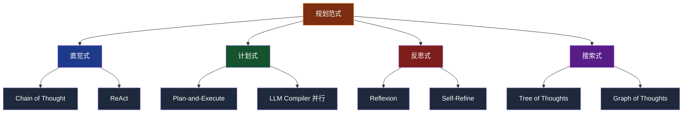
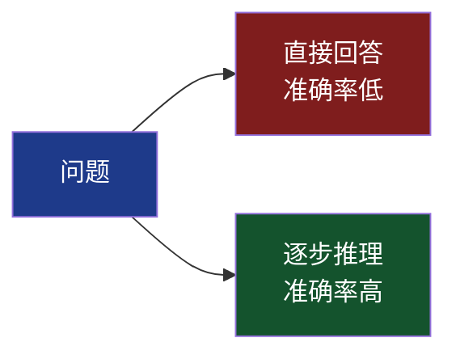
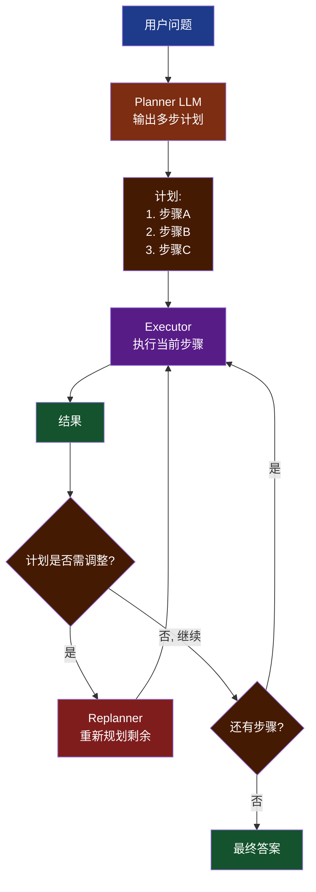
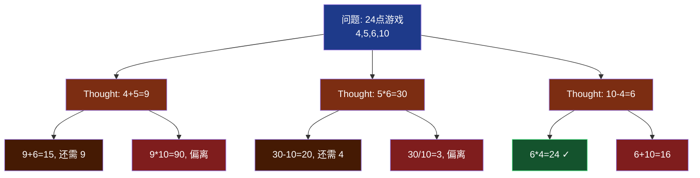
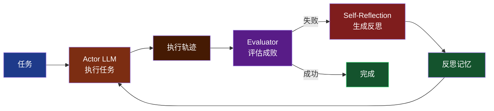
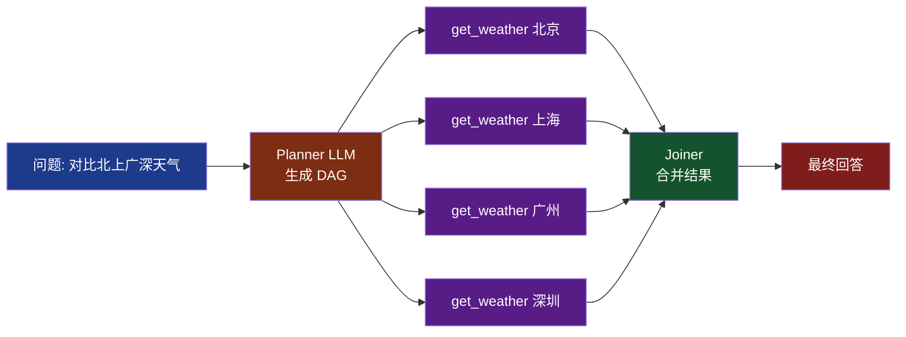
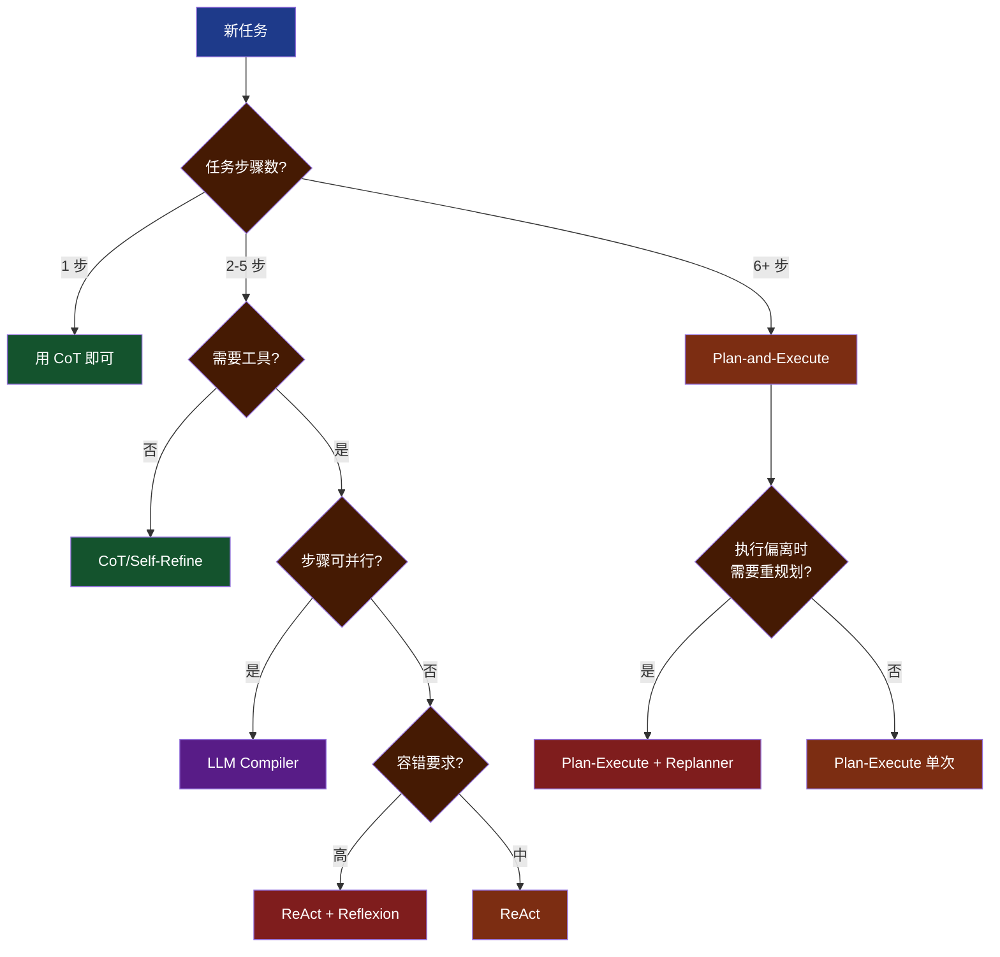

# 第 3 章 规划模块：Planning 深度解析

> 本章目标：吃透 Agent 的"大脑"——规划模块。学完后你能根据任务复杂度选择合适的规划策略（CoT/ReAct/ToT/Plan-Execute/Reflexion 等），并能用 Python 从零实现它们。

---

## 3.1 为什么需要规划

### LLM 单次调用的局限

直接问 LLM 一个复杂问题，比如："帮我组织一场 30 人的产品发布会"——它能给出一份清单，但：

- 步骤不能与外部世界交互（不能真订场地、发邀请）
- 上下文一次给完，无法根据中间结果调整
- 推理深度有限，复杂任务容易遗漏

### 规划的本质

> **规划 = 将复杂目标分解为可执行的原子动作序列。**

两个维度：

1. **时间维度**：先后顺序（先订场地，再发邀请）
2. **抽象维度**：高层目标 → 具体动作（"办发布会" → "订 XX 酒店宴会厅"）

### 规划范式全景



下面逐个讲解。

---

## 3.2 Chain of Thought（CoT）：思维链

### 论文与原理

**论文**：[Wei et al., 2022, "Chain-of-Thought Prompting Elicits Reasoning in Large Language Models"](https://arxiv.org/abs/2201.11903)

**核心思想**：让 LLM "think step by step"，把推理过程显式写出来，能大幅提升复杂推理任务的准确率。



### Zero-shot CoT 实现

```python
from openai import OpenAI

client = OpenAI()

def zero_shot_cot(question: str) -> str:
    messages = [
        {"role": "user", "content": f"{question}\n\n请一步一步地思考，最后给出答案。"}
    ]
    response = client.chat.completions.create(
        model="gpt-4", messages=messages, temperature=0
    )
    return response.choices[0].message.content

# 测试
result = zero_shot_cot("一辆车每小时 60 公里，从北京到上海 1200 公里，中途休息 2 小时，问总耗时多少？")
print(result)
# 输出示例：
# 让我一步一步思考：
# 1. 行驶距离 1200 公里，速度 60 km/h
# 2. 行驶时间 = 1200 / 60 = 20 小时
# 3. 加上休息 2 小时，总耗时 22 小时
# 答案：22 小时
```

### Few-shot CoT

给 LLM 几个示例，效果通常优于 Zero-shot：

```python
def few_shot_cot(question: str) -> str:
    examples = """
Q: 商店有 23 个苹果，卖了 20 个，又买进 6 个，现有多少？
A: 让我一步步算。
   原有 23 个，卖出 20 个，剩 23-20=3 个。
   又进 6 个，现有 3+6=9 个。
答案：9 个。
"""
    messages = [
        {"role": "user", "content": f"{examples}\n\nQ: {question}\nA:"}
    ]
    response = client.chat.completions.create(
        model="gpt-4", messages=messages, temperature=0
    )
    return response.choices[0].message.content
```

### CoT 的局限

❌ **单链推理**：一条线走到底，错了无法回溯
❌ **无外部反馈**：不能调工具，只能依赖训练知识
❌ **不能停顿**：必须一次性输出完整推理

CoT 是规划的"起点"，真实 Agent 需要更复杂的范式。

> **小结**：CoT 让 LLM "显式思考"。它不是 Agent，但所有 Agent 范式都建立在 CoT 之上。

---

## 3.3 ReAct：推理 + 行动

### 论文与原理

**论文**：[Yao et al., 2022, "ReAct: Synergizing Reasoning and Acting in Language Models"](https://arxiv.org/abs/2210.03629)

**核心思想**：CoT 只推理，无法行动；纯 Action 又缺乏推理。ReAct 让两者交替，互相增强：

```
Thought → Action → Observation → Thought → Action → ...
```

### ReAct 完整实现（从零，不依赖框架）

```python
import re
import json
from openai import OpenAI

client = OpenAI()

REACT_PROMPT = """你是一个 ReAct Agent。可用工具：
- search(query): 网络搜索
- calculator(expression): 数学计算

按以下格式输出：
Thought: 你的思考
Action: tool_name(args)
（系统会返回 Observation）
...重复直到能给出答案...
Thought: 我现在能回答了
Final Answer: 你的最终答案
"""

# 模拟工具
def search(query: str) -> str:
    fake_db = {
        "上海人口": "上海常住人口约 2487 万（2024 年数据）",
        "北京人口": "北京常住人口约 2189 万（2024 年数据）",
    }
    for k, v in fake_db.items():
        if k in query:
            return v
    return "未找到相关信息"

def calculator(expr: str) -> str:
    try:
        return str(eval(expr))
    except Exception as e:
        return f"计算错误：{e}"

TOOLS = {"search": search, "calculator": calculator}

def parse_action(text: str):
    """从 LLM 输出中解析 Action"""
    m = re.search(r"Action:\s*(\w+)\((.*?)\)", text)
    if not m:
        return None, None
    name, arg = m.group(1), m.group(2).strip().strip('"\'')
    return name, arg

def react_agent(question: str, max_steps: int = 8) -> str:
    messages = [
        {"role": "system", "content": REACT_PROMPT},
        {"role": "user", "content": f"Question: {question}"}
    ]

    for step in range(max_steps):
        response = client.chat.completions.create(
            model="gpt-4", messages=messages,
            temperature=0, stop=["Observation:"]
        )
        text = response.choices[0].message.content
        print(f"\n--- Step {step+1} ---\n{text}")
        messages.append({"role": "assistant", "content": text})

        if "Final Answer:" in text:
            return text.split("Final Answer:")[-1].strip()

        action_name, action_args = parse_action(text)
        if action_name is None:
            messages.append({"role": "user", "content": "Observation: 解析 Action 失败，请按格式输出"})
            continue

        if action_name not in TOOLS:
            obs = f"未知工具：{action_name}"
        else:
            obs = TOOLS[action_name](action_args)

        print(f"Observation: {obs}")
        messages.append({"role": "user", "content": f"Observation: {obs}"})

    return "达到最大步数仍未完成"

# 运行
answer = react_agent("上海和北京哪个人口多？多多少？")
print(f"\n最终答案：{answer}")
```

**运行过程**：

```
--- Step 1 ---
Thought: 我需要先查询上海和北京的人口数据
Action: search("上海人口")
Observation: 上海常住人口约 2487 万（2024 年数据）

--- Step 2 ---
Thought: 现在查北京
Action: search("北京人口")
Observation: 北京常住人口约 2189 万（2024 年数据）

--- Step 3 ---
Thought: 计算差值
Action: calculator(2487 - 2189)
Observation: 298

--- Step 4 ---
Thought: 我现在能回答了
Final Answer: 上海人口多于北京。上海约 2487 万，北京约 2189 万，上海比北京多约 298 万人。
```

> **小结**：ReAct 是 LLM Agent 的"Hello World"。简单、有效、可解释。绝大多数 Agent 框架（LangChain Agent、LangGraph prebuilt）默认就是 ReAct。

---

## 3.4 Plan-and-Execute：先规划后执行

### 论文与原理

**论文**：[Wang et al., 2023, "Plan-and-Solve Prompting"](https://arxiv.org/abs/2305.04091)，以及 LangChain 团队的工程实现

**核心思想**：ReAct 每一步都要调 LLM 决定下一步，开销大。Plan-and-Execute 改成：

1. **Planner**：一次性输出完整计划（多步任务）
2. **Executor**：逐步执行，每步可以是简单 ReAct
3. **Replanner**：执行偏离时，重新规划



### LangGraph 实现

```python
from typing import List, Annotated, TypedDict
from langchain_openai import ChatOpenAI
from langchain_core.prompts import ChatPromptTemplate
from langgraph.graph import StateGraph, END
import operator

class PlanState(TypedDict):
    input: str
    plan: List[str]
    past_steps: Annotated[List[tuple], operator.add]
    response: str

llm = ChatOpenAI(model="gpt-4", temperature=0)

# 1. Planner 节点
planner_prompt = ChatPromptTemplate.from_messages([
    ("system", "你是规划者。把用户任务拆解成 3-5 个可执行步骤，每步独立可验证。"
                "输出 JSON 数组，如 [\"步骤1\", \"步骤2\"]"),
    ("user", "{input}")
])

def plan_step(state: PlanState):
    chain = planner_prompt | llm
    response = chain.invoke({"input": state["input"]})
    import json, re
    text = response.content
    # 提取 JSON 数组
    match = re.search(r'\[.*\]', text, re.DOTALL)
    plan = json.loads(match.group(0)) if match else [text]
    return {"plan": plan}

# 2. Executor 节点
exec_prompt = ChatPromptTemplate.from_messages([
    ("system", "执行以下任务步骤，返回结果。"),
    ("user", "整体目标：{input}\n当前步骤：{task}\n已完成步骤：{past}")
])

def execute_step(state: PlanState):
    task = state["plan"][0]
    past = "\n".join(f"- {s}: {r}" for s, r in state["past_steps"])
    chain = exec_prompt | llm
    result = chain.invoke({
        "input": state["input"], "task": task, "past": past
    }).content
    return {"past_steps": [(task, result)]}

# 3. Replanner 节点
replanner_prompt = ChatPromptTemplate.from_messages([
    ("system", "根据已完成步骤，决定下一步。若任务完成，输出 RESPONSE: 最终答案。"
                "否则输出新的 PLAN: [剩余步骤]"),
    ("user", "目标：{input}\n原计划：{plan}\n已完成：{past}")
])

def replan_step(state: PlanState):
    chain = replanner_prompt | llm
    response = chain.invoke({
        "input": state["input"],
        "plan": state["plan"],
        "past": state["past_steps"]
    }).content
    if response.startswith("RESPONSE:"):
        return {"response": response[9:].strip()}
    import json, re
    match = re.search(r'\[.*\]', response, re.DOTALL)
    new_plan = json.loads(match.group(0)) if match else []
    return {"plan": new_plan}

def should_end(state: PlanState):
    return END if state.get("response") else "executor"

# 构建图
workflow = StateGraph(PlanState)
workflow.add_node("planner", plan_step)
workflow.add_node("executor", execute_step)
workflow.add_node("replanner", replan_step)

workflow.set_entry_point("planner")
workflow.add_edge("planner", "executor")
workflow.add_edge("executor", "replanner")
workflow.add_conditional_edges("replanner", should_end, ["executor", END])

app = workflow.compile()

# 运行
result = app.invoke({"input": "帮我策划一份周末家庭烧烤活动方案"})
print(result["response"])
```

### Plan-and-Execute vs ReAct

| 维度 | ReAct | Plan-and-Execute |
|------|-------|-----------------|
| LLM 调用次数 | 每步 1 次 | Planner 1 次 + 每步 Executor 1 次 + Replanner |
| 灵活性 | 高（每步独立决策） | 中（受预设计划约束） |
| 适用任务 | 短链、未知路径 | 长链、可预先拆解 |
| 成本 | 高（每步都要 reasoning） | 中等（执行步骤可用更小模型） |

> **小结**：Plan-and-Execute 的精髓是"分离规划与执行"，让昂贵的大模型只负责规划，执行可用便宜模型。

---

## 3.5 Tree of Thoughts（ToT）：思维树

### 论文与原理

**论文**：[Yao et al., 2023, "Tree of Thoughts: Deliberate Problem Solving with Large Language Models"](https://arxiv.org/abs/2305.10601)

**核心思想**：CoT 是单链推理，错了无回头路。ToT 把推理过程组织成"树"，让 LLM 探索多条路径、评估路径质量、按 BFS/DFS 搜索。



### ToT 三件套

1. **思想生成（Thought Generator）**：从当前节点扩展 N 个候选
2. **状态评估（State Evaluator）**：给每个候选打分（promising/not promising）
3. **搜索算法**：BFS（层层扩展）或 DFS（深入再回溯）

### 简化实现（24 点游戏）

```python
from openai import OpenAI
import re

client = OpenAI()

def generate_thoughts(state: str, n: int = 3) -> list:
    """从当前状态生成 N 个候选思路"""
    prompt = f"""24 点游戏。当前数字状态：{state}
请生成 {n} 个不同的下一步运算（如 "3+4=7" → 新状态 "7,5,6"）。
每行一个候选，格式：操作 | 新状态
"""
    resp = client.chat.completions.create(
        model="gpt-4", messages=[{"role": "user", "content": prompt}],
        temperature=0.7
    )
    lines = resp.choices[0].message.content.strip().split("\n")
    return [l for l in lines if "|" in l][:n]

def evaluate(state: str) -> str:
    """评估状态：sure / likely / impossible"""
    prompt = f"""当前剩余数字：{state}
判断能否通过加减乘除得到 24？只输出三个标签之一：sure / likely / impossible"""
    resp = client.chat.completions.create(
        model="gpt-4", messages=[{"role": "user", "content": prompt}],
        temperature=0
    )
    text = resp.choices[0].message.content.lower()
    if "impossible" in text: return "impossible"
    if "sure" in text: return "sure"
    return "likely"

def tot_bfs(start: str, max_depth: int = 3) -> list:
    """BFS 搜索"""
    frontier = [(start, [])]  # (state, path)
    for depth in range(max_depth):
        next_frontier = []
        for state, path in frontier:
            verdict = evaluate(state)
            if verdict == "impossible":
                continue
            if state.strip() == "24" or "24" == state.replace(" ", ""):
                return path + [state]
            for thought in generate_thoughts(state, n=3):
                op, new_state = thought.split("|")
                next_frontier.append((new_state.strip(), path + [op.strip()]))
        # 剪枝：保留最 promising 的 N 个
        frontier = next_frontier[:5]
    return []

solution = tot_bfs("4,5,6,10")
print("解题路径：", solution)
```

> **小结**：ToT 用"探索 + 评估 + 剪枝"换准确率，适合数学题、逻辑题、规划题等"路径少但要找最优"的场景。代价是 LLM 调用数 10 倍起。

---

## 3.6 Reflexion：反思机制

### 论文与原理

**论文**：[Shinn et al., 2023, "Reflexion: Language Agents with Verbal Reinforcement Learning"](https://arxiv.org/abs/2303.11366)

**核心思想**：Agent 失败后，用 LLM 自己分析"为什么失败"，把反思结果加入下次尝试的上下文，相当于"语言形式的强化学习"。

### Reflexion 三件套架构



### 完整实现

```python
from openai import OpenAI
from typing import List

client = OpenAI()

class ReflexionAgent:
    def __init__(self, task: str, max_trials: int = 3):
        self.task = task
        self.max_trials = max_trials
        self.reflections: List[str] = []

    def actor(self) -> str:
        """执行任务"""
        prompt = f"任务：{self.task}\n"
        if self.reflections:
            prompt += "\n过去的反思（请避免重复错误）：\n"
            prompt += "\n".join(f"- {r}" for r in self.reflections)
        prompt += "\n请给出你的解决方案。"

        resp = client.chat.completions.create(
            model="gpt-4", messages=[{"role": "user", "content": prompt}],
            temperature=0
        )
        return resp.choices[0].message.content

    def evaluator(self, trajectory: str) -> tuple[bool, str]:
        """评估是否成功"""
        prompt = f"""任务：{self.task}
执行结果：{trajectory}

请判断：成功了吗？(success/fail)
并说明原因。
格式：
VERDICT: success/fail
REASON: 理由
"""
        resp = client.chat.completions.create(
            model="gpt-4", messages=[{"role": "user", "content": prompt}],
            temperature=0
        ).choices[0].message.content

        success = "success" in resp.lower().split("verdict:")[-1].split("\n")[0]
        reason = resp.split("REASON:")[-1].strip() if "REASON:" in resp else resp
        return success, reason

    def reflector(self, trajectory: str, failure_reason: str) -> str:
        """生成反思"""
        prompt = f"""任务：{self.task}
失败的尝试：{trajectory}
失败原因：{failure_reason}

请反思：
1. 我犯了什么错？
2. 下次应该如何避免？
输出 1-2 句简洁的经验教训。
"""
        resp = client.chat.completions.create(
            model="gpt-4", messages=[{"role": "user", "content": prompt}],
            temperature=0.3
        )
        return resp.choices[0].message.content.strip()

    def run(self) -> str:
        for trial in range(self.max_trials):
            print(f"\n=== Trial {trial+1} ===")
            trajectory = self.actor()
            print(f"执行：{trajectory[:200]}...")

            success, reason = self.evaluator(trajectory)
            print(f"评估：{'✅' if success else '❌'} {reason[:100]}")

            if success:
                return trajectory

            reflection = self.reflector(trajectory, reason)
            print(f"反思：{reflection}")
            self.reflections.append(reflection)

        return f"经过 {self.max_trials} 次尝试仍未成功。最后一次结果：{trajectory}"

# 测试
agent = ReflexionAgent(
    task="写一个 Python 函数，判断字符串是否为有效的中国大陆手机号（11位，1开头，第二位3-9）"
)
result = agent.run()
print(f"\n最终结果：\n{result}")
```

### Reflexion 关键点

- **反思要具体**：不是"我错了"，而是"我忘了考虑空字符串"
- **反思要可执行**：下次能直接用作改进
- **跨任务复用**：长期反思库（episodic memory）

> **小结**：Reflexion 让 Agent 具备"从失败中学习"的能力，特别适合编程、数学、推理类任务。

---

## 3.7 Self-Refine：自我精炼

### 论文与原理

**论文**：[Madaan et al., 2023, "Self-Refine"](https://arxiv.org/abs/2303.17651)

**核心思想**：与 Reflexion 类似，但更轻量——单次任务内做"生成 → 自我反馈 → 修改"循环，无需 Evaluator 判定成败。

### 实现

```python
def self_refine(task: str, max_iter: int = 3) -> str:
    answer = client.chat.completions.create(
        model="gpt-4",
        messages=[{"role": "user", "content": task}]
    ).choices[0].message.content

    for i in range(max_iter):
        feedback = client.chat.completions.create(
            model="gpt-4",
            messages=[{
                "role": "user",
                "content": f"任务：{task}\n当前答案：{answer}\n\n请挑刺：哪里可以改进？"
            }]
        ).choices[0].message.content

        if "无需改进" in feedback or "已经很好" in feedback:
            break

        answer = client.chat.completions.create(
            model="gpt-4",
            messages=[{
                "role": "user",
                "content": f"任务：{task}\n原答案：{answer}\n反馈：{feedback}\n\n请改进。"
            }]
        ).choices[0].message.content

    return answer

# 用于写作改进效果好
improved = self_refine("写一段 100 字的产品宣传文案，介绍我们的新款蓝牙耳机")
```

### Self-Refine vs Reflexion

| 维度 | Self-Refine | Reflexion |
|------|------------|-----------|
| 周期 | 单任务内 | 跨任务（多次尝试） |
| 评估 | 自我反馈（开放） | Evaluator 判定（有标准） |
| 适用 | 写作、文本质量 | 代码、推理、有标准答案 |

---

## 3.8 LLM Compiler：并行规划

### 论文与原理

**论文**：[Kim et al., 2023, "An LLM Compiler for Parallel Function Calling"](https://arxiv.org/abs/2312.04511)

**核心思想**：很多任务的子步骤可以并行（如同时查 3 个城市的天气）。ReAct 强制串行，浪费时间。LLM Compiler 把任务编译成 DAG，并行执行。



### 性能对比

| 范式 | 串行步骤 | 并行步骤 | 4 工具任务延迟 |
|------|---------|---------|---------------|
| ReAct | ✅ | ❌ | ~12 秒（4 次 LLM + 4 次工具串行） |
| LLM Compiler | ✅ | ✅ | ~5 秒（1 次 Planner + 4 工具并行 + Joiner） |

LangGraph 通过 `add_node` + 异步执行可以实现类似效果。

---

## 3.9 规划范式选型决策树



### 5 个真实场景选型

| 场景 | 推荐范式 | 理由 |
|------|---------|------|
| 客服回答简单问题 | ReAct | 短链、需要查 KB |
| 自动生成营销文案 | Self-Refine | 写作类，迭代改进 |
| 数据分析报告 | Plan-and-Execute | 步骤清晰可拆分 |
| 编程题求解 | ReAct + Reflexion | 容错要求高，需调试 |
| 旅行行程规划 | Plan-Execute + Replanner | 长流程，可能临时调整 |
| 多城市信息汇总 | LLM Compiler | 子任务可并行 |

---

## 3.10 工程实战：混合规划的客服 Agent

真实系统往往不是单一范式。下面是一个"Plan-Execute + ReAct + Reflexion"混合的客服 Agent：

```python
from typing import List, TypedDict, Annotated
from langchain_openai import ChatOpenAI
from langgraph.graph import StateGraph, END
import operator

class CSAgentState(TypedDict):
    user_query: str
    plan: List[str]  # Planner 输出
    current_step: int
    observations: Annotated[List[str], operator.add]
    response: str
    retry_count: int
    reflections: Annotated[List[str], operator.add]

llm = ChatOpenAI(model="gpt-4", temperature=0)

# === 模拟工具 ===
def query_order(order_id: str) -> str:
    return f"订单 {order_id}：已发货，预计明天送达"

def query_refund_policy() -> str:
    return "退款政策：未发货可全额退款，已发货需扣 10% 手续费"

TOOLS = {"query_order": query_order, "query_refund_policy": query_refund_policy}

# === Planner（一次性规划） ===
def planner_node(state):
    prompt = f"""用户问题：{state['user_query']}
可用工具：{list(TOOLS.keys())}
过去的反思：{state.get('reflections', [])}

请输出 2-4 步的执行计划，每步是一个工具调用或最终回复。
格式：
1. query_order("12345")
2. query_refund_policy()
3. 综合信息回复用户
"""
    plan_text = llm.invoke(prompt).content
    plan = [l.strip() for l in plan_text.split("\n") if l.strip() and l[0].isdigit()]
    return {"plan": plan, "current_step": 0}

# === Executor（执行当前步骤，内嵌 ReAct） ===
def executor_node(state):
    step = state["plan"][state["current_step"]]
    # 简单解析：如果是工具调用就执行，否则交给 LLM
    import re
    m = re.search(r"(\w+)\((.*?)\)", step)
    if m and m.group(1) in TOOLS:
        result = TOOLS[m.group(1)](m.group(2).strip('"'))
    else:
        # 让 LLM 根据 observations 生成回复
        ctx = "\n".join(state["observations"])
        result = llm.invoke(f"用户问：{state['user_query']}\n已知：{ctx}\n请回复用户。").content
        return {"response": result, "current_step": state["current_step"] + 1}

    return {
        "observations": [f"{step} → {result}"],
        "current_step": state["current_step"] + 1
    }

# === Evaluator + Reflector ===
def reflect_node(state):
    if not state.get("response"):
        return {}
    feedback = llm.invoke(
        f"用户问：{state['user_query']}\n回复：{state['response']}\n"
        f"评估：是否准确、完整地回答了问题？若不足，给出反思。"
        f"格式：VERDICT: ok/fail\nREFLECTION: ..."
    ).content
    if "ok" in feedback.lower().split("verdict:")[-1].split("\n")[0]:
        return {}  # 通过
    reflection = feedback.split("REFLECTION:")[-1].strip()
    return {
        "reflections": [reflection],
        "retry_count": state.get("retry_count", 0) + 1,
        "current_step": 0,
        "plan": [],
        "response": ""
    }

# === 路由 ===
def route_after_executor(state):
    if state.get("response"):
        return "reflector"
    if state["current_step"] >= len(state["plan"]):
        return "reflector"
    return "executor"

def route_after_reflector(state):
    if state.get("response"):  # reflection 通过
        return END
    if state.get("retry_count", 0) >= 2:  # 重试上限
        return END
    return "planner"  # 重新规划

# === 构建图 ===
g = StateGraph(CSAgentState)
g.add_node("planner", planner_node)
g.add_node("executor", executor_node)
g.add_node("reflector", reflect_node)

g.set_entry_point("planner")
g.add_edge("planner", "executor")
g.add_conditional_edges("executor", route_after_executor, {
    "executor": "executor", "reflector": "reflector"
})
g.add_conditional_edges("reflector", route_after_reflector, {
    "planner": "planner", END: END
})

app = g.compile()

# 运行
result = app.invoke({
    "user_query": "我订单 12345 想退款，可以吗？要扣多少手续费？",
    "observations": []
})
print(result["response"])
```

这个例子综合了：
- **Planner**：拆解任务为 3 步
- **Executor**：执行每步（含 ReAct 风格的工具调用）
- **Reflector**：评估输出质量，不行就重规划（最多 2 次）

> **小结**：生产 Agent 通常是混合范式。LangGraph 的图结构让"组合不同范式"变得可视化、可维护。

---

## 本章小结

- **CoT** 是基础：让 LLM 显式推理
- **ReAct** 是工业标准：推理 + 行动交替循环
- **Plan-and-Execute** 适合长任务：拆 Planner 和 Executor
- **ToT** 适合搜索类问题：探索多路径 + 剪枝
- **Reflexion** 让 Agent 从失败学习：跨任务反思记忆
- **Self-Refine** 单任务内迭代改进
- **LLM Compiler** 并行调用工具，减少延迟
- 真实系统常用**混合范式**，根据子任务特点选择

## 下一章预告

第 4 章我们深入**记忆模块**，详细讲解短期/工作/长期记忆、RAG 完整流程、Advanced RAG（Multi-Query / HyDE / Self-RAG）、上下文工程。

> **思考题**：你最近做的 LLM 项目，如果引入 Reflexion，能避免哪些常见错误？
