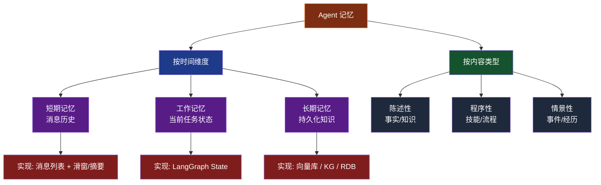
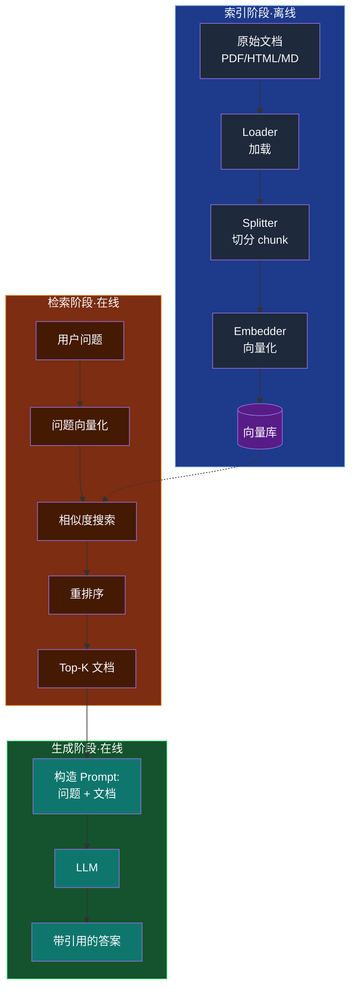
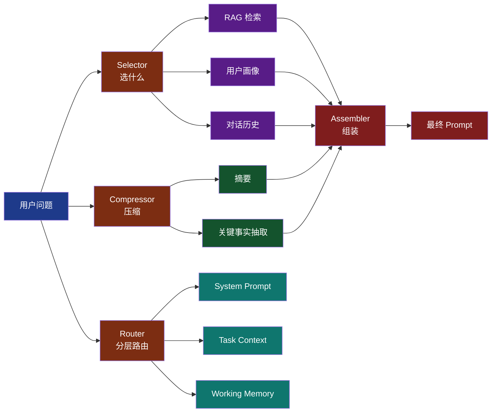

# 第 4 章 记忆模块：Memory 与 RAG

> 本章目标：吃透 Agent 的"记忆系统"。学完后你能设计完整的记忆架构（短期+工作+长期），构建生产级 RAG（含 Advanced 模式），并掌握 2025-2026 热门的"上下文工程"思维。

---

## 4.1 为什么记忆是 Agent 的灵魂

### LLM 本身无状态

每次 API 调用对 LLM 来说都是"全新的"。它不知道你三秒前问过什么，更不知道你上周说过什么。所有"记忆"都必须由 Agent 系统外挂。

### 上下文窗口的物理限制

| 模型 | 上下文窗口 |
|------|----------|
| GPT-4 Turbo | 128K |
| Claude 3.5 Sonnet | 200K |
| Claude 4.6 | 1M (扩展) |
| Gemini 2.5 Pro | 2M |

听起来很大，但：

- 1M token ≈ 75 万英文单词 ≈ 一本《战争与和平》
- 真实场景：50 轮对话 + 工具描述 + 检索文档 → 轻松爆 100K
- 即使能放下，"大海捞针"问题严重（信息在窗口中间易被忽视）

### 没有记忆 vs 有记忆

**没有记忆**（纯 LLM）：
- 用户："我喜欢喝美式咖啡。"
- LLM："好的。"
- 用户（下一轮）："推荐一杯咖啡。"
- LLM："推荐拿铁。"❌（忘了用户偏好）

**有记忆**（Agent）：
- 用户（第 1 轮）："我喜欢喝美式咖啡。" → 写入长期记忆
- 用户（第 100 轮）："推荐一杯咖啡。" → 检索到偏好 → "推荐冰美式。"✅

> **小结**：记忆决定 Agent 是"金鱼"还是"老朋友"。

---

## 4.2 记忆的分类体系



| 类型 | 持续时间 | 存储位置 | 典型内容 |
|------|---------|---------|---------|
| 短期 | 一次会话 | 内存/Redis | 多轮对话历史 |
| 工作 | 一个任务 | LangGraph State | 中间结果、计划 |
| 长期 | 跨会话永久 | 向量库/PG | 用户偏好、领域知识、历史经验 |

---

## 4.3 短期记忆（Short-term Memory）

### 实现方式

最简单：把所有消息往后追加。

```python
messages = [
    {"role": "system", "content": "你是助手"},
    {"role": "user", "content": "我叫小明"},
    {"role": "assistant", "content": "你好小明！"},
    {"role": "user", "content": "我多大年龄？"},
    # ...
]
```

但随着轮数增长，token 消耗爆炸：第 50 轮可能就有 30K token。

### 4 种压缩策略对比

```python
from langchain_openai import ChatOpenAI
from langchain_core.messages import HumanMessage, AIMessage, SystemMessage

llm = ChatOpenAI(model="gpt-4")

# === 策略 1：全量保留 ===
def strategy_full(messages):
    return messages  # 不变

# === 策略 2：滑动窗口（保留最近 N 轮） ===
def strategy_window(messages, n=10):
    sys = [m for m in messages if isinstance(m, SystemMessage)]
    others = [m for m in messages if not isinstance(m, SystemMessage)]
    return sys + others[-n:]

# === 策略 3：摘要压缩 ===
def strategy_summarize(messages, keep_recent=4):
    if len(messages) <= keep_recent + 2:
        return messages
    sys = [m for m in messages if isinstance(m, SystemMessage)]
    to_summarize = messages[len(sys):-keep_recent]
    recent = messages[-keep_recent:]

    summary_prompt = "请用 100 字内总结以下对话要点：\n"
    summary_prompt += "\n".join(
        f"{m.type}: {m.content[:200]}" for m in to_summarize
    )
    summary = llm.invoke(summary_prompt).content
    return sys + [SystemMessage(content=f"[历史摘要] {summary}")] + recent

# === 策略 4：混合（摘要旧的 + 滑窗近的） ===
def strategy_hybrid(messages, summary_threshold=20, recent_n=6):
    if len(messages) < summary_threshold:
        return messages  # 短时全量
    return strategy_summarize(messages, keep_recent=recent_n)

# === 对比 token 消耗 ===
import tiktoken
enc = tiktoken.encoding_for_model("gpt-4")

def count_tokens(messages):
    return sum(len(enc.encode(m.content)) for m in messages)

# 模拟 50 轮对话
msgs = [SystemMessage(content="你是助手")]
for i in range(50):
    msgs.append(HumanMessage(content=f"问题{i}：" + "x" * 200))
    msgs.append(AIMessage(content=f"答案{i}：" + "y" * 300))

print(f"全量：{count_tokens(strategy_full(msgs))} tokens")
print(f"滑窗(10): {count_tokens(strategy_window(msgs, 10))} tokens")
print(f"摘要(留4): {count_tokens(strategy_summarize(msgs, 4))} tokens")
print(f"混合: {count_tokens(strategy_hybrid(msgs))} tokens")
# 典型输出：
# 全量：12750 tokens
# 滑窗(10): 2551 tokens
# 摘要(留4): ~1500 tokens
# 混合: ~1800 tokens
```

### 选型建议

| 策略 | 适用场景 |
|------|---------|
| 全量 | 短会话（<10 轮） |
| 滑窗 | 信息密度均匀，最近最重要 |
| 摘要 | 长会话、需要保留历史关键事实 |
| 混合 | 生产首选，平衡成本与质量 |

> **小结**：短期记忆策略的核心是"在 token 预算下最大化信息保留"。

---

## 4.4 工作记忆（Working Memory）

### 概念

工作记忆是"当前任务的中间状态"。对应人类的"草稿纸"——临时记下中间结果，任务结束后可能丢弃。

LangGraph 的 **State** 就是工作记忆的载体：

```python
from typing import TypedDict, Annotated, List
import operator

class AgentState(TypedDict):
    # 用户输入
    user_query: str
    # 工作记忆：当前任务的中间结果
    search_results: List[str]
    extracted_entities: dict
    intermediate_answer: str
    # 短期记忆：本会话消息
    messages: Annotated[List, operator.add]
    # 长期记忆引用（指向外部存储）
    long_term_memory_key: str
```

### 工作记忆 vs 短期记忆

| 维度 | 短期记忆 | 工作记忆 |
|------|---------|---------|
| 范围 | 整个会话 | 单个任务 |
| 持久化 | 通常需要 | 通常不需要 |
| 内容 | 消息历史 | 计算中间值 |
| 生命周期 | 会话结束 | 任务结束 |

> **小结**：工作记忆让 Agent 能"心算"——保留中间结果用于后续步骤。

---

## 4.5 长期记忆（Long-term Memory）

### 三种主流实现

| 方案 | 优点 | 缺点 | 典型场景 |
|------|------|------|---------|
| **向量数据库** | 语义检索、高扩展 | 无结构化查询、相似度可能误判 | 文档问答、知识库 |
| **关系数据库** | 结构化查询、事务、稳定 | 不支持语义 | 用户配置、订单记录 |
| **知识图谱** | 关系丰富、可推理 | 构建/维护成本高 | 实体关系密集场景（医疗、金融） |
| **混合（向量+RDB）** | 兼顾语义和结构 | 复杂度高 | 生产首选 |

### 主流向量数据库

| 产品 | 类型 | 特点 |
|------|------|------|
| **Chroma** | 嵌入式 | 简单、开发友好 |
| **Pinecone** | 云服务 | 高性能、Serverless |
| **Qdrant** | 自部署/云 | Rust 写、性能强 |
| **Weaviate** | 自部署/云 | 内置 BM25 混合检索 |
| **Milvus** | 自部署 | 大规模生产首选 |
| **pgvector** | PostgreSQL 扩展 | 与业务库共存 |

---

## 4.6 RAG 深度剖析

**RAG**（Retrieval-Augmented Generation）= 检索增强生成。它是 Agent 接入"领域知识"和"实时信息"的标准方式。

### 完整流程



### Indexing 阶段

```python
from langchain_community.document_loaders import PyPDFLoader, WebBaseLoader
from langchain.text_splitter import RecursiveCharacterTextSplitter
from langchain_openai import OpenAIEmbeddings
from langchain_chroma import Chroma

# 1. 加载文档（支持 PDF/HTML/Markdown/CSV/Notion 等）
docs = PyPDFLoader("product_manual.pdf").load()

# 2. 切分 chunk
splitter = RecursiveCharacterTextSplitter(
    chunk_size=500,        # 每块 ~500 字符
    chunk_overlap=80,      # 重叠 80 字符，避免切断语义
    separators=["\n\n", "\n", "。", "！", "？", " ", ""],  # 中文友好
)
chunks = splitter.split_documents(docs)

# 3. 向量化 + 存储
embedder = OpenAIEmbeddings(model="text-embedding-3-large")
vectorstore = Chroma.from_documents(
    documents=chunks,
    embedding=embedder,
    persist_directory="./chroma_db",
    collection_name="product_kb"
)
print(f"已索引 {len(chunks)} 个 chunk")
```

### 切分策略选型

| 策略 | 适用 |
|------|------|
| **固定大小** | 通用文档，简单可靠 |
| **递归分隔** | 优先按段落/句子切，避免破坏语义 |
| **Markdown 结构** | 按 H1/H2 切，保留文档结构 |
| **代码切分** | AST 切，保留函数完整性 |
| **语义切分** | 用 embedding 找语义边界 |

### Embedding 模型对比

| 模型 | 维度 | 中文 | 价格 |
|------|------|------|------|
| OpenAI text-embedding-3-large | 3072 | 好 | $$ |
| OpenAI text-embedding-3-small | 1536 | 中 | $ |
| BGE-large-zh-v1.5 | 1024 | 优秀 | 免费（自托管） |
| Cohere embed-multilingual-v3 | 1024 | 好 | $$ |
| BGE-M3 | 1024 | 优秀，多语言 | 免费 |

### Retrieval 阶段

```python
# 简单相似度检索
retriever = vectorstore.as_retriever(
    search_type="similarity",
    search_kwargs={"k": 4}
)
docs = retriever.invoke("如何重置密码？")

# 混合检索（向量 + BM25）
from langchain.retrievers import EnsembleRetriever
from langchain_community.retrievers import BM25Retriever

bm25 = BM25Retriever.from_documents(chunks)
bm25.k = 4
ensemble = EnsembleRetriever(
    retrievers=[bm25, retriever],
    weights=[0.5, 0.5]
)
docs = ensemble.invoke("如何重置密码？")

# 重排序（用 Cross-Encoder 精排）
from langchain_cohere import CohereRerank
from langchain.retrievers import ContextualCompressionRetriever

reranker = CohereRerank(model="rerank-multilingual-v3.0", top_n=3)
compression_retriever = ContextualCompressionRetriever(
    base_compressor=reranker,
    base_retriever=ensemble
)
final_docs = compression_retriever.invoke("如何重置密码？")
```

### Generation 阶段

```python
from langchain_core.prompts import ChatPromptTemplate

RAG_PROMPT = ChatPromptTemplate.from_messages([
    ("system", """你是产品助手。基于以下知识库内容回答用户问题。
要求：
1. 严格基于提供的文档，不要编造
2. 在答案中标注引用，如 [来源: doc1.pdf 第3页]
3. 如果文档没有相关信息，明确说"我没有找到相关信息"
"""),
    ("user", "知识库内容：\n{context}\n\n问题：{question}")
])

def format_docs(docs):
    return "\n\n".join(
        f"[来源: {d.metadata.get('source', '?')} 第{d.metadata.get('page', '?')}页]\n{d.page_content}"
        for d in docs
    )

chain = (
    {"context": compression_retriever | format_docs, "question": lambda x: x}
    | RAG_PROMPT
    | llm
)
answer = chain.invoke("如何重置密码？")
print(answer.content)
```

> **小结**：基础 RAG 三步走：切分→嵌入→检索→生成。生产 RAG 必须加：混合检索 + 重排序 + 引用归因。

---

## 4.7 Advanced RAG 模式

基础 RAG 在简单场景够用，但面对复杂查询会失效。Advanced RAG 解决：

### Multi-Query：查询改写

**问题**：用户问"密码"，文档里写的是"登录凭证"，向量检索可能匹配不到。

**方案**：用 LLM 把原问题改写成多个变体，并行检索后合并。

```python
from langchain.retrievers.multi_query import MultiQueryRetriever

multi_query_retriever = MultiQueryRetriever.from_llm(
    retriever=vectorstore.as_retriever(),
    llm=llm
)
# 内部会让 LLM 生成 3 个查询变体：
# 1. 如何重置密码
# 2. 怎么修改登录凭证
# 3. 忘记账户密码怎么办
docs = multi_query_retriever.invoke("我忘记密码了")
```

### HyDE：假设答案检索

**问题**：用户问题太短/模糊，向量空间稀疏。

**方案**（HyDE = Hypothetical Document Embeddings）：

1. 让 LLM **先生成一个假设的答案**
2. 用假设答案去检索（答案与文档语义更接近）

```mermaid
flowchart LR
    Q[问题: 公司福利] --> LLM[LLM 生成假设答案<br/>"公司福利通常包括五险一金、年终奖、餐补..."]
    LLM --> Embed[向量化假设答案]
    Embed --> Search[在向量库检索]
    Search --> Real[找到真实文档]

    style Q fill:#1e3a8a,color:#fff
    style LLM fill:#7c2d12,color:#fff
    style Embed fill:#581c87,color:#fff
    style Search fill:#14532d,color:#fff
    style Real fill:#7f1d1d,color:#fff
```

```python
from langchain.chains import HypotheticalDocumentEmbedder

hyde_embedder = HypotheticalDocumentEmbedder.from_llm(
    llm=llm,
    base_embeddings=embedder,
    prompt_key="web_search"
)
hyde_vs = Chroma(persist_directory="./chroma_db",
                  embedding_function=hyde_embedder,
                  collection_name="product_kb")
docs = hyde_vs.similarity_search("福利")
```

### Self-RAG：让 Agent 自己决定要不要检索

**问题**：不是所有问题都需要检索（"今天周几"不需要查公司文档）。

**方案**：用 LLM 先判断"要不要检索"，再判断"检索结果有用吗"，最后决定"要不要再检索"。

```python
from langchain_core.pydantic_v1 import BaseModel, Field
from typing import Literal

class RetrieveDecision(BaseModel):
    decision: Literal["yes", "no"] = Field(description="是否需要检索文档")
    reason: str

class GradeDocuments(BaseModel):
    grade: Literal["relevant", "irrelevant"]

decide_chain = llm.with_structured_output(RetrieveDecision)
grade_chain = llm.with_structured_output(GradeDocuments)

def self_rag(question: str):
    # 1. 决策：要检索吗？
    d = decide_chain.invoke(f"问题：{question}\n判断是否需要查询知识库")
    if d.decision == "no":
        return llm.invoke(question).content

    # 2. 检索
    docs = retriever.invoke(question)

    # 3. 评估文档相关性
    relevant = []
    for doc in docs:
        g = grade_chain.invoke(f"问题：{question}\n文档：{doc.page_content}\n判断相关性")
        if g.grade == "relevant":
            relevant.append(doc)

    # 4. 如果都不相关，重写问题重试
    if not relevant:
        rewritten = llm.invoke(f"原问题：{question}\n请改写以更好地检索").content
        relevant = retriever.invoke(rewritten)

    # 5. 生成答案
    context = "\n\n".join(d.page_content for d in relevant)
    return llm.invoke(f"基于以下内容回答：\n{context}\n\n问题：{question}").content
```

### Corrective RAG（CRAG）

类似 Self-RAG，但加入"网络搜索兜底"——本地知识库不够时，自动用 Web Search。

---

## 4.8 记忆的语义抽取与组织

### 自动从对话抽取关键事实

```python
from langchain_core.pydantic_v1 import BaseModel, Field
from typing import List

class UserFacts(BaseModel):
    preferences: List[str] = Field(default_factory=list, description="用户偏好")
    facts: List[str] = Field(default_factory=list, description="关于用户的事实")
    goals: List[str] = Field(default_factory=list, description="用户目标")

extract_chain = llm.with_structured_output(UserFacts)

def extract_memory(dialogue: str) -> UserFacts:
    return extract_chain.invoke(
        f"从对话中抽取关于用户的偏好、事实、目标：\n{dialogue}"
    )

# 示例
dialogue = """
用户：我是程序员，住在杭州，喜欢喝咖啡，平时用 MacBook 写代码。
助手：好的。
用户：我想学 Rust，因为下一份工作可能要用。
"""
facts = extract_memory(dialogue)
print(facts.dict())
# {
#   "preferences": ["喜欢喝咖啡", "用 MacBook"],
#   "facts": ["职业是程序员", "住在杭州"],
#   "goals": ["想学 Rust", "准备下一份工作"]
# }

# 写入长期记忆
def save_to_long_term(user_id: str, facts: UserFacts):
    # 把 facts 文本化后存入向量库（按用户隔离）
    text = "\n".join(facts.preferences + facts.facts + facts.goals)
    vectorstore.add_texts(
        texts=[text],
        metadatas=[{"user_id": user_id, "type": "user_profile"}]
    )
```

---

## 4.9 上下文工程（Context Engineering）

2025 年的新热点。核心问题：在有限上下文窗口中，**放什么、放多少、怎么排**。

### 上下文构建管线



### 关键技术

- **Selection（选择性）**：动态决定哪些信息进入上下文
- **Compression（压缩）**：摘要、关键事实、移除冗余
- **Hierarchy（层级）**：System > Task > History 优先级
- **Routing（路由）**：不同 query 走不同上下文路径

### 上下文优先级模板

```python
def build_context(query, user_id, max_tokens=8000):
    sections = []

    # 1. System Prompt（固定，必有）
    sections.append(("system", SYSTEM_PROMPT, 500))  # 预算 500

    # 2. 用户画像（重要，必有）
    profile = get_user_profile(user_id)
    sections.append(("profile", profile, 500))

    # 3. 当前任务上下文（重要）
    task_ctx = get_task_context()
    sections.append(("task", task_ctx, 2000))

    # 4. RAG 检索（次要，可缩减）
    rag_docs = retrieve(query, k=5)
    sections.append(("rag", "\n".join(d.page_content for d in rag_docs), 3000))

    # 5. 对话历史（最次要，先压缩）
    history = get_history(summary_after=10)
    sections.append(("history", history, 2000))

    # 装配，超预算就按优先级裁剪
    total = 0
    final = []
    for name, content, budget in sections:
        if total + budget > max_tokens:
            content = truncate(content, max_tokens - total)
        final.append(content)
        total += min(budget, len(content) // 4)  # rough token estimate

    return "\n\n".join(final)
```

---

## 4.10 工程实战：完整记忆系统

下面是一个有完整记忆系统的对话 Agent（短期 + 工作 + 长期 + 上下文工程）：

```python
from typing import TypedDict, Annotated, List
from langgraph.graph import StateGraph, END
from langgraph.checkpoint.memory import MemorySaver
from langchain_core.messages import HumanMessage, AIMessage, SystemMessage
from langchain_openai import ChatOpenAI, OpenAIEmbeddings
from langchain_chroma import Chroma
import operator

llm = ChatOpenAI(model="gpt-4", temperature=0)
embedder = OpenAIEmbeddings(model="text-embedding-3-small")

# 长期记忆：用户画像与领域知识各一个 collection
profile_store = Chroma(persist_directory="./mem/profile",
                       embedding_function=embedder, collection_name="profiles")
knowledge_store = Chroma(persist_directory="./mem/kb",
                          embedding_function=embedder, collection_name="kb")

class ChatState(TypedDict):
    user_id: str
    messages: Annotated[List, operator.add]
    user_profile: str  # 工作记忆：本轮用到的画像
    rag_context: str   # 工作记忆：本轮检索结果
    extracted_facts: List[str]  # 本轮抽取的新事实

# === Node 1: 加载用户画像 ===
def load_profile(state):
    docs = profile_store.similarity_search(
        query=state["messages"][-1].content,
        k=3,
        filter={"user_id": state["user_id"]}
    )
    profile = "\n".join(d.page_content for d in docs) if docs else "无历史画像"
    return {"user_profile": profile}

# === Node 2: RAG 检索 ===
def rag_retrieve(state):
    query = state["messages"][-1].content
    docs = knowledge_store.similarity_search(query, k=4)
    ctx = "\n\n".join(d.page_content for d in docs) if docs else ""
    return {"rag_context": ctx}

# === Node 3: 短期记忆压缩 ===
def compress_history(state):
    msgs = state["messages"]
    if len(msgs) <= 8:
        return {}
    # 把超出最近 6 条的消息压缩为摘要
    old = msgs[:-6]
    summary = llm.invoke(
        "用 80 字总结：\n" + "\n".join(f"{m.type}: {m.content[:150]}" for m in old)
    ).content
    new_msgs = [SystemMessage(content=f"[历史摘要] {summary}")] + msgs[-6:]
    return {"messages": new_msgs}  # 这里需要在 reducer 上做替换，简化处理

# === Node 4: 生成回复 ===
def respond(state):
    sys = f"""你是助理。
[用户画像]
{state['user_profile']}

[相关知识]
{state['rag_context']}

请基于上述信息回答用户。"""
    msgs = [SystemMessage(content=sys)] + state["messages"]
    answer = llm.invoke(msgs)
    return {"messages": [answer]}

# === Node 5: 抽取新事实 → 写入长期记忆 ===
from langchain_core.pydantic_v1 import BaseModel, Field
class NewFacts(BaseModel):
    facts: List[str] = Field(default_factory=list,
                              description="本轮对话新出现的关于用户的事实/偏好")

fact_chain = llm.with_structured_output(NewFacts)

def update_long_term(state):
    last_user = state["messages"][-2].content
    last_ai = state["messages"][-1].content
    extracted = fact_chain.invoke(
        f"用户说：{last_user}\nAI 回答：{last_ai}\n抽取关于用户的新事实"
    )
    if extracted.facts:
        profile_store.add_texts(
            texts=extracted.facts,
            metadatas=[{"user_id": state["user_id"]}] * len(extracted.facts)
        )
    return {"extracted_facts": extracted.facts}

# === 构建图 ===
g = StateGraph(ChatState)
g.add_node("load_profile", load_profile)
g.add_node("rag", rag_retrieve)
g.add_node("compress", compress_history)
g.add_node("respond", respond)
g.add_node("update", update_long_term)

g.set_entry_point("load_profile")
g.add_edge("load_profile", "rag")
g.add_edge("rag", "compress")
g.add_edge("compress", "respond")
g.add_edge("respond", "update")
g.add_edge("update", END)

app = g.compile(checkpointer=MemorySaver())

# === 运行测试 ===
config = {"configurable": {"thread_id": "user_xiaoming_session_1"}}

# 第 1 轮
r1 = app.invoke({
    "user_id": "xiaoming",
    "messages": [HumanMessage(content="我是杭州的程序员，喜欢用 MacBook。今天想了解一下 LangGraph。")]
}, config=config)
print("AI:", r1["messages"][-1].content)
print("新事实:", r1["extracted_facts"])

# 第 2 轮（在另一会话，验证长期记忆）
config2 = {"configurable": {"thread_id": "user_xiaoming_session_2"}}
r2 = app.invoke({
    "user_id": "xiaoming",
    "messages": [HumanMessage(content="推荐我用什么 IDE 学习？")]
}, config=config2)
print("AI:", r2["messages"][-1].content)
# 应该会建议适合 Mac 的 IDE（如 VS Code、PyCharm），因为记得用户用 MacBook
```

这个例子综合应用了：
- **短期记忆**：messages 列表 + 压缩
- **工作记忆**：State 中的 `user_profile`、`rag_context`
- **长期记忆**：profile_store（用户画像）+ knowledge_store（知识库）
- **上下文工程**：分层组装 Prompt
- **自动抽取**：每轮对话自动提取新事实写入

> **小结**：生产级 Agent 的记忆系统是"组合拳"——多层记忆 + 多种检索 + 动态组装。

---

## 本章小结

- 记忆分三层：**短期（会话）+ 工作（任务）+ 长期（跨会话）**
- 短期记忆要做**压缩**（滑窗/摘要/混合）
- 工作记忆用 **LangGraph State** 承载
- 长期记忆用**向量库**（最常见）或混合方案
- **RAG** 三步：Indexing → Retrieval → Generation；生产必加**混合检索 + 重排序 + 引用**
- **Advanced RAG**（Multi-Query / HyDE / Self-RAG / CRAG）针对不同失败模式
- **上下文工程** 是 2025-2026 新方向：在有限窗口里最大化信息价值

## 下一章预告

第 5 章我们深入 **工具调用**——讲透 Function Calling、Anthropic Tool Use、MCP 协议、工具沙箱化。这是 Agent 突破"纯文本"的关键。

> **思考题**：你现在的 RAG 项目，加上 Multi-Query 改写能解决"答非所问"的问题吗？
