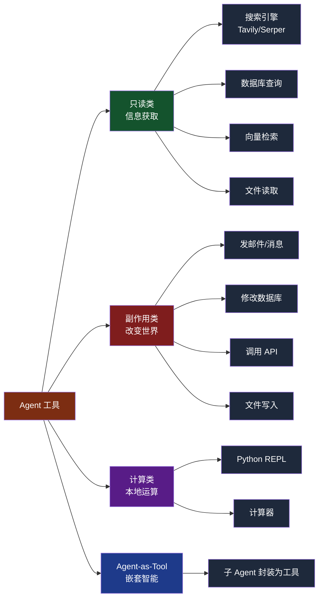
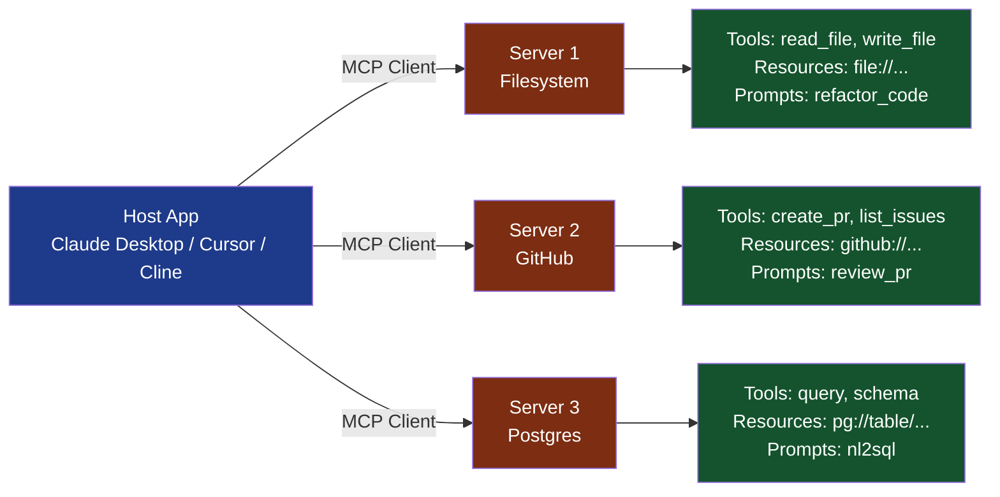

# 第 5 章 工具调用：Tool Use 与 MCP

> 本章目标：吃透 Agent 的"手脚"——工具调用机制。学完后你能设计高质量工具、用 OpenAI/Anthropic Function Calling、写 MCP Server、实现安全沙箱与工具路由。

---

## 5.1 工具调用的本质

### 一句话定义

> **工具 = 一段被 LLM 描述、可被 LLM 触发的代码。**

LLM 本身没有"行动能力"——不能查数据库、不能发邮件、不能跑命令。**工具是 LLM 通向真实世界的唯一通路。**

### 工具的三要素

```python
{
    "name": "get_weather",              # 1. 名字
    "description": "查询某城市当前天气",  # 2. 描述（给 LLM 看）
    "parameters": {                     # 3. 参数 schema
        "type": "object",
        "properties": {
            "city": {"type": "string", "description": "城市名"}
        },
        "required": ["city"]
    }
}
```

外加一个**执行函数**（实际 Python 代码）。LLM 看到这个工具定义，会自己决定何时调用、传什么参数。

### 无工具 vs 有工具

**无工具的 LLM**：

```python
# 用户问："上海今天天气怎样？"
llm.invoke("上海今天天气怎样？")
# → "我无法获取实时天气，建议查询天气网站。"
```

**有工具的 Agent**：

```python
# 同样问题
agent.invoke("上海今天天气怎样？")
# 内部：LLM 决定调用 get_weather("上海") → 返回 22℃，多云 → 生成回答
# → "上海今天 22℃，多云，适合出行。"
```

> **小结**：工具让 LLM 从"能说会道的实习生"变成"能办事的同事"。

---

## 5.2 Function Calling 演进

### 时间线

| 时间 | 事件 |
|------|------|
| 2023-06 | OpenAI 推出 Function Calling（单工具） |
| 2023-11 | OpenAI 升级为 Tools API（支持并行调用） |
| 2024-04 | Anthropic Claude Tool Use（与 OpenAI 略有差异） |
| 2024-09 | Google Gemini Function Calling 正式发布 |
| 2024-10 | OpenAI Structured Outputs（强制 schema） |
| 2024-11 | **Anthropic 推出 MCP 协议**（开放工具生态） |
| 2025-03 | OpenAI、Google 跟进支持 MCP |
| 2025-09 | Claude Agent SDK、OpenAI Agents SDK 标准化 |

### 各家 Tool 定义格式对比

| 厂商 | 格式特点 |
|------|---------|
| **OpenAI** | `tools=[{"type": "function", "function": {...}}]` |
| **Anthropic** | `tools=[{"name": "...", "input_schema": {...}}]` |
| **Gemini** | `tools=[{"function_declarations": [...]}]` |
| **MCP** | 跨厂商统一标准 |

LangChain 等框架做了统一封装，开发者一般不直接处理这些差异。

---

## 5.3 OpenAI Tool Use 实战

### 完整端到端示例

```python
from openai import OpenAI
import json

client = OpenAI()

# === 定义工具 ===
def get_weather(city: str) -> dict:
    """模拟天气 API"""
    fake_data = {
        "北京": {"temp": 18, "condition": "晴", "humidity": 40},
        "上海": {"temp": 22, "condition": "多云", "humidity": 70},
        "广州": {"temp": 28, "condition": "雨", "humidity": 85},
    }
    return fake_data.get(city, {"error": "未知城市"})

def calculator(expression: str) -> float:
    """安全的计算器"""
    import ast
    try:
        node = ast.parse(expression, mode='eval')
        # 只允许数字和运算符
        return eval(compile(node, '<string>', 'eval'))
    except Exception as e:
        return f"计算错误：{e}"

# === 工具描述 ===
tools = [
    {
        "type": "function",
        "function": {
            "name": "get_weather",
            "description": "查询某城市的当前天气（温度、天气状况、湿度）",
            "parameters": {
                "type": "object",
                "properties": {
                    "city": {
                        "type": "string",
                        "description": "城市名，如 '北京'、'上海'"
                    }
                },
                "required": ["city"]
            }
        }
    },
    {
        "type": "function",
        "function": {
            "name": "calculator",
            "description": "执行数学计算",
            "parameters": {
                "type": "object",
                "properties": {
                    "expression": {
                        "type": "string",
                        "description": "数学表达式，如 '2+2*3'"
                    }
                },
                "required": ["expression"]
            }
        }
    }
]

TOOL_FUNCTIONS = {"get_weather": get_weather, "calculator": calculator}

# === Agent 循环 ===
def chat_with_tools(user_msg: str, max_turns: int = 5) -> str:
    messages = [{"role": "user", "content": user_msg}]

    for turn in range(max_turns):
        response = client.chat.completions.create(
            model="gpt-4-turbo",
            messages=messages,
            tools=tools,
            tool_choice="auto",         # 让 LLM 自己决定要不要调
            parallel_tool_calls=True    # 允许一次调多个工具
        )
        msg = response.choices[0].message
        messages.append(msg)

        if not msg.tool_calls:  # LLM 不再调工具，输出最终答案
            return msg.content

        # 执行所有 tool_calls（可能多个）
        for tc in msg.tool_calls:
            fn = TOOL_FUNCTIONS[tc.function.name]
            args = json.loads(tc.function.arguments)
            result = fn(**args)
            messages.append({
                "role": "tool",
                "tool_call_id": tc.id,
                "content": json.dumps(result, ensure_ascii=False)
            })

    return "达到最大轮数"

# === 测试 ===
print(chat_with_tools("北京和上海哪个更热？温差多少？"))
# 输出："上海更热。北京 18℃，上海 22℃，温差 4℃。"
# 内部 trace：
# Turn 1: LLM 并行调用 get_weather("北京") 和 get_weather("上海")
# Turn 2: LLM 调用 calculator("22-18")
# Turn 3: LLM 生成最终回答
```

### Strict Mode（强制 Schema 校验）

OpenAI 2024-10 推出 Structured Outputs：

```python
tools = [
    {
        "type": "function",
        "function": {
            "name": "get_weather",
            "strict": True,  # 启用严格模式
            "parameters": {
                "type": "object",
                "additionalProperties": False,  # 不允许多余字段
                "properties": {
                    "city": {"type": "string"}
                },
                "required": ["city"]
            }
        }
    }
]
```

启用后 LLM 100% 输出符合 schema 的 JSON，省去解析错误。

> **小结**：OpenAI Tool Use 的关键是 `tools` 数组定义 + 循环处理 `tool_calls`。并行调用大幅提升效率。

---

## 5.4 Anthropic Tool Use 实战

### 与 OpenAI 的差异

| 维度 | OpenAI | Anthropic |
|------|--------|-----------|
| 工具字段 | `function.parameters` | `input_schema` |
| 调用结果 | `role: tool` 消息 | `tool_result` content block |
| 并行 | `parallel_tool_calls` | 默认支持 |
| 流式 | `function.arguments` 流式 | `input_json_delta` |

### 完整示例

```python
from anthropic import Anthropic
import json

client = Anthropic()

tools = [
    {
        "name": "get_weather",
        "description": "查询某城市的当前天气",
        "input_schema": {
            "type": "object",
            "properties": {"city": {"type": "string"}},
            "required": ["city"]
        }
    }
]

def chat_with_claude(user_msg: str, max_turns: int = 5):
    messages = [{"role": "user", "content": user_msg}]

    for turn in range(max_turns):
        response = client.messages.create(
            model="claude-sonnet-4-6",
            max_tokens=1024,
            tools=tools,
            messages=messages
        )
        messages.append({"role": "assistant", "content": response.content})

        if response.stop_reason != "tool_use":
            # 最终回答
            return "".join(b.text for b in response.content if b.type == "text")

        # 处理 tool_use blocks
        tool_results = []
        for block in response.content:
            if block.type == "tool_use":
                fn = TOOL_FUNCTIONS[block.name]
                result = fn(**block.input)
                tool_results.append({
                    "type": "tool_result",
                    "tool_use_id": block.id,
                    "content": json.dumps(result)
                })
        messages.append({"role": "user", "content": tool_results})

    return "达到最大轮数"
```

### Computer Use（Claude 操控屏幕）

2024-10 Anthropic 推出 Computer Use，让 Claude 像人类一样操控电脑：

```python
tools = [
    {
        "type": "computer_20241022",
        "name": "computer",
        "display_width_px": 1024,
        "display_height_px": 768
    },
    {"type": "bash_20241022", "name": "bash"},
    {"type": "text_editor_20241022", "name": "str_replace_editor"}
]
```

Claude 能"看到"屏幕截图，输出 `mouse_move`、`click`、`type` 等动作。这是 Agent 突破"API 边界"的重要进展。

---

## 5.5 工具的设计原则

工具设计的好坏直接决定 Agent 能力上限。Anthropic 在 [Writing tools for AI agents](https://www.anthropic.com/engineering/writing-tools-for-agents) 中给出的核心原则：

### 1. 单一职责（Single Responsibility）

**坏**：

```python
@tool
def manage_order(action: str, order_id: str, **kwargs) -> str:
    """统一管理订单：查询/取消/退款/修改地址"""
    # 内部分支处理 5 种动作
```

**好**：拆成 5 个工具

```python
@tool
def query_order(order_id: str) -> dict: ...
@tool
def cancel_order(order_id: str, reason: str) -> dict: ...
@tool
def refund_order(order_id: str, amount: float) -> dict: ...
```

为什么？LLM 看清单状态时，"查询订单"这种描述清晰的工具命中率远高于 `manage_order`。

### 2. 清晰的名字与描述

```python
# 坏
@tool
def process(x: str) -> str:
    """处理数据"""

# 好
@tool
def search_product(keyword: str, category: str = None) -> list[dict]:
    """根据关键词搜索商品。可选 category 过滤。返回前 10 个最相关商品的列表。"""
```

LLM 是根据描述决定调用的，描述越精准，错误调用越少。

### 3. 严格的 Schema

用 Pydantic 或 JSON Schema：

```python
from pydantic import BaseModel, Field
from typing import Literal

class SendEmailInput(BaseModel):
    to: str = Field(..., description="收件人邮箱", pattern=r"^[\w.-]+@[\w.-]+$")
    subject: str = Field(..., max_length=200)
    body: str = Field(..., min_length=1)
    priority: Literal["low", "normal", "high"] = "normal"
```

### 4. 幂等性

工具最好幂等（重复调用结果相同）：

```python
@tool
def send_email(to: str, subject: str, body: str, idempotency_key: str) -> dict:
    """发送邮件。idempotency_key 用于去重（相同 key 不会重复发送）。"""
    if cache.exists(idempotency_key):
        return cache.get(idempotency_key)
    result = email_service.send(to, subject, body)
    cache.set(idempotency_key, result, ttl=3600)
    return result
```

### 5. 结构化错误返回

不要 raise 异常给 LLM——它读不懂。返回结构化错误：

```python
@tool
def query_order(order_id: str) -> dict:
    try:
        order = db.get(order_id)
        return {"success": True, "data": order}
    except OrderNotFound:
        return {"success": False, "error": "order_not_found",
                "message": f"订单 {order_id} 不存在", "suggestion": "请检查订单号"}
    except Exception as e:
        return {"success": False, "error": "internal_error", "message": str(e)}
```

LLM 看到 `suggestion` 字段会自动改正策略。

### 6. 可观测性

每次工具调用都要 log：

```python
import logging, time, uuid
logger = logging.getLogger("tools")

def with_tracing(func):
    def wrapper(*args, **kwargs):
        call_id = uuid.uuid4().hex
        start = time.time()
        logger.info(f"[{call_id}] {func.__name__} START args={args} kwargs={kwargs}")
        try:
            result = func(*args, **kwargs)
            logger.info(f"[{call_id}] {func.__name__} OK in {time.time()-start:.2f}s")
            return result
        except Exception as e:
            logger.error(f"[{call_id}] {func.__name__} FAIL: {e}")
            raise
    return wrapper
```

> **小结**：好工具的标准——单一职责 + 清晰描述 + 严格 schema + 幂等 + 结构化错误 + 可观测。

---

## 5.6 工具分类与典型工具库



### 5 个常用工具的代码示例

```python
from langchain_core.tools import tool
import requests

# 1. 网络搜索（Tavily）
from tavily import TavilyClient
tavily = TavilyClient(api_key="...")

@tool
def web_search(query: str, max_results: int = 5) -> list[dict]:
    """搜索网络获取最新信息。返回标题、URL、摘要。"""
    res = tavily.search(query=query, max_results=max_results)
    return [{"title": r["title"], "url": r["url"], "snippet": r["content"]}
            for r in res["results"]]

# 2. 数据库查询（只读 SQL）
import sqlite3
@tool
def sql_query(sql: str) -> list[dict]:
    """执行只读 SQL 查询（仅 SELECT）。"""
    if not sql.strip().upper().startswith("SELECT"):
        return [{"error": "只允许 SELECT"}]
    conn = sqlite3.connect("app.db")
    conn.row_factory = sqlite3.Row
    rows = conn.execute(sql).fetchall()
    return [dict(r) for r in rows]

# 3. Python 代码执行（沙箱）
import subprocess, tempfile, os
@tool
def python_repl(code: str) -> str:
    """执行 Python 代码并返回 stdout"""
    with tempfile.NamedTemporaryFile(mode='w', suffix='.py', delete=False) as f:
        f.write(code)
        path = f.name
    try:
        result = subprocess.run(
            ["python", path], capture_output=True, text=True, timeout=10
        )
        return result.stdout if result.returncode == 0 else f"Error: {result.stderr}"
    finally:
        os.unlink(path)

# 4. HTTP 请求（白名单）
ALLOWED_HOSTS = {"api.example.com", "data.gov.cn"}
@tool
def http_get(url: str) -> str:
    """GET 请求。仅允许白名单域名。"""
    from urllib.parse import urlparse
    host = urlparse(url).netloc
    if host not in ALLOWED_HOSTS:
        return f"Error: 域名 {host} 不在白名单"
    return requests.get(url, timeout=10).text[:5000]

# 5. 发邮件（带确认机制）
@tool
def send_email(to: str, subject: str, body: str, confirmed: bool = False) -> str:
    """发送邮件。confirmed 必须为 True 才会真正发送。"""
    if not confirmed:
        return (f"即将发送邮件给 {to}，主题：{subject}\n"
                f"请二次确认（再次调用，confirmed=True）")
    # 真实发送
    email_service.send(to, subject, body)
    return f"已发送邮件给 {to}"
```

---

## 5.7 MCP（Model Context Protocol）协议

**MCP 是当前最重要的工具生态变革。**

### 是什么 / 解决什么问题

**MCP**（Model Context Protocol）由 Anthropic 于 2024-11 推出，是一个**开放协议**，定义了 AI 应用与外部数据源/工具的标准化通信方式。

**类比**：
- 早期电脑：每个外设都有自己的接口（鼠标、键盘、打印机各不同）
- USB 标准出现后：一个接口接所有
- MCP 之于 Agent，正如 USB 之于电脑

**痛点**：

- 没有 MCP 之前，每个 Agent 框架要为每个工具单独适配（GitHub 工具在 LangChain 写一遍，在 AutoGen 再写一遍）
- 私域数据接入需要每家用户写一套
- 工具生态碎片化

**MCP 解决**：

- 工具定义一次，所有 MCP-compatible Agent 都能用
- Anthropic、OpenAI、Google 都已采用
- 社区贡献了 200+ 现成 MCP Server（Filesystem、GitHub、Postgres、Slack、Notion、Playwright 等）

### MCP 三大原语



| 原语 | 含义 | 示例 |
|------|------|------|
| **Tools** | 可被 LLM 调用的函数 | `create_pr`、`query_db` |
| **Resources** | 可读的数据源（类似 GET API） | `file:///etc/hosts`、`github://repo/file.py` |
| **Prompts** | 可复用的 Prompt 模板 | "代码审查"、"NL2SQL" |

### 用 Python 写一个 MCP Server

```python
# 文件：filesystem_server.py
from mcp.server.fastmcp import FastMCP
import os

mcp = FastMCP("filesystem")  # 服务名

@mcp.tool()
def read_file(path: str) -> str:
    """读取文件内容"""
    with open(path, 'r', encoding='utf-8') as f:
        return f.read()

@mcp.tool()
def list_dir(path: str) -> list[str]:
    """列出目录下的文件"""
    return os.listdir(path)

@mcp.tool()
def write_file(path: str, content: str) -> str:
    """写入文件（覆盖）"""
    with open(path, 'w', encoding='utf-8') as f:
        f.write(content)
    return f"已写入 {path}"

@mcp.resource("file://{path}")
def file_resource(path: str) -> str:
    """暴露文件作为资源"""
    return read_file(path)

@mcp.prompt()
def refactor_prompt(language: str, code: str) -> str:
    """生成代码重构 prompt"""
    return f"请重构以下 {language} 代码，提高可读性：\n{code}"

if __name__ == "__main__":
    mcp.run(transport="stdio")  # 通过 stdio 通信
```

### 用 MCP Client 调用 Server

```python
# 文件：mcp_client_demo.py
from mcp import ClientSession, StdioServerParameters
from mcp.client.stdio import stdio_client
import asyncio

async def main():
    server_params = StdioServerParameters(
        command="python",
        args=["filesystem_server.py"]
    )

    async with stdio_client(server_params) as (read, write):
        async with ClientSession(read, write) as session:
            await session.initialize()

            # 列出工具
            tools = await session.list_tools()
            print("可用工具：", [t.name for t in tools.tools])

            # 调用工具
            result = await session.call_tool("list_dir", arguments={"path": "."})
            print("目录内容：", result.content)

            # 读取资源
            res = await session.read_resource("file://./README.md")
            print("README:", res.contents[0].text[:200])

            # 获取 prompt
            p = await session.get_prompt("refactor_prompt",
                                         arguments={"language": "python", "code": "..."})
            print("Prompt:", p.messages[0].content)

asyncio.run(main())
```

### 与 LangGraph 集成

```python
from langchain_mcp_adapters.client import MultiServerMCPClient
from langgraph.prebuilt import create_react_agent
from langchain_anthropic import ChatAnthropic

async def main():
    client = MultiServerMCPClient({
        "filesystem": {
            "command": "python",
            "args": ["filesystem_server.py"],
            "transport": "stdio"
        },
        "github": {
            "url": "https://mcp.github.com/sse",
            "transport": "sse"
        }
    })

    tools = await client.get_tools()  # 自动转为 LangChain Tool
    agent = create_react_agent(ChatAnthropic(model="claude-sonnet-4-6"), tools)

    result = await agent.ainvoke({
        "messages": [("user", "读取 README.md 并总结主要内容")]
    })
    print(result["messages"][-1].content)

asyncio.run(main())
```

> **小结**：MCP 让工具变成"插件"——一次开发、处处可用。它是 2025-2026 Agent 工程化的事实标准。

---

## 5.8 工具执行的沙箱化

危险工具（Code Interpreter、Shell、文件写入）必须沙箱化。

### 方案对比

| 方案 | 隔离强度 | 性能 | 适用 |
|------|---------|------|------|
| 进程隔离 | 弱 | 高 | 简单脚本 |
| **Docker** | 强 | 中 | 主流选择 |
| **WebAssembly（Pyodide）** | 强 | 中 | 浏览器、轻量 |
| **microVM（Firecracker）** | 极强 | 中 | 多租户、高安全 |
| **远程沙箱服务** | 强（外包） | 中 | 不想自维护 |

### Docker 沙箱实现

```python
import docker
import textwrap

client = docker.from_env()

def execute_python_in_sandbox(code: str, timeout: int = 10) -> str:
    """在 Docker 容器中执行 Python，返回 stdout/stderr"""
    safe_code = textwrap.dedent(code)
    try:
        container = client.containers.run(
            image="python:3.11-slim",
            command=["python", "-c", safe_code],
            detach=True,
            mem_limit="256m",       # 内存限制
            cpu_period=100000,
            cpu_quota=50000,        # 50% CPU
            network_mode="none",    # 无网络
            read_only=True,         # 文件系统只读
            tmpfs={"/tmp": "size=64m"},  # 临时文件目录
            security_opt=["no-new-privileges"]
        )
        try:
            container.wait(timeout=timeout)
            logs = container.logs().decode('utf-8', errors='replace')
            return logs[-5000:]  # 限制返回长度
        except Exception:
            container.kill()
            return "Error: 超时（>10秒）"
    finally:
        try:
            container.remove(force=True)
        except: pass

# 测试
print(execute_python_in_sandbox("""
import math
print(f"圆周率：{math.pi:.6f}")
"""))
```

### 远程沙箱服务

如果不想自维护，可用：

- **E2B**（[e2b.dev](https://e2b.dev/)）：Code Interpreter 即服务
- **Modal**：通用 GPU/CPU 沙箱
- **Riza**、**Bearly**

```python
# E2B 示例
from e2b_code_interpreter import Sandbox

sandbox = Sandbox()
execution = sandbox.run_code("print(sum(range(100)))")
print(execution.text)  # 4950
sandbox.kill()
```

---

## 5.9 工具调用的高级模式

### Tool Routing（工具路由）

**问题**：工具多了（>20 个），全 dump 到 prompt 浪费 token 且降低准确率。

**方案**：先用便宜模型把工具分组，路由到子集：

```python
TOOL_GROUPS = {
    "order": [query_order, refund_order, ...],
    "logistics": [query_logistics, modify_address, ...],
    "product": [search_product, get_product_detail, ...],
}

def route_tools(user_query: str) -> list:
    """用 GPT-3.5 决定走哪个工具组"""
    prompt = f"用户问：{user_query}\n可选类别：{list(TOOL_GROUPS.keys())}\n输出一个类别名："
    category = cheap_llm.invoke(prompt).content.strip()
    return TOOL_GROUPS.get(category, [])

# 在 Agent 中使用
def smart_agent(query):
    relevant_tools = route_tools(query)
    return create_react_agent(llm, relevant_tools).invoke({"messages": [("user", query)]})
```

### Tool Selection via Retrieval

工具数量更大（100+）时，把工具描述放入向量库，按 query 检索 Top-K：

```python
from langchain_chroma import Chroma
from langchain_openai import OpenAIEmbeddings

# 索引工具描述
tool_docs = [
    {"page_content": t.description, "metadata": {"name": t.name, "tool_id": idx}}
    for idx, t in enumerate(ALL_TOOLS)
]
tool_store = Chroma.from_documents(tool_docs, OpenAIEmbeddings())

def select_tools(query, k=5):
    results = tool_store.similarity_search(query, k=k)
    return [ALL_TOOLS[r.metadata["tool_id"]] for r in results]
```

### Confirmation Loop（确认循环）

危险操作必须二次确认：

```python
@tool
def delete_user(user_id: str, confirmed_token: str = "") -> str:
    """删除用户。需要两步确认。"""
    if not confirmed_token:
        token = generate_confirm_token(user_id)
        return (f"⚠️ 准备删除用户 {user_id}（不可恢复）。\n"
                f"请向用户确认后，再次调用 delete_user 并传入 confirmed_token='{token}'")
    if not verify_token(user_id, confirmed_token):
        return "Error: 确认令牌无效"
    # 真实删除
    db.delete_user(user_id)
    return f"✓ 已删除用户 {user_id}"
```

LangGraph 的 `interrupt()` 是更优雅的方案（见第 6 章）。

---

## 5.10 工程实战：可扩展的工具注册中心

设计一个工具注册中心（Tool Registry）：装饰器注册、自动 schema 生成、参数校验、错误处理、可观测。

```python
import inspect, time, uuid, logging
from typing import Callable, Any
from pydantic import BaseModel, create_model, ValidationError
from functools import wraps

logger = logging.getLogger("registry")

class ToolRegistry:
    def __init__(self):
        self._tools: dict[str, dict] = {}

    def register(self, name: str = None, description: str = None,
                 input_schema: type[BaseModel] = None, dangerous: bool = False):
        """装饰器：注册一个工具"""
        def decorator(func: Callable):
            tool_name = name or func.__name__
            tool_desc = description or (func.__doc__ or "").strip()

            # 自动从函数签名生成 schema
            schema = input_schema or self._infer_schema(func)

            @wraps(func)
            def wrapper(**kwargs):
                call_id = uuid.uuid4().hex[:8]
                start = time.time()

                # 1. 参数校验
                try:
                    validated = schema(**kwargs)
                except ValidationError as e:
                    return {"success": False, "error": "validation_error",
                            "details": e.errors()}

                # 2. 危险工具确认
                if dangerous and not kwargs.get("confirmed", False):
                    return {"success": False, "error": "confirmation_required",
                            "message": f"工具 {tool_name} 需要 confirmed=True"}

                # 3. 执行 + 异常捕获
                try:
                    logger.info(f"[{call_id}] {tool_name} CALL")
                    result = func(**validated.dict())
                    elapsed = time.time() - start
                    logger.info(f"[{call_id}] {tool_name} OK ({elapsed:.2f}s)")
                    return {"success": True, "data": result, "elapsed": elapsed}
                except Exception as e:
                    elapsed = time.time() - start
                    logger.error(f"[{call_id}] {tool_name} FAIL: {e}")
                    return {"success": False, "error": "execution_error",
                            "message": str(e), "elapsed": elapsed}

            self._tools[tool_name] = {
                "name": tool_name,
                "description": tool_desc,
                "input_schema": schema.schema(),
                "dangerous": dangerous,
                "callable": wrapper
            }
            return wrapper
        return decorator

    @staticmethod
    def _infer_schema(func: Callable) -> type[BaseModel]:
        """从函数签名推断 Pydantic Schema"""
        sig = inspect.signature(func)
        fields = {}
        for pname, param in sig.parameters.items():
            ptype = param.annotation if param.annotation != param.empty else Any
            pdefault = ... if param.default == param.empty else param.default
            fields[pname] = (ptype, pdefault)
        return create_model(f"{func.__name__}Input", **fields)

    def list_tools(self) -> list[dict]:
        return [{"name": t["name"], "description": t["description"],
                 "input_schema": t["input_schema"]}
                for t in self._tools.values()]

    def call(self, name: str, **kwargs):
        if name not in self._tools:
            return {"success": False, "error": "tool_not_found"}
        return self._tools[name]["callable"](**kwargs)

    def to_openai_tools(self) -> list[dict]:
        """转换为 OpenAI Tools 格式"""
        return [{
            "type": "function",
            "function": {
                "name": t["name"],
                "description": t["description"],
                "parameters": t["input_schema"]
            }
        } for t in self._tools.values()]


# === 使用示例 ===
registry = ToolRegistry()

@registry.register(description="查询订单状态")
def query_order(order_id: str) -> dict:
    return {"order_id": order_id, "status": "已发货"}

@registry.register(description="退款（危险操作）", dangerous=True)
def refund(order_id: str, amount: float, confirmed: bool = False) -> dict:
    return {"refunded": amount, "order_id": order_id}

# 调用
print(registry.call("query_order", order_id="12345"))
# {'success': True, 'data': {'order_id': '12345', 'status': '已发货'}, 'elapsed': 0.001}

print(registry.call("refund", order_id="12345", amount=99))
# {'success': False, 'error': 'confirmation_required', ...}

print(registry.call("refund", order_id="12345", amount=99, confirmed=True))
# {'success': True, 'data': {'refunded': 99, ...}}

# 给 LLM 用
openai_tools = registry.to_openai_tools()
```

### 注册中心架构图

```mermaid
flowchart TB
    Dev[开发者] -->|@register 装饰器| Reg[Tool Registry]
    Reg --> Meta[元数据存储]
    Reg --> Validator[参数校验<br/>Pydantic]
    Reg --> Tracer[调用追踪<br/>logger]
    Reg --> Confirm[危险确认<br/>middleware]

    Agent[Agent] -->|to_openai_tools| Reg
    Agent -->|call name args| Reg
    Reg -->|执行 + 错误处理| Func[工具函数]
    Func --> Result[结构化结果]

    style Dev fill:#1e3a8a,color:#fff
    style Reg fill:#7c2d12,color:#fff
    style Meta fill:#581c87,color:#fff
    style Validator fill:#581c87,color:#fff
    style Tracer fill:#581c87,color:#fff
    style Confirm fill:#581c87,color:#fff
    style Agent fill:#14532d,color:#fff
    style Func fill:#7f1d1d,color:#fff
    style Result fill:#7f1d1d,color:#fff
```

> **小结**：工具注册中心把"工具的横切关注点"（校验/日志/确认/格式转换）统一处理，让业务代码专注于工具逻辑本身。

---

## 本章小结

- 工具 = LLM 通向真实世界的唯一通路，三要素：名字 + 描述 + Schema + 执行函数
- 主流标准：**OpenAI Function Calling、Anthropic Tool Use、MCP**
- **MCP 协议**是 2024-11 推出的开放工具生态标准，预期 2026 成为事实标准
- 工具设计 6 原则：单一职责 + 清晰描述 + 严格 Schema + 幂等 + 结构化错误 + 可观测
- 危险工具必须**沙箱化**（Docker / Wasm / 远程服务）
- 高级模式：**Tool Routing**（分组路由）、**Tool Selection via Retrieval**（向量检索）、**Confirmation Loop**（二次确认）
- 生产系统应建立**工具注册中心**，统一横切关注点

## 下一章预告

第 6 章我们正式进入框架实战——**LangGraph 深度实战**。学完后你能用 LangGraph 构建任何复杂度的 Agent。

> **思考题**：你现在的项目里，哪些工具应该被设计成 MCP Server，让其他 Agent 也能复用？
