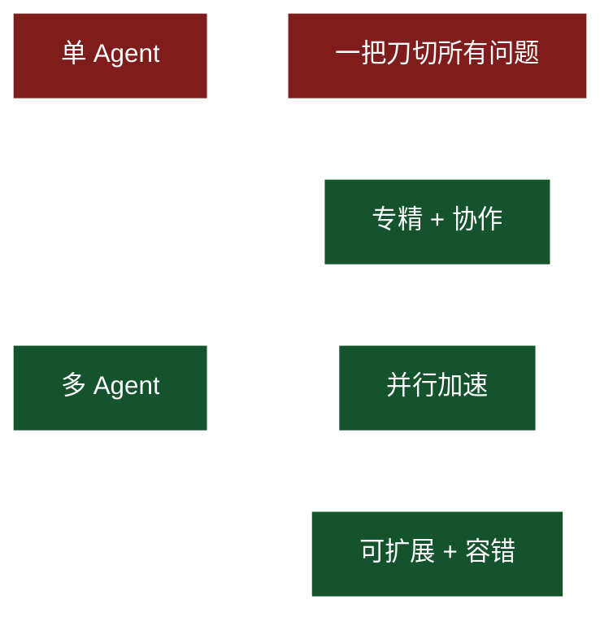
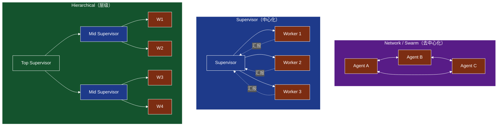
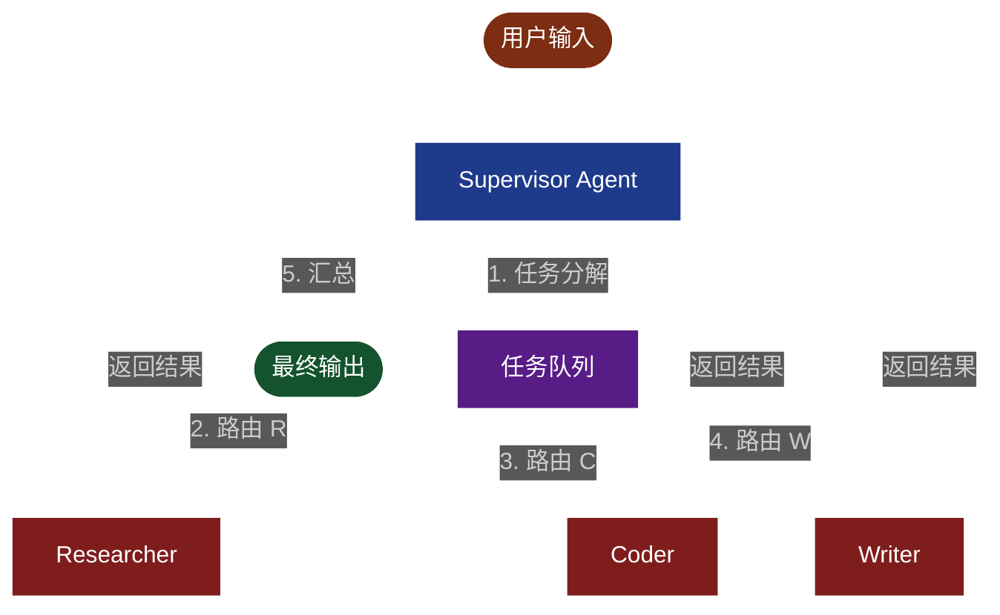
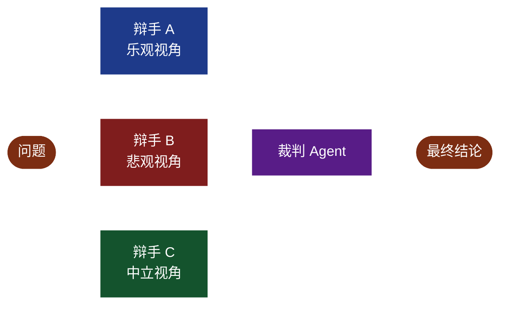
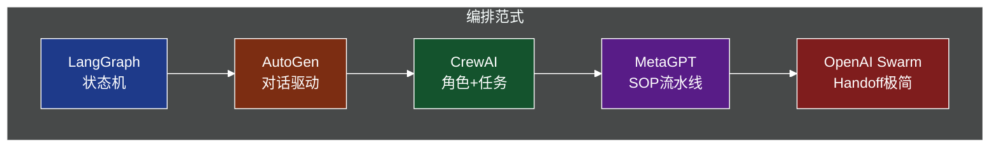
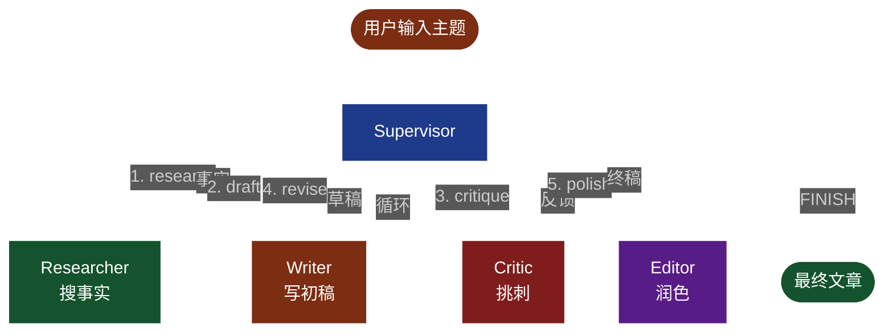

# 第 7 章 多 Agent 协作模式与编排

> 从单 Agent 走向多 Agent：让一群 AI 像一支团队一样协作

---

## 7.1 为什么需要多 Agent

第 6 章我们构建了一个能调用工具的单 Agent，它在很多场景下已经够用。但当你尝试用它做"调研 → 写代码 → 写文档 → 自动化测试"这种长链路任务时，会发现三个明显瓶颈：

### 7.1.1 单 Agent 的三大局限

**1. 上下文窗口被工具描述占满**

随着工具数量增加，System Prompt 中工具描述的 token 消耗线性上涨。当工具超过 20 个时，仅工具描述就可能占据 4K-8K tokens，留给真实对话和推理的空间被严重压缩。Anthropic 的研究显示，超过 50 个工具的单 Agent 在 Anthropic Claude 上的工具选择准确率会下降 12%-18%。

**2. 单一 prompt 难以兼顾多角色**

"你是一个优秀的研究员，能写代码，会做测试，懂运维"——这种大杂烩 prompt 通常会得到一个什么都懂一点、什么都不精的 Agent。要让一个 LLM 同时扮演 PM、架构师、程序员、测试员且每个角色都达到专家水平，几乎是不可能的。

**3. 长流程难以分工**

一个 Agent 从头跑到尾，所有决策、调用、错误都堆在同一个上下文里。当任务跨越"写代码 → 调试 → 写文档 → 翻译"多个阶段时，错误会指数级累积，调试和回滚都极困难。

### 7.1.2 多 Agent 的核心优势



- **职责分离（Separation of Concerns）**：每个 Agent 专精一域，prompt 更短、更聚焦，能力更强
- **并行执行（Parallelism）**：相互独立的任务可并发跑，总延迟从 T1+T2+T3 缩短为 max(T1,T2,T3)
- **可扩展（Extensibility）**：新增 Agent 不影响他人，符合开闭原则
- **可观测（Observability）**：每个 Agent 的输入、输出、成本、延迟可独立监控
- **可复用（Reusability）**：写好的 Worker 可被多个 Supervisor 复用

### 7.1.3 真实案例

- **MetaGPT**：模拟一家软件公司，PM、架构师、工程师、QA 各自一个 Agent，按 SOP 协作产出一个完整项目
- **ChatDev**：清华团队作品，把软件开发流水线拆成 7 个阶段的多 Agent 协作
- **AutoGen Studio**：微软出品，拖拽式配置多 Agent 对话
- **Devin / Cursor Agent**：背后本质是多 Agent（Planner、Coder、Tester、Reviewer）协作

---

## 7.2 多 Agent 协作的三种核心模式

业界多 Agent 框架虽然多，底层范式可归为三种：Network、Supervisor、Hierarchical。

### 7.2.1 模式总览图



### 7.2.2 优缺点对比表

| 维度 | Network / Swarm | Supervisor | Hierarchical |
|------|----------------|------------|--------------|
| 控制流 | 去中心化、Agent 自由 handoff | 中央调度 | 多层中央调度 |
| 适合任务 | 对话/客服类、需要灵活跳转 | 有明确阶段的长流程 | 复杂组织/超长链路 |
| 实现复杂度 | 中（要处理 handoff 循环） | 低（状态机即可） | 高（递归状态机） |
| 可观测性 | 弱（流式） | 强（中心节点可记录一切） | 强 |
| 死锁风险 | 高 | 中 | 中 |
| 典型框架 | OpenAI Swarm、AutoGen | LangGraph、CrewAI | MetaGPT、LangGraph Subgraph |
| 学习曲线 | 中 | 低 | 高 |
| 生产就绪度 | 中 | 高 | 中 |

### 7.2.3 如何选择

- 任务像"对话"且需要动态切换 → **Network**
- 任务像"流水线"且阶段明确 → **Supervisor**
- 任务像"公司组织"且嵌套层级 → **Hierarchical**

---

## 7.3 Supervisor 模式深入

### 7.3.1 架构

一个 Supervisor Agent 充当中央调度器，掌握全局 State 和任务目标；多个 Worker Agent 各司其职；Supervisor 负责把任务分解、把消息路由到合适的 Worker、汇总结果、决定结束。



### 7.3.2 Supervisor 三大职责

1. **任务分解**：把用户目标拆成有序子任务
2. **路由（Routing）**：基于当前 State 决定下一个调用的 Worker（LangGraph 中通过 `Command(goto=...)` 实现）
3. **结果汇总**：收集所有 Worker 的输出，必要时调用 LLM 总结，判定是否结束

### 7.3.3 完整代码（LangGraph Supervisor 模式）

```python
"""
Supervisor 模式：中央调度 + 3 个 Worker
依赖：pip install langgraph langchain-openai langchain-core
"""
import os
import operator
from typing import Annotated, Literal, TypedDict
from langchain_openai import ChatOpenAI
from langchain_core.messages import BaseMessage, HumanMessage, SystemMessage, AIMessage
from langgraph.graph import StateGraph, START, END
from langgraph.types import Command

# 1) ===== LLM 配置 =====
llm = ChatOpenAI(model="gpt-4o-mini", temperature=0)


# 2) ===== State 设计 =====
class AgentState(TypedDict):
    """全局状态：所有 Agent 共享"""
    messages: Annotated[list[BaseMessage], operator.add]   # 对话历史
    next_agent: str                                        # Supervisor 路由决定
    task: str                                              # 当前任务
    draft: str                                             # 当前草稿
    final_answer: str                                      # 最终回答


# 3) ===== Worker Agents =====
def make_researcher():
    """研究员：负责搜集资料、给出事实清单"""
    sys = SystemMessage(content=(
        "你是一名严谨的研究员。请基于用户问题给出 3-5 条关键事实，"
        "每条事实一行，格式：'- 事实'。不要编造数据，不确定就标'需验证'。"
    ))
    def node(state: AgentState) -> Command:
        task = state["task"] if state["task"] else state["messages"][-1].content
        prompt = HumanMessage(content=f"任务：{task}\n请给出关键事实：")
        out = llm.invoke([sys, prompt])
        return Command(
            update={"messages": [AIMessage(content=f"[Researcher]\n{out.content}", name="Researcher")],
                    "next_agent": "supervisor"},
            goto="supervisor",
        )
    return node


def make_coder():
    """程序员：根据需求写代码"""
    sys = SystemMessage(content=(
        "你是一名 Python 工程师。给出可直接运行的代码片段，"
        "用 ```python 包裹，并在代码后用 1-2 行解释思路。"
    ))
    def node(state: AgentState) -> Command:
        task = state["task"] if state["task"] else state["messages"][-1].content
        prompt = HumanMessage(content=f"需求：{task}\n请给出实现代码：")
        out = llm.invoke([sys, prompt])
        return Command(
            update={"messages": [AIMessage(content=f"[Coder]\n{out.content}", name="Coder")],
                    "next_agent": "supervisor",
                    "draft": out.content},
            goto="supervisor",
        )
    return node


def make_writer():
    """作家：润色文本、产出最终稿"""
    sys = SystemMessage(content=(
        "你是一名专业作家。润色用户提供的草稿，使其结构清晰、语言流畅。"
        "直接输出润色后的完整内容，不要解释过程。"
    ))
    def node(state: AgentState) -> Command:
        draft = state.get("draft", "")
        task = state.get("task", "")
        prompt = HumanMessage(content=f"主题：{task}\n草稿：\n{draft}\n请润色：")
        out = llm.invoke([sys, prompt])
        return Command(
            update={"messages": [AIMessage(content=f"[Writer]\n{out.content}", name="Writer")],
                    "next_agent": "supervisor",
                    "final_answer": out.content},
            goto="supervisor",
        )
    return node


researcher_node = make_researcher()
coder_node = make_coder()
writer_node = make_writer()


# 4) ===== Supervisor 节点 =====
SUPERVISOR_SYS = """你是一名 Supervisor Agent。当前可调度的 Worker 有：
- researcher：负责研究、查事实
- coder：负责写代码
- writer：负责润色、产出最终稿
- FINISH：当任务已完成时返回 FINISH

请根据用户任务和已有历史，决定下一步派给谁。
只返回一个单词：researcher / coder / writer / FINISH。
"""

def supervisor_node(state: AgentState) -> Command:
    """Supervisor 决策下一步"""
    # 已经产出 final_answer，直接结束
    if state.get("final_answer"):
        return Command(goto=END, update={"next_agent": "FINISH"})

    history = "\n".join([m.content for m in state["messages"][-6:]])
    prompt = HumanMessage(content=f"历史：\n{history}\n\n下一步派给谁？")
    out = llm.invoke([SystemMessage(content=SUPERVISOR_SYS), prompt])
    decision = out.content.strip().lower()

    if "finish" in decision or "fin" in decision:
        return Command(goto=END, update={"next_agent": "FINISH"})

    # 映射到具体节点
    mapping = {
        "researcher": "researcher",
        "coder": "coder",
        "writer": "writer",
    }
    target = mapping.get(decision, "researcher")
    return Command(goto=target, update={"next_agent": target})


# 5) ===== 组装 Graph =====
graph = StateGraph(AgentState)
graph.add_node("supervisor", supervisor_node)
graph.add_node("researcher", researcher_node)
graph.add_node("coder", coder_node)
graph.add_node("writer", writer_node)

# Supervisor 入口
graph.add_edge(START, "supervisor")

app = graph.compile()


# 6) ===== 运行 =====
if __name__ == "__main__":
    initial = {
        "messages": [HumanMessage(content="帮我调研 LangGraph 的状态机原理，并给出一个最小示例代码，最后润色成博客文章。")],
        "next_agent": "",
        "task": "调研 LangGraph 状态机并写示例",
        "draft": "",
        "final_answer": "",
    }
    result = app.invoke(initial)
    print("===== 最终输出 =====")
    print(result.get("final_answer") or result["messages"][-1].content)
```

### 7.3.4 关键点

- 用 `Command(goto=..., update=...)` 实现 Supervisor 的动态路由
- Worker 通过 `update` 把结果回写到全局 State，再返回 `supervisor`
- Supervisor 是图中的"枢纽节点"，天然可加监控、日志、限流
- 加最大轮数防御死循环：在 Supervisor 中判断 `len(messages) > N` 就 `END`

---

## 7.4 Network 模式（Swarm）

### 7.4.1 思想

Network 模式去中心化，所有 Agent 共享同一个对话历史，谁都可以"接管"对话。LangGraph 0.2+ 引入了 `create_swarm` 工具，本质是 Handoff 机制：当前 Agent 调 `transfer_to_<other>` 工具，对话权就交给另一个 Agent。

```mermaid
%%{init: {'theme':'dark', 'themeVariables': {'primaryColor':'#1e3a8a', 'primaryTextColor':'#fff', 'primaryBorderColor':'#7c2d12', 'lineColor':'#fff'}}}%%
sequenceDiagram
    participant U as 用户
    participant S as Sales
    participant T as TechSupport
    U->>S: 咨询产品 A
    S->>S: 介绍产品
    S->>T: handoff (用户问 API 报错)
    T->>T: 排查报错
    T->>S: handoff (用户问价格)
    S->>U: 给报价
    Note over U,T: 共享消息历史
    style U fill:#7c2d12,stroke:#fff,color:#fff
    style S fill:#1e3a8a,stroke:#fff,color:#fff
    style T fill:#14532d,stroke:#fff,color:#fff
```

### 7.4.2 完整代码（销售 + 技术支持双 Agent）

```python
"""
Network / Swarm 模式：销售 + 技术支持，自由 handoff
依赖：pip install langgraph langchain-openai langchain-core langgraph-swarm
"""
from typing import Annotated
from langchain_openai import ChatOpenAI
from langchain_core.tools import tool
from langchain_core.messages import HumanMessage
from langgraph.prebuilt import create_react_agent
from langgraph_swarm import create_swarm, create_handoff_tool

llm = ChatOpenAI(model="gpt-4o-mini", temperature=0)


# 1) ===== 业务工具 =====
@tool
def get_product_price(product: str) -> str:
    """查询产品报价（模拟）"""
    prices = {"A": "999元/年", "B": "1999元/年", "C": "定制报价"}
    return f"产品 {product} 报价：{prices.get(product, '请联系销售')}"


@tool
def diagnose_error(error_code: str) -> str:
    """根据错误码给出排查建议（模拟）"""
    db = {
        "401": "Token 无效或过期，请重新生成 API Key",
        "429": "触发限流，请降低 QPS 或申请扩容",
        "500": "服务端异常，请稍后重试并保留 trace_id",
    }
    return db.get(error_code, "未知错误码，建议抓包并联系技术支持")


# 2) ===== Handoff 工具：Agent 间跳转 =====
transfer_to_sales = create_handoff_tool(
    agent_name="sales",
    description="当用户询问价格、套餐、合同等商务问题时，调用此工具转给销售。",
)
transfer_to_support = create_handoff_tool(
    agent_name="tech_support",
    description="当用户反馈 bug、错误码、API 异常等技术问题时，调用此工具转给技术支持。",
)


# 3) ===== 两个 Agent =====
sales_agent = create_react_agent(
    llm,
    tools=[get_product_price, transfer_to_support],
    prompt=(
        "你是销售助手小销。回答产品价格、套餐、合同等商务问题。"
        "遇到技术问题必须调用 transfer_to_tech_support 工具转给技术支持。"
        "回复简洁热情。"
    ),
    name="sales",
)

support_agent = create_react_agent(
    llm,
    tools=[diagnose_error, transfer_to_sales],
    prompt=(
        "你是技术支持小支。根据错误码给出排查建议。"
        "遇到商务问题（价格、合同）必须调用 transfer_to_sales 工具转给销售。"
        "回复专业有条理。"
    ),
    name="tech_support",
)


# 4) ===== 组装 Swarm =====
workflow = create_swarm(
    agents=[sales_agent, support_agent],
    default_active_agent="sales",
)

app = workflow.compile()


# 5) ===== 可观测性：消息轨迹打印 =====
def pretty_print_trace(out: dict) -> None:
    """打印 Agent 间的 handoff 轨迹"""
    print("--- 完整消息轨迹 ---")
    for i, m in enumerate(out["messages"], 1):
        role = m.name or m.type
        snippet = m.content[:160].replace("\n", " ")
        print(f"{i:>2}. [{role}] {snippet}")
    print("--- 结束 ---\n")


# 6) ===== 跑一个跨域对话 =====
if __name__ == "__main__":
    print("=== 第 1 轮：商务问题（销售接） ===")
    out = app.invoke({"messages": [HumanMessage(content="你们产品 A 多少钱？")]})
    pretty_print_trace(out)

    print("=== 第 2 轮：技术问题（handoff 到支持） ===")
    out = app.invoke({"messages": [HumanMessage(content="我刚才问完价格后，调用 API 报 429 错误")]})
    pretty_print_trace(out)

    # 7) ===== 持久化：用 checkpointer 支持多轮会话 =====
    from langgraph.checkpoint.memory import InMemorySaver
    checkpointer = InMemorySaver()
    app_with_mem = workflow.compile(checkpointer=checkpointer)
    cfg = {"configurable": {"thread_id": "user-001"}}

    print("=== 第 3 轮：跨多轮消息保留 handoff 上下文 ===")
    app_with_mem.invoke(
        {"messages": [HumanMessage(content="你们产品 B 多少钱？")]}, config=cfg
    )
    app_with_mem.invoke(
        {"messages": [HumanMessage(content="我调用时报 401 错误，是 token 问题吗？")]},
        config=cfg,
    )
    state = app_with_mem.get_state(cfg)
    print(f"thread_id=user-001 已累计 {len(state.values['messages'])} 条消息")
```

### 7.4.3 关键点

- `create_handoff_tool` 自动为目标 Agent 注入一个"交班"工具
- Agent 在 prompt 中被明确告知何时该 handoff
- 共享 `messages` 历史，User 和所有 Agent 的发言都可见
- 适合对话型任务，路由决策由 LLM 自主完成

---

## 7.5 Hierarchical 模式

### 7.5.1 思想

把 Supervisor 套娃：Top Supervisor 管 Mid Supervisors，每个 Mid Supervisor 再管若干 Worker。本质是"组织架构"——非常适合"运营一家公司"这种宏观任务。

### 7.5.2 MetaGPT 案例

MetaGPT 用 4 层组织模拟软件公司：
1. **ProductManager**：写 PRD
2. **Architect**：写技术方案
3. **ProjectManager**：拆任务给工程师
4. **Engineer + QA**：并行实现 + 写测试

每层都是上一层的 Worker，又是下一层的 Supervisor。

### 7.5.3 完整代码（LangGraph Subgraph 实现）

```python
"""
Hierarchical 模式：运营一家迷你软件公司
结构：CEO → CTO / COO / CMO
     →  CTO 管 Architect + Engineer
     →  COO 管 PM + QA
     →  CMO 管 Marketer
"""
import operator
from typing import Annotated, Literal, TypedDict
from langchain_openai import ChatOpenAI
from langchain_core.messages import BaseMessage, HumanMessage, SystemMessage, AIMessage
from langgraph.graph import StateGraph, START, END
from langgraph.types import Command

llm = ChatOpenAI(model="gpt-4o-mini", temperature=0)


# ===== 通用 State =====
class SubState(TypedDict):
    messages: Annotated[list[BaseMessage], operator.add]
    next_agent: str
    task: str
    output: str


class TopState(TypedDict):
    messages: Annotated[list[BaseMessage], operator.add]
    requirement: str      # 原始需求
    prd: str              # COO/PM 产出
    design: str           # CTO/Architect 产出
    code: str             # Engineer 产出
    tests: str            # QA 产出
    marketing: str        # CMO 产出
    phase: str            # 当前阶段


# ===== L1: Worker =====
def call_llm(role: str, task: str, task_prompt: str) -> str:
    out = llm.invoke([
        SystemMessage(content=f"你是{role}。请用专业、简洁的语言完成分配的任务。"),
        HumanMessage(content=task_prompt),
    ])
    return out.content


# ===== L2: 子图节点（部门） =====
def cto_dept(state: SubState) -> Command:
    """CTO 部门：先设计后写代码"""
    sub = state["task"]
    design = call_llm("架构师", sub, f"需求：{sub}\n请给出技术方案（500字内）。")
    code = call_llm("高级 Python 工程师", sub,
                    f"需求：{sub}\n方案：{design}\n请给出可运行代码：")
    return Command(
        update={"output": f"【设计方案】\n{design}\n\n【代码】\n{code}",
                "messages": [AIMessage(content=f"[CTO Dept 完成]\n{code[:200]}...", name="CTO")]},
        goto=END,
    )


def coo_dept(state: SubState) -> Command:
    """COO 部门：写 PRD + 测试用例"""
    sub = state["task"]
    prd = call_llm("产品经理", sub, f"需求：{sub}\n请输出 PRD（含目标、用户故事、验收标准）。")
    tests = call_llm("测试工程师", sub,
                     f"需求：{sub}\nPRD：{prd}\n请给出 5 条测试用例。")
    return Command(
        update={"output": f"【PRD】\n{prd}\n\n【测试用例】\n{tests}",
                "messages": [AIMessage(content=f"[COO Dept 完成]\nPRD 与测试已就绪", name="COO")]},
        goto=END,
    )


def cmo_dept(state: SubState) -> Command:
    """CMO 部门：写营销文案"""
    sub = state["task"]
    marketing = call_llm("市场经理", sub,
                         f"需求：{sub}\n请输出 3 条不同风格的营销文案。")
    return Command(
        update={"output": marketing,
                "messages": [AIMessage(content=f"[CMO Dept 完成]\n{marketing[:200]}...", name="CMO")]},
        goto=END,
    )


# ===== L3: Mid Supervisor =====
def mid_supervisor(workers: dict, name: str, finish_token: str = "FINISH"):
    """工厂：构造一个 Mid Supervisor"""
    def node(state: SubState) -> Command:
        if state.get("next_agent") == finish_token:
            return Command(goto=END, update={"next_agent": finish_token})

        # 让 LLM 决定派给谁
        decision = llm.invoke([
            SystemMessage(content=(
                f"你是{name}的部门负责人。可调度下属：{list(workers.keys())} 或 {finish_token}。"
                f"只返回一个名字。"
            )),
            HumanMessage(content=f"任务：{state['task']}\n选谁？"),
        ]).content.strip().lower()

        if finish_token in decision:
            return Command(goto=END, update={"next_agent": finish_token})

        target = workers.get(decision)
        if target is None:
            return Command(goto=END, update={"next_agent": finish_token})
        return Command(goto=decision, update={"next_agent": decision})
    return node


# 构造各部门子图
cto_sub = StateGraph(SubState)
cto_sub.add_node("cto_supervisor", mid_supervisor({}, "CTO"))
cto_sub.add_node("dept", cto_dept)  # 简化：一个综合节点
cto_sub.add_edge(START, "cto_supervisor")
cto_sub.add_edge("cto_supervisor", "dept")
cto_sub_app = cto_sub.compile()


def cto_node(state: TopState) -> Command:
    """Top 层调用 CTO 部门（作为一个 subgraph）"""
    sub_task = state["requirement"]
    out = cto_sub_app.invoke({
        "messages": [], "next_agent": "dept", "task": sub_task, "output": ""
    })
    return Command(
        update={"design": out["output"], "code": out["output"],
                "messages": [AIMessage(content="[CTO] 设计+代码已就绪", name="CEO_supervisor")]},
        goto="top_supervisor",
    )


def coo_node(state: TopState) -> Command:
    out = coo_sub_app.invoke({
        "messages": [], "next_agent": "dept", "task": state["requirement"], "output": ""
    })
    return Command(
        update={"prd": out["output"], "tests": out["output"],
                "messages": [AIMessage(content="[COO] PRD+测试已就绪", name="CEO_supervisor")]},
        goto="top_supervisor",
    )


def cmo_node(state: TopState) -> Command:
    out = cmo_sub_app.invoke({
        "messages": [], "next_agent": "dept", "task": state["requirement"], "output": ""
    })
    return Command(
        update={"marketing": out["output"],
                "messages": [AIMessage(content="[CMO] 营销已就绪", name="CEO_supervisor")]},
        goto="top_supervisor",
    )


# COO / CMO 子图同样方式构造
coo_sub = StateGraph(SubState)
coo_sub.add_node("coo_supervisor", mid_supervisor({}, "COO"))
coo_sub.add_node("dept", coo_dept)
coo_sub.add_edge(START, "coo_supervisor")
coo_sub.add_edge("coo_supervisor", "dept")
coo_sub_app = coo_sub.compile()

cmo_sub = StateGraph(SubState)
cmo_sub.add_node("cmo_supervisor", mid_supervisor({}, "CMO"))
cmo_sub.add_node("dept", cmo_dept)
cmo_sub.add_edge(START, "cmo_supervisor")
cmo_sub.add_edge("cmo_supervisor", "dept")
cmo_sub_app = cmo_sub.compile()


# ===== L4: Top Supervisor =====
def top_supervisor(state: TopState) -> Command:
    if all([state.get("prd"), state.get("code"), state.get("marketing")]):
        return Command(goto=END, update={"phase": "DONE"})

    decision = llm.invoke([
        SystemMessage(content=(
            "你是 CEO。下属部门：cto（技术）、coo（产品+测试）、cmo（市场）。"
            "已完成：" + ",".join([k for k, v in {"cto": state.get("code"),
                                                  "coo": state.get("prd"),
                                                  "cmo": state.get("marketing")}.items() if v]) +
            "。下一个调谁？只返回 cto / coo / cmo / FINISH。"
        )),
        HumanMessage(content=f"需求：{state['requirement']}"),
    ]).content.strip().lower()

    if "finish" in decision:
        return Command(goto=END, update={"phase": "DONE"})

    mapping = {"cto": "cto", "coo": "coo", "cmo": "cmo"}
    target = mapping.get(decision, "cto")
    return Command(goto=target, update={"phase": target})


# ===== 组装总图 =====
top = StateGraph(TopState)
top.add_node("top_supervisor", top_supervisor)
top.add_node("cto", cto_node)
top.add_node("coo", coo_node)
top.add_node("cmo", cmo_node)
top.add_edge(START, "top_supervisor")
top_app = top.compile()


if __name__ == "__main__":
    out = top_app.invoke({
        "messages": [],
        "requirement": "做一个命令行待办事项工具",
        "prd": "", "design": "", "code": "", "tests": "", "marketing": "", "phase": "",
    })
    print("===== 公司产出汇总 =====")
    print("\n--- PRD ---\n", out["prd"][:500])
    print("\n--- Code ---\n", out["code"][:500])
    print("\n--- Marketing ---\n", out["marketing"][:500])
```

### 7.5.4 关键点

- Subgraph 是 LangGraph 实现 Hierarchical 的核心机制
- Top Supervisor 不直接调 Worker，只调部门级 Supervisor
- 每层都封装了"路由 → 执行 → 汇报 → 结束"的循环
- 部门内可以有更细的并行/串行

---

## 7.6 Agent 间通信协议

### 7.6.1 消息格式：自然语言 vs 结构化

| 维度 | 自然语言 | 结构化 JSON / Pydantic |
|------|----------|------------------------|
| LLM 友好 | 高 | 中（要 schema 提示） |
| 解析可靠 | 低（幻觉风险） | 高（可强校验） |
| 人类可读 | 高 | 低 |
| 适用 | 对话/创作 | 路由决策/工具调用 |

最佳实践：Agent 之间的"控制信号"用结构化（路由、状态、计数），"内容传递"用自然语言。

### 7.6.2 共享 State vs 私有 State

- **共享 State**：所有 Agent 读写同一对象，LangGraph 的 `StateGraph` 天然支持
- **私有 State**：每个 Agent 维护自己的局部上下文（如 LangGraph 的 `config["configurable"]` 或 `RunnableConfig`）
- 实战：共享 State 放"路由变量、任务、最终产物"，私有 State 放"思考过程、工具原始输出"

### 7.6.3 上下文传递策略

- **全量传递**：把上游所有内容塞给下游。简单但容易爆 token
- **摘要传递**：上游用 LLM 把输出压缩成 200 字摘要
- **关键事实提取**：上游抽 3-5 个 key-value，下游按需读取
- **引用传递**：上游只输出 ID，下游按 ID 去数据库/向量库取详情

### 7.6.4 State Schema 设计示例

```python
from typing import Annotated, Optional
from langgraph.graph import MessagesState
import operator

class MultiAgentState(MessagesState):
    # 路由
    next_agent: str
    # 任务
    requirement: str
    # 业务字段
    research: Optional[str]
    draft: Optional[str]
    review: Optional[str]
    final: Optional[str]
    # 元信息
    round: Annotated[int, operator.add]  # 累加
    token_used: Annotated[int, operator.add]
```

---

## 7.7 辩论与共识模式

### 7.7.1 Multi-Agent Debate 思想

论文 *"Improving Factuality and Reasoning in Language Models through Multiagent Debate"*（Du et al., 2023）发现：让多个 LLM 实例对同一问题独立作答，然后让彼此看到对方答案再迭代修改，最终准确率显著高于单 Agent。机制上类似"群体智能"——多样性 + 互校。



### 7.7.2 完整代码：3 辩手 + 1 裁判

```python
"""
Multi-Agent Debate：3 个不同视角的辩手 + 1 个裁判
"""
import operator
from typing import Annotated, TypedDict
from langchain_openai import ChatOpenAI
from langchain_core.messages import HumanMessage, SystemMessage, AIMessage
from langgraph.graph import StateGraph, START, END

llm = ChatOpenAI(model="gpt-4o-mini", temperature=0.7)


class DebateState(TypedDict):
    question: str
    round: int
    max_round: int
    positions: Annotated[dict, operator.or_]   # {agent: 文本}
    verdict: str


PERSONAS = {
    "optimist": "你是一个乐观主义者，倾向于看到方案的优点、机会、潜在收益。",
    "pessimist": "你是一个悲观主义者，倾向于揭示风险、缺陷、失败概率。",
    "neutral": "你是一个理性中立者，给出权衡分析、利弊清单。",
}


def debater(name: str):
    def node(state: DebateState) -> dict:
        sys = SystemMessage(content=PERSONAS[name] +
            " 请用 3-4 句中文回答。其它辩手的最新观点：" +
            str({k: v for k, v in state["positions"].items() if k != name}))
        out = llm.invoke([
            sys,
            HumanMessage(content=f"问题：{state['question']}\n第 {state['round']} 轮，请给出你的最新立场。"),
        ])
        return {"positions": {name: out.content}}
    return node


def judge_node(state: DebateState) -> dict:
    if state["round"] < state["max_round"]:
        return {"round": state["round"] + 1}
    # 最后一轮，裁判出结论
    summary = "\n".join([f"{k}: {v}" for k, v in state["positions"].items()])
    out = llm.invoke([
        SystemMessage(content="你是一名裁判。请综合所有辩手观点，输出 200 字以内的最终结论。"),
        HumanMessage(content=f"问题：{state['question']}\n\n辩手观点：\n{summary}"),
    ])
    return {"verdict": out.content, "round": state["round"] + 1}


def should_continue(state: DebateState) -> str:
    if state["verdict"] or state["round"] > state["max_round"]:
        return "end"
    return "debate"


# 构造图
g = StateGraph(DebateState)
g.add_node("optimist", debater("optimist"))
g.add_node("pessimist", debater("pessimist"))
g.add_node("neutral", debater("neutral"))
g.add_node("judge", judge_node)

# 三个辩手并行
g.add_edge(START, "optimist")
g.add_edge(START, "pessimist")
g.add_edge(START, "neutral")
g.add_edge("optimist", "judge")
g.add_edge("pessimist", "judge")
g.add_edge("neutral", "judge")

g.add_conditional_edges("judge", should_continue, {
    "debate": ["optimist", "pessimist", "neutral"],
    "end": END,
})
app = g.compile()


if __name__ == "__main__":
    out = app.invoke({
        "question": "创业团队是否应该All in大模型应用层？",
        "round": 1,
        "max_round": 3,
        "positions": {},
        "verdict": "",
    })
    print("=== 辩手最终立场 ===")
    for k, v in out["positions"].items():
        print(f"\n[{k}] {v}")
    print("\n=== 裁判结论 ===")
    print(out["verdict"])

    # ---- Voting 变体：3 票多数决 ----
    from collections import Counter
    print("\n=== Voting 变体演示 ===")
    vote_prompt = (
        "你只能回答一个字母：A（支持）、B（反对）、C（中立）。"
        "不要输出其它内容。"
    )
    votes = []
    for persona in ["optimist", "pessimist", "neutral"]:
        ans = llm.invoke([
            SystemMessage(content=PERSONAS[persona] + vote_prompt),
            HumanMessage(content="问题：创业团队是否应All in大模型应用层？"),
        ]).content.strip().upper()
        # 容错：取第一个 A/B/C
        ans = next((c for c in ans if c in "ABC"), "C")
        votes.append(ans)
        print(f"  [{personus if False else persona}] 投 {ans}")
    counter = Counter(votes)
    winner, count = counter.most_common(1)[0]
    print(f"  票数：{dict(counter)}  胜出：{winner}（{count} 票）")
```

### 7.7.3 Voting 变体

把"裁判"换成"投票"：3 个 Agent 各给一个 A/B/C 答案，得票最多的胜出。适合分类、决策类任务。可以用 `Counter` 统计票数。

---

## 7.8 角色扮演（Role Play）

### 7.8.1 CAMEL 思想

CAMEL（Communicative Agents for "Mind" Exploration of LLM Society）提出 Inception Prompting：给每个 Agent 详细的"角色卡"——身份、目标、约束、沟通风格。两个角色在 Inception Prompt 引导下自治对话，常被用来合成高质量训练数据。

### 7.8.2 角色一致性问题

- 把角色定义放在 System Prompt，且每次轮都重申关键约束
- 显式给"用户"角色反 prompt："你是刁钻客户，会质疑、砍价、要求售后"
- 加"导演 Agent"：监听对话，超出角色范围时纠偏
- 控制最大轮数，避免 Agent 越聊越偏

### 7.8.3 完整代码：客户 + 客服对话合成

```python
"""
CAMEL 风格角色扮演：合成"客户"和"客服"对话训练数据
"""
import json
import random
from typing import TypedDict
from langchain_openai import ChatOpenAI
from langchain_core.messages import HumanMessage, SystemMessage

llm = ChatOpenAI(model="gpt-4o-mini", temperature=0.8)


CUSTOMER_SYS = """你是一位名叫 Alice 的客户。
- 性格：挑剔、注重性价比、喜欢讨价还价
- 目标：以最低价买到一个 SaaS 产品的年度订阅
- 风格：每轮只说 1-3 句中文口语
- 行为：
  1. 开场先问最便宜的套餐是什么
  2. 听到价格后表达太贵，要求折扣
  3. 客服拒绝后，提出用过的其他竞品更便宜
  4. 若客服给出折扣则继续问售后服务
  5. 若第 8 轮还没达成一致，就说不买了
"""

SUPPORT_SYS = """你是一位名叫 Bob 的 SaaS 客服。
- 性格：耐心、专业、有同理心
- 目标：促成订单 + 维护公司利润（最低折扣 7 折）
- 风格：每轮 2-4 句中文，先共情再给方案
- 行为：
  1. 介绍产品时强调 ROI
  2. 客户砍价时强调成本和功能
  3. 可给最多 8 折优惠，超过需上报
  4. 客户提到竞品时用差异化反击
  5. 若客户说不买了，做最后一次挽回
"""


def run_dialogue(max_turns: int = 8) -> list[dict]:
    customer_msgs: list[str] = []
    support_msgs: list[str] = []

    # 客户先开
    first = llm.invoke([
        SystemMessage(content=CUSTOMER_SYS),
        HumanMessage(content="请开场，用 1-2 句向客服询问。"),
    ]).content

    for i in range(max_turns):
        # 客户发言
        support_context = "\n".join(support_msgs[-3:])
        if support_context:
            cust_prompt = f"客服最新说：\n{support_context}\n请继续。"
        else:
            cust_prompt = "请开场。"
        cust = llm.invoke([
            SystemMessage(content=CUSTOMER_SYS),
            HumanMessage(content=cust_prompt),
        ]).content
        customer_msgs.append(cust)
        print(f"[客户] {cust}")

        # 客户说不买了或达成一致，提前结束
        if "不买了" in cust or "买" in cust and "好" in cust:
            break

        # 客服回应
        cust_context = "\n".join(customer_msgs[-3:])
        supp = llm.invoke([
            SystemMessage(content=SUPPORT_SYS),
            HumanMessage(content=f"客户最新说：\n{cust_context}\n请回应。"),
        ]).content
        support_msgs.append(supp)
        print(f"[客服] {supp}")

    # 拼装训练数据
    dialogue = []
    for i in range(max(len(customer_msgs), len(support_msgs))):
        if i < len(customer_msgs):
            dialogue.append({"role": "customer", "content": customer_msgs[i]})
        if i < len(support_msgs):
            dialogue.append({"role": "support", "content": support_msgs[i]})
    return dialogue


if __name__ == "__main__":
    data = run_dialogue(8)
    with open("train_dialogue.jsonl", "w", encoding="utf-8") as f:
        for d in data:
            f.write(json.dumps(d, ensure_ascii=False) + "\n")
    print(f"\n已生成 {len(data)} 轮对话，保存到 train_dialogue.jsonl")

    # ---- 批量生成 + 数据质量过滤 ----
    QUALITY_SYS = (
        "你是数据质检员。判断以下对话是否满足：\n"
        "1) 角色一致 2) 信息有价值 3) 至少 4 轮。"
        "只回答 PASS 或 FAIL + 一句话理由。"
    )

    def filter_quality(dialogue: list[dict]) -> bool:
        text = "\n".join(f"{d['role']}: {d['content']}" for d in dialogue)
        verdict = llm.invoke([
            SystemMessage(content=QUALITY_SYS),
            HumanMessage(content=text),
        ]).content.strip()
        return verdict.startswith("PASS")

    n_pass = 0
    with open("train_dialogue.filtered.jsonl", "w", encoding="utf-8") as f:
        for _ in range(3):
            d = run_dialogue(8)
            if filter_quality(d):
                n_pass += 1
                for t in d:
                    f.write(json.dumps(t, ensure_ascii=False) + "\n")
    print(f"质量过滤后保留 {n_pass}/3 条对话")
```

---

## 7.9 主流多 Agent 框架对比



### 7.9.1 详细对比表

| 框架 | 编排方式 | 学习曲线 | 生态 | 生产就绪度 | 适合场景 |
|------|----------|----------|------|------------|----------|
| LangGraph | 显式状态机/子图 | 中 | 与 LangChain 深度集成 | 高 | 复杂可控流程 |
| AutoGen (微软) | 对话驱动 + GroupChat | 中 | 微软 + 多模型 | 中 | 研究/代码执行 |
| CrewAI | Role + Task + Crew | 低 | 独立生态 | 中 | 快速 PoC |
| MetaGPT | SOP + 角色流水线 | 中-高 | 学术氛围 | 中 | 软件公司模拟 |
| OpenAI Swarm | Handoff 极简 | 极低 | OpenAI 官方 | 中（已并入 Agents SDK） | 轻量 Handoff |
| OpenAI Agents SDK | 工具+Handoff+Guardrails | 低 | OpenAI 官方 | 高 | 商用 Agent |
| smolagents (HuggingFace) | 代码 Agent 范式 | 中 | HF 生态 | 中 | 工具调用 |

### 7.9.2 选择建议

- **要精细控制 + 上生产**：LangGraph
- **要快速跑通 PoC + 角色扮演**：CrewAI
- **要研究多 Agent 行为**：AutoGen
- **要模拟复杂组织**：MetaGPT
- **要 OpenAI 生态 + 商用**：OpenAI Agents SDK
- **要 HF 生态 + 极简**：smolagents

---

## 7.10 工程实战：多 Agent 内容创作流水线

### 7.10.1 需求

用户输入主题 → Researcher 搜索事实 → Writer 写初稿 → Critic 反馈 → Writer 修改（循环）→ Editor 润色 → 输出。整个流程由 Supervisor 编排。



### 7.10.2 完整代码（300+ 行）

```python
"""
多 Agent 内容创作流水线
- Supervisor 编排
- Researcher / Writer / Critic / Editor 四个 Worker
- Writer-Critic 反馈循环
- 最大轮数 + 优雅结束
依赖：pip install langgraph langchain-openai langchain-core
"""
import os
import operator
from typing import Annotated, Literal, TypedDict
from langchain_openai import ChatOpenAI
from langchain_core.messages import BaseMessage, HumanMessage, SystemMessage, AIMessage
from langgraph.graph import StateGraph, START, END
from langgraph.types import Command

llm = ChatOpenAI(model="gpt-4o-mini", temperature=0.6)


# ===== 1) State 设计 =====
class ContentState(TypedDict):
    messages: Annotated[list[BaseMessage], operator.add]
    topic: str                       # 主题
    facts: str                       # Researcher 产出
    draft: str                       # Writer 产出
    critique: str                    # Critic 产出
    final: str                       # Editor 产出
    revise_round: int                # 反馈循环计数
    max_revise: int                  # 最大循环
    next_agent: str                  # 路由


# ===== 2) Worker: Researcher =====
def researcher_node(state: ContentState) -> Command:
    topic = state["topic"]
    sys = SystemMessage(content=(
        "你是一名研究员。请基于主题给出 5 条关键事实，"
        "每条一行，格式：'- 事实：<内容>'。"
    ))
    out = llm.invoke([sys, HumanMessage(content=f"主题：{topic}\n请给出事实清单。")])
    return Command(
        update={
            "facts": out.content,
            "messages": [AIMessage(content=f"[Researcher]\n{out.content}", name="researcher")],
            "next_agent": "supervisor",
        },
        goto="supervisor",
    )


# ===== 3) Worker: Writer =====
def writer_node(state: ContentState) -> Command:
    topic = state["topic"]
    facts = state.get("facts", "")
    old_draft = state.get("draft", "")
    critique = state.get("critique", "")

    if not old_draft:
        sys = SystemMessage(content=(
            "你是一名公众号作家。请基于事实写一篇 800 字左右的科普文章，"
            "结构：引入(2句) → 3 个分论点 → 总结(2句)。语言生动有节奏。"
        ))
        user = HumanMessage(content=f"主题：{topic}\n事实：\n{facts}\n请撰写初稿。")
    else:
        sys = SystemMessage(content=(
            "你是一名公众号作家。请基于批评意见修改你的初稿，"
            "保留优点，修正问题，输出完整修改后版本。"
        ))
        user = HumanMessage(content=(
            f"主题：{topic}\n事实：\n{facts}\n初稿：\n{old_draft}\n"
            f"批评：\n{critique}\n请修改。"
        ))

    out = llm.invoke([sys, user])
    return Command(
        update={
            "draft": out.content,
            "messages": [AIMessage(content=f"[Writer 第{state['revise_round']+1}稿]\n{out.content}", name="writer")],
            "next_agent": "supervisor",
        },
        goto="supervisor",
    )


# ===== 4) Worker: Critic =====
def critic_node(state: ContentState) -> Command:
    draft = state.get("draft", "")
    sys = SystemMessage(content=(
        "你是一名严厉的稿件编辑。请从以下维度评审：\n"
        "1) 事实准确性 2) 逻辑完整性 3) 表达流畅度 4) 吸引力\n"
        "输出格式：\n- 优点：...\n- 问题：...\n- 建议：...\n"
        "如果完全没有问题，最后一行写 'NO_MORE_REVISE'。"
    ))
    out = llm.invoke([sys, HumanMessage(content=f"稿件：\n{draft}")])
    return Command(
        update={
            "critique": out.content,
            "messages": [AIMessage(content=f"[Critic]\n{out.content}", name="critic")],
            "next_agent": "supervisor",
        },
        goto="supervisor",
    )


# ===== 5) Worker: Editor =====
def editor_node(state: ContentState) -> Command:
    draft = state.get("draft", "")
    sys = SystemMessage(content=(
        "你是主编。请对终稿做最后润色：\n"
        "- 修正错别字\n- 统一标题层级\n- 优化金句\n- 输出完整最终版本"
    ))
    out = llm.invoke([sys, HumanMessage(content=f"终稿：\n{draft}")])
    return Command(
        update={
            "final": out.content,
            "messages": [AIMessage(content=f"[Editor]\n{out.content}", name="editor")],
            "next_agent": "supervisor",
        },
        goto="supervisor",
    )


# ===== 6) Supervisor =====
SUP_SYS = """你是内容创作流水线的 Supervisor。
可调度的 Worker：researcher / writer / critic / editor / FINISH。

当前状态：
- 主题: {topic}
- facts 已就绪: {has_facts}
- draft 已就绪: {has_draft}
- critique 已就绪: {has_critique}
- 反馈轮次: {round}/{max_round}
- critic 是否同意结稿: {no_more}

请根据以下 SOP 决策：
1) facts 为空 → researcher
2) facts 有、draft 为空 → writer
3) draft 有、critique 为空 → critic
4) critique 有、含 NO_MORE_REVISE 或 达到 max_round → editor
5) critique 有、需修改且未达 max_round → writer
6) editor 已完成 → FINISH

只返回一个单词：researcher / writer / critic / editor / FINISH
"""


def supervisor_node(state: ContentState) -> Command:
    # 防御：达到终态
    if state.get("final"):
        return Command(goto=END, update={"next_agent": "FINISH"})

    no_more = "NO_MORE_REVISE" in (state.get("critique", ""))
    prompt = SUP_SYS.format(
        topic=state["topic"],
        has_facts=bool(state.get("facts")),
        has_draft=bool(state.get("draft")),
        has_critique=bool(state.get("critique")),
        round=state.get("revise_round", 0),
        max_round=state.get("max_revise", 2),
        no_more=no_more,
    )
    out = llm.invoke([SystemMessage(content=prompt),
                      HumanMessage(content="请决策下一步派给谁。")])
    decision = out.content.strip().lower()

    if "finish" in decision or "fin" in decision:
        return Command(goto=END, update={"next_agent": "FINISH"})

    if "researcher" in decision:
        return Command(goto="researcher", update={"next_agent": "researcher"})
    if "writer" in decision:
        # 进入 writer 时累加轮次
        return Command(goto="writer", update={
            "next_agent": "writer",
            "revise_round": state.get("revise_round", 0) + (1 if state.get("critique") else 0),
        })
    if "critic" in decision:
        return Command(goto="critic", update={"next_agent": "critic"})
    if "editor" in decision:
        return Command(goto="editor", update={"next_agent": "editor"})

    return Command(goto=END, update={"next_agent": "FINISH"})


# ===== 7) 装配图 =====
g = StateGraph(ContentState)
g.add_node("supervisor", supervisor_node)
g.add_node("researcher", researcher_node)
g.add_node("writer", writer_node)
g.add_node("critic", critic_node)
g.add_node("editor", editor_node)

g.add_edge(START, "supervisor")

app = g.compile()


# ===== 8) 运行 =====
if __name__ == "__main__":
    initial = {
        "messages": [HumanMessage(content="帮我写一篇关于 RAG 检索增强生成的科普文章。")],
        "topic": "RAG 检索增强生成",
        "facts": "",
        "draft": "",
        "critique": "",
        "final": "",
        "revise_round": 0,
        "max_revise": 2,
        "next_agent": "",
    }
    out = app.invoke(initial)
    print("\n========== 最终文章 ==========\n")
    print(out.get("final") or out["messages"][-1].content)
    print("\n========== 修订轮次 ==========")
    print("revise_round =", out.get("revise_round"))
```

### 7.10.3 运行效果

通常会经历：researcher → writer → critic → writer(修改) → critic → editor → FINISH，全过程 5-7 个节点跳转，2 次反馈循环。Supervisor 的 SOP 用模板填 State 字段后让 LLM 决策，准确率显著高于纯自由路由。

---

## 7.11 多 Agent 系统的挑战与最佳实践

### 7.11.1 常见坑

**1. Agent 间死锁**

症状：图跑了几十轮停不下来。
原因：Worker A 等 Worker B 的输出，Worker B 等 Worker A，循环依赖。
对策：Supervisor 决策中加 `round > N` 强制 `FINISH`；画依赖图，提前检测环。

**2. 上下文爆炸**

症状：跑到后期 token 爆表，响应变慢变贵。
原因：所有 Worker 把全量历史塞给 LLM。
对策：
- 摘要层：每 5 轮对历史做一次摘要
- 分窗口：每个 Worker 只看自己关心的 1-3 条消息
- 关键事实：把结构化 KV 抽出来共享

**3. 角色越界**

症状：销售 Agent 开始写代码；客服开始给技术方案。
原因：System Prompt 太弱；handoff 描述模糊。
对策：
- 显式禁止清单："你**不能**做 X，**必须**转给 Y"
- Handoff 工具描述要写清触发条件
- 加"导演 Agent"做后置审核

**4. 成本失控**

症状：一次任务烧掉几十块。
原因：多 Agent × 多轮 × 长上下文 = token 指数爆炸。
对策：
- 用 `gpt-4o-mini` 而非 `gpt-4o`
- 每个 Worker 的输出限制 max_tokens
- 加 cost 监控和告警（LangSmith / LangFuse）
- 关键决策用大模型，长任务用小模型

### 7.11.2 最佳实践清单

| 类别 | 实践 |
|------|------|
| 职责 | 每个 Agent 一个明确角色 + 明确边界 + 明确产出格式 |
| 通信 | 控制信号用结构化 JSON，内容传递用自然语言 |
| 状态 | 共享 State 放路由/任务/产物，私有思考放 config |
| 循环 | Writer-Critic 这类反馈循环必须设 `max_round` |
| 监控 | 每个 Agent 独立打点：input tokens、output tokens、latency |
| 失败 | 任一 Agent 异常 → Supervisor 捕获 → 重试或降级 |
| 测试 | 每个 Worker 独立单测；Supervisor 路由逻辑 mock LLM 测 |
| 部署 | 容器化每个 Agent；Supervisor 放主进程，Workers 弹性扩缩容 |
| 评估 | 用第 8 章的可观测性框架跑回归集 |

### 7.11.3 反模式

- **过度拆分**：把"查天气"拆成 5 个 Agent
- **隐式依赖**：A 的输出强依赖 B 的字段，但 State Schema 没声明
- **无 SOP 自由派**：让 LLM 自由决定一切流程，结果不可复现
- **单点 Supervisor**：所有决策集中在一个 LLM 调用上，瓶颈明显

---

## 本章小结

本章系统讲透了多 Agent 协作的核心知识：

1. **三种模式**：Network（去中心 handoff）、Supervisor（中央调度）、Hierarchical（层级）
2. **LangGraph 是首选**：状态机范式 + `Command(goto)` 路由 + Subgraph 嵌套
3. **通信协议**：控制信号结构化 + 摘要/关键事实传递
4. **进阶模式**：辩论提升准确率、CAMEL 角色扮演合成数据
5. **工程实战**：内容创作流水线展示了 SOP + 反馈循环 + 优雅结束
6. **避坑指南**：死锁、上下文爆炸、角色越界、成本失控

多 Agent 是一把双刃剑：用得好是组织级智能，用得不好是"大模型做布朗运动"。下一章我们学习如何让这些 Agent 跑得稳、跑得准——第 8 章 **评测与可观测性**。

## 下一章预告

**第 8 章 评测与可观测性**

- 8.1 为什么需要评测：模型的不确定性 + Agent 的非确定性
- 8.2 评测指标：轨迹准确率、任务完成率、Token 成本、延迟
- 8.3 数据集构建：黄金集 + 合成集 + 线上回流
- 8.4 LangSmith / LangFuse 可观测性实战
- 8.5 A/B 测试与回归
- 8.6 在线监控：SLO、SLA、告警
- 8.7 Eval-Driven Development：把评测当 TDD
- 8.8 生产案例：把 LLM 服务的 P99 延迟从 12s 优化到 3s

> 多 Agent 上线只是开始，让它持续可靠才是真功夫。
