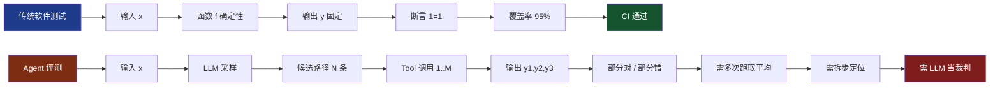
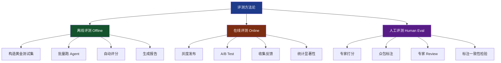
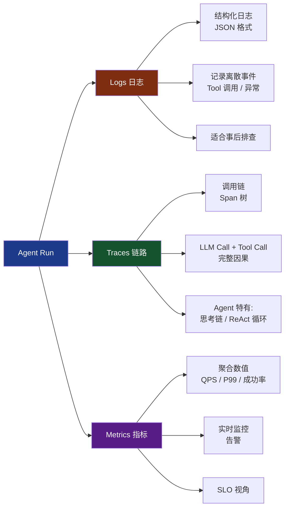
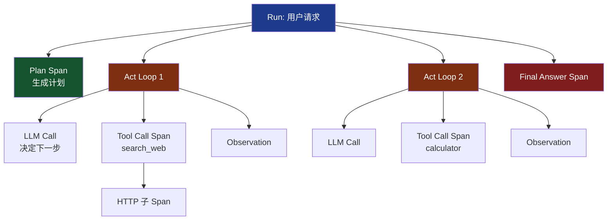
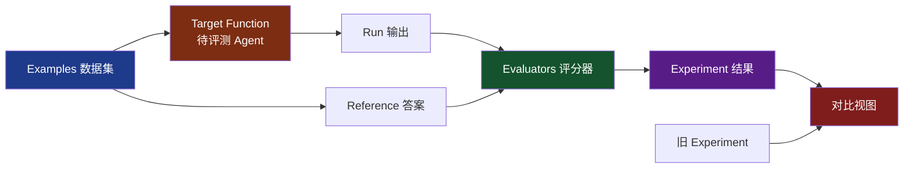
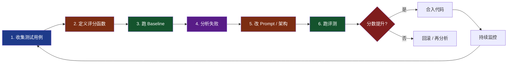
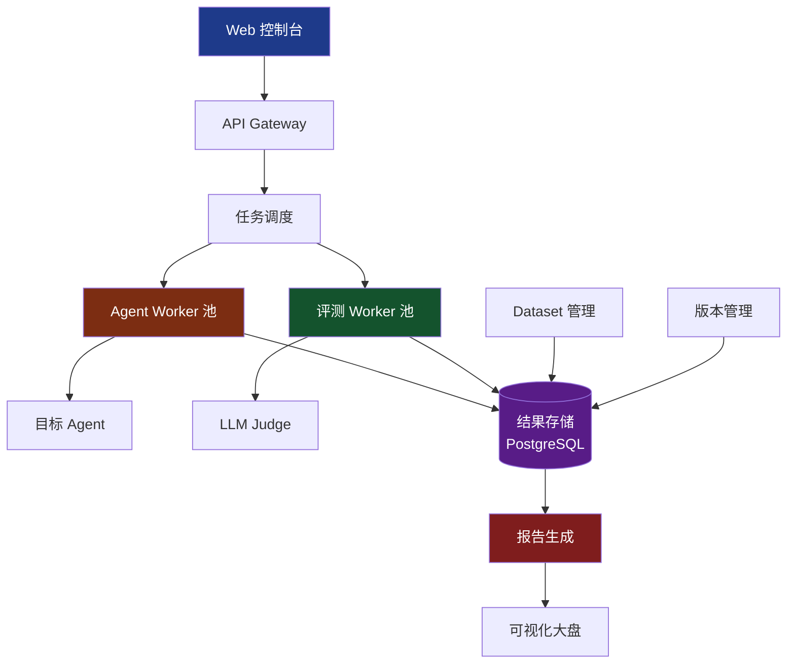

# 第 8 章 评测与可观测性

> **章节定位**：从 Demo 走向生产的最后一公里。没有评测，Agent 改进就是玄学；没有可观测性，线上事故就是黑盒。

---

## 8.1 为什么 Agent 评测如此困难

传统软件的测试理论建立在"确定性"之上：给定输入 `x`，函数 `f` 总返回相同的输出 `y`。这使得单元测试、回归测试、覆盖率分析成为可能。但 LLM Agent 打破了这个假设——它是**概率性的、多步的、与环境交互的**系统。



这种差异带来三个根本性挑战：

1. **输出非确定性**。同样一句"帮我订明天北京到上海的机票"，Agent 可能给出 5 种合理的航班组合。评测不能简单比对字符串。
2. **错误累积（Error Compounding）**。Agent 链路是"规划→行动→观察→反思"循环，第 2 步选错工具，后续步骤全部跑偏。10 步的链路，单步 90% 准确率到端到端只有 35%。
3. **多维度目标**。一个 Agent 不仅要"答对"，还要答得快、花得少、安全、可解释、风格一致。任何单一指标都不够。

**工程结论**：Agent 评测必须从"单点断言"升级为"多维指标体系 + 统计显著性 + 步骤级诊断"三位一体的方法论。

---

## 8.2 评测维度全景

一个生产级 Agent 的质量画像，至少包含以下七个维度：

| 维度 | 核心问题 | 量化指标 |
|------|---------|---------|
| 任务完成度 | Agent 是否完成了用户的目标？ | Task Success Rate、Pass@k |
| 答案质量 | 回答是否准确、相关、完整？ | Accuracy、Relevance、Completeness |
| 效率 | Agent 用了多少步、多少钱、多少秒？ | Steps、Tool Calls、Tokens、Latency |
| 成本 | 每次任务的 $$ 成本 | USD/Task、Token Cost |
| 鲁棒性 | 遇到对抗/噪声输入会崩吗？ | Robust Accuracy、ASR（攻击成功率） |
| 安全 | 会不会输出有害内容？ | Refusal Rate、Toxicity Score |
| 一致性 | 同样输入多次跑，结果稳不稳定？ | Output Variance、Self-Consistency |


**关键解读**：

- **v1 vs v2**：通过 Prompt 优化把任务完成度从 85 提到 92，但效率从 70 掉到 65（更"努力思考"了）。这就是典型的"多维权衡"。
- **跨模型对比**：Claude Sonnet 在效率（80）和鲁棒性（85）上领先，说明 Claude 在指令遵循和长链路规划上更稳。
- **成本与质量往往负相关**。要更准的答案，通常要花更多 Token。

**实操建议**：选 3-5 个北极星指标（North Star Metrics），其他作为诊断指标，不要全维度优化。

---

## 8.3 评测方法论

业界主流的评测方法分三类：离线、在线、人工。



| 方法 | 速度 | 成本 | 准确性 | 覆盖度 | 适用阶段 |
|------|------|------|--------|--------|---------|
| 离线评测 | 快（分钟级） | 低（仅 API 费） | 中（依赖自动评分） | 受限于测试集 | 开发/CI |
| 在线评测 | 慢（天-周） | 中（需流量） | 高（真实场景） | 高 | 灰度/发布 |
| 人工评测 | 慢（小时-天） | 高（人力） | 最高 | 灵活 | 关键节点/小样本 |

**实践黄金组合**：

- **开发期**：以离线为主，CI 跑 100-500 条黄金用例，每次 PR 看回归。
- **上线前**：跑 1000+ 条合成用例，模拟真实流量分布。
- **上线后**：在线 A/B + 用户反馈循环。
- **关键决策点**（如模型升级、安全审查）：人工抽样 200-500 条做专家评审。

---

## 8.4 LLM-as-a-Judge

当答案没有唯一标准（比如开放式问答、写作、规划），传统的字符串匹配和 BLEU 分数全部失效。**LLM-as-a-Judge** 用一个强 LLM（GPT-4、Claude Opus）当裁判，评估另一个 LLM 的输出。

### 8.4.1 评分维度与范式

- **单点评分（Pointwise Scoring）**：对单个回答打 1-5 分或 0-10 分。
- **成对比较（Pairwise Comparison）**：让 Judge 选 A 或 B 哪个更好，适合 A/B Test 场景。
- **参考评分（Reference-based）**：给定参考答案，让 Judge 看回答是否覆盖了关键点。

### 8.4.2 完整代码：GPT-4 评分器

```python
"""
llm_judge.py
基于 GPT-4 的 LLM-as-a-Judge 评分器
"""
import json
from typing import List, Dict, Optional
from openai import OpenAI
from pydantic import BaseModel, Field

client = OpenAI()

# 评分维度与 rubric
JUDGE_PROMPT = """你是一名严格的 AI 质量评估专家。请根据以下维度对【待评估回答】进行评分。

【问题】:
{question}

【参考答案】(可能为空):
{reference}

【待评估回答】:
{answer}

请按 1-5 分对以下三个维度评分（5 分最高）：
1. 准确性 (accuracy): 事实是否正确，是否有幻觉
2. 相关性 (relevance): 是否切题、是否回答了问题
3. 完整性 (completeness): 是否覆盖了问题的所有方面

输出 JSON：
{{"accuracy": int, "relevance": int, "completeness": int, "reasoning": "简要说明"}}
"""


class JudgeResult(BaseModel):
    accuracy: int = Field(ge=1, le=5)
    relevance: int = Field(ge=1, le=5)
    completeness: int = Field(ge=1, le=5)
    reasoning: str


def llm_judge(question: str, answer: str, reference: str = "",
              model: str = "gpt-4o") -> JudgeResult:
    """单点评分"""
    prompt = JUDGE_PROMPT.format(
        question=question, answer=answer, reference=reference
    )
    resp = client.chat.completions.create(
        model=model,
        messages=[{"role": "user", "content": prompt}],
        response_format={"type": "json_object"},
        temperature=0,  # 评分要稳定
    )
    return JudgeResult(**json.loads(resp.choices[0].message.content))


def pairwise_judge(question: str, answer_a: str, answer_b: str,
                   model: str = "gpt-4o") -> str:
    """成对比较，返回 'A' / 'B' / 'TIE'"""
    prompt = f"""比较以下两个回答哪个更好。

【问题】: {question}

【回答 A】: {answer_a}

【回答 B】: {answer_b}

输出 JSON: {{"winner": "A" | "B" | "TIE", "reasoning": "..."}}"""
    resp = client.chat.completions.create(
        model=model,
        messages=[{"role": "user", "content": prompt}],
        response_format={"type": "json_object"},
        temperature=0,
    )
    return json.loads(resp.choices[0].message.content)["winner"]


# 批量评测
def batch_evaluate(test_cases: List[Dict]) -> List[Dict]:
    """test_cases: [{"question", "answer", "reference"}]"""
    results = []
    for tc in test_cases:
        score = llm_judge(tc["question"], tc["answer"], tc.get("reference", ""))
        results.append({**tc, "score": score.model_dump()})
    return results


if __name__ == "__main__":
    res = llm_judge(
        question="什么是 transformer？",
        answer="Transformer 是一种基于自注意力机制的神经网络架构。",
        reference="Transformer 是 Google 2017 年提出的神经网络架构，核心是 self-attention。"
    )
    print(res)
```

### 8.4.3 偏差与缓解

LLM-as-Judge 不是万能的。已知偏差包括：

- **位置偏差（Position Bias）**：倾向选择先出现的答案。缓解：交换位置跑两次，一致才算。
- **长度偏差（Length Bias）**：倾向更长的回答。缓解：在 prompt 中加"请忽略长度差异"。
- **自我偏好（Self-Enhancement）**：GPT-4 倾向给 GPT-4 回答高分。缓解：用不同家族的模型做交叉验证。
- **风格偏差**：倾向更"花哨"的回答。缓解：明确 rubric，要求看事实。

### 8.4.4 元评测：评测评测器

怎么知道你的 Judge 准不准？需要"元评测"——用人类专家标一批"金标准评判"，然后看 Judge 与人类的一致率。常用指标：

- **Cohen's Kappa**：考虑随机一致后的 agreement。
- **准确率**：Judge 选 A，人类选 A 的比例。
- **胜率**：Judge 在 pairwise 任务中与人类判断的一致率。

> **目标**：Judge 与专家的一致率 ≥ 0.7 才能上线。低于 0.5 就退化成随机，不如抛硬币。

---

## 8.5 任务级评测：从端到端看 Agent

任务级评测关注"用户给一个完整任务，Agent 能否端到端完成"。这是最接近真实用户体验的视角。

### 8.5.1 公开 Benchmark 速查

| Benchmark | 出品方 | 场景 | 规模 | 难度 | 核心指标 |
|-----------|--------|------|------|------|----------|
| **AgentBench** | 清华 | 7 个真实场景（DB、Web、OS） | 1750+ 题 | 高 | Success Rate |
| **GAIA** | Meta | 通用助手，多步推理+工具 | 466 题 | 高 | 准确率 |
| **WebArena** | CMU | 真实浏览器任务 | 812 任务 | 中 | Task Success |
| **SWE-Bench** | Princeton | 代码 Agent 修 GitHub Issue | 2294 PR | 高 | Patch Pass Rate |
| **τ-Bench** | Sierra | 工具调用+多轮对话 | 165 场景 | 中 | Pass Rate |
| **HumanEval** | OpenAI | 代码生成 | 164 题 | 中 | pass@1 |

### 8.5.2 自定义 Benchmark

业务场景往往没有现成 benchmark。需要自己造数据。流程：

1. **收集真实日志**：从生产环境拉 100-500 条用户问题（脱敏）。
2. **人工写黄金答案**：专家标注参考答案、关键点、执行步骤。
3. **合成扩展**：用 LLM 基于种子数据合成更多变体（避免污染）。
4. **多轮迭代**：用评测结果反推数据缺口，补数据。

### 8.5.3 完整代码：用 LangSmith 跑 Benchmark

```python
"""
benchmark_langsmith.py
使用 LangSmith 跑自定义 Benchmark
"""
import os
from langsmith import Client, traceable
from langsmith.evaluation import evaluate
from openai import OpenAI

os.environ["LANGSMITH_API_KEY"] = "lsv2_xxx"
os.environ["LANGSMITH_TRACING"] = "true"
os.environ["LANGSMITH_PROJECT"] = "agent-benchmark"

ls_client = Client()
llm = OpenAI()


@traceable(name="customer_support_agent")
def run_agent(question: str) -> str:
    """待评测的 Agent"""
    resp = llm.chat.completions.create(
        model="gpt-4o-mini",
        messages=[
            {"role": "system", "content": "你是一名客服助手，简洁准确地回答用户问题。"},
            {"role": "user", "content": question}
        ]
    )
    return resp.choices[0].message.content


def correctness_evaluator(run, example):
    """评分函数：LLM-as-Judge"""
    pred = run.outputs.get("output", "")
    ref = example.outputs.get("reference", "")
    judge = llm.chat.completions.create(
        model="gpt-4o",
        messages=[{"role": "user", "content": f"判断回答是否正确。\n参考:{ref}\n回答:{pred}\n只回答 YES/NO"}],
        temperature=0
    )
    score = 1.0 if "YES" in judge.choices[0].message.content else 0.0
    return {"key": "correctness", "score": score}


# 创建 Dataset
dataset = ls_client.create_dataset("customer-support-v1")
examples = [
    {"inputs": {"question": "如何退货？"},
     "outputs": {"reference": "在订单页面点击申请退货，3 个工作日内审核"}},
    {"inputs": {"question": "运费多少？"},
     "outputs": {"reference": "满 99 包邮，不满收 10 元运费"}},
    # ... 更多
]
ls_client.create_examples(
    inputs=[e["inputs"] for e in examples],
    outputs=[e["outputs"] for e in examples],
    dataset_id=dataset.id
)

# 跑评测
results = evaluate(
    run_agent,
    data=dataset.name,
    evaluators=[correctness_evaluator],
    experiment_prefix="baseline-v1",
    metadata={"model": "gpt-4o-mini", "prompt_version": "v1"}
)
print(f"Average score: {results.aggregate_metrics}")
```

---

## 8.6 步骤级评测：诊断每一步

端到端评测告诉你"平均 60% 成功率"，但**不知道哪一步坏了**。步骤级评测把链路拆开，逐环节诊断。

### 8.6.1 评测对象

1. **Plan 质量**：Agent 生成的执行计划是否合理？是否包含必要的步骤？是否有多余步骤？
2. **Tool Call 正确性**：
   - 工具选对了吗？（选型准确率）
   - 参数填对了吗？（参数准确率）
   - 返回值解析对了吗？（解析准确率）
3. **Reflection 有效性**：反思是否识别出了问题？是否调整了下一步行动？
4. **Final Answer**：最终答案质量。

### 8.6.2 完整代码示例

```python
"""
step_level_eval.py
步骤级评测框架
"""
import json
from typing import List, Dict
from dataclasses import dataclass


@dataclass
class AgentStep:
    step_id: int
    step_type: str  # "plan" / "tool_call" / "reflection" / "answer"
    content: Dict
    latency_ms: float
    tokens: int


def eval_plan_quality(plan: List[str], expected_steps: List[str]) -> float:
    """计划质量：召回率 + 顺序正确性"""
    recall = len(set(plan) & set(expected_steps)) / len(set(expected_steps))
    # 简化版顺序检查：相同子序列比例
    return recall


def eval_tool_call(call: Dict, expected_tool: str,
                   expected_params: Dict) -> Dict:
    """工具调用评测"""
    tool_correct = call.get("name") == expected_tool
    param_correct = all(
        call.get("arguments", {}).get(k) == v
        for k, v in expected_params.items()
    )
    return {
        "tool_selection_correct": tool_correct,
        "param_correct": param_correct,
        "step_score": 1.0 if (tool_correct and param_correct) else 0.0
    }


def evaluate_trajectory(steps: List[AgentStep],
                        ground_truth: Dict) -> Dict:
    """评测整个 trajectory"""
    scores = {"plan": 0, "tool_calls": [], "reflections": 0, "answer": 0}

    for step in steps:
        if step.step_type == "plan":
            scores["plan"] = eval_plan_quality(
                step.content.get("steps", []),
                ground_truth["expected_plan"]
            )
        elif step.step_type == "tool_call":
            gt_tool = ground_truth["expected_tools"][step.step_id]
            scores["tool_calls"].append(
                eval_tool_call(step.content, gt_tool["name"], gt_tool["params"])
            )
        elif step.step_type == "reflection":
            # 简化：反思中是否提到了 ground_truth 的失败点
            scores["reflections"] += 1.0 if any(
                kw in step.content.get("text", "")
                for kw in ground_truth.get("failure_keywords", [])
            ) else 0.0

    n_tools = max(len(scores["tool_calls"]), 1)
    scores["tool_calls_avg"] = sum(
        t["step_score"] for t in scores["tool_calls"]
    ) / n_tools

    return scores
```

### 8.6.3 步骤级 vs 任务级

| 维度 | 任务级 | 步骤级 |
|------|--------|--------|
| 视角 | 用户 | 工程师 |
| 速度 | 慢 | 快 |
| 定位 | 整体 | 局部 |
| 适用 | 上线决策 | 回归/Prompt 迭代 |

**实操**：每次改 Prompt，跑 50 条任务级看大盘；失败 case 拆到步骤级看哪个环节退化。

---

## 8.7 可观测性（Observability）三支柱

可观测性回答："**Agent 此刻在做什么？为什么这么做？**"



### 8.7.1 三支柱对比

| 支柱 | 形式 | 粒度 | Agent 特有问题 | 工具 |
|------|------|------|----------------|------|
| **Logs** | 文本事件 | 单事件 | 缺少结构化字段（plan、tool_args） | ELK、Loki |
| **Traces** | Span 树 | 一次完整运行 | LLM Call 不可见、Tool 嵌套深 | LangSmith、LangFuse、OpenTelemetry |
| **Metrics** | 数值序列 | 聚合 | Agent 成功率随 Prompt 漂移 | Prometheus、Grafana |

### 8.7.2 Agent 特有的 Trace 结构



每个 Span 记录：开始时间、结束时间、输入、输出、Token 数、延迟、错误信息、metadata（如 Prompt 版本、模型名）。

---

## 8.8 LangSmith 深度实战

LangSmith 是 LangChain 官方的可观测性平台，对 LLM Agent 场景做了深度优化。

### 8.8.1 一行接入

```bash
export LANGSMITH_TRACING=true
export LANGSMITH_API_KEY=lsv2_xxx
export LANGSMITH_PROJECT=my-agent
```

装好 `pip install langsmith`，所有 LangChain / OpenAI / Anthropic 调用自动上传 Trace。

### 8.8.2 完整代码：ReAct Agent 接入

```python
"""
langsmith_agent.py
ReAct Agent + LangSmith 全链路追踪
"""
import os
from langchain_openai import ChatOpenAI
from langchain.agents import tool, create_react_agent, AgentExecutor
from langchain import hub

os.environ["LANGSMITH_TRACING"] = "true"
os.environ["LANGSMITH_API_KEY"] = "lsv2_xxx"
os.environ["LANGSMITH_PROJECT"] = "react-agent-demo"

llm = ChatOpenAI(model="gpt-4o-mini", temperature=0)


@tool
def get_weather(city: str) -> str:
    """获取城市天气"""
    return f"{city} 晴天，25 度"


@tool
def calculator(expression: str) -> str:
    """计算数学表达式"""
    return str(eval(expression))


tools = [get_weather, calculator]
prompt = hub.pull("hwchase17/react")
agent = create_react_agent(llm, tools, prompt)
executor = AgentExecutor(agent=agent, tools=tools, verbose=True)

# 每次调用都会自动 trace 到 LangSmith
result = executor.invoke({"input": "北京今天天气如何？23*45 等于多少？"})
print(result["output"])
```

### 8.8.3 LangSmith UI 详解（文字版截图描述）

**Run 详情页**：
- 顶部：输入问题、最终输出、总耗时、总 Token、模型名
- 中间：横向时间线，显示每个 Span 的开始/结束
- 左侧树：调用层级（Run → LLM Call → Tool Call）
- 右侧详情：选中任一 Span 后，展示 input prompt、output、metadata、error（如果有）

**Token 消耗页**：
- 按时间聚合的 Token 折线图
- 按模型拆分（饼图）
- 按 Prompt 版本拆分（堆叠柱状图）

**延迟分析页**：
- P50/P90/P99 延迟随时间变化
- 按 Span 类型拆解（LLM / Tool / Network）
- 异常长尾 case 的"火焰图"

**错误诊断页**：
- 错误率趋势
- 错误类型分类（JSON 解析失败 / Tool 404 / Rate Limit）
- 失败 Trace 列表，点击直接跳转完整链路

### 8.8.4 Dataset + Evaluation 一体化



LangSmith 的杀手锏是 **Dataset + Experiment 视图**：

- 把测试集存到 Dataset
- 每次跑评测产生一个 Experiment
- UI 上可以**左右对比两个 Experiment 的同一 case**——输入相同、输出差异、评分差异一目了然
- 这就是 Prompt 工程师的"diff 工具"

---

## 8.9 LangFuse 深度实战

### 8.9.1 LangFuse vs LangSmith

| 维度 | LangSmith | LangFuse |
|------|-----------|----------|
| 开源 | 否（闭源 SaaS） | 是（MIT） |
| 部署 | 仅云端 | 自托管 + 云 |
| 数据所有权 | 平台方 | 完全自有 |
| 多语言 SDK | Python/JS 强 | Python/JS/Go 全 |
| 价格 | 按 Trace 量 | 自托管免费 / 云按量 |
| 高级特性 | Dataset、Playground | Prompt Management、User Tracking |
| 适合 | 快速上手 | 数据合规 / 成本敏感 |

### 8.9.2 完整代码：接入 LangFuse

```python
"""
langfuse_agent.py
LangFuse 全功能接入：Trace + Span + Score
"""
import os
from langfuse import Langfuse
from langfuse.decorators import observe, langfuse_context
from openai import OpenAI

# 初始化
langfuse = Langfuse(
    public_key="pk-lf-xxx",
    secret_key="sk-lf-xxx",
    host="https://cloud.langfuse.com"  # 或自托管地址
)
client = OpenAI()


@observe(name="agent-run")
def run_agent(user_query: str) -> str:
    # LangFuse 会自动捕获 input/output
    response = client.chat.completions.create(
        model="gpt-4o-mini",
        messages=[{"role": "user", "content": user_query}]
    )
    answer = response.choices[0].message.content

    # 附加 metadata
    langfuse_context.update_current_observation(
        metadata={"prompt_version": "v2.1", "model": "gpt-4o-mini"},
        tags=["production", "customer-support"]
    )
    return answer


@observe(name="tool-call")
def call_search(query: str) -> str:
    """嵌套的 Span"""
    return f"results for {query}"


# 自定义 Score
def record_score(trace_id: str, score_name: str, value: float):
    langfuse.score(
        trace_id=trace_id,
        name=score_name,
        value=value,
        comment="LLM-as-Judge 评分"
    )


# 完整流程
if __name__ == "__main__":
    query = "如何重置密码？"
    answer = run_agent(query)

    # 获取当前 trace id 并打分
    trace_id = langfuse_context.get_current_trace_id()
    record_score(trace_id, "correctness", 0.9)
    record_score(trace_id, "relevance", 1.0)
    langfuse.flush()
```

### 8.9.3 Prompt Management 进阶

LangFuse 的特色功能——**Prompt 版本化管理**：

```python
# 从 LangFuse 拉取 Prompt（带版本）
prompt = langfuse.get_prompt("customer-support-system")
compiled = prompt.compile(city="北京", date="2026-06-05")

# 这样切换 Prompt 版本不需要改代码
```

结合 A/B Test：50% 流量用 `prompt-v1`，50% 用 `prompt-v2`，对比 Score 即可。

---

## 8.10 Trace 数据的进阶应用

Trace 不只是排查工具，**它是 Agent 改进的金矿**。

### 8.10.1 失败 Trace 自动归集

```python
"""
trace_mining.py
从 Trace 数据中挖掘失败模式
"""
import json
from collections import Counter
from typing import List, Dict


def load_traces(path: str) -> List[Dict]:
    """从 LangSmith / LangFuse 导出的 Trace"""
    with open(path) as f:
        return [json.loads(line) for line in f]


def analyze_failures(traces: List[Dict]) -> Dict:
    failure_patterns = Counter()
    tool_errors = Counter()
    slow_steps = []

    for t in traces:
        if t.get("score", 1) < 0.5:  # 失败 case
            # 归类失败模式
            last_step = t["steps"][-1]
            if "timeout" in str(last_step).lower():
                failure_patterns["timeout"] += 1
            elif "json" in str(last_step).lower():
                failure_patterns["json_parse_error"] += 1
            elif "tool_not_found" in str(last_step):
                failure_patterns["wrong_tool"] += 1

            # 错误工具
            for step in t["steps"]:
                if step.get("type") == "tool_call" and step.get("error"):
                    tool_errors[step["name"]] += 1

            # 慢步骤
            for step in t["steps"]:
                if step.get("latency_ms", 0) > 5000:
                    slow_steps.append({
                        "trace_id": t["id"],
                        "step": step["name"],
                        "latency": step["latency_ms"]
                    })

    return {
        "failure_patterns": dict(failure_patterns),
        "tool_errors": dict(tool_errors),
        "slow_steps": sorted(slow_steps, key=lambda x: -x["latency"])[:20]
    }


# 实战用法
traces = load_traces("production_traces_2026_06.jsonl")
report = analyze_failures(traces)
print("Top 失败模式:", report["failure_patterns"])
print("Top 错误工具:", report["tool_errors"])
```

### 8.10.2 Trace → Regression Test

把生产失败 Trace 自动转成测试用例：

```python
def trace_to_regression_test(trace: Dict) -> Dict:
    """失败 Trace 转化为回归测试"""
    return {
        "inputs": {"question": trace["input"]},
        "expected": {
            "reference": trace.get("human_correction", ""),
            "must_not_contain": trace.get("failure_keywords", []),
            "max_steps": len(trace["steps"]) + 2,  # 允许稍有冗余
            "expected_tools": [s["name"] for s in trace["steps"]
                               if s["type"] == "tool_call"]
        },
        "source": "production_failure",
        "original_trace_id": trace["id"]
    }
```

这样每次回归测试都覆盖"曾经真实翻车过的 case"。

### 8.10.3 Trace 驱动的 Prompt 优化

把"成功 Trace"和"失败 Trace"喂给 LLM，让它分析模式并提出 Prompt 修改建议：

```python
PROMPT_OPTIMIZER = """分析以下成功和失败的 Agent Trace，找出 prompt 的改进点。

【成功 Trace】: {success}
【失败 Trace】: {failure}

请输出：
1. 失败的根本原因
2. Prompt 改进建议（具体到文本）"""

def suggest_prompt_improvement(success_traces, failure_traces):
    # 采样 5 成功 + 5 失败
    # 喂给 GPT-4 让它总结模式
    ...
```

---

## 8.11 评测驱动开发（EDD）

TDD 是"先写测试再写代码"。EDD（Eval-Driven Development）是 Agent 时代的对应物——**先有评测，再有 Agent**。

### 8.11.1 EDD 流程



### 8.11.2 完整 EDD 工作流代码

```python
"""
edd_workflow.py
评测驱动开发：一个可复用的迭代循环
"""
import json
from dataclasses import dataclass, field
from typing import List, Callable, Dict
from openai import OpenAI

client = OpenAI()


@dataclass
class TestCase:
    case_id: str
    question: str
    reference: str
    tags: List[str] = field(default_factory=list)


@dataclass
class EvalResult:
    case_id: str
    output: str
    score: float
    latency_ms: float
    tokens: int


class EDDLoop:
    def __init__(self, agent_fn: Callable, judge_fn: Callable,
                 cases: List[TestCase], pass_threshold: float = 0.8):
        self.agent_fn = agent_fn
        self.judge_fn = judge_fn
        self.cases = cases
        self.threshold = pass_threshold
        self.history = []  # [(version, avg_score, results)]

    def run_eval(self, version: str) -> Dict:
        results = []
        for case in self.cases:
            output, latency, tokens = self._run_with_metrics(case.question)
            score = self.judge_fn(case.question, output, case.reference)
            results.append(EvalResult(case.case_id, output, score,
                                       latency, tokens))

        avg = sum(r.score for r in results) / len(results)
        report = {
            "version": version,
            "avg_score": avg,
            "pass": avg >= self.threshold,
            "results": results,
            "failures": [r for r in results if r.score < 0.5]
        }
        self.history.append((version, avg))
        return report

    def _run_with_metrics(self, q: str):
        import time
        t0 = time.time()
        out = self.agent_fn(q)
        return out, (time.time() - t0) * 1000, 0  # tokens 简化

    def compare(self, v1: str, v2: str) -> Dict:
        """对比两个版本"""
        r1 = next(h for h in self.history if h[0] == v1)
        r2 = next(h for h in self.history if h[0] == v2)
        delta = r2[1] - r1[1]
        return {
            "v1_score": r1[1],
            "v2_score": r2[1],
            "delta": delta,
            "verdict": "regress" if delta < -0.05 else
                       "improve" if delta > 0.05 else "neutral"
        }


# 使用
cases = [TestCase("q1", "如何退货？", "在订单页申请，3 工作日审核"),
         TestCase("q2", "运费多少？", "满 99 包邮")]

def my_agent(q): return f"回答: {q}"
def my_judge(q, out, ref):
    return 1.0 if "退货" in out or "运费" in out else 0.0

edd = EDDLoop(my_agent, my_judge, cases)
r1 = edd.run_eval("v1")
print(f"v1 score: {r1['avg_score']}")
```

### 8.11.3 EDD 落地建议

- **Dataset 进 Git**。100 条黄金用例版本化管理，每次改 Prompt 必跑。
- **CI 必跑评测**。PR 没跑评测就不让合入。
- **失败 case 强制 review**。评测降分时，要求作者分析根因。
- **基线分数留档**。v1.0 = 0.72，新版本必须 > 0.72 才能发。

---

## 8.12 工程实战：构建 Agent 评测平台

把本章所有方法整合——构建一个轻量级评测平台。

### 8.12.1 平台架构



### 8.12.2 完整代码：评测平台核心（200+ 行）

```python
"""
agent_eval_platform.py
一个轻量级 Agent 评测平台的实现
包含：Dataset 管理、Agent 执行、Judge 评分、报告生成、版本对比
"""
import json
import time
import asyncio
import statistics
from dataclasses import dataclass, asdict, field
from typing import List, Dict, Callable, Optional
from datetime import datetime
from concurrent.futures import ThreadPoolExecutor
from openai import OpenAI

client = OpenAI()


# ============ 数据结构 ============
@dataclass
class TestCase:
    case_id: str
    question: str
    reference: str
    tags: List[str] = field(default_factory=list)
    difficulty: str = "medium"  # easy/medium/hard


@dataclass
class CaseResult:
    case_id: str
    question: str
    output: str
    reference: str
    score: float
    scores_detail: Dict[str, float]  # 各维度分数
    latency_ms: float
    tokens: int
    error: Optional[str] = None
    trace_id: Optional[str] = None


@dataclass
class EvalReport:
    version: str
    timestamp: str
    total_cases: int
    avg_score: float
    pass_rate: float
    avg_latency_ms: float
    p99_latency_ms: float
    total_tokens: int
    total_cost_usd: float
    results: List[CaseResult]
    failures_by_tag: Dict[str, int] = field(default_factory=dict)


# ============ Judge 实现 ============
JUDGE_TEMPLATE = """你是质量评估专家。对【待评估回答】按 1-5 分评分（5 最高）。
【问题】: {q}
【参考答案】: {ref}
【待评估回答】: {ans}

按 JSON 输出:
{{"accuracy": int, "completeness": int, "fluency": int, "reason": "..."}}
"""


def make_llm_judge(model: str = "gpt-4o-mini") -> Callable:
    def judge(question: str, answer: str, reference: str) -> Dict[str, float]:
        prompt = JUDGE_TEMPLATE.format(q=question, ans=answer, ref=reference)
        resp = client.chat.completions.create(
            model=model,
            messages=[{"role": "user", "content": prompt}],
            response_format={"type": "json_object"},
            temperature=0
        )
        scores = json.loads(resp.choices[0].message.content)
        # 归一化到 0-1
        return {k: v / 5.0 if isinstance(v, (int, float)) else 0.0
                for k, v in scores.items() if isinstance(v, (int, float))}
    return judge


# ============ Agent 执行器 ============
def execute_agent(agent_fn: Callable, case: TestCase) -> CaseResult:
    t0 = time.time()
    try:
        output = agent_fn(case.question)
        latency = (time.time() - t0) * 1000
        tokens = len(output) // 4  # 粗略估算
        return CaseResult(
            case_id=case.case_id, question=case.question,
            output=output, reference=case.reference,
            score=0, scores_detail={},
            latency_ms=latency, tokens=tokens
        )
    except Exception as e:
        return CaseResult(
            case_id=case.case_id, question=case.question,
            output="", reference=case.reference,
            score=0, scores_detail={},
            latency_ms=(time.time() - t0) * 1000, tokens=0,
            error=str(e)
        )


# ============ 评测平台核心 ============
class AgentEvalPlatform:
    def __init__(self, agent_fn: Callable, judge_fn: Callable,
                 dataset: List[TestCase],
                 cost_per_1k_tokens: float = 0.00015):
        self.agent_fn = agent_fn
        self.judge_fn = judge_fn
        self.dataset = dataset
        self.cost_per_1k = cost_per_1k_tokens
        self.reports: Dict[str, EvalReport] = {}

    def run_evaluation(self, version: str,
                       parallel: int = 4) -> EvalReport:
        print(f"[{version}] 开始评测 {len(self.dataset)} 个 case...")

        # 并发执行 Agent
        with ThreadPoolExecutor(max_workers=parallel) as ex:
            raw_results = list(ex.map(
                lambda c: execute_agent(self.agent_fn, c),
                self.dataset
            ))

        # 串行 Judge（避免 rate limit）
        for r in raw_results:
            if r.error:
                r.score = 0
                r.scores_detail = {"error": 1.0}
                continue
            scores = self.judge_fn(r.question, r.output, r.reference)
            r.scores_detail = scores
            r.score = sum(scores.values()) / max(len(scores), 1)

        # 聚合报告
        report = self._build_report(version, raw_results)
        self.reports[version] = report
        return report

    def _build_report(self, version: str,
                      results: List[CaseResult]) -> EvalReport:
        scores = [r.score for r in results if not r.error]
        latencies = [r.latency_ms for r in results]
        total_tokens = sum(r.tokens for r in results)
        failures_by_tag = {}

        for r, case in zip(results, self.dataset):
            if r.score < 0.5:
                for tag in case.tags:
                    failures_by_tag[tag] = failures_by_tag.get(tag, 0) + 1

        return EvalReport(
            version=version,
            timestamp=datetime.now().isoformat(),
            total_cases=len(results),
            avg_score=statistics.mean(scores) if scores else 0,
            pass_rate=sum(1 for s in scores if s >= 0.7) / max(len(scores), 1),
            avg_latency_ms=statistics.mean(latencies) if latencies else 0,
            p99_latency_ms=sorted(latencies)[int(len(latencies) * 0.99)]
                            if latencies else 0,
            total_tokens=total_tokens,
            total_cost_usd=(total_tokens / 1000) * self.cost_per_1k,
            results=results,
            failures_by_tag=failures_by_tag
        )

    def compare_versions(self, v1: str, v2: str) -> Dict:
        if v1 not in self.reports or v2 not in self.reports:
            return {"error": "版本不存在"}
        r1, r2 = self.reports[v1], self.reports[v2]
        return {
            "v1": {"version": v1, "avg_score": r1.avg_score,
                   "pass_rate": r1.pass_rate, "cost": r1.total_cost_usd},
            "v2": {"version": v2, "avg_score": r2.avg_score,
                   "pass_rate": r2.pass_rate, "cost": r2.total_cost_usd},
            "delta_score": r2.avg_score - r1.avg_score,
            "delta_cost": r2.total_cost_usd - r1.total_cost_usd,
            "verdict": "regress" if r2.avg_score < r1.avg_score - 0.05 else
                       "improve" if r2.avg_score > r1.avg_score + 0.05
                       else "neutral"
        }

    def export_report(self, version: str, path: str):
        """导出报告为 JSON / Markdown"""
        if version not in self.reports:
            return
        r = self.reports[version]
        with open(path, "w", encoding="utf-8") as f:
            json.dump(asdict(r), f, ensure_ascii=False, indent=2)
        print(f"报告已导出: {path}")

    def print_summary(self, version: str):
        r = self.reports[version]
        print(f"""
================ 评测报告 {version} ================
时间: {r.timestamp}
用例数: {r.total_cases}
平均分: {r.avg_score:.3f}
通过率: {r.pass_rate * 100:.1f}%
平均延迟: {r.avg_latency_ms:.0f} ms
P99 延迟: {r.p99_latency_ms:.0f} ms
总 Token: {r.total_tokens}
总成本: ${r.total_cost_usd:.4f}
失败 Top Tags: {sorted(r.failures_by_tag.items(),
                        key=lambda x: -x[1])[:5]}
=================================================
""")


# ============ 示例使用 ============
def sample_agent(question: str) -> str:
    """待评测的 Agent"""
    resp = client.chat.completions.create(
        model="gpt-4o-mini",
        messages=[
            {"role": "system", "content": "你是客服助手，简洁回答。"},
            {"role": "user", "content": question}
        ]
    )
    return resp.choices[0].message.content


if __name__ == "__main__":
    # 100 个真实用户问题（示例）
    dataset = [
        TestCase(f"q{i}", f"问题{i}", f"参考{i}", tags=["faq"])
        for i in range(100)
    ]

    platform = AgentEvalPlatform(
        agent_fn=sample_agent,
        judge_fn=make_llm_judge(),
        dataset=dataset
    )

    # 跑 v1
    r1 = platform.run_evaluation("v1-baseline")
    platform.print_summary("v1-baseline")

    # 假设优化了 Prompt，再跑 v2
    # ...
    # r2 = platform.run_evaluation("v2-optimized")

    # 对比
    # print(platform.compare_versions("v1-baseline", "v2-optimized"))
```

### 8.12.3 关键设计点

- **并发执行 Agent**：用 ThreadPoolExecutor 把 Agent 调用并发起来，100 条从 5 分钟缩到 1 分钟。
- **串行 Judge**：避免触发 OpenAI 的 rate limit。
- **失败按 Tag 聚合**：知道"退款类问题失败最多"比"平均分掉了"更有价值。
- **成本追踪**：每次评测都算清花了多少钱，方便成本归因。
- **版本对比 API**：`compare_versions` 让你一眼看出新版本是改进还是退化。

---

## 本章小结

本章从"为什么 Agent 评测难"出发，给出了一套可落地的评测与可观测性方法论：

1. **评测维度**：从单一正确性升级到 7 维指标体系。
2. **评测方法**：离线 + 在线 + 人工三位一体，LLM-as-Judge 是关键加速器。
3. **任务级 + 步骤级**：端到端看大盘，步骤级看根因。
4. **可观测性三支柱**：Logs/Traces/Metrics，Agent 场景下 Traces 最重要。
5. **LangSmith + LangFuse**：商业化和开源两种选择，覆盖 90% 场景。
6. **EDD 流程**：先有评测再有 Agent，让改进可度量、可回归。
7. **评测平台**：把方法论工程化，支持版本对比、成本追踪、失败归因。

**核心心法**："**没有度量，就没有改进。**" 一切 Agent 优化都必须建立在"能跑评测 → 能看数据 → 能对比版本"的闭环上。

---

## 下一章预告：第 9 章 生产部署

第 9 章将进入生产部署环节，覆盖：
- **部署形态**：同步 API / 异步队列 / 流式 WebSocket
- **容器化与编排**：Docker、Kubernetes、HPA 自动扩缩
- **网关层**：限流、熔断、降级、多租户
- **缓存策略**：Prompt 缓存、语义缓存、Tool 结果缓存
- **多区域与灾备**：跨可用区、跨地域部署
- **发布策略**：灰度、蓝绿、Canary、回滚预案

让我们把 Agent 从"实验室 demo"变成"7×24 小时在线的生产系统"。
