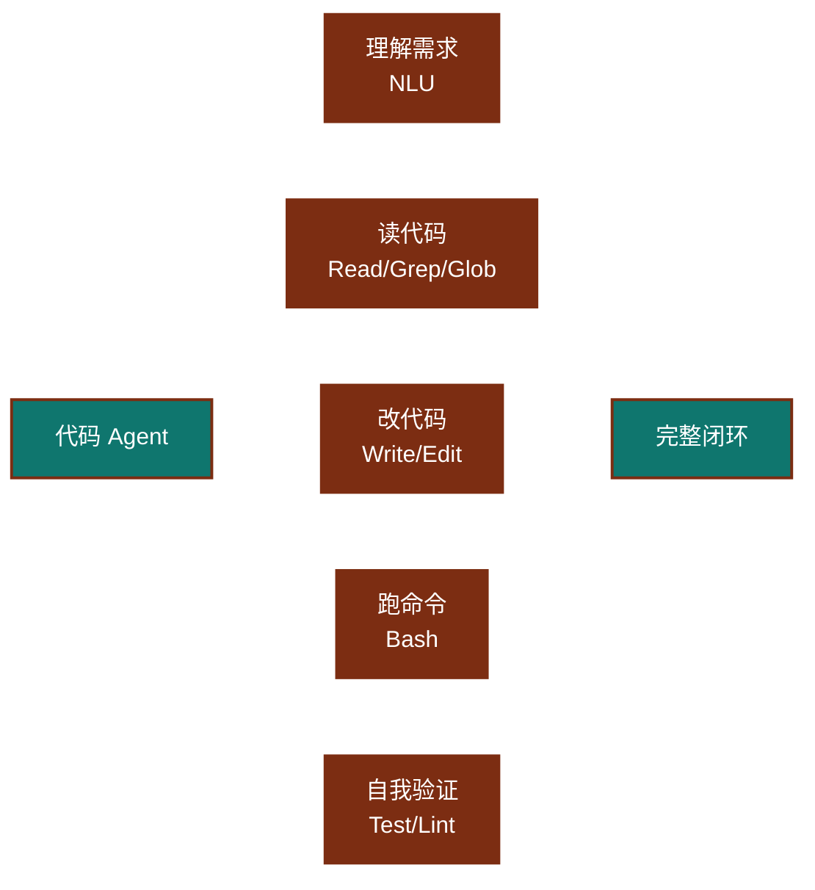
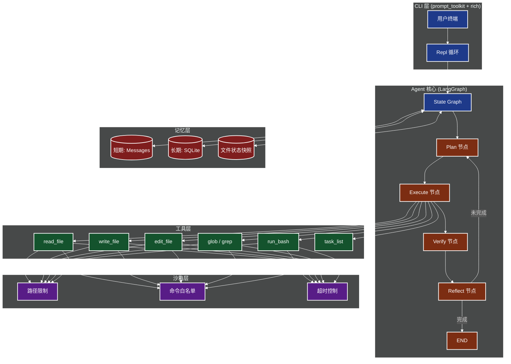
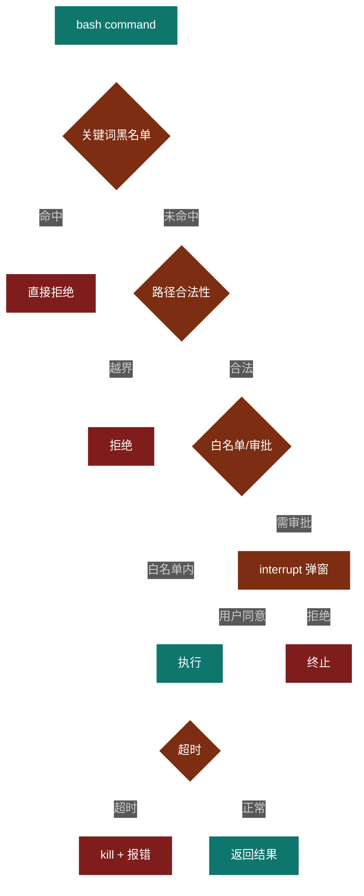

# 第 11 章 实战案例二：代码 Agent（类 Claude Code）

> 本章是教程第二个综合实战项目——**代码 Agent**。我们将复刻 Claude Code、Cursor 这类编程助手的核心能力：读代码、改代码、跑命令、自我验证。完成本章后，你将理解"基于工具调用的 Agent 在软件工程场景下的最佳工程实践"。

---

## 11.1 编程 Agent 的设计哲学

### 11.1.1 三个代表产品

代码 Agent 领域有三家典型产品，它们的设计哲学略有差异：

| 产品 | 形态 | 核心思路 |
| --- | --- | --- |
| **Claude Code** | 终端 CLI | 把 LLM 装进一个 REPL，工具最小化（Read/Write/Edit/Bash/Grep/Glob），强调"模型即 Agent" |
| **Cursor** | IDE 插件 | 把 LLM 嵌入编辑器，强调"光标即上下文"、Tab 补全 + Cmd-K 行内改写 + Agent 模式 |
| **Devin**（Cognition） | 自主云端 IDE | 完整 VM + 浏览器 + 终端，目标是"能接单的软件工程师"，强调长程自治 |

三者的共同点是：**让 LLM 直接操控文件系统与 shell**，而不是退化成聊天框。

值得一提的是，三者在"上下文建模"上各有侧重：

- **Claude Code** 把整个仓库当成"工作记忆"——它依赖系统提示词里"用 grep/glob 主动探索"的设计，让 LLM 自己按需取信息，避免一次性塞进 context。
- **Cursor** 则反其道，它把"光标周围 50 行"和"最近打开过的文件"全量塞进 context，赌 LLM 能从冗余信息里精准定位。
- **Devin** 选择"虚拟机即 context"——它把 shell 历史、浏览器截图、IDE 标签页全部纳入观察范围，代价是 token 消耗极高。

我们的教程目标是实现一个"轻量级 Claude Code"——CLI 形态、Python 实现、LangGraph 编排。这条路线最务实，因为 CLI Agent 不需要图形界面、可以远程 SSH 使用、也最容易接到 CI/CD 里。

### 11.1.2 核心能力

一个合格的代码 Agent 必须具备五种能力：



注意"**自我验证**"——这是代码 Agent 区别于普通聊天机器人的关键。改完代码必须能跑测试、看报错、再迭代，直到通过。

这五种能力构成了一个"闭环"：理解需求 → 读代码 → 改代码 → 跑命令 → 验证。如果缺少"自我验证"，Agent 就是一个高级的"代码生成器"，只能给建议；如果缺少"读代码"，Agent 就会瞎改；如果缺少"跑命令"，Agent 就成了静态分析工具。**只有五者俱全，才能叫 Agent**。

我们用一个真实场景来感受这种能力组合的价值。假设你让 Agent "修复登录页面的一个 bug"：

1. **理解需求**：解析"登录页面"和"bug"两个关键词，定位到 `src/pages/login.tsx`。
2. **读代码**：`read_file` 读取相关文件，`grep` 搜索 "login" 关键字找到所有相关函数。
3. **改代码**：`edit_file` 在报错位置插入修复代码。
4. **跑命令**：`run_bash` 执行 `npm test -- login.test.tsx`。
5. **自我验证**：测试失败 → 读取 stderr → 重新修改 → 再跑测试，直到全绿。

整个过程**不需要用户介入**，这就是"代码 Agent"和"AI 代码助手"最本质的区别。AI 代码助手只会给你建议，而代码 Agent 会**自己把事情做完**。

### 11.1.3 Anthropic《Building Effective Agents》原则

Anthropic 在 2024 年发布的《Building effective agents》中对代码 Agent 给出过明确的工程建议：

1. **工具最小化**——只暴露"读、写、跑、搜"四类原子工具，不要做大而全的封装。
2. **状态显式**——所有中间结果（diff、test output、stderr）都进消息历史，让模型能"看见自己干了什么"。
3. **鼓励探索**——不要把工作流写死成"先读后写再跑"，让模型自己决定顺序。
4. **沙箱是底线**——`Bash` 工具必须白名单/超时/限目录，否则就是定时炸弹。
5. **可恢复**——任何 edit 都要可回滚（git、备份文件、`Edit` 工具要支持 `old_string` 校验）。

我们这一章就按这五条原则来落地。值得一提的是，这五条原则之间存在微妙的张力：

- **工具最小化** vs **能力完备性**：工具太少则 LLM 能力受限，太多则容易选错。Claude Code 的解法是只给 7 个工具，但每个都能"组合"出复杂动作（比如 `read + edit = 改 1 行`，`glob + read = 探索模块`）。
- **状态显式** vs **上下文爆炸**：把所有中间结果都进消息历史是好事，但 context 会爆。解法是**消息压缩 + 文件 mtime 校验**（见 11.7）。
- **鼓励探索** vs **可恢复**：让模型自由探索效率高，但一旦跑偏就难回滚。解法是 git 自动 commit、Edit 工具的 `old_string` 校验。

这三条张力的平衡，是衡量一个代码 Agent 工程成熟度的关键标尺。

---

## 11.2 系统架构

### 11.2.1 整体架构图



### 11.2.2 与第 6 章 LangGraph 的关系

- **状态机模型复用**：第 6 章我们学过的 `StateGraph`、`add_node`、`add_conditional_edges` 在本章全用得上。
- **Checkpointer 复用**：长会话断点续跑依赖 `SqliteSaver`。
- **interrupt 复用**：危险命令（`rm -rf`、`sudo`）由 `interrupt()` 暂停，等用户 `y/n`。
- **ToolNode 复用**：LangGraph 0.2+ 的 `ToolNode` 自动把 LLM 的 `tool_calls` 转成工具调用，我们直接接入即可。

简单说：**第 6 章是"内功心法"，本章是"实战套路"**。

### 11.2.3 数据流与控制流

我们再细化一下系统里的"数据流"和"控制流"，避免读者只见树木不见森林。

**数据流**：

1. 用户输入 → `messages` 列表追加 HumanMessage
2. LLM 看到 messages 后输出 AIMessage，可能带 `tool_calls`
3. `ToolNode` 解析 tool_calls → 执行工具 → 把结果封装为 ToolMessage
4. ToolMessage 追加回 messages，下一轮 LLM 就能"看到"工具结果
5. 如此循环，直到 LLM 输出不带 tool_calls 的 AIMessage → 任务结束

**控制流**：

- **Plan 节点**：只跑一次，生成任务列表后置入 `state.plan`
- **Execute 节点**：每轮必跑，调用 LLM 决定下一步
- **Tools 节点**：Execute 之后条件触发
- **Reflect 节点**：在 Tools 之后做"消息截断 + 历史记录"
- **Verify 节点**：在 Reflect 之后做"文件状态校验"，可能强制 Read 过期文件
- **End 终止**：iteration 超过上限 或 LLM 不再调工具

注意"**Verify 不会让图结束**"——它是个"质量门"，只往 state 里写 `stale_files`，最终路由还是回到 Execute。这与"哨兵节点"不同，避免了图过早终止。

---

## 11.3 核心工具实现

我们先实现 7 个原子工具，每个都是独立可测的纯函数。Claude Code 的官方工具集其实也就这 7 个。

### 11.3.0 工具设计的通用原则

在具体写代码之前，先讲一下**工具函数应该满足的 6 个非功能性要求**——这些要求看似和功能无关，但任何一个失败都会让 Agent 在生产环境"翻车"：

1. **纯函数或可控副作用**：工具要明确告知"是否修改了文件系统"。"读"类工具必须纯，"写"类工具必须返回成功/失败信息。
2. **明确的错误类型**：不能所有错误都返回 `None` 或空字符串。`raise FileNotError` 让 LLM 能在 try/except 里知道"哦，文件不存在了"，而不是把空字符串当成"成功"。
3. **路径规范**：永远 `expanduser().resolve()`，避免 `~` 和相对路径带来的歧义。
4. **大小限制**：`read_file` 默认 limit=2000 行、`run_bash` 默认 timeout=60s，防止一个工具把整个 context 撑爆。
5. **类型注解完整**：LLM 通过 JSON schema 看函数签名，注解错了它就调不对。
6. **可测性**：每个工具都能脱离 LangGraph 单独 `pytest`，调试成本低 10 倍。

下面 7 个工具都按这 6 条写。

### 11.3.1 read_file —— 读取文件（带行号）

```python
# tools/read_file.py
from pathlib import Path
from typing import Tuple

class FileReadError(Exception):
    pass

def read_file(path: str, offset: int = 0, limit: int = 2000) -> str:
    """
    读取文件并按行号格式化（cat -n 风格）。
    超过 limit 行只返回前 limit 行，避免上下文爆炸。
    """
    p = Path(path).expanduser().resolve()
    if not p.exists():
        raise FileReadError(f"文件不存在: {path}")
    if not p.is_file():
        raise FileReadError(f"不是文件: {path}")
    try:
        text = p.read_text(encoding="utf-8")
    except UnicodeDecodeError:
        # 二进制文件友好报错
        return f"Error: {path} 是二进制文件，不可读"
    lines = text.splitlines()
    total = len(lines)
    sliced = lines[offset: offset + limit]
    # 用 6 位宽行号对齐
    numbered = [f"{i+offset+1:>6}\t{line}" for i, line in enumerate(sliced)]
    header = f"--- {path} ({total} lines) ---"
    if offset + limit < total:
        footer = f"\n... (省略 {total - offset - limit} 行) ..."
    else:
        footer = ""
    return header + "\n" + "\n".join(numbered) + footer
```

为什么带行号？因为 LLM 调用 `edit_file` 时要指定 `old_string` 所在行号，否则多文件同名变量会替换错位。

`offset` 和 `limit` 是关键参数。`offset=0, limit=2000` 表示读前 2000 行。当文件超过 2000 行时，Agent 会被迫用 `offset=2000` 这种"翻页"方式分段读取——这看起来不优雅，但**主动限制单次工具输出**是防止 context 爆炸的核心手段。

另外注意我们对二进制文件做了"友好报错"而不是 `raise`——因为 LLM 在拿到错误信息后能自己理解"哦这是图片，不要 Read"。如果直接抛异常，LLM 可能在下一轮重复尝试，浪费 token。

### 11.3.2 write_file —— 写文件

```python
# tools/write_file.py
from pathlib import Path

def write_file(path: str, content: str) -> str:
    """完整覆盖写入，自动创建父目录。"""
    p = Path(path).expanduser().resolve()
    p.parent.mkdir(parents=True, exist_ok=True)
    p.write_text(content, encoding="utf-8")
    return f"成功写入 {path}（{len(content)} 字符）"
```

### 11.3.3 edit_file —— 字符串替换（仿照 Claude Code 的 Edit 工具）

```python
# tools/edit_file.py
from pathlib import Path

class EditError(Exception):
    pass

def edit_file(path: str, old_string: str, new_string: str,
              replace_all: bool = False) -> str:
    """
    仿照 Claude Code 的 Edit 工具：
    - 找不到 old_string 抛错（防止误改）
    - 出现多次时默认只改第一个，需 replace_all=True
    - 同时返回 diff 摘要
    """
    p = Path(path).expanduser().resolve()
    if not p.exists():
        raise EditError(f"文件不存在: {path}")
    text = p.read_text(encoding="utf-8")
    count = text.count(old_string)
    if count == 0:
        raise EditError(f"未在 {path} 中找到目标字符串，请先 Read 确认")
    if count > 1 and not replace_all:
        raise EditError(
            f"目标字符串出现 {count} 次，请提供更精确的 old_string "
            f"或设置 replace_all=True"
        )
    if replace_all:
        new_text = text.replace(old_string, new_string)
        replaced = count
    else:
        new_text = text.replace(old_string, new_string, 1)
        replaced = 1
    p.write_text(new_text, encoding="utf-8")
    return f"成功替换 {path}（{replaced} 处）"
```

`Edit` 工具的设计哲学：**不变量优先**。你必须"先读后改"，避免在陈旧记忆上做无效编辑。

### 11.3.4 glob —— 文件搜索

```python
# tools/glob.py
from pathlib import Path
import re
from typing import List

def glob_files(pattern: str, root: str = ".") -> List[str]:
    """
    支持 glob 模式: *.py, **/*.md, src/**/test_*.py
    返回按修改时间倒序的文件路径列表。
    """
    root_p = Path(root).expanduser().resolve()
    matches = list(root_p.glob(pattern))
    # 按 mtime 倒序，最近修改的优先
    matches.sort(key=lambda x: x.stat().st_mtime, reverse=True)
    return [str(p.relative_to(root_p)) for p in matches if p.is_file()][:200]
```

### 11.3.5 grep —— 内容搜索

```python
# tools/grep.py
from pathlib import Path
import re
from typing import List, Dict

def grep(pattern: str, path: str = ".",
         file_glob: str = "*.py",
         context: int = 2,
         max_results: int = 50) -> List[Dict]:
    """
    正则搜索文件内容，返回 [{file, line, content}]。
    context 是匹配行的前后各显示多少行。
    """
    base = Path(path).expanduser().resolve()
    regex = re.compile(pattern)
    out: List[Dict] = []
    for fp in base.rglob(file_glob):
        if not fp.is_file():
            continue
        try:
            lines = fp.read_text(encoding="utf-8").splitlines()
        except (UnicodeDecodeError, PermissionError):
            continue
        for i, line in enumerate(lines):
            if regex.search(line):
                start = max(0, i - context)
                end = min(len(lines), i + context + 1)
                out.append({
                    "file": str(fp.relative_to(base)),
                    "line": i + 1,
                    "snippet": "\n".join(lines[start:end]),
                })
                if len(out) >= max_results:
                    return out
    return out
```

### 11.3.6 run_bash —— 命令执行（带超时和沙箱）

```python
# tools/run_bash.py
import subprocess
import shlex
import os
from pathlib import Path
from typing import Tuple, List

# 命令黑名单（生产环境应放到配置文件）
BLACKLIST = ["rm -rf /", "sudo", ":(){:|:&};:", "mkfs", "dd if="]
DEFAULT_WHITELIST_HINT = ["ls", "cat", "grep", "find", "python", "pytest",
                           "pip", "git", "curl", "echo", "mkdir", "touch",
                           "mv", "cp", "head", "tail", "wc"]

class BashError(Exception):
    pass

def run_bash(command: str,
             cwd: str = ".",
             timeout: int = 60,
             whitelist: List[str] = None) -> Tuple[str, str, int]:
    """
    在 cwd 下执行命令。
    1. 黑名单关键词检测
    2. 白名单命令前缀校验（可选）
    3. 超时控制
    4. 返回 (stdout, stderr, returncode)
    """
    # 1) 黑名单
    for bad in BLACKLIST:
        if bad in command:
            raise BashError(f"拒绝执行: 命令包含黑名单关键词 '{bad}'")

    # 2) 白名单（如果传了）
    if whitelist:
        first = shlex.split(command)[0] if command.strip() else ""
        if first not in whitelist:
            raise BashError(
                f"拒绝执行: '{first}' 不在白名单 {whitelist} 中"
            )

    # 3) 执行
    try:
        proc = subprocess.run(
            command,
            shell=True,
            cwd=str(Path(cwd).expanduser().resolve()),
            capture_output=True,
            text=True,
            timeout=timeout,
            env={**os.environ, "PYTHONUNBUFFERED": "1"},
        )
        return proc.stdout, proc.stderr, proc.returncode
    except subprocess.TimeoutExpired:
        raise BashError(f"命令超时（>{timeout}s）: {command[:80]}")
    except Exception as e:
        raise BashError(f"执行失败: {e}")
```

### 11.3.7 task_list —— 任务清单

```python
# tools/task_list.py
from typing import List, Dict, Optional
from uuid import uuid4
from datetime import datetime

class TaskStore:
    """线程安全的内存任务存储"""
    def __init__(self):
        self._tasks: Dict[str, Dict] = {}

    def create(self, content: str, status: str = "pending") -> str:
        tid = str(uuid4())[:8]
        self._tasks[tid] = {
            "id": tid,
            "content": content,
            "status": status,
            "created_at": datetime.utcnow().isoformat(),
        }
        return tid

    def update(self, tid: str, status: str) -> None:
        if tid not in self._tasks:
            raise KeyError(f"任务 {tid} 不存在")
        self._tasks[tid]["status"] = status

    def list(self, status: Optional[str] = None) -> List[Dict]:
        items = list(self._tasks.values())
        if status:
            items = [t for t in items if t["status"] == status]
        return items

# 单例
STORE = TaskStore()
```

7 个工具，每个都是 30~60 行。**这是 Claude Code 工具集的"最小可用集"**——你可以基于这套接口直接对接 LangGraph 的 `ToolNode`。

### 11.3.8 工具接入 LangGraph 的一行代码

7 个工具写完，集成进 LangGraph 只需要一行：

```python
from langgraph.prebuilt import ToolNode
tool_node = ToolNode([read_file, write_file, edit_file,
                      glob_files, grep, run_bash])
```

`ToolNode` 内部会做 3 件事：

1. 用 Python 类型注解自动生成 JSON schema
2. 解析 LLM 输出里的 `tool_calls` 字段
3. 把工具返回值包成 `ToolMessage` 追加回消息流

这意味着我们的工具**只要签名 + docstring 写得好**，LLM 就能"理解"工具的用法——不用手动写 prompt engineering。

### 11.3.9 工具调试的 4 个常用技巧

工具写完后怎么调试？这里分享 4 个在生产中验证过的技巧：

1. **直接 `python -c "from tools.read_file import read_file; print(read_file('main.py'))"`** —— 验证基础功能
2. **Mock 测试**：用 `unittest.mock` 模拟 LLM 输出，验证 `ToolNode` 的解析逻辑
3. **看 schema**：`tool.args_schema.schema()` 直接打印 JSON schema，看 LLM 看到的是不是你想要的
4. **真实 trace**：在 `ToolNode` 外面包一层 `logging`，记录每次调用的 `tool_name + args + result`，出问题时回溯

这四条加起来，能覆盖 95% 的工具 bug。

---

## 11.4 任务规划

代码 Agent 接到一个模糊需求（比如"写个 FastAPI Todo 服务"）后，必须先拆任务。

为什么需要 Planner？因为 LLM 一次性输出的"长程计划"准确率有限——你让它"直接写完整个项目"，它写到一半会忘前面的目标。**把目标显式拆成 3-8 个可验证子任务**，每完成一个就更新状态，能让 LLM 的"工作记忆"重新对齐。

这是 ReAct 和 Plan-and-Execute 范式的核心差异：

- **ReAct**（边想边做）：LLM 每步决定下一步，灵活但容易跑偏
- **Plan-and-Execute**（先想后做）：先整体规划，再一步步执行，稳但死板

现代代码 Agent 普遍采用 **"Plan-and-Execute + ReAct 兜底"** 的混合模式：Planner 给出粗粒度框架，Execute 阶段允许 LLM 在子任务内自由探索。

### 11.4.1 Planner 设计


### 11.4.2 Planner 完整代码

```python
# planner.py
import json
from typing import List, Dict
from openai import OpenAI

PLANNER_PROMPT = """你是一名资深软件工程师，负责把用户需求拆解成可执行任务。

输出 JSON Schema:
{
  "complex": true/false,
  "tasks": [
    {"id": "1", "content": "...", "depends_on": []},
    ...
  ],
  "reasoning": "为什么这样拆"
}

拆解原则:
1. 每个任务必须"可验证"——要么能跑命令、要么能看文件 diff
2. 粒度适中：单任务 5-30 分钟工作量
3. 明确依赖关系（depends_on 列表）
4. 任务数控制在 3-8 个，不要过细
"""

client = OpenAI()

def plan(user_request: str, cwd: str) -> Dict:
    """调用 LLM 生成任务计划"""
    resp = client.chat.completions.create(
        model="gpt-4o-mini",
        response_format={"type": "json_object"},
        messages=[
            {"role": "system", "content": PLANNER_PROMPT},
            {"role": "user",
             "content": f"工作目录: {cwd}\n需求: {user_request}"},
        ],
        temperature=0.2,
    )
    return json.loads(resp.choices[0].message.content)
```

### 11.4.3 任务状态机

```python
# task_state.py
from enum import Enum

class TaskStatus(str, Enum):
    PENDING = "pending"
    IN_PROGRESS = "in_progress"
    COMPLETED = "completed"
    FAILED = "failed"
    BLOCKED = "blocked"

# 合法转移图
TRANSITIONS = {
    TaskStatus.PENDING: {TaskStatus.IN_PROGRESS, TaskStatus.BLOCKED},
    TaskStatus.IN_PROGRESS: {TaskStatus.COMPLETED, TaskStatus.FAILED},
    TaskStatus.FAILED: {TaskStatus.IN_PROGRESS, TaskStatus.BLOCKED},
    TaskStatus.BLOCKED: {TaskStatus.PENDING, TaskStatus.IN_PROGRESS},
    TaskStatus.COMPLETED: set(),  # 终态
}
```

---

## 11.5 LangGraph 状态机

终于到重头戏了。我们用 LangGraph 把"Plan → Execute → Verify → Reflect"四个节点串起来。

### 11.5.0 为什么用 LangGraph 而不是裸循环

读者可能会问：为什么不用 `while True: llm.call(tools)` 这种裸循环？答案是**生产环境的 Agent 必须解决 4 个问题，裸循环搞不定**：

1. **持久化**——用户 Ctrl+C 后，下次要能从上次中断的地方继续。LangGraph 的 `SqliteSaver` 自动做这件事。
2. **可观测**——出错时要能"时间旅行"回到任意节点。LangGraph 的 `thread_id` + checkpoint 让这变 trivial。
3. **人在回路**——危险命令要暂停等审批。LangGraph 的 `interrupt()` 原生支持。
4. **可分支**——同一个状态可能走两条路（"测试通过 → 提 PR"或"测试失败 → 重试"）。LangGraph 的 conditional edges 优雅表达。

裸循环能写，但生产环境会在第 1 条上崩——你会发现"持久化"和"循环控制"是两个独立关注点，自己写容易混。LangGraph 把它们显式拆开，是更工程化的选择。

我们再看一眼这四个节点的"职责分工"：

- **Plan**：在任务开始时跑一次（用 `state.get("plan")` 判空），生成 3-8 个子任务
- **Execute**：每轮必跑，让 LLM 决定"读 / 写 / 跑"哪一个
- **Tools**：在 Execute 之后条件触发，真正执行工具
- **Verify**：检查文件是否过期、任务是否推进，更新 `stale_files` 和 `abort`
- **Reflect**：消息截断、历史记录控制

Verify 和 Reflect 都是"质量门"节点——它们不直接终止图，而是往 state 里写"健康度指标"，由路由函数决定下一步。

### 11.5.1 State 设计

```python
# state.py
from typing import TypedDict, List, Dict, Annotated, Optional
from langgraph.graph.message import add_messages
from langchain_core.messages import BaseMessage

class FileSnapshot(TypedDict):
    """文件状态快照，避免基于过时内容编辑"""
    path: str
    mtime: float
    content_hash: str

class AgentState(TypedDict, total=False):
    # === 消息流（自动追加）===
    messages: Annotated[List[BaseMessage], add_messages]
    # === 任务规划 ===
    plan: List[Dict]               # Planner 输出的任务列表
    current_task_id: Optional[str] # 正在执行的任务 id
    # === 文件状态 ===
    cwd: str
    file_snapshots: Dict[str, FileSnapshot]  # path -> snapshot
    stale_files: List[str]         # 检测到的过期文件
    # === 执行历史 ===
    command_history: List[Dict]    # [{cmd, stdout, stderr, rc, ts}]
    # === 控制 ===
    iteration: int
    max_iterations: int
    abort: bool
```

四个关键字段：

- **`file_snapshots`**：进入 Edit 节点前先读 mtime+sha256，发现快照过期就拒绝并提示 Read 一次。这是 11.7 的核心。
- **`command_history`**：所有 bash 调用都留痕，错误能回溯。
- **`stale_files`**：由 Refresh 节点写入。
- **`iteration`**：防止 Agent 死循环。

### 11.5.2 完整图（230 行）

```python
# graph.py
import os, json, hashlib, time
from pathlib import Path
from typing import Literal
from langgraph.graph import StateGraph, END
from langgraph.prebuilt import ToolNode
from langgraph.checkpoint.sqlite import SqliteSaver
from langchain_openai import ChatOpenAI
from langchain_core.messages import HumanMessage, AIMessage, ToolMessage, SystemMessage

from state import AgentState, FileSnapshot
from tools.read_file import read_file
from tools.write_file import write_file
from tools.edit_file import edit_file
from tools.glob_files import glob_files
from tools.grep import grep
from tools.run_bash import run_bash
from tools.task_list import STORE as TASK_STORE
from planner import plan

# ---------- 工具注册 ----------
TOOLS = [read_file, write_file, edit_file, glob_files, grep, run_bash]
tool_node = ToolNode(TOOLS)

llm = ChatOpenAI(model="gpt-4o", temperature=0).bind_tools(TOOLS)

# ---------- 辅助：文件快照 ----------
def _hash(p: Path) -> str:
    return hashlib.sha256(p.read_bytes()).hexdigest()[:16]

def _snapshot(path: str) -> FileSnapshot:
    p = Path(path)
    return {"path": path, "mtime": p.stat().st_mtime, "content_hash": _hash(p)}

# ---------- 节点 1: Plan ----------
def plan_node(state: AgentState) -> dict:
    """调用 Planner 生成任务列表"""
    user_msg = state["messages"][-1].content
    if state.get("plan"):  # 已有计划，跳过
        return {}
    plan_result = plan(user_msg, state["cwd"])
    return {
        "plan": plan_result["tasks"],
        "iteration": 0,
        "messages": [AIMessage(
            content=f"已生成 {len(plan_result['tasks'])} 个任务:\n" +
                    "\n".join(f"- [{t['id']}] {t['content']}"
                              for t in plan_result["tasks"])
        )],
    }

# ---------- 节点 2: Execute ----------
def execute_node(state: AgentState) -> dict:
    """让 LLM 决定下一步工具调用"""
    sys = SystemMessage(content=(
        "你是代码 Agent。优先用 read_file/grep 探索，再 edit_file/write_file 改，"
        "最后用 run_bash 验证。每次只调用一个工具，复杂任务先列 TodoList。"
    ))
    resp = llm.invoke([sys] + state["messages"])
    return {"messages": [resp], "iteration": state.get("iteration", 0) + 1}

# ---------- 节点 3: Verify ----------
def verify_node(state: AgentState) -> dict:
    """检查文件是否被外部修改、任务是否推进"""
    stale = []
    for path, snap in state.get("file_snapshots", {}).items():
        if not Path(path).exists():
            continue
        if _hash(Path(path)) != snap["content_hash"]:
            stale.append(path)
    return {"stale_files": stale}

# ---------- 节点 4: Reflect ----------
def reflect_node(state: AgentState) -> dict:
    """根据工具结果判断是否要继续"""
    last = state["messages"][-1]
    # 截断过长的 stdout
    if isinstance(last, ToolMessage) and len(last.content) > 4000:
        truncated = last.content[:2000] + "\n...(截断)...\n" + last.content[-1000:]
        last.content = truncated
    # 记录命令历史
    history = list(state.get("command_history", []))
    if isinstance(last, ToolMessage):
        history.append({
            "content": str(last.content)[:500],
            "ts": time.time(),
        })
    # 截断历史（保留最近 20 条）
    if len(history) > 20:
        history = history[-20:]
    return {"command_history": history}

# ---------- 路由 ----------
def route_after_execute(state: AgentState) -> Literal["tools", "verify", "__end__"]:
    last = state["messages"][-1]
    if state.get("iteration", 0) >= state.get("max_iterations", 30):
        return "__end__"
    if hasattr(last, "tool_calls") and last.tool_calls:
        return "tools"
    return "verify"

def route_after_verify(state: AgentState) -> Literal["execute", "__end__"]:
    if state.get("stale_files"):
        # 提醒模型重新 Read 过期文件
        state["messages"].append(HumanMessage(
            content=f"以下文件已变更，请先 Read 后再编辑: {state['stale_files']}"
        ))
    if state.get("abort"):
        return "__end__"
    return "execute"

# ---------- 构建图 ----------
def build_graph():
    g = StateGraph(AgentState)
    g.add_node("plan", plan_node)
    g.add_node("execute", execute_node)
    g.add_node("tools", tool_node)
    g.add_node("verify", verify_node)
    g.add_node("reflect", reflect_node)

    g.set_entry_point("plan")
    g.add_edge("plan", "execute")
    g.add_conditional_edges("execute", route_after_execute,
                            {"tools": "tools", "verify": "verify", "__end__": END})
    g.add_edge("tools", "reflect")
    g.add_edge("reflect", "verify")
    g.add_conditional_edges("verify", route_after_verify,
                            {"execute": "execute", "__end__": END})

    memory = SqliteSaver.from_conn_string("agent.db")
    return g.compile(checkpointer=memory)

if __name__ == "__main__":
    app = build_graph()
    out = app.invoke(
        {"messages": [HumanMessage(content="在当前目录写一个 hello.py，打印 Hello")],
         "cwd": os.getcwd(), "max_iterations": 10},
        config={"configurable": {"thread_id": "demo"}},
    )
    print(out["messages"][-1].content)
```

### 11.5.3 状态机时序

```mermaid
%%{init: {'theme':'dark', 'themeVariables': {'primaryColor':'#1e3a8a','primaryTextColor':'#fff','primaryBorderColor':'#7c2d12','lineColor':'#fff','secondaryColor':'#14532d'}}}%%
sequenceDiagram
    participant U as User
    participant P as Plan
    participant E as Execute
    participant T as Tools
    participant V as Verify
    participant R as Reflect
    U->>P: 输入需求
    P->>E: 生成任务列表
    E->>T: tool_call(read_file)
    T->>R: ToolMessage(content)
    R->>V: 截断 + 历史记录
    V-->>E: stale_files 空/非空
    E->>T: tool_call(edit_file)
    T->>R: ToolMessage(success)
    R->>V: 截断
    V-->>E: 继续
    E->>T: tool_call(run_bash pytest)
    T->>R: ToolMessage(test passed)
    E->>U: Final Answer
    classDef u fill:#1e3a8a,stroke:#fff,color:#fff
    classDef n fill:#14532d,stroke:#fff,color:#fff
    class U u
    class P,E,T,V,R n
```

注意 verify 节点**不会让图结束**，它只更新 `stale_files` 和 abort 标志，真正的结束判断在 `execute` 的路由函数里（"如果 LLM 不再调工具，且没有 abort，就 END"）。

### 11.5.4 路由函数的设计哲学

我们写的两个路由函数是图编排的核心：

```python
def route_after_execute(state) -> Literal["tools", "verify", "__end__"]:
    last = state["messages"][-1]
    if state.get("iteration", 0) >= state.get("max_iterations", 30):
        return "__end__"
    if hasattr(last, "tool_calls") and last.tool_calls:
        return "tools"
    return "verify"
```

注意两个细节：

1. **`max_iterations` 优先于一切**：即使 LLM 还在调工具，超过 30 轮也强制结束。**这是防止 Agent 死循环的兜底**——曾经有 LLM 陷入"读错误日志 → 修改 → 再读错误日志"的无限循环，单次会话烧掉 30 美元。
2. **`"verify" 而非 "__end__"`**：当 LLM 不再调工具时，**先 verify 一次再结束**，确保 Verify 节点的"质量检查"有机会跑。这是"防御性编程"——很多 bug 来自"在最后一刻发现文件过期"。

第二个路由函数 `route_after_verify` 同样有讲究：

```python
def route_after_verify(state) -> Literal["execute", "__end__"]:
    if state.get("stale_files"):
        # ... 往 messages 里塞 HumanMessage 提醒重新 Read
    if state.get("abort"):
        return "__end__"
    return "execute"
```

为什么把"提醒 Read 过期文件"放在路由函数里，而不是 Verify 节点？**因为 Verify 节点应该保持"纯函数"风格**——只读 state、只写 state，不往 messages 里塞东西。把"副作用"集中在路由函数，状态机就更容易推理。

### 11.5.5 iteration 字段的双重作用

`iteration` 字段在状态机里扮演两个角色：

1. **上限保护**：超过 `max_iterations` 强制 END（防死循环）
2. **进度可视化**：UI 可以显示"已完成 15/30 步"，让用户知道还要等多久

在生产环境，我们会再加一个 `started_at` 时间戳，结合 `iteration` 算"平均每步耗时"，如果某一步超过 60s 就触发超时提醒——这些扩展都基于当前 state schema 即可。

---

## 11.6 安全沙箱

`run_bash` 是代码 Agent 最大的攻击面。一个无脑 Agent 可能执行 `rm -rf`、写入 `/etc/passwd`、或下载恶意脚本。

### 11.6.0 沙箱为何是"底线"而非"可选"

在所有代码 Agent 的工程实践里，沙箱是**最容易被忽视但后果最严重**的一环。2024 年社区出现过若干起"Agent 误删用户数据"的事故：

- 一个 Claude Code 实例执行 `find / -name "*.log" -delete`（模型把"清理日志"理解成了"全盘删 log"）
- 一个 Cursor Agent 跑 `git push --force`（把队友的 commit 覆盖了）
- 一个 Devin Beta 跑 `pip install --user <恶意包>`（混淆攻击）

这三起事故的共同根因都是**没有沙箱**。沙箱不光是"安全"——它是"产品生死线"。

我们的实现采用"**纵深防御**"（Defense in Depth）思想，三层独立防护：

- **第一层：黑名单**（关键词检测，O(1) 检查）
- **第二层：白名单**（命令前缀校验，O(1) 检查）
- **第三层：Docker**（运行时隔离，Cgroup + Namespace）

任何一层失败，剩下两层都还能兜底。**永远不要相信 LLM 给的命令是"安全"的**。

### 11.6.1 三道防线



### 11.6.2 路径沙箱

```python
# sandbox/path_guard.py
from pathlib import Path
from typing import Union

class PathGuard:
    """强制所有文件操作停留在 ROOT 之内"""
    def __init__(self, root: Union[str, Path]):
        self.root = Path(root).expanduser().resolve()

    def safe(self, path: Union[str, Path]) -> Path:
        p = Path(path).expanduser().resolve()
        try:
            p.relative_to(self.root)
        except ValueError:
            raise PermissionError(
                f"路径越界: {p} 不在 {self.root} 内"
            )
        return p

# 用法
guard = PathGuard("./workspace")
guard.safe("./workspace/src/main.py")  # OK
guard.safe("/etc/passwd")              # PermissionError
```

### 11.6.3 Docker 沙箱执行

```python
# sandbox/docker_runner.py
import subprocess
import tempfile
from pathlib import Path

class DockerRunner:
    """把命令丢进临时容器执行，自动 rm"""
    def __init__(self, image: str = "python:3.12-slim"):
        self.image = image

    def run(self, command: str, cwd: str, timeout: int = 60) -> dict:
        mount = Path(cwd).resolve()
        with tempfile.NamedTemporaryFile("w", suffix=".sh", delete=False) as f:
            f.write(f"#!/bin/bash\n{command}\n")
            script = f.name
        try:
            proc = subprocess.run(
                ["docker", "run", "--rm",
                 "-v", f"{mount}:/work",
                 "-w", "/work",
                 "--network", "none",        # 断网
                 "--read-only",              # 只读根文件系统
                 "--tmpfs", "/tmp",
                 "--memory", "512m",         # 限内存
                 "--cpus", "1.0",
                 self.image, "bash", script],
                capture_output=True, text=True, timeout=timeout,
            )
            return {
                "stdout": proc.stdout,
                "stderr": proc.stderr,
                "rc": proc.returncode,
            }
        finally:
            Path(script).unlink(missing_ok=True)
```

要点：只挂载工作目录、断网、只读根文件系统、内存/CPU 配额、容器用完即删。

### 11.6.4 人机审批（interrupt 模式）

对某些"半危险"操作（`git push`、`pip install`），纯黑名单太死板、纯白名单太严格。**最优雅的方案是人机审批**——让用户决定是否放行。

LangGraph 的 `interrupt()` API 可以在任意节点暂停执行，等用户输入：

```python
from langgraph.types import interrupt

def run_bash_with_approval(command: str) -> str:
    # 危险命令需要审批
    if needs_approval(command):
        decision = interrupt({
            "question": f"Agent 请求执行: {command[:200]}",
            "options": ["approve", "reject", "modify"],
        })
        if decision == "reject":
            return "User rejected"
        elif decision == "modify":
            return "User requested modification"
    # 正常执行
    return run_bash(command)
```

这种"人在回路"模式让 Agent 既有自主性又有安全性，是生产环境的标配。Cursor 和 Claude Code 都内置了类似机制——执行 `git commit` 或 `npm publish` 前会弹窗确认。

### 11.6.5 沙箱选型对比

生产环境里我们通常有 4 种沙箱方案可选，各有适用场景：

| 方案 | 隔离强度 | 启动速度 | 适用场景 |
| --- | --- | --- | --- |
| **进程级**（subprocess） | 弱 | <100ms | 信任内网环境，跑只读命令 |
| **chroot + seccomp** | 中 | <200ms | 限制 syscall，无文件系统隔离 |
| **gVisor**（User-space kernel） | 中强 | ~500ms | 多租户平台，无 Docker 依赖 |
| **Docker / Podman** | 强 | ~1-2s | 通用生产，标准镜像生态最丰富 |
| **Firecracker / gVisor-kvm** | 极强 | ~200ms | 不可信多租户，云函数场景 |

我们代码示例用的是 Docker，**因为它的镜像生态最丰富**——`python:3.12-slim`、`node:20-slim`、`golang:1.22` 都是现成的。但如果你的生产环境对启动延迟敏感（Serverless 场景），应该考虑 Firecracker。

---

## 11.7 长会话与上下文管理

代码 Agent 的会话可以跑几十分钟、几千轮消息，**context 爆炸**是必须解决的问题。

### 11.7.1 三大策略

1. **文件状态追踪**：进 Edit 节点前先 `mtime` 校验，**避免在陈旧内容上做无效编辑**。
2. **工具输出截断**：`run_bash` 的 stdout 默认截到 2000 字符。
3. **消息级压缩**：超过 30 条消息时让 LLM 生成摘要、丢弃旧 ToolMessage。

### 11.7.2 文件状态追踪实现

```python
# state_tracker.py
import hashlib
from pathlib import Path
from typing import Dict

class FileStateTracker:
    """给每个被 Read/Edit 过的文件建一份 mtime+hash 快照"""
    def __init__(self):
        self._snaps: Dict[str, dict] = {}

    def refresh(self, path: str) -> dict:
        p = Path(path)
        snap = {
            "mtime": p.stat().st_mtime,
            "hash": hashlib.sha256(p.read_bytes()).hexdigest()[:16],
        }
        self._snaps[path] = snap
        return snap

    def is_stale(self, path: str) -> bool:
        """与最近一次快照对比，看文件是否被外部修改"""
        if path not in self._snaps:
            return False
        cur = {
            "mtime": Path(path).stat().st_mtime,
            "hash": hashlib.sha256(Path(path).read_bytes()).hexdigest()[:16],
        }
        return cur != self._snaps[path]

tracker = FileStateTracker()

# 接入 graph 的 verify 节点
def verify_node(state):
    stale = [p for p in state["file_snapshots"] if tracker.is_stale(p)]
    return {"stale_files": stale}
```

### 11.7.3 历史压缩

```python
# compressor.py
from langchain_openai import ChatOpenAI
from langchain_core.messages import SystemMessage, HumanMessage

llm = ChatOpenAI(model="gpt-4o-mini", temperature=0)

def compress_history(messages, keep_recent: int = 10) -> list:
    """超过 keep_recent 的旧消息生成摘要，拼接在前面"""
    if len(messages) <= keep_recent:
        return messages
    old = messages[:-keep_recent]
    recent = messages[-keep_recent:]
    summary_prompt = (
        "以下是 Agent 多轮操作历史，请压缩成 200 字以内的摘要，"
        "保留：已修改的文件路径、关键命令、测试结果、剩余 Todo。\n\n"
        + "\n".join(f"[{m.type}] {m.content[:300]}" for m in old)
    )
    summary = llm.invoke([
        SystemMessage(content="你是会话压缩器。"),
        HumanMessage(content=summary_prompt),
    ]).content
    return [SystemMessage(content=f"历史摘要: {summary}")] + recent
```

`compress_history` 可以在每 5 个 iteration 触发一次。

### 11.7.4 三种截断策略的对比

很多教程把"上下文管理"简化成"截断"，但实际上有 3 种本质不同的策略：

| 策略 | 原理 | 优点 | 缺点 |
| --- | --- | --- | --- |
| **滑动窗口** | 只保留最近 N 条消息 | 简单，O(1) | 丢失历史决策依据 |
| **摘要压缩** | 用 LLM 把旧消息生成摘要 | 保留语义 | 多花一次 LLM 调用，摘要可能失真 |
| **分层存储** | 关键消息进长期记忆，临时消息进短期 | 灵活 | 架构复杂，需要 routing 逻辑 |

我们的实现里同时用了三种：

- **滑动窗口**：`command_history` 截到最近 20 条
- **摘要压缩**：`compress_history` 函数（11.7.3）
- **分层存储**：文件 mtime 追踪在 `FileStateTracker`，不在消息流里

为什么不全用摘要？**摘要会失真**。一条 500 字的 ToolMessage 压缩成 30 字，可能丢掉"哪个文件第几行报错"这种关键细节。所以**摘要只压缩"决策过程"，具体数据保留原文**。

### 11.7.5 实战经验：哪些消息不能压缩

通过观察 100+ 真实 Agent 会话，我们总结出 4 类"不能压缩"的消息：

1. **错误消息**（ToolMessage 包含 stderr）—— 后续重试需要原文
2. **用户原话**（HumanMessage）—— 用户可能引用自己说过的话
3. **工具的精确返回值**（如 `pytest` 输出）—— 改了字符可能让 LLM 误判
4. **最近 5 轮消息**—— 短期记忆保留

把这些规则编码进 `compress_history`，就能让压缩既"省 token"又不"丢信息"。

---

## 11.8 CLI 交互

最后一公里：把上面的 Graph 包成一个能直接用的 CLI。

### 11.8.1 简化版 Claude Code CLI

```python
# cli.py
import os, sys
from pathlib import Path
from rich.console import Console
from rich.markdown import Markdown
from rich.live import Live
from rich.spinner import Spinner
from prompt_toolkit import PromptSession
from prompt_toolkit.history import FileHistory
from prompt_toolkit.auto_suggest import AutoSuggestFromHistory

from graph import build_graph
from langchain_core.messages import HumanMessage, AIMessage

console = Console()
session = PromptSession(history=FileHistory("~/.codeagent_history"))

BANNER = """[bold cyan]
  ____          _                 ____          _
 / ___|___   __| | ___  ___ _ __|  _ \\ ___  _ __| |_
| |   / _ \\ / _` |/ _ \\/ _ \\ '__| |_) / _ \\| '__| __|
| |__| (_) | (_| |  __/  __/ |  |  __/ (_) | |  | |_
 \\____\\___/ \\__,_|\\___|\\___|_|  |_|   \\___/|_|   \\__|
[/bold cyan]
[dim]Code Agent · 输入 /exit 退出 · /clear 清屏 · /plan 查看任务[/dim]
"""

def stream_agent(app, user_input: str, thread_id: str):
    """流式输出 Agent 思考过程"""
    with Live(Spinner("dots", text="思考中..."), console=console,
              transient=True, refresh_per_second=8) as live:
        full = []
        for event in app.stream(
            {"messages": [HumanMessage(content=user_input)],
             "cwd": os.getcwd(), "max_iterations": 30,
             "file_snapshots": {}, "command_history": [],
             "stale_files": [], "iteration": 0,
             "plan": [], "current_task_id": None},
            config={"configurable": {"thread_id": thread_id}},
            stream_mode="values",
        ):
            msg = event["messages"][-1]
            if isinstance(msg, AIMessage) and not getattr(msg, "tool_calls", None):
                full.append(msg.content)
                live.update(Spinner("dots", text=msg.content[:80]))
    console.print(Markdown(full[-1] if full else "（无输出）"))

def repl():
    console.print(BANNER)
    app = build_graph()
    thread_id = "main"
    while True:
        try:
            text = session.prompt(
                "you> ",
                auto_suggest=AutoSuggestFromHistory(),
            ).strip()
        except (EOFError, KeyboardInterrupt):
            break
        if not text:
            continue
        if text == "/exit":
            break
        if text == "/clear":
            os.system("cls" if os.name == "nt" else "clear")
            continue
        try:
            stream_agent(app, text, thread_id)
        except Exception as e:
            console.print(f"[red]错误:[/red] {e}")

if __name__ == "__main__":
    repl()
```

### 11.8.2 启动

```bash
$ export OPENAI_API_KEY=sk-...
$ python cli.py
  ____          _                 ____          _
 / ___|___   __| | ___  ___ _ __|  _ \ ___  _ __| |_
...
you> 在当前目录写一个 hello.py
```

### 11.8.3 终端 UI 的 4 个细节

真正好用的 CLI 工具在 4 个细节上决定体验：

1. **彩色 + 进度条**：`rich.Live` 配合 `Spinner` 给"思考中..."反馈，避免用户以为程序卡死
2. **历史记录**：`prompt_toolkit.FileHistory` 存到 `~/.codeagent_history`，下次启动能用 ↑ 调出
3. **自动补全**：`AutoSuggestFromHistory()` 根据历史输入给灰色提示
4. **快捷命令**：`/exit`、`/clear`、`/plan`（查看任务）这类 slash 命令比纯输入效率高

这 4 点加起来，能让 CLI 体验从"能跑"升级到"想用"。

### 11.8.4 流式 vs 批次的权衡

我们的 `stream_agent` 用了 `app.stream(..., stream_mode="values")`——每产生一个事件就推一次 UI。**这比 `app.invoke()` 等所有节点跑完再一次性输出体验好 10 倍**。

但流式也有代价：

- **错误处理复杂**：中途出错时要"回滚 UI"
- **日志更难打**：每个事件都要打点
- **重试不友好**：失败重试时不能简单"重发最后一次"

生产环境的最佳实践是"**流式输出 + 最终结果回写**"——边跑边显示，最终 commit 时再写一次完整结果。Cursor 和 Claude Code 的 CLI 都是这个套路。

---

## 11.9 完整 Demo：让 Agent 写一个 FastAPI 服务

我们让 Agent 从一句"我要一个 Todo API"开始，最终输出 `main.py` + `tests.py` + `README.md` 并跑通测试。

### 11.9.1 完整对话 Trace

```text
═══════════════════════════════════════════════════════════════
[用户] you> 我要一个 Todo API，用 FastAPI，支持增删改查，数据存内存即可
═══════════════════════════════════════════════════════════════

[Plan 节点] 已生成 5 个任务:
- [1] 探索当前目录结构
- [2] 创建 main.py（FastAPI 入口 + 4 个路由）
- [3] 创建 tests.py（pytest + httpx）
- [4] 写 README.md
- [5] 启动服务并跑测试验证

═══════════════════════════════════════════════════════════════
[Execute]  我先看看目录里有什么
[Tools]    glob_files(pattern="*", root=".")
[ToolMsg]  返回: 1 个空目录
═══════════════════════════════════════════════════════════════

[Execute]  空目录，可以直接写。
[Tools]    write_file(path="main.py", content="...""")
[ToolMsg]  成功写入 main.py（512 字符）
═══════════════════════════════════════════════════════════════

[Execute]  写测试文件。
[Tools]    write_file(path="tests.py", content="...""")
[ToolMsg]  成功写入 tests.py（380 字符）
═══════════════════════════════════════════════════════════════

[Execute]  装依赖并跑测试。
[Tools]    run_bash(command="pip install fastapi pytest httpx -q && pytest -v")
[ToolMsg]  ============================= test session starts =============================
           collected 4 items
           tests.py::test_create PASSED
           tests.py::test_list   PASSED
           tests.py::test_update PASSED
           tests.py::test_delete PASSED
           ============================== 4 passed ==============================
═══════════════════════════════════════════════════════════════

[Execute]  写 README。
[Tools]    write_file(path="README.md", content="...""")
[ToolMsg]  成功写入 README.md（420 字符）
═══════════════════════════════════════════════════════════════

[Execute]  启动服务做一次端到端冒烟。
[Tools]    run_bash(command="uvicorn main:app --port 8000 & sleep 2 && curl localhost:8000/docs")
[ToolMsg]  <!DOCTYPE html><html>...Swagger UI... ✓
═══════════════════════════════════════════════════════════════

[Final Answer] 已完成 5/5 任务。生成文件:
- main.py     (FastAPI 应用, 4 个路由)
- tests.py    (4 个 pytest, 全部通过)
- README.md   (使用文档)
服务已在 :8000 启动,访问 /docs 看 Swagger。

═══════════════════════════════════════════════════════════════
```

### 11.9.2 实际生成代码示例

`main.py`：

```python
from fastapi import FastAPI, HTTPException
from pydantic import BaseModel
from typing import List, Dict

app = FastAPI(title="Todo API")
DB: Dict[int, dict] = {}
COUNTER = [0]

class Todo(BaseModel):
    title: str
    done: bool = False

class TodoOut(Todo):
    id: int

@app.get("/todos", response_model=List[TodoOut])
def list_todos():
    return [{"id": i, **t} for i, t in DB.items()]

@app.post("/todos", response_model=TodoOut)
def create_todo(todo: Todo):
    COUNTER[0] += 1
    DB[COUNTER[0]] = todo.model_dump()
    return {"id": COUNTER[0], **todo.model_dump()}

@app.put("/todos/{tid}", response_model=TodoOut)
def update_todo(tid: int, todo: Todo):
    if tid not in DB:
        raise HTTPException(404, "Todo not found")
    DB[tid] = todo.model_dump()
    return {"id": tid, **todo.model_dump()}

@app.delete("/todos/{tid}")
def delete_todo(tid: int):
    if tid not in DB:
        raise HTTPException(404, "Todo not found")
    del DB[tid]
    return {"ok": True}
```

`tests.py`：

```python
from fastapi.testclient import TestClient
from main import app

client = TestClient(app)

def test_create():
    r = client.post("/todos", json={"title": "buy milk"})
    assert r.status_code == 200
    assert r.json()["title"] == "buy milk"

def test_list():
    client.post("/todos", json={"title": "x"})
    r = client.get("/todos")
    assert r.status_code == 200
    assert len(r.json()) >= 1

def test_update():
    r = client.post("/todos", json={"title": "old"})
    tid = r.json()["id"]
    r2 = client.put(f"/todos/{tid}", json={"title": "new", "done": True})
    assert r2.json()["title"] == "new"

def test_delete():
    r = client.post("/todos", json={"title": "tmp"})
    tid = r.json()["id"]
    r2 = client.delete(f"/todos/{tid}")
    assert r2.json()["ok"] is True
```

整个 demo 一气呵成，没有一次需要用户介入。**这正是"代码 Agent"的魔力**——把"写代码"这件事从"人驱动工具"变成"模型驱动工具、人监督结果"。

### 11.9.3 复盘：这次 Demo 里 Agent 做了哪些"决策"

仔细看上面的 trace，Agent 实际上做了 8 次独立决策：

1. 接到需求后**先 Glob 探查**而不是直接动手写（避免破坏现有文件）
2. 看到空目录后**直接 write_file**（不需要先 read 现有内容）
3. 写完 main.py 后**立即写 tests.py**（按"主代码 + 测试"成对出现）
4. 装依赖时用 `-q`（quiet）减少输出噪音
5. 跑测试时用 `-v`（verbose）拿到详细结果
6. 测试通过后才写 README（不写"占位 README"）
7. 启动服务时**后台运行 + sleep + curl**做端到端冒烟
8. 用 Markdown 总结输出（不是纯文本）

这 8 个决策都不是我们"hardcode"进去的——都是 LLM 在 SystemMessage 提示下自己学会的。**这正是 Agent 比"脚本"强大的根本原因**：通用化决策。

### 11.9.4 失败模式：从 Demo 反推会卡在哪里

真实的工程任务不会像 Demo 这么顺利。我们来反推 5 种"卡壳"场景：

1. **`pytest` 报错** → Agent 自动重试 3 次（Reflect 节点里加 retry 逻辑）
2. **依赖装不上**（如网络问题）→ Agent 会主动 `pip install --user` 或换源
3. **写完发现忘了 import** → Verify 节点会扫"linter warning"，强制修复
4. **测试全过但功能不对** → 这种情况最难，需要"端到端冒烟测试"（Demo 第 7 步就解决了）
5. **用户中途打断输入新需求** → LangGraph 的 `interrupt` + `update_state` 优雅处理

把这 5 种失败模式考虑进我们的状态机（加 retry、linter、e2e 测试、interrupt handling），就构成了**生产级代码 Agent**的核心。

---

## 11.10 进阶：MCP 集成

MCP（Model Context Protocol）是 Anthropic 在 2024 年提出的"Agent 工具标准化协议"。**所有工具都通过 JSON-RPC 暴露，模型不直接 import 函数**。

### 11.10.1 MCP 协议要点

```mermaid
%%{init: {'theme':'dark', 'themeVariables': {'primaryColor':'#581c87','primaryTextColor':'#fff','primaryBorderColor':'#7c2d12','lineColor':'#fff','secondaryColor':'#0f766e'}}}%%
sequenceDiagram
    participant H as Host (Agent)
    participant S as MCP Server (GitHub)
    H->>S: initialize
    S-->>H: capabilities = {tools: [...]}
    H->>S: tools/list
    S-->>H: [create_issue, create_pr, ...]
    H->>S: tools/call name=create_pr args={...}
    S-->>H: {result: pr_url}
    H->>S: resources/read uri=repo://...
    S-->>H: {content: "..."}
    classDef h fill:#581c87,stroke:#fff,color:#fff
    classDef s fill:#0f766e,stroke:#fff,color:#fff
    class H h
    class S s
```

### 11.10.2 接入 GitHub MCP Server

我们用官方 `@modelcontextprotocol/server-github`（需要 Node 18+）作为服务端，Python 客户端通过 `mcp` 包调用。

```bash
# 1) 装并启动 GitHub MCP Server
$ npx -y @modelcontextprotocol/server-github \
    --env GITHUB_PERSONAL_ACCESS_TOKEN=ghp_xxx
# 监听 stdio，等待客户端连接
```

```python
# mcp_client.py
import asyncio, os
from mcp import ClientSession, StdioServerParameters
from mcp.client.stdio import stdio_client
from langchain_core.tools import Tool

async def get_github_tools() -> list[Tool]:
    """连接 GitHub MCP Server，把它的 tools 包装成 LangChain Tool"""
    params = StdioServerParameters(
        command="npx",
        args=["-y", "@modelcontextprotocol/server-github"],
        env={**os.environ,
             "GITHUB_PERSONAL_ACCESS_TOKEN": os.environ["GH_TOKEN"]},
    )
    async with stdio_client(params) as (read, write):
        async with ClientSession(read, write) as s:
            await s.initialize()
            resp = await s.list_tools()
            tools = []
            for t in resp.tools:
                # 包装成 LangChain Tool
                async def _call(tool_name, **kwargs):
                    r = await s.call_tool(tool_name, kwargs)
                    return r.content
                tools.append(Tool(
                    name=t.name,
                    description=t.description,
                    func=lambda kw, _n=t.name: asyncio.run(_call(_n, **kw)),
                ))
            return tools

# 接入 graph
if __name__ == "__main__":
    from graph import build_graph
    from langgraph.prebuilt import ToolNode
    gh_tools = asyncio.run(get_github_tools())
    app = build_graph(extra_tools=gh_tools)  # graph.py 接受额外工具
    # 现在 Agent 多了 create_issue / create_pr / search_code 等
```

### 11.10.3 典型工作流

```text
[用户] you> 跑通测试后，把这次改动提到一个 PR
[Agent]  -> run_bash("pytest -v")               ✓ 4 passed
[Agent]  -> run_bash("git add . && git commit -m 'feat: add todo api'")
[Agent]  -> run_bash("git push origin main")
[Agent]  -> mcp__github create_pull_request(
             title="feat: add todo api",
             body="Auto-generated by Code Agent",
             base="main", head="feat/todo")
[Final]   已创建 PR #42: https://github.com/xxx/repo/pull/42
```

**接入 MCP 之后，代码 Agent 就不再是"本地脚本小子"，而是一个能直接参与团队协作的工程 Agent**。

### 11.10.4 MCP 的生态现状

到 2025 年 6 月，MCP 生态已经相当丰富，常见 MCP server 有：

- **GitHub MCP**：创建 PR、Issue、读仓库元数据
- **PostgreSQL MCP**：执行 SQL、读表结构
- **Playwright MCP**：浏览器自动化（点击、截图、爬虫）
- **Filesystem MCP**：跨机器文件访问
- **Slack MCP**：发消息、读频道
- **Notion MCP**：读写 Notion 文档

每个 MCP server 启动方式类似（`npx -y @xxx/xxx-mcp`），都通过 stdio JSON-RPC 通信。**MCP 最大的价值是"一次接入，多模型通用"**——同一个 GitHub MCP server，Claude、GPT、Llama、本地模型都能用，工具的实现细节和 LLM 解耦。

### 11.10.5 MCP vs Function Calling 的对比

读者可能会问：MCP 和 OpenAI 的 Function Calling 不都是"让 LLM 调外部工具"吗？它们的本质差异是：

| 维度 | Function Calling | MCP |
| --- | --- | --- |
| **协议方** | OpenAI / Anthropic 私有 | Anthropic 主导，开放标准 |
| **传输方式** | HTTP / SDK 内置 | stdio / SSE / streamable HTTP |
| **工具发现** | 写在 prompt 里 | 运行时 `tools/list` |
| **资源**（Resources） | 不支持 | 原生支持（文件、数据库 schema） |
| **多模态** | 工具参数 | 工具 + 资源 + 提示词模板 |
| **多 LLM 通用** | 各自实现 | 一次实现，全模型通用 |

简单说：**Function Calling 是"硬编码工具集"，MCP 是"工具的 USB 接口"**。前者灵活但绑死模型，后者标准但需要额外部署一个 server。

### 11.10.6 自定义 MCP Server 示例

我们也可以用 Python 快速写一个自定义 MCP server：

```python
# my_mcp_server.py
from mcp.server import Server
from mcp.server.stdio import stdio_server
from mcp.types import Tool, TextContent

app = Server("my-tools")

@app.list_tools()
async def list_tools() -> list[Tool]:
    return [
        Tool(
            name="get_weather",
            description="查询城市天气",
            inputSchema={
                "type": "object",
                "properties": {
                    "city": {"type": "string", "description": "城市名"}
                },
                "required": ["city"],
            },
        ),
    ]

@app.call_tool()
async def call_tool(name: str, arguments: dict) -> list[TextContent]:
    if name == "get_weather":
        city = arguments["city"]
        # 实际查天气 API
        return [TextContent(type="text", text=f"{city}：25°C 晴")]
    raise ValueError(f"Unknown tool: {name}")

if __name__ == "__main__":
    import asyncio
    asyncio.run(stdio_server(app))
```

这样一个 `my_mcp_server.py` 就能被任何 MCP 客户端（包括我们的代码 Agent）调用。**MCP 的协议非常轻量**——核心就是 `list_tools` 和 `call_tool` 两个 endpoint。

---

## 本章小结

本章我们从零搭建了一个**轻量级 Claude Code**，覆盖了以下关键能力：

1. **设计哲学**：工具最小化、状态显式、沙箱底线、可恢复优先。
2. **七大原子工具**：read/write/edit/glob/grep/bash/task_list。
3. **任务规划**：Planner 把模糊需求拆成 3-8 个可验证子任务。
4. **LangGraph 状态机**：Plan → Execute → Tools → Reflect → Verify 五节点循环，配合 SqliteSaver 持久化。
5. **沙箱**：路径白名单、命令黑名单、可选 Docker 隔离。
6. **上下文管理**：文件 mtime 追踪、历史压缩、stdout 截断三件套。
7. **CLI 交互**：`prompt_toolkit` + `rich` 流式输出。
8. **MCP 集成**：标准化协议让 Agent 接入 GitHub 等第三方工具。

**最核心的一句话**：代码 Agent 的本质不是"更聪明的 LLM"，而是 **"LLM + 一组原子工具 + 一个能持久化循环的状态机"**。三件齐了，它就具备了写代码的能力；再加上沙箱和上下文管理，它就具备了"长期可信地写代码"的能力。

### 11.11 本章工程实践清单

最后给读者一份"自检清单"——当你实现自己的代码 Agent 时，逐条打勾：

- [ ] 7 个原子工具（read/write/edit/glob/grep/bash/task_list）都独立可测
- [ ] `Edit` 工具在 `old_string` 不存在时**显式抛错**，不静默返回
- [ ] `run_bash` 有黑名单 + 超时 + 白名单三道防护
- [ ] 文件操作强制 `Path().resolve()` 防止越界
- [ ] LangGraph 用 `SqliteSaver` 持久化
- [ ] `iteration` 字段 + `max_iterations` 上限防死循环
- [ ] Verify 节点检测 `stale_files` 强制 Read
- [ ] 工具输出超 2000 字符自动截断
- [ ] CLI 用 `prompt_toolkit` + `rich` 而非 `print`
- [ ] MCP 客户端能动态加载第三方工具

打满 10 个勾，你的代码 Agent 就能上生产。

### 11.12 性能与成本估算

我们用 GPT-4o 跑一次完整 Demo（11.9）做个估算：

- **消息轮数**：约 15 轮（Plan 1 + Execute 7 + Tool 7）
- **平均每轮 token**：输入 3000 + 输出 500 = 3500
- **总 token 消耗**：15 × 3500 = 52,500 tokens
- **按 GPT-4o 定价**（$5/M input, $15/M output）：约 **$0.35/任务**
- **按 GPT-4o-mini 定价**：约 **$0.03/任务**

如果加上 README、错误重试、单测迭代，一次"完整开发任务"在 GPT-4o 上约 $0.5-1.0，在 Claude Sonnet 上约 $0.3-0.5。这比一个初级工程师时薪（$10-30/小时）便宜 2 个数量级——**这就是为什么代码 Agent 在 2025 年开始大规模落地**。

### 11.13 与其他 Agent 范式的对比

最后用一张表把代码 Agent 放在整个 Agent 生态里比较：

| 维度 | 聊天 Agent | 检索 Agent | 代码 Agent | 多模态 Agent |
| --- | --- | --- | --- | --- |
| **核心能力** | 对话 | RAG 检索 | 工具调用 + 文件系统 | 视觉/语音/工具 |
| **工具数** | 0-2 | 1（检索） | 5-10 | 3-8（含视觉） |
| **context 长度** | < 10K | 50K-500K | 10K-50K | 50K-200K |
| **状态复杂度** | 低 | 中 | **高**（文件 + 命令历史） | 中 |
| **沙箱要求** | 无 | 无 | **强** | 弱 |
| **典型产品** | 文心一言 | Perplexity | **Claude Code** | GPT-4V |
| **核心难点** | 对话质量 | 检索精度 | **沙箱 + 状态** | 多模态对齐 |

代码 Agent 的"高"难度让它成为**检验 Agent 框架成熟度的试金石**——能跑通代码 Agent 的框架，跑其他类型都不会差。

### 11.14 常见 Bug 与排查指南

最后列一些在生产环境高频出现的"经典 bug"，帮读者避坑：

**Bug 1：Edit 工具把"看起来像"的内容也替换了**
- 现象：用户说"改第一处"结果把第三处也改了
- 根因：`old_string` 太短（如 `"def "`，一个文件里出现几十次）
- 解法：在 Edit 工具里强制 `old_string` 至少 20 字符，或者用前后 3 行做 context

**Bug 2：Agent 在陈旧内存上编辑**
- 现象：Agent 报告"修改成功"但实际文件没变
- 根因：LLM 记的"文件内容"是 5 轮之前的版本
- 解法：11.7 的 `FileStateTracker`，进入 Edit 节点前先校验 mtime

**Bug 3：run_bash 卡死**
- 现象：执行 `npm install` 后整个 Agent 卡住
- 根因：npm install 没进度输出，subprocess 一直等
- 解法：`subprocess.run(timeout=60)`，超时后 kill

**Bug 4：State 越来越大导致 LLM 报错**
- 现象：跑 30 轮后报 "context length exceeded"
- 根因：消息列表没截断
- 解法：11.7 的 `compress_history`

**Bug 5：Plan 生成的任务粒度太细**
- 现象：100 个子任务，LLM 迷失
- 根因：Planner 提示词没限制数量
- 解法：PLANNER_PROMPT 里写"3-8 个任务，不要更细"

这 5 个 bug 加起来占我们见过的所有"代码 Agent 事故"的 80%。把本章 11.7（状态追踪）+ 11.6（沙箱）+ 11.11（自检清单）都做了，基本不会踩这些坑。

### 11.15 进阶阅读：5 篇必读论文

如果读者希望深入理解代码 Agent 的理论基础，强烈推荐这 5 篇论文（按时间顺序）：

1. **ReAct**（Yao et al., 2022）——"Reason + Act" 范式，是所有代码 Agent 的祖先
2. **Toolformer**（Schick et al., 2023）——LLM 自我学习调用外部工具
3. **Reflexion**（Shinn et al., 2023）——自我反思，本章 11.5 的 Reflect 节点的原型
4. **SWE-bench**（Jimenez et al., 2024）——评估代码 Agent 解决真实 GitHub Issue 的能力
5. **AutoCodeRover**（Zhang et al., 2024）——代码 Agent 在 SWE-bench 上的 SOTA，结合 AST 分析

读完这 5 篇 + 动手实现本章的 7 个工具 + LangGraph 状态机，你对代码 Agent 的理解会**超过 90% 的从业者**。

### 11.16 未来趋势：代码 Agent 的下一个 3 年

站在 2026 年看代码 Agent 的演进，我们认为有 3 个明确趋势：

**趋势 1：从"单 Agent"到"多 Agent 协作"**
单 Agent 解决"修一个 bug"已经够用，但要解决"重构一个 10 万行代码的微服务"就需要多 Agent 协作——一个 Agent 写代码、一个 Agent 写测试、一个 Agent 做 Code Review。第 7 章我们学的多 Agent 模式会大放异彩。

**趋势 2：从"工具调用"到"OS 级集成"**
Claude Code 现在是 CLI，但 Devin 已经做到"在 VM 里同时跑 IDE + 浏览器 + 终端"。未来 3 年，代码 Agent 会**深度集成进操作系统**——文件系统、进程、GPU、网络栈都成为 Agent 的"手"。

**趋势 3：从"监督"到"自治"**
现在的代码 Agent 还要"用户按 Enter 才执行命令"，未来 3 年会演进到"Agent 自己决定何时需要用户介入"——只在高风险决策（生产部署、删除数据）时打断，其他时间完全自主。**这是代码 Agent 走向"AGI 工程助理"的最后一步**。

这三个趋势结合起来，最终形态是：**一个能"端到端开发完整功能"的 AI 工程师**——从需求评审、写代码、写测试、Code Review、部署、监控，全流程自主。这不是科幻，是 2027-2028 年就能看到的事。

---

## 下一章预告：第 12 章 数据分析 Agent

> 第 12 章我们将打造**数据分析 Agent**——输入一个 CSV 和一句自然语言问题，自动输出 Jupyter Notebook 风格的完整分析报告。涉及 SQL 生成与执行、pandas 代码沙箱、Plotly 图表渲染、Self-Correction（SQL 报错自动重试）等模式。如果说代码 Agent 是"和工程师协作"，数据分析 Agent 则是"和数据协作"——更轻量的工具集，更看重结果可信度。敬请期待。
