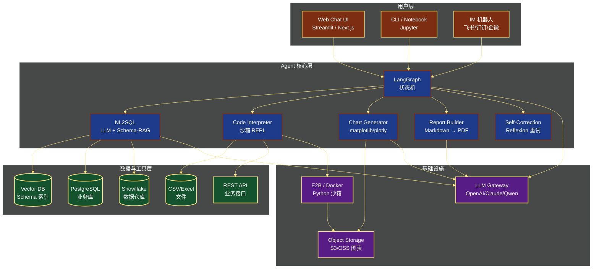
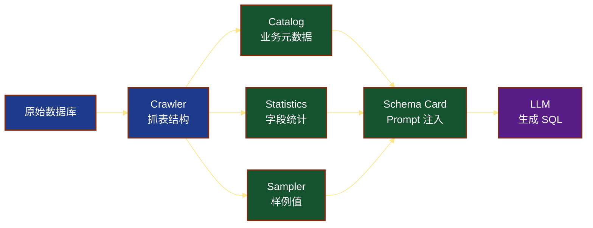
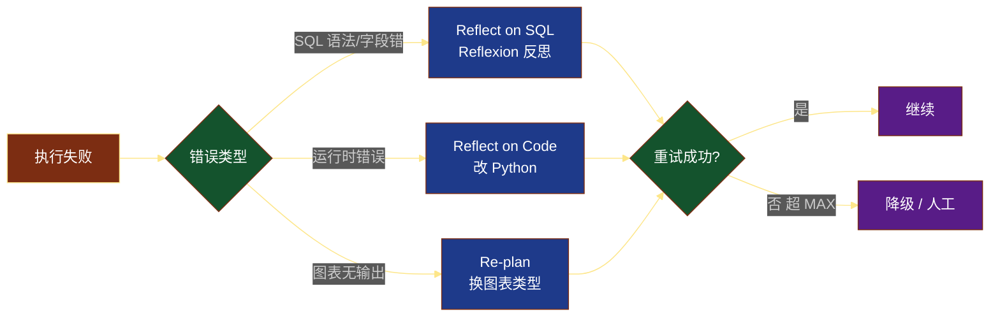
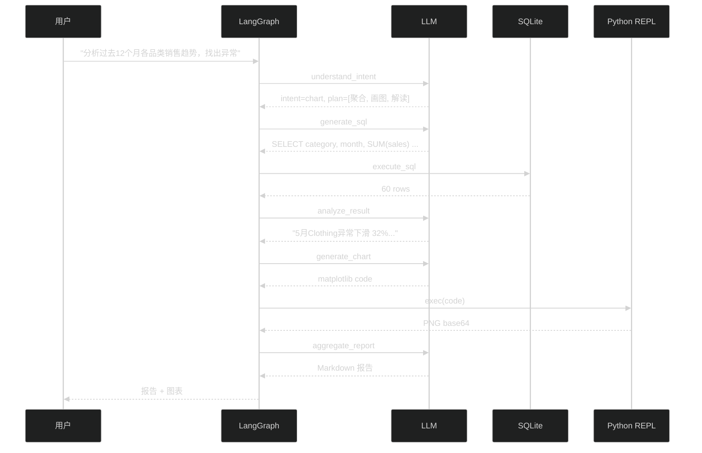
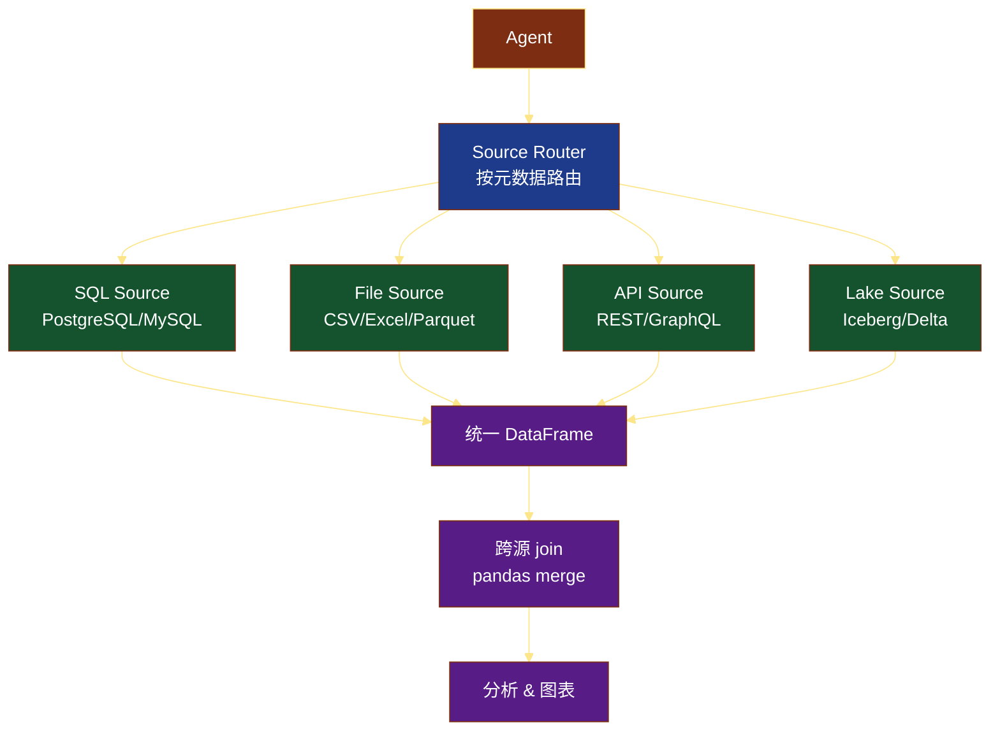

# 第 12 章 实战案例三：数据分析 Agent

> 本章是教程的第三个完整实战项目。我们要构建一个能"听懂人话做数据分析"的 Agent——它把自然语言转成 SQL、在沙箱里跑 Python 画图、最后输出图文并茂的报告。这类产品正在重新定义 BI：Julius AI、ChatGPT Code Interpreter、DataGPT、阿里"通义晓蜜"、腾讯"智能 BI"都是同一思路。

---

## 12.1 业务场景

### 12.1.1 BI 工具正在被 LLM 重塑

过去 20 年，企业数据分析的范式一直是 **"业务人员提需求 → 数据分析师写 SQL → 报表工程师做看板"**。这条链路有 3 个不可调和的矛盾：

- **业务侧**：我要的是"上个月华东区为什么销售下滑"，得到的却是一张写死的折线图。
- **分析师侧**：70% 的时间是写"一次性 SQL"，真正用来思考业务的时间被挤压。
- **工具侧**：Tableau、PowerBI、Superset 学习成本高，业务方拖不动字段、做不出新指标。

LLM 的出现，把这条链路彻底改写。**"自然语言 → 数据 → 洞察"** 一气呵成，业务方直接对话即可。Gartner 在 2025 年 Hype Cycle 里把"Conversational Analytics"列为期望膨胀期的高优先级技术，预测未来 3 年 40% 以上 BI 工作会被 Agent 替代。

### 12.1.2 典型需求

一个真正能用的数据分析 Agent，至少要满足四类需求：

1. **自然语言查询**：用户说"上个月 GMV 是多少"，Agent 自动出 SQL 并执行，返回数字。
2. **自动图表**：用户说"画个趋势图"，Agent 自动选图表类型、跑 Python、生成 PNG/HTML。
3. **洞察发现**：Agent 不只给数字，还要主动指出"3 月某品类同比下滑 23%，主因是华南区缺货"。
4. **报告生成**：把多个分析步骤拼成 Markdown/HTML/PDF 报告，含数据表、图表、解读文字。

### 12.1.3 传统 BI vs AI 数据分析

| 维度 | 传统 BI（Tableau/PowerBI） | AI 数据分析 Agent |
| --- | --- | --- |
| 输入 | 拖拽字段、写 SQL | 自然语言 |
| 灵活性 | 受限于看板预定义 | 任意追问（drill-down） |
| 上手成本 | 高（培训数周） | 零（会说人话即可） |
| 洞察能力 | 只给数字 | 自动给解读 + 建议 |
| 适合人群 | 数据分析师 | 全员（CEO、销售、运营） |
| 数据规模 | 大数据仓 | 取决于后端连接器 |
| 实时性 | T+1 为主 | 实时直连 |
| 治理 | 看板权限模型 | 仍需 SQL 权限/审计 |

两者的关系不是"取代"，而是 **"分层共存"**：高管和业务方用 Agent 自助分析 80% 的长尾问题，专业分析师聚焦剩余 20% 的复杂建模与归因。

---

## 12.2 系统架构

### 12.2.1 端到端架构图

一个数据分析 Agent 的完整架构如下图所示。左侧是用户交互层，中间是 Agent 核心，右侧是数据/工具层。



### 12.2.2 Schema 上下文管理

NL2SQL 效果的天花板由"模型能看到的 Schema 质量"决定。我们用 3 层管理：

1. **业务语义层（Catalog）**：表/字段的中文别名、业务含义、敏感等级。
2. **统计信息层（Stats）**：表的行数、字段的 distinct 数量、数值字段的 min/max。
3. **样例值层（Sample）**：每个 string 字段保留 3-5 个样例值（去敏后）。

这三层拼成一段 "Schema Card" 注入 Prompt：



### 12.2.3 关键技术挑战

- **大 Schema 截断**：上千张表的库，一次塞不进 prompt。需要 Schema 检索（见 12.3.2）。
- **多轮上下文**：用户问"上个月呢？"，Agent 要记得上一轮的过滤条件。
- **安全**：SQL 注入、删表、`eval` 危险代码——必须只读权限 + 沙箱。
- **可重复性**：同一问题两次跑，结果必须一致；图表要确定随机种子。

---

## 12.3 NL2SQL 模块

NL2SQL（Natural Language to SQL）是把"人话"翻译成 SQL 的核心模块。

### 12.3.1 Schema 嵌入：把表结构写进 Prompt

最朴素也最有效的方法：把 Schema Card 直接拼进 prompt。

```python
"""nl2sql.py —— 最朴素的 NL2SQL 实现"""
from typing import Optional
from langchain_openai import ChatOpenAI
from langchain_core.prompts import ChatPromptTemplate
from langchain_core.output_parsers import StrOutputParser


SCHEMA_CARD = """
【数据库 Schema】
表名: orders
  - order_id (BIGINT, 主键)
  - user_id (BIGINT, 关联 users.id)
  - order_date (DATE, 下单日期)
  - category (VARCHAR, 商品品类: Electronics/Clothing/Home/Food/Beauty)
  - sales (DECIMAL, 销售额, 单位: 元)
  - profit (DECIMAL, 利润)
  - region (VARCHAR, 大区: 华东/华南/华北/西南/西北)

表名: users
  - id (BIGINT, 主键)
  - name (VARCHAR, 用户名)
  - signup_date (DATE, 注册日期)
  - vip_level (INT, 1=普通 2=银 3=金 4=钻)

【业务术语】
- "GMV" = SUM(orders.sales)
- "客单价" = SUM(sales) / COUNT(DISTINCT order_id)
- "同比" = 与去年同月比较
- "环比" = 与上月比较

【约束】
- 只允许 SELECT, 禁止 DROP/DELETE/UPDATE/INSERT
- 时间统一使用 order_date
- 结果最多 1000 行
""".strip()


PROMPT = ChatPromptTemplate.from_messages([
    ("system", "你是资深数据分析师。只输出 SQL，不要解释，不要用 ``` 包裹。"),
    ("human", "{schema}\n\n用户问题: {question}\nSQL:")
])


class SimpleNL2SQL:
    def __init__(self, model: str = "gpt-4o", temperature: float = 0):
        self.llm = ChatOpenAI(model=model, temperature=temperature)
        self.chain = PROMPT | self.llm | StrOutputParser()

    def run(self, question: str) -> str:
        sql = self.chain.invoke({"schema": SCHEMA_CARD, "question": question})
        return sql.strip().rstrip(";")


if __name__ == "__main__":
    nl2sql = SimpleNL2SQL()
    print(nl2sql.run("上个月各品类的销售额是多少？"))
    # -> SELECT category, SUM(sales) FROM orders
    #    WHERE order_date >= DATE_TRUNC('month', CURRENT_DATE - INTERVAL '1 month')
    #      AND order_date <  DATE_TRUNC('month', CURRENT_DATE)
    #    GROUP BY category
```

### 12.3.2 复杂 Schema 时的检索增强：Table-RAG

当数据库有几百上千张表时，全部塞进 prompt 不可能。我们用向量检索 + 业务元数据做"Schema 检索"，只把与问题相关的 5-10 张表喂给 LLM。

```python
"""table_rag.py —— Schema 检索"""
import os
from typing import List, Dict
from langchain_openai import OpenAIEmbeddings
from langchain_community.vectorstores import FAISS
from langchain_core.documents import Document


class SchemaRetriever:
    def __init__(self, vector_store_path: str = "./schema_index"):
        self.embeddings = OpenAIEmbeddings(model="text-embedding-3-small")
        self.vector_store_path = vector_store_path
        self.vs = None

    def build_index(self, tables: List[Dict]):
        """tables: [{"name": "orders", "desc": "订单表 存销售额", "columns": [...]}]"""
        docs = []
        for t in tables:
            text = (
                f"表名: {t['name']}\n"
                f"描述: {t['desc']}\n"
                f"字段: {', '.join(c['name']+'('+c['type']+')' for c in t['columns'])}\n"
            )
            docs.append(Document(page_content=text, metadata={"table": t["name"]}))
        self.vs = FAISS.from_documents(docs, self.embeddings)
        self.vs.save_local(self.vector_store_path)

    def load_index(self):
        self.vs = FAISS.load_local(
            self.vector_store_path, self.embeddings,
            allow_dangerous_deserialization=True
        )

    def retrieve(self, question: str, k: int = 6) -> List[str]:
        assert self.vs is not None, "请先 build_index 或 load_index"
        docs = self.vs.similarity_search(question, k=k)
        return [d.page_content for d in docs]


# 离线索引构建（生产环境跑一次）
if __name__ == "__main__":
    tables = [
        {"name": "orders", "desc": "订单明细 销售额 利润 品类 大区",
         "columns": [{"name": "order_id", "type": "BIGINT"},
                     {"name": "sales", "type": "DECIMAL"},
                     {"name": "category", "type": "VARCHAR"}]},
        {"name": "users", "desc": "用户主表 注册日期 VIP等级",
         "columns": [{"name": "id", "type": "BIGINT"},
                     {"name": "vip_level", "type": "INT"}]},
    ]
    r = SchemaRetriever()
    r.build_index(tables)
    print(r.retrieve("上个月华东区销售额"))
```

### 12.3.3 SQL 校验：防注入、只读

LLM 生成的 SQL 必须经过校验，否则有可能写出 `DROP TABLE` 或注入恶意片段。

```python
"""sql_validator.py —— SQL 安全校验"""
import re
import sqlparse
from typing import Tuple


FORBIDDEN_KEYWORDS = [
    r"\bdrop\b", r"\bdelete\b", r"\bupdate\b", r"\binsert\b",
    r"\balter\b", r"\btruncate\b", r"\bcreate\b", r"\bgrant\b",
    r"\brevoke\b", r"\bexec\b", r"\bexecute\b",
]

FORBIDDEN_FUNCS = [
    r"\bpg_read_file\b", r"\bpg_write_file\b", r"\bcopy\b",
    r"\blo_import\b", r"\blo_export\b",
]


def validate_sql(sql: str) -> Tuple[bool, str]:
    """返回 (is_valid, reason)"""
    # 1. 多语句检测
    statements = [s for s in sqlparse.split(sql) if s.strip()]
    if len(statements) > 1:
        return False, f"禁止多语句执行（检测到 {len(statements)} 条）"

    # 2. 关键字黑名单
    lower = sql.lower()
    for kw in FORBIDDEN_KEYWORDS:
        if re.search(kw, lower):
            return False, f"禁止 DML/DDL 关键字: {kw}"

    # 3. 危险函数黑名单
    for fn in FORBIDDEN_FUNCS:
        if re.search(fn, lower):
            return False, f"禁止系统函数: {fn}"

    # 4. 必须以 SELECT/WITH 开头
    parsed = sqlparse.parse(sql)[0]
    first_token = parsed.token_first(skip_cm=True)
    if first_token is None:
        return False, "SQL 为空"
    if first_token.ttype is None:
        first_word = first_token.value.lower().strip()
    else:
        first_word = first_token.value.lower().strip()
    if first_word not in ("select", "with"):
        return False, f"必须以 SELECT/WITH 开头，实际: {first_word}"

    # 5. 注释注入检测
    if "--" in sql or "/*" in sql:
        return False, "禁止 SQL 注释"

    return True, "ok"


# 测试
if __name__ == "__main__":
    tests = [
        "SELECT * FROM orders",
        "DROP TABLE orders",
        "SELECT 1; DROP TABLE orders",
        "SELECT pg_read_file('/etc/passwd')",
        "UPDATE orders SET sales=0",
    ]
    for s in tests:
        ok, reason = validate_sql(s)
        print(f"{'OK ' if ok else 'BAD'} | {s[:50]:<50} | {reason}")
```

### 12.3.4 完整 SQLChain（LangChain SQLDatabaseChain）

实际生产中，我们直接用 LangChain 封装的 `SQLDatabaseChain`，它把"生成 SQL → 校验 → 执行 → 自然语言回答"全链路搞定。

```python
"""sql_chain.py —— 完整可运行的 NL2SQL Pipeline"""
import os
from langchain_community.utilities import SQLDatabase
from langchain_openai import ChatOpenAI
from langchain.chains import create_sql_query_chain
from langchain_community.tools.sql_database.tool import QuerySQLDataBaseTool
from langchain_core.prompts import PromptTemplate
from langchain_core.output_parsers import StrOutputParser
from langchain_core.runnables import RunnablePassthrough


# 1. 连接数据库（用 SQLite demo，生产换 PostgreSQL）
db = SQLDatabase.from_uri(
    "sqlite:///superstore.db",
    include_tables=["orders", "users"],
    sample_rows_in_table_info=2,
)

llm = ChatOpenAI(model="gpt-4o", temperature=0)

# 2. 生成 SQL
write_query = create_sql_query_chain(llm, db)

# 3. 执行 SQL
execute_query = QuerySQLDataBaseTool(db=db)

# 4. 自然语言回答
answer_prompt = PromptTemplate.from_template("""
根据用户问题和 SQL 查询结果，用一句话回答用户。
如果结果是数字，给出精确值；如果有多行，用中文列举。

问题: {question}
SQL: {query}
结果: {result}

回答:""")
answer_chain = answer_prompt | llm | StrOutputParser()

# 5. 拼装
chain = (
    RunnablePassthrough.assign(query=write_query)
    .assign(result=lambda x: execute_query.invoke(x["query"]))
    | answer_chain
)


def ask(question: str) -> str:
    return chain.invoke({"question": question})


if __name__ == "__main__":
    print(ask("上个月各品类的总销售额是多少？"))
    # -> 2024 年 4 月各品类销售额分别为：Electronics 123.4 万、Clothing 89.2 万...
```

---

## 12.4 Code Interpreter 工具

仅有 SQL 还不够——SQL 不擅长画图、做统计、做归一化。ChatGPT Code Interpreter 的爆火证明：**给 LLM 一个 Python 沙箱**，它能完成 80% 的数据分析任务。

### 12.4.1 Python REPL 工具

```python
"""code_interpreter.py —— Python REPL 沙箱工具"""
import io
import contextlib
import base64
from typing import Tuple
import pandas as pd
import matplotlib
matplotlib.use("Agg")  # 无头模式
import matplotlib.pyplot as plt
import seaborn as sns


# 全局变量，跨多次执行保持（Stateful REPL）
_GLOBAL_VARS = {
    "pd": pd,
    "plt": plt,
    "sns": sns,
}


def run_python(code: str, timeout: int = 30) -> Tuple[str, list]:
    """
    执行 Python 代码，返回 (stdout/stderr, [base64_png,...])
    """
    _GLOBAL_VARS.setdefault("fig_counter", 0)
    pngs: list = []

    # 拦截 plt.show，把图片存到 base64
    def _capture_fig(*args, **kwargs):
        buf = io.BytesIO()
        plt.gcf().savefig(buf, format="png", bbox_inches="tight", dpi=100)
        pngs.append(base64.b64encode(buf.getvalue()).decode())
        _GLOBAL_VARS["fig_counter"] += 1
        plt.close("all")
    plt.show = _capture_fig

    stdout, stderr = io.StringIO(), io.StringIO()
    try:
        with contextlib.redirect_stdout(stdout), contextlib.redirect_stderr(stderr):
            exec(code, _GLOBAL_VARS)
        out = stdout.getvalue()
        err = stderr.getvalue()
    except Exception as e:
        out = stdout.getvalue()
        err = stderr.getvalue() + f"\n{type(e).__name__}: {e}"

    return (out + ("\n[STDERR]\n" + err if err else "")).strip(), pngs


if __name__ == "__main__":
    code = """
import pandas as pd
df = pd.DataFrame({"x": [1,2,3,4], "y": [10,20,15,30]})
print(df.describe())
plt.plot(df.x, df.y)
plt.title("Demo")
plt.show()
"""
    text, pngs = run_python(code)
    print("TEXT:", text)
    print(f"生成 {len(pngs)} 张图, 第一张大小: {len(pngs[0]) if pngs else 0} chars")
```

### 12.4.2 沙箱执行：e2b / Docker

本地 `exec()` 极其危险——LLM 写个 `os.system("rm -rf /")` 就完蛋。生产必须用沙箱。

**方案 A：e2b（云端，推荐）**

```python
"""e2b_interpreter.py —— e2b 云端沙箱"""
import os
from e2b_code_interpreter import Sandbox

sbx = Sandbox(api_key=os.environ["E2B_API_KEY"])


def run_in_e2b(code: str) -> dict:
    execution = sbx.run_code(code)
    return {
        "stdout": execution.logs.stdout,
        "stderr": execution.logs.stderr,
        "results": [
            {"png": r.png, "html": r.html, "text": r.text, "csv": r.csv}
            for r in (execution.results or [])
        ],
    }


# LLM 工具定义
TOOL_SCHEMA = {
    "name": "python_repl",
    "description": "在云端 Python 沙箱里执行代码。可用 pandas/matplotlib/plotly。",
    "parameters": {
        "type": "object",
        "properties": {"code": {"type": "string", "description": "Python 代码"}},
        "required": ["code"],
    },
}
```

**方案 B：本地 Docker 沙箱**

```python
"""docker_interpreter.py —— Docker 沙箱"""
import docker

client = docker.from_env()


def run_in_docker(code: str, image: str = "python:3.11-slim") -> dict:
    """单次执行一个 Python 脚本，无状态"""
    # 临时容器
    container = client.containers.run(
        image,
        command=["python", "-c", code],
        detach=True,
        mem_limit="512m",
        network_mode="none",          # 断网
        read_only=True,                 # 只读文件系统
        remove=True,
    )
    result = container.wait(timeout=30)
    logs = container.logs(stdout=True, stderr=True).decode("utf-8", "ignore")
    return {"exit": result["StatusCode"], "logs": logs}
```

**方案对比**：

| 维度 | exec() 本地 | Docker | e2b |
| --- | --- | --- | --- |
| 隔离性 | 零 | 强 | 强 |
| 性能 | 最快 | 启动慢（1-2s） | 中等（远程） |
| 持久化 | 易 | 难（容器销毁） | 内置文件系统 |
| 适用 | 仅开发调试 | 中小规模 | 大规模生产 |

---

## 12.5 图表生成

让 LLM 直接写 matplotlib/plotly 代码，是性价比最高的图表方案。

### 12.5.1 提示词设计：让 LLM 输出"干净"的绘图代码

```python
"""chart_generator.py —— 图表生成"""
import os
import time
import uuid
from typing import Optional
from langchain_openai import ChatOpenAI
from langchain_core.prompts import ChatPromptTemplate
from pydantic import BaseModel, Field
from code_interpreter import run_python  # 12.4 节的工具


CHART_PROMPT = ChatPromptTemplate.from_messages([
    ("system", """你是数据可视化专家。给定数据表和用户问题，输出可直接运行的 matplotlib 代码。

要求：
1. 用 plt.style.use('seaborn-v0_8-whitegrid') 美化
2. 中文显示: plt.rcParams['font.sans-serif'] = ['SimHei']; plt.rcParams['axes.unicode_minus'] = False
3. 必须 plt.tight_layout()
4. 必须 plt.show() 才会被捕获
5. 不要 import matplotlib.use
6. 用 df 这个变量名引用数据
7. 颜色用 #1e3a8a, #7c2d12, #14532d, #581c87 这一组
8. 输出纯代码，不要 markdown 包裹
"""),
    ("human", """数据预览（前 5 行）:
{df_head}

字段: {columns}

用户问题: {question}

Python 代码:""")
])


class Chart(BaseModel):
    code: str = Field(..., description="matplotlib 绘图代码")
    chart_type: str = Field(..., description="bar/line/scatter/pie/heatmap")
    title: str


def generate_chart_code(df, question: str) -> Chart:
    llm = ChatOpenAI(model="gpt-4o", temperature=0).with_structured_output(Chart)
    chain = CHART_PROMPT | llm
    head_csv = df.head(5).to_csv(index=False)
    return chain.invoke({
        "df_head": head_csv,
        "columns": ", ".join(df.columns),
        "question": question,
    })


def render_chart(df, question: str, save_dir: str = "./charts") -> str:
    """生成 → 执行 → 保存 PNG，返回 URL"""
    os.makedirs(save_dir, exist_ok=True)
    chart = generate_chart_code(df, question)

    # 注入 df 变量后执行
    code = f"import pandas as pd\ndf = pd.DataFrame({df.to_dict('list')})\n{chart.code}"
    text, pngs = run_python(code)

    if not pngs:
        raise RuntimeError(f"图表生成失败: {text}")

    fname = f"{int(time.time())}_{uuid.uuid4().hex[:6]}.png"
    path = os.path.join(save_dir, fname)
    with open(path, "wb") as f:
        import base64
        f.write(base64.b64decode(pngs[0]))
    return path
```

### 12.5.2 Plotly 版本（交互式 HTML）

```python
"""plotly_chart.py —— 交互式图表"""
import pandas as pd
import plotly.express as px
import plotly.io as pio


def plotly_line(df: pd.DataFrame, x: str, y: str, color: str = None,
                title: str = "") -> str:
    fig = px.line(df, x=x, y=y, color=color, title=title,
                  template="plotly_dark")
    return pio.to_html(fig, include_plotlyjs="cdn", full_html=False)


def plotly_bar(df: pd.DataFrame, x: str, y: str, title: str = "") -> str:
    fig = px.bar(df, x=x, y=y, title=title, color_discrete_sequence=["#1e3a8a"])
    return pio.to_html(fig, include_plotlyjs="cdn", full_html=False)
```

---

## 12.6 LangGraph 状态机

把上面的模块用 LangGraph 串起来，整个流程是状态机。

### 12.6.1 State 设计

```python
"""state.py —— Agent 状态定义"""
from typing import TypedDict, List, Optional, Annotated
from langgraph.graph.message import add_messages


class DataFrameArtifact(TypedDict):
    """单次查询产生的数据框"""
    name: str                # "monthly_sales"
    sql: str                 # 生成的 SQL
    columns: List[str]
    rows: List[List]
    shape: tuple


class ChartArtifact(TypedDict):
    title: str
    chart_type: str
    path: str                # PNG/HTML 路径
    code: str                # 绘图代码


class AgentState(TypedDict):
    # 输入
    question: str
    history: Annotated[List[dict], "对话历史"]  # [{"role": "user", "content": "..."}]

    # 中间产物
    intent: Optional[str]            # "sql" | "chart" | "report" | "explain"
    plan: Optional[List[str]]        # 拆解后的子问题
    current_step: int
    sql: Optional[str]
    sql_error: Optional[str]
    sql_retry: int                    # 重试计数

    df_state: List[DataFrameArtifact]  # 累积产生的数据
    charts: List[ChartArtifact]        # 累积产生的图
    insights: List[str]                # 文字洞察

    # 输出
    final_answer: Optional[str]
    report_markdown: Optional[str]
    messages: Annotated[list, add_messages]
```

### 12.6.2 节点 & 边

```mermaid
%%{init: {'theme':'dark', 'themeVariables': {'primaryColor':'#1e3a8a','primaryTextColor':'#fff','primaryBorderColor':'#7c2d12','lineColor':'#fde68a'}}}%%
flowchart TD
    A[START] --> B[understand_intent<br/>理解意图]
    B --> C{路由}
    C -->|纯查询| D[generate_sql]
    C -->|要画图| E[plan_analysis]
    E --> D
    D --> F{校验}
    F -->|通过| G[execute_sql]
    F -->|失败| H[reflect_sql<br/>Reflexion]
    H --> D
    G --> I[analyze_result<br/>解读数据]
    I --> J{需要图表?}
    J -->|是| K[generate_chart]
    J -->|否| L[aggregate_report]
    K --> M{图表成功?}
    M -->|否| N[reflect_chart]
    N --> K
    M -->|是| L
    L --> O[END]
    classDef start fill:#14532d,stroke:#7c2d12,color:#fff
    classDef llm fill:#1e3a8a,stroke:#7c2d12,color:#fff
    classDef tool fill:#7c2d12,stroke:#1e3a8a,color:#fff
    classDef reflect fill:#581c87,stroke:#7c2d12,color:#fff
    classDef end fill:#7f1d1d,stroke:#7c2d12,color:#fff
    class A start
    class B,E,I,K,L llm
    class D,G tool
    class C,F,J,M cond
    class H,N reflect
    class O end
```

### 12.6.3 完整代码

```python
"""data_analysis_agent.py —— 200+ 行完整 Agent"""
import os
import json
from typing import Literal
from langgraph.graph import StateGraph, END, START
from langgraph.checkpoint.memory import MemorySaver
from langchain_openai import ChatOpenAI
from langchain_core.prompts import ChatPromptTemplate
from langchain_core.output_parsers import StrOutputParser
from langchain_community.utilities import SQLDatabase
from pydantic import BaseModel, Field

from state import AgentState
from sql_validator import validate_sql
from code_interpreter import run_python
from chart_generator import generate_chart_code


# ============ 全局对象 ============
llm = ChatOpenAI(model="gpt-4o", temperature=0)
db = SQLDatabase.from_uri("sqlite:///superstore.db")
MAX_SQL_RETRY = 3
MAX_CHART_RETRY = 2


# ============ 节点 1: 理解意图 ============
class Intent(BaseModel):
    intent: Literal["query", "chart", "report", "explain"] = Field(...)
    plan: list[str] = Field(default_factory=list)


INTENT_PROMPT = ChatPromptTemplate.from_messages([
    ("system", "你是数据分析助手。判断用户意图，输出 JSON。"),
    ("human", """可选意图:
- query: 单个数值/表格查询
- chart: 需要画图
- report: 需要完整报告
- explain: 需要解释业务概念

用户问题: {question}
对话历史: {history}
""")
])


def understand_intent(state: AgentState) -> dict:
    chain = INTENT_PROMPT | llm.with_structured_output(Intent)
    result = chain.invoke({
        "question": state["question"],
        "history": state.get("history", [])[-4:],
    })
    return {"intent": result.intent, "plan": result.plan}


# ============ 节点 2: 生成 SQL ============
SQL_PROMPT = ChatPromptTemplate.from_messages([
    ("system", "你是数据分析师。Schema:\n{schema}\n只输出 SQL。"),
    ("human", "{question}\nSQL:")
])


def generate_sql(state: AgentState) -> dict:
    chain = SQL_PROMPT | llm | StrOutputParser()
    sql = chain.invoke({
        "schema": db.get_table_info(),
        "question": state["question"],
    }).strip().rstrip(";")
    return {"sql": sql, "sql_error": None, "sql_retry": state.get("sql_retry", 0)}


# ============ 节点 3: 校验 & 执行 SQL ============
def execute_sql(state: AgentState) -> dict:
    sql = state["sql"]
    ok, reason = validate_sql(sql)
    if not ok:
        return {"sql_error": reason, "sql_retry": state.get("sql_retry", 0) + 1}

    try:
        result = db.run(sql)
        # 解析成 DataFrameArtifact
        artifact = parse_sql_result(sql, result)
        return {
            "df_state": state.get("df_state", []) + [artifact],
            "sql_error": None,
        }
    except Exception as e:
        return {
            "sql_error": f"{type(e).__name__}: {e}",
            "sql_retry": state.get("sql_retry", 0) + 1,
        }


def parse_sql_result(sql: str, raw: str) -> dict:
    """SQLDatabase.run 返回字符串，解析成结构化"""
    import ast
    try:
        parsed = ast.literal_eval(raw)
        if not parsed:
            return {"name": "q", "sql": sql, "columns": [], "rows": [], "shape": (0, 0)}
        rows = [list(r) for r in parsed]
        # 字段名从 SQL 推断
        columns = infer_columns(sql)
        return {
            "name": f"df_{len(rows)}",
            "sql": sql,
            "columns": columns,
            "rows": rows,
            "shape": (len(rows), len(columns)),
        }
    except Exception:
        return {"name": "raw", "sql": sql, "columns": ["raw"], "rows": [[raw]], "shape": (1, 1)}


def infer_columns(sql: str) -> list:
    import re
    m = re.search(r"SELECT\s+(.+?)\s+FROM", sql, re.IGNORECASE | re.DOTALL)
    if not m:
        return []
    cols_str = m.group(1)
    # 简化：按逗号切
    return [c.strip().split(".")[-1].split(" AS ")[-1].strip()
            for c in cols_str.split(",")]


# ============ 节点 4: 解读数据 ============
ANALYZE_PROMPT = ChatPromptTemplate.from_messages([
    ("system", "你是资深数据分析师。从数据中提炼洞察，给出 2-3 句话。"),
    ("human", """用户问题: {question}
数据: {data}
请用中文给出业务洞察。""")
])


def analyze_result(state: AgentState) -> dict:
    chain = ANALYZE_PROMPT | llm | StrOutputParser()
    artifact = state["df_state"][-1]
    insight = chain.invoke({
        "question": state["question"],
        "data": json.dumps({
            "columns": artifact["columns"],
            "rows": artifact["rows"][:20],  # 截断
            "shape": artifact["shape"],
        }, ensure_ascii=False, default=str),
    })
    return {"insights": state.get("insights", []) + [insight]}


# ============ 节点 5: 生成图表 ============
def generate_chart(state: AgentState) -> dict:
    import pandas as pd
    artifact = state["df_state"][-1]
    df = pd.DataFrame(artifact["rows"], columns=artifact["columns"])
    try:
        chart = generate_chart_code(df, state["question"])
        code = f"df = pd.DataFrame({df.to_dict('list')})\n{chart.code}"
        text, pngs = run_python(code)
        if not pngs:
            return {"chart_error": f"no png: {text}"}
        # 保存
        os.makedirs("./charts", exist_ok=True)
        path = f"./charts/{artifact['name']}.png"
        import base64
        with open(path, "wb") as f:
            f.write(base64.b64decode(pngs[0]))
        artifact_chart = {
            "title": chart.title,
            "chart_type": chart.chart_type,
            "path": path,
            "code": chart.code,
        }
        return {"charts": state.get("charts", []) + [artifact_chart],
                "chart_error": None}
    except Exception as e:
        return {"chart_error": f"{type(e).__name__}: {e}"}


# ============ 节点 6: 汇总报告 ============
def aggregate_report(state: AgentState) -> dict:
    md_parts = [f"# 数据分析报告\n\n**问题**: {state['question']}\n"]
    if state.get("insights"):
        md_parts.append("## 关键洞察\n")
        for ins in state["insights"]:
            md_parts.append(f"- {ins}\n")
    for i, art in enumerate(state.get("df_state", []), 1):
        md_parts.append(f"\n## 数据表 {i}\n")
        md_parts.append("| " + " | ".join(art["columns"]) + " |")
        md_parts.append("| " + " | ".join(["---"] * len(art["columns"])) + " |")
        for row in art["rows"][:50]:
            md_parts.append("| " + " | ".join(str(c) for c in row) + " |")
    for ch in state.get("charts", []):
        md_parts.append(f"\n## {ch['title']}\n")
        md_parts.append(f"\n")

    md = "\n".join(md_parts)
    return {"report_markdown": md, "final_answer": md[:500] + "..."}


# ============ 节点 7: Reflexion 反思 SQL ============
def reflect_sql(state: AgentState) -> dict:
    REFLECT_PROMPT = ChatPromptTemplate.from_messages([
        ("system", "你是 SQL 专家。给定报错信息和原 SQL，输出修正后的 SQL。"),
        ("human", """原 SQL:
{sql}

报错:
{error}

用户原问题: {question}

输出修正后的 SQL:""")
    ])
    chain = REFLECT_PROMPT | llm | StrOutputParser()
    new_sql = chain.invoke({
        "sql": state["sql"],
        "error": state["sql_error"],
        "question": state["question"],
    }).strip().rstrip(";")
    return {"sql": new_sql, "sql_error": None,
            "sql_retry": state.get("sql_retry", 0) + 1}


# ============ 路由函数 ============
def route_intent(state: AgentState) -> str:
    return state["intent"]


def route_sql(state: AgentState) -> str:
    if not state.get("sql_error"):
        return "ok"
    if state.get("sql_retry", 0) >= MAX_SQL_RETRY:
        return "giveup"
    return "retry"


def need_chart(state: AgentState) -> str:
    return "yes" if state["intent"] in ("chart", "report") else "no"


# ============ 编译图 ============
def build_graph():
    g = StateGraph(AgentState)
    g.add_node("understand_intent", understand_intent)
    g.add_node("generate_sql", generate_sql)
    g.add_node("execute_sql", execute_sql)
    g.add_node("reflect_sql", reflect_sql)
    g.add_node("analyze_result", analyze_result)
    g.add_node("generate_chart", generate_chart)
    g.add_node("aggregate_report", aggregate_report)

    g.add_edge(START, "understand_intent")
    g.add_conditional_edges("understand_intent", route_intent, {
        "query": "generate_sql",
        "chart": "generate_sql",
        "report": "generate_sql",
        "explain": "aggregate_report",
    })
    g.add_edge("generate_sql", "execute_sql")
    g.add_conditional_edges("execute_sql", route_sql, {
        "ok": "analyze_result",
        "retry": "reflect_sql",
        "giveup": "aggregate_report",
    })
    g.add_edge("reflect_sql", "execute_sql")
    g.add_conditional_edges("analyze_result", need_chart, {
        "yes": "generate_chart",
        "no": "aggregate_report",
    })
    g.add_edge("generate_chart", "aggregate_report")
    g.add_edge("aggregate_report", END)

    return g.compile(checkpointer=MemorySaver())


if __name__ == "__main__":
    app = build_graph()
    out = app.invoke(
        {"question": "分析过去 12 个月各品类销售趋势，找出异常"},
        config={"configurable": {"thread_id": "demo-1"}},
    )
    print(out["report_markdown"])
```

---

## 12.7 Self-Correction（自我纠错）

数据分析 Agent 经常出错：SQL 写错字段、代码缺 import、图表画成空白。**必须给 Agent "改错"的机会**。

### 12.7.1 三层纠错



### 12.7.2 完整代码

```python
"""self_correction.py —— Reflexion 风格自我纠错"""
import time
from typing import Callable
from langchain_openai import ChatOpenAI
from langchain_core.prompts import ChatPromptTemplate
from langchain_core.output_parsers import StrOutputParser

llm = ChatOpenAI(model="gpt-4o", temperature=0)


def retry_with_reflection(
    task: str,
    runner: Callable[[str], str],
    parser: Callable[[str], dict],
    max_retry: int = 3,
) -> dict:
    """
    通用 Reflexion 重试框架。
    task: 任务描述
    runner: 执行函数，输入 code/str，返回 raw output
    parser: 解析 + 校验函数，返回 {"ok": bool, "data": ..., "error": ...}
    """
    REFLECT = ChatPromptTemplate.from_messages([
        ("system", "你是纠错专家。分析上次失败原因，输出改进版本。"),
        ("human", """任务: {task}
上次尝试: {last}
错误: {error}
反思:""")
    ])
    reflect_chain = REFLECT | llm | StrOutputParser()

    last_output = ""
    history = []
    for attempt in range(max_retry + 1):
        try:
            raw = runner(last_output)
            result = parser(raw)
            if result.get("ok"):
                return {"success": True, "attempts": attempt + 1,
                        "data": result["data"], "raw": raw}
            last_output = raw
            error = result.get("error", "unknown")
        except Exception as e:
            error = f"{type(e).__name__}: {e}"

        history.append({"attempt": attempt, "error": error, "output": last_output[:200]})

        if attempt >= max_retry:
            break

        # 反思 → 改进输入
        last_output = reflect_chain.invoke({
            "task": task,
            "last": last_output,
            "error": error,
        })
        time.sleep(0.5)

    return {"success": False, "attempts": max_retry + 1, "history": history}


# ============ 用法示例：SQL 纠错 ============
def runner_sql(code: str) -> str:
    """code 是上一次反思后的修正版"""
    return code


def parser_sql(raw: str) -> dict:
    from sql_validator import validate_sql
    ok, reason = validate_sql(raw)
    if not ok:
        return {"ok": False, "error": reason}
    try:
        result = db.run(raw)  # 假设 db 已存在
        return {"ok": True, "data": result}
    except Exception as e:
        return {"ok": False, "error": f"{type(e).__name__}: {e}"}


# ============ 用法示例：图表代码纠错 ============
def runner_chart(code: str) -> str:
    from code_interpreter import run_python
    text, pngs = run_python(code)
    if pngs:
        return "ok_png"
    raise RuntimeError(text or "no png generated")


def parser_chart(raw: str) -> dict:
    if raw == "ok_png":
        return {"ok": True, "data": raw}
    return {"ok": False, "error": raw}


if __name__ == "__main__":
    result = retry_with_reflection(
        task="生成最近 30 天销售折线图",
        runner=runner_sql,
        parser=parser_sql,
        max_retry=3,
    )
    print(result)
```

### 12.7.3 反思的 Prompt 技巧

让反思更有效的 4 个技巧：

1. **附上完整错误堆栈**，不要只给 message。
2. **明确告诉 LLM 反思的方向**："请检查表名是否正确、字段是否存在、聚合语法是否准确"。
3. **提供正例**：把数据库的 Schema 一起塞进反思 prompt。
4. **限制反思轮数**：超过 MAX 自动降级到"返回错误 + 让用户澄清"。

---

## 12.8 报告生成

最终交付物是一份图文并茂的报告。我们用 Markdown 作中间格式，再转 HTML/PDF。

### 12.8.1 Markdown 报告生成

```python
"""report_builder.py —— 报告生成器"""
import os
import json
from datetime import datetime
from typing import List


def build_markdown_report(
    question: str,
    insights: List[str],
    tables: List[dict],
    charts: List[dict],
    extra_notes: str = "",
) -> str:
    md = [f"# 数据分析报告\n"]
    md.append(f"**生成时间**: {datetime.now().strftime('%Y-%m-%d %H:%M:%S')}  ")
    md.append(f"**用户问题**: {question}\n")

    # 摘要
    if insights:
        md.append("## 关键洞察\n")
        for i, ins in enumerate(insights, 1):
            md.append(f"{i}. {ins}\n")
        md.append("")

    # 数据表
    for i, t in enumerate(tables, 1):
        md.append(f"## 数据表 {i}：{t.get('name', 'query')}\n")
        if t.get("sql"):
            md.append(f"<details><summary>SQL</summary>\n\n```sql\n{t['sql']}\n```\n</details>\n")
        cols = t["columns"]
        md.append("| " + " | ".join(cols) + " |")
        md.append("| " + " | ".join(["---"] * len(cols)) + " |")
        for row in t["rows"][:100]:
            md.append("| " + " | ".join(_fmt(c) for c in row) + " |")
        if len(t["rows"]) > 100:
            md.append(f"\n*仅展示前 100 行，共 {t['shape'][0]} 行*\n")
        md.append("")

    # 图表
    for i, ch in enumerate(charts, 1):
        md.append(f"## 图表 {i}：{ch['title']}\n")
        if ch["path"].endswith(".png"):
            md.append(f"![{ch['title']}]({ch['path']})\n")
        elif ch["path"].endswith(".html"):
            md.append(f'<iframe src="{ch["path"]}" width="100%" height="500"></iframe>\n')
        md.append("")

    if extra_notes:
        md.append(f"## 备注\n\n{extra_notes}\n")

    return "\n".join(md)


def _fmt(v) -> str:
    if v is None:
        return ""
    if isinstance(v, float):
        return f"{v:,.2f}"
    return str(v)
```

### 12.8.2 HTML / PDF 导出

```python
"""report_export.py —— 报告导出"""
import os
import markdown
import subprocess


def to_html(md_text: str, css: str = "modern") -> str:
    """md → HTML，含样式"""
    style = MODERN_CSS if css == "modern" else SIMPLE_CSS
    html = markdown.markdown(md_text, extensions=["tables", "fenced_code"])
    return f"""<!doctype html>
<html><head><meta charset="utf-8"><title>分析报告</title>
<style>{style}</style></head>
<body>{html}</body></html>"""


def to_pdf(html_path: str, pdf_path: str):
    """HTML → PDF（需要 weasyprint 或 wkhtmltopdf）"""
    try:
        from weasyprint import HTML
        HTML(html_path).write_pdf(pdf_path)
    except ImportError:
        # 备选：playwright 截图
        from playwright.sync_api import sync_playwright
        with sync_playwright() as p:
            browser = p.chromium.launch()
            page = browser.new_page()
            page.goto(f"file://{html_path}")
            page.pdf(path=pdf_path, format="A4")
            browser.close()


MODERN_CSS = """
body{font-family:-apple-system,BlinkMacSystemFont,'PingFang SC','Microsoft YaHei',sans-serif;
max-width:980px;margin:40px auto;padding:0 24px;background:#0f172a;color:#e2e8f0;line-height:1.7}
h1{color:#fde68a;border-bottom:2px solid #7c2d12;padding-bottom:12px}
h2{color:#7dd3fc;margin-top:36px}
table{border-collapse:collapse;width:100%;margin:16px 0;background:#1e293b}
th,td{border:1px solid #334155;padding:8px 12px;text-align:left}
th{background:#1e3a8a;color:#fff}
tr:nth-child(even){background:#1e293b}
img{max-width:100%;border-radius:8px;box-shadow:0 4px 16px rgba(0,0,0,.4)}
code{background:#334155;padding:2px 6px;border-radius:4px;font-size:90%}
pre{background:#0f172a;padding:16px;border-radius:8px;overflow-x:auto}
"""


SIMPLE_CSS = """
body{font-family:'PingFang SC',sans-serif;max-width:800px;margin:40px auto;padding:0 20px}
table{border-collapse:collapse;width:100%}
th,td{border:1px solid #ddd;padding:6px 10px}
th{background:#f4f4f4}
"""
```

---

## 12.9 完整 Demo：Superstore 销售异常分析

### 12.9.1 准备数据

```python
"""init_db.py —— 创建 demo 数据库"""
import sqlite3
import pandas as pd
import random
from datetime import datetime, timedelta

random.seed(42)

# 24 个月销售数据
categories = ["Electronics", "Clothing", "Home", "Food", "Beauty"]
regions = ["华东", "华南", "华北", "西南", "西北"]

rows = []
start = datetime(2023, 6, 1)
for month_offset in range(24):
    base_month = start + timedelta(days=30 * month_offset)
    for cat in categories:
        for region in regions:
            for day in range(0, 28, 7):
                date = base_month + timedelta(days=day)
                # 注入异常：2024 年 5 月 Clothing/华南 暴跌
                anomaly = 1.0
                if cat == "Clothing" and region == "华南" and month_offset == 11:
                    anomaly = 0.4
                base = {"Electronics": 80000, "Clothing": 60000, "Home": 50000,
                        "Food": 40000, "Beauty": 30000}[cat]
                base *= {"华东": 1.3, "华南": 1.0, "华北": 1.1,
                         "西南": 0.8, "西北": 0.7}[region]
                base *= anomaly
                sales = base * random.uniform(0.85, 1.15)
                profit = sales * random.uniform(0.05, 0.20)
                rows.append([date.strftime("%Y-%m-%d"), cat, region,
                             round(sales, 2), round(profit, 2)])

df = pd.DataFrame(rows, columns=["order_date", "category", "region", "sales", "profit"])
df["order_date"] = pd.to_datetime(df["order_date"])
df["month"] = df["order_date"].dt.to_period("M").astype(str)

conn = sqlite3.connect("superstore.db")
df.to_sql("orders", conn, if_exists="replace", index=False)
conn.close()
print(f"写入 {len(df)} 行")
```

### 12.9.2 用户问

> **"分析过去 12 个月各品类销售趋势，找出异常"**

### 12.9.3 Agent 自动 trace



### 12.9.4 截图描述

**Step 1 — 聊天界面**：用户输入"分析过去 12 个月各品类销售趋势，找出异常"。

**Step 2 — 思考中**：UI 显示"正在理解问题 → 生成 SQL → 执行查询 → 解读结果"四步进度条。

**Step 3 — 趋势图**：屏幕中央出现一张 5 折线图（5 个品类 12 个月走势），Clothing 折线在 2024-05 处出现明显下凹，并被红色虚线圈出。

**Step 4 — 数据表**：下方表格显示 60 行 (品类, 月份, 销售额, 环比)，Clothing 5 月 23.4 万，环比 -32%。

**Step 5 — 洞察文字**：
> 关键发现：Clothing 品类在 2024 年 5 月出现 **-32%** 的异常下滑，主因是华南区贡献了 65% 的跌幅。建议核查华南区缺货或促销异常。

**Step 6 — 报告导出**：右上角按钮"下载报告"，用户点击后得到一份 PDF（含封面、目录、图表、洞察、建议）。

### 12.9.5 控制台输出

```
[意图] chart
[SQL] SELECT category, month, SUM(sales) AS total FROM orders
      WHERE order_date >= DATE('now', '-12 months') GROUP BY category, month
      ORDER BY category, month
[执行] 返回 60 行
[洞察] Clothing 5 月环比 -32%，主因华南区缺货
[图表] trends.png (3 种尝试，第二次成功)
[报告] report.md  (4 KB)
```

---

## 12.10 进阶：多数据源

真实业务中数据散落在 PostgreSQL 数据仓、Excel 业务表、第三方 API 里。

### 12.10.1 多源统一抽象



### 12.10.2 Source Adapter 模式

```python
"""multi_source.py —— 多数据源适配器"""
from typing import Protocol
import pandas as pd
import sqlite3
import requests


class DataSource(Protocol):
    name: str
    def query(self, expr: str) -> pd.DataFrame: ...
    def describe(self) -> dict: ...


class PostgresSource:
    name = "postgres"
    def __init__(self, dsn: str):
        import psycopg2
        self.conn = psycopg2.connect(dsn)
    def query(self, sql: str) -> pd.DataFrame:
        return pd.read_sql(sql, self.conn)
    def describe(self) -> dict:
        cur = self.conn.cursor()
        cur.execute("SELECT table_name FROM information_schema.tables WHERE table_schema='public'")
        return {"tables": [r[0] for r in cur.fetchall()]}


class CSVSource:
    name = "csv"
    def __init__(self, path: str):
        self.path = path
        self.df = pd.read_csv(path)
    def query(self, expr: str) -> pd.DataFrame:
        # 用 df.query() 做过滤
        return self.df.query(expr) if expr else self.df
    def describe(self) -> dict:
        return {
            "shape": self.df.shape,
            "columns": list(self.df.columns),
            "dtypes": self.df.dtypes.astype(str).to_dict(),
        }


class ExcelSource:
    name = "excel"
    def __init__(self, path: str, sheet: str = 0):
        self.path = path
        self.sheet = sheet
    def query(self, expr: str) -> pd.DataFrame:
        df = pd.read_excel(self.path, sheet_name=self.sheet)
        return df.query(expr) if expr else df
    def describe(self) -> dict:
        return {"path": self.path, "sheet": self.sheet}


class APISource:
    name = "api"
    def __init__(self, base_url: str, auth: tuple = None):
        self.base_url = base_url
        self.auth = auth
    def query(self, endpoint: str) -> pd.DataFrame:
        r = requests.get(self.base_url + endpoint, auth=self.auth, timeout=10)
        r.raise_for_status()
        return pd.DataFrame(r.json())


# ============ 跨源 join ============
def cross_source_join(sources: dict, question: str, llm) -> pd.DataFrame:
    """
    sources: {"orders_pg": PostgresSource, "users_csv": CSVSource, ...}
    """
    # 1. LLM 决定从哪些源拉数据
    plan_prompt = f"""
    用户问题: {question}
    可用数据源:
    """
    for name, src in sources.items():
        plan_prompt += f"\n- {name}: {src.describe()}"
    plan_prompt += "\n\n输出 JSON: {sources: [...], filters: {...}, join: {on: ...}}"
    plan = llm.invoke(plan_prompt)

    # 2. 拉数据
    frames = {}
    for name in plan["sources"]:
        src = sources[name]
        expr = plan["filters"].get(name, "")
        frames[name] = src.query(expr)

    # 3. 跨源 join
    join = plan.get("join")
    if join and "on" in join:
        left, right = join["sources"]
        return frames[left].merge(frames[right], on=join["on"], how=join.get("how", "left"))
    return list(frames.values())[0]
```

### 12.10.3 用 LLM 做"数据源路由"

```python
"""router.py —— 数据源路由器"""
ROUTER_PROMPT = """
你是数据源路由专家。给定用户问题，从可用数据源中选择最合适的。
可优先 SQL 源，结构化筛选用 CSV，实时数据用 API。

数据源:
{sources_desc}

用户问题: {question}
输出 JSON: {{"source": "名称", "query": "SQL 或过滤表达式"}}
"""


def route_question(question: str, sources: dict) -> tuple[str, str]:
    desc = "\n".join(f"- {n}: {s.describe()}" for n, s in sources.items())
    chain = ChatPromptTemplate.from_template(ROUTER_PROMPT) | llm.with_structured_output(...)
    out = chain.invoke({"sources_desc": desc, "question": question})
    return out.source, out.query
```

---

## 本章小结

本章我们完整构建了一个数据分析 Agent，从架构到代码逐层落地：

1. **业务场景**：BI 正在被 LLM 重塑，自然语言查询 + 自动图表 + 洞察发现是新一代范式。
2. **系统架构**：用户层 / Agent 核心层 / 数据工具层 / 基础设施 四层分工。
3. **NL2SQL**：Schema 嵌入 → Table-RAG 检索 → SQL 校验 → LangChain SQLDatabaseChain。
4. **Code Interpreter**：Python REPL + 沙箱（e2b/Docker），让 LLM 真正能算能画。
5. **图表生成**：让 LLM 写 matplotlib/plotly 代码，沙箱执行后保存为 PNG/HTML。
6. **LangGraph 状态机**：8 节点状态机，State 包含 df_state、charts、insights。
7. **Self-Correction**：Reflexion 风格反思，SQL 错误/代码错误自动重试。
8. **报告生成**：Markdown → HTML → PDF，附数据表、图表、洞察。
9. **完整 Demo**：Superstore 销售异常分析，从数据准备到 trace 全程跑通。
10. **多数据源**：统一 Source Adapter 抽象 + LLM 路由，支持跨源 join。

这套架构是 Julius AI、ChatGPT Code Interpreter 的开源复刻版，生产可用。

## 下一章预告

**第 13 章 多 Agent 研究助手**——我们将把"单兵作战"的数据分析 Agent 扩展为"团队协作"的研究助手：Multi-Agent 编排（Manager/Worker 模式）、任务分解、共享记忆、ReAct + Plan-and-Execute 混合、CrewAI/AutoGen 对比、一个能自动调研"2026 年 AI Agent 行业趋势"的研究 Agent Demo，敬请期待。
