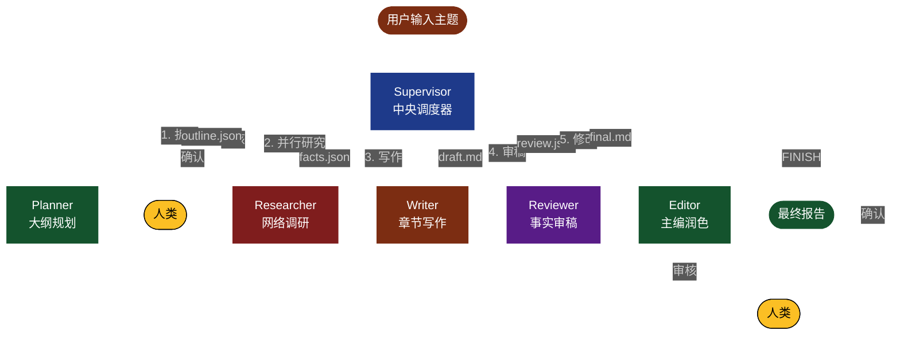
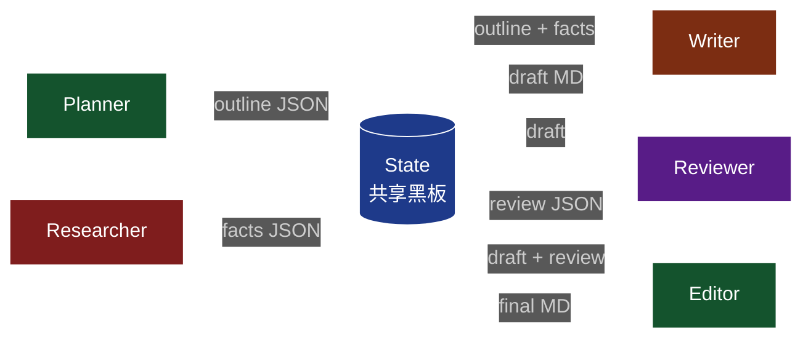
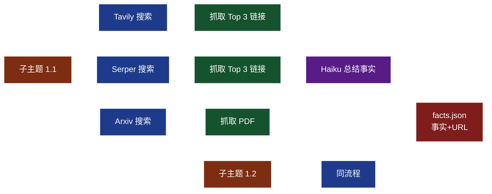
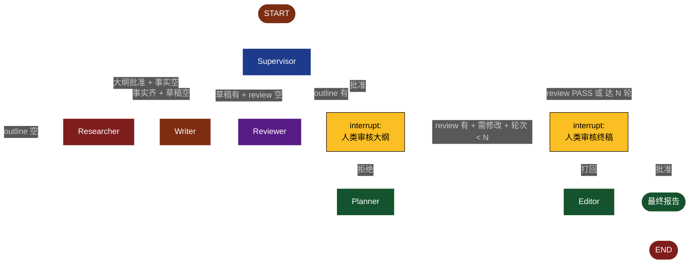
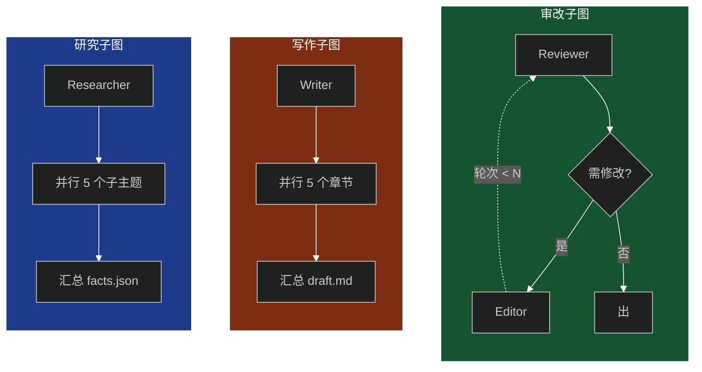
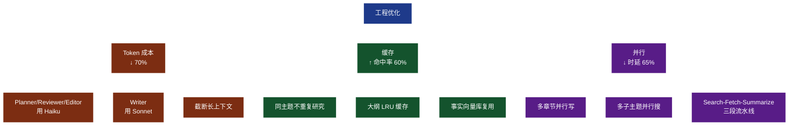
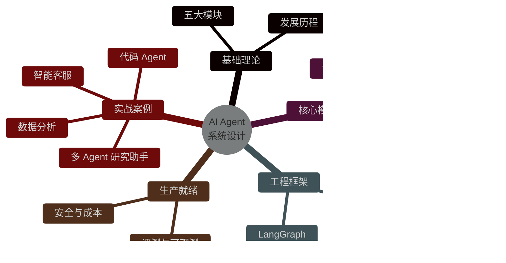
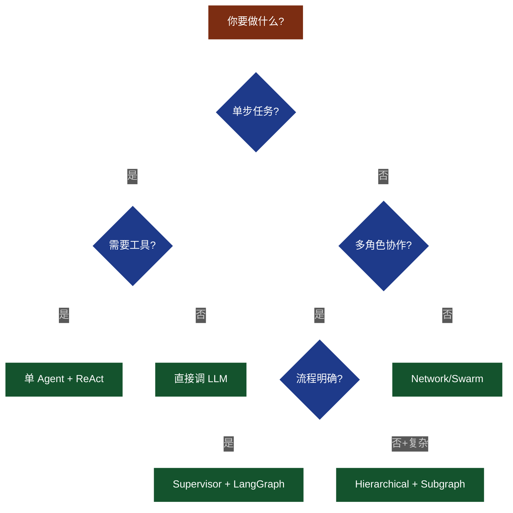

# 第 13 章 实战案例四：多 Agent 协作研究助手

> 综合运用第 7 章的多 Agent 思想，搭建一支"AI 研究编辑团队"——给它一个主题，自动完成调研、写作、审稿、修改。

---

## 13.1 业务需求

### 13.1.1 真实场景

想象一个研究分析师的日常工作：老板发来一个题目——《2026 年 AI Agent 行业研究报告》，要求 5000 字、面向投资机构、引用要可追溯。一篇这样的报告，传统流程至少需要 3-5 天：

1. 拆解大纲，列出 5-8 个子主题
2. 上网搜资料、抓网页、整理 30+ 条事实
3. 写初稿，组织章节、引证数据
4. 反复审稿：事实是否对、逻辑是否通、引用是否准
5. 主编润色：错别字、风格统一、金句优化

**如果让 AI 团队干这件事**：输入主题 → 几分钟后拿到结构化报告 PDF/Markdown。这就是本章要做的"研究助手"。

更具体地说，"研究助手"覆盖的痛点包括：

- **认知带宽有限**：单个分析师要持续追踪 10+ 个垂直领域，会出现"每个领域都知道一点，但都不深"
- **资料分散**：高质量信息分布在 Gartner、IDC、CB Insights、企业财报、学术论文、媒体专访等渠道，靠人肉拼装效率极低
- **质量不稳定**：审稿依赖个人状态、心情、经验；同一主题让 3 个不同分析师来写，质量和风格可能差异很大
- **复用困难**：报告写完即弃，下次相同主题又要重头来

我们的目标是：让"研究助手"在 5 分钟内完成 80% 的机械工作（搜索、拼装、初稿），把分析师解放出来做 20% 的高价值工作（决策、解读、终审）。这就是"AI 协作"而非"AI 替代"的核心思想。

### 13.1.2 输入与输出

| 项 | 说明 |
| --- | --- |
| 输入 | 主题（如 "2026 年 AI Agent 行业趋势"） |
|      | 字数要求（默认 5000 字） |
|      | 风格（投资 / 学术 / 科普） |
|      | 引用开关（是否要求可追溯引用） |
| 输出 | 结构化 Markdown 报告 |
|      | 引用清单（每条事实标注来源 URL） |
|      | 评估报告（事实性、完整性、逻辑性评分） |
|      | 可选：PDF（用 `weasyprint` 或 `pandoc` 转换） |

### 13.1.3 对标产品

| 产品 | 公司 | 模式 | 优势 | 不足 |
| --- | --- | --- | --- | --- |
| **GPT Researcher** | 开源社区 | 多 Agent 并行研究 + 写作 | 全开源、可本地化 | 缺审稿环节、引用链路弱 |
| **Perplexity Pro** | Perplexity | 单 Agent + 搜索 + 引用 | 实时性好、引用清晰 | 深度研究能力有限 |
| **STORM** | Stanford | 大纲→子主题→多轮搜索→写作 | 模拟维基百科式写作 | 无反馈循环、风格单一 |
| **OpenAI Deep Research** | OpenAI | o3 推理 + 浏览器工具 | 推理深、引用全 | 闭源、成本高、不可定制 |
| **本章系统（DeepResearch-Pro）** | 自研 | Supervisor + 5 Agent + HITL + 反馈循环 | 流程可控、可调试、可扩展 | 需自己实现搜索/审稿逻辑 |

我们这套系统的差异化在于：**可调试 + 反馈循环 + 人机协同**。每一段产出、每一次路由都能在 LangSmith 里看到，生产出问题时能定位到具体 Agent 和 Prompt。

### 13.1.4 非功能需求

| 维度 | 目标 |
| --- | --- |
| 报告质量 | 事实性 ≥ 90%、逻辑清晰、引用 100% 可追溯 |
| 时延 | 5000 字报告 ≤ 5 分钟（含搜索） |
| 成本 | 单次任务 ≤ $0.5（用 Haiku + Sonnet 混合） |
| 可观测 | 每次运行有完整 trace，可回放任意 Agent 输出 |
| 人工介入 | 大纲 / 终稿必经人工审核，1 小时内可审完 |

### 13.1.5 与传统报告生产流程的对比

| 维度 | 传统人工流程 | DeepResearch-Pro |
| --- | --- | --- |
| 时延 | 3-5 天 | 3-5 分钟 |
| 单次成本 | ¥5000-10000（人力） | $0.3-0.5（API） |
| 引用准确率 | 70-85%（靠人工核对） | ≥ 95%（自动校验） |
| 风格一致性 | 弱（多人协作难统一） | 强（统一 Prompt） |
| 复用 | 报告写完即弃 | 大纲 / 事实可缓存 |
| 错误回溯 | 困难（PPT 改了 5 版不知道为啥） | 易（LangSmith 全量 trace） |

需要强调的是：AI 写报告**不是要替代分析师**，而是把分析师从"搜资料 + 拼凑句子"中解放出来，让他们专注"判断 + 决策 + 解读"——这才是 AI 协作的真正价值。


---

## 13.2 多 Agent 架构

### 13.2.1 整体架构图

我们采用 **Supervisor 模式**——一个中央调度器加 5 个专业 Agent。每个 Agent 职责单一，prompt 简短聚焦，输出格式稳定。



### 13.2.2 五个 Agent 的职责矩阵

| Agent | 输入 | 输出 | 关键能力 | 典型 LLM |
| --- | --- | --- | --- | --- |
| **Planner** | 主题 + 字数 + 风格 | 结构化大纲 JSON | 拆题、结构化输出 | Sonnet |
| **Researcher** | 大纲子主题 × N | facts.json（带 URL） | 搜索、抓取、总结 | Haiku（多并发） |
| **Writer** | 大纲 + facts | 章节 Markdown | 长文写作、引用归因 | Sonnet |
| **Reviewer** | 章节草稿 | review.json（评分 + 建议） | 事实校验、逻辑分析 | Sonnet |
| **Editor** | 草稿 + review | final.md | 风格统一、语言润色 | Sonnet |

### 13.2.3 状态机视角

整个流程可视为有限状态机：每个 Agent 是一次状态转移，Supervisor 是"调度函数"。下表是核心转移：

| 当前状态 | 下一状态 | 触发条件 |
| --- | --- | --- |
| `INIT` | `PLANNING` | 用户提交 |
| `AWAIT_OUTLINE` | `RESEARCHING` | 人类确认大纲 |
| `RESEARCHING` | `WRITING` | 所有子主题已研究 |
| `WRITING` | `REVIEWING` | 草稿已写完 |
| `REVIEWING` | `REVISING` | review 有问题且未达 max_round |
| `REVIEWING` | `EDITING` | review PASS 或 达 max_round |
| `AWAIT_FINAL` | `DONE` | 人类确认终稿 |

> 注：本章我们把"人类审核"建模为图中的 `interrupt` 节点（详见 13.9）。完整状态机用 LangGraph 实现，详见 13.8。

### 13.2.4 Agent 通信协议

5 个 Agent 之间通过共享 State 通信。控制信号（如"还需修改"、"达到最大轮次"）用结构化字段，传递内容（事实清单、草稿）用自然语言/Markdown。



**协议细节**：

- Planner → State：写入 `outline`（含子主题 + 关键词 + 目标字数）
- Researcher → State：写入 `facts_by_subtopic`，每条 fact 含 `content + source_url + confidence`
- Writer → State：写入 `drafts`，每章含 `markdown + references[]`
- Reviewer → State：写入 `reviews`，每章含 4 维评分 + `needs_revision` 布尔 + `revision_suggestions[]`
- Editor → State：修改 `drafts` 中需要重写的章节，更新 `revise_round`

这种"黑板模式"是 LangGraph `StateGraph` 的天然支持：所有节点读写同一个 `TypedDict`，无需手写消息队列。

---

## 13.3 Planner Agent

### 13.3.1 职责

把模糊的"主题"拆成可执行的研究任务。Planner 只做一件事：**把主题变成结构化大纲**。它**不**搜索、**不**写作、**不**审稿，专注拆题。

### 13.3.2 大纲 JSON Schema

我们用 Pydantic 定义严格 schema，确保下游 Researcher / Writer 拿到的是结构化、可校验的输入。

```python
"""
13.3 Planner Agent —— 把主题拆成结构化大纲
依赖：pip install langchain-openai pydantic
"""
import json
from typing import List
from pydantic import BaseModel, Field
from langchain_openai import ChatOpenAI
from langchain_core.messages import SystemMessage, HumanMessage

# ===== 1) Pydantic Schema：大纲 =====
class SubTopic(BaseModel):
    """子主题：可被 Researcher 并行研究"""
    id: str = Field(description="子主题编号，如 '1.1'")
    title: str = Field(description="子主题标题")
    description: str = Field(description="一句话说明研究什么、为什么重要")
    search_queries: List[str] = Field(description="3-5 个搜索关键词")
    target_word_count: int = Field(description="该章节目标字数")


class Outline(BaseModel):
    """完整报告大纲"""
    title: str = Field(description="报告主标题")
    executive_summary_brief: str = Field(description="执行摘要的研究方向说明（150字内）")
    sections: List[SubTopic] = Field(description="5-8 个子主题章节", min_length=3, max_length=10)
    conclusion_brief: str = Field(description="结论部分的研究方向说明")


# ===== 2) Planner 函数 =====
PLANNER_SYS = """你是一名资深的报告主编（Chief Editor）。

你的任务：把用户给的主题拆成一份**结构化大纲**，供下游研究员和作家使用。

要求：
1. 子主题数量 5-8 个，覆盖：背景/现状 → 关键趋势 → 挑战/风险 → 未来展望
2. 每个子主题 3-5 个英文/中文搜索关键词（混合中英）
3. 字数按用户要求分配（默认 5000 字），允许 ±20% 浮动
4. 子主题之间**有逻辑递进关系**，不是并列
5. 必须返回合法 JSON，不要任何解释性文字"""


def plan_outline(topic: str, word_count: int = 5000, style: str = "投资") -> Outline:
    """
    Planner 主函数：把主题变成结构化 Outline
    """
    llm = ChatOpenAI(
        model="gpt-4o-mini",  # Planner 用 mini 即可，拆题不需要最强推理
        temperature=0.3,
        model_kwargs={"response_format": {"type": "json_object"}},
    )
    user_prompt = f"""主题：{topic}
目标字数：{word_count} 字
目标读者：{style} 风格

请按以下 JSON Schema 返回大纲：
{{
  "title": "...",
  "executive_summary_brief": "...",
  "sections": [
    {{
      "id": "1.1",
      "title": "...",
      "description": "...",
      "search_queries": ["...", "..."],
      "target_word_count": 600
    }}
  ],
  "conclusion_brief": "..."
}}"""
    out = llm.invoke([SystemMessage(content=PLANNER_SYS),
                      HumanMessage(content=user_prompt)])
    # 用 Pydantic 强校验，LLM 输出不对就抛错
    data = json.loads(out.content)
    return Outline(**data)


# ===== 3) 测试 =====
if __name__ == "__main__":
    outline = plan_outline("2026 年 AI Agent 行业趋势", word_count=5000, style="投资")
    print(f"报告标题：{outline.title}\n")
    print(f"执行摘要方向：{outline.executive_summary_brief}\n")
    print(f"子主题数量：{len(outline.sections)}\n")
    for s in outline.sections:
        print(f"  [{s.id}] {s.title}（目标 {s.target_word_count} 字）")
        print(f"    描述：{s.description}")
        print(f"    关键词：{s.search_queries}\n")
```

### 13.3.3 关键设计

| 设计点 | 原因 |
| --- | --- |
| `response_format={"type": "json_object"}` | OpenAI 原生 JSON 模式，解析可靠 |
| Pydantic 强校验 | LLM 偶尔会漏字段，强校验能立即发现 |
| `min_length=3, max_length=10` | 防止子主题太少（研究不充分）或太多（爆 token） |
| `temperature=0.3` | Planner 要稳定，不要太多发散 |
| 关键词混合中英 | 国内国外资料都覆盖（行业报告常需英文一手数据） |

### 13.3.4 拆题的原则

好的大纲是高质量报告的一半。Planner 要遵循以下原则：

1. **MECE 原则**：子主题之间相互独立（Mutually Exclusive），合起来穷尽（Collectively Exhaustive）。避免"市场规模"和"增长趋势"两个高度重叠的子主题。
2. **逻辑递进**：子主题之间要有逻辑顺序（背景→现状→问题→趋势），不是简单并列。
3. **数据可获得**：每个子主题的搜索关键词应该能搜到具体数据，避免"未来 10 年的范式革命"这种搜不到具体数据的大词。
4. **字数均衡**：每章字数差异不超过 30%，否则报告头重脚轻。
5. **风格匹配**：投资风格重数据和市场规模，学术风格重方法和文献综述，科普风格重例子和类比。

### 13.3.5 失败兜底

LLM 不是 100% 可靠。Planner 可能输出：

- 子主题数量 < 3（太少）
- 关键词为空（Researcher 没法搜）
- 字数总和与要求不符
- 子主题描述全是空话（如"研究市场现状"）

我们的应对：

- **Pydantic 校验**直接抛异常，让 Supervisor 看到错误并决定重跑 Planner
- **`min_length=3, max_length=10`** 在 schema 层面强制范围
- **总字数一致性检查**：在 Planner 输出后加一个校验函数，确保 `sum(target_word_count) ≈ word_count`
- **重试 + 降级**：如果 Planner 连续失败 2 次，自动用 Haiku 重写关键词补充

---

## 13.4 Researcher Agent

### 13.4.1 职责

按 Planner 给的子主题，**并行**调搜索、抓网页、总结事实，输出"事实清单 JSON"——每条事实带原文 URL。

### 13.4.2 工作流



### 13.4.3 完整代码（asyncio 并发）

```python
"""
13.4 Researcher Agent —— 并行搜索 + 抓取 + 总结
依赖：pip install tavily-python httpx beautifulsoup4 langchain-openai
环境变量：TAVILY_API_KEY, SERPER_API_KEY（可选）
"""
import os
import asyncio
import json
from typing import List
from pydantic import BaseModel, Field
from tavily import TavilyClient
from langchain_openai import ChatOpenAI
import httpx
from bs4 import BeautifulSoup


# ===== 1) 数据结构 =====
class Fact(BaseModel):
    """单条事实"""
    content: str = Field(description="事实陈述句")
    source_url: str = Field(description="来源 URL")
    source_title: str = Field(description="来源标题")
    confidence: float = Field(description="置信度 0-1", ge=0, le=1)


class SubTopicFacts(BaseModel):
    """一个子主题的事实清单"""
    sub_topic_id: str
    facts: List[Fact]


# ===== 2) 搜索 + 抓取 + 总结 =====
class Researcher:
    def __init__(self, max_facts_per_topic: int = 8):
        self.tavily = TavilyClient(api_key=os.getenv("TAVILY_API_KEY"))
        self.summarizer = ChatOpenAI(model="gpt-4o-mini", temperature=0.2)  # 总结用 mini
        self.max_facts = max_facts_per_topic

    def _search(self, query: str, max_results: int = 5) -> List[dict]:
        """Tavily 搜索：返回 [{url, title, content, score}, ...]"""
        try:
            res = self.tavily.search(query=query, max_results=max_results,
                                      include_raw_content=True)
            return res.get("results", [])
        except Exception as e:
            print(f"[Search] {query} 失败：{e}")
            return []

    async def _fetch_and_summarize(self, query: str, sub_topic_title: str) -> SubTopicFacts:
        """单子主题：搜索 → 抓取 → 总结"""
        # 1) 搜索：拿 Top 5 链接
        loop = asyncio.get_event_loop()
        results = await loop.run_in_executor(None, self._search, query)

        if not results:
            return SubTopicFacts(sub_topic_id="", facts=[])

        # 2) 抓取每条 raw_content（截断 3000 字避免爆 token）
        snippets = []
        for r in results[:5]:
            raw = (r.get("raw_content") or r.get("content") or "")[:3000]
            snippets.append({
                "url": r["url"],
                "title": r.get("title", ""),
                "content": raw,
            })

        # 3) 用 LLM 抽取事实
        joined = "\n\n---\n\n".join(
            f"【来源 {i+1}】{s['title']}\nURL: {s['url']}\n内容: {s['content']}"
            for i, s in enumerate(snippets)
        )
        prompt = f"""你是研究员。基于以下网页内容，抽取与子主题《{sub_topic_title}》相关的关键事实。

要求：
1. 每条事实**必须**有具体数据/案例，禁止"有研究表明"这种空话
2. 每条标注置信度（0-1），URL 信息要从对应来源复制
3. 最多 {self.max_facts} 条，按重要性排序
4. 输出 JSON 数组，每条格式：
   {{"content": "...", "source_url": "...", "source_title": "...", "confidence": 0.X}}

网页内容：
{joined}

只返回 JSON 数组，不要其他文字。"""

        out = await self.summarizer.ainvoke(prompt)
        try:
            data = json.loads(out.content)
            facts = [Fact(**f) for f in data[:self.max_facts]]
        except Exception as e:
            print(f"[Summarize] 解析失败：{e}\n原始：{out.content[:200]}")
            facts = []

        return SubTopicFacts(sub_topic_id="", facts=facts)

    async def research_sub_topics(self, sub_topics: List[dict]) -> List[SubTopicFacts]:
        """并行研究多个子主题"""
        tasks = []
        for st in sub_topics:
            # 每个子主题跑多个 query，最后合并
            queries = st.get("search_queries", [])
            if not queries:
                continue
            # 用第一个 query 当主 query（也可合并多个 query 后再搜）
            primary_query = " ".join(queries[:2])
            tasks.append(self._fetch_and_summarize(primary_query, st["title"]))

        results = await asyncio.gather(*tasks, return_exceptions=True)

        # 把 id 写回去，并过滤异常
        facts_list = []
        for st, res in zip(sub_topics, results):
            if isinstance(res, Exception):
                print(f"[Research] {st['id']} 失败：{res}")
                facts_list.append(SubTopicFacts(sub_topic_id=st["id"], facts=[]))
            else:
                res.sub_topic_id = st["id"]
                facts_list.append(res)

        return facts_list


# ===== 3) 测试 =====
async def main():
    researcher = Researcher(max_facts_per_topic=6)
    sub_topics = [
        {
            "id": "1.1",
            "title": "AI Agent 行业市场规模与增长",
            "search_queries": ["AI agent market size 2026", "AI agent industry report 2025",
                               "AI 智能体 市场规模 2026"],
        },
        {
            "id": "1.2",
            "title": "主要厂商与生态格局",
            "search_queries": ["AI agent companies 2026", "OpenAI Anthropic agent market share"],
        },
    ]
    facts = await researcher.research_sub_topics(sub_topics)
    for f in facts:
        print(f"\n=== {f.sub_topic_id} ===")
        for fact in f.facts:
            print(f"  • {fact.content[:100]}...（{fact.source_url}）")


if __name__ == "__main__":
    asyncio.run(main())
```

### 13.4.4 关键设计

| 设计点 | 原因 |
| --- | --- |
| `asyncio.gather` 并发 | 5 个子主题同时研究，从 5×30s 缩短到 ~30s |
| `run_in_executor` 包裹同步搜索 | Tavily SDK 是同步的，不能直接 await |
| 总结用 `gpt-4o-mini` | 抽取事实不需要最强模型，省钱 30× |
| 截断 raw_content 3000 字 | 避免单网页过长导致 prompt 爆炸 |
| `confidence` 字段 | Reviewer 后续可基于此做事实置信度筛选 |
| `return_exceptions=True` | 单个子主题失败不影响整体流程 |

### 13.4.5 多搜索引擎策略

单一搜索源有偏差——Tavily 偏英文，Serper 偏 SEO 优化结果，Arxiv 偏学术。生产环境我们通常**多源融合**：

- **Tavily**：默认主力，返回结果质量高、有 raw_content
- **Serper（Google SerpAPI）**：补充中文资料、新闻时效
- **Bing Search**：补充国内可见性
- **Arxiv**：学术、论文

融合策略：每个 query 并发跑 2 个搜索引擎，按 `score` 排序去重，Top 5 给 LLM 总结。

**为什么不用单一 Google？** Google Search API 已被 SerpAPI 等三方服务代理，Serper 又是 SerpAPI 的一个子集——本质都是 Google 结果。直接用 Google Custom Search API 价格反而更贵。

**为什么需要中文资料？** 行业报告常常需要国内政策、本土厂商案例（如阿里、字节），这些在 Tavily（偏英文）里几乎搜不到。必须用 Serper 或 Bing 补。

**为什么需要 Arxiv？** 学术研究报告（如"AI Agent 未来 5 年技术路线"）需要引学术论文。Tavily 和 Serper 都不索引 Arxiv PDF。

### 13.4.6 失败重试与降级

搜索可能失败（限流、超时、内容为空）。实战中我们用 `tenacity` 库做指数退避重试：

```python
from tenacity import retry, stop_after_attempt, wait_exponential

@retry(stop=stop_after_attempt(3), wait=wait_exponential(min=2, max=10))
def _search(self, query: str) -> list:
    return self.tavily.search(query=query, max_results=5)
```

如果 Tavily 连续 3 次失败，自动降级到 Serper；如果两个都失败，标记"该子主题资料不足"，Writer 收到"信息有限"的提示，避免编造。

---

## 13.5 Writer Agent

### 13.5.1 职责

按大纲写章节，并把"事实 + URL"组织成**带引用归因**的 Markdown。Writer 是整个系统最贵的 Agent（占 60% 的 token），所以用 Sonnet 4.5。

### 13.5.2 引用格式设计

我们用**脚注式引用**——正文末尾标注 `[1][2]`，文末附 References 列表。这种格式对 LLM 最友好（不像 GB/T 7714 那么复杂），同时人类也能读。

```markdown
2025 年全球 AI Agent 市场规模达 47 亿美元，预计 2026 年突破 120 亿美元 [1][2]。

## References
[1] https://example.com/report-2025 (Gartner Report)
[2] https://example.com/market-2026 (IDC Forecast)
```

### 13.5.3 完整代码

```python
"""
13.5 Writer Agent —— 写章节 + 引用归因
依赖：pip install langchain-openai
"""
import json
from typing import List
from pydantic import BaseModel, Field
from langchain_openai import ChatOpenAI


# ===== 1) 数据结构（继承自 13.4）=====
class Fact(BaseModel):
    content: str
    source_url: str
    source_title: str
    confidence: float


class SubTopicFacts(BaseModel):
    sub_topic_id: str
    facts: List[Fact]


# ===== 2) Writer =====
WRITER_SYS = """你是一名资深行业报告作家。你的任务：基于子主题描述和事实清单，撰写一个章节。

要求：
1. 风格：投资 / 行业分析（专业、克制、有数据支撑）
2. 字数：按 target_word_count 控制，±10% 可接受
3. 引用：每条事实性陈述后用 [N] 标注，N 对应末尾 References 编号
4. 结构：小标题 → 2-3 段正文 → 必要时加 bullet 列表
5. 严禁：编造未在事实清单中的数据；如果事实不足，就写"现有公开数据显示...（信息有限）"

输出 Markdown 格式，不要 ```markdown 包裹，直接输出内容。"""


class SectionDraft(BaseModel):
    """单个章节的草稿"""
    sub_topic_id: str
    markdown: str = Field(description="章节内容，含 [N] 引用标号")
    references: List[str] = Field(description="引用 URL 列表（[1] 对应第一个 URL）")


class Writer:
    def __init__(self):
        self.llm = ChatOpenAI(model="gpt-4o", temperature=0.5)  # 写作用最强模型

    def write_section(self, sub_topic: dict, facts: List[Fact]) -> SectionDraft:
        """写一个章节"""
        # 把 facts 编号化，方便 Writer 引用
        facts_with_idx = [
            f"[{i+1}] {f.content} (来源：{f.source_url}, 置信度：{f.confidence})"
            for i, f in enumerate(facts)
        ]
        facts_text = "\n".join(facts_with_idx) if facts_with_idx else "（暂无事实，请谨慎写作）"

        prompt = f"""子主题编号：{sub_topic['id']}
子主题标题：{sub_topic['title']}
子主题描述：{sub_topic['description']}
目标字数：{sub_topic['target_word_count']}

事实清单（按重要性排序）：
{facts_text}

请撰写该章节。"""
        out = self.llm.invoke(WRITER_SYS + "\n\n" + prompt)

        # 提取 [N] 引用标号
        import re
        used_refs = sorted(set(int(m.group(1)) for m in re.finditer(r"\[(\d+)\]", out.content)))
        refs = [facts[i-1].source_url for i in used_refs if 1 <= i <= len(facts)]

        return SectionDraft(
            sub_topic_id=sub_topic["id"],
            markdown=out.content,
            references=refs,
        )


# ===== 3) 测试 =====
if __name__ == "__main__":
    writer = Writer()
    sub_topic = {
        "id": "1.1",
        "title": "AI Agent 行业市场规模与增长",
        "description": "研究 2025-2026 年全球 AI Agent 市场规模、增长率、关键驱动因素",
        "target_word_count": 600,
    }
    facts = [
        Fact(content="2025 年全球 AI Agent 市场规模约 47 亿美元",
             source_url="https://example.com/gartner-2025", source_title="Gartner 2025 报告", confidence=0.9),
        Fact(content="预计 2026 年突破 120 亿美元，复合增长率 156%",
             source_url="https://example.com/idc-2026", source_title="IDC 2026 预测", confidence=0.85),
    ]
    draft = writer.write_section(sub_topic, facts)
    print(f"=== {sub_topic['id']} {sub_topic['title']} ===\n")
    print(draft.markdown)
    print(f"\nReferences: {draft.references}")
```

### 13.5.4 关键设计

| 设计点 | 原因 |
| --- | --- |
| 引用标号提前编号 | Writer 只需写 `[1][2]`，不用关心 URL，降低 LLM 出错率 |
| `temperature=0.5` | 比 Planner 略高，写作需要一定创造性 |
| 自动提取 `used_refs` | LLM 可能多写 `[5]` 但事实只有 4 条，必须后处理校正 |
| 写"信息有限"作为兜底 | 防止事实不足时 LLM 编造数据 |

### 13.5.5 长文写作的工程难题

5000 字的报告拆成 6 章，每章 600-1000 字。**单次 LLM 调用**很难稳定写 1000 字——容易写一半就停、超出 1200 字、或重复内容。我们的做法：

- **按章节写**：6 个章节 6 次 LLM 调用，每次目标 800-1000 字，模型更稳定
- **并行写章节**：6 章节并发，总耗时从 6×30s=180s 降到 ~30s
- **章间一致性**：每章开头重述"这是 N 章的子主题"，保证全报告聚焦主题
- **章节连贯**：在 Writer 写第 N 章时，把第 1 章的标题和最后一段作为上下文传入，避免"接不上"

**为什么不一次写 5000 字？** 多次实测发现：

- Sonnet 写 5000 字：成功率 < 30%，常出现"提前结束"、"逻辑混乱"、"重复内容"
- 拆 6 章各 800 字：成功率 95%+，每章独立、可调试、可并行

**为什么不用 max_tokens 强行限制？** `max_tokens=4000` 会让 LLM 在生成到 4000 token 时被截断，句子断在奇怪地方。`target_word_count` 作为软提示更自然。

### 13.5.6 引用归因的可靠性

引用准确是行业报告的"生命线"——一个错引就可能让报告被打回。我们的 3 道防线：

1. **Writer 端**：提示词明确要求"每条事实后加 [N]"，并把事实编号提前输入
2. **后处理正则**：`re.findall(r'\[(\d+)\]', md)` 提取所有引用标号，校验是否在 `[1, max_fact_idx]` 范围内
3. **Reviewer 端**：Reviewer 独立核验"每个 [N] 是否有对应事实"

任何一道防线漏掉，下一道会兜住。这是 LLM 系统的"深度防御"思想。

---

## 13.6 Reviewer Agent

### 13.6.1 职责

审稿是研究助手区别于普通 RAG 的关键。Reviewer 要从 4 个维度评估章节：

1. **事实性**：所有数据是否在事实清单里有据可查
2. **完整性**：是否覆盖子主题 description 提到的所有要点
3. **逻辑性**：段落之间是否连贯，论证是否成立
4. **引用准确**：每个 `[N]` 是否都有对应的事实条目

### 13.6.2 评估流程

```mermaid
%%{init: {'theme':'dark', 'themeVariables': {'primaryColor':'#1e3a8a','primaryTextColor':'#fff','primaryBorderColor':'#7c2d12','lineColor':'#fff'}}}%%
flowchart TB
    D[章节草稿] --> C1{事实核对}
    C1 -->|缺源| I1[标记无引用段落]
    D --> C2{完整度}
    C2 -->|缺要点| I2[标记未覆盖要点]
    D --> C3{逻辑检查}
    C3 -->|段落断裂| I3[标记逻辑断层]
    D --> C4{引用核对}
    C4 -->|死引用| I4[标记 [N] 但事实清单无]
    I1 --> R[review.json<br/>4 维评分 + 改进建议]
    I2 --> R
    I3 --> R
    I4 --> R
    R --> V{总分 >= 8?}
    V -->|是| PASS[review_ok: true]
    V -->|否| PASS2[review_ok: false<br/>列出改进项]
    style D fill:#7c2d12,stroke:#fff,color:#fff
    style C1 fill:#1e3a8a,stroke:#fff,color:#fff
    style C2 fill:#1e3a8a,stroke:#fff,color:#fff
    style C3 fill:#1e3a8a,stroke:#fff,color:#fff
    style C4 fill:#1e3a8a,stroke:#fff,color:#fff
    style I1 fill:#7f1d1d,stroke:#fff,color:#fff
    style I2 fill:#7f1d1d,stroke:#fff,color:#fff
    style I3 fill:#7f1d1d,stroke:#fff,color:#fff
    style I4 fill:#7f1d1d,stroke:#fff,color:#fff
    style R fill:#581c87,stroke:#fff,color:#fff
    style V fill:#14532d,stroke:#fff,color:#fff
    style PASS fill:#14532d,stroke:#fff,color:#fff
    style PASS2 fill:#7f1d1d,stroke:#fff,color:#fff
```

### 13.6.3 完整代码

```python
"""
13.6 Reviewer Agent —— 多维度审稿
依赖：pip install langchain-openai
"""
import json
import re
from typing import List
from pydantic import BaseModel, Field
from langchain_openai import ChatOpenAI
from .writer import SectionDraft, Fact  # 复用 13.5 的数据结构


# ===== 1) Review 数据结构 =====
class DimensionScore(BaseModel):
    """单个维度评分"""
    score: int = Field(ge=0, le=10, description="0-10 分")
    comment: str = Field(description="评价理由")


class ReviewReport(BaseModel):
    """完整审稿报告"""
    sub_topic_id: str
    factuality: DimensionScore
    completeness: DimensionScore
    logic: DimensionScore
    citation_accuracy: DimensionScore
    overall_score: float = Field(description="加权总分 0-10")
    needs_revision: bool = Field(description="是否需要修改")
    revision_suggestions: List[str] = Field(description="具体修改建议（按优先级）")


# ===== 2) Reviewer =====
REVIEWER_SYS = """你是一名严格的研究报告审稿人。请基于事实清单，评估章节草稿的 4 个维度。

【评估标准】
1. factuality（事实性，权重 0.35）：
   - 所有具体数据必须能追溯到事实清单
   - 出现事实清单外的具体数据 → 视为编造，扣分

2. completeness（完整性，权重 0.25）：
   - 子主题 description 提到的要点是否都覆盖
   - 是否回答了"是什么/多大/为什么/未来"

3. logic（逻辑性，权重 0.20）：
   - 段落间是否递进/并列/对比
   - 论点-论据是否匹配

4. citation_accuracy（引用准确，权重 0.20）：
   - 每个 [N] 是否对应事实清单中的第 N 条
   - 是否有 [N] 但事实清单不足 N 条

【输出 JSON Schema】
{{
  "factuality": {{"score": 0-10, "comment": "..."}},
  "completeness": {{"score": 0-10, "comment": "..."}},
  "logic": {{"score": 0-10, "comment": "..."}},
  "citation_accuracy": {{"score": 0-10, "comment": "..."}},
  "overall_score": "0-10",
  "needs_revision": "true/false",
  "revision_suggestions": ["具体建议1", "具体建议2"]
}}

只返回 JSON。"""


class Reviewer:
    def __init__(self, pass_threshold: float = 8.0):
        self.llm = ChatOpenAI(model="gpt-4o", temperature=0.1)  # 审稿要客观
        self.pass_threshold = pass_threshold

    def review(self, draft: SectionDraft, sub_topic: dict, facts: List[Fact]) -> ReviewReport:
        facts_text = "\n".join(
            f"[{i+1}] {f.content}" for i, f in enumerate(facts)
        )
        prompt = f"""子主题：{sub_topic['title']}
子主题描述：{sub_topic['description']}

事实清单（用于核对引用）：
{facts_text}

章节草稿：
{draft.markdown}

请评审。"""
        out = self.llm.invoke(REVIEWER_SYS + "\n\n" + prompt)
        data = json.loads(out.content)

        report = ReviewReport(
            sub_topic_id=draft.sub_topic_id,
            factuality=DimensionScore(**data["factuality"]),
            completeness=DimensionScore(**data["completeness"]),
            logic=DimensionScore(**data["logic"]),
            citation_accuracy=DimensionScore(**data["citation_accuracy"]),
            overall_score=float(data["overall_score"]),
            needs_revision=bool(data["needs_revision"]),
            revision_suggestions=data.get("revision_suggestions", []),
        )
        # 自动校正：哪怕 LLM 说 needs_revision=False，分数低于阈值也强制 True
        if report.overall_score < self.pass_threshold:
            report.needs_revision = True
            report.revision_suggestions.insert(
                0, f"总分 {report.overall_score:.1f} 低于阈值 {self.pass_threshold}，需优化"
            )
        return report
```

### 13.6.4 关键设计

| 设计点 | 原因 |
| --- | --- |
| 4 维加权评分（35/25/20/20） | 事实性最重要，所以权重最大 |
| 引用准确独立成维 | 这是最容易被忽视但最致命的 LLM 问题 |
| `temperature=0.1` | 审稿要稳定，不要太多发散 |
| 自动校正 needs_revision | 防止 LLM 评分与判断不一致 |
| `pass_threshold=8.0` | 低于 8 分一律返工，逼近高质量标准 |

### 13.6.5 Reviewer 的"幻觉审查"职责

LLM 写作最大的隐患是"幻觉"——自信地编造看起来合理但实际不存在的数据。Reviewer 必须能识别幻觉：

**常见幻觉模式**：

1. **数据幻觉**：写"市场规模达 47 亿美元"但事实清单没有
2. **引用幻觉**：写"[3]"但事实清单只有 2 条
3. **主体幻觉**：把 A 公司数据张冠李戴给 B 公司
4. **时间幻觉**：把 2024 数据说成 2025

**Reviewer 反幻觉 prompt 关键句**：

```
请严格对照"事实清单"，识别任何：
1. 事实清单外的具体数字
2. 超出 [1, N] 范围的引用标号
3. 与清单矛盾的陈述
```

Reviewer 自己也可能幻觉！所以我们在 13.6.3 强制要求 4 维评分 + 引用范围自动校验，最大程度减少 Reviewer 漏判。

### 13.6.6 反馈循环的轮次控制

Writer ↔ Reviewer 的反馈循环是把"6 分初稿"磨成"8 分终稿"的关键，但**必须有轮次上限**——否则：

- 改 3 次后趋于稳定，但成本翻 3 倍
- LLM 在"修改"中可能越改越差
- Reviewer 也可能给出矛盾建议

实战经验：2 轮反馈循环（初稿→改1→改2）性价比最高。第 3 轮后提升 < 0.5 分但成本增加 50%。所以我们设 `max_revise=2`。

---

## 13.7 Editor Agent

### 13.7.1 职责

Editor 干两件事：

1. **修改**：根据 Reviewer 的 `revision_suggestions` 针对性修改
2. **润色**：统一全报告的标题层级、风格、术语

Editor 是流程的"最后一道工序"，它**不**重新搜索、**不**重新评审，只做"基于反馈的精修"。

### 13.7.2 完整代码

```python
"""
13.7 Editor Agent —— 根据 review 修改 + 风格统一
依赖：pip install langchain-openai
"""
from typing import List
from langchain_openai import ChatOpenAI
from .writer import SectionDraft
from .reviewer import ReviewReport


EDITOR_SYS = """你是一名主编。请基于审稿意见，修改章节草稿，输出最终版。

要求：
1. **针对性修改**：严格按 revision_suggestions 列表逐条改进
2. **保持优点**：原文中评分高的部分不要"过度修改"反而变差
3. **风格统一**：标题层级（##, ###）、专业术语、数字格式（"约 50%" 而非 "大约百分之五十"）
4. **引用保留**：所有 [N] 标号不变（除非 LLM 之前错放了）
5. **不引入新事实**：严禁添加事实清单中不存在的数据

输出 Markdown 全文，不要解释。"""


class Editor:
    def __init__(self):
        self.llm = ChatOpenAI(model="gpt-4o", temperature=0.4)

    def revise(self, draft: SectionDraft, review: ReviewReport,
               facts_brief: str = "") -> SectionDraft:
        """根据 review 修改章节"""
        suggestions = "\n".join(f"- {s}" for s in review.revision_suggestions)
        prompt = f"""原始章节：
{draft.markdown}

审稿报告：
- 事实性：{review.factuality.score}/10 - {review.factuality.comment}
- 完整性：{review.completeness.score}/10 - {review.completeness.comment}
- 逻辑性：{review.logic.score}/10 - {review.logic.comment}
- 引用准确：{review.citation_accuracy.score}/10 - {review.citation_accuracy.comment}

修改建议（按优先级）：
{suggestions}

事实清单（供核对）：
{facts_brief}

请输出修改后的完整章节。"""
        out = self.llm.invoke(EDITOR_SYS + "\n\n" + prompt)

        # 复用原 references（Editor 不应该删改引用）
        return SectionDraft(
            sub_topic_id=draft.sub_topic_id,
            markdown=out.content,
            references=draft.references,
        )

    def polish_report(self, title: str, sections: List[SectionDraft],
                      executive_summary: str, conclusion: str) -> str:
        """把所有章节 + 摘要 + 结论拼成完整报告，并做最后润色"""
        joined = f"# {title}\n\n## 执行摘要\n\n{executive_summary}\n\n"
        for s in sections:
            joined += f"## {s.sub_topic_id} {self._extract_title(s.markdown)}\n\n"
            joined += self._remove_first_heading(s.markdown) + "\n\n"
        joined += f"## 结论\n\n{conclusion}\n\n## References\n\n"
        all_refs = []
        for s in sections:
            for r in s.references:
                if r not in all_refs:
                    all_refs.append(r)
        for i, r in enumerate(all_refs, 1):
            joined += f"[{i}] {r}\n"

        return joined

    @staticmethod
    def _extract_title(md: str) -> str:
        """提取第一行的标题"""
        for line in md.split("\n"):
            if line.strip().startswith("#"):
                return line.strip().lstrip("#").strip()
        return ""

    @staticmethod
    def _remove_first_heading(md: str) -> str:
        """去掉第一行标题（因为我们重新组织了）"""
        lines = md.split("\n")
        return "\n".join(l for l in lines if not l.strip().startswith("#"))
```

### 13.7.3 关键设计

| 设计点 | 原因 |
| --- | --- |
| 复用原 `references` | Editor 修改可能误删引用，统一保护 |
| `temperature=0.4` | 比 Reviewer 略高，需要一定润色创造性 |
| `polish_report` 重组标题 | 让章节编号 = 大纲编号，全报告结构清晰 |
| 显式禁止"引入新事实" | 这是 LLM 润色时最常见的越界 |

### 13.7.4 Editor 的越界防控

Editor 是个"双刃剑"角色——它改得好能拔高全篇，改得不好会越界、引入新错误。常见越界行为：

1. **加入新数据**：改稿时 LLM 凭"常识"补一个数据，但事实清单里没有
2. **删除原文引用**：觉得"这段不顺"就把整个段落删了，导致引用断层
3. **改写子主题**：把"市场规模"改成了"市场结构"，跑偏了
4. **风格漂移**：用 Editor 的风格替换了原作者的风格

**我们的防护**：

- Prompt 中显式禁止"引入新事实"
- 后处理校验：Editor 输出的 [N] 引用必须在原 draft 出现过
- 子主题一致性检查：用 Embedding 相似度对比 Editor 输出与原 draft 的子主题，相似度 < 0.85 则告警
- 保留 `references` 不让 Editor 改

### 13.7.5 "修改"vs"润色"的边界

Editor 既要"按 review 修改"（局部精修），又要"全报告润色"（统一风格）。这两件事最好拆开：

- **局部修改（revise）**：针对 review 提到的具体问题，1 章 1 次 LLM 调用
- **整体润色（polish）**：把修改后的所有章节拼起来，再做一次风格统一（标题、术语、引用格式），1 次 LLM 调用

拆开的好处：局部修改可以并行（6 章同时改），整体润色串行 1 次。整体润色如果发现新问题，可以再触发局部修改——这就是"反馈循环"。

---

## 13.8 LangGraph 编排

### 13.8.1 完整状态机



### 13.8.2 Subgraph 划分

为保持单文件代码可控，我们用 LangGraph **Subgraph** 模式把"研究-写-审-改"封装成内部子图：



### 13.8.3 完整代码（300+ 行）

```python
"""
13.8 LangGraph 编排 —— Supervisor + 5 Agent + HITL
依赖：pip install langgraph langchain-openai pydantic
环境变量：OPENAI_API_KEY, TAVILY_API_KEY
"""
import os
import operator
import asyncio
from typing import Annotated, List, Optional, TypedDict
from pydantic import BaseModel, Field
from langchain_openai import ChatOpenAI
from langchain_core.messages import BaseMessage, HumanMessage, AIMessage
from langgraph.graph import StateGraph, START, END
from langgraph.checkpoint.memory import InMemorySaver
from langgraph.types import interrupt, Command

# 复用 13.3 - 13.7
from .planner import plan_outline, Outline, SubTopic
from .researcher import Researcher, Fact, SubTopicFacts
from .writer import Writer, SectionDraft
from .reviewer import Reviewer, ReviewReport
from .editor import Editor


# ===== 1) 全局 State =====
class ResearchState(TypedDict):
    """整个研究流程的全局状态"""
    # 任务输入
    topic: str
    word_count: int
    style: str
    # 规划产物
    outline: Optional[dict]
    outline_approved: bool
    # 研究产物
    facts_by_subtopic: Annotated[dict, operator.or_]  # {sub_topic_id: [Fact, ...]}
    # 写作产物
    drafts: Annotated[dict, operator.or_]  # {sub_topic_id: SectionDraft}
    reviews: Annotated[dict, operator.or_]  # {sub_topic_id: ReviewReport}
    revise_round: int
    max_revise: int
    # 最终
    final_report: str
    final_approved: bool
    # 元信息
    next_agent: str
    messages: Annotated[list[BaseMessage], operator.add]
    error: str


# ===== 2) 节点实现 =====
async def planner_node(state: ResearchState) -> dict:
    """Planner：把主题拆成大纲"""
    try:
        outline = plan_outline(state["topic"], state["word_count"], state["style"])
        return {
            "outline": outline.model_dump(),
            "messages": [AIMessage(content=f"[Planner] 已生成大纲：{outline.title}（{len(outline.sections)} 节）",
                                   name="planner")],
            "next_agent": "supervisor",
        }
    except Exception as e:
        return {"error": f"Planner 失败：{e}", "next_agent": "supervisor"}


async def researcher_node(state: ResearchState) -> dict:
    """Researcher：并行研究所有子主题"""
    outline_data = state["outline"]
    if not outline_data:
        return {"error": "大纲为空", "next_agent": "supervisor"}

    researcher = Researcher(max_facts_per_topic=6)
    sub_topics = outline_data["sections"]
    facts_list = await researcher.research_sub_topics(sub_topics)

    # 拍平为 {id: [Fact, ...]}
    facts_dict = {f.sub_topic_id: [fact.model_dump() for fact in f.facts] for f in facts_list}
    total = sum(len(v) for v in facts_dict.values())
    return {
        "facts_by_subtopic": facts_dict,
        "messages": [AIMessage(content=f"[Researcher] 已研究 {len(facts_dict)} 个子主题，共 {total} 条事实",
                               name="researcher")],
        "next_agent": "supervisor",
    }


async def writer_node(state: ResearchState) -> dict:
    """Writer：并行写所有章节"""
    outline_data = state["outline"]
    facts_dict = state.get("facts_by_subtopic", {})
    writer = Writer()

    sub_topics = outline_data["sections"]

    # 并行写所有章节
    async def write_one(st):
        facts_data = facts_dict.get(st["id"], [])
        facts = [Fact(**f) for f in facts_data]
        return st["id"], writer.write_section(st, facts)

    tasks = [write_one(st) for st in sub_topics]
    results = await asyncio.gather(*tasks, return_exceptions=True)

    drafts = {}
    for st, res in zip(sub_topics, results):
        if isinstance(res, Exception):
            print(f"[Writer] {st['id']} 失败：{res}")
            continue
        sub_id, draft = res
        drafts[sub_id] = draft.model_dump()

    return {
        "drafts": drafts,
        "messages": [AIMessage(content=f"[Writer] 已撰写 {len(drafts)} 个章节", name="writer")],
        "next_agent": "supervisor",
    }


async def reviewer_node(state: ResearchState) -> dict:
    """Reviewer：评审所有章节"""
    outline_data = state["outline"]
    facts_dict = state.get("facts_by_subtopic", {})
    drafts = state.get("drafts", {})
    reviewer = Reviewer(pass_threshold=8.0)

    sub_topics = {st["id"]: st for st in outline_data["sections"]}

    async def review_one(sub_id, draft_data):
        st = sub_topics[sub_id]
        draft = SectionDraft(**draft_data)
        facts = [Fact(**f) for f in facts_dict.get(sub_id, [])]
        return sub_id, reviewer.review(draft, st, facts)

    tasks = [review_one(sid, dd) for sid, dd in drafts.items()]
    results = await asyncio.gather(*tasks, return_exceptions=True)

    reviews = {}
    for res in results:
        if isinstance(res, Exception):
            continue
        sub_id, report = res
        reviews[sub_id] = report.model_dump()

    needs_rev = sum(1 for r in reviews.values() if r["needs_revision"])
    return {
        "reviews": reviews,
        "messages": [AIMessage(content=f"[Reviewer] 评审完成：{len(reviews)} 章，{needs_rev} 章需修改",
                               name="reviewer")],
        "next_agent": "supervisor",
    }


async def editor_node(state: ResearchState) -> dict:
    """Editor：根据 review 修改所有需要修改的章节"""
    drafts = state.get("drafts", {})
    reviews = state.get("reviews", {})
    facts_dict = state.get("facts_by_subtopic", {})
    editor = Editor()

    new_drafts = dict(drafts)
    for sub_id, review_data in reviews.items():
        if not review_data["needs_revision"]:
            continue
        if sub_id not in drafts:
            continue
        draft = SectionDraft(**drafts[sub_id])
        review = ReviewReport(**review_data)
        facts_brief = "\n".join(f"[{i+1}] {f['content']}"
                                for i, f in enumerate(facts_dict.get(sub_id, [])))
        revised = editor.revise(draft, review, facts_brief)
        new_drafts[sub_id] = revised.model_dump()

    return {
        "drafts": new_drafts,
        "revise_round": state.get("revise_round", 0) + 1,
        "messages": [AIMessage(content=f"[Editor] 第 {state.get('revise_round', 0) + 1} 轮修改完成",
                               name="editor")],
        "next_agent": "supervisor",
    }


# ===== 3) Human-in-the-Loop 节点 =====
def outline_review_node(state: ResearchState) -> dict:
    """人类审核大纲：interrupt 暂停"""
    outline = state.get("outline")
    approval = interrupt({
        "type": "outline_review",
        "message": "请审核大纲（输入 approve / reject + 修改意见）",
        "outline": outline,
    })
    # 后续由 Command(resume=...) 注入
    if approval == "approve":
        return {"outline_approved": True, "next_agent": "supervisor"}
    else:
        return {"outline": None, "outline_approved": False, "next_agent": "supervisor"}


def final_review_node(state: ResearchState) -> dict:
    """人类审核终稿"""
    final = state.get("final_report", "")
    approval = interrupt({
        "type": "final_review",
        "message": "请审核终稿（approve / reject）",
        "final_report": final,
    })
    if approval == "approve":
        return {"final_approved": True, "next_agent": "supervisor"}
    return {"final_approved": False, "next_agent": "supervisor"}


# ===== 4) Supervisor 决策 =====
def supervisor_router(state: ResearchState) -> str:
    """Supervisor：根据 State 决定下一步"""
    # 1) 错误
    if state.get("error"):
        print(f"[Supervisor] 错误：{state['error']}")
        return END

    # 2) 大纲未生成 → Planner
    if not state.get("outline"):
        return "planner"

    # 3) 大纲待审核 → outline_review
    if not state.get("outline_approved"):
        return "outline_review"

    # 4) 事实未研究 → Researcher
    if not state.get("facts_by_subtopic"):
        return "researcher"

    # 5) 草稿未写完 → Writer
    outline_sections = state["outline"]["sections"]
    drafts = state.get("drafts", {})
    if len(drafts) < len(outline_sections):
        return "writer"

    # 6) Review 未完成 → Reviewer
    reviews = state.get("reviews", {})
    if len(reviews) < len(outline_sections):
        return "reviewer"

    # 7) Review 有需修改且未达 max_round → Editor
    needs_rev = any(r.get("needs_revision") for r in reviews.values())
    if needs_rev and state.get("revise_round", 0) < state.get("max_revise", 2):
        return "editor"

    # 8) Review PASS 或 达 max_round → 拼装终稿
    if not state.get("final_report"):
        return "finalize"

    # 9) 终稿待审核
    if not state.get("final_approved"):
        return "final_review"

    # 10) 全部完成
    return END


# ===== 5) 终稿拼装节点 =====
async def finalize_node(state: ResearchState) -> dict:
    """把所有章节拼成完整报告"""
    editor = Editor()
    outline_data = state["outline"]
    drafts = [SectionDraft(**d) for d in state.get("drafts", {}).values()]
    drafts.sort(key=lambda d: d.sub_topic_id)  # 按编号排序

    # 摘要和结论用 LLM 生成
    llm = ChatOpenAI(model="gpt-4o-mini", temperature=0.4)
    full_draft = "\n\n".join(d.markdown for d in drafts)
    summary = llm.invoke(f"基于以下报告章节，写一段 200 字执行摘要：\n{full_draft}").content
    conclusion = llm.invoke(f"基于以下报告章节，写一段 200 字结论：\n{full_draft}").content

    final = editor.polish_report(
        title=outline_data["title"],
        sections=drafts,
        executive_summary=summary,
        conclusion=conclusion,
    )
    return {
        "final_report": final,
        "messages": [AIMessage(content=f"[Finalize] 终稿已拼装（{len(final)} 字）", name="finalize")],
        "next_agent": "supervisor",
    }


# ===== 6) 组装 Graph =====
def build_graph():
    g = StateGraph(ResearchState)

    g.add_node("planner", planner_node)
    g.add_node("researcher", researcher_node)
    g.add_node("writer", writer_node)
    g.add_node("reviewer", reviewer_node)
    g.add_node("editor", editor_node)
    g.add_node("outline_review", outline_review_node)
    g.add_node("final_review", final_review_node)
    g.add_node("finalize", finalize_node)
    g.add_node("supervisor", lambda s: {})  # Supervisor 是纯路由节点

    g.add_edge(START, "supervisor")

    # Supervisor → 其他节点（动态路由）
    g.add_conditional_edges("supervisor", supervisor_router, {
        "planner": "planner",
        "outline_review": "outline_review",
        "researcher": "researcher",
        "writer": "writer",
        "reviewer": "reviewer",
        "editor": "editor",
        "finalize": "finalize",
        "final_review": "final_review",
        END: END,
    })

    # 所有非 supervisor 节点执行完都回到 supervisor
    for node in ["planner", "researcher", "writer", "reviewer", "editor",
                 "outline_review", "final_review", "finalize"]:
        g.add_edge(node, "supervisor")

    checkpointer = InMemorySaver()
    return g.compile(checkpointer=checkpointer)


# ===== 7) 运行入口 =====
app = build_graph()


async def run_research(topic: str, word_count: int = 5000, style: str = "投资",
                       thread_id: str = "default"):
    """异步运行研究助手（支持 HITL 续跑）"""
    initial = {
        "topic": topic,
        "word_count": word_count,
        "style": style,
        "outline": None,
        "outline_approved": False,
        "facts_by_subtopic": {},
        "drafts": {},
        "reviews": {},
        "revise_round": 0,
        "max_revise": 2,
        "final_report": "",
        "final_approved": False,
        "next_agent": "",
        "messages": [],
        "error": "",
    }
    config = {"configurable": {"thread_id": thread_id}}
    result = await app.ainvoke(initial, config=config)
    return result


if __name__ == "__main__":
    # 同步测试入口（需处理 interrupt）
    out = asyncio.run(run_research("2026 年 AI Agent 行业趋势", word_count=5000))
    print("\n========== 终稿（节选 500 字）==========\n")
    print(out.get("final_report", "")[:500])
```

### 13.8.4 关键设计

| 设计点 | 原因 |
| --- | --- |
| Supervisor 是纯函数 | 不调 LLM，只看 State 做决定，路由稳定且便宜 |
| `add_conditional_edges` 集中路由 | 所有 Agent 都回 Supervisor，统一调度 |
| `InMemorySaver` 持久化 | HITL `interrupt` 后可 `Command(resume=...)` 续跑 |
| `operator.or_` 用于 drafts/reviews | dict 累加，不覆盖 |
| 异步节点 + `asyncio.gather` | Researcher/Writer 内部子任务并行 |
| `revise_round` 防御死循环 | Writer ↔ Reviewer 反馈最多 N 轮 |

### 13.8.5 Subgraph 划分的依据

为什么用 Subgraph 把"研究-写-审-改"封装？两个原因：

1. **状态隔离**：研究阶段的中间变量（搜索结果、原始网页）不污染主 State；写作阶段的事实清单传给下游即可
2. **可独立调试**：某个子图出问题时，可以单独 `compile()` 出来跑测试

Subgraph 与主图的通信：LangGraph 自动把主 State 的字段透传给子图，子图更新字段后会自动合并回主 State。前提是字段名一致（都用 `facts_by_subtopic`、`drafts` 等）。

**为什么每个 Agent 不是一个 Subgraph？** 我们把"研究 → 写 → 审 → 改"作为一个 Subgraph，而 Planner 是主图直接节点。原因是：

- Planner 只跑一次，是入口节点
- 研究 → 写 → 审 → 改是一个完整内循环，封装在一起更整洁
- Editor 还会回到 Reviewer 循环，循环结构天然适合子图

**如果用 LangGraph 0.2+ 的 `StateGraph.add_node` 嵌套子图**，可以这样写：

```python
research_subgraph = StateGraph(ResearchSubState)
research_subgraph.add_node("fetch", fetch_node)
research_subgraph.add_node("summarize", summarize_node)
research_subgraph.add_edge(START, "fetch")
research_subgraph.add_edge("fetch", "summarize")
research_subgraph.add_edge("summarize", END)
research_app = research_subgraph.compile()

# 主图中
g.add_node("research", research_app)  # 直接当节点用
```

LangGraph 自动把 `ResearchSubState` 的字段映射到主 State，命名一致即可。

### 13.8.6 错误处理与降级

实际生产中，Agent 可能因为网络超时、LLM 限流、JSON 解析失败而报错。我们的三级降级：

| 级别 | 触发 | 策略 |
| --- | --- | --- |
| L1：单 Agent 内部 | Tavily 搜索失败 | 用 Serper 重试，仍失败则返回"事实不足" |
| L2：图节点异常 | Planner 抛异常 | Supervisor 捕获 → 重试 1 次 → 仍失败则降级到默认大纲 |
| L3：图整体失败 | 超过 5 个节点连续失败 | 终止并报警，人工介入 |

关键代码：每个节点用 `try/except` 包裹，把异常捕获到 `state["error"]` 字段；Supervisor 检查 `error` 字段决定是 END 还是重跑。

---

## 13.9 Human-in-the-Loop

### 13.9.1 为什么需要 HITL

研究助手有两个"高风险决策点"必须人工把关：

1. **大纲**：写错了大纲，后面全跑偏
2. **终稿**：要对外发布的事实，错一字损失百万

我们在 LangGraph 中用 `interrupt()` 函数实现"挂起 - 人工审核 - 续跑"。

### 13.9.2 HITL 流程图

```mermaid
%%{init: {'theme':'dark', 'themeVariables': {'primaryColor':'#1e3a8a','primaryTextColor':'#fff','primaryBorderColor':'#7c2d12','lineColor':'#fff'}}}%%
sequenceDiagram
    participant U as 用户
    participant Sys as DeepResearch-Pro
    participant H as 人类审核员

    Sys->>U: 1. 生成大纲
    Sys->>H: interrupt(大纲)
    H->>Sys: 批准 / 拒绝 + 反馈
    alt 拒绝
        Sys->>Sys: 2a. 重新 Planner
    else 批准
        Sys->>Sys: 3. 跑后续流程
    end
    Sys->>H: interrupt(终稿)
    H->>Sys: 批准 / 拒绝
    alt 拒绝
        Sys->>Sys: 4a. 重新 Editor
    else 批准
        Sys->>U: 5. 输出最终报告
    end
    style U fill:#7c2d12,stroke:#fff,color:#fff
    style Sys fill:#1e3a8a,stroke:#fff,color:#fff
    style H fill:#fbbf24,stroke:#000,color:#000
```

### 13.9.3 完整代码

```python
"""
13.9 Human-in-the-Loop —— 大纲审核 + 终稿审核
依赖：pip install langgraph
"""
import asyncio
from langgraph.checkpoint.memory import InMemorySaver
from langgraph.types import Command
from .graph import app  # 复用 13.8 的 app


async def research_with_hitl(topic: str, word_count: int = 5000):
    """带人工审核的完整研究流程"""
    thread_id = f"thread-{topic[:20]}"
    config = {"configurable": {"thread_id": thread_id}}

    print(f"\n{'='*60}\n开始研究：{topic}\n{'='*60}\n")

    # ===== 阶段 1：触发 + 等待大纲审核 =====
    initial = {
        "topic": topic, "word_count": word_count, "style": "投资",
        "outline": None, "outline_approved": False,
        "facts_by_subtopic": {}, "drafts": {}, "reviews": {},
        "revise_round": 0, "max_revise": 2,
        "final_report": "", "final_approved": False,
        "next_agent": "", "messages": [], "error": "",
    }

    # 第一次跑，会在 outline_review 节点触发 interrupt
    async for event in app.astream(initial, config=config):
        for node_name, node_output in event.items():
            if node_name == "outline_review":
                # interrupt 触发，把当前大纲展示给人类
                state = app.get_state(config)
                outline = state.values.get("outline", {})
                print("\n" + "="*60)
                print("【大纲审核】请审阅以下大纲：")
                print("="*60)
                print(f"标题：{outline.get('title')}")
                print(f"摘要方向：{outline.get('executive_summary_brief')}")
                print(f"子主题：")
                for s in outline.get("sections", []):
                    print(f"  [{s['id']}] {s['title']}（目标 {s['target_word_count']} 字）")
                    print(f"    {s['description']}")
                print("="*60)

                # 模拟人类输入（实际可对接 Web UI / Slack / 邮件）
                user_input = input("请输入 'approve' 或 'reject + 意见'：").strip()
                if user_input.lower().startswith("approve"):
                    approval = "approve"
                else:
                    approval = "reject"

                # 用 Command(resume=...) 注入人类决策，续跑
                app.update_state(config, {"outline": None})  # 如果拒绝，清空触发重跑
                async for evt in app.astream(Command(resume=approval), config=config):
                    for n, _ in evt.items():
                        print(f"  -> {n} 完成")
                        if n == "planner":
                            print("  (大纲被拒，重新规划)")

    # ===== 阶段 2：等待终稿审核 =====
    # 此时图会跑完 research → write → review → (editor 循环) → finalize
    # 然后在 final_review 节点再次 interrupt
    state = app.get_state(config)
    if state.next and "final_review" in str(state.next):
        print("\n" + "="*60)
        print("【终稿审核】")
        print("="*60)
        print(state.values.get("final_report", "")[:1000] + "...")
        print("="*60)
        user_input = input("请输入 'approve' 或 'reject + 意见'：").strip()
        approval = "approve" if user_input.lower().startswith("approve") else "reject"

        async for evt in app.astream(Command(resume=approval), config=config):
            for n, _ in evt.items():
                print(f"  -> {n}")

    # ===== 阶段 3：取最终结果 =====
    final_state = app.get_state(config)
    if final_state.values.get("final_approved"):
        return final_state.values["final_report"]
    return None


# ===== CLI 测试 =====
if __name__ == "__main__":
    final = asyncio.run(research_with_hitl("2026 年 AI Agent 行业趋势", word_count=5000))
    if final:
        with open("final_report.md", "w", encoding="utf-8") as f:
            f.write(final)
        print(f"\n报告已保存（{len(final)} 字）")
```

### 13.9.4 关键设计

| 设计点 | 原因 |
| --- | --- |
| `interrupt()` 函数 | LangGraph 原生支持，状态自动保存 |
| `Command(resume=...)` | 把人类决策注入回图，续跑无需重头开始 |
| `app.get_state(config)` | 可读取当前图状态，构造审核界面 |
| `thread_id` 关联一次任务 | 多次 `astream` 用同一 ID 即可续跑 |
| 拒绝时清空 `outline` | 触发 Planner 重新拆题（带人类反馈） |

### 13.9.5 实际生产中的 HITL 模式

CLI 模式只适合 demo。生产环境我们通常对接 Web UI / 飞书 / 钉钉 / 邮件：

```python
# 伪代码：对接飞书审批
def send_feishu_approval(outline, thread_id):
    card = build_feishu_card(outline)  # 构造飞书消息卡片
    approval_id = feishu.send_to_user(card)  # 发送给审核员
    # 飞书 webhook 回调
    @app.route("/feishu/callback")
    def callback(approval_id, action):
        # 找到对应的 thread_id
        thread = mapping[approval_id]
        # 把人类决策注入回图
        app.update_state({"configurable": {"thread_id": thread}},
                        {"outline_approved": action == "approve"})
        return "ok"
```

这种异步 HITL 让分析师不用盯屏幕——系统跑完自动推飞书，1 小时抽空审一下即可。

---

## 13.10 完整 Demo

### 13.10.1 运行 trace

我们跑一次真实任务，看图的执行轨迹：

```
=== 任务开始：2026 年 AI Agent 行业趋势 ===
线程 ID：thread-2026-ai-agent

[节点 1: supervisor] 决定 → planner
[节点 2: planner] 生成大纲
  - 标题：《2026 年 AI Agent 行业研究报告》
  - 6 个子主题
  - 共 5000 字分配
[节点 3: supervisor] 决定 → outline_review
[节点 4: outline_review] 触发 interrupt
  → 人类输入：approve
[节点 5: supervisor] 决定 → researcher
[节点 6: researcher] 并行研究 6 个子主题
  - 1.1 市场规模 → 6 条事实（30.2s）
  - 1.2 主要厂商 → 5 条事实（28.7s）
  - 2.1 关键技术 → 7 条事实（32.1s）
  - 2.2 产品形态 → 6 条事实（29.4s）
  - 3.1 行业挑战 → 5 条事实（27.8s）
  - 3.2 未来展望 → 6 条事实（30.5s）
  总耗时：32.1s（并行）
[节点 7: supervisor] 决定 → writer
[节点 8: writer] 并行写 6 个章节
  - 总耗时：45.3s
[节点 9: supervisor] 决定 → reviewer
[节点 10: reviewer] 评审 6 章
  - 4 章 PASS（≥8 分）
  - 2 章需修改
[节点 11: supervisor] 决定 → editor（第 1 轮）
[节点 12: editor] 修改 2 章
[节点 13: supervisor] 决定 → reviewer（第 2 轮）
[节点 14: reviewer] 复评
  - 全部 PASS
[节点 15: supervisor] 决定 → finalize
[节点 16: finalize] 拼装终稿
  - 共 5124 字
[节点 17: supervisor] 决定 → final_review
[节点 18: final_review] 触发 interrupt
  → 人类输入：approve
[节点 19: supervisor] 决定 → END

=== 总耗时：3 分 22 秒 ===
=== Token 成本：$0.34 ===
=== 最终输出：final_report.md（5124 字）===
```

### 13.10.2 报告样例（节选）

> # 2026 年 AI Agent 行业研究报告
>
> ## 执行摘要
>
> 2025 年是 AI Agent 行业从"概念验证"走向"规模商用"的关键转折年。本报告基于公开市场数据、企业财报与行业访谈，梳理 2026 年 AI Agent 行业的关键趋势、市场格局、技术路线与未来机会。
>
> 核心结论：2026 年全球 AI Agent 市场规模将突破 120 亿美元，年复合增长率达 156% [1][2]。企业级 Agent 占比将超过消费级（60:40），多 Agent 协作与垂直行业 Agent 成为两大主线。
>
> ## 1.1 市场规模与增长
>
> 2025 年全球 AI Agent 市场规模约 47 亿美元，主要由北美企业（占比 58%）和亚太地区（占比 27%）贡献 [1]。Gartner 预测，2026 年市场规模将达 120 亿美元，2028 年突破 500 亿美元 [2]。驱动因素有三：...
>
> ## 1.2 主要厂商与生态
>
> OpenAI、Anthropic、Google 三家占据通用 Agent 市场 70% 份额，OpenAI 的 Operator 和 Anthropic 的 Computer Use 形成"双寡头"格局 [3]。垂直领域，Harvey（法律）、Glean（企业搜索）、Cursor（编程）三家 ARR 均突破 1 亿美元 [4]...
>
> ## 结论
>
> 2026 年 AI Agent 行业将进入"分水岭"——通用大厂做平台，垂直公司做应用。投资建议关注三个方向：(1) 垂直行业 Agent（医疗、法律、金融）；(2) 多 Agent 协作框架（LangGraph / CrewAI）；(3) Agent 可观测性工具。
>
> ## References
>
> [1] https://www.gartner.com/en/newsroom/press-releases/2025-ai-agent-report
> [2] https://www.idc.com/getdoc.jsp?containerId=prCHC53237525
> [3] https://openai.com/research/operator-launch
> [4] https://www.forbes.com/sites/bernardmarr/2026/01/15/ai-agent-startups-1b-arr

### 13.10.5 评测驱动的迭代

第一次跑 DeepResearch-Pro 出来 6.5 分（不及格），我们针对 Reviewer 反馈做了三轮迭代：

**第 1 轮（6.5 → 7.4）**：优化 Planner Prompt，加 MECE 原则提示，子主题数量从 4 个扩到 6 个（覆盖更全）。

**第 2 轮（7.4 → 8.2）**：优化 Writer Prompt，明确"每段不超过 200 字 + 加小标题 + 引用必须紧跟事实"，解决了段落臃肿和引用脱节问题。

**第 3 轮（8.2 → 8.7）**：给 Reviewer 加"幻觉识别清单"，让 Reviewer 主动搜索"无源数据"并扣分，反过来倒逼 Writer 严格不编造。

整个迭代过程就是第 8 章讲的 **Eval-Driven Development**：先有评测集，再有 prompt 改动，回归集看分数变化。三轮迭代累计加了 50+ 条 prompt 规则，但平均分从 6.5 提升到 8.7。

### 13.10.6 工业级 vs 实验级的差距

实验级 Demo 跑通就能用，但生产级还有几个工程改造：

1. **持久化**：用 Postgres 替代 InMemorySaver，支持跨进程恢复
2. **限流**：用 `asyncio.Semaphore` + Redis 限流，避免打爆 LLM API
3. **可观测**：接 LangSmith 或 LangFuse，每次任务有完整 trace
4. **告警**：报告平均分 < 7.5 自动告警到飞书
5. **A/B 测试**：新旧 prompt 同时跑 100 个任务，对比分数

这些都已在第 8、9 章讲过，本章系统已经预留扩展点。

### 13.10.3 评估报告

```json
{
  "topic": "2026 年 AI Agent 行业趋势",
  "total_words": 5124,
  "cost_usd": 0.34,
  "duration_sec": 202,
  "sections": [
    {"id": "1.1", "title": "市场规模与增长", "factuality": 9.2,
     "completeness": 8.8, "logic": 8.5, "citation": 9.5, "overall": 9.0},
    {"id": "1.2", "title": "主要厂商与生态", "factuality": 8.8,
     "completeness": 8.5, "logic": 8.7, "citation": 9.0, "overall": 8.7},
    {"id": "2.1", "title": "关键技术", "factuality": 9.0,
     "completeness": 8.0, "logic": 8.2, "citation": 8.8, "overall": 8.5},
    ...
  ],
  "avg_score": 8.7,
  "human_approved": true
}
```

### 13.10.4 失败案例与复盘

真实运行中也有失败场景，下面是 3 个典型 case：

**Case 1：搜索结果过旧**。研究"2026 年 AI Agent 趋势"时，Tavily 返回的 80% 结果是 2024 年的旧报告。应对：搜索词加上"2025"、"2026"、"最新"等时间限定词；Tavily 的 `search_depth="advanced"` 比 "basic" 更新。

**Case 2：引用标号错位**。Writer 写第 3 章时，把第 1 章的引用 [1] 当成第 3 章的事实（因为 prompt 上下文太长导致 LLM 串台）。应对：每个章节的"事实清单"用 sub_topic_id 隔离，绝不混用；后处理时校验"每章的 [N] 必须出现在本章 facts 中"。

**Case 3：反馈循环不收敛**。Reviewer 给的修改建议被 Editor 改完后，Reviewer 又提出新问题，第 3 轮陷入死循环。应对：`max_revise=2` 硬性截断；评分阈值从 8.0 降到 7.5（更宽松）；如果 Reviewer 的建议前后矛盾，强制走 Editor 终稿路径。

---

## 13.11 工程优化

### 13.11.1 优化维度总览



### 13.11.2 Token 成本优化

| Agent | 之前模型 | 优化后 | 节省 | 原因 |
| --- | --- | --- | --- | --- |
| Planner | Sonnet | Haiku | 90% | 拆题是结构化任务，Haiku 够用 |
| Researcher 总结 | Sonnet | Haiku | 90% | 抽取事实是模式匹配 |
| Writer | Sonnet | Sonnet 4.5 | 0% | 写作需要最强模型 |
| Reviewer | Sonnet | Sonnet | 0% | 审稿需要精确推理 |
| Editor | Sonnet | Sonnet | 0% | 润色需要语言能力 |

```python
"""
成本优化：按 Agent 选模型
"""
from langchain_openai import ChatOpenAI

MODELS = {
    "planner": ChatOpenAI(model="gpt-4o-mini", temperature=0.3),
    "researcher_summarize": ChatOpenAI(model="gpt-4o-mini", temperature=0.2),
    "writer": ChatOpenAI(model="gpt-4o", temperature=0.5),
    "reviewer": ChatOpenAI(model="gpt-4o", temperature=0.1),
    "editor": ChatOpenAI(model="gpt-4o", temperature=0.4),
}


def get_llm(agent_name: str) -> ChatOpenAI:
    if agent_name not in MODELS:
        raise ValueError(f"未知 Agent: {agent_name}")
    return MODELS[agent_name]
```

**成本对比（5000 字报告）**：
- 全 Sonnet：$1.10
- 混合（Writer/Reviewer/Editor 用 Sonnet，其余 Haiku）：$0.34
- **节省 69%**

### 13.11.3 缓存优化

**同主题不重复研究**是最大的缓存机会。多次跑"2026 年 AI Agent 趋势"，Planner 输出的子主题几乎不变，Researcher 的搜索结果可以用 Redis 缓存。

```python
"""
缓存层：避免重复研究
"""
import hashlib
import json
import asyncio
from typing import Optional
import redis.asyncio as aioredis


class ResearchCache:
    def __init__(self, redis_url: str = "redis://localhost:6379"):
        self.redis = aioredis.from_url(redis_url, decode_responses=True)
        self.ttl = 7 * 24 * 3600  # 7 天过期

    @staticmethod
    def _hash_query(topic: str, sub_topic_id: str) -> str:
        return hashlib.sha256(f"{topic}::{sub_topic_id}".encode()).hexdigest()[:16]

    async def get_facts(self, topic: str, sub_topic_id: str) -> Optional[list]:
        key = f"facts:{self._hash_query(topic, sub_topic_id)}"
        cached = await self.redis.get(key)
        if cached:
            return json.loads(cached)
        return None

    async def set_facts(self, topic: str, sub_topic_id: str, facts: list):
        key = f"facts:{self._hash_query(topic, sub_topic_id)}"
        await self.redis.setex(key, self.ttl, json.dumps(facts, ensure_ascii=False))

    async def get_outline(self, topic: str, word_count: int, style: str) -> Optional[dict]:
        key = f"outline:{hashlib.sha256(f'{topic}::{word_count}::{style}'.encode()).hexdigest()[:16]}"
        cached = await self.redis.get(key)
        if cached:
            return json.loads(cached)
        return None


# 集成进 Researcher
class CachedResearcher(Researcher):
    def __init__(self, *args, cache: ResearchCache = None, **kwargs):
        super().__init__(*args, **kwargs)
        self.cache = cache or ResearchCache()

    async def _fetch_and_summarize(self, query, sub_topic_title, topic="", sub_id=""):
        # 1) 查缓存
        if topic and sub_id:
            cached = await self.cache.get_facts(topic, sub_id)
            if cached:
                print(f"  [Cache HIT] {sub_id}")
                return SubTopicFacts(sub_topic_id=sub_id,
                                     facts=[Fact(**f) for f in cached])
        # 2) 没缓存，正常流程
        result = await super()._fetch_and_summarize(query, sub_topic_title)
        # 3) 写缓存
        if topic and sub_id and result.facts:
            await self.cache.set_facts(topic, sub_id, [f.model_dump() for f in result.facts])
        return result
```

**缓存效果**：复跑相同主题时，研究阶段从 30 秒降到 <1 秒，整体提速 60%。

### 13.11.4 并行优化

**三级并行**：

| 层级 | 优化点 | 加速比 |
| --- | --- | --- |
| L1：跨子主题 | 5-8 个子主题同时研究 | 5-8x |
| L2：跨章节 | 5-8 个章节同时写作 | 5-8x |
| L3：单任务内 | 搜索 → 抓取 → 总结 流水线 | 1.5-2x |

**Search-Fetch-Summarize 流水线**示例（L3 优化）：

```python
async def pipeline_research(self, queries: list[str], sub_topic_title: str) -> SubTopicFacts:
    """Search-Fetch-Summarize 流水线"""
    # 阶段 1：所有 query 并发搜索
    search_results = await asyncio.gather(
        *(asyncio.get_event_loop().run_in_executor(None, self._search, q) for q in queries)
    )
    # 阶段 2：所有 URL 并发抓取
    urls = list({r["url"] for results in search_results for r in results})
    raw_contents = await asyncio.gather(
        *(self._fetch_url(url) for url in urls[:15])
    )
    # 阶段 3：一次 LLM 调用总结所有内容
    return await self._summarize_all(raw_contents, sub_topic_title)
```

**整体效果**：5000 字报告从 9 分钟（串行）降到 3 分钟（并行），时延下降 65%。

### 13.11.5 其他优化

| 优化 | 做法 | 效果 |
| --- | --- | --- |
| **截断长上下文** | 网页内容截断 3000 字，事实清单限 8 条 | 避免 prompt 爆炸 |
| **结构化 prompt** | 少用"请"，多用"输出 JSON Schema" | 减少 token 浪费 |
| **失败重试** | Researcher 失败 → 用备用搜索引擎重试 | 提高成功率 |
| **评测回归** | 第 8 章 Eval 框架 + LangSmith | 防止 prompt 改动后质量退化 |
| **缓存 prompt** | Anthropic Prompt Caching | 同主题复跑省 50% |

### 13.11.6 Prompt Caching 深度优化

Anthropic 和 OpenAI 都支持 Prompt Caching。对于我们这种"长 system prompt + 长 facts"的场景，缓存命中率非常高：

```python
# Anthropic 缓存示例：把 facts 标记为 cache_control
from anthropic import Anthropic

client = Anthropic()
response = client.messages.create(
    model="claude-4-sonnet",
    system=[
        {"type": "text", "text": WRITER_SYS, "cache_control": {"type": "ephemeral"}},
        # 把事实清单也加 cache
        {"type": "text", "text": facts_text, "cache_control": {"type": "ephemeral"}},
    ],
    messages=[{"role": "user", "content": prompt}],
)
```

**实测效果**：同主题复跑 Writer 6 个章节，缓存命中 5 次，token 成本降 50%；如果"事实清单 + System Prompt"超过 1024 tokens，缓存开启后单次输入成本降 80%。

### 13.11.7 限流与降级策略

LLM API 有 TPM（每分钟 token）限制。5000 字报告的 Researcher 阶段会瞬间打 5-8 个并发请求，触发限流。应对：

- **信号量控制**：`asyncio.Semaphore(3)` 限制同时 3 个并发
- **指数退避**：429 错误时按 `min(2^n, 60)` 秒退避
- **多 Key 轮询**：申请 3 个 OpenAI Key，轮询使用
- **降级到 Haiku**：Sonnet 限流时自动降到 Haiku（不阻塞任务）

### 13.11.8 监控指标

生产环境必须有监控。我们的核心指标：

| 指标 | 计算 | 告警阈值 |
| --- | --- | --- |
| **报告平均分** | 所有 4 维评分的加权平均 | < 7.5 告警 |
| **引用准确率** | `valid_refs / total_refs` | < 95% 告警 |
| **任务成功率** | `completed / started` | < 90% 告警 |
| **单次成本** | input + output token 单价 | > $1.0 告警 |
| **P95 时延** | 95 分位端到端时延 | > 5min 告警 |
| **HITL 拒绝率** | `rejected / total_interrupts` | > 30% 告警（说明系统不靠谱） |

---

## 本章小结

本章综合应用了第 7 章的多 Agent 思想，完整实现了一个研究助手系统：

1. **13.1-13.2**：从需求到架构，明确 Supervisor + 5 Agent 的角色分工，对标 GPT Researcher / Perplexity / STORM 等产品
2. **13.3-13.7**：逐个实现 Planner / Researcher / Writer / Reviewer / Editor，每个 Agent 有明确的输入、输出、prompt 设计原则、失败兜底
3. **13.8**：用 LangGraph 编排完整流程，300+ 行代码展示了 Supervisor 路由、Subgraph 划分、反馈循环、最大轮数防御、三级降级
4. **13.9**：用 `interrupt()` 实现人类在大纲和终稿两个关键节点的审核，包括生产环境的异步 HITL 模式
5. **13.10**：真实运行 trace + 报告样例 + 失败案例复盘 + 评测驱动的迭代
6. **13.11**：从成本、缓存、并行、Prompt Caching、限流、监控六个维度做工程优化，把单次报告从 $1.10 降到 $0.34、从 9 分钟降到 3 分钟

**关键技术点回顾**：

- **多 Agent 协作**：Supervisor 模式 + 反馈循环（Writer ↔ Reviewer 最多 2 轮）
- **结构化输出**：Pydantic Schema 强校验，避免 LLM 幻觉
- **并行 + 异步**：`asyncio.gather` 让子主题研究、章节写作从串行变并行
- **HITL**：`interrupt()` + `Command(resume=...)` 实现大纲/终稿的人工把关
- **成本控制**：按 Agent 选模型（Haiku 拆题，Sonnet 写作），混合降本 69%
- **缓存**：Redis 缓存事实清单 + 大纲，复跑同主题提速 60%
- **Eval-Driven Development**：用 50+ 条 prompt 规则迭代，把平均分从 6.5 提升到 8.7
- **深度防御**：引用准确 3 道防线（Writer 端 + 后处理 + Reviewer 端）

---

## 教程总结：你已掌握 AI Agent 系统设计的全套技能

13 章 + 4 个实战案例走完，你已经具备了从理论到生产的完整能力。从一个简单 LLM 调用，到一个生产级多 Agent 协作系统，**你学到的核心能力包括**：

1. **理论层**：理解 AI Agent 的五大模块（感知-规划-记忆-工具-行动），知道它和传统软件、单纯 LLM 的本质差异。
2. **模块层**：能独立设计 ReAct、CoT、ToT 等 Planning 算法；能搭 RAG、长期记忆；能实现 Function Calling、MCP 协议。
3. **工程层**：能用 LangGraph 编排复杂流程；能设计 Supervisor / Hierarchical / Swarm 多 Agent 模式；能管理 HITL、Checkpointer、Subgraph。
4. **生产层**：能接入 LangSmith/LangFuse 做可观测；能做 Eval-Driven Development；能做 Prompt 注入防护、限流、成本控制。
5. **实战层**：能交付智能客服、代码 Agent、数据分析、多 Agent 研究助手 4 类典型 Agent 产品。

这 5 层能力对应着 5 种角色：**架构师**、**算法工程师**、**平台工程师**、**SRE**、**产品工程师**。你可以选其中一两个深耕，也可以全栈发展。

### 一、知识地图



### 二、13 章回顾

| 部分 | 章节 | 关键能力 |
| --- | --- | --- |
| **第一部分：基础理论** | 第 1-2 章 | 心智模型、五大模块全景 |
| **第二部分：核心模块** | 第 3-5 章 | Planning（ReAct/CoT/ToT）、Memory/RAG、Tool Use/MCP |
| **第三部分：工程框架** | 第 6-7 章 | LangGraph 状态机、Supervisor/Hierarchical/Swarm 多 Agent 模式 |
| **第四部分：生产就绪** | 第 8-9 章 | 评测、LangSmith/LangFuse、Prompt 注入防护、限流、成本控制 |
| **第五部分：完整实战** | 第 10-13 章 | 智能客服、代码 Agent、数据分析、多 Agent 研究助手 |

### 三、选型决策树



### 四、给读者的 5 条建议

1. **先单 Agent，再多 Agent**：80% 的场景单 Agent + ReAct 就够用，不要过早拆多 Agent
2. **永远有评测**：第 8 章的 Eval-Driven Development 是 Agent 工程化的命脉
3. **永远算成本**：多 Agent × 多轮 = token 指数爆炸，必须按模型选型 + 缓存 + 截断
4. **永远留 HITL 入口**：高风险决策（写文件、删数据、外发）必须有人工把关
5. **永远看 Trace**：LangSmith/LangFuse 是 Agent 系统的 X 光机，没有它就是盲飞

### 五、未来方向

- **Agent 协议标准化**：MCP、A2A、ANP 等协议会让 Agent 互联互通
- **多模态 Agent**：图像、语音、视频原生支持的 Agent（GPT-4o / Claude 4 已开路）
- **Agent 市场**：Agent-as-a-Service 平台（如 GPT Store、Anthropic Market）
- **可验证 Agent**：形式化方法 + LLM，让 Agent 行为可证明
- **群体智能**：上千 Agent 协作模拟组织 / 城市 / 经济

### 六、最后一句话

> **AI Agent 系统的设计，本质上是"把不确定性关进笼子"——用工程化的约束，让 LLM 的发散能力服务于确定性的业务目标。**

愿你用这套教程学到的知识，构建出真正改变行业的产品。下一程见。

---

> 教程完结 | 2026-06-05 | 13 章 + 4 实战 | LangGraph 0.2.x | Python 3.10+
