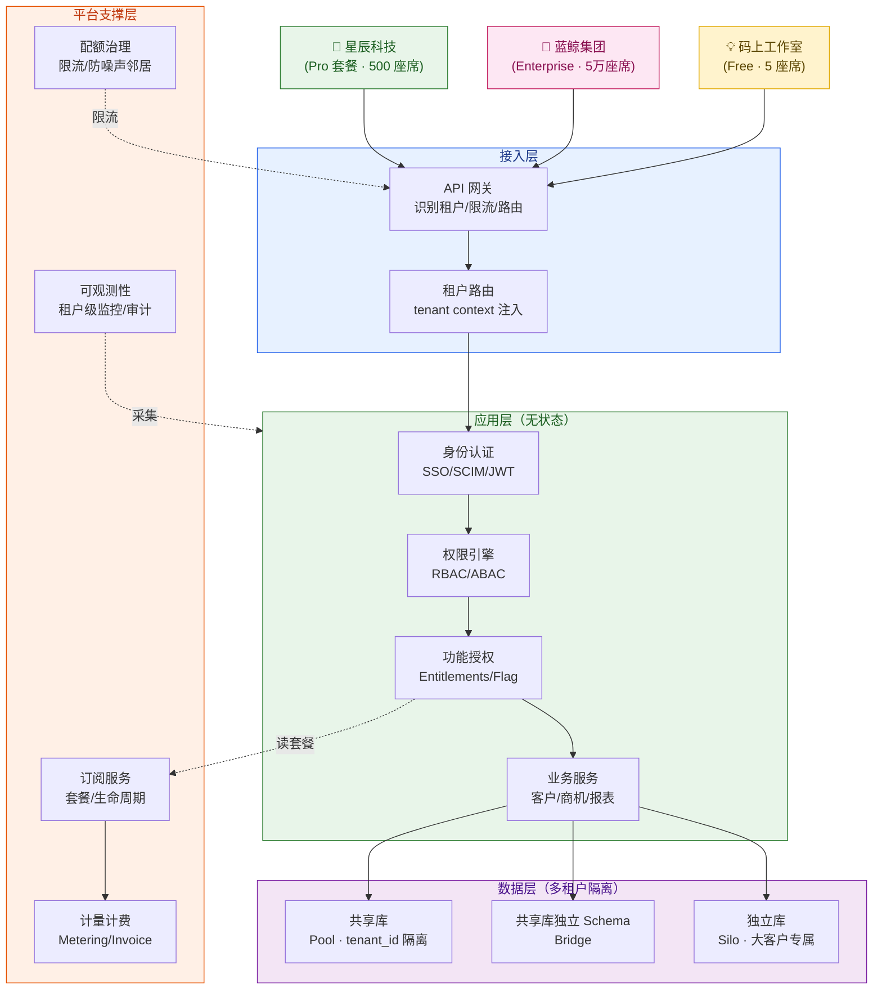
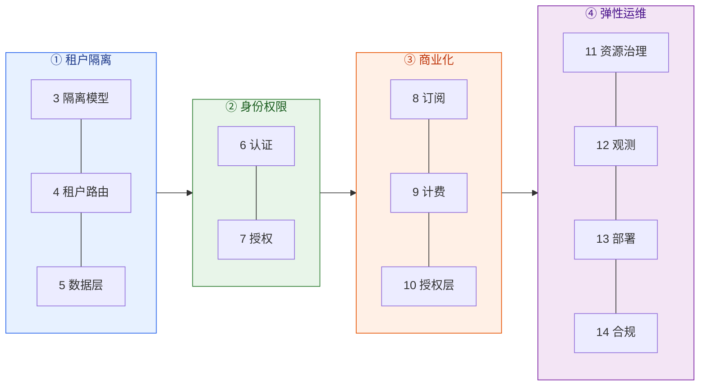
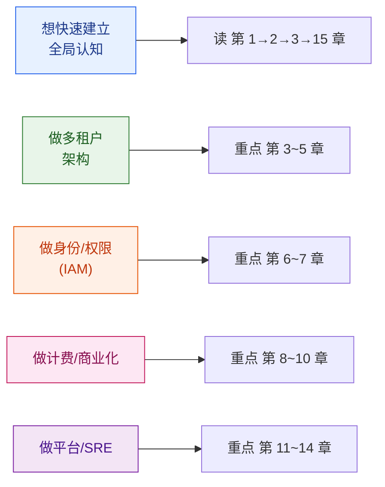

# SaaS 平台系统设计 · 全景教程

> 一份面向工程师的、端到端覆盖的 SaaS（软件即服务）平台系统设计教程。从多租户隔离、租户路由、数据分片，到身份认证、权限模型、订阅计费、功能授权，再到弹性治理、可观测性、单元化部署、安全合规，最终通过一个企业租户「从注册到合规审计」的全生命周期串讲把整条链路打通。
>
> **风格定位**：深入原理 + 架构图解 + 关键代码 + 真实案例。专业名词一律配中文解释，拒绝晦涩黑话。
> **目标读者**：想体系化掌握 SaaS / 多租户平台后端架构的工程师。

---

## 〇、什么是 SaaS（先用一句话讲清）

**SaaS（Software as a Service，软件即服务）**：你不买软件、不装软件、不维护服务器，而是像交水电费一样**按月订阅**，打开浏览器就能用。卖家（平台方）用**同一套系统**同时服务成千上万家公司，每家公司的数据互相看不见——这就是 SaaS 的核心魔法：**多租户（Multi-Tenancy）**。

> 🏢 **一句话比喻**：SaaS 平台像一栋**写字楼**。楼是同一栋（同一套系统），但每家公司租自己的楼层、有自己的门禁卡（数据隔离），物业统一管电梯、空调、保安（平台统一运维）。传统软件则是每家公司自己**盖一栋楼**——又贵又难维护。

---

## 一、为什么要学 SaaS 平台系统设计

今天你用的几乎所有在线工具都是 SaaS：Salesforce、Slack、飞书、Zoom、Notion、钉钉、企业微信、Shopify……它们看起来是「一个网站」，背后却是同时服务几十万家企业、上千万用户的**多租户怪兽系统**。它的工程挑战和电商、广告完全不同，独成一派：

- **隔离极严**：A 公司绝对不能看到 B 公司一行数据，一次跨租户泄漏可能就是公司倒闭级事故。
- **共享极致**：成千上万家公司挤在同一套系统里，既要省成本（共享），又要互不干扰（隔离），这是一对天然矛盾。
- **商业即架构**：订阅、套餐、计量、计费、配额——SaaS 的「钱」直接编码进系统设计里，定价模型变了架构就得跟着变。
- **租户千差万别**：有 5 个人的初创团队，也有 5 万座席的金融集团；有用免费版的，也有要求独立部署 + 数据驻留 + SOC2 合规的。同一套系统要同时伺候。
- **企业级门槛**：SSO 单点登录、SCIM 账号自动开通、审计日志、SLA 保障——这些是 To B 软件的入场券。

学透它，等于打通了多租户架构、身份权限体系（IAM）、计费系统、资源治理、单元化部署、数据合规这几条 To B 工程主线。

---

## 二、全景架构图

下面这张图是整篇教程的「地图」。SaaS 平台从上到下分为**接入层、应用层、平台支撑层、数据层**四层，横切贯穿**租户上下文**这条主线。后续每章聚焦其中一块。

一个贯穿全篇的核心信条（业界共识）：

> **「Placement is configuration, isolation remains invariant」**
> 租户「放在哪里」（共享库还是独立库）是可调的配置；但租户之间的「隔离性」必须**永远不变**。
> —— 这是衡量一个 SaaS 架构是否成熟的标尺。

---

## 三、贯穿全篇的案例：「云客 CRM」

为了让 15 章不割裂，全篇用同一个虚构产品 + 同一组角色串联。

> **「云客 CRM」（CloudCRM）**：一个多租户的客户关系管理 SaaS 平台（类似 Salesforce / 销售易）。企业订阅后，销售团队可以在上面管理客户、跟进商机、生成报表。平台同时服务 **10 万家企业、800 万销售座席**。

**CRM 是什么**：CRM（Customer Relationship Management，客户关系管理）是销售团队用来管理「客户线索 → 联系人 → 商机 → 成交 → 售后」全流程的工具。核心数据是：**客户（Account）、联系人（Contact）、商机（Opportunity）、活动记录（Activity）**。

### 三个典型租户（覆盖不同套餐与隔离需求）

| 租户 | 画像 | 套餐 | 隔离模式 | 用来讲什么 |
| --- | --- | --- | --- | --- |
| 💡 **码上工作室** | 5 人初创团队 | Free | Pool（共享库） | 极致省成本、共享资源 |
| 🏢 **星辰科技** | 500 人中型企业 | Pro | Pool/Bridge | 标准多租户主线 |
| 🏦 **蓝鲸集团** | 5 万座席金融集团 | Enterprise | Silo（独立库）| 独立部署、SSO、数据驻留、合规 |

### 核心角色（以星辰科技为主）

| 角色 | 姓名 | 身份 | 关注点 |
| --- | --- | --- | --- |
| 销售代表 | **李伟** | 普通成员 member | 录客户、跟商机，只看自己的数据 |
| 销售总监 | **张敏** | 管理员 admin | 管团队、看全部门报表 |
| IT 管理员 | **老陈** | 超管 owner | 配 SSO、管计费、加减成员 |
| 平台方 | 云客团队 | 研发/SRE/财务 | 隔离、扩容、计费、合规 |

---

## 四、规模基准（贯穿全篇的数量级假设）

为了让讨论具体，本教程统一采用以下「云客 CRM」规模假设（数量级参考真实头部 SaaS 公开数据）：

| 维度 | 假设值 | 参考来源（数量级） |
| --- | --- | --- |
| 租户（企业）数 | 10 万家 | Salesforce 15 万+ 客户 |
| 总用户（座席）数 | 800 万 | |
| 最大单租户座席 | 5 万 | 大型集团 |
| 客户/联系人记录 | 200 亿条 | |
| 商机/订单记录 | 50 亿条 | |
| 峰值 API QPS | 30 万 | |
| 套餐档位 | Free / Starter / Pro / Enterprise | |
| 月经常性收入 MRR | 5000 万元 | |
| 可用性 SLA | 99.9%(Pro) / 99.95%(Enterprise) | |
| 数据驻留区域 | 中国 / 欧盟 / 北美 | GDPR 要求 |

> 📌 **核心术语先记住**：
> - **租户（Tenant）**：一家订阅了平台的公司/组织。本教程里租户 = 企业。
> - **座席（Seat）**：一个付费用户名额，通常按座席数收费。
> - **MRR（Monthly Recurring Revenue，月度经常性收入）**：每月稳定收到的订阅费，SaaS 的命脉指标。
> - **Churn（流失率）**：每月有多少比例的租户取消订阅。

---

## 五、章节目录

### 第一部分 · 基础与全景

| 章节 | 标题 | 核心内容 |
| --- | --- | --- |
| [第 1 章](./01-导论-什么是SaaS平台.md) | 导论：什么是 SaaS 平台 | SaaS vs 传统软件/IaaS/PaaS、多租户本质、核心商业指标(MRR/ARR/Churn/LTV/CAC)、技术挑战、贯穿案例 |
| [第 2 章](./02-整体架构与一个租户的一生.md) | 整体架构与一个租户的一生 | 四层架构全景、租户生命周期状态机(注册→开通→使用→升降级→暂停→注销)、一个请求的端到端路径 |

### 第二部分 · 多租户核心

| 章节 | 标题 | 核心内容 |
| --- | --- | --- |
| [第 3 章](./03-多租户与隔离模型.md) | 多租户与隔离模型 | Silo/Pool/Bridge 三模型、隔离维度(计算/存储/网络)、隔离级别权衡、租户分层、何时选哪种 |
| [第 4 章](./04-租户标识与上下文路由.md) | 租户标识与上下文路由 | 如何识别租户(子域名/路径/Header/JWT claim)、tenant context 链路传递、网关路由、跨服务传播、防丢失 |
| [第 5 章](./05-数据层设计-分片隔离与查询安全.md) | 数据层设计：分片、隔离与查询安全 | 行级隔离(tenant_id)、RLS 行级安全、独立 Schema/库、按租户分库分表、查询安全、大租户倾斜、租户搬家 |

### 第三部分 · 身份与权限

| 章节 | 标题 | 核心内容 |
| --- | --- | --- |
| [第 6 章](./06-身份认证与租户身份体系.md) | 身份认证与租户身份体系 | 注册登录、组织-用户多对多模型、SSO(SAML/OIDC)、企业 IdP 集成、SCIM 账号自动开通/回收、JWT/Session |
| [第 7 章](./07-权限模型-RBAC与ABAC.md) | 权限模型：RBAC 与 ABAC | 组织内角色(owner/admin/member)、capability-first 设计、租户边界内权限评估、RBAC vs ABAC、CRM 数据共享规则、权限缓存 |

### 第四部分 · 商业化

| 章节 | 标题 | 核心内容 |
| --- | --- | --- |
| [第 8 章](./08-订阅与套餐体系.md) | 订阅与套餐体系 | 套餐 Plan 建模、订阅生命周期(试用→活跃→过期→取消)、升降级按比例计费(proration)、续费、套餐变更 |
| [第 9 章](./09-计量与计费.md) | 计量与计费 | 用量计量(API/存储/座席)、计量事件管道、计费引擎(按量/按座席/分层)、支付集成、发票、对账、税务 |
| [第 10 章](./10-功能授权Entitlements与FeatureFlag.md) | 功能授权 Entitlements 与 Feature Flag | 授权层(套餐→功能映射)、Feature Flag(灰度/AB/kill switch)、配额与限额、运行时检查、与计费/RBAC 区别 |

### 第五部分 · 弹性与运维

| 章节 | 标题 | 核心内容 |
| --- | --- | --- |
| [第 11 章](./11-弹性扩展与资源治理.md) | 弹性扩展与资源治理 | 水平/垂直扩展、噪声邻居(noisy neighbor)、租户级限流(令牌桶)、配额执行、热点大租户隔离、自动伸缩 |
| [第 12 章](./12-可观测性与租户级监控.md) | 可观测性与租户级监控 | tenant-aware 指标、带 tenant_id 的日志、链路追踪、审计日志、SLA 监控告警、租户健康分 |
| [第 13 章](./13-部署架构与发布策略.md) | 部署架构与发布策略 | Cell-based 单元化架构、租户级灰度发布、多区域多活、蓝绿/金丝雀、租户迁移、版本管理 |
| [第 14 章](./14-安全与合规.md) | 安全与合规 | 数据加密(传输/静态/租户级密钥)、防跨租户越权(纵深防御)、GDPR/数据驻留、审计合规(SOC2/ISO27001)、数据删除与保留 |

### 结语

| 章节 | 标题 | 核心内容 |
| --- | --- | --- |
| [第 15 章](./15-全链路串讲与学习路径.md) | 全链路串讲与学习路径 | 跟随星辰科技从注册到合规审计端到端串讲、15 章串联、面试高频题、开源/产品参考、学习路径图 |

---

## 六、四大支柱与章节映射

---

## 七、阅读建议

- **建议顺序**：按章节顺序通读。第 1-2 章建立全景；第 3-5 章是多租户地基（最核心）；第 6-7 章是身份权限；第 8-10 章是商业化；第 11-14 章是平台工程与合规；第 15 章串讲收口。
- **核心三章**：第 3 章（隔离模型）、第 5 章（数据层）、第 10 章（功能授权）是 SaaS 区别于普通系统的浓缩，值得反复看。
- **工程落地**：第 11、13 章把扩展性和部署统一收口，做架构设计前必读。

> 📌 本教程所有外部资料来源已在各章末尾「参考来源」中以链接标注。数值为数量级示意，实际因平台而异。下面进入正文。
