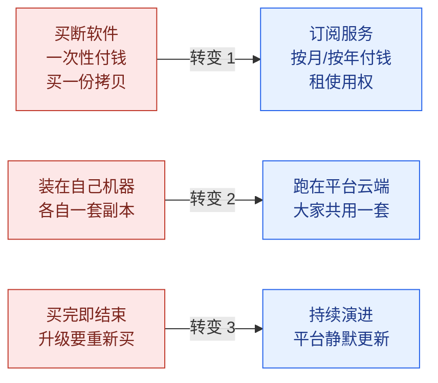
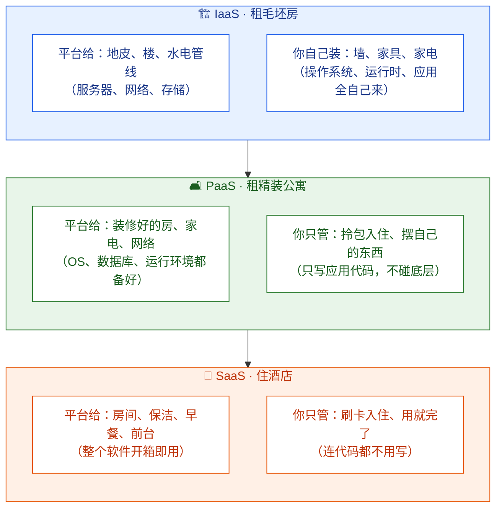
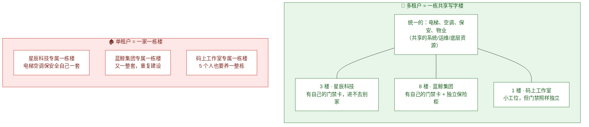
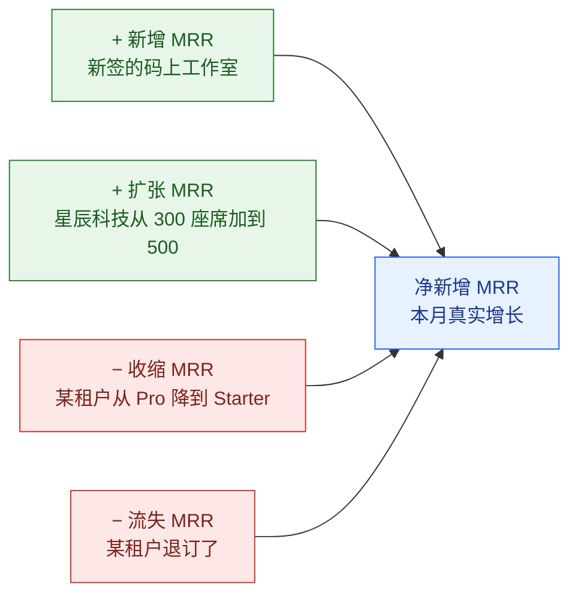
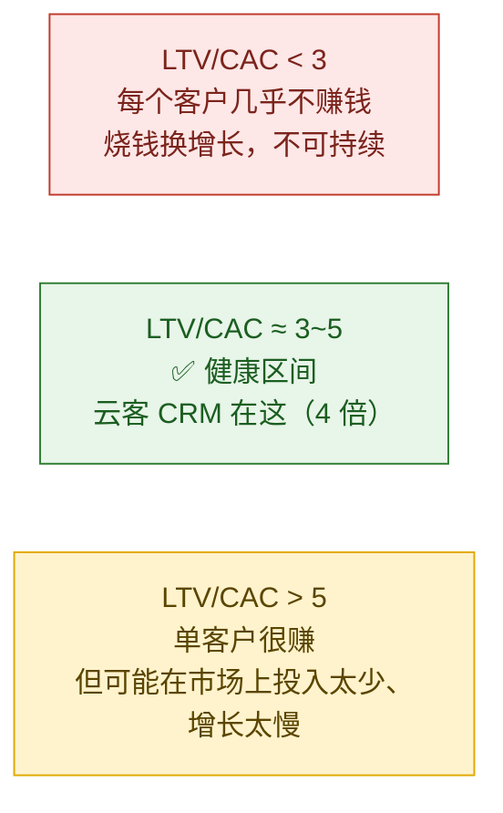
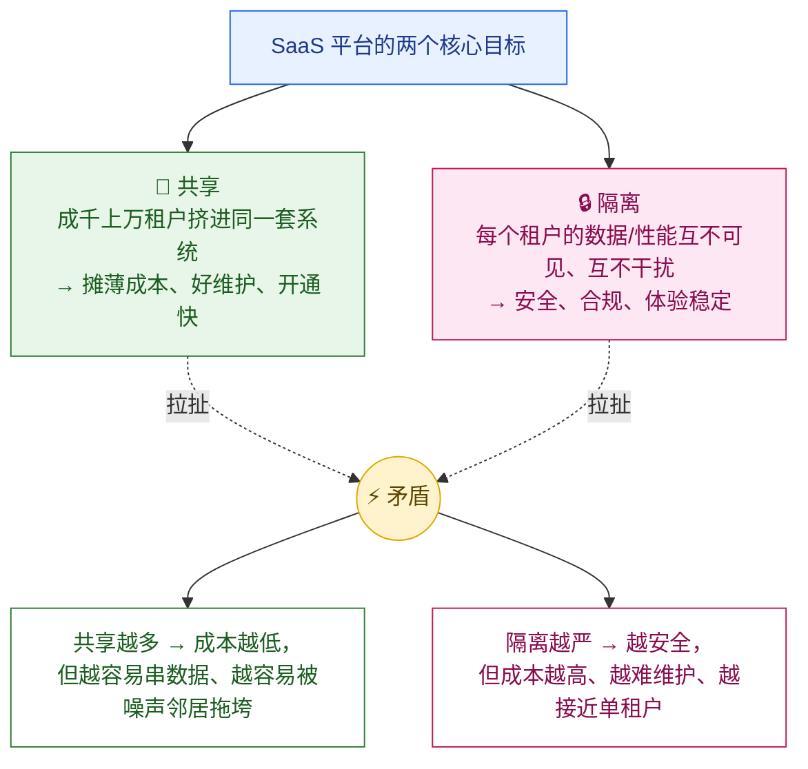
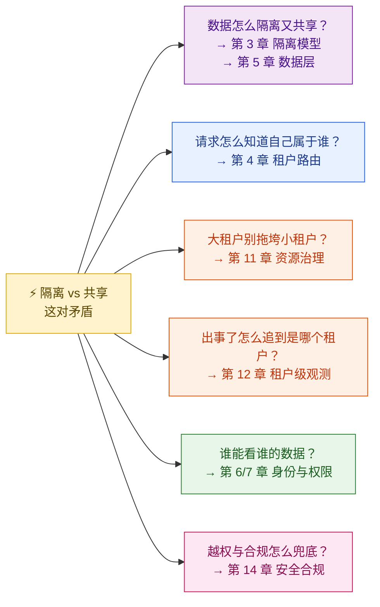

# 第 1 章 导论：什么是 SaaS 平台

> 本章是整套教程的「地基课」。读完它，你会用工程师的眼光重新理解一件你每天都在用、却很少深想的事：**为什么打开浏览器就能用的软件，背后是一头同时伺候十万家公司的怪兽。**

---

## 本章导读（读完能回答哪些问题）

- SaaS 到底是什么？它和你硬盘里装的那个买断软件有什么本质区别？
- IaaS / PaaS / SaaS 这三个词天天被人挂在嘴边，它们的边界到底在哪？（用「租房子」一招讲透）
- 「多租户」三个字是 SaaS 的核心魔法，它的本质是什么？为什么说一栋写字楼就能讲清楚？
- MRR、ARR、Churn、LTV、CAC、ARPU——这些一听就头大的商业指标，公式是什么、怎么算、对架构有什么影响？（用云客 CRM 的真实数字算给你看）
- 为什么说「隔离」和「共享」是 SaaS 与生俱来的一对矛盾，整套教程其实都在解这一道题？
- 我们后面 14 章要反复用到的「云客 CRM」案例、三个租户、三个角色，分别是谁？

---

## 1.1 SaaS：你不是在买软件，你是在租一项服务

### 先把名词讲清楚

> **SaaS（Software as a Service，软件即服务）**：你不买软件、不装软件、不维护服务器，而是像交水电费一样**按月订阅**，打开浏览器就能用。卖软件的那家公司（平台方）用**同一套系统**同时服务成千上万家公司，每家公司的数据互相看不见。

这个定义里藏着三个关键转变，每一个都深刻影响了系统怎么设计：



**转变 1：从「买拥有权」到「租使用权」（订阅制）。** 你给微软一笔钱买一张 Office 2016 光盘，那张光盘就永远是你的——这是买断（perpetual license，永久授权：一次付费、终身使用、但不再更新）。而你订阅 Microsoft 365，停止付费的那一刻，软件就停了——这是订阅（subscription，订阅制：按周期付费换取持续使用权）。订阅制不是单纯的「换种收钱方式」，它把「钱」变成了一条**每月都会重新流过来的河**，这条河的流量大小（MRR，下文细讲）直接决定了一家 SaaS 公司活得好不好——也直接决定了系统里必须有计量、计费、续费、降级、退订这一整套机器。

**转变 2：从「各自一套」到「共用一套」（多租户）。** 这是 SaaS 在工程上最硬核的部分，是后面 1.4 节的主角。

**转变 3：从「卖完即结束」到「持续演进」。** 买断软件卖出去就「交付完成」了；SaaS 永远在线、永远在更新，所以它需要灰度发布、版本管理、租户级回滚这些能力（详见第 13 章）。

### 一句话比喻：从「买车」到「打网约车」

> 🚗 **买断软件像买车**：一次性付一大笔钱，车归你；但保养、修理、加油、报废全得自己操心，车开旧了想升级只能再买一辆。
>
> 🚕 **SaaS 像打网约车**：你不拥有车，按次/按月付钱；车况、保养、油费、司机全由平台搞定；想要更好的车（升级套餐）随时换。你要的从来不是「一辆车」，而是「被送到目的地」这项**服务**。

这个比喻里有个容易被忽略的点：网约车平台用**同一支车队**同时服务全城乘客。它不会给每个乘客配一辆专属车停在楼下——那样成本爆炸。这就引出了 SaaS 的命门：**共享车队（共享系统）才能摊薄成本，但又必须保证你坐进车里看不到上一个乘客的东西（数据隔离）。** 记住这个矛盾，它会贯穿整套教程。

---

## 1.2 SaaS vs 传统买断软件：一张表看清差异

为了让对比更具体，我们用本教程的贯穿案例「云客 CRM」对照一款假想的传统买断 CRM 软件「ClassicCRM 2016 企业版」。

| 维度 | 🚗 传统买断（ClassicCRM 2016） | 🚕 SaaS（云客 CRM） |
| --- | --- | --- |
| **付费方式** | 一次性买断 + 每年付维护费 | 按座席数 × 月订阅，停付即停用 |
| **部署在哪** | 客户自己买服务器装在机房 | 跑在平台云端，浏览器即用 |
| **谁运维** | 客户的 IT 部门（老陈那样的角色要 7×24 值守） | 平台方统一运维（客户的老陈只配配置） |
| **升级** | 买新版本、停机迁移、可能要重新培训 | 平台静默更新，所有租户当晚就用上新功能 |
| **隔离方式** | 物理隔离——每家公司一套独立系统 | 逻辑隔离——大家共用一套，靠 tenant_id 区分 |
| **首付成本** | 高（几十万授权费 + 硬件） | 低（按月几千元起，先试用） |
| **平台方收入模型** | 卖一单是一单，靠维护费续命 | 月月收钱（MRR），可预测、可累积 |
| **核心工程挑战** | 兼容客户五花八门的机房环境 | 多租户隔离、弹性扩展、计量计费 |

**最该体会的一行是「隔离方式」。** 传统软件靠「物理隔离」——你的系统和我的系统是两台完全不同的机器，天然谁也碰不到谁，简单粗暴但贵得离谱。SaaS 把所有人塞进同一套系统省了钱，代价是隔离这件事从「物理上天然做到」变成了「必须靠软件刻意做到」——这是后面第 3、5、14 章要反复打磨的核心工程问题。**SaaS 省下的硬件成本，最终都变成了工程师在隔离设计上要还的债。**

---

## 1.3 IaaS / PaaS / SaaS：用「三种住法」一招讲透

云计算服务通常分三层，越往上你管的越少、平台帮你管的越多。这三个词最容易混，但用「住房子」的三种方式来比，三秒钟就分清了。



把这三层和「你要操心多少东西」对应起来，一目了然：

| 层 | 比喻 | 平台帮你管 | 你自己管 | 典型产品 |
| --- | --- | --- | --- | --- |
| **IaaS**（Infrastructure as a Service，基础设施即服务：租虚拟机/网络/硬盘，剩下全自己来） | 租毛坯房 | 机房、服务器、网络、存储 | 操作系统、数据库、运行时、应用代码 | AWS EC2、阿里云 ECS |
| **PaaS**（Platform as a Service，平台即服务：平台备好运行环境，你只写代码） | 租精装公寓 | 上面这些 + OS + 数据库 + 运行环境 | 只写应用代码 | Heroku、阿里云 Serverless、Vercel |
| **SaaS**（Software as a Service，软件即服务：连软件都给你写好了，直接用） | 住酒店 | 上面这些 + 整个应用 | 只管使用、配置 | 云客 CRM、Salesforce、飞书 |

**关键认知：这三层是「叠罗汉」关系，不是「三选一」。** 云客 CRM 是一个 **SaaS** 产品，但它自己很可能**跑在 PaaS 或 IaaS 上**——比如云客团队租用 AWS 的虚拟机（IaaS）和托管数据库（PaaS），在上面搭出云客 CRM 这个 SaaS 卖给星辰科技。也就是说：

> 对星辰科技的老陈来说，云客 CRM 是他买的 SaaS（他住酒店）；
> 对云客团队的 SRE 来说，他们是在 AWS 的 IaaS 上盖了一座「酒店」（他们是租毛坯房自己装修的房东）。

**整套教程站在「云客团队」这个房东的视角**——研究怎么用底层云资源，盖出一座能同时让十万家公司入住、且互相看不见的「软件酒店」。

---

## 1.4 多租户：SaaS 的核心魔法（一栋写字楼讲清楚）

### 什么是租户、什么是多租户

> **租户（Tenant）**：一家订阅了平台的公司/组织。在云客 CRM 里，租户 = 一家企业。星辰科技是一个租户，蓝鲸集团是另一个租户。
>
> **多租户（Multi-Tenancy，多租户架构：同一套软件实例同时服务多个互相隔离的租户）**：一套部署、一份代码、一组数据库，同时服务很多个租户，每个租户感觉像在独占使用，实际上大家共用同一套基础设施。

### 写字楼比喻：一栋楼 vs 一人一栋楼



**多租户 = 一栋共享写字楼。** 楼是同一栋（同一套系统），电梯、空调、保安、物业是大家公用的（共享的计算/存储/运维）。但每家公司租自己的楼层、有自己的门禁卡（数据隔离），进了 3 楼的星辰科技刷不开 8 楼蓝鲸集团的门。物业（平台方）统一管理整栋楼，加一台新电梯（升级一个功能），全楼所有公司一起受益。

**单租户（Single-Tenant，单租户架构：每个客户独享一套完整的软件实例）= 一家一栋楼。** 每个客户给一整套独立的系统。隔离做到了极致（楼都是分开的，物理上谁也碰不到谁），但成本爆炸——码上工作室只有 5 个人，也要养一整栋楼的电梯空调。而且 100 栋楼意味着 100 套要分别运维的环境，平台方的 SRE 会被累死。

### 多租户 vs 单租户：到底差在哪

| 维度 | 🏢 多租户（共享写字楼） | 🏚️ 单租户（一家一栋楼） |
| --- | --- | --- |
| **基础设施成本** | 极低（成千租户摊薄一套资源） | 极高（每个租户一套，无法摊薄） |
| **运维复杂度** | 一套环境，更新一次全员生效 | N 套环境，更新要逐个做 N 次 |
| **隔离强度** | 逻辑隔离（靠软件保证，有越权风险） | 物理隔离（天然隔绝，最强） |
| **资源利用率** | 高（A 租户闲时资源给 B 用） | 低（每套资源各自闲置） |
| **「噪声邻居」风险** | 有（一个大租户跑垮库，殃及邻居）<br/>详见第 11 章 | 无（各自的楼，互不影响） |
| **新租户开通速度** | 秒级（发张门禁卡即可） | 慢（要盖一栋新楼/部署新环境） |
| **适合谁** | 绝大多数中小租户 | 极少数有合规/独占强需求的大客户 |

这张表是整套教程的「问题清单」：多租户用「省钱、好维护、开通快」换来了「隔离要靠软件、有噪声邻居风险」。**SaaS 工程的本质，就是把多租户的优点全拿到、同时把它的缺点（隔离风险、噪声邻居）压到趋近于零。**

> 📌 **现实中不是非黑即白。** 云客 CRM 会对不同租户用不同隔离强度：码上工作室和星辰科技住共享楼（多租户共享库），而要求最高的蓝鲸集团给一整套独立库（接近单租户）。**「租户放在哪、隔离多严」是可以按套餐/合规需求灵活配置的**——这正是第 3 章「Silo / Pool / Bridge 三模型」要展开的核心内容，这里先按下不表。

---

## 1.5 SaaS 的命脉：六个核心商业指标

SaaS 有个非常特别的地方：**商业指标会直接「编码」进系统设计里。** 一个传统软件公司，财务指标和工程架构基本是两个世界的事；但 SaaS 不是——因为它按订阅、按用量收钱，所以「这个月赚了多少」「这个客户值多少钱」这些问题的答案，必须由**系统里真实跑着的计量、计费、订阅模块**算出来。工程师不懂这几个指标，就理解不了为什么后面要做计量管道（第 9 章）、订阅生命周期（第 8 章）这些东西。

下面六个指标，我们全部用「云客 CRM」的具体数字算一遍。先给一组贯穿计算的假设（与大纲规模基准一致）：

> **云客 CRM 的一组示例数字**
> - 租户（企业）数：10 万家
> - 每月平稳订阅收入（即下文的 MRR）：5000 万元
> - Pro 套餐定价：每座席每月 200 元
> - 星辰科技：500 座席，订阅 Pro

### 指标 1：MRR —— 每月稳定流过来的那条河

> **MRR（Monthly Recurring Revenue，月度经常性收入：每月稳定收到的订阅费总和，不含一次性收入）**

这是 SaaS 的命脉指标。注意「Recurring（经常性）」三个字——它只算**会重复发生**的订阅费，不算一次性的实施费、培训费。

```
MRR = Σ（每个租户的月订阅费）

星辰科技贡献的 MRR = 500 座席 × 200 元/座席/月 = 10 万元/月
云客 CRM 全平台 MRR = 所有租户加起来 = 5000 万元/月
```

MRR 还能拆成四块，这个拆解直接对应到系统里要记录哪些事件（第 8、9 章会做成事件管道）：



### 指标 2：ARR —— MRR 的年度视角

> **ARR（Annual Recurring Revenue，年度经常性收入：MRR 的年度版本，用于对外汇报和估值）**

```
ARR = MRR × 12

云客 CRM 的 ARR = 5000 万 × 12 = 6 亿元/年
```

MRR 和 ARR 不是两个指标，是同一笔钱的两种看法：**MRR 用于日常运营决策**（这个月增长了吗），**ARR 用于对董事会/投资人汇报**（一年盘子多大）。

### 指标 3：Churn —— 漏水的桶有多漏

> **Churn Rate（流失率：一段时间内流失的客户或收入占比）**

Churn 是 SaaS 最致命的指标，因为订阅制最怕「桶在漏水」——你拼命拉新客户（往桶里灌水），但老客户在源源不断退订（桶底在漏），灌得再快也存不住水。

Churn 要分两种看，区别很重要：

```
客户流失率 = 本月退订的租户数 / 月初租户总数
收入流失率 = 本月流失的 MRR / 月初 MRR
```

**举例（云客 CRM）：** 假设月初有 10 万家租户、5000 万 MRR；这个月有 2000 家退订，流失的 MRR 是 50 万元。

```
客户流失率 = 2000 / 100000 = 2%
收入流失率 = 50 万 / 5000 万 = 1%
```

**两个数字不一样，信息量很大：** 客户流失 2% 但收入只流失 1%，说明退订的多是小租户（像码上工作室这种 Free/低价用户），大租户都留住了——这其实是健康信号。反过来如果客户流失 2%、收入却流失 5%，那是大客户在跑，警报拉满。

> ⚠️ **流失会复利。** 看起来温和的「每月 2% 流失」，一年累积下来会流失掉约 22% 的客户（`1 − 0.98¹² ≈ 21.5%`）。这就是为什么 SaaS 公司把「降低 Churn」看得比「拉新」还重——堵住桶底的洞，比往里灌水高效得多。

### 指标 4：ARPU —— 平均每个客户每月给你多少钱

> **ARPU（Average Revenue Per User，每用户平均收入：总收入除以用户/租户数；SaaS 语境下也常用 ARPA，Average Revenue Per Account，每租户平均收入）**

```
ARPU（按租户算）= MRR / 租户数

云客 CRM 的 ARPU = 5000 万 / 10 万 = 500 元/租户/月
```

ARPU 是后面算 LTV 的原料，也是判断「我该往上够大客户还是往下够长尾」的指标。

### 指标 5：CAC —— 拉来一个客户花了多少钱

> **CAC（Customer Acquisition Cost，客户获取成本：拉来一个新客户平均花掉的销售+市场费用）**

```
CAC = （销售费用 + 市场费用）/ 新增客户数
```

**举例（云客 CRM）：** 上个月市场投放花了 600 万元、销售团队成本花了 400 万元，一共拉来了 2000 家新租户。

```
CAC = (600 万 + 400 万) / 2000 = 5000 元/客户
```

CAC 还有个时间维度叫**回本周期（CAC Payback Period）**：花 5000 元拉来的客户，平均每月贡献 500 元（ARPU），那要 `5000 / 500 = 10 个月`才把获客成本赚回来。**如果这个客户在第 10 个月之前就退订了，这笔获客成本永远收不回**——这就是 Churn 和 CAC 必须一起看的原因。

### 指标 6：LTV —— 一个客户一辈子值多少钱

> **LTV（Customer Lifetime Value，客户终身价值：一个客户从签约到流失，累计能贡献的利润）**

LTV 有两个常见公式，**更准确的那个一定要乘上毛利率**（不然会高估 20%~30%）：

```
简化版： LTV = ARPU × 平均存活月数
精确版： LTV = (ARPU × 毛利率) / 月流失率
```

**举例（云客 CRM）：** ARPU = 500 元/月，毛利率假设 80%，月客户流失率 2%。

```
平均存活月数 = 1 / 月流失率 = 1 / 0.02 = 50 个月
精确版 LTV = (500 × 0.80) / 0.02 = 2 万元
```

LTV 对流失率**极其敏感**：月流失率 2% 时客户平均活 50 个月，5% 时只活 20 个月——流失率从 2% 涨到 5%，LTV 直接腰斩还不止。这又一次说明：**降低 Churn 是 SaaS 性价比最高的事。**

### 把六个指标串起来：LTV / CAC 决定生死

最后一个组合指标是检验一家 SaaS 是否健康的「体检总分」：

```
LTV / CAC 比值

云客 CRM = 2 万 / 5000 = 4 倍
```

业界公认的及格线是 **3:1**（拉一个客户的钱，一辈子能赚回 3 倍以上才算划算）。下面三张是按比值高低排开的**区间对比卡片**（从左到右健康度递进，非流程箭头）：



这六个指标的关系不是一条单线，而是**一条因果链 + 一个并列输入**：`Churn → LTV`（流失率决定 LTV），而 **CAC 是独立测得的另一个输入**（获客成本 = 销售 + 市场费用 / 新增客户数，并不由 LTV 派生）；最后把这两个并列的数字一比，才得到健康度总分：`{LTV, CAC} → LTV/CAC`。流失率是这条链的源头，但 CAC 是从市场端单独算出来汇入的。**修指标要从上游修——只盯着 LTV/CAC 这个结果数字，不去降 Churn，是 SaaS 最常见的战略错误。**

> 🧭 **工程师为什么要懂这些？** 因为这些数字不是财务自己拍脑袋算的，全靠系统**真实记录**才能算出来：MRR 要靠订阅服务（第 8 章）准确记录每个租户的套餐和座席数；用量计费要靠计量管道（第 9 章）逐条采集 API/存储用量；Churn 要靠订阅生命周期状态机捕捉每一次退订。**指标的准确性 = 系统的正确性。** 算错一笔 MRR，可能就是一次财务事故。

---

## 1.6 SaaS 独有的技术挑战：隔离与共享，一对天生的冤家

读到这里，整套教程最核心的那条主线已经呼之欲出了。SaaS 之所以独成一派、和电商/广告系统的工程长得完全不一样，根子就在一句话：

> **隔离（Isolation）和共享（Sharing）是一对天然矛盾，整套 SaaS 工程都在这对矛盾之间走钢丝。**

### 为什么它们天生矛盾

这两个目标是 SaaS 的两条腿，缺一条都站不住，可它们恰恰互相拉扯：



矛盾的核心在于：**资源用得越「共享」，省的钱越多，但隔离的墙就越薄；隔离的墙砌得越厚，越安全，但越接近「一家一栋楼」，省钱的初衷就丢了。** 它们就像跷跷板的两头，往任何一头压到底都是灾难——

- **完全偏向共享**：所有租户裸跑在同一张表、同一个连接池里。一旦应用层一行 SQL 忘了加租户过滤，星辰科技的销售就能查到蓝鲸集团的客户名单——这是公司倒闭级的数据泄漏事故。再加上蓝鲸集团一个大批量导入就能把数据库 CPU 打满，把码上工作室一起拖垮（噪声邻居）。
- **完全偏向隔离**：每个租户一套独立环境，回到了「一家一栋楼」。十万家租户就是十万套环境，成本和运维复杂度直接劝退，SaaS 的商业模式根本跑不通。

### 这对矛盾如何贯穿整套教程

聪明的答案不是「二选一」，而是**在每一个维度上分别找到合适的平衡点**——而且这个平衡点对不同租户可以不一样（码上工作室偏共享省钱，蓝鲸集团偏隔离合规）。整套教程的 14 章，本质上就是从不同角度回答「这条钢丝怎么走」：



业界把这套智慧浓缩成一句信条（也是本教程反复引用的标尺）：

> **「Placement is configuration, isolation remains invariant」**
> （租户「放在哪里」是可调的配置，但租户之间的「隔离性」必须永远不变）
> —— 你可以为了省钱把小租户塞进共享库、为了合规给大租户开独立库，**放置策略随便配**；但无论怎么配，「A 租户绝对碰不到 B 租户的数据」这条**底线永远不能破**。一个 SaaS 架构成不成熟，就看它能不能在「灵活放置」的同时守住「隔离不变」。

具体每个隔离维度怎么权衡、三种隔离模型分别长什么样，是第 3 章的主场，本章只需要你**牢牢记住这对矛盾的存在**——它是后面所有设计决策背后的那只手。

---

## 1.7 正式介绍贯穿全篇的案例：云客 CRM

为了让 15 章不割裂、概念都能落到具体场景，整套教程用同一个虚构产品 + 同一组角色串联。现在正式把它们请出来——后面每一章都会用到。

### 产品：云客 CRM（CloudCRM）

> **云客 CRM（CloudCRM）**：一个多租户的客户关系管理 SaaS 平台（你可以类比成中国版的 Salesforce / 销售易）。企业订阅后，销售团队可以在上面管理客户、跟进商机、生成报表。平台同时服务 **10 万家企业、800 万销售座席**。

**CRM 是干什么的？** CRM（Customer Relationship Management，客户关系管理：销售团队用来管理「线索 → 客户 → 商机 → 成交 → 售后」全流程的工具）。它的核心数据就四类，记住它们，后面讲数据隔离、权限时全是拿它们举例：

| 数据对象 | 英文 | 是什么 | 例子 |
| --- | --- | --- | --- |
| **客户** | Account | 一家潜在或已成交的公司 | 「华南某连锁超市」 |
| **联系人** | Contact | 客户公司里的具体对接人 | 「该超市的采购经理王总」 |
| **商机** | Opportunity | 一个正在推进的销售机会 | 「向该超市卖 100 套收银系统，预计 80 万」 |
| **活动记录** | Activity | 跟进过程的每一次动作 | 「3 月 5 日给王总打了电话」 |

### 三个典型租户（覆盖不同套餐与隔离需求）

这三个租户不是随便设的——它们刻意覆盖了从「极致省成本」到「极致要隔离」的整个光谱，后面讲任何设计权衡，都能在这三家身上找到对应场景。

```mermaid
flowchart TB
    subgraph T1["💡 码上工作室"]
        direction TB
        A1["5 人初创团队"]
        A2["Free 套餐（免费）"]
        A3["住共享库（Pool）"]
        A4["用来讲：极致省成本、长尾租户"]
    end
    subgraph T2["🏢 星辰科技"]
        direction TB
        B1["500 人中型企业"]
        B2["Pro 套餐（付费主力）"]
        B3["住共享库/独立 Schema（Pool/Bridge）"]
        B4["用来讲：标准多租户主线（本教程主角）"]
    end
    subgraph T3["🏦 蓝鲸集团"]
        direction TB
        C1["5 万座席金融集团"]
        C2["Enterprise 套餐（顶配）"]
        C3["住独立库（Silo）"]
        C4["用来讲：独立部署、SSO、数据驻留、合规"]
    end

    style T1 fill:#fff3cd,stroke:#e0a800,color:#5a4500
    style T2 fill:#e8f5e9,stroke:#2e7d32,color:#1b5e20
    style T3 fill:#fde7f3,stroke:#c2185b,color:#880e4f
    style A1 fill:#ffffff,stroke:#e0a800,color:#5a4500
    style A2 fill:#ffffff,stroke:#e0a800,color:#5a4500
    style A3 fill:#ffffff,stroke:#e0a800,color:#5a4500
    style A4 fill:#ffffff,stroke:#e0a800,color:#5a4500
    style B1 fill:#ffffff,stroke:#2e7d32,color:#1b5e20
    style B2 fill:#ffffff,stroke:#2e7d32,color:#1b5e20
    style B3 fill:#ffffff,stroke:#2e7d32,color:#1b5e20
    style B4 fill:#ffffff,stroke:#2e7d32,color:#1b5e20
    style C1 fill:#ffffff,stroke:#c2185b,color:#880e4f
    style C2 fill:#ffffff,stroke:#c2185b,color:#880e4f
    style C3 fill:#ffffff,stroke:#c2185b,color:#880e4f
    style C4 fill:#ffffff,stroke:#c2185b,color:#880e4f
```



> 表里的「Pool / Bridge / Silo」三种隔离模式先有个印象就行——它们正是第 3 章的主角，这里只是预告这三个租户会用不同的隔离策略。

### 三个核心角色（以星辰科技为主舞台）

讲权限、讲操作流程时，我们固定用星辰科技内部的三个人。他们的身份（owner / admin / member）是后面第 7 章 RBAC 权限模型的活样本：

| 角色 | 姓名 | 系统身份 | 他/她平时干什么、关注什么 |
| --- | --- | --- | --- |
| 销售代表 | **李伟** | 普通成员 member | 录客户、跟商机，**只能看自己名下的数据** |
| 销售总监 | **张敏** | 管理员 admin | 管整个销售团队、看全部门报表 |
| IT 管理员 | **老陈** | 超级管理员 owner | 配 SSO 单点登录、管订阅计费、加减成员 |
| 平台方 | 云客团队 | 研发 / SRE / 财务 | 操心隔离、扩容、计费、合规（也就是「房东」） |

为了让你对后面的内容有画面感，先剧透一个会反复出现的场景：

> 🎬 **场景预告——「李伟录入一个客户」：**
> 销售李伟在浏览器里录入一家新客户「华南某连锁超市」，点了保存。这个看似简单的动作，背后系统要依次回答一连串问题：这个请求是**哪个租户**（星辰科技）发来的？怎么在请求里**带上租户身份**、一路传到数据库不丢（第 4 章）？李伟有没有**权限**录客户、能不能看别人的客户（第 7 章）？这条数据该写进**哪个库**、怎么自动打上 `tenant_id` 防止串到别家（第 5 章）？星辰科技的套餐**还能再录多少条**客户、超没超配额（第 10 章）？
>
> 一个「保存客户」的点击，就把多租户系统的半条命脉串了起来。**这就是我们整套教程要一层层拆解的东西。**

---

## 1.8 规模基准：让讨论有具体的数量级

抽象地说「很大规模」没有意义。整套教程统一采用下面这组「云客 CRM」的数量级假设（参考真实头部 SaaS 的公开数据级别），后面凡是讨论性能、容量、扩展，都以这组数字为准：

| 维度 | 假设值 | 数量级参考 |
| --- | --- | --- |
| 租户（企业）数 | 10 万家 | Salesforce 公开客户数 15 万+ |
| 总用户（座席）数 | 800 万 | |
| 最大单租户座席 | 5 万 | 大型集团（蓝鲸集团这一档） |
| 客户 / 联系人记录 | 200 亿条 | |
| 商机 / 订单记录 | 50 亿条 | |
| 峰值 API QPS | 30 万 | |
| 套餐档位 | Free / Starter / Pro / Enterprise | |
| 月经常性收入 MRR | 5000 万元 | |
| 可用性 SLA | 99.9%（Pro）/ 99.95%（Enterprise） | |
| 数据驻留区域 | 中国 / 欧盟 / 北美 | GDPR 等法规要求 |

> 📌 **几个先记住的术语：**
> - **座席（Seat）**：一个付费用户名额，SaaS 常按座席数收费（星辰科技 500 座席 = 500 个付费名额）。
> - **SLA（Service Level Agreement，服务等级协议：平台对客户承诺的可用性等指标）**：99.9% 意味着一年最多允许停机约 8.7 小时，99.95% 则收紧到约 4.4 小时——套餐越高，承诺越严，这也是工程上要分级保障的依据（第 12、13 章）。
> - **数据驻留（Data Residency，数据驻留：客户数据必须存放在指定国家/地区，不得出境）**：蓝鲸集团这类客户会要求数据只能存在中国境内，这直接影响部署架构（第 13、14 章）。

---

## 本章小结

- **SaaS（软件即服务）** 的本质是三个转变：从「买拥有权」到「租使用权」（订阅制）、从「各自一套」到「共用一套」（多租户）、从「卖完即结束」到「持续演进」。一句话——**你买的不是软件，是一项持续的服务。**
- **SaaS vs 传统买断软件** 最关键的差异在「隔离方式」：传统软件靠物理隔离（各自一套系统）天然安全但昂贵；SaaS 靠逻辑隔离（共用一套、软件区分）省钱但把隔离变成了必须刻意完成的工程任务。
- **IaaS / PaaS / SaaS** 是「租毛坯房 / 租精装公寓 / 住酒店」三种住法，平台帮你管的东西越来越多；它们是叠罗汉关系，**云客 CRM 是 SaaS，但它自己跑在 IaaS/PaaS 上**——本教程站在「房东」视角。
- **多租户** 是 SaaS 的核心魔法，像一栋共享写字楼：共享电梯空调（基础设施），独立门禁（数据隔离）。相比「一家一栋楼」的单租户，它省成本、好维护、开通快，代价是隔离要靠软件保证、有噪声邻居风险。
- **六个核心商业指标** MRR / ARR / Churn / ARPU / CAC / LTV 直接「编码」进系统——指标的准确性等于系统的正确性。记住它们的关系：`Churn → LTV` 是一条因果链，而 CAC 是从市场端独立算出的并列输入，二者相比才得到健康度总分 `{LTV, CAC} → LTV/CAC`；降低流失率是性价比最高的事。
- **隔离 vs 共享是一对天生的矛盾**，整套教程都在这条钢丝上找平衡。业界信条「Placement is configuration, isolation remains invariant」——放置策略可灵活配置，隔离底线永远不变。
- **贯穿案例**：云客 CRM（多租户 CRM 平台）、三个租户（💡码上工作室 Free / 🏢星辰科技 Pro / 🏦蓝鲸集团 Enterprise）、三个角色（李伟 member / 张敏 admin / 老陈 owner），以及一组 10 万租户 / 800 万座席 / 5000 万 MRR 的规模基准。

> 🚀 **下一章预告**：第 2 章会把这套系统的「四层架构」全景铺开，并跟着一个租户「从注册到注销」走完它的一生，看一个请求如何端到端地穿过整套系统。

---

## 参考来源

1. **AWS SaaS Lens（AWS Well-Architected）—— 多租户与隔离的权威架构指南**：[https://docs.aws.amazon.com/wellarchitected/latest/saas-lens/saas-lens.html](https://docs.aws.amazon.com/wellarchitected/latest/saas-lens/saas-lens.html)
2. **Microsoft Azure —— 多租户 SaaS 架构设计指南（Architecting multitenant solutions）**：[https://learn.microsoft.com/en-us/azure/architecture/guide/multitenant/overview](https://learn.microsoft.com/en-us/azure/architecture/guide/multitenant/overview)
3. **Stripe —— SaaS 订阅与计费指标官方文档（含 MRR/Churn 等指标定义）**：[https://stripe.com/docs/billing/subscriptions/overview](https://stripe.com/docs/billing/subscriptions/overview)
4. **SaaS Metrics 综合指南（MRR / ARR / Churn / LTV / CAC 公式与 2025 基准）**：[https://thesaaslibrary.com/saas-metrics-explained/](https://thesaaslibrary.com/saas-metrics-explained/)
