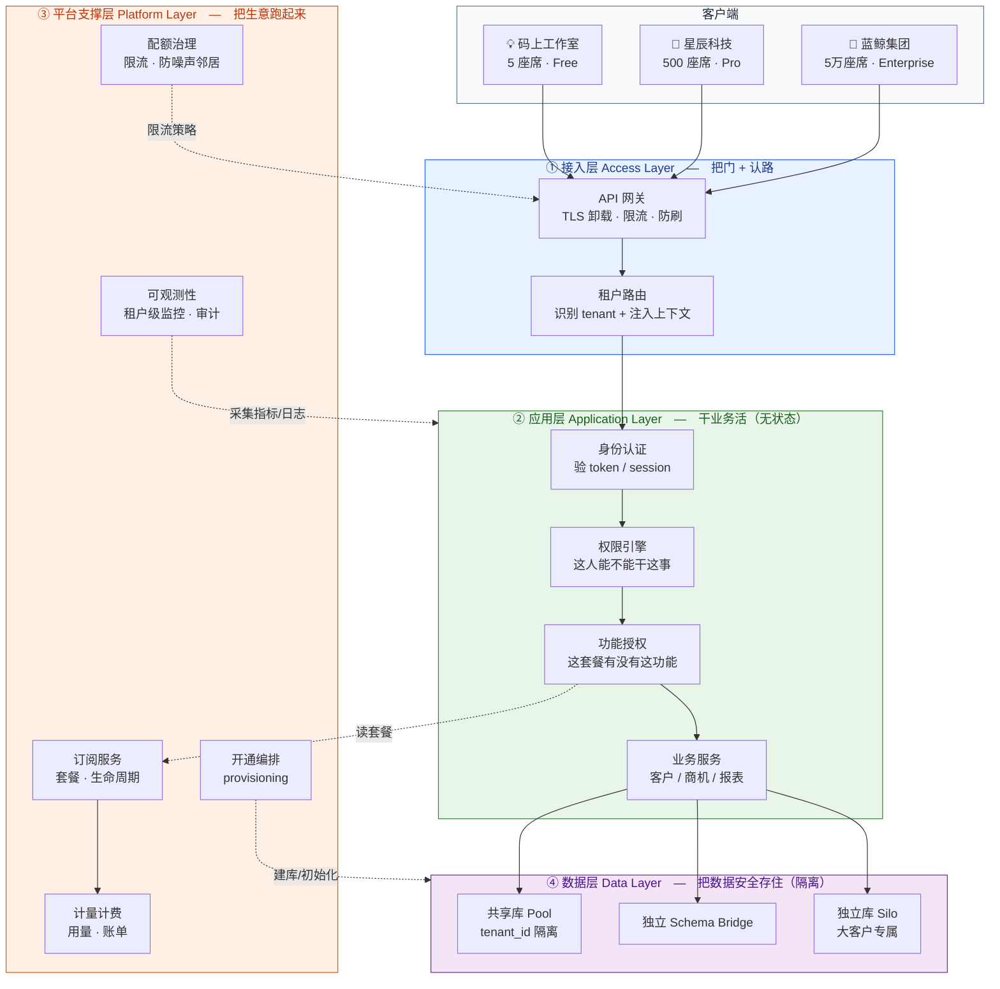
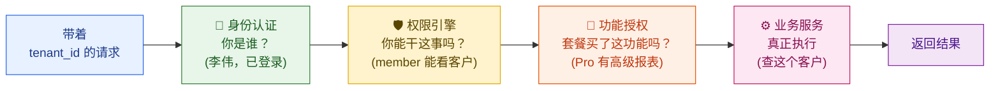
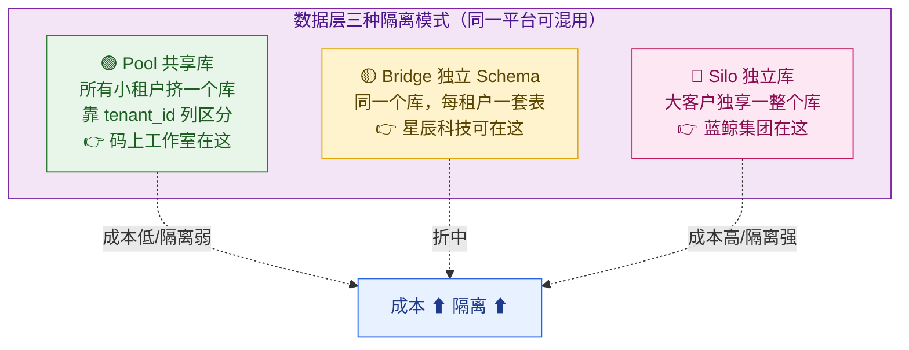
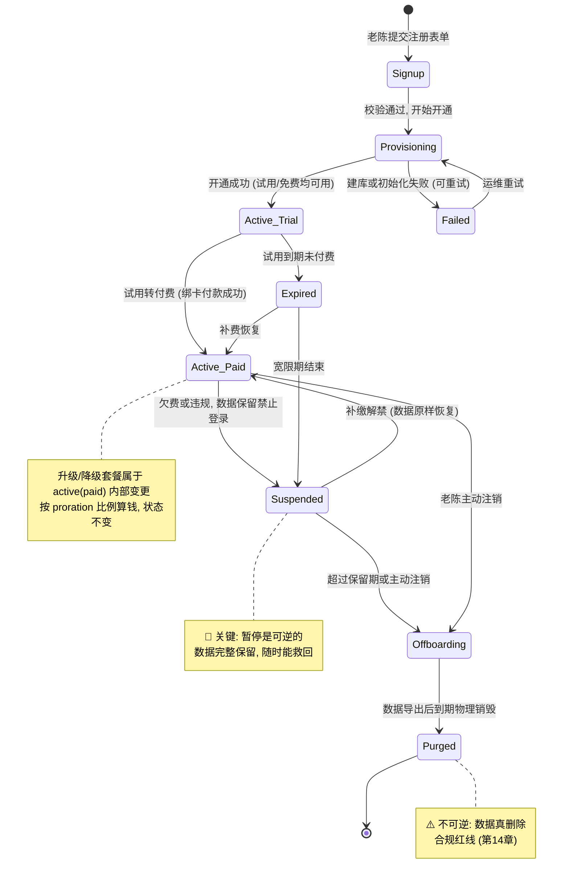
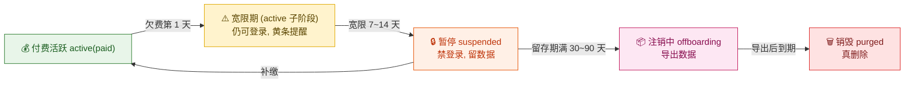
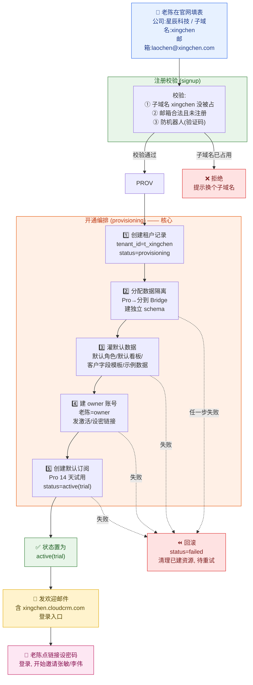
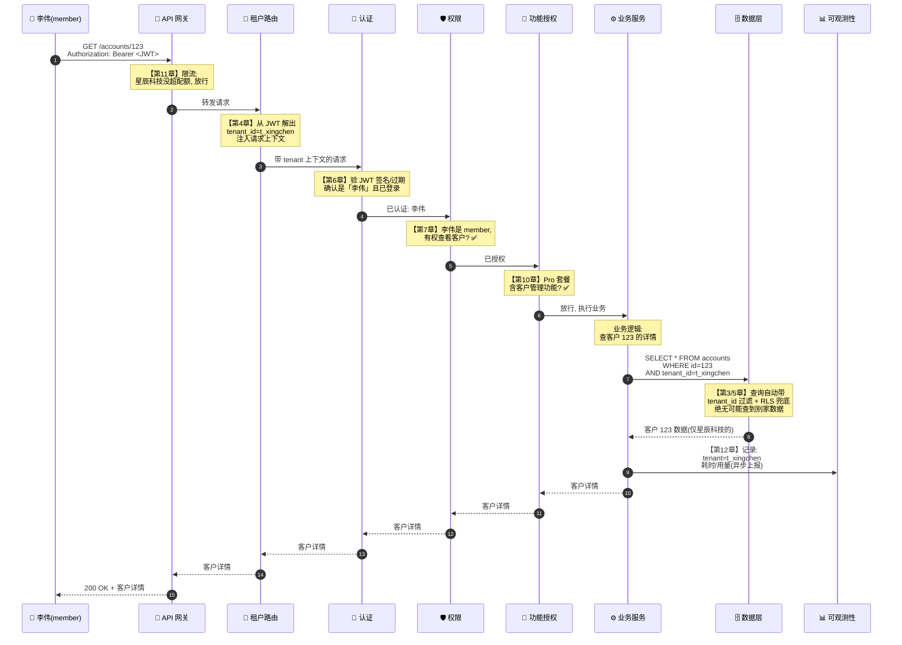
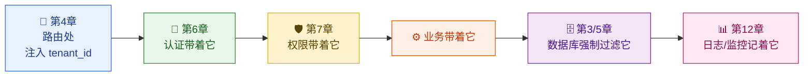

# 第 2 章 整体架构与一个租户的一生

> 第 1 章我们搞清楚了「SaaS 是什么、为什么难」。这一章要做两件事：先把整座 SaaS 大楼的**四层架构**从上到下拆开看一遍，知道每层各管什么、有哪些组件；再跟着 IT 管理员**老陈注册星辰科技**这条线，看一个租户从「填注册表单」到「数据被彻底销毁」的**完整一生**，以及一个普通 API 请求是怎么穿过这四层、最后把数据安全地送回李伟浏览器的。

> 本章是一张「**导航地图**」。我们不深挖任何一个模块的实现（那是后面 13 章各自的活），而是把它们摆到正确的位置上，让你先建立「整体感」。读完后再去看第 3~14 章，你会知道每个细节卡在整张图的哪个螺丝孔里。

---

## 本章导读（读完能回答这些问题）

- SaaS 平台的**四层架构**分别是什么？每一层的核心职责和典型组件是什么？为什么要这么分层？
- 「应用层无状态」是什么意思？为什么对 SaaS 这么重要？
- 一个租户从生到死要经历哪些状态？**租户生命周期状态机**长什么样？哪些状态转换是可逆的，哪些是不可逆的？
- 老陈在官网点了「免费试用」之后，平台后台到底偷偷做了哪些事？**开通（provisioning）**这一步为什么是 SaaS 最容易出 bug 的地方？
- 李伟在手机上点开一个客户详情，这个请求从离开手机到数据返回，依次经过了哪些环节？每个环节交给本教程哪一章详解？

---

## 2.1 先鸟瞰：四层架构全景

在第 1 章的全景图里，我们已经见过这四层。这一节我们把它**逐层拆开**，讲清每层「管什么、有哪些组件、为什么独立成一层」。

先记住一个心智模型：**一个请求像水一样自上而下流过四层，而「租户身份」这条线像染料一样从第一滴水开始就被注入，一直流到最底层都不褪色。**



> **为什么要分这四层？** 一句话：**让「变化频率不同的东西」彼此解耦**。业务逻辑（应用层）天天改，但「怎么识别租户」（接入层）和「数据怎么隔离」（数据层）一旦定下来就很少动。把它们分层，改业务时不会碰坏隔离地基，加新套餐时不用动业务代码。这就是 SaaS 架构能「既共享又隔离」的工程基础。

下面逐层细看。

### 2.1.1 ① 接入层（Access Layer）：把门 + 认路

**接入层（Access Layer，平台的「大门和门卫」：所有请求都得先过这里，它负责验明正身、识别你是哪家租户、扛住流量洪峰）** 是租户请求进入平台的第一站。它本身**不懂业务**——它不知道什么是「客户」「商机」，它只关心三件事：

| 组件 | 职责 | 大白话 |
| --- | --- | --- |
| **API 网关（API Gateway）** | TLS 卸载、统一鉴权入口、限流防刷、协议转换、把请求转发给后端 | 写字楼的**前台 + 旋转门**：访客先在这刷卡、过安检，前台再告诉你去几楼 |
| **租户路由（Tenant Routing）** | 从请求里**识别出租户身份**，把 `tenant_id` 注入到请求上下文 | 前台一看你工牌：「哦你是星辰科技的，3 楼请」——并在你身上贴个「星辰科技」的标签，后面所有楼层都认这个标签 |

**接入层最关键的动作，是「识别租户 + 注入上下文」。** 怎么从一个 HTTP 请求里知道「这是星辰科技发来的」？常见手段有四种（这里只点一下，**详见第 4 章《租户标识与上下文路由》**）：

- **子域名（subdomain）**：`xingchen.cloudcrm.com` → 租户是星辰科技。
- **URL 路径（path）**：`cloudcrm.com/t/xingchen/...`。
- **请求头（HTTP Header）**：`X-Tenant-Id: t_xingchen`。
- **JWT 里的 claim**：登录令牌内部就携带了 `tenant_id` 字段（最常用、最安全，因为客户端篡改不了）。

> **🪪 区分两个 ID**：`xingchen` 是星辰科技对外可见的**子域名 / URL 标识**（用户在浏览器里看到的）；`t_xingchen` 是平台**内部的租户 ID**（带 `t_` 前缀，写进租户总表、JWT claim、数据库行的 `tenant_id` 列）。本章后续凡是内部 `tenant_id` 一律写作 `t_xingchen`，子域名/登录入口才写 `xingchen`。

> **🎬 画面感**：李伟在浏览器输入 `xingchen.cloudcrm.com` 登录后，每一个后续请求的 JWT 令牌里都焊死了 `tenant_id=t_xingchen`。网关一解析令牌，就在请求上下文里盖了个章：「此请求属于星辰科技」。这个章会一路跟到数据库，确保李伟绝无可能查到蓝鲸集团的客户。

接入层还承担**第一道限流**：当蓝鲸集团某个脚本疯狂打 API 时，网关在这里就把它的流量掐在阈值内，**不让它把整栋楼的电梯都占满**（这就是「噪声邻居」问题，**详见第 11 章**）。

### 2.1.2 ② 应用层（Application Layer）：干业务活，而且必须无状态

**应用层（Application Layer，平台的「业务大脑」：真正执行「录客户、查商机、出报表」这些活的地方）** 是请求穿过大门后真正干活的楼层。它包含一串**前后衔接的关卡**，每个请求依次经过：



这四道关卡，每道都有专门的一章：

| 组件 | 职责 | 详解章节 |
| --- | --- | --- |
| **身份认证（Authentication）** | 确认「你是李伟，且已经登录、令牌没过期」 | **第 6 章** |
| **权限引擎（Authorization / RBAC·ABAC）** | 确认「member 角色的李伟，有权看客户列表」 | **第 7 章** |
| **功能授权（Entitlements）** | 确认「星辰科技买的 Pro 套餐，包含『高级报表』这个功能」 | **第 10 章** |
| **业务服务（Business Service）** | 真正执行 CRM 业务：增删改查客户、商机、活动记录 | 散落各章 |

> **认证 vs 授权 vs 功能授权——三个常被搞混的概念，用一句话区分**：
> - **认证（Authn）= 你是谁**：你是李伟吗？（拿令牌验真身）
> - **授权（Authz）= 你能做什么**：李伟这个 member 能删客户吗？（看角色权限）
> - **功能授权（Entitlement）= 你这家公司买没买这功能**：星辰科技的套餐里有「批量导出」吗？（看订阅套餐）
>
> 第一个看的是**人**，第二个看的是**人的角色**，第三个看的是**公司的钱包**。三者层层递进，缺一不可。

**应用层最重要的设计原则：无状态（Stateless）。**

> **无状态（Stateless，无状态服务：服务器本身不在内存里保存「李伟登录了、张敏正在编辑哪个客户」这类会话信息，每个请求都自带全部所需身份信息）**。

为什么无状态对 SaaS 是生死攸关的？因为 SaaS 要**弹性扩容**。当星辰科技、蓝鲸集团同时在月底冲业绩，QPS 暴涨，平台需要瞬间从 10 台服务器扩到 100 台。如果服务器在内存里记着「李伟的会话在 3 号机」，那扩容时新机器啥都不知道，老机器一挂会话就丢。**无状态**意味着每台服务器都长得一模一样、可以随意增减、请求打到哪台都行——会话信息（包括 `tenant_id`）全装在请求自带的 JWT 令牌里。

> **🎬 画面感**：月底最后一天 23:00，全国销售都在疯狂补录商机，QPS 从 5 万飙到 30 万。平台自动把应用层从 20 个 Pod 扩到 120 个 Pod。李伟连续点了 10 个客户，这 10 个请求被负载均衡随机打到了 10 台不同的机器上——但因为每个请求都自带「我是星辰科技的李伟」的令牌，每台机器都能独立处理，毫无障碍。这就是无状态的威力（弹性扩展详见**第 11 章**）。

### 2.1.3 ③ 平台支撑层（Platform Layer）：把「生意」和「治理」跑起来

**平台支撑层（Platform Layer，平台的「后勤 + 财务 + 物业」：不直接处理 CRM 业务，但管着订阅、计费、配额、监控这些让 SaaS 作为一门生意能运转的事）**。如果说应用层让产品「能用」，平台支撑层让产品「能卖、能管、能赚钱」。它是 SaaS **区别于普通 Web 应用的核心**——普通网站没有套餐、没有计量计费、没有租户级配额。

| 组件 | 职责 | 详解章节 |
| --- | --- | --- |
| **订阅服务（Subscription）** | 管租户买了哪个套餐、什么时候到期、升降级 | **第 8 章** |
| **计量计费（Metering & Billing）** | 记录用量（API 调用数、存储量、座席数）→ 算钱 → 出账单 | **第 9 章** |
| **配额治理（Quota & Throttling）** | 给每个租户划用量上限，防止一个大租户拖垮所有人 | **第 11 章** |
| **可观测性（Observability）** | 带 `tenant_id` 的监控、日志、链路追踪、审计、SLA 监控 | **第 12 章** |
| **开通编排（Provisioning）** | 新租户注册时，自动建库、初始化数据、建账号——本章 2.3 节重点讲 | 本章 |

注意平台支撑层与上层的**协作关系**（看回 2.1 的全景图里的虚线）：

- 应用层的「功能授权」组件要判断「星辰科技有没有高级报表」，得**读订阅服务**的套餐信息（`ENT -.读套餐.-> SUB`）。
- 订阅服务的套餐变更，会触发**计费服务**重新算钱（`SUB --> BILL`）。
- 配额治理把「每个租户每秒最多 N 次请求」的策略**下发给接入层网关**去执行（`QUOTA -.限流策略.-> GW`）。

> 这层最能体现第 1 章那句话：**「商业即架构」**。套餐怎么定价、按座席还是按用量收费，会直接决定订阅、计量、计费这三个服务怎么建模。定价模型一变，这层就得改。

### 2.1.4 ④ 数据层（Data Layer）：把数据安全存住，隔离永不破

**数据层（Data Layer，平台的「保险库」：所有租户的数据最终都存在这里，核心使命是『A 公司绝对看不到 B 公司一行数据』）**。这是 SaaS 一旦出事就「公司倒闭级」的一层——一次跨租户数据泄漏，足以摧毁所有客户的信任。

数据层最有意思的地方是：**同一个平台，不同租户可以用不同的存储隔离模式**，这正是第 1 章那句信条的体现——

> **「Placement is configuration, isolation remains invariant」**（放在哪是可配的，隔离性永远不变）。



| 模式 | 谁用 | 怎么隔离 | 一句话 |
| --- | --- | --- | --- |
| **Pool（共享库）** | 💡 码上工作室（Free，5 人） | 所有租户共用一套表，每行加 `tenant_id` 列，查询自动过滤 | 最省钱，10 万小租户挤一个库 |
| **Bridge（共享库独立 Schema）** | 🏢 星辰科技（Pro） | 同一个数据库实例，每个租户一套独立的表（schema） | 折中：成本可控，隔离更强 |
| **Silo（独立库）** | 🏦 蓝鲸集团（Enterprise） | 独享一整个数据库实例，物理隔离 | 最贵最安全，金融/合规客户专属 |

这里只是亮个相。**隔离模型怎么选、`tenant_id` 行级隔离怎么落地、RLS 行级安全怎么兜底、大租户怎么搬家**——是第 3 章和第 5 章的核心内容，本章不展开。

---

> 四层看完了。下面换一个视角：不再看「请求横着流过四层」，而是看「一个租户竖着活完一辈子」。

## 2.2 租户的一生：生命周期状态机

一个租户不是「注册了就一直在」。它会注册、开通、试用、付费、升级、降级、欠费暂停、主动注销，最后数据被销毁。这一连串变化，工程上用一个**状态机（State Machine，状态机：把一个事物所有可能的状态、以及状态之间允许的跳转，画成一张图，跳转必须按图走，不能乱跳）** 来精确描述。

为什么 SaaS 一定要把租户生命周期建模成状态机？因为**钱和数据都跟着状态走**：

- 租户在 `trialing`（试用中）时不收费；进入 `active`（活跃）才开始计费。
- 租户 `suspended`（暂停）时，要拒绝登录，但**数据不能删**（万一他续费了呢）。
- 租户 `purged`（已销毁）时，数据必须**真的物理删除**（合规要求，**详见第 14 章**）。
- 每一次状态跳转，都可能触发邮件、计费、审计日志。状态乱了，要么少收钱，要么多删数据——都是事故。

### 2.2.1 完整状态机图



> **mermaid 状态机说明**：圆点 `[*]` 表示「生命起点/终点」。箭头表示「允许的状态跳转」，箭头上的文字是「触发跳转的事件 + 备注」。**没有箭头连接的两个状态之间，禁止直接跳转**——比如不能从 `Signup` 直接跳到 `Purged`，必须老老实实走完中间流程。

### 2.2.2 每个状态在干什么

| 状态 | 英文 | 含义 | 收费？ | 数据状态 | 能否登录 |
| --- | --- | --- | --- | --- | --- |
| **注册** | `signup` | 表单已提交，正在校验（邮箱、公司名、子域名是否被占） | 否 | 还没有 | 否 |
| **开通中** | `provisioning` | 后台正在建库、初始化、建账号（见 2.3 节） | 否 | 正在创建 | 否 |
| **开通失败** | `failed` | 建库或初始化出错，挂起待重试 | 否 | 部分创建（需回滚） | 否 |
| **试用中** | `active(trial)` | 已开通可正常使用，处于免费试用期 | 否 | 正常 | ✅ 是 |
| **付费活跃** | `active(paid)` | 已付费，正常使用，开始计量计费 | ✅ 是 | 正常 | ✅ 是 |
| **已过期** | `expired` | **试用到期**未付费（试用宽限路径），可补费恢复或宽限期满转暂停 | 否 | 正常（只读或受限） | ⚠️ 受限 |
| **已暂停** | `suspended` | 欠费/违规被暂停，**数据完整保留** | 暂停计费 | **完整保留** | ❌ 否 |
| **注销中** | `offboarding` | 客户决定离开，正在导出数据、清算账单 | 结算最后账单 | 准备销毁 | ⚠️ 仅导出 |
| **已销毁** | `purged` | 数据物理删除，租户彻底消失 | 否 | **已删除（不可逆）** | ❌ 否 |

### 2.2.3 两条最容易踩坑的红线

**红线一：可逆 vs 不可逆，绝不能搞反。**

`suspended`（暂停）是**可逆**的——它只是「禁止登录 + 暂停计费」，数据原封不动躺在那里。客户哪天回心转意补了钱，一键就能恢复到 `active`。**很多团队的事故，是在 `suspended` 时就把数据删了，导致客户回来时数据全没了。** 数据销毁只能发生在 `purged`，而且 `purged` 是终态、不可逆。

**红线二：暂停不是删除，欠费不能立刻断数据。**

> **先厘清「宽限期」这个词**：它指的是「逾期但还没翻脸」的缓冲期，分两条来源——
> - **付费欠费宽限**：`active(paid)` 状态下扣款失败，给客户几天缓冲（仍可登录、挂黄条提醒），处理不了才转 `suspended`。**这个宽限期是 `active(paid)` 的一个内部缓冲子阶段，不是独立状态**。
> - **试用到期宽限**：试用期满未付费，落到 `expired` 状态（受限只读），可补费恢复或宽限期满转 `suspended`。
>
> 下面这张图画的是**付费欠费**这条路径（与 `expired` 无关），其中「宽限期」是 `active(paid)` 内部的缓冲子阶段：



> **🎬 画面感**：星辰科技这个月信用卡过期，扣款失败。系统**不会立刻封号**——而是先给老陈连发几封邮件、在系统顶部挂个黄色提醒条「您的账单逾期，请尽快处理」（付费欠费宽限期，此时仍是 `active(paid)`）。两周后还没处理，才进入 `suspended`，李伟和张敏登录会看到「账号已暂停，请联系管理员续费」。但这时候**星辰科技 500 座席录入的几十万条客户数据，一行都没动**。老陈一旦补缴，下一秒全员恢复正常。只有客户明确说「我们不用了」并走完导出流程，数据才会在留存期后被真正销毁。

> **状态机要落地，靠的是一张「状态 + 允许跳转」的配置表 + 一个守卫函数**。下面给一段最小化的伪代码示意，说明「跳转必须按图走」是怎么用代码强制的（真实实现里订阅服务会更复杂，详见第 8 章）：

```java
// 租户生命周期状态机：用一张「允许跳转表」把图焊进代码，杜绝乱跳

public enum TenantStatus {
    SIGNUP, PROVISIONING, FAILED, ACTIVE_TRIAL, ACTIVE_PAID,
    EXPIRED, SUSPENDED, OFFBOARDING, PURGED
}

public class TenantLifecycle {

    // 「允许跳转表」：key = 当前状态，value = 允许跳到的状态集合
    // 这张表就是上面那张状态机图的代码翻译——图里没画的箭头，这里就不允许
    private static final Map<TenantStatus, Set<TenantStatus>> ALLOWED = Map.of(
        SIGNUP,        Set.of(PROVISIONING),
        PROVISIONING,  Set.of(ACTIVE_TRIAL, FAILED),
        FAILED,        Set.of(PROVISIONING),               // 失败可重试
        ACTIVE_TRIAL,  Set.of(ACTIVE_PAID, EXPIRED),
        // 升降级套餐属于 active(paid) 内部变更（按 proration 算钱），不改状态，故不在跳转表里
        ACTIVE_PAID,   Set.of(SUSPENDED, OFFBOARDING),
        EXPIRED,       Set.of(SUSPENDED, ACTIVE_PAID),  // 过期后补费可恢复（可逆）
        SUSPENDED,     Set.of(ACTIVE_PAID, OFFBOARDING),   // 暂停可恢复(可逆!)
        OFFBOARDING,   Set.of(PURGED),
        PURGED,        Set.of()                            // 终态，哪都去不了
    );

    /**
     * 状态跳转守卫：任何状态变更都必须过这个函数，跳转不在表里就直接拒绝。
     * 这是防止「欠费时误删数据」这类事故的第一道闸门。
     */
    public void transition(Tenant tenant, TenantStatus to) {
        TenantStatus from = tenant.getStatus();
        if (!ALLOWED.getOrDefault(from, Set.of()).contains(to)) {
            // 非法跳转：比如有人想从 SUSPENDED 直接跳 PURGED（绕过导出），拦截
            throw new IllegalStateTransitionException(from, to);
        }
        tenant.setStatus(to);
        // 每次合法跳转都落审计日志 + 发领域事件（订阅/计费/邮件等去订阅）
        auditLog.record(tenant.getId(), from, to);
        eventBus.publish(new TenantStatusChanged(tenant.getId(), from, to));
    }
}
```

---

## 2.3 镜头特写：开通（Provisioning）到底做了什么

整条生命周期里，**开通（Provisioning，开通编排：新租户注册后，平台后台自动『建库 + 灌默认数据 + 建首个管理员账号 + 发欢迎信』这一整套初始化动作）** 是工程上最容易出 bug、也最能体现「SaaS 自动化」功力的一步。

为什么难？因为它是一个**横跨多个系统的分布式流程**：要建数据库、要初始化几十张默认数据、要调身份服务建账号、要调邮件服务发信——这些步骤里**任何一步失败，都不能让租户停在「半开通」的脏状态**。一个建了库但没建账号的租户，比一个根本没注册的租户更麻烦。

### 2.3.1 老陈注册星辰科技：完整开通流程

我们用本章最重要的例子串起来——**IT 管理员老陈，在云客 CRM 官网点了「免费试用」，填了星辰科技的信息**。看后台这一套连招：



### 2.3.2 五个步骤逐个说人话

| # | 步骤 | 在干嘛（说人话） | 关联章节 |
| --- | --- | --- | --- |
| 1 | **创建租户记录** | 在「租户总表」里写一行：星辰科技、ID 是 `t_xingchen`、状态先标 `provisioning`。这是租户的「身份证」 | 第 4 章 |
| 2 | **分配数据隔离** | 决定星辰科技的数据放哪——Pro 套餐分到 Bridge 模式，给它建一套独立的 schema/表 | 第 3、5 章 |
| 3 | **初始化默认数据** | 灌入开箱即用的内容：默认角色（owner/admin/member）、默认销售看板、客户字段模板、几条示例客户数据。**让老陈一登录就有东西看，而不是空白页** | 第 7 章（角色） |
| 4 | **创建 owner 账号** | 把老陈设为这家租户的超管（owner），生成一个「设置密码」的激活链接 | 第 6 章 |
| 5 | **创建默认订阅** | 给星辰科技开一个「Pro 套餐 · 14 天试用」的订阅，状态置 `active(trial)` | 第 8 章 |

全部成功后，状态从 `provisioning` 翻成 `active(trial)`，发欢迎邮件。老陈点链接、设密码、登录 `xingchen.cloudcrm.com`，就能开始邀请张敏（admin）和李伟（member）了。

> **💡 为什么要灌「默认数据」？** 这是 SaaS 留住客户的关键细节。如果老陈注册完登录看到一片空白、不知道从哪下手，很可能就流失了（提高 Churn）。预置默认看板、字段模板、示例客户，能让客户**第一分钟就感受到价值**——这叫「快速达到 Aha 时刻」。所以 provisioning 不只是技术初始化，也是产品体验的一部分。

### 2.3.3 开通最大的坑：失败了怎么办（幂等 + 回滚）

开通是个多步骤分布式流程，**第 3 步灌数据时数据库突然抖了一下失败了，怎么办？** 这里有两个工程上必须处理的硬问题：

**问题一：不能停在「半开通」脏状态。** 第 1、2 步成功（建了记录、建了 schema），第 3 步失败——此时星辰科技处于「库建好了但没数据、没账号」的残废状态。正确做法是：把状态标成 `failed`，**回滚已创建的资源**（或者保留待续），交给运维/自动任务重试。绝不能让它停在 `provisioning` 假装在跑、实则卡死。

**问题二：重试必须幂等。** **幂等（Idempotent，幂等性：同一个操作执行一次和执行十次，结果完全一样，不会重复建库、不会建出两个 owner）**。开通重试时，第 1、2 步已经成功过了，重试不能又建一个重复的 schema、又建一个重复的老陈账号。所以每一步都要先检查「我是不是已经做过了」。

```java
// 开通编排：每一步都做成「幂等 + 可回滚」，失败标 failed 待重试
// （真实实现常用 Saga / 工作流引擎做编排与补偿，这里简化示意原理）

public void provision(SignupRequest req) {
    Tenant tenant = createTenantRecord(req);   // step1: status=PROVISIONING
    try {
        // step2: 幂等——已建过 schema 就跳过，不重复建
        if (!dataStore.schemaExists(tenant.getId())) {
            dataStore.createSchema(tenant.getId(), pickIsolation(req.getPlan()));
        }
        // step3: 幂等——示例数据按 tenant 维度去重灌入
        seedDefaultData(tenant.getId());        // 默认角色/看板/字段模板/示例客户
        // step4: 幂等——owner 账号按邮箱唯一，存在则复用
        identityService.ensureOwnerAccount(tenant.getId(), req.getAdminEmail());
        // step5: 开 Pro 14 天试用订阅
        subscriptionService.startTrial(tenant.getId(), Plan.PRO, Duration.ofDays(14));

        lifecycle.transition(tenant, ACTIVE_TRIAL);   // 全部成功 → 试用中
        mailService.sendWelcome(req.getAdminEmail(), tenant.getSubdomain());
    } catch (Exception e) {
        // 任一步失败：标 failed（不停在 provisioning 脏状态），交重试，不向客户暴露内部错误
        lifecycle.transition(tenant, FAILED);
        log.error("provisioning failed for tenant={}", tenant.getId(), e);
        // 上抛由全局异常处理器统一处理，触发告警 + 运维介入
        throw new ProvisioningException(tenant.getId(), e);
    }
}
```

> 开通的编排细节（Saga 模式、补偿事务、异步工作流）属于第 8、13 章的范畴，本章点到为止。这里你要记住的核心是：**provisioning 是一个跨多系统、必须幂等、必须能优雅失败回滚的初始化流程**——这是 SaaS「让客户一键自助开通」体验背后的硬功夫。

---

## 2.4 端到端：一个 API 请求的一生（预览版）

前面我们分别看了「四层结构」和「租户生命周期」。现在把它们合起来，跟着**李伟在手机 App 上点开一个客户详情**这个最普通不过的请求，看它从离开手机到数据返回，**一路经过了哪些环节、每个环节交给本教程哪一章详解**。

> **这是一张「全书索引图」**——它把后面 13 章像糖葫芦一样串了起来。现在你看不懂每个环节的细节没关系，记住它们的**位置和顺序**就行。

### 2.4.1 端到端时序图



### 2.4.2 逐环节拆解：每一步交给哪一章

| # | 环节 | 这一步在干嘛 | 详解章节 |
| --- | --- | --- | --- |
| 1 | **网关 + 限流** | 请求进门，先验有没有超星辰科技的配额、有没有被刷 | **第 11 章** 资源治理 |
| 2 | **租户路由** | 从 JWT 解出 `tenant_id=t_xingchen`，注入上下文，盖上「星辰科技」的章 | **第 4 章** 租户路由 |
| 3 | **身份认证** | 验令牌签名和有效期，确认「确实是李伟、确实已登录」 | **第 6 章** 身份认证 |
| 4 | **权限判断** | 李伟是 member，问「他有权看客户吗？」→ 有 | **第 7 章** 权限模型 |
| 5 | **功能授权** | 星辰科技的 Pro 套餐，问「包含客户管理功能吗？」→ 包含 | **第 10 章** Entitlements |
| 6 | **业务执行** | 真正去查客户 123 的详情 | 业务层 |
| 7 | **数据隔离查询** | SQL 自动带上 `tenant_id=t_xingchen` 过滤，RLS 行级安全再兜一道底 | **第 3、5 章** 隔离与数据层 |
| 8 | **可观测性上报** | 异步记录这次请求属于哪个租户、耗时多少、用了多少量（喂给计费和监控） | **第 12 章** 可观测性 |

> **🎬 把这条链路连成一句话**：李伟点了下客户 → 网关确认星辰科技没超量放行（11 章）→ 路由给请求贴上「星辰科技」标签（4 章）→ 认证确认是李伟本人（6 章）→ 权限确认 member 能看客户（7 章）→ 功能授权确认 Pro 套餐有这功能（10 章）→ 业务去查数据（业务层）→ 数据库强制只查星辰科技的数据（3、5 章）→ 顺手记一笔账和监控（12 章）→ 数据安全返回李伟手机。**整整 8 道关卡，全程都焊着「t_xingchen」这个租户身份，这就是多租户系统的精髓。**

### 2.4.3 一个反复出现的主线：租户上下文（Tenant Context）

回头看这条链路，你会发现一个东西从头到尾贯穿——**租户上下文（Tenant Context，租户上下文：从请求进门那一刻被识别出来的『这是哪家租户』身份，必须像 DNA 一样在整条调用链里无损传递，一直传到数据库）**。



> **🚨 这条线一旦断了，就是泄漏事故。** 如果某个环节忘了把 `tenant_id` 往下传，业务层就可能查到全部租户的数据；如果异步线程没把上下文带过去，日志里就分不清是哪家租户。所以「租户上下文如何无损传递、如何防丢失」是一个独立且关键的主题——**这正是第 4 章《租户标识与上下文路由》要专门讲的事**。你可以把第 4 章理解为「保护这条 DNA 不断裂」的专章。

---

## 本章小结

这一章我们站在最高处俯瞰了整座 SaaS 大楼，建立了贯穿全书的「整体感」：

1. **四层架构**：从上到下是 **接入层**（把门 + 认路：网关、租户路由）→ **应用层**（干业务活：认证、权限、功能授权、业务服务，**必须无状态**才能弹性扩容）→ **平台支撑层**（让生意跑起来：订阅、计费、配额、可观测性、开通）→ **数据层**（把数据安全存住：Pool/Bridge/Silo 三种隔离模式可混用，隔离性永不破）。分层的本质是**让变化频率不同的东西解耦**。

2. **租户生命周期状态机**：租户会经历 `signup → provisioning →（trial）→（paid）→ 升降级 → 暂停 → 注销 → 销毁`。两条红线必须刻进脑子——**`suspended` 暂停是可逆的、数据必须完整保留**；**`purged` 销毁是不可逆的、是合规红线**。状态跳转必须按状态机图走，用「允许跳转表 + 守卫函数」从代码层面杜绝乱跳。

3. **开通（Provisioning）**：新租户注册触发的「建租户记录 → 分配数据隔离 → 灌默认数据 → 建 owner 账号 → 开默认订阅 → 发欢迎信」一整套自动化初始化。它是个**跨多系统、必须幂等、必须能优雅失败回滚**的分布式流程，也是 SaaS「一键自助开通」体验背后的硬功夫。

4. **端到端请求路径**：一个最普通的「查客户」请求要穿过 **网关限流（11 章）→ 租户路由（4 章）→ 认证（6 章）→ 权限（7 章）→ 功能授权（10 章）→ 业务 → 数据隔离查询（3、5 章）→ 可观测性上报（12 章）** 共 8 道关卡。全程贯穿一条主线——**租户上下文（tenant context）必须像 DNA 一样无损传递到底，断了就是泄漏事故**。

接下来，我们从最核心的地基开始深挖。**第 3 章《多租户与隔离模型》** 会回答这个根本问题：成千上万家租户挤在同一套系统里，到底该用 Silo、Pool 还是 Bridge 来隔离？什么时候选哪种？这是 SaaS 区别于一切普通系统的起点。

---

## 参考来源

- AWS SaaS Factory — *SaaS Tenant Onboarding and Provisioning*（租户开通与初始化最佳实践）：<https://aws.amazon.com/partners/programs/saas-factory/>
- AWS Well-Architected — *SaaS Lens*（SaaS 架构四层分层与租户生命周期参考）：<https://docs.aws.amazon.com/wellarchitected/latest/saas-lens/saas-lens.html>
- WorkOS Blog — *What is a multi-tenant architecture?*（多租户架构与租户上下文传递）：<https://workos.com/blog/what-is-multi-tenant-architecture>
- Microsoft Azure Architecture Center — *Multitenancy and tenant lifecycle*（租户生命周期与状态管理）：<https://learn.microsoft.com/en-us/azure/architecture/guide/multitenant/considerations/tenant-lifecycle>
