# 第 3 章：多租户与隔离模型

> 本章是整套教程的「地基中的地基」。前两章讲了 SaaS 是什么、一个租户的一生长什么样；从本章开始，我们正式拆解 SaaS 最核心的工程难题——**多租户与隔离**。你会反复听到一句话：**租户放在哪里是可调的配置，但租户之间的隔离必须永远不变**。本章就是教你理解「放在哪里」有哪几种选法，以及怎么选才不会把自己坑死。

---

## 本章导读（读完你能回答这些问题）

- **多租户（Multi-Tenancy）到底在隔离什么？** 不止是「数据互相看不见」，还有计算资源、网络通道的隔离。
- **Silo / Pool / Bridge 三种隔离模型分别是什么？** 用「独栋别墅 / 合租公寓 / 带隔断的合租」一比就懂。
- **隔离有哪三个维度？** 计算（compute）、存储（storage）、网络（network），三个维度可以独立选档位。
- **为什么不能所有租户都用最强隔离？** 因为「隔离级别 ↔ 成本 ↔ 运维复杂度」是一个跷跷板，按下葫芦浮起瓢。
- **同一个平台能不能同时用多种模型？** 能，而且这才是头部 SaaS 的标准做法——按租户分层（tier）给不同套餐配不同隔离。
- **拿到一个新租户，我该怎么决策给它哪种模型？** 本章给你一棵可以照着走的选型决策树。
- **云客 CRM 的三个租户（码上 / 星辰 / 蓝鲸）各选哪种？为什么？** 成本差多少？

> ⚠️ **本章边界**：本章只讲「**隔离模型怎么选**」这件战略决策。至于落到数据库里 `tenant_id` 怎么加、行级安全（RLS）怎么配、怎么分库分表——那是**第 5 章**的活儿；租户在请求里怎么被识别出来——那是**第 4 章**的活儿。本章不碰这两块的实现细节，只在需要时一句话引用。

---

## 3.1 先把问题摆正：多租户到底要隔离什么

先回顾一个上一章建立的核心概念：

> **多租户（Multi-Tenancy，多租户）**：一套软件系统同时服务多家互不相干的公司（租户），它们共用同一套代码、同一批服务器，但每家公司的数据、配置、资源互相看不见、互不干扰。

这里有一对**天生矛盾**，是 SaaS 工程一切纠结的根源：

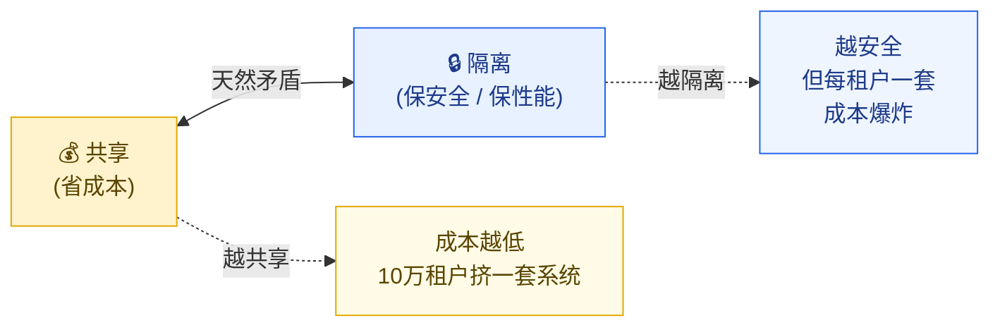

- **越共享，越省钱**：10 万家公司挤在同一套系统里，每家公司分摊到的服务器成本可能就几毛钱。这是 SaaS 商业模式能成立的根本——传统软件是每家公司自己买服务器装一套，成本天差地别。
- **越隔离，越安全 / 性能越稳**：如果每家公司都有完全独立的服务器和数据库，那 A 公司怎么折腾都不会影响 B 公司，数据更是物理隔开。但代价是成本和运维复杂度直线上升。

**「隔离」这个词，工程上其实是三件事，别混为一谈。** 很多新手以为隔离只是「数据别串了」，那只是其中一维。完整的隔离有三个维度：

### 三个隔离维度

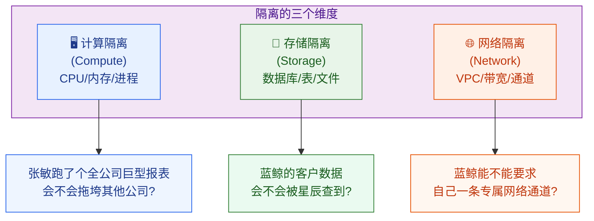

| 维度 | 中文全称 + 英文 | 大白话解释 | 云客 CRM 里的具体问题 |
| --- | --- | --- | --- |
| **计算隔离** | Compute Isolation（计算隔离） | 不同租户用的 CPU、内存、进程/容器是否分开 | 星辰科技的张敏导出 50 万条客户做全公司报表，CPU 被吃满——蓝鲸集团的销售此刻会不会卡？ |
| **存储隔离** | Storage Isolation（存储隔离） | 不同租户的数据是否存在不同的库/表/文件，物理或逻辑分开 | 蓝鲸集团（金融客户）要求：我的客户数据绝不能和别家放一张表，万一查询写错了 WHERE 条件就泄漏了 |
| **网络隔离** | Network Isolation（网络隔离） | 不同租户的流量是否走独立的网络通道（VPC、专线、独立网段） | 蓝鲸要求数据传输走专属网络，不和公网用户混在一个网段——这是金融合规的硬要求 |

**关键认知**：这三个维度**可以独立选档位**。你完全可以「存储强隔离 + 计算弱隔离」，也可以反过来。后面讲的 Silo/Pool/Bridge 三种模型，本质就是这三个维度的不同组合套餐。

> 📌 **一个常被忽视的「噪声邻居」问题**：当多个租户共享计算资源时，一个租户的暴用会拖垮其他租户的体验——这叫**噪声邻居（Noisy Neighbor，吵闹的邻居：就像合租时室友半夜开派对，吵得你睡不着）**。它属于「计算隔离」维度，是 Pool 模型的头号风险。本章只点到为止，具体怎么治（租户级限流、配额、热点隔离）在 **第 11 章**专门讲。

---

## 3.2 三种隔离模型：独栋别墅 / 合租公寓 / 带隔断的合租

理解了三个维度后，业界把常见的隔离组合归纳成了三种经典模型。这是亚马逊 AWS SaaS Factory 团队提出、现在已成行业通用语言的分类。我们用「住房」来比喻，秒懂。

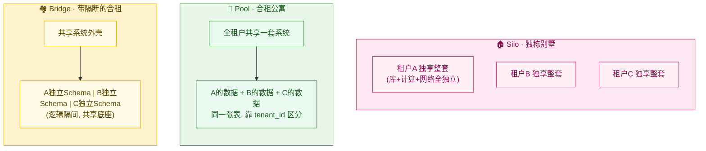

### 模型一：Silo（筒仓模型）—— 独栋别墅 🏠

> **Silo（筒仓模型，独享模型）**：每个租户独享一整套完全独立的资源栈——独立的数据库、独立的计算实例、甚至独立的网络。租户之间在物理/逻辑上几乎完全隔开，就像各住各的独栋别墅，互不打扰。

**比喻**：你和邻居各住一栋独栋别墅。你家漏水、办派对、装修，完全不影响隔壁。隐私拉满、互不干扰，但盖三栋别墅的成本远高于盖一栋三层公寓让三家分住。

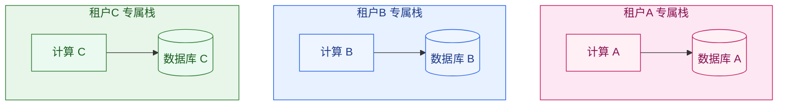

| 维度 | Silo 的表现 |
| --- | --- |
| **存储隔离** | 极强（独立数据库，物理隔开） |
| **计算隔离** | 极强（独立实例，无噪声邻居） |
| **网络隔离** | 可做到极强（独立 VPC / 专线） |
| **隔离感** | 🟢🟢🟢 最强 |
| **单租户成本** | 🔴🔴🔴 最高（每租户一套基础设施） |
| **运维复杂度** | 🔴🔴🔴 高（N 个租户 = N 套要监控、升级、备份） |

**适合谁**：
- 大客户、金融/医疗等强监管行业（合规硬要求数据物理隔离）。
- 愿意为「我的数据绝对独立」付高价的企业（Enterprise 套餐）。
- 有「数据驻留（Data Residency，数据驻留：数据必须留在指定国家/地区境内，不能出境）」需求的租户。

**最大的坑**：运维成本随租户数**线性增长**。如果 10 万个免费租户都给 Silo，平台会被运维和账单活活拖垮——这就是为什么 Silo **绝不能给小租户用**。

> 💡 **注意**：Silo 不一定意味着「一个租户一台物理机」。在云上，更常见的做法是用同一套 Kubernetes 集群、不同的 namespace + 独立数据库实例来逼近 Silo 效果。「独享」是逻辑概念，落地方式很多——具体部署形态在 **第 13 章**（单元化部署）展开。

### 模型二：Pool（池化模型）—— 合租公寓 🏢

> **Pool（池化模型，共享模型）**：所有租户共享同一套系统、同一个数据库、同一批计算资源。靠在每条数据上打一个 `tenant_id`（租户标识）来区分谁是谁。就像很多人合租一套公寓，所有人共用厨房、客厅，靠各自房间门上的名牌区分。

**比喻**：一套三居室合租给三个人。共用厨房、卫生间、客厅（共享计算和系统），每人的私人物品放自己房间，靠房门名牌（`tenant_id`）区分。极致省钱，但如果一个室友半夜开派对（暴用资源），全屋都受影响（噪声邻居）。而且——只要哪天名牌挂错了门（查询忘了带 `tenant_id` 过滤），就可能拿错别人的东西（跨租户数据泄漏）。

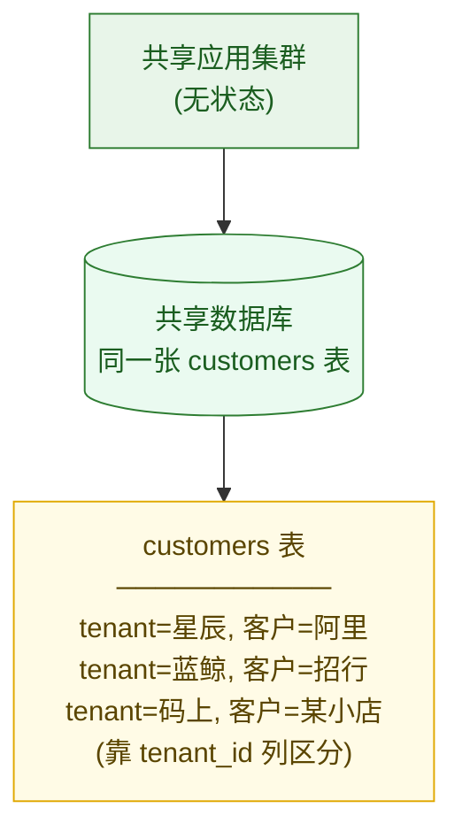

| 维度 | Pool 的表现 |
| --- | --- |
| **存储隔离** | 弱（同库同表，靠 `tenant_id` 逻辑隔离） |
| **计算隔离** | 弱（共享实例，有噪声邻居风险） |
| **网络隔离** | 弱（共享网络） |
| **隔离感** | 🟡 较弱（靠应用层 + 数据库纪律保证） |
| **单租户成本** | 🟢🟢🟢 最低（成本被海量租户均摊到趋近于零） |
| **运维复杂度** | 🟢 低（只有一套系统要维护，升级一次全员生效） |

**适合谁**：
- 海量的中小租户、免费租户（成本敏感，单租户付费少甚至不付费）。
- 标准化程度高、没有特殊合规要求的租户（Free / Starter / 大部分 Pro）。

**最大的价值**：**规模经济**。10 万个租户共享一套系统，每个租户的边际成本极低，这是 SaaS 能用低价打穿市场的核心武器。

**最大的风险**：
1. **跨租户数据泄漏**——一条 SQL 忘了带 `tenant_id`，A 公司就看到 B 公司的客户了。这是 Pool 模型的头号杀手级风险（怎么防，是第 5 章的核心内容）。
2. **噪声邻居**——一个大租户暴用，拖垮所有人（第 11 章治理）。

### 模型三：Bridge（桥接模型）—— 带隔断的合租 🏘️

> **Bridge（桥接模型，混合模型）**：介于 Silo 和 Pool 之间。它的本质是**按组件/微服务把 silo 和 pool 混着用**——系统的某些部分（典型如无状态的 Web/接入层）走 Pool 共享，另一些部分（典型如业务逻辑或存储层）走 Silo 独立。换句话说，Bridge 不是某一种固定形态，而是「同一个平台里，一部分共享、一部分独立」的混合策略。
>
> 在 AWS SaaS Factory 的白皮书里，**存储层给每个租户一个独立的 Schema（数据库模式，可理解为同一个数据库里的独立命名空间/隔间）或独立表前缀**，是 Bridge 在存储维度最常被举到的一个落地示例——但它只是 Bridge 的「一种典型形态」，不等于 Bridge 的全部定义。本章后续示意图就用这个最常见的「共享计算 + 独立 Schema」形态来讲解，但请记住：Bridge 的精髓是**组件级的混合**，独立 Schema 只是它在存储层最常见的一种表现。

**比喻**：还是合租，但房东给每个房间装了独立的门锁和隔断墙（某些组件走 Silo，如独立 Schema）。共用水电管道和大门（某些组件走 Pool，如共享计算），但你绝对进不去别人房间。比独栋便宜，比纯合租安全。

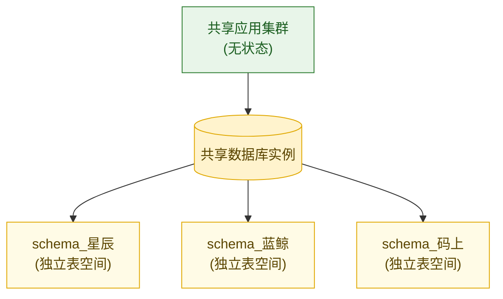

| 维度 | Bridge 的表现 |
| --- | --- |
| **存储隔离** | 中（独立 Schema，逻辑隔离强于 Pool，弱于 Silo） |
| **计算隔离** | 弱~中（通常仍共享计算） |
| **网络隔离** | 弱（通常共享网络） |
| **隔离感** | 🟢🟡 中等偏上 |
| **单租户成本** | 🟡 中（存储成本上升，计算仍共享） |
| **运维复杂度** | 🟠 中偏高（每加一个租户要建 Schema、跑迁移；Schema 数量多了 DDL 变更很痛苦） |

**适合谁**：
- 中大型租户，对存储隔离有要求但还没到要独立数据库的程度。
- 想给 Pro 套餐做差异化、提供「数据更独立」卖点的场景。

**Bridge 的两难**：它常常是个「妥协位」——既没有 Pool 的极致省钱，也没有 Silo 的极致安全。在实践中，很多团队发现 Bridge 的运维痛点（成百上千个 Schema 的统一变更）不比 Silo 轻松多少，所以会谨慎使用。**它更像是一个过渡形态或针对特定客群的中间档**。

> 📌 **划重点**：Silo/Pool/Bridge 不是「三选一」的单选题，而是「调色盘」。同一个 SaaS 平台**完全可以三种都用**——给免费租户 Pool、给大企业 Silo，这正是 3.5 节「租户分层」要讲的。

---

## 3.3 三模型横向对比：一张表看清差异

把三种模型放在一起对比，差异一目了然。后面云客 CRM 选型就是照着这张表来判断的。

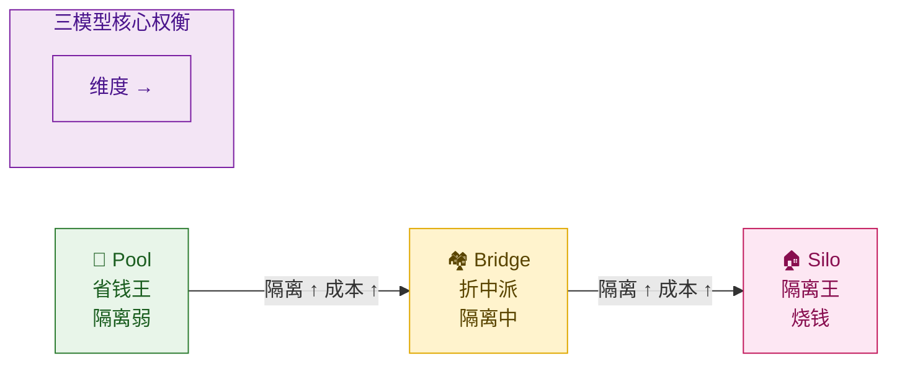

| 对比维度 | 🏢 Pool（合租公寓） | 🏘️ Bridge（带隔断合租） | 🏠 Silo（独栋别墅） |
| --- | --- | --- | --- |
| **比喻** | 大家挤一套，名牌区分 | 共底座 + 独立隔间 | 各住各的别墅 |
| **存储隔离** | 同库同表 + `tenant_id` | 独立 Schema（常见形态） | 独立数据库 |
| **计算隔离** | 共享 | 弱~中（典型形态仍共享计算，组件级混合时部分可独立） | 独立 |
| **跨租户泄漏风险** | 高（最依赖应用层纪律） | 中 | 极低 |
| **噪声邻居风险** | 高 | 中~高（典型「共享计算 + 独立 Schema」形态下计算层风险≈Pool，改善仅来自存储层 IO 隔离；若把计算组件也做成 Silo 则降到低） | 几乎无 |
| **单租户成本** | 极低 ✅ | 中 | 极高 ❌ |
| **运维复杂度** | 低 ✅（一套系统） | 中~高 | 高 ❌（N 套） |
| **支持租户规模** | 海量（10 万+） | 中等（百~千） | 少量（几十~几百大客户） |
| **「租户搬家」难度** | 难（数据混在一起） | 中（Schema 整体迁出） | 易（整库搬走） |
| **合规友好度** | 弱 | 中 | 强 ✅（物理隔离/数据驻留） |
| **典型套餐** | Free / Starter | Pro（差异化档） | Enterprise |

读这张表的正确姿势：**从左到右，隔离越来越强，但成本和运维复杂度也越来越高**。没有哪一列「全是优点」——选型的本质就是在这张表里找到「对当前这个租户最划算的那一列」。

---

## 3.4 权衡三角：为什么不能全用最强隔离

看完上表，新手最容易冒出的念头是：「那我全用 Silo 不就最安全了？」这是个昂贵的错觉。原因在于隔离不是免费的——它和成本、运维复杂度构成一个**铁三角**，三者不可兼得。

### 隔离-成本-复杂度 权衡三角

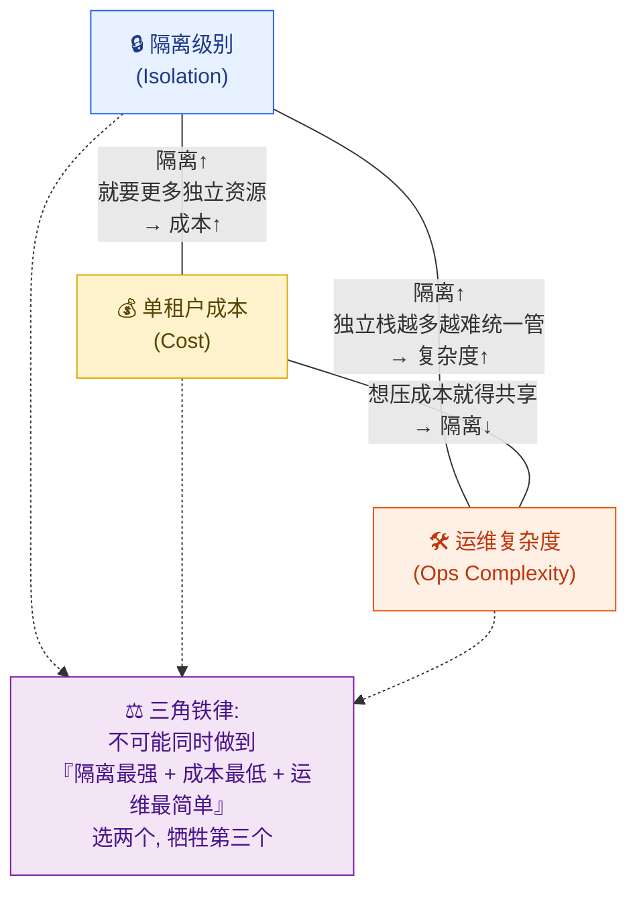

这个三角的内涵：

| 你想要…… | 代价是…… | 对应模型 |
| --- | --- | --- |
| **隔离最强** | 成本飙升 + 运维变重（N 套独立栈要监控、升级、备份、打补丁） | Silo |
| **成本最低** | 隔离变弱（必须共享，承担噪声邻居 + 泄漏风险） | Pool |
| **运维最简单** | 要么牺牲隔离（一套系统好维护 = Pool），要么牺牲成本（自动化大量投入去管 N 套 Silo） | Pool / 高度自动化的 Silo |

**一个非常容易被低估的成本——运维复杂度。** 很多人只算「服务器账单」这笔显性成本，却忽略了 Silo 的隐性成本：

- 平台发布一个新版本，Pool 模型下**升级一次全员生效**；Silo 模型下要**逐个租户**滚动升级 1000 套实例，一旦版本不一致，bug 排查地狱。
- 数据库要打安全补丁，Pool 改一处；Silo 要改 N 处，漏一个就是安全口子。
- 监控告警，Pool 一套 dashboard；Silo 要管 N 套实例的健康（这部分在 **第 12 章** 可观测性详谈）。

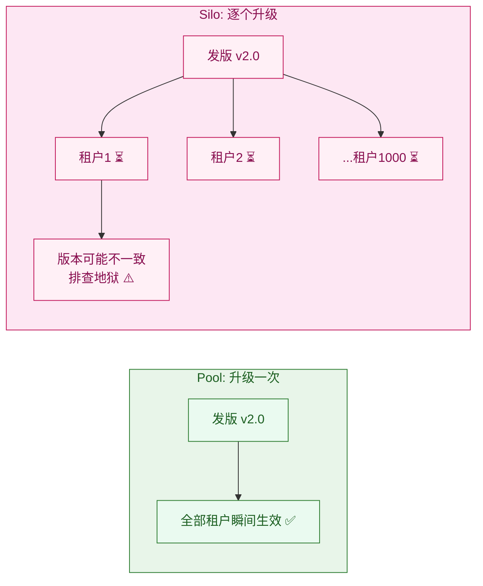

> 🎯 **结论**：隔离级别不是越高越好，而是**「够用就好」**。给一个 5 人免费团队上 Silo，就像给合租的大学生每人配一栋别墅——纯属烧钱。**选型的艺术，是为每个租户匹配「刚好够用」的隔离档。** 这就引出了下一节的核心策略。

---

## 3.5 租户分层（Tier）：同一个平台同时用多种模型

既然没有一种模型能通吃所有租户，头部 SaaS 的标准答案是：**按租户分层，给不同层的租户配不同的隔离模型**。这叫**租户分层（Tenant Tiering，租户分层：按套餐/规模/付费能力把租户分成几档，每档用不同的资源与隔离策略）**。

通常租户分层和**套餐档位（Plan Tier）**直接挂钩——你交多少钱、是什么规模，决定了你被放进哪个隔离档：

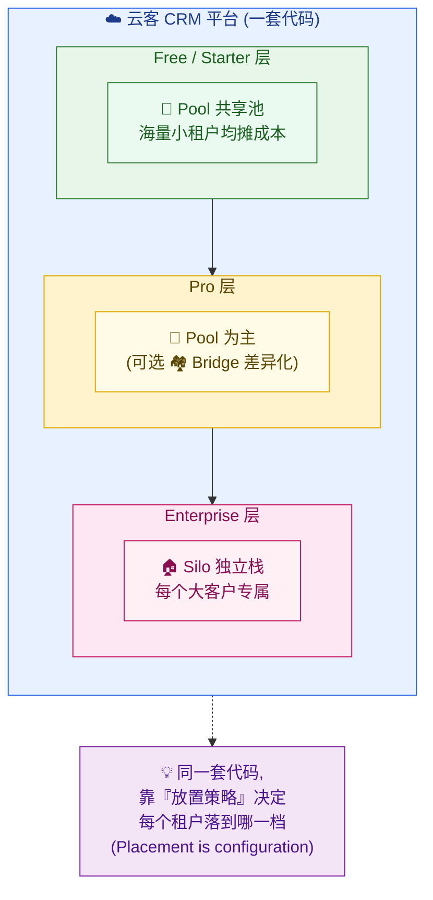

这个设计精妙在哪？回到大纲里那句贯穿全篇的信条：

> **「Placement is configuration, isolation remains invariant」**
> 租户「放在哪里」（Pool 还是 Silo）是一个**可配置的策略**；但租户之间的「隔离性」必须**永远不变**——无论放哪，星辰绝不能看到蓝鲸的数据。

落到代码上，这意味着平台用一个**租户配置（Tenant Config）**来记录每个租户的放置策略，业务代码不关心租户被放在哪，由路由/数据访问层去解析。下面是一段示意（注意：这只是放置决策的元数据，**真正怎么连到对应的库、怎么做行级过滤是第 4、5 章的事**）：

```java
/**
 * 租户隔离配置：记录每个租户被放置在哪种隔离模型下。
 * 这是「放置即配置」的核心载体——业务代码读它，决定去哪取数。
 */
public class TenantIsolationConfig {

    private String tenantId;          // 租户标识，如 "T_xingchen"

    private IsolationModel model;     // POOL / BRIDGE / SILO

    private TenantTier tier;          // FREE / STARTER / PRO / ENTERPRISE

    // 数据落点的「逻辑指针」——具体连接细节交给数据层(第5章)解析
    private String dataPlacement;     // Pool: "shared_pool_db"
                                       // Bridge: "shared_db#schema_xingchen"
                                       // Silo: "silo_cluster_lanjing"

    private String dataResidency;     // 数据驻留区域: CN / EU / US (合规要求)
}

/** 隔离模型枚举——用 enum 而非魔法字符串，编译期就能挡住非法值 */
public enum IsolationModel {
    POOL,    // 共享池：成本最低，给海量小租户
    BRIDGE,  // 桥接：独立 Schema，给需要差异化的中型租户
    SILO     // 独享：独立栈，给大客户/强合规租户
}

/** 租户分层枚举：套餐档位决定默认隔离模型 */
public enum TenantTier {
    FREE,        // 免费 → 默认 POOL
    STARTER,     // 入门 → 默认 POOL
    PRO,         // 专业 → 默认 POOL，可升级 BRIDGE
    ENTERPRISE   // 企业 → 默认 SILO
}
```

```java
/**
 * 放置策略：新租户开通时，根据套餐和合规需求决定隔离模型。
 * 这是「选型决策树」的代码化（决策树本身见 3.6 节）。
 */
public IsolationModel decidePlacement(SignupRequest req) {
    // 1) 强合规/数据驻留需求 → 必须 Silo，没有商量余地
    if (req.requiresDataResidency() || req.requiresPhysicalIsolation()) {
        return IsolationModel.SILO;
    }
    // 2) 企业套餐 → 默认 Silo（大客户愿意为隔离付费）
    if (req.getTier() == TenantTier.ENTERPRISE) {
        return IsolationModel.SILO;
    }
    // 3) Pro 套餐且主动要求数据独立 → Bridge
    if (req.getTier() == TenantTier.PRO && req.wantsDedicatedSchema()) {
        return IsolationModel.BRIDGE;
    }
    // 4) 其余一律进共享池 → Pool（绝大多数租户走这条，成本最优）
    return IsolationModel.POOL;
}
```

> 💡 **工程注意**：放置策略不是「一锤子买卖」。一个租户可能从 Free 的 Pool 起步，业务做大升级到 Enterprise 后需要迁移到 Silo——这种「**租户搬家（Tenant Migration）**」是真实存在的痛点（Pool→Silo 要把混在大表里的数据捞出来单独成库），具体迁移机制在 **第 13 章** 讲。本章你只需要知道：**放置策略是可以随租户成长而变化的配置**。

---

## 3.6 选型决策树：拿到一个新租户，到底选哪个

理论讲完，给你一棵可以直接照着走的选型决策树。新租户开通时，按这棵树一路问下来，就能得出该给它哪种隔离模型。

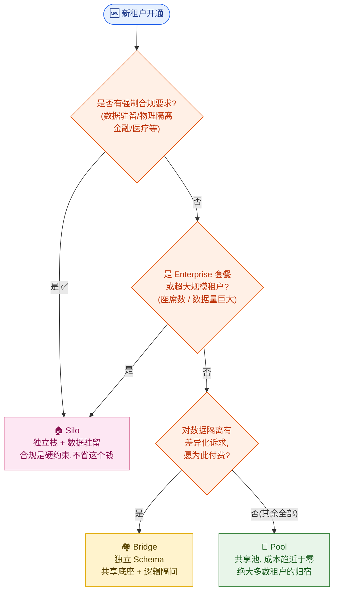

这棵树的判断顺序很有讲究，**从「不可妥协」到「可妥协」逐层下沉**：

1. **合规优先（不可妥协）**：合规和数据驻留是法律红线，命中就直接 Silo，不进成本计算。
2. **规模/套餐其次**：超大客户即使没合规要求，也通常需要 Silo——一是隔离噪声邻居，二是大客户愿意为独立性付溢价。
3. **差异化诉求第三**：有些中型客户主动要「我的数据更独立点」并愿意加钱，给 Bridge。
4. **默认归宿 Pool**：把以上都排除掉，剩下的绝大多数租户（占数量的 90%+）一律进 Pool——这是成本最优解。

> ⚠️ **一个常见误区**：不要被「客户嘴上说想要独立」带偏。很多客户说「我要数据隔离」，本质诉求其实是「别让我的数据泄漏 / 别让我卡」。这两点 Pool + 良好的应用层隔离（第 5 章）+ 资源治理（第 11 章）完全能满足，不必上 Silo。**真正需要 Silo 的是「法律/合同强制」和「超大规模」两类，其余都该先考虑 Pool。**

---

## 3.7 实战：云客 CRM 三个租户分别选什么

现在把决策树套到我们贯穿全篇的三个租户身上。这是本章最重要的落地——你要能脱口而出每个租户选什么、为什么。

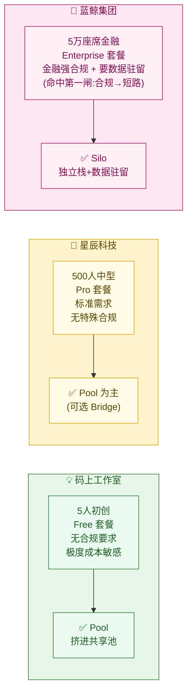

### 💡 码上工作室（5 人 / Free）→ Pool

**决策树走法**：无合规 → 非 Enterprise → 无差异化诉求 → **成本极度敏感** → **Pool**。

**理由**：这是个 5 人的小团队，用免费版，几乎不付费。给它任何独立资源都是平台净亏损。把它和其他 9 万多个免费/小租户一起塞进共享池，靠 `tenant_id` 区分数据，单租户成本趋近于零。

**画面感**：码上工作室的创始人录入了 30 个客户，这 30 条数据和成千上万家其他公司的客户数据，**同住在一张 `customers` 大表里**，只是每行末尾挂了个 `tenant_id = 码上工作室` 的名牌。平台一次升级，码上和所有租户一起瞬间用上新功能。

### 🏢 星辰科技（500 人 / Pro）→ Pool 为主（可选 Bridge）

**决策树走法**：无强制合规 → 非 Enterprise → （是否要差异化？）→ 默认 **Pool**；若星辰主动要「数据更独立」并愿付费，则 **Bridge**。

**理由**：星辰是 500 人的标准中型客户，付 Pro 套餐的钱，但没有金融/医疗那种法律级合规要求。它的核心诉求是「数据别泄漏、报表别卡」——这靠 Pool + 应用层严格隔离 + 资源治理就能满足，没必要上 Silo 烧钱。如果星辰的 IT 管理员老陈出于内部安全审计要求，提出「希望我们的数据有独立 Schema」，可以给它升 Bridge 作为差异化卖点。

**画面感**：销售李伟在星辰科技录客户、跟商机，数据和其他 Pool 租户共享底座；销售总监张敏拉全公司报表时，查询会自动带上 `tenant_id = 星辰科技` 的过滤（这层过滤怎么实现，第 5 章详讲），保证只看到自家数据。如果走 Bridge，星辰的数据则住在独立的 `schema_xingchen` 里，和别家隔着一道 Schema 墙。

### 🏦 蓝鲸集团（5 万座席 / Enterprise）→ Silo

**决策树走法**：**有强制合规要求（金融 + 数据驻留）** → 直接 **Silo**，第一道闸就命中，根本不进成本计算。

**理由**：蓝鲸是 5 万座席的金融集团，受金融监管，硬性要求：① 客户数据物理隔离，绝不与他家同表；② 数据驻留在指定境内区域；③ 独立的网络通道。这三条都是法律/合同红线，不是「省点钱」能商量的。同时 5 万座席的规模本身也需要独立栈来隔离噪声邻居。所以蓝鲸命中决策树第一闸——独立数据库 + 独立计算 + 独立网络，三个隔离维度全部拉满。

**画面感**：蓝鲸集团有一整套**专属**的云客 CRM 栈——独立的数据库实例、独立的计算资源、独立的 VPC。蓝鲸的销售再怎么跑大报表把 CPU 吃满，也绝不会影响星辰和码上（无噪声邻居）。平台给蓝鲸升级新版本时，要单独为它这套 Silo 做灰度发布（第 13 章）。蓝鲸付的钱也最多——它为「绝对独立」买单。

### 成本对比表（数量级示意）

下表用相对成本直观感受三种模型的经济账。数值为**数量级示意**，真实成本随云厂商定价、租户用量浮动。

| 租户 | 模型 | 单租户月成本（示意） | 平台能服务多少个同类租户 | 单租户付费 | 平台毛利 |
| --- | --- | --- | --- | --- | --- |
| 💡 码上工作室 | Pool | ≈ ¥0.1（海量均摊） | 10 万+ | ¥0（免费） | 靠规模 + 转化付费用户 |
| 🏢 星辰科技 | Pool（或 Bridge） | ≈ ¥50（Bridge 略高） | 数千 | ¥数千/月（按座席） | 高 ✅ |
| 🏦 蓝鲸集团 | Silo | ≈ ¥数万（独立栈） | 几十~几百 | ¥数十万/月（合同价） | 高，但成本也高 |

读这张表能体会到 SaaS 商业模式的精髓：

- **Pool 撑起规模**：海量小租户均摊成本，单租户成本趋近于零，靠数量取胜（免费转付费漏斗）。
- **Silo 撑起利润上限**：大客户用 Silo，成本虽高但合同金额更高，是营收的「大鱼」。
- **分层让两者共存**：同一套代码，用「放置策略」把不同租户路由到不同模型，既吃到了规模经济，又服务了高价值大客户——这就是租户分层的商业威力。

> 🔁 **租户会流动**：码上工作室如果哪天融资成功扩张到 2000 人、升级 Enterprise，它就要从 Pool「搬家」到 Silo。这种跨模型迁移是 SaaS 平台的常态运维，机制见 **第 13 章**。

---

## 本章小结

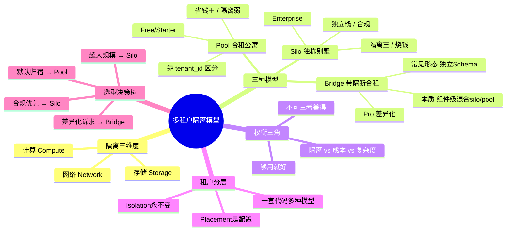

本章的核心收获，浓缩成五句话：

1. **隔离不止一件事**：计算、存储、网络三个维度可以独立选档，别把「隔离」简单等同于「数据别串了」。
2. **三种模型 = 三种住房**：Pool（合租公寓，省钱弱隔离）、Bridge（带隔断的合租，折中）、Silo（独栋别墅，强隔离烧钱）。
3. **权衡三角不可破**：隔离、成本、运维复杂度三者不可兼得，**隔离不是越高越好，而是够用就好**。
4. **分层是标准答案**：头部 SaaS 同时用多种模型——给免费小租户 Pool、给企业大客户 Silo，靠「放置策略」这个可配置项决定每个租户落哪一档，而隔离性本身永不妥协。
5. **照着决策树选**：合规/超大规模 → Silo；差异化付费诉求 → Bridge；其余绝大多数 → Pool。云客 CRM 里，码上=Pool、星辰=Pool（可选 Bridge）、蓝鲸=Silo。

选定了模型只是开始。**模型决定了「租户放在哪」，但真正让隔离生效，还需要两件事**：
- **请求进来时，系统得先认出「这是哪个租户」**——这是 **第 4 章（租户标识与上下文路由）** 的内容。
- **认出租户后，到了数据层，怎么真正保证查询不串、`tenant_id` 不漏、RLS 兜底**——这是 **第 5 章（数据层设计）** 的内容，也是 Pool 模型成败的命门。

记住那句标尺：**Placement is configuration, isolation remains invariant**。带着它进入下一章。

---

## 参考来源

1. **AWS SaaS Factory — SaaS Tenant Isolation Strategies**（Silo/Pool/Bridge 模型的权威出处，三模型分类即源于此白皮书）：<https://docs.aws.amazon.com/whitepapers/latest/saas-tenant-isolation-strategies/saas-tenant-isolation-strategies.html>
2. **AWS Well-Architected — SaaS Lens（SaaS 架构透镜，含隔离与分层最佳实践）**：<https://docs.aws.amazon.com/wellarchitected/latest/saas-lens/saas-lens.html>
3. **Microsoft Azure Architecture Center — Multitenant SaaS：Tenancy models（多租户隔离模型与权衡，含 Pool/Bridge/Silo 对应的部署形态）**：<https://learn.microsoft.com/en-us/azure/architecture/guide/multitenant/considerations/tenancy-models>
4. **WorkOS Blog — Multi-tenancy: Silo vs Pool vs Bridge（面向工程师的通俗对比，含 noisy neighbor 与分层策略）**：<https://workos.com/blog/what-is-multi-tenancy>
