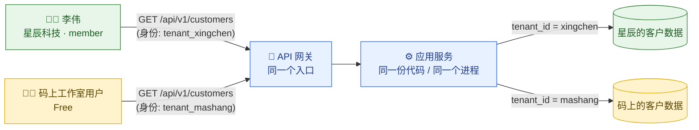
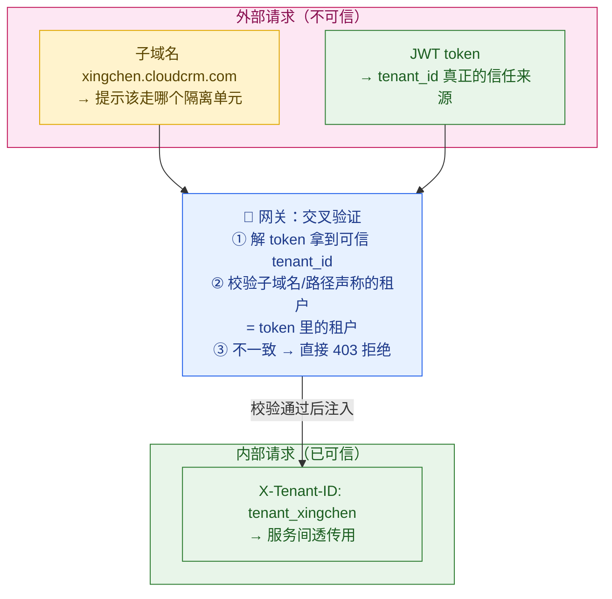
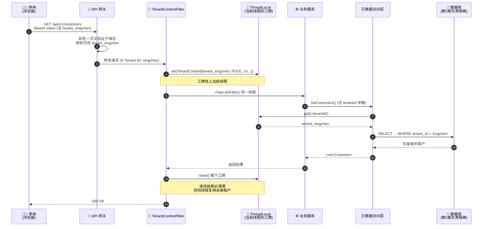
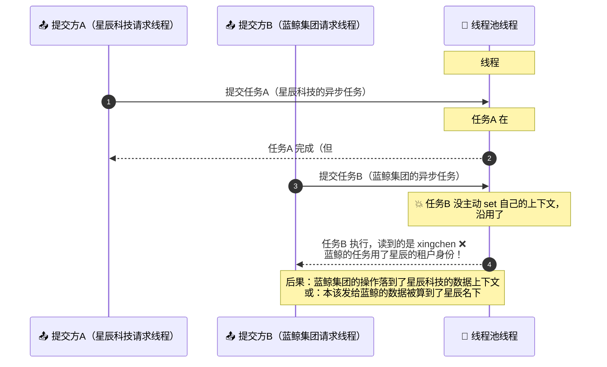
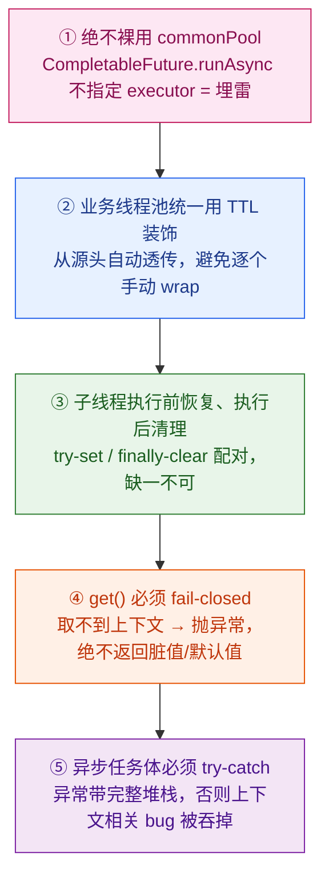
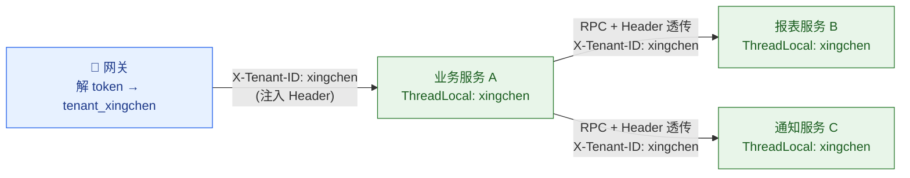
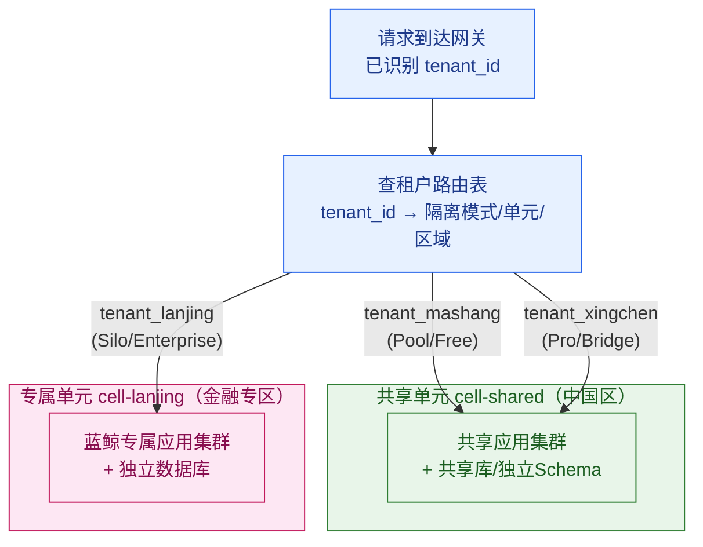
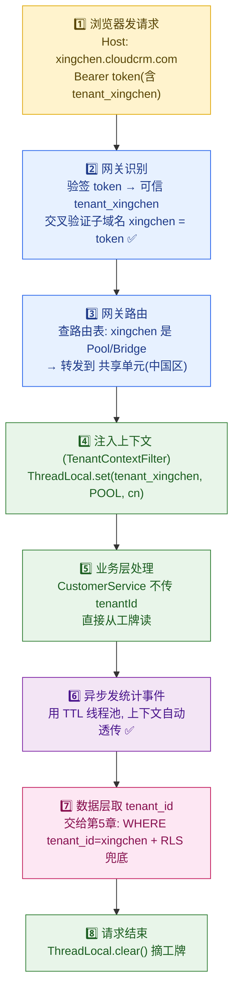

# 第 4 章 · 租户标识与上下文路由

> 上一章我们决定了租户「放在哪儿」——是挤在共享库（Pool）、独享一套 Schema（Bridge），还是独立一套库（Silo）。但有一个前置问题被我们跳过了：**当一个 HTTP 请求打进来，系统怎么知道它属于哪家公司？** 李伟点了一下「保存客户」，这个请求里凭什么能认出"这是星辰科技的李伟，不是码上工作室的某个人"？这就是本章要回答的：**租户身份是怎么被识别出来的，又是怎么被一路带到数据库门口的。**

---

## 本章导读

读完本章，你应该能清晰回答下面这些问题：

- 一个请求进入系统，有哪 **4 种方式**可以识别它属于哪个租户？子域名、URL 路径、HTTP Header、JWT claim 各自的优劣是什么，安全性差在哪？
- 什么是 **tenant context（租户上下文）**？它在一个请求的生命周期里是怎么被创建、传递、销毁的？
- 为什么"在网关识别一次就够了"是错的？识别出的租户身份要怎么**一路透传**到应用层、再到数据层？
- 为什么 **ThreadLocal**（线程本地变量）在 SaaS 系统里既是利器又是陷阱？异步任务和线程池是怎么把租户上下文**搞丢**的，又怎么会导致**跨租户数据泄漏**这种致命事故？
- 网关识别出租户后，怎么据此把请求**路由到对应的隔离单元**（蓝鲸集团的独立库 vs 星辰科技的共享库）？

> 🧭 **本章在全景里的位置**：识别（本章）→ 隔离查询（第 5 章）。
> 本章只负责把"你是谁家的"这件事**搞清楚并带到位**；至于带到数据库后怎么用 `tenant_id` 把查询关进笼子、怎么用 RLS 兜底，那是**第 5 章**的事。认证 token（JWT）本身是怎么签发、怎么验签的，是**第 6 章**的事。本章默认 token 已经签好、验过，我们只关心怎么从里面把租户身份**取出来用**。

---

## 4.1 一切的起点：请求里必须"带身份"

先建立一个最朴素的直觉。

云客 CRM 同时服务 10 万家企业。这 10 万家公司的请求，全都打到**同一批**网关、同一批应用服务器上（除了蓝鲸集团这种独立部署的大客户，后面会讲）。服务器代码是同一份，进程是同一个，内存是共享的。那么：

> **当李伟（星辰科技）和码上工作室的某位用户在同一秒发来两个一模一样的请求 `GET /api/v1/customers`，服务器凭什么返回不同的数据？**

答案只有一个：**请求本身必须携带"我是谁家的"这个身份信息**。服务器不可能凭空知道。这个身份信息，就是**租户标识（Tenant Identifier）**，通常是一个租户 ID，比如 `tenant_xingchen`、`tenant_lanjing`。

> 📖 **租户标识（Tenant Identifier，租户标识符：用来唯一指认"这个请求/这条数据属于哪家公司"的一个 ID）**。它是整个多租户系统的"身份证号"。后面所有的隔离、路由、计费、限流，全都以它为锚点。

我们用一张图先看清楚问题的全貌——同一套系统，靠请求里带的租户标识，把数据分流：



看到关键了吗？**网关和应用是同一套，分流完全依赖请求里带的那个身份。** 那么问题就聚焦成一个：**这个身份，到底应该塞在请求的哪个位置？** 这就引出了本章第一个核心：四种租户识别方式。

---

## 4.2 四种租户识别方式

请求里能放身份的位置就那么几个：URL 的域名部分、URL 的路径部分、HTTP 头、以及藏在认证 token 里的字段。对应四种主流方案。我们一个一个看，并且每个都用云客 CRM 的真实场景代入。

### 4.2.1 方式一：子域名（Subdomain）

让每个租户拥有一个专属的子域名：

```
星辰科技  → https://xingchen.cloudcrm.com
蓝鲸集团  → https://lanjing.cloudcrm.com
码上工作室 → https://mashang.cloudcrm.com
```

李伟打开浏览器输入 `xingchen.cloudcrm.com`，他后续所有请求的 `Host` 头都会是 `xingchen.cloudcrm.com`。网关只要解析 `Host` 头，从 `xingchen.cloudcrm.com` 里抠出 `xingchen`，再去一张映射表里查到 `tenant_xingchen`，租户身份就识别出来了。

```nginx
# 网关（这里以 Nginx 伪配置示意）从 Host 头提取子域名
# $host = "xingchen.cloudcrm.com"
# 用正则抠出第一段子域名，作为租户标识传给后端
server {
    server_name ~^(?<tenant_slug>.+)\.cloudcrm\.com$;

    location / {
        # 把抠出来的 tenant_slug 作为内部 Header 传给应用层
        proxy_set_header X-Tenant-Slug $tenant_slug;
        proxy_pass http://crm_backend;
    }
}
```

**优点**：

- **品牌感强、用户无感**：每家公司有自己的"门牌号"，企业客户很吃这一套。蓝鲸集团这种大客户尤其喜欢专属域名。
- **天然适合按租户做边缘路由**：CDN / DNS 层就能根据子域名把蓝鲸的流量直接导向它专属的独立部署单元（后面 4.6 节细讲）。
- **Cookie 天然隔离**：浏览器的 Cookie 默认按域隔离，`xingchen.cloudcrm.com` 的 Cookie 不会被 `mashang.cloudcrm.com` 读到，多了一层防护。

**缺点**：

- **运维成本高**：要支持任意子域名，得配**泛域名证书**（Wildcard Certificate，通配符 TLS 证书：一张 `*.cloudcrm.com` 的证书覆盖所有子域名）和**泛解析 DNS**（`*.cloudcrm.com` 全部解析到网关）。
- **新租户开通要"等 DNS"**：虽然有了泛解析就不用一家家配，但自定义域名（如蓝鲸想用 `crm.lanjing.com`）仍要走 DNS 验证流程。
- **跨子域调用要处理 CORS**：前端如果有跨子域的 API 调用，要额外处理跨域。

### 4.2.2 方式二：URL 路径（Path）

把租户标识塞进 URL 路径里：

```
星辰科技  → https://app.cloudcrm.com/t/xingchen/customers
蓝鲸集团  → https://app.cloudcrm.com/t/lanjing/customers
```

所有租户共用一个域名 `app.cloudcrm.com`，靠路径里的 `/t/{tenantId}` 段区分。

```java
// Spring 风格：从路径变量里取租户标识
@GetMapping("/t/{tenantSlug}/customers")
public List<CustomerDTO> listCustomers(@PathVariable String tenantSlug) {
    // tenantSlug = "xingchen"，由路由框架自动从 URL 里解析出来
    // ...
}
```

**优点**：

- **零 DNS / 零证书成本**：一个域名一张证书搞定，开通新租户不用碰 DNS。
- **调试直观**：URL 里直接能看到租户，排查问题时一眼就知道这个请求是谁的。

**缺点**：

- **路径污染**：每个接口路径都要带 `/t/{tenantId}`，侵入性强；前端要在每个请求里拼这个前缀。
- **容易被篡改**：李伟只要手动把 URL 里的 `xingchen` 改成 `lanjing`，就**试图**去访问蓝鲸的数据了。⚠️ 这意味着**绝对不能只信路径里的租户标识**——必须校验"当前登录用户是否真的属于这个租户"。这点是路径方案的致命要害，4.2.5 节会专门讲。
- **不适合做边缘路由**：所有请求 Host 一样，CDN / DNS 层无法据此分流。

### 4.2.3 方式三：HTTP Header（X-Tenant-ID）

让客户端在每个请求里塞一个自定义头：

```http
GET /api/v1/customers HTTP/1.1
Host: api.cloudcrm.com
Authorization: Bearer eyJhbGci...
X-Tenant-ID: tenant_xingchen
```

> 📖 **X-Tenant-ID** 是一个自定义请求头（`X-` 前缀是历史上"自定义、非标准"头的约定俗成写法）。它把租户标识独立成一个头字段，干净利落。

**优点**：

- **URL 干净**：路径里不带租户信息，RESTful 风格更纯粹。
- **对服务间调用友好**：内部微服务之间 RPC 调用，透传一个 Header 比改路径方便得多（4.5 节跨服务传播会重度依赖这个）。

**缺点**：

- **同样可被客户端伪造**：`X-Tenant-ID` 是客户端塞的，李伟用抓包工具把它改成 `tenant_lanjing` 易如反掌。⚠️ **来自外部的 `X-Tenant-ID` 头绝对不能直接信任**——它顶多是个"声称"，必须和认证信息交叉验证。
- **浏览器直接访问不方便**：纯前端页面跳转、`<a>` 标签点击不会自动带自定义头，需要 JS 在每个 fetch / XHR 里手动加。

> ⚠️ **一个反复强调的安全铁律**：路径里的 `tenantId` 和 Header 里的 `X-Tenant-ID`，都是**客户端可控、可伪造的输入**。它们可以用来"提示"系统去查哪个租户，但**永远不能作为信任的最终依据**。最终能信的，只有服务端验过签的认证凭据——这就引出了方式四。

### 4.2.4 方式四：JWT claim（token 里的 tenant_id）

把租户标识写进认证 token（JWT）的载荷里。

> 📖 **JWT（JSON Web Token，JSON 网络令牌：一段服务端签名过的、防篡改的字符串，里面装着"你是谁"的信息）**。它由三段组成：头部.载荷.签名，中间用 `.` 隔开。载荷（payload）里那些键值对叫 **claim（声明）**，比如 `sub`（用户 ID）、`exp`（过期时间）。我们把租户标识也作为一个 claim 塞进去：

```json
// JWT 解码后的载荷（payload）部分
{
  "sub": "user_liwei",          // 用户：李伟
  "tenant_id": "tenant_xingchen", // 租户：星辰科技 ← 关键就是这一行
  "role": "member",             // 角色：普通成员（第 7 章细讲）
  "exp": 1798761600,            // 过期时间（示意为未来时间，此处约 2027 年）
  "iss": "auth.cloudcrm.com"    // 签发方
}
```

李伟登录星辰科技时，认证服务（第 6 章）就把 `tenant_id: tenant_xingchen` 写进了他的 token，并用平台私钥**签名**。此后李伟每个请求都带这个 token，服务端验签通过后，从 token 里读出 `tenant_id`。

**优点（核心优势：安全）**：

- **不可伪造**：token 是服务端签名的，李伟无法在不破坏签名的前提下把 `tenant_id` 改成 `tenant_lanjing`。这是四种方式里**唯一从密码学上保证可信**的。
- **身份与租户绑定**：token 里既有用户又有租户，"李伟属于星辰科技"这件事被钉死了，天然杜绝了"用 A 租户身份去访问 B 租户数据"。
- **无状态**：服务端不用查 session，验签即可，水平扩展友好。

**缺点**：

- **切换租户麻烦**：如果一个人同时属于多家公司（比如老陈既是星辰的 owner，又是个人项目的 owner），切租户就得重新签发 token 或换 token。
- **token 变大**：claim 越塞越多，token 体积变大，每个请求都要带，有一点带宽开销。
- **依赖认证体系**：必须先有完整的 JWT 签发/验签链路（第 6 章），不像 Header 方案那么"开箱即用"。

### 4.2.5 四种方式对比表（含安全性、灵活性）

把四种方式拉到一张表里横向对比，这是本章必须记牢的一张表：

| 维度 | 子域名<br/>Subdomain | URL 路径<br/>Path | HTTP Header<br/>X-Tenant-ID | JWT claim<br/>tenant_id |
| --- | --- | --- | --- | --- |
| **载体** | `xingchen.cloudcrm.com` | `/t/xingchen/...` | `X-Tenant-ID: ...` | token 载荷里的字段 |
| **🔒 安全性** | **低**（裸 Host 头同样可伪造；其"安全加成"来自 TLS SNI/边缘路由等基础设施约束，而非 Host 头本身可信） | **低**（可随意改路径） | **低**（可随意改头） | **高**（签名防篡改） |
| **能否单独作为信任依据** | ❌ 否 | ❌ 否 | ❌ 否 | ✅ **是**（验签后） |
| **灵活性 / 多租户切换** | 低（换域名=换站点） | 高 | 高 | 中（要重签/换 token） |
| **运维成本** | 高（泛域名证书+DNS） | 低 | 低 | 中（依赖认证体系） |
| **URL 整洁度** | 高 | 低（路径被污染） | 高 | 高 |
| **适合边缘路由** | ✅ 强 | ❌ | ❌ | ❌（要先解 token） |
| **品牌感** | 强 | 弱 | 无 | 无 |
| **典型用途** | 大客户专属入口、边缘分流 | 简单 Web 应用、调试 | 服务间内部调用透传 | **信任的最终来源** |

### 4.2.6 实战结论：组合使用，不是二选一

真实的 SaaS 系统**几乎从不只用一种**，而是组合：

> **黄金组合 = 子域名/路径负责"路由分流" + JWT claim 负责"安全信任" + Header 负责"内部透传"。**

云客 CRM 的实际做法：



关键就在网关那一步的**交叉验证（cross-check）**：

```java
// 网关层：识别租户 + 交叉验证（伪代码，突出逻辑）
// 1. 从 JWT 里读出"可信"的租户标识（这是唯一可信来源）
String trustedTenantId = jwtClaims.get("tenant_id"); // "tenant_xingchen"

// 2. 从子域名/路径里读出"声称"的租户标识（不可信，仅作提示）
String claimedTenantSlug = extractFromHostOrPath(request); // "xingchen"

// 3. 交叉验证：声称的 ≠ token 里的 → 越权企图，直接拒绝
if (!resolveSlugToId(claimedTenantSlug).equals(trustedTenantId)) {
    // 例如李伟把 URL 改成 lanjing 但 token 还是 xingchen 的
    throw new ForbiddenException("tenant mismatch: claimed vs token");
}

// 4. 验证通过，以 token 里的为准，注入到租户上下文
TenantContext.set(trustedTenantId);
```

记住这条线：**外部输入只能"提示"，验过签的 token 才能"信任"，二者必须一致。** 这就是为什么前面反复说"路径和 Header 不能单独信"——它们的价值是路由和透传，不是信任。

---

## 4.3 tenant context：租户上下文是什么

识别出 `tenant_id` 之后，问题来了：**这个 `tenant_id` 怎么在一个请求的处理过程中被各处代码方便地拿到？**

一个请求从网关进来，要经过认证、权限、业务逻辑、数据访问好几层，可能调十几个方法、跨好几个类。难道每个方法都加一个 `String tenantId` 参数，一路往下传？那代码就被污染得没法看了——这叫"参数透传地狱"。

```java
// ❌ 参数透传地狱：每个方法签名都被 tenantId 污染
public List<Customer> listCustomers(String tenantId) {
    return customerService.list(tenantId);        // 传
}
class CustomerService {
    List<Customer> list(String tenantId) {
        return repo.findAll(tenantId);            // 再传
    }
}
class CustomerRepo {
    List<Customer> findAll(String tenantId) {     // 还传
        return db.query("... WHERE tenant_id = ?", tenantId);
    }
}
```

解决办法是引入 **tenant context（租户上下文）**：把当前请求的租户身份（以及关联信息）打包成一个对象，存在一个"当前请求范围内随处可取"的地方，需要的代码直接去取，不用层层传参。

> 📖 **tenant context（Tenant Context，租户上下文：在一次请求处理过程中，随处可以读到的"当前是哪个租户"的信息包）**。可以把它想象成请求处理期间挂在"当前线程脖子上的工牌"——任何代码抬头一看工牌，就知道现在在替哪家公司干活。

一个典型的 tenant context 对象长这样：

```java
// 租户上下文对象：不可变，请求期间只读
public record TenantContext(
    String tenantId,        // tenant_xingchen —— 最核心
    String tenantSlug,      // xingchen —— 用于日志/展示
    IsolationMode isolation,// POOL / BRIDGE / SILO —— 决定路由去哪个库（第 3 章的概念）
    String dataRegion,      // cn / eu / us —— 数据驻留区域
    String userId,          // user_liwei —— 顺带把用户也放进来
    String traceId          // 链路追踪 ID，便于排查
) {}
```

注意 context 里不只有 `tenant_id`，往往还会顺带放上**隔离模式**和**数据区域**——因为路由（4.6 节）需要根据这两个字段决定把请求送到哪个库。这就把第 3 章的隔离模型和本章的路由衔接上了。

---

## 4.4 上下文的传递：ThreadLocal 与请求作用域

上下文对象建好了，存哪儿？这是工程上最关键、也最容易踩坑的地方。

### 4.4.1 为什么用 ThreadLocal

在传统的"一个请求一个线程"（thread-per-request）的同步服务里（比如经典的 Spring MVC + Tomcat），最常用的存储方式是 **ThreadLocal**。

> 📖 **ThreadLocal（线程本地变量：每个线程都有一份自己专属的、互不干扰的存储格子）**。同一个 `ThreadLocal` 变量，线程 A 往里放的值，线程 B 读不到；线程 A 读到的永远是自己放的那份。它正好契合"一个请求由一个线程从头处理到尾"——把 `tenant_id` 放进当前线程的格子，这个请求处理链路上的任何代码都能取到，且绝不会串到别的请求。

为什么 ThreadLocal 适合？因为 Web 容器（Tomcat）用**线程池**处理请求：一个请求被分配给线程池里的某个线程，从认证到业务到数据访问，**全程是同一个线程**在跑。那么把租户身份放进这个线程的 ThreadLocal，整条链路都能读到。

```java
// 租户上下文持有器：基于 ThreadLocal
public final class TenantContextHolder {
    // 每个线程一份独立的 TenantContext
    private static final ThreadLocal<TenantContext> CTX = new ThreadLocal<>();

    public static void set(TenantContext ctx) {
        CTX.set(ctx);
    }

    public static TenantContext get() {
        TenantContext ctx = CTX.get();
        if (ctx == null) {
            // 取不到上下文是严重问题：宁可报错，绝不能"默认查全部"
            throw new IllegalStateException("TenantContext missing! 拒绝无租户的请求");
        }
        return ctx;
    }

    // ⚠️ 关键：请求结束必须清理，否则线程被复用时会"串味"
    public static void clear() {
        CTX.remove();
    }
}
```

请注意上面 `get()` 里的细节：**取不到上下文时直接抛异常，绝不返回 null 或"默认查所有租户"。** 这是 SaaS 安全的一条底线——"无租户身份"本身就是一种异常状态，必须 fail-closed（失败时关闭，即拒绝），而不是 fail-open（失败时放开，即放行）。

### 4.4.2 注入与读取的完整链路

谁来 `set`、谁来 `clear`？答案是：在请求进入业务逻辑**之前**的一个统一拦截点（Spring 里是 `Filter` 或 `Interceptor`）注入，在请求结束时清理。读取则发生在数据访问层。

```java
// 注入点：一个 Servlet Filter，在所有业务逻辑之前执行
@Component
public class TenantContextFilter extends OncePerRequestFilter {

    @Override
    protected void doFilterInternal(HttpServletRequest req,
                                    HttpServletResponse resp,
                                    FilterChain chain) throws IOException, ServletException {
        try {
            // 1. 从已验签的 JWT 里取可信 tenant_id（验签在更前面的安全过滤器做，见第 6 章）
            String tenantId = (String) req.getAttribute("verified_tenant_id");

            // 2. 查出该租户的隔离模式和数据区域（用于后续路由）
            TenantMeta meta = tenantMetaCache.get(tenantId);

            // 3. 组装上下文，注入 ThreadLocal —— 工牌挂上！
            TenantContextHolder.set(new TenantContext(
                tenantId, meta.slug(), meta.isolation(),
                meta.region(), currentUserId(req), traceId(req)
            ));

            // 4. 放行，进入后续所有业务处理（同一个线程）
            chain.doFilter(req, resp);
        } finally {
            // 5. 无论成功失败，请求结束必须清理 —— 工牌摘下！（finally 保证一定执行）
            TenantContextHolder.clear();
        }
    }
}
```

下游任意一层，比如数据访问层，直接读取，不用接收任何参数：

```java
// 读取点：数据访问层直接从上下文取，方法签名干净
public class CustomerRepository {
    public List<Customer> findAll() {
        // 不需要传 tenantId 参数！从工牌上读
        String tenantId = TenantContextHolder.get().tenantId();
        // 注意：这里只是"取出 tenant_id"。怎么用它拼到 SQL 的 WHERE、
        // 怎么用 RLS 在数据库层兜底，是第 5 章的内容。
        return jdbc.query(
            "SELECT * FROM customers WHERE tenant_id = ?",
            tenantId  // ← 本章管"取到它"，第 5 章管"安全地用它"
        );
    }
}
```

把整个链路画出来——这就是本章必须有的 **tenant context 从网关到数据层的传递链路图**：



整条链路只在**网关识别一次、过滤器注入一次**，下游全靠 ThreadLocal 取，业务代码彻底不用关心租户参数。干净。

### 4.4.3 请求作用域（Request Scope）：另一种容器

除了 ThreadLocal，Spring 还提供了 **请求作用域 Bean（`@RequestScope`）** 来装上下文。本质上它在 Servlet 环境里底层也是靠 ThreadLocal 实现的，区别是更"框架化"——你可以直接 `@Autowired` 注入一个请求作用域的 `TenantContext` Bean，由框架管理它的生命周期。

```java
@Component
@RequestScope  // 每个 HTTP 请求一个独立实例，请求结束自动销毁
public class RequestTenantContext {
    private String tenantId;
    // getter / setter ...
}
```

二者选择：

- **ThreadLocal**：更底层、更通用，不依赖 Spring，跨框架可移植；但要自己记得 `clear()`。
- **`@RequestScope` Bean**：更优雅、自动管理生命周期、可依赖注入；但绑定了框架，且**异步线程里同样会失效**（因为底层还是 ThreadLocal）。

无论哪种，它们都有一个**共同的致命软肋**——只在"处理请求的那个线程"里有效。一旦换了线程，工牌就没了。这就是下一节要重点讲的坑。

---

## 4.5 致命陷阱：异步与线程池场景下的上下文丢失

这是本章**最重要、面试最爱问、生产事故最高发**的一节。务必看懂。

### 4.5.1 坑是怎么出现的

ThreadLocal 的前提是"一个请求从头到尾一个线程"。但现代系统里，这个前提经常被打破：

- 业务里用 `@Async` 异步发个通知；
- 用 `CompletableFuture.supplyAsync(...)` 并行查几个数据源；
- 把任务丢进一个 `ExecutorService` 线程池里跑；
- 用响应式框架（Reactor / WebFlux），一个请求在多个线程间流转。

**只要任务切换到了另一个线程，那个新线程的 ThreadLocal 里是空的——租户上下文就丢了。** 因为工牌挂在原来那个线程脖子上，新线程没有。

来看一个**真实会出事**的例子。李伟点了"批量导入客户后发送欢迎邮件"，业务代码图省事用了异步：

```java
// ❌❌❌ 危险代码：异步任务里上下文已丢失
@Service
public class CustomerService {

    public void importAndNotify(List<Customer> customers) {
        String tenantId = TenantContextHolder.get().tenantId(); // 主线程：tenant_xingchen ✅
        repo.batchInsert(customers);

        // 异步发邮件 —— 任务跑在线程池的另一个线程上！
        CompletableFuture.runAsync(() -> {
            // 💥 这里是另一个线程，ThreadLocal 是空的
            // TenantContextHolder.get() 要么抛异常（如果 fail-closed）
            // 要么——如果代码写得"宽容"——返回了线程池上一个任务残留的上下文！
            sendWelcomeEmail();
        });
    }
}
```

### 4.5.2 为什么这个坑特别可怕：跨租户数据泄漏

上面 `runAsync` 不指定线程池，会用 JVM 公共线程池（`ForkJoinPool.commonPool`），里面的线程是**复用**的。设想这个时序：



这就是 SaaS 系统里最恐怖的事故类型：**跨租户数据泄漏（cross-tenant data leakage）**。不是数据库没隔离，而是**租户身份在异步切换时串了线**。轻则蓝鲸集团收到了星辰科技客户的信息（严重的隐私/合规事故），重则把一家公司的写操作落到另一家公司的库里。对 SaaS 而言，一次跨租户泄漏可能就是公司倒闭级的事故（回顾大纲的全景信条：**隔离性必须永远不变**）。

> ⚠️ **关键澄清：这里其实有两类互斥的故障，防线也不同，千万别混为一谈。**
>
> - **故障一：上下文缺失（`get()` 拿到 null）。** 子线程从没被 set 过，ThreadLocal 是空的。这正是 fail-closed 要防的——`get()` 取不到就抛异常，宁可让任务报错失败，也绝不"默认查全部租户"。**fail-closed 防的是"空"。**
> - **故障二：线程池残留脏值（`get()` 拿到一个非 null 的旧租户）。** 上面时序图演示的正是这种：线程 #7 上一个任务写入过 `tenant_xingchen`，蓝鲸的任务B 没主动覆盖就直接读，于是拿到一个**看似正常、实则属于别家**的值。⚠️ **此时 `get()` 取得到非 null，fail-closed 根本不会触发！** 它会照常返回脏的 `tenant_xingchen`，把蓝鲸的操作算到星辰头上。
>
> 所以防住故障二靠的**不是** fail-closed，而是下一节的**上下文透传**：在提交任务时捕获快照、**子线程执行前强制 `set(snapshot)` 覆盖、用完 `finally clear()`、配合 TTL 自动透传**。一句话——**fail-closed 防"空"，透传 + 强制覆盖防"脏"，两者缺一不可。**

### 4.5.3 解法：上下文透传（TTL / 手动捕获）

解决思路只有一个：**在提交异步任务的那一刻，把当前线程的租户上下文"快照"捕获下来，传递给新线程，让新线程在执行前先把上下文"恢复"出来。** 这叫**上下文透传（context propagation）**。

有两种落地方式。

#### 方式 A：手动捕获 + 包装（适合理解原理，也是 TTL 的本质）

```java
// ✅ 手动捕获父线程上下文，在子线程恢复
public void importAndNotify(List<Customer> customers) {
    repo.batchInsert(customers);

    // 1. 在主线程（上下文还在）抓一份快照
    TenantContext snapshot = TenantContextHolder.get();

    // 2. 用我们自己的业务线程池（不用 commonPool！见下方约束）
    CompletableFuture.runAsync(() -> {
        try {
            // 3. 子线程执行前，先把快照恢复到子线程的 ThreadLocal
            TenantContextHolder.set(snapshot);
            sendWelcomeEmail();   // 现在能正确读到 tenant_xingchen 了 ✅
        } finally {
            // 4. 子线程用完也必须清理，避免污染线程池里的下一个任务
            TenantContextHolder.clear();
        }
    }, businessEmailExecutor);   // ← 指定专用线程池，绝不裸用 commonPool
}
```

这个"捕获快照 → 子线程恢复 → 用完清理"的三步，就是上下文透传的本质。把它封装成一个工具，就不用每次手写：

```java
// 封装一个"会透传租户上下文"的 Runnable 包装器
public final class TenantAwareRunnable {

    // 把任意 Runnable 包装成"自动透传上下文"的版本
    public static Runnable wrap(Runnable task) {
        // 在提交线程（父线程）就抓住当前上下文快照
        TenantContext snapshot = TenantContextHolder.get();
        return () -> {
            try {
                TenantContextHolder.set(snapshot); // 子线程恢复
                task.run();
            } finally {
                TenantContextHolder.clear();       // 子线程清理
            }
        };
    }
}

// 使用：任何提交到线程池的任务都先 wrap 一下
executor.submit(TenantAwareRunnable.wrap(() -> sendWelcomeEmail()));
```

#### 方式 B：TransmittableThreadLocal（TTL，框架级自动透传）

每次手动 `wrap` 仍然容易漏。阿里开源的 **TransmittableThreadLocal（TTL，可传递的线程本地变量：专门解决"线程池场景下 ThreadLocal 值无法透传"的增强版 ThreadLocal）** 把透传做成了自动的。

> 📖 **TransmittableThreadLocal（TTL）**：标准 `ThreadLocal` 在父子线程间不传值，JDK 自带的 `InheritableThreadLocal` 只能在"新建线程"时传一次、对**线程池复用**无效（因为池里的线程是早就建好的）。TTL 通过"装饰线程池"的方式，在任务被**提交**时自动抓快照、在任务被**执行**时自动恢复、执行完自动清理——全程无感。

```java
// 1. 上下文持有器改用 TTL（而不是普通 ThreadLocal）
public final class TenantContextHolder {
    private static final TransmittableThreadLocal<TenantContext> CTX
        = new TransmittableThreadLocal<>();
    // set / get / clear 用法和普通 ThreadLocal 完全一样
}

// 2. 把业务线程池用 TtlExecutors 包一层（一次性配置）
ExecutorService businessExecutor = TtlExecutors.getTtlExecutorService(
    Executors.newFixedThreadPool(16)
);

// 3. 之后正常提交任务，上下文自动透传，业务代码零侵入 ✅
businessExecutor.submit(() -> {
    // 自动就能读到正确的 tenant_xingchen，不用手动 wrap
    String tid = TenantContextHolder.get().tenantId();
    sendWelcomeEmail(tid);
});
```

> 💡 在响应式栈（Spring WebFlux / Reactor）里，对应的机制是 **Reactor Context**（`contextWrite` / `deferContextual`），思路一致——不靠 ThreadLocal，而是把上下文绑在响应式数据流上随流传递。原理同源，工具不同。

### 4.5.4 异步透传的工程纪律（必须遵守）

结合上面，沉淀出几条铁律：



这几条不只是本章的要求，也是平台工程的通用约束（第 11、12 章的线程池治理、链路追踪会再次用到）。

---

## 4.6 跨服务传播：从单体到微服务

上面讲的都是"同一个进程内"的上下文传递。但云客 CRM 是微服务架构——一个请求可能经过网关 → 业务服务 → 报表服务 → 通知服务好几个进程。**跨进程时，ThreadLocal 完全没用**（内存都不共享了）。怎么把租户身份带过去？

答案回到了 4.2.3 的 Header：**在服务间的 HTTP/RPC 调用里，把 `tenant_id` 放进请求 Header 透传**。下游服务收到后，再从 Header 读出来、放进自己进程的 ThreadLocal。



工程上通常用**拦截器 + 过滤器**两端配合，做到业务代码零感知：

```java
// 调用方（服务 A）：RPC 客户端拦截器，自动把上下文塞进出站 Header
public class TenantPropagationInterceptor implements ClientHttpRequestInterceptor {
    @Override
    public ClientHttpResponse intercept(HttpRequest request, byte[] body,
                                        ClientHttpRequestExecution exec) throws IOException {
        // 出站前，把当前进程的租户上下文写进 Header
        TenantContext ctx = TenantContextHolder.get();
        request.getHeaders().add("X-Tenant-ID", ctx.tenantId());
        request.getHeaders().add("X-Trace-ID", ctx.traceId()); // 顺带带上链路 ID
        return exec.execute(request, body);
    }
}

// 被调方（服务 B）：入站过滤器，从 Header 读出来注入自己的 ThreadLocal
// —— 复用 4.4.2 的 TenantContextFilter 思路，只是来源从"JWT"换成"内部可信 Header"
```

> ⚠️ **安全提醒**：服务 B 信任的是**来自内网、经过网关交叉验证后**的 `X-Tenant-ID`，不是来自公网的。前面说"Header 不可信"指的是**外部客户端**直接传的 Header。内部服务间的 Header，是网关已经验过 token、确认无误后注入的，因此可信。这条信任边界一定要分清：**网关是"不可信外部"与"可信内部"的分界线。**

> 📌 关于 `traceId`（链路追踪 ID）怎么贯穿整个调用链、怎么用它在日志里关联同一个请求的所有片段——这是**第 12 章可观测性**的主题，本章只演示它和 `tenant_id` 一样需要透传。

---

## 4.7 网关路由：据租户身份送到对应隔离单元

最后回到网关，把第 3 章的隔离模型和本章的识别接起来。

识别出 `tenant_id` 后，网关不只是"放行"，还要决定**把请求送到哪里**——这就是**路由（routing）**。因为不同租户的物理部署不同（回顾第 3 章）：

- **码上工作室（Free，Pool）**：和成千上万小租户挤在共享集群、共享库，靠 `tenant_id` 逻辑隔离；
- **星辰科技（Pro，Pool/Bridge）**：共享应用集群，但可能用独立 Schema；
- **蓝鲸集团（Enterprise，Silo）**：金融集团，要求独立部署——有**专属的应用集群和独立数据库**，甚至在专属区域（数据驻留）。

网关怎么知道该送哪儿？靠一张 **租户路由表（tenant routing table）**：根据 `tenant_id` 查出它的隔离模式、所在单元（cell）、数据区域，然后转发。



路由表的查询逻辑（伪代码）：

```java
// 网关路由：根据租户身份决定上游目标
public String resolveUpstream(String tenantId) {
    TenantRoute route = routingTableCache.get(tenantId); // 路由表通常缓存在网关本地，避免每次查库
    return switch (route.isolation()) {
        // Pool / Bridge：进共享单元，按区域选集群
        case POOL, BRIDGE -> sharedCellOf(route.region());   // 如 "cell-shared-cn"
        // Silo：进该租户的专属单元
        case SILO         -> route.dedicatedCell();          // 如 "cell-lanjing"
    };
}
```

这里有几个工程要点：

1. **路由表要缓存**：10 万租户、30 万 QPS，不可能每个请求都查一次数据库。路由表通常加载进网关本地内存 / 本地缓存，定期或事件驱动刷新。
2. **路由信息可以前置到上下文**：还记得 4.3 的 `TenantContext` 里放了 `isolation` 和 `dataRegion` 吗？正是为了让路由决策有据可依。
3. **子域名方案在这里有奖励**：如果用了子域名（4.2.1），蓝鲸的 `lanjing.cloudcrm.com` 可以在 **DNS / CDN 层**就直接解析到专属单元，请求根本不经过共享网关——这是子域名"适合边缘路由"的实战价值。

> 📌 **边界说明**：单元化架构（cell-based）的完整设计、多区域多活、租户迁移（搬家）等，是**第 13 章部署架构**的主题。本章只讲到"网关根据租户身份决定路由去向"这一步为止。

---

## 4.8 把整章串起来：李伟的一次请求

用一个完整的故事把本章所有概念串成一条线。

> **场景**：星辰科技的销售李伟，在浏览器 `xingchen.cloudcrm.com` 上点击"我的客户"，触发 `GET /api/v1/customers`。



每一步都对应本章一个小节：识别（4.2）→ 路由（4.7）→ 上下文注入（4.4）→ 链路读取（4.4）→ 异步透传（4.5）→ 交给数据层隔离（第 5 章）→ 清理（4.4）。整条线打通，租户身份"既识别得准、又带得到位、还不会丢、更不会串"。

---

## 本章小结

- **请求必须自带租户身份**。同一套系统服务 10 万租户，靠请求里携带的租户标识来分流，服务端不可能凭空知道。
- **四种识别方式各司其职**：子域名（品牌感强、适合边缘路由）、URL 路径（简单直观但易篡改）、HTTP Header（内部透传利器）、JWT claim（**唯一可信的信任来源**）。真实系统**组合使用**：子域名/路径管路由、JWT claim 管信任、Header 管内部透传。
- **铁律**：路径和 Header 都是客户端可伪造的输入，**只能"提示"、不能"信任"**；网关必须做**交叉验证**——声称的租户必须等于 token 里验签后的租户，否则 403。
- **tenant context（租户上下文）** 把租户身份打包成对象，存进 **ThreadLocal**（线程的"工牌"），让全链路代码无需层层传参就能读到。注入在请求入口的 Filter，清理在 `finally`，`get()` 取不到必须 **fail-closed 抛异常**。
- **最危险的坑是异步丢上下文**：换了线程，ThreadLocal 就空了；线程池复用时还可能读到上一个任务残留的脏上下文，导致**跨租户数据泄漏**——SaaS 公司倒闭级事故。解法是**上下文透传**：手动捕获快照 / 用 **TTL（TransmittableThreadLocal）** 装饰线程池自动透传，绝不裸用 commonPool。
- **跨服务用 Header 透传**：进程间 ThreadLocal 无效，靠拦截器把 `tenant_id` 写进 RPC Header，下游再注入自己的 ThreadLocal。**网关是"不可信外部"与"可信内部"的信任分界线**。
- **网关据租户身份路由**：查路由表决定送到共享单元（Pool/Bridge）还是专属单元（Silo），把第 3 章的隔离模型落到实处。
- **分工边界**：本章只管**识别 + 带到位**；怎么用 `tenant_id` 安全地隔离查询、RLS 兜底，是**第 5 章**；token 怎么签发验签是**第 6 章**；单元化部署细节是**第 13 章**。

---

## 参考来源

- AWS SaaS Factory，《SaaS Tenant Isolation Strategies》——租户隔离与上下文识别的权威白皮书：<https://docs.aws.amazon.com/whitepapers/latest/saas-tenant-isolation-strategies/saas-tenant-isolation-strategies.html>
- WorkOS，《How to architect multi-tenant SaaS applications》——多租户标识（子域名/路径/Header）与租户路由的工程实践：<https://workos.com/blog/multi-tenant-architecture>
- Alibaba `transmittable-thread-local`（TTL）官方仓库——线程池场景下上下文透传的经典开源方案与原理说明：<https://github.com/alibaba/transmittable-thread-local>
- Auth0，《JSON Web Tokens (JWT) Introduction》——JWT claim 结构与作为可信身份来源的机制：<https://auth0.com/docs/secure/tokens/json-web-tokens>
