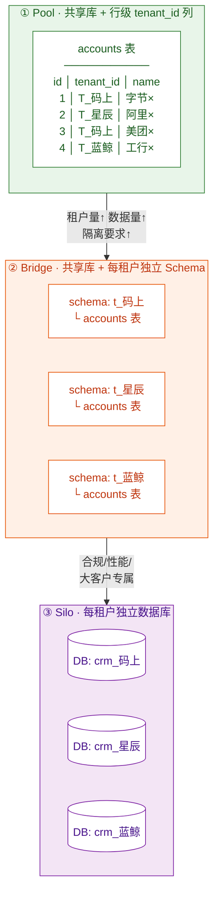
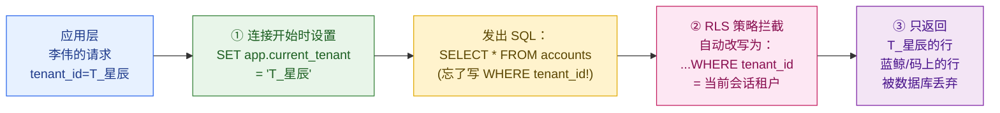
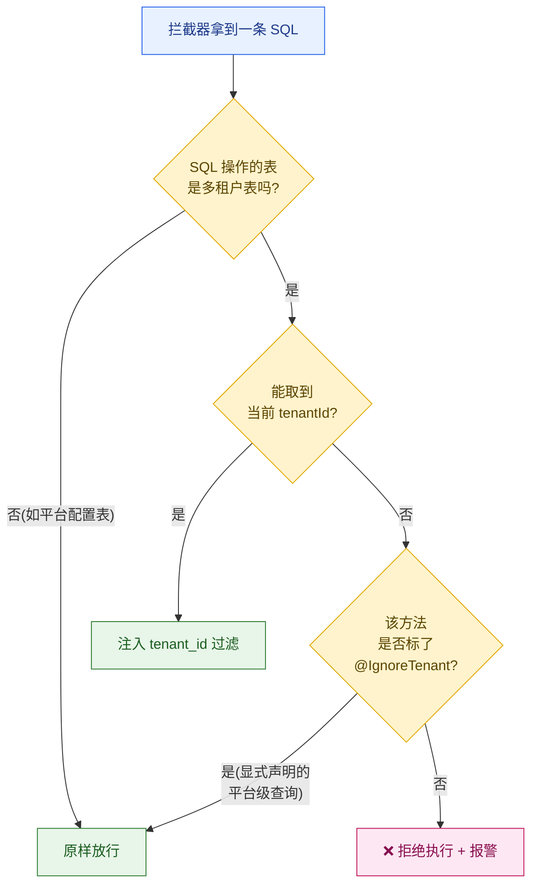
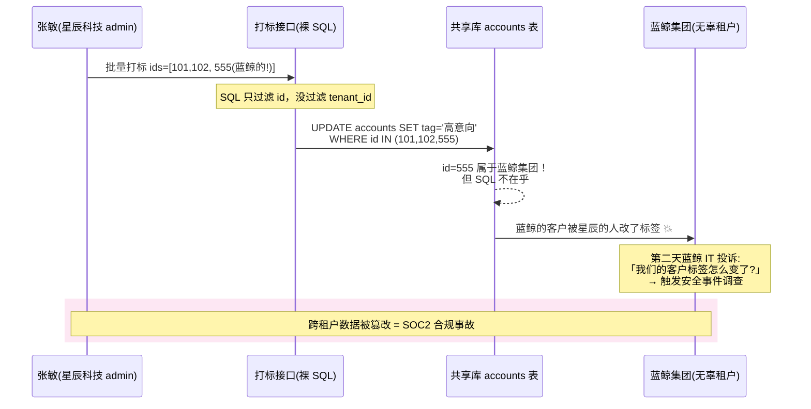
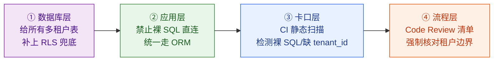
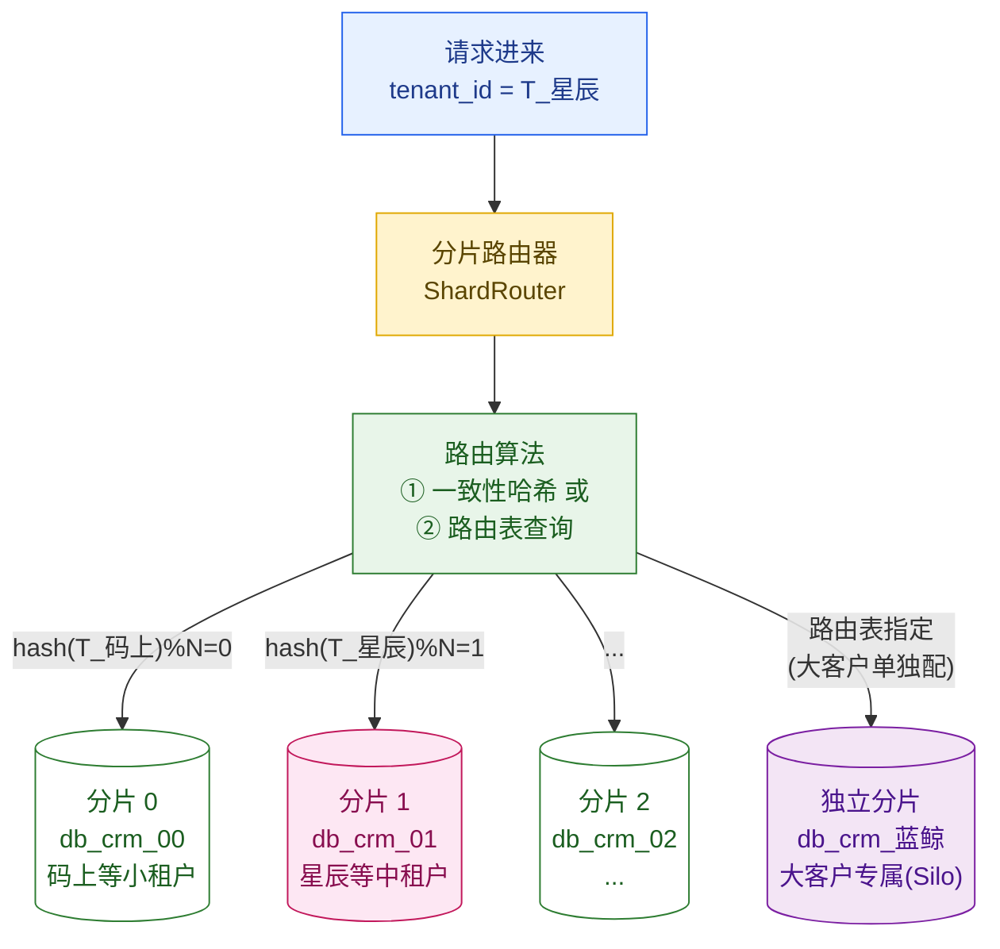
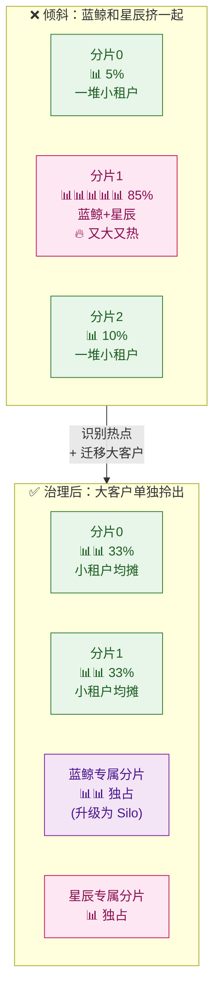
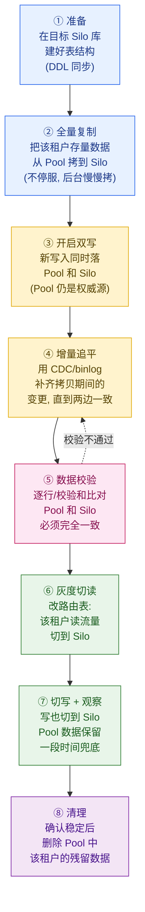
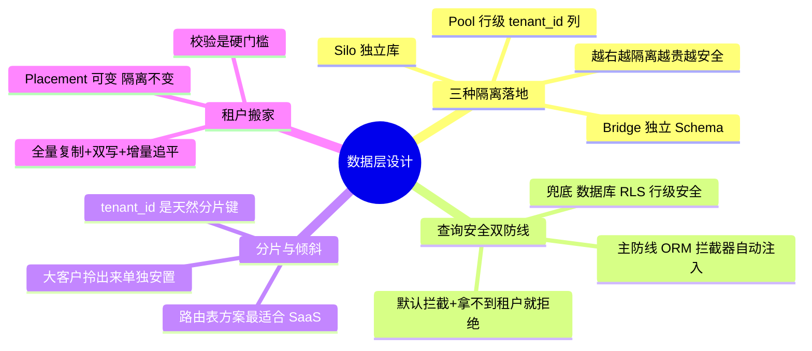

# 第 5 章 数据层设计：分片、隔离与查询安全

> 第 3 章我们决定了「把租户放在哪里」（Pool / Bridge / Silo 三种隔离模型怎么选），第 4 章我们把「租户身份」一路传到了应用层。本章是这条多租户主线的**地基收口**：当一条 SQL 真正打到数据库时，租户隔离到底落在了哪一行、哪一张表、哪一个库上？怎么保证「李伟」永远查不到别家公司的客户？大客户「蓝鲸集团」把库压垮了怎么办？租户要从共享库搬到独立库，数据怎么搬？

---

## 本章导读

读完本章，你应该能回答这些问题：

- 三种数据隔离方式（共享库行级列 / 共享库独立 Schema / 每租户独立库）在**表结构、查询、运维**上分别长什么样？各自的代价是什么？
- 什么是 **RLS（行级安全）**？为什么说它是「应用层忘了加 `tenant_id` 时的最后一道兜底」？PostgreSQL 怎么落地？
- 为什么「靠程序员每次手写 `WHERE tenant_id = ?`」是一种**注定会出事**的设计？怎么用 **ORM 全局过滤器 / MyBatis 拦截器**把这件事自动化、防漏写？
- 当 10 万家租户、200 亿条记录塞不进一个库时，**按租户分库分表**怎么做路由？
- 大租户「蓝鲸集团」一家占了半个库（数据倾斜），怎么治？
- 租户从 Pool（共享库）升级到 Silo（独立库），**搬家**的完整流程是什么？怎么做到不停机、不丢数据、不串数据？
- 一个真实味道的**跨租户数据泄漏事故**是怎么发生的，又怎么被根治的？

> 📌 本章只讲「数据怎么存、怎么查、怎么搬、怎么防漏」。隔离模型怎么选已在第 3 章讲透；数据加密（传输 / 静态 / 租户级密钥）交给第 14 章；租户身份怎么被识别并传进来交给第 4 章——本章默认请求进来时，`tenantId` 已经稳稳躺在上下文里了。

---

## 5.1 三种数据隔离，落到数据库里到底是什么样

第 3 章我们从「架构选型」视角看 Silo / Pool / Bridge；本章换一个视角——**数据库工程师视角**。同样三个词，落到 DDL（数据定义语言，建表语句）和查询上，是三套完全不同的物理形态。

先用云客 CRM 的三个租户对号入座：

| 租户 | 套餐 | 数据隔离落地形态 | 一句话 |
| --- | --- | --- | --- |
| 💡 码上工作室（5 人） | Free | **共享库 + 行级 `tenant_id` 列**（Pool） | 所有租户挤一张表，靠一列区分 |
| 🏢 星辰科技（500 人） | Pro | 默认 Pool；大表可升 **独立 Schema**（Bridge） | 共享库，但每租户一套表空间 |
| 🏦 蓝鲸集团（5 万座席） | Enterprise | **独立数据库**（Silo） | 整个库都是你的，物理隔离 |

### 三种形态对比图



### 三种形态的工程账本

| 维度 | ① Pool 行级列 | ② Bridge 独立 Schema | ③ Silo 独立库 |
| --- | --- | --- | --- |
| **隔离强度** | 弱（逻辑隔离，靠 `WHERE` 兜） | 中（命名空间隔离） | 强（物理隔离） |
| **单库能塞多少租户** | 极多（10 万+） | 中（几百到几千，受 Schema 数量上限制约） | 1 个 |
| **成本/租户** | 极低（共享一切） | 低-中 | 高（独占资源） |
| **「噪声邻居」风险** | 高（共用缓存/连接/IO） | 中 | 无 |
| **加一列/改表结构（DDL 变更）** | 改 1 张表，全租户生效 | 要遍历 N 个 Schema 执行 | 要遍历 N 个库执行 |
| **跨租户聚合分析** | 易（一条 SQL） | 难 | 极难（要跨库） |
| **误写漏 `tenant_id` 的后果** | **灾难：直接串数据** | 较轻（连错 Schema 才会串） | 几乎不可能（连错库才会串） |
| **典型适用** | 海量小租户、Free/Starter | 中型租户、有一定隔离诉求 | 大客户、合规、数据驻留 |

一句话总结这张表：**越往右，隔离越强、成本越高、运维越重、出错概率越低**。SaaS 平台的常态是「混合部署」——绝大多数中小租户用 Pool（省钱），少数大客户/合规客户用 Silo（隔离）。这也呼应了第 2 章那句信条：

> **「Placement is configuration, isolation remains invariant」**——租户放在 Pool 还是 Silo 是可调的配置，但隔离性本身不能因为放进了 Pool 就打折。

本章接下来的主线是：**Pool 模式最省钱，但也最容易出事（误漏 `tenant_id` 就串数据）**。所以本章 60% 的篇幅都在讲——**怎么让 Pool 模式既省钱又安全**（5.2~5.5），剩下再讲分片（5.6）、倾斜（5.7）和搬家（5.8）。

---

## 5.2 行级隔离：tenant_id 列的表设计与查询

这是 SaaS 数据层最常见、也最朴素的方案：**每张业务表都带一列 `tenant_id`，查询时用它过滤**。

### 表设计：tenant_id 是「一等公民」

先看云客 CRM 的核心表 `accounts`（客户表）。在多租户世界里，`tenant_id` 不是一个普通字段，它要满足三条铁律：

1. **每张业务表都有** `tenant_id`（连日志表、附件表都不能漏）。
2. **几乎每个索引都以 `tenant_id` 打头**——因为你的查询永远是「在某租户内」查询。
3. **它参与主键或唯一约束**——否则两个租户的「客户编号」会撞车。

```sql
-- 云客 CRM · 客户表（Pool 模式：所有租户共用一张表）
CREATE TABLE accounts (
    id           BIGINT       NOT NULL,            -- 应用层生成的全局唯一 ID（见下文）
    tenant_id    VARCHAR(32)  NOT NULL,            -- 租户 ID，多租户的命根子
    name         VARCHAR(128) NOT NULL,            -- 客户名称，如「字节跳动」
    owner_uid    BIGINT       NOT NULL,            -- 负责销售，如李伟的 uid
    industry     VARCHAR(64),                      -- 行业
    created_at   TIMESTAMP    NOT NULL DEFAULT now(),
    -- 主键带上 tenant_id：避免不同租户的 id 撞车，也让同租户数据物理聚集
    PRIMARY KEY (tenant_id, id)
);

-- 关键索引：永远以 tenant_id 打头
-- 「查某租户下、某销售负责的客户」是高频查询
CREATE INDEX idx_acc_tenant_owner ON accounts (tenant_id, owner_uid, created_at DESC);

-- 唯一约束也必须带 tenant_id：
-- 「客户名在租户内唯一」，而不是「全平台唯一」——否则星辰科技录了「阿里」，
-- 码上工作室就再也录不了「阿里」了，这显然荒谬
CREATE UNIQUE INDEX uk_acc_tenant_name ON accounts (tenant_id, name);
```

> 🔑 **为什么主键要 `(tenant_id, id)` 而不是单 `id`？**
> 两个原因。① **物理聚集**：把同一租户的数据在磁盘上排在一起，查「星辰科技的所有客户」时顺序扫描，IO 友好。② **分片预备**：将来要按 `tenant_id` 分库分表（见 5.6），主键里带 `tenant_id` 是前提。

> 💡 **ID 用什么生成？** 这里 `id` 用的是**应用层生成的全局唯一 ID**（如雪花算法 Snowflake、或带业务前缀的 ID），而不是数据库自增 ID。原因：Pool 模式下所有租户共表，自增 ID 没问题；但一旦将来要把某个租户「搬家」到独立库（5.8），自增 ID 会和目标库的自增序列冲突。全局唯一 ID 从第一天就避免了这个坑。

### 查询：每一条都必须「在租户内」

现在李伟（星辰科技的销售，租户 `T_星辰`）打开 CRM 首页，要看「我负责的客户列表」。请求经过第 4 章的链路，`tenantId = T_星辰`、`uid = 李伟` 已经在上下文里了。理想的查询是：

```sql
-- 李伟看「我的客户」：tenant_id 和 owner_uid 双重过滤
SELECT id, name, industry, created_at
FROM accounts
WHERE tenant_id = 'T_星辰'        -- ← 租户边界，绝对不能漏
  AND owner_uid = 90012           -- ← 李伟的 uid（业务过滤）
ORDER BY created_at DESC
LIMIT 20;
```

张敏（销售总监，admin）要看「全公司的客户」，那就去掉 `owner_uid` 这层业务过滤，但 `tenant_id` 这层**租户过滤一个字都不能少**：

```sql
-- 张敏看「全公司客户」：业务过滤放开，但租户边界仍在
SELECT id, name, owner_uid, industry
FROM accounts
WHERE tenant_id = 'T_星辰'        -- ← 即便是 admin，也只能看自己公司
ORDER BY created_at DESC;
```

看出问题的苗头了吗？**`tenant_id = ?` 这个条件，靠的是写 SQL 的程序员每次都记得加。** 全公司几百个接口、几千条 SQL，只要有一个人、一次手滑漏了 `tenant_id`，张敏就能看到蓝鲸集团的客户名单——这就是**跨租户数据泄漏**，To B 软件的「公司倒闭级」事故。

这件事「靠人记得」是不可接受的。完整的纵深防御一共四层（CI 卡口 / ORM 拦截器 / RLS / Code Review），本章先讲其中最核心的两道——**应用层与数据库层**，剩下两道（CI 卡口、Code Review 流程）留到 5.5 的事故复盘里补全：

- **核心第一道（应用层）**：用 ORM 全局过滤器 / 拦截器，**自动**给每条 SQL 注入 `tenant_id`，让程序员根本不用手写（5.4）。
- **核心第二道（数据库层）**：用 RLS 行级安全，即使应用层那道防线被绕过（手写裸 SQL、人为失误），数据库**自己**再兜一道底（5.3）。

> ⚠️ **纵深防御（Defense in Depth）**：不依赖单一防线，每一层都假设上一层会失守，自己再防一遍。本章先打牢「应用层过滤 + 数据库 RLS」这两道核心防线（5.2~5.4），5.5 会把它补全为「CI 卡口 / ORM 拦截器 / RLS / Code Review」完整四层。更完整的纵深防御体系（含网络、加密等层面）见第 14 章。

---

## 5.3 RLS 行级安全：数据库自己兜底

> **RLS（Row-Level Security，行级安全）**：一句话大白话——**数据库自动帮你在每条查询后面加一道「只能看自己租户」的过滤条件**。哪怕应用层忘了写 `WHERE tenant_id = ?`，数据库也会偷偷加上，从根上堵死跨租户泄漏。

RLS 是 PostgreSQL、SQL Server、Oracle 等数据库的内置能力（MySQL 8.0 没有原生 RLS，通常靠视图或应用层模拟）。下面用 PostgreSQL 演示。

### RLS 怎么工作：从一张图看懂



核心机制分两步：
1. **告诉数据库「我是谁」**：每次从连接池拿到连接、开始处理请求时，执行一句 `SET app.current_tenant = 'T_星辰'`，把当前租户写进会话变量。
2. **数据库自动加过滤**：RLS 策略读取这个会话变量，给所有对 `accounts` 表的查询**自动追加** `tenant_id = current_setting('app.current_tenant')`。

### PostgreSQL RLS 完整落地代码

```sql
-- ① 在表上「开启」行级安全
ALTER TABLE accounts ENABLE ROW LEVEL SECURITY;

-- ② 强制开启：连表的拥有者（superuser 除外）也必须走 RLS
--    不加这句，表 owner 会绕过策略，是常见的隐藏坑
ALTER TABLE accounts FORCE ROW LEVEL SECURITY;

-- ③ 创建租户隔离策略
--    USING：控制「能看到哪些行」（SELECT/UPDATE/DELETE 的可见性）
--    WITH CHECK：控制「能写入哪些行」（INSERT/UPDATE 写进去的值必须满足）
CREATE POLICY tenant_isolation ON accounts
    USING (tenant_id = current_setting('app.current_tenant'))
    WITH CHECK (tenant_id = current_setting('app.current_tenant'));
```

```sql
-- ④ 应用侧：每个请求处理开始时，把当前租户写进会话变量
--    用 set_config 的第三个参数 true 表示「事务级（local）」，事务结束自动清空，
--    避免连接归还连接池后，残留的租户值污染下一个请求（关键安全点！）
--    ⚠️ 前提：该写法要求每个请求把所有查询都跑在一个【显式事务】内
--    （BEGIN…COMMIT）。若用 autocommit 单语句模式，事务级设置会随这条
--    set_config 语句立即清空，后续 SELECT 反而读不到租户值；此时应改用
--    会话级 set_config(..., false)，并在连接归还连接池前手动 RESET 清空。
SELECT set_config('app.current_tenant', 'T_星辰', true);

-- ⑤ 此后即使应用层「忘了」写 WHERE tenant_id，也安全：
SELECT * FROM accounts;
-- 数据库实际执行的是：
-- SELECT * FROM accounts WHERE tenant_id = 'T_星辰';
-- → 蓝鲸集团、码上工作室的数据被数据库自动挡在外面
```

### 一个能直接跑的对照实验

把这段贴进 PostgreSQL，你能亲眼看到 RLS 生效：

```sql
-- 准备：用一个「非 superuser」的应用账号连接（superuser 默认绕过 RLS）
-- 插入三个租户的数据
SET app.current_tenant = 'T_星辰';
INSERT INTO accounts (id, tenant_id, name, owner_uid) VALUES (1, 'T_星辰', '阿里', 90012);

SET app.current_tenant = 'T_蓝鲸';
INSERT INTO accounts (id, tenant_id, name, owner_uid) VALUES (2, 'T_蓝鲸', '工商银行', 70001);

-- 现在以「星辰科技」的身份查询：
SET app.current_tenant = 'T_星辰';
SELECT name FROM accounts;        -- 只返回「阿里」，看不到「工商银行」

-- 想越权？试试硬写蓝鲸的数据：
INSERT INTO accounts (id, tenant_id, name, owner_uid)
VALUES (3, 'T_蓝鲸', '建设银行', 90012);
-- ❌ 报错：new row violates row-level security policy
-- WITH CHECK 把「往别的租户写数据」也堵死了
```

### RLS 的代价与边界

RLS 不是银弹，用之前要清楚它的脾气：

| 优点 | 代价 / 注意 |
| --- | --- |
| 数据库层兜底，应用 bug 也兜得住 | 每条查询多一个隐式过滤条件，**优化器有时会选错执行计划**，需配合 `tenant_id` 索引 |
| 对应用透明，老代码无需大改 | **必须保证会话变量正确设置**，否则 `current_setting` 找不到变量会报错（可设默认值规避） |
| 防住「裸 SQL」「数据修复脚本」等绕过应用层的场景 | **连接池复用**时一定要用事务级 `set_config(..., true)`，否则上一个租户的值会泄漏给下一个请求 |
| `WITH CHECK` 连「越权写入」都能拦 | MySQL 无原生支持；超级用户默认绕过（需 `FORCE`） |

> 🧭 **实践建议**：RLS 是**兜底**，不是**主防线**。主防线仍然应该是应用层显式/自动的 `tenant_id` 过滤（5.4），原因有二：① 应用层过滤能用上更好的索引、执行计划更可控；② RLS 报错信息对用户不友好。**RLS 的价值在于「最后一道保险」**——当主防线因为人为失误失效时，它让事故从「数据泄漏」降级为「查不到数据」。

---

## 5.4 ORM 强制过滤拦截器：从根上消灭「忘写 tenant_id」

5.2 已经看到：靠程序员每次手写 `WHERE tenant_id = ?` 是不可靠的。本节讲应用层那道主防线——**让框架自动注入 `tenant_id`，程序员根本没机会忘**。

核心思路：**写业务代码的人不应该关心 `tenant_id`。** 他写 `accountRepository.findByOwner(李伟)`，框架在执行前自动改写成 `WHERE owner_uid = ? AND tenant_id = 当前租户`。租户隔离对业务代码**透明**。

### 方案 A：MyBatis 拦截器（Java 生态最常见）

MyBatis 的 `Interceptor`（拦截器）能在 SQL 真正执行前拿到它、改写它。我们拦截 `StatementHandler`，把 `tenant_id` 条件**注入到 SQL 的 WHERE 子句里**。

```java
/**
 * 多租户 SQL 拦截器：在每条 SELECT/UPDATE/DELETE 执行前，
 * 自动注入 tenant_id 过滤条件，防止开发漏写导致跨租户泄漏。
 *
 * 拦截 StatementHandler 的 prepare 方法 —— SQL 即将发给数据库的最后一刻。
 */
@Intercepts(@Signature(
        type = StatementHandler.class,
        method = "prepare",
        args = {Connection.class, Integer.class}))
public class TenantSqlInterceptor implements Interceptor {

    // 显式标注「不需要租户过滤」的 Mapper 方法（如平台级后台查询）才放行
    // 默认全部强制过滤 —— 安全的默认值
    @Override
    public Object intercept(Invocation invocation) throws Throwable {
        StatementHandler handler = (StatementHandler) invocation.getTarget();
        BoundSql boundSql = handler.getBoundSql();
        String originalSql = boundSql.getSql();

        // 从上下文取当前租户（由第 4 章的链路传递而来，存在 ThreadLocal）
        String tenantId = TenantContext.getTenantId();

        // 兜底：拿不到租户身份，宁可报错也绝不放行裸查询
        // —— 这一行是整个拦截器的「安全开关」，宁可错杀，不可漏放
        if (tenantId == null) {
            throw new IllegalStateException(
                "缺少租户上下文，拒绝执行 SQL，防止跨租户泄漏: " + originalSql);
        }

        // 用 SQL 解析器（如 JSqlParser）把 tenant_id 条件注入到 WHERE
        // 比正则拼字符串安全得多 —— 至少能正确识别「已有 WHERE 要 AND 进去、
        // 没有 WHERE 要新建」，不会被注释/字符串里的 "where" 关键字骗到
        String tenantSql = TenantSqlRewriter.addTenantCondition(originalSql, tenantId);

        // 把改写后的 SQL 写回 MyBatis
        SystemMetaObject.forObject(boundSql).setValue("sql", tenantSql);
        return invocation.proceed();
    }

    @Override
    public Object plugin(Object target) {
        return Plugin.wrap(target, this);
    }
}
```

```java
/**
 * SQL 改写器：把 "tenant_id = ?" 注入到 WHERE 子句。
 * 用 JSqlParser 解析 AST（抽象语法树），而不是字符串拼接。
 *
 * 用解析器（而非正则）的好处：能正确识别「已有 WHERE 要 AND 进去、没有
 * WHERE 要新建」，也不会被注释 / 字符串字面量里恰好出现的 "where" 关键字骗到。
 *
 * ⚠️ 注意：下面是【简化示例】，只演示「单表 SELECT」的 tenant_id 注入思路。
 * 生产实现远比这复杂，必须额外处理这些场景，否则会漏注入甚至抛异常：
 *   - UNION / EXCEPT / INTERSECT：getSelectBody() 返回的是 SetOperationList
 *     而不是 PlainSelect，直接强转会抛 ClassCastException，每个子 SELECT 都要分别注入；
 *   - JOIN 多表：要遍历 fromItem + joins 列表，给每张多租户表都加条件，
 *     而不是只取第一张表；
 *   - 子查询 / 派生表（FROM 里嵌 SELECT）：要用 Visitor 递归下钻处理；
 *   - 表别名：列名要用别名（如 a.tenant_id），不能直接用 "accounts a.tenant_id"。
 * 因此生产环境应基于 JSqlParser 的 Visitor 遍历整棵 AST，下面仅作入门演示。
 */
public class TenantSqlRewriter {

    public static String addTenantCondition(String sql, String tenantId) throws Exception {
        Statement stmt = CCJSqlParserUtil.parse(sql);
        if (stmt instanceof Select) {
            SelectBody body = ((Select) stmt).getSelectBody();
            // 仅处理最简单的单表 SELECT；UNION 等 SetOperationList 留给生产实现
            if (!(body instanceof PlainSelect)) {
                throw new UnsupportedOperationException(
                    "本示例仅支持单表 SELECT，UNION/复杂查询需用 Visitor 遍历: " + sql);
            }
            PlainSelect select = (PlainSelect) body;

            FromItem fromItem = select.getFromItem();
            // 仅支持「FROM 单张物理表」；JOIN、子查询作 FROM 等留给生产实现
            if (!(fromItem instanceof Table)) {
                throw new UnsupportedOperationException(
                    "本示例不支持 JOIN/子查询作 FROM，需用 Visitor 遍历: " + sql);
            }
            Table table = (Table) fromItem;
            // 有别名用别名（a.tenant_id），否则用表名（accounts.tenant_id）
            String qualifier = table.getAlias() != null
                    ? table.getAlias().getName()
                    : table.getName();

            // 构造 tenant_id = 'xxx' 表达式
            EqualsTo tenantCond = new EqualsTo();
            tenantCond.setLeftExpression(new Column(qualifier + ".tenant_id"));
            tenantCond.setRightExpression(new StringValue(tenantId));

            Expression where = select.getWhere();
            // 原本没 WHERE → 直接设置；原本有 WHERE → 用 AND 拼接
            select.setWhere(where == null
                    ? tenantCond
                    : new AndExpression(where, tenantCond));
        }
        // UPDATE / DELETE 同理处理（此处省略）
        return stmt.toString();
    }
}
```

> ⚠️ **示例为了直观，把 `tenant_id` 用 `new StringValue(tenantId)` 拼成了 SQL 字面量。** 生产实现应注入占位符（`?`）+ 绑定参数，而非字面量——这样既能复用预编译语句（prepared statement）缓存、提升性能，也能彻底杜绝 SQL 注入风险（本场景 `tenantId` 来自服务端上下文相对可控，但养成绑参的习惯总没错）。

### 方案 B：声明式全局过滤器（Hibernate / JPA / 其他 ORM）

很多 ORM 提供「软删除式」的全局过滤能力，比拦截器更声明式。以 Hibernate 的 `@Filter` 为例：

```java
@Entity
@Table(name = "accounts")
// 定义一个名为 tenantFilter 的全局过滤器
@FilterDef(name = "tenantFilter",
        parameters = @ParamDef(name = "tenantId", type = String.class))
@Filter(name = "tenantFilter", condition = "tenant_id = :tenantId")
public class Account {
    @Id private Long id;
    @Column(name = "tenant_id") private String tenantId;
    private String name;
    // ...
}
```

```java
/**
 * 在每个请求开始处理时（如拦截器 / AOP 切面里），开启并填充过滤器。
 * 此后这个 Hibernate Session 发出的所有 Account 查询都自动带 tenant_id。
 */
@Component
public class TenantFilterAspect {
    @PersistenceContext private EntityManager em;

    public void enableTenantFilter() {
        String tenantId = TenantContext.getTenantId();
        if (tenantId == null) {
            throw new IllegalStateException("缺少租户上下文，拒绝放行");
        }
        Session session = em.unwrap(Session.class);
        session.enableFilter("tenantFilter")
               .setParameter("tenantId", tenantId);
    }
}
```

> 类似机制在各语言生态都有对应：
> - **Python / Django**：自定义 `Manager` 重写 `get_queryset()` 或用 `django-multitenant`
> - **Ruby on Rails**：`acts_as_tenant` gem 自动注入 `default_scope`
> - **Node.js / Prisma**：客户端扩展（`$extends`）在每次查询里注入 `where: { tenantId }`
> - **.NET / EF Core**：`HasQueryFilter(e => e.TenantId == _tenant)` 全局查询过滤器

### 拦截器设计的三个关键决策



三个决策点的设计哲学，每一条都来自血的教训：

1. **安全的默认值（Secure by Default）**：默认**全部强制过滤**。只有显式标注 `@IgnoreTenant` 的方法（比如平台运营后台要统计「全平台今日新增客户数」）才放行。**默认放行 = 默认裸奔**，必须默认拦截。
2. **拿不到租户身份 = 拒绝，不是放行**。`tenantId == null` 时，宁可让这个请求报错（暴露问题），也绝不能放行一条没有租户边界的查询。「报错」是可观测的、能告警的；「放行」是无声的、出事时才发现的。
3. **白名单表 vs 多租户表**。平台级配置表（如 `system_config`、`plan_catalog` 套餐目录）本来就不带 `tenant_id`，拦截器要能识别这些表并跳过，否则会注入一个不存在的列导致报错。

---

## 5.5 事故复盘：一次真实味道的跨租户泄漏

理论讲完，来看一个具体的事故。这是把「忘写 `tenant_id`」的危害讲透的最好方式。

### 事故时间线

某天下午，云客 CRM 上线了一个「客户标签批量打标」的新功能：销售可以给客户批量打标签（如「高意向」「已流失」）。负责的工程师写了一个**新接口**，为了「性能」绕过了 ORM，直接手写了一段 JDBC 裸 SQL：

```java
// ❌ 事故代码：为了"批量更新性能"，绕过了 ORM 拦截器，手写裸 SQL
String sql = "UPDATE accounts SET tag = ? WHERE id IN (" + idsCsv + ")";
//                                                ↑↑↑
//          致命：只按 id 过滤，完全没有 tenant_id！
//          而 id 在 Pool 模式下是全局唯一的，前端传来的 id 列表
//          理论上跨租户也能命中别人的行
jdbcTemplate.update(sql, tagValue);
```

下午 3 点，星辰科技的销售总监张敏在批量打标时，前端因为一个**分页缓存 bug**，把上一页（恰好是另一个租户共享的演示数据）的 `id` 也带进了请求。结果——



### 为什么本该存在的防线都没拦住？

5.2 提到完整的纵深防御有四层（CI 卡口 / ORM 拦截器 / RLS / Code Review）。事发当时第四层「CI 卡口」还没建（正是这次事故才把它补上，见下方根治措施），所以当时本该拦住的是前三层。复盘时发现，这次事故恰好把这三层全踩穿了：

| 本应存在的防线 | 为什么失效了 |
| --- | --- |
| ① ORM 拦截器自动注入 `tenant_id` | **被绕过了**——工程师手写 JDBC 裸 SQL，根本没走 ORM |
| ② RLS 数据库兜底 | **当时没开**——这套库上线早，RLS 是后来才推广的，老表没补上 |
| ③ Code Review | 评审的人没注意到 `WHERE` 里缺了 `tenant_id`，因为「看起来就是个普通的 UPDATE」 |

> 💀 **核心教训**：单一防线一定会被绕过。这次事故的根因不是「某个人犯了错」——人一定会犯错——而是**系统设计上允许「不带 tenant_id 的 SQL」能够成功执行**。

### 根治措施（按优先级）



1. **数据库层兜底（最高优先级）**：给所有多租户表补上 RLS（5.3）。这是「即使应用层全错了也不串数据」的最后一道墙。这次事故如果 RLS 在，那条裸 SQL 会直接被 `WITH CHECK` 拦下报错。
2. **应用层收口**：禁止业务代码直连 JDBC / 裸 SQL，所有数据访问统一走带拦截器的 ORM。确需高性能批量操作，提供**封装好的、强制带 `tenant_id`** 的批量 API。
3. **CI 静态扫描卡口**：在持续集成（CI）里加一条规则——扫描代码里的裸 SQL 字符串，凡是 `UPDATE/DELETE/SELECT` 不含 `tenant_id` 的，**直接阻断合并**。把「人为审查」升级为「机器强制」。
4. **流程兜底**：Code Review 清单里加一条强制项「这条 SQL 的租户边界在哪里？」。

> 🧭 **这个事故的元教训，正是本章 5.3 + 5.4 想传达的**：CI 卡口（防回归）+ 应用层拦截器（主防线）+ 数据库 RLS（兜底防线）+ Code Review（流程兜底），四层缺一不可。它们共同构成本章的「纵深防御」——任何一层都假设其他层会失守，自己再防一遍。

---

## 5.6 按租户分库分表：当一个库装不下时

到这里，我们解决了「Pool 模式怎么安全」。但 Pool 还有一个绕不开的物理极限：**一个数据库实例装不下 10 万家租户、200 亿条客户记录。** 单表过亿后，索引膨胀、查询变慢、备份时间拉长、单点故障影响所有租户。这时需要**分库分表（Sharding）**。

> **分库分表（Sharding，分片）**：一句话——**把一张巨大的表/一个巨大的库，按某个规则切成很多小块，分散到多台数据库服务器上**。每台只存一部分数据，合起来才是全量。

### 分片键：在 SaaS 里，天然就是 tenant_id

普通系统分片最头疼的是「选哪个字段当分片键（Sharding Key）」。但 SaaS 有个巨大的先天优势：**几乎所有查询都带 `tenant_id`，所以 `tenant_id` 就是天然的分片键**。

按 `tenant_id` 分片有一个杀手级好处：**同一个租户的所有数据落在同一个分片上**。这意味着：
- 单租户内的查询、JOIN、事务都在一个库内完成，**不产生跨库分布式查询**（分布式查询又慢又复杂）。
- 租户之间天然隔离，一个租户的分片故障不影响其他分片的租户。

### 分片路由：从 tenant_id 到具体的库



路由算法有两大流派，SaaS 平台**通常两者结合**：

| 方案 | 原理 | 优点 | 缺点 |
| --- | --- | --- | --- |
| **哈希取模 / 一致性哈希** | `shard = hash(tenant_id) % N` | 无需维护映射表，均匀分布 | 扩容（N 变化）时大量租户要搬家；无法把特定大客户单独放 |
| **路由表（查表）** | 维护一张 `tenant_id → shard_id` 映射表 | **灵活**：可指定大客户去专属分片，可随时迁移单个租户 | 多一次查表（可缓存）；需维护映射表 |

实践中，**路由表方案更适合 SaaS**，因为它能优雅地处理「大客户单独 Silo」和「租户搬家」这两件 SaaS 特有的事。下面是路由表方案的核心代码：

```java
/**
 * 租户分片路由器：根据 tenant_id 决定查哪个分片库。
 * 采用「路由表 + 本地缓存」方案，兼顾灵活与性能。
 */
@Component
public class TenantShardRouter {

    // 本地缓存：tenant_id → 数据源。映射表很少变，缓存命中率极高
    private final LoadingCache<String, DataSource> shardCache;

    private final TenantShardMappingRepository mappingRepo; // 路由表存储
    private final Map<String, DataSource> dataSources;       // shard_id → 实际数据源

    /**
     * 路由核心：给定租户，返回它应该连的数据源。
     */
    public DataSource route(String tenantId) {
        return shardCache.get(tenantId, key -> {
            // 查路由表：这个租户被分配到了哪个分片？
            TenantShardMapping mapping = mappingRepo.findByTenantId(key);
            if (mapping == null) {
                throw new IllegalStateException("未找到租户的分片映射: " + key);
            }
            // 大客户(如蓝鲸)的 mapping.shardId 可能指向一个独享分片
            // 小客户则指向共享分片 —— 同一套路由逻辑，兼容 Pool 和 Silo
            DataSource ds = dataSources.get(mapping.getShardId());
            if (ds == null) {
                throw new IllegalStateException("分片数据源不存在: " + mapping.getShardId());
            }
            return ds;
        });
    }
}
```

```java
/**
 * 动态数据源：基于 Spring 的 AbstractRoutingDataSource，
 * 每次拿连接前，先从租户上下文确定要连哪个分片。
 * 对业务代码完全透明 —— 业务层根本不知道有分库这回事。
 */
public class TenantRoutingDataSource extends AbstractRoutingDataSource {
    @Override
    protected Object determineCurrentLookupKey() {
        // 从第 4 章传下来的上下文取租户，再交给路由器算分片
        return TenantContext.getTenantId();
    }
}
```

> 💡 **生产中通常不会自己造轮子**：成熟的分库分表中间件如 **Apache ShardingSphere**（Java）、**Vitess**（MySQL，YouTube/Slack 在用）、**Citus**（PostgreSQL 扩展，按租户分布）已经把路由、跨片聚合、在线扩容都封装好了。理解上面的原理后，选型时你就知道它们在帮你做什么。

### 分片带来的新问题

分库分表不是免费的，它换来了扩展性，也带来了新的麻烦：

- **跨租户的全平台聚合查询变难**：「统计全平台今日新增客户数」原来一条 SQL，现在要查所有分片再汇总。解决方案：把这类分析需求**分流到数仓/OLAP 系统**（如 ClickHouse、Doris），让事务库（OLTP）专心服务单租户查询。这部分属于数据架构话题，本章不展开。
- **全局唯一 ID 更重要了**：5.2 提到的应用层生成全局 ID，到了分片场景就是刚需——自增 ID 在不同分片会重复。
- **扩容时的数据搬迁**：见下一节的「数据倾斜」和 5.8 的「租户搬家」。

---

## 5.7 大租户数据倾斜：一家把整个库压垮

分片解决了「装不下」，但 SaaS 有一个普通系统没有的痛——**租户规模天差地别**。码上工作室 5 个人、几百条客户；蓝鲸集团 5 万座席、几亿条记录。如果它们恰好被哈希到同一个分片上……

> **数据倾斜（Data Skew）**：一句话——**本该均匀分散的数据，因为某些「巨型 key」（这里是大租户）全挤在一个分片上，导致这个分片又大又热，其他分片却很闲。** 木桶效应：整个系统的性能被最慢的那个分片拖垮。

### 倾斜长什么样



### 治理思路：识别 + 隔离 + 路由

数据倾斜的治理，本质是**别让纯哈希自动决定大客户的去向**，而是**主动把大客户拎出来单独安置**。这正是「路由表方案」（5.6）相比「纯哈希」的最大价值。

**第一步：识别热点租户。** 用第 12 章会详讲的租户级监控，按 `tenant_id` 维度统计每个租户的数据量、QPS、存储占用，找出 Top N 重量级租户。

```sql
-- 按租户统计行数，揪出「巨无霸」租户（这条可直接运行）
SELECT tenant_id,
       COUNT(*)                                   AS row_count,
       -- 单行估算字节 × 行数 ≈ 该租户在本表的逻辑占用（粗略）
       pg_size_pretty(SUM(pg_column_size(accounts.*))) AS approx_size
FROM accounts
GROUP BY tenant_id
ORDER BY row_count DESC
LIMIT 20;
-- 输出可能是：T_蓝鲸 占 8 亿行，是第二名的 50 倍 → 它就是倾斜源头

-- 注：上面 pg_column_size 只估「行数据」逻辑大小，不含索引/TOAST/膨胀。
-- 想看某张表在磁盘上的真实物理占用（含索引），用系统函数/视图，例如：
--   SELECT pg_size_pretty(pg_total_relation_size('accounts'));   -- 整表+索引
-- 按租户的物理占用拆分则需结合分区表 / 路由表元数据另行统计。
```

**第二步：把大租户迁到专属分片（甚至升级为 Silo）。** 在路由表里把蓝鲸集团的 `shard_id` 改成一个专属分片，再执行「租户搬家」（5.8）把数据迁过去。从此蓝鲸独占资源，既解决了倾斜，又顺带满足了大客户的隔离/合规诉求——**一举两得，倾斜治理和隔离升级是同一件事**。

**第三步：分层路由策略。** 把租户按规模分层，不同层用不同安置策略：

| 租户层级 | 安置策略 | 例子 |
| --- | --- | --- |
| 小租户（绝大多数） | 哈希均摊到共享分片池（Pool） | 💡 码上工作室 |
| 中租户 | 路由表分配，避免和其他中租户挤一起 | 🏢 星辰科技 |
| 大租户 / 合规客户 | 专属分片 / 独立库（Silo） | 🏦 蓝鲸集团 |

> 🧭 **设计信条再现**：这正是「Placement is configuration」——把哪个租户放哪个分片，是一个**可以随业务增长动态调整的配置决策**，而不是上线时一锤定音的死规则。路由表方案让这种「动态再平衡」成为可能。

---

## 5.8 租户搬家：从 Pool 升级到 Silo 怎么迁

最后一个、也是最考验工程功力的话题。码上工作室用了两年，从 5 个人长成了 500 人的中型公司（变成了「星辰科技」式的客户），又签了大单要求数据独立部署、独立备份——它需要从**共享库（Pool）搬到独立库（Silo）**。

这个操作叫**租户搬家 / 租户迁移（Tenant Migration）**。它的难点在于三个「绝对不能」：

- **绝对不能丢数据**：迁移过程中产生的新数据（搬家时码上的销售还在录客户）一条都不能漏。
- **绝对不能串数据**：只能搬这一个租户的数据，绝不能把别家的也带过去。
- **绝对不能长时间停服**：大客户不接受「停机维护 4 小时」。

### 朴素方案为什么不行

最简单的想法：「停服 → 导出这个租户的数据 → 导入新库 → 改路由 → 启服」。问题是**停服时间太长**——几亿条数据导出导入可能要几小时，大客户不答应。所以生产级方案普遍采用**双写 + 增量追平 + 灰度切流**的「在线迁移」。

### 在线搬家完整流程



逐步拆解，重点理解每一步**为什么不能省**：

| 步骤 | 在做什么 | 为什么关键 |
| --- | --- | --- |
| ① 建表 | 在 Silo 库建好和 Pool 一致的表结构 | 目标得先有「容器」 |
| ② 全量复制 | 后台慢速拷贝存量数据，不影响线上 | 大头数据先搬，避免切换时一次性搬太多 |
| ③ 开启双写 | 新写入同时写 Pool（权威）+ Silo | 保证拷贝期间的新数据不丢，这是「不停服」的关键 |
| ④ 增量追平 | 用 CDC（Change Data Capture，变更数据捕获，靠监听数据库 binlog 把变更同步过去）补齐②期间漏掉的变更 | 全量拷贝有时间窗，窗内的变更要追平 |
| ⑤ 数据校验 | 行数、校验和（checksum）逐表比对 Pool 与 Silo | **不能串、不能丢的最后验证**，不通过就回到④ |
| ⑥ 灰度切读 | 路由表把该租户**读**流量切到 Silo，先观察 | 读切错了影响小（数据还在 Pool 兜底） |
| ⑦ 切写 | 读稳定后，**写**也切到 Silo，停止双写 | 此时 Silo 成为权威源 |
| ⑧ 清理 | 观察期后，从 Pool 删除该租户残留数据 | 释放 Pool 空间；删除前务必再次确认（删错=灾难） |

### 搬家中最容易踩的坑

```java
/**
 * 双写阶段：业务写入时，同时落 Pool 和 Silo。
 * 这是「在线迁移不丢数据」的核心。
 */
public void saveAccount(Account account) {
    // 1. 写权威源（Pool）—— 失败则整体失败，保证主库一定成功
    poolDataSource.save(account);

    // 2. 写迁移目标（Silo）—— 仅对正在迁移的租户开启
    if (migrationRegistry.isMigrating(account.getTenantId())) {
        try {
            siloDataSource.save(account);
        } catch (Exception e) {
            // 关键决策：Silo 写失败【不能】让整个请求失败！
            // 否则迁移就影响了线上正常业务。
            // 正确做法：记录失败，交给步骤④的增量追平去补
            log.error("双写 Silo 失败，将由增量追平补偿, tenantId={}, id={}",
                    account.getTenantId(), account.getId(), e);
            migrationRegistry.markPendingSync(account.getId());
        }
    }
}
```

几条铁律：

1. **谁是权威源（Source of Truth）要始终明确**。切写之前 Pool 是权威，切写之后 Silo 是权威。任何时刻都不能「两边都说自己对」。
2. **双写时，目标库失败不能拖垮主流程**（见上面代码）——目标库的失败由增量追平兜底，迁移绝不能影响线上正常业务。
3. **校验是硬门槛**。⑤的数据校验不通过，绝不允许进入⑥切流。这是「绝对不串、绝对不丢」的最后一关。
4. **保留回滚能力**。⑥⑦切流后，Pool 的数据先别急着删（⑧要等观察期），万一 Silo 出问题，能立刻把路由切回 Pool。
5. **ID 全局唯一是前提**。如果当初用的是数据库自增 ID（5.2 提醒过），搬家时 ID 会和 Silo 库的序列冲突——这也是为什么从第一天就该用应用层全局 ID。

> 🧭 **搬家的本质，是 5.6 路由表 + 5.3 隔离不变 + 第 13 章灰度切流的综合应用**。它把本章所有概念串成了一条实战链路。更通用的「租户迁移 / 区域迁移」运维体系见第 13 章；这里只聚焦数据层的搬迁机制。

---

## 本章小结

本章把多租户的「数据层地基」从物理形态讲到了实战搬迁，核心可以浓缩成几条：



1. **三种隔离的物理形态**：Pool（行级 `tenant_id` 列，最省钱最易出事）、Bridge（独立 Schema）、Silo（独立库，最隔离最贵）。SaaS 常态是混合部署。
2. **`tenant_id` 是数据层的命根子**：每表都有、索引打头、参与主键与唯一约束。
3. **查询安全靠双防线**：应用层 ORM 拦截器/全局过滤器**自动注入** `tenant_id`（主防线，默认拦截、拿不到租户就拒绝），数据库 RLS **自动兜底**（最后一道墙）。两者是「纵深防御」，缺一不可——5.5 的事故证明了单防线必被绕过。
4. **分片用 `tenant_id` 当分片键**：同租户数据聚在一个分片，避免跨库查询。路由表方案比纯哈希更适合 SaaS，因为它能优雅处理大客户专属和租户搬家。
5. **数据倾斜的治理 = 把大客户拎出来单独安置**，这件事和「隔离升级」是同一个操作。
6. **租户搬家用在线迁移**：全量复制 → 双写 → 增量追平 → 校验 → 灰度切流 → 清理。三条红线：不丢、不串、不长停。

> 至此，「租户隔离」这条主线（第 3~5 章）讲完了：第 3 章选模型，第 4 章传身份，第 5 章落数据。接下来第 6~7 章进入「身份与权限」——李伟、张敏、老陈这三个角色，凭什么能做不同的事？请看第 6 章《身份认证与租户身份体系》。

---

## 参考来源

- [AWS SaaS Lens — Tenant Isolation & Data Partitioning](https://docs.aws.amazon.com/wellarchitected/latest/saas-lens/tenant-isolation.html)（AWS Well-Architected SaaS 视角，官方对 Pool/Silo/Bridge 与数据隔离的权威阐述）
- [PostgreSQL 官方文档 — Row Security Policies (RLS)](https://www.postgresql.org/docs/current/ddl-rowsecurity.html)（RLS 策略、`USING` / `WITH CHECK`、`FORCE ROW LEVEL SECURITY` 的一手说明）
- [Citus — Multi-tenant Applications with PostgreSQL](https://docs.citusdata.com/en/stable/use_cases/multi_tenant.html)（按 `tenant_id` 分布式分片的工程实践，含大租户与查询安全）
- [Stripe — Online migrations at scale](https://stripe.com/blog/online-migrations)（双写 + 回填 + 校验的在线数据迁移四步法，租户搬家的方法论母本）
- [Apache ShardingSphere — Sharding 文档](https://shardingsphere.apache.org/document/current/en/features/sharding/)（分库分表中间件的路由、分片键、动态扩容实现参考）
