# 第 6 章 · 身份认证与租户身份体系

> 认证（Authentication）只回答一个问题：**「你是谁？」**
> 你**能做什么**（能不能删别人的客户、能不能改套餐）是授权（Authorization），那是第 7 章的事。
> 本章只管把「李伟是李伟、而且他现在代表星辰科技在操作」这件事确认清楚。

---

## 本章导读

读完本章，你应该能回答这些问题：

- 普通用户注册登录，一步步发生了什么？密码到底是怎么存的？
- 为什么「一个邮箱 = 一个用户 = 一家公司」这个朴素模型一上企业市场就崩了？李伟同时在星辰科技和另一家公司任职，系统该怎么建模？
- 为什么老陈（IT 管理员）一开口就问「你们支持 SSO 吗？不支持我们不买」——**SSO 凭什么是企业客户的刚需而不是锦上添花**？
- SAML 2.0 和 OIDC（OpenID Connect）这两套企业单点登录协议，登录时浏览器、平台、企业身份提供商之间到底在传什么？时序是怎样的？
- 蓝鲸集团 5 万人，难道要老陈在云客 CRM 后台一个个手动开账号？员工离职了谁记得去关账号？**SCIM** 怎么把「入职自动开通、离职自动回收」全自动化？
- 登录成功后，「登录态」用 Session 还是 JWT 保存？JWT 里凭什么带着 `tenant_id`，它长什么样？

一句话主线：**本章把「一个人 → 确认身份 → 确认他此刻代表哪个租户 → 发一张随身携带的身份凭证」这条认证链路打通。**

---

## 6.1 先把认证这件事放进 SaaS 的语境

普通的单租户网站，认证很简单：用户表里一行记录，邮箱 + 密码，登录成功就完事。但 SaaS 平台多了一个维度——**租户（Tenant，一家订阅了平台的公司/组织）**。在云客 CRM 里，认证不止要确认「你是李伟」，还要确认「**你现在代表哪家公司在操作**」。

先看一张全局图，把本章要讲的几块拼起来：

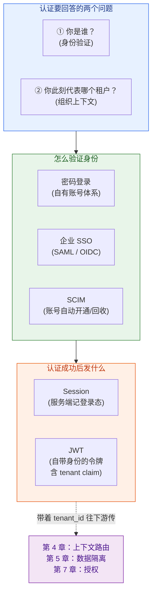

> 📌 **本章的边界**（务必记清，避免和别章混淆）：
> - 「你**能做什么**」= 授权（Authorization）→ 见**第 7 章**（RBAC/ABAC）。本章只确认「你是谁」。
> - tenant 上下文确认后**怎么在服务之间传递不丢** → 见**第 4 章**（租户标识与上下文路由）。
> - JWT 里的 `tenant_id` **如何被用来做数据过滤**（RLS、分库）→ 见**第 5 章**（数据层）。
> - 本章产出的东西是：一张确认了「人 + 租户」的**身份凭证**。它怎么用，是下游的事。

---

## 6.2 最朴素的起点：注册与密码登录

我们从最简单的场景讲起：码上工作室的创始人，第一次打开云客 CRM，自己注册了一个账号。这是个**自助注册（self-service signup）**流程——不需要销售对接，刷信用卡就能用，这是 SaaS 的典型增长入口。

### 6.2.1 注册时数据库里发生了什么

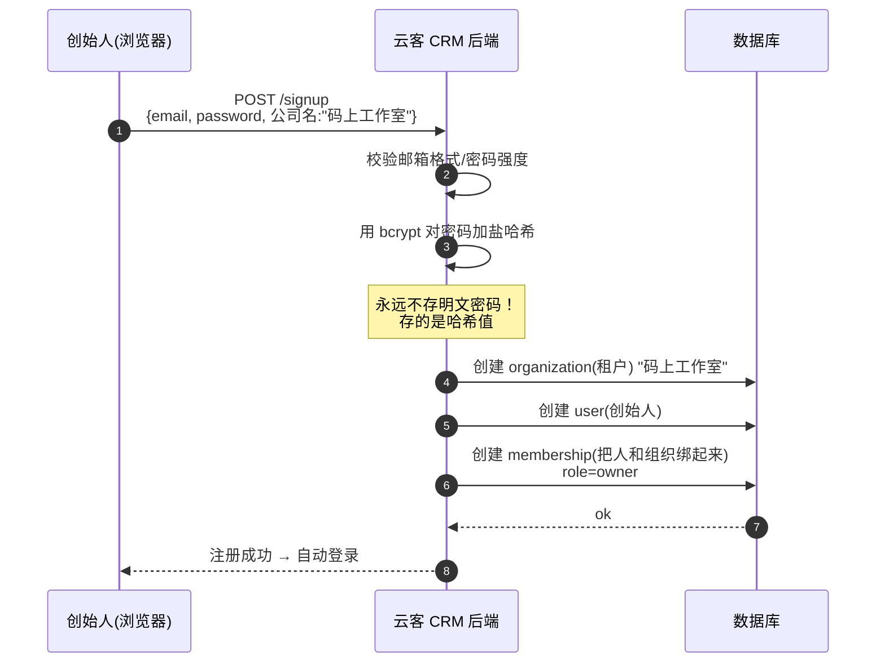

注意第 6-8 步：注册一个新公司时，**一次性创建了三张表的记录**——租户（organization）、用户（user）、以及把两者关联起来的成员关系（membership）。为什么要拆成三张表而不是一张？这正是下一节要讲的多对多模型，先按下不表。

### 6.2.2 密码到底怎么存——这关系到一次泄漏会不会让公司倒闭

密码是认证里安全等级最高的一环。新手最容易犯的错误是「明文存密码」或「用 MD5/SHA-256 存密码」，这两种做法在 SaaS 平台上等于把炸药放枕头底下。

正确做法是用**专为密码设计的慢哈希算法**，加盐（salt）后存哈希值：

- **哈希（Hash）**：把任意输入变成固定长度乱码的单向函数，无法反推回原文。
- **加盐（Salt，盐值）**：每个用户配一段随机字符串，混进密码再哈希。大白话——就算李伟和张敏用了相同的密码 `123456`，加了不同的盐之后哈希结果也完全不同，攻击者预先算好的「彩虹表」就废了。
- **bcrypt / Argon2（慢哈希算法）**：故意设计得「算起来很慢」，单次哈希耗时从几十到几百毫秒不等，具体取决于 cost 因子（见下面代码里的 `12`）和硬件性能，不是一个固定值。正常用户登录一次慢这么点无所谓，但攻击者拿到哈希库想暴力破解，慢哈希会让他每秒只能试几次，破解成本指数级上升。

```java
// 注册时：对密码加盐哈希后存库（用 Spring Security 的 BCryptPasswordEncoder）
// bcrypt 自带随机盐，盐会被编码进哈希结果字符串里，无需单独存盐字段
PasswordEncoder encoder = new BCryptPasswordEncoder(12); // 12 是 cost 因子，越大越慢越安全
String hashed = encoder.encode(rawPassword);
// 存进 user 表的 password_hash 字段，例如：
// $2a$12$N9qo8uLOickgx2ZMRZoMyeIjZAgcfl7p92ldGxad68LJZdL17lhWy
userRepository.save(new User(email, hashed));

// 登录时：用 matches 比对（不是先哈希再比字符串，bcrypt 会从哈希里取出盐再算）
boolean ok = encoder.matches(inputPassword, user.getPasswordHash());
```

> 🔒 **[SECURITY REVIEW REQUIRED]** 密码哈希属于安全敏感代码。务必：① 永不存明文；② 用 bcrypt/Argon2 而非 MD5/SHA；③ 比对用库提供的 `matches`，避免自己拼字符串比较导致时序攻击（timing attack）。

### 6.2.3 自助注册 vs 企业开通：SaaS 的两条入口

码上工作室那种「刷卡即用」的密码注册，叫**自助开通**。但蓝鲸集团这种 5 万人金融集团，根本不会让员工各自去注册——他们要的是**集中管控**：账号由公司 IT 统一发放、统一回收、统一用公司域账号登录。这就引出了后面的 SSO 和 SCIM。

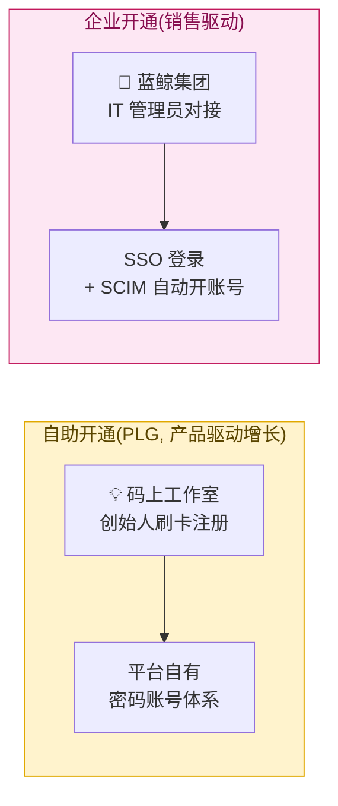

> 不同套餐的租户走不同的认证入口，这是 SaaS 身份体系必须同时支撑两套路径的根本原因——**一套系统，既要伺候 5 人小团队的自助密码登录，又要伺候 5 万人集团的企业级 SSO。**

---

## 6.3 组织-用户多对多模型：一个邮箱可以属于多家公司

这是本章第一个核心难点。新手做认证，脑子里的模型往往是：

> 一个邮箱 → 一个用户 → 一家公司。三者一一对应。

这个模型在消费级产品（微博、知乎）里没问题，但**一进企业 SaaS 市场就立刻崩溃**。

### 6.3.1 为什么朴素模型会崩

来看真实场景。销售代表**李伟**，本职在**星辰科技**做销售（成员 member），但他同时是另一家创业公司「极光数据」的兼职顾问，也用云客 CRM。他在两家公司用的是**同一个工作邮箱** `liwei@example.com`。

如果坚持「一个邮箱一个用户一家公司」：
- 要么李伟得注册两个账号、记两套密码（体验灾难）；
- 要么系统不允许同一邮箱注册两次（直接卡死，第二家公司没法加他）。

现实是：**人是属于人的，组织是属于组织的，一个人可以同时属于多个组织。** 这是个典型的**多对多（Many-to-Many）关系**。

### 6.3.2 三张表的模型

正确的建模是把「用户」和「组织」拆开，中间用一张**成员关系表（Membership）**连接：

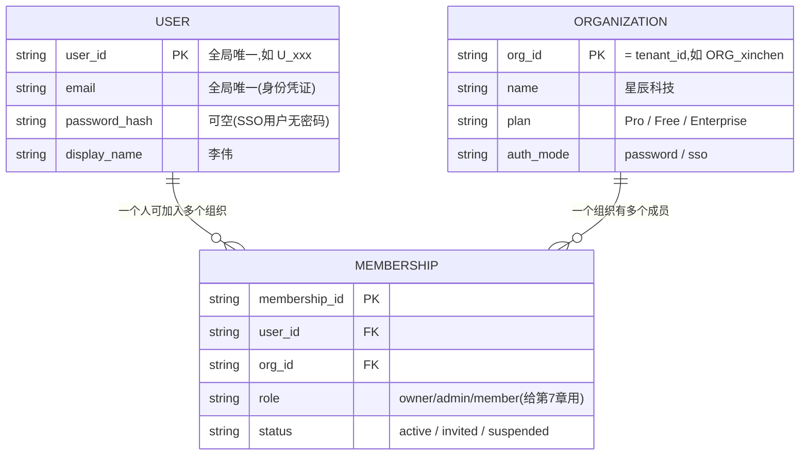

用一张图直观看李伟的处境——**同一个 user，两条 membership，指向两个不同的租户**：

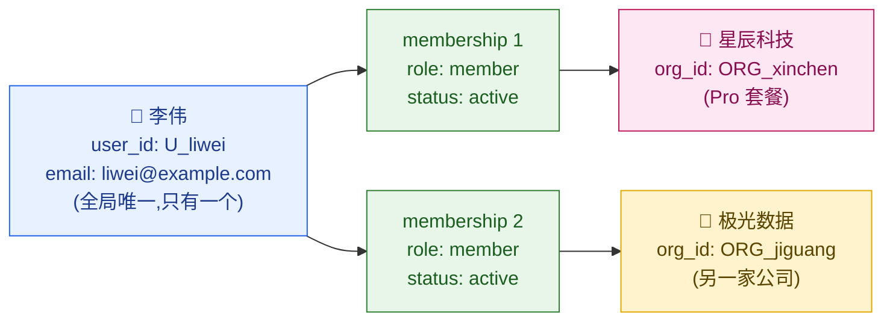

几个关键设计决策，解释一下「为什么这么定」：

1. **`email` 的全局唯一性放在 `user` 表上**，不放在 `membership` 上。因为「李伟」这个自然人在全平台只有一个身份；邮箱是他登录时的全局身份凭证。
2. **`role`（owner/admin/member）放在 `membership` 表上，不放在 `user` 表上**。因为李伟在星辰科技是普通成员，但在极光数据可能是管理员——**角色是「人在某个组织里」的属性，不是「人」本身的属性**。注意：角色的具体权限语义是授权范畴，详见**第 7 章**，本章只负责把 role 字段存对位置。
3. **`password_hash` 在 `user` 表上且可空**。因为走 SSO 登录的用户（如蓝鲸集团员工）在平台根本没有密码——他们的密码在企业自己的身份系统里。

### 6.3.3 登录后必须「选择当前组织」

既然李伟横跨两家公司，那他用 `liwei@example.com` 登录成功后，系统面临一个必答题：**这次会话，你代表哪家公司？**

这就是 SaaS 登录区别于消费级登录的标志性一步——**组织切换器（Org Switcher）**。你在 Slack、Notion、飞书 切换工作区时见过的那个下拉框，本质就是这个。

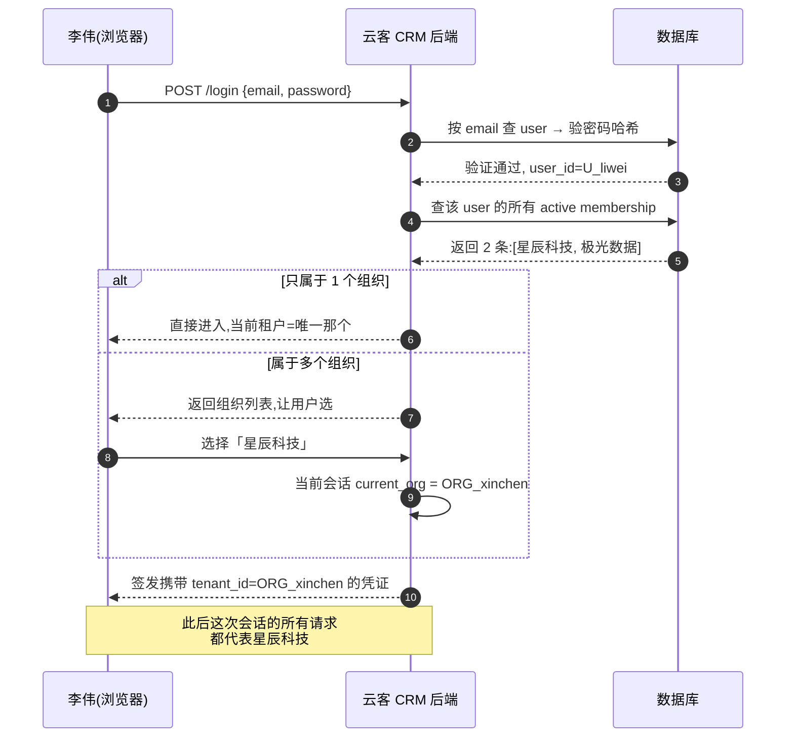

> 💡 **设计要点**：「当前组织」是**会话级（session-scoped）**的状态，不是用户级。李伟可以开一个标签页代表星辰科技、另一个浏览器代表极光数据。所以「当前租户」必须随着登录凭证一起携带（写进 Session 或 JWT），而不是写死在 user 表里。这个 `tenant_id` 一旦确定，就成了后续所有数据隔离的依据——**它怎么往下游传、怎么做隔离，分别是第 4 章和第 5 章的主题**。

---

## 6.4 企业 SSO：为什么是刚需，不是加分项

现在把镜头切到蓝鲸集团的 IT 管理员**老陈**。云客 CRM 的销售去谈这单 5 万座席的合同，老陈第一句话不是问功能、不是问价格，而是：

> **「你们支持 SAML SSO 吗？对接我们的 Okta。不支持的话，这单就别谈了。」**

很多做惯了消费级产品的工程师不理解：不就是个登录吗，让员工注册个账号不行？我们站在老陈的视角，理解一下**为什么 SSO 对企业是死线级（dealbreaker）需求**。

### 6.4.1 老陈的三本账

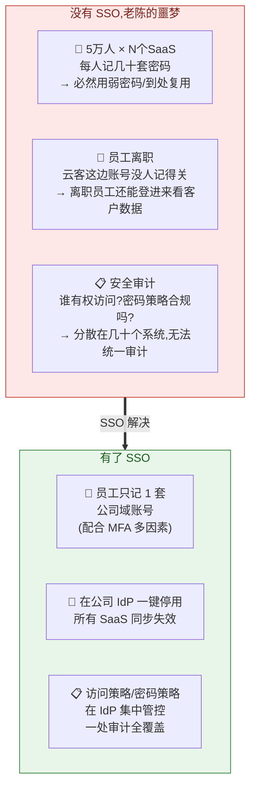

老陈的核心诉求可以浓缩成一句话：**身份必须集中在企业自己手里，而不是散落在几十个 SaaS 各自的账号库里。** 这背后是安全、合规、效率三本账：

- **安全账**：5 万人如果在每个 SaaS 各注册一套密码，弱密码、密码复用是必然的，任何一个 SaaS 被脱库都可能殃及公司内网。集中到 IdP 后，可以强制启用 **MFA（Multi-Factor Authentication，多因素认证：除了密码还要手机验证码/硬件密钥，多一道锁）**。
- **合规账**：金融行业受监管，必须能随时回答「谁有权访问哪些系统」。身份分散在几十个 SaaS 里根本没法统一审计。
- **效率账**：员工入职开一堆账号、离职关一堆账号，靠人工根本管不过来（这正是 6.6 节 SCIM 要解决的）。

### 6.4.2 SSO 的核心概念：IdP 与 SP

理解 SSO，先记住两个角色：

- **IdP（Identity Provider，身份提供商）**：保管员工身份的「身份银行」。蓝鲸集团用的是 **Okta**（也常见 Azure AD / Microsoft Entra ID、Google Workspace）。员工的账号密码、MFA 都在这里，**IdP 负责验证「你是不是蓝鲸的员工」**。
- **SP（Service Provider，服务提供商）**：需要确认用户身份的应用，也就是**云客 CRM** 自己。SP 自己不验密码，而是「把验证身份这件事外包给 IdP」。

> 🏢 **一句话比喻**：SSO 就像景区联票。IdP 是售票处（验证你买没买票、是不是本人），各个景点（SP，即各个 SaaS）见到售票处盖章的票根（断言/令牌）就放行，景点自己不再单独验票。员工在 IdP 登录一次，所有接入的 SaaS 都自动登录——这就是 **Single Sign-On（单点登录）** 的字面意思。

落地这套联票机制有两套主流协议：老牌的 **SAML 2.0** 和新生的 **OIDC**。企业（尤其金融、政府）大量存量系统用 SAML，新系统更偏爱 OIDC。一个成熟的 SaaS 平台**两套都得支持**。

---

## 6.5 两套 SSO 协议：SAML 2.0 与 OIDC

### 6.5.1 SAML 2.0 登录时序

**SAML（Security Assertion Markup Language，安全断言标记语言）**：一套基于 **XML** 的老牌企业 SSO 协议，2005 年定稿。核心产物叫 **Assertion（断言）**——IdP 签名背书的一段 XML，里面写着「我确认此人是 chen@lanjing.com，是蓝鲸的合法员工」。

我们跟着老陈手下一名销售（蓝鲸员工）登录云客 CRM 走一遍 **SP-Initiated（由 SP 发起）** 流程：

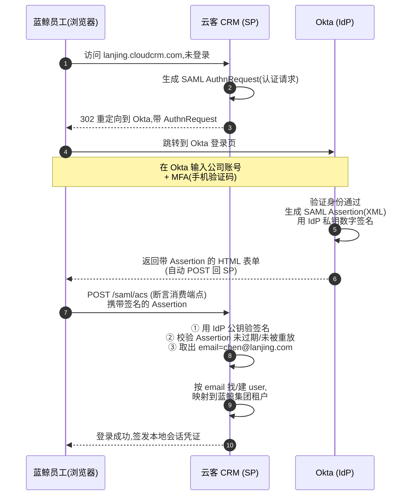

几个关键点（这些是 SAML 安全的命门）：

- **第 5 步「生成 Assertion 并用 IdP 私钥数字签名」是整个协议的信任根基**。SP 收到后必须用 IdP 提前交换好的**公钥（证书）**去验证 Assertion 的签名（第 8 步）——确保这段 XML 真的是 Okta 发的、且中途没被篡改。验签是 SP 侧最容易写错、也最危险的一步。
- **第 8 步「校验未过期/未被重放」**：Assertion 有效期通常只有几分钟，且带一次性的 ID。这是防止攻击者截获一份旧 Assertion 反复使用（重放攻击，Replay Attack）。
- **第 9 步「映射到租户」**：SP 拿到的 email 是 `chen@lanjing.com`，要根据邮箱域名 `lanjing.com` 或 IdP 的 EntityID，把这个人**绑定到蓝鲸集团这个租户**。这一步是 SaaS 多租户的特色——SSO 不只是认证「他是谁」，还要确定「他属于哪个租户」。

> 🔒 **[SECURITY REVIEW REQUIRED]** SAML 验签逻辑必须人工 review。历史上大量 SAML 漏洞（XML 签名包裹攻击 XSW、不验签直接信任 Assertion）都出在 SP 侧实现不严。**强烈建议用成熟库（如 Spring Security SAML、OneLogin 的 SAML toolkit），不要手写 XML 解析与验签。**

### 6.5.2 OIDC 登录时序

**OIDC（OpenID Connect）**：建立在 **OAuth 2.0** 之上的现代认证协议，用 **JSON + JWT** 代替 SAML 的 XML，对移动端/SPA/API 更友好。它的核心产物叫 **ID Token**——一个 JWT 格式的令牌，里面装着用户身份信息。

OIDC 最常用、最安全的是**授权码流程（Authorization Code Flow）**。同样是蓝鲸员工登录：

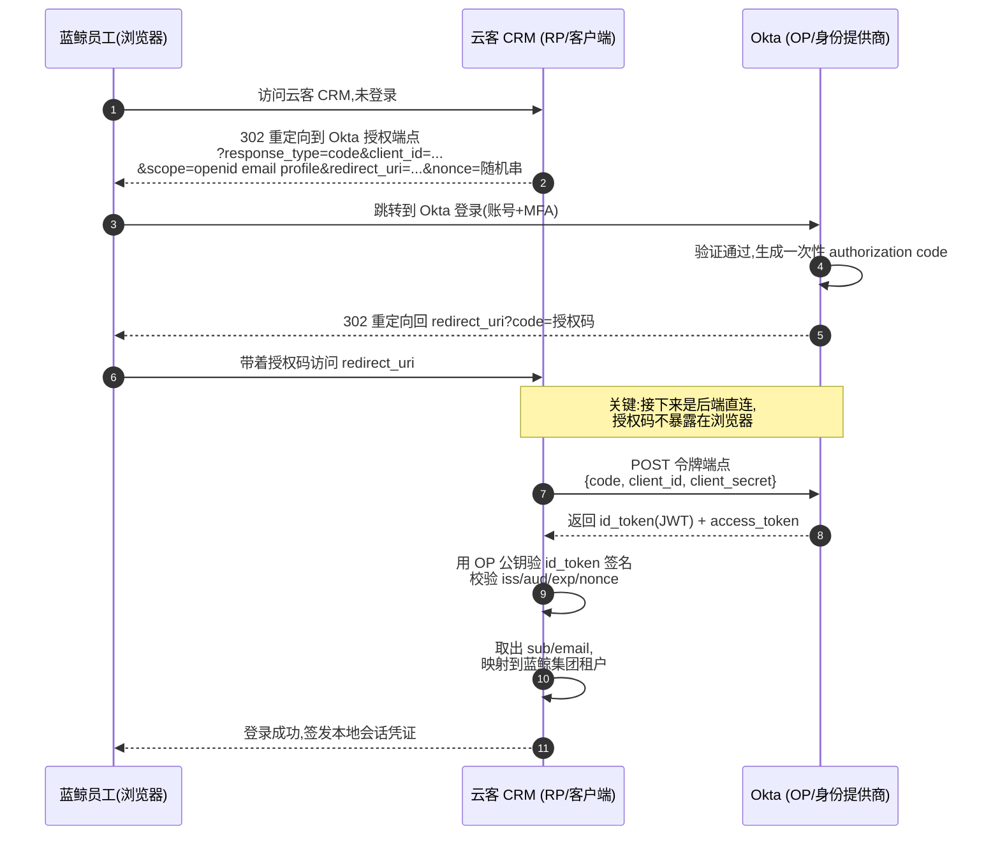

OIDC 里换了几个术语，但角色和 SAML 一一对应：

| SAML 术语 | OIDC 术语 | 大白话 |
| --- | --- | --- |
| IdP（Identity Provider） | OP（OpenID Provider） | 身份提供商，验证你是谁（都是 Okta 扮演）|
| SP（Service Provider） | RP（Relying Party，依赖方） | 需要确认身份的应用（云客 CRM）|
| Assertion（XML 断言） | ID Token（JWT） | 「我确认此人身份」的签名凭证 |

为什么授权码流程要绕一圈「先拿 code、再后端换 token」，而不直接把 token 丢给浏览器？

- **第 6 步的 `code`（授权码）是一次性、短命的「兑换券」**，即使在浏览器地址栏暴露也无大碍。
- **第 7 步用 `client_secret` 后端直连换 token**：真正的身份令牌 `id_token` 只在云客 CRM 后端和 Okta 之间传递，**不经过浏览器**，大幅降低令牌泄漏风险。
- **`nonce`（一次性随机串）** 防重放：RP 生成时记下，验 id_token 时核对，确保这个 token 是为本次登录签的。

### 6.5.3 ID Token 里有什么——标准 claim

OIDC 的 ID Token 是个 JWT，里面的字段叫 **claim（声明，就是一条条「关于用户的事实」）**。OIDC 规范定义了一组标准 claim：

```json
{
  "iss": "https://lanjing.okta.com",   // Issuer 签发者:是哪个 IdP 签的
  "sub": "00u1a2b3c4d5e6f7g8h9",       // Subject 主体:用户在 IdP 的唯一 ID(稳定不变)
  "aud": "cloudcrm-client-id",          // Audience 受众:这个 token 是发给云客 CRM 的
  "exp": 1733740800,                    // Expiration 过期时间
  "iat": 1733737200,                    // Issued At 签发时间
  "nonce": "n-0S6_WzA2Mj",              // 防重放随机串
  "email": "chen@lanjing.com",          // 邮箱(标准 profile claim)
  "name": "陈管理员"
}
```

> ⚠️ **关键陷阱**：验 ID Token 时，`iss`、`aud`、`exp`、`nonce` **每一项都必须校验**。只验签名不验 `aud`，攻击者就能拿一个发给别的应用的合法 token 来登你的系统。这是 OIDC 实现里的经典翻车点。
>
> 📌 **`email`/`name` 不是白来的**：上面授权请求里的 `scope=openid email profile` 不能少。`scope=openid` 只保证返回 `sub`、`iss`、`aud` 等核心 claim；要拿到 `email` 必须额外申请 `email` scope，要拿到 `name` 等档案信息必须额外申请 `profile` scope（否则这些字段只能去 UserInfo 端点取）。前面时序图第 2 步的授权请求带的就是 `scope=openid email profile`，所以 ID Token 里才有 `email` 和 `name`。
>
> 另外注意：这里的 `sub`/`email` 是**企业 IdP 颁发的身份**，云客 CRM 拿到后要做一次**身份映射（identity mapping）**——根据它在自己的 user/membership 表里找到或新建对应记录，并绑定到蓝鲸集团租户。IdP 的 `tenant_id` 不是 IdP 给的，是云客 CRM 在映射时**根据「这个 IdP 配置属于哪个租户」决定的**。

### 6.5.4 SAML vs OIDC 怎么选

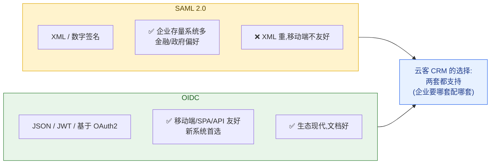

现实结论：**作为 SaaS 平台方，你没得选——两套都得支持。** 因为决定权在客户的 IdP 那头。蓝鲸集团若用 Okta + SAML，你就得配 SAML；另一家客户若用 Azure AD + OIDC，你就得配 OIDC。

---

## 6.6 SCIM：员工入职自动开账号，离职自动回收

SSO 解决了「员工怎么登录」，但还有个更大的运维难题：**5 万人的账号生命周期，谁来管？**

老陈不可能在云客 CRM 后台一个个手动加账号。更可怕的是离职场景：某个销售离职了，老陈在公司 HR 系统/Okta 里停用了他，但**云客 CRM 这边的账号没人记得去关**——这个离职员工还能登进来翻看蓝鲸的客户数据。这种「**孤儿账号（orphan account）**」是企业安全审计的头号红线。

### 6.6.1 SCIM 是什么

**SCIM（System for Cross-domain Identity Management，跨域身份管理）**：一套标准化的 **REST API 协议**，让 IdP（如 Okta）能**自动**地把用户账号「推送」到各个 SaaS——入职时自动建账号（**Provisioning，开通**），离职时自动停账号（**Deprovisioning，回收**），改部门时自动同步。

大白话：**SCIM 是 IdP 和 SaaS 之间的「账号同步管道」。** Okta 那头做的人员增删改，会通过 SCIM 自动同步到云客 CRM，老陈不用碰云客 CRM 后台一根手指。

注意 SSO 和 SCIM 是**两件互补的事**，别搞混：

| | 解决的问题 | 触发时机 |
| --- | --- | --- |
| **SSO** | 用户**怎么登录** | 用户点登录的那一刻（运行时）|
| **SCIM** | 账号**怎么建立/删除** | 入职/离职/调岗的那一刻（人员变动时）|

> 没有 SCIM 只有 SSO 会怎样？员工能用 SSO 登录，但账号得登录时「即时创建（Just-In-Time Provisioning，JIT）」——离职后 IdP 停用了他，他登不进来了，**但云客 CRM 里那条 user/membership 记录还在**（孤儿账号）。座席还在占着、还在计费、审计还查得到一个「在职」的幽灵。SCIM 才能做到「离职 → 云客这边的账号同步停用」的闭环。

### 6.6.2 SCIM 的核心：标准化的资源与端点

SCIM 把身份抽象成两类**资源（Resource）**：**Users（用户）** 和 **Groups（用户组）**。Okta 通过标准 REST 端点对这些资源增删改查，云客 CRM 作为接收方实现这些端点即可：

| HTTP 方法 + 端点 | 含义 | 触发场景 |
| --- | --- | --- |
| `POST /scim/v2/Users` | 创建用户 | 员工入职 |
| `GET /scim/v2/Users/{id}` | 查询用户 | 同步校验 |
| `PUT /scim/v2/Users/{id}` | 全量替换用户 | 信息大改 |
| `PATCH /scim/v2/Users/{id}` | 部分更新（如 `active=false`）| **离职停用**/改部门 |
| `DELETE /scim/v2/Users/{id}` | 删除用户 | 彻底移除 |
| `POST/PATCH /scim/v2/Groups` | 用户组增改 | 团队结构同步 |

一个典型的 SCIM 创建用户请求体（标准 schema）：

```json
// Okta → POST /scim/v2/Users  (蓝鲸新入职销售)
{
  "schemas": ["urn:ietf:params:scim:schemas:core:2.0:User"],
  "userName": "zhang.san@lanjing.com",
  "name": { "givenName": "三", "familyName": "张" },
  "emails": [{ "value": "zhang.san@lanjing.com", "primary": true }],
  "active": true,
  "externalId": "00u_okta_internal_id"   // Okta 侧的用户 ID,用于双向对应
}
```

### 6.6.3 入职开通 / 离职回收的完整流程

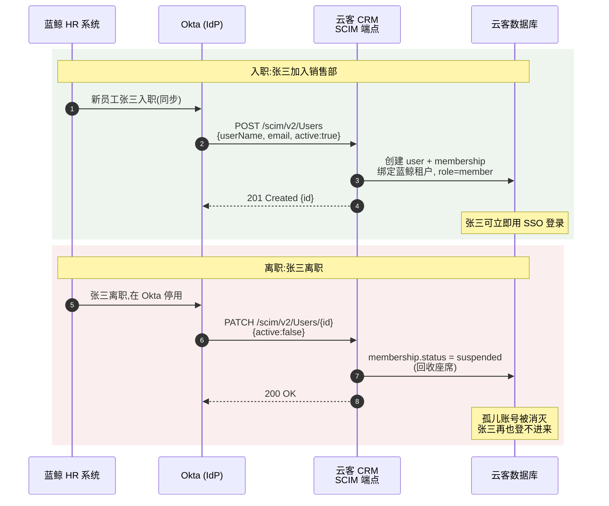

> 💡 **回收策略的设计取舍**：离职时 SCIM 收到 `active:false`，云客 CRM 通常**不直接物理删除** user 记录，而是把 membership 置为 `suspended`（暂停）。原因：① 张三跟进过的客户、留下的活动记录还要保留（数据合规与业务连续性）；② 万一是误操作或返聘可恢复。**物理删除涉及数据保留与合规策略，详见第 14 章**。但座席（计费名额）必须立即释放——这关系到计费，详见第 9 章。
>
> 🔒 **[SECURITY REVIEW REQUIRED]** SCIM 端点是「能批量创建/停用账号」的高危接口，必须用 IdP 提供的 **Bearer Token** 强鉴权，且每个 SCIM 连接严格绑定到**唯一一个租户**——绝不能让蓝鲸的 SCIM 凭证创建出别家租户的账号。这是跨租户越权的高危面。

---

## 6.7 登录态管理：Session 还是 JWT

不管用户是密码登录、SAML 登录还是 OIDC 登录，认证成功后都得解决一个共同问题：**怎么让用户在接下来的几小时内不用每点一下就重新登录一次？** 这就是「登录态」（也叫「会话」）的管理。两条主流路线：**Session** 和 **JWT**。

### 6.7.1 两条路线对比

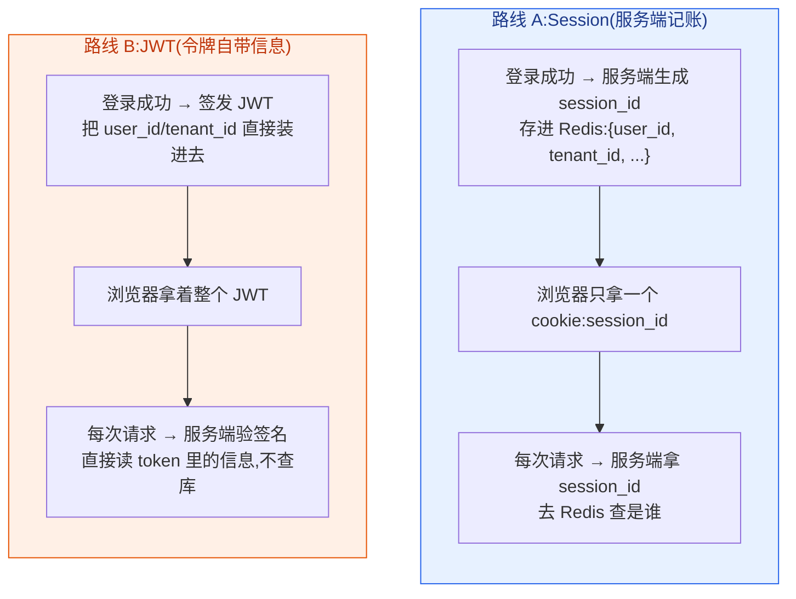

| 维度 | Session（服务端记账） | JWT（令牌自带信息）|
| --- | --- | --- |
| 状态存哪 | 服务端（Redis）| 客户端（令牌本身）|
| 每次请求验证 | 查一次 Redis | 本地验签，**无需查库** |
| 横向扩展 | 需共享 session 存储 | 天然无状态，**适合微服务/网关** |
| 主动失效（踢人下线）| 容易，删 Redis 即可 | **难**，token 没到期前一直有效 |
| 体积 | cookie 很小 | token 较大，每次请求都带 |

SaaS 平台（尤其有 API 网关 + 大量无状态微服务）普遍偏向 **JWT**，因为下游服务可以**不查库、直接从 token 里读出 `tenant_id`**，省掉了每个服务都去问一次「这人是谁、属于哪个租户」的开销。但 JWT 「难主动失效」的短板，靠**短有效期 + Refresh Token** 来补（见下）。

### 6.7.2 JWT 结构与 tenant claim

**JWT（JSON Web Token）**：一串用点号分三段的字符串 `xxxxx.yyyyy.zzzzz`，分别是 **Header（头）· Payload（载荷）· Signature（签名）**。前两段是 Base64 编码的 JSON（可解开看，**不加密，别放敏感信息**），第三段是签名（防篡改）。

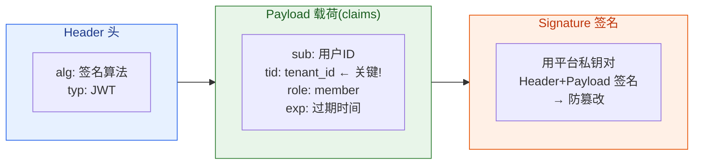

李伟选择「星辰科技」后，云客 CRM 签发给他的 JWT，Payload 长这样：

```json
{
  "sub": "U_liwei",                 // Subject:用户全局唯一 ID
  "email": "liwei@example.com",
  "tid": "ORG_xinchen",             // tenant_id:当前代表的租户 = 星辰科技 ★本章核心★
  "role": "member",                 // 角色(给第7章授权用,本章只负责装进去)
  "iss": "https://cloudcrm.com",    // 签发者:云客 CRM 平台
  "iat": 1733737200,                // 签发时间
  "exp": 1733740800                 // 过期时间(比如 1 小时后)
}
```

> ★ **本章最关键的一行是 `tid`（tenant_id）**。认证流程的终点，就是把「这个人此刻代表哪个租户」这个结论，**钉进一张防篡改的令牌里**。李伟切到极光数据后，会重新签发一张 `tid: ORG_jiguang` 的新 token。
>
> 这张 token 接下来要做的事，**全部交给后续章节**：
> - 它怎么随请求在网关、各微服务之间传递且不丢失 → **第 4 章**。
> - 下游服务怎么用 `tid` 给每条 SQL 加上租户过滤、配合 RLS 兜底 → **第 5 章**。
> - 怎么用 `role` 判断李伟能不能删客户 → **第 7 章**。

```java
// 签发 JWT（认证成功、确定当前租户后）—— 用 jjwt 库示意
String jwt = Jwts.builder()
    .subject(user.getId())                       // sub
    .claim("email", user.getEmail())
    .claim("tid", currentOrgId)                  // ★ 把当前租户钉进去
    .claim("role", membership.getRole())         // 角色(owner/admin/member 三选一,第7章用)
    .issuer("https://cloudcrm.com")
    .issuedAt(now)
    .expiration(Date.from(now.toInstant().plus(1, ChronoUnit.HOURS))) // 1 小时短有效期
    .signWith(platformPrivateKey)                // 平台私钥签名,下游用公钥验
    .compact();
```

### 6.7.3 短有效期 + Refresh Token：补上 JWT 的失效短板

JWT 的命门是「签发后没法主动撤销」。解决方案是**双令牌机制**：

- **Access Token（访问令牌）**：就是上面那张 JWT，有效期很短（如 1 小时）。带在每个请求里。
- **Refresh Token（刷新令牌）**：有效期长（如 7 天），存服务端可撤销列表里，**只用来换新的 Access Token**，不参与日常请求。

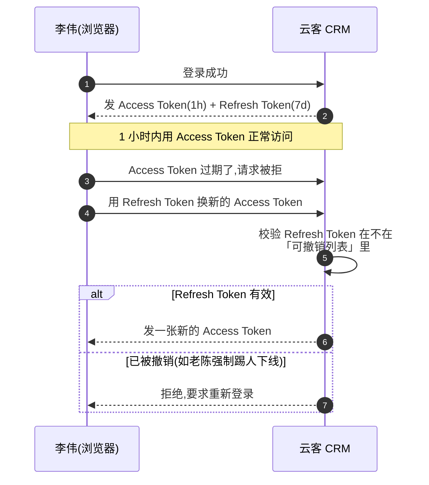

这样：日常请求享受 JWT 「无需查库」的性能优势；想踢人下线时，只要把他的 Refresh Token 拉黑——最多 1 小时（Access Token 寿命）后他就彻底出局。**性能与可撤销性的平衡，就在这一长一短两张令牌之间。**

---

## 6.8 把本章串起来：李伟的一次登录

最后用一张图，把「密码登录 / 多组织选择 / JWT 签发」串成李伟视角的一次完整登录，作为本章的收口：

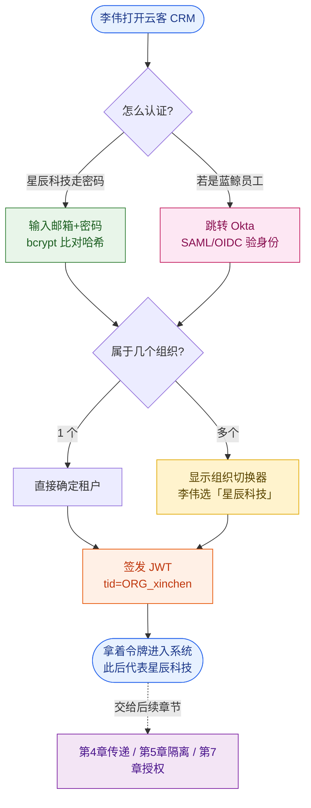

---

## 本章小结

1. **认证只回答「你是谁」+「你此刻代表哪个租户」**。能做什么是授权（第 7 章），别混。

2. **组织-用户是多对多关系**，靠 `user / organization / membership` 三张表建模。`email` 全局唯一放 user 表，`role` 放 membership 表（因为同一人在不同组织角色不同），`password_hash` 可空（SSO 用户没密码）。登录后多组织成员必须**选择当前组织**，「当前租户」是会话级状态。

3. **企业 SSO 是大客户的死线级刚需**，不是加分项——它解决企业的安全（集中 + MFA）、合规（统一审计）、效率（统一开关账号）三本账。核心是把身份外包给企业自己的 **IdP**。

4. **两套 SSO 协议**：SAML 2.0（XML/断言，企业存量多）和 OIDC（JWT/ID Token，现代首选）。角色一一对应（IdP↔OP、SP↔RP、Assertion↔ID Token）。SP/RP 侧**验签 + 校验 iss/aud/exp/nonce + 映射到租户**是命门，务必用成熟库、人工 review。

5. **SCIM 把账号生命周期自动化**：入职自动开通（Provisioning）、离职自动回收（Deprovisioning），消灭孤儿账号。它和 SSO 互补——SSO 管「怎么登录」，SCIM 管「账号怎么建立和删除」。

6. **登录态管理选 JWT**（适合无状态微服务，下游不查库直接读 `tid`），用**短 Access Token + 长 Refresh Token** 弥补「难主动失效」的短板。JWT 里那个 `tid`（tenant_id）就是认证的最终产物，它怎么传、怎么用，分别交给第 4、5、7 章。

---

## 参考来源

- [OpenID Connect Core 1.0 规范（OIDC 授权码流程与 ID Token 标准 claim）](https://openid.net/specs/openid-connect-core-1_0.html)
- [SCIM 官方站点（System for Cross-domain Identity Management 协议与资源模型）](https://scim.cloud/)
- [WorkOS：SaaS 企业级身份功能指南（SSO/SAML/SCIM 的工程实践）](https://workos.com/blog/the-developers-guide-to-sso)
- [AWS SaaS Factory：构建多租户 SaaS 的身份与认证模式](https://aws.amazon.com/blogs/apn/managing-saas-identity-through-custom-attributes-and-amazon-cognito/)
