# 第 7 章：权限模型：RBAC 与 ABAC

> 上一章（第 6 章）解决了「**你是谁**」——李伟登录后，系统通过 JWT / Session 确认了「这是星辰科技的员工李伟」。但确认身份只是第一步。当李伟点开一条客户记录、点「删除」按钮、想导出全公司报表时，系统必须立刻回答另一个问题：「**你能不能这么做**」。这就是**授权（Authorization，授权：判断一个已知身份的用户能否执行某个操作）**，是本章的主题。
>
> 一句话区分这两章：**认证回答「你是谁」，授权回答「你能做什么」。** 认证是门口的人脸识别，授权是进门后每一扇房间门上的门禁卡。

---

## 本章导读（读完你能回答这些问题）

- **组织内的角色体系怎么设计？** owner（超管）/ admin（管理员）/ member（成员）这三个内置角色各管什么？租户能不能自定义角色？
- **什么是 capability-first（能力优先）设计？** 为什么不能上来就拍脑袋定「销售角色」「经理角色」，而要先定义一堆细粒度的「权限点」再组合成角色？
- **为什么权限必须在租户边界内评估？** 同一个咨询顾问，在星辰科技是 admin、在蓝鲸集团是 member——系统凭什么不把这两个身份搞混、不让他用星辰的管理员权限去操作蓝鲸的数据？
- **RBAC 和 ABAC 到底有什么区别？** 什么场景该用哪个？能不能混用？
- **CRM 特有的「记录级权限」怎么实现？** 凭什么李伟只能看自己负责的客户，而总监张敏能看整个华东大区？这套「数据共享规则」怎么落到代码里？
- **权限检查在运行时怎么做？** 用中间件还是用注解？每次请求都查一遍数据库会不会太慢？怎么用缓存加速又不出安全漏洞？

> ⚠️ **本章边界**：本章只讲「**这个用户能做什么**」这件授权决策。三件事**不在本章**，一句话引用即可：
> - **「你是谁」（认证、登录、SSO、JWT 怎么签发）** —— 是 **第 6 章** 的活儿。本章假设你手里已经拿到了一个可信的「用户身份 + 租户身份」。
> - **「这个套餐买没买这个功能」（Entitlements，功能授权）** —— 是 **第 10 章** 的活儿。注意：「老陈有没有权限开启高级报表」（RBAC）和「星辰科技的 Pro 套餐里到底含不含高级报表」（Entitlements）是**两个完全不同的门禁**，本章末尾会专门讲清这对「双重门禁」。
> - **「这个用户一分钟最多调几次 API」（限流）** —— 是 **第 11 章** 的活儿。限流管的是「频率」，不是「权限」。

---

## 7.1 先把「授权」这件事摆正

在动手设计之前，先建立一个心智模型。任何一次授权决策，本质上都是在回答下面这个三元组的问题：

> **某个「主体（Subject）」，能否对某个「资源（Resource）」，执行某个「操作（Action）」？**

放到云客 CRM 里就非常具体：

> **李伟（主体）** 能否对 **「华为」这条客户记录（资源）** 执行 **「删除」操作（Action）**？

授权引擎要做的，就是给这个三元组返回一个 `allow` 或 `deny`。听起来简单，但 SaaS 把它搞复杂了，因为多了一个维度：**租户**。完整的问题其实是：

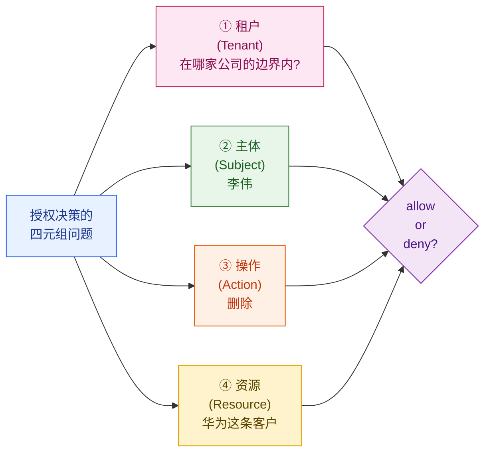

注意第一个维度「租户」被放在了最前面，且高亮成了警示色。这不是排版好看——**在 SaaS 里，「在哪个租户边界内评估」是授权的前提，不是细节**。后面 7.4 节会专门用一节来讲为什么它这么重要，以及它一旦出错有多致命。

我们先从最经典、也是绝大多数 SaaS 默认采用的权限模型讲起：RBAC。

---

## 7.2 RBAC：基于角色的访问控制

### 什么是 RBAC

> **RBAC（Role-Based Access Control，基于角色的访问控制：不直接给「人」发权限，而是先把权限打包成「角色」，再把角色发给人。换岗位时只换角色，不用一条条改权限）**

为什么要绕这一道弯（人 → 角色 → 权限）而不是直接给人发权限？看一个反面例子就懂了。

假设星辰科技有 500 个销售。如果**直接给人发权限**，老陈（IT 管理员）的噩梦是这样的：

```
李伟    → 可查看客户、可编辑客户、可创建商机、可查看自己的报表...（20 条权限）
王芳    → 可查看客户、可编辑客户、可创建商机、可查看自己的报表...（同样 20 条）
赵强    → 可查看客户、可编辑客户、可创建商机、可查看自己的报表...（同样 20 条）
... 还有 497 个人，每人 20 条
```

一旦产品上线了一个新功能「批量导入客户」，老陈得给 500 个人**逐一**加上这条权限。这显然是不可接受的。

RBAC 的解法：在「人」和「权限」之间插一层「角色」。

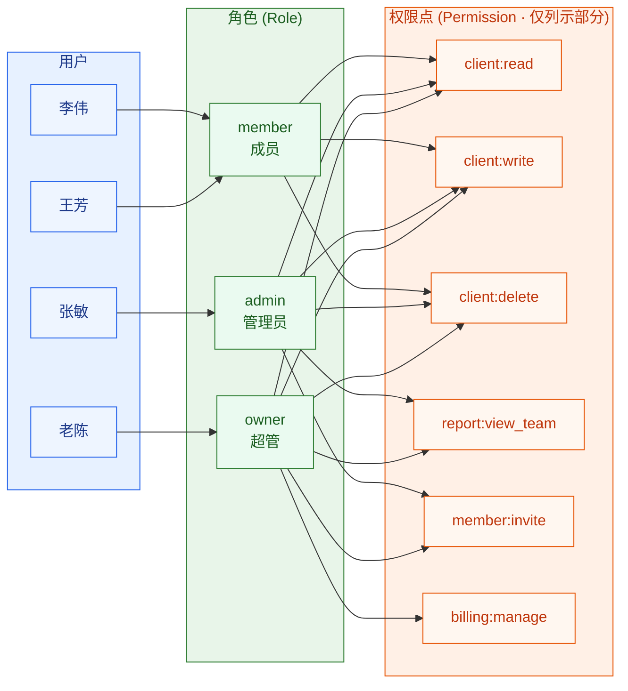

有了这一层，新功能「批量导入」只要加到 `admin` 角色上，所有管理员**一次性**全有了。换岗位（李伟升任主管）只要把他的角色从 `member` 改成 `admin`，不用动一条权限。这就是 RBAC 的核心价值：**用「角色」这个中间层，把「人事变动」和「权限变动」解耦**。

### 组织内的三个内置角色

云客 CRM 给每个租户预置三个角色，它们构成一个权限递增的层级。注意：**这三个角色是租户内部的角色，和平台方（云客团队）的角色完全是两套体系**——平台运维能跨租户操作，那是另一回事，本章只讲租户内部。

| 角色 | 英文 | 大白话 | 谁是典型 | 能干什么（递增） |
| --- | --- | --- | --- | --- |
| **成员** | member | 一线干活的人 | 销售李伟 | 管理**自己负责的**客户、商机、活动；看自己的业绩 |
| **管理员** | admin | 管团队 + 看全局业务的人 | 销售总监张敏 | member 的全部 + 看/管**整个部门**的数据 + 邀请成员 + 配置共享规则 |
| **超管** | owner | 这家公司在平台上的「户主」 | IT 管理员老陈 | admin 的全部 + 管计费/订阅 + 配 SSO + 删除整个组织 + 转移所有权 |

几个关键设计点，每一条都踩过坑：

1. **owner 通常有且仅有一个（或极少数）**。它能删除整个组织、能动钱（计费）、能把所有权转给别人，是「核按钮」级别的角色。绝不能随便发。一般是注册这家公司的人自动成为 owner（详见第 6 章组织开通流程），后续可以转移。
2. **权限是「向下兼容」的，但不要用继承硬编码**。直觉上 owner ⊇ admin ⊇ member，但**不要**在代码里写 `if (role >= ADMIN)` 这种数字比较——一旦将来加了一个「财务角色」（能看计费但不能管人），它和 admin 谁大谁小？层级模型立刻崩溃。正确做法是：每个角色独立持有一组明确的权限点，owner 恰好持有 member 和 admin 的全部权限点 + 额外的。这是下一节 capability-first 的核心思想。
3. **自定义角色（Custom Role）是企业版的刚需**。蓝鲸集团这种大客户，组织结构复杂，三个内置角色根本不够用。他们需要「区域经理」（能看本区域所有数据但不能碰计费）、「合规审计员」（只读所有数据 + 看审计日志，但一个字都不能改）这种角色。所以云客 CRM 允许租户**自己组合权限点创建角色**——而这恰恰要求权限系统从一开始就按「能力优先」来设计，否则自定义角色无从拼起。

---

## 7.3 capability-first：先有能力，再有角色

这是本章最重要的设计理念，也是新手最容易搞反的地方。

### 错误的顺序：role-first（先拍角色）

很多团队设计权限时，第一反应是「我们有哪些角色？销售、经理、管理员……好，建三张表」。然后给每个角色硬编码一堆 `if`：

```java
// ❌ 反面教材：role-first，把业务规则焊死在角色名上
if (user.getRole().equals("manager") || user.getRole().equals("admin")) {
    allowViewTeamReport();   // 经理和管理员能看团队报表
}
```

这套代码的问题，等蓝鲸集团提出「我们要一个只读的审计员角色」时就会爆炸：审计员要能看团队报表，但他既不是 manager 也不是 admin。你只能去改这行 `if`，加上 `|| user.getRole().equals("auditor")`。系统里有几百个这样的判断，每加一个角色就要满世界改 `if`，最终没人敢动。**这就是 role-first 的死局：角色和权限被硬编码绑死，无法组合。**

### 正确的顺序：capability-first（先拆能力）

capability-first 的思路反过来：**先把系统所有能做的「细粒度操作」一个个枚举出来，每个操作就是一个「能力 / 权限点（Capability / Permission）」；角色只是这些能力的一个「打包组合」**。

> **能力 / 权限点（Capability / Permission，能力 / 权限点：系统里一个不可再分的最小操作单元，比如「读取客户」「删除商机」「邀请成员」。它是权限系统的「原子」）**

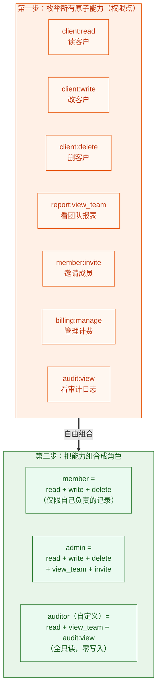

这样设计后，三件事变得无比顺滑：

- **加新角色 = 勾选能力清单**。蓝鲸要的「审计员」？勾上 `client:read`、`report:view_team`、`audit:view`，不勾任何 `write/delete`——一个全只读角色就诞生了，**没改一行代码**。
- **权限检查 = 查能力，不查角色名**。代码里永远问「这个用户有没有 `report:view_team` 这个能力？」，**永远不问「这个用户是不是 admin？」**。角色名只是给人看的标签，代码只认能力。
- **自定义角色天然成立**。因为角色本来就是「能力的组合」，让租户自己组合能力，就是自定义角色。

### 权限点的命名约定

权限点的命名直接决定了系统好不好维护。云客 CRM 采用业界通用的 `资源:操作` 格式（也叫 `domain:action`）：

```
client:read          # 读取客户
client:write         # 创建 / 编辑客户
client:delete        # 删除客户
client:export        # 导出客户数据
opportunity:read     # 读取商机
opportunity:write    # 创建 / 编辑商机
report:view_self     # 看自己的报表
report:view_team     # 看团队报表
report:advanced      # 高级报表（套餐功能，除 RBAC 外还需 Entitlements 放行，详见第 10 章）
member:invite        # 邀请新成员
member:remove        # 移除成员
role:manage          # 管理角色（创建自定义角色等）
billing:manage       # 管理计费与订阅
sso:configure        # 配置 SSO
audit:view           # 查看审计日志
```

这个命名约定有个隐藏好处：可以用通配符做粗粒度授权，比如 `client:*` 表示「客户相关的所有操作」，给 owner 这种全权角色用，很省事。

### 权限点不是越细越好

capability-first 不等于「把每个字段都拆成一个权限点」。粒度太细会带来管理灾难——想象一下，如果连「客户的手机号字段能不能看」都是一个独立权限点，那一个 CRM 系统会有上万个权限点，没有任何管理员能配得明白。

**经验法则：权限点的粒度，对齐到「一个有业务意义、用户能理解的操作」为止。** 「读取客户」是一个好的权限点；「读取客户的第 7 个自定义字段」就太细了，这种细粒度的控制应该交给后面要讲的 ABAC，或者干脆用「字段级脱敏」这种数据层手段（脱敏属于第 14 章安全话题）。

---

## 7.4 租户边界：权限评估的不可逾越的红线

现在到了 SaaS 权限里**最致命、最区别于普通单体系统**的一节。请把这一节读三遍。

### 一个真实会发生的场景

云客 CRM 上有个独立咨询顾问，叫**周工**。他同时给两家公司做外包：

- 在**星辰科技**，他是被老陈邀请进来的 **admin**（帮星辰搭建销售流程，需要看全公司数据）。
- 在**蓝鲸集团**，他是被蓝鲸 IT 邀请进来的 **member**（只做一个小项目，只能看自己负责的几个客户）。

同一个自然人周工，**同一个登录账号**，在两家公司里是**完全不同的权限等级**。现在他登录进系统，正在操作蓝鲸的数据。系统必须保证一件事：

> **周工此刻的权限，必须严格按照「蓝鲸集团的 member」来评估，绝不能把他在星辰科技的 admin 权限带过来。**

如果系统搞混了，让他用星辰 admin 的权限去看蓝鲸的全公司数据——这就是**跨租户越权（Cross-Tenant Privilege Escalation）**，是 SaaS 平台最严重的安全事故之一，足以让一家公司倒闭。

### 权限永远在「(租户, 用户)」这个组合上评估

正确的心智模型是：**权限不挂在「用户」身上，而是挂在「用户 + 租户」这个二元组上。** 一个用户在不同租户里，是不同的「成员（Membership）」实体，各自持有各自的角色。

> **成员关系（Membership，成员关系：一个用户「在某个具体租户里」的身份记录。它绑定了「这个用户在这家公司是什么角色」。一个用户可以有多条 Membership，分属不同租户）**

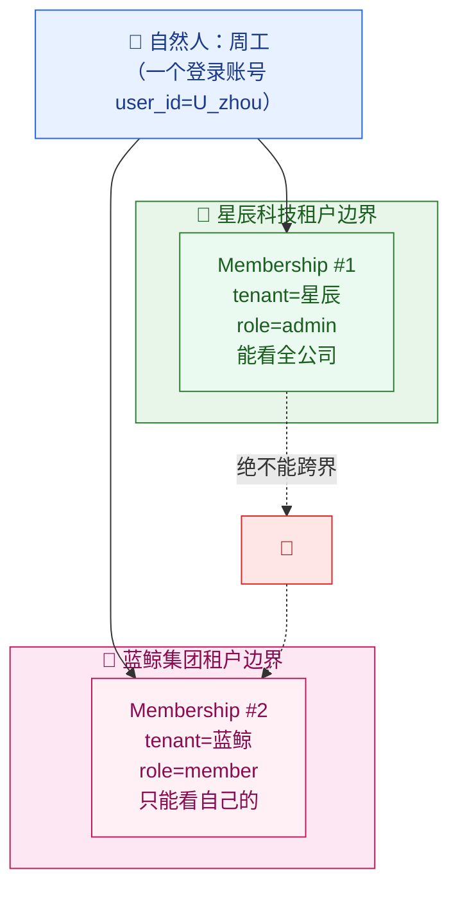

落到数据模型上，是这样的：

```sql
-- 用户表：一个自然人一条记录，与租户无关
CREATE TABLE users (
    user_id     VARCHAR(40) PRIMARY KEY,   -- U_<uuid>，全平台唯一
    email       VARCHAR(255) NOT NULL,
    password_hash VARCHAR(255)             -- 认证相关，详见第 6 章
);

-- 成员关系表：用户「在某个租户里」的身份。核心是这张表
CREATE TABLE memberships (
    membership_id VARCHAR(40) PRIMARY KEY, -- MB_<uuid>
    tenant_id   VARCHAR(40) NOT NULL,      -- 哪个租户
    user_id     VARCHAR(40) NOT NULL,      -- 哪个用户
    role        VARCHAR(40) NOT NULL,      -- 在这个租户里的角色：member/admin/owner/自定义
    status      VARCHAR(20) NOT NULL,      -- active / suspended（停用但保留记录）
    -- 关键：同一个用户在同一个租户里只能有一条成员关系
    UNIQUE (tenant_id, user_id)
);

-- 周工的数据长这样：
-- ('MB_001', '星辰', 'U_zhou', 'admin',  'active')
-- ('MB_002', '蓝鲸', 'U_zhou', 'member', 'active')
```

当周工登录并选择「进入蓝鲸集团」时，系统会做两件事（认证细节见第 6 章）：

1. 确认 `U_zhou` 确实是蓝鲸的成员（查 `memberships` 表，`tenant_id=蓝鲸 AND user_id=U_zhou`）。
2. **把 `tenant_id=蓝鲸` 写进当前请求的租户上下文（tenant context）**，并据此取出他在蓝鲸的角色 `member`。

从这一刻起，本次会话所有的权限评估，都基于「蓝鲸 + member」这条 Membership，他在星辰的 admin 身份**根本不会被加载进来**。

> **租户上下文（Tenant Context，租户上下文：当前这次请求/会话「属于哪个租户」的标记，从请求入口一路传递到数据库查询。它是隔离的中枢神经）**——它怎么从 JWT 解析、怎么跨服务传递、怎么防丢失，是 **第 4 章** 的核心内容。本章只用它的结论：**任何权限评估都必须先有一个明确的、可信的 `tenant_id`**。

### 三道防线，缺一不可

光在应用层「记得带上 tenant_id」是不够的——人是会犯错的，总有一天某个程序员会写出一条忘了加 `WHERE tenant_id = ?` 的查询。所以租户隔离要靠**纵深防御（Defense in Depth，纵深防御：不指望单点万无一失，而是层层设防，前一道破了还有后一道兜底）**：

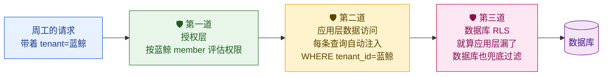

> **RLS（Row-Level Security，行级安全：数据库自动帮你在每条查询后面加一道「只能看自己租户」的过滤条件，应用层万一忘了加，数据库也兜底）**——它的具体配置、`tenant_id` 怎么落库、怎么防查询写错，是 **第 5 章** 的核心内容。

**本章负责的是第一道防线（授权层）**：在请求进入业务逻辑之前，判断「这个 (租户, 用户) 组合，有没有权限做这个操作」。第二、三道防线是数据层的事（第 5 章、第 14 章）。三道一起，才构成 SaaS 的隔离铁壁。

---

## 7.5 RBAC vs ABAC：两种授权范式

RBAC 用「角色」做授权，简单清晰，但它有个天生的局限：**它只看「你是谁（什么角色）」，看不了「上下文」**。来看一个 RBAC 搞不定的需求。

### RBAC 撞墙的场景

蓝鲸集团是金融公司，合规部门提了三条要求：

1. 「客户经理只能在**工作时间（9:00–18:00）**编辑客户，下班后只读。」
2. 「华东区的销售只能看**华东区**的客户，华南区的看不了。」
3. 「标记为『涉密』的大客户，只有职级 **P7 以上**的人能看。」

这三条，纯 RBAC 都搞不定。因为 RBAC 的角色是**静态**的——你是 `member` 就是 `member`，它不知道「现在几点」「这个客户属于哪个区」「这个客户密级多高」「你职级多高」。这些都是**属性（Attribute）**。要处理属性，就得请出 ABAC。

### 什么是 ABAC

> **ABAC（Attribute-Based Access Control，基于属性的访问控制：授权不只看角色，而是看一堆「属性」——用户的属性、资源的属性、环境的属性——按规则现场算出能不能）**

ABAC 把授权决策建立在四类属性上：

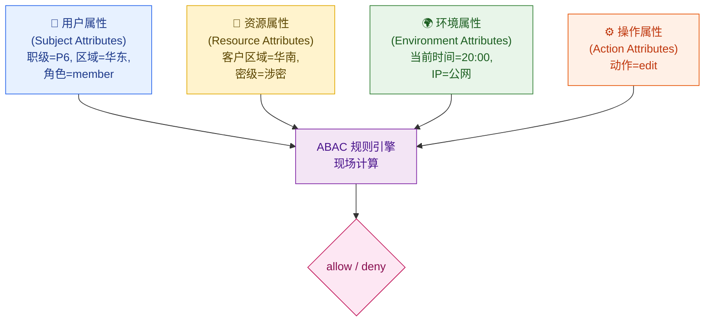

蓝鲸的第二条需求，用 ABAC 规则写出来大概是这样（伪代码）：

```python
# ABAC 规则：销售只能看自己区域的客户
def can_view_client(user, client, env):
    # 用户属性 user.region，资源属性 client.region —— 现场比对
    if user.role == "member":
        return user.region == client.region        # 同区才能看
    if user.role == "admin":
        return True                                 # 管理员看本辖区/本部门树（此处为演示，简化为 True；真正的部门树范围以 7.6 为准）
    return False

# 第一条需求叠加进来：下班后只读
def can_edit_client(user, client, env):
    if not can_view_client(user, client, env):
        return False
    # 环境属性 env.now —— 工作时间外禁止编辑
    if not (9 <= env.now.hour < 18):
        return False
    return True
```

看到关键区别了吗？**RBAC 的判断只用到 `user.role`（你是谁）；ABAC 还用到了 `user.region`、`client.region`、`env.now`（你的属性、资源的属性、现在的环境）。** ABAC 是「现场动态计算」，RBAC 是「静态查表」。

### RBAC vs ABAC 全面对比

| 维度 | RBAC（基于角色） | ABAC（基于属性） |
| --- | --- | --- |
| **核心问题** | 你是**什么角色**？ | 一堆**属性**凑在一起算出能不能 |
| **决策依据** | 角色 → 权限点（静态映射） | 用户属性 + 资源属性 + 环境属性（动态计算） |
| **典型规则** | 「admin 能看团队报表」 | 「华东区 + 工作时间 + 非涉密，才能编辑」 |
| **优点** | 简单、直观、好审计、性能高（查表即可） | 极其灵活，能表达上下文相关的复杂规则 |
| **缺点** | 表达不了「依上下文而定」的规则；角色一多就「角色爆炸」 | 规则复杂、难调试、难审计、性能开销大、容易写出自相矛盾的规则 |
| **可解释性** | 强：「因为你是 admin」 | 弱：要追一串属性和规则才知道为啥被拒 |
| **适用场景** | 绝大多数 To B 应用的主干权限 | 数据级/字段级/上下文敏感的精细管控（金融、医疗、政府） |
| **云客 CRM 用在哪** | 三个内置角色 + 自定义角色（主干） | 记录级数据共享、合规租户的精细规则（点缀） |

### 结论：不是二选一，而是 RBAC 打底 + ABAC 点缀

工程上几乎没有「纯 ABAC」的成功大型系统——纯 ABAC 的规则会膨胀到没人能维护、没人能审计。业界主流（包括云客 CRM）的做法是**混合模型**：

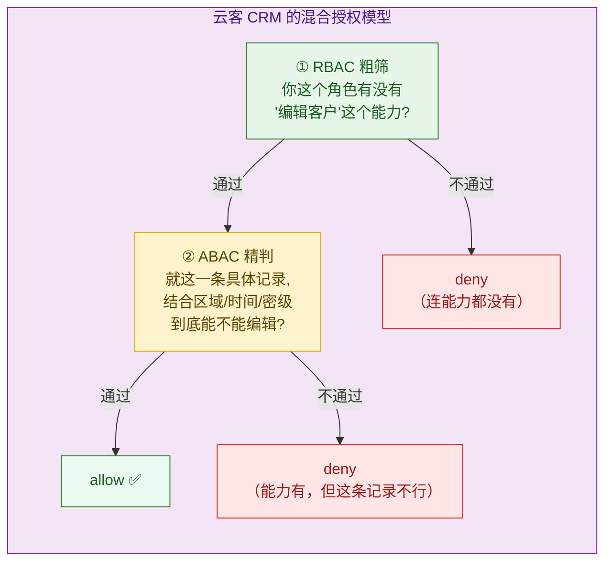

- **RBAC 管「功能级」**：你能不能用「编辑客户」这个功能（看你的角色有没有 `client:write` 能力）。这是粗粒度的第一关。
- **ABAC 管「记录级」**：你能编辑客户功能，但**这一条具体的客户**你能不能碰（看区域/密级/时间这些属性）。这是细粒度的第二关。

下一节讲的「CRM 数据共享规则」，正是这个混合模型在 CRM 场景里最典型、最高频的落地。

---

## 7.6 CRM 的灵魂：记录级数据共享

到目前为止我们讲的「能不能编辑客户」都是功能级的。但 CRM 真正的难点在**记录级（Row-Level / Record-Level）**：李伟和王芳都是 member、都有 `client:write` 能力，但李伟**只能**改自己负责的客户，绝不能去改王芳的客户。这个「只能看/改自己的」，RBAC 表达不了（他俩角色一模一样），必须靠记录级的数据共享规则。

### CRM 的数据可见性模型

成熟的 CRM（参考 Salesforce 的设计）通常有这样几档数据可见性，从严到松：

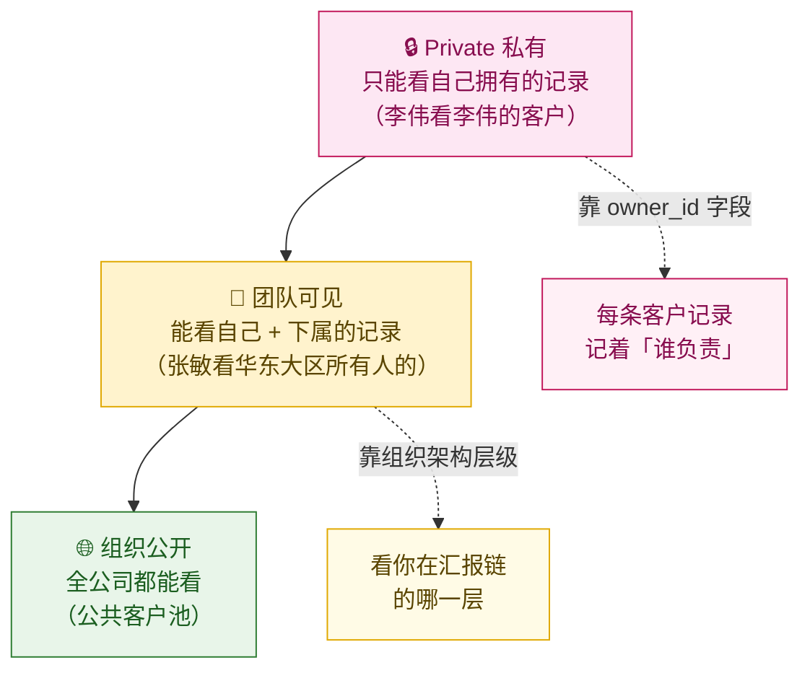

要实现这套，数据模型里每条业务记录都要带两类信息：**「谁拥有它」（owner_id）** 和 **「它属于哪个组织单元」（dept_id / region）**。

```sql
-- 客户表（注意：tenant_id 是租户隔离用的，owner_id/dept_id 是记录级共享用的，两码事）
CREATE TABLE clients (
    client_id   VARCHAR(40) PRIMARY KEY,    -- CL_<uuid>
    tenant_id   VARCHAR(40) NOT NULL,       -- 【租户隔离】属于哪个租户 → 第 5 章
    owner_id    VARCHAR(40) NOT NULL,       -- 【记录级共享】这条客户由哪个销售负责
    dept_id     VARCHAR(40) NOT NULL,       -- 【记录级共享】属于哪个部门/大区
    name        VARCHAR(255) NOT NULL,      -- 客户名，如「华为」
    confidential BOOLEAN DEFAULT FALSE       -- 【ABAC 属性】是否涉密客户
);

-- 部门表：描述组织架构层级，张敏能看「自己及下级部门」靠它
CREATE TABLE departments (
    dept_id     VARCHAR(40) PRIMARY KEY,    -- D_<uuid>
    tenant_id   VARCHAR(40) NOT NULL,
    name        VARCHAR(100) NOT NULL,      -- 如「华东大区」
    parent_id   VARCHAR(40)                 -- 上级部门，构成一棵组织树
);
```

### 李伟和张敏的对比

把角色和数据可见性叠在一起看，就能解释清楚为什么李伟和张敏看到的客户列表完全不同：

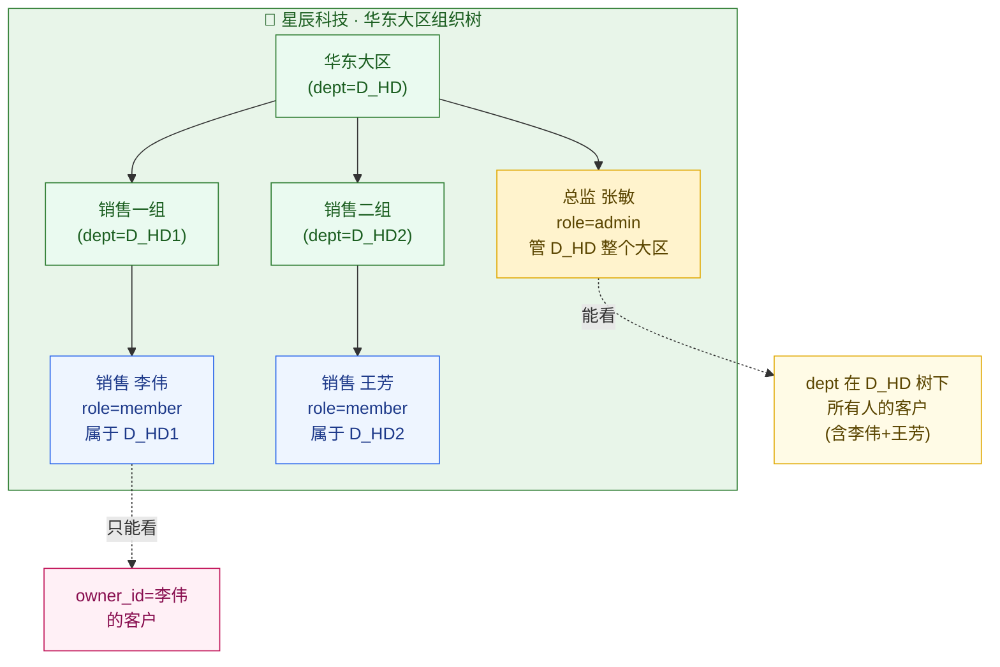

- **李伟（member，Private 可见性）**：查客户列表时，规则要求只返回 `owner_id = 李伟` 的记录。王芳的客户、整个大区其他人的客户，他一条都看不到。
- **张敏（admin，Team 可见性）**：她管整个华东大区，所以能看到「dept_id 落在华东大区组织树（D_HD 及其所有子部门）下」的全部客户——李伟的、王芳的，都在内。

### 记录级共享规则的代码实现

落到代码上，记录级权限有两种实现方式，各有取舍：

**方式一：查询时注入过滤条件（Query Filtering）——首选**

在生成 SQL 时，根据当前用户的可见性规则，**自动追加 WHERE 条件**。这是性能最好、最推荐的做法，因为过滤在数据库里完成，不会把不该看的数据捞出来再丢掉。

```java
/**
 * 数据共享规则引擎：根据当前用户身份，生成「能看哪些客户」的过滤条件。
 * 这是 RBAC（看角色）+ ABAC（看 owner/dept 属性）的混合落地。
 */
public class ClientVisibilityResolver {

    /**
     * @param ctx 当前请求上下文，已包含可信的 tenantId、userId、role（来自第 6 章认证 + 第 4 章上下文）
     * @return 一段安全的 SQL WHERE 片段，调用方拼到客户查询里
     */
    public ScopedFilter resolveClientFilter(RequestContext ctx) {
        // 【第一关 · 租户隔离】无论什么角色，先死死框在自己租户内 —— 这是不可逾越的红线
        // 注意：这一句任何情况下都不能少，它和下面的记录级过滤是「与」的关系
        StringBuilder where = new StringBuilder("tenant_id = :tenantId");
        Map<String, Object> params = new HashMap<>();
        params.put("tenantId", ctx.getTenantId());

        // 【第二关 · 记录级共享】按角色决定数据可见范围
        switch (ctx.getRole()) {
            case "owner":
            case "admin":
                // 管理员/超管：能看自己所辖部门子树下的全部客户
                // getManagedDeptIds() 会递归展开组织树，返回张敏能管的所有 dept_id
                List<String> deptIds = ctx.getManagedDeptIds();
                where.append(" AND dept_id IN (:deptIds)");
                params.put("deptIds", deptIds);
                break;
            case "member":
            default:
                // 普通成员：只能看自己拥有的客户（Private 可见性）
                where.append(" AND owner_id = :userId");
                params.put("userId", ctx.getUserId());
                break;
        }
        return new ScopedFilter(where.toString(), params);
    }
}

// 调用方：查客户列表时，过滤条件由引擎统一生成，业务代码不手写 WHERE
// 这样就不会出现「某个程序员忘了加租户过滤」的事故
ScopedFilter f = visibilityResolver.resolveClientFilter(ctx);
String sql = "SELECT * FROM clients WHERE " + f.getWhere() + " ORDER BY updated_at DESC";
List<Client> clients = jdbc.query(sql, f.getParams(), clientRowMapper);
```

**方式二：取出单条记录后做断言（Post-Fetch Check）——用于详情/编辑**

查列表用「过滤」，但用户点开**某一条具体记录**（如编辑「华为」这条客户）时，是先按 ID 取出来，再判断他能不能碰。这里就能叠加 ABAC 的「涉密」规则：

```java
/**
 * 单条客户记录的访问断言：用于详情页、编辑、删除等针对单条记录的操作。
 * 取出记录后做检查，是 RBAC + ABAC 混合判断的典型位置。
 */
public void assertCanEdit(RequestContext ctx, Client client) {
    // ① 租户边界（最高优先级，先查这个）
    if (!client.getTenantId().equals(ctx.getTenantId())) {
        // 跨租户访问！这是严重安全事件，必须拒绝 + 记审计日志（审计详见第 12 章）
        throw new ForbiddenException("cross-tenant access denied");
    }
    // ② RBAC 粗筛：连「编辑客户」这个能力都没有，直接拒
    if (!ctx.hasCapability("client:write")) {
        throw new ForbiddenException("missing capability: client:write");
    }
    // ③ 记录级共享：member 只能改自己的；admin 改本部门树下的
    boolean inScope = switch (ctx.getRole()) {
        case "owner", "admin" -> ctx.getManagedDeptIds().contains(client.getDeptId());
        default               -> client.getOwnerId().equals(ctx.getUserId());
    };
    if (!inScope) {
        throw new ForbiddenException("record out of your data scope");
    }
    // ④ ABAC 精判：涉密客户，叠加职级规则（蓝鲸合规要求）
    if (client.isConfidential() && ctx.getJobLevel() < 7) {
        throw new ForbiddenException("confidential record requires P7+");
    }
    // 四关全过 → 放行
}
```

> 💡 **两种方式的分工**：列表用「方式一·查询时过滤」（性能好、不泄漏），单条操作用「方式二·取出后断言」（能叠加针对该条记录的 ABAC 规则）。两者结合，既快又严。

---

## 7.7 运行时怎么落地：中间件、注解与缓存

设计讲清楚了，最后看权限检查在一次真实请求里是怎么跑起来的。核心是两个问题：**在哪里检查（中间件 vs 注解）** 和 **怎么不拖慢请求（缓存）**。

> **中间件（Middleware，中间件：请求进入业务逻辑之前、统一拦截并做预处理的一层代码，比如校验认证、注入租户上下文、加载能力集。它像门口的安检通道，每个请求都先过它，业务代码不用各自重复这些公共逻辑）**

### 权限检查放在哪：中间件 + 注解的分层

一次请求从进来到拿到数据，权限检查发生在多个层次，各管一段：

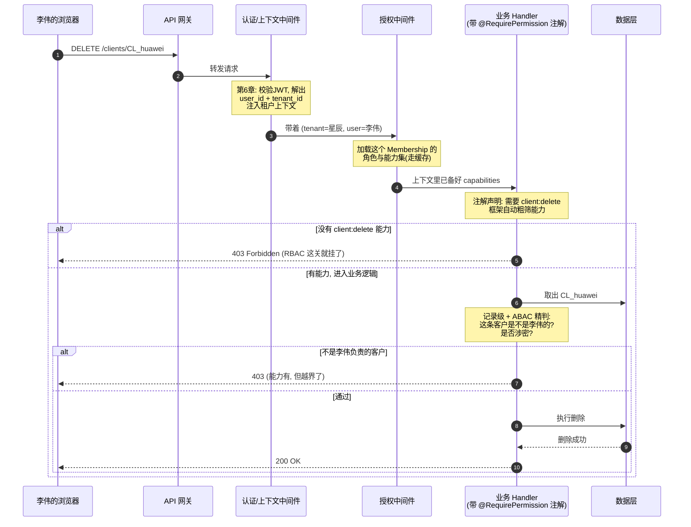

这张图里有两层授权，对应前面的混合模型，落地手段不同：

**第一层 · 注解做「功能级 RBAC 粗筛」**：在 Handler 方法上挂一个声明式注解，框架自动拦截、检查能力，不用每个方法手写 `if`。

```java
@RestController
@RequestMapping("/clients")
public class ClientController {

    // 注解声明：调用这个接口必须有 client:delete 能力
    // 框架的拦截器在进方法前自动检查，没有就直接 403，业务代码不用管
    @RequirePermission("client:delete")
    @DeleteMapping("/{clientId}")
    public void deleteClient(@PathVariable String clientId, RequestContext ctx) {
        Client client = clientRepository.findById(clientId);
        // 第二层 · 记录级 + ABAC 精判（注解管不了具体哪条记录，得在方法体里做）
        accessChecker.assertCanDelete(ctx, client);
        clientRepository.delete(clientId);
    }
}

// 拦截器：把「检查能力」这件重复的事统一收口
@Aspect
@Component
public class PermissionAspect {
    @Before("@annotation(requirePermission)")
    public void check(JoinPoint jp, RequirePermission requirePermission) {
        RequestContext ctx = CurrentRequest.context();   // 从租户上下文取当前用户
        String needed = requirePermission.value();        // 注解上声明的能力, 如 client:delete
        if (!ctx.hasCapability(needed)) {
            throw new ForbiddenException("missing capability: " + needed);
        }
    }
}
```

**第二层 · 方法体内做「记录级 + ABAC 精判」**：注解只知道「需要 `client:delete` 能力」，但不知道「这条具体记录是不是李伟的」「是否涉密」。所以记录级判断必须在拿到记录之后、方法体里做（就是 7.6 节的 `assertCanEdit/assertCanDelete`）。

> 📌 **为什么不全用注解？** 因为注解是「静态声明」，它在方法被调用**之前**执行，那时候连「要操作哪条记录」都还不知道（`clientId` 还没去查库）。记录级权限依赖记录本身的属性（owner_id、密级），只能在取出记录后判断。**注解管功能级，代码管记录级**——这个分工要记牢。

### 中间件 vs 注解怎么选

| 手段 | 检查时机 | 适合管 | 例子 |
| --- | --- | --- | --- |
| **网关/中间件** | 请求最外层，进业务前 | 全局性、粗粒度（认证、租户上下文注入、超大类禁区） | 「未登录一律拦」「停用的成员一律拦」 |
| **方法注解** | 进入某个接口方法前 | 功能级 RBAC（这个接口需要什么能力） | `@RequirePermission("client:delete")` |
| **方法体内代码** | 拿到具体数据后 | 记录级、ABAC、依赖数据内容的规则 | 「这条客户是不是你的」「是否涉密」 |

**经验**：越通用的检查越往外放（中间件），越依赖具体数据的检查越往里放（方法体）。三层配合，既不重复又不遗漏。

### 权限缓存：又快又不出漏洞

问题来了：每次请求都要知道「李伟在星辰是什么角色、有哪些能力」。如果每次都去查 `memberships` 表 + 角色表 + 权限点表（三表 join），QPS 30 万的系统会被权限查询拖垮。所以必须缓存。但缓存权限是个**危险操作**——缓存了过期的权限，等于授权出了漏洞（老陈刚把某人踢出公司，结果他还能操作几分钟）。

云客 CRM 的缓存策略：

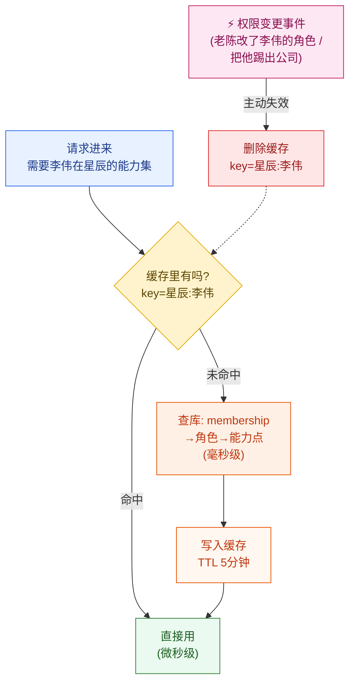

关键设计原则，每一条都对应一个真实风险：

1. **缓存什么**：缓存「(租户, 用户) → 能力集（capabilities）」这个最终结果，不要缓存中间的角色/权限点表。命中后直接得到一个能力的集合，判断 `contains("client:delete")` 即可，快。
2. **缓存键必须带 tenant_id**：键是 `tenant:user`（如 `星辰:李伟`），**绝不能只用 `user`**。否则周工在星辰的能力会被错误地用到蓝鲸——这就是 7.4 节那个跨租户灾难在缓存层的复现。这是缓存权限**最容易踩的雷**。
3. **TTL 兜底 + 事件主动失效，双保险**：
   - **TTL（Time-To-Live，存活时间：缓存条目最多活多久，到点自动作废重新加载）** 设短一些（如 5 分钟），保证即使漏了主动失效，最多 5 分钟后权限也会自动刷新。
   - **权限变更时主动失效**：老陈改了李伟的角色、把谁踢出公司，这类「权限变更事件」要立刻删掉对应缓存键，让变更秒级生效。光靠 TTL 不够——5 分钟内被开除的人还能操作，对金融客户是不可接受的。
4. **只缓存功能级能力，不缓存记录级结果**：缓存「李伟有 `client:read` 能力」是安全的（角色不常变）；但**绝不要**缓存「李伟能看 CL_huawei 这条记录」——因为这条记录的 owner_id、密级随时可能被改，缓存了就会出错。记录级判断每次现算（数据本来就在手上，开销很小）。

---

## 7.8 别搞混：RBAC 与 Entitlements 是「双重门禁」

这是面试和实战中**最高频的混淆点**，单独拎出来讲清。看一个具体场景：

> 老陈（星辰科技 owner）想用「高级数据分析报表」这个功能。系统弹出：「该功能不可用」。

这个「不可用」，可能是**两个完全不同的原因**，对应两道**完全独立**的门禁：

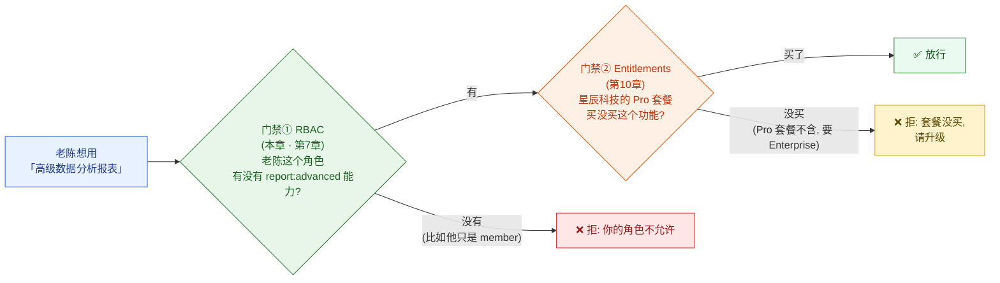

| 维度 | RBAC（本章） | Entitlements（第 10 章） |
| --- | --- | --- |
| **回答的问题** | 这个**用户/角色**被允许做吗？ | 这个**租户的套餐**买了这个功能吗？ |
| **判断主体** | 用户在租户内的角色 | 租户当前的订阅套餐（Free/Pro/Enterprise） |
| **变化原因** | 老陈给某人换了角色 | 星辰科技升级/降级了套餐、欠费了 |
| **典型拒绝话术** | 「你没有权限」 | 「该功能需升级到 Enterprise 套餐」 |
| **同一公司内** | 不同人结果不同（admin 能、member 不能） | 全公司一致（套餐是公司级的） |

**两道门禁是「与」的关系，必须都通过才能用**：

- 老陈是 owner，**RBAC 这关一定过**（他啥都能干）。但如果星辰的 Pro 套餐里压根不含「高级报表」（这是 Enterprise 专属），**Entitlements 这关挂了**——他还是用不了，得让他升级套餐。
- 反过来，就算星辰买了 Enterprise 套餐（Entitlements 过了），普通销售李伟（member）如果角色里没有 `report:advanced` 能力，**RBAC 这关挂了**——他个人还是用不了，得让老陈给他配权限。

> 🎯 **一句话记牢两章的分工**：**RBAC 管「这个人能不能」，Entitlements 管「这家公司买没买」。** 一个是个人权限维度，一个是商业套餐维度，互相独立、缺一不可。把这两个混在一起设计，是 SaaS 权限系统最常见的架构债。本章的 RBAC 是第一道门，第 10 章的 Entitlements 是第二道门。

---

## 本章小结

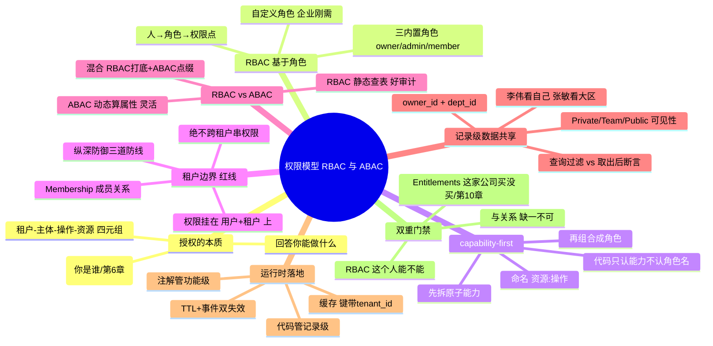

本章的核心收获，浓缩成七句话：

1. **认证管「你是谁」，授权管「你能做什么」**。本章只做授权，且假设手里已有可信的「用户 + 租户」身份（认证是第 6 章的事）。
2. **RBAC 用「角色」这个中间层，把人事变动和权限变动解耦**：人 → 角色 → 权限点。三个内置角色 owner ⊇ admin ⊇ member，但层级关系靠「持有的能力集」体现，绝不用数字大小比较硬编码。
3. **capability-first 是设计的灵魂**：先枚举所有原子能力（`client:read` 这种），再把能力组合成角色。代码永远问「有没有这个能力」，永远不问「是不是某个角色」。这样自定义角色天然成立，加新角色不用改代码。
4. **租户边界是不可逾越的红线**：权限不挂在用户身上，挂在「(用户, 租户)」这个 Membership 上。同一个人在不同租户是不同权限，缓存键必须带 `tenant_id`，否则就是跨租户越权灾难。
5. **RBAC 和 ABAC 不是二选一，而是混合**：RBAC 打底管「功能级」（能不能用编辑客户功能），ABAC 点缀管「记录级/上下文级」（这一条具体记录、这个时间点、这个区域能不能）。纯 ABAC 会膨胀到无法维护。
6. **CRM 的灵魂是记录级数据共享**：靠 `owner_id`（谁负责）+ `dept_id`（哪个部门）实现 Private/Team/Public 三档可见性。列表查询用「注入 WHERE 过滤」（快、不泄漏），单条操作用「取出后断言」（能叠加 ABAC）。
7. **RBAC 与 Entitlements 是双重门禁**：RBAC 管「这个人能不能」，Entitlements（第 10 章）管「这家公司套餐买没买」，两者是「与」的关系，都过才能用。

权限引擎判断「能不能」时，反复依赖一个前提：**一个可信的、不会丢、不会串的租户上下文**。这个上下文怎么从请求入口被识别、怎么跨服务传递不丢失——是我们已经在 **第 4 章（租户标识与上下文路由）** 讲过的地基。而权限放行之后，查询真正落到数据库时怎么靠 `tenant_id` 和 RLS 兜底不串库——是 **第 5 章（数据层设计）** 的内容。授权只是隔离铁壁的第一道防线。

接下来进入**第三部分的尾声与第四部分**：身份和权限都讲完了，下一站是 SaaS 的「钱袋子」——**第 8 章 订阅与套餐体系**，看看星辰科技从 Pro 升级到 Enterprise 时，系统里到底发生了什么。

---

## 参考来源

1. **AWS SaaS Factory — Implementing Role-Based Access Control（多租户 SaaS 下 RBAC 的设计与租户隔离实践，含 capability/role 分层思想）**：<https://aws.amazon.com/blogs/apn/isolating-saas-tenants-with-dynamically-generated-iam-policies/>
2. **WorkOS Blog — RBAC vs ABAC: What's the difference?（面向工程师的 RBAC 与 ABAC 通俗对比，含混合模型实践）**：<https://workos.com/blog/rbac-vs-abac>
3. **Salesforce — Control Access to Records / Sharing Model（CRM 记录级数据共享的权威设计：Private/Public、Owner、Role Hierarchy、Sharing Rules）**：<https://help.salesforce.com/s/articleView?id=sf.security_data_access.htm>
4. **NIST — Guide to Attribute Based Access Control (ABAC) Definition and Considerations（SP 800-162，ABAC 的标准定义与权衡，权威一手文献）**：<https://csrc.nist.gov/publications/detail/sp/800-162/final>
