# 第 8 章 · 订阅与套餐体系

> 第 1 章那句话又来了：**「商业即架构」**。一家 SaaS 公司怎么赚钱，会直接编码进系统里。本章就是把「云客 CRM 怎么卖」这件事，翻译成一套可以运转的数据模型、状态机和计费规则。它是整个第四部分（商业化）的地基——第 9 章算的「钱」、第 10 章开的「功能」，都站在本章建立的「订阅」之上。

---

## 本章导读（读完你能回答这些问题）

- **套餐（Plan）到底要建模哪些东西？** 为什么不能简单写成一张「价格表」，而要拆成 Plan / Price / Entitlement 三层？
- **订阅（Subscription）的生命周期有哪些状态？** 从「试用」到「活跃」到「逾期」再到「取消/过期」，每个状态之间允许怎么跳、不允许怎么跳？
- **星辰科技月中从 Pro 升到 Enterprise，要补多少差价？** 这个「按比例计费（proration）」到底是怎么按天算出来的（带具体数字）？
- **降级要怎么处理？** 立刻生效会不会让客户「亏一笔」？为什么降级一般放到下个周期？
- **信用卡扣款失败了，平台为什么不立刻封号？** 「逾期（past_due）→ 宽限期 → 暂停」这套挽留流程是怎么设计的？
- **套餐一变，李伟手里那个「批量导出」按钮怎么就立刻不能点了？** 订阅变更如何联动功能开关（这里只讲「联动机制」，运行时检查交给第 10 章）。

---

## 8.0 先理清三组容易混的概念

订阅计费这块，初学者最容易把几组词搅在一起。先用云客 CRM 的场景把它们彻底分开，后面就不会乱。

> **订阅（Subscription，订阅：某个租户「买了哪个套餐、从哪天到哪天、现在是什么状态」的那一条记录）**。它是「租户」和「套餐」之间的一根绳子。星辰科技有且只有一条「当前生效」的订阅。

> **套餐（Plan，套餐/计划：平台对外卖的『商品规格』，比如 Free / Starter / Pro / Enterprise）**。套餐是平台侧定义的、所有租户共享的模板；订阅是租户侧的、一对一的实例。**套餐是菜单，订阅是某桌客人点的那道菜。**

第一组要分清的是「订阅」和「套餐」：

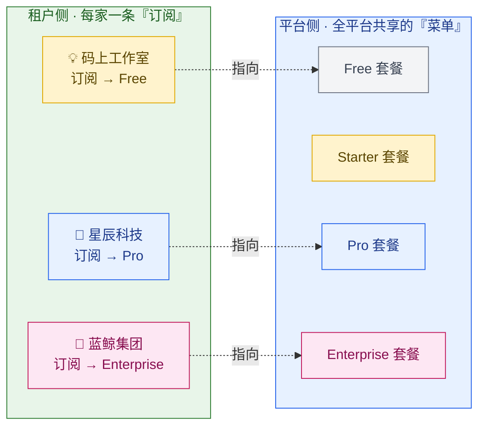

第二组要分清的，是**本章和第 9、10 章的分工**。这三件事经常被笼统叫「计费系统」，但工程上是三个职责：

| 关注点 | 一句话职责 | 谁负责 | 举例（星辰科技） |
| --- | --- | --- | --- |
| **订阅（Subscription）** | 你**买了**哪个套餐、什么状态、什么时候到期、要不要续 | **本章（第 8 章）** | 星辰科技订了 Pro，下月 9 号续费 |
| **计量与计费（Metering & Billing）** | 这个月你**用了**多少、该**收**多少钱、开什么发票 | 第 9 章 | 这个月用满 500 座席、调用 API 8 万次，账单 X 元 |
| **功能授权（Entitlement & Flag）** | 你**能用**哪些功能、运行时这一刻能不能点这个按钮 | 第 10 章 | 李伟点「批量导出」时，系统判断 Pro 是否包含此功能 |

> 📌 **一句话区分**：订阅说的是「**身份与契约**」（你是 Pro 客户，合同到几号）；计费说的是「**钱**」（这个月收你多少）；授权说的是「**能力**」（这一刻你能不能做这件事）。本章只管第一件，后两件会一句话引到对应章节。

第三组要分清的，是上一章（第 2 章）的「**租户生命周期**」和本章的「**订阅生命周期**」——它们是**两台联动但不同的状态机**，初学者极易混淆，8.2 节会专门用一张图把它们对齐。

---

## 8.1 套餐建模：为什么一张价格表远远不够

### 8.1.1 新手的第一版：把套餐写成一张表

最直觉的做法，是在 `tenant` 表里加一个字段 `plan`，存 `'free' / 'pro'` 这样的字符串，再在代码里到处写 `if (plan == 'pro')`。这套做法能跑，但三个月后必然崩，原因有三：

1. **价格会变，但历史订单要冻结**。今天 Pro 卖 200 元/座席/月，明年涨到 250。已经签了的星辰科技不能跟着涨——它锁的是「下单那一刻」的价格。如果价格直接写死在套餐字段里，老客户和新客户就分不开了。
2. **同一个套餐有多种计费周期**。Pro 可以「月付 200」，也可以「年付 2000（相当于打 83 折）」。这是同一个套餐、不同的「价格点」。
3. **功能列表会频繁调整**。产品经理今天给 Pro 加一个「AI 摘要」功能，明天把「批量导出」从 Starter 挪到 Pro。如果功能写死在代码 `if` 里，每次调整都要发版。

### 8.1.2 正确的分层：Plan / Price / Entitlement 三层

业界成熟的做法（Stripe、Chargebee、AWS Marketplace 都是这个思路），是把「套餐」拆成**三层**，各管一摊：

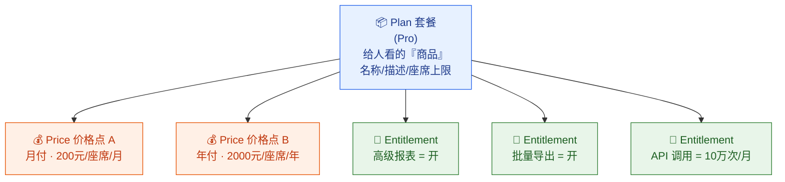

- **Plan（套餐）**：面向人的「商品」。它有名字（Pro）、描述、座席上限，是销售页面上展示的那一档。
- **Price（价格点，Price：同一个套餐下『一种付钱方式』，比如月付价、年付价、不同币种价）**：套餐和「钱」之间的桥。一个套餐可以挂多个价格点（月付/年付/人民币/美元）。**关键设计：订阅记录里冻结的是 `price_id`，不是金额**——这样涨价只新增一个 price，老订阅指向老 price，价格自动锁定。
- **Entitlement（功能授权，Entitlement：这个套餐『包含哪些功能、各功能的额度是多少』的声明）**：套餐和「能力」之间的桥。它声明 Pro 能用哪些功能、各功能配额多少。**本章只负责『套餐里写着包含什么』，运行时『这一刻能不能用』的检查交给第 10 章**。

> 🎬 **画面感**：明年 Pro 涨价。平台不去改 Pro 这个 Plan，而是**新建一个 Price**：`pro_monthly_v2 = 250元`，并把销售页面切到指向 v2。星辰科技去年签的订阅，`price_id` 还指着 `pro_monthly_v1 = 200元`，**续费时自然还是 200**。新来的客户才看到 250。两类客户在系统里干干净净地分开了——这就是三层模型的价值。

### 8.1.3 四档套餐对比表（云客 CRM）

下面是云客 CRM 四档套餐的完整对比。这张表是后面所有讨论的「事实基准」——升降级、proration、功能联动，都拿它做例子。

| 维度 | 💡 **Free** | **Starter** | 🏢 **Pro** | 🏦 **Enterprise** |
| --- | --- | --- | --- | --- |
| **目标客户** | 个人/试水团队 | 小团队 | 中型企业 | 大型集团 |
| **价格** | ¥0 | ¥50 / 座席 / 月 | ¥200 / 座席 / 月 | 定制（一口价 + 谈判）|
| **座席上限** | 5 | 25 | 500 | 无上限（5 万级）|
| **客户记录上限** | 1,000 | 1 万 | 50 万 | 无上限 |
| **数据隔离** | Pool 共享库 | Pool 共享库 | Pool / Bridge | Silo 独立库（详见第 3 章）|
| **基础 CRM（客户/商机/活动）** | ✅ | ✅ | ✅ | ✅ |
| **基础报表** | ✅ | ✅ | ✅ | ✅ |
| **高级报表（自定义维度）** | ❌ | ❌ | ✅ | ✅ |
| **批量导出** | ❌ | ✅ | ✅ | ✅ |
| **API 调用配额** | 1 万/月 | 5 万/月 | 10 万/月 | 自定义 |
| **SSO 单点登录** | ❌ | ❌ | ❌ | ✅（详见第 6 章）|
| **SCIM 账号自动开通** | ❌ | ❌ | ❌ | ✅ |
| **审计日志** | ❌ | 30 天 | 180 天 | 自定义/无限 |
| **数据驻留区域选择** | ❌ | ❌ | ❌ | ✅（详见第 14 章）|
| **可用性 SLA** | 无承诺 | 无承诺 | 99.9% | 99.95% |
| **支持** | 社区 | 工单 | 工单 + 专属客服 | 专属 TAM + 电话 |

> 📌 注意几个建模信号：
> - **Free 没有座席单价**（¥0），但**仍然是一条正经订阅**——它有套餐、有功能授权、只是价格点金额为 0。很多新手会把 Free 当成「没订阅」，这是 bug 之源（详见 8.7）。
> - **Enterprise 价格是「定制」**，意味着它的 Price 不是平台预设的，而是销售谈判后**为蓝鲸集团单独生成的一个价格点**。这种叫「自定义报价（custom quote）」，订阅模型必须支持。
> - **座席上限**这一行在升降级时是「硬约束」：从 Pro（500）降到 Starter（25）时，星辰科技现有 500 个座席远超 25 上限，会卡住降级——这个边界 8.3.5 节会讲。

### 8.1.4 套餐与价格的数据模型

把三层模型落成表（这里用 PostgreSQL 风格，重点是字段含义，不是 DDL 语法细节）：

```sql
-- 套餐表：平台侧的『商品菜单』，全租户共享
CREATE TABLE plan (
    id            VARCHAR(40) PRIMARY KEY,    -- 应用层生成的可读 ID，如 PLAN_pro
    code          VARCHAR(40) NOT NULL UNIQUE,-- free / starter / pro / enterprise
    name          VARCHAR(80) NOT NULL,       -- 展示名「专业版」
    seat_limit    INT,                        -- 座席上限，NULL 表示无上限（Enterprise）
    is_active     BOOLEAN     DEFAULT TRUE,   -- 是否仍在售（下架的套餐不删，老客户还在用）
    sort_order    INT,                        -- 销售页面排序
    created_at    TIMESTAMPTZ DEFAULT now()
);

-- 价格点表：一个套餐挂多个价格点（月付/年付/不同币种/自定义报价）
CREATE TABLE price (
    id              VARCHAR(40) PRIMARY KEY,  -- 如 PRICE_pro_monthly_v1
    plan_id         VARCHAR(40) NOT NULL REFERENCES plan(id),
    billing_cycle   VARCHAR(16) NOT NULL,     -- monthly / yearly
    currency        VARCHAR(8)  NOT NULL,     -- CNY / USD
    unit_amount     BIGINT      NOT NULL,     -- 单座席金额，单位『分』，避免浮点误差
    is_custom       BOOLEAN     DEFAULT FALSE,-- 是否为某租户定制（如蓝鲸集团专属报价）
    custom_tenant   VARCHAR(40),              -- 定制价仅对该租户可见
    created_at      TIMESTAMPTZ DEFAULT now()
);

-- 套餐功能授权表：套餐『包含什么、额度多少』（运行时检查见第 10 章）
CREATE TABLE plan_entitlement (
    plan_id    VARCHAR(40) NOT NULL REFERENCES plan(id),
    feature    VARCHAR(40) NOT NULL,          -- advanced_report / bulk_export / sso ...
    enabled    BOOLEAN     DEFAULT FALSE,      -- 布尔型功能：开/关
    quota      BIGINT,                         -- 配额型功能：额度（如 API 10万/月），NULL=不适用
    PRIMARY KEY (plan_id, feature)
);
```

几个工程要点，每一个都对应一个真实踩过的坑：

- **金额一律用「分」存 `BIGINT`**，绝不用 `FLOAT`。`0.1 + 0.2 != 0.3` 这种浮点误差，在算钱的系统里是事故。`200元 = 20000 分`。
- **下架套餐 `is_active=FALSE` 而不是删除**。星辰科技还在用 Pro 的某个老版本配置，套餐记录删了它就成了悬空引用。
- **座席上限 `NULL` 表示无上限**，专给 Enterprise 用。代码里判断要写 `seat_limit IS NULL OR current_seats <= seat_limit`，别漏了 NULL 分支。

---

## 8.2 订阅生命周期：本章最核心的状态机

### 8.2.1 五个核心状态

一条订阅不是「创建了就一直活跃」。它会试用、转付费、欠费逾期、被取消、最终过期。这一连串变化，和第 2 章一样，必须用**状态机**精确描述——因为**收不收钱、能不能用、要不要催，全跟着订阅状态走**。

> **订阅状态机（Subscription State Machine：订阅所有可能的状态 + 状态之间允许的跳转，跳转必须按图走）**。它和第 2 章的「租户生命周期状态机」是**两台机器**：租户状态机管的是「这家公司在平台上的整体存活状态」（注册/开通/销毁），订阅状态机管的是「这家公司当前这笔买卖的状态」（试用/付费/欠费）。8.2.4 节会把两者对齐。

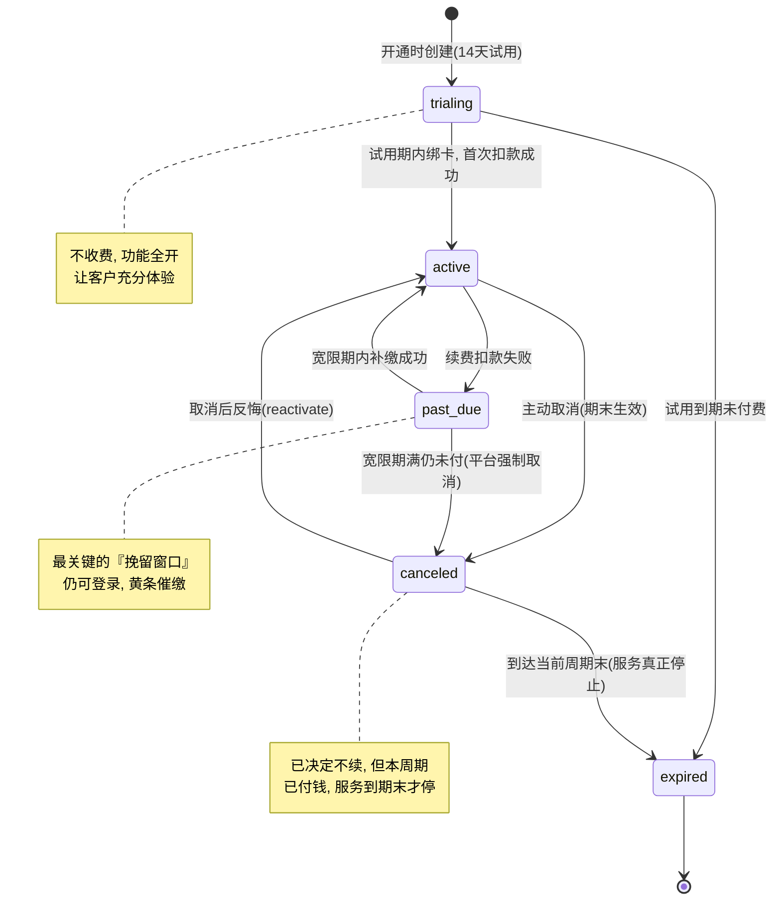

> **mermaid 状态机说明**：`[*]` 是起点/终点。箭头是「允许的跳转」，箭头文字是「触发跳转的事件」。**没有箭头直连的两个状态禁止直接跳转**——比如不能从 `trialing` 直接跳到 `past_due`（试用根本没收过钱，谈不上逾期）。
>
> 📌 **升级/降级是 `active` 状态内的变更**（套餐切换 + proration 算钱，状态仍是 `active`），属于「状态不变、内容变更」，图上不画自环箭头；但代码的允许跳转表里仍把 `ACTIVE → ACTIVE` 列为合法（见 8.2.3），用于承载这类同状态变更。

### 8.2.2 五个状态详解

| 状态 | 英文 | 含义 | 收费？ | 能用产品？ | 可逆？ |
| --- | --- | --- | --- | --- | --- |
| **试用中** | `trialing` | 已开通，处于免费试用期 | ❌ 不收 | ✅ 功能全开 | — |
| **活跃** | `active` | 正常付费使用中 | ✅ 按周期收 | ✅ 全开 | — |
| **逾期** | `past_due` | 续费扣款失败，处于宽限期 | ⏳ 欠着 | ✅ 仍可用（挽留窗口）| ✅ 补缴即恢复 |
| **已取消** | `canceled` | 已决定不续，但本周期已付费，服务延续到期末 | ❌ 不再续 | ✅ 用到期末 | ✅ 期末前可反悔 |
| **已过期** | `expired` | 服务真正停止（取消到期末 / 试用到期未付）| ❌ | ❌ 停服 | ⚠️ 需重新订阅 |

这里有三个**最容易被新手做错**的语义，必须刻进脑子：

1. **`canceled` ≠ 立刻停服**。客户点了「取消」，但他这个月的钱已经付了，凭什么不让用？所以取消是「**到期末生效**」——状态先变 `canceled`，但功能照常，等到当前付费周期结束才落到 `expired`。这叫「期末取消（cancel at period end）」。如果产品真要「立刻退款立刻停服」，那是另一个流程（cancel immediately + refund），云客 CRM 默认用期末取消。
2. **`past_due` 不是「立刻封号」**。扣款失败的原因 80% 是「信用卡过期/额度不足」这种可挽回的小事，立刻封号会把本来愿意付钱的客户气走。所以 `past_due` 是个**挽留窗口**——仍可登录、顶部挂黄条、连发催缴邮件。这是 SaaS 减少「非自愿流失（involuntary churn）」的关键设计，8.6 节细讲。
3. **`expired` 是「软终点」不是「硬删除」**。订阅过期 = 服务停了，但**数据一行不动**（第 2 章的红线：`suspended` 数据完整保留）。客户随时可以重新订阅恢复。真正销毁数据是第 14 章的「数据保留与删除」，和订阅过期是两码事。

> ⚠️ **`canceled` 有两种来源，停服时机完全不同**（这点极易混淆，务必区分）：
> - **主动期末取消（cancel at period end）**：客户主动点「取消」，本周期的钱**已经付过**，所以服务延续到期末（用到 `current_period_end` 才落 `expired`）。这是上面表格里默认描述的那种「用到期末」。
> - **逾期强制取消（past_due → canceled）**：续费扣款一直失败、宽限期满后被平台强制取消。此时**根本没有已付费的新周期可享用**，所以它不享受「用到期末」，而是随即触发租户 `suspended` **立即停服**（见 8.5.2）。
>
> 建议在订阅记录上加一个 `cancel_reason` 字段（`user_requested` / `payment_failed`）来区分二者：`user_requested` 走期末停服，`payment_failed` 走立即停服。这样同一个 `canceled` 状态就不再二义。

### 8.2.3 状态机落地：用「允许跳转表 + 守卫函数」

和第 2 章租户状态机一个套路——把图焊进代码，杜绝乱跳。下面给一段最小化实现：

```java
// 订阅状态机：用一张「允许跳转表」把图焊进代码。图里没画的箭头，代码就不允许
public enum SubscriptionStatus { TRIALING, ACTIVE, PAST_DUE, CANCELED, EXPIRED }

public class SubscriptionStateMachine {

    // 这张表就是 8.2.1 那张状态机图的代码翻译
    private static final Map<SubscriptionStatus, Set<SubscriptionStatus>> ALLOWED = Map.of(
        TRIALING,  Set.of(ACTIVE, EXPIRED),                  // 试用 → 付费 / 过期
        ACTIVE,    Set.of(ACTIVE, PAST_DUE, CANCELED),       // 活跃 → 自身(升降级)/逾期/取消
        PAST_DUE,  Set.of(ACTIVE, CANCELED),                 // 逾期 → 补缴恢复 / 强制取消
        CANCELED,  Set.of(EXPIRED, ACTIVE),                  // 取消 → 期末过期 / 反悔恢复
        EXPIRED,   Set.of()                                  // 过期是终点，不再跳出
    );

    /** 守卫函数：每次状态跳转必须先过这一关 */
    public void transition(Subscription sub, SubscriptionStatus target, String reason) {
        SubscriptionStatus from = sub.getStatus();
        if (!ALLOWED.getOrDefault(from, Set.of()).contains(target)) {
            // 非法跳转直接抛业务异常（按架构约束：异常交由 domain 层处理）
            throw new IllegalSubscriptionTransitionException(from, target);
        }
        sub.setStatus(target);
        // 每次合法跳转都落审计日志 + 发领域事件
        // 计费服务(第9章)、功能开关(第10章)、邮件服务都来订阅这个事件
        auditLog.record(sub.getTenantId(), from, target, reason);
        eventBus.publish(new SubscriptionStatusChangedEvent(sub, from, target, reason));
    }
}
```

> 📌 注意最后那行 `eventBus.publish(...)`——这是本章和第 9、10 章联动的「总开关」。订阅状态一变，就发一个**领域事件（Domain Event：系统里发生了某件业务上有意义的事，广播出去让关心它的人各自响应）**，计费服务、功能开关服务、邮件服务各自订阅、各自处理。这种「事件驱动」让订阅服务**不需要知道下游有谁**——它只管喊一嗓子。8.8 节会展开这个联动机制。

### 8.2.4 订阅状态机 vs 租户生命周期：两台机器怎么对齐

这是本章最容易把人绕晕的地方，必须用一张图讲清。第 2 章的「租户生命周期」和本章的「订阅生命周期」是两台**联动但独立**的状态机：

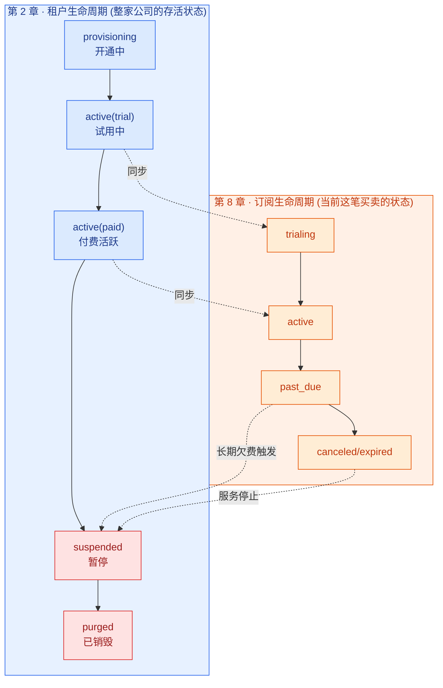

**怎么理解两者的关系**（用一个类比）：

- **租户生命周期** = 一个人的「**户籍状态**」（在世/已注销）。粗粒度，变化慢。
- **订阅生命周期** = 这个人「**这份工作合同**」的状态（在职/欠薪/离职）。细粒度，变化快。

一家公司可能换好几次合同（订阅升级、取消重订），但「户籍」一直在。两者的联动规则是：

- 订阅进入 `trialing` / `active` → 租户处于 `active`，正常使用。
- 订阅 `past_due` 持续超过宽限期 → 触发租户 `suspended`（封号留数据）。**注意：是「订阅长期逾期」才升级到「租户暂停」，不是一逾期就封号**。
- 订阅 `canceled` 到期末 `expired` → 服务停止，租户也走向 `suspended`（数据保留），等待客户回流或最终走第 14 章的销毁流程。

> 📌 **工程上的边界**：本章只负责把**订阅状态机**做对，并在「订阅长期欠费/过期」时**发事件通知租户生命周期服务**。是否真的暂停租户、怎么暂停，是租户生命周期服务（第 2 章）的职责。两台机器通过事件解耦，谁也不直接改对方的状态。

---

## 8.3 升降级与按比例计费（proration）：本章的硬核

### 8.3.1 问题：月中升级，钱怎么算才公平

星辰科技用 Pro 用得很好，业务扩张，**在 4 月 15 日（账单周期是每月 1 号到 30 号，正好月中）决定升级到 Enterprise**。

> 📌 **这是一个「演示场景」**：星辰科技的正式主线身份仍是 **Pro 套餐**（500 座席的中型企业，见第 3 章用它讲 Pool/Bridge 隔离）。这里临时让它升一次 Enterprise，纯粹是为了把 proration（按比例计费）这套算法用真实数字讲透。讲完计费机制后（见 8.8 末尾说明），把它当作仍然是 Pro 客户即可——真正的 Enterprise 主线租户是蓝鲸集团。

这时候一个现实问题来了：星辰科技**这个月已经按 Pro 付过钱了**（4 月 1 号扣的 Pro 月费），现在 15 号要升到更贵的 Enterprise。直接再收一整月 Enterprise 的钱？那等于这半个月被收了两遍。一分钱不补？那平台亏了半个月差价。

公平的做法叫**按比例计费（proration，按比例计费：套餐月中变更时，按『剩余天数占整个周期的比例』计算应补/应退的差价，谁也不吃亏）**。核心思想一句话：**把已付的钱按天退掉没用完的部分，再按天补上新套餐没用完的部分。**

### 8.3.2 proration 的计算公式

```
设当前周期共 D 天，变更发生时还剩 R 天（含当天）。

旧套餐每座席日单价 = 旧套餐月单价 ÷ D
新套餐每座席日单价 = 新套餐月单价 ÷ D

应退（旧套餐剩余天数没用完的部分）= 旧日单价 × R × 座席数
应补（新套餐剩余天数的费用）      = 新日单价 × R × 座席数

本次 proration 净补差价 = 应补 − 应退
                       = (新月单价 − 旧月单价) × (R / D) × 座席数
```

最后那个化简很重要——**升级时净补的差价，就是「月差价 × 剩余天数比例 × 座席数」**。直觉上完全合理：你只为「还没用完的那部分时间 × 升级带来的单价差」补钱。

### 8.3.3 星辰科技升级实算（带具体数字）

把星辰科技的场景代进去算一遍：

| 参数 | 值 |
| --- | --- |
| 账单周期 | 4 月 1 日 ~ 4 月 30 日，共 **D = 30 天** |
| 变更日期 | 4 月 15 日（当天算剩余）|
| 剩余天数 | 4/15 ~ 4/30 = **R = 16 天** |
| 座席数 | **500 座席**（Pro 套餐基准）|
| Pro 月单价 | 200 元/座席 = **20000 分** |
| Enterprise 月单价（谈判价）| 350 元/座席 = **35000 分** |

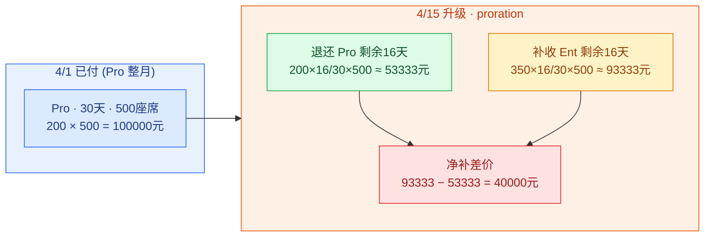

逐步算：

```
为避免整数除法精度损失，按 8.3.4 代码口径「先乘后除」算（除法放最后）：

应退 Pro 剩余 16 天 = 20000 × 16 × 500 ÷ 30 = 5,333,333 分 ≈ 53,333.33 元
应补 Ent 剩余 16 天 = 35000 × 16 × 500 ÷ 30 = 9,333,333 分 ≈ 93,333.33 元

本次净补差价 = 9,333,333 − 5,333,333 = 4,000,000 分 = 40,000 元

用化简公式验证：
净补 = (35000 − 20000) × (16/30) × 500
     = 15000 × 0.5333… × 500
     = 4,000,000 分 = 40,000 元  ✅ 一致
```

> 🎬 **画面感**：4 月 15 日老陈在后台点「升级到 Enterprise」，页面**立刻**弹出一行字：「升级后将立即按比例补收本周期差价 **¥40,000.00**（Enterprise 自即刻生效，下个完整周期起按 ¥350/座席/月、即每月 ¥175,000 续费）」。老陈点确认，40,000 元差价当场入账（这笔差价会进第 9 章的发票），订阅 `plan` 字段从 Pro 切到 Enterprise，效果立即生效——李伟下一秒刷新就能看到原来 Pro 没有的「数据驻留区域设置」入口了。

### 8.3.4 proration 计算的代码

```java
/**
 * 计算月中升降级的按比例差价。
 * 返回正数=应向租户补收，负数=应退给租户（或转为下期抵扣）
 */
public long calcProration(Subscription sub, Price newPrice, LocalDate changeDate) {
    BillingPeriod period = sub.getCurrentPeriod();
    int totalDays     = period.totalDays();                         // D，本周期总天数
    int remainingDays = period.remainingDaysFrom(changeDate);       // R，含变更当天的剩余天数
    int seats         = sub.getSeatCount();                         // 座席数

    long oldUnit = sub.getCurrentPrice().getUnitAmount();           // 旧套餐月单价（分）
    long newUnit = newPrice.getUnitAmount();                        // 新套餐月单价（分）

    // 退还旧套餐剩余天数 + 补收新套餐剩余天数，二者之差就是净额
    // 注意：先乘后除，把除法放最后，最大限度减少整数除法的精度损失
    long refundOld = (long) oldUnit * remainingDays * seats / totalDays;
    long chargeNew = (long) newUnit * remainingDays * seats / totalDays;

    return chargeNew - refundOld;   // 正=补收，负=退款/抵扣
}
```

> 📌 **整数运算的坑**：`unitAmount` 是「分」，乘除会涉及取整。工程上的纪律是「**先乘后除，除法放最后**」——`a * b / c` 比 `a / c * b` 精度高得多。涉及到「分」级别的舍入差异（半分钱归谁），各家策略不同（向下取整对客户友好，向上取整对平台友好），需要在产品层显式定义，并和第 9 章计费引擎对齐。

### 8.3.5 降级：为什么一般「期末生效」而不是立刻

升级是「立刻生效 + 立刻补钱」，因为客户想马上用更高级的功能，平台也乐意马上多收钱。**降级则反过来——一般设计成「期末生效」**。原因有三：

1. **客户已经为本周期付了高档的钱**。星辰科技 4 月 1 号付了整月 Pro 的钱，4 月 15 号要降到 Starter。如果立刻生效，等于客户花了 Pro 的钱只用了半个月，剩下半个月被强行降级——客户体验极差，还可能涉及退款纠纷。
2. **避免「降级套利」**。如果降级立刻退差价，有人会「月初订高档用几天 → 月中降级套现」，薅平台羊毛。
3. **降级常伴随约束冲突**。从 Pro（500 座席）降到 Starter（25 座席），但星辰科技现在有 500 个活跃座席——**降级直接就违反新套餐的座席上限**。这种冲突必须先解决（让客户先停用/删掉 475 个座席，缩到 25 以内）才能降。

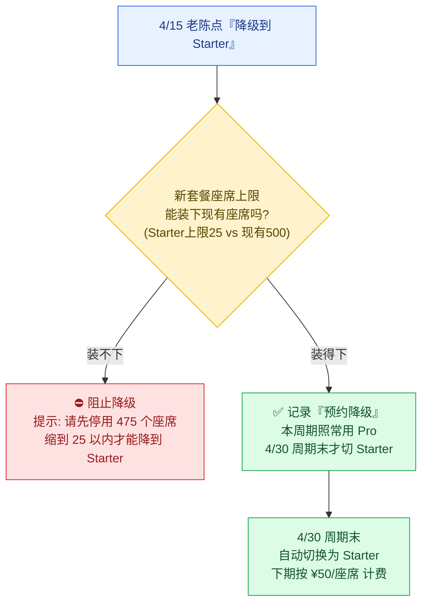

> 📌 **「预约降级」的建模**：降级不会立刻改 `plan`，而是在订阅记录上写一个「**待生效变更（scheduled change）**」字段，如 `pending_plan = starter, effective_at = 2026-04-30`。到了周期末，续费任务读到这个待生效变更，才真正切换套餐。在切换前，老陈随时可以「撤销降级」。**升级和降级在数据建模上完全不同：升级是立即改 + proration，降级是预约 + 期末执行**——这是一个高频面试考点。

### 8.3.6 升降级策略对比

| 维度 | **升级（如 Pro → Enterprise）** | **降级（如 Pro → Starter）** |
| --- | --- | --- |
| 生效时机 | **立即** | **期末**（下个周期起）|
| 计费处理 | proration **立即补**差价 | 不补不退，期末按新价 |
| 数据建模 | 直接改 `plan` + 生成 proration 账单项 | 写 `pending_plan` + `effective_at`，期末执行 |
| 约束检查 | 通常无（高档套餐限制更松）| **必查座席/数据是否超新套餐上限** |
| 可撤销 | 不可（钱已补）| **可**（生效前随时撤销）|
| 功能开关联动 | 立即放开新功能（第 10 章）| 期末才收回功能 |

---

## 8.4 续费：到期不是终点，是新一轮的起点

### 8.4.1 自动续费的主循环

绝大多数 SaaS 默认**自动续费（auto-renewal：周期到期时自动用绑定的支付方式扣下一周期的费用，无需客户手动操作）**——这是 SaaS 收入「经常性（recurring）」的来源，也是 MRR 稳定的根本（回顾第 1 章：MRR 是 SaaS 命脉）。

平台后台有一个**续费扫描任务（renewal job）**，定时（通常每天凌晨跑一次）扫描「今天到期的订阅」，逐个触发续费：

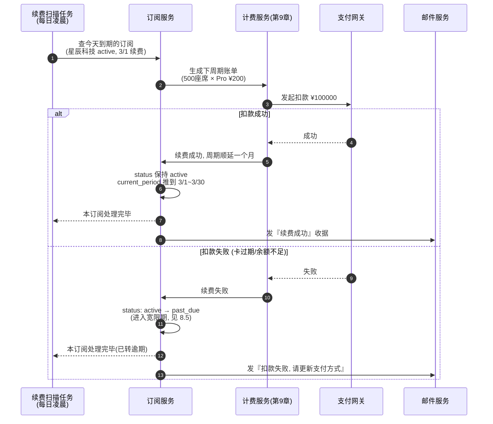

### 8.4.2 到期提醒：不只是礼貌，是降低流失

续费前的**到期提醒（renewal reminder）** 是一套有节奏的触达，目的有二：① 让客户有心理预期，减少「怎么又扣钱了」的投诉和退款；② 给信用卡过期的客户留出更新支付方式的时间，降低非自愿流失。云客 CRM 的提醒节奏：

| 触发时机 | 对象 | 内容 |
| --- | --- | --- |
| 到期前 **7 天** | owner（老陈）+ billing 联系人 | 「您的 Pro 订阅将于 X 月 X 日自动续费 ¥100,000（500 座席 × ¥200）」|
| 到期前 **1 天** | owner | 「明日将自动续费，如需变更套餐请今日操作」|
| 到期当天 | owner | 续费成功收据 / 或失败提醒 |
| **试用到期前 3 天** | owner | 「试用将于 3 天后结束，请绑定支付方式以继续使用」|

> 📌 **试用到期提醒尤其关键**。`trialing → active` 的转化率是 SaaS 增长的命门。试用快结束却没绑卡的客户，是「即将流失但还能救」的高价值人群，提醒要更密、更醒目。这块和增长团队的「试用转化漏斗」直接挂钩。

### 8.4.3 试用转付费：完整流程

把试用转付费这条最重要的转化路径单独画一张图——这是 8.2 状态机里 `trialing → active` 那条边的展开：

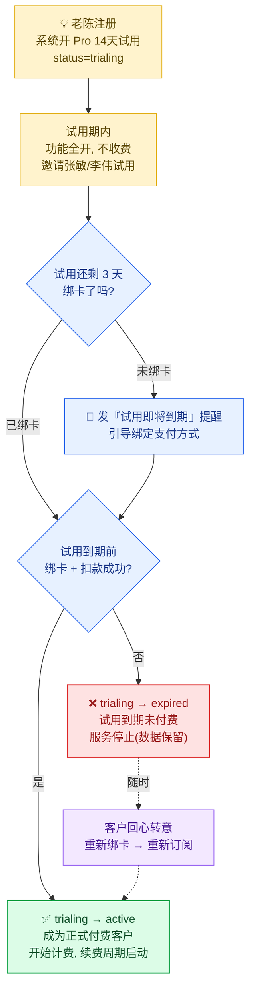

> 🎬 **两种试用策略**：云客 CRM 用的是「**先用后付（trial without card）**」——注册不绑卡，先用 14 天，到期前再引导绑卡。好处是注册门槛低、试用人多；坏处是转化率相对低（不绑卡的人很多就流失了）。另一种是「**先绑卡（trial with card）**」——注册就要绑卡，到期自动转付费。转化率高，但注册门槛高。两种都要被订阅模型支持，区别只在「`trialing` 期间有没有挂支付方式」。

---

## 8.5 逾期处理：past_due → 宽限期 → 暂停

### 8.5.1 为什么不能扣款失败就封号

回到 8.2 节强调的：扣款失败的主因是**非自愿的**——信用卡过期、额度临时不足、银行风控误拦。这些客户**本来是愿意付钱的**，立刻封号等于把钱往外推，还白白制造一个差评。这种「因为支付问题而非客户主动取消造成的流失」，业界叫**非自愿流失（involuntary churn）**，是 SaaS 流失里「最不该发生、最能挽回」的一类。

成熟的做法叫**催缴挽回（dunning，催缴流程：扣款失败后，按一套递进的节奏重试扣款 + 多渠道提醒客户更新支付方式，尽量把钱收回来）**。云客 CRM 的逾期处理就是一套完整的 dunning 流程。

### 8.5.2 完整的逾期→宽限→暂停流程

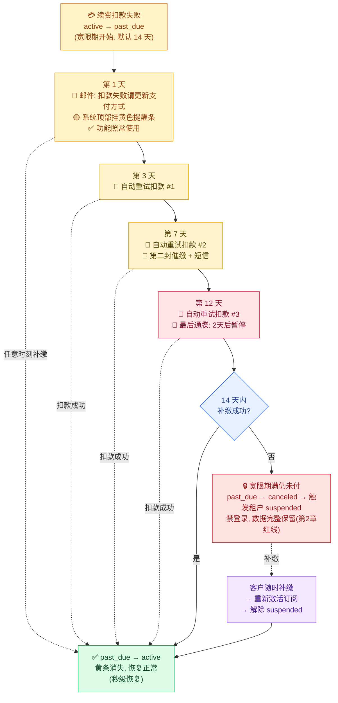

> 🎬 **画面感**（此时星辰科技仍是 Pro 套餐，尚未升级 Enterprise）：星辰科技的信用卡过期，3 月 1 日续费扣款失败（应扣 Pro 月费 ¥100,000）。系统**不封号**——订阅转 `past_due`，给老陈连发邮件，李伟和张敏登录时系统顶部挂一条黄色提醒「贵公司账单逾期，请管理员尽快更新支付方式，14 天后将暂停服务」，但 CRM 功能一切照常。系统在第 3、7、12 天自动重试扣款。老陈第 8 天换了张新卡更新了支付方式，系统重试扣款成功，订阅秒回 `active`，黄条消失。**如果 14 天过去仍未处理**，订阅强制 `canceled` 并发事件让租户生命周期服务把星辰科技置为 `suspended`（禁登录、数据一行不动）。老陈哪怕一个月后才想起来补缴，下一秒全员恢复——数据始终在。

### 8.5.3 几个关键设计参数

| 参数 | 云客 CRM 取值 | 设计考量 |
| --- | --- | --- |
| **宽限期长度** | 14 天 | 太短挽回不及时（客户没看到邮件就被封了），太长平台垫资风险大。Enterprise 可谈到 30 天 |
| **重试节奏** | 第 3 / 7 / 12 天 | 用「递增间隔」而非天天重试——避免频繁触发银行风控把卡拉黑，也给客户换卡留时间 |
| **重试期间能否使用** | ✅ 全功能可用 | 挽留优先。宽限期内封功能会激怒本来愿付的客户 |
| **谁能看到逾期提醒** | 全员看黄条，但只 owner/billing 能操作支付 | 让团队感知压力（催 IT 处理），但权限隔离（详见第 7 章）|

> 📌 **宽限期 vs 暂停 vs 销毁，三道关别搞混**：
> - **宽限期（past_due）**：欠着钱，但还能用。挽留窗口。本章管。
> - **暂停（suspended）**：禁登录，数据完整保留。可逆。第 2 章管（本章只负责「长期逾期→发事件触发暂停」）。
> - **销毁（purged）**：数据真正删除，不可逆，合规红线。第 14 章管。
> 三者是「逐级加重」的递进，绝不能跳级——尤其「暂停」和「销毁」之间隔着法定的数据保留期。

---

## 8.6 套餐变更如何联动功能开关（衔接第 10 章）

### 8.6.1 一个变更，下游全部跟着动

套餐变更（升级/降级/取消/逾期）不是孤立事件——它会像多米诺骨牌一样推动下游一连串系统响应。本章负责**发出信号**，下游各系统负责**各自响应**。这就是 8.2.3 节那行 `eventBus.publish(...)` 的威力。

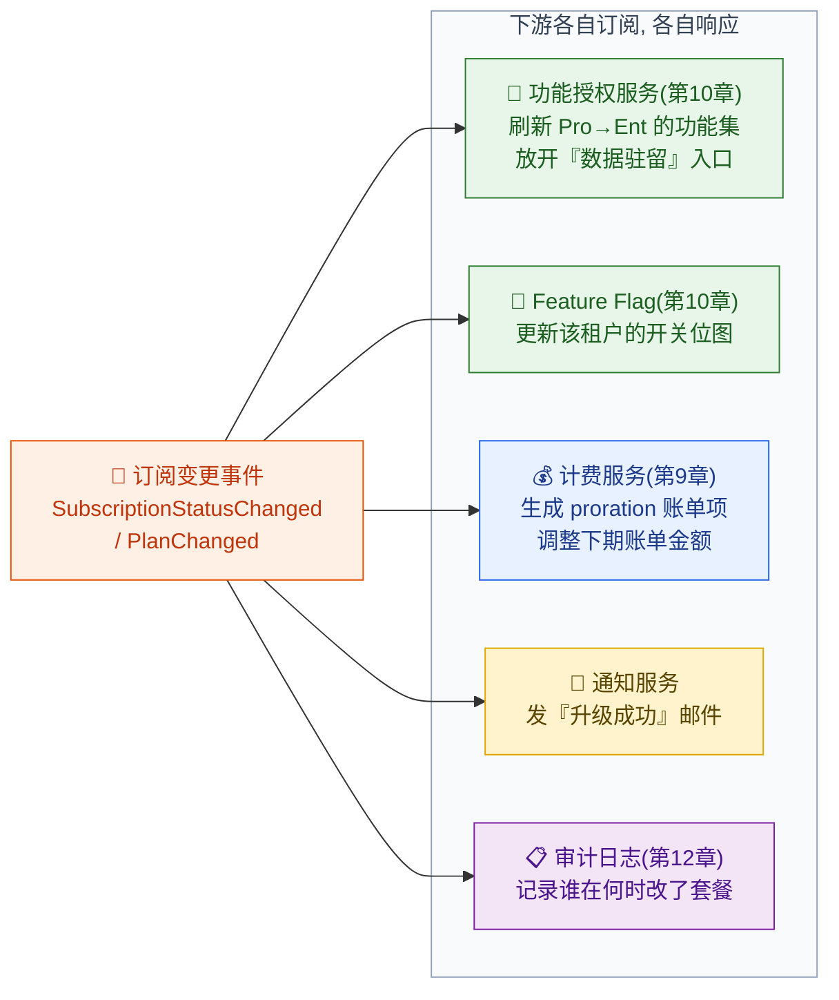

### 8.6.2 本章和第 10 章的精确边界

这是必须划清的一条线，否则两章会写重：

| 职责 | 谁负责 | 具体内容 |
| --- | --- | --- |
| **套餐里『包含』哪些功能** | **本章（第 8 章）** | `plan_entitlement` 表声明 Pro 包含高级报表、批量导出等 |
| **套餐变更时『刷新』功能集** | 本章发事件 → 第 10 章消费 | 订阅服务喊一嗓子，授权服务去更新该租户的「可用功能视图」|
| **运行时『这一刻能不能用』的检查** | **第 10 章** | 李伟点「批量导出」时，授权服务实时判断当前套餐是否包含该功能 |
| **配额超限的拦截** | **第 10 章** | API 调用超过 10 万次/月时的限流拦截 |

> 🎬 **画面感（联动的全过程）**：4 月 15 日老陈把星辰科技从 Pro 升到 Enterprise，点确认那一刻：
> 1. **订阅服务**（本章）：改 `plan = enterprise`，发 `PlanChanged` 事件。
> 2. **功能授权服务**（第 10 章）：收到事件，把星辰科技的「可用功能集」从 Pro 的集合刷新成 Enterprise 的集合——多出了 SSO、数据驻留、自定义审计日志期限等。
> 3. **李伟的浏览器**：原本灰着的「数据驻留区域」入口，刷新后亮起来可以点了。
>
> 整个过程，订阅服务**根本不知道下游有功能授权服务、计费服务、邮件服务的存在**——它只发事件。这种解耦让「加一个新的下游响应」（比如「升级到 Enterprise 自动通知销售跟进」）只需新增一个事件订阅者，不动订阅服务一行代码。**至于功能开关怎么存、运行时怎么查得快，全部交给第 10 章。**

---

## 8.7 三个高频踩坑（实战提醒）

把工程上反复出事的几个点单独拎出来，每个都对应真实事故：

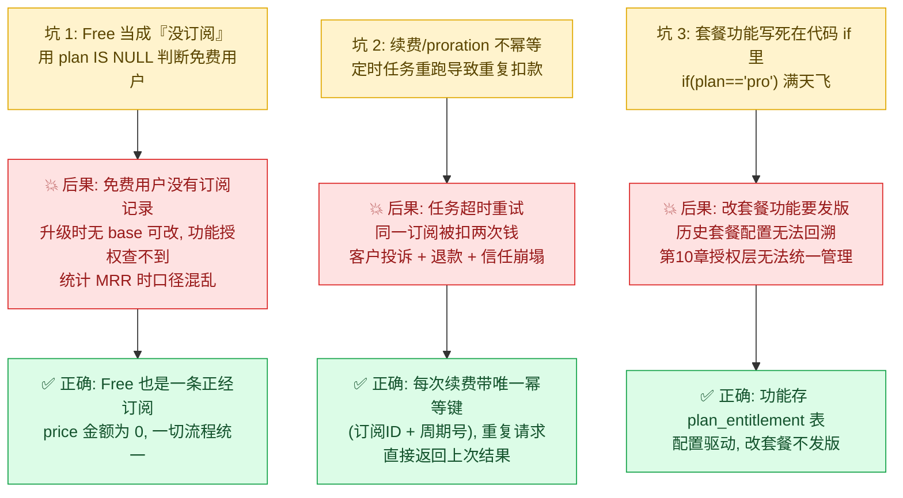

第 2 个坑——**续费/proration 的幂等性**——是订阅系统里最该警惕的。续费扫描任务可能因为超时被重试，proration 计算可能因为网络抖动被重发。如果不做幂等，星辰科技就会被扣两次 ¥100,000（Pro 月费）。做法是给每次扣款操作一个**幂等键（idempotency key：一个唯一标识一次操作的字符串，系统保证同一个键的操作只真正执行一次）**：

```java
// 续费扣款必须幂等：用「订阅ID + 周期序号」作幂等键，重复请求直接返回首次结果
public ChargeResult renew(Subscription sub) {
    // 周期序号唯一标识这是『第几次续费』，重跑任务不会生成新键
    String idempotencyKey = sub.getId() + ":renewal:" + sub.getCurrentPeriodSeq();

    // 计费服务(第9章)用这个键做去重：同键的扣款只会真正发起一次
    return billingService.charge(
        sub.getTenantId(),
        sub.calcRenewalAmount(),   // 500 座席 × Pro 单价 = ¥100,000
        idempotencyKey             // ← 幂等性的关键
    );
}
```

> 📌 幂等是分布式系统的基本功，在「算钱」的链路上更是底线。这里只点到订阅侧如何生成幂等键，**具体的扣款去重、对账、发票生成是第 9 章计费引擎的职责**。

---

## 8.8 把全章串起来：星辰科技的订阅一生

最后用星辰科技这一年的订阅经历，把本章所有概念串成一条线：

```mermaid
flowchart LR
    A["1月: 注册<br/>Pro 14天试用<br/>trialing"]
    B["1月中: 老陈绑卡<br/>首扣成功<br/>trialing → active"]
    C["2/1: 正常续费<br/>Pro ¥100,000<br/>保持 active"]
    E["3/1: 卡过期扣款失败<br/>active → past_due<br/>(14天宽限期)"]
    F["3/8: 老陈换卡<br/>重试扣款成功<br/>past_due → active"]
    D["4/15: 升级 Enterprise(演示)<br/>proration 补 ¥40,000<br/>active(套餐切换)"]
    G["5/1起: 按 Enterprise<br/>¥175,000 续费<br/>保持 active"]

    A --> B --> C --> E --> F --> D --> G

    style A fill:#fff3cd,stroke:#e0a800,color:#5a4500
    style B fill:#dcfce7,stroke:#16a34a,color:#14532d
    style C fill:#e7f1ff,stroke:#2563eb,color:#1e3a8a
    style E fill:#fef3c7,stroke:#d97706,color:#92400e
    style F fill:#dcfce7,stroke:#16a34a,color:#14532d
    style D fill:#fde7f3,stroke:#c2185b,color:#880e4f
    style G fill:#e8f5e9,stroke:#2e7d32,color:#1b5e20
```

这一条线，把 Plan 建模、订阅状态机、proration、续费、逾期挽留、功能联动全部走了一遍——而每一步的「状态变化」都在发事件，驱动着第 9 章的计费和第 10 章的功能授权。**订阅服务是商业化的『中枢神经』：它本身不算钱、不开功能，但它一举一动，钱和功能都跟着动。**

> 📌 **关于这条时间线的两点说明**：① 续费/逾期挽留（2/1、3/1）都发生在 4/15 升级**之前**，此时星辰科技仍是 Pro，扣款按 Pro 月费 ¥100,000；升级后从 5/1 起才按 Enterprise 月费 ¥175,000 续费——顺序理清才不会出现「升级后又按旧 Pro 价续费」的矛盾。② 4/15 那次升 Enterprise 是为了讲透 proration 的**演示场景**；星辰科技在全篇后续章节（隔离模式 Pool/Bridge、合规等）的**正式主线身份仍是 Pro 套餐**，真正的 Enterprise/Silo 大客户是蓝鲸集团。

---

## 本章小结

1. **套餐要分三层建模：Plan / Price / Entitlement**。Plan 是给人看的「商品」，Price 是「一种付钱方式」（订阅冻结 `price_id` 实现价格锁定），Entitlement 声明「包含哪些功能」。**绝不能把套餐写成一个 `plan` 字符串字段 + 满天飞的 `if`**——价格会变、功能会调、历史要冻结，三层模型才扛得住。金额一律用「分」存整数，下架套餐 `is_active=false` 而非删除。

2. **订阅生命周期是本章核心状态机：`trialing → active → past_due → canceled → expired`**。三个最易错的语义要刻进脑子——`canceled` 默认是「主动期末取消，用到期末」不是立刻停服（但 `past_due` 强制取消那一种 `canceled` 无已付周期，随暂停立即停服，用 `cancel_reason` 区分二者）；`past_due` 是「挽留窗口」不是立刻封号；`expired` 是「软终点数据保留」不是硬删除。状态跳转用「允许跳转表 + 守卫函数」从代码层焊死，每次合法跳转发领域事件驱动下游。

3. **订阅状态机 ≠ 租户生命周期状态机（第 2 章）**。前者是「这笔买卖的合同状态」（细、快），后者是「整家公司的存活状态」（粗、慢）。两者通过事件解耦联动：订阅长期逾期/过期 → 发事件 → 租户生命周期服务决定是否 `suspended`。谁也不直接改对方状态。

4. **升级和降级的处理逻辑完全不同**。升级 = **立即生效 + proration 立即补差价**（净补 = 月差价 × 剩余天数比例 × 座席数，星辰科技月中 Pro→Ent 演示：500 座席补 ¥40,000）；降级 = **预约 + 期末生效**（写 `pending_plan`，期末执行，生效前可撤销，且必须先检查座席是否超新套餐上限）。proration 计算「先乘后除」减少整数精度损失。

5. **逾期处理是一套催缴挽回（dunning）流程**，目的是减少非自愿流失：扣款失败 → `past_due` + 宽限期（默认 14 天）+ 挂黄条 + 递增节奏重试扣款（第 3/7/12 天）+ 多渠道提醒。宽限期内全功能可用，补缴秒级恢复；宽限期满才升级到租户 `suspended`（数据完整保留）。**宽限期 / 暂停 / 销毁是三道逐级加重的关，不能跳级。**

6. **套餐变更通过领域事件联动下游**：订阅服务只管发 `SubscriptionStatusChanged` / `PlanChanged` 事件，功能授权（第 10 章）、计费（第 9 章）、通知、审计各自订阅各自响应。**本章负责「套餐包含什么 + 变更时发信号」，运行时「这一刻能不能用 + 配额超限拦截」是第 10 章的事。** 订阅服务是商业化的中枢神经——自己不算钱不开功能，但一举一动钱和功能都跟着动。

> 下一章（第 9 章）接着讲「钱」：这个月星辰科技到底用了多少座席、超了多少、本章产生的 proration 差价怎么进账单、发票怎么开、怎么对账。本章建立的「订阅」，是第 9 章计费的输入。

---

## 参考来源

- **Stripe Docs — Subscriptions & Proration**（订阅生命周期、按比例计费的工业级参考实现，本章 Plan/Price 分层与 proration 公式即源于此思路）：<https://docs.stripe.com/billing/subscriptions/prorations>
- **Stripe Docs — Smart Retries & Dunning**（扣款失败后的智能重试与催缴挽回，对应本章 8.5 逾期处理）：<https://docs.stripe.com/billing/revenue-recovery/smart-retries>
- **AWS SaaS Factory — Pricing and Packaging Strategies for SaaS**（套餐分档、座席/用量计费模型的业务与架构权衡）：<https://aws.amazon.com/blogs/apn/pricing-and-packaging-strategies-for-saas/>
- **Chargebee — Subscription Lifecycle & States**（订阅状态机 trialing/active/past_due/canceled 的标准定义与状态流转）：<https://www.chargebee.com/docs/2.0/subscription-status.html>
