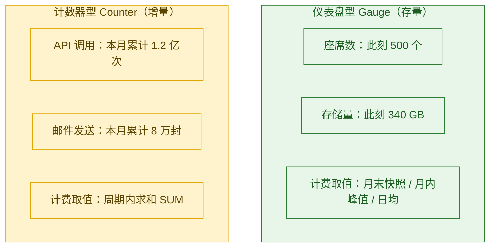
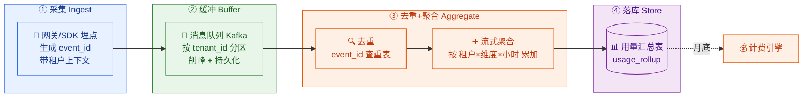
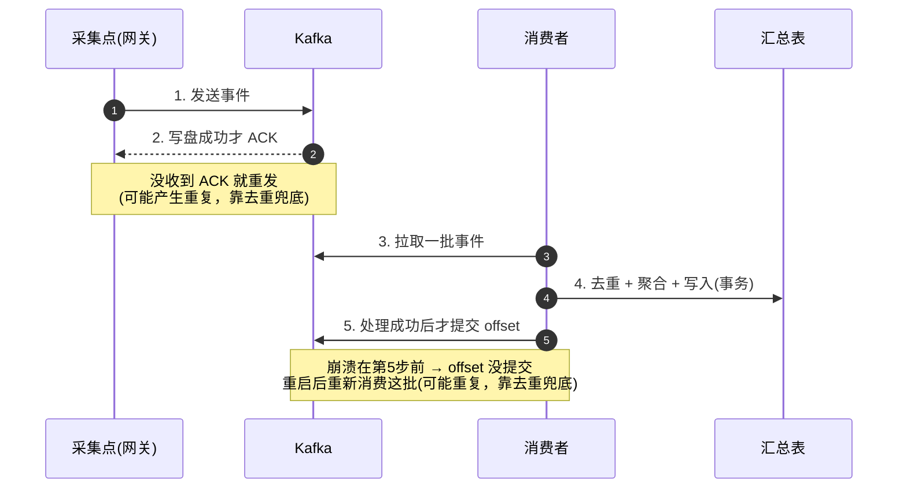
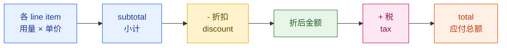
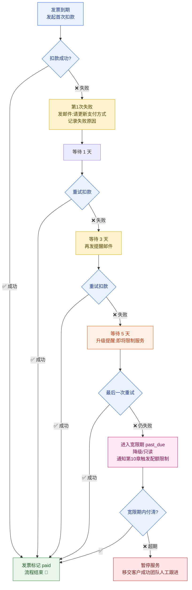
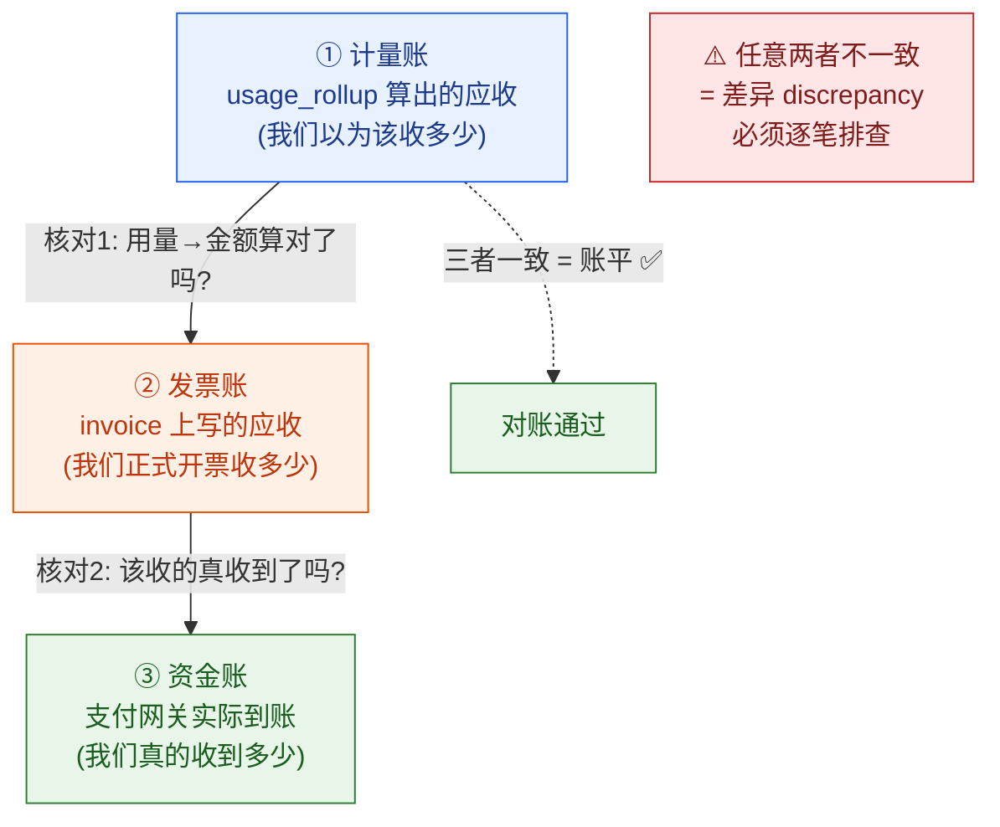
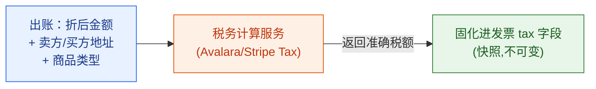
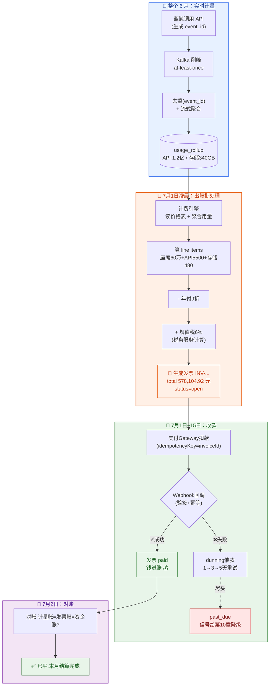

# 第 9 章 · 计量与计费

> 上一章我们把「订阅」这条线讲透了：星辰科技选了 Pro 套餐、签了一年合同、中途从 300 座席升到 500 座席要按比例补差价（proration）。订阅解决的是**「卖什么、卖给谁、卖多久」**。但有一个更根本、更要命的问题它没回答：**到了月底，系统凭什么知道该向星辰科技收多少钱？这笔钱又是怎么从老陈的信用卡里真正划走的？**
>
> 这就是本章的主题——**计量（Metering）与计费（Billing）**。它是 SaaS「商业即架构」这句话最赤裸的体现：你怎么收钱，直接编码进了系统设计里。一行计量事件丢了，就是一笔钱凭空蒸发；一次重复扣款，就是一个投诉工单加一次退款。这一章我们就把「**从一次 API 调用，到老陈收到一张发票、钱划进云客账户**」这条完整的钱链路，一节一节铺开。

---

## 本章导读

读完本章，你应该能清晰回答下面这些问题：

- **计量（Metering）到底在量什么？** 座席数、API 调用数、存储量、邮件发送数……这些「用量」是怎么被一条条采集成「计量事件」的？
- 计量事件管道为什么是 SaaS 里最难的「不丢不重」问题之一？**30 万 QPS 的洪流下，怎么保证一个事件既不丢、也不重复计费？** 幂等、去重、聚合分别在哪一层做？
- 三种主流定价模型——**按座席（per-seat）、按量（usage-based）、分层（tiered）**——账单到底怎么算？给我看真实数字。
- 老陈的信用卡扣款是怎么发生的？**扣款失败了怎么办**？什么是 dunning（催款重试）？为什么不能简单地「失败就停服」？
- 一张**发票（Invoice）**长什么样？里面的行项目（line item）、税、折扣是怎么拼出来的？
- 平台财务每个月怎么**对账（reconciliation）**？计量系统算出来的钱、发票上写的钱、支付网关实际收到的钱，这三个数对不上怎么办？
- 跨境卖软件绕不开的**税**（增值税 VAT / 销售税 Sales Tax）该谁算、在哪算？

> 🧭 **本章在全景里的位置**：订阅（第 8 章）定义了「计费规则」→ 计量与计费（本章）执行「算账与收款」→ 功能授权（第 10 章）执行「配额超限拦截」。
> 边界划清楚：**套餐与订阅状态机**（试用→活跃→过期→取消的流转）是第 8 章；**配额限制与超限拦截**（用量超了就 429 拒绝请求）是第 10 章。本章只管两件事：**把用量数清楚（计量），把账算对、把钱收上来（计费）**。

---

## 9.1 先把「计量」和「计费」拆成两件事

工程师最容易犯的第一个错误，就是把「计量」和「计费」混成一坨。它们是**完全不同的两个系统**，关注点、技术挑战、容错要求都不一样。先用一句话各自定位：

> 📖 **计量（Metering，用量计量：实时地、一条一条地把"谁用了什么、用了多少"记录下来）**。它是个**高吞吐、写多读少、要求不丢不重**的数据采集系统。它不关心钱，只关心「事实」——星辰科技这个月调了 1.2 亿次 API、存了 340 GB 数据、发了 8 万封邮件。

> 📖 **计费（Billing，计费/算账：周期性地把计量出来的用量，套上定价规则，算成一个个金额，最终生成账单和发票）**。它是个**低吞吐、读多算多、要求算得准、可审计、可对账**的金融系统。它把「事实」翻译成「钱」。

为什么必须拆开？看一个对比就懂了：

```mermaid
flowchart LR
    subgraph M["📊 计量系统 Metering"]
        direction TB
        M1["关注：事实<br/>用了多少"]
        M2["吞吐：极高<br/>30万 QPS 量级"]
        M3["容错：不丢不重<br/>每条都是钱"]
        M4["技术栈：消息队列<br/>+ 流式聚合"]
    end
    subgraph B["💰 计费系统 Billing"]
        direction TB
        B1["关注：金额<br/>该收多少"]
        B2["吞吐：低<br/>每月跑一次"]
        B3["容错：算得准<br/>可审计可对账"]
        B4["技术栈：定时任务<br/>+ 事务数据库"]
    end
    M -- "月底交付聚合用量" --> B
    style M fill:#e7f1ff,stroke:#2563eb,color:#1e3a8a
    style B fill:#fff0e6,stroke:#e65100,color:#bf360c
    style M1 fill:#e7f1ff,stroke:#2563eb,color:#1e3a8a
    style M2 fill:#e7f1ff,stroke:#2563eb,color:#1e3a8a
    style M3 fill:#e7f1ff,stroke:#2563eb,color:#1e3a8a
    style M4 fill:#e7f1ff,stroke:#2563eb,color:#1e3a8a
    style B1 fill:#fff0e6,stroke:#e65100,color:#bf360c
    style B2 fill:#fff0e6,stroke:#e65100,color:#bf360c
    style B3 fill:#fff0e6,stroke:#e65100,color:#bf360c
    style B4 fill:#fff0e6,stroke:#e65100,color:#bf360c
```



一句话记住：**计量是「数数」，计费是「算账」。** 数数要快要全（一个洪峰下不能丢），算账要准要可查（一分钱都不能错）。两者中间靠「聚合用量（aggregated usage）」交接——计量系统把一个月里几亿条原始事件，压缩成「星辰科技 6 月：API 1.2 亿次、存储 340 GB」这样几行汇总数据，递给计费系统去算钱。

---

## 9.2 计量到底量什么：四类计量维度

云客 CRM 要向租户收钱，得先想清楚「按什么收」。这就是**计量维度（metering dimension）**。结合我们三个租户的真实场景，主要有四类：

| 计量维度 | 量的是什么 | 谁会被这个计费 | 采集难点 |
| --- | --- | --- | --- |
| **座席数 Seats** | 当前有多少个付费用户名额 | 所有套餐的基础收费项 | 简单——查 membership 表数人头 |
| **API 调用数** | 调了多少次开放 API | 蓝鲸集团（重度集成对接 ERP） | 高吞吐，要在网关侧实时采集 |
| **存储量 GB** | 客户/附件/报表占了多少存储 | 数据量大的租户超出套餐免费额度后 | 是「存量」不是「增量」，要定期快照 |
| **邮件发送数** | 通过平台发了多少营销/通知邮件 | 用了营销自动化模块的租户 | 高吞吐，事件型 |

这四类又能归成**两种本质不同的形态**，这个区分非常关键，决定了采集和聚合方式：

- **存量型（gauge，仪表盘型：某一时刻的"当前值"）**：典型是座席数、存储量。它回答「**此刻**有多少」。座席数今天是 500，不代表昨天是 500。计费时通常取**周期内的某个代表值**（如月末快照值，或月内峰值，或按天加权平均）。
- **增量型（counter，计数器型：周期内累计发生了多少次）**：典型是 API 调用数、邮件发送数。它回答「这一整个月**一共**发生了多少次」，是把一条条事件**累加**出来的。



**为什么要分清这两种？** 因为它们的「不丢不重」要求点完全不同：

- 增量型怕**重复**——同一次 API 调用如果被记了两次，星辰就被多收了一次钱。所以增量型的命门是**去重（幂等）**。
- 存量型怕**取错时点**——你是用月末值、月初值还是峰值收钱？这是个**业务定义**问题，工程上要保证「快照」按约定的时点准确采集。

下面我们把最难的增量型（高吞吐、要去重）单独拎出来，讲它的事件管道。座席这种存量型反而最简单，9.4 节计费时顺带讲。

---

## 9.3 计量事件管道：30 万 QPS 下怎么做到「不丢不重」

这是本章工程含量最高的一节。增量型计量（API 调用、邮件发送）在峰值 30 万 QPS 下，每一秒都在产生几十万条「计量事件」。这些事件每一条都对应着真金白银，丢了少收钱、重了多收钱招投诉。我们要设计一条**既快、又不丢、又不重**的管道。

### 9.3.1 一条计量事件长什么样

先定义最小的数据单元。一条计量事件（metering event）就是「**某租户、某时刻、用了某种资源、用了多少**」：

```json
{
  "event_id": "evt_9f8a7b6c5d4e",   // 全局唯一 ID（幂等去重的关键，由生产端生成）
  "tenant_id": "tenant_lanjing",     // 哪个租户（蓝鲸集团）—— 计量必须带租户上下文
  "metric": "api_call",              // 计量维度：API 调用
  "quantity": 1,                     // 这次用了多少（一次调用 = 1）
  "timestamp": "2026-06-09T10:23:45.123Z", // 事件发生时间（注意不是处理时间）
  "metadata": {                      // 可选：用于明细对账和排障
    "endpoint": "/api/v1/customers",
    "user_id": "user_chen"
  }
}
```

> ⚠️ 两个字段决定生死：
> - **`event_id`（事件唯一 ID）**：必须由**生产端（采集点）生成**，而不是消费端。只有这样，同一条事件无论被重发几次，ID 都一样，下游才能据此去重。这是整条管道幂等性的锚点。
> - **`timestamp`（事件时间）**：用「事件**发生**的时间」而不是「被处理的时间」。因为消息可能延迟几秒甚至几分钟才被处理，如果按处理时间归月，一个 6 月 30 日 23:59 的调用很可能被错误地算进 7 月账单。这就是流处理里著名的 **event-time vs processing-time（事件时间 vs 处理时间）** 问题。

### 9.3.2 管道的四个阶段

整条管道分四个阶段，每个阶段解决一个特定问题。先看全貌图：



**① 采集 Ingest——绝不能拖慢业务请求。**
当蓝鲸的系统调用 `/api/v1/customers` 时，网关在转发请求的同时，「顺手」产生一条计量事件。这里有个铁律：**计量采集必须是异步、非阻塞的**。绝不能因为计量系统慢了，就把蓝鲸的正常业务请求卡住。所以采集点只做一件事——把事件**扔进本地内存缓冲，立刻返回**，由后台线程批量发往消息队列。即使计量管道整个挂了，业务请求也照常成功（顶多这段时间的用量没算上，事后还能补，但业务绝不能受影响）。

> ⚠️ **这里要诚实划清「不丢」的边界**：本章反复承诺的「不丢」，准确地说是**「事件一旦写进 Kafka 就不丢」的端到端保证**（靠下面 9.3.3 的持久化 + at-least-once）。而采集点的「本地内存缓冲」是一个**有损窗口**——如果进程在缓冲刷到 Kafka 之前崩溃，这段内存里还没发出去的事件确实会丢。这是「采集绝不阻塞业务」换来的工程取舍：要么用同步发送/本地预写日志（WAL）把窗口也保护起来（代价是写入变重），要么承认在计量场景下这个毫秒级窗口的少量丢失是可接受的。所以「不丢」不是从「API 调用瞬间」就成立的绝对保证，而是从「事件落进 Kafka」起成立。

**② 缓冲 Buffer——用消息队列削峰、做持久化兜底。**
30 万 QPS 直接打到数据库会被打垮。中间必须有一层**消息队列（如 Kafka）**做缓冲。它有三个作用：(1) **削峰**——洪峰来了先在队列里排着，下游按自己的节奏慢慢消费；(2) **持久化兜底**——事件一旦写进 Kafka 就落盘了，下游消费者就算崩溃重启，消息还在，不会丢（这是「不丢」的基础保障）；(3) **按 `tenant_id` 分区（partition）**——同一个租户的事件进同一个分区，保证单租户内事件有序，且方便按租户并行消费。

**③ 去重 + 聚合 Aggregate——这是「不重」和「压缩」的核心。**
消费者从队列里拉出事件后做两件事：先**去重**（用 `event_id` 查一张「已处理事件表」，见过就丢弃），再**聚合**（把同一租户、同一维度、同一时间窗口的 quantity 累加起来）。聚合是为了**压缩数据量**——几亿条原始事件，聚合成「蓝鲸 × api_call × 2026-06-09 10:00 这个小时 = 45000 次」这样的汇总行，存储和后续计费的压力立刻降几个数量级。

**④ 落库 Store——存成可供计费查询的汇总表。**
聚合结果写进一张 `usage_rollup`（用量汇总）表。月底计费时，计费引擎只要按租户、按维度、按计费周期把这张表里的汇总值一加，就拿到了「蓝鲸 6 月一共调了 1.2 亿次 API」这个数。

### 9.3.3 「不丢」怎么保证：至少一次投递 + 持久化

这里说的「不丢」，指的是**事件进入 Kafka 之后的端到端不丢**（采集点内存缓冲那段有损窗口见 9.3.2 的边界说明）。核心思路是 **at-least-once delivery（至少一次投递：宁可重复，也绝不丢失）**。从「写进 Kafka」起，每个环节都要保证「我收到的东西，在我确认处理完之前，不会消失」：



关键点：**offset（消费位点）必须在数据真正落库之后才提交**。如果消费者拉了一批事件，还没来得及写库就崩溃了，因为 offset 没提交，重启后会重新拉到这批事件——这样就「不丢」。但代价是**可能重复处理**，所以「不丢」必然带来「可能重」，「不重」就只能靠下一节的去重来兜底。

> 💡 这里揭示了一个深刻的工程权衡：**精确一次（exactly-once）在分布式系统里极难且昂贵**。业界主流做法不是追求「精确一次投递」，而是「**至少一次投递 + 业务幂等去重**」，用一个简单的去重表，把「至少一次」在效果上变成「恰好一次」。

### 9.3.4 「不重」怎么保证：幂等去重

去重的本质是：**同一个 `event_id` 只允许被计入一次**。最直接的实现——一张去重表 + 唯一索引：

```sql
-- 去重表：记录所有「已经处理过」的事件 ID
CREATE TABLE processed_events (
    event_id     VARCHAR(64) PRIMARY KEY,   -- 主键 = 唯一约束，重复插入会失败
    tenant_id    VARCHAR(64) NOT NULL,
    processed_at TIMESTAMP   NOT NULL DEFAULT NOW()
);
-- 实务中只保留近 7~30 天（计量延迟窗口内）的记录，过期清理，否则表会无限膨胀
```

```java
/**
 * 处理一条计量事件：先去重，再聚合。整个操作放在同一个数据库事务里，保证原子性。
 */
@Transactional
public void processEvent(MeteringEvent event) {
    // 1. 尝试把 event_id 插入去重表。
    //    如果这条事件之前已经处理过，主键冲突会抛异常 → 说明是重复，直接跳过。
    int inserted = dedupMapper.tryInsert(event.getEventId(), event.getTenantId());
    if (inserted == 0) {
        // 重复事件，已经算过账了，丢弃，不再累加（这就是「不重」的兜底）
        log.debug("duplicate metering event skipped, eventId={}", event.getEventId());
        return;
    }

    // 2. 不是重复事件，把用量累加进汇总表。
    //    按「租户 × 维度 × 小时」这个粒度做 upsert（有则累加，无则新建）。
    String timeBucket = truncateToHour(event.getTimestamp()); // 截断到小时，作为聚合窗口
    usageRollupMapper.upsertAndAdd(
        event.getTenantId(),
        event.getMetric(),
        timeBucket,
        event.getQuantity()  // 累加 quantity
    );
    // 事务提交：去重记录和用量累加要么一起成功，要么一起回滚，绝不会「去重记了但用量没加」
}
```

这里的精髓在于**把去重和聚合放进同一个事务**。如果去重表插入成功了，但聚合还没写就崩溃了，事务回滚后去重记录也没了——下次重发这条事件会被重新当作「新事件」正常处理，不会因为「以为处理过了」而把这次用量永久丢掉。**去重表的写入和用量的累加必须同生共死。**

> 🏦 **代入蓝鲸集团**：蓝鲸用云客 CRM 的开放 API 对接自己内部的 ERP 系统，每天产生数百万次 API 调用（约 400 万/天，对应月 1.2 亿次，与本章计费基数一致）。某天蓝鲸侧网络抖动，SDK 自动重试，导致同一批调用的计量事件被发了两遍。但因为每条事件的 `event_id` 在生产端就固定了，重发的那批在去重表里全部命中主键冲突、被丢弃——蓝鲸月底的账单一分钱没多算。这就是 `event_id` 由生产端生成的价值。

---

## 9.4 计费引擎：三种定价模型怎么算账（带真实数字）

计量系统月底交出了聚合用量。现在轮到计费引擎登场，把用量套上**定价模型（pricing model）**，算成具体金额。SaaS 行业有三种主流定价模型，我们用三个租户分别代入，**每种都给你算到具体的钱**。

### 9.4.1 模型一：按座席 per-seat（星辰科技）

> 📖 **按座席计费（per-seat / per-user pricing：每个用户名额收固定月费，用了几个座席就乘几）**。这是 To B SaaS 最经典的模型，逻辑最简单：**单价 × 座席数**。

星辰科技的账单（Pro 套餐，单价 120 元/座席/月，本月用了 500 个座席）：

```
账单项                       数量      单价          金额
──────────────────────────────────────────────────────
Pro 套餐座席费              500 座席   120 元/座席    60,000 元
──────────────────────────────────────────────────────
                                       小计           60,000 元
```

简单吧？但有两个工程细节：

1. **座席数取哪个值？** 前面说过座席是「仪表盘型」。月内李伟入职、又有两个销售离职，座席数一直在变。常见取法有三种：**月末快照值**（结算日那一刻有几个算几个）、**月内峰值**（这个月任意时刻达到的最高座席数，多数 SaaS 采用，对平台有利）、**按天加权平均**（最公平但最复杂）。这是**业务定义**，不是技术问题——但定下来后，计量侧就要按这个口径采集。
2. **月中变更座席要不要立刻收钱？** 比如星辰 6 月 15 日从 300 座席升到 500，多出来的 200 座席的半个月费用，要按比例补算——这就是上一章讲的 **proration（按比例计费）**，由订阅系统在变更时即时产生一笔补差账单，本章不再展开（详见第 8 章）。

### 9.4.2 模型二：按量 usage-based（蓝鲸集团的 API 调用）

> 📖 **按量计费（usage-based / consumption pricing：用多少付多少，像水电费一样按实际用量收）**。它把成本和使用直接挂钩，重度用户多付、轻度用户少付，近年越来越流行（典型如云厂商、API 类产品）。

蓝鲸集团除了座席费，还重度使用开放 API。假设套餐内含 1000 万次/月免费额度，超出部分按 **0.5 元/万次** 收费，本月共调用 1.2 亿次：

```
账单项                        数量              单价              金额
──────────────────────────────────────────────────────────────────
API 调用(超出免费额度部分)
  本月总调用                  120,000,000 次
  - 套餐免费额度              -10,000,000 次    (0 元)            0 元
  = 计费调用量                110,000,000 次
  换算成「万次」              11,000 万次       0.5 元/万次       5,500 元
──────────────────────────────────────────────────────────────────
                                                小计              5,500 元
```

按量计费的工程要点：**计费口径必须和计量口径严格一致**。计量系统聚合出的是「次」，计费换算成「万次」，单位换算和取整规则（不足一万次怎么算？向上取整还是按实际比例？）必须写死在定价规则里，不能由代码随手决定，否则对账时数对不上。

### 9.4.3 模型三：分层 tiered（存储计费）

> 📖 **分层计费（tiered pricing：用量落在不同区间，每个区间单价不同，像个人所得税的累进税率）**。它和按量的区别是——单价不是恒定的，用得越多，**超出部分**的单价可能更便宜（或更贵）。

这里要分清两个极易混淆的概念。**先把「免费额度」单独拎出来**：免费额度（如套餐含 100 GB 免费）是计费前先扣掉的「第一层」，graduated 和 volume 处理的都是**扣掉免费额度之后的计费用量**，它们的区别只在「这部分计费用量怎么套单价」：

- **阶梯式 graduated（累进式，像个税）**：计费用量被切成多段，**每段用各自的单价**，最后加总。
- **量价式 volume（一口价式）**：看用量**总共落在哪一层**，**整个用量都用那一层的单价**（注意是整个用量，不再分段）。

我们以蓝鲸的存储计费为例（套餐免费含 100 GB），用 **graduated 累进式** 定价，本月共用 340 GB：

| 分层区间 | 单价 | 落在本层的用量 | 本层金额 |
| --- | --- | --- | --- |
| 0 ~ 100 GB | 免费 | 100 GB | 0 元 |
| 100 ~ 500 GB | 2 元/GB | 240 GB（即 100→340 这段）| 480 元 |
| 500 GB 以上 | 1.5 元/GB | 0 GB（没用到这层）| 0 元 |

```
存储费 = 0(前100GB) + 240GB × 2元(100~340这段) = 480 元
```

对比一下，如果用 **volume 量价式**：先扣掉 100 GB 免费额度，剩下 240 GB 总量整体落在「100~500 GB」这一层，**整个 240 GB 全按该层 2 元/GB**（不再分段、不再累进）：

```
存储费(量价式) = 240 GB × 2元/GB = 480 元   ← 本例恰好相同（因为只用到一层）
```

> ⚠️ 这两种在**跨层**时结果差异巨大。比如计费用量 500 GB（已扣掉免费额度后落到第三层）：
> - **累进式**：`400×2 + 100×1.5 = 950 元`（100~500 这段 400 GB 按 2 元，超过 500 的 100 GB 按 1.5 元，每段各算各的）
> - **量价式**：`500×1.5 = 750 元`（整个 500 GB 都按所落层的 1.5 元，一口价）
>
> 选哪种是**定价策略**，但工程上**必须在定价规则里显式声明用哪种算法**，绝不能让计费代码「猜」。这是计费 bug 的高发区。

### 9.4.4 把定价规则数据化，而不是写死在代码里

三种模型看着不同，但工程上有个共同的最佳实践：**定价规则是配置数据，不是代码**。绝不能把「120 元/座席」「0.5 元/万次」这种数字硬编码进 if-else，否则每次调价、每搞一次促销都要发版。正确做法是把定价建模成一张**价格表（price book）**：

```json
{
  "plan_id": "plan_enterprise",
  "currency": "CNY",
  "items": [
    {
      "metric": "seat",
      "model": "per_seat",
      "unit_price": 120,
      "seat_count_strategy": "monthly_peak"     // 座席取月内峰值
    },
    {
      "metric": "api_call",
      "model": "usage",
      "free_quota": 10000000,                    // 套餐免费额度
      "unit_price": 0.5,
      "unit_size": 10000,                        // 每「万次」为计价单位
      "rounding": "ceil"                         // 不足一万次向上取整
    },
    {
      "metric": "storage_gb",
      "model": "tiered",
      "tier_mode": "graduated",                  // 累进式（显式声明！）
      "tiers": [
        { "up_to": 100,  "unit_price": 0 },
        { "up_to": 500,  "unit_price": 2 },
        { "up_to": null, "unit_price": 1.5 }     // null = 无上限
      ]
    }
  ]
}
```

计费引擎读这份配置 + 读计量的聚合用量，套公式算出每个 line item。调价 = 改这张表 + 给租户绑新版本价格表，代码一行不用动。

> 💡 **价格表要做版本管理**。蓝鲸 6 月签的是旧价，7 月平台涨价了——但合同期内蓝鲸必须沿用 6 月签约时的价格表版本（grandfathering，老客户价格保护）。所以租户的订阅上要记录「我绑的是哪个版本的价格表」，而不是永远读最新价。

---

## 9.5 出账与发票：把金额变成一张正式账单

计费引擎算出了金额，下一步是**生成发票（Invoice）**。发票是计费系统的「正式输出」——它是给客户看的、是财务对账的依据、是有法律和税务意义的凭证。

### 9.5.1 一张发票的结构

发票不是一个金额数字，而是一个结构化对象。看蓝鲸集团 6 月的完整发票（综合了前面三种计费）：

```json
{
  "invoice_id": "INV-20260701-lanjing-0001",
  "tenant_id": "tenant_lanjing",
  "tenant_name": "蓝鲸集团",
  "status": "open",                         // 状态：draft草稿→open待付→paid已付→void作废
  "currency": "CNY",
  "billing_period": {                       // 计费周期
    "start": "2026-06-01T00:00:00+08:00",
    "end":   "2026-06-30T23:59:59+08:00"
  },
  "issued_at":  "2026-07-01T02:00:00+08:00", // 出账时间（通常月初凌晨批量跑）
  "due_at":     "2026-07-15T23:59:59+08:00", // 付款截止时间

  "line_items": [                            // 行项目：每一项收费明细
    {
      "description": "Enterprise 套餐座席费",
      "metric": "seat",
      "quantity": 5000, "unit_price": 120,
      "amount": 600000
    },
    {
      "description": "API 调用费(超出免费额度)",
      "metric": "api_call",
      "quantity": 11000, "unit_price": 0.5,  // 11000 万次
      "amount": 5500
    },
    {
      "description": "存储费(累进分层)",
      "metric": "storage_gb",
      "quantity": 240, "unit_price": 2,
      "amount": 480
    }
  ],

  "subtotal": 605980,                        // 小计（税前、折扣前；= 各 line item 之和 600000+5500+480）
  "discount": { "type": "annual_prepay_monthly", "rate": 0.10, "amount": -60598 }, // 年付优惠按月分摊到本月账单（9 折）
  "tax":      { "type": "VAT", "rate": 0.06, "amount": 32722.92 },  // 增值税 6%
  "total":    578104.92,                     // 应付总额 = 小计 - 折扣 + 税

  "amount_paid": 0,
  "amount_due":  578104.92
}
```

发票计算的顺序（**顺序不能乱，否则金额会错**）：



> ⚠️ **税到底加在折扣前还是折扣后？** 几乎所有地区都是**先折扣、后计税**（税基 = 折后金额）。上例：小计 605980 → 折扣后 545382 → 税 = 545382 × 6% = 32722.92 → 总额 578104.92。算反了（先税后折）会导致少收或多收税，是合规问题。

### 9.5.2 出账要幂等：同一个周期只能出一张账单

出账任务（invoice run）通常是月初凌晨的定时批处理，把所有租户跑一遍。这里又是一个幂等问题：**如果定时任务跑了一半挂了，重跑时已经出过账的租户不能再出第二张。**

```java
/**
 * 为某租户的某计费周期生成发票。靠「租户+周期」唯一约束保证幂等。
 */
public Invoice generateInvoice(String tenantId, BillingPeriod period) {
    // 1. 先查：这个租户这个周期是不是已经出过账了？
    Invoice existing = invoiceMapper.findByTenantAndPeriod(tenantId, period);
    if (existing != null) {
        // 已经出过，直接返回原来那张，绝不重复生成（幂等）
        return existing;
    }
    // 2. 拉取该周期的聚合用量 + 该租户绑定的价格表版本
    Usage usage = usageRollupMapper.sumByPeriod(tenantId, period);
    PriceBook priceBook = priceBookService.getBoundVersion(tenantId);

    // 3. 套定价规则算出各 line item → 折扣 → 税 → total
    Invoice invoice = billingEngine.compute(usage, priceBook);

    // 4. 落库。数据库层 (tenant_id, period) 建唯一索引，
    //    即使并发重跑，第二次 insert 会冲突失败，从源头防重复出账。
    invoiceMapper.insert(invoice);  // UNIQUE(tenant_id, period_start, period_end)
    return invoice;
}
```

记住一个原则：**计费链路上的每一个「写」操作（计量去重、出账、扣款）都必须幂等**。因为定时任务会重试、网络会重发、人会手抖点两次——幂等是计费系统的底线，不是加分项。

---

## 9.6 对接支付网关：钱怎么真正划走，失败了怎么办

发票生成了（状态 `open`，待付款）。最后一步——**真的把钱收上来**。这一步要对接**支付网关（Payment Gateway，第三方收款通道：如 Stripe、支付宝、银行，平台不直接碰用户卡号，由它们完成实际扣款）**。

### 9.6.1 为什么必须通过支付网关，且要走 Gateway 层封装

平台自己**绝对不能**存储用户的完整信用卡号——那是 PCI-DSS（支付卡行业数据安全标准）的硬性合规要求，自己存卡号意味着背上巨大的合规和泄漏责任。正确做法是：用户的卡只在支付网关那边，平台手里只拿一个**支付令牌（payment token，代表"某张卡"的一个不可逆引用，拿着它能发起扣款但反推不出卡号）**。

在架构上，所有支付网关的调用都应通过一个**支付 Gateway 层**封装（策略模式），业务代码只面对统一接口，不直接调 Stripe / 支付宝的 SDK。这样既能换支付商不动业务代码，也便于统一做幂等、重试、日志脱敏。

```java
// 支付能力抽象成统一接口，具体支付商（Stripe/支付宝）各自实现
public interface PaymentGateway {
    /**
     * 发起一次扣款。
     * @param idempotencyKey 幂等键，通常用 invoiceId —— 防止同一张发票被扣两次钱
     */
    ChargeResult charge(String paymentToken, Money amount, String idempotencyKey);
}
```

> ⚠️ **幂等键（idempotency key）是支付里最重要的字段**。用 `invoice_id` 作幂等键发起扣款，即使因为网络超时你重试了 3 次，支付网关也只会真正扣一次钱。少了它，一次网络抖动就可能让蓝鲸被划走两次几十万的款——这是会上社会新闻的事故。

### 9.6.2 扣款失败：为什么不能简单「失败就停服」

老陈的公司信用卡可能因为**余额不足、卡过期、银行风控、临时网络故障**等各种原因扣款失败。新手工程师的第一反应是：「扣款失败 → 立刻停掉服务」。这是**灾难性的错误**：

- 大多数失败是**临时性**的（额度临时不够、银行抖动），过两天再试就成功了。
- 一停服，星辰的几百个销售立刻无法工作，老陈会暴怒投诉甚至退订——为了一笔可能两天后就能收到的钱，赶走一个付了一年合同的客户，得不偿失。

正确的做法是 **dunning（催款重试：扣款失败后，按一个递增的时间表多次重试，并配合邮件/短信提醒客户更新支付方式，是一套「温柔追款」流程）**。

### 9.6.3 Dunning 催款重试流程



设计要点：

1. **重试间隔递增**（1 天 → 3 天 → 5 天），给客户更新支付方式的时间，也避开「卡刚被风控、立刻再试又被拒」的无效重试。
2. **重试要带智能**：如果失败原因是「卡已过期」这种**永久性错误**，重试没意义，应直接通知客户换卡而非傻等；如果是「余额不足」这种**临时性错误**，才适合按时间表重试。区分**硬失败（hard decline）和软失败（soft decline）**是 dunning 的精髓。
3. **「降级/限制服务」是第 10 章的事**：dunning 走到尽头要降级时，本章只负责把账单状态置为 `past_due` 并发出信号，**真正的「只读限制 / 配额拦截 / 拒绝写请求」由第 10 章的功能授权与配额系统执行**。本章不越界。

### 9.6.4 用 Webhook 接收异步扣款结果

扣款不一定是同步返回的。很多支付方式（如银行转账、某些信用卡 3D 验证）是**异步**的——你发起扣款，网关先返回「处理中」，几秒到几分钟后再通过 **Webhook（回调通知：支付网关主动 POST 一个请求到你预留的 URL，告诉你这笔交易最终成功还是失败）** 告诉你结果。

```java
// 接收支付网关的异步扣款结果回调
@PostMapping("/webhooks/payment")
public ResponseEntity<Void> onPaymentWebhook(@RequestBody String payload,
                                             @RequestHeader("X-Signature") String sig) {
    // 1. 验签！Webhook 是公网可访问的，必须用网关给的密钥验证签名，
    //    否则任何人都能伪造一个「扣款成功」骗过你 —— 这是安全命门。
    if (!paymentGateway.verifySignature(payload, sig)) {
        return ResponseEntity.status(401).build();
    }
    PaymentEvent event = parse(payload);

    // 2. 幂等处理：同一个 Webhook 可能被支付网关重复推送，
    //    用 event.id 去重，已处理过的直接返回 200（让对方别再重推）。
    if (webhookDedup.seen(event.getId())) {
        return ResponseEntity.ok().build();
    }

    // 3. 在同一事务里「更新发票状态 + 标记已处理」，保证两者同生共死
    //    （和 9.3.4 去重+聚合同事务的范式一致：要么都成功，要么都回滚）。
    processWebhookEvent(event);  // 内部 @Transactional：先 markPaid/recordFailure，再 markSeen
    return ResponseEntity.ok().build();  // 必须回 200，否则网关会一直重推
}

/**
 * 在一个事务里处理 Webhook：更新发票状态，并把 event.id 标记为已处理。
 * 两步同生共死——若没标记成功，下次重推会被当作新事件重新处理，不会漏；
 * 若标记成功，重推会在 step 2 的 seen() 处被拦截，不会重复执行。
 * 前提：markPaid/recordFailure 自身也应幂等（用 invoiceId 兜底，防极端竞态下重复执行）。
 */
@Transactional
public void processWebhookEvent(PaymentEvent event) {
    if (event.isSucceeded()) {
        invoiceService.markPaid(event.getInvoiceId(), event.getPaidAmount());
    } else {
        dunningService.recordFailure(event.getInvoiceId(), event.getFailureReason());
    }
    webhookDedup.markSeen(event.getId());  // 关键：处理完才标记已处理，缺这行去重形同虚设
}
```

> 三个 Webhook 铁律：**(1) 一定验签**（防伪造）；**(2) 一定幂等**（防重复推送把一张发票标记两次）；**(3) 一定快速回 200**（耗时操作扔后台异步做，否则网关超时会疯狂重推）。

---

## 9.7 对账（Reconciliation）：三个数字必须对得上

钱收了，但平台财务还有最后一道关卡——**对账**。这是计费系统作为「金融系统」最严肃的部分。

> 📖 **对账（Reconciliation，对账：把"内部账"和"外部账"逐笔核对，找出对不上的地方，确保一分钱都没错算、漏收、重收）**。在 SaaS 计费里，要核对的是**三套账**。



三套账之间常见的差异及原因：

| 差异 | 现象 | 常见原因 |
| --- | --- | --- |
| 计量账 ≠ 发票账 | 算出来该收 6 万，发票写了 5.9 万 | 定价规则取整 bug、价格表版本绑错、漏算某个 line item |
| 发票账 ≠ 资金账 | 发票 6 万，实际只到账 5.5 万 | 部分扣款成功、退款、支付网关手续费扣除、汇率波动、扣款失败仍在 dunning |
| 资金账有、发票账无 | 收到一笔钱但没对应发票 | 客户预付、重复扣款（事故！）、其他渠道收款 |

**为什么对账如此重要？** 因为计量、计费、支付是三个独立系统，跨系统就一定有不一致的可能（网络、时序、bug、第三方手续费）。对账是**最后的兜底审计**——它不阻止错误发生，但保证错误被**发现**。一笔重复扣款如果不对账，可能几个月都没人察觉，等客户发现投诉，已经是信任崩塌的大事故。

工程上，对账通常是 T+1（次日）的批处理任务：拉取支付网关的**结算报告（settlement report）**，和自己的发票表、计量汇总表逐笔比对，差异项生成「对账异常工单」交由财务人工核查。

> 💡 一个实务经验：**对账差异不可能永远为零**，目标是把差异控制在可解释、可追溯的范围内。每一笔差异都要有明确归因（「这 500 元是支付网关手续费」「这笔 6 万是蓝鲸预付下季度款」），而不是一笔糊涂账。

---

## 9.8 税务：跨境卖软件绕不开的合规项

最后简单讲一下**税**。一旦云客 CRM 把生意做到欧盟、北美（我们的规模假设里有这三个数据驻留区域），税就成了硬合规项。

两个最常见的税种：

- **增值税 VAT（Value-Added Tax，增值税：欧盟等地区对商品/服务征收，B2B 场景下常用"反向征收 reverse charge"——卖方不收税，由买方自行向本国税务申报）**。
- **销售税 Sales Tax（销售税：美国按州征收，税率因州、因城市而异，极其碎片化，有几千种税率组合）**。

工程上有两个关键认知：

1. **税率不要自己硬编码维护**。美国销售税有上千种税率组合且经常变，自己维护是个无底洞。业界通行做法是接入**专业税务计算服务（如 Avalara、Stripe Tax、TaxJar）**，传入「卖方地址、买方地址、商品类型、金额」，它返回准确税额。这本质上也是一个第三方 Gateway 封装。
2. **税要在「出账时」按当时规则计算，并固化进发票**。发票一旦开出，上面的税额就**冻结**了——哪怕第二天税率变了，已开的发票也不能改（发票是法律凭证）。所以发票里的 `tax` 字段是计算结果的**快照**，不是每次查询时重算。



> 🏦 **代入蓝鲸集团**：蓝鲸是中国企业，云客也是中国主体，简单按 6% 增值税计算并开具增值税专用发票即可（蓝鲸财务还要拿去抵扣进项税）。但如果云客要把星辰科技的海外子公司也纳入合同，向其欧盟实体收费，就要触发 VAT 的 B2B 反向征收逻辑——这时一个专业税务服务就省去了海量的合规细节。

---

## 9.9 把本章串起来：蓝鲸集团 6 月的一次完整钱链路

我们用一张全链路图，把从「一次 API 调用」到「钱进云客账户」的整条路径走一遍，这也是本章所有概念的总装：



整条链路上，每个环节都贯穿着同一个主题——**幂等**：计量去重靠 `event_id` 幂等，出账靠 `(租户,周期)` 唯一约束幂等，扣款靠 `invoiceId` 幂等键幂等，Webhook 靠 `event.id` 幂等。**因为这条链路上流动的每一条数据都是钱，重一次就是事故。** 这就是计量计费系统区别于普通业务系统最本质的工程要求。

---

## 本章小结

1. **计量和计费是两个系统，别混**。计量（Metering）是「数数」——高吞吐、写多读少、要求不丢不重，量的是用量事实；计费（Billing）是「算账」——低吞吐、要求准确可审计，把用量翻译成钱。两者靠「聚合用量」交接。

2. **计量维度分两形态**：仪表盘型 gauge（座席、存储，问「此刻多少」，怕取错时点）和计数器型 counter（API、邮件，问「累计多少」，怕重复）。形态决定采集和容错方式。

3. **计量事件管道的核心是「不丢不重」**：用 `at-least-once 投递 + 消息队列持久化` 保证不丢（offset 在落库后才提交）；用 `生产端生成 event_id + 去重表唯一约束` 保证不重（去重和聚合放进同一事务同生共死）。业界不追求「精确一次投递」，而是「至少一次 + 业务幂等」。

4. **三种定价模型**：per-seat（单价×座席数，注意座席取值口径）、usage-based（用多少付多少，计费口径必须和计量口径一致）、tiered（分层，必须显式声明 graduated 累进 还是 volume 量价，跨层结果差异巨大）。**定价规则是配置数据（价格表），不是硬编码，且要做版本管理**（老客户价格保护）。

5. **发票是计费的正式输出**，是结构化对象（line items → subtotal → 折扣 → 税 → total），计算顺序是「先折扣后计税」。出账必须幂等（同一租户同一周期只能一张发票）。

6. **收款通过支付网关**，平台只持有支付令牌不碰卡号（PCI 合规），扣款用 `invoiceId` 作幂等键。扣款失败**不能简单停服**，要走 **dunning 催款重试**（递增间隔、区分软硬失败），走到尽头才置 `past_due` 并发信号给第 10 章降级。Webhook 接收异步结果要「验签 + 幂等 + 快速回 200」。

7. **对账核对三套账**（计量账 = 发票账 = 资金账），它不阻止错误但保证错误被发现，是计费作为金融系统的最后兜底。

8. **税务跨境绕不开**（VAT / Sales Tax），税率交给专业服务计算，税额在出账时固化进发票（快照不可变）。

> 一句话收口：**计量计费系统是 SaaS 里离钱最近的系统，它的第一性原理只有一个——幂等。** 这条链路上每一条数据都是钱，所以从采集、聚合、出账到扣款，每一个写操作都必须能安全地重试而不出错。把幂等想透了，这一章就通了。

---

## 参考来源

- [Stripe Billing 官方文档（计量、定价模型 per-seat/usage/tiered、发票、dunning 催款的工程实践）](https://docs.stripe.com/billing)
- [AWS SaaS Factory：构建多租户 SaaS 的计量与计费架构](https://aws.amazon.com/partners/programs/saas-factory/metering-and-billing/)
- [Lago：开源计量计费引擎（事件管道、聚合、计费模型的开源实现参考）](https://www.getlago.com/)
- [Stripe：Webhook 最佳实践（验签、幂等、异步事件处理）](https://docs.stripe.com/webhooks)
