# 第 10 章 · 功能授权 Entitlements 与 Feature Flag

> 第 7 章的权限（RBAC）回答「你这个**人/角色**有没有资格做这件事」。
> 本章的 Entitlements 回答的是另一个完全不同的问题：「你们公司这个**套餐**买没买这个功能、还剩多少额度」。
> 张敏是总监（admin），按角色她当然有权打开「高级报表」；但星辰科技要是只买了 Free 套餐，对不起——**照样不能用**。
> 这两道门是叠加的，缺一不可。本章就把这第二道门——**钱买来的门禁**——讲透。

---

## 本章导读

读完本章，你应该能回答这些问题：

- 套餐（Free / Pro / Enterprise）是怎么变成代码里一句 `if` 判断的？从「Pro 套餐」到「能不能用高级报表」中间隔着什么？
- 同样是「不让你用」，为什么 RBAC（权限）和 Entitlements（功能授权）必须是**两道独立的门**？把它们揉成一个判断会出什么事？
- 李伟是 admin（高权限），但公司只买了 Free，他点「高级报表」时系统在哪一层、用什么逻辑把他拦下来？拦下来之后该弹什么？
- 「自定义字段最多 50 个」「API 每月 10 万次」这种**配额（Quota）**，运行时到底怎么检查？用到第 51 个字段、第 100001 次调用时发生什么？
- Feature Flag（功能开关）和 Entitlements 长得很像（都是「能不能用某功能」），它们到底有什么本质区别？为什么不能用一套系统？
- 新功能「AI 智能商机评分」想先放给 5% 的租户试用，出了线上事故想 10 秒内全网关掉——这两件事（灰度发布、紧急熔断）怎么用 Feature Flag 实现？
- 功能判断该放在中心服务统一评估，还是塞个 SDK 让每个服务自己算？两种做法各有什么坑？

一句话主线：**本章把「套餐 → 一串能用的功能和配额 → 运行时一道道门禁检查 → 超限了优雅引导升级」这条"商业规则变成代码"的链路打通，并讲清它和权限、和功能开关的边界。**

---

## 10.1 先把三件容易混的事掰开

刚接触 SaaS 的工程师，最容易把三样东西搅成一锅粥：**RBAC（权限）、Entitlements（功能授权）、Feature Flag（功能开关）**。它们都长成「能不能用某个功能」的样子，但动机、数据来源、变更频率完全不同。先用一张表对齐认知，本章后面会反复回到它：

| 维度 | RBAC 权限<br/>（第 7 章） | **Entitlements 功能授权<br/>（本章）** | Feature Flag 功能开关<br/>（本章） |
| --- | --- | --- | --- |
| 回答的问题 | 你这个**角色**有没有资格？ | 你们公司这个**套餐**买没买？ | 这个功能现在**放开了吗**？ |
| 决定因素 | 用户的 role（owner/admin/member） | 租户的 plan（Free/Pro/Enterprise） | 运营/研发的发布策略 |
| 数据来源 | 角色权限表 | 订阅服务（第 8 章） | 配置中心 / Flag 服务 |
| 谁控制 | 租户管理员（老陈给人分角色） | 平台商业规则 + 租户付的钱 | 平台研发/运营 |
| 变更频率 | 低（人事变动才变） | 中（升降级、续费才变） | **高**（随时可能改，灰度逐步放量） |
| 典型反例 | admin 删不了别人客户 | Free 套餐用不了高级报表 | 新功能只对 5% 租户开放 |

> 📌 **一句话记忆**：
> - **RBAC** = 「你是谁」决定的门（人/角色）
> - **Entitlements** = 「你付了多少钱」决定的门（套餐/订阅）
> - **Feature Flag** = 「我（平台）现在想不想给你看」决定的门（发布策略）

下面这张图把三者在一个请求里的位置画清楚——它们是**串联的多道闸门**，任何一道关着，请求就过不去：

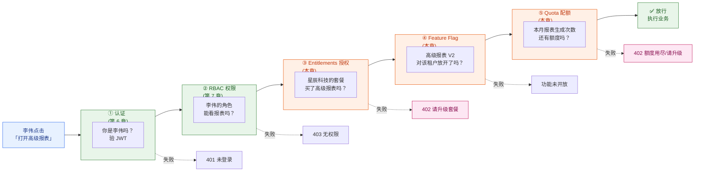

> 注意这里的 HTTP 状态码很有讲究：RBAC 拦截返回 **403 Forbidden**（你没权限，别想了），Entitlements 拦截则推荐返回 **402 Payment Required**（语义就是"要钱"，引导升级）。两者面向用户的话术完全不同：403 是"你不该做这个"，402 是"升级套餐就能做"。第 10.4 节会专门讲这个引导。

---

## 10.2 Entitlements：把套餐翻译成代码能读懂的东西

### 10.2.1 为什么需要一个"翻译层"

业务同学跟你说："Pro 套餐能用高级报表、能建 50 个自定义字段、每月给 10 万次 API 调用。" 这是一句**人话**。但代码里不能写 `if (plan == "Pro" && feature == "高级报表")`——这种写法一旦套餐多了、规则变了，`if` 会铺满整个代码库，改一次定价全公司加班。

**Entitlements（权益 / 功能授权：把"你买了什么套餐"翻译成"你具体能用哪些功能、有多少配额"的一层映射，让业务代码只关心"我能不能用 X"，不关心"我是什么套餐"）** 就是这个翻译层。它把"套餐"这个商业概念，拆解成一条条机器可判断的**权益条目（entitlement）**。

核心是一个三层映射结构：**套餐（Plan）→ 权益条目（Entitlement）→ 具体的功能开关 / 配额上限**。

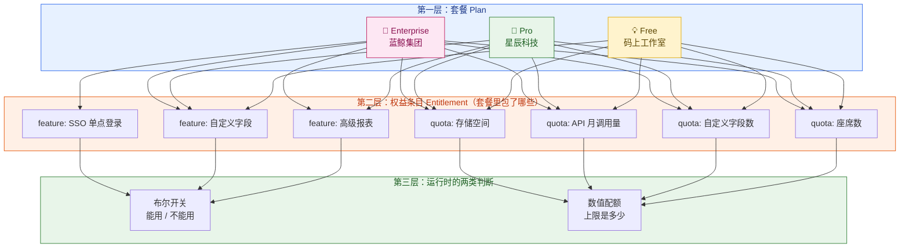

> 📌 上图把权益条目画全了（含"存储空间"），是为了让你对一个套餐里"包了哪些东西"有完整直观感受。但**下文为了聚焦，只挑其中 5 个权益（高级报表、SSO、自定义字段数、API 月调用量、座席数）来建模和写代码**，"存储空间"仅作示意、不再出现在后面的 SQL 与代码里。

看清楚这张图最关键的一点：**权益条目分两类**——

- **布尔型（feature flag-like）**：能用 / 不能用。比如"高级报表""SSO"，要么买了要么没买，没有中间状态。
- **数值型（quota，配额）**：有一个上限数字。比如"自定义字段最多 50 个""API 每月 10 万次"。判断时不是看有没有，而是看**用了多少 / 还剩多少**。

这两类判断逻辑完全不同（一个是 `has()`，一个是 `check(used, limit)`），后面会分别写代码。

### 10.2.2 数据怎么建模

我们用一组配置表来落地"套餐 → 权益条目"的映射。注意几个关键设计：

```sql
-- 权益条目"字典表"：定义平台一共有哪些可授权的能力
-- 这是产品/商业团队维护的，不是某个租户的数据
CREATE TABLE entitlement_def (
    key          VARCHAR(64) PRIMARY KEY,   -- 权益的唯一标识，如 'advanced_reports'
    name         VARCHAR(128) NOT NULL,     -- 展示名，如 '高级报表'
    type         VARCHAR(16)  NOT NULL,     -- 'boolean'（开关）或 'quota'（数值配额）
    description  TEXT
);

-- 套餐 → 权益条目的映射（核心配置表）
-- 一个套餐有多行，每行是它包含的一个权益
CREATE TABLE plan_entitlement (
    plan_code        VARCHAR(32) NOT NULL,  -- 'free' / 'pro' / 'enterprise'
    entitlement_key  VARCHAR(64) NOT NULL,  -- 对应 entitlement_def.key
    bool_value       BOOLEAN,               -- type=boolean 时：true=包含该功能
    quota_limit      BIGINT,                -- type=quota 时：上限数字，NULL 表示无限
    PRIMARY KEY (plan_code, entitlement_key)
);

-- 租户级覆盖表（override）：销售给某个大客户单独谈的特殊待遇
-- 例如蓝鲸集团虽然是 Enterprise，但额外谈了"API 月调用量从 500 万提到 1000 万"
-- 这张表的优先级 > plan_entitlement
CREATE TABLE tenant_entitlement_override (
    tenant_id        BIGINT      NOT NULL,
    entitlement_key  VARCHAR(64) NOT NULL,
    bool_value       BOOLEAN,
    quota_limit      BIGINT,
    expires_at       TIMESTAMP,             -- 可设到期，比如临时加额度
    reason           VARCHAR(255),          -- 为什么给这个特例（审计用）
    PRIMARY KEY (tenant_id, entitlement_key)
);
```

填一些真实数据，把三个租户的差异具象化：

```sql
-- 权益字典
INSERT INTO entitlement_def VALUES
  ('advanced_reports', '高级报表',     'boolean', '多维交叉分析、自定义看板'),
  ('sso',              'SSO 单点登录',  'boolean', '对接企业 IdP'),
  ('custom_fields',    '自定义字段数',  'quota',   '客户/商机上可加的自定义字段数量'),
  ('api_calls_month',  'API 月调用量',  'quota',   '每月 API 调用次数上限'),
  ('seats',            '座席数',        'quota',   '可激活的付费用户数');

-- Free 套餐（码上工作室）：没有高级报表、没有 SSO，配额很小
INSERT INTO plan_entitlement VALUES
  ('free', 'advanced_reports', false, NULL),
  ('free', 'sso',              false, NULL),
  ('free', 'custom_fields',    NULL,  5),       -- 最多 5 个自定义字段
  ('free', 'api_calls_month',  NULL,  10000),   -- 每月 1 万次 API
  ('free', 'seats',            NULL,  5);        -- 最多 5 个座席

-- Pro 套餐（星辰科技）：有高级报表，配额放大，但 SSO 仍要 Enterprise
INSERT INTO plan_entitlement VALUES
  ('pro', 'advanced_reports', true,  NULL),
  ('pro', 'sso',              false, NULL),
  ('pro', 'custom_fields',    NULL,  50),        -- 最多 50 个
  ('pro', 'api_calls_month',  NULL,  100000),    -- 每月 10 万次
  ('pro', 'seats',            NULL,  500);

-- Enterprise（蓝鲸集团）：全功能，配额给到很大或无限
INSERT INTO plan_entitlement VALUES
  ('enterprise', 'advanced_reports', true, NULL),
  ('enterprise', 'sso',              true, NULL),
  ('enterprise', 'custom_fields',    NULL, NULL),   -- NULL = 无限
  ('enterprise', 'api_calls_month',  NULL, 5000000),
  ('enterprise', 'seats',            NULL, 50000);

-- 蓝鲸集团额外谈的特例：API 月调用量从 500 万提到 1000 万
INSERT INTO tenant_entitlement_override VALUES
  (90001, 'api_calls_month', NULL, 10000000, NULL,
   '2026 续约谈判，CTO 拍板加额度');
```

> 💡 **设计要点**：为什么要把"套餐定义"和"租户特例"拆成两张表？因为 SaaS 商业现实里，**大客户总会谈特例**——蓝鲸集团这种 5 万座席的金主，销售一定会给它单独的额度、单独的功能开闸。如果把特例直接改到套餐表里，会污染其他所有 Enterprise 租户。`override` 表让特例隔离、可审计（`reason` 字段）、可到期（`expires_at`），这是企业级 SaaS 的标配。

### 10.2.3 把数据查出来：解析成一个"租户权益快照"

运行时不会每次都去 join 这一堆表（太慢，30 万 QPS 扛不住）。标准做法是：**把一个租户的所有权益，预先解析合并成一个内存对象（Entitlements Snapshot，权益快照），缓存起来。** 合并逻辑是"套餐为底，租户特例覆盖"：

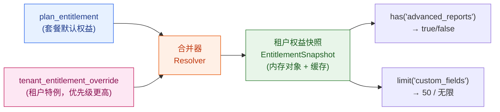

```java
/** 一个租户的权益快照：运行时所有功能授权判断都查它，而不是查库 */
public class EntitlementSnapshot {
    private final long tenantId;
    private final Map<String, Boolean> features;   // 布尔型权益：key -> 是否拥有
    private final Map<String, Long>    quotas;      // 数值型配额：key -> 上限（null 表无限）

    /** 布尔型权益判断：李伟点高级报表时就调它 */
    public boolean has(String key) {
        return features.getOrDefault(key, false);   // 默认 false：没明确授权就是没买
    }

    /** 取配额上限；返回 null 表示无限 */
    public Long limit(String key) {
        return quotas.get(key);
    }
}

/** 解析器：把套餐默认 + 租户特例合并成快照 */
@Service
public class EntitlementResolver {

    /** 解析单个租户的权益快照。用 @Cacheable 缓存，订阅变更时主动失效 */
    @Cacheable(value = "entitlements", key = "#tenantId")
    public EntitlementSnapshot resolve(long tenantId) {
        // 1. 查这个租户当前的套餐（来自第 8 章订阅服务）
        String planCode = subscriptionService.getActivePlan(tenantId);  // 如 "pro"

        Map<String, Boolean> features = new HashMap<>();
        Map<String, Long>    quotas   = new HashMap<>();

        // 2. 铺底：套餐默认权益
        //    plan_entitlement 表本身没有 type 列（type 只存在于字典表 entitlement_def）。
        //    这里按"哪一列有值"分流：bool_value 非空 → 布尔权益；否则 → 数值配额
        //    （配额上限为 NULL 时代表"无限"，仍归入 quotas，put(key, null)）。
        for (PlanEntitlement pe : planRepo.findByPlanCode(planCode)) {
            if (pe.getBoolValue() != null) features.put(pe.getKey(), pe.getBoolValue());
            else                           quotas.put(pe.getKey(), pe.getQuotaLimit());
        }

        // 3. 覆盖：租户特例优先级更高（且未过期）
        for (TenantOverride ov : overrideRepo.findActiveByTenant(tenantId)) {
            if (ov.getBoolValue() != null)  features.put(ov.getKey(), ov.getBoolValue());
            if (ov.getQuotaLimit() != null) quotas.put(ov.getKey(), ov.getQuotaLimit());
        }

        return new EntitlementSnapshot(tenantId, features, quotas);
    }
}
```

> ⚠️ **缓存失效是这里最容易踩的坑**。租户从 Free 升级到 Pro 后（第 8 章订阅变更），快照必须立刻刷新——否则李伟付了钱还用不了高级报表，投诉马上就来。标准做法是订阅服务在套餐变更时**发一条事件**（如 `SubscriptionChanged`），权益服务订阅它并清掉 `entitlements::{tenantId}` 缓存。降级反向同理：从 Pro 掉回 Free，得及时把高级报表关掉，不能让用户白嫖。

---

## 10.3 双重门禁：RBAC 和 Entitlements 为什么必须分开

这是本章最核心、面试也最爱问的一节。我们用一个具体场景把它讲到肌肉记忆。

### 10.3.1 一个真实场景：admin ≠ 能用

> **场景**：李伟在星辰科技被临时提为 admin（管理员，第 7 章里的高权限角色），他兴冲冲点开"高级报表"。但此时星辰科技因为预算调整，套餐**临时降到了 Free**。结果：尽管李伟是 admin，他**照样打不开高级报表**。

为什么？因为这是两道独立的门：

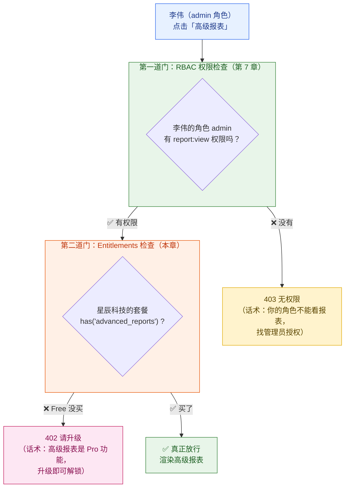

注意这张图里的真相：**李伟通过了第一道门（他是 admin，角色上有权限），却卡在第二道门（公司没买）。** RBAC 给的是绿灯，Entitlements 给的是红灯，最终结果是**红灯**——两道门是"与"的关系，全绿才放行。

反过来的组合也成立：星辰科技升到 Pro，**买了**高级报表（Entitlements 绿灯），但李伟还是个普通 member（member 角色没有 `report:view` 权限，RBAC 红灯），他依然看不了——**钱买到了功能，但他这个人没资格用**。得让张敏（admin）或老陈（owner）来看，或者老陈给李伟授权。

把四种组合列全，逻辑就一目了然：

| 李伟的角色（RBAC） | 公司套餐买了吗（Entitlements） | 结果 | 用户看到的提示 |
| --- | --- | --- | --- |
| ✅ admin（有权限） | ✅ Pro（买了） | **✅ 能用** | 正常打开 |
| ✅ admin（有权限） | ❌ Free（没买） | ❌ 拦 | 402「升级到 Pro 解锁高级报表」 |
| ❌ member（无权限） | ✅ Pro（买了） | ❌ 拦 | 403「你的角色无权查看报表」 |
| ❌ member（无权限） | ❌ Free（没买） | ❌ 拦 | 优先提示 403（先告诉他角色不够，升级也没用） |

> 📌 **为什么不能合并成一个判断？** 假设你偷懒，写成"Free 套餐的人都不能看报表"——那 Free 套餐里的 admin 老板也看不了；或者写成"admin 都能看报表"——那 Free 套餐的 admin 就白嫖了 Pro 功能。**这两个维度的变化是正交的**：人的角色由租户管理员决定（频繁变），套餐由公司付费决定（按月变），混在一起会让逻辑彻底锁死，定价一改就全线崩。**分开的代价是多一次判断，合并的代价是整个商业模型失去弹性。**

### 10.3.2 代码：两道门怎么串

在 Spring 里，干净的做法是把两道门做成两层独立的拦截，业务代码里只看到声明式注解：

```java
@RestController
@RequestMapping("/api/reports")
public class ReportController {

    @GetMapping("/advanced")
    @RequirePermission("report:view")          // 第一道门：RBAC（第 7 章的注解）
    @RequireEntitlement("advanced_reports")     // 第二道门：Entitlements（本章的注解）
    public AdvancedReportDTO getAdvancedReport() {
        // 走到这里，说明两道门都过了：李伟既有角色权限、公司也买了高级报表
        return reportService.buildAdvanced(TenantContext.current());
    }
}
```

`@RequireEntitlement` 注解背后的拦截器逻辑：

```java
/** Entitlements 拦截器：检查当前租户的套餐是否包含某个功能 */
@Aspect
@Component
public class EntitlementAspect {

    @Before("@annotation(req)")
    public void check(RequireEntitlement req) {
        long tenantId = TenantContext.current().getTenantId();   // 来自 JWT，见第 4 章
        EntitlementSnapshot snap = resolver.resolve(tenantId);   // 查权益快照（带缓存）

        if (!snap.has(req.value())) {
            // 没买这个功能 —— 注意：抛的是"需升级"语义，不是"无权限"
            throw new EntitlementNotGrantedException(
                req.value(),                              // 缺哪个权益
                snap.getPlanCode(),                       // 当前什么套餐
                upgradeService.minPlanFor(req.value()));  // 最低需要升到哪个套餐
        }
        // 有权益，放行（继续走业务方法）
    }
}
```

注意异常里带了三样东西：**缺哪个功能、当前套餐、最低升级到哪**。这三样是为了让前端能弹出一个**精准的升级引导卡片**，而不是一句冷冰冰的"无权限"。这就引出下一节。

---

## 10.4 超限与拦截后：优雅地引导升级（而不是甩一句"不行"）

Entitlements 拦截的本质是**销售机会**，不是错误。用户撞到"功能墙（feature gate）"或"配额墙（quota wall）"的那一刻，恰恰是他最想用这个功能的时候——这时候甩 403 太蠢了，应该顺势引导他升级。这在增长黑客里有个专门的词叫 **upsell（向上销售）**。

### 10.4.1 区分两种墙

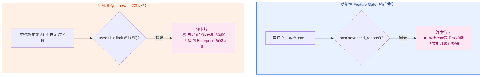

### 10.4.2 配额检查的运行时代码

配额（Quota）和布尔功能不同，它要拿**当前用量**和**上限**比。用自定义字段举例——李伟想给"客户"加第 51 个自定义字段：

```java
/** 配额检查服务：返回结果带足够信息让前端引导升级 */
@Service
public class QuotaService {

    /**
     * 只读检查一个配额是否还够用（以"自定义字段数"为例）。
     * 注意：这里只做检查、不写任何用量，真正的占用发生在后续 customFieldService.create。
     * 自定义字段是低频配置操作，检查与创建之间的竞态窗口影响有限；
     * 若是座席占用这类需要精确计数的高频写操作，应改用 10.8 节的 redis.incr 原子预占。
     * @return 检查结果，超限时携带升级引导信息
     */
    public QuotaCheckResult check(long tenantId, String quotaKey, long amount) {
        EntitlementSnapshot snap = resolver.resolve(tenantId);
        Long limit = snap.limit(quotaKey);

        // limit 为 null 表示无限（Enterprise 的自定义字段），直接放行
        if (limit == null) return QuotaCheckResult.allowed();

        // 查当前已用量。注意：不同配额"用量"的统计源不同——
        //   自定义字段数 → count 字段表；座席数 → count 激活用户；API 量 → 计量服务（第 9 章）
        long used = usageCounter.current(tenantId, quotaKey);

        if (used + amount > limit) {
            // 超限：返回拒绝，并带上引导升级所需的全部信息
            return QuotaCheckResult.denied(
                quotaKey, used, limit,
                upgradeService.nextPlanWithHigherQuota(tenantId, quotaKey));  // 下一档套餐
        }
        return QuotaCheckResult.allowed();
    }
}
```

Controller 里这样用，超限时返回结构化的 402，让前端能画出引导卡片：

```java
@PostMapping("/custom-fields")
@RequirePermission("custom_field:create")
public ResponseEntity<?> addCustomField(@RequestBody CustomFieldDTO dto) {
    long tenantId = TenantContext.current().getTenantId();

    QuotaCheckResult result = quotaService.check(tenantId, "custom_fields", 1);
    if (!result.isAllowed()) {
        // 不是简单 return error，而是返回引导升级的结构化数据
        return ResponseEntity.status(402).body(Map.of(
            "code",        "QUOTA_EXCEEDED",
            "quota",       "custom_fields",
            "used",        result.getUsed(),      // 50
            "limit",       result.getLimit(),     // 50
            "message",     "自定义字段已达上限（50/50）",
            "upsell",      Map.of(
                "suggestPlan", result.getNextPlan(),       // "enterprise"
                "newLimit",    "无限",
                "ctaUrl",      "/billing/upgrade?plan=enterprise")));  // 一键升级链接
    }

    // 额度够，真正创建字段
    return ResponseEntity.ok(customFieldService.create(tenantId, dto));
}
```

李伟在前端看到的不是报错弹窗，而是一张设计精美的卡片：「📦 你的自定义字段已用满（50/50）。升级到 Enterprise 即可使用无限自定义字段。[立即升级]」——点一下就跳到第 8 章的升级流程、第 9 章的按比例补差价计费。**一次拦截，变成一次转化。**

> 💡 **配额墙的体验细节**：好的 SaaS 不会等用户撞墙才提示。当自定义字段用到 45/50（90%）时，就该在界面挂一个温和的提醒「快用满了，考虑升级」。撞墙是最差的体验，提前预警 + 撞墙引导 = 完整的 upsell 漏斗。配额的"快用满了"软提醒和"已用满"硬拦截，是同一条数据的两个阈值。

> 📌 **边界提醒**：配额"用量"的精确计量（每月 API 调了多少次、存储占了多少 GB）属于**计量（Metering）**，那是第 9 章的事。本章只负责**拿计量结果去和上限比、超了就拦**。另外，配额的"上限"是商业约束（你买了多少），而第 11 章的**限流（Rate Limiting）**是技术保护（防止你把系统打挂）——两者数字可能都叫"每月 10 万次"，但目的完全不同，10.7 节会专门辨析。

---

## 10.5 Feature Flag：和 Entitlements 长得像，但完全是另一回事

### 10.5.1 它们到底差在哪

学生最常问的问题：「Entitlements 也是判断'能不能用某功能'，Feature Flag 也是，为什么要两套系统？」

关键差异在**驱动力和时间维度**：

- **Entitlements 由"钱"驱动**，跟着订阅走，相对稳定。星辰科技买了 Pro，这个授权可能半年都不变。
- **Feature Flag 由"发布策略"驱动**，是研发/运营的工具，**随时在变**。一个新功能"AI 商机评分"可能上午只对 1% 租户开，中午放到 10%，晚上全量，第二天发现 bug 又一键全关。

**Feature Flag（功能开关 / 特性开关：一个能在运行时动态控制"某段代码/某个功能对谁开、对谁关"的开关，不用改代码、不用重新发版就能调整）** 的本质是**把"发布"和"上线"解耦**——代码可以先合并、先部署到生产，但功能被开关关着，谁也看不见；想放给谁、放多少，运行时调开关就行。

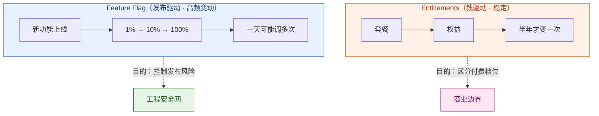

Feature Flag 主要解决三类工程问题：

| 用途 | 大白话 | 例子 |
| --- | --- | --- |
| **灰度发布**（渐进式放量） | 新功能先放给一小撮人，没问题再扩大 | "AI 商机评分"先给 5% 租户 |
| **A/B 测试** | 同一功能给不同人看不同版本，比效果 | 一半租户看新版报表 UI，比留存率 |
| **紧急熔断**（Kill Switch，灭火开关） | 出事了一键全关，不用回滚发版 | 新功能拖垮数据库，10 秒关掉 |

### 10.5.2 Feature Flag 的架构

一个生产级的 Feature Flag 系统长这样：

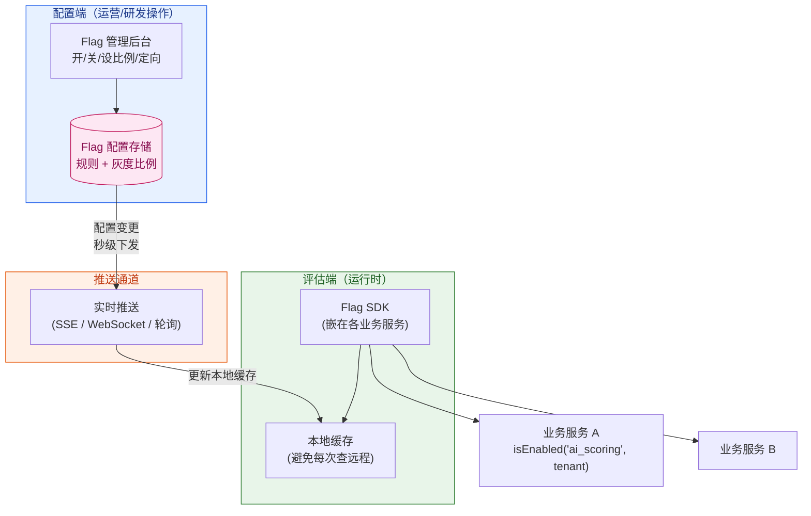

注意这个架构的两个关键设计：

1. **本地缓存 + 实时推送**：SDK 把 Flag 配置缓存在业务服务本地内存，判断时不查远程（30 万 QPS 下查远程会拖垮整个系统）。配置一变，通过推送通道秒级更新本地缓存。这就是为什么 Kill Switch 能做到"10 秒全网生效"。
2. **配置和评估分离**：运营在后台改规则，业务服务里的 SDK 只管读和判断。两者通过推送解耦。

### 10.5.3 Flag 的判断逻辑：规则引擎

一个 Flag 不只是 on/off，它带一套**定向规则（targeting rules）**——决定"对谁开"：

```java
/** 一个 Feature Flag 的配置（来自配置中心，本地缓存） */
public class FeatureFlag {
    String  key;              // "ai_opportunity_scoring"
    boolean enabled;          // 总开关：false 时无视所有规则，全关（Kill Switch 就是把它设 false）
    int     rolloutPercent;   // 灰度比例：0~100，按租户哈希分流
    Set<Long> allowTenants;   // 白名单租户：无论比例多少都开（给种子用户）
    Set<Long> denyTenants;    // 黑名单租户：无论比例多少都关
}

@Service
public class FeatureFlagService {

    /** 判断某个 Flag 对某租户是否开启 */
    public boolean isEnabled(String key, long tenantId) {
        FeatureFlag flag = localCache.get(key);     // 读本地缓存，不查远程
        if (flag == null || !flag.enabled) {
            return false;                            // 总开关关着 → 直接全关（Kill Switch）
        }
        if (flag.denyTenants.contains(tenantId))  return false;  // 黑名单优先
        if (flag.allowTenants.contains(tenantId)) return true;   // 白名单次之

        // 灰度比例：把 tenantId 哈希到 0~99，落在 rolloutPercent 以内就开
        // 用 tenantId 做哈希保证"同一个租户每次结果一致"——不会一会儿能用一会儿不能用
        int bucket = Math.floorMod(Hashing.murmur3_32()
                        .hashLong(tenantId).asInt(), 100);
        return bucket < flag.rolloutPercent;
    }
}
```

> ⚠️ **灰度分流必须用稳定哈希**。新手常犯的错是用 `random()` 决定开不开——那样同一个租户刷新一下页面，功能就一会儿出现一会儿消失，体验灾难。正确做法是**用 tenantId（或 userId）做哈希**，保证同一主体的判断结果永远一致。同时哈希要均匀（用 murmur3 这类），否则 5% 的比例可能实际只命中 1%。

---

## 10.6 Feature Flag 实战：灰度发布与紧急熔断

### 10.6.1 用 Flag 做一次灰度发布

> **场景**：云客团队开发了新功能「AI 智能商机评分」——自动给每个商机打成交概率分。这功能很重，直接全量上线风险大（可能算得慢、可能拖垮数据库）。于是用 Feature Flag 做**渐进式灰度发布**。

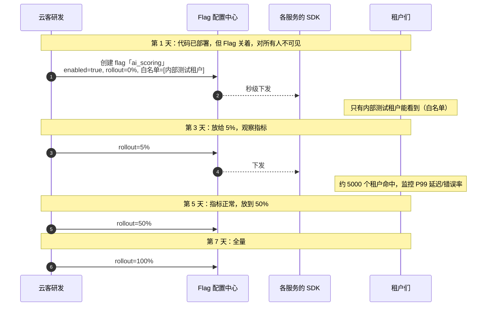

业务代码完全不用改，永远是这一句：

```java
public OpportunityDTO getOpportunity(long oppId) {
    OpportunityDTO dto = oppService.find(oppId);
    long tenantId = TenantContext.current().getTenantId();

    // 灰度判断：命中的租户才算 AI 评分，没命中的走老逻辑
    if (featureFlagService.isEnabled("ai_scoring", tenantId)) {
        dto.setAiScore(aiScoringService.score(oppId));   // 新功能
    }
    // 没命中的租户：dto.aiScore 为空，前端不显示评分模块 —— 他们毫无感知
    return dto;
}
```

放量的过程中，云客团队盯着第 12 章的 tenant-aware 监控看：命中租户的 P99 延迟、错误率有没有飙。**灰度的意义就在这——把"全量爆炸"变成"小范围可控试错"。**

### 10.6.2 Kill Switch：10 秒灭火

> **场景**：放到 50% 时，监控告警——AI 评分服务把数据库连接池打满了，命中的租户响应变慢。这时候**没时间回滚发版**（回滚要重新构建、部署，十几分钟），需要立刻止血。

这就是 **Kill Switch（灭火开关 / 熔断开关）** 的价值：

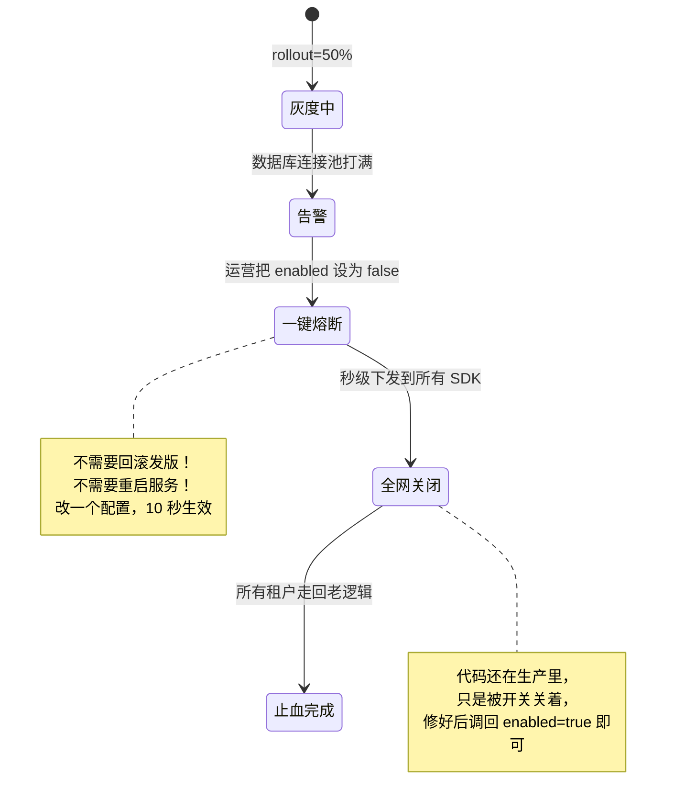

运营在后台点一下「关闭 ai_scoring」，`enabled` 变成 `false`，秒级推送到所有业务服务的本地缓存，`isEnabled()` 立刻全部返回 `false`，所有租户瞬间回到老逻辑。数据库压力立刻下来。等研发把性能问题修好、重新部署，再把开关慢慢调回来。

> 💡 **Kill Switch 是 SaaS 工程的安全气囊**。任何有线上风险的新功能，**上线前就要预埋好它的 Flag**——这是发布纪律。没有 Kill Switch 的功能，出了事只能回滚发版，在 30 万 QPS 的平台上，这十几分钟的额外故障时间可能就是 SLA 违约（第 12 章）。

---

## 10.7 配额 vs 限流：两个长得一样、目的相反的东西

这是工程师常混淆、面试官爱挖的一个点，必须单独辨析清楚。**配额（Quota）和限流（Rate Limiting）数字上可能都叫"每月 10 万次 API"，但它们是两个完全不同的机制，目的相反。**

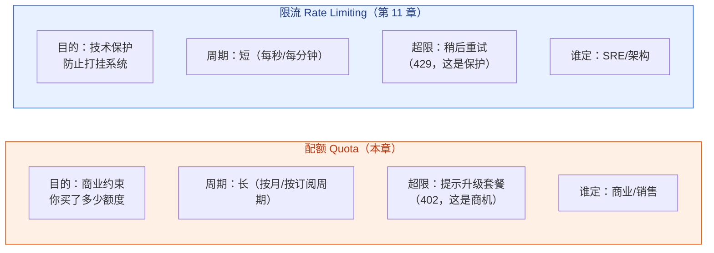

举个能立刻分清的例子：

- **配额**：星辰科技买了 Pro，每月 10 万次 API。李伟所在团队这个月调到第 100001 次——系统提示「本月 API 额度已用尽，升级到 Enterprise 获得 500 万次」。这是**钱不够，建议加钱**。
- **限流**：星辰科技的某个脚本写了死循环，1 秒内打了 5000 次请求——系统返回 429「请求过快，请稍后重试」。这是**怕你把系统打挂，让你慢一点**，跟你买多少额度无关，哪怕你是 Enterprise 也照样限。

> 📌 **一句话区分**：配额管「你这个月总共能用多少」（商业），限流管「你这一秒最多能打多少」（技术保护）。一个看月账单，一个看瞬时压力。限流和噪声邻居（noisy neighbor，吵闹的邻居：一个租户狂用资源拖垮其他租户）的完整治理在**第 11 章**，本章不展开。

---

## 10.8 集中式评估 vs 客户端 SDK 评估

最后一个工程决策：功能判断（Entitlements 和 Flag）的逻辑，放在**中心服务统一算**，还是塞个 **SDK 让每个业务服务自己算**？

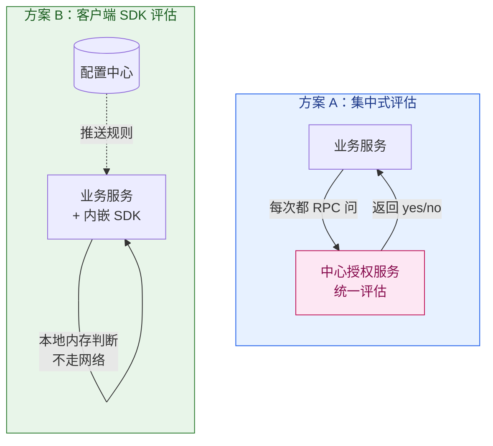

两种方案的权衡：

| 维度 | 集中式评估（方案 A） | 客户端 SDK 评估（方案 B） |
| --- | --- | --- |
| 延迟 | 高（每次都要 RPC 一跳） | **极低**（本地内存，纳秒级） |
| 规则一致性 | **强**（唯一真相源） | 弱（各节点缓存可能短暂不一致） |
| 中心服务挂了 | **全线瘫痪**（单点） | 降级仍可用（吃本地缓存） |
| 规则变更生效 | 立即 | 有推送延迟（秒级） |
| 适用 | 配额"扣减"等需强一致的写操作 | Flag 判断、布尔型 Entitlements 等高频只读 |

**业界主流做法是混合**：

- **Flag 判断、布尔型 Entitlements**（高频、只读、容忍秒级延迟）→ 用 **SDK 本地评估**。30 万 QPS 下，每次判断都 RPC 是不可接受的，而且功能开关偶尔差几秒同步问题不大。
- **配额的扣减、座席占用**（需要强一致，不能多扣少扣）→ 走 **集中式**，用 Redis 原子操作或数据库做唯一计数源。比如"激活第 501 个座席"必须保证全局只扣一次，不能两个请求并发都以为还有名额。

```java
/** 混合策略示例：Flag 走本地 SDK，配额扣减走集中式原子操作 */
public class HybridEvaluator {

    // 高频只读 → 本地 SDK 评估（无网络）
    public boolean canUseAiScoring(long tenantId) {
        return featureFlagService.isEnabled("ai_scoring", tenantId);  // 本地内存
    }

    // 需强一致的扣减 → 集中式（Redis 原子递增 + 上限判断）
    public boolean tryActivateSeat(long tenantId) {
        Long limit = resolver.resolve(tenantId).limit("seats");
        if (limit == null) return true;  // 无限座席
        // INCR 是原子的，并发安全；超限再回滚
        long after = redis.incr("seats:used:" + tenantId);
        if (after > limit) {
            redis.decr("seats:used:" + tenantId);   // 回退
            return false;                            // 座席满了，引导升级
        }
        return true;
    }
}
```

> 💡 **选型口诀**：**读多写少、能容忍短暂不一致 → SDK 本地评估；需要精确计数、强一致 → 集中式原子操作。** Feature Flag 几乎都走 SDK；配额里"扣减/占用"这类写操作走集中式，"上限是多少"这类只读信息可以缓存在本地。

---

## 本章小结

1. **三道关于"能不能用"的门，目的完全不同，必须分开**：RBAC 管「你这个角色有没有资格」（人），Entitlements 管「你这个套餐买没买」（钱），Feature Flag 管「平台现在放不放给你」（发布策略）。把它们揉成一个判断，会让商业模型彻底失去弹性。

2. **Entitlements 是套餐到代码的翻译层**：套餐（Plan）→ 权益条目（Entitlement）→ 布尔开关 / 数值配额。落地靠"套餐默认权益 + 租户特例覆盖"两张表，运行时解析成内存权益快照（带缓存，订阅变更时主动失效）。

3. **双重门禁是"与"的关系**：李伟是 admin（RBAC 绿灯）但公司是 Free（Entitlements 红灯），照样用不了高级报表；反过来公司买了 Pro 但他是 member，也用不了。两个维度正交，全绿才放行。

4. **拦截即销售机会**：撞到功能墙/配额墙时，不该甩 403，而要返回结构化的 402 + 升级引导（缺哪个功能、当前套餐、升到哪一档），把一次拒绝变成一次转化。配额还应在快用满时（如 90%）提前软提醒。

5. **Feature Flag 把"发布"和"上线"解耦**：代码先部署、功能被开关关着，运行时控制对谁开。三大用途——灰度发布（1%→100% 渐进放量）、A/B 测试、Kill Switch（出事一键全网熔断，秒级生效，不用回滚发版）。灰度分流务必用 tenantId 稳定哈希，不能用随机数。

6. **配额 ≠ 限流**：配额是商业约束（你买了多少额度，按月，超了提示升级），限流是技术保护（防止打挂系统，按秒，超了让你重试）——数字可能一样，目的相反。限流在第 11 章。

7. **评估架构混合最优**：Flag 和布尔 Entitlements 走 SDK 本地评估（高频、只读、低延迟）；配额扣减、座席占用走集中式原子操作（需强一致，不能多扣少扣）。

---

## 参考来源

- [AWS SaaS Factory：SaaS 计量、计费与功能授权（Tiering / Entitlements 的工程模式）](https://aws.amazon.com/blogs/apn/calculating-tenant-costs-in-saas-environments/)
- [LaunchDarkly：Feature Flag 最佳实践指南（灰度、定向、Kill Switch 的工程方法）](https://launchdarkly.com/blog/what-are-feature-flags/)
- [Stripe Docs：Entitlements 与产品功能授权模型（套餐到功能的映射设计）](https://docs.stripe.com/billing/entitlements)
- [Martin Fowler：Feature Toggles（特性开关分类与实践，业界经典文章）](https://martinfowler.com/articles/feature-toggles.html)
