# 第 11 章：弹性扩展与资源治理

> 前面十章，我们把云客 CRM 的「骨架」搭起来了：租户怎么隔离（3 章）、请求怎么带着身份进来（4 章）、数据怎么存得安全（5 章）、人怎么登录鉴权（6、7 章）、钱怎么收（8、9 章）、功能怎么按套餐开关（10 章）。但有一个问题一直被我们「往后推」——**月底 23:00 全国销售一起冲业绩，QPS 从 5 万飙到 30 万，系统怎么扛？蓝鲸集团凌晨跑一个 5 万座席的全量数据导出，会不会把码上工作室那 5 个人卡到崩溃？**
>
> 这就是本章要回答的：当成千上万家公司**挤在同一套系统里**，平台怎么做到「该扩的时候自动扩、谁也别想拖垮谁、每家都有公平的一份资源」。这是 SaaS 从「能跑」到「跑得稳」的分水岭，是平台工程师（SRE）的主战场。

---

## 本章导读（读完你能回答这些问题）

- **水平扩展和垂直扩展有什么区别？** 为什么 SaaS 几乎都靠水平扩展，而垂直扩展只是临时救火？
- **为什么「无状态应用层」是弹性扩展的前提？** 第 2 章埋的这个伏笔，本章兑现。
- **「噪声邻居（Noisy Neighbor）」到底是什么？** 蓝鲸集团凌晨跑批，怎么就把码上工作室拖垮了？它有几种「噪声」？
- **怎么治噪声邻居？** 从限流、连接池隔离、IO 隔离到公平调度，业界有一整套组合拳。
- **令牌桶（Token Bucket）限流算法怎么工作？** 为什么每个租户要有「自己的一个桶」？代码怎么写？
- **公平调度（Fair Scheduling）解决的是限流解决不了的什么问题？**
- **热点大租户怎么隔离？** 为什么有时候「单独给它一台机器」反而是最省事的方案？
- **自动伸缩（Auto-scaling）是怎么决策「现在该加几台机器」的？** 为什么不能扩得太快也不能缩得太慢？

> ⚠️ **本章边界**：本章讲「**资源怎么治、机器怎么伸缩**」这件运维工程的事。至于**每个租户的限额数字是从哪个套餐读出来的**（Free 限 10 QPS、Enterprise 限 5000 QPS），那是 **第 10 章（功能授权与配额）** 的活儿——本章只负责「拿到这个数字后怎么执行」。**Cell 单元化部署**这个把大租户彻底隔到独立单元的终极方案，本章只画到「隔离思路」为止，完整的单元化架构是 **第 13 章** 的主题。
>
> 另外提一句**限流（rate limiting）和功能配额（quota）的区别**：限流管「每秒/每分钟能打多少次」（防止瞬时打爆系统），功能配额管「这个月总共能用多少」（套餐权益，如「最多存 1 万个客户」）。本章聚焦前者（防系统被打爆），后者的建模在第 10 章。

---

## 11.1 先认识两种扩展：加机器 vs 加配置

系统扛不住流量了，无非两条路：**让现有的机器更强（垂直扩展）**，或者**多搞几台机器一起扛（水平扩展）**。

> **垂直扩展（Vertical Scaling / Scale Up，向上扩展：给单台机器升级配置——加 CPU、加内存、换更强的实例）**。
> 大白话：原来用 4 核 8G 的机器卡了，换成 32 核 128G。**机器还是那一台，只是变强了。**

> **水平扩展（Horizontal Scaling / Scale Out，向外扩展：保持单台机器配置不变，靠增加机器数量来分摊负载）**。
> 大白话：原来 1 台机器扛 5000 QPS，现在加到 20 台一起扛 10 万 QPS。**机器不变强，但数量变多了。**

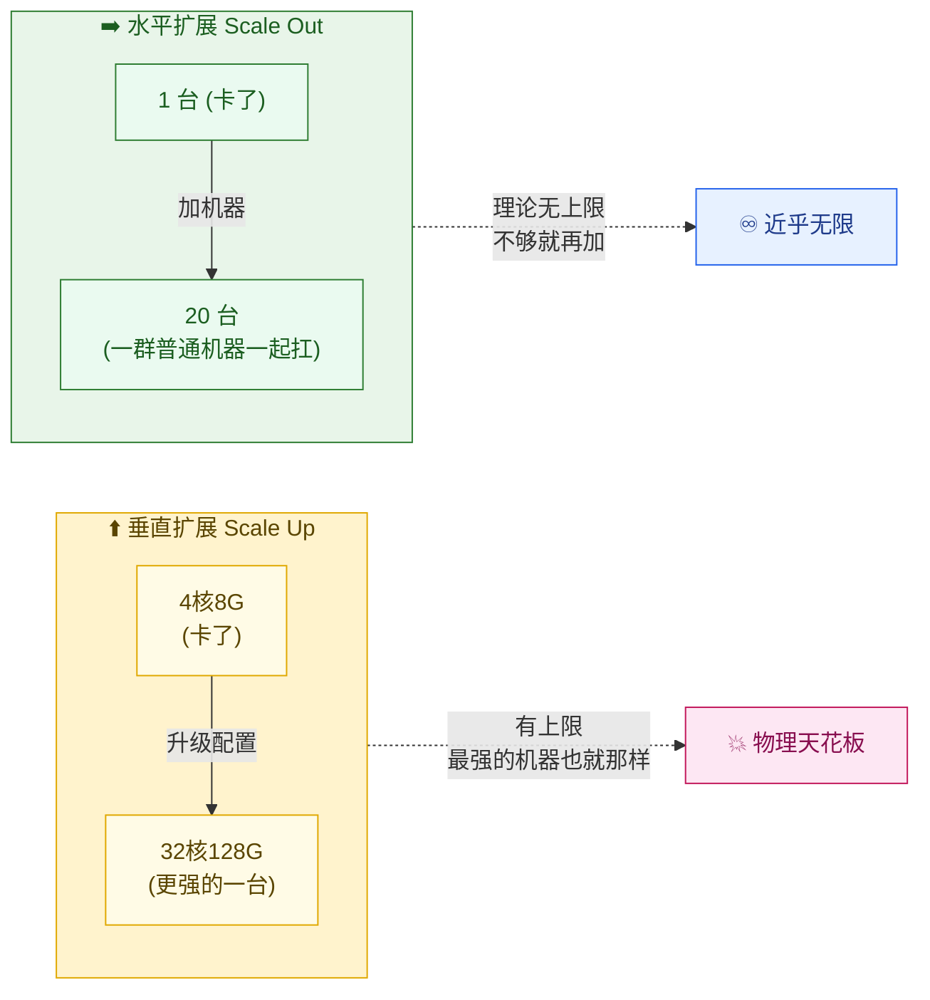

### 两者对比表

| 维度 | 垂直扩展（加配置） | 水平扩展（加机器） |
| --- | --- | --- |
| **怎么扩** | 把单台机器换成更强的 | 多开几台同样的机器 |
| **上限** | 有物理天花板（最强的实例也就那么大） | 近乎无限（不够就再加） |
| **扩容速度** | 慢（通常要重启/迁移，有停机风险） | 快（新机器秒级拉起，无需动老机器） |
| **成本曲线** | 越往上越贵（顶配机器溢价高） | 线性（加一台就是加一份钱） |
| **容灾** | 差（鸡蛋全在一个篮子，这台挂了全完） | 好（一台挂了其余照常，自动剔除） |
| **适合** | 数据库等**有状态**、难拆分的组件，临时救火 | **无状态**应用层，SaaS 的主力扩展方式 |

**核心结论**：**SaaS 的应用层几乎全靠水平扩展**。原因有三：① 流量波动大（月底是平时的 6 倍），必须能快速增减，垂直扩展做不到秒级；② 要高可用，不能把所有租户押在一台机器上；③ 成本可控，用一堆便宜的普通机器，而不是几台天价顶配机。

垂直扩展不是没用，它在两个地方仍是首选：**数据库主库**（难以无脑拆分，先靠加配置顶住）、**临时救火**（半夜出事，先把机器规格拉大撑过去，第二天再想长久方案）。

> 🎬 **画面感**：月底最后一天 22:00，云客 CRM 的监控大盘开始飘红。云客 SRE 团队的值班工程师看着 QPS 曲线一路往上窜。如果是垂直扩展，他得手忙脚乱地申请顶配机器、做数据迁移、重启服务——黄花菜都凉了。但因为应用层是水平扩展的，系统**自动**把 Pod（容器实例）从 20 个扩到 120 个，值班工程师喝着咖啡看曲线平稳落地。这就是水平扩展 + 自动伸缩的威力（自动伸缩在 11.6 节细讲）。

---

## 11.2 为什么无状态应用层这么好扩

水平扩展听起来很美——「不够就加机器」。但它有一个**铁打的前提**：**应用层必须是无状态的**。第 2 章我们埋了这个伏笔，现在兑现。

> **无状态（Stateless，无状态服务：服务器自己的内存里不保存任何「这个用户登录了、那个用户正编辑哪个客户」之类的会话信息。每个请求都自带它需要的全部身份信息——尤其是 `tenant_id` 和用户身份，全装在 JWT 令牌里）**。

为什么无状态是水平扩展的命门？看下面这张对比图就懂了：

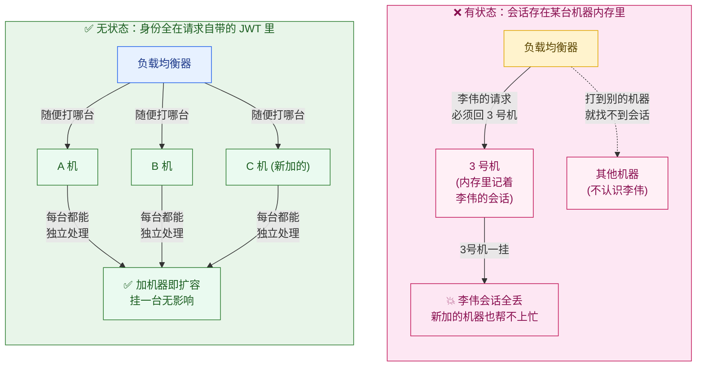

- **有状态的坑**：如果 3 号机内存里记着「李伟的会话」，那李伟接下来的请求**必须**还回 3 号机（这叫「会话粘连 / session affinity」）。后果是：新加的机器帮不上忙（它不认识老用户）、3 号机一挂会话就丢、负载也不均匀——水平扩展的弹性大打折扣。注意它不是「完全用不了」：新会话仍能分到新机器，系统还是能横向加机器；但**已有会话被钉死在原机器上**，缩容、容灾、负载均衡都受限，旧会话不能随意迁移。
- **无状态的爽**：每台机器长得一模一样，**李伟连点 10 个客户，这 10 个请求被负载均衡随机打到 10 台不同机器上都没问题**——因为每个请求都自带「我是星辰科技的李伟」这张 JWT 令牌（里面有 `tenant_id` 和用户身份）。机器随便加、随便减、挂了自动剔除，对用户毫无影响。

**那「状态」去哪了？** 无状态不是说系统不存状态了，而是把状态从应用层的内存里**挪走**，集中放到专门的有状态组件里：

| 状态类型 | 在有状态系统里存哪 | 放在外部哪里 |
| --- | --- | --- |
| 登录会话 | 服务器内存的 Session | JWT 令牌（请求自带）或 Redis |
| 用户上传的临时文件 | 本机磁盘 | 对象存储（如 S3 / OSS） |
| 限流计数器 | 本机内存 | **Redis（本章 11.4 节会用到）** |
| 业务数据 | —— | 数据库（第 5 章） |

> 📌 **一句话总结**：**把"会变的状态"集中外置，让应用层退化成"纯计算的搬运工"**。搬运工谁都能干、随时能换人，所以才能想加几个加几个。这就是无状态成为弹性扩展前提的根本原因。

---

## 11.3 噪声邻居：一个大租户怎么拖垮所有人

水平扩展解决了「整体流量大」的问题——人多了多开机器就行。但 SaaS 还有一个**单租户引起的局部灾难**，水平扩展治不了，反而越扩越糟。这就是从第 1 章起就反复提到、终于轮到本章正面拆解的——**噪声邻居**。

> **噪声邻居（Noisy Neighbor，吵闹的邻居：在共享资源的环境里，某一个租户过度占用公共资源，导致同住一套系统的其他租户被"吵到"——变慢、卡顿甚至报错）**。
> 名字来自合租：你和室友合租，室友半夜开派对放音乐，吵得你睡不着——你没干坏事，但被他连累了。

### 11.3.1 一个真实的灾难现场

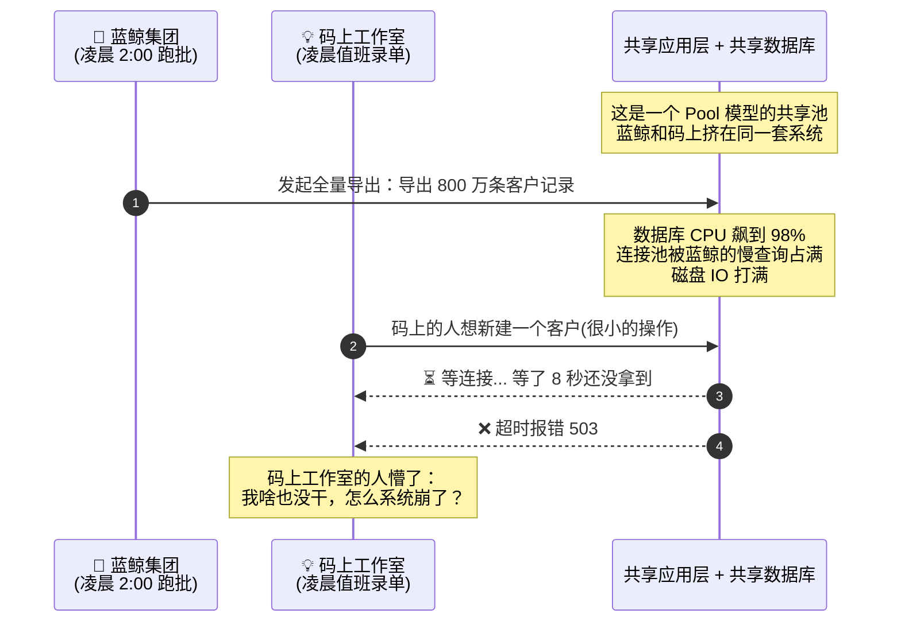

注意这个场景的**荒谬之处**：码上工作室只是想做一个最简单的「新建客户」，它自己一点没超量，却因为**素不相识的蓝鲸集团**在凌晨跑批，被活活拖垮。这就是噪声邻居最气人的地方——**受害者完全无辜**。

### 11.3.2 「噪声」不止一种：四类共享资源都会被抢

很多人以为噪声邻居就是「CPU 被占满」，其实**任何共享资源都可能成为噪声的战场**。在云客 CRM 这种 Pool 模型里，至少有四类资源会被一个大租户抢光：

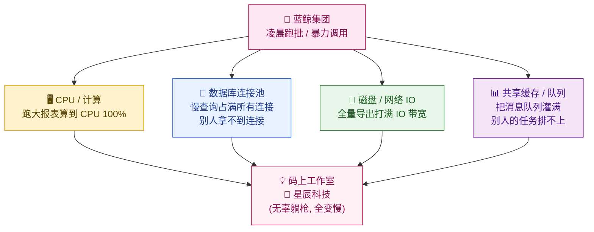

| 被抢的资源 | 怎么被抢的 | 受害者的体感 |
| --- | --- | --- |
| **CPU / 计算** | 蓝鲸跑全量报表，复杂聚合算到 CPU 满载 | 所有人的请求都变慢 |
| **数据库连接池** | 蓝鲸的慢查询长时间占着连接不放，连接池耗尽 | 别人想查数据，连连接都拿不到，直接超时 |
| **磁盘 / 网络 IO** | 蓝鲸全量导出 800 万条，把 IO 带宽打满 | 数据库读写卡顿，全员变慢 |
| **共享队列 / 缓存** | 蓝鲸往异步任务队列灌了几十万个任务 | 码上提交的一个小任务排在几十万个后面，半小时执行不到 |

> 💡 **连接池为什么是 SaaS 的头号杀手**：数据库连接是**极其有限**的资源（一个 PostgreSQL 实例通常也就支持几百个连接）。云客 CRM 服务 10 万租户，但数据库连接可能只有几百个，靠连接池复用。**一个租户的几个慢查询就能把连接池占干**，其余 99999 个租户全部拿不到连接——这是 Pool 模型最常见的雪崩入口。

### 11.3.3 治理噪声邻居的四把武器（本章地图）

治噪声邻居没有银弹，是一套**组合拳**，按「成本从低到高、隔离从弱到强」排列：

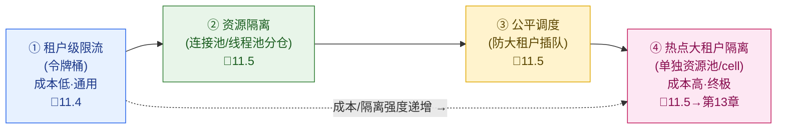

下面几节就沿着这四把武器一把一把讲。**第一把、也是最重要的一把——租户级限流。**

---

## 11.4 租户级限流：每个租户一个「令牌桶」

限流的核心思想极其朴素：**给每个租户设一个「每秒最多打多少次」的闸门，超过就拒绝（或排队）**。关键词是 **「每个租户」**——必须是**租户独立**的闸门，否则没意义。

### 11.4.1 为什么必须是「租户级」而不是「全局」

假设云客 CRM 只设一个全局限流：「系统每秒最多处理 30 万次请求」。会发生什么？


**全局限流根本拦不住噪声邻居**——蓝鲸一家就能合法地把全局额度抢光，其余人全被误伤。所以限流必须**下沉到租户粒度**：每个租户有**自己专属的一个桶**，蓝鲸再怎么暴打，也只是把**它自己的桶**打空，溢出的请求被拒，码上和星辰的桶丝毫不受影响。

> 📌 这就是为什么本章反复强调「**每租户独立配额**」。限流的灵魂不在算法本身，在于「**按 `tenant_id` 分桶**」——隔离的边界永远是租户。

### 11.4.2 令牌桶算法：怎么平滑地控制速率

业界最常用的限流算法是**令牌桶（Token Bucket）**。它的精妙之处在于：既能限制平均速率，又允许短时突发（burst）——这正好符合真实业务的特点（大部分时间平稳，偶尔有一波小高峰）。

> **令牌桶（Token Bucket，令牌桶算法：想象一个能装 N 个令牌的桶，系统按固定速率往桶里丢令牌；每来一个请求，必须先从桶里拿走一个令牌才放行，桶空了就拒绝。桶的容量决定了能容忍多大的突发，丢令牌的速率决定了平均限速）**。

用一个生动的比喻：**令牌桶就像游乐园的旋转木马排队**。

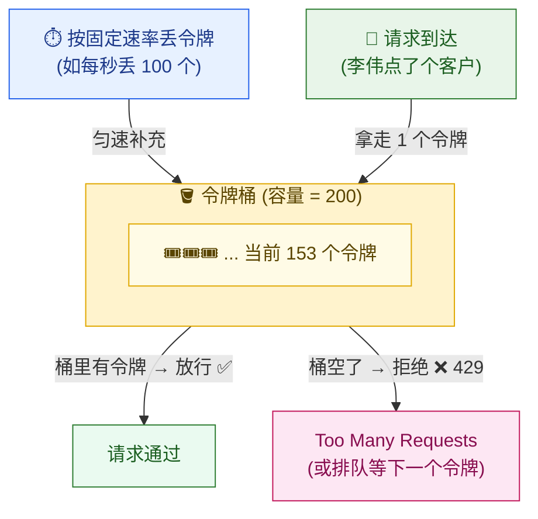

令牌桶有两个关键参数，分别管两件事：

| 参数 | 控制什么 | 云客 CRM 例子 |
| --- | --- | --- |
| **补充速率（rate）** | 平均限速（长期来看每秒最多多少次） | 星辰科技 Pro 套餐：每秒补 1000 个令牌 = 平均限速 1000 QPS |
| **桶容量（capacity / burst）** | 能容忍的瞬时突发上限 | 桶容量 2000 = 允许偶尔一瞬间打到 2000，但持续不了，因为桶很快被掏空 |

**为什么允许突发是好事？** 真实业务不是匀速的。李伟打开 CRM 首页，一瞬间会并发触发「客户列表 + 待办 + 今日商机」好几个请求——这是正常的突发。如果限流死板地「每秒严格 1000 次、多一次都不行」，会误杀这种正常的瞬时并发。令牌桶用「桶容量」给突发留了缓冲，**平时桶里攒着令牌，突发时一次取走一批**，体验更自然。

> 🔍 **令牌桶 vs 漏桶（Leaky Bucket）**：另一个经典算法是漏桶——请求像水一样进桶，桶底以**恒定速率**漏出，多余的溢出丢弃。区别在于：漏桶是**严格匀速**输出（不允许突发），令牌桶**允许突发**。SaaS 场景下令牌桶更受欢迎，因为它对真实业务的突发更友好。

### 11.4.3 代码实现：每租户一个桶

下面是一个**真实可读**的令牌桶限流器实现（Java 伪代码风格，注释中文）。核心是 `ConcurrentHashMap<tenantId, TokenBucket>`——**每个租户一个独立的桶**。

```java
/**
 * 单个令牌桶：管一个租户的限流。
 * 用"懒惰补充"策略——不用后台定时器去丢令牌，
 * 而是在每次请求来的时候，根据"距离上次请求过了多久"现算该补多少令牌。
 * 这样省掉了 N 个定时器（10 万租户不可能开 10 万个定时任务）。
 */
class TokenBucket {
    private final double capacity;     // 桶容量（突发上限）
    private final double refillPerSec; // 每秒补充速率（平均限速）
    private double tokens;             // 当前令牌数
    private long lastRefillNanos;      // 上次补充令牌的时间戳

    TokenBucket(double capacity, double refillPerSec) {
        this.capacity = capacity;
        this.refillPerSec = refillPerSec;
        this.tokens = capacity;        // 初始装满
        this.lastRefillNanos = System.nanoTime();
    }

    /** 尝试消费 1 个令牌；成功返回 true（放行），失败返回 false（限流） */
    synchronized boolean tryAcquire() {
        refill();                      // 先按时间补令牌
        if (tokens >= 1.0) {
            tokens -= 1.0;             // 拿走一个，放行
            return true;
        }
        return false;                  // 桶空了，拒绝
    }

    /** 根据距离上次的时间差，按速率补充令牌（不超过桶容量） */
    private void refill() {
        long now = System.nanoTime();
        double elapsedSec = (now - lastRefillNanos) / 1_000_000_000.0;
        double added = elapsedSec * refillPerSec;          // 这段时间该补多少
        this.tokens = Math.min(capacity, tokens + added);  // 补充但不溢出
        this.lastRefillNanos = now;
    }
}

/**
 * 租户级限流器：管所有租户的桶。
 * 关键：按 tenantId 分桶，每个租户互不影响——这是"租户隔离"在限流层的落地。
 */
class TenantRateLimiter {
    // 每个租户一个独立的桶，按 tenantId 索引
    private final ConcurrentHashMap<String, TokenBucket> buckets = new ConcurrentHashMap<>();
    private final QuotaResolver quotaResolver; // 从第 10 章的套餐配额里读限额

    boolean allow(String tenantId) {
        // computeIfAbsent：第一次见到这个租户时，按它的套餐创建专属桶
        TokenBucket bucket = buckets.computeIfAbsent(tenantId, id -> {
            // 注意：这里的限额数字（rate/capacity）来自第 10 章的套餐配额体系，
            // 本章只负责"拿到数字后用令牌桶执行"，不负责"数字怎么定"。
            TenantQuota q = quotaResolver.resolve(id);   // 如 Free=10QPS, Pro=1000QPS
            return new TokenBucket(q.burstCapacity(), q.qpsLimit());
        });
        return bucket.tryAcquire();
    }
}
```

在 API 网关（第 4 章识别出 `tenant_id` 之后）的拦截器里这样用：

```java
// 网关拦截器：每个请求进来先过租户限流闸门
public void onRequest(HttpRequest req) {
    String tenantId = TenantContext.current().getTenantId(); // 第 4 章注入的租户上下文
    if (!tenantRateLimiter.allow(tenantId)) {
        // 桶空了：返回 429，并带上 Retry-After 告诉客户端多久后再试
        throw new TooManyRequestsException(429, "Retry-After: 1");
    }
    // 放行，继续走认证（6章）→ 权限（7章）→ 业务...
    chain.proceed(req);
}
```

> ⚠️ **分布式限流的坑**：上面的代码是**单机内存版**——令牌桶存在某台网关机器的内存里。但云客 CRM 的网关本身也是水平扩展的（有几十台），蓝鲸的请求被负载均衡打到不同网关机器上，**每台机器各自维护一个桶**，那蓝鲸实际能打的总量就是「单桶限额 × 网关机器数」，限流形同虚设。
>
> **解法**：把令牌桶的状态放到**共享的 Redis** 里（这又回到了 11.2 节说的「状态外置」），用 Redis 的原子操作（如 Lua 脚本）保证多台网关看到的是**同一个桶**。这正是「无状态应用层 + 状态外置」思想的又一次应用。Redis 限流的 Lua 脚本实现属于工程细节，思路记住即可。

### 11.4.4 租户级限流配置示例

实际生产中，限流策略不会写死在代码里，而是**按套餐配置、可热更新**的。下面是云客 CRM 的一份限流配置（YAML 示意），三个租户对应三档套餐：

```yaml
# 租户级限流配置（每租户独立桶；限额数字来源 = 第10章套餐配额）
rate_limit:
  default_dimension: tenant_id   # 限流维度：按租户分桶（灵魂所在）

  # 按套餐分档（套餐 → 限额的映射在第 10 章定义，这里只是执行端的快照）
  plans:
    free:                        # 💡 码上工作室
      qps_limit: 10              # 平均每秒 10 次
      burst_capacity: 20         # 允许瞬时突发到 20
      concurrent_requests: 5     # 同时在途请求上限
    pro:                         # 🏢 星辰科技
      qps_limit: 1000
      burst_capacity: 2000
      concurrent_requests: 200
    enterprise:                  # 🏦 蓝鲸集团
      qps_limit: 5000
      burst_capacity: 10000
      concurrent_requests: 1000

  # 超限后的行为
  on_exceed:
    action: reject               # reject(直接拒) | queue(排队等令牌)
    status_code: 429             # Too Many Requests
    response_header: "Retry-After: 1"

  # 细粒度：对"贵"的接口单独再限一道（导出这种重操作）
  endpoint_overrides:
    "POST /api/export/full":     # 全量导出（蓝鲸凌晨跑批就走这个）
      qps_limit: 1               # 重操作单独严格限：每秒最多 1 次
      burst_capacity: 1
```

注意最后那段 `endpoint_overrides`——**重操作（如全量导出）要单独再上一道更严的限流**。蓝鲸凌晨跑批走的就是 `/api/export/full`，给它单独限到「每秒 1 次」，从源头掐住噪声。

> 📊 **限流被触发后，租户怎么知道？** 平台通常会在响应头里返回限流信息（如 `X-RateLimit-Remaining: 0`、`Retry-After: 1`），客户端 SDK 看到 429 后自动退避重试。同时这些限流事件会上报到可观测性系统（**第 12 章**），生成「蓝鲸今天被限流了 3000 次」这种租户健康指标，供平台运营判断是否该建议它升级套餐。

---

## 11.5 限流之外：连接池隔离、公平调度、热点隔离

限流是第一把武器，但它不是万能的。**限流管的是「请求频率」，管不了「单个请求有多重」。** 蓝鲸完全可以「频率不超标，但每个请求都是一条要扫 800 万行的慢查询」——这种「低频高耗」的请求，限流拦不住，照样能拖垮连接池。所以还需要后面三把武器。

### 11.5.1 资源隔离：给关键资源「分仓」

核心思路：**把共享资源切成几个仓，不让任何单一租户/操作把整个资源吃光。** 最典型的就是**连接池隔离**和**线程池隔离**。

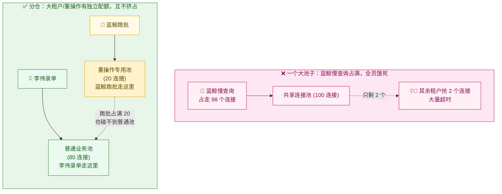

常见的分仓策略：

- **按操作类型分仓**：把「重操作」（导出、报表、批量导入）和「轻操作」（录单、查列表）用**两个独立连接池**。重操作池满了，最多重操作排队，**绝不影响轻操作**。这是最实用的一招——上图所示。
- **按租户层级分仓**：给大租户单独的连接池配额上限，比如「任何单个租户最多占用连接池的 20%」，从根上杜绝一家独占。
- **舱壁模式（Bulkhead，舱壁隔离：借鉴轮船的水密隔舱设计——船被撞破一个舱，水只灌满那个舱，不会沉船。系统里就是把资源切成隔离的舱，一个舱满了不波及其他舱）**：上面两种本质都是舱壁模式的应用。

> 💡 这其实是第 3 章「计算隔离」在**软件层面**的精细化落地。第 3 章讲的是「要不要分开」（Silo/Pool 的战略选择），本章讲的是「在 Pool 里还想再做一层软隔离」的战术手段。

### 11.5.2 公平调度：让小租户也能排上队

限流和分仓还有一个共同盲区：**当资源紧张、大家都在排队时，怎么保证「先来的、小的」不被「后来的、大的」一直插队？**

举个例子：异步任务队列里，蓝鲸凌晨灌进来 10 万个导出子任务。码上工作室随后提交 1 个小任务——如果是普通的 FIFO（先进先出）队列，码上这个任务得排在 10 万个之后，等几个小时。这显然不公平。

> **公平调度（Fair Scheduling / Fair Queuing，公平调度：当多个租户竞争同一份资源时，调度器不按"谁先来"或"谁量大"，而是按"雨露均沾"的原则，保证每个租户都能拿到大致公平的一份，不让任何一家长期霸占）**。

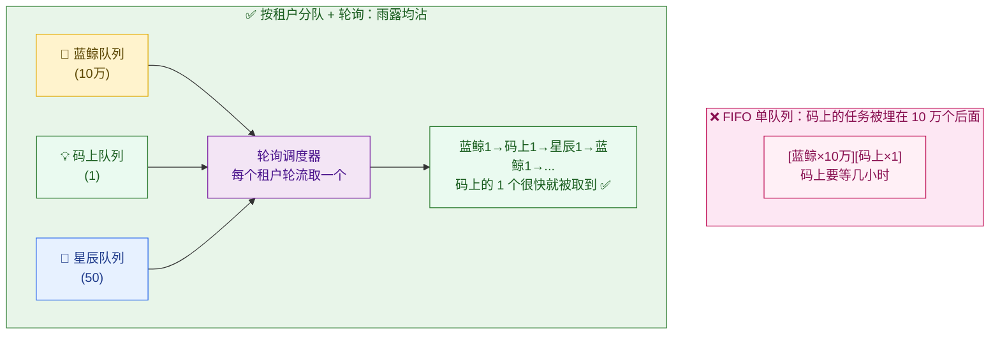

实现思路：**不要一个大队列，而是按 `tenant_id` 分成多个小队列，调度器轮流（round-robin）从每个非空队列里取一个任务。** 这样蓝鲸有 10 万个，码上只有 1 个，但轮询时码上那个很快就被取到——它不必等蓝鲸全部跑完。更精细的版本会按套餐给权重（加权公平队列 WFQ，Weighted Fair Queuing），让付费高的租户拿更大的份额，但**再小的租户也永远不会被饿死**。

> 📌 **限流 vs 公平调度，一句话区分**：限流是「**绝对上限**」——超过就拒（防止打爆系统）；公平调度是「**相对份额**」——资源紧张时怎么公平分（保证人人有份）。两者互补：限流防止整体崩，公平调度防止局部饿死。

### 11.5.3 热点大租户隔离：实在治不住，就单独给它一套

前面的限流、分仓、公平调度，都是在**「大家继续共享」的前提下**做软隔离。但总有那么几个**超级大租户**（比如蓝鲸集团这种 5 万座席的），它的负载实在太大、太不稳定，软隔离按下葫芦浮起瓢——这时候最干净的办法反而是**物理隔离：单独给它一套资源池**。

> **热点大租户（Hot Tenant，热点租户：体量或流量远超平均水平、频繁引发资源争抢的少数大租户。SaaS 里通常符合"二八定律"——20% 的大租户占了 80% 的负载）**。

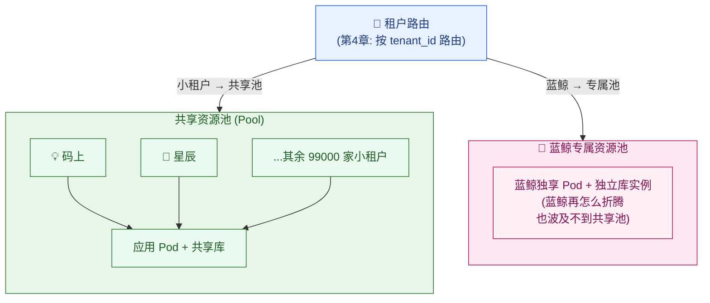

隔离的**强度有梯度**，按成本从低到高：

| 隔离强度 | 做法 | 适合谁 |
| --- | --- | --- |
| **逻辑软隔离**（11.5.1～11.5.2） | 共享池里限流 + 连接池分仓 + 公平调度 | 绝大多数普通租户 |
| **专属资源池** | 大租户单独一组 Pod / 独立数据库实例，但还在同一套部署体系里 | 头部大租户（如蓝鲸） |
| **专属 Cell 单元** | 大租户整个迁到一个**完全独立的部署单元**（独立的全栈：应用 + 库 + 缓存 + 网络） | 超大租户 / 强合规租户 |

这里你会发现一个**呼应**：把蓝鲸隔到「专属资源池」乃至「独立全栈」，本质就是第 3 章讲的 **Silo 模型**——蓝鲸正是用 Silo 的那个租户。**资源治理走到极致，就和隔离模型选型汇合了**：治不住的噪声邻居，干脆从 Pool 升级到 Silo。

> 🔗 **承接第 13 章**：上表最后一行的「专属 Cell 单元」，是一种把整个平台切成多个**独立可复制单元（Cell）**、每个单元服务一批租户、大租户独占一个单元的部署架构。它是「热点隔离」的终极形态，同时也是高可用、爆炸半径控制的核心手段。**Cell 单元化部署的完整架构（怎么切、怎么路由、怎么迁移、爆炸半径怎么算）是第 13 章的主题**，本章只点到「它是热点隔离的终极方案」为止。

---

## 11.6 自动伸缩：让机器跟着负载自己增减

前面解决了「谁也别想拖垮谁」（资源治理）。最后回到本章开头的问题：**月底 QPS 暴涨 6 倍，机器怎么自动跟上？** 这就是**自动伸缩**。

> **自动伸缩（Auto-scaling，自动伸缩：系统实时监控负载指标（如 CPU 使用率、QPS），当负载升高时自动增加机器/容器实例，负载回落时自动减少，全程无需人工干预）**。
> 大白话：给系统装个「智能油门」——堵车（高负载）自动加油（加机器），畅通（低负载）自动收油（减机器），还省油钱。

### 11.6.1 自动伸缩的决策闭环

自动伸缩是一个**持续运行的反馈控制环**：采集指标 → 对比目标 → 决策增减 → 执行 → 再采集……

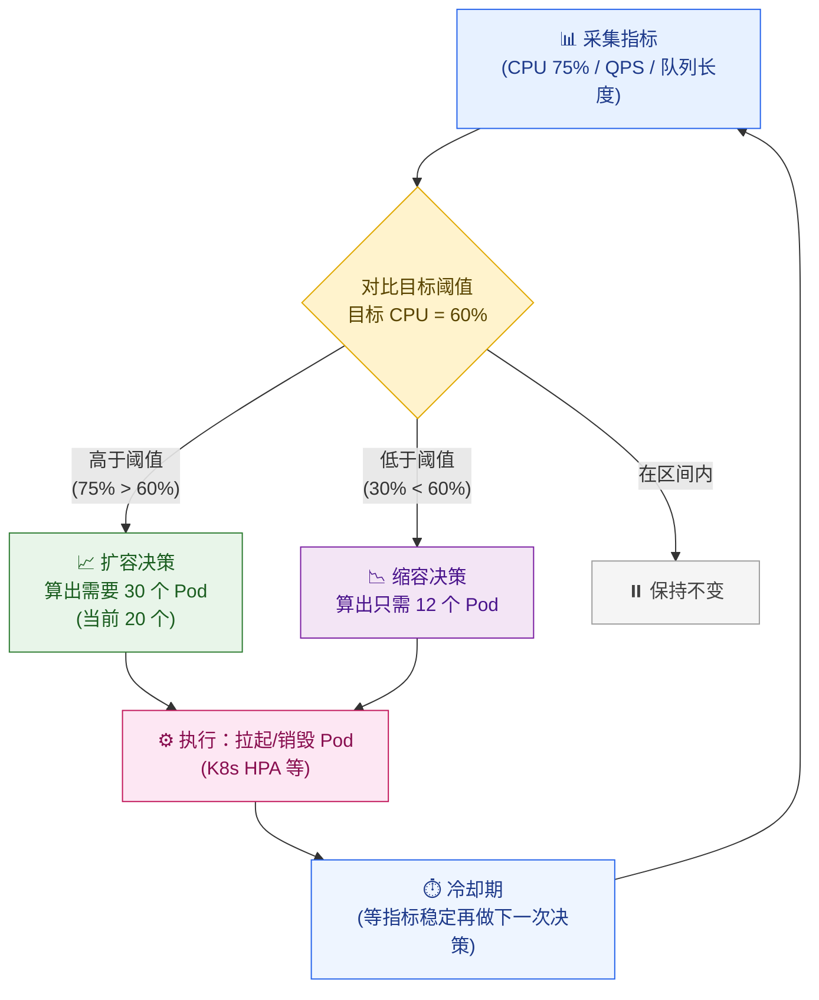

决策的核心公式非常直观（这正是 Kubernetes HPA 用的算法）：

```
期望实例数 = ceil( 当前实例数 × (当前指标值 / 目标指标值) )

例：当前 20 个 Pod，CPU 实测 75%，目标 60%
   期望 = ceil( 20 × 75/60 ) = ceil(25) = 25 个 Pod → 扩容 5 个
```

> **HPA（Horizontal Pod Autoscaler，水平 Pod 自动伸缩器：Kubernetes 内置的自动伸缩控制器，按 CPU/内存/自定义指标自动调整 Pod 副本数）**。它就是上面这个反馈环的标准实现，云客 CRM 的应用层 Pod 数就由它管。

### 11.6.2 指标怎么选：从 CPU 到「每租户感知」

最朴素的伸缩指标是 **CPU 使用率**，但它对 SaaS 不够用。更好的实践是用**业务指标**：

| 伸缩指标 | 含义 | 适合场景 |
| --- | --- | --- |
| **CPU / 内存使用率** | 资源消耗 | 通用兜底，但有滞后（CPU 涨上去用户已经卡了） |
| **QPS / 请求并发数** | 请求量 | 更贴近真实负载，反应更快 |
| **请求队列长度 / 延迟 P99** | 积压程度（**P99 延迟**＝99 分位延迟：99% 的请求耗时都低于这个值，反映尾部体验） | 最贴近用户体感，队列开始堆积就该扩了 |
| **消息队列堆积量** | 异步任务积压 | 异步处理服务（如导出、报表）的伸缩依据 |

> 🎬 **画面感**：月底 22:00，云客 CRM 的 QPS 开始爬升。自动伸缩器发现「请求 P99 延迟从 80ms 涨到 200ms、CPU 到 75%」，触发扩容：20 → 25 → 40 → ... → 120 个 Pod，几分钟内分批拉起。因为应用层无状态（11.2 节），新 Pod 一拉起就能立刻分担流量，李伟和张敏完全无感。到了凌晨 1 点流量回落，伸缩器又一步步把 Pod 缩回 20 个，省下夜间的机器钱。

### 11.6.3 自动伸缩的两个经典陷阱

自动伸缩不是「设个阈值就完事」，有两个坑必须懂：

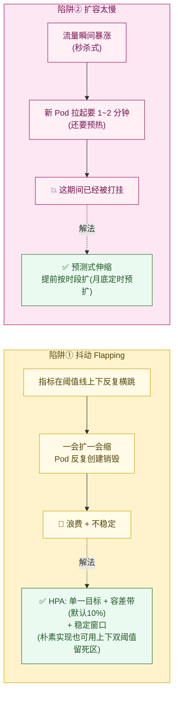

- **陷阱① 抖动（Flapping，反复横跳：指标恰好在阈值附近波动，导致系统一会儿扩一会儿缩，Pod 反复创建销毁）**。K8s HPA 本身的防抖动机制不是「上下双阈值」，而是**单一目标值 + 容差带（tolerance，默认 10%）+ 稳定窗口（stabilization window）**：实测指标与目标值的比值落在 ±10% 容差带内就**不动**（避免在目标线附近频繁伸缩），缩容还要在「稳定窗口」内观察一段时间确认指标确实降下来了才执行——这和 11.6.1 的「目标 60% + 区间内保持」是一致的。比 HPA 更朴素的自定义伸缩器，也可以用**上下双阈值留死区**（如 CPU 超 70% 才扩、降到 40% 以下才缩，中间留个「死区」防横跳）达到类似效果，但这是一类通用思路，不是 HPA 的本体机制。
- **陷阱② 扩容滞后**：新 Pod 从「拉起」到「能干活」要 1～2 分钟（拉镜像、启动、连接池预热）。如果流量是**瞬间**暴涨（不是缓慢爬升），等扩容到位系统已经被打挂了。解法是 **预测式 / 定时伸缩**——云客 CRM 知道「每月最后一天 22:00～次日 1:00 是高峰」，就**提前**在 21:30 把 Pod 预扩到 80 个，而不是等流量来了才反应。这叫「按已知规律提前备货」。

> 📌 **三类伸缩方式合起来用**：① **响应式**（按实时指标扩缩，HPA，兜底）；② **预测式 / 定时**（按已知规律提前扩，应对月底这种可预期高峰）；③ **手动**（大促前 SRE 手动锁定一个高副本数，最稳妥）。生产中三者叠加，不是二选一。

### 11.6.4 别忘了：应用层能伸缩，数据库不能随便伸

最后一个**容易被忽视的真相**：自动伸缩主要伸的是**无状态的应用层**。数据库（有状态）**没法跟着应用层一起秒级扩缩**——你不能因为流量涨了就瞬间多开一个主库。所以当应用层从 20 个 Pod 扩到 120 个时，常常会出现「**应用层扩上去了，结果一起涌向数据库，把数据库压垮**」的新瓶颈。

应对手段（大多在前面章节铺垫过）：
- 数据库连接池上限（11.5.1，防止 120 个 Pod 每个都开一堆连接打爆库）；
- 读写分离、读副本扩展（读多写少时，多加只读副本分担查询）；
- 缓存挡在数据库前面（热点数据走 Redis，减少打到库的请求）；
- 大租户分库（第 5 章的分片）、乃至 Silo 独立库（第 3 章）。

> 这再次印证那条贯穿全篇的信条——**无状态的东西随便扩，有状态的东西要小心伺候**。弹性扩展的艺术，一半在「让该无状态的尽量无状态」，一半在「给绕不开的有状态组件做好隔离和保护」。

---

## 本章小结

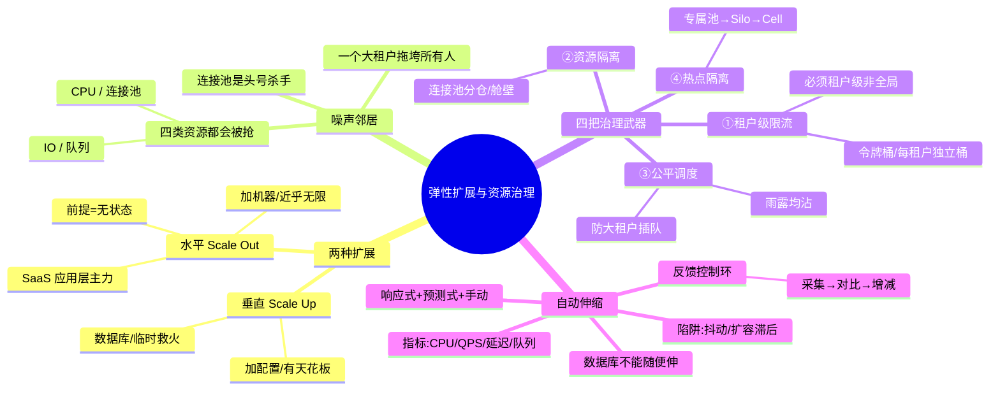

本章的核心收获，浓缩成六句话：

1. **水平扩展是 SaaS 应用层的主力**：靠加普通机器分摊负载，近乎无限、容灾好、成本线性；垂直扩展（加配置）只用于数据库和临时救火。
2. **无状态是水平扩展的命门**：把会话、计数器等状态外置（JWT / Redis），让应用层退化成「谁都能干、随便增减」的纯计算搬运工，机器才能秒级伸缩。
3. **噪声邻居是 Pool 模型的头号敌人**：一个大租户（如蓝鲸凌晨跑批）能从 CPU、连接池、IO、队列四个方向抢光共享资源，拖垮无辜的小租户——**连接池被占满**是最常见的雪崩入口。
4. **治噪声邻居是组合拳**：① 租户级限流（令牌桶，**每租户一个独立桶，按 `tenant_id` 分桶**是灵魂，绝不能用全局限流）；② 连接池/线程池分仓（舱壁模式）；③ 公平调度（雨露均沾，防大租户插队饿死小租户）；④ 热点大租户隔离（专属资源池 → 升 Silo → 终极是 Cell 单元，接第 13 章）。
5. **限流管「频率上限」，公平调度管「公平份额」**：两者互补——限流防整体被打爆，调度防局部被饿死；而限流拦不住「低频高耗」的慢查询，那靠资源分仓兜底。
6. **自动伸缩是负载驱动的反馈环**：按 CPU/QPS/延迟/队列长度决策增减 Pod（HPA），要防「抖动」（HPA 靠单一目标 + 容差带 + 稳定窗口；朴素实现也可用上下双阈值留死区）和「扩容滞后」（预测式定时预扩）；切记**应用层能秒级伸缩，数据库不能**，扩容后要防数据库成为新瓶颈。

资源治住了、机器会自己伸缩了——但平台方怎么**看见**这一切？蓝鲸今天被限流了多少次？星辰的 P99 延迟有没有超 SLA？哪个租户的健康分在掉？「看不见就治不了」，这就是 **第 12 章（可观测性与租户级监控）** 的主题：怎么给每一条指标、每一行日志、每一次调用链都打上 `tenant_id`，让平台能从「租户视角」看清整个系统。

---

## 参考来源

1. **AWS Well-Architected — SaaS Lens：Noisy neighbor**（噪声邻居的成因与缓解策略，含限流、隔离、分层的权威实践）：<https://docs.aws.amazon.com/wellarchitected/latest/saas-lens/noisy-neighbor.html>
2. **AWS Well-Architected — SaaS Lens：Tenant throttling / Noisy neighbor**（SaaS 透镜中关于租户级限流与噪声邻居治理的最佳实践）：<https://docs.aws.amazon.com/wellarchitected/latest/saas-lens/saas-lens.html>
3. **Kubernetes 官方文档 — Horizontal Pod Autoscaling（HPA）**（自动伸缩决策算法与配置，含期望副本数计算公式、冷却与稳定窗口）：<https://kubernetes.io/docs/tasks/run-application/horizontal-pod-autoscale/>
4. **Stripe Engineering Blog — Scaling your API with rate limiters**（生产级令牌桶/限流器设计，含 Redis 分布式限流与多层限流策略）：<https://stripe.com/blog/rate-limiters>
