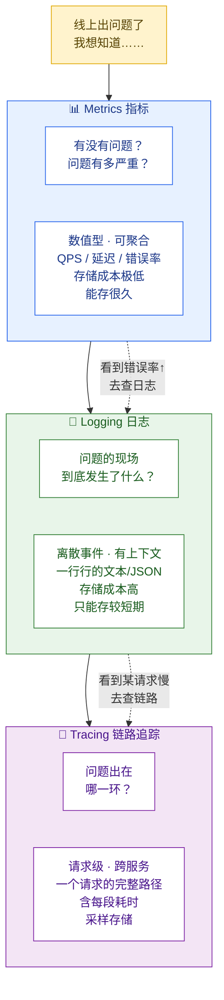
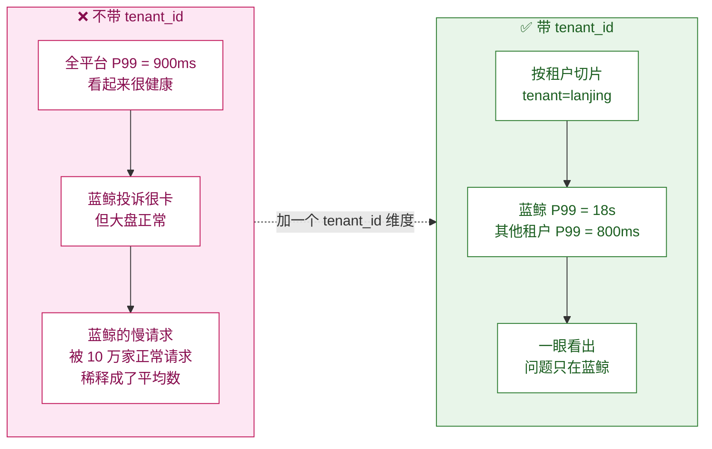
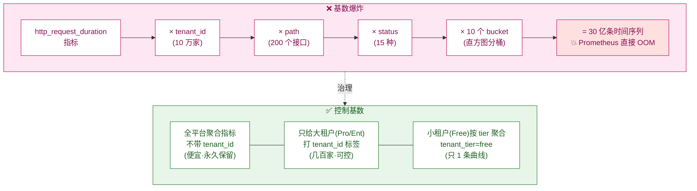
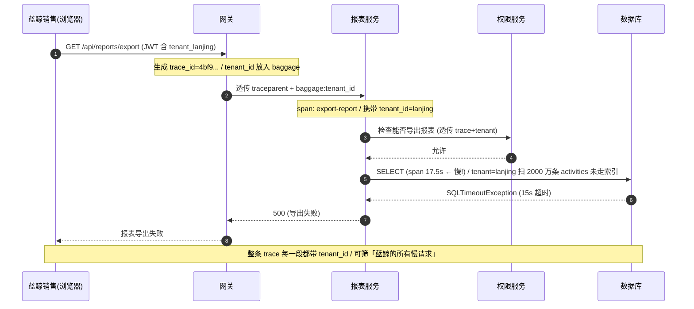
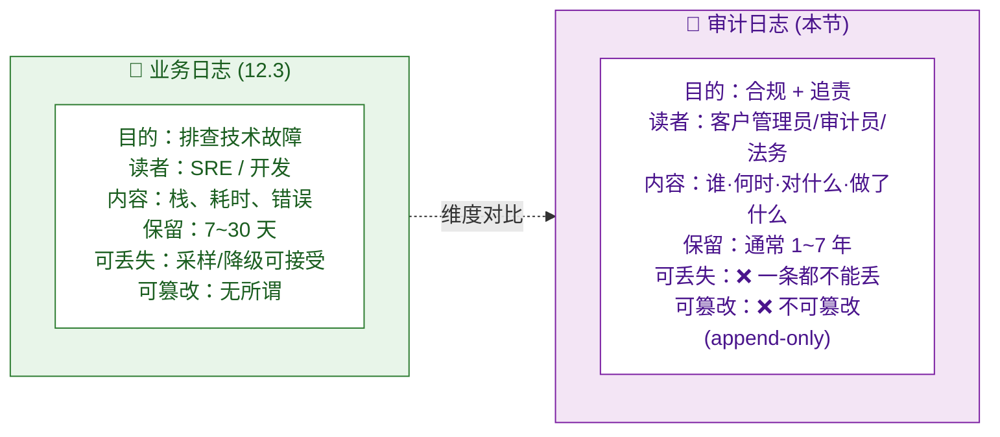
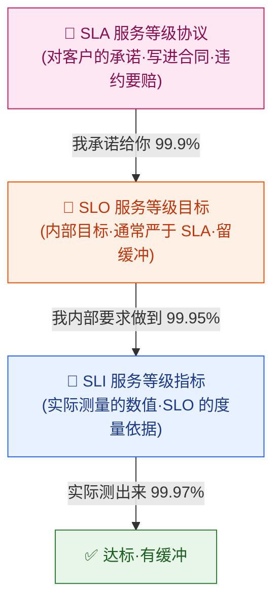
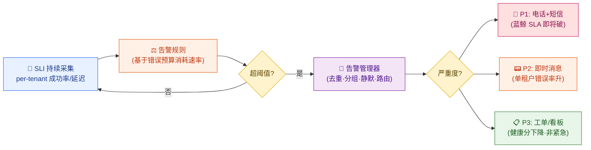
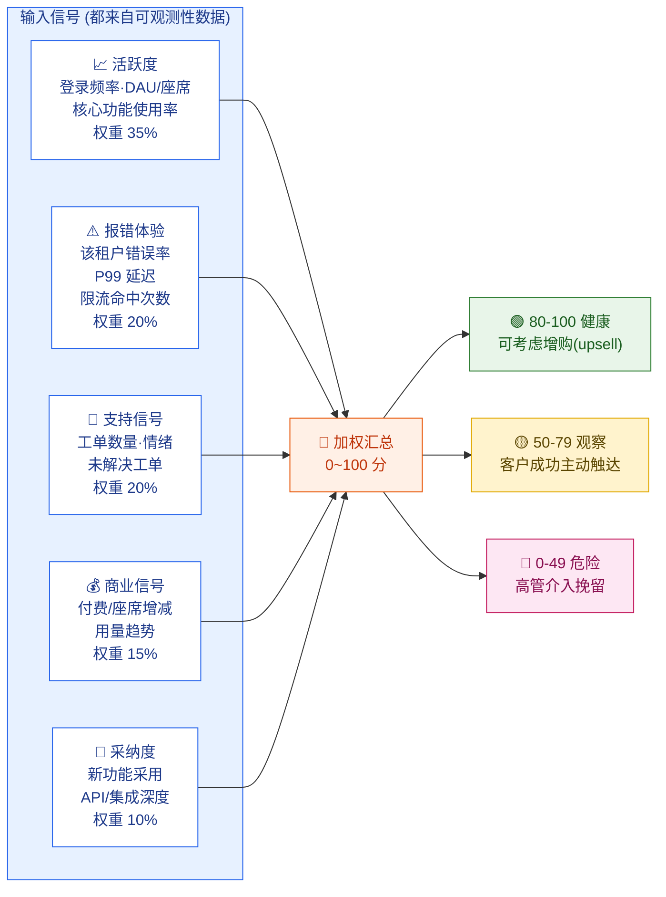
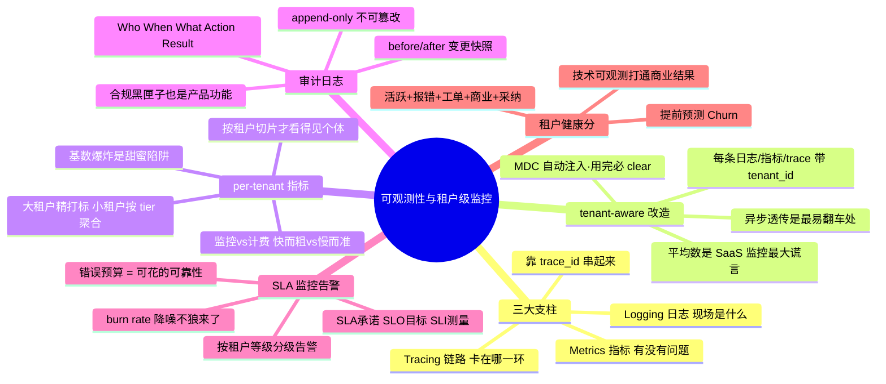

# 第 12 章 可观测性与租户级监控

> 第 11 章我们用令牌桶给每个租户套上了「限流笼子」，治住了噪声邻居。但有个尴尬的现实：**限流也好、扩容也好，前提是你得先「看见」每个租户在干什么**。蓝鲸集团说「你们系统昨晚卡得要死」，你打开监控大盘——全平台 P99 延迟一切正常。问题出在哪？因为你的监控是「全平台一锅烩」的，根本看不到「蓝鲸集团这一家」的延迟曲线。这就是本章要解决的：**让可观测性变成 tenant-aware（租户感知）的**——每一条日志、每一个指标、每一段链路，都带上 `tenant_id`，能按租户切片。再往上，审计日志告诉你「老陈昨天到底改没改计费设置」，SLA 监控告诉你「蓝鲸的 99.95% 还守不守得住」，租户健康分告诉你「星辰科技是不是快要流失了」。

---

## 本章导读

读完本章，你应该能回答这些问题：

- 可观测性的「三大支柱」——指标（Metrics）、日志（Logging）、链路追踪（Tracing）——分别回答什么问题？为什么三者缺一不可？
- 普通系统的监控和 SaaS 系统的监控，差在哪一个字段上？为什么说「不带 `tenant_id` 的监控，在 SaaS 里几乎等于没监控」？
- 一条结构化日志怎么打才算 tenant-aware？`tenant_id` 怎么自动注入，不靠程序员每行手写？
- per-tenant（按租户）指标怎么设计才不会把监控系统(指标基数)撑爆？为什么「给每个租户一条曲线」是个甜蜜的陷阱？
- 分布式链路追踪怎么把 `tenant_id` 一路透传，让你能筛出「蓝鲸集团的所有慢请求」？
- **审计日志（Audit Log）** 和普通业务日志有什么本质区别？为什么它是合规和排查事故的「黑匣子」？老陈改了一次计费设置，这条记录长什么样？
- SLA（服务等级协议）怎么从一句承诺变成可监控、可告警、能赔钱的硬指标？告警链路怎么设计才不会「狼来了」？
- **租户健康分（Health Score）** 怎么综合活跃度、报错率、工单数算出来，提前预测哪家租户要流失？

> 📌 本章只讲「怎么看见、怎么记录、怎么告警、怎么打分」。**合规法规的具体要求**（GDPR、SOC2 对审计日志保留期限、字段、不可篡改性的硬性规定）交给第 14 章；本章只讲审计日志的工程实现。**计量计费的用量采集**（按 API 次数、存储量计费的那套计量管道）交给第 9 章——它和监控指标长得像，但目的完全不同（一个是为了收钱，一个是为了看健康），本章 12.3 会专门辨析这两者的区别。

---

## 12.1 可观测性三大支柱：你到底想知道什么

「监控」和「可观测性」是两个常被混用的词，先把它们分清楚。

> 📖 **监控（Monitoring，监视：盯着一组你**事先想好**的指标，超过阈值就报警）**。它回答的是「**我知道会出问题的地方，现在出没出问题**」——比如 CPU 超过 80% 报警。

> 📖 **可观测性（Observability，可观测性：从系统对外吐出的数据里，**事后**推断出系统内部任意状态的能力）**。它回答的是「**我没想到会出问题的地方，出了问题我能不能查出来**」——比如「蓝鲸集团的某个销售点报表，只有周一上午慢，为什么」。监控是「已知的未知」，可观测性是「未知的未知」。

可观测性建立在**三大支柱**之上。它们各自回答一类问题，互相补位：



### 一次真实排查，看三支柱怎么接力

蓝鲸集团的 IT 主管投诉：「昨晚 9 点，我们好几个销售导出客户报表，转圈半天没反应。」云客 SRE 老王接到工单，用三支柱接力定位：

1. **先看 Metrics（指标）确认「有没有问题、多严重」**：打开监控大盘，按 `tenant_id=tenant_lanjing` 切片，看到 `/api/reports/export` 接口昨晚 21:00 的 P99 延迟从平时的 800ms 飙到了 **18 秒**，错误率 12%。✅ 问题确认存在，且范围锁定在「蓝鲸 + 报表导出接口」。

2. **再看 Logging（日志）找「现场到底发生了什么」**：用 `tenant_id=tenant_lanjing AND path=/api/reports/export AND level=ERROR` 过滤日志，看到一堆 `SQLTimeoutException: query timeout after 15000ms`。✅ 现场清楚了——数据库查询超时。

3. **最后看 Tracing（链路追踪）定位「卡在哪一环」**：挑一条慢请求的 `trace_id`，展开它的**瀑布图**（waterfall：把这条 trace 的每一段 span 按时间先后画成一条条横向时间条，长短即耗时，一眼看出哪段最长；注意它和 CPU profiling 里聚合调用栈的「火焰图」不是一回事），看到整个请求 18 秒里，**有 17.5 秒卡在一次 `SELECT` 上**——这次查询扫了蓝鲸集团 2000 万条 `activities`（活动记录）表，没走索引。✅ 根因找到了：报表导出的某个 SQL 在大租户（蓝鲸数据量大）下退化成了全表扫描。

> 🧩 **三支柱不是三个工具，是一条排查链路**：指标告诉你「哪里疼」，日志告诉你「为什么疼」，链路告诉你「疼在身体的哪个器官」。**而把这三者串起来、让你能精准切到「蓝鲸集团」这一家的钥匙，就是 `tenant_id`。** 这正是 SaaS 可观测性区别于普通系统的核心——下一节我们专门讲它。

---

## 12.2 tenant-aware 改造：给三支柱都打上 tenant_id

普通系统的可观测性，和 SaaS 系统的可观测性，**架构上几乎一样，只差一个字段**——但就是这个字段，决定了你出事时是「精准定位一家租户」还是「在百万请求里大海捞针」。

### 为什么必须 tenant-aware

设想云客 CRM 不带 `tenant_id` 做监控会发生什么：



**平均数是 SaaS 监控的最大谎言。** 10 万家租户里 1 家挂了，全平台错误率只涨 0.001%，监控曲线纹丝不动——但对那一家租户来说，是 100% 的灾难。tenant-aware 改造的本质，就是**把「平均」拆成「每家」**。

### 关键前提：tenant_id 从哪来

好消息是，做到这点的地基**第 4 章已经打好了**。第 4 章我们把 `tenant_id` 从 JWT 里取出，放进了请求上下文（`TenantContext`，基于 ThreadLocal）。可观测性要做的，只是在三支柱的「采集点」上，从这个上下文里把 `tenant_id` 顺手取出来，贴到日志/指标/链路上。

```java
// 第 4 章已经建好的租户上下文（这里只是回顾，不重复实现）
public final class TenantContext {
    private static final ThreadLocal<String> TENANT = new ThreadLocal<>();
    public static String getTenantId() { return TENANT.get(); }
    public static void set(String tenantId) { TENANT.set(tenantId); }
    public static void clear() { TENANT.remove(); }
}
```

下面三节，分别看日志、指标、链路怎么从这里取 `tenant_id`。

---

## 12.3 支柱一改造：tenant-aware 结构化日志

### 从「文本日志」到「结构化日志」

老式日志长这样，机器很难解析：

```
2026-06-09 21:03:11 ERROR 蓝鲸某销售导出报表失败,报表名=华东区客户清单,原因=数据库超时
```

结构化日志（Structured Logging）长这样，每条日志是一个 **JSON 对象**，机器可直接按字段过滤、聚合：

> 📖 **结构化日志（Structured Logging：把日志从「一句话」变成「一组键值对（JSON）」，让机器能像查数据库一样查日志）**。它的核心价值是「可查询」——你能写出 `tenant_id=tenant_lanjing AND level=ERROR` 这样的过滤条件，而不是用正则去抠那句话。

```json
{
  "timestamp": "2026-06-09T21:03:11.482Z",
  "level": "ERROR",
  "tenant_id": "tenant_lanjing",        // ★ 多租户的命根子：这条日志属于哪家（蓝鲸集团）
  "tenant_tier": "enterprise",          // 套餐档（方便按档位聚合，如「所有 Enterprise 租户的错误」）
  "user_id": "u_lanjing_3307",          // 哪个用户触发的（蓝鲸集团某销售，导出报表）
  "trace_id": "4bf92f3577b34da6a3ce929d0e0e4736",  // ★ 串起链路追踪的钥匙（见 12.5）
  "service": "crm-report-service",      // 哪个微服务
  "path": "/api/reports/export",
  "method": "GET",
  "latency_ms": 18204,
  "status": 500,
  "message": "export report failed",    // 注意：英文，不含 PII
  "error": "SQLTimeoutException: query timeout after 15000ms"
}
```

注意几个工程细节：

1. **`message` 是英文、不含业务明细**。「华东区客户清单」这种业务数据不该出现在 `message` 里——一来日志系统是给全平台 SRE 看的，二来涉及客户隐私（PII，个人/企业可识别信息）。需要排查时通过 `trace_id` 关联业务数据，而不是把它塞进日志正文。这条规则在合规上很重要，第 14 章会展开。
2. **`tenant_id` 和 `trace_id` 是两把钥匙**：`tenant_id` 让你按租户切片，`trace_id` 让你跳到链路追踪。

### 让 tenant_id「自动」打进每条日志，而不是手写

如果靠程序员每次写日志都手动 `log.error("... tenant_id=" + TenantContext.getTenantId())`，迟早会漏写——和第 5 章「手写 `WHERE tenant_id`」一样，是注定会出事的设计。正确做法是用日志框架的 **MDC（Mapped Diagnostic Context，映射诊断上下文：一个线程级的「日志便签本」，往里放的键值对会自动出现在该线程打的每一条日志里）** 来自动注入。

```java
// 在请求入口的过滤器里（紧接第 4 章 TenantContext 设置之后）
// 把 tenant_id、trace_id 等放进 MDC，之后这个线程打的所有日志都会自动带上
public class ObservabilityFilter implements Filter {
    @Override
    public void doFilter(ServletRequest req, ServletResponse resp, FilterChain chain)
            throws IOException, ServletException {
        try {
            // 第 4 章已经把 tenant 信息放进了 TenantContext，这里搬到日志的 MDC 便签本
            MDC.put("tenant_id", TenantContext.getTenantId());
            MDC.put("tenant_tier", TenantContext.getTier());     // 套餐档
            MDC.put("trace_id", TraceContext.getTraceId());      // 来自链路追踪（见 12.5）
            MDC.put("user_id", TenantContext.getUserId());

            chain.doFilter(req, resp);   // 业务代码在这里执行，它打的每条日志都自动带上面这些字段
        } finally {
            MDC.clear();   // ★ 必须清理！否则线程被复用时会串到下一个请求（日志串租户 = 事故）
        }
    }
}
```

配上 Logback 的 JSON 编码器，业务代码只需朴素地写 `log.error("create account failed", e)`，输出里就自动带上了 `tenant_id`、`trace_id` 等所有 MDC 字段。**程序员不需要、也不应该手动拼 `tenant_id`**——这和第 5 章「ORM 拦截器自动注入 `tenant_id`」是同一种思路:**把容易漏写的事情自动化**。

> ⚠️ **`MDC.clear()` 那行 `finally` 是生死线**。线程池会复用线程，李伟的请求处理完线程还给池子，如果不清 MDC，下一个用这个线程的可能是张敏——结果张敏的日志里印着李伟的 `user_id`，甚至蓝鲸的日志里印着星辰的 `tenant_id`。**日志里的租户串了，等于给排查埋了一颗定时炸弹**。这和第 4 章强调的「ThreadLocal 用完必须 `clear()`」是同一条铁律。

### 异步线程里 tenant_id 怎么不丢

有个坑：ThreadLocal 和 MDC 都是**绑在当前线程**上的。一旦业务把任务丢进线程池异步执行（比如李伟创建客户后异步发送通知），新线程是「干净」的——`tenant_id` 丢了。解决办法是在提交任务时手动「快照-恢复」：

```java
// 包装一下提交给线程池的任务，把当前线程的 tenant 上下文「带过去」
public static Runnable wrap(Runnable task) {
    // ① 在提交端（李伟的请求线程）抓一份当前上下文的快照
    String tenantId = TenantContext.getTenantId();
    String traceId  = TraceContext.getTraceId();
    return () -> {
        // ② 在执行端（线程池的工作线程）把快照恢复进去
        TenantContext.set(tenantId);
        MDC.put("tenant_id", tenantId);
        MDC.put("trace_id", traceId);
        try {
            task.run();   // 现在异步任务里打的日志也带 tenant_id 了
        } finally {
            TenantContext.clear();
            MDC.clear();   // 同样必须清理
        }
    };
}
```

> 第 4 章 4.5 节讲过这个「上下文跨线程传播」的通用机制（也可以用框架级的 `TransmittableThreadLocal` 自动搞定）。这里只是强调：**做可观测性时，异步场景的 `tenant_id` 透传是最容易翻车的地方**——80% 的「日志/指标丢了 `tenant_id`」事故都出在异步任务、消息消费、定时任务这三个场景。

---

## 12.4 支柱二改造：per-tenant 指标与基数陷阱

### per-tenant 指标想看什么

per-tenant（按租户）指标，就是把每个核心指标都加一个 `tenant_id` 维度（在监控系统里叫 **label / tag，标签：给指标贴的分类小标签**），从而能按租户切片。云客 CRM 最关心这几个 per-tenant 指标：

| 指标 | 含义 | 为什么 per-tenant 重要 |
| --- | --- | --- |
| **请求延迟（Latency）** P50/P95/P99 | 该租户的请求多快返回 | 蓝鲸慢但全局正常，只有切片才看得出 |
| **错误率（Error Rate）** | 该租户 5xx / 总请求 | 某租户集成出 bug，错误率独自飙高 |
| **请求量（QPS / Throughput）** | 该租户的流量 | 配合第 11 章限流，看谁在打满配额 |
| **资源用量（Usage）** | 该租户的存储/座席/API 调用数 | 看谁接近套餐上限（关联第 10 章配额） |
| **限流命中（Throttled）** | 该租户被限流了多少次 | 第 11 章令牌桶的「桶空」次数，直接反映体验 |

### 用 Prometheus 打 per-tenant 指标

> 📖 **Prometheus（普罗米修斯：业界最主流的开源指标监控系统，按时间序列存储数值，用 PromQL 查询语言聚合分析）**。它的核心概念是「指标名 + 一组标签」唯一确定一条**时间序列（time series）**，比如 `http_request_duration{tenant_id="lanjing", path="/api/accounts"}` 就是一条独立的曲线。

```java
// 用 Micrometer（Java 的指标门面，底层对接 Prometheus）记录带 tenant 标签的延迟
import io.micrometer.core.instrument.Timer;
import io.micrometer.core.instrument.MeterRegistry;

public class MetricsRecorder {
    private final MeterRegistry registry;

    public void recordRequest(String tenantId, String tier, String path,
                              int status, long latencyMs) {
        Timer.builder("http_request_duration")
            .tag("tenant_id", tenantId)        // ★ 关键的租户维度
            .tag("tenant_tier", tier)          // 套餐档（方便按档位聚合）
            .tag("path", path)                 // 接口路径
            .tag("status", String.valueOf(status))
            .register(registry)
            .record(latencyMs, TimeUnit.MILLISECONDS);
    }
}
```

> ⚠️ **指标名会被自动加上 `_seconds` 后缀**。这里 Timer 取名 `http_request_duration`、用毫秒记录，但 Micrometer 对接 Prometheus 时会把时间统一换算成基本单位**秒**，并自动追加单位后缀——所以暴露出去的真实指标名是 `http_request_duration_seconds_bucket` / `_count` / `_sum`，而不是 `http_request_duration_bucket`。**写 PromQL 时一定要带上 `_seconds`，否则照着 Timer 名去查会一行数据都查不到。** 下面的查询都用了带 `_seconds` 的真实名字。

对应的 PromQL 查询（在大盘里画图用的）：

```promql
# 蓝鲸集团 /api/reports/export 接口的 P99 延迟，按 5 分钟窗口
histogram_quantile(0.99,
  rate(http_request_duration_seconds_bucket{
    tenant_id="tenant_lanjing",
    path="/api/reports/export"
  }[5m])
)

# 错误率 Top 10 的租户（找出谁在出问题）
topk(10,
  sum by (tenant_id) (rate(http_request_duration_seconds_count{status=~"5.."}[5m]))
  /
  sum by (tenant_id) (rate(http_request_duration_seconds_count[5m]))
)
```

### ⚠️ 基数爆炸：per-tenant 指标的甜蜜陷阱

这里有一个**新手必踩的大坑**。给指标加 `tenant_id` 标签听起来很美——但你有 **10 万家租户**。

> 📖 **基数（Cardinality，基数：一个指标因为标签取值的不同组合，膨胀出多少条独立的时间序列）**。Prometheus 的内存和存储成本，**几乎线性正比于时间序列总数**。

算一笔账：

```
时间序列数 = 指标数 × 各标签取值的笛卡尔积
```



**治理策略（业界通用三板斧）**：

1. **分层打标签**：只给**付费大租户**（星辰 Pro、蓝鲸 Enterprise，共几百到几千家）打 `tenant_id` 标签——它们值得被精细监控，也愿意为 SLA 付费。海量的 Free 小租户（码上工作室这类）**不打 `tenant_id`，只按 `tenant_tier=free` 聚合成一条曲线**。这样时间序列从「10 万」降到「几千 + 几条聚合线」。
2. **指标和日志分工**：需要「精确到某一家小租户」的细查，**走日志/链路**（按需查询、不预先聚合，成本低），不要指望指标系统给每家都画曲线。指标负责「快速发现异常」，日志负责「精确定位个体」。
3. **限制标签维度组合**:`path` 用归一化后的路由模板（`/api/accounts/{id}` 而不是 `/api/accounts/12345`），否则光 `path` 这一维就能爆。

> 🧭 **per-tenant 指标 vs 第 9 章的计量计费——长得像，目的完全不同**：
> - **本章的监控指标**：为了「看健康」，可以**采样、聚合、丢一部分**精度不影响——你不会因为漏了 0.1% 的请求延迟数据就少赚钱。它要的是**实时、可聚合、低成本**。
> - **第 9 章的计量计费**：为了「按用量收钱」，**一条都不能丢、不能重**——少算一次 API 调用就是少收一笔钱，多算就是乱收费引发投诉。它要的是**精确、可对账、强一致**，走的是独立的「计量事件管道」（往往落到消息队列再入账单库），而不是监控管道。
> 两套系统都从请求里采数据，但一套追求「快而粗」，一套追求「慢而准」，**绝不能混用**。

---

## 12.5 支柱三改造：分布式链路追踪的 tenant 透传

### 为什么 SaaS 一定需要链路追踪

云客 CRM 是微服务架构，蓝鲸集团的销售点一次「导出客户报表」，请求要穿过网关 → 认证服务 → 报表服务 → 权限服务 → 数据库……一旦慢了，**到底慢在哪一环？** 这就是链路追踪要回答的。

> 📖 **分布式链路追踪（Distributed Tracing，分布式链路追踪：给一个请求发一个全局唯一的 `trace_id`，它流经的每个服务都记录自己这一段的耗时，最后拼成一棵「调用树」，让你看清请求在哪一环花了多久）**。每一段叫一个 **span（跨度）**，一棵 span 树就是一条完整的 trace。业界标准是 **OpenTelemetry（OTel，开放遥测：CNCF 主导的可观测性数据采集统一标准，一套 SDK 同时产出指标/日志/链路）**。

### tenant_id 怎么在链路里透传

`trace_id` 通过 HTTP Header（标准是 W3C 的 `traceparent`）在服务间传递。我们要做的，是**把 `tenant_id` 也作为一个 baggage（行李：随 trace 一起在服务间透传的自定义键值对）挂上去**，这样每一段 span 都带着 `tenant_id`。



代码上，关键是在网关入口把 `tenant_id` 塞进 OTel 的 baggage，下游就能自动透传：

```java
// 网关入口：把 tenant_id 挂进 OpenTelemetry 的 baggage，随 trace 全程透传
import io.opentelemetry.api.baggage.Baggage;
import io.opentelemetry.api.trace.Span;
import io.opentelemetry.context.Scope;

public void onRequestEnter(String tenantId, String tier) {
    // ① 把 tenant_id 放进当前 span 的属性（这一段调用树上能看到）
    Span.current().setAttribute("tenant.id", tenantId);
    Span.current().setAttribute("tenant.tier", tier);

    // ② 放进 baggage，下游服务通过 traceparent + baggage 头收到
    //    注意：makeCurrent() 返回的 Scope 是 AutoCloseable，必须关闭，否则 Context 泄漏
    //    （baggage 一直挂在线程上下文里，本质和「MDC/ThreadLocal 用完必须 clear()」是同一类问题）
    try (Scope scope = Baggage.current().toBuilder()
            .put("tenant.id", tenantId)
            .build()
            .makeCurrent()) {
        // 在这个 try 块内发出的下游调用，header 里都带上 tenant.id
        // 真实代码里通常把后续 chain.doFilter(...) 包在这里，请求结束时自动关闭 Scope
    }
}
```

> ⚠️ **baggage 不等于 span 属性，别误以为「零改动」就能按 `tenant_id` 筛 span**。这里有两个常被忽略的事实：
> 1. **baggage 跨服务透传需要显式开启传播器**。W3C 的 `traceparent`（trace 上下文）默认就传，但 baggage 头要配置 `otel.propagators=tracecontext,baggage` 才会随请求带过去——不配的话下游根本收不到 `tenant_id`。
> 2. **下游收到了 baggage，也不会自动变成它自己 span 的属性**。OpenTelemetry 里 baggage 和 span 属性是**两套独立的东西**：baggage 只是「随请求飘着的一个键值袋子」，要让 `tenant_id` 出现在某个服务的 span 上，必须在该服务里**显式读出来再贴上去**：
>    ```java
>    String tenantId = Baggage.current().getEntryValue("tenant.id");
>    Span.current().setAttribute("tenant.id", tenantId);
>    ```
>    嫌每段都写麻烦，可以注册一个统一的 `SpanProcessor`，在每次 span 创建时自动把 baggage 里的 `tenant.id` 写进 span 属性——这样业务代码才真正「不用每处都手写」。**所以下游服务并非「什么都不用改」，而是「把这段读 baggage→写 span 的逻辑收敛到一处统一处理」。**

> 💡 **三支柱靠 trace_id + tenant_id 真正打通**：日志里有 `trace_id`（12.3）和 `tenant_id`，指标里有 `tenant_id`（12.4），链路里有 `trace_id` + `tenant_id`（12.5）。于是你可以：在指标大盘发现「蓝鲸延迟飙高」→ 按 `tenant_id` 跳到日志看到 `ERROR` → 拿日志里的 `trace_id` 跳到链路看瀑布图 → 一眼定位那个 17.5 秒的全表扫描 span。**这套「指标→日志→链路」的跳转能力，是现代可观测性平台（如 Grafana 全家桶、Datadog）的核心价值，而把它们按租户串起来的胶水，就是 `tenant_id`。**

---

## 12.6 审计日志 Audit Log：合规与排查的黑匣子

到这里，三支柱的 tenant-aware 改造讲完了。但 SaaS 还有一类**性质完全不同的日志**——审计日志。它是 To B 软件的「入场券」之一（第 1 章提过），也是排查「谁动了我的数据」的黑匣子。

### 审计日志和业务日志的本质区别

很多人把审计日志和普通日志混为一谈，这是个严重误区。它们的目的、读者、生命周期完全不同：



一句话区分：**业务日志是给「修系统的人」看的，审计日志是给「查责任的人」看的**。审计日志回答的永远是经典的五要素：**Who（谁）· When（何时）· What（对什么）· Action（做了什么）· Result（结果如何）**。

### 审计日志表设计

审计日志通常**单独存一张表（甚至单独的库/服务）**，和业务库分开——因为它的读写模式（只追加、几乎不删改、长期保留）和业务表完全不同，而且要防止业务库的故障/篡改波及它。

```sql
-- 云客 CRM · 审计日志表（append-only，只追加不修改不删除）
CREATE TABLE audit_logs (
    id            VARCHAR(64)  NOT NULL,            -- 应用层生成的全局唯一 ID（带类型前缀，如 audit_9f8e7d6c5b4a）
    tenant_id     VARCHAR(32)  NOT NULL,            -- ★ 哪家租户的审计记录（按租户隔离/查询）
    actor_id      VARCHAR(64)  NOT NULL,            -- Who：操作者 user_id（如老陈）
    actor_name    VARCHAR(128) NOT NULL,            -- 操作者名称快照（防用户改名后追溯不到）
    actor_role    VARCHAR(32)  NOT NULL,            -- 操作者角色快照（owner/admin/member）
    occurred_at   TIMESTAMP    NOT NULL,            -- When：操作发生时间（UTC）
    action        VARCHAR(64)  NOT NULL,            -- Action：动作类型（枚举，见下）
    target_type   VARCHAR(64)  NOT NULL,            -- What：操作对象类型（billing_setting / account / user...）
    target_id     VARCHAR(64),                      -- What：操作对象 ID
    before_value  JSONB,                            -- 改之前的值（关键！用于追溯「改了什么」）
    after_value   JSONB,                            -- 改之后的值
    result        VARCHAR(16)  NOT NULL,            -- Result：success / failure / denied
    ip_address    VARCHAR(45),                      -- 来源 IP（合规常要求记录）
    user_agent    VARCHAR(256),                     -- 客户端信息
    trace_id      VARCHAR(64),                      -- ★ 关联到链路追踪（出事时能跳查技术细节）
    PRIMARY KEY (tenant_id, id)
);

-- 索引：审计日志最常见的查询是「某租户、某时间段、某人/某动作」
CREATE INDEX idx_audit_tenant_time   ON audit_logs (tenant_id, occurred_at DESC);
CREATE INDEX idx_audit_tenant_actor  ON audit_logs (tenant_id, actor_id, occurred_at DESC);
CREATE INDEX idx_audit_tenant_action ON audit_logs (tenant_id, action, occurred_at DESC);
```

几个关键设计决策：

1. **`actor_name`、`actor_role` 存的是「快照」而非外键**。因为老陈可能改名、离职、降权，但审计记录必须永远显示「**当时**他叫什么、是什么角色」。审计日志是历史事实的快照，不能因为现状变了就失真。
2. **`before_value` / `after_value` 用 JSON 存「变更前后」**。这是审计的精华——不只记录「老陈改了计费设置」，还要记录「从月付改成了年付」。出纠纷时这就是铁证。
3. **`tenant_id` 仍是一等公民**：审计日志同样按租户隔离，蓝鲸的审计员只能查蓝鲸自己的审计记录（这是审计日志常常作为产品功能开放给客户管理员的——见下文）。
4. **append-only（只追加）**：审计表不允许 `UPDATE`/`DELETE`。要做到不可篡改，工程上常用数据库权限收紧（应用账号只有 `INSERT`/`SELECT` 权限）、WORM 存储（Write Once Read Many，一次写入多次读取），更高合规要求会上哈希链/区块链式防篡改——这部分第 14 章细讲。

### 一条真实的审计记录：老陈改了计费设置

回到我们的角色。星辰科技的 IT 管理员**老陈（owner）**，在 6 月 9 日把公司订阅从「月付」改成了「年付」（为了拿年付折扣）。这次操作产生的审计记录长这样：

```json
{
  "id": "audit_9f8e7d6c5b4a",
  "tenant_id": "tenant_xingchen",
  "actor_id": "u_laochen_0001",
  "actor_name": "老陈",                          // 当时的名字快照
  "actor_role": "owner",                          // 当时是 owner（有改计费的权限）
  "occurred_at": "2026-06-09T14:22:09Z",
  "action": "billing.subscription.update",        // 动作类型：更新订阅
  "target_type": "billing_setting",
  "target_id": "sub_xingchen_pro",
  "before_value": { "billing_cycle": "monthly", "next_charge": "2026-07-01" },  // 改之前
  "after_value":  { "billing_cycle": "annual",  "next_charge": "2027-06-09" },  // 改之后
  "result": "success",
  "ip_address": "203.0.113.42",
  "user_agent": "Mozilla/5.0 ... Chrome/125",
  "trace_id": "a1b2c3d4e5f6..."
}
```

三个月后，星辰科技的财务发现一笔意外的年费扣款，质疑「我们没同意改成年付」。云客客服调出这条审计记录：**6 月 9 日 14:22，owner 老陈，从 203.0.113.42（公司 IP），把计费周期从月付改成了年付，操作成功**。争议当场解决。**这就是审计日志的价值——它让每一个敏感操作都「有据可查、无可抵赖」。**

### 审计日志怎么采集：拦截器 + 显式埋点

审计日志的采集**不能靠业务代码到处手写**（会漏、会不一致）。通用做法是两层：

```java
// 用注解 + AOP 切面统一采集审计日志（敏感操作上标注解，切面自动记录）
@Target(ElementType.METHOD)
@Retention(RetentionPolicy.RUNTIME)
public @interface Audited {
    String action();            // 动作类型，如 "billing.subscription.update"
    String targetType();        // 对象类型，如 "billing_setting"
}

@Aspect
@Component
public class AuditAspect {
    @Around("@annotation(audited)")
    public Object record(ProceedingJoinPoint pjp, Audited audited) throws Throwable {
        AuditLog log = AuditLog.builder()
            .tenantId(TenantContext.getTenantId())       // 从上下文取租户（12.2）
            .actorId(TenantContext.getUserId())          // 操作者
            .actorName(TenantContext.getUserName())      // 名字快照
            .actorRole(TenantContext.getRole())          // 角色快照
            .occurredAt(Instant.now())
            .action(audited.action())
            .targetType(audited.targetType())
            .traceId(TraceContext.getTraceId())          // 关联链路（12.5）
            .ipAddress(RequestContext.getClientIp())
            .build();
        try {
            Object result = pjp.proceed();               // 执行真正的业务操作
            log.setResult("success");
            return result;
        } catch (AccessDeniedException e) {
            log.setResult("denied");                     // 越权尝试也要记！（安全审计关键）
            throw e;
        } catch (Exception e) {
            log.setResult("failure");
            throw e;
        } finally {
            auditLogWriter.writeAsync(log);              // ★ 异步落库，不拖慢业务（但要保证不丢，见下）
        }
    }
}
```

业务代码只需：

```java
@Audited(action = "billing.subscription.update", targetType = "billing_setting")
public void updateSubscription(SubscriptionUpdateCmd cmd) {
    // 老陈改计费周期的真实业务逻辑……
    // before/after 的具体值可以在方法内通过 AuditContext 补充进去
}
```

> ⚠️ **审计日志的「异步落库」要慎重**。业务日志丢几条无所谓，但审计日志**一条都不能丢**。异步写能避免拖慢业务（改个计费不该卡在写审计上），但必须配可靠投递——常见做法是先写本地消息表/WAL（预写日志）再异步消费，或者写进 Kafka 这类有持久化保证的队列，确保「业务成功了，审计记录最终一定落库」。这是审计日志和业务日志在工程要求上的又一处分野。

> 🧭 审计日志常常**既是内部排查工具，也是开放给客户的产品功能**。蓝鲸集团这种 Enterprise 客户，会要求云客提供一个「审计日志查询界面」，让他们自己的安全团队能查「我司哪个员工在什么时候导出了客户名单」。这时审计日志的 tenant 隔离（蓝鲸只能查蓝鲸的）就和第 5 章的数据隔离、第 7 章的权限控制接上了。

---

## 12.7 SLA 监控与告警：从一句承诺到能赔钱的硬指标

### SLA / SLO / SLI 三兄弟

大纲里写着云客 CRM 对 Pro 承诺 99.9%、对 Enterprise 承诺 99.95% 可用性。这「99.9%」到底是什么、怎么变成可监控的东西？先理清三个常被混用的术语：



> 📖 三个术语一句话讲清：
> - **SLA（Service Level Agreement，服务等级协议）**：对客户的**承诺**，写进合同，违约要**赔偿**（通常是返还服务费）。如「Enterprise 99.95% 可用，否则按比例退款」。
> - **SLO（Service Level Objective，服务等级目标）**：你给自己定的**内部目标**，通常**严于 SLA**（留缓冲）。承诺客户 99.9%，内部按 99.95% 要求，这 0.05% 就是安全垫。
> - **SLI（Service Level Indicator，服务等级指标）**：**实际测出来的数值**，是判断 SLO 有没有达成的依据。如「过去 30 天成功率 = 99.97%」。

### 99.9% 到底意味着什么时间

「几个 9」的可用性，换算成允许的停机时间，体感会很不一样：

| 可用性 | 名称 | 每月允许停机 | 每年允许停机 | 云客谁用 |
| --- | --- | --- | --- | --- |
| 99% | 两个 9 | ~7.2 小时 | ~3.65 天 | （太低，不达标） |
| 99.9% | 三个 9 | ~43 分钟 | ~8.76 小时 | 🏢 星辰科技 Pro |
| 99.95% | 三个半 9 | ~21 分钟 | ~4.38 小时 | 🏦 蓝鲸集团 Enterprise |
| 99.99% | 四个 9 | ~4.3 分钟 | ~52 分钟 | （顶级金融客户专属） |

### 错误预算：把 SLO 变成可花的「钱」

这里引入一个非常实用的概念：

> 📖 **错误预算（Error Budget，错误预算：100% 减去 SLO，就是你「被允许出错」的额度。SLO 99.9% = 0.1% 的错误预算，即每月约 43 分钟「可以挂」的时间）**。它把可靠性从「越高越好的玄学」变成了「可以花的预算」——只要这个月还没花超 43 分钟，团队就可以大胆发版、做变更；一旦预算快烧完，就停止一切高风险变更，全力稳住。

per-tenant SLI 的 PromQL 大概长这样：

```promql
# 蓝鲸集团过去 30 天的可用性 SLI（成功请求 / 总请求）
sum(rate(http_request_duration_seconds_count{tenant_id="tenant_lanjing", status!~"5.."}[30d]))
/
sum(rate(http_request_duration_seconds_count{tenant_id="tenant_lanjing"}[30d]))
# 结果若 < 0.9995，蓝鲸的 Enterprise SLA 就破了 → 触发告警 + 可能要赔款
```

### 告警链路：从指标异常到工程师手机响

光监控不告警，等于没监控（没人 7×24 盯着大盘）。但告警设计是门艺术——**告警太松会漏报，太敏会「狼来了」**（工程师被海量误报麻痹，真出事反而忽略）。



告警设计的几条工程经验：

1. **基于「错误预算消耗速率」告警，而非瞬时值**。「过去 5 分钟错误率 > 0」会误报到爆；「过去 1 小时烧掉了本月 10% 的错误预算」才值得叫醒工程师。这叫 **burn rate（燃烧率）告警**，是 Google SRE 的经典实践。
2. **按租户等级分级**：蓝鲸（Enterprise，99.95% SLA）的可用性破线，是 P1 电话告警；码上工作室（Free，无 SLA）的偶发错误，进看板就行。**告警的严重度要和租户的 SLA 等级、付费档位挂钩**——这是 SaaS 告警区别于普通系统的地方。
3. **告警管理器负责降噪**：去重（同一问题别发 100 条）、分组（一个故障引发的多条告警合并）、静默（维护窗口期间不告警）、路由（发给对的人/团队）。
4. **告警必须可执行**：每条告警最好带上「这是什么、影响哪个租户、建议看哪个大盘/runbook」，而不是甩一个干巴巴的「错误率高」。

---

## 12.8 租户健康分：提前预测谁要流失

前面都是「系统视角」的可观测性（系统跑得好不好）。最后这节换成「**业务视角**」——**这家租户用得开不开心？是不是快要流失（Churn）了？** 这就是租户健康分。

> 📖 **租户健康分（Tenant Health Score，租户健康分：把一家租户的活跃度、报错情况、工单投诉等多个信号，综合算成一个 0~100 的分数，用来量化「这家客户健康还是危险」，提前预警流失）**。它是 SaaS 客户成功（Customer Success）团队的核心仪表盘，本质是一个**用可观测性数据驱动的预测模型**。

为什么健康分对 SaaS 生死攸关？回顾第 1 章的商业指标：SaaS 的命脉是 **MRR（月度经常性收入）**，而 **Churn（流失）是 MRR 的头号杀手**。一家租户从「不爽」到「退订」往往有几周到几个月的征兆期——健康分就是要在它真正退订前，把这些征兆**量化、预警**，让客户成功团队有机会介入挽留。

### 健康分模型

健康分通常由几类信号**加权**而成：



一个朴素但好用的加权计算（真实系统会用机器学习模型，但加权法足够入门理解）：

```java
// 租户健康分计算（每日批量跑，数据来自前面几节的可观测性指标）
public int computeHealthScore(TenantSignals s) {
    // 每个子项都归一化（夹）到 0~100，再按权重加权
    double activity  = normalize(s.dauPerSeat(), 0, 0.8);        // 活跃座席占比，0.8 算满分
    // 错误率、限流命中各扣一部分分；两项叠加可能扣超 100，必须夹回 0~100，否则可靠性会出现负贡献
    double reliability = clamp(100 - normalize(s.errorRate(), 0, 0.05)
                                   - normalize(s.throttledCount(), 0, 100), 0, 100);
    double support   = 100 - normalize(s.openTickets(), 0, 10);  // 未解决工单越多越扣分
    double commercial = trendScore(s.seatGrowthTrend());          // 座席在涨还是在缩
    double adoption  = normalize(s.featuresAdopted(), 0, totalFeatures());

    double score = activity   * 0.35
                 + reliability * 0.20
                 + support     * 0.20
                 + commercial  * 0.15
                 + adoption    * 0.10;

    return (int) Math.round(clamp(score, 0, 100));
}

// 把数值夹到 [lo, hi] 区间（normalize / trendScore 同为本类的辅助方法）
private double clamp(double v, double lo, double hi) {
    return Math.max(lo, Math.min(hi, v));
}
```

### 三个租户的健康分画像

把云客 CRM 的三个租户代进去，画面立刻就出来了：

| 租户 | 信号 | 健康分 | 判读与动作 |
| --- | --- | --- | --- |
| 🏢 **星辰科技**（Pro） | 李伟张敏天天登录、500 座席几乎全员活跃、几乎无工单 | **🟢 92** | 健康且粘性高 → 客户成功可推荐升级 Enterprise（upsell） |
| 💡 **码上工作室**（Free） | 上月登录 2 次、5 个座席只剩 1 个在用、新功能一个没碰 | **🔴 38** | 危险！典型的「注册了但没真正用起来」→ 推送上手引导，否则下月大概率流失 |
| 🏦 **蓝鲸集团**（Enterprise） | 重度使用但本周错误率升高、提了 3 个未解决工单、还在投诉报表慢 | **🟡 64** | 用得多但体验在恶化 → 优先排查 12.1 那个全表扫描问题，否则大客户不满会升级成续约风险 |

> 💡 **健康分把「技术可观测性」和「商业结果」打通了**：蓝鲸那个 17.5 秒的全表扫描（12.1 的技术问题），通过「错误率↑、工单↑」反映成了健康分从 80 掉到 64（商业风险）。**这说明可观测性的终点不是「系统监控大盘」，而是「业务能不能赚到钱、留住客户」**——这也呼应了第 1 章「SaaS 里商业即架构」。健康分让 SRE 修的每一个 bug，都能对应到「保住了哪家客户的续约」。

---

## 本章小结

本章把 SaaS 的可观测性从「三大支柱」一路讲到了「业务健康分」，核心可以浓缩成几条：



1. **三大支柱各司其职**：指标看「有没有问题」、日志看「现场是什么」、链路看「卡在哪一环」，三者靠 `trace_id` 串成一条排查链路。
2. **tenant-aware 是 SaaS 可观测性的灵魂**：每条日志、每个指标、每段链路都打上 `tenant_id`，把「全平台平均数」拆成「每家租户的曲线」——否则一家租户挂了你都看不见。`tenant_id` 靠 MDC / baggage **自动注入**，用完必 `clear()`，异步场景最易丢失。
3. **per-tenant 指标要防基数爆炸**：10 万租户全打 `tenant_id` 标签会把监控系统撑爆。策略是「大租户精细打标、小租户按 `tier` 聚合，细查走日志」。监控指标（快而粗）和第 9 章计量计费（慢而准）目的不同，绝不能混用。
4. **审计日志是另一类日志**：记录「谁、何时、对什么、做了什么、结果如何」，含 before/after 变更快照，append-only 不可篡改，保留年级别，是合规黑匣子，也常作为产品功能开放给客户管理员。
5. **SLA 落地三件套**：SLA（对客户的承诺）→ SLO（内部更严的目标）→ SLI（实测值）；用「错误预算」把可靠性变成可花的预算，按租户等级分级告警，用 burn rate 降噪避免狼来了。
6. **租户健康分把技术接到商业**：综合活跃度、报错、工单、商业、采纳信号算出 0~100 分，提前预测流失，让 SRE 修的每个 bug 都能对应到「保住哪家客户」。

> 至此，「弹性与运维」这条线已经走过了第 11 章（资源治理）和本章（可观测性）。我们能扩容、能限流、能看见每家租户的健康了——但这一切都跑在某种**部署架构**上。当云客 CRM 要做到「一家租户的发布问题不波及其他租户」「按区域多活」「灰度发布」时，部署架构本身就要重新设计。请看第 13 章《部署架构与发布策略》——单元化（Cell-based）架构、租户级灰度、多区域多活。

---

## 参考来源

- [Google SRE Book — Monitoring Distributed Systems & Service Level Objectives](https://sre.google/sre-book/monitoring-distributed-systems/)（Google SRE 经典：三支柱、SLI/SLO/SLA、错误预算、burn rate 告警的方法论母本）
- [OpenTelemetry 官方文档 — Concepts: Traces, Metrics, Logs & Baggage](https://opentelemetry.io/docs/concepts/)（链路追踪、baggage 跨服务透传、三支柱统一采集的一手标准说明）
- [AWS SaaS Lens — Tenant-Aware Observability & Metrics](https://docs.aws.amazon.com/wellarchitected/latest/saas-lens/operations.html)（AWS Well-Architected SaaS 视角：per-tenant 指标、租户感知监控、运营度量的权威阐述）
- [Datadog — Audit Trail & High-Cardinality Monitoring](https://docs.datadoghq.com/account_management/audit_trail/)（审计日志的字段与不可篡改设计、高基数指标治理的工程实践参考）
