# 第 13 章 部署架构与发布策略

> 前面 12 章，我们把单个请求从「识别租户」一路讲到「数据落库、监控告警」。但有一个问题始终悬而未决：云客 CRM 服务 10 万家企业、800 万座席，这套系统到底**部署在哪里、部署成几份、怎么发新版本而不把所有人一起搞挂**？
>
> 这一章我们换上「平台 SRE（站点可靠性工程师）」的帽子。当系统大到一定规模，「把所有租户塞进同一套集群」会变成一颗定时炸弹——一次坏部署、一次误操作、一个雪崩，就能让全部 10 万家公司同时停摆。本章的主角是一种业界头部 SaaS 都在用的架构范式：**Cell-based 单元化架构**。它的核心思想只有一句话：**把鸡蛋分到多个篮子里，摔了一个篮子，其他篮子的蛋还好好的。**

---

## 本章导读

读完本章，你应该能回答这些问题：

- 什么是 **Cell（单元）**？为什么说「把全部租户塞进一套集群」是大规模 SaaS 的头号风险？**爆炸半径（Blast Radius）** 到底指什么，单元化是怎么把它从 100% 压到 1/N 的？
- 租户是怎么被分配到某个 cell 的？什么是 **Cell Map（单元映射表）**？请求进来后，路由层怎么知道「星辰科技」该打到哪个 cell？
- **租户级灰度发布**长什么样？为什么 SaaS 的灰度不是按「1% 的请求」灰，而是按「先发给哪些租户」灰（内部租户 → 1% 租户 → 10% 租户 → 全量）？
- **蓝绿部署**和**金丝雀发布（Canary）**到底差在哪？什么时候用哪个？在 cell 架构里它俩怎么配合？
- 多区域（中国 / 欧盟 / 北美）怎么部署？租户怎么落到正确的 region？（注意：**为什么要做数据驻留**是合规问题，交给第 14 章；本章只讲**怎么部署**。）
- 租户要从一个 cell 搬到另一个 cell（比如某个普通租户长大了、把所在 cell 挤满了，要单独占一个更高隔离的 cell），**跨 cell 迁移**怎么做到不停机、不丢、不串？

> 📌 本章的边界：**隔离模型 Silo/Pool/Bridge 已在第 3 章讲透**；**弹性伸缩（单个 cell 内部怎么自动扩缩容、怎么防噪声邻居）交给第 11 章**；**数据驻留的合规动因交给第 14 章**——本章只回答一个问题：**这套系统在物理上怎么摆、新版本怎么安全地铺到所有租户头上。**

---

## 13.1 先理解问题：为什么「一套大集群」会要命

在讲 cell 之前，必须先讲清楚我们到底在躲什么。

### 单一大集群（Monolithic Deployment）的样子

最朴素的部署：所有应用实例放在一个 Kubernetes 集群里，所有租户的数据放在一套（分库分表的）数据库集群里。10 万家租户全部共享这一套基础设施。

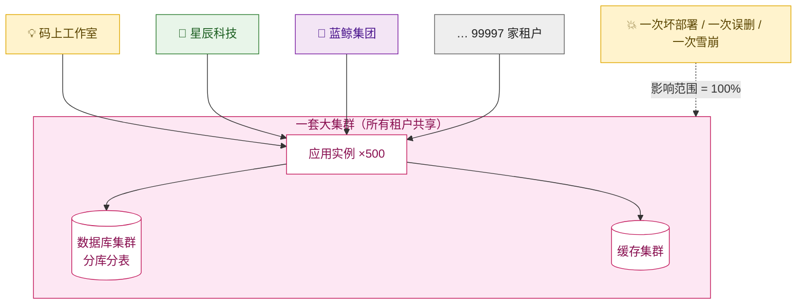

这套设计在租户少的时候**完全没问题**，而且最省钱（共享一切）。但当它长到 10 万家租户时，会暴露一个致命缺陷——**爆炸半径 = 100%**。

> **爆炸半径（Blast Radius，影响范围）**：系统一旦出故障，最坏情况下会波及多大范围。在单一大集群里，**任何一次故障的爆炸半径都是 100%**——所有租户一起遭殃。

### 哪些故障是「多 AZ / 多副本」也救不了的

很多工程师会说：「我做了多可用区（AZ，Availability Zone，可用区：同一地区里物理隔离、独立供电和网络的机房）部署、做了主从副本，还怕什么？」

问题在于：**多 AZ / 多副本只能防「基础设施级」故障**（一个机房断电、一台机器宕机）。但 SaaS 真正高频、真正致命的，是下面这几类——它们和你部署了几个副本**毫无关系**，因为坏的东西会被**同步复制到所有副本**：

| 故障类型 | 多 AZ / 多副本能救吗？ | 为什么 |
| --- | --- | --- |
| 一台机器宕机、一个机房断电 | ✅ 能救 | 这正是副本的用途 |
| **推了一个有 bug 的新版本** | ❌ 救不了 | 坏代码会部署到所有副本 |
| **一条写错的 SQL 误删了数据** | ❌ 救不了 | 删除操作会复制到所有从库 |
| **一个配置改错（如限流值设成 0）** | ❌ 救不了 | 配置推送给所有实例 |
| **某个租户的超大查询打爆了数据库** | ❌ 救不了 | 大家共用一个库（噪声邻居，详见第 11 章） |
| **缓存雪崩 / 连接池耗尽** | ❌ 救不了 | 共享资源被打穿 |

看出来了吗？SaaS 平台最常见的生产事故，根因往往是**人为操作、坏代码、坏配置**——而这些，**副本数量再多也防不住**，因为坏东西会忠实地复制到每一个副本。这就是单一大集群的死穴。

> 🧭 业界有一句很扎心的总结：**「与其追求永不失败，不如让每次失败只影响一小部分人。」** 在足够大的规模下，「永不出错」是不可能的——即使每个动作出错概率只有万分之一，每天几万次部署 / 运维操作下来，出错就是必然。既然失败无法消灭，那就**控制失败的影响范围**。这就是 Cell 架构的全部出发点。

---

## 13.2 Cell-based 单元化架构：把租户分进一个个独立小世界

### 核心定义

> **Cell（单元）**：一个**完整、自包含、互相隔离**的系统副本。每个 cell 包含**整套应用 + 整套数据 + 整套缓存**，只服务**一部分租户**。cell 之间**不共享数据、不互相调用**（这一点是铁律，后面会反复强调）。
>
> **大白话**：把原来的「一套大集群服务 10 万家」，切成「10 个小集群，每个服务 1 万家」。每个小集群就是一个 cell，麻雀虽小五脏俱全，是一份完整的云客 CRM。

### 单元化架构图

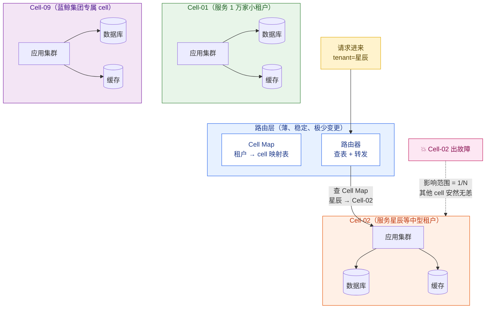

### Cell 架构怎么把爆炸半径最小化

这是本章最重要的一张「数学账」。假设我们把 10 万家租户均匀分到 **10 个 cell**：

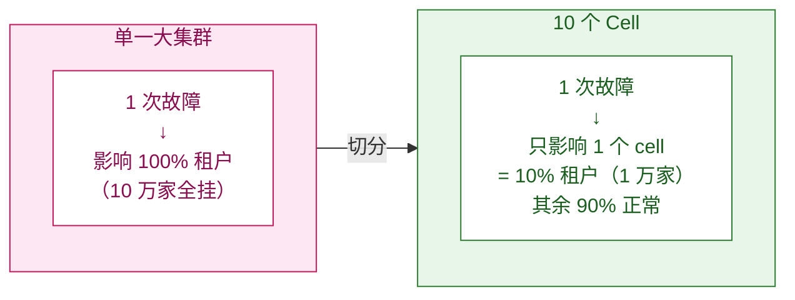

用一个公式总结：

> **N 个 cell ⟹ 单次故障的爆炸半径 ≤ 1/N。**
> 10 个 cell，一个 cell 全挂，平台整体可用性仍有 **90%**。
> 而且——**恢复也快 N 倍**：要恢复的只是 1/N 的数据，不是全部。误删了 Cell-02 的库，要恢复的是 1 万家、不是 10 万家的数据。

更妙的是，13.1 那张表里「多副本救不了」的故障，**cell 全都能挡住**：

- 推了坏版本？→ 先只推一个 cell，发现不对立刻回滚，只有这一个 cell 的租户被影响过。
- 误删了数据？→ 只删了一个 cell 的数据，其他 cell 完好。
- 配置改错了？→ 配置是 per-cell 推送的，只炸一个 cell。
- 某个租户超大查询打爆库？→ 只打爆它所在 cell 的库，别的 cell 的租户毫无感知。

### Cell 必须遵守的三条铁律

cell 架构看起来简单，但有三条**违反就前功尽弃**的纪律：

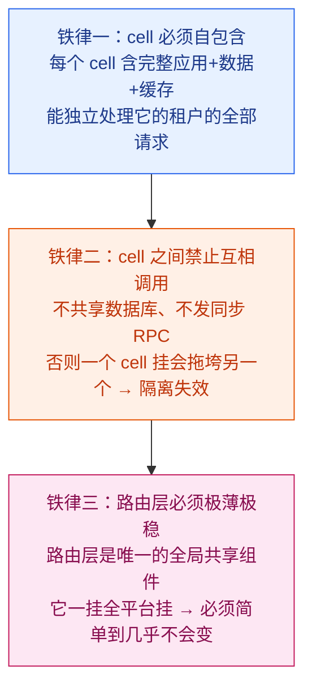

第二条铁律最容易被违反，也最致命。举个云客 CRM 的反例：假设 Cell-02 里的星辰科技要查一份报表，而报表服务图省事，直接去 Cell-05 的库捞了一点公共维表数据——**这一刻，cell 隔离就废了**。Cell-05 一挂，Cell-02 的报表也跟着挂，爆炸半径又回到了「跨 cell」。

> 🧭 正确做法：cell 之间如果真的有共享需求（比如全平台的汇率表、套餐定义），用**异步事件 + 本地缓存副本**，绝不用同步 RPC。让每个 cell 持有一份自己的数据拷贝，宁可冗余，也不要跨 cell 实时依赖。这呼应了第 5 章「Placement is configuration, isolation remains invariant」——隔离性是不能因为「图省事」而打折的不变量。

### Cell 该切多大？大 cell vs 小 cell 的权衡

切 cell 不是越小越好，这里有个经典权衡：

| 维度 | 小 cell（很多个小篮子） | 大 cell（少数几个大篮子） |
| --- | --- | --- |
| 爆炸半径 | **更小**（每个 cell 租户少） | 更大 |
| 单 cell 测试 / 部署难度 | **更简单** | 较复杂 |
| cell 总数量 | 多 → **运维负担重**（要管几十上百个 cell） | 少 → 运维轻 |
| 成本效率 | 低（每个 cell 都有固定开销，如控制面、监控） | **更高**（摊薄固定成本） |
| 资源浪费 | 容易出现「小 cell 装不满」 | 利用率高 |

> 🧭 业界的成熟经验：**从「少数几个大 cell」起步（比如 2~4 个），随着规模和自动化能力成熟，再逐步把 cell 切小。** 一上来就切几十个 cell，运维自动化跟不上，反而会被淹没在管理几十套基础设施的复杂度里。云客 CRM 的合理起点是 4~8 个 cell。

---

## 13.3 租户到 cell 的分配与路由：Cell Map

cell 架构里，最关键的全局组件就是那张 **Cell Map（单元映射表）**。它回答两个问题：**新租户该放进哪个 cell？请求进来该转发到哪个 cell？**

### Cell Map 长什么样

它本质上就是一张「租户 → cell」的映射表，存在一个高可用、高频读、低频写的存储里（通常是带强缓存的配置中心 / 专用元数据库）：

```sql
-- 云客 CRM · Cell Map（单元映射表，全局共享、极少变更）
CREATE TABLE cell_map (
    tenant_id     VARCHAR(32)  NOT NULL,          -- 租户 ID，如 T_星辰
    cell_id       VARCHAR(16)  NOT NULL,          -- 所在 cell，如 CELL-02
    region        VARCHAR(16)  NOT NULL,          -- 所在区域，如 cn / eu / us
    status        VARCHAR(16)  NOT NULL,          -- active / migrating / draining
    migrating_to  VARCHAR(16),                    -- 跨 cell 迁移时的目标 cell（见 13.7）
    updated_at    TIMESTAMP    NOT NULL DEFAULT now(),
    PRIMARY KEY (tenant_id)
);

-- 例子：三个租户的安置
-- T_码上  → CELL-01（小租户聚集 cell）  · region=cn · active
-- T_星辰  → CELL-02（中型租户 cell）    · region=cn · active
-- T_蓝鲸  → CELL-09（大客户专属 cell）  · region=cn · active
```

### 为什么不用「哈希取模」直接算 cell？

很多人第一反应是：「干嘛要一张映射表？直接 `cellId = hash(tenantId) % N` 算出来不就行了，连存储都省了。」

哈希取模有两个致命问题，让它**不适合 SaaS**：

1. **没法处理「大客户专属」**。蓝鲸集团 5 万座席，必须独占一个 cell（CELL-09），但哈希取模会把它随机丢到某个普通 cell，和一堆小租户挤在一起 → 噪声邻居灾难。
2. **没法平滑迁移**。哈希取模一旦想加 cell（N 从 10 变 11），**几乎所有租户的归属都会变**（取模的经典缺陷），等于要把所有租户全搬一遍家。

**显式映射表**则可以做到：大客户精确指派、新增 cell 时只迁移少数租户、迁移过程可控（13.7 会用到 `migrating_to` 字段）。所以 SaaS 几乎都用**显式 Cell Map**，而不是纯算法路由。这和第 5 章「分库用路由表而非纯哈希」是同一个工程哲学。

### 路由层：一个请求是怎么找到自己的 cell 的

来看一个完整画面——**李伟（星辰科技的销售）在浏览器里录入一个新客户「字节跳动」，这个请求是怎么被路由到正确 cell 的**：

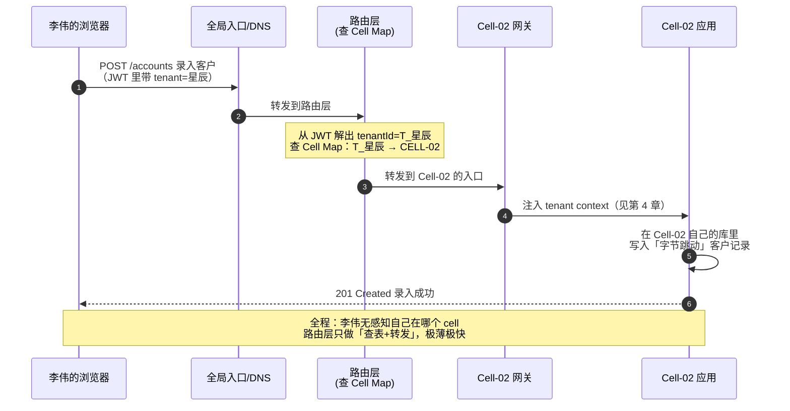

几个关键点：

- **路由层只做查表 + 转发**，不碰业务逻辑、不连业务库，这样它才能做到「极薄、极稳、极少变更」（铁律三）。
- **tenantId 从哪来？** 来自第 4 章讲的租户识别——JWT claim / 子域名 / Header。路由层在这里做的，是「拿到 tenantId → 查 Cell Map → 转发」这一步。
- **Cell Map 必须有强缓存**。它是每个请求都要读的全局组件，绝不能每次去查数据库。通常做法：路由层把整张 Cell Map 加载到本地内存，配置变更时通过推送或短 TTL 失效来更新。10 万条「租户→cell」映射，内存里也就几 MB。

### 新租户开通时怎么分配 cell

新公司注册云客 CRM 时（第 2 章「一个租户的一生」的开通环节），有一步就是**为它分配 cell**。常见的分配策略：

```java
/**
 * 新租户 cell 分配器
 * 在租户开通（provisioning）阶段调用，决定新租户落到哪个 cell。
 */
public class CellAllocator {

    public String allocateCell(TenantProvisionRequest req) {
        // 1) 大客户 / Enterprise 套餐：单独安置，甚至专属 cell
        //    10_000 是「单 cell 舒适承载座席数」的经验阈值（示意值，各平台不同）：
        //    超过这个量级的租户独占一个 cell，既能避免它把同 cell 的小租户挤成
        //    噪声邻居，也方便对它单独做容量规划和 SLA 保障。
        if (req.getPlan() == Plan.ENTERPRISE && req.getSeats() > 10_000) {
            // 蓝鲸集团这类巨型租户（5 万座席），直接给专属 cell（避免噪声邻居）
            return provisionDedicatedCell(req);
        }

        // 2) 区域约束优先：欧盟租户只能落到 eu 区的 cell（数据驻留，详见第 14 章）
        Region region = req.getDataResidencyRegion();   // cn / eu / us

        // 3) 在该区域的 cell 里，挑一个「最空」的（按剩余容量打分）
        //    用容量水位而非随机，避免某个 cell 被塞爆、另一个空着
        return pickLeastLoadedCell(region);
    }

    private String pickLeastLoadedCell(Region region) {
        // 取该区域所有 active 且未达容量上限的 cell
        // 按「剩余座席容量」降序，挑最空的那个
        // 注意：留出水位安全边际（如不超过 80%），给伸缩和迁移留空间
        return cellInventory.findActiveCells(region).stream()
                .filter(c -> c.getLoadFactor() < 0.8)        // 水位 80% 以下才接新租户
                .max(Comparator.comparingDouble(Cell::getFreeCapacity))
                .map(Cell::getId)
                .orElseGet(() -> scaleOutNewCell(region));   // 都满了？开一个新 cell
    }
}
```

分配策略的三条要点：

1. **大客户单独安置**——这和第 5 章「数据倾斜治理 = 把大客户拎出来」是同一个动作，只是这里粒度是「cell」而不是「库」。
2. **区域约束是硬条件**——欧盟租户绝不能落到中国区的 cell（合规红线，见第 14 章），这一条优先级最高。
3. **按容量水位挑 cell，不要随机**——并保留水位安全边际，给后续的弹性伸缩（第 11 章）和租户迁移留出腾挪空间。

---

## 13.4 租户级灰度发布：SaaS 灰度的正确姿势

现在进入本章的另一条主线：**怎么把新版本安全地发布给所有租户**。

### SaaS 灰度的特殊性：按「租户」灰，不是按「请求」灰

普通互联网应用的灰度，通常是「**先放 1% 的流量**到新版本」。但 SaaS **不能这么干**，原因是：

> 如果按「请求」灰度，**同一个租户的请求会一会儿打到新版本、一会儿打到旧版本**。对于有状态、跨多个请求的业务（比如李伟正在走的一个多步骤导入流程），这会导致行为诡异、数据错乱。更糟的是，没有任何一个租户能被「干净地观察」——所有租户都同时暴露在新旧两个版本下，出了问题分不清是谁的锅。

所以 **SaaS 灰度的单位是「租户」**：要么这个租户整体在新版本，要么整体在旧版本。灰度的推进，是**逐步增加「在新版本上的租户集合」**。

### 租户级灰度的标准节奏：内部 → 1% → 10% → 全量

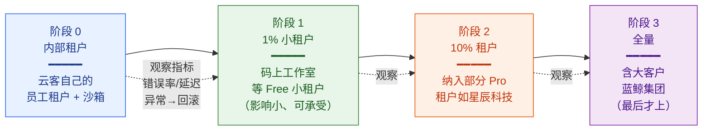

每个阶段的选择都有讲究：

| 阶段 | 选什么租户 | 为什么 |
| --- | --- | --- |
| **阶段 0：内部租户** | 云客自己员工用的租户、QA 沙箱租户 | 自己人先吃狗粮，出问题不影响真实客户，能拿到最真实的反馈 |
| **阶段 1：1% 小租户** | 💡 码上工作室这类 Free / 小租户 | 影响面小、SLA 要求低、即使短暂出问题也可承受 |
| **阶段 2：10% 租户** | 纳入一部分 🏢 星辰科技这类 Pro 中型租户 | 用更真实、更复杂的负载验证新版本 |
| **阶段 3：全量** | 最后才纳入 🏦 蓝鲸集团这类大客户 / Enterprise | 大客户 SLA 最高（99.95%）、最敏感、最后上，确保前面几轮已充分验证 |

> 🧭 **核心原则：永远让「影响小、可承受」的租户先吃新版本，让「影响大、最敏感」的大客户最后上。** 蓝鲸集团这种 5 万座席、要求 99.95% SLA 的金融客户，绝不能当小白鼠。每一阶段之间，都要观察一段时间的核心指标（错误率、P99 延迟、关键业务成功率，详见第 12 章的租户级监控），**指标异常立刻回滚，绝不硬推。**

### 灰度名单是怎么落地的：和 Feature Flag 的配合

「这个租户该用新版本还是旧版本」，本质上是一个**按租户开关的功能开关**。这正是第 10 章讲的 **Feature Flag（功能开关）** 的用武之地。灰度名单可以建模成一个「租户 → 是否启用新版本」的开关：

```java
/**
 * 租户级灰度决策
 * 决定某个租户的请求该走「新版本」还是「旧版本」逻辑。
 * 灰度名单本质是一个按租户维度的 Feature Flag（见第 10 章）。
 */
public class ReleaseGateway {

    /** 判断该租户是否已纳入本次灰度（即是否走新版本） */
    public boolean isOnNewVersion(String tenantId, String featureKey) {
        RolloutStage stage = rolloutConfig.getStage(featureKey);

        switch (stage) {
            case INTERNAL:
                // 阶段 0：只有内部租户走新版本
                return tenantRegistry.isInternal(tenantId);

            case CANARY_1PCT:
                // 阶段 1：内部租户 + 灰度白名单里的小租户
                //   注意：这里的「1%」不是代码按比例自动算出来的，而是运维
                //   手工挑选约 1% 的小租户（如码上工作室）显式塞进白名单。
                //   白名单试点阶段刻意要「人工精选」，确保先吃新版本的都是
                //   影响小、可承受的租户；真正的「按比例自动放量」要到下一阶段
                //   ROLLOUT_10PCT 才靠稳定哈希分桶实现。
                return tenantRegistry.isInternal(tenantId)
                        || rolloutConfig.getWhitelist(featureKey).contains(tenantId);

            case ROLLOUT_10PCT:
                // 阶段 2：白名单 + 按租户 ID 稳定哈希落在前 10% 的租户
                //   注意：必须是「稳定哈希」——同一租户每次结果一致，
                //   否则会出现「这个租户一会儿新版本一会儿旧版本」的灾难
                return isInternalOrWhitelisted(tenantId, featureKey)
                        || stableHashBucket(tenantId) < 10;

            case FULL:
                // 阶段 3：全量，所有租户都走新版本
                return true;

            default:
                return false;   // 默认走旧版本，安全兜底
        }
    }

    /** 稳定哈希分桶：把租户 ID 映射到 0~99 的桶，保证同一租户结果恒定 */
    private int stableHashBucket(String tenantId) {
        // murmur3：一种快速的非加密哈希算法，分布均匀、计算开销低，
        // 常用于分桶/分片场景。对同一 tenantId 永远算出同一个值。
        return Math.floorMod(Hashing.murmur3_32().hashString(tenantId, UTF_8).asInt(), 100);
    }
}
```

> **稳定哈希（Stable Hashing）**：对同一输入（这里是租户 ID）永远产出相同的桶号，不随时间、不随处理请求的实例而变化。正因为「同一租户恒定落在同一个桶」，才能保证它**要么始终在新版本、要么始终在旧版本**，而不会在两者间漂移。

注意代码里反复强调的「**稳定哈希**」：灰度判断必须**对同一个租户每次给出相同结果**，否则就退化成了我们一开始批判的「按请求灰度」——同一租户在新旧版本间反复横跳。

> 🧭 **灰度 = Feature Flag（第 10 章）+ 租户维度 + 逐步放量。** 这里我们复用了第 10 章已经讲透的开关机制，只是把开关的「评估维度」固定为租户，并加上「分阶段放量」的节奏控制。如果新版本出了大问题，把开关一关（kill switch，紧急关闭开关），所有租户瞬间回到旧版本——这是灰度最大的安全感来源。

---

## 13.5 蓝绿部署 vs 金丝雀发布：两种发布机制的本质区别

13.4 讲的是「**发给哪些租户**」（灰度的策略层）。这一节讲「**新旧版本在物理上怎么切换**」（部署的机制层）。最常见的两种机制是**蓝绿部署**和**金丝雀发布**。很多人把它俩搞混，这里彻底讲清。

### 蓝绿部署（Blue-Green Deployment）

> **蓝绿部署**：准备**两套完整环境**——蓝（当前线上版本）和绿（新版本）。把新版本完整部署到「绿」环境并验证通过后，**把全部流量从蓝一次性切到绿**。出问题就立刻切回蓝。
>
> **大白话**：你有两个一模一样的舞台，蓝台在演（线上），同时悄悄在绿台排练好新戏。某一刻，灯光「啪」地从蓝台切到绿台。观众瞬间看到新戏。不好看？灯光再「啪」地切回蓝台。

### 金丝雀发布（Canary Release）

> **金丝雀发布**：新版本**先只接收一小部分流量 / 一小撮租户**（这一小撮就叫「金丝雀」），新旧版本**同时在线**。观察金丝雀没问题，再逐步加大新版本的比例，直到 100%。
>
> **名字由来**：早年矿工下井带一只金丝雀，金丝雀对瓦斯敏感，它先死说明井下有毒气，矿工赶紧撤。金丝雀发布就是让一小撮租户当「探测器」——它们先暴露在新版本下，没事再放大。

### 对比图

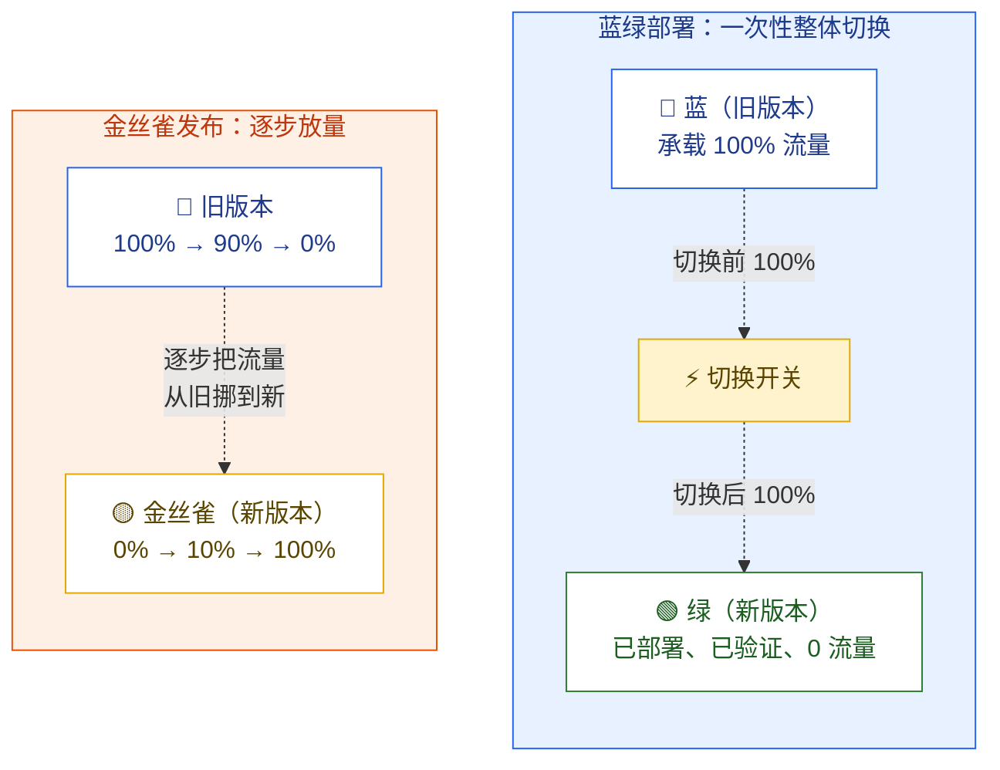

### 关键差异一张表

| 维度 | 蓝绿部署 | 金丝雀发布 |
| --- | --- | --- |
| 新旧版本是否同时承载真实流量 | 否（切换前只有蓝，切换后只有绿） | **是**（新旧同时在线一段时间） |
| 切换粒度 | 一次性、全量切换 | 逐步、按比例 / 按租户放量 |
| 回滚速度 | **极快**（流量切回蓝即可） | 较快（停止放量 + 把金丝雀流量切回旧） |
| 资源成本 | **高**（要常备两套完整环境） | 低（新版本只需少量额外实例） |
| 发现问题时的影响面 | 切换瞬间会瞬时波及 100% 流量，但因蓝环境仍在、可秒级切回，实际暴露窗口很短 | **小**（只影响金丝雀那一小撮） |
| 适合的场景 | 版本切换风险已充分测试、追求快速回滚 | 想用真实流量验证、把风险压到最小 |

### 在 Cell 架构里，它俩这样配合（这才是重点）

单独看蓝绿和金丝雀，是单环境视角。**放到 cell 架构里，威力才完全释放**——因为 cell 本身就是天然的「放量颗粒度」：

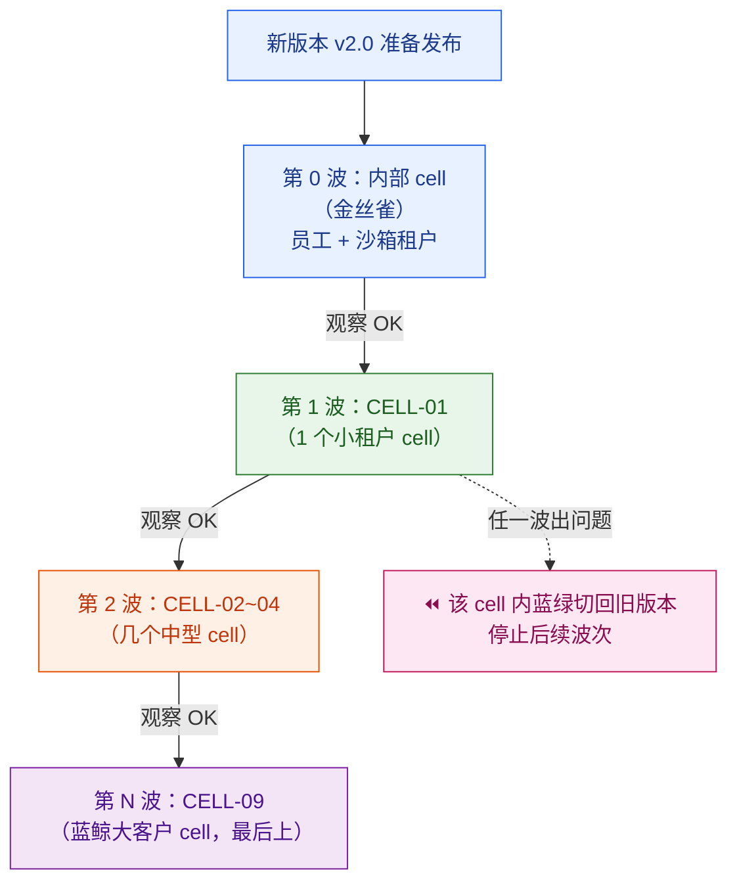

这就是头部 SaaS 真实的发布范式——**两个机制各管一层**：

- **跨 cell：用金丝雀思路「分波次」**——一波发一个或几个 cell，cell 与 cell 之间逐步推进（这正是 13.4 的租户级灰度，只是颗粒度变成了 cell）。
- **单 cell 内：用蓝绿做「快速可回滚的整体切换」**——在某个 cell 内部，新版本先部署到绿环境，验证通过后整体切换；这个 cell 内出问题，蓝绿让它能秒级切回旧版本，且只影响这一个 cell。

> 🧭 一句话记住：**cell 给你「爆炸半径」，金丝雀给你「逐步放量」，蓝绿给你「秒级回滚」。** 三者叠加，就是「一个 bug 最多只能伤到一个 cell 里的少数租户，且能立刻撤回」——这就是大规模 SaaS 的发布安全网。

---

## 13.6 多区域部署：把租户摆到正确的 region

云客 CRM 的规模基准里写着「数据驻留区域：中国 / 欧盟 / 北美」。这一节讲**怎么把系统部署到多个区域，以及租户怎么落到正确的 region**。

> 📌 **再次强调边界**：「为什么欧盟租户的数据必须留在欧盟」是 **GDPR（General Data Protection Regulation，欧盟通用数据保护条例）** 等合规要求，**动因交给第 14 章**。本节只回答工程问题：**多区域系统物理上怎么摆、租户怎么路由到对的 region。**

### 多区域部署图

区域（Region）是比 cell 更高一层的隔离单位。**每个区域里，再切分成若干个 cell。** 区域之间是物理上完全独立的部署（不同的数据中心 / 云区域），数据**不跨区流动**。

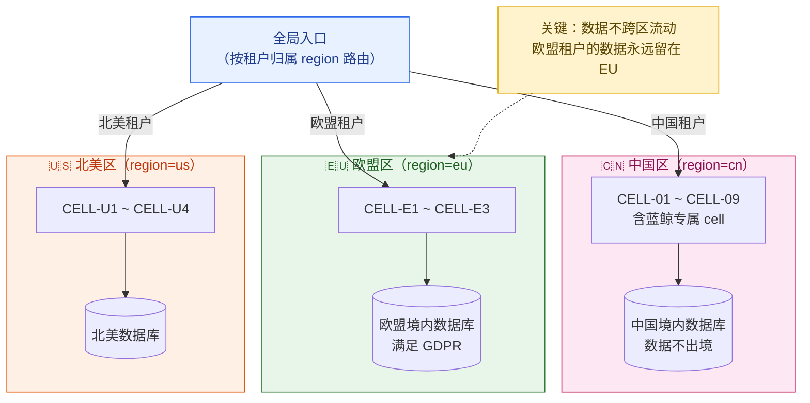

### 租户怎么落到正确的 region

租户的 region 在**开通时就确定**（13.3 的 `CellAllocator` 已经体现：region 是 cell 分配的硬约束），并写进 Cell Map 的 `region` 字段。之后：

1. **路由层先按 region 分流，再按 cell 分流**。即两级路由：`tenant → region → cell`。一个欧盟租户的请求，全局入口先把它甩到 EU 区，EU 区内的路由层再查 Cell Map 找到具体 cell。
2. **数据不跨区**。EU 区的库只存 EU 租户的数据，永远不复制到其他区。这是数据驻留的物理保证。
3. **应用层是「按区独立部署」的多套副本**，不是「一套全球应用 + 多个数据库」。每个区都是一份完整的云客 CRM（含完整的 cell 集合）。

### 多区域 ≠ 一个租户跨区多活

这里要破除一个常见误解。互联网 C 端常说的「多活」，往往指「**同一份数据在多个地区都有副本，用户就近访问，互为容灾**」。但 SaaS 的多区域，通常是**「分区而治」而不是「同一租户多区多活」**：

| 模式 | 含义 | SaaS 是否常用 |
| --- | --- | --- |
| **分区而治（按数据驻留分区）** | 每个租户固定属于一个区，数据只在本区，区间互不复制 | ✅ **SaaS 主流**（合规驱动） |
| **同租户跨区多活** | 同一租户的数据在多区都有热副本，可任意区读写 | ⚠️ 少见——因为它**直接违反数据驻留**（数据跨区了） |

> 🧭 为什么 SaaS 默认「分区而治」？因为**数据驻留合规（第 14 章）几乎否决了「同一租户数据跨区漂移」**。欧盟租户的数据如果为了「多活」而复制到了北美，立刻就违反了 GDPR。所以 SaaS 的「多区域」本质是**把不同租户摆到不同区**（按合规和就近原则），而**同一个租户通常就活在一个区**——它的高可用靠「区内的多 AZ + 多 cell」来保证，而不是靠「跨区复制」。

---

## 13.7 租户跨 cell 迁移：把成长型租户搬进专属 cell

最后一块拼图：租户**已经在某个 cell 里跑着**，但因为某些原因需要**搬到另一个 cell**。这是 cell 架构的常见运维动作。

### 什么时候需要跨 cell 迁移

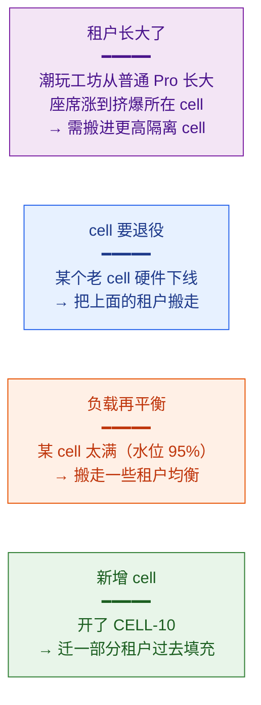

### 迁移流程：和第 5 章「租户搬家」是同源的

跨 cell 迁移的核心，和第 5 章的「租户从 Pool 搬到 Silo」**本质上是同一套在线迁移方法论**——只是这里搬的是「整个 cell 的归属」，第 5 章搬的是「数据层位置」。两者都遵循同一条铁律：**不停机、不丢数据、不串数据**。

下面以一个虚构的成长型 Pro 中型租户 **🛍️ 潮玩工坊**（座席增长很快，已快把所在的 CELL-02 挤满）为例，演示把它从普通的 CELL-02 迁移到隔离更强的专属 CELL-10 的完整流程（注意：蓝鲸集团天生就在专属 CELL-09，不需要这套迁移；这里换一个还在普通 cell 的租户来演示「搬家」更贴切）：

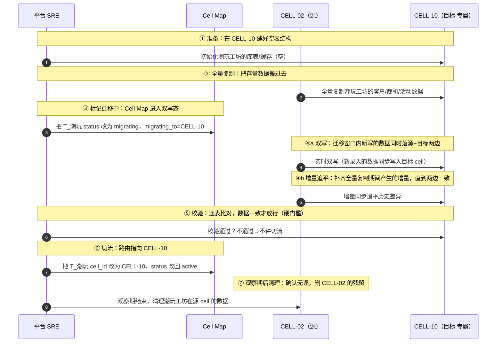

关键铁律（与第 5 章呼应，这里只点 cell 迁移特有的注意点）：

1. **Cell Map 是切流的总开关**。第 ⑥ 步「改 `cell_id`」是整个迁移的「切换瞬间」——因为路由层完全靠 Cell Map 决定请求去哪。这一步必须原子、可回滚（出问题立刻把 `cell_id` 改回 CELL-02）。
2. **`migrating` 状态期间，写要双写**。第 ③~④ 步进入 `migrating` 态后，新写入要同时落到源 cell 和目标 cell，否则迁移窗口内潮玩工坊的销售新录的客户会丢。这正是 Cell Map 里 `status` 和 `migrating_to` 字段存在的意义。
3. **校验是硬门槛**（第 ⑤ 步）。两边数据没比对一致，**绝不允许切流**——这是「不丢、不串」的最后一关。
4. **源数据先别急着删**（第 ⑦ 步）。切流后留一段观察期，万一目标 cell 有问题，能立刻把 Cell Map 切回源 cell。
5. **全局唯一 ID 是前提**。和第 5 章一样，如果用的是数据库自增 ID，跨 cell 搬数据时 ID 会和目标 cell 的序列撞车。所以应用层全局 ID（第 5 章强调过）从第一天就该用。

> 🧭 你会发现，跨 cell 迁移（13.7）、租户搬家（第 5 章 5.8）、租户级灰度切流（13.4）三件事，骨架完全一样：**全量复制 → 双写 → 增量追平 → 校验 → 灰度切流 → 清理**。掌握这一套「在线迁移六步法」，SaaS 平台里几乎所有「把租户从 A 挪到 B 而不停机」的运维都能套用。这是平台 SRE 的核心内功。

---

## 13.8 版本管理：让「现在线上是哪个版本」永远可回答

cell 架构带来一个新麻烦：**不同 cell 可能跑着不同版本**（灰度推进中，CELL-01 已经是 v2.0，CELL-09 还是 v1.9）。这就要求版本管理必须清晰、可追溯。

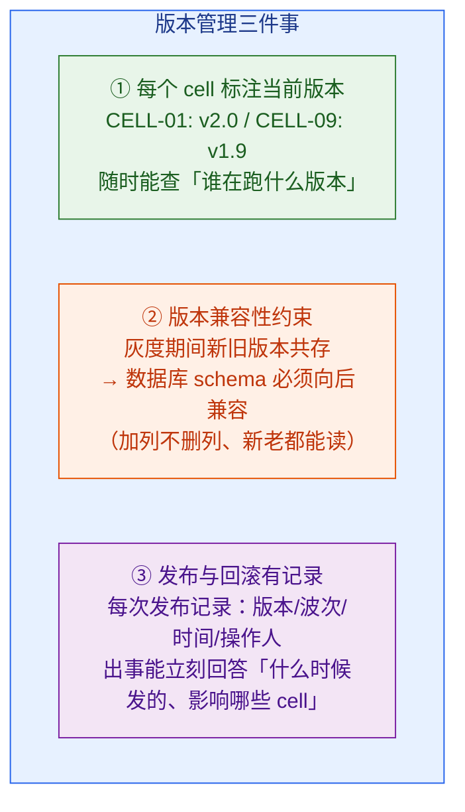

三件事里，**第②条「向后兼容的数据库变更」最容易被忽视、又最容易酿成事故**：

> ⚠️ 灰度期间，CELL-01 跑 v2.0、CELL-02 还跑 v1.9，但它们**可能共享同一套表结构定义模板**，甚至同一个租户在迁移窗口里被新旧版本同时写。如果 v2.0 的发布**删掉了一个旧列 / 改了某列的语义**，那 v1.9 的代码读到这张表就会炸。
>
> 🧭 **铁律：数据库 schema 变更必须「先加后用、只加不删」。** 发新版本时，先发一个「只加新列、不删旧列、不改旧列语义」的兼容版本，等所有 cell 都升上来、确认旧列彻底没人用了，再在后续版本里删旧列。这叫**扩展-收缩模式（Expand-Contract，又叫并行变更 Parallel Change）**：先扩展（加新结构、新老并存），全量切换后再收缩（删旧结构）。这条原则保证了「新旧版本共存期间，谁都不会读到自己看不懂的数据」。

这一条和第 12 章「可观测性」深度配合：当某次发布出问题，你需要能在监控里**一眼看出「哪个 cell、哪个版本、什么时候开始异常」**——这要求指标和日志都带上 `cell_id` 和 `version` 标签（第 12 章的 tenant-aware 指标，在 cell 架构下要再加一维 cell-aware）。

---

## 本章小结

本章我们戴上平台 SRE 的帽子，回答了「云客 CRM 这套系统物理上怎么摆、新版本怎么安全铺开」这个问题。核心可以浓缩成下面这张图：

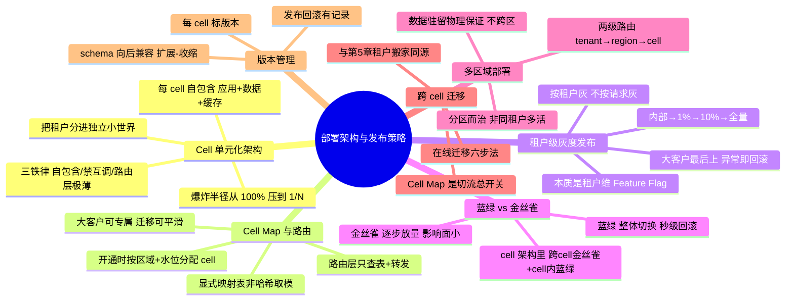

1. **Cell 单元化架构的出发点是「控制爆炸半径」**：单一大集群的故障爆炸半径是 100%，且多副本救不了坏代码 / 误操作 / 坏配置；切成 N 个自包含的 cell，单次故障最多伤 1/N，且恢复快 N 倍。
2. **三条铁律不能破**：cell 必须自包含、cell 之间禁止同步互调、路由层必须极薄极稳。第二条最易被「图省事的跨 cell 调用」破坏，破了隔离就全废。
3. **Cell Map 是全局心脏**：用显式映射表（而非哈希取模）实现租户→cell 路由，才能支持大客户专属、平滑迁移；路由层只做查表+转发，开通时按「区域硬约束 + 容量水位」分配 cell。
4. **SaaS 灰度按「租户」而非「请求」**：节奏是内部 → 1% 小租户 → 10% → 全量，大客户（蓝鲸）永远最后上；它本质是第 10 章 Feature Flag 在租户维度的应用 + 稳定哈希分桶 + 分阶段放量。
5. **蓝绿与金丝雀各管一层**：cell 给爆炸半径、金丝雀给逐步放量（跨 cell 分波次）、蓝绿给秒级回滚（cell 内整体切换）——三者叠加构成发布安全网。
6. **多区域是「分区而治」**：按数据驻留把不同租户摆到不同区（中国/欧盟/北美），数据不跨区；同一租户通常活在一个区，靠区内多 AZ + 多 cell 保高可用，而不是跨区复制。
7. **跨 cell 迁移 = 在线迁移六步法**（全量复制 → 双写 → 增量追平 → 校验 → 灰度切流 → 清理），与第 5 章租户搬家同源；Cell Map 是切流总开关，校验是硬门槛。
8. **版本管理要点是 schema 向后兼容**（扩展-收缩模式），保证灰度期间新旧版本共存时谁都不会读到看不懂的数据。

> 至此，「弹性与运维」这条主线接近收口：第 11 章讲单个 cell 内部怎么扩缩容、防噪声邻居；第 12 章讲怎么观测；本章讲整个系统怎么摆、怎么发版。最后一块是**安全与合规**——前面我们多次「欠账」给第 14 章的数据驻留合规动因、防跨租户越权、GDPR/SOC2，都将在下一章兑现。请看第 14 章《安全与合规》。

---

## 参考来源

- [AWS Well-Architected — Reducing the Scope of Impact with Cell-Based Architecture](https://docs.aws.amazon.com/wellarchitected/latest/reducing-scope-of-impact-with-cell-based-architecture/welcome.html)（AWS 官方对 cell 架构、爆炸半径、cell 部署与路由的权威阐述，本章的方法论母本）
- [AWS Builders' Library — SaaS meets cell-based architecture: A natural multi-tenant fit](https://github.com/aws-samples/aws-saas-cell-based-architecture)（AWS SaaS 单元化实战工作坊：cell 的开通、配置、可观测、路由与分片）
- [Salesforce Engineering — Architectural Principles for High Availability on Hyperforce](https://engineering.salesforce.com/architectural-principles-for-high-availability-on-hyperforce/)（头部 SaaS 真实的 cell 构造：多 AZ、cell 隔离限爆炸半径、滚动/蓝绿/金丝雀分波次发布）
- [Martin Fowler — ParallelChange (Expand-Contract)](https://martinfowler.com/bliki/ParallelChange.html)（向后兼容数据库变更的扩展-收缩模式，灰度期间新旧版本共存的安全前提）
- [Google SRE Book — Canarying Releases](https://sre.google/workbook/canarying-releases/)（金丝雀发布的指标观察、放量节奏与回滚判定，发布安全网的工程化方法）
