# 第 14 章 安全与合规

> 前面十三章我们把一座 SaaS 大楼盖了起来：第 3~5 章砌好了租户隔离的承重墙，第 6~7 章装好了门禁与权限，第 8~10 章接通了收费的水电表，第 11~13 章让大楼能扛流量、能监控、能在多个城市开分店。本章是给这座楼装**保险柜、防盗系统、消防通道和合规验收单**——当蓝鲸集团这种金融客户在签合同前问出那句几乎所有大客户都会问的话「**你们的数据加密吗？跨租户会不会串？拿到 SOC2 了吗？我们欧洲的客户数据能不能留在欧洲？**」时，你的系统能不能给出让人放心的答案。
>
> 安全与合规不是上线前临时贴的一层膏药，而是从第一行表结构就该埋进去的基因。一次跨租户数据泄漏，对普通系统是 bug，对 SaaS 平台是**公司倒闭级事故**。

---

## 本章导读

读完本章，你应该能回答这些问题：

- 数据加密分哪**三层**（传输中 / 静态 / 字段级），分别防的是谁、用的是什么技术？为什么「全站 HTTPS」只解决了三分之一的问题？
- 什么是 **BYOK（自带密钥）**？为什么蓝鲸集团这种金融客户宁愿自己管密钥，也不信任平台？平台又怎么做到「数据在我这，但解密的钥匙在你手里」？
- 既然第 5 章已经有了 `tenant_id` 和 RLS，为什么本章还要讲**纵深防御**？「应用层已经过滤了」为什么远远不够？
- 一个真实的**跨租户越权攻击**是怎么一步步发生的？网关、应用、数据库、审计这**四道防线**分别在哪个环节把它拦下来？
- **GDPR** 的「被遗忘权、数据可携权、同意管理」到底要求系统做什么？蓝鲸的一个欧洲客户发来「请删除我的全部数据」时，云客 CRM 内部会触发哪些动作？
- 什么是**数据驻留**？为什么「欧盟客户的数据必须留在欧盟」会反过来约束你的部署架构？
- **SOC2 / ISO 27001** 到底是什么？为什么企业客户采购前一定要看？工程师需要为审计准备什么？
- 数据该**保留多久、怎么删干净**？「软删除」为什么在合规面前会变成定时炸弹？
- 怎么用**威胁建模**系统性地盘点「我这套系统会被从哪些地方打」？

> 📌 本章的边界：**数据隔离的具体实现**（`tenant_id`、RLS、分库分表）已在第 5 章讲透，这里只讲它如何成为安全防线的一环；**审计日志怎么落地存储**是第 12 章的事，本章讲「合规为什么离不开审计日志」；**多区域部署的工程实现**是第 13 章的事，本章讲「数据驻留这条合规要求如何反向约束部署」。本章聚焦的是把这些零件**组装成一套能通过企业安全问卷和第三方审计的防御体系**。

---

## 14.1 先建立一个心智模型：安全是「层」，合规是「证」

工程师最容易犯的错，是把「安全」想成一个开关——「我们加密了吗？加了，安全。」真实世界里，安全是一**叠**互相兜底的防线，合规则是把这叠防线**写成文档、被第三方查验、开出证书**的过程。

先把两个核心概念用大白话讲清：

- **安全（Security）**：技术手段，防止数据被偷、被改、被越权访问。它是「事实」——你的系统客观上安不安全。
- **合规（Compliance）**：法律与标准要求，证明你的安全措施达到了某个公认标准。它是「证据」——你能不能**向别人证明**你安全。

> 🔑 **一句话区分**：安全是「我家装了三道锁」，合规是「保险公司派人来检查，确认三道锁都符合国标，给我开了张证明，我才能拿去跟客户签单」。**有安全不一定有合规（你装了锁但没人认证），有合规一定建立在安全之上（没锁的话审计员第一天就把你打回去）。**

下面这张图是本章的总地图——一条客户请求从外面打进来，要穿过的**安全层**，以及横切在旁边监督这一切的**合规要求**。

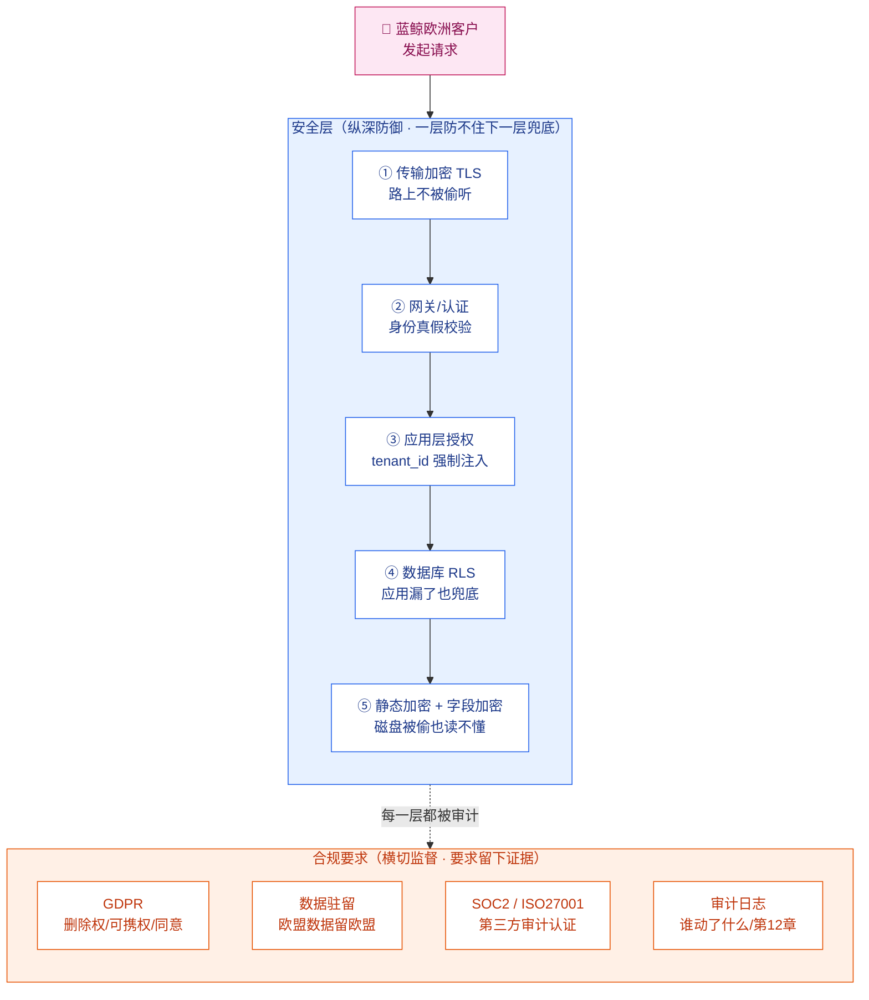

记住这张图的两条主线：**左边是「层」（安全靠纵深防御），右边是「证」（合规靠证据留痕）**。本章接下来 14.2~14.4 讲左边的层，14.5~14.7 讲右边的证。

---

## 14.2 数据加密三层：传输中、静态、字段级

「你们数据加密吗？」是企业安全问卷上的第一题，也是最容易答错的题。很多团队答「我们全站 HTTPS」就觉得过关了——其实那只覆盖了三层中的**最外面一层**。

先把三个术语用大白话讲清：

- **传输中加密（Encryption in-transit）**：数据在**网络上跑**的时候是密文。靠 **TLS（Transport Layer Security，传输层安全：给网络连接套一层加密管道，路上的人截获也只看到乱码，HTTPS 里的 S 就是它）**。防的是「中间人偷听」。
- **静态加密（Encryption at-rest）**：数据**躺在磁盘上**的时候是密文。靠数据库 / 磁盘的透明加密。防的是「机房硬盘被偷、备份文件泄漏」。
- **字段级加密（Field-level / Application-level encryption）**：在写进数据库**之前**，应用就把某些敏感字段（手机号、身份证、银行卡）加密成密文。防的是「连数据库管理员（DBA）和平台运维都不该看到明文」。

为什么要分三层？因为它们防的是**完全不同的攻击者**，覆盖完全不同的环节。下面这张图把云客 CRM 一条客户记录从浏览器到磁盘的全程，标出每一层加密在哪里生效。

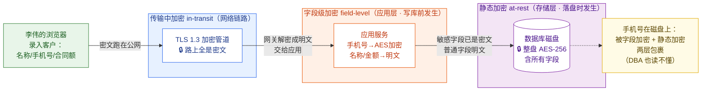

> 📌 这张图按**数据物理流向**排列（数据先过网络链路、再过应用层写库前、最后落盘），所以顺序是「传输中 → 字段级 → 静态」。这只是数据流经的先后，**不是**正文与下方速查表里固定的编号顺序（① 传输中 / ② 静态 / ③ 字段级）——别把图里的位置先后和正文的编号对号入座。

### ① 传输中加密：TLS，但魔鬼在配置细节里

「上 HTTPS」谁都会，但合规审计员会追问三件事：

1. **TLS 版本**：必须 **TLS 1.2 及以上**，禁用早已被攻破的 SSLv3 / TLS 1.0 / 1.1。蓝鲸的安全问卷里会明确写「不接受 TLS 1.1 以下」。
2. **内部流量也要加密**：很多团队外网 HTTPS、内网服务之间却是明文 HTTP——这叫「**软糖架构**」（外壳硬、内里软）。一旦攻击者突破边界进了内网，就能在服务之间随意监听。零信任要求**服务间也走 mTLS（mutual TLS，双向 TLS：不仅客户端验服务端，服务端也验客户端身份，两边都拿证书互证）**。
3. **HSTS**：通过 `Strict-Transport-Security` 响应头强制浏览器**只用 HTTPS**，防止有人把链接降级成 HTTP 钓鱼。

```nginx
# 云客 CRM 网关层 TLS 配置（Nginx 片段）
server {
    listen 443 ssl http2;
    server_name api.cloudcrm.com;

    # 只允许 TLS 1.2 / 1.3，老旧不安全协议一律拒绝
    ssl_protocols TLSv1.2 TLSv1.3;
    # 优先选择前向保密（PFS）的加密套件——即使私钥日后泄漏，历史流量也解不开
    ssl_ciphers ECDHE-ECDSA-AES256-GCM-SHA384:ECDHE-RSA-AES256-GCM-SHA384;
    ssl_prefer_server_ciphers on;

    # HSTS：告诉浏览器未来一年只准用 HTTPS 访问本站，子域名也算
    add_header Strict-Transport-Security "max-age=31536000; includeSubDomains; preload" always;
}
```

### ② 静态加密：默认开，但要想清楚「钥匙归谁」

静态加密今天几乎是云数据库的**默认能力**——AWS RDS、阿里云 RDS 勾一个选项就开了整盘 AES-256 加密。它防的是物理介质泄漏：硬盘被偷、备份磁带丢了、快照被误公开。

但静态加密有个**致命的认知陷阱**：它防的是「外人偷走硬盘」，**防不住「合法登录数据库的人」**。因为数据库读出来给应用时是自动解密的——DBA 执行一条 `SELECT`，看到的就是明文。所以静态加密对「内部人作恶」和「应用层被攻破」基本无效。

这就引出了第三层。

### ③ 字段级加密：对最敏感的字段「单独上锁」

静态加密是「整个保险柜上一把锁」，字段级加密是「保险柜里再给现金、护照单独上小锁」。它的核心价值是：**即使有人拿到了数据库的全部明文权限（DBA、被拖库的攻击者），最敏感的几个字段他依然看到的是乱码。**

云客 CRM 里需要字段级加密的，是客户联系人的**手机号、身份证号、银行账号**这类 PII（Personally Identifiable Information，个人可识别信息：能直接定位到某个具体自然人的数据）。客户名称、行业、商机金额这类一般不需要——加密是有代价的（不能直接 `LIKE` 模糊查询、不能直接排序、CPU 开销），只对真正敏感的字段做。

```java
// 云客 CRM · 联系人手机号字段级加密（MyBatis TypeHandler 自动加解密）
// 设计思路：手机号在 Java 对象里始终是明文，在写库/读库的瞬间自动转换
// 业务代码完全无感知，从根上杜绝「某个 service 忘了加密直接落库」
public class PhoneEncryptHandler extends BaseTypeHandler<String> {

    // 写库：明文 → 密文。加密用的数据密钥来自 KMS（见 14.3）
    @Override
    public void setNonNullParameter(PreparedStatement ps, int i,
                                    String plainPhone, JdbcType type) throws SQLException {
        // 注意：加密时绑定 tenantId，不同租户用不同的数据密钥（租户级密钥隔离）
        String cipher = FieldCrypto.encrypt(plainPhone, TenantContext.tenantId());
        ps.setString(i, cipher);
    }

    // 读库：密文 → 明文。解密失败（密钥不对/数据损坏）必须抛错，绝不返回脏数据
    @Override
    public String getNullableResult(ResultSet rs, String column) throws SQLException {
        String cipher = rs.getString(column);
        return cipher == null ? null
                : FieldCrypto.decrypt(cipher, TenantContext.tenantId());
    }
}
```

> ⚠️ **字段级加密的现实代价（别理想化）**：加密后的字段**无法用数据库索引精确/范围查询**。如果业务需要「按手机号搜客户」，常见折中是额外存一列 **HMAC（Hash-based Message Authentication Code，带密钥的哈希：把手机号算成一个固定指纹，相同手机号指纹一定相同，但反推不出原文）** 做等值匹配——搜的时候把输入手机号也算成指纹去比对。模糊查询（`138*`）则基本告别。**所以加密哪些字段，是产品和安全一起拍板的取舍，不是越多越好。**

### 三层加密对比速查表

| 维度 | ① 传输中 in-transit | ② 静态 at-rest | ③ 字段级 field-level |
|---|---|---|---|
| **防的攻击者** | 网络中间人偷听 | 偷硬盘/拖备份的人 | DBA、内鬼、拖库后的攻击者 |
| **加密发生在** | 网络链路上 | 磁盘写入时 | 应用写库前 |
| **典型技术** | TLS 1.2+/mTLS | 云盘 AES-256 透明加密 | 应用 AES-GCM + KMS |
| **谁能看到明文** | 两端的服务都能 | 任何能连库的人 | 只有持密钥的应用 |
| **对查询的影响** | 无 | 无 | 大（不能直接索引/模糊查） |
| **云客 CRM 用在** | 全部流量（强制） | 整库（默认开） | 手机号/身份证/银行卡 |

---

## 14.3 租户级密钥与 BYOK：数据在我这，钥匙在你手里

上一节说加密，但加密永远绕不开一个灵魂问题：**钥匙（密钥）放哪、归谁管？** 这是大客户最在意、也最能体现 SaaS 平台安全成熟度的地方。

### 第一步：先理解 KMS 和「信封加密」

直接用一把密钥加密所有数据，是新手做法——一旦这把钥匙泄漏，全平台数据全裸奔，而且换钥匙意味着要把几百亿条记录全部重新加密一遍，根本做不到。业界标准做法是 **KMS + 信封加密**。

- **KMS（Key Management Service，密钥管理服务：云厂商提供的「保险柜的保险柜」，专门用来安全地生成、保管、轮换密钥，密钥本身永远不出 KMS）**。
- **信封加密（Envelope Encryption）**：用一把「数据密钥 DEK」加密真实数据，再用一把「主密钥 KEK」加密这把数据密钥。**就像把信（数据）锁进信封（DEK 加密），再把信封的钥匙锁进保险柜（KEK 加密）。** KEK 永远不离开 KMS，DEK 可以跟数据一起存（因为它本身是密文）。

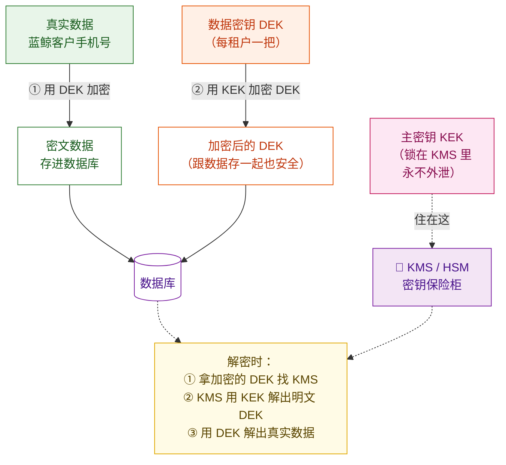

信封加密带来两个巨大好处：① **换主密钥（KEK）超快**——只要用新 KEK 把那些「加密后的 DEK」重新加密一遍（数据量极小），真实数据一个字节都不用动。这叫**密钥轮换（Key Rotation）**。② **数据密钥可以做到「每租户一把」**——这就是租户级密钥隔离。

### 第二步：租户级独立密钥——爆炸半径控制

云客 CRM 给**每个租户分配独立的数据密钥 DEK**。这么做的核心理由是**爆炸半径（blast radius）控制**：

- 如果全平台共用一把 DEK，一旦泄漏，10 万家租户数据全完蛋。
- 每租户一把 DEK，即使某一把泄漏，**也只影响这一家**，其余 9.9 万家安然无恙。

这和第 5 章的 `tenant_id` 隔离是**同一种哲学在密钥层的延伸**——隔离不只发生在数据行上，也发生在密钥上。星辰科技和码上工作室就算数据存在同一张共享表里，它们的手机号也是用**两把不同的钥匙**加密的，物理上不可能用一把钥匙解开另一家。

### 第三步：BYOK——把钥匙的控制权交给客户

到这里平台还是密钥的主人。但蓝鲸集团这种金融客户会提出更高要求：「**我不信任你平台。数据可以存你那，但解密的钥匙必须我自己管。我什么时候想让你看不到我的数据，吊销钥匙就行。**」

这就是 **BYOK（Bring Your Own Key,自带密钥:客户用自己的 KMS 生成并保管主密钥 KEK,平台用客户的 KEK 来加解密,客户随时能吊销,一吊销平台立刻读不出该租户任何数据)**。

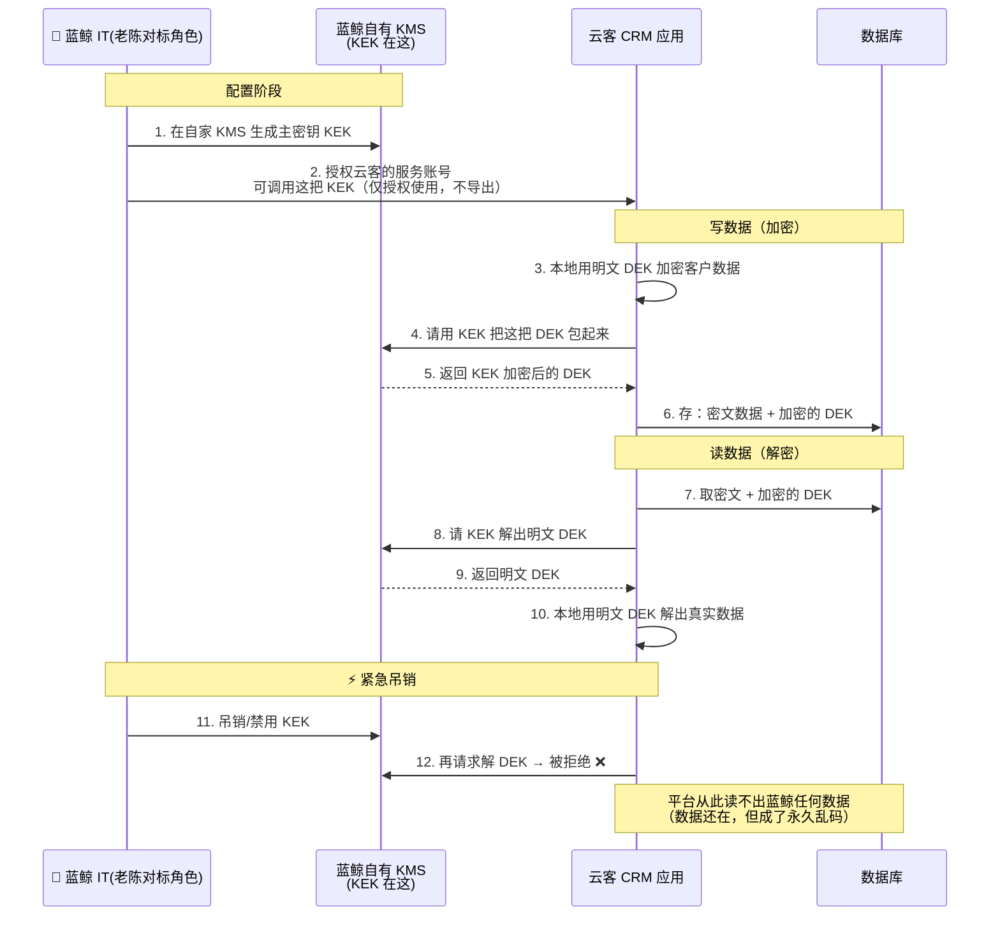

BYOK 的精妙之处在于**控制权与存储权的分离**：

- **数据存在平台**（平台负责可用性、备份、运维）。
- **钥匙归客户管**（客户拥有「让平台失明」的开关）。

对客户的安全意义：① 平台被黑、被法院强制要求交数据时，平台**拿不出明文**（钥匙不在它手里）；② 客户终止合作，吊销密钥即可让平台彻底无法读取其历史数据，比「请你帮我删」更可信。

> 🔑 **工程师视角的关键认知**：BYOK 不是「客户给你一把钥匙存着」，而是「**平台每次加解密都要去调客户的 KMS**」。这意味着平台和客户 KMS 之间有一条**强依赖链路**——客户 KMS 挂了，该租户就读不出数据。所以 BYOK 通常只对 Enterprise 大客户开放，且要做好 DEK 的本地缓存（短 TTL）和降级预案，否则一次客户侧 KMS 抖动就是一次 P0 事故。这也是为什么码上工作室、星辰科技用平台托管密钥就够了，**只有蓝鲸这种合规驱动、且有自建 KMS 能力的客户才上 BYOK**。

### 三档密钥方案与租户分层的对应

| 密钥方案 | 钥匙归谁 | 适用租户 | 对应套餐 |
|---|---|---|---|
| **平台单一密钥** | 平台 | 不推荐（爆炸半径太大） | — |
| **平台托管 + 租户级 DEK** | 平台（每租户一把 DEK） | 绝大多数租户 | 💡 Free / 🏢 Pro |
| **BYOK 自带密钥** | 客户自己的 KMS | 合规/金融/政企大客户 | 🏦 Enterprise |

---

## 14.4 纵深防御：为什么有了 tenant_id 还不够

第 5 章我们学过，每条查询都要带 `WHERE tenant_id = ?`，还有 RLS（行级安全）兜底。一个自然的疑问是：**既然数据库层都能兜底了，本章为什么还要讲防越权？**

答案是一个安全领域的铁律：**单点防御必然失效，安全只能靠多层叠加**。这就是**纵深防御（Defense in Depth，纵深防御：不指望任何单一防线绝对可靠，而是部署多道独立的防线，攻击者必须把每一道都突破才能得手；任何一道把它拦下就算成功）**。

为什么单点必然失效？因为现实是这样的：

- 应用层的 `WHERE tenant_id = ?` 会被某个赶时间的程序员**漏写**（第 5 章的事故）。
- ORM 全局过滤器会被某次「我就临时跑个数据导出脚本」**绕过**。
- 一个新接口忘了走统一的租户上下文中间件。
- 一个内部管理后台接口，权限校验写得潦草。

**任何一道防线，单独看都有它失效的可能。但如果五道防线各自独立、攻击者要同时骗过全部五道才能得手——这个概率就低到可以接受。**

### 云客 CRM 的五道防线

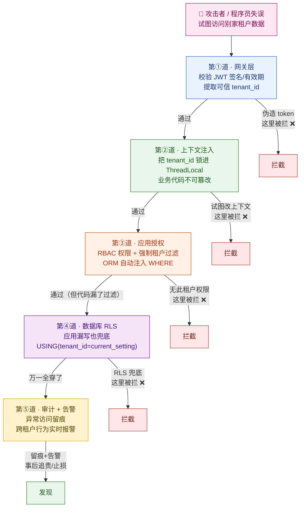

注意这张图的关键信息：**第④道 RLS 的存在，就是为了兜住「第③道应用层代码漏写过滤」这种最常见的失误**。前三道是「主动校验」，第四道是「被动兜底」，第五道是「事后发现」——形成完整闭环。

### 一个真实味道的跨租户越权攻击场景

光讲理论太抽象。我们来还原一次**几乎在每个 SaaS 平台都真实发生过的攻击**——**IDOR（Insecure Direct Object Reference，不安全的直接对象引用：接口直接拿用户传来的 ID 去查数据，却不校验这个 ID 到底属不属于当前用户/租户，攻击者改个 ID 就能看别人的数据）**。这是 OWASP（开放式 Web 应用安全项目，权威的 Web 安全标准组织）越权类漏洞里最常见的一种。

**剧情**：码上工作室的一个员工小王（也是个略懂技术的人），想偷看竞争对手星辰科技的客户名单。

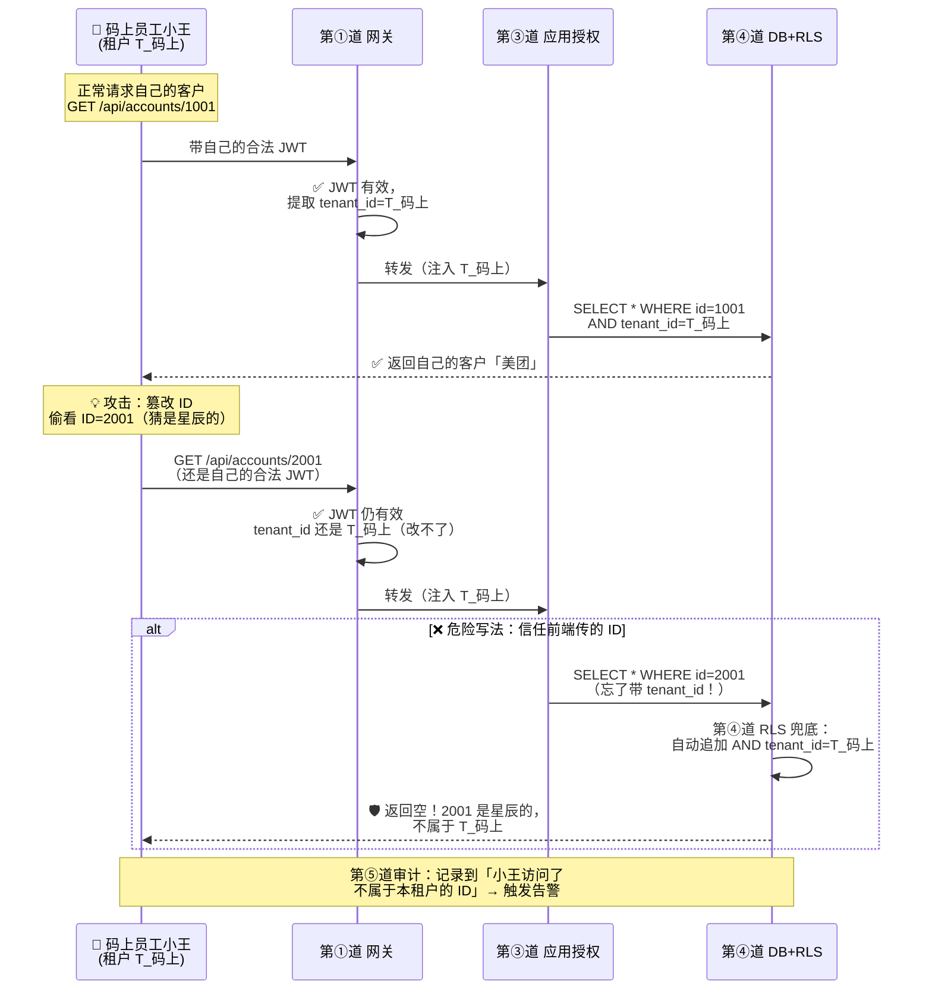

这个场景把纵深防御讲活了：

1. **网关（第①道）守住了身份**：小王只能拿到 `T_码上` 这个租户身份，**他改不了 JWT 里的 tenant_id**（JWT 有签名，一改签名就失效）。这是越权防御的**根基**——租户身份必须来自服务端可信来源，绝不能信任前端传参（详见第 4 章）。
2. **就算应用层程序员犯了错**（写了个只按 `id` 查、忘了带 `tenant_id` 的危险接口），**RLS（第④道）也兜住了**——数据库强制在每条查询后追加 `tenant_id = T_码上`，`id=2001` 属于星辰，自然查不到。
3. **审计（第⑤道）让攻击行为暴露**——小王访问了一个返回空的、明显不属于自己租户的资源 ID，这个异常模式被记录并触发告警，安全团队事后能追责。

> ⚠️ **最危险的反模式**：信任前端传来的 `tenant_id`。有些团队为了「灵活」，让前端在请求里带 `tenant_id`，后端直接拿来用。这等于把家门钥匙挂在门外——小王只要把请求里的 `tenant_id` 改成 `T_星辰`，前三道防线全部失效。**铁律：tenant_id 永远从服务端可信的身份凭证（JWT claim / session）里取，绝不从客户端请求参数里取。**

### 最小权限原则：纵深防御的另一面

纵深防御是「多道墙」，最小权限是「每道门只开必要的缝」。**最小权限原则（Principle of Least Privilege，最小权限原则：每个人、每个服务，只授予完成它本职工作所必需的最小权限，多一点都不给）** 在 SaaS 里有几个落地点：

- 业务服务连数据库，用的账号**只能访问自己服务的表**，不给 `DROP TABLE`、不给跨库权限。
- 运维登录生产环境，默认**只读**；需要改数据时走临时提权 + 审批 + 全程录屏（这叫 JIT，Just-In-Time 权限）。
- 应用调 KMS，只授予「用某把密钥加解密」，不授予「导出密钥」「删除密钥」。

最小权限的价值是**缩小爆炸半径**——一个服务被攻破，攻击者拿到的权限也极其有限，没法横向移动到整个系统。

---

## 14.5 GDPR 与数据驻留：合规如何反向约束架构

前面讲的是「安全的层」，从这一节开始讲「合规的证」。第一个绕不开的，是 **GDPR**——它几乎重新定义了全世界 SaaS 处理个人数据的方式。

### GDPR 是什么，为什么云客 CRM 必须管

**GDPR（General Data Protection Regulation,欧盟通用数据保护条例:欧盟 2018 年生效的个人数据保护法,规定企业怎么收集、使用、存储、删除欧盟居民的个人数据,违规罚款最高可达全球年营收的 4%)**。

关键认知：**GDPR 管的是「欧盟居民的数据」,不是「欧盟的公司」**。蓝鲸集团是中国公司,但它有一批欧洲分公司的客户——只要这些客户是欧盟自然人,他们在云客 CRM 里的联系人数据就受 GDPR 保护。所以**只要你的 SaaS 服务过任何欧盟居民,你就得管 GDPR**,跟你公司注册在哪无关。

GDPR 还引入了两个工程师必须分清的角色：

- **数据控制者（Data Controller）**:决定「为什么、怎么处理这些数据」的一方。这里是**蓝鲸集团**（它决定收集客户信息做销售）。
- **数据处理者（Data Processor）**:替控制者处理数据的一方。这里是**云客 CRM 平台**（它只是个工具,替蓝鲸存数据）。

工程师视角的含义:平台作为「处理者」,有义务**提供工具**让控制者（蓝鲸）履行 GDPR 责任——比如蓝鲸的客户要求删数据,蓝鲸需要在云客 CRM 里有个「彻底删除某个联系人」的功能按钮,背后真的删干净。

### GDPR 关键权利清单 → CRM 如何落地

GDPR 给了欧盟居民一系列「数据权利」。下表把每条权利翻译成「云客 CRM 需要做什么」：

| GDPR 权利 | 大白话 | 云客 CRM 的落地 |
|---|---|---|
| **被遗忘权 / 删除权**（Right to Erasure） | 「把我的数据全删了」 | 提供「彻底删除联系人」功能,级联删除其在客户/商机/活动记录里的所有 PII,并通知备份与下游系统 |
| **数据可携权**（Right to Data Portability） | 「把我的数据导出给我,我要带走」 | 提供导出该数据主体全部个人数据的接口,输出**机器可读格式**（JSON/CSV） |
| **访问权**（Right to Access） | 「你们都存了我哪些数据?」 | 能查询并展示某个数据主体的全部留存字段 |
| **更正权**（Right to Rectification） | 「我的信息错了,改过来」 | 数据可编辑（CRM 本来就有） |
| **同意管理**（Consent Management） | 「我没同意你用我数据发营销」 | 记录每个数据主体的同意状态（同意了什么、何时、可撤回）,处理前先查同意 |
| **数据最小化**（Data Minimization） | 「别收集用不到的数据」 | 表设计只存业务必需字段,不无脑收集 |

### 实战:蓝鲸欧洲客户的「删除请求」在系统里跑了一遍

剧情:蓝鲸集团法国分公司的一个客户(数据主体)发邮件给蓝鲸:「根据 GDPR,请删除你们持有的我的全部个人数据。」蓝鲸的管理员在云客 CRM 后台点了「彻底删除该联系人」。这个动作在系统内部触发了一连串动作:

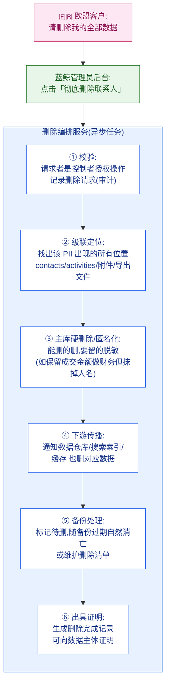

这个流程暴露了 GDPR 删除最难的几个工程现实:

- **数据散落各处难删净**:一个联系人的手机号,可能同时在主库 `contacts`、活动记录里的备注、ES 搜索索引、数据仓库的报表、上个月导出的 Excel、Redis 缓存里。**真正的删除是「级联追杀」**,这正是为什么删除要做成异步编排任务,而不是一条 `DELETE`。
- **删除 vs 匿名化的取舍**:有些数据因别的合规要求(财务、税务)必须保留 N 年(见 14.6),不能直接删。这时做**匿名化(Anonymization)**——把成交金额留下做财务统计,但把客户姓名、手机号抹成不可逆的乱码,使其无法再关联到具体的人。匿名化后的数据不再算「个人数据」,GDPR 就管不到了。
- **删除要能证明**:GDPR 要求你能向数据主体证明「确实删了」。所以删除动作本身要记审计日志(谁、什么时候、删了什么),这又呼应了第 12 章。

> 🔑 **一个绝佳的反例**:很多系统用**软删除**(`is_deleted=1`,数据其实还在表里)。这在普通业务里很方便(能恢复、能审计),但在 GDPR 面前是**定时炸弹**——「被遗忘权」要求的是数据**真的不在了**,软删除的数据被审计员发现「你说删了但其实还在」,直接判定违规。所以涉及 PII 的删除,该硬删的必须硬删,该匿名化的必须不可逆。**软删除和合规删除,是两套机制,别混用。**

### 数据驻留:合规反向约束部署架构

**数据驻留(Data Residency,数据驻留:某些国家/地区的法律要求,其公民的数据必须物理存储在本国/本地区境内,不许出境)** 是 GDPR 及各国数据主权法的延伸要求。典型例子:GDPR 限制向缺乏充分保护的境外传输个人数据(需通过充分性认定、标准合同条款 SCC 等保障措施才合法),叠加各国数据主权法,实务上催生了数据驻留要求;中国《数据安全法》《个人信息保护法》要求关键数据境内存储;一些行业要求金融数据不得出境。

对蓝鲸集团:它的欧洲客户数据**必须存在欧盟的机房**,中国客户数据存在中国机房。这条合规要求,**直接反向决定了云客 CRM 的部署架构**——你不能把所有租户数据塞进一个北美机房。

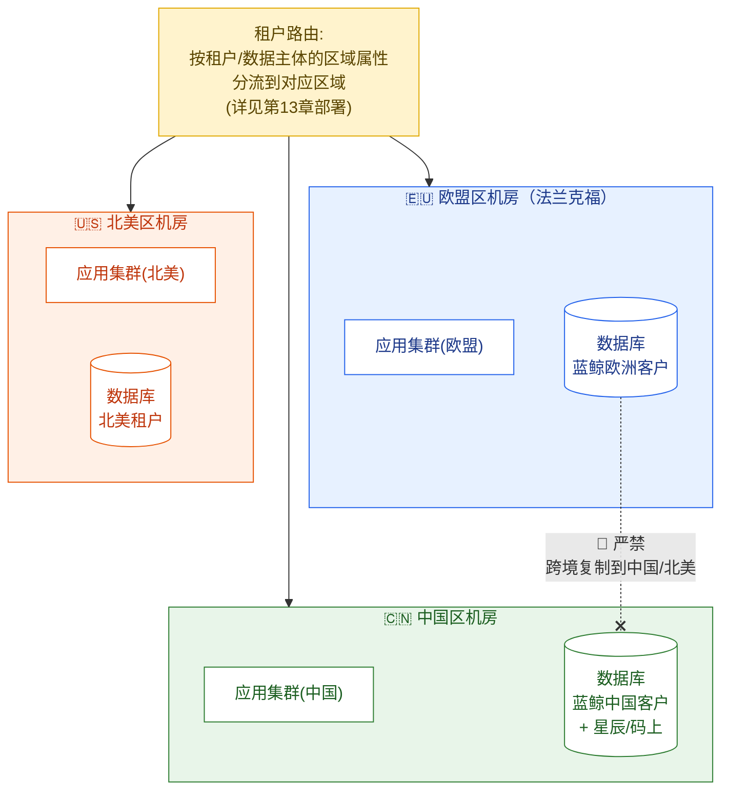

数据驻留给工程带来的连锁约束(具体部署实现见第 13 章,这里只点出「合规如何反向约束」):

- **数据不能跨境复制**:连灾备、数据分析,都不能把欧盟数据复制到别的区域。这意味着**每个区域要各自做容灾**,不能用「全局一个中心备份」。
- **租户/数据主体要有「区域归属」属性**:注册时就要确定这个租户、甚至这个具体联系人属于哪个区域,路由时分流到对应机房。
- **跨区域功能受限**:蓝鲸总部想看「全球客户大盘」报表,但欧洲数据出不了欧盟——只能在欧盟区先聚合成**不含个人信息的统计数字**再传出来。
- **连日志和监控都要分区**:带 PII 的日志(第 12 章)也算个人数据,欧盟客户的日志也得留在欧盟。

> 📌 一句话记住数据驻留对架构师的意义:**它把「数据放在哪」从一个性能/成本问题,升级成了一个法律红线问题。** 第 13 章讲的多区域部署,一半是为了性能和容灾,另一半就是为了满足数据驻留这条合规硬约束。

---

## 14.6 数据删除与保留策略:删多了违规,删少了也违规

数据生命周期管理是合规里很反直觉的一块:**数据保留太久违规(GDPR 数据最小化、被遗忘权),删得太早也违规(财务、税务、法律要求留存证据)。** 工程师需要为不同类型的数据制定不同的「保留期」和「删除方式」。

### 保留策略:每类数据都有「保质期」

云客 CRM 里不同数据的保留要求天差地别:

| 数据类型 | 保留要求 | 到期处理 | 驱动来源 |
|---|---|---|---|
| 客户 PII(手机/身份证) | 客户在用就留,主体要求删则立删 | 硬删除 | GDPR 被遗忘权 |
| 交易/发票记录 | **必须留 N 年**(如 7 年) | 到期前不许删 | 财务/税法 |
| 审计日志 | 留 1~7 年(看合规等级) | 归档冷存 | SOC2/等保 |
| 应用运行日志 | 30~90 天 | 自动滚动删除 | 成本/数据最小化 |
| 已注销租户数据 | 宽限期(如 30 天)后清除 | 宽限期内可恢复,过期硬删 | 商业惯例 + GDPR |

这里的核心矛盾:**同一个客户的「姓名」要删(GDPR),但他的「成交记录」要留(税法)。** 解法就是上一节说的**匿名化**——删人名、留金额,让财务记录脱离个人身份继续存在。

### 删除的三种「干净程度」

「删除」不是一个动作,而是有不同的彻底程度,合规要求你**对不同数据用对的删法**:

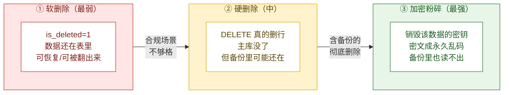

- **软删除**:`is_deleted=1`,数据物理还在。方便恢复,但**对 GDPR 删除不合格**(数据其实没删)。
- **硬删除**:真的 `DELETE`,主库数据没了。但**备份里通常还在**——你不可能为删一个人就重写所有历史备份。
- **加密粉碎(Crypto-shredding)**:这是处理「连备份都要删干净」的神技。前提是数据是用 14.3 的**租户级密钥**加密存储的。要彻底删除**整个租户**(如租户注销)或**整个区域**的数据,**只需销毁那把密钥**——所有密文(包括躺在历史备份里的)瞬间变成永久无法解开的乱码,等于删除。**不用动几百 TB 的备份,只销毁一把几十字节的钥匙。** 这是 BYOK 和租户级密钥架构带来的又一个合规红利。
  - ⚠️ **注意粒度**:14.3 建立的是「每租户一把 DEK」,所以加密粉碎能干净地销毁的最小单位是**整个租户**(或整个区域)。它**无法**用来删除单个数据主体——销毁租户级密钥会把这家公司的全部数据一起粉碎。前面 14.5 那个「删除某一个欧洲客户」的场景,数据主体只是租户里的一行,仍必须走 14.5 的级联硬删除 / 匿名化,而不是靠销毁一把钥匙。除非平台进一步做到 per-记录 / per-主体 的更细粒度密钥,否则「销一把钥匙满足单主体被遗忘权」是错误心智模型。

> ⚠️ **软删除的合规陷阱(再次强调)**:开发图省事到处用软删除,在 GDPR 审计时会反噬。审计员会问「这个用户要求删除了,你软删的数据还能被翻出来吗?」——能,就违规。**所以系统设计时就要分清:可恢复需求用软删除,合规删除需求必须走硬删除或加密粉碎,两条路径分开实现。**

---

## 14.7 合规认证:SOC2 与 ISO 27001——企业客户的入场券

终于讲到合规里最「商业」的一块:为什么蓝鲸集团采购前,采购流程里会有一关是「请提供你们的 SOC2 报告」?为什么没有这张纸,大单子根本签不下来?

### 这两个认证到底是什么

- **SOC2(System and Organization Controls 2,系统与组织控制审计 2:由独立审计机构出具的报告,围绕「安全、可用性、保密性、处理完整性、隐私」五大信任服务标准证明一家 SaaS 公司有健全的内控措施并切实执行)**。其中**「安全」(Common Criteria)是唯一必选项,其余四项(可用性 / 处理完整性 / 保密性 / 隐私)由公司按业务和客户需要选择纳入审计范围**——这也是为什么不同公司的 SOC2 报告覆盖范围不一样。它源自美国,是 To B SaaS 行业事实上的「安全信任标准」。分两类:**Type I** 看「某个时间点制度健不健全」,**Type II** 看「在一段时间(通常 6~12 个月)里制度有没有被持续执行」——客户更认 Type II,因为它证明你不是临时摆拍。
- **ISO 27001(ISO/IEC 27001,信息安全管理体系国际标准:国际标准化组织发布的、关于如何建立和运营一套「信息安全管理体系 ISMS」的认证,全球通用,欧洲和亚洲客户尤其看重)**。

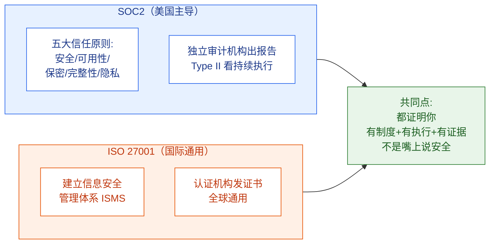

### 为什么企业客户非要看这张纸

站在蓝鲸集团采购方的角度想:它要把成千上万条客户数据托付给云客 CRM。它**没法自己跑去云客的机房挨个检查**安全措施,但它需要确信对方靠谱。SOC2/ISO 27001 报告就是这个信任的**第三方背书**——一个独立的、有公信力的审计机构,替蓝鲸把云客的安全制度查了个遍,出了报告。

> 🔑 **本质**:SOC2 把「信任」这件难以验证的事**外包给了独立审计员**。蓝鲸不用信云客的自夸,只用信审计机构。这就是为什么它成了 To B 采购的硬门槛——**没有它,你连企业客户的安全问卷第一轮都过不了。**

### 工程师要为审计准备什么

合规认证不是法务和销售的独角戏,工程团队是主力。审计员会逐条核查「你说有这个控制,证据呢?」。下面是一份云客 CRM 工程侧需要拿出**证据**的合规清单(选取与本教程强相关的项):

| 合规控制项 | 工程侧要拿出的证据 | 对应本章/本书 |
|---|---|---|
| 传输加密 | TLS 配置、扫描报告(无弱协议) | 14.2 |
| 静态加密 | 数据库加密已开启的配置截图 | 14.2 |
| 密钥管理 | KMS 使用记录、密钥轮换策略 | 14.3 |
| 访问控制 | RBAC 权限矩阵、最小权限账号 | 14.4 / 第7章 |
| 租户隔离 | tenant_id + RLS 设计文档、隔离测试 | 14.4 / 第5章 |
| 审计日志 | 谁动了什么数据的完整留痕、留存期 | 14.6 / 第12章 |
| 数据删除 | 删除/保留策略文档、删除执行记录 | 14.6 |
| 变更管理 | 代码评审、发布审批、回滚记录 | 第13章 |
| 漏洞管理 | 定期安全扫描、渗透测试报告 | 本教程未展开 |
| 应急响应 | 安全事件响应流程、演练记录 | 本教程未展开 |

> 📌 **给工程师的实在建议**:**合规不是上线前突击补的,而是日常工程习惯自然沉淀的证据。** 你平时就做代码评审、就开了静态加密、就有审计日志、发布就走审批——审计时把这些「日常已经在做的事」整理成文档即可。反过来,如果平时不做,审计前一周临时补,既补不完整,也会被 Type II 审计(看持续执行)抓包。**好的合规,是好的工程的副产品。**

---

## 14.8 威胁建模:系统性盘点「我会被从哪打」

前面的防御都是「点」,威胁建模是把这些点串成「面」的方法论——在设计阶段就**系统性地、不靠运气地**问一遍:这套系统的攻击面有哪些?每个面我防住了吗?

**威胁建模(Threat Modeling,威胁建模:在设计阶段画出系统的数据流,然后逐个组件/边界推演「这里会被怎么攻击」,提前把防御补上,而不是等上线被打了再救火)**。业界常用 **STRIDE** 框架做这件事——它是六类威胁英文首字母的缩写。下面用云客 CRM 的场景逐条对号入座:

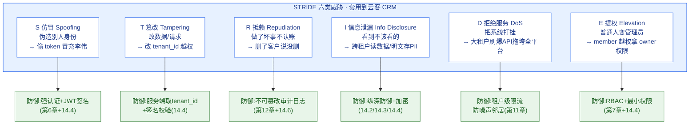

这张图其实是**整本书安全相关章节的一次收口**——你会发现 STRIDE 的每一类威胁,都对应着前面某一章讲过的防御:

| STRIDE 威胁 | 云客 CRM 攻击例子 | 防御手段 | 在哪学的 |
|---|---|---|---|
| **S** 仿冒 | 偷李伟的 token 冒充他登录 | 强认证、JWT 签名、短有效期 | 第6章 + 14.4 |
| **T** 篡改 | 改请求里的 tenant_id 想越权 | tenant_id 只从服务端取、签名校验 | 14.4 |
| **R** 抵赖 | 张敏删了客户却说不是她 | 不可篡改的审计日志 | 第12章 + 14.6 |
| **I** 信息泄漏 | 小王跨租户偷看星辰的客户 | 纵深防御 + 加密 + RLS | 14.2/14.3/14.4 |
| **D** 拒绝服务 | 蓝鲸刷爆 API 拖垮全平台 | 租户级限流、防噪声邻居 | 第11章 |
| **E** 提权 | member 李伟越权拿 owner 权限 | RBAC、最小权限、租户边界 | 第7章 + 14.4 |

威胁建模的真正价值,不在于框架多高级,而在于它逼你**在设计评审时把这六类挨个过一遍**,把「我以为很安全」变成「我逐项检查过」。SaaS 平台尤其要重点盯 **I(信息泄漏,即跨租户)** 和 **D(噪声邻居拖垮全平台)** 这两类——它们是多租户架构特有的、最致命的攻击面。

> 📌 **威胁建模不是一次性的**:新增一个对外接口、接入一个第三方、开放一个新功能,都意味着攻击面变化,都该重新过一遍 STRIDE。把它做成设计评审的固定环节,而不是上线前的临时仪式。

---

## 本章小结

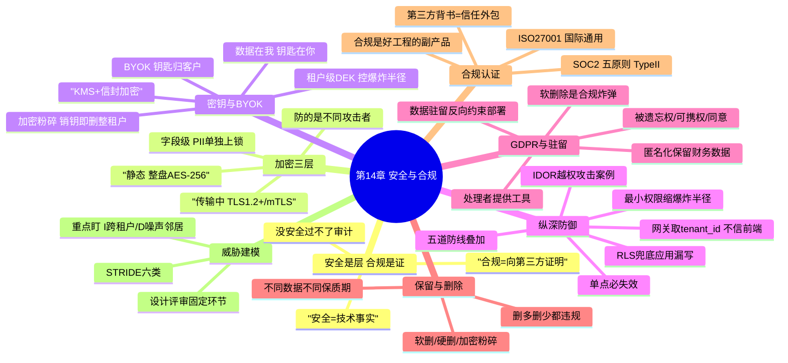

本章的核心收获,浓缩成八句话:

1. **安全是「层」,合规是「证」**:安全是客观的技术防护(纵深防御多层叠加),合规是把这些防护写成文档、被第三方审计认证、向客户证明。有安全不一定有合规,有合规一定建立在安全之上。

2. **加密分三层,防的是不同攻击者**:传输中(TLS,防偷听)、静态(整盘加密,防偷硬盘)、字段级(PII 单独加密,防 DBA 和拖库)。「全站 HTTPS」只解决了最外面一层,内部 mTLS 和敏感字段加密同样不能省。

3. **密钥管理靠 KMS + 信封加密,租户级独立密钥控制爆炸半径**:每租户一把数据密钥,一把泄漏只伤一家。BYOK 把主密钥控制权交给客户,实现「数据在平台、钥匙在客户」,客户随时能吊销让平台失明——这是金融大客户(蓝鲸)的合规刚需。

4. **纵深防御:单点必然失效,只能靠多层兜底**:网关验身份、上下文锁 tenant_id、应用层授权、数据库 RLS 兜底、审计告警发现——五道独立防线,攻击者要全突破才得手。RLS 存在的意义就是兜住「程序员漏写过滤」这种最常见的失误。

5. **tenant_id 永远从服务端可信凭证取,绝不信前端**:IDOR 越权攻击的根源就是信任前端传参。攻击者改不了 JWT 签名,所以租户身份必须来自服务端可信来源——这是越权防御的根基(呼应第 4 章)。

6. **GDPR 重新定义了个人数据处理**:被遗忘权、数据可携权、同意管理都要落地成 CRM 功能。平台是「数据处理者」,有义务提供工具让客户(控制者)履责。软删除在 GDPR 面前是定时炸弹,合规删除该硬删硬删、该匿名化匿名化。

7. **数据驻留把「数据放哪」从性能问题升级成法律红线**:欧盟数据必须留欧盟,直接反向约束部署架构(详见第13章)——不能跨境复制、租户要有区域归属、跨区域报表只能传脱敏统计值。

8. **SOC2/ISO 27001 是企业客户的入场券,合规是好工程的副产品**:第三方审计把「信任」外包给独立机构,没有它大单签不下来。工程师平时就做代码评审、开静态加密、留审计日志,审计时整理成证据即可——临时突击补一定被 Type II 抓包。威胁建模(STRIDE)则是把所有防御串成面,逼你在设计阶段逐项检查攻击面,多租户尤其要盯紧「跨租户信息泄漏」和「噪声邻居 DoS」。

安全与合规这一章,把前面十三章的零件——租户隔离(第3~5章)、身份权限(第6~7章)、限流治理(第11章)、审计监控(第12章)、多区域部署(第13章)——重新串成了一张**对外能通过企业安全问卷、对监管能通过第三方审计**的防御网。你会发现一个深刻的事实:**SaaS 的安全合规,几乎从不需要发明全新的技术,而是把前面学过的每个机制,都额外问一句「它经得起审计吗?它兜得住失误吗?它能向客户证明吗?」**

至此,从第 1 章的「什么是 SaaS」到第 14 章的「怎么让它安全合规」,整套 SaaS 平台的技术骨架已经搭完。下一章 **第 15 章** 是全书的收口——我们将**跟随星辰科技,从它第一天注册、到日常使用、到升级 Enterprise、到最终通过一次完整的合规审计**,把这 14 章的每一个机制在一条真实业务时间线上串讲一遍,让你看到它们是如何协同工作的。

---

## 参考来源

1. **AWS SaaS Factory — SaaS Tenant Isolation Patterns / Encrypting Data in a Multi-Tenant SaaS(多租户隔离与加密的权威架构实践,含租户级密钥与纵深防御思想)**:<https://docs.aws.amazon.com/whitepapers/latest/saas-architecture-fundamentals/tenant-isolation.html>
2. **WorkOS Blog — A developer's guide to SOC 2 compliance(面向工程师的 SOC2 通俗讲解:五大信任原则、Type I vs Type II、工程团队要准备什么)**:<https://workos.com/blog/soc-2-compliance>
3. **GDPR 官方条文 — Rights of the data subject(欧盟 GDPR 官方原文,被遗忘权第 17 条、数据可携权第 20 条等数据主体权利的权威定义)**:<https://gdpr-info.eu/chapter-3/>
4. **OWASP — Threat Modeling & STRIDE / Top 10(权威 Web 安全组织,威胁建模方法论与 IDOR/越权等常见攻击面的标准参考)**:<https://owasp.org/www-community/Threat_Modeling>
