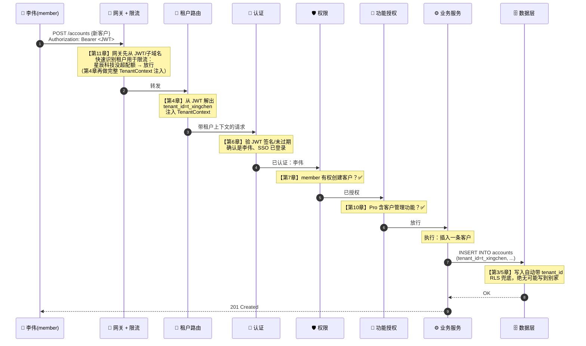
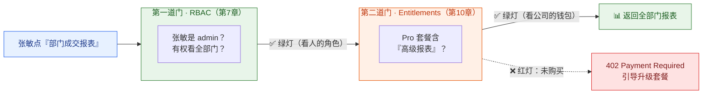
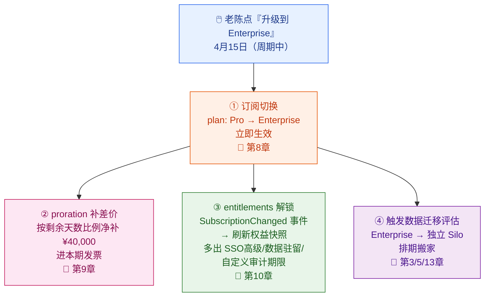
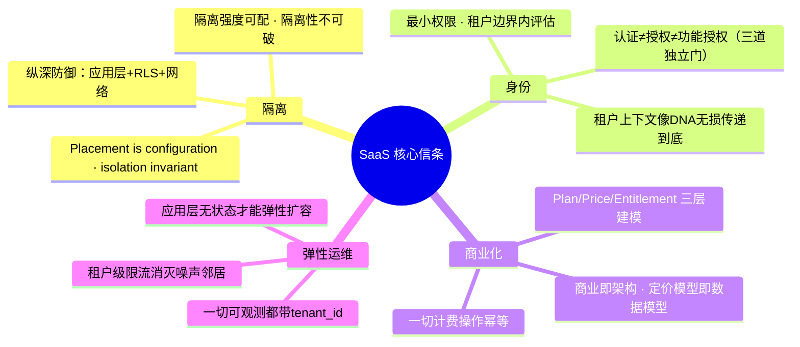
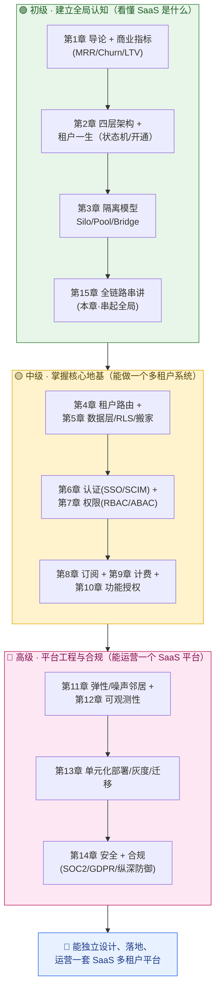

# 第 15 章 全链路串讲与学习路径

> 前面 14 章，我们把 SaaS 平台像拆机器一样一个零件一个零件地讲透了：四层架构、隔离模型、租户路由、数据层、认证、权限、订阅、计费、功能授权、资源治理、可观测性、部署、安全合规。每一章都是一颗螺丝。这最后一章不引入任何新概念，只做一件事——**把所有螺丝拧回到同一台机器上，让它跑起来**。
>
> 我们会跟着 IT 管理员**老陈**带着**星辰科技**这家公司，从「在官网点了免费试用」那一刻起，一路走到「一年后通过 SOC2 审计」，看这一整条旅程的每一步，分别踩在前面哪一章的地基上。然后我们提炼出几条贯穿全书的 SaaS 设计核心信条、给一份面试高频题清单、列出业界经典开源与产品参考，最后画一张从初级到高级的学习路径图。

> 📌 **怎么读这一章**：如果你已经读完前 14 章，这一章是「收口 + 复习 + 升华」——读完你会有「原来这些章是这样咬合在一起的」的恍然大悟感。如果你是**先跳到这一章建立全局认知**（推荐路径之一），那把它当成一张目录地图：每段都标着「详见第 X 章」，看到感兴趣的就跳过去深读。

---

## 本章导读（读完能回答这些问题）

- 一家企业租户从**注册到合规审计**的完整旅程，到底经过了哪些环节？每个环节对应本书哪一章？这条线能不能在脑子里一口气走完？
- 当老陈月中把套餐从 Pro 升到 Enterprise，背后**订阅、计费、功能授权、数据迁移**这四件事是怎么被同一个动作连锁触发的？
- SaaS 系统设计区别于普通 Web 系统的**核心信条**有哪些？「Placement is configuration, isolation invariant」「认证 ≠ 授权 ≠ 功能授权」「无状态」这些原则到底意味着什么？
- SaaS / 多租户方向的**面试高频题**有哪些？每题的答题要点是什么？
- 想系统掌握 SaaS 平台架构，该看哪些**开源项目和产品文档**？从初级到高级的**学习路径**该怎么走？

---

## 15.1 一图看尽：星辰科技的完整旅程

先上本章最重要的一张图——**星辰科技端到端旅程大图**。它把这家公司一年里发生的所有关键事件串成一条线，每个节点都标注了「这一步靠哪一章的能力实现」。后面 15.2 会把这条线上的每段拆开说人话。

```mermaid
flowchart TB
    START["🏢 老陈在官网点『免费试用』<br/>填星辰科技信息"]

    subgraph PHASE_A["阶段一 · 进场（注册 → 开通 → 配置）"]
        direction TB
        A1["① 注册 + 开通<br/>建租户记录 / 分配隔离 / 灌默认数据<br/>📖 第2章 provisioning"]
        A2["② 选 Pro 套餐<br/>14 天试用 → 绑卡转付费<br/>📖 第8章 订阅"]
        A3["③ 配置 SSO<br/>对接 Okta / SAML 登录<br/>📖 第6章 认证"]
        A4["④ SCIM 批量导入 500 名员工<br/>入职自动开账号<br/>📖 第6章 SCIM"]
        A1 --> A2 --> A3 --> A4
    end

    subgraph PHASE_B["阶段二 · 日常使用（一个请求的一生）"]
        direction TB
        B1["⑤ 李伟登录录入客户<br/>请求带租户标识 📖第4章<br/>→认证📖第6章 →权限📖第7章<br/>→隔离查询📖第3/5章"]
        B2["⑥ 张敏看部门报表<br/>权限放行 📖第7章<br/>+ 功能授权放行 📖第10章"]
        B1 --> B2
    end

    subgraph PHASE_C["阶段三 · 成长（升级 Enterprise 连锁反应）"]
        direction TB
        C1["⑦ 月中升级 Enterprise<br/>订阅切换 📖第8章<br/>+ proration 补差价 📖第9章<br/>+ entitlements 解锁 📖第10章"]
        C2["⑧ 数据从 Pool 迁到独立 Silo cell<br/>不停机搬家 📖第3/5/13章"]
        C1 --> C2
    end

    subgraph PHASE_D["阶段四 · 治理与合规（平台视角）"]
        direction TB
        D1["⑨ SRE 看租户健康分<br/>tenant-aware 监控 📖第12章"]
        D2["⑩ 平台压制蓝鲸集团噪声邻居<br/>租户级限流 📖第11章"]
        D3["⑪ 年度 SOC2 审计<br/>查全量审计日志 📖第12/14章"]
        D1 --> D2 --> D3
    end

    START --> PHASE_A --> PHASE_B --> PHASE_C --> PHASE_D --> END["✅ 通过 SOC2 审计<br/>成为忠实大客户"]

    style START fill:#e7f1ff,stroke:#2563eb,color:#1e3a8a
    style PHASE_A fill:#e8f5e9,stroke:#2e7d32,color:#1b5e20
    style PHASE_B fill:#fff3cd,stroke:#e0a800,color:#5a4500
    style PHASE_C fill:#fff0e6,stroke:#e65100,color:#bf360c
    style PHASE_D fill:#f3e5f5,stroke:#7b1fa2,color:#4a148c
    style END fill:#e8f5e9,stroke:#2e7d32,color:#1b5e20
```

> **🎬 一句话讲完这条线**：老陈注册星辰科技、平台自动开通（2 章）→ 选 Pro 套餐试用转付费（8 章）→ 配 SSO 让员工用公司域账号登录（6 章）→ SCIM 一键导入 500 名员工（6 章）→ 李伟天天登录录客户、张敏看报表，每个请求都被「认证→权限→功能授权→隔离查询」层层把关（4/6/7/10/3/5 章）→ 公司发展到月中升 Enterprise，触发计费补差价、功能解锁、数据搬家三连击（8/9/10/3/5/13 章）→ 平台用健康分盯着它健不健康、用限流压住隔壁噪声大户（12/11 章）→ 一年后审计师来查审计日志，全程可追溯，通过 SOC2（12/14 章）。**14 章的能力，全在这一条线上各司其职。**

---

## 15.2 旅程逐段拆解：每一步踩在哪一章的地基上

下面我们沿着上图，把四个阶段、十一个环节挨个走一遍。这一节是全书的「索引式复习」——每段先讲发生了什么，再点明它依赖前面哪一章建立的能力。

### 阶段一 · 进场：从注册到 500 人就位

#### ① 老陈注册并开通星辰科技（📖 第 2 章）

老陈在云客 CRM 官网填了公司名「星辰科技」、子域名 `xingchen`、自己的邮箱。点下「免费试用」的瞬间，平台后台触发了一整套**开通（Provisioning）** 连招：校验子域名没被占 → 创建租户记录 `tenant_id=t_xingchen`（状态 `provisioning`）→ 根据套餐分配数据隔离模式 → 灌入默认角色 / 看板 / 字段模板 / 示例客户 → 把老陈设为 owner、发激活链接 → 创建一个「Pro 14 天试用」订阅 → 状态翻成 `active(trial)` → 发欢迎邮件。

这一步的工程难点在第 2 章讲透了：**它是一个跨多系统、必须幂等、必须能优雅失败回滚的分布式流程**。任何一步失败都不能让星辰科技停在「库建好了但没账号」的半残状态。

#### ② 选 Pro 套餐：试用转付费（📖 第 8 章）

14 天试用快到期，老陈在后台绑了公司的对公账户。订阅状态从 `active(trial)` 流转到 `active(paid)`——这是第 8 章那张**订阅生命周期状态机**上的一次合法跳转。这里有个第 8 章强调的关键建模：套餐不是一个 `plan` 字符串字段，而是 **Plan / Price / Entitlement 三层**——Plan 是给人看的「商品」，Price 是「一种付钱方式」（订阅记录冻结 `price_id` 实现**价格锁定**，即使将来 Pro 涨价，星辰科技这一单仍按签约时的价走），Entitlement 声明「这个套餐包含哪些功能」。

> **🎬 画面感**：老陈点「立即付费订阅 Pro」，页面显示「500 座席 × ¥200/座席/月 = ¥100,000/月」。付款成功的下一秒，订阅服务发出一条 `SubscriptionActivated` 事件——这条事件会被第 9 章的计费服务和第 10 章的功能授权服务同时听到，各自去做自己的事。**订阅服务自己不算钱、不开功能，但它一举一动，钱和功能都跟着动**（第 8 章语）。

#### ③ 配置 SSO：让员工用公司域账号登录（📖 第 6 章）

星辰科技 500 人，老陈不想让每个员工各自注册一个云客 CRM 密码（既不安全又难管）。他要的是**集中管控**：员工用公司的 Okta 账号一键登录。于是他在云客 CRM 后台配置 **SSO（Single Sign-On，单点登录：员工用公司统一的身份源登录所有应用，不用为每个系统单独记密码）**，对接星辰科技的企业 IdP（Identity Provider，身份提供商），走 **SAML / OIDC** 协议。

这一步把「登录」这件事从「云客 CRM 自己管密码」交给了「星辰科技的 Okta 管」——第 6 章详解了 SSO 的握手流程，以及云客 CRM 这边怎么把 IdP 返回的身份映射成自己系统里的 user + membership 记录。

#### ④ SCIM 批量导入 500 名员工（📖 第 6 章）

光有 SSO 还不够——SSO 只解决「怎么登录」，不解决「账号怎么建立和回收」。老陈接着配了 **SCIM（System for Cross-domain Identity Management，跨域身份管理：一套标准 REST API，让 Okta 能自动把员工账号『推送』到云客 CRM，入职自动建、离职自动停）**。配好之后，Okta 那头一推，云客 CRM 这边「啪」地一下创建出 500 个 user + membership 记录，全部绑定到星辰科技租户、默认 member 角色。

第 6 章特别强调过 SSO 和 SCIM 互补：**SSO 管「怎么登录」，SCIM 管「账号怎么建立和删除」**。没有 SCIM 只有 SSO，员工离职后会留下「孤儿账号」——人走了但记录还在，座席还占着、还在计费。SCIM 让账号生命周期全自动闭环。

> **🎬 画面感**：周一早上，星辰科技 HR 在 Okta 里给新入职的销售开了账号、归到「销售部」组。几秒钟后，李伟在云客 CRM 里就能直接用公司邮箱 SSO 登录——他这辈子没在云客 CRM 上注册过，账号是 SCIM 替他建好的。三个月后李伟离职，HR 在 Okta 停用他，SCIM 立刻把云客这边的 membership 置为 `suspended`，座席当场释放（计费立即止损，详见第 9 章），但他跟进过的客户数据保留（合规与业务连续性，详见第 14 章）。

至此，阶段一完成：星辰科技已经是一个**付费、配好 SSO、500 人就位**的活跃 Pro 租户。

---

### 阶段二 · 日常使用：一个请求的一生

#### ⑤ 李伟登录录入一个客户（📖 第 4 / 6 / 7 / 3 / 5 章）

这是 SaaS 系统里最普通、也最能体现多租户精髓的一个动作。李伟在 App 里填好一个新客户「华东某制造企业」，点保存。这个 `POST /accounts` 请求的一生：

这条链路上的每一道关卡，都是前面某一章的主角：

| 关卡 | 它在确认什么 | 章节 |
| --- | --- | --- |
| **网关限流** | 星辰科技这一秒没超过它的请求配额 | 第 11 章 |
| **租户路由** | 从 JWT 解出 `tenant_id=t_xingchen`，盖上「星辰科技」的章 | 第 4 章 |
| **身份认证** | 这确实是李伟，SSO 令牌有效 | 第 6 章 |
| **权限校验** | member 角色有权创建客户 | 第 7 章 |
| **功能授权** | Pro 套餐包含「客户管理」功能 | 第 10 章 |
| **数据隔离** | 写入和查询都强制带 `tenant_id`，RLS 行级安全兜底 | 第 3 / 5 章 |

> **🎬 把这条链连成一句话**：李伟点保存 → 网关确认星辰科技没超量（11 章）→ 路由贴上「星辰科技」标签（4 章）→ 认证确认是李伟本人（6 章）→ 权限确认 member 能建客户（7 章）→ 功能授权确认 Pro 有这功能（10 章）→ 业务把这条客户写进数据库，数据库强制焊死 `tenant_id=t_xingchen`（3/5 章）。**全程 6 道关卡，都焊着同一个租户身份**——这就是第 2 章和第 4 章反复强调的那条主线：**租户上下文（Tenant Context）必须像 DNA 一样无损传递到底，断了就是泄漏事故。**

#### ⑥ 张敏看部门报表：两道门都要过（📖 第 7 + 10 章）

销售总监张敏（admin）想看「整个销售部本月的成交报表」。这个动作要同时过**两道独立的门**，这是第 10 章反复强调的核心：

- **第一道门 · RBAC 权限（第 7 章）**：张敏是 admin，角色上有权查看「全部门」的数据——而李伟是 member，只能看自己名下的客户。两人调同一个报表接口，看到的数据范围完全不同。这是**人的角色**决定的。
- **第二道门 · Entitlements 功能授权（第 10 章）**：「高级报表」这个功能，是 Pro 套餐才包含的。这是**公司的钱包**决定的——如果星辰科技还在 Free 套餐，张敏哪怕是 admin，点「高级报表」也会被挡，返回 **402 Payment Required**（语义就是「要钱」，引导升级），而不是 403。

> **为什么两道门必须分开？** 第 10 章给了答案：它们的**动机、数据来源、变更频率完全不同**。RBAC 是「你在公司里是什么角色」（owner / admin / member 决定），数据来自组织架构，相对稳定；Entitlements 是「你们公司买了什么套餐」（订阅决定），数据来自计费系统，会随升降级实时变。把两者揉成一个判断，将来改套餐就得动权限代码，必出事故。**两道门是『与』的关系，全绿才放行。**

---

### 阶段三 · 成长：升级 Enterprise 的连锁反应

星辰科技业务爆发，500 人很快要扩到要求更强隔离和合规能力。月中，老陈在后台点了「升级到 Enterprise」。**这一个动作，连锁触发了四件事**——这是全书商业化与隔离两条主线交汇的高潮。

#### ⑦ 一个点击，三个服务联动（📖 第 8 + 9 + 10 章）

**① 订阅切换（第 8 章）**：升级是**立即生效**的（区别于降级的「预约 + 期末执行」）。订阅记录的 `plan` 字段从 Pro 直接改成 Enterprise，发出 `SubscriptionChanged` 事件。

**② proration 按比例补差价（第 9 章）**：账单周期锚定每月 1 号，升级发生在 4 月 15 日，本月还剩 16/30 天。按第 8/9 章的 **proration（按比例计费：套餐月中变更时，按剩余天数占整个周期的比例计算应补/应退差价）** 公式，按星辰科技 **500 座席**算：Pro 月账单 500×¥200=¥100,000，退掉没用完的 16 天 ≈ **¥53,333**；Enterprise 月账单 500×¥350=¥175,000，补上要用的 16 天 ≈ **¥93,333**；二者相抵，**净补差价 ≈ ¥40,000**，当场入账并进入本期发票。第 9 章特别警告过：**proration 和续费扣款必须幂等**——靠**幂等键（idempotency key）** 保证定时任务重跑不会把这 ¥40,000 扣两次。

> **🎬 画面感**：老陈点「升级」，页面立刻弹出「升级后将立即按比例补收本周期差价 ¥40,000.00，Enterprise 即刻生效」。他点确认，¥40,000 当场入账。李伟下一秒刷新页面，就看到原来 Pro 没有的「数据驻留区域设置」入口亮了——这个「亮」就是下面第 ③ 件事干的。

**③ entitlements 解锁（第 10 章）**：功能授权服务监听到 `SubscriptionChanged` 事件，立刻清掉 `entitlements::t_xingchen` 的缓存、重新解析**权益快照（EntitlementSnapshot）**——把星辰科技的可用功能集从 Pro 的集合刷成 Enterprise 的集合，多出了 SSO 高级特性、数据驻留区域选择、自定义审计日志保留期等。第 10 章强调过：**缓存失效是这里最容易踩的坑**——升级后快照不刷新，老陈付了钱却用不了新功能，投诉马上来。

#### ⑧ 数据从 Pool 迁到独立 Silo cell（📖 第 3 / 5 / 13 章）

Enterprise 套餐承诺**独立库隔离 + 数据驻留**，但星辰科技目前的数据还躺在共享的 Pool（或 Bridge）里。于是平台排期了一次**租户搬家**：把星辰科技的全部客户、联系人、商机数据，从共享库迁到一个独立的 **Silo（独立库，物理隔离）**，并落在指定的 **cell（单元，第 13 章的单元化部署单位）** 上。

这一步是第 3、5、13 章的交汇点：

- **第 3 章**回答「为什么 Enterprise 要用 Silo」——隔离强度、合规、数据驻留需求决定了它不能继续待在 Pool。
- **第 5 章**回答「数据怎么搬」——不停机、不丢数据、不串数据的搬家流程（双写、回放、校验、切流），以及为什么从第一天就用**全局唯一 ID**（雪花算法等）而不是数据库自增 ID——自增 ID 搬到目标库会和目标库的自增序列冲突，全局唯一 ID 从根上避免了这个坑。
- **第 13 章**回答「搬到哪个 cell、怎么不影响别人」——单元化（Cell-based）架构把租户分配到独立的部署单元，搬家本质是「换 cell」，配合租户级灰度发布，让迁移对星辰科技无感。

> **这一步最能体现全书的核心信条**：星辰科技从 Pool 搬到 Silo，是**「placement（放置位置）」这个可配置项**变了——但搬家过程中、搬完之后，「李伟绝不可能查到蓝鲸集团的数据」这条**隔离不变量**一秒都没破。这就是 **「Placement is configuration, isolation invariant」** 的活例子。

---

### 阶段四 · 治理与合规：平台视角

前三个阶段是「租户视角」（老陈、李伟、张敏看到什么）。第四阶段切到**平台方（云客团队 SRE / 财务 / 安全）的视角**——他们怎么盯着成千上万个租户健不健康、怎么不让一个大租户拖垮所有人、怎么扛过年度审计。

#### ⑨ SRE 看星辰科技的租户健康分（📖 第 12 章）

云客团队的 SRE 不会一个个看 500 万座席的日志，而是看**租户级**的聚合视图。第 12 章讲的 **tenant-aware 可观测性**——所有指标、日志、链路追踪都带 `tenant_id`——让 SRE 能一眼看出「星辰科技」这一个租户的**健康分（Tenant Health Score）**：API 错误率、P99 延迟、用量趋势、SLA 达标情况。

> **🎬 画面感**：监控大盘上，星辰科技的健康分是绿色的 92 分；而隔壁某个租户突然飘红——错误率飙升，SRE 点进去一看带 `tenant_id` 的链路追踪，三分钟定位到是它自己的一个集成脚本打满了配额。**没有 tenant-aware 观测，这种「某一家租户出问题」根本无从下手**，因为所有租户的日志混在一起。

#### ⑩ 平台压制蓝鲸集团的噪声邻居效应（📖 第 11 章）

蓝鲸集团（5 万座席的 Enterprise 大户）某天跑了个批量数据同步任务，瞬间打出海量 API 请求。如果不加治理，它会**把数据库连接池、CPU 全占满，导致星辰科技、码上工作室一起变慢**——这就是第 11 章讲的 **噪声邻居（Noisy Neighbor，吵闹的邻居：一个租户过度消耗共享资源，殃及同一套系统里的其他租户）** 问题。

平台的应对（第 11 章）：在网关用**令牌桶（Token Bucket）** 做**租户级限流**——给每个租户按套餐分配独立的「令牌桶」，蓝鲸的桶空了就限它，**绝不动星辰科技的桶**。配合配额执行和热点大租户隔离，把噪声邻居的影响压到趋近于零。

> **注意这里两条主线的呼应**：蓝鲸集团之所以能被「单独限流而不殃及邻居」，正是因为第 4 章那条 `tenant_id` 主线一路传到了网关——网关知道「这一波流量是蓝鲸打的」，才能精准地只限它一个。**没有租户上下文，就没有租户级治理。**

#### ⑪ 年度 SOC2 审计：查全量审计日志（📖 第 12 + 14 章）

一年后，星辰科技作为大客户要求云客 CRM 出具合规证明。审计师来做 **SOC2（Service Organization Control 2，服务机构控制审计：第三方审计你的系统在安全、可用性、保密性等方面是否合规，是 To B SaaS 的入场券）** 审计，核心要看一样东西——**审计日志（Audit Log）**：谁、在什么时间、对哪条数据、做了什么操作，是否完整、不可篡改、可追溯。

第 12 章讲了审计日志怎么采集（每次敏感操作——改套餐、加减成员、导出数据、改权限——都落一条带 `tenant_id` + 操作人 + 前后值的审计记录）；第 14 章讲了合规怎么落地（数据加密、数据驻留、防跨租户越权的纵深防御、数据删除与保留策略）。

> **🎬 画面感**：审计师问「请提供星辰科技租户在过去一年里所有『导出客户数据』的操作记录」。SRE 一查审计日志库，按 `tenant_id=t_xingchen AND action=export` 一筛，每条都带操作人、时间、IP、导出范围，完整不可篡改。审计师再抽查「这些数据是否加密存储、是否落在合规区域」——第 14 章的传输加密、静态加密、数据驻留全部满足。**星辰科技顺利通过 SOC2，成为云客 CRM 的忠实大客户。** 这一刻，前面 14 章建立的所有能力，在「合规」这一关汇成了一张可信任的答卷。

---

## 15.3 SaaS 设计核心信条清单

走完整条旅程，我们把贯穿全书、能反复套用到任何 SaaS 系统的**核心设计信条**提炼成一张清单。这些不是某一章的局部技巧，而是判断「一个 SaaS 架构是否成熟」的标尺。

下面逐条展开，每条都标注「在书里哪几章被反复用到」：

### 信条一：Placement is configuration, isolation remains invariant（放置是配置，隔离是不变量）

这是全书第一信条。**租户「放在哪里」（Pool / Bridge / Silo、哪个 cell、哪个区域）是可调的配置项**——星辰科技可以从 Pool 搬到 Silo，码上工作室可以一直待在 Pool。**但租户之间的「隔离性」必须永远不变**——无论放在哪，「A 公司绝对看不到 B 公司一行数据」这条不变量一秒都不能破。衡量一个 SaaS 架构是否成熟，就看它能不能做到「放置灵活、隔离恒定」。（贯穿第 2、3、5、13 章）

### 信条二：认证 ≠ 授权 ≠ 功能授权，三道独立的门

- **认证（Authn）= 你是谁**：你是李伟吗？（验令牌，第 6 章）
- **授权（Authz / RBAC）= 你的角色能做什么**：member 能删客户吗？（看角色，第 7 章）
- **功能授权（Entitlement）= 你们公司买没买这功能**：Pro 含批量导出吗？（看套餐，第 10 章）

第一个看**人**，第二个看**人的角色**，第三个看**公司的钱包**。三者层层递进、缺一不可，且**必须是三套独立的判断**——揉在一起，改套餐就得动权限代码，必出事故。（第 6、7、10 章）

### 信条三：租户上下文像 DNA 一样无损传递到底

从请求进门那一刻被识别出的 `tenant_id`，必须像 DNA 一样在整条调用链里无损传递——经过认证、权限、业务，一直传到数据库的 `WHERE` 条件、传到日志的字段、传到限流的桶。**这条线一旦在任何一个环节断了（比如异步线程没带上下文），就是跨租户泄漏或日志串户事故。** 租户级的一切能力（隔离查询、租户限流、tenant-aware 监控）都建立在这条线没断的前提上。（第 4 章专章，第 5、11、12 章受益）

### 信条四：纵深防御，每一层都假设上一层会失守

隔离不能只靠一道防线。第 5、14 章的经典组合：**应用层强制 `tenant_id` 过滤 + 数据库 RLS 行级安全兜底**——即使应用层程序员手写裸 SQL 忘了加 `WHERE tenant_id`，数据库 RLS 也会偷偷补上。再叠加网络隔离、租户级加密密钥，构成完整的纵深防御（Defense in Depth）。**单一防线 = 单点失效 = 公司倒闭级事故。**（第 5、14 章）

### 信条五：商业即架构，定价模型即数据模型

SaaS 的「钱」直接编码进系统设计。按座席收费、按用量收费、还是分层定价，会直接决定订阅、计量、计费三个服务怎么建模。**定价模型一变，架构就得跟着改。** 所以套餐必须用 **Plan / Price / Entitlement 三层建模**（而非一个 `plan` 字符串字段），金额一律用「分」存整数，下架套餐用 `is_active=false` 而非删除（历史订阅要能追溯）。（第 1、8、9、10 章）

### 信条六：一切计费操作必须幂等

续费扫描任务可能超时被重试，proration 计算可能因网络抖动被重发。**不做幂等，租户就会被扣两次钱**——这是直接掉用户、上投诉、甚至法务风险的事故。靠**幂等键（idempotency key）** 保证同一笔操作无论执行几次,只真正生效一次。（第 8、9 章）

### 信条七：应用层无状态，才能弹性扩容

应用层服务器本身不在内存里保存会话——会话信息（含 `tenant_id`）全装在请求自带的 JWT 里。这样每台服务器都长得一样、可随意增减，月底业绩高峰从 20 个 Pod 扩到 120 个 Pod 时，请求打到哪台都行。**无状态是弹性扩展的前提。**（第 2、11 章）

### 信条八：一切可观测都带 tenant_id

指标、日志、链路追踪、审计——全部带 `tenant_id`。这是 SaaS 区别于普通系统的观测要求：你要能回答「**星辰科技这一个租户**健康吗、用了多少量、谁动了它的数据」，而不只是「整个系统健康吗」。租户级健康分、租户级 SLA、SOC2 审计，全靠这一条。（第 9、11、12、14 章）

---

## 15.4 面试高频题清单（带答题要点）

SaaS / 多租户方向的面试，考的就是上面这些信条能不能讲清、能不能落地。下面是高频题清单，每题给出**答题要点**（不是标准答案，是判分官想听到的关键词）。建议先自己默答，再对照要点查漏。

### A 组 · 多租户与隔离（第 3 / 4 / 5 章）

**Q1. Silo、Pool、Bridge 三种隔离模型有什么区别？怎么选？**
要点：Pool = 共享库 + `tenant_id` 列区分（最省钱、隔离最弱）；Bridge = 共享库 + 每租户独立 Schema（折中）；Silo = 独立库（最贵、隔离最强）。选型维度：成本、隔离强度、合规要求、租户规模。常态是**混合部署**——大多数中小租户 Pool，少数大客户/合规客户 Silo。回到信条一：放置可配、隔离恒定。

**Q2. Pool 模式下，怎么保证一个租户绝对查不到另一个租户的数据？**
要点：两道防线。① 应用层强制每条 SQL 带 `WHERE tenant_id = ?`（通过 ORM 拦截器/全局过滤器，不靠程序员手写）；② 数据库 **RLS 行级安全**兜底——应用层忘了加，数据库自己补。这就是纵深防御。

**Q3. 什么是 RLS（行级安全）？为什么需要它？**
要点：数据库自动在每条查询后追加「只能看自己租户」的过滤条件。需要它是因为应用层过滤可能被绕过（手写裸 SQL、人为失误），RLS 是数据库层的最后一道兜底。PostgreSQL/SQL Server/Oracle 原生支持，MySQL 8.0 需靠视图或应用层模拟。

**Q4. 租户上下文（tenant context）怎么在整条调用链里传递？哪里最容易丢？**
要点：请求进门时从 JWT claim 解出 `tenant_id` 注入上下文，经认证→权限→业务→数据库无损传递。最容易丢的地方：**异步线程/线程池**（上下文不会自动跨线程传播）、**消息队列**（消费端要从消息里重新恢复）、**跨服务 RPC**（要显式透传）。丢了就是泄漏或日志串户。

**Q5. 一个大租户把共享库压垮了怎么办？**
要点：① 租户级限流（令牌桶），网关层就掐住（第 11 章）；② 数据层倾斜处理——把热点大租户单独拆出去（升 Bridge/Silo）；③ 终极方案是**搬家**到独立库。识别要靠 tenant-aware 监控（第 12 章）。

**Q6. 租户从共享库「搬家」到独立库，怎么做到不停机、不丢数据、不串数据？**
要点：双写（同时写老库和新库）→ 历史数据回放迁移 → 数据校验比对 → 流量切到新库 → 老库下线。前提是用**全局唯一 ID**（雪花算法等）而非自增 ID，否则搬到目标库会主键冲突。配合单元化（cell）和灰度切流。

### B 组 · 身份与权限（第 6 / 7 章）

**Q7. 认证、授权、功能授权三者有什么区别？为什么必须分开？**
要点：认证=你是谁（验令牌）；授权=你的角色能做什么（RBAC）；功能授权=你们公司套餐买没买（Entitlement）。分开的原因：数据来源不同（组织架构 vs 订阅系统）、变更频率不同（角色稳定 vs 套餐随升降级变）、面向用户的话术不同（403 「你不该做」vs 402「升级就能做」）。揉一起改套餐就动权限代码。

**Q8. SSO 和 SCIM 有什么区别？只有 SSO 没有 SCIM 会怎样？**
要点：SSO 管「怎么登录」（员工用公司 IdP 一键登录，SAML/OIDC），SCIM 管「账号怎么建立和回收」（入职自动建、离职自动停的标准 REST API）。只有 SSO 没有 SCIM：员工离职后 IdP 停用了他，但 SaaS 这边的账号记录还在——**孤儿账号**，座席还占着、还在计费。SCIM 才能闭环。

**Q9. RBAC 和 ABAC 的区别？CRM 里的「数据共享规则」用哪个？**
要点：RBAC = 按角色授权（owner/admin/member）；ABAC = 按属性授权（如「客户的负责人 == 当前用户」「同部门可见」）。CRM 的「李伟只能看自己名下客户、张敏能看全部门」这种**数据行级可见性**，靠 ABAC（属性：所有者、部门）实现，RBAC 管功能级、ABAC 管数据级，常组合使用。所有评估都在**租户边界内**进行。

**Q10. 权限判断 30 万 QPS 怎么扛？**
要点：权限/权益不能每次都 join 数据库。标准做法是把租户的权限和权益预解析成**内存快照 + 缓存**（如 EntitlementSnapshot）。关键是**缓存失效**：订阅变更/角色变更时发事件，主动清缓存，否则用户付了钱用不了（或降级后还在白嫖）。

### C 组 · 商业化（第 8 / 9 / 10 章）

**Q11. 套餐为什么要建模成 Plan / Price / Entitlement 三层，不能用一个字段吗？**
要点：一个 `plan` 字符串字段 + 满天飞的 `if` 扛不住三件事——价格会变（需要 Price 层 + 价格锁定，订阅冻结 `price_id`）、功能会调（需要 Entitlement 层，改套餐不发版）、历史要冻结（老订阅按签约价走）。三层各司其职。

**Q12. 月中升级套餐，proration（按比例计费）怎么算？升级和降级处理逻辑一样吗？**
要点：proration = 把已付的钱按天退掉没用完的部分，再按天补上新套餐没用完的部分，净补差价 = 月差价 × 剩余天数比例 × 座席数。**升级和降级完全不同**：升级=立即生效 + 立即补差价；降级=预约（写 `pending_plan` + `effective_at`）+ 期末执行（生效前可撤销，且要先检查座席是否超新套餐上限）。这是高频考点。

**Q13. 计费系统怎么保证不会重复扣款？**
要点：幂等键（idempotency key）。续费任务超时重试、proration 重发，都用同一个幂等键标识同一笔操作，系统保证只真正扣一次。这是计费系统最该警惕的点。

**Q14. Entitlements 和 Feature Flag 长得很像，有什么本质区别？**
要点：Entitlements = 「你付了多少钱」决定的（套餐/订阅驱动，商业语义，变更走升降级）；Feature Flag = 「平台想不想给你开」决定的（灰度发布、A/B 测试、kill switch，运维语义，变更随时）。一个面向「钱」，一个面向「发布控制」，不能用一套系统。

**Q15. 用户点了一个没买的功能，应该返回什么 HTTP 状态码？**
要点：**402 Payment Required**（而非 403）。402 语义是「要钱」，前端据此弹「升级套餐解锁」引导；403 是「你没权限，别想了」（用于 RBAC 拦截）。话术完全不同，直接影响转化。

### D 组 · 弹性、观测、部署、合规（第 11 / 12 / 13 / 14 章）

**Q16. 什么是噪声邻居？怎么治理？**
要点：一个租户过度消耗共享资源（CPU、连接池、IO），殃及同一套系统里的其他租户。治理：租户级限流（令牌桶，每个租户独立的桶）、配额执行、热点大租户隔离（升级隔离模式或单独 cell）。前提是 `tenant_id` 传到了网关，才能精准只限一个。

**Q17. 为什么应用层必须无状态？**
要点：无状态才能弹性扩容——会话信息全在 JWT 里，每台服务器一样、可随意增减、请求打到哪台都行。有状态（会话存内存）则扩容时新机器啥都不知道、老机器挂了会话就丢。

**Q18. SaaS 的可观测性和普通系统有什么不同？**
要点：一切指标/日志/追踪/审计都带 `tenant_id`。要能回答「**某一个租户**健康吗、用了多少量、谁动了它的数据」，而不只是「整个系统健康吗」。支撑租户健康分、租户级 SLA、SOC2 审计。

**Q19. 什么是 Cell-based（单元化）架构？对 SaaS 有什么好处？**
要点：把整套系统切成多个独立的部署单元（cell），每个 cell 服务一批租户，互不影响。好处：① 故障隔离（一个 cell 挂了只影响那批租户）；② 灰度发布（先发一个 cell）；③ 租户迁移本质是换 cell；④ 多区域/数据驻留落地。

**Q20. 租户暂停（suspended）和注销（purged）有什么区别？为什么不能搞反？**
要点：suspended = 欠费/违规暂停，**可逆**，数据完整保留，补缴即恢复；purged = 数据物理删除，**不可逆**，是合规终态。搞反的事故：在 suspended 时就删了数据，客户回来时数据全没了。数据销毁只能在 purged，且要走完导出/留存期流程。

**Q21. 怎么防止跨租户越权（最严重的 SaaS 安全事故）？**
要点：纵深防御——应用层强制 `tenant_id` 过滤 + 数据库 RLS 兜底 + 高危接口（如 SCIM）严格绑定单一租户 + 租户级加密密钥 + 审计日志可追溯。核心是「每一层都假设上一层会失守，自己再防一遍」。

> **💡 面试加分项**：能把上面任意一题，**用星辰科技/李伟/张敏的具体场景讲出来**（而不是干背概念），就赢了一半。比如讲 proration 不说公式，而说「老陈 4 月 15 日升级，500 座席净补 ¥40,000，李伟下一秒就看到新功能亮了」——面试官立刻知道你是真懂、不是背的。

---

## 15.5 经典开源与产品参考

想把 SaaS 平台架构从「看懂」做到「会做」，最好的老师是业界已经踩过坑的开源项目和产品文档。下面这张表按本书的主线分类，给出最值得研读的参考。

| 主题 | 项目 / 产品 | 它解决什么 / 值得学什么 | 对应章节 |
| --- | --- | --- | --- |
| **多租户架构总纲** | **AWS SaaS Factory / SaaS Lens** | 业界最系统的 SaaS 架构方法论：四层分层、Silo/Pool/Bridge 模型、租户隔离、开通、计量。本书四层架构与隔离模型即源于此思路 | 第 2、3、5 章 |
| **多租户工程实践** | **Microsoft Azure Architecture Center（Multitenant guidance）** | 大量多租户设计模式：租户生命周期、数据隔离、部署模型、噪声邻居治理，案例详尽 | 第 2、3、11、13 章 |
| **企业级身份（SSO/SCIM）** | **WorkOS** | 把 SSO（SAML/OIDC）、SCIM、目录同步做成开箱即用的 API，文档是学企业级身份的最佳教材 | 第 6 章 |
| **身份认证平台** | **Auth0（Okta）** | 认证、JWT、多租户身份模型（Organizations）、RBAC 的工业级实现与文档 | 第 6、7 章 |
| **订阅与计费** | **Stripe Billing** | 订阅生命周期、Plan/Price 分层、proration 按比例计费、发票、税务的事实标准，本书 proration 公式即源于此 | 第 8、9 章 |
| **功能授权 / 套餐打包** | **Stigg** | 专做 Entitlements / 套餐打包 / 用量配额的平台，把「套餐→功能映射」做成独立服务，值得学其建模 | 第 10 章 |
| **Feature Flag** | **LaunchDarkly / Unleash（开源）** | 功能开关、灰度发布、A/B 测试、kill switch 的标准实现，理解 Flag 与 Entitlements 的边界 | 第 10、13 章 |
| **细粒度授权（ABAC/ReBAC）** | **Google Zanzibar 论文 / OpenFGA（开源）** | 大规模关系型授权模型，理解超大规模下权限怎么建模、怎么扛 QPS | 第 7 章 |
| **数据层行级隔离** | **PostgreSQL RLS 文档 / Citus（分布式 PG）** | RLS 行级安全的权威实现、按租户分片的分布式数据库方案 | 第 5 章 |
| **可观测性** | **OpenTelemetry** | 指标/日志/链路追踪的统一标准，学怎么给观测数据打上 `tenant_id` 维度 | 第 12 章 |
| **合规框架** | **SOC 2 / ISO 27001 / GDPR 官方资料** | To B SaaS 的合规入场券，理解审计日志、数据驻留、数据删除的硬要求 | 第 14 章 |

> **怎么用这张表？** 不要试图一次看完。**先按你当前做的事挑一两个深读**：做隔离就先啃 AWS SaaS Lens + PostgreSQL RLS；做计费就精读 Stripe Billing 文档（它几乎是一份免费的计费系统设计教程）；做身份就读 WorkOS。读的时候带着本书的信条去对照——你会发现这些大厂的设计，几乎都能用 15.3 的八条信条解释。

---

## 15.6 学习路径图：从初级到高级

最后,给一张 SaaS 平台系统设计的**学习路径图**。它把本书 15 章重新组织成「初级 → 中级 → 高级」三个台阶,每个台阶有明确的「学完能做什么」的目标。

### 三个台阶分别要达到什么水平

| 台阶 | 章节 | 学完能做什么 | 检验标准（能回答） |
| --- | --- | --- | --- |
| **🟢 初级** | 1、2、3、15 | 看懂 SaaS 是什么、四层架构、隔离模型；建立全局地图 | 能讲清 SaaS vs 传统软件的区别、四层各管什么、Pool/Silo/Bridge 怎么选 |
| **🟡 中级** | 4~10 | 能动手做一个多租户系统：租户路由、数据隔离、认证授权、订阅计费 | 能落地 `tenant_id` + RLS 隔离、能设计订阅状态机和 proration、能区分 RBAC/Entitlements |
| **🔴 高级** | 11~14 | 能把系统运营成一个**平台**：抗噪声邻居、租户级观测、单元化部署、过合规审计 | 能设计租户级限流、tenant-aware 监控、cell 化迁移、SOC2 审计日志 |

> **学习建议**：
> - **想快速建立认知**：走绿色路径 `1 → 2 → 3 → 15`，半天读完就有全局感。
> - **想动手做多租户**：重点啃黄色台阶,尤其第 5 章(数据层)和第 7 章(权限)——这是最容易踩坑的两章。
> - **想做平台/SRE**：红色台阶是核心,做架构设计前第 11、13 章必读。
> - **核心三章值得反复看**：第 3 章（隔离模型）、第 5 章（数据层）、第 10 章（功能授权）——这是 SaaS 区别于一切普通系统的浓缩。

---

## 本章小结

这一章我们没有引入任何新概念,只做了三件事——**串联、总结、指路**。

1. **一条完整旅程串起 14 章**:跟着老陈和星辰科技,从①注册开通(2章)→②选 Pro 套餐(8章)→③配 SSO(6章)→④SCIM 导入 500 人(6章)→⑤李伟登录录客户(4/6/7/3/5章)→⑥张敏看报表过两道门(7/10章)→⑦月中升 Enterprise 触发订阅/计费/功能授权三连击(8/9/10章)→⑧数据从 Pool 搬到 Silo cell(3/5/13章)→⑨SRE 看健康分(12章)→⑩压制蓝鲸噪声邻居(11章)→⑪过 SOC2 审计(12/14章)。**前面每一章的能力,在这条线上都各司其职。**

2. **八条核心信条**:① Placement is configuration, isolation invariant(放置可配、隔离恒定);② 认证≠授权≠功能授权(三道独立门);③ 租户上下文像 DNA 无损传递;④ 纵深防御(每层都假设上层会失守);⑤ 商业即架构(定价模型即数据模型,Plan/Price/Entitlement 三层);⑥ 一切计费操作幂等;⑦ 应用层无状态才能弹性扩容;⑧ 一切可观测都带 `tenant_id`。**这八条是判断一个 SaaS 架构是否成熟的标尺。**

3. **面试题 + 参考 + 路径**:21 道高频面试题(分多租户/身份权限/商业化/弹性观测部署合规四组)带答题要点,加分项是用星辰科技的具体场景讲;经典参考(AWS SaaS Factory、Stripe Billing、Auth0、WorkOS、Stigg、OpenFGA 等)按主线分类;学习路径分初级(1/2/3/15)→中级(4~10)→高级(11~14)三台阶,目标是「能独立设计、落地、运营一套 SaaS 多租户平台」。

> **写在最后**:SaaS 平台系统设计的难,不在任何单点技术多高深,而在于**「既要极致共享(省成本)、又要极致隔离(保安全),还要把商业逻辑直接编码进架构」这一组天然矛盾**。本书 15 章,本质上都在回答同一个问题:**怎么把多租户的优点全拿到、同时把它的缺点(隔离风险、噪声邻居、计费复杂)压到趋近于零。** 当你能像走星辰科技这条旅程一样,在脑子里一口气走完从注册到合规的全链路,并随手用八条信条解释每个设计决策时——你就真正掌握了 SaaS 平台系统设计。

---

## 参考来源

- AWS SaaS Factory & Well-Architected SaaS Lens（SaaS 架构方法论总纲、隔离模型、租户生命周期，本书四层架构主要参考）：<https://docs.aws.amazon.com/wellarchitected/latest/saas-lens/saas-lens.html>
- Microsoft Azure Architecture Center — *Architecting multitenant solutions*（多租户设计模式全集，含隔离、生命周期、噪声邻居、部署）：<https://learn.microsoft.com/en-us/azure/architecture/guide/multitenant/overview>
- Stripe Docs — *Billing: Subscriptions & Prorations*（订阅生命周期、Plan/Price 分层、按比例计费的工业级参考）：<https://docs.stripe.com/billing/subscriptions/prorations>
- WorkOS Blog — *The Developer's Guide to SSO / SCIM*（企业级身份 SSO 与 SCIM 的工程实践，本书第 6 章参考）：<https://workos.com/blog/the-developers-guide-to-sso>
- AWS Architecture Blog — *Cell-based architecture for SaaS*（单元化架构与故障隔离）：<https://docs.aws.amazon.com/wellarchitected/latest/reducing-scope-of-impact-with-cell-based-architecture/reducing-scope-of-impact-with-cell-based-architecture.html>
