# 第 10 章 逆向物流与售后

> 本章定位：从**退货 → 质检 → 维修/翻新 → 报废 → 供应商索赔**的完整逆向链路，建立"商品从用户回到工厂/二次销售"的全景认知。逆向物流是供应链中**复杂度最高、利润挖掘最深、客户体验最敏感**的一环。
>
> **学习建议**：本章会反复引用"第 1 章 端到端时序图"，重点关注"签收"之后到"二次销售/报废"之间的逆向分支。

---

## 10.1 逆向物流的价值

逆向物流（Reverse Logistics）指**商品从消费端回流到供应端**的全过程，包含退货、回收、维修、翻新、报废等场景。在电商行业，逆向物流的成本占整体物流成本的 **15%-30%**，但管理得当可以**挽回 5%-15% 的销售损失**。

### 10.1.1 三个核心数据

| 指标 | 行业基准 | 头部企业 | 影响 |
|------|----------|----------|------|
| 退货率 | 15%-30% | SHEIN 25%、京东 8% | 资金占用、库存成本 |
| 单均退货成本 | 30-80 元 | 京东 35 元、亚马逊 25 元 | 履约成本结构 |
| 二次销售率 | 40%-60% | 苹果 70%、Zara 50% | 利润挽回能力 |
| 客户复购率（优秀售后） | 60%+ | 京东 75%、Costco 91% | LTV 价值 |

### 10.1.2 逆向物流的四大价值维度

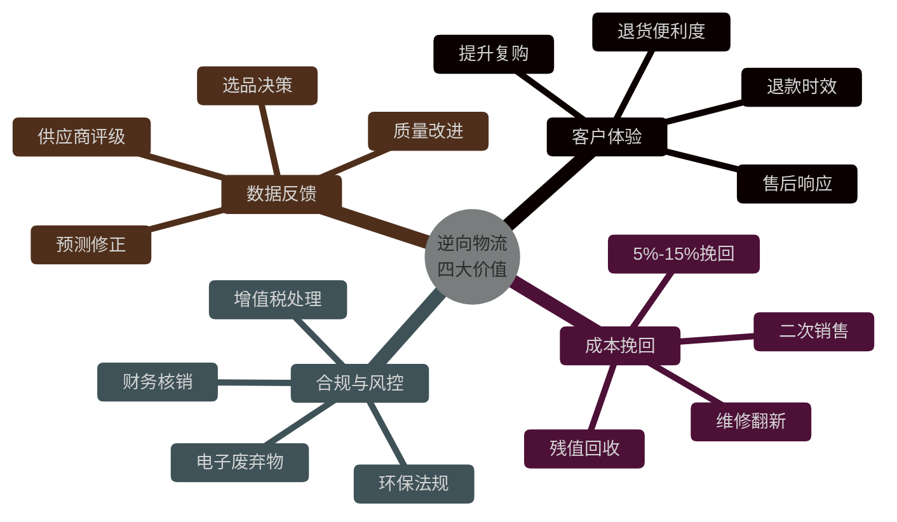

### 10.1.3 顺向 vs 逆向：本质差异

| 维度 | 顺向物流 | 逆向物流 |
|------|----------|----------|
| 流向 | 1 → N（集中到分散） | N → 1（分散到集中） |
| 触发 | 确定性订单 | 不确定事件（退货/召回） |
| 时效 | SLA 严格 | 弹性大 |
| 价值 | 收入 | 成本中心（也可变利润中心） |
| 状态机 | 线性 | 网状（多次进出） |
| SKU 状态 | 标准品 | 二手品、待检品、报废品 |

> **关键认知**：顺向是"打仗"，逆向是"治伤"。战场上赢了客户，治伤环节输了客户。

---

## 10.2 退货流程

退货是逆向物流的**最大流量入口**。不同退货原因、不同退货时点，流程差异巨大。

### 10.2.1 退货分类

| 退货类型 | 触发原因 | 处理优先级 | 退款策略 | 二次销售率 |
|----------|----------|-----------|----------|-----------|
| 无理由退货 | 7 天无理由 | 普通 | 全额原路退 | 70%-85% |
| 质量退货 | 商品瑕疵 | 高 | 全额 + 补偿 | 30%-50% |
| 误购退货 | 拍错/不想要 | 普通 | 全额 | 80%+ |
| 拒签退货 | 物流拒收 | 高 | 全额（扣除运费） | 95%+ |
| 拦截退货 | 发出未签收 | 紧急 | 全额 | 95%+ |
| 召回退货 | 批次问题 | 最高 | 全额 + 赔偿 | 0% |

### 10.2.2 退货全流程时序图

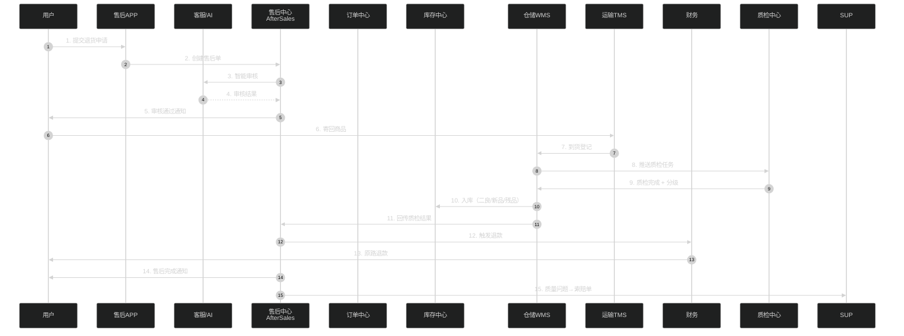

### 10.2.3 三种退货时点

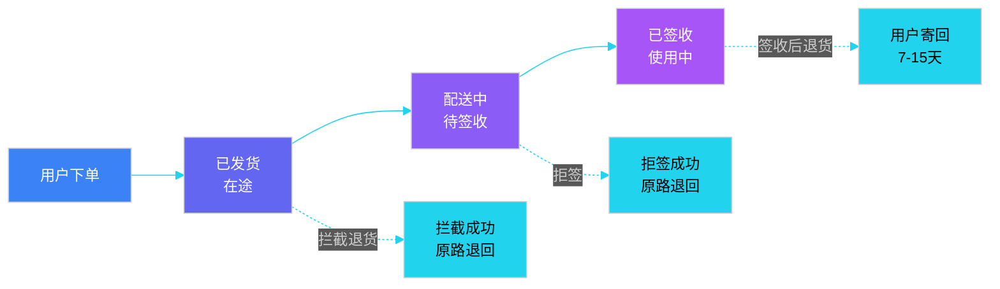

### 10.2.4 退货单状态机

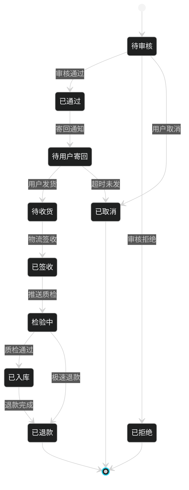

### 10.2.5 退款计算伪代码

```java
/**
 * 退款计算 - 根据退货类型、用户等级、优惠券等综合判定
 */
public class RefundCalculator {

    public RefundResult calculate(AfterSalesOrder order, ReturnReason reason) {
        Money originalAmount = order.getPayAmount();
        Money refundAmount = originalAmount;
        List<Compensation> compensations = new ArrayList<>();

        // 1. 退货原因维度
        switch (reason) {
            case QUALITY_ISSUE:  // 质量问题
                refundAmount = originalAmount;       // 全额退
                compensations.add(new Compensation(
                    CompensationType.COUPON,        // 补偿优惠券
                    originalAmount.percent(10)       // 10% 补偿券
                ));
                compensations.add(new Compensation(
                    CompensationType.POINTS,         // 积分
                    originalAmount.multiply(2)       // 2 倍积分
                ));
                break;

            case BUYER_REMORSE:  // 买家原因
                refundAmount = originalAmount;
                if (order.hasUsedCoupon()) {
                    // 优惠券不退现金，返还到账户
                    refundAmount = refundAmount.subtract(order.getCouponValue());
                }
                if (order.isFreeShipping()) {
                    // 免邮订单扣除发货运费
                    Money shipFee = shippingService.getActualCost(order);
                    refundAmount = refundAmount.subtract(shipFee);
                }
                break;

            case REJECT_SIGN:    // 拒签
            case INTERCEPT:      // 拦截
                refundAmount = originalAmount;
                // 双向运费处理
                if (order.isFreeShipping()) {
                    refundAmount = refundAmount.subtract(shippingService.getActualCost(order));
                }
                break;

            case RECALL:         // 召回
                refundAmount = originalAmount;
                compensations.add(new Compensation(
                    CompensationType.CASH,
                    originalAmount.percent(20)      // 20% 现金赔偿
                ));
                break;
        }

        // 2. 用户等级维度
        User user = order.getUser();
        if (user.isVip()) {
            // VIP 极速退款，无需等退货入库
            return RefundResult.fast(refundAmount, compensations);
        }

        // 3. 风控维度
        if (riskService.isHighReturnUser(user)) {
            // 高退货率用户，需验货后再退
            return RefundResult.normal(refundAmount, compensations);
        }

        return RefundResult.normal(refundAmount, compensations);
    }
}
```

---

## 10.3 退货质检

质检是逆向物流的**价值分水岭**——决定商品能否"起死回生"进入二次销售。

### 10.3.1 质检的 4 大维度

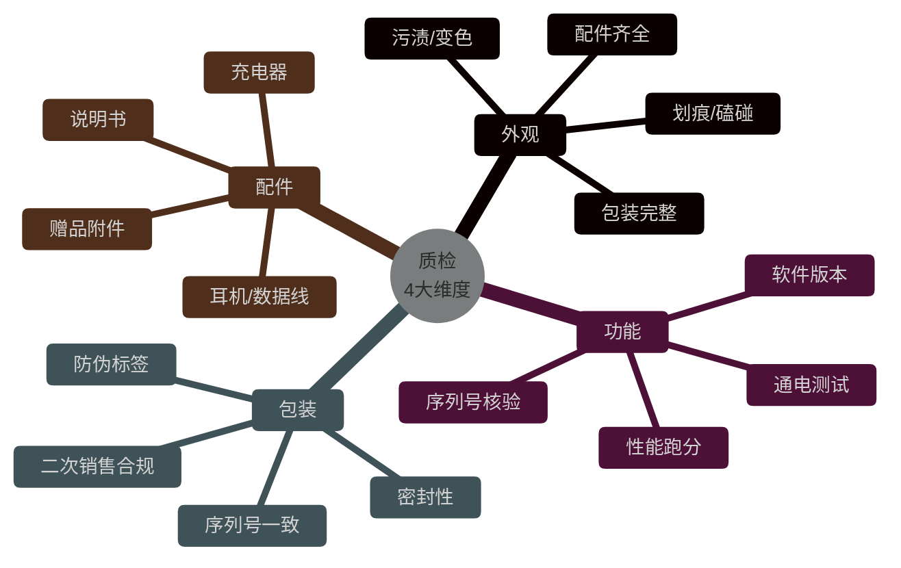

### 10.3.2 质检流程

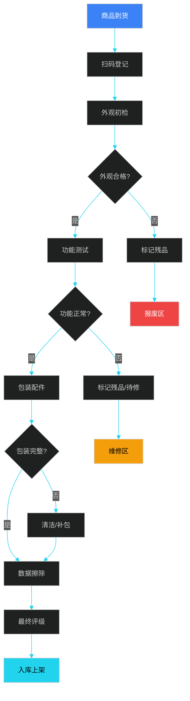

### 10.3.3 质检分级标准

| 等级 | 名称 | 外观 | 功能 | 包装配件 | 处理方式 | 二次销售 |
|------|------|------|------|----------|----------|----------|
| A 级 | 近新品 | 99% 新 | 完全正常 | 完整 | 直接二次销售 | 是，标"近全新" |
| B 级 | 良好品 | 95% 新，轻微痕迹 | 正常 | 完整 | 清洁后销售 | 是，标"9 成新" |
| C 级 | 一般品 | 80% 新，明显痕迹 | 正常 | 部分缺失 | 维修翻新 | 是，标"翻新机" |
| D 级 | 待修品 | 有瑕疵 | 部分故障 | 不全 | 进入维修 | 修复后销售 |
| E 级 | 残品 | 严重瑕疵 | 故障 | 缺失 | 报废 | 否 |

### 10.3.4 质检判定伪代码

```java
/**
 * 质检判定 - 基于多维度评分
 */
@Service
public class QualityInspectionService {

    public InspectionResult inspect(ReturnGoods goods) {
        // 1. 基础信息核验
        Sku sku = goods.getSku();
        Product product = sku.getProduct();

        // 2. 外观评分（0-100）
        int appearanceScore = appearanceInspector.score(goods);
        // 3. 功能评分（0-100）
        int functionScore = functionTester.test(goods);
        // 4. 包装评分（0-100）
        int packageScore = packageInspector.score(goods);
        // 5. 配件评分（0-100）
        int accessoryScore = accessoryChecker.score(goods, product);

        // 6. 加权总分（不同品类权重不同）
        CategoryType type = product.getCategory();
        ScoreWeights weights = ScoreWeights.of(type);  // 数码/服饰/食品
        int totalScore = weights.weightedSum(
            appearanceScore, functionScore, packageScore, accessoryScore
        );

        // 7. 关键项硬约束：功能分必须 > 60
        if (functionScore < 60) {
            return InspectionResult.level(
                Grade.E, "功能测试不通过：核心功能故障", goods
            );
        }

        // 8. 分级判定
        if (totalScore >= 95) {
            return InspectionResult.level(Grade.A, "近新品，可直接销售", goods);
        } else if (totalScore >= 85) {
            return InspectionResult.level(Grade.B, "轻微外观瑕疵", goods);
        } else if (totalScore >= 70) {
            // 外观差但功能正常 → 翻新
            if (appearanceScore < 70) {
                return InspectionResult.level(Grade.C, "需清洁翻新", goods);
            }
            return InspectionResult.level(Grade.D, "需维修", goods);
        } else {
            return InspectionResult.level(Grade.E, "报废处理", goods);
        }
    }
}
```

### 10.3.5 数据擦除（数码品类）

```java
/**
 * 数码产品数据擦除 - 防隐私泄露
 */
public class DataWipeService {

    public WipeResult wipe(String serialNumber) {
        Device device = deviceRegistry.getBySerial(serialNumber);

        // 1. Android：恢复出厂设置 + 安全擦除
        if (device.isAndroid()) {
            adbService.factoryReset(device);
            adbService.secureWipe(device, SectorAlgorithm.DOD5220);  // 3 次覆写
        }

        // 2. iOS：查找我的 iPhone 解绑 + 抹掉所有内容
        if (device.isIOS()) {
            icloudService.removeDevice(device.getIcloudId());
            device.executeDFU("erase all content");
        }

        // 3. 笔记本：硬盘安全擦除
        if (device.isLaptop()) {
            diskService.secureErase(device.getDiskSerial(), algorithm.ATA);
            // 或物理销毁（涉密场景）
        }

        // 4. 记录擦除证书
        WipeCertificate cert = new WipeCertificate(
            serialNumber, device.getModel(),
            Instant.now(), algorithm,
            operatorId
        );
        certRepository.save(cert);
        return WipeResult.success(cert);
    }
}
```

---

## 10.4 维修与翻新

质检分级为 C/D 的商品，进入维修/翻新流程。这是逆向物流中**技术含量最高**的环节。

### 10.4.1 寄修流程

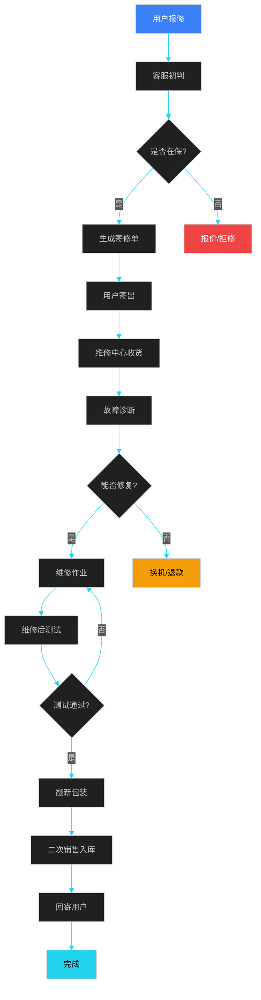

### 10.4.2 维修中心架构

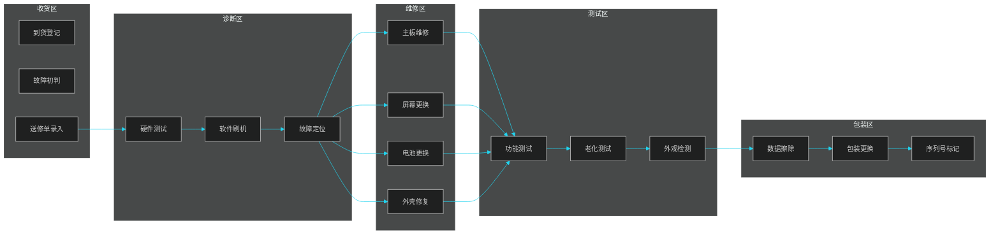

### 10.4.3 翻新流程伪代码

```java
/**
 * 翻新流程编排
 */
@Service
public class RefurbishService {

    public RefurbishResult refurbish(ReturnGoods goods) {
        RefurbishProcess process = new RefurbishProcess(goods);

        // Step 1: 深度清洁
        CleaningRecord cleaning = cleaningService.deepClean(goods);
        process.addStep("cleaning", cleaning);

        // Step 2: 故障维修
        if (goods.hasFault()) {
            RepairRecord repair = repairService.fix(goods);
            process.addStep("repair", repair);
            if (!repair.isSuccess()) {
                return RefurbishResult.failed("维修失败，转报废", process);
            }
        }

        // Step 3: 配件补充
        List<MissingPart> missing = goods.getMissingParts();
        for (MissingPart part : missing) {
            partService.attachPart(goods, part);
        }
        process.addStep("parts", missing);

        // Step 4: 数据擦除（数码品）
        if (goods.getCategory().isDigital()) {
            WipeCertificate wipe = dataWipeService.wipe(goods.getSerial());
            process.addStep("wipe", wipe);
        }

        // Step 5: 重新包装
        Package newPkg = packageService.repackage(goods, PackageGrade.REFURB);
        process.addStep("package", newPkg);

        // Step 6: 序列号重打（标"翻新"）
        if (goods.getCategory().isDigital()) {
            serialService.markAsRefurbished(goods);
        }

        // Step 7: 二次质检
        InspectionResult finalCheck = qualityService.inspect(goods);
        if (finalCheck.getGrade().isWorseThan(Grade.B)) {
            return RefurbishResult.failed("翻新后未达 B 级", process);
        }

        // Step 8: 重新喷码 SN + 入库
        goodsService.updateStatus(goods, GoodsStatus.REFURBISHED);
        wmsService.putAway(goods, WarehouseZone.SECOND_HAND);

        return RefurbishResult.success(process);
    }
}
```

### 10.4.4 翻新 vs 维修 vs 二手

| 维度 | 维修 | 翻新 | 二手 |
|------|------|------|------|
| 对象 | 用户机器 | 退货残次品 | 用户二手 |
| 来源 | 售后 | 退货流入 | 回收平台 |
| 目标 | 恢复原功能 | 恢复销售价值 | 转售变现 |
| 渠道 | 寄回用户 | 二次销售 | 二手平台 |
| 价格 | 免费/折扣 | 原价 7-9 折 | 市场定价 |
| 保修 | 原保修期 | 短期保修 | 无/短期 |

---

## 10.5 报废与销毁

无法维修、无法翻新的商品进入报废流程，涉及**环保合规、财务核销、库存释放**。

### 10.5.1 报废分类

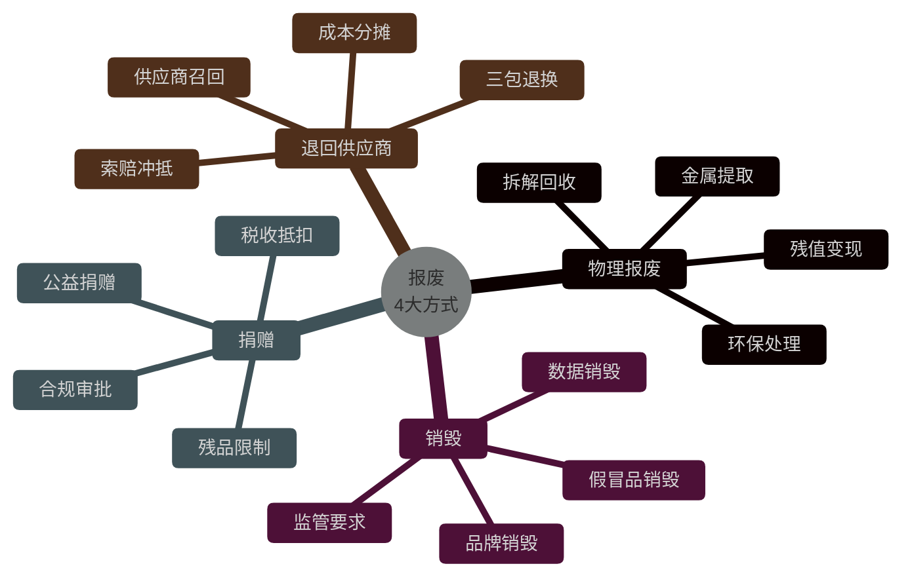

### 10.5.2 报废处理流程

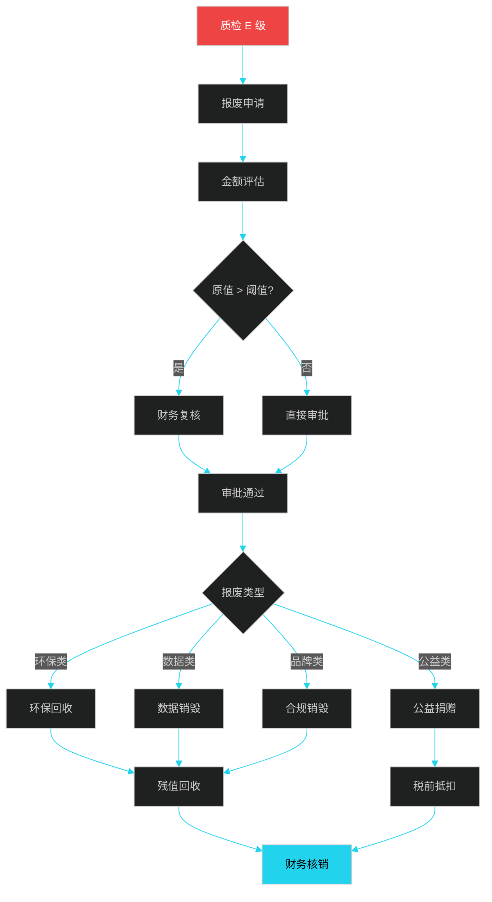

### 10.5.3 报废方式对比

| 报废方式 | 适用对象 | 残值 | 成本 | 合规要求 | 行业案例 |
|----------|----------|------|------|----------|----------|
| 物理拆解 | 家电、电子 | 中（金属） | 中 | 危废资质 | 苹果 Liam 机器人 |
| 环保回收 | 电池、危化 | 低 | 中 | 危废许可 | 骆驼股份 |
| 数据销毁 | 硬盘、SSD | 无 | 低 | 等保 2.0 | 银行销毁 |
| 合规焚烧 | 假冒品 | 无 | 中 | 公安监管 | 市场监管局 |
| 公益捐赠 | 残次品/二手 | 无 | 低 | 受赠资质 | 慈善总会 |
| 退回供应商 | 批次问题 | 高 | 中 | 合同条款 | 三包退换 |

### 10.5.4 报废财务核销

```java
/**
 * 报废财务核销 - 涉及库存/资产/税务
 */
@Service
public class ScrapWriteOffService {

    @Transactional
    public WriteOffResult writeOff(ScrapOrder scrap) {
        // 1. 库存释放
        List<ScrapItem> items = scrap.getItems();
        for (ScrapItem item : items) {
            Inventory inv = inventoryService.get(item.getSku(), item.getWarehouse());
            inventoryService.release(inv, item.getQty());
        }

        // 2. 资产账面价值计算
        BigDecimal bookValue = items.stream()
            .map(item -> item.getOriginalCost()
                .subtract(item.getAccumulatedDepreciation()))
            .reduce(BigDecimal.ZERO, BigDecimal::add);

        // 3. 残值预估
        BigDecimal salvageValue = recycleService.estimate(items);

        // 4. 损失计算
        BigDecimal loss = bookValue.subtract(salvageValue);

        // 5. 财务凭证
        Voucher voucher = new Voucher();
        voucher.addEntry("库存商品", bookValue.negate());   // 借：待处理财产损溢
        voucher.addEntry("待处理财产损溢", loss);            // 借：营业外支出
        voucher.addEntry("库存商品-CG", salvageValue);       // 贷：原材料（残料入库）
        voucher.addEntry("应交税费-进项税转出", /*...*/);    // 进项税转出
        financeService.post(voucher);

        // 6. 资产卡片核销
        for (FixedAsset asset : scrap.getAssets()) {
            assetService.scrap(asset);
        }

        // 7. 报废证书存档（合规）
        if (scrap.requiresCertificate()) {
            certService.issue(scrap, CertificateType.SCRAP);
        }

        return WriteOffResult.success(loss, voucher);
    }
}
```

---

## 10.6 供应商索赔

质量问题的源头在供应商，向供应商索赔是**挽回损失**的关键手段。京东的"供应商索赔"系统是行业标杆。

### 10.6.1 索赔分类

| 索赔类型 | 触发场景 | 索赔金额 | 处理时效 | 证据要求 |
|----------|----------|----------|----------|----------|
| 质量索赔 | 批次不良 | 损失 + 罚金 | 7 天 | 质检报告 + 批次追溯 |
| 数量索赔 | 短装/多装 | 差额 | 3 天 | 收货差异单 |
| 交期索赔 | 延期交付 | 违约金 | 5 天 | 合同条款 |
| 包装索赔 | 包装破损 | 损失 | 7 天 | 现场照片 |
| 召回索赔 | 批次召回 | 全部 | 紧急 | 召回公告 |

### 10.6.2 索赔单流程

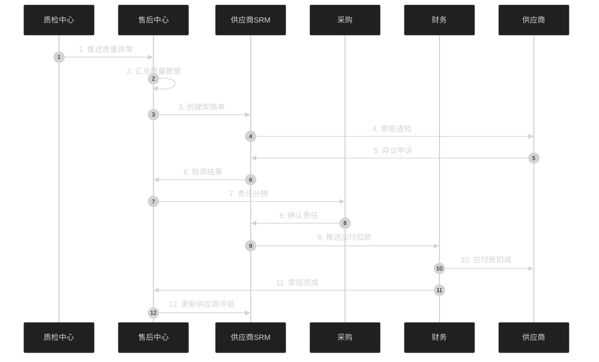

### 10.6.3 索赔计算伪代码

```java
/**
 * 供应商索赔计算 - 涵盖直接损失 + 间接损失 + 罚金
 */
@Service
public class ClaimCalculationService {

    public ClaimResult calculate(QualityIssue issue) {
        BigDecimal directLoss = BigDecimal.ZERO;
        BigDecimal indirectLoss = BigDecimal.ZERO;
        BigDecimal penalty = BigDecimal.ZERO;
        List<LossItem> lossItems = new ArrayList<>();

        // 1. 直接损失：商品成本
        for (AffectedBatch batch : issue.getBatches()) {
            BigDecimal cost = batch.getQty() * batch.getUnitCost();
            directLoss = directLoss.add(cost);
            lossItems.add(new LossItem("商品成本", batch, cost));
        }

        // 2. 物流损失：双向运费
        BigDecimal shippingLoss = shippingService.calculateRoundTripCost(issue);
        directLoss = directLoss.add(shippingLoss);
        lossItems.add(new LossItem("双向运费", issue, shippingLoss));

        // 3. 人工成本：客服/质检
        BigDecimal laborCost = laborService.calculate(issue);
        indirectLoss = indirectLoss.add(laborCost);
        lossItems.add(new LossItem("人工处理", issue, laborCost));

        // 4. 客户补偿（优惠券/积分）
        BigDecimal compensation = compensationService.totalPaid(issue);
        indirectLoss = indirectLoss.add(compensation);
        lossItems.add(new LossItem("客户补偿", issue, compensation));

        // 5. 二次销售损失（残值差）
        BigDecimal residualLoss = issue.getOriginalValue()
            .subtract(issue.getResidualValue());
        indirectLoss = indirectLoss.add(residualLoss);
        lossItems.add(new LossItem("残值损失", issue, residualLoss));

        // 6. 品牌罚金（按合同条款）
        Contract contract = contractService.get(issue.getSupplier());
        BigDecimal qualityPenalty = contract.getQualityPenalty(issue.getSeverity());
        penalty = qualityPenalty;

        // 7. 比例分摊：是否 100% 供应商责任
        BigDecimal supplierRatio = liabilityService.allocate(issue);  // 0-100%
        BigDecimal totalClaim = directLoss.add(indirectLoss).add(penalty)
            .multiply(BigDecimal.valueOf(supplierRatio / 100.0));

        return ClaimResult.builder()
            .directLoss(directLoss)
            .indirectLoss(indirectLoss)
            .penalty(penalty)
            .supplierRatio(supplierRatio)
            .totalClaim(totalClaim)
            .lossItems(lossItems)
            .build();
    }
}
```

### 10.6.4 责任分摊规则

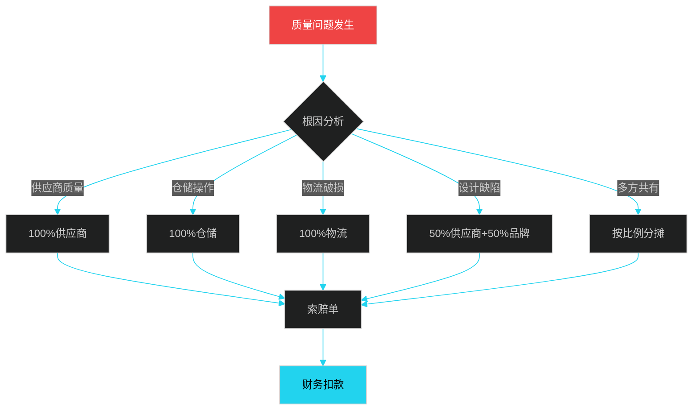

### 10.6.5 索赔方式对比

| 方式 | 优点 | 缺点 | 适用场景 |
|------|------|------|----------|
| 应付账款扣减 | 直接、闭环 | 影响供应商现金流 | 常规索赔 |
| 下次订单折扣 | 维护关系 | 周期长 | 长期合作 |
| 现金赔付 | 一次性 | 催收成本 | 严重事故 |
| 换货补发 | 维护关系 | 流程复杂 | 批次性 |
| 第三方仲裁 | 公平 | 时间长 | 争议大 |

---

## 10.7 整体架构与系统集成

### 10.7.1 逆向物流系统架构

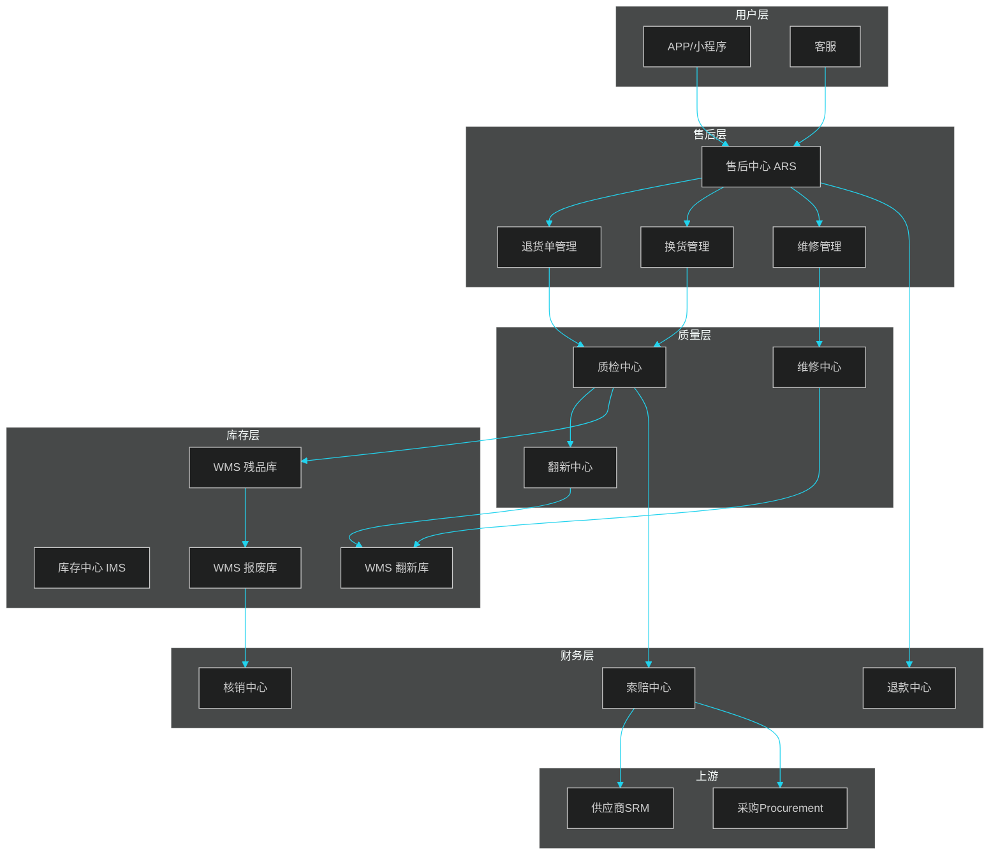

### 10.7.2 关键数据流转

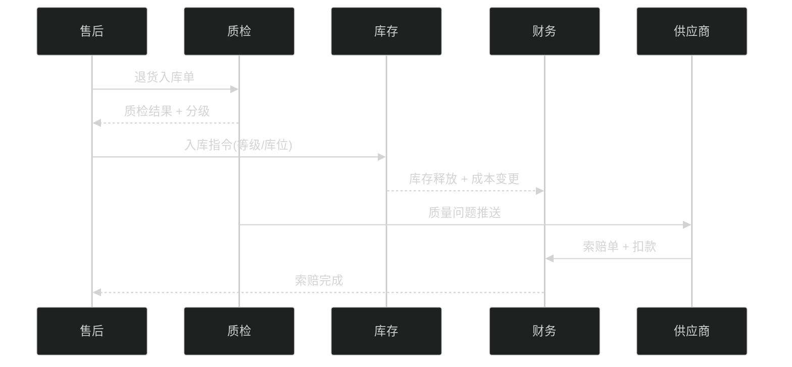

### 10.7.3 行业代表实践

| 企业 | 模式 | 关键数据 | 系统亮点 |
|------|------|----------|----------|
| 京东 | 自营+自建售后 | 售后网点 2000+ | 211 退换、上门取件 |
| SHEIN | 集中质检+海外仓 | 退货率 25% | 海外质检中心 |
| 亚马逊 | FBA 退货+翻新 | 翻新销售占比 30% | 二次销售专属 listing |
| 苹果 | 寄修+以旧换新 | 翻新机 70% 流入二手 | Trade In 闭环 |
| Zara | 快时尚+集中销毁 | 残品销毁率 90% | 品牌保护 |
| 宜家 | 平板+自提 | 退货率 5% | 包装完整无损 |

---

## 本章小结

逆向物流是供应链系统的**最后闭环**，覆盖**退货 → 质检 → 维修/翻新 → 报废 → 供应商索赔**五大环节。**退货率**是用户体验的直接体现，**二次销售率**是利润挽回的关键，**报废合规**是企业经营的底线，**供应商索赔**是质量问题的"清算机制"。

工程实现上，**售后中心 ARS、质检中心 QCS、维修中心 RMS、报废中心 SCS、索赔中心 CLM** 五大子系统需要紧密协同。退款计算、质检判定、翻新编排、索赔计算都需要**业务规则引擎 + 状态机 + 事件驱动**支撑。

> 关键认知：逆向物流不是成本中心，而是**价值中心**——优秀企业能让 70% 的退货商品重新进入销售链路。

---

## 面试高频问题

**1. 退货流程有哪几种触发方式？分别怎么处理？**

参考答案要点：① 拒签——配送中用户拒收，物流带回仓库，全额退款，扣除运费；② 拦截——已发货未签收，申请拦截退回，库存回流，预占释放；③ 签收后退货——用户寄回（7-15 天），需质检后入库退款。三种方式时效、库存释放、用户体验差异显著。

**2. 退货质检如何分级？依据是什么？**

参考答案要点：常见分为 A（近新品）、B（良好品）、C（一般品）、D（待修品）、E（残品）五级。判定依据：① 外观评分（划痕/污渍）；② 功能评分（通电/性能）；③ 包装评分（完整性）；④ 配件评分（齐全度）。不同品类（数码/服饰/食品）权重不同，且功能分通常有硬约束。

**3. 翻新和维修有什么区别？**

参考答案要点：① 维修是恢复用户机器的原功能，目标是"修好给用户"，处理的是寄修订单；② 翻新是恢复退货商品的销售价值，目标是"二次销售"，处理的是退货残次品。维修通常有保修，翻新有短期质保或无保修。

**4. 供应商索赔如何计算？**

参考答案要点：索赔金额 = 直接损失（商品成本 + 双向运费） + 间接损失（人工 + 客户补偿 + 残值差） + 罚金（合同条款） × 供应商责任比例。需要分摊机制：100% 供应商、100% 仓储、100% 物流、或按比例分摊。索赔方式：应付账款扣减、下次订单折扣、现金赔付等。

**5. 逆向物流与顺向物流的本质区别？**

参考答案要点：① 流向：顺向 1→N（集中到分散），逆向 N→1（分散到集中）；② 触发：顺向是确定性订单，逆向是不确定事件；③ 价值：顺向是收入，逆向是成本/利润中心；④ 状态机：顺向线性，逆向网状（多次进出）；⑤ SKU 状态：顺向标准品，逆向涉及二良、残品、待修品等多种状态。

**6. 报废处理涉及哪些合规要求？**

参考答案要点：① 环保合规：电子废弃物需要危废资质（《危险废物经营许可证》）；② 数据合规：硬盘 SSD 销毁需满足等保 2.0、国密要求；③ 财务合规：进项税转出、营业外支出、资产卡片核销；④ 销毁合规：假冒品销毁需公安/市场监管局监督；⑤ 捐赠合规：受赠方需具备公益捐赠税前抵扣资质。

**7. 如何设计一个高可用的售后退款系统？**

参考答案要点：① 状态机驱动：所有退款必须经过明确状态（待审核→审核通过→退款中→已完成）；② 幂等性：使用退款单号 + 业务唯一键防止重复退款；③ 异步化：退款通道异步调用，支持重试；④ 资金安全：每日退款总额限流，异常订单人工审核；⑤ 极速退款：VIP 用户免等退货的预授权机制；⑥ 对账：T+1 与支付通道对账，差异订单追踪。

**8. 数码产品的退货为什么需要数据擦除？**

参考答案要点：① 隐私保护：手机/笔记本含个人数据（照片、账号、密码），防泄露；② 法律合规：《个人信息保护法》《网络安全法》要求；③ 品牌责任：避免因数据泄露引发的品牌危机；④ 二手流通：擦除后才能进入二次销售。常见做法：Android 安全擦除（DOD 5220.22-M 三次覆写）、iOS 远程抹掉、笔记本 ATA Secure Erase。完成后必须签发数据擦除证书。
