# 第 11 章 需求预测与计划

> 本章定位：在第 1 章"业务全景"和第 3 章"智能层"的基础上，**专题深入**需求预测（Demand Forecasting）与销售运营计划（S&OP）。预测是供应链的"前哨"，所有补货、排产、库存策略的源头都来自一个数字——"未来需要多少"。
>
> **学习建议**：本章包含较多数学公式与代码片段。读者可结合第 13 章"智能算法"和第 7 章"补货模型"一起阅读。

---

## 11.1 预测在供应链中的位置

### 11.1.1 预测是什么，为什么重要

需求预测（Demand Forecasting）是**根据历史销售数据、外部因子、业务规则，对未来一段时间内产品需求量进行估计**的过程。预测结果是后续所有计划的"输入信号"：

- **采购计划** → 决定 PO 时机与数量
- **生产排程** → 决定产线开工率
- **补货策略** → 决定补货点（ROP）与补货量（ROQ）
- **库存预算** → 决定 SKU 安全库存水位
- **S&OP 共识** → 决定跨部门协同目标

> **经典论断**：预测永远是不准确的（"All forecasts are wrong, but some are useful" — George Box）。供应链系统的目标不是追求"精确预测"，而是**让系统能容忍预测误差**。

### 11.1.2 预测在供应链架构中的位置

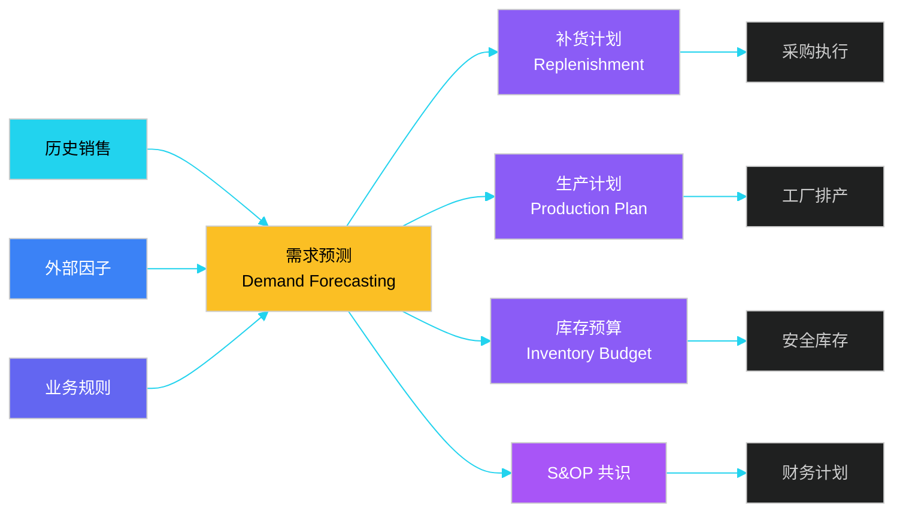

### 11.1.3 推动式 vs 拉动式供应链

供应链的两种极端模式，对预测的依赖程度截然不同：

| 模式 | 驱动信号 | 库存策略 | 典型行业 | 对预测依赖 |
|------|---------|---------|---------|----------|
| **推动式（Push）** | 预测 | 提前备货 | 制造、零售 | 高（70%+ 决策依赖预测） |
| **拉动式（Pull）** | 实际订单 | 按单生产/采购 | 餐饮、定制 | 低（实时订单触发） |
| **推拉结合** | 前段预测 + 后段拉动 | 关键节点备货 | 电商、汽车 | 中（分阶段策略） |

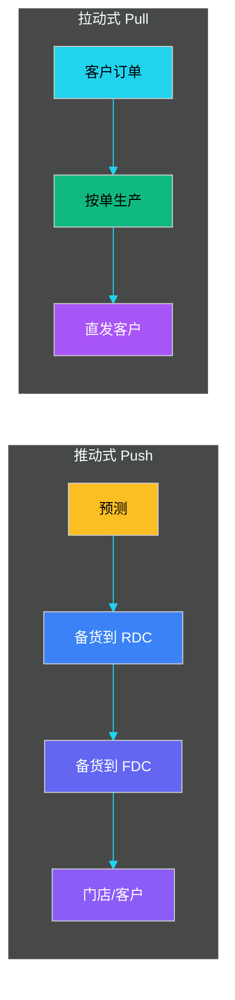

**推动式风险**：预测偏差 → 库存积压或缺货。**拉动式风险**：交付周期长（Lead Time 长）→ 客户体验差。

### 11.1.4 推拉结合的混合模式

现代供应链多采用**"推拉结合"**：在供应链上游（原材料、通用件）用推动式，在下游（个性化、定制件）用拉动式。**分界点（Decoupling Point）** 通常选在最长的瓶颈工序或客户定制差异点。

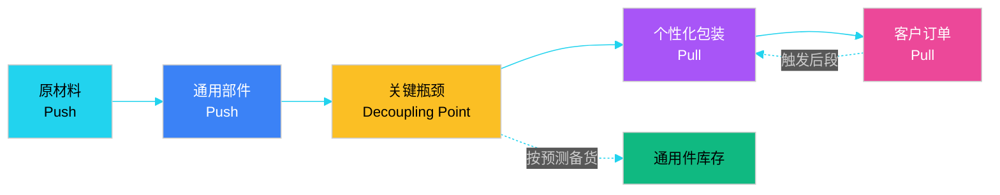

**案例**：

- **戴尔（Dell）**：主板、CPU 等通用件按预测推动，个性化配置（内存、硬盘、Logo）按订单拉动。**库存周转 90 次/年**（行业平均 6-8 次）。
- **ZARA**：染色布料按预测推动（基本款），印花、绣花按门店订单拉动。**2 周上新**。
- **汽车行业**：发动机、变速箱等关键件按预测推动（Lead Time 6 周），座椅、颜色按订单拉动（订单到交付 4 周）。

---

## 11.2 传统预测方法

### 11.2.1 移动平均（Moving Average, MA）

最简单的方法：用最近 N 期销量的算术平均作为下期预测。

```
F(t+1) = ( Y(t) + Y(t-1) + ... + Y(t-N+1) ) / N
```

- **优点**：实现简单、平滑噪声
- **缺点**：对趋势、季节性不敏感；窗口 N 难以选择

**加权移动平均**给近期数据更大权重：

```
F(t+1) = w1*Y(t) + w2*Y(t-1) + ... + wN*Y(t-N+1)
其中 w1 + w2 + ... + wN = 1
```

### 11.2.2 指数平滑（Exponential Smoothing）

指数平滑是移动平均的"加权升级版"，权重按指数衰减，无需存储全部历史。

**一次指数平滑（SES, Single Exponential Smoothing）**：

```
F(t+1) = α * Y(t) + (1 - α) * F(t)
```

- `α` 为平滑系数，取值 [0, 1]
- α 越大 → 越重视近期数据
- α 越小 → 越平滑

**伪代码实现**：

```python
def single_exponential_smoothing(history, alpha, horizon=1):
    """
    一次指数平滑预测
    :param history: 历史销量列表 [y1, y2, ..., yT]
    :param alpha:   平滑系数
    :param horizon: 预测步长
    :return: 未来 horizon 期的预测值
    """
    if not history:
        raise ValueError("history cannot be empty")

    # 初始化：F(1) = Y(1)
    forecast = history[0]

    # 递推
    for t in range(1, len(history)):
        forecast = alpha * history[t] + (1 - alpha) * forecast
        # 滚动记录每一步预测可用于回测
        # preds.append(forecast)

    # 未来 horizon 步预测在平稳序列下等于当前平滑值
    return [forecast] * horizon
```

**二次指数平滑（Double ES, Holt's Linear）**：增加趋势分量，能捕捉线性上升/下降：

```
Level:  L(t) = α * Y(t) + (1 - α) * (L(t-1) + T(t-1))
Trend:  T(t) = β * (L(t) - L(t-1)) + (1 - β) * T(t-1)
Forecast: F(t+h) = L(t) + h * T(t)
```

**三次指数平滑（Triple ES, Holt-Winters）**：在 Level + Trend 基础上增加 **Seasonal** 分量：

```
Level:  L(t) = α * (Y(t) - S(t-s)) + (1 - α) * (L(t-1) + T(t-1))
Trend:  T(t) = β * (L(t) - L(t-1)) + (1 - β) * T(t-1)
Season: S(t) = γ * (Y(t) - L(t)) + (1 - γ) * S(t-s)
Forecast: F(t+h) = L(t) + h * T(t) + S(t+h-s)
```

`s` 为季节周期（周 7、月 12、季 4 等），`α/β/γ` 三个超参数通过最小化 SSE 求解。

### 11.2.3 季节性分解（STL）

将时序拆为**趋势（Trend）+ 季节（Seasonal）+ 残差（Residual）**：

```
Y(t) = T(t) + S(t) + R(t)
```

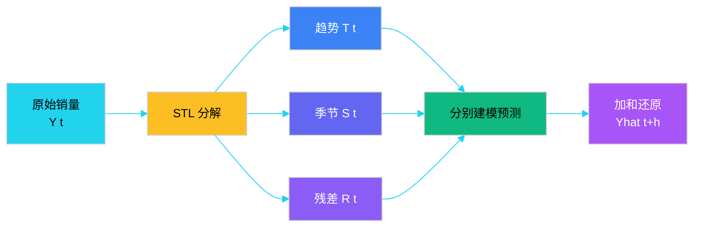

### 11.2.4 传统方法对比

| 方法 | 适用场景 | 优势 | 局限 | 工程实现 |
|------|---------|------|------|---------|
| **简单移动平均** | 平稳序列、噪声大 | 简单、抗噪 | 无趋势/季节响应 | 滑动窗口求均值 |
| **加权移动平均** | 近期更重要 | 灵活赋权 | 需人工调权重 | 加权求和 |
| **一次指数平滑** | 平稳序列 | 只需存 F(t) | 无趋势 | 递推式 |
| **Holt 线性** | 有趋势、无季节 | 捕捉趋势 | 不能处理季节 | 双递推式 |
| **Holt-Winters** | 趋势 + 季节 | 工业级经典 | 三参数难调 | statsmodels 实现 |
| **STL 分解** | 复杂季节模式 | 可解释性强 | 分解后需再建模 | statsmodels.tsa.seasonal_decompose |
| **Croston** | 间歇需求（大量 0） | 适合低频备件 | 不能预测趋势 | 间隔 + 需求双平滑 |

> **工程经验**：传统方法在数据量小（< 2 年）、可解释性要求高、SKU 数极多（10万+）的场景依然是首选，因为 ML 模型**训练成本**和**维护成本**过高。

---

## 11.3 机器学习预测

### 11.3.1 ML 预测的适用边界

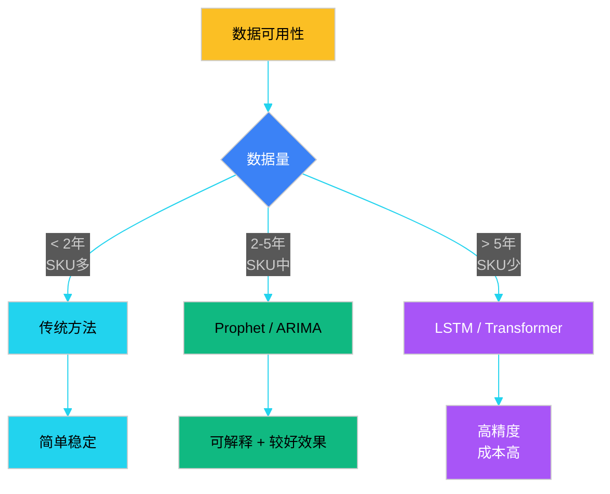

### 11.3.2 ARIMA 模型

**ARIMA（AutoRegressive Integrated Moving Average）** 是经典时序模型，由三部分组成：

- **AR（自回归）**：用过去 p 期值预测
- **I（差分）**：对序列做 d 次差分使其平稳
- **MA（移动平均）**：用过去 q 期的预测误差修正

记为 **ARIMA(p, d, q)**：

```
Y'(t) = c + φ1*Y'(t-1) + ... + φp*Y'(t-p) + θ1*ε(t-1) + ... + θq*ε(t-q) + ε(t)
```

其中 `Y'(t)` 是 d 次差分后的序列。

**SARIMA** 增加季节分量：SARIMA(p, d, q)(P, D, Q, s)

**优势**：

- 数学严谨，可解释
- 对平稳序列效果好

**局限**：

- 不支持外部因子（ARIMAX 是扩展）
- 多 SKU 难以批量训练
- 季节性需要手工指定

### 11.3.3 Prophet 模型（Facebook 开源）

Prophet 是 Facebook 2017 年开源的时序预测库，专为**业务时序**设计：缺失值、季节性、节假日、外生变量都能处理，且对超参数不敏感。

**核心分解**：

```
y(t) = g(t) + s(t) + h(t) + ε(t)
       趋势   季节  节假日  噪声
```

- `g(t)`：分段线性或 logistic 增长
- `s(t)`：傅里叶级数拟合季节
- `h(t)`：节假日哑变量回归

**伪代码：Prophet 模型训练**：

```python
import pandas as pd
from prophet import Prophet

def train_prophet_forecast(history_df, promo_df, holidays_df, horizon=30):
    """
    Prophet 模型训练与预测
    :param history_df:  DataFrame[ds, y]  历史销量
    :param promo_df:    DataFrame[ds, promotion]  促销标记
    :param holidays_df: DataFrame[holiday, ds, lower_window, upper_window]
    :param horizon:     预测天数
    :return:            未来 horizon 天的预测
    """
    # 1. 准备数据
    df = history_df.copy()
    df['y'] = df['y'].clip(lower=0)   # 销量不能为负

    # 2. 合并促销外生变量
    df = df.merge(promo_df, on='ds', how='left')
    df['promotion'] = df['promotion'].fillna(0)

    # 3. 构建模型
    model = Prophet(
        growth='linear',         # 趋势：线性 / logistic
        yearly_seasonality=True, # 年季节
        weekly_seasonality=True, # 周季节
        daily_seasonality=False,
        seasonality_mode='multiplicative',  # 乘法季节（销量越大波动越大）
        changepoint_prior_scale=0.05,       # 趋势灵活度
        holidays=holidays_df,
    )
    # 4. 增加促销作为额外回归因子
    model.add_regressor('promotion', prior_scale=0.5)

    # 5. 训练
    model.fit(df)

    # 6. 构造未来 dataframe 并填入回归因子
    future = model.make_future_dataframe(periods=horizon)
    future = future.merge(promo_df, on='ds', how='left')
    future['promotion'] = future['promotion'].fillna(0)

    # 7. 预测
    forecast = model.predict(future)
    return forecast[['ds', 'yhat', 'yhat_lower', 'yhat_upper']]
```

> **工业经验**：Prophet 在**有强季节性、有促销、SKU 数百到数千**的场景下，性价比远超 ARIMA 和 LSTM。

### 11.3.4 LSTM 时序预测

**LSTM（Long Short-Term Memory）** 是循环神经网络（RNN）的改进版，通过"门控机制"解决长依赖问题。

**LSTM 单元结构**：

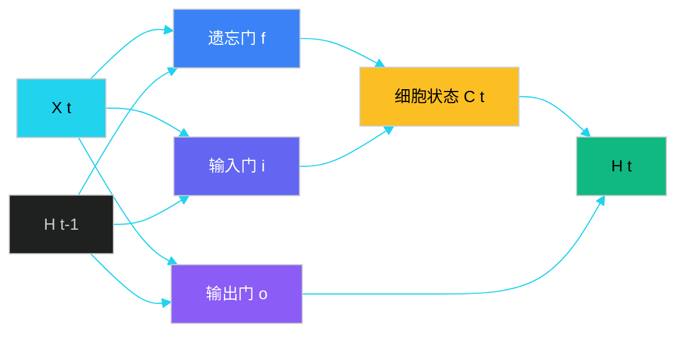

**三门作用**：

- **遗忘门（Forget Gate）**：决定丢弃多少旧记忆
- **输入门（Input Gate）**：决定写入多少新信息
- **输出门（Output Gate）**：决定输出多少细胞状态

**伪代码：LSTM 模型**：

```python
import torch
import torch.nn as nn

class DemandLSTM(nn.Module):
    def __init__(self, input_dim, hidden_dim=64, num_layers=2, output_dim=1):
        super().__init__()
        self.lstm = nn.LSTM(
            input_size=input_dim,
            hidden_size=hidden_dim,
            num_layers=num_layers,
            batch_first=True,
            dropout=0.2
        )
        self.fc = nn.Sequential(
            nn.Linear(hidden_dim, 32),
            nn.ReLU(),
            nn.Linear(32, output_dim)
        )

    def forward(self, x):
        # x shape: (batch, seq_len, input_dim)
        lstm_out, _ = self.lstm(x)
        # 只取最后一个时间步
        last = lstm_out[:, -1, :]
        return self.fc(last)


# 训练循环（伪代码）
def train_lstm(model, train_loader, val_loader, epochs=50):
    optimizer = torch.optim.Adam(model.parameters(), lr=1e-3)
    criterion = nn.MSELoss()
    for epoch in range(epochs):
        model.train()
        for x, y in train_loader:
            optimizer.zero_grad()
            pred = model(x)
            loss = criterion(pred, y)
            loss.backward()
            optimizer.step()
        # 验证 + 早停
        ...
```

### 11.3.5 Transformer / Informer

2020 年起，**Transformer 在时序预测**中逐渐取代 LSTM。代表模型：

- **Transformer**（原始）：注意力机制，可并行
- **Informer**（AAAI 2021）：稀疏注意力，O(L log L) 复杂度
- **PatchTST**（ICLR 2023）：patch + channel-independent，长序列 SOTA
- **TimesNet**（ICLR 2023）：二维卷积建模周期

**Transformer 优势**：

- 长期依赖捕捉能力强
- 可解释性（注意力权重可视化）
- 多变量协同（气象、促销、销量联合）

**Transformer 劣势**：

- 数据需求大（> 5 年）
- 训练成本高
- 推理延迟高（需 GPU）

### 11.3.6 ML 预测全流程

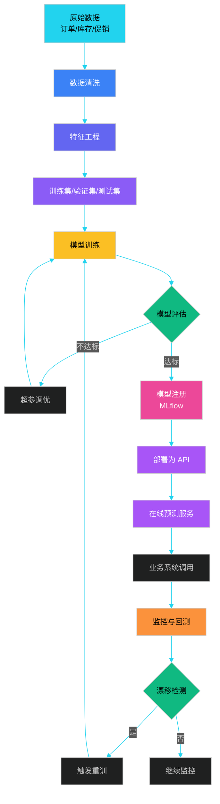

### 11.3.7 传统 vs ML 预测对比

| 维度 | 传统方法（MA/ES/ARIMA） | 机器学习（Prophet/LSTM/TF） |
|------|------------------------|---------------------------|
| **数据需求** | 小（1-2 年即可） | 大（3-5 年+） |
| **训练成本** | 秒级 | 小时~天 |
| **可解释性** | 高（公式级） | 中~低（黑盒） |
| **外部因子** | 难融合 | 天然支持 |
| **多 SKU** | 需逐 SKU 训练 | 可批量学习 |
| **精度上限** | 中 | 高 |
| **运维成本** | 低 | 高（监控+重训） |
| **工程推荐** | 启动期、长尾 SKU | 主力 SKU、促销敏感 |

---

## 11.4 外部因子融合

### 11.4.1 为什么必须融合外部因子

历史销量只是"果"，**外部因子才是"因"**。不融合外部因子的预测，在突变场景下会严重失真：

- 大促（双 11、618）：销量可飙升 10-20 倍
- 极端天气：冷饮、棉服、空调销量剧变
- 节假日：春节月饼、端午粽子
- 突发事件：疫情、热点新闻

### 11.4.2 外部因子分类

| 因子类型 | 典型因子 | 数据源 | 接入方式 |
|---------|---------|--------|---------|
| **促销** | 满减、折扣、优惠券、秒杀 | 自营 ERP、CRM | 内部 API |
| **价格** | 售价、竞品价、阶梯价 | 爬虫 + 内部系统 | 实时/日频 |
| **天气** | 温度、降水、湿度、空气质量 | 中国天气网、和风气象 | API/推送 |
| **节假日** | 法定假日、传统节日、双 11 | 日历服务 | 静态+动态 |
| **事件** | 体育赛事、演唱会、新闻 | 百度热搜、微博 | 爬虫/订阅 |
| **宏观** | CPI、PMI、社零、汇率 | 国家统计局 | 月频 |

### 11.4.3 促销因子融合

促销是最强的影响因子，通常销量弹性 5-20 倍。融合方式：

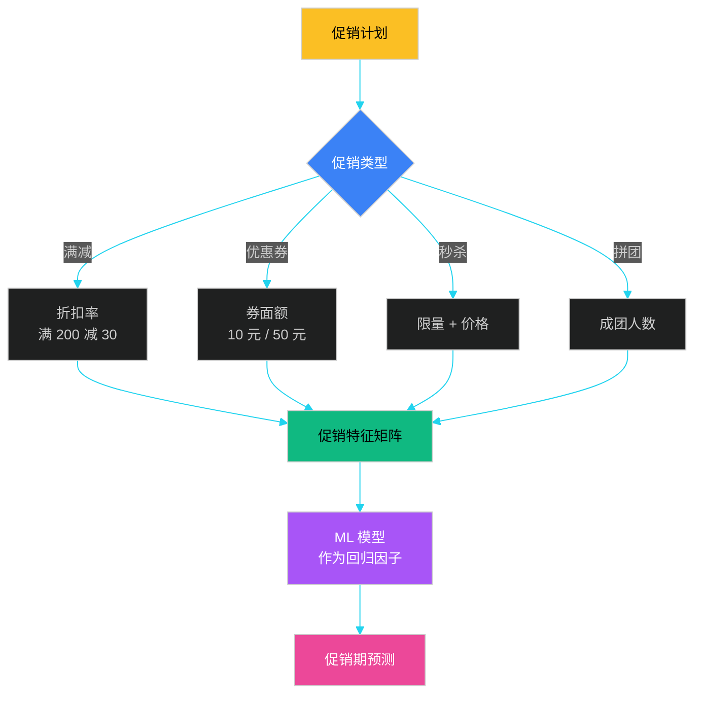

**促销特征工程**：

| 特征名 | 类型 | 说明 | 示例 |
|--------|------|------|------|
| `is_promotion` | 0/1 | 当天是否参与促销 | 1 |
| `discount_rate` | 0~1 | 平均折扣 | 0.7 |
| `promo_strength` | 0~10 | 促销力度评分 | 8 |
| `days_to_promo` | int | 距下次促销天数 | -2（已促销 2 天）|
| `promo_lift` | float | 历史同期提升倍数 | 3.5 |
| `promo_type` | 类别 | 满减/秒杀/直降 | "满减" |
| `competitor_promo` | 0/1 | 竞品是否同促 | 1 |

**伪代码：促销特征构造**：

```python
def build_promo_features(order_df, promo_plan_df):
    """
    构造促销相关特征
    :param order_df:      历史订单 [sku, dt, qty, price]
    :param promo_plan_df: 促销计划 [sku, dt, promo_type, discount_rate]
    :return: 合并后特征表
    """
    df = order_df.merge(promo_plan_df, on=['sku', 'dt'], how='left')
    df['is_promotion'] = df['promo_type'].notna().astype(int)
    df['discount_rate'] = df['discount_rate'].fillna(1.0)

    # 促销力度评分：1 - 折扣率（折扣越大分越高）
    df['promo_strength'] = (1 - df['discount_rate']) * 10

    # 距促销日天数（向前向后）
    df = df.sort_values(['sku', 'dt'])
    df['days_to_next_promo'] = df.groupby('sku')['is_promotion'].transform(
        lambda s: (s[::-1].cumsum() == 0).cumsum().where(s == 0, 0)
    )
    return df
```

### 11.4.4 天气因子融合

天气对以下品类销量影响巨大：

- **冷热敏感**：空调、电扇、棉服、泳装
- **降水敏感**：雨伞、雨靴、除湿机
- **空气质量敏感**：口罩、空气净化器
- **节气敏感**：凉茶（夏季）、保暖品（冬季）

**案例：气温 vs 冷饮销量**

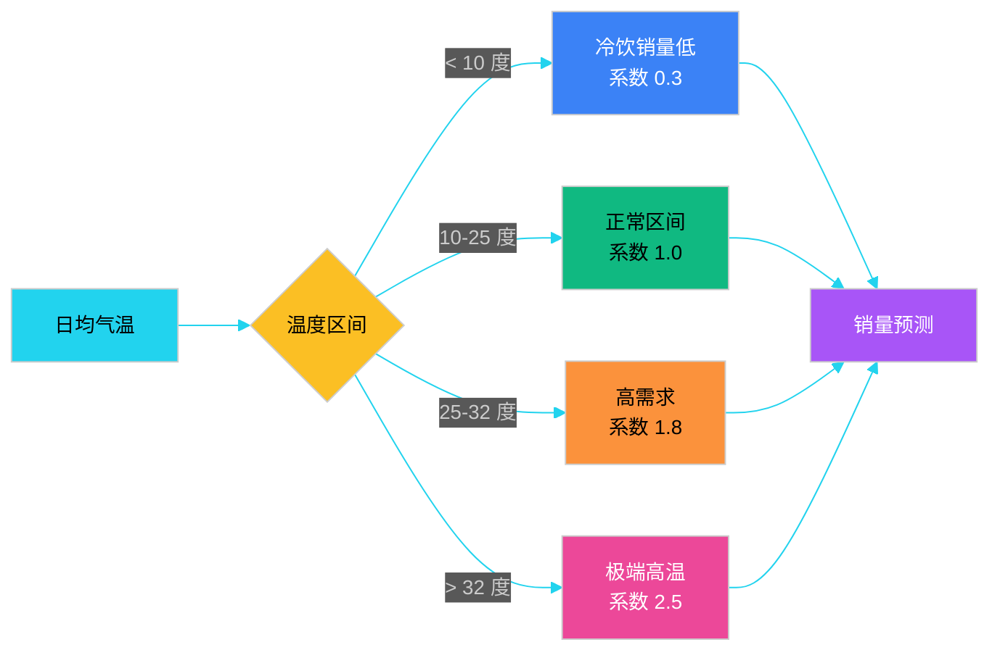

**天气特征工程**：

```python
def build_weather_features(weather_df, sku_list):
    """
    构造天气特征
    :param weather_df: [city, dt, temp_avg, temp_max, temp_min, rainfall, aqi]
    :param sku_list:   需要预测的 SKU 列表
    :return: SKU 维度天气特征
    """
    # 温度滞后 / 累积效应
    weather_df['temp_avg_lag1'] = weather_df.groupby('city')['temp_avg'].shift(1)
    weather_df['temp_avg_3d']   = weather_df.groupby('city')['temp_avg'].transform(
        lambda s: s.rolling(3, min_periods=1).mean()
    )
    weather_df['temp_avg_7d']   = weather_df.groupby('city')['temp_avg'].transform(
        lambda s: s.rolling(7, min_periods=1).mean()
    )
    # 高温日标记
    weather_df['is_extreme_heat'] = (weather_df['temp_max'] > 35).astype(int)
    # 暴雨标记
    weather_df['is_heavy_rain']   = (weather_df['rainfall'] > 50).astype(int)
    return weather_df
```

### 11.4.5 节假日与事件

节假日影响是**全局性**的，但**强品类相关**：

| 节日 | 强相关品类 | 销量倍数 |
|------|----------|---------|
| 春节 | 礼品、酒水、坚果、礼品盒 | 3-5 |
| 端午 | 粽子、咸鸭蛋 | 5-10 |
| 中秋 | 月饼、礼盒 | 5-8 |
| 618 | 全品类 | 2-3 |
| 双 11 | 全品类 | 3-5 |
| 圣诞 | 苹果、巧克力、礼品 | 2-4 |
| 情人节 | 鲜花、巧克力 | 3-5 |

**Prophet 内置节假日配置**：

```python
import pandas as pd

# 自定义中国节假日
holidays = pd.DataFrame({
    'holiday': 'chinese_holiday',
    'ds': pd.to_datetime([
        '2024-02-10',  # 春节
        '2024-06-10',  # 端午
        '2024-09-17',  # 中秋
        '2024-11-11',  # 双11
    ]),
    'lower_window': -3,  # 节日前 3 天
    'upper_window': 3,   # 节日后 3 天
})

# 大促单独建模（双11 提升 5 倍，普通节假日只提升 2 倍）
model = Prophet(holidays=holidays)
```

### 11.4.6 案例：京东 618 促销预测

**背景**：京东自营 30 万+ SKU，618 期间日均销量是平时的 3-5 倍，预测难度极大。

**京东的预测体系**：

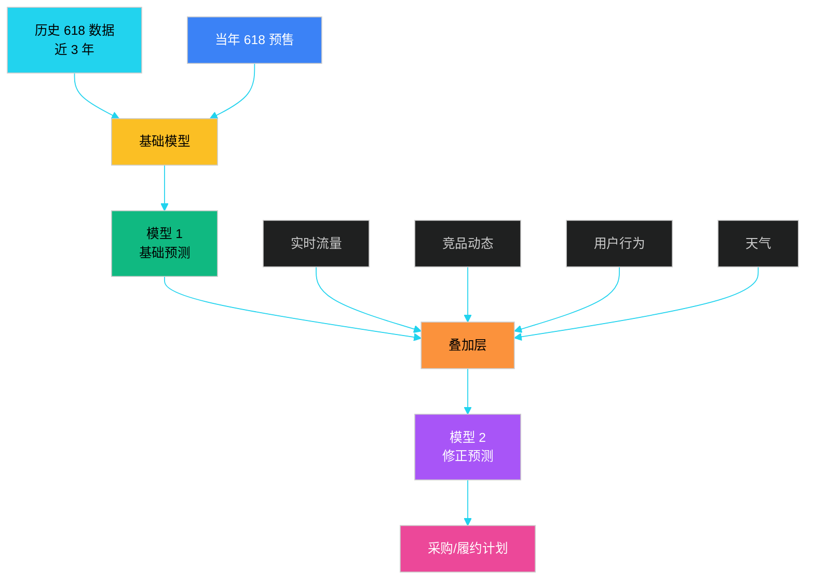

**关键经验**：

1. **多模型集成**：基础 + 修正层，规避单模型风险
2. **预售数据**：618 预售期销量是大促当天的"先导指标"
3. **实时滚动**：618 期间每小时更新预测
4. **分仓预测**：30 万 SKU × 500+ 仓 = 1.5 亿预测点
5. **人机协同**：业务专家 override 模型 10-20% 异常点

---

## 11.5 S&OP 销售与运营计划

### 11.5.1 S&OP 是什么

**S&OP（Sales and Operations Planning）** 是一套**月度跨部门协同流程**，将销售预测、生产/采购计划、库存计划、财务预算**对齐**为一个"共识计划"。

**核心矛盾**：

- 销售想"多备货、不断货"
- 供应链想"少备货、控成本"
- 财务想"压库存、保利润"
- 生产想"平稳排产、降切换"

S&OP 的目标就是**用一套数字 + 一次会议**让所有部门达成共识。

### 11.5.2 S&OP 月度会议流程

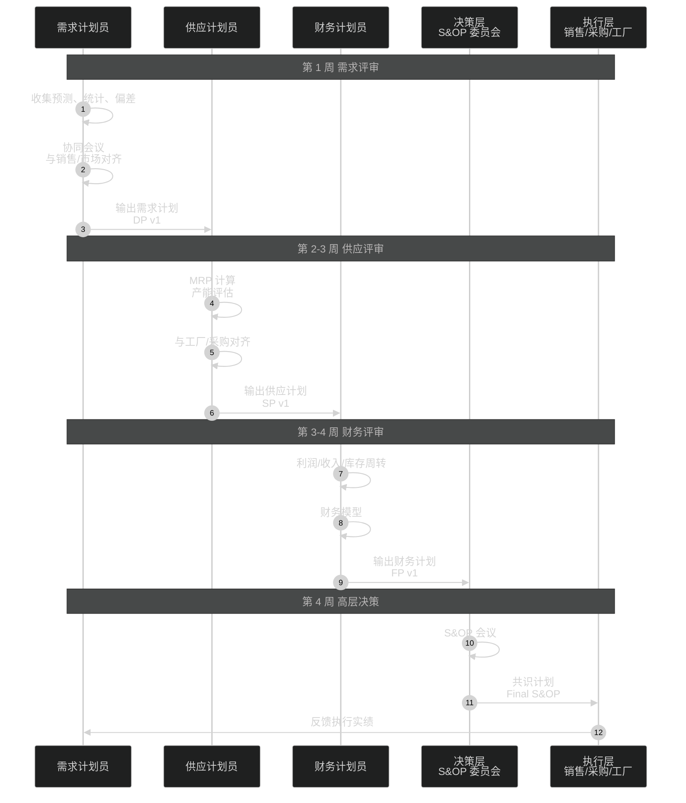

### 11.5.3 S&OP 五步法详解

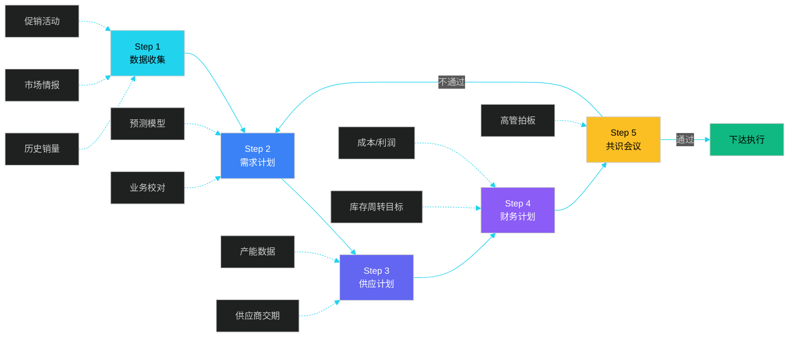

**各步骤详细职责**：

| 步骤 | 责任部门 | 核心输出 | 时长 | 关键工具 |
|------|---------|---------|------|---------|
| **Step 1 数据收集** | DP | 原始数据清洗报表 | 2 天 | BI / Data Lake |
| **Step 2 需求计划** | DP | DP 计划（18-24 月） | 3 天 | Prophet / LSTM |
| **Step 3 供应计划** | Supply | SP 计划（含 MRP） | 3 天 | APS / o9 |
| **Step 4 财务计划** | Finance | FP 计划（收入/利润/库存） | 2 天 | EPM / 财务系统 |
| **Step 5 共识会议** | 高管 | Final S&OP | 半天 | 决策系统 |

### 11.5.4 S&OP 计划的多版本管理

实际 S&OP 会有**多版本并行**：

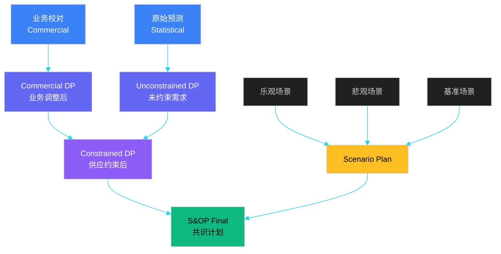

**版本说明**：

- **Statistical DP**：纯统计模型输出，不考虑业务
- **Commercial DP**：销售/市场 overlay 调整后
- **Constrained DP**：考虑产能/采购上限后
- **Scenario Plan**：乐观/悲观/基准三场景
- **Final S&OP**：高管拍板的最终版

### 11.5.5 S&OP 闭环：从计划到执行

**伪代码：S&OP 闭环**：

```python
class SAndOPProcess:
    """S&OP 月度闭环流程"""

    def __init__(self, period):
        self.period = period                # 例如 "202406"
        self.statistical_forecast = None
        self.commercial_plan = None
        self.supply_plan = None
        self.financial_plan = None
        self.final_plan = None

    # Step 1: 数据收集
    def step1_collect(self, history_df, market_intel):
        # 拉取近 24 个月销量 + 促销活动 + 行业报告
        self.raw_data = history_df
        self.market_signals = market_intel
        return self

    # Step 2: 需求计划
    def step2_demand_plan(self, model='prophet'):
        # 跑统计模型
        self.statistical_forecast = run_statistical_model(
            self.raw_data, model=model
        )
        # 销售/市场 overlay
        self.commercial_plan = overlay_commercial(
            self.statistical_forecast, self.market_signals
        )
        return self

    # Step 3: 供应计划
    def step3_supply_plan(self, capacity_df, supplier_df):
        # MRP 计算、产能评估
        self.supply_plan = mrp_calculation(
            self.commercial_plan, capacity_df, supplier_df
        )
        return self

    # Step 4: 财务计划
    def step4_financial_plan(self, cost_df, target_turnover=8.0):
        # 计算收入/利润/库存周转
        self.financial_plan = build_financials(
            self.supply_plan, cost_df, target_turnover
        )
        return self

    # Step 5: 共识会议
    def step5_consensus(self, exec_review=True):
        # 异常告警 + 多版本对比
        delta = compare_plans(
            self.statistical_forecast,
            self.commercial_plan,
            self.supply_plan
        )
        if exec_review:
            self.final_plan = exec_signoff(self.financial_plan, delta)
        else:
            self.final_plan = self.supply_plan
        return self.final_plan

    # 下达执行
    def publish(self):
        # 写入下游系统：采购 PO、工厂 MRP、库存目标
        push_to_procurement(self.final_plan)
        push_to_factory(self.final_plan)
        push_to_inventory(self.final_plan)
        return self.final_plan


# 月度调用
sop = SAndOPProcess("202406")
sop.step1_collect(history_df, intel) \
   .step2_demand_plan(model='prophet') \
   .step3_supply_plan(capacity_df, supplier_df) \
   .step4_financial_plan(cost_df) \
   .step5_consensus(exec_review=True) \
   .publish()
```

### 11.5.6 S&OP 与 IBP 的关系

| 维度 | S&OP | IBP（Integrated Business Planning） |
|------|------|-----------------------------------|
| 时间跨度 | 12-18 个月 | 24-36 个月 |
| 颗粒度 | SKU × 月 | SKU × 周/品类 × 月 |
| 参与方 | 销售、供应链、财务 | + 高管、战略、人力 |
| 决策层级 | 中层 | 高管层 |
| 工具 | Excel / APS | o9 / SAP IBP / Blue Yonder |
| 频率 | 月度 | 月度 + 季度滚动 |

> IBP 是 S&OP 的"升级版"，由 Gartner 提出，强调"业务计划一体化"。

---

## 11.6 预测评估

### 11.6.1 评估指标体系

预测不可能 100% 准确，但需要量化"错多少"。常用指标：

#### 11.6.1.1 误差类指标

```
MAE  (Mean Absolute Error)        平均绝对误差
MSE  (Mean Squared Error)         均方误差
RMSE (Root Mean Squared Error)    均方根误差
MAPE (Mean Absolute Percentage Error) 平均绝对百分比误差
sMAPE(Symmetric MAPE)             对称 MAPE
MASE (Mean Absolute Scaled Error)  缩放绝对误差
```

**公式**：

```
MAE  = (1/n) * Σ |Y_i - Ŷ_i|

MSE  = (1/n) * Σ (Y_i - Ŷ_i)^2

RMSE = sqrt(MSE) = sqrt( (1/n) * Σ (Y_i - Ŷ_i)^2 )

MAPE = (1/n) * Σ | (Y_i - Ŷ_i) / Y_i | * 100%
       (注：Y_i 不能为 0，否则除零)

sMAPE = (1/n) * Σ 2 * |Y_i - Ŷ_i| / (|Y_i| + |Ŷ_i|) * 100%

MASE = MAE / MAE_naive
       其中 MAE_naive = (1/n) * Σ |Y_i - Y_{i-1}|
       (MASE < 1 表示优于朴素预测)
```

#### 11.6.1.2 偏差类指标

```
Bias = (1/n) * Σ (Y_i - Ŷ_i)         # 正值=低估，负值=高估
FB   = (Σ Ŷ_i - Σ Y_i) / Σ Y_i       # 系统性偏差
Tracking Signal = Cumulative Error / MAD
```

### 11.6.2 指标对比

| 指标 | 优点 | 缺点 | 适用场景 |
|------|------|------|---------|
| **MAE** | 直观、单位一致 | 对大误差不敏感 | 日常监控 |
| **MSE** | 惩罚大误差 | 单位不一致 | 模型训练 loss |
| **RMSE** | 同 MSE 但单位一致 | 仍偏重大误差 | 与 MAE 配合看 |
| **MAPE** | 百分比可解释 | Y=0 时不可用 | SKU 级对比 |
| **sMAPE** | 对称、无除零 | 仍非完美对称 | 多 SKU 排名 |
| **MASE** | 跨序列可比 | 计算稍复杂 | 长尾 SKU |
| **Bias** | 反映系统偏差 | 不反映误差大小 | 校准检查 |
| **Tracking Signal** | 监控漂移 | 需选定阈值 | 实时预警 |

### 11.6.3 评估代码实现

```python
import numpy as np
import pandas as pd

def forecast_metrics(y_true, y_pred):
    """
    计算常用预测评估指标
    :param y_true: 实际值 array-like
    :param y_pred: 预测值 array-like
    :return: dict
    """
    y_true = np.asarray(y_true, dtype=float)
    y_pred = np.asarray(y_pred, dtype=float)
    n = len(y_true)

    # 误差
    error = y_true - y_pred
    abs_error = np.abs(error)
    pct_error = abs_error / np.where(y_true == 0, np.nan, y_true)

    # MAE
    mae = abs_error.mean()
    # MSE / RMSE
    mse = (error ** 2).mean()
    rmse = np.sqrt(mse)
    # MAPE（忽略 0）
    mape = np.nanmean(pct_error) * 100
    # sMAPE
    smape = (2 * abs_error / (np.abs(y_true) + np.abs(y_pred) + 1e-9)).mean() * 100
    # Bias
    bias = error.mean()
    # FB (Forecast Bias)
    fb = (y_pred.sum() - y_true.sum()) / (y_true.sum() + 1e-9) * 100
    # MASE（需要上期实际，此处假设已传入）
    # MASE = MAE / MAE_naive

    return {
        'MAE': round(mae, 2),
        'MSE': round(mse, 2),
        'RMSE': round(rmse, 2),
        'MAPE': round(mape, 2),
        'sMAPE': round(smape, 2),
        'Bias': round(bias, 2),
        'FB(%)': round(fb, 2),
        'n': n
    }


# 使用示例
y_true = [100, 120, 130, 115, 140, 150, 145]
y_pred = [105, 118, 125, 120, 138, 155, 142]
print(forecast_metrics(y_true, y_pred))
```

### 11.6.4 预测准确度监控

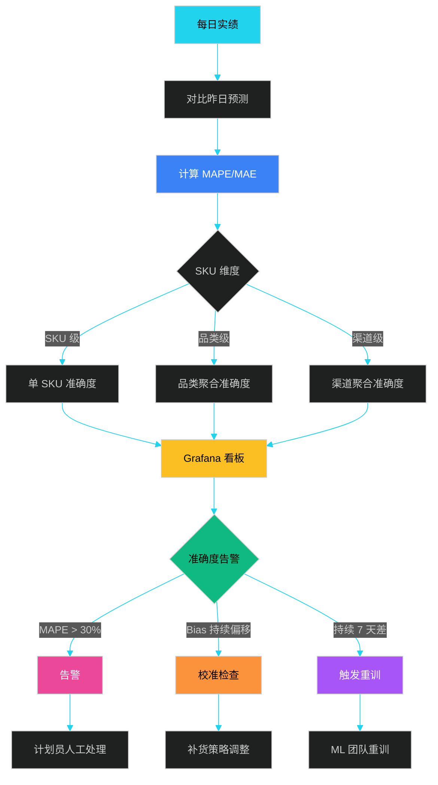

### 11.6.5 准确度看板设计

```sql
-- 滚动 28 天预测准确度
SELECT
    sku_id,
    cat_l1,
    cat_l2,
    DATE_FORMAT(dt, '%Y-%m') AS month,
    SUM(actual)        AS actual_qty,
    SUM(forecast)      AS forecast_qty,
    AVG(ABS(actual - forecast) / NULLIF(actual, 0)) AS mape,
    AVG(actual - forecast) AS bias,
    CASE
        WHEN AVG(ABS(actual - forecast) / NULLIF(actual, 0)) < 0.1 THEN 'A_优'
        WHEN AVG(ABS(actual - forecast) / NULLIF(actual, 0)) < 0.2 THEN 'B_良'
        WHEN AVG(ABS(actual - forecast) / NULLIF(actual, 0)) < 0.3 THEN 'C_中'
        ELSE 'D_差'
    END AS acc_level
FROM dwd_demand_daily
WHERE dt >= DATE_SUB(CURRENT_DATE, INTERVAL 28 DAY)
GROUP BY sku_id, cat_l1, cat_l2, DATE_FORMAT(dt, '%Y-%m');
```

### 11.6.6 常见失败模式与对策

| 失败模式 | 表现 | 根因 | 对策 |
|---------|------|------|------|
| **大促预测偏低** | 大促日缺货 | 历史数据未含同类大促 | 单独建模 + 业务 override |
| **新品无数据** | 预测=0 | 冷启动 | 用相似 SKU 类比 + 业务规则 |
| **长尾 SKU 误差大** | 准确度波动 | 数据稀疏 | 降级到简单方法 + 大类别聚合 |
| **Bias 持续偏移** | 系统性高/低估 | 模型系统偏差 | 定期校准 + 加 Bias 修正项 |
| **节假日失真** | 节假日预测错 | 季节性未识别 | Prophet 节假日表 + 业务规则 |
| **数据延迟** | T+2 才看到实绩 | 上游 ETL 慢 | 流式处理 + 滑动窗口 |

---

## 11.7 行业实践案例

### 11.7.1 亚马逊：Anticipatory Shipping

亚马逊在 2014 年获得 **Anticipatory Shipping** 专利：基于用户浏览、加购、搜索行为，**提前把货发到离用户最近的仓库**，甚至在用户下单前就开始发货。

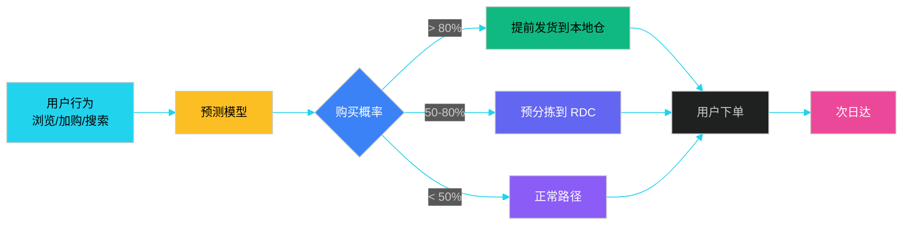

### 11.7.2 沃尔玛：CPFR 协同预测

**CPFR（Collaborative Planning, Forecasting, and Replenishment）** 是沃尔玛与宝洁在 90 年代联合开创的协同模式：

- **联合数据**：沃尔玛每日 POS 数据共享给宝洁
- **联合预测**：双方共同生成 SKU 级别预测
- **联合补货**：宝洁直接管理沃尔玛的宝洁商品库存

**效果**：

- 缺货率从 4% 降至 1.5%
- 库存周转提升 30%
- 订单履约周期从 7 天降至 2 天

### 11.7.3 京东：智能补货大脑

京东自营有 500 万+ SKU，2018 年起上线"智能补货大脑"：

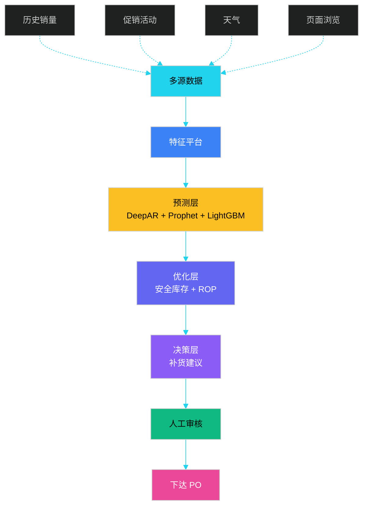

**关键指标**：

- 智能补货覆盖率 80%+
- 缺货率下降 25%
- 库存周转提升 15%
- 大促预测准确度提升 30%

---

## 11.8 预测系统的工程实践

### 11.8.1 预测系统架构

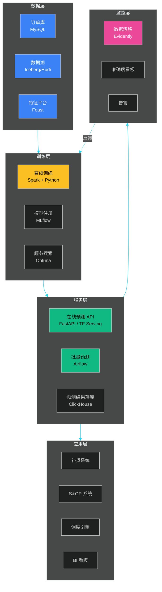

### 11.8.2 训练-服务分离

| 维度 | 离线训练 | 在线服务 |
|------|---------|---------|
| **频率** | 周/月 | 实时/日 |
| **数据量** | 全量历史 | 增量 |
| **延迟要求** | 小时 | 毫秒~秒 |
| **资源** | GPU 集群 | CPU + 少量 GPU |
| **产出** | 模型文件 | 预测值 |

### 11.8.3 模型漂移与重训

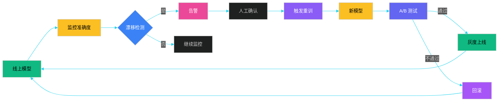

### 11.8.4 特征工程代码

```python
import pandas as pd
import numpy as np

def build_demand_features(df):
    """
    通用需求预测特征工程
    :param df: [sku, dt, qty, price, is_promo, ...]
    :return: 特征 DataFrame
    """
    df = df.sort_values(['sku', 'dt']).reset_index(drop=True)

    # 1. 时序滞后特征
    for lag in [1, 7, 14, 28, 365]:
        df[f'qty_lag_{lag}'] = df.groupby('sku')['qty'].shift(lag)

    # 2. 滚动统计特征
    for window in [7, 28, 90]:
        df[f'qty_mean_{window}'] = df.groupby('sku')['qty'].transform(
            lambda s: s.rolling(window, min_periods=1).mean()
        )
        df[f'qty_std_{window}'] = df.groupby('sku')['qty'].transform(
            lambda s: s.rolling(window, min_periods=1).std()
        )

    # 3. 时间特征
    df['dow']       = pd.to_datetime(df['dt']).dt.dayofweek
    df['month']     = pd.to_datetime(df['dt']).dt.month
    df['is_weekend']= (df['dow'] >= 5).astype(int)
    df['is_month_start'] = pd.to_datetime(df['dt']).dt.is_month_start.astype(int)

    # 4. 价格/促销特征
    df['price_ratio'] = df['price'] / df.groupby('sku')['price'].transform('median')
    df['is_promo']    = df['is_promo'].fillna(0).astype(int)

    # 5. 同比环比
    df['qty_yoy']  = df['qty_lag_365']
    df['qty_mom']  = df.groupby('sku')['qty'].shift(28)

    return df
```

---

## 本章小结

需求预测是供应链的"前哨"，S&OP 是供应链的"中枢神经"。本章从预测在供应链中的位置出发，依次介绍了：

1. **预测的位置**：推动式、拉动式、推拉结合三种模式，预测在推拉分界点之前扮演核心驱动角色
2. **传统预测方法**：移动平均、指数平滑、Holt-Winters、STL 分解，**简单稳定可解释**是工业首选
3. **机器学习预测**：ARIMA、Prophet、LSTM、Transformer 各有适用边界，**Prophet 性价比最高**，Transformer 适合长序列主力 SKU
4. **外部因子融合**：促销、天气、节假日、事件，**外部因子是预测精度的"乘数项"**
5. **S&OP**：五步月度闭环流程，**需求 → 供应 → 财务 → 共识**，跨部门协同
6. **评估指标**：MAE、RMSE、MAPE、sMAPE、MASE、Bias，**多指标配合 + 持续监控**是核心

**关键工程经验**：

- 预测不可能 100% 准，**系统设计应容忍误差**（通过安全库存）
- **多模型集成**比单模型更稳健
- **人机协同**：业务专家 override 模型 10-20% 异常点
- **多版本计划**（statistical / commercial / constrained / scenario）是 S&OP 实战核心

后续第 12 章将进入"采购与供应商管理"，第 13 章将深入"智能算法与运筹优化"。

---

## 面试高频问题

**1. 推动式和拉动式供应链的区别？推拉结合的边界怎么设计？**

参考答案要点：① 推动式基于预测提前备货，库存风险大但交付快；拉动式基于订单按需生产/采购，库存低但交付慢；② 推拉结合的关键是**Decoupling Point**（分界点），通常选在最长瓶颈工序或客户定制差异点；③ 分界点之前用推动式（备通用件），之后用拉动式（按订单生产）；④ 戴尔、ZARA 是经典案例。

**2. 指数平滑中 α 如何选择？Holt-Winters 三个超参怎么调？**

参考答案要点：① α 越大越重视近期数据但波动大，α 越小越平滑但滞后；② 工程上用**网格搜索**或**最小化 SSE**自动求解；③ Holt-Winters 三参数 α/β/γ 分别控制 level/trend/seasonal 的平滑度；④ 经验值：α=0.2-0.5、β=0.1-0.3、γ=0.1-0.3；⑤ 也可以用**AIC/BIC** 信息准则做模型选择。

**3. ARIMA、Prophet、LSTM、Transformer 各自的适用场景？**

参考答案要点：① ARIMA：平稳序列、需可解释、SKU 较少；② Prophet：有强季节性 + 促销、SKU 数百到数千、需快速上线；③ LSTM：数据量较大（3 年+）、多变量协同、需捕获非线性；④ Transformer：数据量大（5 年+）、长序列、主力 SKU；⑤ 工程经验：**Prophet 是性价比之王**，多数企业 80% 场景用它就够。

**4. S&OP 五步流程是什么？和 IBP 有什么区别？**

参考答案要点：① S&OP 五步：数据收集 → 需求计划 → 供应计划 → 财务计划 → 共识会议；② S&OP 周期 12-18 个月、月度进行、中层主导；③ IBP（Integrated Business Planning）是 S&OP 升级版，时间跨度 24-36 个月、高管层主导、加入战略和人力计划；④ IBP 由 Gartner 提出，代表工具 o9 / SAP IBP / Blue Yonder。

**5. MAPE 指标的局限性？什么情况下不能用？**

参考答案要点：① MAPE 在 Y=0 时**除零错误**，间歇需求不适用；② 当实际值很小时，MAPE 会被放大（如 Y=1，预测 5，MAPE=400%）；③ **不对称**：高估的惩罚低于低估；④ 替代方案：sMAPE（对称）、MASE（跨序列可比）、MAE（绝对值）；⑤ 实务中**多指标配合**：日常监控用 MAPE，模型训练用 MSE/RMSE，校准检查用 Bias。

**6. 京东、亚马逊的预测体系有什么不同？**

参考答案要点：① 京东：自营一体化，**多模型集成**（统计 + 业务 overlay + 实时修正），分仓分 SKU 预测，人机协同；② 亚马逊：**Anticipatory Shipping** 基于用户行为预测购买概率，提前把货发到本地仓；③ 沃尔玛：CPFR 协同预测，与供应商共享 POS 数据联合补货；④ 共同点：**外部因子融合 + 多版本计划 + 闭环监控**。

**7. 预测误差太大怎么办？除了改进模型还有什么办法？**

参考答案要点：① **安全库存**：用统计方法（Z × σ × √L）补偿预测误差；② **缩短 Lead Time**：减少预测窗口，误差自然降低；③ **延迟差异化**：高价值 SKU 用复杂模型，长尾 SKU 用简单方法甚至业务规则；④ **多源融合**：单模型不行就多模型集成；⑤ **人机协同**：业务专家 override；⑥ **业务策略**：缺货时启用替代品、预售、限购。

**8. 如何处理冷启动（新品无历史数据）？**

参考答案要点：① **相似 SKU 类比**：找同品类、同价格带、同属性的 SKU 历史数据；② **业务规则 + 行业经验**：运营给初始值；③ **类目基准**：用品类平均 + 调整因子；④ **爬虫/调研**：抓竞品销量作参考；⑤ **小流量测试**：上线后用小流量做 A/B；⑥ **快速迭代**：积累 2-4 周数据后立即切换到有监督模型。

**9. 预测系统如何做监控和告警？**

参考答案要点：① **数据层**：监控上游 ETL 延迟、缺失值、异常值；② **模型层**：监控输入特征分布漂移（Evidently、PSI）；③ **结果层**：监控 MAPE、Bias、Tracking Signal；④ **业务层**：监控缺货率、库存周转、订单满足率；⑤ **多级告警**：按 SKU/品类/渠道/区域分级；⑥ **告警闭环**：告警 → 人工处理 → 反馈到模型。

**10. 牛鞭效应在预测层面如何缓解？**

参考答案要点：① **联合预测（CPFR）**：上下游共享数据、协同预测；② **VMI 供应商管理库存**：让上游看真实需求；③ **订单平滑**：用统计方法（移动平均、指数平滑）平滑下游订单；④ **缩短 Lead Time**：降低放大倍数；⑤ **信息透明**：共享 POS 数据、库存数据；⑥ **减少促销博弈**：稳定促销节奏，避免抢量。
