# 第 12 章 供应链控制塔

> 本章定位：控制塔（Supply Chain Control Tower, SCT）是供应链系统的"驾驶舱"。它把前 11 章中分散的可视化、监控、预警、决策能力**汇聚到一个统一入口**，为运营管理者提供"上帝视角"。本章围绕"可视、监控、推演、决策、响应"五个动作展开，配合 10+ 张图示与 6 段代码。
>
> **学习建议**：本章偏架构与产品视角。如果你正从 0 到 1 设计控制塔，强烈建议先通读 12.1-12.3 建立全局认知，再深入 12.4-12.5 的具体能力设计。

---

## 12.1 控制塔的定位

### 12.1.1 控制塔在 5 层架构中的位置

在第 1 章介绍的整体技术架构中，控制塔位于**最顶层的决策层**，向下连接智能层与计划层、向上对接管理者与业务决策者：

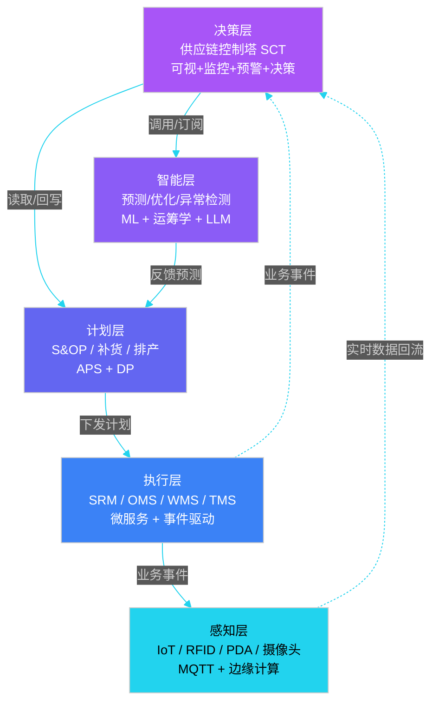

**关键认知**：控制塔不是"另一种业务系统"，而是横跨 5 层的"**能力聚合层**"。它**不直接处理交易**，而是从各层**抽取信号、做关联分析、形成建议**。这一点对架构设计至关重要——它意味着控制塔对底层是"读多写少"。

### 12.1.2 控制塔的 4 大能力

行业普遍将控制塔能力拆为四象限，本教程沿用此框架：

| 能力 | 回答的问题 | 典型产物 | 技术组件 |
|------|----------|---------|---------|
| **可视化（See）** | 现在供应链长什么样？ | 实时大屏、链路图、KPI 看板 | Grafana、Mapbox、deck.gl、Three.js |
| **监控（Monitor）** | 哪些指标异常？哪些事件需要关注？ | 告警中心、异常事件流、SLA 仪表盘 | Prometheus、AlertManager、ELK |
| **分析（Analyze）** | 为什么出问题？根因是什么？影响多大？ | 根因分析、What-If 报表、归因报告 | ClickHouse、Doris、Spark、LLM |
| **决策（Decide）** | 接下来该做什么？ | 决策建议、仿真推演、自动执行 | Drools、OR-Tools、LLM Agent、规则引擎 |

四者关系是**层层递进**的：先看见，再监控，再分析，最后决策。任何一环缺失，控制塔都退化为"漂亮的报表系统"。

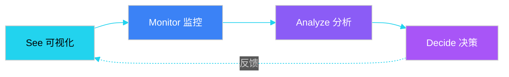

### 12.1.3 控制塔的演进路径

不同成熟度的企业，控制塔形态差异巨大。下表是行业常见的 4 个阶段：

| 阶段 | 形态 | 核心特征 | 数据时延 | 典型企业 |
|------|------|---------|---------|---------|
| **L1 报表型** | 静态 BI 报表 | T+1 数据、手工出报表 | 24h | 传统 ERP 用户 |
| **L2 大屏型** | 实时大屏 | 关键 KPI 实时刷新、地图热力 | 分钟级 | 京东早期、亚马逊 2015 |
| **L3 预警型** | 告警中心 | 阈值告警、异常推送、SLA 监控 | 秒级 | 菜鸟、京东 2018+ |
| **L4 决策型** | 决策闭环 | 建议生成、What-If、自动执行 | 实时 | 亚马逊 2022+、京东 2024 |

**误区提醒**：很多团队跳过 L1-L2 直接上"AI 决策控制塔"，结果是**没有数据基础的 AI = 黑盒**，运营不信任、决策不敢用。**正确的路径是先把"看"和"监控"做扎实**。

---

## 12.2 全链路可视化

### 12.2.1 端到端可视化模型

控制塔的第一价值，是把"端到端供应链"**画在一张图上**。下面这张图把订单从下单到签收的全链路节点全部呈现，并标注了每个节点的可视化要素：

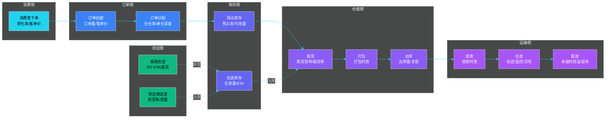

可视化设计的**两个核心原则**：

1. **节点与指标对齐**：每个节点绑定 2-3 个关键指标（不是越多越好），便于一眼读懂。
2. **颜色与状态对齐**：用统一色板（绿/黄/红/灰）表达健康度，避免每张图一套配色。

### 12.2.2 KPI 看板设计

供应链控制塔的 KPI 看板通常分**四层**，由总到分：

| 层级 | 关注对象 | 典型 KPI | 刷新频率 |
|------|---------|---------|---------|
| **战略层** | CXO、董事会 | 收入、毛利率、库存周转、订单满足率 | 小时/日 |
| **战术层** | 总监、BP | 区域履约时效、仓网利用率、供应商绩效 | 分钟/小时 |
| **执行层** | 一线运营 | 拣货效率、妥投率、缺货 SKU 数 | 实时（秒级） |
| **诊断层** | 数据分析师 | 长尾分析、归因报表、对比分析 | 按需 |

下面是供应链控制塔**最核心的 10 个 KPI**：

| 指标 | 计算公式 | 健康阈值（行业参考） | 业务含义 |
|------|---------|---------------------|---------|
| **订单满足率（Fill Rate）** | 已发货订单 / 总订单 × 100% | ≥ 98% | 客户需求被满足的比例 |
| **按时交付率（OTD）** | 按时签收订单 / 总订单 × 100% | ≥ 95% | 承诺时效达成率 |
| **库存周转天数（DOH）** | 平均库存 / 日均销量 | 30-60 天（行业差异大） | 库存资金占用效率 |
| **缺货率（Stockout Rate）** | 缺货 SKU 数 / 在售 SKU 数 | ≤ 2% | 缺货广度 |
| **订单履行时长（Cycle Time）** | 下单到签收平均时长 | 按业务定义 | 履约速度 |
| **预测准确率（Forecast Accuracy）** | 1 - MAPE | ≥ 70%（SKU 级） | 预测质量 |
| **仓内作业效率** | 行/人/小时 | 按行业 | 人效 |
| **运输装载率** | 实际装载体积 / 标称体积 | ≥ 85% | 运力利用率 |
| **妥投率（Successful Delivery）** | 签收成功 / 派送总数 | ≥ 97% | 末端能力 |
| **退货率（Return Rate）** | 退货订单 / 总订单 | ≤ 5% | 商品/履约质量 |

> **注意**：阈值为行业经验值，并非金标准。生鲜冷链 OTD 阈值可能是 95%，3C 数码可能是 99%；具体阈值应由各企业**历史数据 + 业务目标**共同定义。

### 12.2.3 KPI 实时计算（伪代码）

KPI 计算的核心挑战是**实时性**和**正确性**。下面是一段经典实现：

```python
"""
供应链控制塔 KPI 实时计算引擎
输入：事件流（订单/库存/物流事件）
输出：KPI 时序数据（1min/5min/小时/日 多个时间粒度）
"""
from typing import Dict, List
from dataclasses import dataclass
from collections import defaultdict
import time

@dataclass
class KPIDefinition:
    name: str                    # KPI 名称
    formula: str                 # 计算公式（DSL 描述）
    window_sec: int              # 滚动窗口（秒）
    refresh_sec: int             # 刷新频率
    threshold: float             # 健康阈值

class RealtimeKPIEngine:
    def __init__(self):
        # 滑动窗口状态：(时间桶, 维度) -> 累计值
        self.windows = defaultdict(lambda: defaultdict(float))
        self.kpi_defs: List[KPIDefinition] = []

    def register_kpi(self, kpi: KPIDefinition):
        self.kpi_defs.append(kpi)

    def on_event(self, event: Dict):
        """事件入口：订单、库存、物流等事件统一处理"""
        etype = event['type']
        bucket = event['ts'] // 60  # 1 分钟桶
        if etype == 'ORDER_CREATED':
            self._increment('orders_total', bucket, event.get('region'))
        elif etype == 'ORDER_SHIPPED':
            self._increment('orders_shipped', bucket, event.get('region'))
        elif etype == 'ORDER_DELIVERED':
            self._increment('orders_delivered', bucket, event.get('region'))
            if event.get('on_time'):
                self._increment('orders_ontime', bucket, event.get('region'))
        elif etype == 'STOCKOUT':
            self._increment('stockout_sku', bucket, event.get('sku'))

    def _increment(self, metric: str, bucket: int, dim: str = 'GLOBAL'):
        self.windows[metric][(bucket, dim)] += 1

    def compute(self, kpi_name: str, dim: str = 'GLOBAL') -> float:
        """计算指定 KPI 的最新值"""
        now_bucket = int(time.time()) // 60
        if kpi_name == 'fill_rate':
            total = self._sum_in_window('orders_total', now_bucket, dim)
            shipped = self._sum_in_window('orders_shipped', now_bucket, dim)
            return shipped / total if total > 0 else 0.0
        if kpi_name == 'otd':
            delivered = self._sum_in_window('orders_delivered', now_bucket, dim)
            ontime = self._sum_in_window('orders_ontime', now_bucket, dim)
            return ontime / delivered if delivered > 0 else 0.0
        # ... 其他 KPI
        return 0.0

    def _sum_in_window(self, metric: str, end_bucket: int, dim: str) -> float:
        """滑动窗口求和（默认 5 分钟）"""
        total = 0.0
        for offset in range(5):
            total += self.windows[metric].get((end_bucket - offset, dim), 0.0)
        return total
```

**生产级增强点**：

1. **多维度交叉**：region × channel × warehouse 三维切片。
2. **异常值剔除**：极值用 P99 截断，避免脏数据带偏均值。
3. **降采样归档**：1 分钟粒度保留 7 天，1 小时粒度保留 90 天，1 天粒度永久。
4. **冷启动补齐**：用前 7 天同时段均值填补窗口不足问题。

---

## 12.3 风险监控

### 12.3.1 风险四象限分类

供应链风险按来源可分四类，每类的监控指标、预警阈值、响应预案都不同：

| 风险类型 | 典型场景 | 监控指标 | 预警阈值 | 应急预案 |
|---------|---------|---------|---------|---------|
| **供应风险** | 供应商断供、产能不足、质量事故 | 供应商交付及时率、合格率、产能利用率 | 交付率 < 90% 持续 3 天 | 切换备选供应商、紧急 PO |
| **需求风险** | 爆品缺货、滞销积压、需求骤变 | 预测偏差、缺货率、库销比 | MAPE > 50% 或缺货率 > 5% | 调拨、限售、紧急补货 |
| **物流风险** | 干线延误、末端爆仓、天气阻断 | 干线准点率、末端妥投率、在途 ETA 偏差 | OTD < 90% 或妥投率 < 95% | 切换承运、备选线路 |
| **合规风险** | 海关查验、质检召回、税务异常 | 跨境合规率、批次合格率、关务异常次数 | 任意批次不合格率 > 阈值 | 暂停发货、批次召回 |

四类风险之间会**相互传导**：供应商断供（供应）→ 备货不足 → 缺货率上升（需求）→ 紧急调拨（物流）→ 触发承运爆仓（物流）。控制塔要能识别**级联效应**。

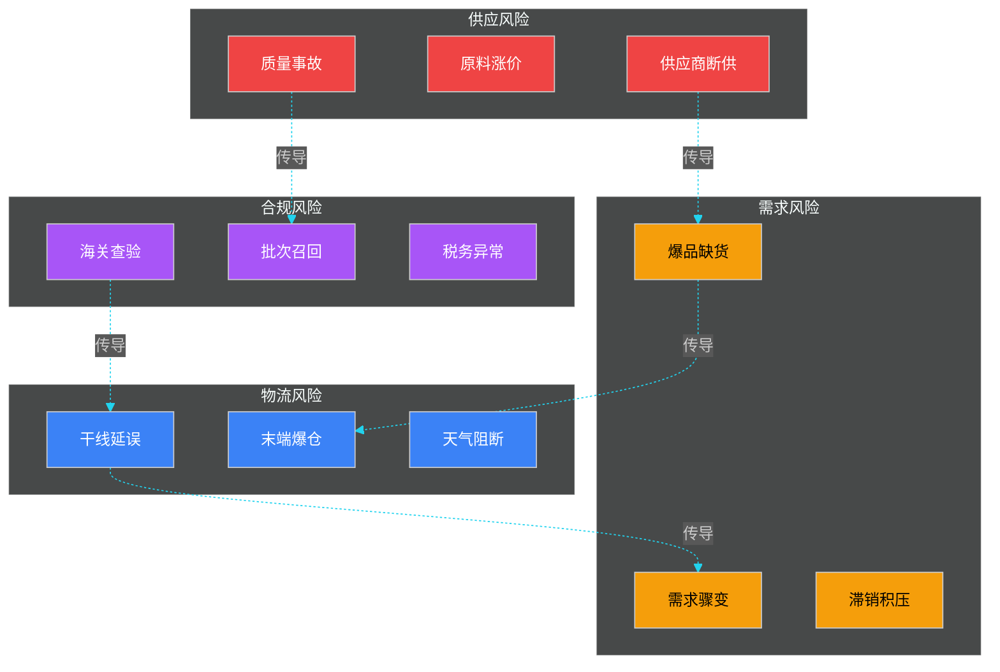

### 12.3.2 风险评估伪代码

风险评估的核心是**多维度打分 + 加权 + 阈值告警**。下面是一段工业级实现：

```python
"""
供应链风险评估引擎
输入：风险事件（来自各业务系统）
输出：风险评分（0-100）、风险等级、推荐动作
"""
from enum import Enum
from dataclasses import dataclass, field
from typing import List, Dict
import math

class RiskLevel(Enum):
    LOW = "LOW"
    MEDIUM = "MEDIUM"
    HIGH = "HIGH"
    CRITICAL = "CRITICAL"

class RiskCategory(Enum):
    SUPPLY = "SUPPLY"
    DEMAND = "DEMAND"
    LOGISTICS = "LOGISTICS"
    COMPLIANCE = "COMPLIANCE"

@dataclass
class RiskSignal:
    """单条风险信号"""
    category: RiskCategory
    source: str            # 来源系统
    metric: str            # 指标名
    value: float           # 当前值
    baseline: float        # 基线值
    weight: float = 1.0    # 业务权重
    timestamp: int = 0

@dataclass
class RiskScore:
    category: RiskCategory
    score: float           # 0-100
    level: RiskLevel
    drivers: List[str] = field(default_factory=list)
    actions: List[str] = field(default_factory=list)

class RiskEngine:
    # 类目权重
    CATEGORY_WEIGHT = {
        RiskCategory.SUPPLY: 0.35,
        RiskCategory.DEMAND: 0.30,
        RiskCategory.LOGISTICS: 0.25,
        RiskCategory.COMPLIANCE: 0.10,
    }
    # 等级阈值
    LEVEL_THRESHOLD = {
        RiskLevel.LOW: 30,
        RiskLevel.MEDIUM: 60,
        RiskLevel.HIGH: 80,
        RiskLevel.CRITICAL: 100,
    }

    def evaluate(self, signals: List[RiskSignal]) -> Dict[RiskCategory, RiskScore]:
        # 按类目分组
        grouped: Dict[RiskCategory, List[RiskSignal]] = {}
        for s in signals:
            grouped.setdefault(s.category, []).append(s)

        result: Dict[RiskCategory, RiskScore] = {}
        for cat, items in grouped.items():
            score = self._calc_category_score(items)
            level = self._to_level(score)
            drivers = self._top_drivers(items, 3)
            actions = self._recommend_actions(cat, level, drivers)
            result[cat] = RiskScore(cat, score, level, drivers, actions)
        return result

    def _calc_category_score(self, items: List[RiskSignal]) -> float:
        """类目打分：偏差越大分越高（0-100）"""
        total = 0.0
        total_w = 0.0
        for s in items:
            if s.baseline == 0:
                continue
            # 偏差率（绝对值）
            deviation = abs(s.value - s.baseline) / abs(s.baseline)
            # 用 sigmoid 映射到 0-100
            sub = 100.0 / (1.0 + math.exp(-5 * (deviation - 0.2)))
            total += sub * s.weight
            total_w += s.weight
        return total / total_w if total_w > 0 else 0.0

    def _to_level(self, score: float) -> RiskLevel:
        if score >= 80: return RiskLevel.CRITICAL
        if score >= 60: return RiskLevel.HIGH
        if score >= 30: return RiskLevel.MEDIUM
        return RiskLevel.LOW

    def _top_drivers(self, items: List[RiskSignal], k: int) -> List[str]:
        ranked = sorted(items, key=lambda s: s.weight, reverse=True)
        return [f"{s.metric}={s.value} 基线={s.baseline}" for s in ranked[:k]]

    def _recommend_actions(self, cat: RiskCategory, level: RiskLevel,
                            drivers: List[str]) -> List[str]:
        actions = []
        if cat == RiskCategory.SUPPLY and level in (RiskLevel.HIGH, RiskLevel.CRITICAL):
            actions += ["启动备选供应商评估", "发起紧急 PO", "联系销售运营调整承诺"]
        if cat == RiskCategory.DEMAND and level in (RiskLevel.HIGH, RiskLevel.CRITICAL):
            actions += ["触发跨仓调拨", "评估限售/预售", "联系采购加急补货"]
        if cat == RiskCategory.LOGISTICS and level in (RiskLevel.HIGH, RiskLevel.CRITICAL):
            actions += ["切换承运商", "启用备选分仓", "推送延误通知给客户"]
        if cat == RiskCategory.COMPLIANCE and level in (RiskLevel.HIGH, RiskLevel.CRITICAL):
            actions += ["暂停相关 SKU 发货", "启动批次召回流程", "通知法务/合规团队"]
        return actions
```

**关键设计点**：

- **基线值（baseline）**是核心，需用历史同期 + 季节因子计算。
- **业务权重（weight）**由运营/专家按业务影响定义。
- **推荐动作**与决策引擎联动（见 12.5）。

### 12.3.3 风险预警流程

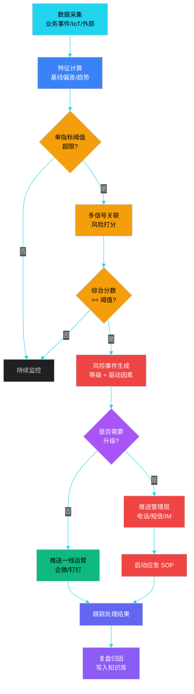

**升级策略**：风险事件按等级走不同通道：

| 等级 | 通道 | 响应时长（SLA） | 处置人 |
|------|------|----------------|--------|
| LOW | 大屏静默展示 | - | - |
| MEDIUM | 企微/钉钉推送 | 1 小时内响应 | 一线运营 |
| HIGH | 企微+电话 | 15 分钟内响应 | 部门经理 |
| CRITICAL | 短信+电话+升级 | 5 分钟内响应 | CXO/总监 |

---

## 12.4 数字孪生

### 12.4.1 数字孪生是什么

数字孪生（Digital Twin）是物理供应链在数字世界的**实时镜像**。它通过 IoT/事件流把物理世界的数据映射到数字模型，再用仿真算法对"未来场景"做推演。

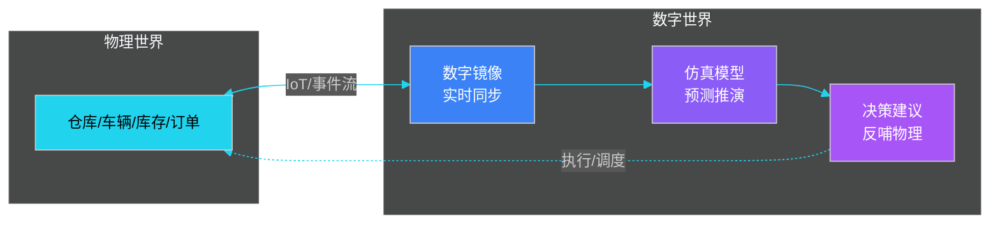

**与传统 BI 报表的区别**：

| 维度 | 传统 BI 报表 | 数字孪生 |
|------|------------|---------|
| 时态 | 历史 + 当前 | 历史 + 当前 + 未来推演 |
| 模型 | 静态指标 | 动态物理/业务模型 |
| 交互 | 看数 | 看数 + 模拟 + 决策 |
| 数据源 | 业务库 | 业务库 + IoT + 外部数据 |

### 12.4.2 三大应用场景

| 场景 | 输入 | 模型 | 输出 | 价值 |
|------|------|------|------|------|
| **仓库布局仿真** | 库位图、SKU-动销、订单结构 | Agent-based 仿真 | 库位分配方案、拣货路径 | 缩短拣货距离 20-40% |
| **仓网优化** | 订单分布、运价、产能 | 整数规划/MILP | 新仓选址、关仓建议 | 降低网络成本 5-15% |
| **应急预案推演** | 灾害/疫情/断供事件 | 离散事件仿真 | 影响范围、最优响应 | 减少损失 30%+ |

### 12.4.3 仿真引擎伪代码

仿真引擎的核心是**事件驱动 + 时间步进**。下面是一个简化的库存网络仿真：

```python
"""
供应链数字孪生仿真引擎（简化版）
支持：库存网络 + 调拨 + 补货 + 异常事件
"""
from dataclasses import dataclass, field
from typing import Dict, List, Callable
import random

@dataclass
class WarehouseNode:
    code: str
    capacity: int
    on_hand: int
    in_transit_out: int = 0  # 在途调出
    in_transit_in: int = 0   # 在途调入

@dataclass
class SimEvent:
    ts: int                  # 事件时间（秒）
    type: str                # 事件类型
    payload: Dict

class SupplyChainSimulator:
    def __init__(self, nodes: Dict[str, WarehouseNode]):
        self.nodes = nodes
        self.event_queue: List[SimEvent] = []
        self.metrics = {"fulfilled": 0, "stockout": 0, "transfer": 0}

    def schedule(self, event: SimEvent):
        """事件入队（按时间排序）"""
        import bisect
        bisect.insort(self.event_queue, event, key=lambda e: e.ts)

    def add_demand(self, sku: str, qty: int, warehouse: str, eta_sec: int):
        """添加需求事件"""
        self.schedule(SimEvent(eta_sec, "DEMAND",
                               {"sku": sku, "qty": qty, "warehouse": warehouse}))

    def add_replenishment(self, sku: str, qty: int, warehouse: str, eta_sec: int):
        """添加补货事件"""
        self.schedule(SimEvent(eta_sec, "REPLENISH",
                               {"sku": sku, "qty": qty, "warehouse": warehouse}))

    def add_disruption(self, warehouse: str, days: int, severity: float = 1.0):
        """添加异常事件（断供/封仓）"""
        self.schedule(SimEvent(days * 86400, "DISRUPTION",
                               {"warehouse": warehouse, "severity": severity}))

    def run(self, end_ts: int) -> Dict:
        """主循环"""
        while self.event_queue and self.event_queue[0].ts <= end_ts:
            ev = self.event_queue.pop(0)
            self._handle(ev)
        return self.metrics

    def _handle(self, ev: SimEvent):
        if ev.type == "DEMAND":
            wh = self.nodes[ev.payload["warehouse"]]
            if wh.on_hand >= ev.payload["qty"]:
                wh.on_hand -= ev.payload["qty"]
                self.metrics["fulfilled"] += 1
            else:
                self.metrics["stockout"] += 1
                self._auto_transfer(ev.payload["warehouse"], ev.payload["qty"])
        elif ev.type == "REPLENISH":
            wh = self.nodes[ev.payload["warehouse"]]
            wh.on_hand = min(wh.capacity, wh.on_hand + ev.payload["qty"])
        elif ev.type == "DISRUPTION":
            wh = self.nodes[ev.payload["warehouse"]]
            wh.capacity = int(wh.capacity * (1 - ev.payload["severity"]))

    def _auto_transfer(self, dest_wh: str, qty: int):
        """自动调拨：从其他仓紧急调拨"""
        candidates = sorted(
            [w for c, w in self.nodes.items() if c != dest_wh and w.on_hand > qty],
            key=lambda w: -w.on_hand
        )
        if candidates:
            src = candidates[0]
            transfer = min(qty, src.on_hand // 2)
            src.on_hand -= transfer
            self.nodes[dest_wh].in_transit_in += transfer
            self.metrics["transfer"] += transfer
            # 在途 24h 后到货
            self.add_replenishment("X", transfer, dest_wh, 86400)

# ============ 使用示例 ============
nodes = {
    "WH-A": WarehouseNode("WH-A", 10000, 5000),
    "WH-B": WarehouseNode("WH-B", 10000, 3000),
    "WH-C": WarehouseNode("WH-C", 10000, 200),
}
sim = SupplyChainSimulator(nodes)
# 模拟 30 天
for day in range(30):
    sim.add_demand("X", 100, "WH-C", day * 86400)
    sim.add_replenishment("X", 500, "WH-C", day * 86400 + 12 * 3600)
# 第 15 天 WH-A 断供
sim.add_disruption("WH-A", days=15, severity=0.5)
print(sim.run(30 * 86400))
```

这个简化引擎演示了数字孪生的核心思想——**用事件 + 状态机模拟物理世界**。工业级引擎会引入离散事件仿真库（如 SimPy）、Agent-based 框架（如 Mesa）或专业工具（AnyLogic、FlexSim）。

### 12.4.4 京东数字孪生案例

京东是国内数字孪生落地最深的代表之一：

- **3D 仓库孪生**：用 Unity/Three.js 1:1 还原仓库，可旋转、缩放、透视到具体库位。
- **机器人调度孪生**：天狼、地狼机器人系统的数字镜像，仿真调度策略后再下发。
- **网络孪生**：1300+ 仓库、5000+ 配送站全部映射到数字模型，做"关一仓影响多大"的快速评估。
- **疫情应急孪生**：2022 年上海疫情期间，京东用孪生模型快速推演"封闭区订单改派方案"，减少履约损失 30%+。

---

## 12.5 决策中心

### 12.5.1 决策类型与触发条件

控制塔的"决策"能力聚焦于**业务高频 + 可量化**的运营决策，常见三类：

| 决策类型 | 触发场景 | 输入 | 输出 | 决策周期 |
|---------|---------|------|------|---------|
| **补货** | 库存低于补货点 | 库存、需求预测、Lead Time、供应商 MOQ | PO 数量、时机、供应商 | 日/小时 |
| **调拨** | 区域失衡（一边爆仓一边缺货） | 库存分布、运力、需求预测 | 调拨量、路径、承运商 | 小时/实时 |
| **调度** | 订单分仓/承运分配 | 订单、库存、运力、时效承诺 | 仓库分配、承运商、路线 | 实时 |

### 12.5.2 决策引擎架构：规则 + ML + 优化

控制塔的决策引擎**不是单一算法**，而是**三层融合**：

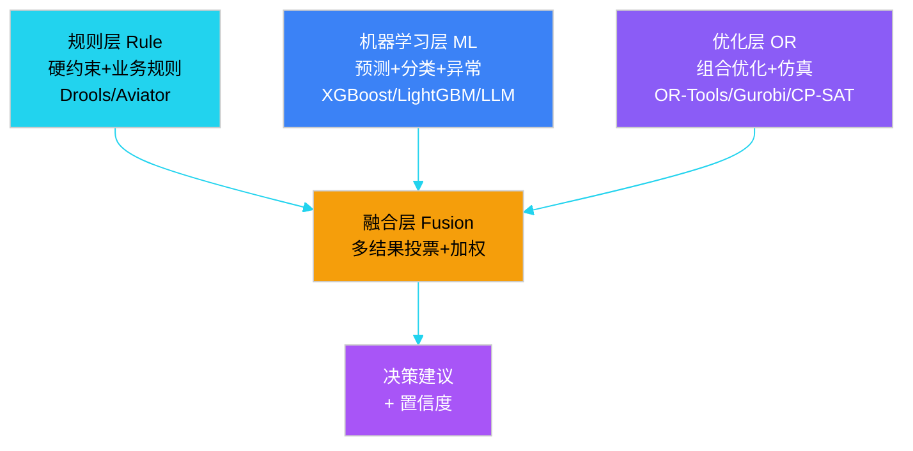

**各层职责**：

- **规则层**：处理"硬约束"——比如保质期、合同 MOQ、安全库存下限。这些必须 100% 满足，机器学习不能违反。
- **机器学习层**：处理"软目标"——比如预测销量、判断哪些 SKU 容易缺货。
- **优化层**：在规则和预测的约束下，求**全局最优**——比如总成本最低、总时效最短。
- **融合层**：把多源结果综合，输出最终建议 + 置信度。

### 12.5.3 决策引擎伪代码

下面是一个补货决策引擎的简化实现：

```python
"""
供应链补货决策引擎
输入：当前库存、需求预测、供应商信息
输出：补货建议（PO 数量 + 时机 + 供应商）
"""
from dataclasses import dataclass
from typing import List, Optional
from datetime import datetime, timedelta

@dataclass
class SKUState:
    sku: str
    on_hand: int
    in_transit: int
    safety_stock: int
    forecast_30d: List[float]   # 未来 30 天预测

@dataclass
class Supplier:
    code: str
    lead_time_days: int
    moq: int                    # 最小起订量
    unit_price: float
    reliability: float          # 历史交付率 0-1

@dataclass
class ReplenishAdvice:
    sku: str
    qty: int
    supplier: str
    eta_date: str
    expected_stockout_date: Optional[str]
    confidence: float
    reason: str

class ReplenishDecisionEngine:
    def __init__(self, rule_engine, ml_predictor, optimizer):
        self.rule_engine = rule_engine
        self.ml_predictor = ml_predictor
        self.optimizer = optimizer

    def decide(self, state: SKUState,
               suppliers: List[Supplier]) -> ReplenishAdvice:
        # 1. 规则层：判断是否触发补货
        if not self.rule_engine.should_replenish(state):
            return ReplenishAdvice(state.sku, 0, "", "", None, 1.0, "无需补货")

        # 2. ML 层：调整预测（考虑促销、季节等）
        adjusted_forecast = self.ml_predictor.predict(state.sku, state.forecast_30d)

        # 3. 计算目标库存（覆盖 Lead Time + 销售周期 + 安全库存）
        lead_time = min(s.lead_time_days for s in suppliers)
        target_stock = (
            sum(adjusted_forecast[:lead_time + 14]) + state.safety_stock
        )
        gap = target_stock - state.on_hand - state.in_transit

        # 4. 优化层：选供应商 + 凑整 MOQ
        best_supplier = self.optimizer.pick_supplier(
            suppliers, gap, criteria="cost_reliability"
        )
        # 凑 MOQ
        final_qty = max(gap, best_supplier.moq)
        # 凑整到箱规
        final_qty = self._round_to_case(final_qty, case_size=12)

        # 5. 风险检查
        stockout_date = self._simulate_stockout_date(state, adjusted_forecast)

        return ReplenishAdvice(
            sku=state.sku,
            qty=final_qty,
            supplier=best_supplier.code,
            eta_date=(datetime.now() + timedelta(days=best_supplier.lead_time_days))
                     .strftime("%Y-%m-%d"),
            expected_stockout_date=stockout_date,
            confidence=0.85,
            reason=f"目标库存={target_stock}, 缺口={gap}, 选 {best_supplier.code}"
        )

    def _round_to_case(self, qty: int, case_size: int) -> int:
        return ((qty + case_size - 1) // case_size) * case_size

    def _simulate_stockout_date(self, state: SKUState,
                                 forecast: List[float]) -> Optional[str]:
        stock = state.on_hand + state.in_transit
        for i, daily in enumerate(forecast):
            stock -= daily
            if stock <= state.safety_stock:
                return (datetime.now() + timedelta(days=i)).strftime("%Y-%m-%d")
        return None
```

**生产级增强点**：

1. **多目标 Pareto**：成本 vs 时效 vs 风险，不能只看一个指标。
2. **A/B 实验**：新策略小流量验证，对比线上效果。
3. **人工干预**：高价值 SKU 强制走人工审批，不允许全自动。
4. **决策可解释**：每个建议都要能解释"为什么"——可解释性比准确度更重要。

---

## 12.6 异常响应

### 12.6.1 异常分类

| 异常类型 | 典型场景 | 影响半径 | 紧急程度 |
|---------|---------|---------|---------|
| **缺货** | 爆品断货、库存归零 | 单一 SKU 或品类 | 中-高 |
| **延迟** | 干线延误、末端爆仓 | 区域/批次 | 中 |
| **质量** | 批次不合格、客诉集中 | 单 SKU/批次 | 高 |
| **灾害** | 地震、疫情、台风 | 大范围 | 极高 |
| **合规** | 海关扣留、监管下架 | SKU 维度 | 高 |

### 12.6.2 异常响应 SOP

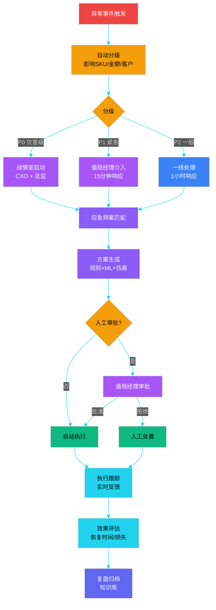

### 12.6.3 应急预案设计

不同异常有**不同的预案模板**，预案应**预置**在控制塔预案库中：

| 异常类型 | 预案模板 | 关键动作 | 兜底方案 |
|---------|---------|---------|---------|
| **缺货** | 跨仓调拨 + 紧急补货 | 1. 评估跨仓调拨可行性 2. 联系供应商加急 3. 限售/预售 | 客户主动告知 + 退款 + 补偿券 |
| **干线延误** | 切换承运 + 备选线路 | 1. 评估影响订单 2. 通知客户 3. 联系备选承运 | 部分退款 + 延误补偿 |
| **批次质量** | 暂停发货 + 召回 | 1. 锁定批次库存 2. 排查下游 3. 启动召回 | 公开召回 + 全额退款 |
| **疫情封控** | 区域切仓 + 承诺调整 | 1. 评估封控范围 2. 切换发货仓 3. 调整时效承诺 | 暂缓发货 + 主动告知 |

### 12.6.4 异常检测伪代码

控制塔需要**主动发现**异常，而不是等客诉上来。下面是基于多指标的异常检测实现：

```python
"""
供应链异常检测引擎
方法：3-sigma 统计 + 同比环比 + 趋势突变
"""
from dataclasses import dataclass
from typing import List, Tuple
import math

@dataclass
class MetricPoint:
    ts: int
    value: float

@dataclass
class Anomaly:
    metric: str
    ts: int
    value: float
    score: float               # 异常分数 0-100
    method: str                # 检测方法
    description: str

class AnomalyDetector:
    def __init__(self, window_size: int = 30, sigma: float = 3.0):
        self.window_size = window_size
        self.sigma = sigma

    def detect(self, metric: str, history: List[MetricPoint],
               current: MetricPoint) -> List[Anomaly]:
        anomalies = []
        values = [p.value for p in history[-self.window_size:]]

        if len(values) < 7:
            return anomalies  # 数据不足

        # 方法 1：3-sigma 偏离
        mean = sum(values) / len(values)
        variance = sum((v - mean) ** 2 for v in values) / len(values)
        std = math.sqrt(variance) if variance > 0 else 0.001
        z = abs(current.value - mean) / std
        if z > self.sigma:
            anomalies.append(Anomaly(
                metric=metric, ts=current.ts, value=current.value,
                score=min(100, z * 20), method="3sigma",
                description=f"偏离均值 {mean:.2f} 达 {z:.1f} 个标准差"
            ))

        # 方法 2：同比/环比突变
        if len(values) >= 7:
            wow = values[-7]                          # 上周同期
            if wow > 0:
                change = (current.value - wow) / wow
                if abs(change) > 0.5:                 # 突变 50%+
                    anomalies.append(Anomaly(
                        metric=metric, ts=current.ts, value=current.value,
                        score=min(100, abs(change) * 100), method="wow",
                        description=f"同比上周 {change*100:+.1f}%"
                    ))

        # 方法 3：趋势反转（连续 3 天单调下降后突然上升）
        if len(values) >= 5:
            recent = values[-4:]
            if all(recent[i] > recent[i+1] for i in range(3)) and \
               current.value > recent[0] * 1.3:
                anomalies.append(Anomaly(
                    metric=metric, ts=current.ts, value=current.value,
                    score=70, method="trend_reversal",
                    description="连续下降后突增 30%+"
                ))

        return anomalies
```

**生产级增强**：

- **机器学习模型**：用 Isolation Forest、Prophet 等做更复杂的异常检测。
- **多指标联合**：单指标异常可能是噪声，**多指标同向异常**才是真异常。
- **人工反馈**：每次告警可以标"真异常/假阳性"，作为模型再训练的标签。

---

## 12.7 案例：京东、菜鸟、亚马逊的控制塔

### 12.7.1 京东供应链控制塔

**核心特征**：自营 + 自建仓配 + 自研系统，控制塔是"中央调度大脑"。

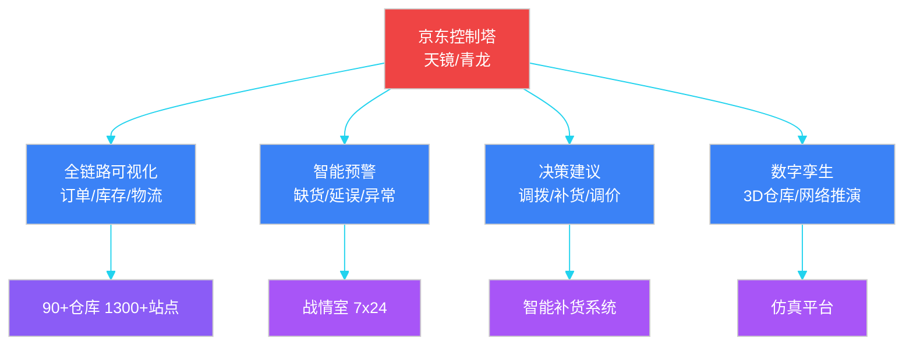

**关键能力**：

- **天镜系统**：3D 数字孪生仓库，可视化到库位级别。
- **战情室**：7×24 监控大屏，异常秒级推送。
- **智能补货**：基于深度学习的补货建议，命中率 90%+。
- **211 限时达**：控制塔的实时调度能力支撑"上午下单下午到"承诺。

### 12.7.2 菜鸟智慧供应链

**核心特征**：平台化 + 数据协同 + 多方连接。菜鸟不是自营，而是连接 3000+ 物流合作伙伴的"协同平台"。

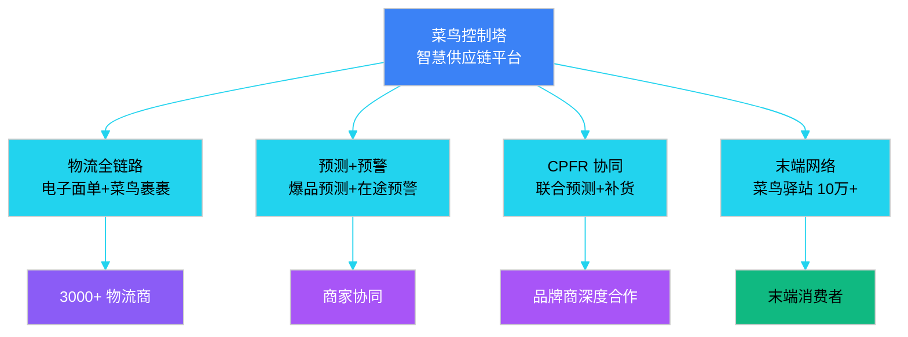

**关键能力**：

- **电子面单**：行业标准，5 年普及 100% 包裹。
- **CPFR 协同**：与品牌商（宝洁、联合利华等）做联合预测与补货。
- **菜鸟驿站**：末端 10 万+ 站点，缓解末端配送压力。
- **菜鸟裹裹**：逆向物流统一入口，消费者端到端体验。

### 12.7.3 亚马逊 Supply Chain Innovation

**核心特征**：技术驱动 + FBA 网络 + 极致客户体验。亚马逊把控制塔做到了"决策自动化"极致。

| 能力 | 描述 | 效果 |
|------|------|------|
| **Anticipatory Shipping** | 预测客户未来要买，提前把货发到前置仓 | 缩短送达 1-2 天 |
| **FBA 网络优化** | 全球 175+ 履约中心，动态库存分配 | 降低运费 30% |
| **Kiva 机器人** | 货架到人，AGV 调度算法支撑 | 拣货效率 3 倍 |
| **AI 补货** | ML 驱动补货建议，季度自动采购 | 缺货率 < 1% |
| **无人机/无人车** | 自动驾驶末端配送试点 | 解决末端成本 |

### 12.7.4 三家对比

| 维度 | 京东 | 菜鸟 | 亚马逊 |
|------|------|------|--------|
| **模式** | 自营一体化 | 平台化协同 | 自营+第三方 |
| **核心优势** | 时效（211） | 数据协同 | 技术深度 |
| **控制塔形态** | 中央调度大脑 | 协同平台 | 决策自动化 |
| **数字孪生** | 3D 仓库/网络 | 物流全链路仿真 | 全球 FBA 网络 |
| **决策自动化** | 部分（高价值 SKU 人工） | 辅助决策 | 全自动（普货） |
| **典型场景** | 211 时效履约 | 跨商家协同 | Prime 2 日达 |

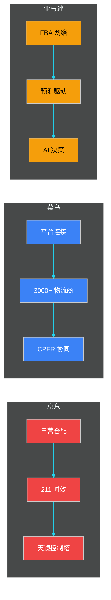

---

## 本章小结

供应链控制塔是 5 层架构中"决策层"的核心实现，它把**可视化、监控、分析、决策**四大能力聚合到一个统一入口。本章系统介绍了控制塔的 5 个核心模块：

1. **定位与演进**：从 L1 报表到 L4 决策，控制塔的成熟度分 4 阶段，要循序渐进。
2. **全链路可视化**：端到端链路图 + 4 层 KPI 看板（战略/战术/执行/诊断），10 大核心 KPI 是骨架。
3. **风险监控**：四类风险（供应/需求/物流/合规）相互传导，评估模型是"基线偏差 + 业务权重 + sigmoid 打分"。
4. **数字孪生**：物理-数字镜像 + 仿真推演，是控制塔的"高阶能力"，落地难度也最高。
5. **决策中心**：规则 + ML + 优化三层融合，**可解释性比准确度更重要**。
6. **异常响应**：分级 SOP + 预案库 + 自动执行，关键异常走人工审批兜底。
7. **行业实践**：京东自营中央调度、菜鸟平台协同、亚马逊 AI 自动决策，三种模式各有侧重。

最后强调几个**工程实践要点**：

- **不要跳过 L1/L2 直接上 L4 AI 决策**——数据基础不稳，AI 就是黑盒。
- **可解释性优先**——每个建议都要能说清"为什么"，运营才敢用。
- **人工兜底永远要有**——高价值决策、关键 SKU、黑天鹅事件必须有人工审批。
- **决策可回滚**——所有自动决策必须能"一键回退"，否则一次事故可能放大 10 倍。

---

## 面试高频问题

**1. 什么是供应链控制塔？它的 4 大能力是什么？**

参考答案要点：供应链控制塔（Supply Chain Control Tower, SCT）是供应链的"驾驶舱"，是横跨 5 层架构的**能力聚合层**。4 大能力：① 可视化（See）—— 把端到端供应链画在一张图上；② 监控（Monitor）—— 异常告警与 SLA 仪表盘；③ 分析（Analyze）—— 根因归因与 What-If 推演；④ 决策（Decide）—— 自动建议与执行。**控制塔不直接处理交易**，而是从各层抽取信号、形成建议，是"读多写少"的聚合层。

**2. 数字孪生和传统 BI 报表的本质区别是什么？**

参考答案要点：传统 BI 是"历史 + 当前"的静态指标看板，数字孪生是"历史 + 当前 + 未来推演"的动态模型。三个本质区别：① 时态—— 数字孪生含未来推演；② 模型—— 数字孪生是动态物理/业务模型，BI 是静态 SQL；③ 交互—— 数字孪生支持模拟和反事实推演，BI 只能看数。落地场景：仓库布局仿真、仓网优化、应急预案推演。

**3. 风险评估模型的核心要素有哪些？**

参考答案要点：四要素：① 风险分类（供应/需求/物流/合规）；② 监控指标（交付率/缺货率/OTD 等）；③ 评估算法（基线偏差 + 业务权重 + sigmoid 打分到 0-100）；④ 升级策略（按等级推送不同通道）。**关键设计**：基线值要带季节因子，业务权重由专家定义，级联效应要识别（供应断→缺货→调拨→承运爆仓）。

**4. 决策引擎为什么是"规则 + ML + 优化"三层融合？**

参考答案要点：单一算法都有局限。规则层处理**硬约束**（保质期、合同 MOQ、安全库存下限，必须 100% 满足）；ML 层处理**软目标**（预测销量、判断风险）；优化层在两者约束下求**全局最优**（总成本最低、时效最短）。**融合层**把多源结果综合输出，附置信度。**可解释性比准确度更重要**——运营不敢用看不懂的决策。

**5. 控制塔如何做异常检测？请描述核心算法。**

参考答案要点：常用三种方法组合：① 3-sigma 统计—— 当前值偏离均值 N 个标准差则告警；② 同比/环比突变—— 与上周/昨日对比变化超阈值；③ 趋势反转—— 连续下降后突增 30%+。**生产级增强**：多指标联合检测（避免单指标噪声）、机器学习模型（Isolation Forest、Prophet）、人工反馈闭环（标注真异常/假阳性用于模型再训练）。**关键**：异常检测是发现，异常响应是处理，二者必须配套。

**6. 京东、菜鸟、亚马逊的控制塔有什么区别？**

参考答案要点：① 京东—— 自营一体化，中央调度大脑型，重"履约时效"（211 限时达），数字孪生做到 3D 仓库；② 菜鸟—— 平台化协同型，连接 3000+ 物流商，重"数据协同"（CPFR、电子面单），控制塔是协同平台而非调度中心；③ 亚马逊—— 技术驱动型，控制塔做到"决策自动化"（Anticipatory Shipping、AI 补货全自动），FBA 网络+预测驱动是核心。三家代表了三种不同的供应链哲学：**自营时效 vs 平台协同 vs 技术驱动**。

**7. 控制塔的数据时延应该怎么设计？**

参考答案要点：分层设计，匹配不同业务需求：① 战略层（小时/日）—— T+1 即可；② 战术层（分钟/小时）—— 5 分钟粒度；③ 执行层（实时秒级）—— 事件驱动流式；④ 诊断层（按需）—— OLAP 引擎支撑。**实现要点**：Flink/Kafka 做实时流，ClickHouse/Doris 做分钟/小时聚合，Hive/Iceberg 做 T+1 离线数仓。**不要追求"全部实时"**——成本和业务价值不匹配。

**8. 如何平衡控制塔的"自动化"与"人工兜底"？**

参考答案要点：三层策略：① 高价值 SKU / 重大金额 / 关键客户 —— 强制走人工审批，不允许全自动；② 普通普货 / 低风险决策 —— 全自动，事后审计；③ 灰区决策 —— 给出建议 + 置信度，人工确认后执行。**关键工程能力**：所有自动决策必须支持"一键回滚"（避免放大事故），所有人工决策结果回流作为模型训练标签（持续学习）。**原则：可解释 > 准确度 > 自动化程度**。
