# 第 13 章 供应链协同中台

> 本章定位：供应链系统发展到中后期，必然从"烟囱林立"走向"中台化协同"。本章系统讲解**业务中台、数据中台、技术中台**的分层设计，**API 网关、事件驱动、上下游互联**的工程实践。配套案例覆盖苹果、沃尔玛、亚马逊等头部企业的供应商互联方案。
>
> **学习建议**：协同中台是"治理"问题大于"开发"问题，重点理解"为什么这样切分"和"边界划在哪里"。

---

## 13.1 协同中台架构

### 13.1.1 什么是供应链协同中台

供应链协同中台（Supply Chain Collaboration Platform，简称 SCCP）是企业将**多业务域通用能力**抽取沉淀，对内对外**统一服务**的平台层。它出现的根本原因是：当企业有 10+ 业务系统（SRM、OMS、WMS、TMS、IMS、采购…），且需要与 100+ 上下游合作伙伴（供应商、承运商、客户）互联时，"系统间点对点对接"已经无法维护。

```mermaid
%%{init: {'theme':'dark','themeVariables':{'primaryColor':'#1f2937','primaryTextColor':'#f9fafb','primaryBorderColor':'#22d3ee','lineColor':'#22d3ee','fontSize':'14px'}}}%%
flowchart TB
    subgraph SBP[前台业务系统]
        S1[电商OMS]
        S2[门店POS]
        S3[批发B2B]
        S4[跨境电商]
        S5[小程序/APP]
    end

    subgraph SCCP[供应链协同中台]
        subgraph BP[业务中台]
            B1[商品中心]
            B2[订单中心]
            B3[库存中心]
            B4[结算中心]
            B5[调度中心]
        end
        subgraph DP[数据中台]
            D1[主数据MDM]
            D2[数据仓库]
            D3[指标平台]
            D4[数据服务]
        end
        subgraph TP[技术中台]
            T1[API网关]
            T2[消息总线]
            T3[事件总线]
            T4[规则引擎]
            T5[身份与权限]
        end
    end

    subgraph EX[外部生态]
        E1[供应商]
        E2[承运商]
        E3[客户/经销商]
        E4[监管/海关]
    end

    S1 & S2 & S3 & S4 & S5 --> TP
    TP --> BP
    BP <--> DP
    TP <--> E1 & E2 & E3 & E4

    style SCCP fill:#1e293b,stroke:#22d3ee,stroke-width:2px
    style BP fill:#312e81,color:#fff
    style DP fill:#164e63,color:#fff
    style TP fill:#7c2d12,color:#fff
```

### 13.1.2 中台与传统烟囱系统的对比

| 维度 | 传统烟囱系统 | 协同中台 |
|------|------------|---------|
| **系统数量** | 每个业务一条独立链路 | 一次建设，多业务复用 |
| **数据一致性** | 各自建表，口径不一 | 统一主数据 + 统一指标 |
| **对接成本** | N×M 点对点 | 一次接入，全网可用 |
| **业务响应** | 3-6 个月新建系统 | 1-2 周配置新业务 |
| **技术栈** | 多语言多框架 | 收敛到 1-2 套主流栈 |
| **组织结构** | 按业务线分团队 | 中台团队 + 业务前台 |
| **数据资产** | 数据孤岛 | 资产化、服务化 |
| **典型痛点** | 重复造轮子、改一处动全身 | 前期投入大、需要顶层设计 |

### 13.1.3 中台建设的"三不"原则

| 原则 | 说明 | 典型反面案例 |
|------|------|------------|
| **不过度抽象** | 没有 3 个以上业务复用的能力不抽 | 抽象出"超通用订单"导致学习成本高 |
| **不破坏现有** | 渐进式抽取，保留兼容性 | 大爆炸式重构导致线上故障 |
| **不忽视组织** | 中台必须有独立 BU/委员会治理 | 共享团队沦为外包，需求堆压 |

### 13.1.4 中台演进的 3 个阶段

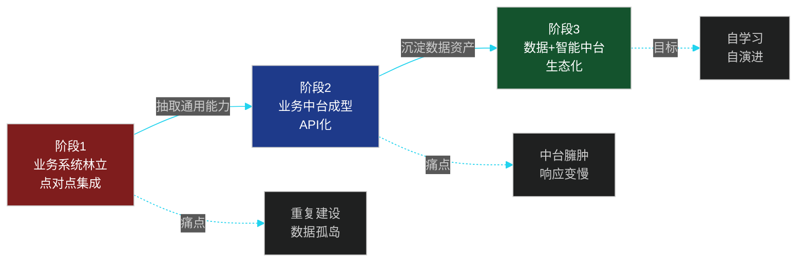

---

## 13.2 业务中台设计

业务中台把供应链 12 大业务域中的**通用能力**抽取出来，形成"商品、订单、库存、结算、调度"5 大中心，对前台业务（电商、门店、批发、跨境、小程序）提供**统一服务**。

### 13.2.1 五大业务中心

| 中心 | 核心能力 | 通用服务 | 复用业务 |
|------|---------|---------|---------|
| **商品中心** | SKU/SKU 组合/SPU、价格、属性 | 商品查询、库存查询、价格计算 | 电商、批发、跨境、门店 |
| **订单中心** | 订单全生命周期、状态机 | 创单、拆单、合单、状态变更 | 电商 OMS、B2B OMS、跨境 OMS |
| **库存中心** | 多仓多渠道库存、预占、释放 | 可用量查询、预占、释放、调拨 | 电商、门店、批发 |
| **结算中心** | 应付/应收、发票、对账 | 单据生成、发票匹配、付款 | 采购、销售、运费 |
| **调度中心** | 履约路径、波次、异常处理 | 仓库分配、承运分配、规则引擎 | OMS、WMS、TMS |

### 13.2.2 业务能力抽象的伪代码

下面展示"订单中心"如何抽象出"通用订单服务"，屏蔽前台业务差异：

```java
// ============ 通用订单服务（业务中台） ============

/**
 * 订单领域服务：所有业务前台（电商/批发/跨境）共用
 */
@Service
public class UniversalOrderService {

    @Autowired private OrderRepository orderRepository;
    @Autowired private AllocationEngine allocationEngine;
    @Autowired private EventPublisher eventPublisher;
    @Autowired private PricingService pricingService;

    /**
     * 创建订单：屏蔽业务前台差异
     * @param context 业务上下文（电商/批发/跨境各有 adapter）
     */
    public OrderResult createOrder(OrderContext context) {

        // 1. 参数归一化（不同前台的字段映射到统一 Order）
        Order order = OrderNormalizer.normalize(context);

        // 2. 价格计算（业务规则可插拔）
        order.setLines(pricingService.calculate(context));

        // 3. 风控校验（拦截恶意下单）
        RiskResult risk = riskCheck(context);
        if (!risk.isPassed()) {
            return OrderResult.fail(risk.getReason());
        }

        // 4. 库存预占（统一调度）
        AllocationResult allocation =
            allocationEngine.allocate(order, AllocationStrategy.HYBRID);

        if (!allocation.isSuccess()) {
            // 触发缺货事件，唤起补货决策
            eventPublisher.publish(
                new StockoutEvent(order.getSkuList(), order.getRegion()));
            return OrderResult.fail("库存不足");
        }

        // 5. 持久化
        order.setStatus(OrderStatus.CREATED);
        order.setAllocation(allocation);
        orderRepository.save(order);

        // 6. 发布领域事件
        eventPublisher.publish(new OrderCreatedEvent(order));

        return OrderResult.success(order.getId());
    }

    /**
     * 取消订单：所有前台共用，自动释放库存
     */
    public OrderResult cancelOrder(String orderId, CancelReason reason) {

        Order order = orderRepository.findById(orderId);
        if (!order.canCancel()) {
            return OrderResult.fail("当前状态不可取消");
        }

        // 状态机驱动
        order.cancel(reason);

        // 释放库存
        allocationEngine.release(order.getAllocation());

        // 反向事件：触发退款/退供
        eventPublisher.publish(new OrderCancelledEvent(order, reason));

        return OrderResult.success();
    }
}

/**
 * 业务上下文：前台业务通过 adapter 适配
 */
public class OrderContext {
    private Channel channel;        // ECOM, B2B, CROSS_BORDER, STORE
    private String buyerId;
    private List<LineItem> items;
    private Address shipTo;
    private Map<String, Object> extraParams;  // 业务特定参数
}

/**
 * 归一化器：把不同前台的入参统一为 Order
 */
public class OrderNormalizer {
    public static Order normalize(OrderContext ctx) {
        return switch (ctx.getChannel()) {
            case ECOM        -> EcomOrderAdapter.adapt(ctx);
            case B2B         -> B2BOrderAdapter.adapt(ctx);
            case CROSS_BORDER-> CrossBorderAdapter.adapt(ctx);
            case STORE       -> StoreOrderAdapter.adapt(ctx);
        };
    }
}
```

### 13.2.3 域模型（Domain Model）

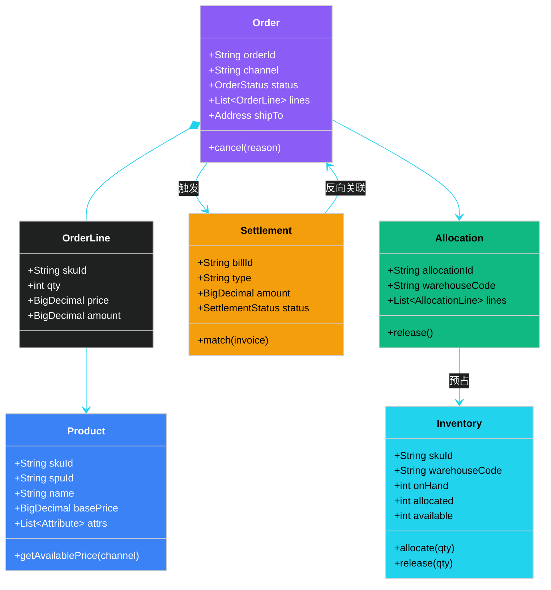

### 13.2.4 中台与前台的边界

| 边界 | 中台负责 | 前台负责 |
|------|---------|---------|
| 业务规则 | 通用规则（库存、价格、状态机） | 业务规则（促销、组合套餐） |
| 数据模型 | 通用模型（Order/SKU/Inventory） | 业务模型（购物车、券码） |
| 用户体验 | 不关注 UI | 100% 负责 |
| 业务编排 | 提供原子能力 | 编排中台能力完成业务 |
| 性能 | 高并发、低延迟 | 业务正确性 |

> **关键认知**：中台不是"包打天下"，而是"通用能力的稳定供应方"。**业务流程仍在前台**。

---

## 13.3 数据中台

数据中台是供应链的"记忆系统"——业务中台产生的数据，经过**采集、清洗、建模、服务化**后，成为可复用的数据资产。

### 13.3.1 数据中台的 4 大模块

| 模块 | 职责 | 典型产出 |
|------|------|---------|
| **主数据管理（MDM）** | 统一客户、商品、供应商、组织等主数据 | 黄金记录（Golden Record） |
| **数据仓库** | ODS → DWD → DWS → ADS 分层建模 | 主题宽表 |
| **指标平台** | 统一指标定义、口径、计算 | 指标库 + API |
| **数据服务** | 把数据资产 API 化 | 查询服务、订阅服务 |

### 13.3.2 主数据管理（MDM）

主数据是"业务实体的标准身份证"——同一个供应商在不同系统里叫"supplier_001"、"深圳科技公司"、"SZ-Tech"，主数据把它统一为一条"黄金记录"。

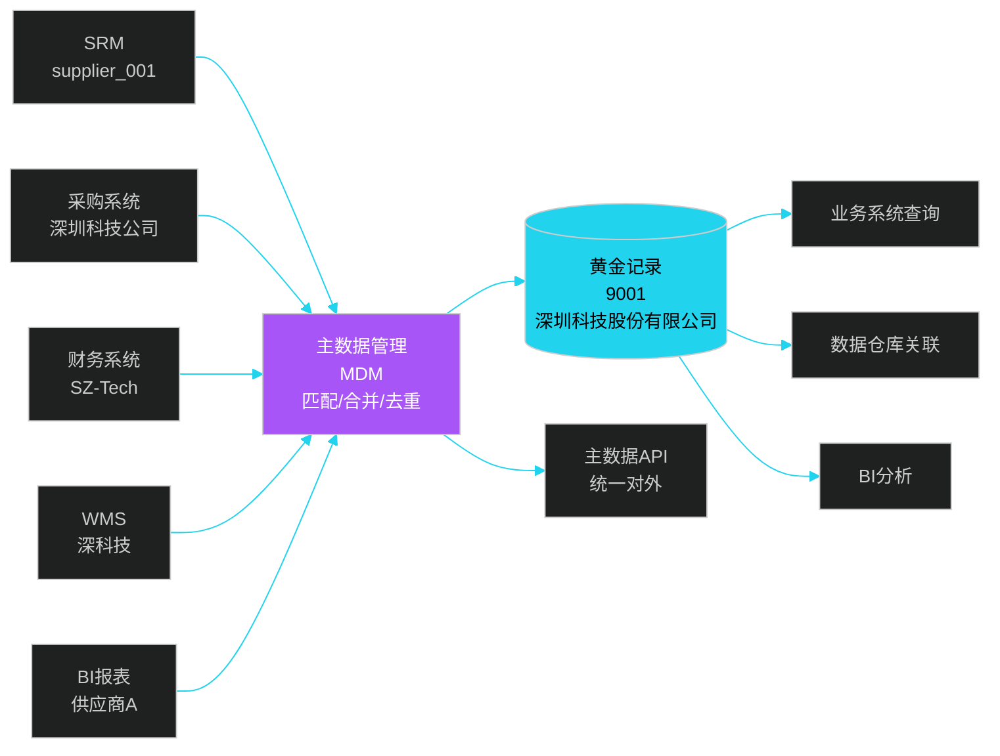

### 13.3.3 数据仓库分层：ODS → DWD → DWS → ADS

| 分层 | 全称 | 作用 | 建模方法 | 数据量级 |
|------|------|------|---------|---------|
| **ODS** | Operational Data Store | 原始数据贴源层 | 与源系统 1:1 | 100% |
| **DWD** | Data Warehouse Detail | 明细数据清洗层 | ER 模型 / 维度建模 | 80% |
| **DWS** | Data Warehouse Summary | 主题汇总层 | 宽表 / 主题域 | 10% |
| **ADS** | Application Data Service | 应用数据层 | 指标 / 报表 / 标签 | 1% |

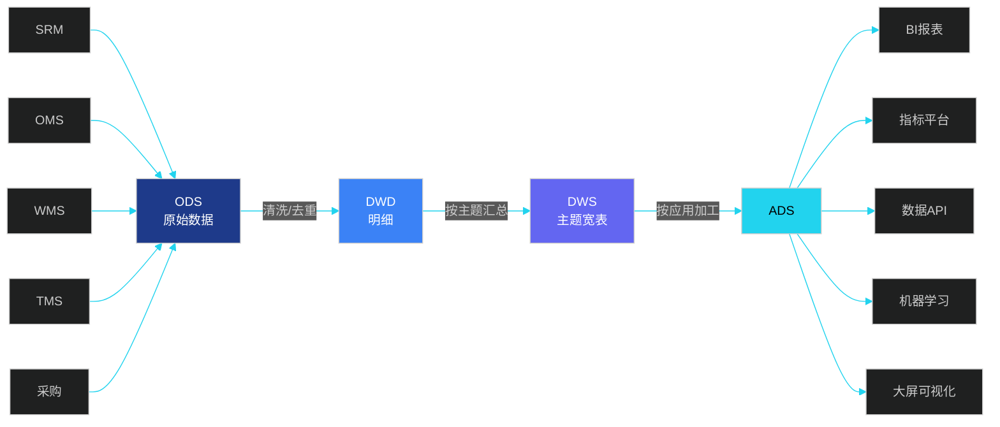

### 13.3.4 数据流转的伪代码（Spark/Flink）

```scala
// ============ 数据中台：ODS → DWD → DWS → ADS 全流程 ============

// ========== 1. ODS 贴源层：直接消费业务库 binlog ==========
val odsOrder = spark.read
  .format("kafka")
  .option("kafka.bootstrap.servers", "kafka:9092")
  .option("topic", "cdc.oms.orders")
  .load()
  .select(from_json(col("value"), orderSchema).as("data"))
  .select("data.*", "data.create_time")
  .writeStream
  .format("hudi")
  .option("tableName", "ods_oms_orders")
  .start()

// ========== 2. DWD 明细层：清洗 + 维度关联 ==========
val dwdOrder = spark.read.format("hudi").load("ods_oms_orders")
  .filter(col("status") =!= "INVALID")          // 过滤无效数据
  .withColumn("province", getProvince(col("ship_to")))  // 标准化
  .join(broadcast(dimProduct), "sku_id")        // 关联商品维度
  .join(broadcast(dimWarehouse), "warehouse_id")
  .write
  .format("hudi")
  .mode("append")
  .save("dwd_dwd_orders")

// ========== 3. DWS 主题层：按主题汇总（每日每仓每SKU） ==========
val dwsDailySku = dwdOrder
  .groupBy(
    window(col("create_time"), "1 day"),
    col("sku_id"),
    col("warehouse_code"),
    col("channel")
  )
  .agg(
    sum("qty").as("order_qty"),
    sum("amount").as("order_amount"),
    countDistinct("order_id").as("order_cnt")
  )
  .write
  .format("clickhouse")
  .save("dws_daily_sku_summary")

// ========== 4. ADS 应用层：直接给业务用的指标 ==========
// 4.1 销售看板
val salesDashboard = dwsDailySku
  .groupBy("warehouse_code", "channel")
  .agg(sum("order_amount").as("gmv"))
  .write
  .saveAsTable("ads_sales_dashboard")

// 4.2 缺货预警（用 DWS 关联库存）
val stockoutAlert = dwsDailySku
  .join(dimInventory, Seq("sku_id", "warehouse_code"))
  .filter(col("available_qty") < col("daily_avg_qty") * 3)
  .select("sku_id", "warehouse_code", "available_qty", "daily_avg_qty")
  .writeTo("ads_stockout_alert")
```

### 13.3.5 指标体系

供应链指标体系按"**业务域 → 主题 → 原子指标 → 派生指标**"四层组织：

| 业务域 | 主题 | 原子指标 | 派生指标示例 |
|--------|------|---------|-------------|
| 采购 | 寻源 | 寻源数、寻源周期 | 寻源及时率 |
| 采购 | 订单 | 采购单数、采购金额 | 采购集中度 |
| 库存 | 健康 | 库存量、库龄 | 呆滞库存占比、库存周转率 |
| 库存 | 服务 | 可用率、预占数 | 缺货率、订单满足率 |
| 订单 | 履约 | 单量、金额 | 按时履约率、平均履约时长 |
| 物流 | 时效 | 在途时长、签收数 | 准时签收率、运输成本占比 |
| 物流 | 成本 | 运费、油费 | 单均运费、单位重量成本 |
| 财务 | 应付 | 应付单数、金额 | 付款及时率、月结周转 |

> **指标治理三要素**：① 统一口径（指标定义唯一）；② 统一计算（一个指标一个 SQL/Job）；③ 统一服务（API 化输出）。

---

## 13.4 API 网关与协议

API 网关是协同中台的"门神"——所有内外部调用都通过它路由、限流、鉴权、监控。

### 13.4.1 API 网关架构

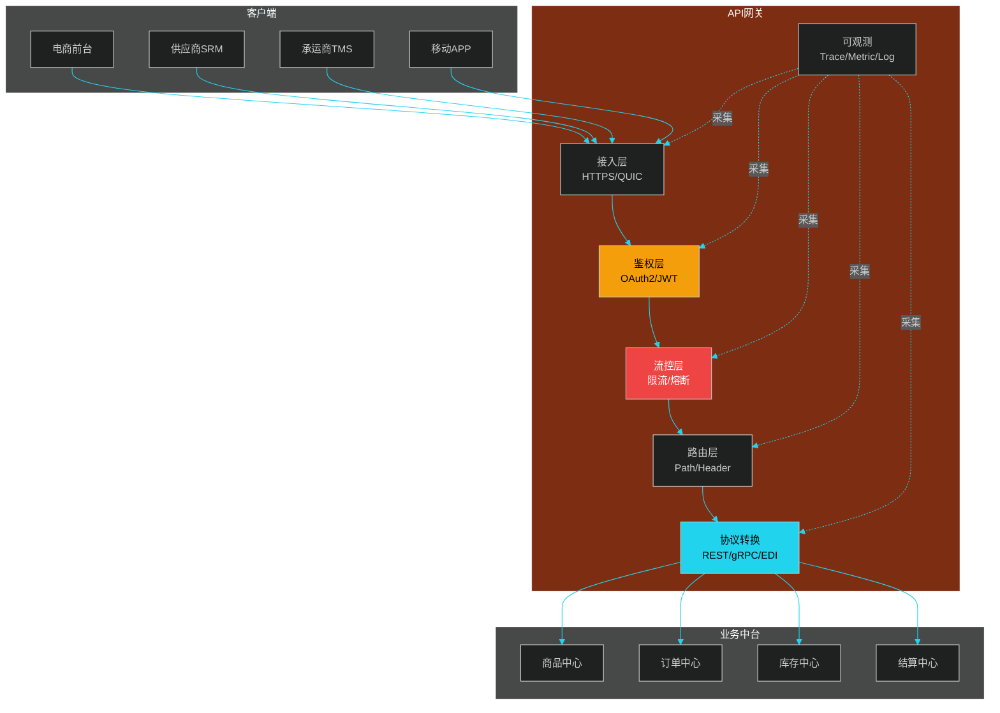

### 13.4.2 API 网关的 8 大能力

| 能力 | 说明 | 典型实现 |
|------|------|---------|
| **统一接入** | 统一域名、统一认证 | Nginx + Lua、Kong、APISIX |
| **鉴权** | OAuth2、JWT、API Key | JWT 验签、RBAC |
| **限流** | QPS、并发、漏桶/令牌桶 | Sentinel、Guava RateLimiter |
| **熔断** | 下游故障时自动降级 | Sentinel、Hystrix（已停维） |
| **路由** | Path、Header、权重路由 | Nginx upstream、Spring Cloud Gateway |
| **协议转换** | REST/gRPC/EDI 互转 | 自研 adapter |
| **可观测** | Trace、Metric、Log | OpenTelemetry、Prometheus |
| **灰度发布** | 按用户/Header 分流 | APISIX、Spring Cloud Gateway |

### 13.4.3 内部 API：REST vs gRPC

| 维度 | REST | gRPC |
|------|------|------|
| **协议** | HTTP/JSON | HTTP/2 + Protobuf |
| **性能** | 较低（文本 + 冗余） | 高（二进制 + 多路复用） |
| **类型安全** | 弱（JSON 解析） | 强（Proto 定义） |
| **流式** | 弱（SSE/WebSocket） | 原生支持（4 种流） |
| **可读性** | 高（curl 即可调试） | 弱（需工具） |
| **跨语言** | 强 | 强 |
| **适用场景** | 外部开放 API、前端 | 内部微服务、高性能场景 |
| **典型用户** | 阿里、京东 | Google、Netflix、字节 |

**典型实践**：
- 外部 API → REST（兼容性好、易调试）
- 内部微服务 → gRPC（性能高、流式支持好）
- 移动端 → REST + JSON（包体小、可读）

### 13.4.4 外部 EDI：ANSI X12 vs EDIFACT

EDI（Electronic Data Interchange）是传统 B2B 集成的"老炮"，在欧美零售、制造业仍是主流。

| 维度 | ANSI X12 | EDIFACT |
|------|---------|---------|
| **发布组织** | 美国（X12 标准） | 联合国（UN/CEFACT） |
| **使用地区** | 北美 | 欧洲、亚洲、跨境 |
| **消息格式** | 定长段（Segment） | 变长段 |
| **分隔符** | `~`（元素）、`*`（子元素）、`\n`（段） | `'`（元素）、`+`（子元素）、`?`（段终止） |
| **典型报文** | 850（采购订单）、856（发货通知）、810（发票） | ORDERS（订单）、DESADV（发货）、INVOIC（发票） |
| **传输方式** | AS2、SFTP、FTP | AS2、OFTP、SFTP |
| **典型用户** | 沃尔玛、亚马逊、Target | 欧盟零售商、汽车制造业 |

**X12 850 采购订单示例**：

```
ISA*00*          *00*          *ZZ*SENDERID       *ZZ*RECEIVERID     *200101*1200*U*00401*000000001*0*P*>~
GS*PO*SENDERID*RECEIVERID*20200101*1200*1*X*004010~
ST*850*0001~
BEG*00*SA*PO12345**20200101~
REF*DP*38~
N1*ST*WAREHOUSE 01*92*WH001~
PO1*1*100*EA*9.99**VP*SKU001~
PO1*2*200*EA*19.99**VP*SKU002~
CTT*2~
SE*8*0001~
GE*1*1~
IEA*1*000000001~
```

### 13.4.5 上下游互联的协议选择

| 上下游类型 | 推荐协议 | 理由 |
|----------|---------|------|
| 国内大型供应商 | EDI（自研格式）或 REST API | 灵活、调试方便 |
| 国际大型客户 | ANSI X12 / EDIFACT | 行业标准、对方已有系统 |
| 中小供应商 | SRM 门户（Web）+ API | 改造成本低 |
| 跨境电商 | REST API + Webhook | 异步、可扩展 |
| 监管/海关 | 国家标准接口 | 合规优先 |

---

## 13.5 事件驱动架构

事件驱动架构（Event-Driven Architecture, EDA）是协同中台的"神经系统"——业务事件通过消息中间件流转，实现系统解耦、最终一致性。

### 13.5.1 为什么需要事件驱动

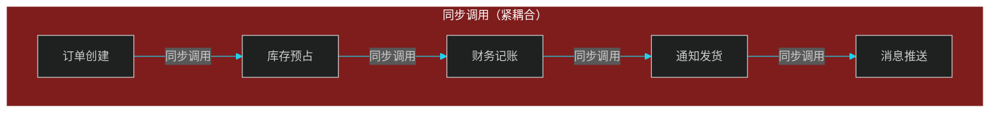

**问题**：链路长、任一环节故障全链路失败、性能差、改一处动全身。

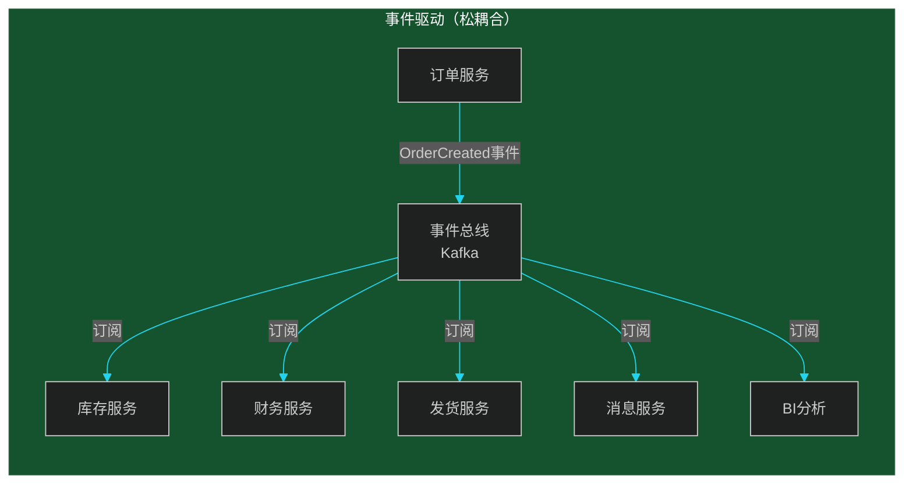

**收益**：发布者不关心订阅者、订阅者可独立扩缩容、故障隔离。

### 13.5.2 同步调用 vs 事件驱动对比

| 维度 | 同步调用 | 事件驱动 |
|------|---------|---------|
| **耦合度** | 紧耦合 | 松耦合 |
| **一致性** | 强一致 | 最终一致 |
| **性能** | 链路累加 | 各环节独立 |
| **容错** | 差（链路断则失败） | 好（重试 + 死信） |
| **可观测** | 困难（分布式追踪） | 容易（事件 Trace） |
| **适用场景** | 关键链路、需要强一致 | 异步、解耦、跨系统 |

### 13.5.3 Kafka vs RocketMQ

| 维度 | Kafka | RocketMQ |
|------|-------|----------|
| **诞生** | LinkedIn，后捐给 Apache | 阿里，后捐给 Apache |
| **性能** | 极高（百万级 TPS） | 高（十万级 TPS） |
| **消息顺序** | 分区内有序 | 全局有序（部分场景） |
| **事务消息** | 较弱 | 原生支持 |
| **延迟** | 毫秒~秒 | 毫秒级 |
| **运维** | 较复杂（依赖 ZK/KRaft） | 较简单（NameServer） |
| **适用场景** | 大数据、日志、IoT | 金融、电商、订单、扣款 |
| **典型用户** | LinkedIn、Uber、字节 | 阿里、滴滴、字节 |

> **国内电商/供应链首选 RocketMQ**（事务消息、延迟消息、顺序消息完备），**大数据/日志首选 Kafka**（吞吐、生态）。

### 13.5.4 事件流架构

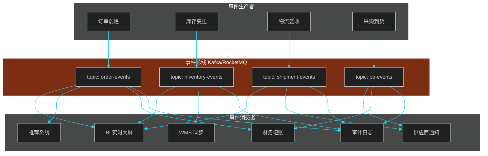

### 13.5.5 事件发布订阅的伪代码

```java
// ============ 事件发布订阅：Spring Boot + RocketMQ ============

// ========== 1. 事件定义 ==========
@Builder
@Data
public class OrderCreatedEvent implements DomainEvent {
    private String orderId;
    private String channel;
    private String skuList;
    private BigDecimal amount;
    private String buyerId;
    private Long timestamp;
}

// ========== 2. 事件发布者（订单服务） ==========
@Service
public class OrderEventPublisher {

    @Autowired private RocketMQTemplate rocketMQTemplate;

    @Transactional(rollbackFor = Exception.class)
    public void publishOrderCreated(Order order) {

        // 1. 业务操作：保存订单
        orderRepository.save(order);

        // 2. 构造事件
        OrderCreatedEvent event = OrderCreatedEvent.builder()
            .orderId(order.getId())
            .channel(order.getChannel().name())
            .skuList(order.getSkuList().toString())
            .amount(order.getAmount())
            .buyerId(order.getBuyerId())
            .timestamp(System.currentTimeMillis())
            .build();

        // 3. 同步发送（带事务）
        // tag: 业务标识, key: 订单号（保证同一订单消息有序）
        SendResult result = rocketMQTemplate.syncSend(
            "order-events:OrderCreated",  // topic:tag
            event,
            3000                          // 超时
        );

        if (result.getSendStatus() != SendStatus.SEND_OK) {
            throw new EventPublishException("事件发布失败");
        }
    }
}

// ========== 3. 事件订阅者（库存服务） ==========
@Service
@RocketMQMessageListener(
    topic = "order-events",
    selectorExpression = "OrderCreated",
    consumerGroup = "inventory-service-group"
)
public class InventoryEventListener implements RocketMQListener<OrderCreatedEvent> {

    @Autowired private InventoryService inventoryService;

    @Override
    public void onMessage(OrderCreatedEvent event) {

        try {
            // 幂等性：防止重复消费
            if (inventoryService.isProcessed(event.getOrderId())) {
                return;
            }

            // 业务处理：扣减预占
            inventoryService.allocateFromEvent(
                event.getOrderId(),
                event.getSkuList()
            );

            // 标记已处理
            inventoryService.markProcessed(event.getOrderId());

        } catch (Exception e) {
            // 失败重试：RocketMQ 自动重试 16 次
            // 仍失败进入死信队列
            log.error("库存事件处理失败", e);
            throw e;
        }
    }
}

// ========== 4. 死信处理 ==========
@RocketMQMessageListener(
    topic = "order-events-dlq",
    consumerGroup = "dlq-processor"
)
public class DeadLetterListener implements RocketMQListener<MessageExt> {
    @Override
    public void onMessage(MessageExt msg) {
        // 人工介入 / 告警
        alertService.send("死信消息：" + msg.getMsgId());
    }
}
```

### 13.5.6 事件溯源（Event Sourcing）

事件溯源的核心思想是：**不存储对象的当前状态，而是存储导致状态变化的事件序列**。当前状态通过 replay 事件得到。

```mermaid
%%{init: {'theme':'dark','themeVariables':{'primaryColor':'#1f2937','primaryTextColor':'#f9fafb','primaryBorderColor':'#22d3ee','lineColor':'#22d3ee','fontSize':'14px'}}}%%
flowchart LR
    E1[E1: OrderCreated] --> AGG[聚合]
    E2[E2: OrderPaid] --> AGG
    E3[E3: OrderShipped] --> AGG
    E4[E4: OrderSigned] --> AGG
    E5[E5: OrderCompleted] --> AGG
    AGG --> STATE[当前状态<br/>Completed]

    STORE[(事件存储<br/>不可变)] -.提供事件.-> E1 & E2 & E3 & E4 & E5
    SNAP[(快照<br/>定期] -.加速.-> AGG

    style AGG fill:#a855f7,color:#fff
    style STATE fill:#22d3ee,color:#000
```

### 13.5.7 CQRS 实现

CQRS（Command Query Responsibility Segregation）——**写模型与读模型分离**。写模型产生事件，读模型订阅事件更新查询库。

```java
// ============ CQRS：订单读写分离 ============

// ========== 命令端：处理写 ==========
@Service
public class OrderCommandService {

    @Autowired private OrderEventStore eventStore;
    @Autowired private EventPublisher publisher;

    public void createOrder(CreateOrderCommand cmd) {

        // 1. 命令校验
        if (cmd.getQty() <= 0) {
            throw new InvalidCommandException("数量必须大于 0");
        }

        // 2. 加载历史事件（事件溯源）
        OrderId orderId = OrderId.of(cmd.getOrderId());
        List<DomainEvent> history = eventStore.load(orderId);
        Order aggregate = Order.replay(history);

        // 3. 执行业务方法，生成新事件
        OrderCreatedEvent event = aggregate.create(cmd);

        // 4. 追加到事件流
        eventStore.append(orderId, event);

        // 5. 发布事件，触发读模型更新 + 消息总线
        publisher.publish(event);
    }
}

// ========== 查询端：处理读（订阅事件更新） ==========
@Service
@RocketMQMessageListener(
    topic = "order-events",
    consumerGroup = "read-model-updater"
)
public class OrderReadModelUpdater implements RocketMQListener<DomainEvent> {

    @Autowired private OrderQueryRepository queryRepo;

    @Override
    public void onMessage(DomainEvent event) {

        // 把事件投影（project）到读库
        if (event instanceof OrderCreatedEvent e) {
            queryRepo.insert(OrderView.builder()
                .orderId(e.getOrderId())
                .status("CREATED")
                .amount(e.getAmount())
                .build());
        } else if (event instanceof OrderPaidEvent e) {
            queryRepo.updateStatus(e.getOrderId(), "PAID");
        } else if (event instanceof OrderShippedEvent e) {
            queryRepo.updateStatus(e.getOrderId(), "SHIPPED");
        }
        // ... 其他事件
    }
}

// ========== 查询 API ==========
@RestController
@RequestMapping("/api/orders")
public class OrderQueryController {

    @Autowired private OrderQueryRepository queryRepo;

    @GetMapping("/{orderId}")
    public OrderView getOrder(@PathVariable String orderId) {
        // 直接从读库查询（针对 UI 优化）
        return queryRepo.findById(orderId)
            .orElseThrow(() -> new NotFoundException());
    }
}
```

### 13.5.8 事件驱动 vs 事件溯源

| 维度 | 事件驱动（EDA） | 事件溯源（ES） |
|------|----------------|---------------|
| **目标** | 系统解耦、异步通信 | 状态可追溯、审计合规 |
| **数据存储** | 业务库 + 事件（短期） | 事件流（不可变、长期） |
| **状态来源** | 业务库表 | 事件 replay |
| **适用场景** | 大多数业务 | 金融、审计、追溯 |
| **复杂度** | 中 | 高 |
| **常见组合** | EDA + CQRS | ES + CQRS |

---

## 13.6 上下游互联

上下游互联是协同中台的"对外延伸"——把内部业务能力开放给供应商、客户、承运商。

### 13.6.1 三种互联方式

| 方式 | 适用对象 | 实施成本 | 数据实时性 | 典型场景 |
|------|---------|---------|-----------|---------|
| **EDI** | 大型国际企业 | 高（双方改造） | 高（秒级） | 沃尔玛、宝洁 |
| **API** | 互联网型企业 | 中 | 高 | 京东、亚马逊开放平台 |
| **SRM 门户** | 中小供应商 | 低 | 中（人工+系统） | 通用制造业 |

### 13.6.2 供应商互联架构

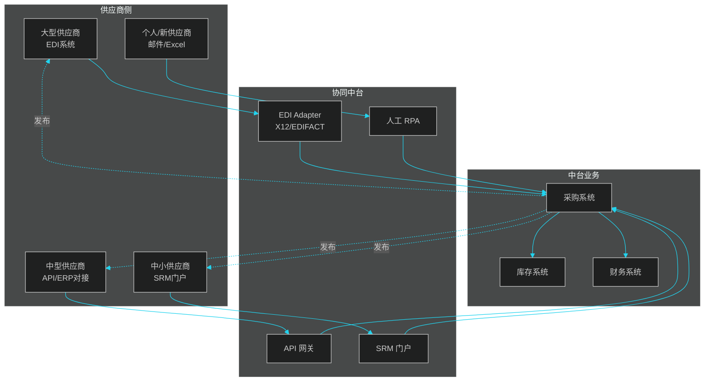

### 13.6.3 客户互联架构

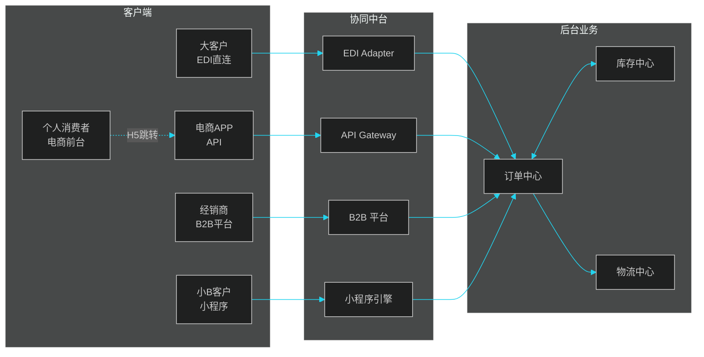

### 13.6.4 案例一：苹果的供应商互联

**核心特征**：**严苛的供应商准入与全流程管控**

| 维度 | 苹果的做法 |
|------|----------|
| **供应商数量** | 严格控制，全球核心供应商 < 200 家 |
| **互联方式** | 自研 EPM（Extranet for Partner Management） |
| **数据共享** | 排产计划、物料需求、库存、生产进度 |
| **质量管控** | 供应商驻场工程师 + 质量数据实时回传 |
| **付款** | 自有金融体系，部分供应链金融 |
| **效果** | 准时交付率 95%+，新机发布排产精确到天 |

**苹果的供应商协同要点**：
- **排产对齐**：苹果直接给到供应商未来 12-18 个月的预测
- **组件级追踪**：每个关键组件（屏幕、芯片、摄像头）有专属生产计划
- **驻场工程师**：苹果在每家核心供应商派驻工程师
- **审计与合规**：所有供应商必须通过 Apple Supplier Responsibility Audit

### 13.6.5 案例二：沃尔玛的供应商互联（CPFR）

**核心特征**：**CPFR 协同规划、预测与补货**

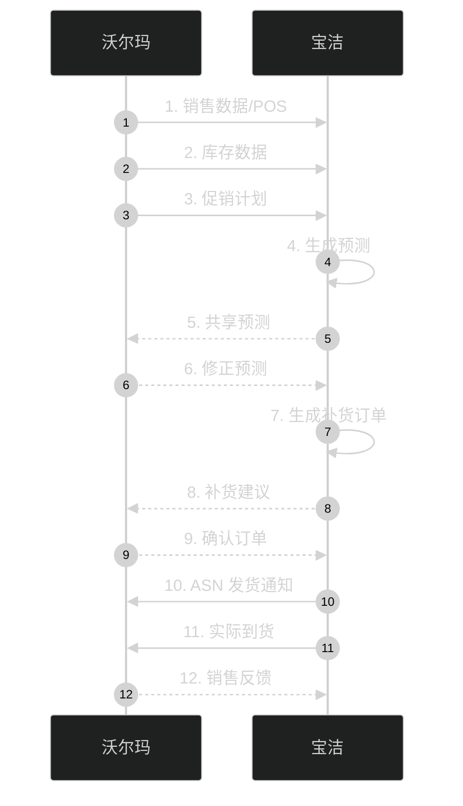

**沃尔玛-宝洁 CPFR 的关键指标**：
- 缺货率下降 **30%**
- 库存周转率提升 **40%**
- 补货周期从 **14 天**缩短到 **3 天**
- 双方共同节省成本 **数十亿美元**

**沃尔玛的 EDI 体系**：
- 全美 80% 供应商通过 EDI 接入
- 12 大类报文（850、856、810、855、846 等）
- AS2 加密传输 + 数字证书
- 每天处理 **数百万** EDI 报文

### 13.6.6 案例三：亚马逊的供应商互联（MWS/SP-API）

**核心特征**：**FBA 体系 + 开放 API 生态**

| 服务 | 描述 |
|------|------|
| **FBA（Fulfillment by Amazon）** | 卖家把货发到亚马逊仓库，亚马逊代发货 |
| **Seller Central** | 卖家后台（Web 门户） |
| **MWS / SP-API** | 卖家系统对接 API（订单、库存、发货、报告） |
| **Vendor Central** | 供应商（直采模式）后台 |
| **Supply Chain Platform** | 端到端供应链服务（仓储 + 物流） |
| **Amazon Pay** | 支付开放 |

**亚马逊的供应商管理哲学**：
- **"客户至上"**：所有数据指标以客户体验为导向
- **数据驱动**：实时仪表盘、季度业务回顾（QBR）
- **自动化优先**：缺货预警、补货建议自动化
- **严苛 KPI**：OTD（按时交付率）、PPL（采购价格水平）、CCDR（客户联系缺陷率）

### 13.6.7 三家企业的互联对比

| 维度 | 苹果 | 沃尔玛 | 亚马逊 |
|------|------|--------|--------|
| **核心模式** | OEM 代工 + 严控 | CPFR 协同 | FBA + 开放平台 |
| **互联方式** | 自研 EPM + EDI | EDI（X12）+ RosettaNet | API + 卖家后台 |
| **供应商数量** | 少而精（< 200） | 多（数万家） | 海量（百万级） |
| **数据共享深度** | 极深（生产排程） | 深（CPFR 9 步流程） | 中（订单/库存为主） |
| **结算** | 严苛账期 + 自有金融 | EDI 810 + 电子付款 | 平台代收 + 周结 |
| **质量管控** | 驻场 + 审计 | 验厂 + 测试报告 | 平台评价 + 抽检 |
| **创新亮点** | 组件级追踪 | 联合预测 | FBA 飞轮 |

### 13.6.8 上下游互联的安全设计

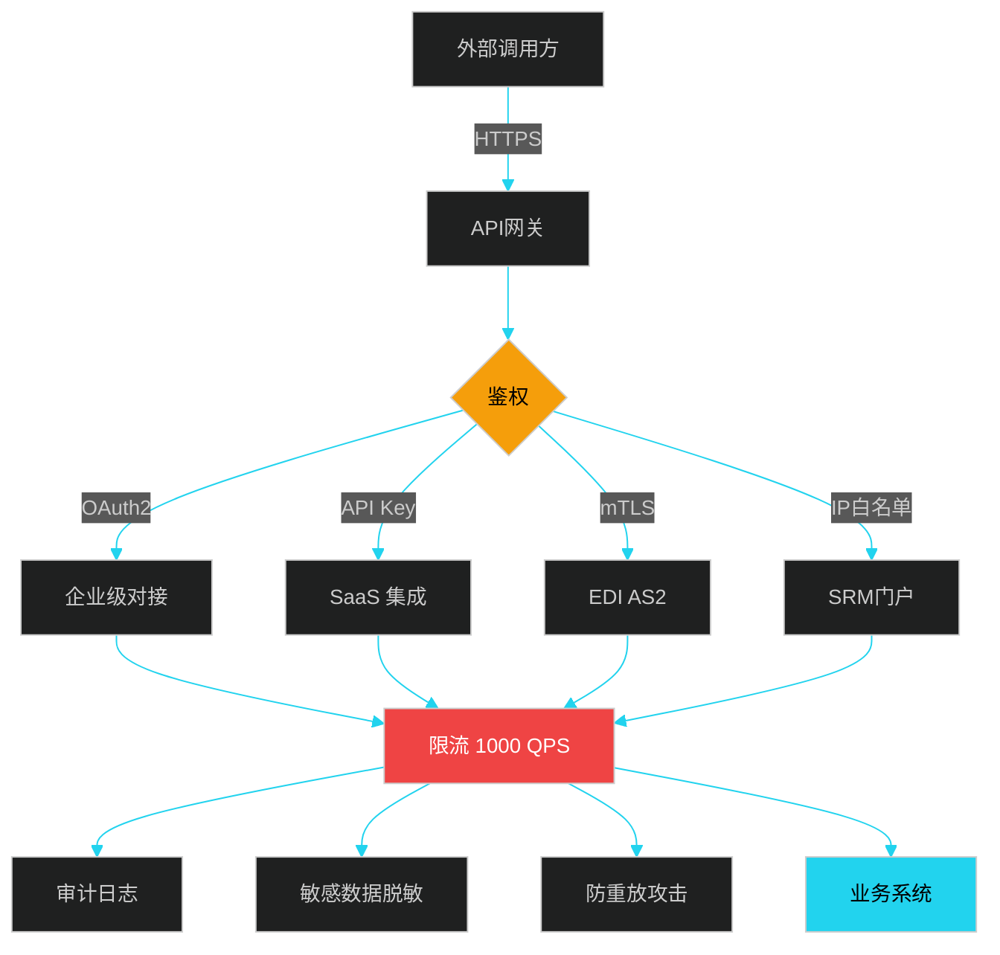

**安全设计的 5 大要点**：

| 安全维度 | 措施 | 说明 |
|---------|------|------|
| **传输安全** | TLS 1.2+、mTLS、AS2 加密 | 防窃听、防中间人 |
| **身份认证** | OAuth2、JWT、mTLS、IP 白名单 | 防未授权访问 |
| **访问控制** | RBAC、按接口粒度授权 | 最小权限原则 |
| **数据安全** | 字段级脱敏、加密存储、密钥轮换 | 防数据泄露 |
| **审计合规** | 全量请求日志、不可篡改 | 满足 SOX、GDPR |

### 13.6.9 上下游互联的 SLA 设计

| 等级 | 接入方 | 响应时间 | 通知方式 | 故障赔付 |
|------|--------|---------|---------|---------|
| **P0 战略级** | 苹果、沃尔玛、宝洁 | < 100ms | 7×24 运维 + 大客户经理 | 99.99% SLA |
| **P1 重要级** | 核心供应商、TOP 承运商 | < 500ms | 7×24 运维 | 99.9% SLA |
| **P2 普通级** | 一般合作伙伴 | < 2s | 工作时间 | 99% SLA |
| **P3 自助级** | 中小卖家、个体 | 异步 | 邮件 / 工单 | 无 SLA |

---

## 13.7 中台治理与反模式

### 13.7.1 中台治理委员会

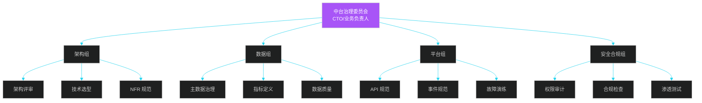

### 13.7.2 中台的 6 大反模式

| 反模式 | 表现 | 后果 | 解决 |
|--------|------|------|------|
| **大泥球** | 中台服务互相调用链路过长 | 性能差、故障扩散 | 限定调用层级 ≤ 3 |
| **过度抽象** | 抽象出"万能订单" | 学习成本高、需求响应慢 | 80% 用例 + 20% 扩展点 |
| **数据沼泽** | 数据中台堆数据无治理 | 数据找不到、口径混乱 | 指标平台 + 数据血缘 |
| **中台中心化** | 所有业务强依赖中台 | 中台故障全停 | 关键能力本地降级 |
| **僵尸服务** | 中台服务无人维护 | 故障无人响应 | 服务 Owner 制 + SLA |
| **技术栈分裂** | 中台用 5 种语言 | 维护成本高 | 收敛 1-2 套主流栈 |

### 13.7.3 中台成熟度模型

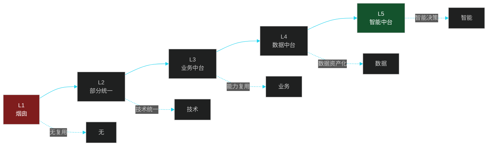

| 级别 | 名称 | 核心特征 | 典型企业 |
|------|------|---------|---------|
| L1 | 烟囱系统 | 各业务系统独立 | 初创公司 |
| L2 | 部分统一 | 统一技术栈、公共组件 | 成长型企业 |
| L3 | 业务中台 | 五大业务中心、服务化 | 阿里、京东 |
| L4 | 数据中台 | 主数据、指标、数据 API | 字节、美团 |
| L5 | 智能中台 | 决策自动化、数字孪生 | 亚马逊、特斯拉 |

---

## 本章小结

供应链协同中台是**多业务域、多合作伙伴**发展到一定规模的必然产物。它的核心价值是把**通用能力、数据资产、技术平台**抽取沉淀，对内支持多业务前台，对外支持上下游互联。

**13.1 协同中台架构**：业务中台 + 数据中台 + 技术中台的三层分治，避免传统烟囱系统的 N×M 集成问题。
**13.2 业务中台设计**：商品、订单、库存、结算、调度五大中心，通过"通用服务 + 业务上下文"模式屏蔽前台差异。
**13.3 数据中台**：主数据治理 + ODS/DWD/DWS/ADS 分层建模 + 指标平台，让数据成为可复用的资产。
**13.4 API 网关与协议**：REST 适合外部开放、gRPC 适合内部高性能、EDI 适合国际 B2B。
**13.5 事件驱动架构**：通过 Kafka/RocketMQ 异步解耦，配合 CQRS + 事件溯源实现复杂业务。
**13.6 上下游互联**：苹果的严控、沃尔玛的 CPFR、亚马逊的开放平台是三种典型范式。

**核心工程哲学**：
- 中台不是技术问题，是**治理问题**（委员会、Owner、SLA）
- 中台不是万能解药，**没有 3+ 业务复用不要抽**
- 中台是渐进式演进，不是大爆炸重构

---

## 面试高频问题

**1. 什么是中台？为什么要建设中台？中台和微服务有什么区别？**

参考答案要点：① 中台是抽取通用能力、数据资产、技术平台，对内对外统一服务的中间层。② 建设中台的核心原因是解决"系统林立、数据孤岛、重复建设"问题，提升业务响应速度。③ 中台 vs 微服务：中台是**业务/数据/组织的整合**，微服务是**技术架构的拆分**；中台关心"能力复用"，微服务关心"服务独立部署"；微服务是中台实现的一种技术手段，但中台还包含组织、数据、治理。

**2. 业务中台如何划分"通用能力"与"业务能力"？**

参考答案要点：① **通用能力**指 3+ 业务都需要的原子能力（如商品查询、订单创建、库存预占），归中台；② **业务能力**指特定业务的特有逻辑（如促销、组合套餐、特殊优惠），归前台。③ 判断标准：能否用 1 套 API 满足 80% 业务，且 20% 差异可通过配置/扩展点实现。④ 反例：抽象出"超通用订单"导致学习成本上升，反而拖慢业务。

**3. 解释一下 ODS、DWD、DWS、ADS 四层数据仓库模型。**

参考答案要点：① **ODS**（贴源层）：与源系统 1:1 同步，保留原始数据，用于数据回溯。② **DWD**（明细层）：清洗、标准化、维度关联后的明细数据，ER 模型/维度建模。③ **DWS**（汇总层）：按主题（如每日每仓每 SKU）汇总的宽表。④ **ADS**（应用层）：直接面向报表/指标/API 的数据。⑤ 分层目的是**数据复用、计算下沉、口径统一、问题定位**。

**4. 什么是事件驱动架构（EDA）？和事件溯源（ES）有什么区别？**

参考答案要点：① EDA 是通过消息中间件（Kafka/RocketMQ）实现系统解耦、异步通信，**业务库仍是状态来源**。② ES 是存储事件流而非当前状态，**状态由事件 replay 得到**。③ EDA 关注"系统解耦"，ES 关注"状态可追溯"。④ 实际中常组合使用：ES + CQRS（写事件流 + 读库订阅）。⑤ ES 适合金融、审计、追溯场景，复杂度高。

**5. 同步调用和事件驱动如何选择？**

参考答案要点：① **同步调用**适合：链路短、要求强一致、性能不敏感、调试简单（如支付扣款）。② **事件驱动**适合：链路长（>3 个服务）、可容忍最终一致、要求高并发、解耦要求高（如订单创建后通知发货）。③ 实际系统多采用"**同步编排 + 事件广播**"的混合模式：核心链路同步调用保证一致性，旁支业务用事件异步处理。④ 注意幂等性、消息顺序、事务消息、死信处理等工程问题。

**6. 苹果、沃尔玛、亚马逊的供应商互联模式有何不同？为什么？**

参考答案要点：① **苹果**——OEM 严控模式，自研 EPM 系统深度对接核心供应商，**少而精、强管控、驻场工程师**，适合高科技产品对质量/节奏的极致要求。② **沃尔玛**——CPFR 协同模式，与宝洁等大供应商联合预测补货，**多而广、共创预测、EDI 标准**，适合零售业对库存周转的极致要求。③ **亚马逊**——FBA 开放平台模式，提供 API + Seller Central，**海量接入、自助为主、平台抽佣**，适合电商生态对规模的要求。④ 三者不同本质是**业务模式不同**：苹果是"产品公司"，沃尔玛是"零售商"，亚马逊是"平台公司"。

**7. 什么是 CQRS？什么场景适合使用？**

参考答案要点：① CQRS（Command Query Responsibility Segregation）——**读写分离**架构，写模型保证强一致，读模型针对查询优化（如宽表、聚合）。② 配合事件溯源：写模型产生事件，读模型订阅事件更新。③ 适用场景：①读写比例悬殊（如订单状态变更少但查询多）；②查询维度多变（不同业务查不同字段）；③性能要求高（读库可独立扩展）；④审计要求（写历史全保留）。④ 代价：复杂度提升、数据同步延迟（最终一致）、运维成本上升。

**8. 供应链协同中台建设中常见的"反模式"有哪些？**

参考答案要点：① **大泥球**：服务间调用链路过长、互相依赖复杂，导致性能差、故障扩散。② **过度抽象**：抽象出"万能订单"等过度通用的模型，反而增加学习成本。③ **数据沼泽**：数据中台堆数据无治理，找不到数据、口径混乱。④ **中台中心化**：所有业务强依赖中台，中台故障全停，应有降级方案。⑤ **僵尸服务**：中台服务无人维护，需求堆压。⑥ **技术栈分裂**：中台用 5 种语言，难以维护。⑦ 治理建议：成立中台治理委员会、Owner 制、定期重构、故障演练。
