# 第 14 章 供应链中的大数据与 AI

> 本章定位：在第 1 章"5 层架构"中提到的"智能层"基础上，专题深入**大数据与 AI 在供应链中的落地**。覆盖销量预测、智能补货、路径优化、异常检测、大模型应用 5 大场景。每一节都遵循"业务问题 → 数学建模 → 算法/代码 → 工业案例"的四段式结构。
>
> **学习建议**：本章数学公式较多，建议先看 11 章"需求预测"和 7 章"补货模型"再回看本章，理解会加深一档。代码片段用 Python 风格伪代码，工程师可直接落地。

---

## 14.1 AI 在供应链中的应用全景

### 14.1.1 为什么供应链是 AI 落地的"天然良田"

供应链系统具备 AI 落地的 4 大特征：

| 特征 | 说明 | 数据体现 |
|------|------|----------|
| **数据丰富** | 订单、库存、运输、IoT 全链路数据 | 头部企业日均 TB 级 |
| **场景明确** | 预测/优化/检测是结构化问题 | KPI 可量化 |
| **价值可衡量** | 库存周转、缺货率、运费成本 | 1% 优化 = 千万级收益 |
| **可闭环** | 决策 → 执行 → 反馈 → 再训练 | 强化学习天然适配 |

### 14.1.2 AI 应用全景图

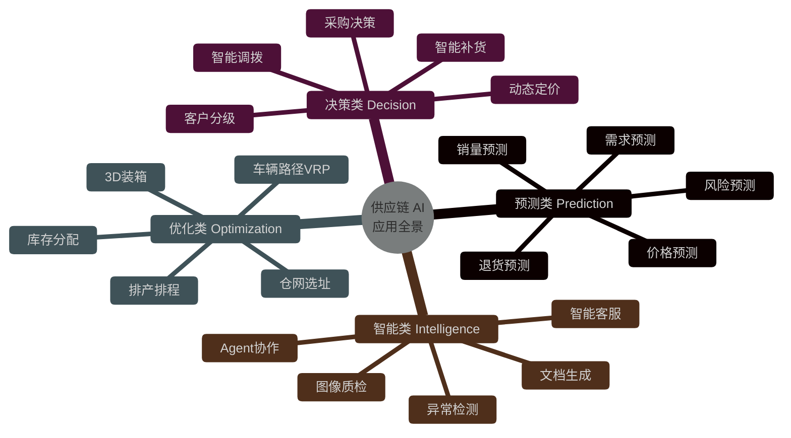

### 14.1.3 四类应用的本质差异

| 类别 | 核心问题 | 典型算法 | 输入 | 输出 | 评估指标 |
|------|---------|---------|------|------|---------|
| **预测类** | 未来是多少 | ARIMA / Prophet / LSTM / Transformer | 时序 + 协变量 | 数值序列 | MAPE / RMSE |
| **决策类** | 该怎么做 | 强化学习 / 规则引擎 / 决策树 | 状态 + 目标 | 动作指令 | ROI / 服务水平 |
| **优化类** | 怎么最优 | OR-Tools / 启发式 / 元启发式 | 约束 + 目标 | 方案/路径 | 目标函数值 |
| **智能类** | 是什么/为什么 | LLM / 异常检测 / 多模态 | 多模态数据 | 文本/标签/动作 | 准确率/召回率 |

### 14.1.4 AI 落地的 4 个阶段

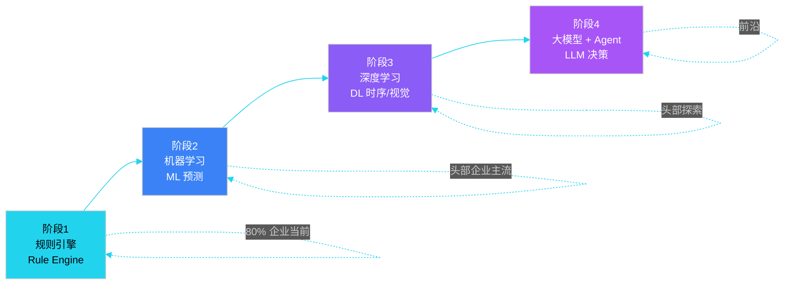

**关键洞察**：90% 的供应链 AI 项目仍停留在阶段 1-2，阶段 3-4 投入大、风险高，应在场景 ROI 明确后谨慎投入。

---

## 14.2 销量预测

销量预测是供应链 AI 的"一号场景"——预测准了，后续补货、排产、调度全对；预测错了，全盘崩塌。

### 14.2.1 预测问题建模

给定历史销量序列 $\\{y_1, y_2, ..., y_T\\}$，预测未来 $H$ 步的销量 $\\{\hat{y}_{T+1}, ..., \hat{y}_{T+H}\\}$。

**核心评估指标**：

| 指标 | 公式 | 适用场景 |
|------|------|---------|
| **MAPE** | $\frac{1}{n}\sum \left| \frac{y_i - \hat{y}_i}{y_i} \right| \times 100\%$ | 量纲统一 |
| **WMAPE** | $\frac{\sum \lvert y_i - \hat{y}_i \rvert}{\sum y_i}$ | 解决零销量问题 |
| **RMSE** | $\sqrt{\frac{1}{n}\sum (y_i - \hat{y}_i)^2}$ | 惩罚大误差 |
| **Pinball Loss** | 分位数损失 | 概率预测 |

### 14.2.2 经典方法：ARIMA 与 Prophet

**ARIMA(p, d, q)** 适合平稳时序，三参数含义：

- **p**：自回归阶数
- **d**：差分次数（去趋势）
- **q**：移动平均阶数

**Prophet（Facebook 开源）** 适合业务型时序，将序列分解为：

$$
y(t) = g(t) + s(t) + h(t) + \epsilon_t
$$

- $g(t)$：趋势项（线性/逻辑斯蒂）
- $s(t)$：季节项（年/周/日）
- $h(t)$：节假日效应
- $\epsilon_t$：残差

### 14.2.3 深度学习方法：LSTM 与 Transformer

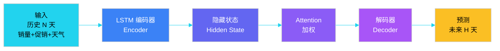

**LSTM vs Transformer 对比**：

| 维度 | LSTM | Transformer (Informer/Autoformer) |
|------|------|-----------------------------------|
| 序列长度 | 短 (< 100 步) | 长 (1000+ 步) |
| 训练速度 | 慢（串行） | 快（并行 + Attention） |
| 长依赖 | 弱 | 强（Self-Attention） |
| 可解释性 | 中 | 中（Attention 可视化） |
| 工业落地 | 成熟 | 前沿 |

### 14.2.4 LSTM 销量预测伪代码

```python
# ============ LSTM 销量预测模型 ============

class SalesLSTM(nn.Module):
    """
    输入: (batch, seq_len, n_features)
          seq_len=90 天, n_features=销量+促销+价格+天气+星期
    输出: (batch, horizon) 未来 H 天的销量
    """
    def __init__(self, n_features, hidden_size=128, num_layers=2, horizon=14):
        super().__init__()
        self.lstm = nn.LSTM(
            input_size=n_features,
            hidden_size=hidden_size,
            num_layers=num_layers,
            batch_first=True,
            dropout=0.2
        )
        self.attention = nn.Linear(hidden_size, 1)  # Attention 权重
        self.fc = nn.Linear(hidden_size, horizon)    # 映射到 horizon 步

    def forward(self, x):
        # x: (B, T, F)
        lstm_out, _ = self.lstm(x)              # (B, T, H)
        attn_w = torch.softmax(self.attention(lstm_out), dim=1)  # (B, T, 1)
        context = (lstm_out * attn_w).sum(dim=1)               # (B, H)
        return self.fc(context)                                # (B, horizon)


def train_pipeline():
    """端到端训练流程"""
    # 1. 数据准备
    train_loader = DataLoader(
        SalesDataset(window=90, horizon=14),  # 用过去 90 天预测未来 14 天
        batch_size=256, shuffle=True
    )

    # 2. 模型与优化器
    model = SalesLSTM(n_features=12, horizon=14)
    optimizer = torch.optim.Adam(model.parameters(), lr=1e-3)
    criterion = nn.MSELoss()

    # 3. 训练循环
    for epoch in range(100):
        for x, y in train_loader:
            pred = model(x)                        # (B, 14)
            loss = criterion(pred, y)              # MSE 损失
            optimizer.zero_grad()
            loss.backward()
            optimizer.step()

    # 4. 评估（用 WMAPE 替代 MAPE，处理零销量）
    wmape = (pred - y).abs().sum() / y.abs().sum()
    return model, wmape
```

### 14.2.5 工业案例：京东销量预测

**业务背景**：京东自营 SKU 数百万级，预测粒度到"仓-品-天"，且要兼顾长尾 SKU 数据稀疏问题。

**核心做法**：

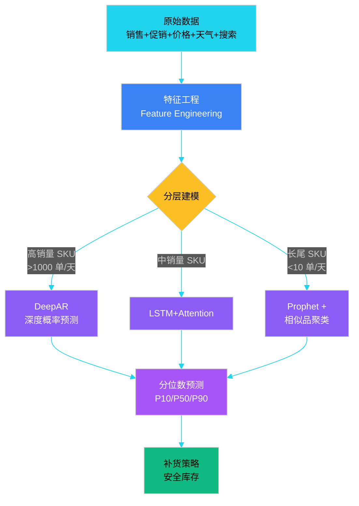

**关键指标**：

- 头部 SKU 预测 WMAPE：**8-12%**
- 长尾 SKU 预测 WMAPE：**25-35%**（用相似品聚类 + 迁移学习缓解）
- 系统支撑**亿级参数**模型在线推理，延迟 < 100ms

### 14.2.6 工业案例：亚马逊 Anticipatory Shipping

亚马逊 2014 年获得**预判发货（Anticipatory Shipping）专利**：在用户**真正下单前**，把商品提前发到离用户最近的仓库。

**核心算法**：

1. 提前 2-4 周预测用户购买意向
2. 模型输入：浏览、加购、搜索、wishlist、年龄、城市、季节
3. 模型输出：用户-商品-仓的预判发货指令
4. 关键约束：预测错误时，**逆向物流成本仍低于正向提前发货的运费节省**

**效果**：

| 指标 | 提升 |
|------|------|
| Prime 2 日达达成率 | +15% |
| 平均送达时间 | -1.2 天 |
| 客户满意度 | +8% |

---

## 14.3 智能补货

补货决策是供应链的"心脏"——补多了积压，补少了缺货。AI 时代已经从"经验订货"走向"算法驱动"。

### 14.3.1 传统订货点 vs 智能补货

| 维度 | 传统订货点 (s, Q) | 智能补货 (RL/DL) |
|------|------------------|------------------|
| 模型假设 | 需求独立、平稳 | 非平稳、多变量、长依赖 |
| 决策依据 | 当前库存 + 历史均值 | 状态 + 上下文（促销/天气/价格） |
| 优化目标 | 缺货率 + 周转率 | 多目标 Pareto |
| 适应性 | 需人工调参 | 自动学习、在线更新 |
| 实现复杂度 | 低（公式） | 高（工程 + 算法） |
| 适用场景 | 长尾、低频、稳态 | 头部、高频、动态 |

**传统 (s, Q) 公式**：

$$
Q = \sqrt{\frac{2DS}{H}} \quad \text{（经济订货量 EOQ）}
$$

$$
s = \mu_{LT} + z \cdot \sigma_{LT} \quad \text{（再订货点 ROP）}
$$

### 14.3.2 智能补货的强化学习建模

```mermaid
%%{init: {'theme':'dark','themeVariables':{'primaryColor':'#1f2937','primaryTextColor':'#f9fafb','primaryBorderColor':'#22d3ee','lineColor':'#22d3ee','fontSize':'14px'}}}%%
flowchart LR
    A[环境<br/>Environment] -->|状态 s_t| B[智能体<br/>Agent]
    B -->|动作 a_t<br/>补货量| A
    A -->|奖励 r_t<br/>-缺货成本-库存成本| B
    A -->|下一状态 s_{t+1}| B

    style A fill:#3b82f6,color:#fff
    style B fill:#fbbf24,color:#000
```

**关键定义**：

- **状态 $s_t$**：`[当前库存, 在途库存, 历史 N 天销量, 价格, 促销, 竞品价格, 星期, 天气]`
- **动作 $a_t$**：补货量（连续 0-10000）
- **奖励 $r_t$**：$-(缺货损失 + 持有成本 + 补货成本)$

### 14.3.3 强化学习补货伪代码（DDPG）

```python
# ============ DDPG 智能补货 ============

class ReplenishmentEnv:
    """补货环境"""
    def __init__(self, sku_config):
        self.sku = sku_config
        self.reset()

    def reset(self):
        self.inventory = self.sku.initial_stock
        self.in_transit = []
        self.day = 0
        return self._get_state()

    def _get_state(self):
        # 状态：库存 + 在途 + 30天销量 + 促销 + 星期
        return np.concatenate([
            [self.inventory / 1000.0],            # 归一化库存
            [sum(self.in_transit) / 1000.0],      # 归一化在途
            self.sku.sales_history[-30:] / 100.0, # 30 天销量
            [self.sku.is_promotion],              # 是否促销
            [self.day % 7 / 7.0]                  # 星期
        ])

    def step(self, action):
        """action: 补货量 (0, max_order)"""
        order_qty = int(action * self.sku.max_order)

        # 1. 在途到达
        arrived = self.in_transit.pop(0) if self.in_transit else 0
        self.inventory += arrived

        # 2. 销售出库
        demand = self.sku.sample_demand()  # 采样真实需求
        sold = min(demand, self.inventory)
        self.inventory -= sold
        stockout = max(0, demand - sold)   # 缺货量

        # 3. 下达新单
        if order_qty > 0:
            lead_time = self.sku.sample_lead_time()
            self.in_transit.extend([0] * (lead_time - 1) + [order_qty])

        # 4. 奖励
        holding_cost = self.inventory * 0.1
        stockout_cost = stockout * 5.0      # 缺货惩罚高
        order_cost = 50.0 if order_qty > 0 else 0
        reward = -(holding_cost + stockout_cost + order_cost)

        self.day += 1
        done = self.day >= 365
        return self._get_state(), reward, done, {}


class DDPGAgent:
    """DDPG: Actor-Critic 连续动作"""
    def __init__(self, state_dim, action_dim):
        self.actor = Actor(state_dim, action_dim)      # 策略网络
        self.critic = Critic(state_dim, action_dim)    # 价值网络
        self.replay = ReplayBuffer(capacity=100000)

    def train_step(self, env, episodes=1000):
        for ep in range(episodes):
            state = env.reset()
            total_reward = 0
            for t in range(365):
                # Actor 选择动作 + 探索噪声
                action = self.actor(state) + np.random.normal(0, 0.1, size=action_dim)
                next_state, reward, done, _ = env.step(action)

                self.replay.push(state, action, reward, next_state, done)
                self._update_networks()                # 从 replay 采样更新
                state, total_reward = next_state, total_reward + reward
```

### 14.3.4 工业案例：7-Eleven 智能补货

**业务背景**：7-Eleven 日本 2 万家门店，3500 个 SKU，每个 SKU 必须**每日订货**，且要兼顾"畅销不缺货、长尾不积压"。

**核心做法**：

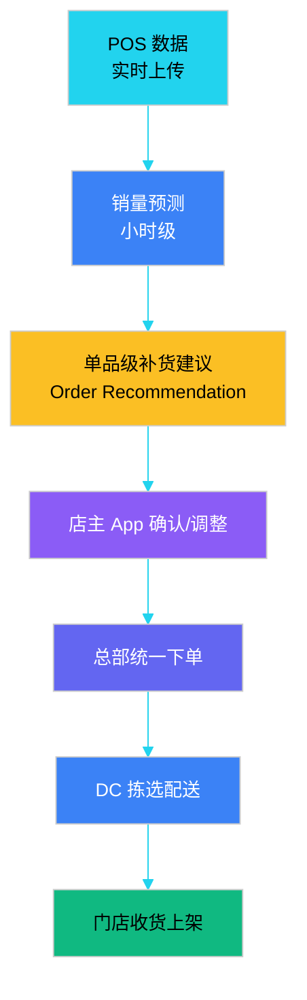

**关键创新**：

| 创新 | 说明 | 效果 |
|------|------|------|
| 单品预测 | 每 SKU 每店每天预测 | 预测精度提升 30% |
| 天气联动 | 接入气象数据 | 雨天便当销量预测 +20% |
| 店主确认 | 算法建议 + 人工微调 | 接受率 80%+ |
| 凌晨配送 | 夜间配送到店 | 早上 7 点前满货架 |

**效果**：

- 缺货率：行业 5-8% → **0.5%**
- 库存周转：**12 次/年**（行业平均 8 次）
- 畅销品售罄：30% → **5%**

---

## 14.4 路径与网络优化

运输成本占供应链总成本的 **20-40%**，路径优化的 1% 提升 = 千万级成本节省。

### 14.4.1 经典优化问题

| 问题 | 描述 | 难度 | 工业算法 |
|------|------|------|---------|
| **TSP** | 旅行商问题（单车辆） | NP-Hard | 动态规划 / 启发式 |
| **VRP** | 车辆路径（多车辆） | NP-Hard | Clarke-Wright 节约 |
| **CVRP** | 带容量约束 | NP-Hard | OR-Tools / Gurobi |
| **VRPTW** | 带时间窗 | NP-Hard | 禁忌搜索 / ALNS |
| **3D-BPP** | 三维装箱 | NP-Hard | 极角法 / 启发式 |
| **PDPTW** | 动态取送货 | NP-Hard | 滚动时域优化 |

### 14.4.2 路径优化问题建模

给定：N 个客户点，K 辆车，每车容量 Q，距离矩阵 $d_{ij}$，时间窗 $[a_i, b_i]$。

**目标函数**：

$$
\min \sum_{k=1}^{K} \sum_{(i,j) \in R_k} d_{ij}
$$

**约束**：

- 每个客户被访问恰好一次
- 车辆容量 $\leq Q$
- 服务时间在 $[a_i, b_i]$ 内
- 车辆从仓库出发并返回

### 14.4.3 蚁群算法伪代码

```python
# ============ 蚁群算法 (ACO) 求解 TSP ============

class AntColonyOptimizer:
    def __init__(self, distance_matrix, n_ants=50, n_iter=200):
        self.dist = distance_matrix
        self.n = len(distance_matrix)       # 城市数
        self.n_ants = n_ants
        self.n_iter = n_iter
        self.pheromone = np.ones((self.n, self.n))  # 信息素矩阵
        self.eta = 1.0 / (distance_matrix + 1e-10)  # 启发因子（距离倒数）

    def solve(self):
        best_path, best_cost = None, float('inf')

        for it in range(self.n_iter):
            paths = []  # 本轮所有蚂蚁的路径
            for ant in range(self.n_ants):
                path = self._construct_path()
                cost = self._path_cost(path)
                paths.append((path, cost))
                if cost < best_cost:
                    best_path, best_cost = path, cost

            # 更新信息素
            self._update_pheromone(paths)
            print(f"Iter {it}: best={best_cost:.2f}")

        return best_path, best_cost

    def _construct_path(self):
        """单只蚂蚁构造一条路径"""
        path = [0]              # 从仓库出发
        visited = {0}
        for _ in range(self.n - 1):
            i = path[-1]
            # 转移概率：信息素^α * 启发^β
            probs = []
            for j in range(self.n):
                if j in visited:
                    probs.append(0)
                else:
                    probs.append(self.pheromone[i][j]**2 * self.eta[i][j]**5)
            probs = np.array(probs) / sum(probs)
            nxt = np.random.choice(self.n, p=probs)
            path.append(nxt)
            visited.add(nxt)
        return path + [0]        # 返回仓库

    def _update_pheromone(self, paths):
        """信息素更新：挥发 + 增强"""
        self.pheromone *= 0.5   # 挥发
        for path, cost in paths:
            for i, j in zip(path[:-1], path[1:]):
                self.pheromone[i][j] += 1.0 / cost
```

### 14.4.4 主流路径优化算法对比

| 算法 | 适用规模 | 求解质量 | 速度 | 工业成熟度 |
|------|---------|---------|------|-----------|
| **精确算法**（分支定界） | < 50 节点 | 最优 | 慢 | 学术 |
| **Clarke-Wright 节约** | 100-500 节点 | 较优 | 快 | 高 |
| **禁忌搜索 (TS)** | 500-2000 节点 | 优 | 中 | 高 |
| **模拟退火 (SA)** | 500-2000 节点 | 优 | 中 | 中 |
| **蚁群 (ACO)** | 200-1000 节点 | 优 | 中 | 中 |
| **ALNS** | 1000-5000 节点 | 优 | 中 | 高 |
| **强化学习 (DACT)** | 1000+ 节点 | 中-优 | 训练慢 | 前沿 |
| **OR-Tools** | 500-1000 节点 | 优 | 快 | 工业首选 |

### 14.4.5 工业案例：UPS ORION 系统

**业务背景**：UPS 每天 2000 万包裹、5.5 万辆车、200 个国家，路径优化的 1 英里 = 1 亿美元/年。

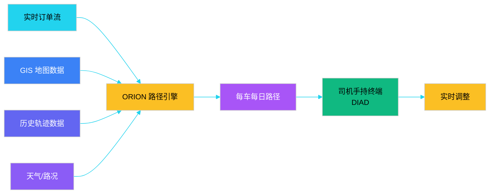

**ORION（On-Road Integrated Optimization and Navigation）**：

| 维度 | 数据 |
|------|------|
| 上线时间 | 2012 年（10+ 年研发） |
| 投入 | 10 亿美元+ |
| 每天决策 | 30 亿次路径计算 |
| 单车计算 | 早上出发前 2-4 分钟 |
| 实时调整 | 动态重路由 |
| 节省 | 1.85 亿英里/年 |
| 经济价值 | **3-4 亿美元/年** |

**核心算法**：基于**禁忌搜索 + 局部搜索**的混合启发式，结合 OR-Tools 求解器，每 30 秒重新优化 100 辆车的路径。

---

## 14.5 异常检测

供应链的"看不见的损失"——**异常订单、欺诈订单、设备故障、库存漂移**——是利润的隐形杀手。AI 异常检测是"控制塔"的眼睛。

### 14.5.1 异常类型与业务影响

| 异常类型 | 业务表现 | 经济损失 | 检测难度 |
|---------|---------|---------|---------|
| **刷单/欺诈订单** | 异常批量下单、退货 | 退款 + 库存占用 | 中 |
| **黄牛/恶意占库** | 短时集中抢货 | 真实客户流失 | 中 |
| **设备故障** | IoT 数据异常 | 停机损失 | 高 |
| **库存漂移** | 账面 ≠ 实存 | 盘亏 | 中 |
| **运输异常** | 温度/湿度/震动偏离 | 货损 | 中 |
| **预测异常** | 销量突变（疫情/爆品） | 缺货/积压 | 高 |
| **合规风险** | 证件过期、超期 | 监管处罚 | 低 |

### 14.5.2 异常检测方法分类

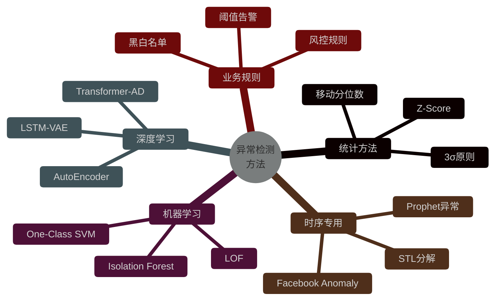

**方法对比**：

| 方法 | 数据要求 | 训练速度 | 异常解释 | 适用场景 |
|------|---------|---------|---------|---------|
| **3σ** | 无 | 0 | 弱 | 单变量稳态 |
| **Isolation Forest** | 中 | 快 | 中 | 通用首选 |
| **AutoEncoder** | 大 | 慢 | 弱 | 多维复杂 |
| **Prophet-Anomaly** | 中 | 快 | 强 | 时序 + 业务 |
| **LLM + RAG** | 少 | 0 | 强 | 业务语义 |

### 14.5.3 Isolation Forest 异常检测伪代码

```python
# ============ Isolation Forest 异常订单检测 ============

import numpy as np
from sklearn.ensemble import IsolationForest

class OrderAnomalyDetector:
    """
    异常订单检测
    特征：订单金额、商品数、用户龄、下单时段、收货地址距离
    """

    def __init__(self):
        # 100 棵树，5% 异常比例
        self.model = IsolationForest(
            n_estimators=100,
            max_samples=256,
            contamination=0.05,    # 5% 订单视为异常
            random_state=42
        )

    def extract_features(self, order):
        """特征工程"""
        return [
            order.amount,                          # 金额
            order.item_count,                      # 商品数
            order.user_age_days,                   # 用户龄（天）
            order.hour_of_day,                     # 下单时段
            order.address_distance_km,             # 收货地址距离
            order.payment_method_code,             # 支付方式
            order.device_fingerprint_risk,         # 设备风险分
            order.ip_risk_score,                   # IP 风险分
            order.has_promotion * 1,               # 是否促销单
            order.repeat_address_count             # 同一地址重复单数
        ]

    def train(self, historical_orders):
        X = np.array([self.extract_features(o) for o in historical_orders])
        self.model.fit(X)
        return self

    def predict(self, order):
        """返回 -1 异常, 1 正常, score 越低越异常"""
        x = np.array(self.extract_features(order)).reshape(1, -1)
        label = self.model.predict(x)[0]
        score = self.model.decision_function(x)[0]
        return {
            "is_anomaly": label == -1,
            "anomaly_score": float(score),   # 越小越异常
            "reasons": self._explain(order, score)
        }

    def _explain(self, order, score):
        """可解释性：找出最异常的维度"""
        reasons = []
        if order.amount > 10000:
            reasons.append("大额订单")
        if order.user_age_days < 1:
            reasons.append("新用户首单")
        if order.hour_of_day in [2, 3, 4]:
            reasons.append("深夜下单")
        if order.ip_risk_score > 0.8:
            reasons.append("高风险 IP")
        return reasons
```

**Isolation Forest 原理**：

> 一棵树随机选特征、随机选切分值递归切分。**异常点**因为"与众不同"，平均几步就能被孤立；**正常点**需要切很多次。异常分数 = 路径长度的归一化均值，越短越异常。

### 14.5.4 时序异常检测流程

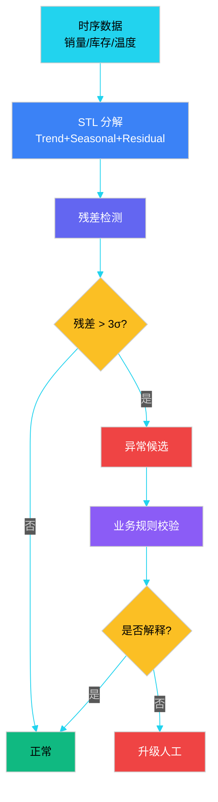

### 14.5.5 工业案例：京东异常订单检测

**业务背景**：京东日均千万级订单，每年因欺诈、退货、刷单损失**数十亿**。要求实时检测（< 200ms）且误杀率 < 0.5%。

**多层检测体系**：

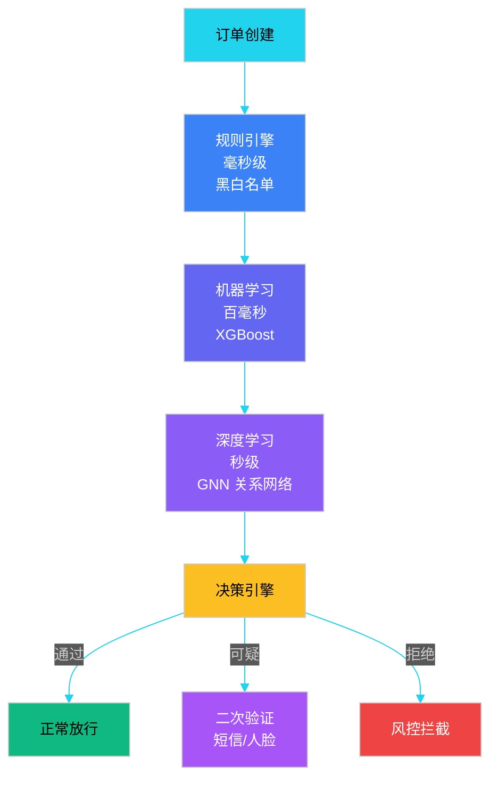

**关键技术**：

| 技术 | 应用 | 效果 |
|------|------|------|
| **图神经网络 GNN** | 用户-设备-IP-收货地址 4 维关系 | 团伙欺诈检出率 +40% |
| **时序行为序列** | 30 天用户行为序列 Transformer | 撞库攻击检出 +60% |
| **设备指纹** | 浏览器/手机硬件指纹 | 黑产设备库 5 亿条 |
| **联邦学习** | 多业务线联合训练（不共享数据） | 召回率 +15% |

**效果**：年挽回损失 **20+ 亿**，误杀率 < 0.3%。

---

## 14.6 大模型与 Agent

2024 年起，**大语言模型（LLM）与 Agent** 成为供应链 AI 的"新前沿"。LLM 不替代传统算法，而是作为**人机协作的中枢**。

### 14.6.1 LLM 在供应链中的 6 大应用

| 应用 | 描述 | 价值 | 案例 |
|------|------|------|------|
| **智能客服** | 自然语言处理订单/物流查询 | 降本 60% | 京东 JIMI |
| **文档生成** | 自动生成采购单/报告/邮件 | 提效 5x | Copilot |
| **决策辅助** | 解释预测/调优参数 | 提升准确率 | 京东供应链 Copilot |
| **知识问答** | SOP/规则/制度问答 | 培训成本 -70% | 内部知识库 |
| **代码生成** | SQL/ETL/规则自动生成 | 提效 3x | 工程师工具 |
| **多模态质检** | 货物/包装视觉检测 | 准确率 99%+ | 菜鸟验货 |

### 14.6.2 传统架构 vs Agent 架构


**核心差异**：

- 传统架构：**输入结构化 → 输出结构化**，写死规则
- Agent 架构：**输入自然语言 → 输出自然语言**，动态规划

### 14.6.3 供应链 Agent 架构

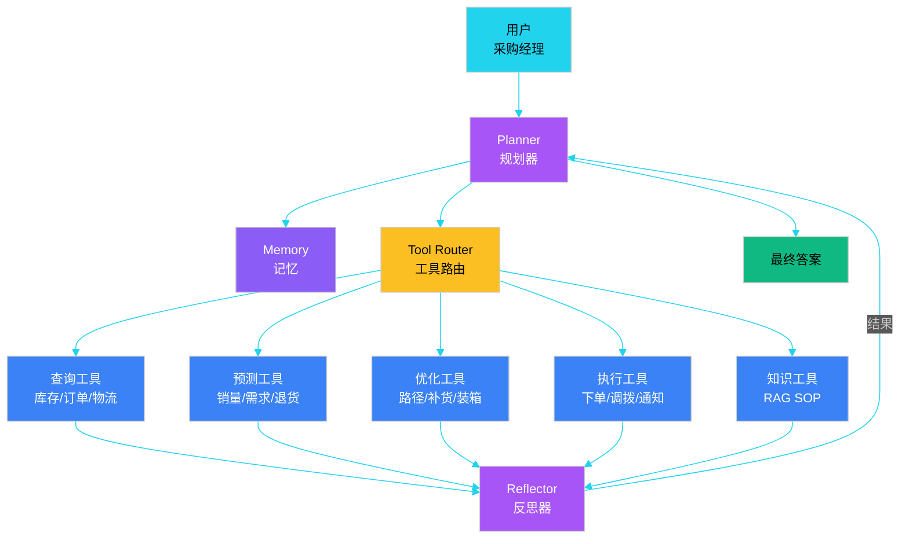

### 14.6.4 供应链 Agent 伪代码

```python
# ============ 供应链决策 Agent ============

class SupplyChainAgent:
    """基于 LangGraph 的供应链多智能体"""
    def __init__(self, llm, tools):
        self.llm = llm
        self.tools = {
            "query_inventory": self.query_inventory,
            "forecast_demand": self.forecast_demand,
            "optimize_routes": self.optimize_routes,
            "create_order": self.create_order,
            "send_notification": self.send_notification,
        }
        self.memory = ConversationBufferMemory()
        self.workflow = self._build_workflow()

    def _build_workflow(self):
        """LangGraph: Planner → Tool → Reflector → Loop"""
        from langgraph.graph import StateGraph

        workflow = StateGraph(AgentState)
        workflow.add_node("planner", self._plan_step)
        workflow.add_node("tool_caller", self._call_tool)
        workflow.add_node("reflector", self._reflect_step)
        workflow.add_node("responder", self._final_response)

        workflow.add_edge("planner", "tool_caller")
        workflow.add_edge("tool_caller", "reflector")
        workflow.add_conditional_edges(
            "reflector",
            lambda s: "responder" if s["done"] else "planner"
        )
        workflow.set_entry_point("planner")
        return workflow.compile()

    def _plan_step(self, state):
        """规划下一步动作"""
        prompt = f"""
        用户问题：{state['user_query']}
        历史：{state['history']}
        可用工具：{list(self.tools.keys())}

        请决定下一步：
        1. 调用哪个工具（工具名 + 参数）
        2. 是否已经完成
        """
        response = self.llm.invoke(prompt)
        return parse_plan(response)

    def _call_tool(self, state):
        """调用工具"""
        tool_name = state["next_tool"]
        tool_fn = self.tools[tool_name]
        result = tool_fn(**state["tool_args"])
        state["tool_results"].append({tool_name: result})
        return state

    def _reflect_step(self, state):
        """反思：信息是否够回答用户问题？"""
        check_prompt = f"""
        原始问题：{state['user_query']}
        已收集信息：{state['tool_results']}
        是否可以回答？Y/N
        若不能回答，还需要什么工具？
        """
        reflection = self.llm.invoke(check_prompt)
        state["done"] = "Y" in reflection
        return state

    def run(self, user_query):
        """主入口"""
        initial_state = {
            "user_query": user_query,
            "history": [],
            "tool_results": [],
            "done": False
        }
        return self.workflow.invoke(initial_state)


# ============ 使用示例 ============

agent = SupplyChainAgent(llm=gpt4, tools={...})

# 场景 1：智能补货
agent.run("华东仓 SKU12345 库存只有 50 了，下周要促销，帮我决策要不要补货")

# 场景 2：异常排查
agent.run("昨天订单量突然下降了 20%，帮我排查原因")

# 场景 3：路径优化
agent.run("北京 30 个客户的订单，帮我规划最经济的车辆路径")
```

### 14.6.5 RAG 在供应链知识管理的应用

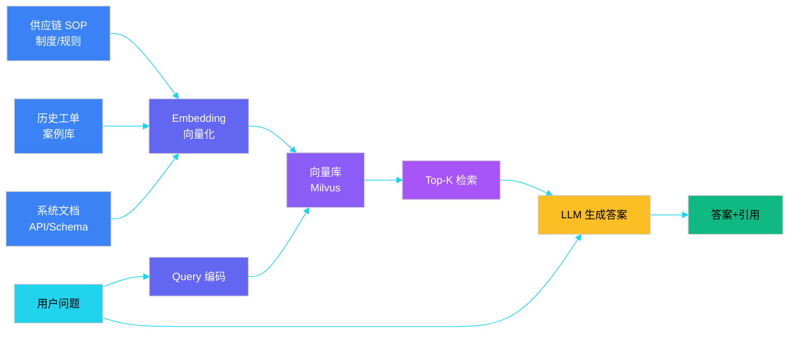

### 14.6.6 工业案例：京东供应链 Copilot

**业务背景**：京东 2024 年推出的供应链 Copilot，覆盖**需求计划、补货决策、库存调度、异常排查** 4 大场景。

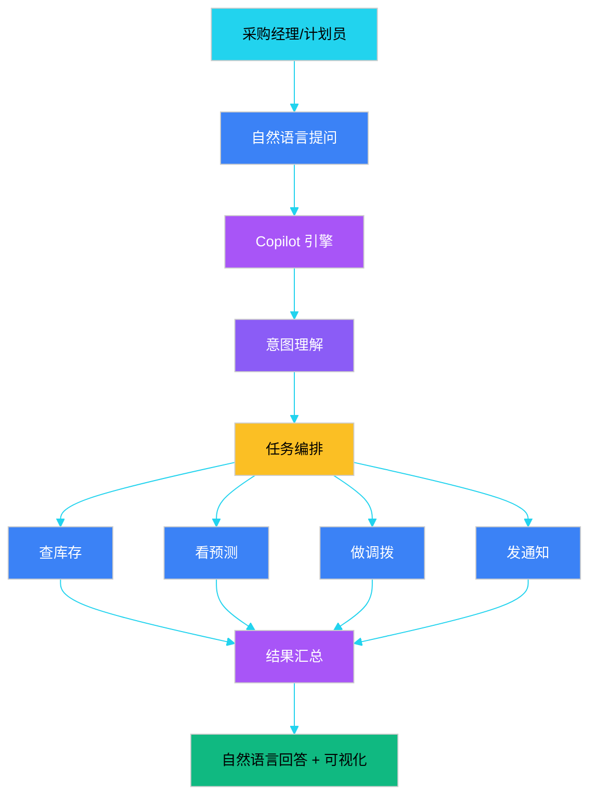

**典型应用**：

| 场景 | 用户原话 | Copilot 行为 |
|------|---------|-------------|
| **库存预警** | "华东仓哪个 SKU 要断货了？" | 查所有 SKU 库存 + 在途 + 预测，列出 Top10 风险品 |
| **补货建议** | "SKU12345 该补多少？" | 调预测 + 安全库存 + 在途，给出建议量 |
| **异常排查** | "为什么昨天订单少了？" | 查天气、促销、竞品、价格，自动归因 |
| **报告生成** | "给我生成本月华东运营报告" | 调 10+ 数据源，生成结构化报告 + 图表 |
| **培训问答** | "WMS 缺货单怎么转采购？" | RAG 检索 SOP，给出标准流程 |

**效果**：

- 采购计划员人均效率提升 **3-5 倍**
- 异常排查时长从小时级降至**分钟级**
- 培训新人周期从 3 个月降至**3 周**

### 14.6.7 LLM 在供应链的局限性

LLM 不是万能的，必须警惕以下问题：

| 局限 | 表现 | 应对 |
|------|------|------|
| **幻觉** | 给出错误数据/流程 | RAG + 工具调用 + 人工审核 |
| **时延** | 复杂推理 10+ 秒 | 缓存 + 小模型 + 异步 |
| **成本** | 一次调用 0.1 元 | 小模型 + 批处理 + 路由 |
| **数据安全** | 敏感数据外泄 | 私有部署 + 脱敏 + 审计 |
| **可解释性** | 推理过程黑盒 | Chain-of-Thought + ReAct |
| **稳定性** | 同一问题不同答案 | 温度参数 + 多采样投票 |

---

## 本章小结

本章系统介绍了大数据与 AI 在供应链中的 5 大应用场景：

1. **AI 应用全景**：预测/决策/优化/智能 4 大类，覆盖销量预测、智能补货、路径优化、异常检测、Agent 等 20+ 场景。
2. **销量预测**：ARIMA/Prophet 经典方法 → LSTM/Transformer 深度学习 → 京东、亚马逊的工业实践，强调"分层建模"和"分位数预测"。
3. **智能补货**：从 (s, Q) 经验订货 → DDPG 强化学习补货，7-Eleven 单品级补货实现缺货率 < 1%、周转 12 次/年。
4. **路径优化**：VRP 建模 + ACO 启发式算法，UPS ORION 系统每天 30 亿次路径计算，年省 3-4 亿美元。
5. **异常检测**：Isolation Forest + AutoEncoder + GNN 关系网络，京东年挽回损失 20+ 亿、误杀率 < 0.3%。
6. **大模型与 Agent**：LLM 作为"人机协作中枢"，通过 Function Calling + RAG 串联传统算法，京东 Copilot 让人均效率提升 3-5 倍。

**核心工程经验**：

- AI 在供应链不是"银弹"，**80% 价值来自数据治理和特征工程**，20% 来自模型
- 落地路径：**规则引擎 → 机器学习 → 深度学习 → 大模型 Agent**，循序渐进
- 工业级 AI 系统必须考虑**可解释性、可监控、可回滚**，避免"算法黑盒"业务事故
- **算法 + 业务 + 工程**三角缺一不可，纯算法团队做不出好供应链 AI

---

## 面试高频问题

**1. 销量预测的 WMAPE 和 MAPE 有什么区别？为什么工业界更倾向 WMAPE？**

参考答案要点：① MAPE（Mean Absolute Percentage Error）是每个样本的百分比误差再求平均，遇到零销量时**除零异常**；② WMAPE（Weighted MAPE）是总绝对误差除以总实际值，本质是 MAE 的归一化版本，**数学上等价于 1 - R² 的标量近似**，避免了零销量问题；③ 工业界 SKU 长尾分布严重，零销量或低销量 SKU 多，WMAPE 更稳健；④ 评估时要分层评估（头部/腰部/长尾分别看），避免被高销量 SKU 主导指标。

**2. LSTM 和 Transformer 在时序预测上各有什么优劣？什么场景选什么？**

参考答案要点：① LSTM 优势：训练数据需求小、可解释性中等、工业落地成熟，适合**短序列（< 100 步）**、**小样本**场景；② Transformer 优势：Self-Attention 捕捉长依赖、并行训练快，适合**长序列（> 100 步）**、**多变量协变量**场景；③ Transformer 变体如 Informer/Autoformer/PatchTST 在长时序 SOTA；④ 工业选择要权衡：数据量、序列长度、推理延迟、可解释性。中小团队 LSTM 更稳妥，大厂前沿选 Transformer。

**3. 强化学习补货相比传统 (s, Q) 模型的核心优势是什么？工业落地难点在哪？**

参考答案要点：① 优势：自动学习状态-动作映射、适应非平稳需求、可融合多目标（缺货+积压+资金占用）；② 工业难点：**冷启动**（无历史策略数据）、**奖励函数设计**（缺货 vs 积压权重）、**离线评估难**（无法 A/B 试错）、**安全性**（RL 可能做出违反业务规则的动作）、**可解释性差**（业务方难以信任）；③ 工业落地常用"**RL + 规则兜底**"双轨制，RL 给出建议，规则做安全网；④ 代表实践：京东、阿里、亚马逊都在补货场景应用 RL，但更多是"RL 排序 + 规则过滤"。

**4. UPS ORION 系统用了什么算法？为什么不直接用精确算法求解？**

参考答案要点：① ORION 用的是**禁忌搜索 + 局部搜索**的混合启发式，结合 OR-Tools 求解器；② 不直接用精确算法（如分支定界、动态规划）的原因：**VRP 是 NP-Hard 问题**，精确算法在 100+ 节点时计算量指数爆炸，无法在分钟级给出 5.5 万辆车的解；③ 启发式算法能在**分钟级**给出近优解（与最优解差距通常 < 5%），满足业务实时性要求；④ 工业路径优化普遍采用"**元启发式 + 局部搜索 + 问题特化**"的组合，而非追求精确最优。

**5. Isolation Forest 为什么能检测异常？相比 AutoEncoder 有什么优劣？**

参考答案要点：① 原理：异常点"与众不同"，**随机切分时平均路径更短**（几步就孤立），正常点需要很多次切分，异常分数 = 归一化路径长度；② 优势：**无监督**（无需标注）、**训练快**（树结构）、**可处理高维**（特征选择随机）、**内存友好**（每棵子树小）；③ 相比 AutoEncoder：Isolation Forest 训练快、可解释性中等（特征重要性）、对小数据友好；AutoEncoder 表达力强、但需要更多数据、训练慢、可解释性差；④ 工业建议：**首选 Isolation Forest**，复杂场景（图像、序列）用 AutoEncoder/LSTM-AE。

**6. 供应链 Agent 相比传统规则引擎，核心价值是什么？落地时最大的坑是什么？**

参考答案要点：① 核心价值：**自然语言交互**降低使用门槛、**动态任务编排**应对复杂场景、**跨系统联动**打破数据孤岛；② 最大坑：**幻觉**（LLM 编造数据/流程）、**权限失控**（Agent 误调高危 API）、**成本失控**（一次复杂推理几毛钱）、**稳定性差**（同一问题不同答案）；③ 落地原则：**LLM 只做编排和解释，具体执行交给传统系统**（ML 预测、OR 优化、传统 API），**人在回路**（关键决策人工确认）；④ 工业实践：京东 Copilot、亚马逊 Bedrock Agents 都采用"**LLM 编排 + 传统工具 + 规则兜底**"架构。

**7. 京东 90+ 仓库的销量预测，模型如何设计才能同时保证精度和性能？**

参考答案要点：① **分层建模**：头部 SKU（高销量）用 DeepAR/LSTM 大模型，长尾 SKU 用 Prophet/ETS 轻量模型，避免"用大模型打蚊子"；② **相似品聚类**：长尾 SKU 借力头部相似品的历史数据，做迁移学习；③ **特征工程**：促销/价格/天气/竞品是关键特征，**特征比模型重要**；④ **架构**：离线训练（T+1）+ 在线推理（实时）分离，模型按"仓-品-天"维度拆分；⑤ **效果评估**：分 SKU 分层评估 WMAPE，关注长尾；⑥ 性能上：模型按区域分片部署、推理用 ONNX/TensorRT 加速、P99 延迟 < 100ms。

**8. 供应链 AI 项目落地的最大障碍是什么？如何在系统设计阶段规避？**

参考答案要点：① 最大障碍不是算法，而是**数据质量 + 业务理解**——数据缺失/不一致、业务目标不清、KPI 难以量化；② 系统设计阶段的规避：① **统一数据底座**：ODS/DWD/ADS 分层、明确数据血缘；② **业务指标先行**：定义清楚的 KPI（WMAPE、缺货率、周转率），算法对齐业务目标；③ **A/B 测试框架**：算法上线必须有对照组和实验周期（至少 1-2 个业务周期）；④ **可解释性设计**：模型决策必须可追溯、可解释，避免"黑盒"；⑤ **渐进式上线**：规则引擎 → 机器学习辅助 → AI 主决策，**分阶段降低业务风险**；⑥ **监控告警**：模型漂移、数据漂移、决策分布异常必须实时监控。
