# 第 15 章 全球化与跨境供应链

> 本章定位：把供应链系统从"国内一张网"扩展到"全球多张网"。全球化不是把国内系统翻译成多语言，而是**组织、税务、清关、物流、币种、监管**六维度的体系重构。
>
> **学习建议**：本章与第 6 章（库存）、第 8 章（运输）、第 12 章（财务）强相关，建议对照阅读。本章侧重**多组织 + 多币种 + 多监管**的"叠加态"设计。

---

## 15.1 全球化供应链的挑战

供应链一旦走出国境，就会从"一张网"变成"多张网叠加"。下面用一张思维导图展示六大维度的挑战：

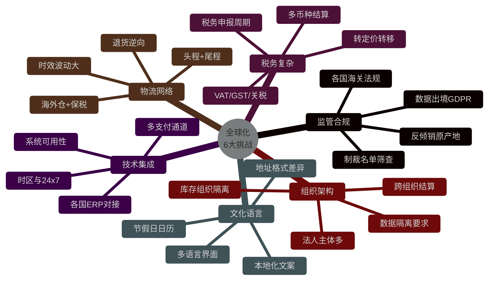

### 15.1.1 监管合规挑战

| 国家/地区 | 主要监管 | 重点要求 | 系统影响 |
|----------|---------|---------|---------|
| 中国 | 海关 9610/1210/9710、跨境电商试点 | 三单对碰、实名认证 | 需对接电子口岸 |
| 欧盟 | GDPR、CE 认证、EU 2021/1147 | 数据本地化、原产地 | 需欧洲数据中心 |
| 美国 | FDA、CPSC、TSCA、Section 301 | 产品安全、关税清单 | 需美国清关代理人 |
| 东南亚 | 印尼 BPOM、越南 VNTA、日本 PSE | 准入许可多 | 需本地合规团队 |
| 中东 | SASO、GCC、Halal 认证 | 宗教合规 | 需 Halal 证书管理 |

### 15.1.2 牛鞭效应的"国别放大"

在国内是"省-市-县"三级放大，跨境则是"消费国-目的国仓-目的国配送-本国头程-本国工厂"的**五级放大**。而且每一级都有不同 Lead Time：


> **关键认知**：跨境供应链的"牛鞭"更长、更难消解。SHEIN 之所以能 7-15 天交付，本质是用**小单快反**把"成品在途"压缩到极致。

### 15.1.3 与国内供应链的核心差异

| 维度 | 国内供应链 | 跨境供应链 | 复杂度提升 |
|------|----------|----------|----------|
| 法规 | 1 套 | N 套 | 10x |
| 币种 | CNY | N 种 | 5-20x |
| 物流时效 | 1-3 天 | 7-30 天 | 5x |
| 退货率 | 5-10% | 15-30% | 3x |
| 资金占用 | 低 | 高（在途库存多） | 3-5x |
| 库存风险 | 单市场 | 多市场叠加 | 难以估计 |

---

## 15.2 多组织架构

全球化系统的**第一性原理**是：必须能在一个数据库实例下，**逻辑隔离** N 个法人、N 套税务、N 个仓库，且数据可追溯。

### 15.2.1 三类组织

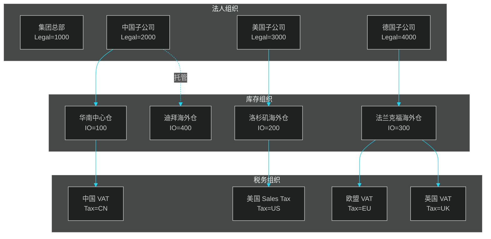

| 组织类型 | 作用 | 关键字段 | 隔离粒度 |
|---------|------|---------|---------|
| 法人组织 (Legal Entity) | 合同、发票、税务申报 | legal_id, tax_no, country | 财务账套隔离 |
| 库存组织 (Inventory Org) | 物理库存归属、可用量计算 | inv_org_id, warehouse_code | 库存账隔离 |
| 税务组织 (Tax Org) | 税率、申报周期、币种 | tax_id, tax_type, currency | 税务计算隔离 |

### 15.2.2 多组织数据模型（伪代码）

下面是经典 ERP（如 Oracle EBS、SAP S/4）中"组织模型"的简化版：

```sql
-- ============================================
-- 多组织数据模型（核心表）
-- ============================================

-- 1. 法人组织表：法律主体，独立法人
CREATE TABLE legal_entity (
    legal_id            BIGINT PRIMARY KEY,
    legal_code          VARCHAR(32) UNIQUE NOT NULL,  -- 如 "CN-2000"
    legal_name          VARCHAR(128) NOT NULL,
    country_code        CHAR(2) NOT NULL,             -- ISO 3166-1 alpha-2
    tax_registration_no VARCHAR(64),                  -- 税号
    currency_code       CHAR(3) NOT NULL,             -- 记账本位币
    parent_legal_id     BIGINT,                       -- 上级法人
    status              TINYINT DEFAULT 1
);

-- 2. 库存组织表：物理库存归属
CREATE TABLE inventory_org (
    inv_org_id          BIGINT PRIMARY KEY,
    inv_org_code        VARCHAR(32) UNIQUE NOT NULL,  -- 如 "WH-LA-01"
    inv_org_name        VARCHAR(128) NOT NULL,
    legal_id            BIGINT NOT NULL,              -- 归属法人
    country_code        CHAR(2) NOT NULL,
    warehouse_type      TINYINT NOT NULL,             -- 1=中心仓 2=海外仓 3=保税仓
    is_bonded           TINYINT DEFAULT 0,            -- 是否保税
    address             VARCHAR(256),
    status              TINYINT DEFAULT 1
);

-- 3. 税务组织表：税率/申报维度
CREATE TABLE tax_org (
    tax_org_id          BIGINT PRIMARY KEY,
    tax_org_code        VARCHAR(32) UNIQUE NOT NULL,  -- 如 "TAX-US-CA"
    country_code        CHAR(2) NOT NULL,
    region_code         VARCHAR(8),                   -- 省/州
    tax_type            VARCHAR(16) NOT NULL,         -- VAT/GST/SALES/EXCISE
    tax_rate            DECIMAL(8,4),                 -- 基础税率
    effective_date      DATE NOT NULL,
    expiry_date         DATE
);

-- 4. SKU 主数据：跨组织共享
CREATE TABLE sku_master (
    sku_id              BIGINT PRIMARY KEY,
    sku_code            VARCHAR(32) UNIQUE NOT NULL,
    sku_name            VARCHAR(128),
    hs_code             VARCHAR(16),                  -- 海关 HS 编码
    country_of_origin   CHAR(2),                      -- 原产地
    weight_kg           DECIMAL(10,3),
    volume_m3           DECIMAL(10,6),
    unit_price_usd      DECIMAL(12,4)                 -- 全球统一定价（参考）
);

-- 5. SKU × 组织 矩阵：每个组织的价格、库存策略
CREATE TABLE sku_org_matrix (
    sku_id              BIGINT,
    inv_org_id          BIGINT,
    legal_id            BIGINT,
    selling_price       DECIMAL(12,4),                -- 本组织售价
    cost_price          DECIMAL(12,4),                -- 本组织成本
    safety_stock        INT DEFAULT 0,
    reorder_point       INT DEFAULT 0,
    is_listed           TINYINT DEFAULT 1,            -- 是否在该组织销售
    PRIMARY KEY (sku_id, inv_org_id)
);

-- 6. 跨组织调拨单（Transfer Order）
CREATE TABLE transfer_order (
    to_id               BIGINT PRIMARY KEY,
    to_no               VARCHAR(32) UNIQUE NOT NULL,
    from_inv_org_id     BIGINT NOT NULL,              -- 调出库存组织
    to_inv_org_id       BIGINT NOT NULL,              -- 调入库存组织
    from_legal_id       BIGINT NOT NULL,              -- 调出法人
    to_legal_id         BIGINT NOT NULL,              -- 调入法人
    transfer_type       TINYINT NOT NULL,             -- 1=国内调拨 2=跨境出口 3=跨境进口
    incoterm_code       VARCHAR(8),                   -- FOB/CIF/DDP等
    customs_declaration VARCHAR(32),                  -- 关联报关单号
    transfer_price      DECIMAL(12,4),                -- 内部转移价格
    currency_code       CHAR(3),
    status              TINYINT DEFAULT 0,            -- 0=草稿 1=已审核 2=在途 3=已签收
    created_at          DATETIME NOT NULL,
    INDEX idx_from (from_inv_org_id, status),
    INDEX idx_to (to_inv_org_id, status)
);
```

### 15.2.3 跨组织库存调拨流程

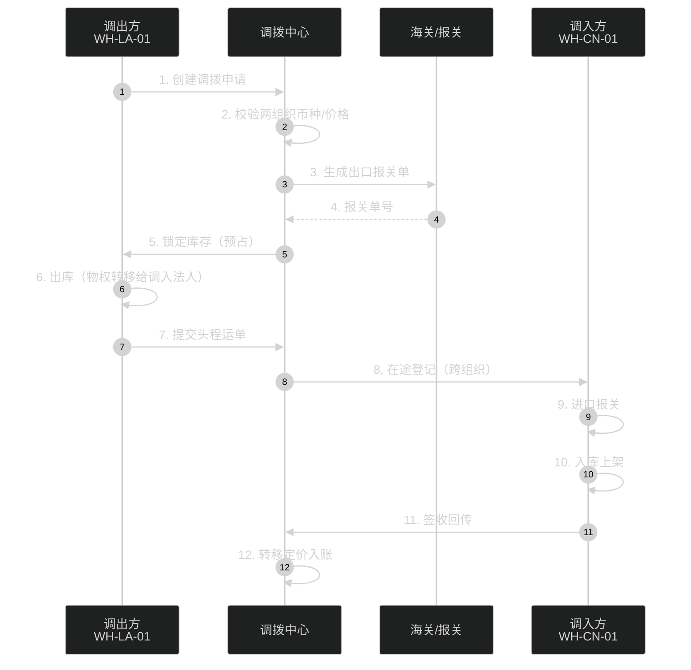

> **关键设计**：跨组织调拨对应**两套账**（出库方的销售收入 vs 入库方的采购成本），关联交易按"转移价格（Transfer Price）"定价，需符合**OECD 转让定价**规则。

---

## 15.3 跨境物流

跨境物流链路是"头程 + 尾程"两段式的复杂网络，比国内物流多一层**国际段**和**海关**。

### 15.3.1 头程：三种国际运输方式对比

| 维度 | 海运 | 空运 | 中欧班列 |
|------|------|------|---------|
| 时效 | 20-40 天 | 5-10 天 | 15-22 天 |
| 单位成本 | 0.5-1 USD/kg | 4-8 USD/kg | 1.5-2.5 USD/kg |
| 容量 | 极大（整柜/拼箱） | 较小（受舱位限制） | 中等（整柜为主） |
| 适用 | 大件、慢时尚 | 高价值、急件 | 欧洲方向主力 |
| CO₂ 排放 | 低 | 高 | 中 |
| 主流玩家 | COSCO、Maersk、MSC | FedEx、UPS、DHL | 中国铁路、UTLC |


### 15.3.2 三种仓储模式

| 模式 | 描述 | 优势 | 劣势 | 适用 |
|------|------|------|------|------|
| 直邮 | 消费者下单后从国内直发 | 0 库存风险、SKU 灵活 | 时效慢、退货难 | 客单价高、SKU 多 |
| 保税仓 | 提前备货到保税区，订单触发清关 | 时效快（2-5 天）、税基低 | 需预判销量、SKU 有限 | 母婴、爆款标品 |
| 海外仓 | 提前备货到目的国仓 | 时效最快（1-2 天）、退货方便 | 库存风险、滞销风险 | 标品、大件、SHEIN 模式 |


### 15.3.3 案例：SHEIN 的跨境物流

**SHEIN 的核心打法**：

1. **国内集中生产**：广州番禺 300+ 合作工厂
2. **小单快反**：100-300 件试款，7-15 天交付
3. **跨境直邮为主**：约 60% 订单从国内直发
4. **海外仓为辅**：美国、欧洲部分标品提前备货
5. **包机/包船**：包下南航 Cargo 货机、租整船

**SHEIN 物流架构示意**：

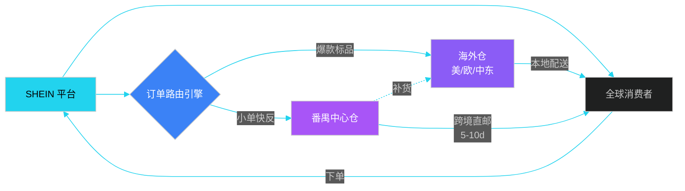

### 15.3.4 案例：Temu 的"全托管模式"

Temu 2023 年推出**全托管（Fully Managed）模式**：

- 商家只需把货发到 Temu 国内仓
- 跨境物流、清关、尾程配送**全部 Temu 自营**
- 类似 SHEIN 模式，但商家门槛更低（不要求自有海外仓）

> **行业影响**：Temu 全托管倒逼 SHEIN 推出"半托管"（商家自管理海外仓 + Temu 负责尾程），平台型跨境电商进入"物流深度介入"阶段。

---

## 15.4 海关清关

跨境电商的"命门"是**海关清关**。一次清关失败 = 一批货延误 = 客户投诉 + 资金占用。

### 15.4.1 报关基础概念

| 概念 | 含义 | 关键作用 |
|------|------|---------|
| HS Code | 海关编码（10 位） | 决定税率、监管条件 |
| CIQ | 商检（China Inspection and Quarantine） | 强制认证 |
| 原产地证 | 证明商品生产国 | 决定是否享优惠关税 |
| 报关单 | 海关申报单据 | 货物进出境的法律凭证 |
| 监管证件 | 许可证、3C、FDA 等 | 准入凭证 |
| 关税 | Customs Duty | 进口国收取 |
| 增值税 | VAT/GST | 进口国收取 |

### 15.4.2 报关流程

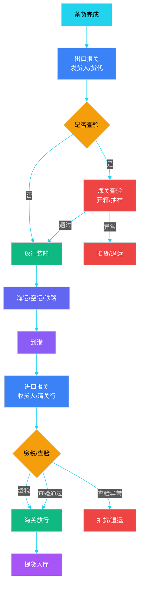

### 15.4.3 HS Code 体系

HS Code（Harmonized System）是 WCO（世界海关组织）维护的国际通用商品编码，6 位国际标准 + 4 位各国扩展：

```
示例：6109.10.0010
├── 61 章     针织服装
├── 09 目     T恤、汗衫
├── 10 号     棉制
└── 0010 子目  棉制针织T恤（中国扩展）
```

**HS Code 的"灵魂作用"**：

- 决定**关税税率**（0%-30%+）
- 决定**监管条件**（A 进口许可、B 出口许可、3C 强制认证等）
- 决定**原产地规则**（RCEP 享惠条件）
- 决定**统计归类**

### 15.4.4 清关单据生成（伪代码）

```python
# ============================================
# 跨境报关单据生成（Python 伪代码）
# ============================================

class CustomsDeclarationGenerator:
    """清关单据生成器"""

    def __init__(self, hs_code_db, tax_rate_db, country_rule_db):
        self.hs_db = hs_code_db
        self.tax_db = tax_rate_db
        self.rule_db = country_rule_db

    def generate_declaration(self, shipment: Shipment, destination: str) -> Declaration:
        # 1. HS Code 推断
        hs_code = self._resolve_hs_code(shipment.sku_list)
        if not hs_code:
            raise HSCodeMissingError(f"SKU {shipment.sku_codes} 无 HS Code")

        # 2. 申报要素（10 项以上）
        elements = self._build_declaration_elements(shipment, hs_code)

        # 3. 价值计算
        cif_value = self._calc_cif_value(
            fob_price=shipment.fob_price,
            freight=shipment.freight,
            insurance=shipment.insurance
        )

        # 4. 税费计算
        duty_rate = self.tax_db.get_duty_rate(hs_code, destination)
        duty = cif_value * duty_rate
        vat_rate = self.tax_db.get_vat_rate(destination)
        vat = (cif_value + duty) * vat_rate

        # 5. 监管证件校验
        certificates = self.rule_db.get_required_certs(hs_code, destination)
        missing_certs = self._check_certificates(shipment, certificates)
        if missing_certs:
            raise MissingCertificateError(missing_certs)

        # 6. 生成单据
        return Declaration(
            decl_no=self._generate_decl_no(destination),
            hs_code=hs_code,
            elements=elements,
            cif_value=cif_value,
            currency=shipment.currency,
            duty=duty,
            vat=vat,
            total_tax=duty + vat,
            certs=certificates,
            incoterm=shipment.incoterm,
            origin_country=shipment.origin_country,
            dest_country=destination,
        )

    def _resolve_hs_code(self, sku_list):
        """SKU → HS Code 映射（含归类决策）"""
        for sku in sku_list:
            if sku.hs_code:
                return sku.hs_code
        # 调用归类模型：基于 SKU 名称/类目/材质 ML 推断
        return self.hs_classifier.predict(sku_list)

    def _calc_cif_value(self, fob_price, freight, insurance):
        """CIF = FOB + Freight + Insurance"""
        return fob_price + freight + insurance


# 调用示例
shipment = Shipment(
    sku_list=[SKU(code="SH-001", name="女式棉T恤", material="cotton")],
    fob_price=1000.0, freight=200.0, insurance=20.0,
    currency="USD", incoterm="FOB", origin_country="CN"
)
generator = CustomsDeclarationGenerator(hs_db, tax_db, rule_db)
declaration = generator.generate_declaration(shipment, destination="US")
print(f"申报号: {declaration.decl_no}, 关税: {declaration.duty} {declaration.currency}")
```

### 15.4.5 跨境电商特殊模式：中国 9610/1210/9710

| 模式 | 全称 | 适用场景 | 关键特征 |
|------|------|---------|---------|
| 9610 | 跨境电商 B2C 直购进口 | 跨境直邮小包 | 三单对碰、清单核放 |
| 1210 | 跨境电商保税进口 | 保税仓备货 | 整批进境、分批出区 |
| 9710 | 跨境电商 B2B 直接出口 | 跨境 B2B 大单 | 简化申报、优先查验 |
| 9810 | 跨境电商出口海外仓 | 出口至海外仓 | 退税便利、清单申报 |

> **系统要点**：跨境电商"三单对碰"——**订单、运单、支付单**必须与海关系统实时对碰，任何不一致都会导致清关失败。

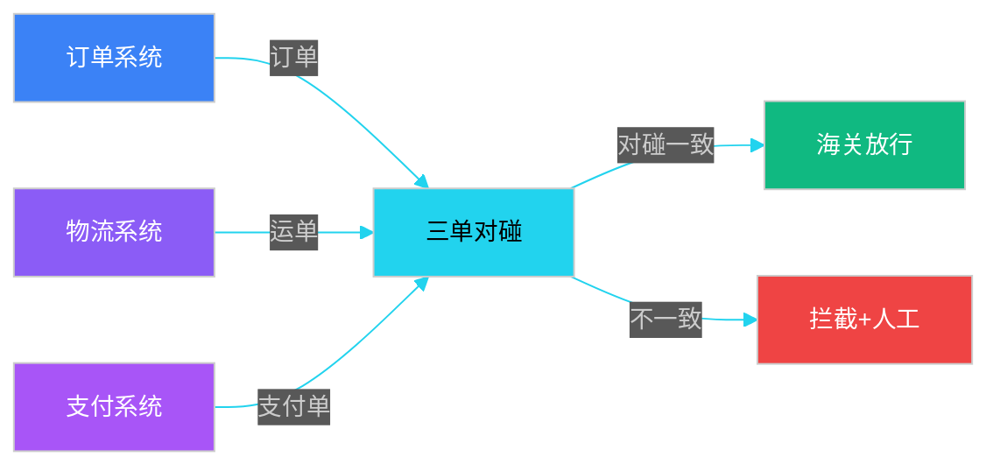

---

## 15.5 税务合规

跨境电商的税务复杂度是国内的 5-10 倍。核心问题：**每笔钱应该按哪个国家、哪种税、什么时间申报**。

### 15.5.1 多币种体系

跨境系统的币种管理涉及三个层面：

| 层面 | 用途 | 精度要求 | 更新频率 |
|------|------|---------|---------|
| 本位币 | 财务记账（如 USD） | 8 位 | 期末调汇 |
| 交易币 | 订单结算币 | 4 位 | 实时 |
| 展示币 | 用户界面显示 | 2 位 | 实时 |

```python
# ============================================
# 多币种汇率管理（伪代码）
# ============================================

class MultiCurrencyManager:
    """多币种汇率管理器"""

    def __init__(self, rate_provider):
        self.rate_provider = rate_provider    # 接入 ECB / OXR / 央行
        self.rate_cache = {}                    # 实时汇率缓存（5min TTL）
        self.historical_rates = {}              # 历史汇率（不可变）

    def get_real_time_rate(self, from_ccy: str, to_ccy: str) -> Decimal:
        """实时汇率：用于报价、结算"""
        key = f"{from_ccy}:{to_ccy}"
        if key in self.rate_cache and not self._is_expired(self.rate_cache[key]):
            return self.rate_cache[key].rate

        # 调用外部汇率源（OXR / 央行 / Reuters）
        rate = self.rate_provider.fetch_rate(from_ccy, to_ccy)
        self.rate_cache[key] = RateData(
            rate=Decimal(rate),
            timestamp=datetime.utcnow(),
            source=self.rate_provider.name
        )
        return Decimal(rate)

    def get_historical_rate(self, from_ccy: str, to_ccy: str, txn_date: date) -> Decimal:
        """历史汇率：用于财务记账、税务申报"""
        key = f"{from_ccy}:{to_ccy}:{txn_date}"
        if key in self.historical_rates:
            return self.historical_rates[key]

        # 取交易日当天的央行中间价（不可变）
        rate = self.rate_provider.get_historical_rate(from_ccy, to_ccy, txn_date)
        self.historical_rates[key] = rate
        return rate

    def convert_settlement(self, amount: Decimal, from_ccy: str, to_ccy: str,
                          txn_date: date) -> Decimal:
        """结算汇率：取交易日 + 1 的固定汇率（避免跨时区漂移）"""
        rate_date = txn_date + timedelta(days=1)
        rate = self.get_historical_rate(from_ccy, to_ccy, rate_date)
        return (amount * rate).quantize(Decimal("0.01"))


# 使用示例
mcm = MultiCurrencyManager(RateProvider())

# 1. 实时报价：用户看到的价格
display_rate = mcm.get_real_time_rate("USD", "EUR")  # 0.9234
price_eur = Decimal("99.99") * display_rate           # 92.34 EUR

# 2. 历史结算：交易日的财务记账
settlement_amount = mcm.convert_settlement(
    amount=Decimal("99.99"),
    from_ccy="USD", to_ccy="USD",  # 本位币是 USD，无需转换
    txn_date=date(2026, 6, 1)
)
```

> **关键设计**：实时汇率用于**报价**（不缓存太久会亏），历史汇率用于**记账**（必须可复现、不可变）。

### 15.5.2 间接税：VAT / GST / 销售税

| 税种 | 地区 | 税率 | 申报 | 特点 |
|------|------|------|------|------|
| VAT（增值税） | 欧盟、英国、东南亚 | 15-27% | 月/季 | 进项可抵扣 |
| GST（商品服务税） | 澳洲、加拿大、印度 | 5-18% | 月/季 | 类似 VAT |
| Sales Tax | 美国（州级） | 0-10% | 季/年 | 消费地原则 |
| HST | 加拿大部分省 | 13-15% | 季 | GST+PST 合并 |
| 关税 | 各国 | 0-30%+ | 进口一次性 | 不可抵扣 |

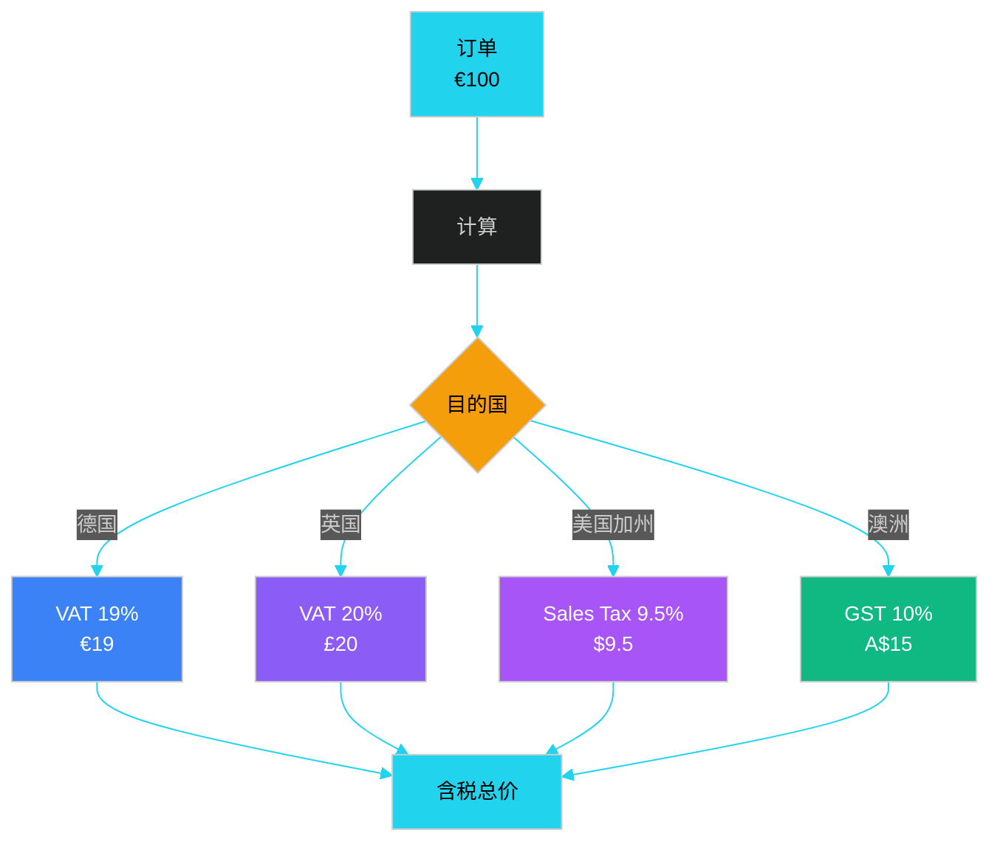

### 15.5.3 税务计算（伪代码）

```python
# ============================================
# 跨境税务计算引擎（伪代码）
# ============================================

class TaxCalculator:
    """跨境税务计算器"""

    def __init__(self, tax_rule_engine, ioss_registry):
        self.rule_engine = tax_rule_engine       # 税率规则引擎
        self.ioss = ioss_registry                # 欧盟 IOSS 税号注册

    def calculate_order_tax(self, order: Order) -> TaxBreakdown:
        """订单级税务计算"""
        # 1. 判断目的国与税务身份
        dest_country = order.ship_to.country
        seller_entity = order.seller.legal_id

        # 2. 选择税务模式
        tax_mode = self._select_tax_mode(
            dest_country=dest_country,
            order_value=order.total_value,
            order_currency=order.currency,
            seller_entity=seller_entity
        )
        # tax_mode ∈ {IOSS, OSS, LOCAL_REGISTRATION, DDP, DAP}

        # 3. 计算税基
        if tax_mode in ("IOSS", "OSS"):
            # 含税价：商品价已含税，需要倒推
            net_price = order.total_value / (1 + self.rule_engine.get_vat_rate(dest_country))
            vat = order.total_value - net_price
        else:
            # 不含税价：直接加税
            net_price = order.total_value
            vat = order.total_value * self.rule_engine.get_vat_rate(dest_country)

        # 4. 关税（如适用）
        duty = self._calc_duty(order.sku_list, dest_country)

        # 5. 整合结果
        return TaxBreakdown(
            net_price=net_price.quantize(Decimal("0.01")),
            vat=vat.quantize(Decimal("0.01")),
            duty=duty,
            total_tax=vat + duty,
            tax_mode=tax_mode,
            vat_rate=self.rule_engine.get_vat_rate(dest_country),
            ioss_no=self.ioss.get(seller_entity) if tax_mode == "IOSS" else None,
        )

    def _select_tax_mode(self, dest_country, order_value, order_currency, seller_entity):
        """根据目的国、订单金额、商家税务身份选择税务模式"""
        # 欧盟 ≤ €150 → 强制 IOSS
        if dest_country in EU_COUNTRIES and order_value <= Decimal("150"):
            if self.ioss.has(seller_entity):
                return "IOSS"
            else:
                return "OSS"
        # 欧盟 > €150 → 必须本地清关
        if dest_country in EU_COUNTRIES and order_value > Decimal("150"):
            return "DDP" if seller_entity.has_local_vat else "DAP"
        # 美国 → 销售税
        if dest_country == "US":
            return "LOCAL_REGISTRATION"
        # 默认 DDP
        return "DDP"
```

> **IOSS（Import One-Stop Shop）**：欧盟 2021 年 7 月起强制，€150 以下跨境包裹必须通过 IOSS 申报增值税，由电商平台代收代缴。这是**系统级合规**而非商家自行处理。

### 15.5.4 转让定价（Transfer Pricing）

跨境电商集团内部调拨货物，需按**OECD 转让定价指南**定价，否则面临税务机关反避税调查：

| 定价方法 | 适用场景 | 风险 |
|---------|---------|------|
| 可比非受控价格法（CUP） | 有公开市场价 | 最佳实践 |
| 成本加成法（CPLM） | 集团内制造 | 制造业常用 |
| 再销售价格法（RPM） | 集团内分销 | 贸易公司 |
| 交易净利润法（TNMM） | 难以直接比较 | 兜底方法 |

> **系统影响**：转让定价要求**关联交易数据可追溯**——调拨单价、运费、保险、报关价、内部分润比例都要在系统中留痕至少 10 年。

---

## 15.6 全球化案例

### 15.6.1 SHEIN：广州-番禺到全球

**核心打法**：

| 维度 | 做法 | 数据 |
|------|------|------|
| 设计 | 100+ 设计师、7×24 看趋势 | 6000+ 新款/天 |
| 生产 | 番禺 300+ 工厂 | 100-300 件试款 |
| 物流 | 跨境直邮 + 海外仓 | 7-15 天全球达 |
| 平台 | SHEIN App + 第三方 | 150+ 国家 |
| 数据 | 全链路数字化 | 设计-生产-物流-销售 |

**SHEIN 全球供应链架构**：

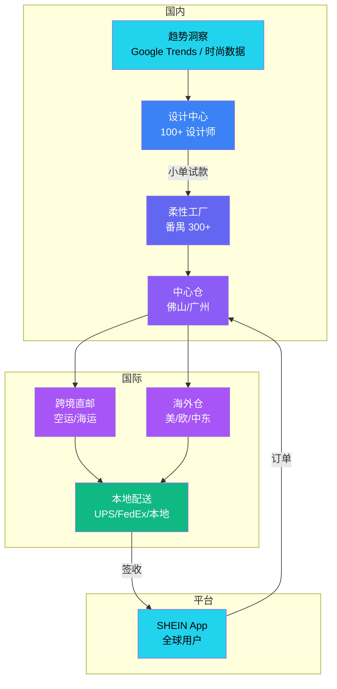

### 15.6.2 亚马逊：全球开店 + FBA

**亚马逊 Global Selling 体系**：

| 站点 | 入驻模式 | 物流 | 关键特色 |
|------|---------|------|---------|
| 美国站 | 中国卖家直发 | FBA / 自发 | 流量最大 |
| 欧洲站 | 联合账户（Pan-EU） | EFN / Pan-EU FBA | VAT 7 国 |
| 日本站 | 中文入驻 | FBA / 海外仓 | 距离近 |
| 中东站（SOUQ） | 本地合资 | 自发 + FBA | 高客单价 |
| 澳洲站 | 简单入驻 | FBA | 新兴市场 |

**FBA 关键流程**：

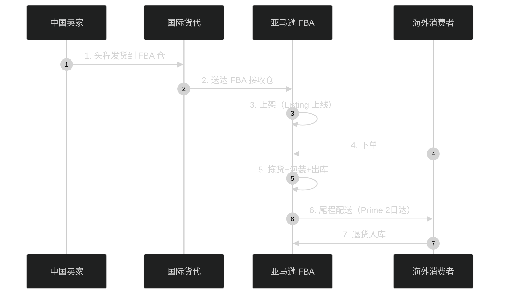

> **亚马逊核心创新**：FBA 把"跨境物流复杂度"打包成"发到亚马逊仓即可"，卖家只需关注商品。代价是 15-30% 的 FBA 佣金 + 仓储费。

### 15.6.3 阿里巴巴：Lazada + 速卖通 + 菜鸟

**阿里全球供应链矩阵**：

| 平台 | 区域 | 模式 | 物流 |
|------|------|------|------|
| AliExpress（速卖通） | 俄罗斯、欧洲、美洲 | 平台 + 直邮 | 燕文、菜鸟 |
| Lazada | 东南亚六国 | 自营 + 平台 | LFB（Lazada Fulfilled by Lazada） |
| Trendyol | 土耳其 | 控股 | 本地仓配 |
| Daraz | 巴基斯坦、孟加拉 | 自营 | 本地仓 |
| 菜鸟 | 全球 | 物流基础设施 | 15+ 海外仓、eHub |

**Lazada 东南亚架构**：

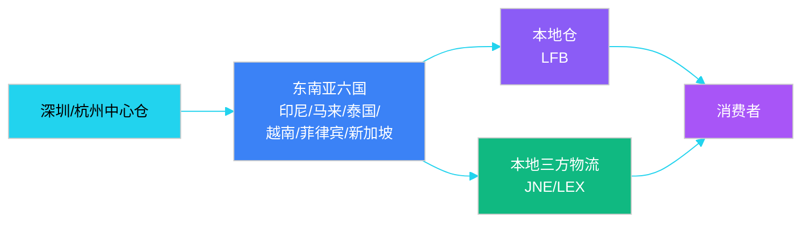

### 15.6.4 三大模式对比

| 维度 | SHEIN | 亚马逊 FBA | 阿里 Lazada |
|------|-------|-----------|-----------|
| 商家类型 | 自营为主 | 第三方卖家 | 平台 + 自营 |
| 库存模式 | 自有库存 + 直邮 | 卖家备货到 FBA | LFB + 自发 |
| 物流自营 | 70% 自营 | FBA 自营 | 菜鸟协同 |
| 核心优势 | 速度 + 价格 | 流量 + 履约 | 平台 + 生态 |
| 商家门槛 | 中（接单+生产） | 中（备货+资金） | 低（开店即可） |
| 跨境复杂度 | 高（自营） | 中（亚马逊兜底） | 低（平台代劳） |

### 15.6.5 跨境电商总体架构

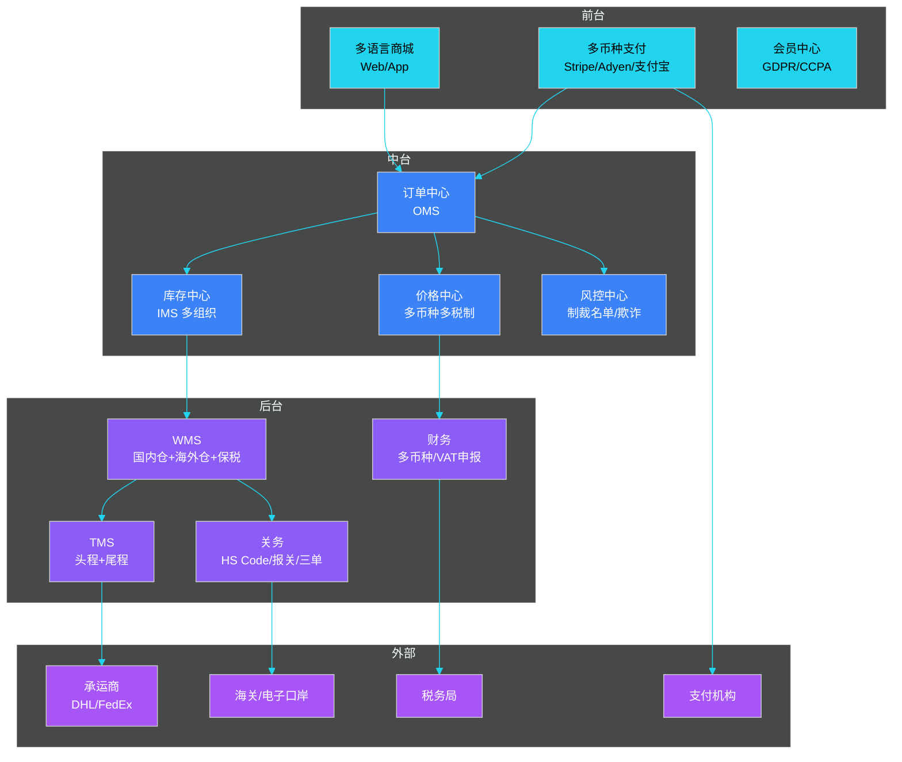

---

## 15.7 系统设计要点总结

### 15.7.1 核心设计原则

| 原则 | 描述 | 反例 |
|------|------|------|
| 单一事实来源 | 全球 SKU 主数据唯一，价格/库存组织矩阵 | 每个国家一套 SKU |
| 税价分离 | 标价与税率解耦，按目的地动态计算 | 写死 19% VAT |
| 多币种账套 | 每个法人一个本位币，避免"币种错乱" | 全部按 USD 记账 |
| 物流可视化 | 头程+尾程端到端轨迹 | 头程一段系统，尾程另一段 |
| 监管前置 | 准入证件在商品上架前校验 | 海关退回后再补办 |
| 数据合规 | GDPR/CCPA 数据本地化 | 集中存储在单国 |
| 可配置税率 | 税率规则引擎化 | 硬编码每个国家 |

### 15.7.2 关键技术挑战

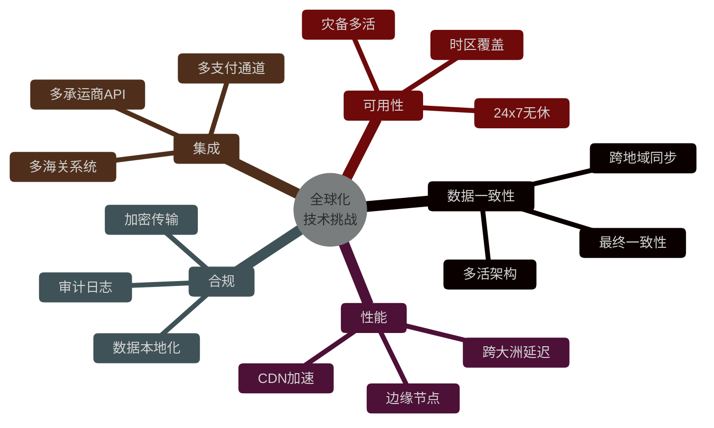

### 15.7.3 与各章关系

| 关联章节 | 共享概念 | 全球化新增维度 |
|---------|---------|--------------|
| 第 2 章 SRM | 供应商管理 | 国际供应商、Incoterm |
| 第 3 章 采购 | PO/收货 | 跨境 PO、关税分摊 |
| 第 4 章 OMS | 订单履约 | 多币种订单、IOSS 税号 |
| 第 5 章 WMS | 入库出库 | 海外仓、保税仓 |
| 第 6 章 IMS | 库存可用量 | 多组织可用量、跨组织调拨 |
| 第 8 章 TMS | 运输调度 | 头程+尾程、跨境承运商 |
| 第 12 章 财务 | 应付应收 | 多币种账套、转让定价、税务申报 |

---

## 本章小结

全球化供应链系统的核心是**多组织 + 多币种 + 多监管**的"叠加态"设计。本章围绕 6 大主题展开：

1. **挑战**：监管、税务、文化、物流、组织、技术 6 维度的复杂度叠加。
2. **多组织架构**：法人组织、库存组织、税务组织的三维矩阵，是 ERP 级别的设计模式。
3. **跨境物流**：海运/空运/铁路的头程选择，直邮/保税/海外仓的三种仓储模式，SHEIN/Temu 的极致物流创新。
4. **海关清关**：HS Code 决定一切，9610/1210/9710 是中国跨境电商的特色模式，三单对碰是系统合规的关键。
5. **税务合规**：实时汇率 vs 历史汇率，VAT/GST/Sales Tax 的差异化计算，IOSS 是欧盟的强制合规点。
6. **全球化案例**：SHEIN 走自营+直邮+小单快反，亚马逊走 FBA+平台模式，阿里走 Lazada+菜鸟生态。

关键认知：**全球化不是把国内系统翻译成多语言，而是从数据模型层就重做**。所有 SKU、所有订单、所有库存、所有金额都要带上"国家/法人/币种/税区"四个维度。

---

## 面试高频问题

**1. 跨境电商和国内电商在系统设计上最大的区别是什么？**

参考答案要点：① 库存：国内单一仓网，跨境多组织（中心仓+海外仓+保税仓）；② 订单：国内单一币种单一税制，跨境多币种多税制（VAT/GST/Sales Tax）；③ 物流：国内单段履约，跨境头程+尾程两段制；④ 监管：国内单一海关规则，跨境多国海关+三单对碰；⑤ 退货率：跨境 15-30% 远高于国内 5-10%。

**2. 什么是 HS Code？它在系统中如何应用？**

参考答案要点：HS Code 是世界海关组织维护的国际通用商品编码（10 位：6 位国际 + 4 位各国扩展），决定：① 关税税率（0%-30%+）；② 监管条件（许可证、强制认证）；③ 原产地规则；④ 统计归类。系统应用：SKU 主数据预绑定 HS Code，清关时自动推断，缺码时用 ML 归类模型补齐。

**3. SHEIN 的"小单快反"为什么难以复制？**

参考答案要点：① 供应链侧：番禺 300+ 工厂的密集产业集群 + 长期信任关系，新进入者无法在 2 年内复制；② 设计侧：100+ 设计师 + Google Trends 数据驱动，新品 6000+/天；③ 物流侧：跨境直邮为主 + 海外仓为辅，60% 订单国内直发，5-10 天送达；④ 资金侧：账期短（30 天 vs 行业 90 天）压榨供应商；⑤ IT 侧：全链路数字化（设计-生产-物流-销售），任何环节断链都会失败。

**4. 什么是 IOSS？系统如何支持？**

参考答案要点：IOSS（Import One-Stop Shop）是欧盟 2021 年 7 月起对 €150 以下跨境 B2C 包裹的强制增值税申报机制，由电商平台或卖家注册 IOSS 税号代收代缴。系统支持：① 商家注册 IOSS 税号管理；② 订单创建时判断目的国 + 金额是否触发 IOSS；③ 支付环节代收 VAT；④ 申报数据按月汇总至欧盟 IOSS 门户；⑤ 未注册 IOSS 的包裹走 DDP/DAP，由买家承担 VAT。

**5. 多组织架构中，跨组织调拨（Transfer Order）如何设计？**

参考答案要点：① 数据模型：调出/调入两个法人 + 两个库存组织 + 一个调拨单头；② 价格：按"转让定价"规则（OECD CUP/CPLM/RPM/TNMM）定价；③ 物权：出库时物权从调出法人转移给调入法人；④ 账务：调出方记"对内销售收入"，调入方记"对内采购成本"，关联交易对冲；⑤ 海关：跨境调拨需关联报关单号；⑥ 库存：在途段归"调入法人"（货权已转），物理上仍在途中。

**6. 跨境电商三种仓储模式（直邮/保税/海外仓）如何选择？**

参考答案要点：① 直邮：0 库存风险，SKU 灵活，但时效慢（7-15 天），适合客单价高、SKU 多、退货率低的场景；② 保税仓：时效快（2-5 天）、税基低（入区不缴税），但需预判销量，SKU 有限，适合爆款标品、母婴；③ 海外仓：时效最快（1-2 天）、退货方便，但库存风险大，适合标品、大件、SHEIN 模式。实际系统按 SKU 维度动态路由，部分爆款海外仓 + 长尾直邮。

**7. 跨境物流"头程+尾程"如何统一调度？**

参考答案要点：① 头程（国际段）：海运/空运/铁路，运力受舱位/航班限制，按柜型/CBM 计价，时效长（15-40 天）；② 尾程（目的国段）：本地承运商（UPS/FedEx/USPS/皇家邮政），按包裹/重量计价，时效短（1-5 天）；③ 系统设计：TMS 抽象为"段（Leg）"概念，每段独立承运商、独立轨迹、独立计费；④ 在途库存：跨段时库存从"国内出库"转为"在途+海外仓在库"两段式；⑤ ETA 预测：头程 + 海关 + 尾程三段加权。

**8. 什么是转让定价？为什么系统要支持？**

参考答案要点：转让定价（Transfer Pricing）是跨国公司集团内部关联交易（货物、服务、资金、无形资产）的定价机制，受 OECD 转让定价指南约束。系统支持：① 关联交易独立订单类型；② 转移价格按定价方法（CUP/CPLM/RPM/TNMM）配置；③ 关联交易全链路留痕（调拨单+报关单+发票）；④ 数据保留 10 年应对税务稽查；⑤ 多维度利润分析（法人/事业部/国家），支持 BEPS 2.0 全球最低税（Pillar Two）。

**9. 跨境支付有哪些坑？系统如何处理？**

参考答案要点：① 货币兑换：实时汇率 + 结算汇率分离，避免金额漂移；② 支付方式：欧美信用卡（Stripe/Adyen）+ 东南亚电子钱包（GrabPay/GCash）+ 中东 COD；③ 拒付/Chargeback：欧美拒付率高（1-3%），需风控拦截 + 证据管理；④ 资金回流：多账户收款（Payoneer/Wise/WorldFirst）按主体分发；⑤ 退款：原路退回 + 跨币种退款差额处理；⑥ 合规：反洗钱（AML）+ 制裁名单（OFAC）筛查。

**10. 全球化系统的"数据本地化"如何设计？**

参考答案要点：① GDPR（欧盟）/ CCPA（加州）/ 数据安全法（中国）要求用户数据不出境；② 架构选择：多区域部署（EU/US/APAC），用户注册时路由到对应区域；③ 主数据全球共享（SKU、组织、商品），个人数据本地存储；④ 跨区域数据交换通过合规通道（标准合同条款 SCC / 隐私盾替代框架）；⑤ 备份、监控、运维均隔离；⑥ 单点登录（SSO）+ 跨区域身份联邦。
