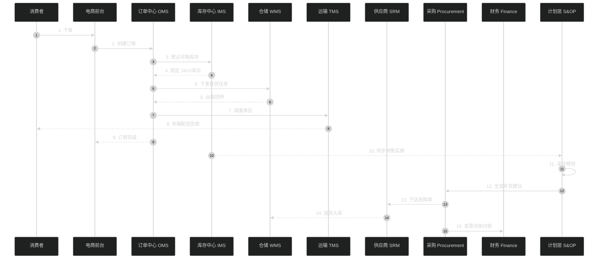
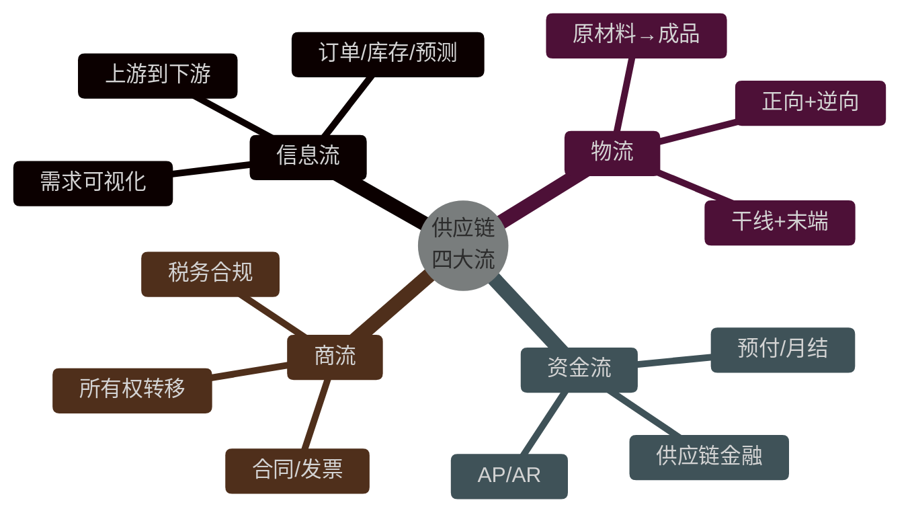
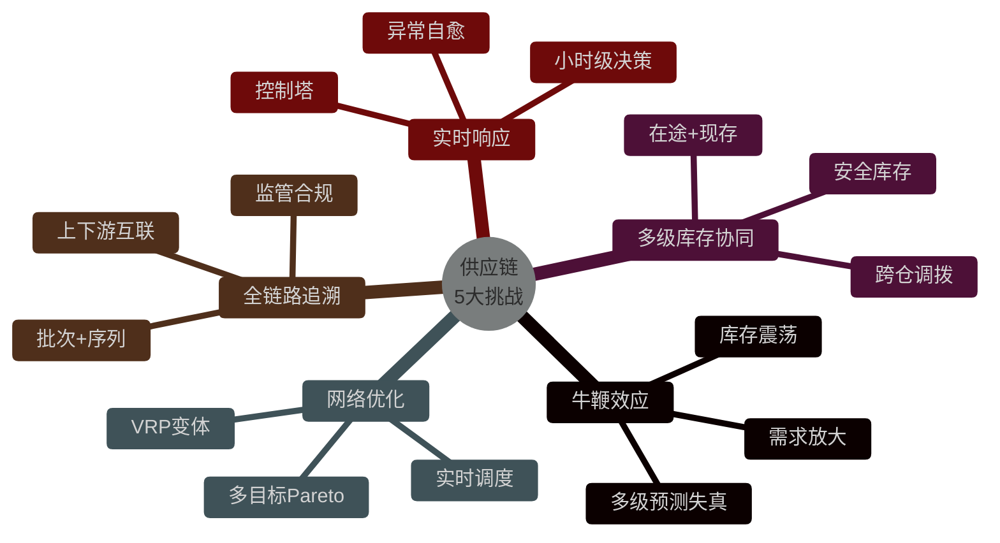
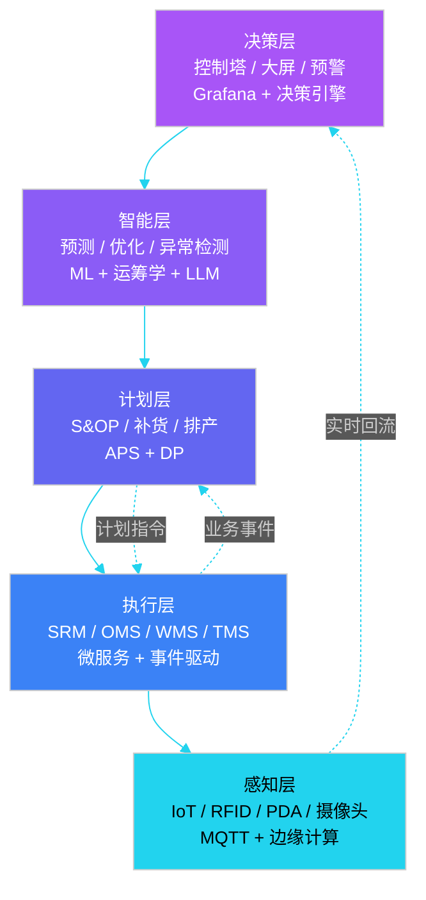
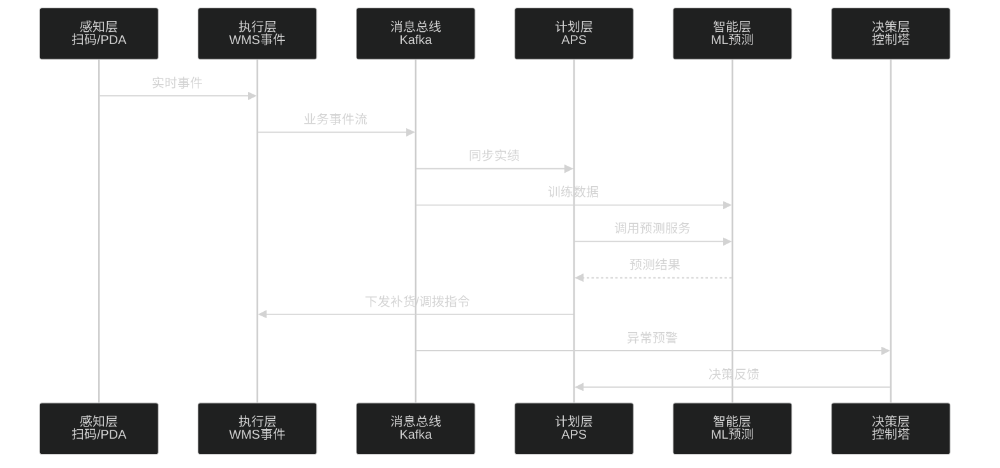
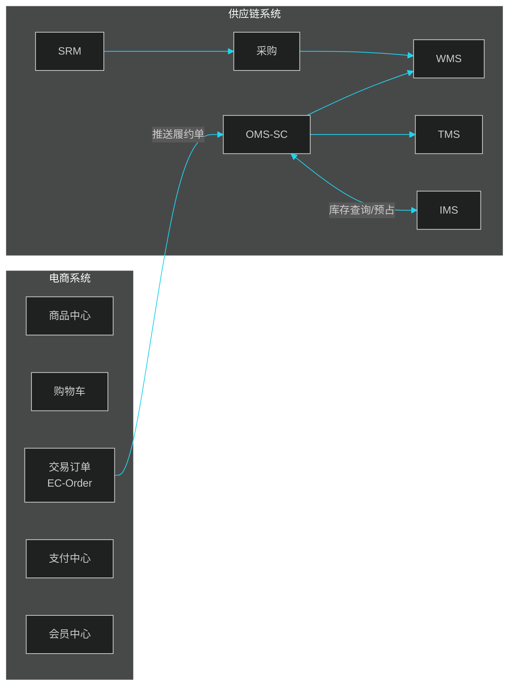
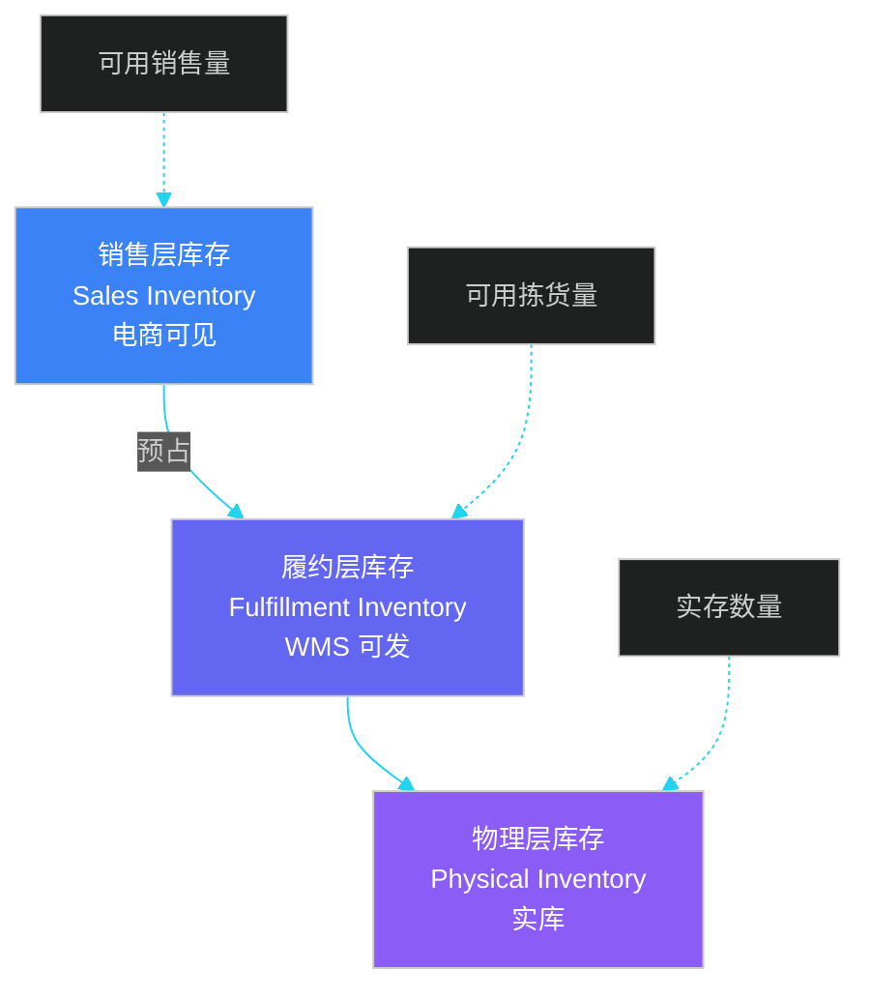
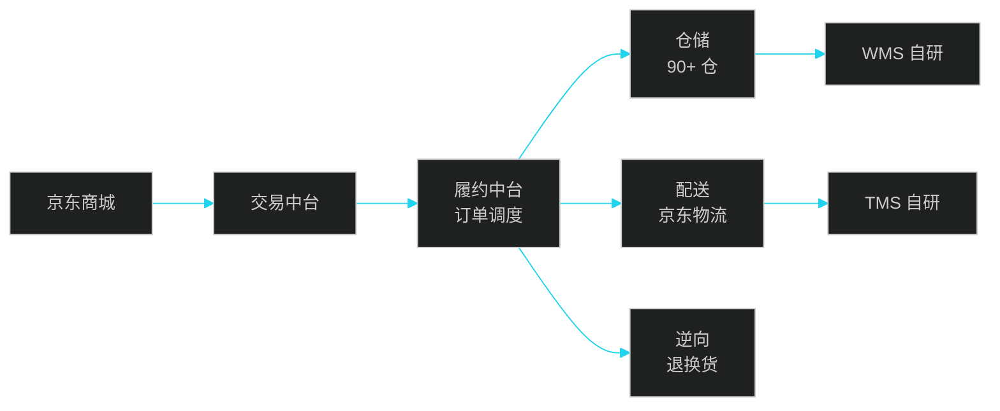
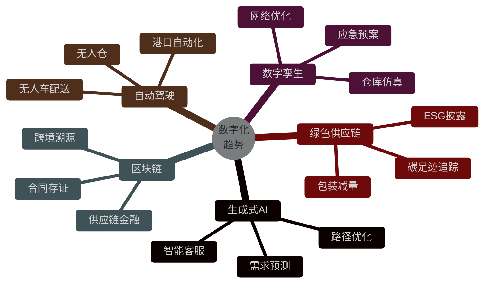

# 第 1 章 供应链系统概述

> 本章定位：从"业务全景 → 四大流 → 技术挑战 → 整体架构 → 与电商系统边界"五个维度，建立对供应链系统的整体认知。后续 14 章都是本章的细化与展开。
>
> **学习建议**：把下面这张"端到端时序图"打印贴在工位上。后续每学一个章节，回到这张图看"它在哪一环、解决了什么问题"。

---

## 1.1 供应链业务全景

一个现代化的供应链系统，**最简化**也需要覆盖 12 大业务域，按"上游→中游→下游"组织：

| 业务域 | 核心职责 | 关键场景 | 系统缩写 |
|--------|----------|---------|----------|
| 供应商管理 | 寻源、资质、绩效、分级 | 注册、审核、招标、淘汰 | SRM |
| 采购管理 | 需求、订单、付款 | PR/PO、收货、对账 | Procurement |
| 生产计划 | MRP、产能、调度 | 排产、工单、齐套分析 | PP/MES |
| 仓储管理 | 入库、出库、库内作业 | 上架、拣货、盘点、波次 | WMS |
| 库存管理 | 多级库存、批次、序列 | 可用量、安全库存、调拨 | IMS |
| 订单管理 | 正逆向履约 | 拆单、调度、SLA | OMS |
| 运输管理 | 干线、支线、调度 | 配载、在途、签收 | TMS |
| 配送管理 | 末端、众包、即时配 | 派单、轨迹、签收 | DMS |
| 需求计划 | 预测、补货、分配 | 时序、ML、安全库存 | DP |
| S&OP | 销售与运营协同 | 月度会议、共识计划 | S&OP |
| 控制塔 | 可视化、预警、决策 | 全链路监控、风险 | SCT |
| 财务结算 | 应付应收、发票、对账 | AP/AR、三单匹配 | Finance |

### 1.1.1 端到端业务链路

下面用一张时序图，把"原材料 → 成品 → 用户"全链路串起来，**这是后续每章都会回扣的主线**：



> **注意**：图中"计划层"是后向反馈链路（10-15），把消费侧实绩回流到采购与生产计划中，是供应链"自学习、自适应"的关键。

### 1.1.2 供应链的四大流

供应链管理的本质是协调**四种流**的同步：



| 流 | 起点 | 终点 | 核心系统 | 痛点 |
|----|------|------|----------|------|
| 信息流 | 需求 | 履约 | OMS/IMS/SRM | 牛鞭效应 |
| 物流 | 原料 | 用户 | WMS/TMS/DMS | 时效+成本 |
| 资金流 | 订单 | 付款 | Finance/Bank | 账期对账 |
| 商流 | 合同 | 签收 | ERP/Finance | 多组织合规 |

---

## 1.2 供应链的 5 大技术挑战

供应链系统比电商系统难得多，原因在于**多主体、多目标、多约束**。下面是 5 大核心挑战：



### 1.2.1 挑战一：牛鞭效应（Bullwhip Effect）

牛鞭效应是指**需求信息在从下游到上游传递时被逐级放大**，导致上游库存严重积压或缺货。

**经典案例**：宝洁的尿布案例——零售端日均销量波动 5%，但到宝洁工厂的订单波动达到 40%。


**系统设计对策**：

| 对策 | 系统能力 | 代表实践 |
|------|---------|----------|
| VMI（供应商管理库存） | 库存透明共享 | 宝洁-沃尔玛 CPFR |
| 联合预测 | 上下游共创预测 | 沃尔玛 CPFR |
| 缩短 Lead Time | 小批量多频次 | ZARA 极速供应链 |
| 订单平滑 | 削峰填谷算法 | 苹果"准时制" |
| 数字孪生 | 仿真推演 | 西门子、京东 |

### 1.2.2 挑战二：多级库存协同

供应链库存涉及**现存、在途、预占、在制**4 种状态，要同时满足"不缺货"和"不积压"两个相互矛盾的目标。

```
可用库存（ATP, Available to Promise）=
    物理库存（on-hand）
  + 在途入库（in-transit inbound）
  - 已预占（allocated）
  - 安全库存（safety stock）
```

### 1.2.3 挑战三：网络优化

运输路径、车辆配载、仓网布局、库存布点，本质都是**组合优化**问题：

| 优化问题 | 经典模型 | 难度 |
|---------|---------|------|
| 车辆路径 | VRP / CVRP / VRPTW | NP-Hard |
| 仓网选址 | 整数规划 | NP-Hard |
| 库存分配 | 二次分配 | NP-Hard |
| 拣货路径 | TSP 变体 | NP-Hard |
| 装箱问题 | 3D-BPP | NP-Hard |

实际系统通常用**启发式 + 局部搜索 + 元启发式**（如禁忌搜索、模拟退火、GA、ALNS）配合实时重调度。

### 1.2.4 挑战四：全链路追溯

监管要求 + 消费者诉求，迫使系统支持：

- **批次追溯**：生产日期、有效期、批号、LOT
- **序列号追溯**：单品级（医药、电子、奢侈品）
- **双向追溯**：上游（Forward）+ 下游（Backward）
- **FIFO / FEFO**：先进先出 / 先到期先出

**案例**：2008 年中国三聚氰胺事件后，国家强制要求**婴幼儿配方乳粉**实现全链路批次追溯。

### 1.2.5 挑战五：实时响应

传统 ERP 决策周期是"日"，现代供应链要求"小时"甚至"分钟"级：

| 决策类型 | 传统周期 | 现代要求 |
|---------|---------|---------|
| 补货 | 周 | 日 |
| 调拨 | 月 | 小时 |
| 路径 | 静态 | 动态 |
| 库存预警 | 日报 | 实时流 |
| 异常处理 | 人工 | 自动 |

---

## 1.3 整体技术架构（5 层）

供应链系统架构可以抽象为 5 层，从下到上依次是**感知层、执行层、计划层、智能层、决策层**：



### 1.3.1 各层职责与技术栈

| 层级 | 核心职责 | 典型技术栈 | SLA |
|------|---------|-----------|-----|
| **决策层** | 业务可视化、风险监控、决策辅助 | BI（Tableau/PowerBI）、Grafana、决策引擎（Drools） | 分钟级 |
| **智能层** | 预测、路径优化、异常检测 | Python（Prophet/LightGBM/OR-Tools）、LLM | 小时级 |
| **计划层** | 滚动预测、补货建议、S&OP | APS（o9/Blue Yonder）、自研 DP 系统 | 日级 |
| **执行层** | 日常业务操作 | Java/Spring Cloud、Kafka、RocketMQ | 秒级 |
| **感知层** | 设备数据采集 | IoT 平台（EMQX/ThingsBoard）、RFID、扫码枪 | 毫秒级 |

### 1.3.2 数据流向



---

## 1.4 与电商系统的边界

供应链系统和电商系统是**强协同**关系，但**业务边界**要清晰划分。常见误区是把供应链和电商混在一起设计，导致**业务边界模糊**、**状态机冲突**。

### 1.4.1 系统边界



**核心边界**：

| 维度 | 电商订单（EC-Order） | 履约订单（SC-Order） |
|------|---------------------|---------------------|
| 视角 | 消费者/会员 | 仓库/承运商 |
| 生命周期 | 下单→签收 | 接单→签收 |
| 状态机 | 简单（10+ 状态） | 复杂（30+ 状态） |
| 库存语义 | 销售库存 | 物理库存 |
| 单据粒度 | 一笔交易 | 可拆多笔履约单 |

### 1.4.2 库存的双层模型



**关键公式**：

```
销售层可用 = 销售总库存 - 已下单未支付 - 已支付未发货
履约层可用 = 销售层可用 - 履约层已锁定
物理层实存 = 履约层可用 + 履约层已锁定（未出库）
```

### 1.4.3 API 边界设计

```java
// ============ 电商调用供应链的 API 示例 ============

/**
 * 履约单创建请求（电商 → 供应链 OMS）
 */
public class FulfillmentOrderCreateRequest {
    private String ecOrderId;       // 电商订单号
    private String buyerId;          // 买家
    private List<LineItem> items;    // 商品行
    private Address shipTo;          // 收货地址
    private Date expectedShipTime;   // 期望发货时间
}

/**
 * 履约单响应
 */
public class FulfillmentOrderResponse {
    private String fulfillmentId;   // 履约单号
    private String status;          // 状态：CREATED/ALLOCATED/SHIPPED
    private String warehouseCode;   // 分配仓库
    private Long estimatedArrival;  // 预计送达时间戳
}

/**
 * 库存查询（电商 → 供应链 IMS）
 */
public class InventoryQueryRequest {
    private List<String> skuCodes;
    private String region;          // 区域
    private String channel;         // 渠道
}
```

---

## 1.5 行业代表企业实践

### 1.5.1 京东：自营一体化供应链

**核心特征**：自营 + 自建仓配 + 自研系统

- **仓储网络**：90+ 仓库，覆盖 31 个省
- **自研系统**：青龙（ERP）、玄武（PMS）、神盾（风控）
- **211 限时达**：上午 11 点前下单，当日达；晚上 11 点前下单，明日达

**架构亮点**：



### 1.5.2 阿里巴巴：菜鸟网络 + 平台化

**核心特征**：平台模式（轻资产）+ 数据协同

- **四纵两横**：天猫、淘宝、聚划算、淘海外 / 菜鸟、阿里云
- **菜鸟网络**：3000+ 合作伙伴，连接 300 万物流人员
- **电子面单**：5 年时间普及到 100% 包裹

**架构亮点**：

- **库存共享**：天猫商家一盘货，多平台销售
- **菜鸟驿站**：末端 10 万+ 站点
- **丹鸟、点我达**：即时配送网络

### 1.5.3 亚马逊：FBA + 预测驱动

**核心特征**：FBA（Fulfillment by Amazon）让卖家把货提前发到亚马逊仓库

- **FBA 仓库**：全球 175+ 履约中心
- **Prime 会员**：2 日达 / 当日达
- **AI 驱动**：需求预测、补货、定价

**关键创新**：

| 创新 | 描述 | 效果 |
|------|------|------|
| Kiva 机器人 | 货架到人 | 拣货效率 3 倍 |
| Anticipatory Shipping | 预测式发货 | 缩短送达 1-2 天 |
| 动态分仓 | 就近发货 | 降低运费 30% |

### 1.5.4 沃尔玛：CPFR 协同补货

**核心特征**：与供应商深度协同（CPFR，Collaborative Planning, Forecasting, and Replenishment）

- 沃尔玛与宝洁的 CPFR 案例：联合预测、补货决策
- 库存周转：6.5 次/年（行业平均 8-10 次）
- 缺货率：行业最低

### 1.5.5 Zara：极速供应链

**核心特征**：从设计到上架 2 周（行业平均 6 个月）

- **小批量 + 多频次**：单 SKU 首批 5000 件
- **直营门店**：80% 直营，控制权强
- **总仓 + 工厂直发**：跳过配送中心
- **数据驱动**：门店 POS 数据 24 小时回流

### 1.5.6 中国跨境电商：SHEIN

**核心特征**：柔性供应链 + 小单快反

- **广州番禺**：300+ 合作工厂
- **小单试款**：100-300 件起订
- **7-15 天交付**：行业最快
- **全链路数字化**：从设计到物流的实时追踪

---

## 1.6 供应链数字化趋势（2024-2026）



| 趋势 | 落地场景 | 代表企业 |
|------|---------|----------|
| 生成式 AI | 需求预测、文档生成、智能客服 | 京东、亚马逊 |
| 数字孪生 | 仓库仿真、网络优化 | 西门子、京东、菜鸟 |
| 区块链 | 跨境溯源、医药、奢侈品 | IBM Food Trust、蚂蚁链 |
| 自动驾驶 | 末端配送、干线物流 | Nuro、TuSimple、菜鸟 |
| 绿色供应链 | 碳足迹、新能源车队 | 沃尔玛、亚马逊 |

---

## 本章小结

供应链系统的本质是协调**信息流、物流、资金流、商流**的同步。**牛鞭效应、多级库存、网络优化、全链路追溯、实时响应**是 5 大核心挑战。整体技术架构分为 5 层：**感知层 → 执行层 → 计划层 → 智能层 → 决策层**。

供应链系统与电商系统是上下游关系，**边界设计**至关重要——电商订单 vs 履约订单的分离、销售库存 vs 物理库存的双层模型是典型设计。京东、亚马逊、Zara、沃尔玛、SHEIN 等代表企业展示了不同模式的供应链设计哲学。

后续章节将按"基础 → 仓储库存 → 物流配送 → 智能协同 → 未来"的顺序逐步深入。

---

## 面试高频问题

**1. 什么是牛鞭效应？如何在系统层面缓解？**

参考答案要点：牛鞭效应指需求信息从下游到上游传递时被逐级放大，导致上游库存震荡。系统层面缓解方案：①VMI（供应商管理库存）实现库存透明共享；②CPFR 联合预测；③缩短 Lead Time，小批量多频次；④订单平滑算法；⑤数字孪生仿真。

**2. 供应链系统与电商系统如何划分边界？**

参考答案要点：① 业务边界：电商系统面向消费者（C 端），供应链系统面向履约（B 端 + 仓配）；② 订单分离：电商订单 EC-Order vs 履约订单 SC-Order；③ 库存双层模型：销售层 vs 物理层；④ 通过 API 同步：电商推送履约单，供应链返回状态。

**3. 库存的可用量（ATP）如何计算？**

参考答案要点：ATP = 物理库存 + 在途入库 - 已预占 - 安全库存。需要考虑批次、序列号、库位、效期等维度。预占有 TTL 机制，超时自动释放。

**4. 什么是 VMI？什么是 CPFR？**

参考答案要点：VMI（Vendor Managed Inventory）是供应商管理库存，由供应商决定补货；CPFR（Collaborative Planning, Forecasting, and Replenishment）是协同规划、预测与补货，沃尔玛和宝洁首创。两者都能缓解牛鞭效应。

**5. 数字孪生在供应链中的应用场景？**

参考答案要点：① 仓库仿真（库位布局、拣货路径）；② 运输网络优化（仓网选址、车辆路径）；③ 应急预案推演（疫情、灾害）；④ 实时监控与决策支持。

**6. 京东、亚马逊、Zara 的供应链设计哲学有何不同？**

参考答案要点：① 京东——自营一体化，211 限时达，牺牲成本换时效；② 亚马逊——FBA + 预测驱动，技术驱动的规模效应；③ Zara——极速时尚，2 周上新，舍弃规模换速度；④ 沃尔玛——CPFR 协同，库存周转率极高；⑤ SHEIN——柔性供应链 + 小单快反。

**7. 供应链的"四大流"是什么？**

参考答案要点：① 信息流（订单/库存/预测）；② 物流（实物移动）；③ 资金流（应付/应收）；④ 商流（所有权转移、合同发票）。四大流必须同步，否则会出现"信息流领先物流、资金流落后"等问题。

**8. 什么是 SLB（Service Level Benchmark）？**

参考答案要点：服务水准基准，包括订单满足率（Fill Rate）、按时交付率（OTD）、订单周期时间（Order Cycle Time）、缺货率（Stockout Rate）等。是衡量供应链系统健康度的核心 KPI。
