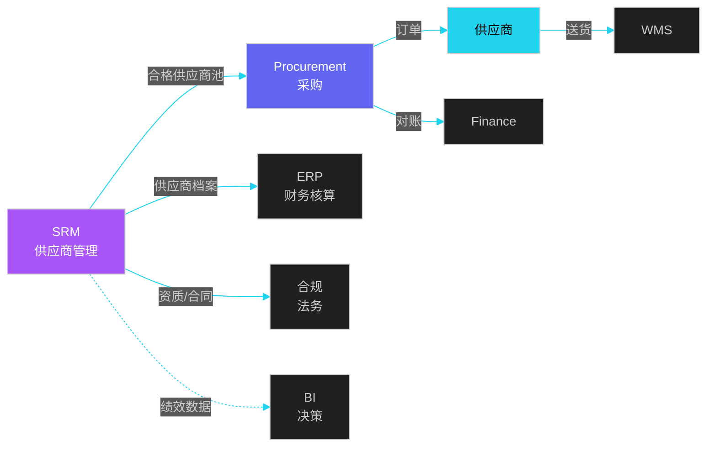
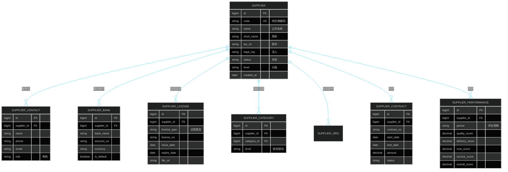
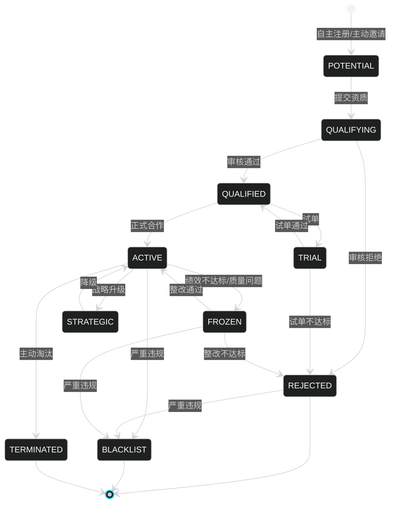
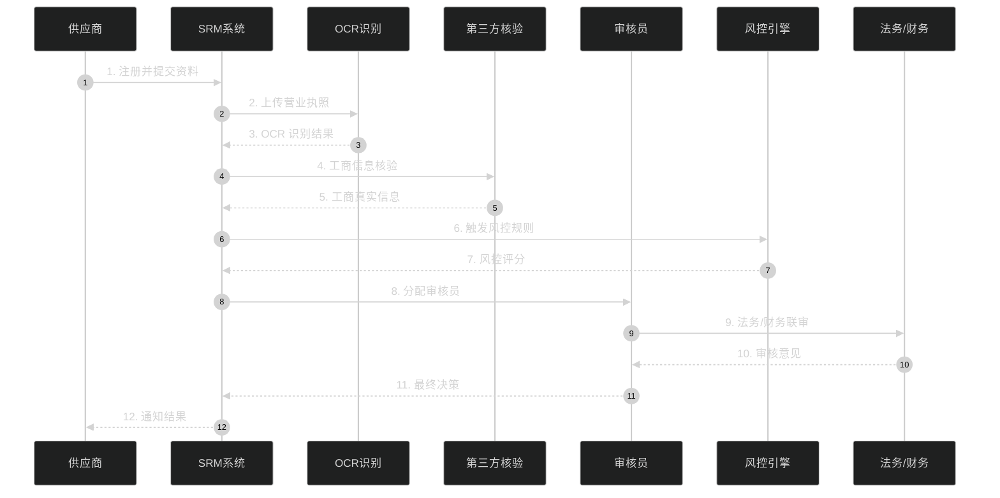
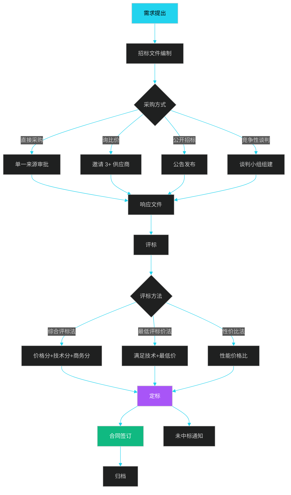
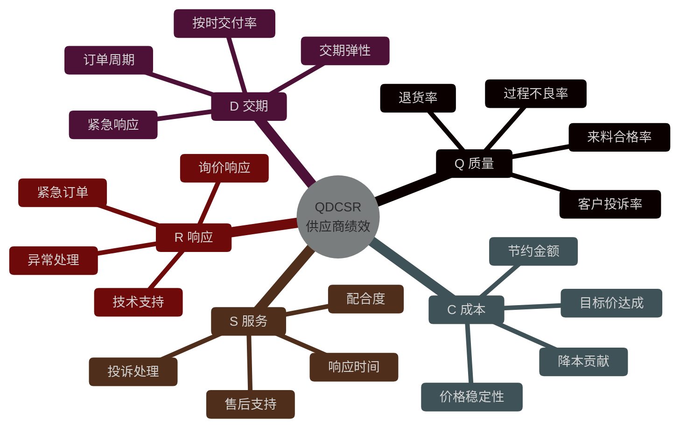
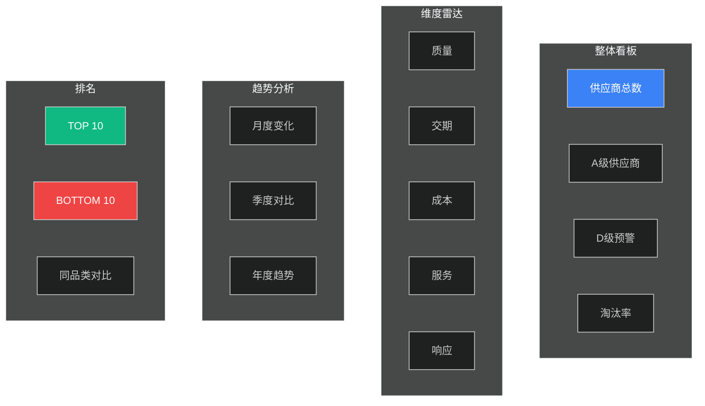
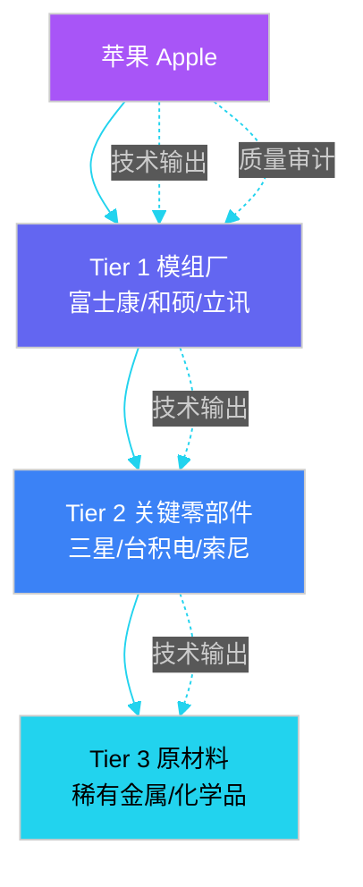
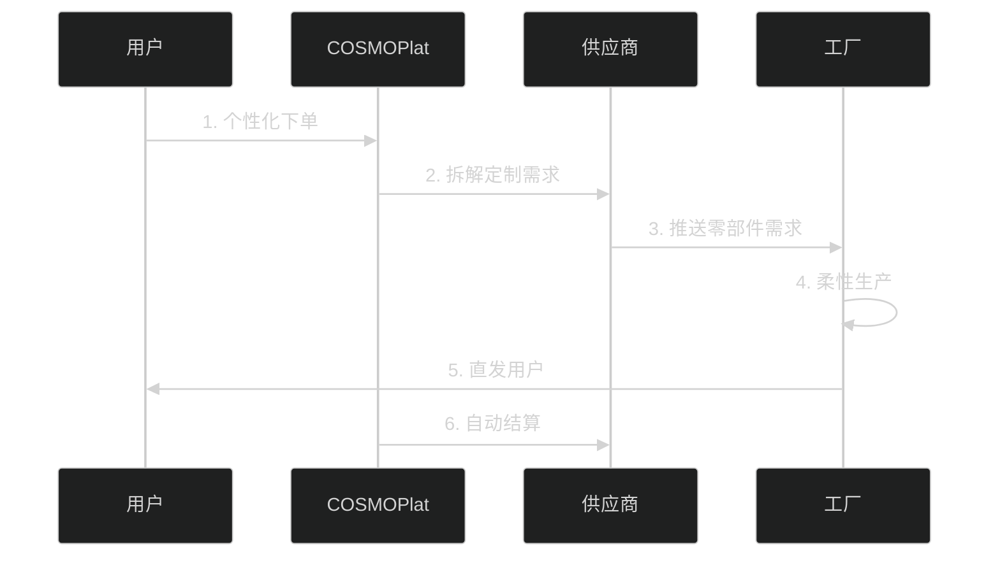

# 第 2 章 供应商管理 SRM（Supplier Relationship Management）

> 本章定位：供应商的全生命周期管理——从寻源、准入、合作到淘汰。供应链系统的"上游入口"。
>
> **学习建议**：本章与第 3 章（采购）紧密配合——SRM 负责"管人"，Procurement 负责"管事"。

---

## 2.1 SRM 在供应链中的位置

SRM 是供应链系统的"上游闸门"，决定后续采购、生产的质量与成本。



**SRM 四大核心模块**：

| 模块 | 职责 | 关键实体 |
|------|------|----------|
| 供应商主数据 | 注册、档案、变更 | 供应商、联系人、银行账户、证照 |
| 准入审核 | 资质、合规、风控 | 资质证照、合规检查、黑名单 |
| 寻源与合同 | 招标、比价、合同 | 询价单、投标书、合同 |
| 绩效管理 | 评估、分级、淘汰 | KPI、绩效报告、整改单 |

---

## 2.2 供应商主数据模型

供应商主数据是 SRM 的基石，**数据质量**直接决定后续所有业务可用性。

### 2.2.1 核心实体 ER 图



### 2.2.2 核心表结构 SQL

```sql
-- ============ 供应商主表 ============
CREATE TABLE t_supplier (
    id              BIGINT PRIMARY KEY AUTO_INCREMENT,
    code            VARCHAR(32) NOT NULL UNIQUE COMMENT '供应商编码',
    name            VARCHAR(128) NOT NULL COMMENT '公司全称',
    short_name      VARCHAR(64) COMMENT '简称',
    tax_no          VARCHAR(32) COMMENT '统一社会信用代码',
    legal_rep       VARCHAR(64) COMMENT '法人代表',
    registered_cap  DECIMAL(18,2) COMMENT '注册资本',
    established_dt  DATE COMMENT '成立日期',
    country         VARCHAR(32) COMMENT '国家/地区',
    province        VARCHAR(32) COMMENT '省份',
    city            VARCHAR(32) COMMENT '城市',
    address         VARCHAR(256) COMMENT '详细地址',
    supplier_type   VARCHAR(16) COMMENT '类型：MANUFACTURER/AGENT/TRADER',
    level           VARCHAR(8) COMMENT '分级：A/B/C/D',
    status          VARCHAR(16) NOT NULL COMMENT '状态：POTENTIAL/QUALIFIED/FROZEN/BLACKLIST',
    is_blacklist    TINYINT DEFAULT 0,
    created_at      DATETIME NOT NULL DEFAULT CURRENT_TIMESTAMP,
    updated_at      DATETIME NOT NULL DEFAULT CURRENT_TIMESTAMP ON UPDATE CURRENT_TIMESTAMP,
    INDEX idx_code (code),
    INDEX idx_status (status),
    INDEX idx_level (level)
) ENGINE=InnoDB DEFAULT CHARSET=utf8mb4 COMMENT='供应商主表';

-- ============ 资质证照表（生命周期管理）===========
CREATE TABLE t_supplier_license (
    id              BIGINT PRIMARY KEY AUTO_INCREMENT,
    supplier_id     BIGINT NOT NULL,
    license_type    VARCHAR(32) NOT NULL COMMENT '营业执照/ISO9001/CE/FDA/3C',
    license_no      VARCHAR(64) NOT NULL,
    issue_org       VARCHAR(128) COMMENT '发证机构',
    issue_date      DATE NOT NULL,
    expire_date     DATE NOT NULL,
    file_url        VARCHAR(256) COMMENT '证照文件',
    verify_status   VARCHAR(16) COMMENT '审核状态',
    verified_by     BIGINT COMMENT '审核人',
    verified_at     DATETIME,
    created_at      DATETIME NOT NULL DEFAULT CURRENT_TIMESTAMP,
    INDEX idx_supplier (supplier_id),
    INDEX idx_expire (expire_date)
) ENGINE=InnoDB COMMENT='供应商资质证照';

-- ============ 供应商-品类授权表 ============
CREATE TABLE t_supplier_category_auth (
    id              BIGINT PRIMARY KEY AUTO_INCREMENT,
    supplier_id     BIGINT NOT NULL,
    category_l1     VARCHAR(32) COMMENT '一级品类',
    category_l2     VARCHAR(32) COMMENT '二级品类',
    category_l3     VARCHAR(32) COMMENT '三级品类',
    auth_level      VARCHAR(16) COMMENT '授权级别：PRIMARY/SECONDARY/BACKUP',
    effective_date  DATE,
    expiry_date     DATE,
    INDEX idx_supplier (supplier_id)
) ENGINE=InnoDB COMMENT='供应商品类授权';
```

### 2.2.3 主数据治理

```java
/**
 * 供应商主数据服务
 */
@Service
public class SupplierMasterDataService {

    /**
     * 创建供应商草稿
     * 1. 唯一性校验：税号、编码
     * 2. 关联方识别
     * 3. 黑名单检查
     * 4. 触发准入审核
     */
    @Transactional
    public Supplier createDraft(SupplierDraftDTO dto) {
        // 1. 税号唯一性
        Supplier exist = supplierRepository.findByTaxNo(dto.getTaxNo());
        if (exist != null) {
            throw new BizException("该税号已注册，请联系管理员合并");
        }

        // 2. 编码唯一性
        if (supplierRepository.findByCode(dto.getCode()) != null) {
            throw new BizException("编码已存在");
        }

        // 3. 关联方识别（同法人、同股东、同地址）
        List<Supplier> related = supplierRepository.findRelatedParties(
            dto.getLegalRep(), dto.getAddress(), dto.getBankAccount());
        if (!related.isEmpty()) {
            log.warn("发现疑似关联方: {}", related);
            // 触发人工审核
            dto.setRiskFlag("RELATED_PARTY");
        }

        // 4. 黑名单拦截
        if (blacklistService.isInBlacklist(dto.getName(), dto.getLegalRep())) {
            throw new BizException("供应商在黑名单中，禁止准入");
        }

        // 5. 落库
        Supplier supplier = new Supplier();
        BeanUtils.copyProperties(dto, supplier);
        supplier.setStatus("POTENTIAL");
        return supplierRepository.save(supplier);
    }
}
```

---

## 2.3 供应商生命周期（9 大状态）

供应商全生命周期有 9 大状态，**状态机**是核心设计。



### 2.3.1 9 大状态说明

| 状态 | 含义 | 进入条件 | 退出条件 | 业务权限 |
|------|------|---------|---------|---------|
| POTENTIAL（潜在） | 已注册但未提交资质 | 自主注册 | 提交资质 | 不可下单 |
| QUALIFYING（审核中） | 资质审核进行中 | 提交资质 | 审核完成 | 不可下单 |
| QUALIFIED（合格） | 通过资质审核 | 审核通过 | 试单/淘汰 | 可试单 |
| TRIAL（试单） | 试单合作中 | 准入决策 | 试单结果 | 限单品类 |
| ACTIVE（合作） | 正式合作 | 试单通过 | 冻结/淘汰 | 全品类 |
| STRATEGIC（战略） | 战略合作伙伴 | 升级 | 降级 | 优先权 |
| FROZEN（冻结） | 暂停合作 | 质量问题/绩效差 | 整改/淘汰 | 不可下单 |
| TERMINATED（淘汰） | 主动淘汰 | 业务调整 | - | 历史可查 |
| BLACKLIST（黑名单） | 永久禁用 | 严重违规 | - | 不可恢复 |

### 2.3.2 状态机引擎

```java
/**
 * 供应商状态机
 * 基于 Spring State Machine
 */
@Component
public class SupplierStateMachine {

    @Autowired
    private StateMachineFactory<SupplierStatus, SupplierEvent> factory;

    /**
     * 触发状态转换
     */
    public boolean fire(Long supplierId, SupplierEvent event) {
        Supplier supplier = supplierRepository.findById(supplierId).orElseThrow();
        StateMachine<SupplierStatus, SupplierEvent> sm = factory.getStateMachine(supplierId.toString());

        // 状态守卫
        SupplierStatus current = supplier.getStatus();
        if (!canTransition(current, event)) {
            throw new BizException("当前状态不允许该操作");
        }

        Message<SupplierEvent> msg = MessageBuilder.withPayload(event)
            .setHeader("operator", SecurityContext.getUserId())
            .setHeader("reason", event.getReason())
            .build();

        // 触发转换
        List<StateMachineAccessListener<S, E>> listeners = ...;
        sm.sendEvent(msg);

        // 持久化新状态
        supplier.setStatus(sm.getState().getId());
        supplierRepository.save(supplier);

        return true;
    }

    /**
     * 状态守卫：定义合法转换
     */
    private boolean canTransition(SupplierStatus from, SupplierEvent event) {
        Map<SupplierStatus, Set<SupplierEvent>> allowed = Map.of(
            POTENTIAL, SetOf(SUBMIT_QUALIFICATION),
            QUALIFYING, SetOf(QUALIFY_PASS, QUALIFY_REJECT),
            QUALIFIED, SetOf(START_TRIAL, TERMINATE),
            TRIAL, SetOf(TRIAL_PASS, TRIAL_FAIL),
            ACTIVE, SetOf(FREEZE, UPGRADE_STRATEGIC, TERMINATE, BLACKLIST_OP),
            FROZEN, SetOf(RECTIFY_PASS, TERMINATE, BLACKLIST_OP)
        );
        return allowed.getOrDefault(from, Set.of()).contains(event);
    }
}
```

---

## 2.4 资质审核与风控

### 2.4.1 资质审核流程



### 2.4.2 资质证照类型

| 证照类型 | 必要性 | 审核要点 | 失效影响 |
|---------|--------|---------|---------|
| 营业执照 | 必填 | 真实有效、范围匹配 | 立即冻结 |
| 法人身份证 | 必填 | 与工商一致 | 立即冻结 |
| 银行开户许可 | 必填 | 账户真实 | 禁止付款 |
| ISO 9001 | 视品类 | 体系认证 | 警告 |
| ISO 14001 | 视品类 | 环保认证 | 警告 |
| OHSAS 18001 | 视品类 | 职业健康 | 警告 |
| 行业资质（如 3C、CE、FDA） | 按品类 | 强制认证 | 立即下架 |
| 财务审计报告 | 战略供应商 | 资信评估 | 战略降级 |
| 完税证明 | 战略供应商 | 合规纳税 | 战略降级 |

### 2.4.3 风控引擎

```java
/**
 * 供应商风控引擎
 */
@Service
public class SupplierRiskEngine {

    /**
     * 计算风控评分（0-100，越低越危险）
     */
    public RiskScore evaluate(Supplier supplier) {
        RiskScore score = new RiskScore();

        // 1. 工商信息（满分 20）
        score.add(getBusinessLicenseScore(supplier));

        // 2. 财务健康度（满分 20）
        score.add(getFinancialScore(supplier));

        // 3. 历史合作记录（满分 20）
        score.add(getHistoryScore(supplier));

        // 4. 关联方风险（满分 20）
        score.add(getRelatedPartyScore(supplier));

        // 5. 黑名单匹配（满分 20，倒扣）
        score.add(getBlacklistScore(supplier));

        return score;
    }

    /**
     * 黑名单匹配
     */
    private double getBlacklistScore(Supplier s) {
        // 名称匹配
        if (blacklistRepo.existsByCompanyName(s.getName())) {
            return -100; // 直接一票否决
        }
        // 法人匹配
        if (blacklistRepo.existsByLegalRep(s.getLegalRep())) {
            return -50;
        }
        // 地址模糊匹配
        if (blacklistRepo.existsByAddressLike(s.getAddress())) {
            return -30;
        }
        return 20;
    }

    /**
     * 关联方识别（图算法）
     */
    public List<RelatedParty> findRelatedParties(Supplier s) {
        // 同法人
        List<Supplier> sameLegal = supplierRepo.findByLegalRep(s.getLegalRep());
        // 同股东
        List<Supplier> sameStockholder = shareholderRepo.findRelated(s);
        // 同地址
        List<Supplier> sameAddress = supplierRepo.findByAddress(s.getAddress());

        // 合并去重
        return Stream.of(sameLegal, sameStockholder, sameAddress)
            .flatMap(List::stream)
            .distinct()
            .map(other -> RelatedParty.builder()
                .supplierId(other.getId())
                .supplierName(other.getName())
                .relationship(judgeRelationship(s, other))
                .build())
            .collect(toList());
    }
}
```

### 2.4.4 反围标识别

```java
/**
 * 反围标引擎
 * 通过投标行为识别围标
 */
@Service
public class AntiCollusionEngine {

    /**
     * 围标识别：3 个供应商"轮流坐庄"或"陪标专业户"
     */
    public boolean isCollusion(List<Bidder> bidders) {
        // 1. 同一 IP 段投标
        Set<String> ips = bidders.stream()
            .map(b -> extractIpSegment(b.getIp()))
            .collect(toSet());
        if (ips.size() == 1) return true;  // 全部同一 IP

        // 2. 同一设备指纹
        Set<String> devices = bidders.stream()
            .map(Bidder::getDeviceFingerprint)
            .collect(toSet());
        if (devices.size() == 1) return true;

        // 3. 历史陪标率（某供应商陪标率 > 90%）
        for (Bidder b : bidders) {
            double accompanyRate = historyRepo.getAccompanyRate(b.getSupplierId());
            if (accompanyRate > 0.9 && bidders.size() < 4) {
                return true;
            }
        }

        // 4. 报价离散度异常（围标特征）
        double stddev = calcPriceStddev(bidders);
        if (stddev < 0.01) return true;  // 报价过于集中

        return false;
    }
}
```

---

## 2.5 寻源与招标

### 2.5.1 五大采购方式对比

| 方式 | 适用场景 | 优点 | 缺点 | 周期 |
|------|---------|------|------|------|
| **直接采购** | 单一来源、关键物资 | 速度快 | 缺竞争 | 1-3 天 |
| **询比价** | 标准品、3+ 供应商 | 简单 | 透明性弱 | 5-10 天 |
| **竞争性谈判** | 复杂需求 | 灵活 | 主观性强 | 10-20 天 |
| **公开招标** | 大额、政府项目 | 公开公正 | 周期长 | 30-60 天 |
| **框架协议** | 长期合作 | 效率高 | 灵活性差 | 一次性签订 |

### 2.5.2 招标流程



### 2.5.3 评标模型

```java
/**
 * 综合评标法
 * 总分 = 价格分 * 40% + 技术分 * 40% + 商务分 * 20%
 */
@Service
public class ComprehensiveEvaluationService {

    public EvaluationResult evaluate(BiddingProject project) {
        List<Bid> bids = project.getBids();
        EvaluationResult result = new EvaluationResult();

        // 1. 价格分计算（最低价法）
        BigDecimal minPrice = bids.stream()
            .map(Bid::getTotalPrice)
            .min(Comparator.naturalOrder())
            .orElseThrow();
        for (Bid bid : bids) {
            BigDecimal priceScore = minPrice
                .divide(bid.getTotalPrice(), 4, RoundingMode.HALF_UP)
                .multiply(BigDecimal.valueOf(60))  // 价格满分 60
                .setScale(2, RoundingMode.HALF_UP);
            bid.setPriceScore(priceScore);
        }

        // 2. 技术分（专家打分）
        for (Bid bid : bids) {
            // 去掉最高最低取均值
            double techScore = bid.getExpertScores().stream()
                .sorted()
                .skip(1)
                .limit(bid.getExpertScores().size() - 2)
                .mapToInt(Integer::intValue)
                .average()
                .orElse(0);
            bid.setTechScore(BigDecimal.valueOf(techScore));
        }

        // 3. 商务分（资质、案例、服务等）
        for (Bid bid : bids) {
            double bizScore = calcBusinessScore(bid);
            bid.setBizScore(BigDecimal.valueOf(bizScore));
        }

        // 4. 加权汇总
        for (Bid bid : bids) {
            BigDecimal total = bid.getPriceScore().multiply(BigDecimal.valueOf(0.4))
                .add(bid.getTechScore().multiply(BigDecimal.valueOf(0.4)))
                .add(bid.getBizScore().multiply(BigDecimal.valueOf(0.2)));
            bid.setTotalScore(total);
        }

        // 5. 排序
        result.setRankedBids(
            bids.stream()
                .sorted(Comparator.comparing(Bid::getTotalScore).reversed())
                .collect(toList())
        );

        return result;
    }
}
```

---

## 2.6 绩效评估体系

### 2.6.1 QDCSR 五大维度

供应商绩效评估的核心是 **QDCSR** 五大维度：



### 2.6.2 绩效计算引擎

```java
/**
 * 供应商绩效计算引擎
 */
@Service
public class SupplierPerformanceCalculator {

    /**
     * 计算某供应商某周期的综合绩效
     */
    public SupplierPerformance calculate(Long supplierId, String period) {
        SupplierPerformance perf = new SupplierPerformance();
        perf.setSupplierId(supplierId);
        perf.setPeriod(period);

        // 1. 质量分（30%）
        double qScore = calcQualityScore(supplierId, period);
        perf.setQualityScore(qScore);

        // 2. 交期分（25%）
        double dScore = calcDeliveryScore(supplierId, period);
        perf.setDeliveryScore(dScore);

        // 3. 成本分（20%）
        double cScore = calcCostScore(supplierId, period);
        perf.setCostScore(cScore);

        // 4. 服务分（15%）
        double sScore = calcServiceScore(supplierId, period);
        perf.setServiceScore(sScore);

        // 5. 响应分（10%）
        double rScore = calcResponseScore(supplierId, period);
        perf.setResponseScore(rScore);

        // 6. 加权综合分
        double total = qScore * 0.30 + dScore * 0.25 + cScore * 0.20
            + sScore * 0.15 + rScore * 0.10;
        perf.setOverallScore(round(total, 2));

        // 7. 分级
        perf.setLevel(judgeLevel(total));

        return perfRepository.save(perf);
    }

    /**
     * 质量分计算
     */
    private double calcQualityScore(Long supplierId, String period) {
        // 数据来源：来料检验记录、不良品记录、退货记录
        QcStats stats = qcRepository.getStats(supplierId, period);

        double lotPassRate = stats.getLotPassRate();     // 批次合格率
        double defectRate = 1 - stats.getDefectRate();  // 良品率
        double returnRate = 1 - stats.getReturnRate();  // 退货率倒数

        // 加权
        return lotPassRate * 0.4 + defectRate * 0.4 + returnRate * 0.2;
    }

    /**
     * 分级判定
     */
    private String judgeLevel(double score) {
        if (score >= 90) return "A";  // 优秀
        if (score >= 80) return "B";  // 良好
        if (score >= 70) return "C";  // 合格
        if (score >= 60) return "D";  // 预警
        return "E";                  // 不合格
    }
}
```

### 2.6.3 绩效看板



---

## 2.7 案例与最佳实践

### 2.7.1 苹果：供应商分级管理（Tier 1/2/3）

苹果管理着 **Tier 1（一级）→ Tier 2（二级）→ Tier 3（三级）** 的多级供应商体系：



**苹果的独特做法**：

| 做法 | 描述 | 效果 |
|------|------|------|
| 预付订金 | 提前数年支付产能订金 | 锁定稀缺产能 |
| 资本性支出补贴 | 帮助供应商买设备 | 加速产能扩张 |
| 技术驻场 | 派工程师到供应商 | 提升良率 |
| 黑名单制度 | 严苛的淘汰机制 | 高压驱动 |
| 多源策略 | 关键料至少 2 家 | 降低断供风险 |

### 2.7.2 海尔 COSMOPlat：大规模定制

**核心特征**：用户全流程参与的大规模定制



**3 大特点**：

1. **用户直连制造**：用户订单直达工厂
2. **模块化生产**：供应商提供标准化模块
3. **零库存**：以销定产

### 2.7.3 京东的供应商管理实践

| 维度 | 做法 |
|------|------|
| 准入 | 严格资质审核 + 神秘客户调研 |
| 分级 | A/B/C/D 四级，A 级享受优先权 |
| 协同 | 京东供应商门户（VSP）实时协同 |
| 监控 | 实时 KPI 看板，自动预警 |
| 淘汰 | 季度评估，连续 2 个 D 级自动淘汰 |

### 2.7.4 SHEIN 的柔性供应链

- **广州番禺**：300+ 合作工厂
- **小单快反**：100-300 件起订
- **7-15 天交付**：行业最快
- **数据驱动**：实时销售数据回流供应商
- **不签独家**：保持供应商竞争性

---

## 本章小结

SRM 是供应链系统的"上游闸门"，覆盖**供应商主数据、准入审核、寻源招标、绩效管理**四大模块。9 大状态机（POTENTIAL → QUALIFYING → QUALIFIED → TRIAL → ACTIVE → STRATEGIC → FROZEN → TERMINATED → BLACKLIST）定义了供应商全生命周期。资质审核需要 OCR 识别 + 工商核验 + 风控引擎 + 法人/财务联审。绩效评估采用 QDCSR 五大维度，季度评估 + 实时监控。

苹果、海尔、京东、SHEIN 的实践展示了不同的供应商管理哲学：**分级深度协同**（苹果）、**大规模定制**（海尔）、**严格淘汰**（京东）、**柔性快反**（SHEIN）。

下一章将进入**采购管理**，介绍从需求到付款的完整采购流程。

---

## 面试高频问题

**1. SRM 与采购系统的边界是什么？**

参考答案要点：SRM 负责"管人"（供应商全生命周期：注册、资质、合作、淘汰），采购负责"管事"（单据流转：PR/PO/收货/付款）。SRM 输出合格供应商池，采购在此基础上执行具体业务。

**2. 供应商风控的核心点有哪些？**

参考答案要点：① 工商信息真实性（OCR + 第三方核验）；② 关联方识别（同法人、同股东、同地址）；③ 黑名单匹配；④ 财务健康度（注册资本、纳税记录）；⑤ 围标识别（IP 集中、设备指纹、陪标率）；⑥ 履约能力评估（产能、人员、案例）。

**3. 绩效评估的 QDCSR 是什么？**

参考答案要点：Q（Quality 质量）— 30% 权重；D（Delivery 交期）— 25%；C（Cost 成本）— 20%；S（Service 服务）— 15%；R（Response 响应）— 10%。最终得分映射 A/B/C/D/E 等级，决定供应商分级与淘汰。

**4. 如何识别围标行为？**

参考答案要点：① IP 集中度（多供应商同 IP 段投标）；② 设备指纹（同一台电脑多账号）；③ 陪标率（某供应商陪标率 > 90%）；④ 报价离散度（围标时报价过于集中）；⑤ 错位陪标（轮流坐庄）。

**5. 供应商分级管理的最佳实践？**

参考答案要点：① A 级（战略）— 享受优先权、长协、付款优待；② B 级（核心）— 持续合作，重点培养；③ C 级（合格）— 常规合作，激励升级；④ D 级（预警）— 限制品类，限期整改；⑤ E 级（淘汰）— 主动淘汰；⑥ 黑名单 — 严重违规永不合作。

**6. 反舞弊设计的关键点？**

参考答案要点：① 关联方识别（图算法）；② 围标识别（IP/设备/报价分析）；③ 利益冲突排查（采购员与供应商）；④ 审批权限分离（申请、审批、执行、付款分人）；⑤ 全程留痕（操作日志、邮件、IM 集成）；⑥ 神秘客户调研。

**7. 苹果的供应商分级管理有什么特点？**

参考答案要点：① 多级（Tier 1/2/3）覆盖全链路；② 资本性支出补贴（帮助供应商买设备）；③ 预付订金（提前数年锁定产能）；④ 严苛淘汰（黑名单制度）；⑤ 多源策略（关键料至少 2 家）。

**8. 供应商主数据的关键字段有哪些？**

参考答案要点：基础信息（名称、税号、法人、注册地址）、银行账户（开户行、账号、币种）、资质证照（营业执照、ISO、行业认证）、组织架构（母公司、子公司）、品类授权、联系人、合同。数据质量是 SRM 系统的基石。

**9. 寻源方式如何选择？**

参考答案要点：① 直接采购——单一来源、关键物资、紧急需求；② 询比价——标准品、3+ 合格供应商；③ 竞争性谈判——复杂需求、技术方案差异大；④ 公开招标——大额、政府项目、合规要求；⑤ 框架协议——长期合作、需求稳定。
