# 第 3 章 采购管理 Procurement

> 本章定位：从需求提报到付款对账的完整采购流程。SRM 输出"合格供应商"，采购执行"具体业务"。
>
> **学习建议**：采购系统的核心是**单据流转**，先理解 9 大单据的转换关系，再看每个环节的设计细节。

---

## 3.1 采购在供应链中的位置

采购系统是 SRM 和 WMS 之间的桥梁，**向上承接需求**，**向下管理订单**。

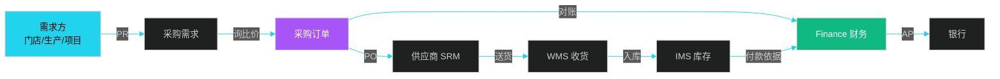

**采购的 4 大目标（QCDS）**：

| 目标 | 含义 | 关键指标 |
|------|------|----------|
| **Q 质量** | 物料符合要求 | 合格率、退货率 |
| **C 成本** | 价格最优 | 节约率、目标价达成 |
| **D 交期** | 准时交付 | OTD（On-Time Delivery） |
| **S 服务** | 配套支持 | 响应时间、售后 |

### 3.1.1 采购的两大类别

| 类别 | 含义 | 典型物料 | 系统特点 |
|------|------|---------|---------|
| **直接采购** | 用于生产/销售的物料 | 原材料、零部件、商品 | 与生产/销售紧密联动 |
| **间接采购** | 维持运营的物料 | MRO、办公用品、IT 设备 | 与预算/费用挂钩 |

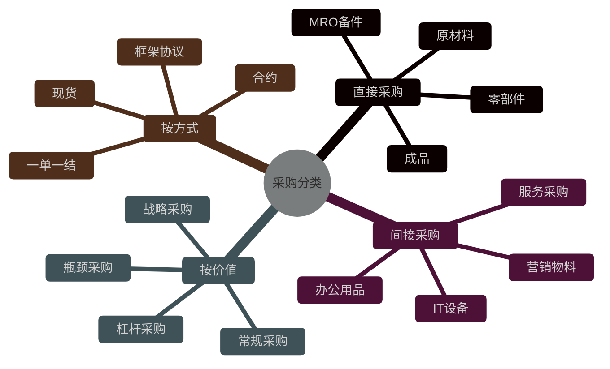

---

## 3.2 采购单据全生命周期

采购系统的核心是 9 大单据的**有序流转**。

### 3.2.1 单据状态机全景

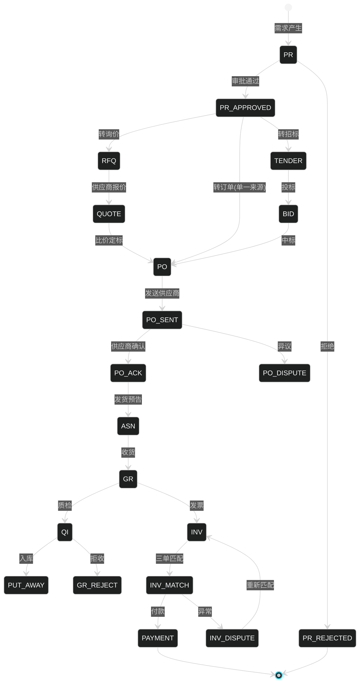

### 3.2.2 9 大单据关系 ER

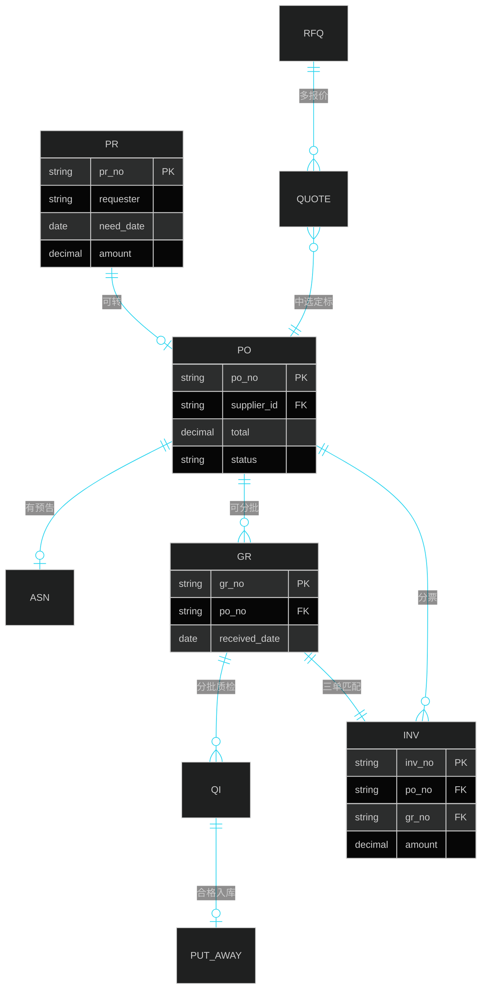

### 3.2.3 单据流转引擎

```java
/**
 * 采购单据流转引擎
 */
@Service
public class ProcurementFlowEngine {

    @Autowired
    private StateMachineFactory<PoStatus, PoEvent> factory;

    /**
     * 触发状态转换
     */
    public ProcurementOrder fireEvent(String poNo, PoEvent event) {
        ProcurementOrder po = poRepository.findByPoNo(poNo);
        StateMachine<PoStatus, PoEvent> sm = factory.getStateMachine(poNo);

        // 守卫检查
        validateGuard(po, event);

        // 业务联动
        switch (event) {
            case SUBMIT:
                // 提交审批
                approvalService.startApproval(po);
                break;
            case APPROVE:
                // 审批通过，发送供应商
                srmService.sendToSupplier(po);
                notifySupplier(po);
                break;
            case ACK:
                // 供应商确认，锁定交期
                po.setConfirmedDeliveryDate(po.getSupplierAckDate());
                break;
            case ASN_RECEIVED:
                // 收货预告到达，预约入库
                wmsService.scheduleInbound(po);
                break;
            case GR_DONE:
                // 收货完成，触发质检
                qcService.startInspection(po);
                break;
            case QI_PASSED:
                // 质检合格，触发入库
                wmsService.putAway(po);
                break;
            case INV_MATCHED:
                // 三单匹配成功，提交付款
                financeService.submitPayment(po);
                break;
            case PAID:
                // 付款完成，关闭订单
                po.setStatus(CLOSED);
                break;
        }

        sm.sendEvent(MessageBuilder.withPayload(event).build());
        po.setStatus(sm.getState().getId());
        return poRepository.save(po);
    }
}
```

---

## 3.3 采购模式与策略

### 3.3.1 6 大采购模式对比

| 模式 | 描述 | 适用场景 | 优点 | 缺点 | 案例 |
|------|------|---------|------|------|------|
| **直接采购** | 选定的供应商直接下单 | 单一来源 | 快 | 缺竞争 | 关键专利件 |
| **询比价** | 3+ 供应商比价 | 标准品 | 简单 | 透明性弱 | 通用物料 |
| **竞争性谈判** | 谈判小组深入谈判 | 复杂项目 | 灵活 | 主观 | 工程采购 |
| **公开招标** | 公开竞标 | 大额/政府 | 公正 | 周期长 | 工程招标 |
| **框架协议** | 一年期长协 | 长期合作 | 效率 | 灵活差 | 办公用品 |
| **JIT 准时制** | 看板拉动 | 标准化产线 | 低库存 | 风险大 | 丰田 |
| **VMI 供应商管库存** | 供应商决定补货 | 强势供应商 | 降库存 | 依赖 | 宝洁-沃尔玛 |

### 3.3.2 JIT 流程

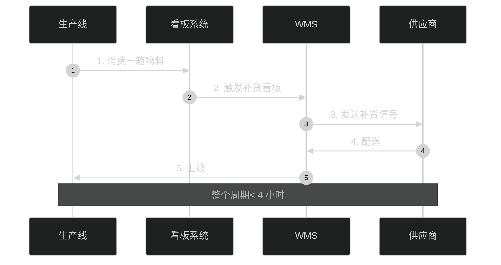

**JIT 核心特征**：

- **零库存**：理想状态下没有中间库存
- **小批量**：单次补货量小
- **高频率**：每日多次配送
- **看板驱动**：可视化信号触发
- **产线协同**：供应商距离产线 < 100 公里

### 3.3.3 VMI 流程

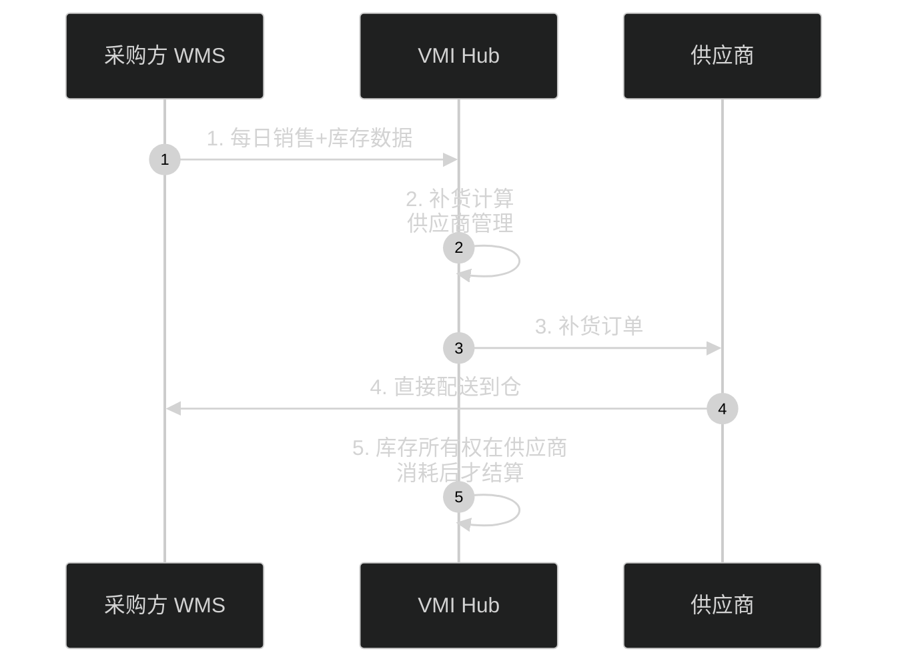

**VMI 关键设计**：

- **数据透明**：采购方共享 POS、库存数据
- **库存归属**：在消耗前，库存属供应商
- **结算方式**：消耗结算、寄售模式
- **风险承担**：缺货损失由供应商承担

### 3.3.4 卡拉杰克矩阵（Kraljic Matrix）

按**供应风险 × 收益影响**对采购品类分类：

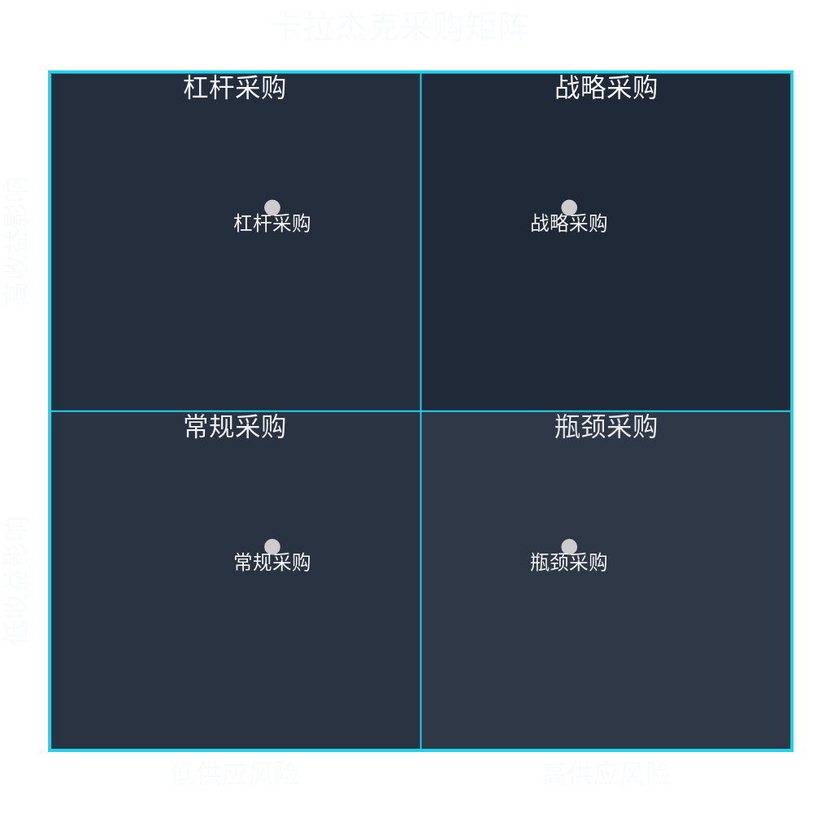

| 象限 | 策略 | 库存策略 | 供应商策略 |
|------|------|---------|-----------|
| **战略采购** | 长期合作 | 安全库存 | 战略伙伴 |
| **杠杆采购** | 招标压价 | 适中库存 | 多源竞争 |
| **瓶颈采购** | 保证供应 | 高安全库存 | 多源+备选 |
| **常规采购** | 标准化 | JIT | 简化流程 |

---

## 3.4 询比价与招标系统

### 3.4.1 询比价时序

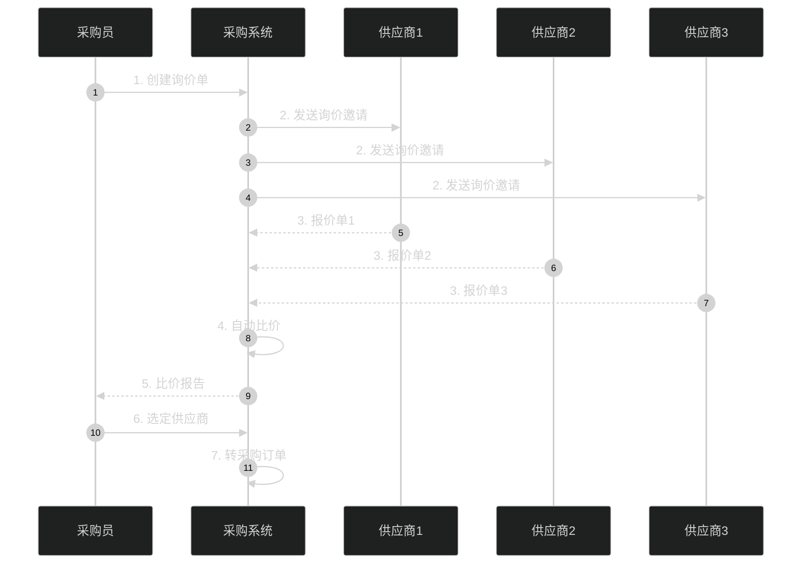

### 3.4.2 智能比价引擎

```java
/**
 * 智能比价引擎
 */
@Service
public class SmartPriceComparisonEngine {

    /**
     * 综合评估报价
     * 总分 = 价格分 * 50% + 交期分 * 25% + 资质分 * 15% + 服务分 * 10%
     */
    public List<QuoteEvaluation> evaluate(List<Quote> quotes, RfqContext context) {
        List<QuoteEvaluation> results = new ArrayList<>();

        // 1. 价格基准计算
        BigDecimal targetPrice = getTargetPrice(context);  // 目标价
        BigDecimal historicalAvg = getHistoricalAvgPrice(context);  // 历史均价
        BigDecimal marketPrice = getMarketPrice(context);  // 市场价

        // 2. 各项评分
        for (Quote q : quotes) {
            QuoteEvaluation ev = new QuoteEvaluation();
            ev.setQuoteId(q.getId());

            // 价格分
            double priceScore = calcPriceScore(q.getTotalPrice(), targetPrice,
                historicalAvg, marketPrice);
            ev.setPriceScore(priceScore);

            // 交期分
            double deliveryScore = calcDeliveryScore(q.getDeliveryDays(), context.getRequiredDate());
            ev.setDeliveryScore(deliveryScore);

            // 资质分（供应商分级）
            double qualificationScore = getSupplierLevel(q.getSupplierId()).getScore();
            ev.setQualificationScore(qualificationScore);

            // 服务分
            double serviceScore = calcServiceScore(q);
            ev.setServiceScore(serviceScore);

            // 总分
            double total = priceScore * 0.5 + deliveryScore * 0.25
                + qualificationScore * 0.15 + serviceScore * 0.1;
            ev.setTotalScore(round(total, 2));

            results.add(ev);
        }

        // 3. 排序
        results.sort(Comparator.comparing(QuoteEvaluation::getTotalScore).reversed());
        return results;
    }

    /**
     * 价格评分
     * 目标价：100分；高于目标价按比例扣分；低于目标价适度加分
     */
    private double calcPriceScore(BigDecimal price, BigDecimal target,
                                   BigDecimal historical, BigDecimal market) {
        if (price.compareTo(target) <= 0) {
            // 低于目标价：满分 100
            return 100.0;
        }
        // 高于目标价：每高 1% 扣 2 分
        double exceed = price.subtract(target)
            .divide(target, 4, RoundingMode.HALF_UP)
            .doubleValue();
        return Math.max(0, 100 - exceed * 200);
    }
}
```

### 3.4.3 价格分析模型

| 价格类型 | 来源 | 用途 |
|---------|------|------|
| **目标价** | 标准成本 / 测算 | 内部考核基准 |
| **历史价** | 过去 N 次采购均价 | 趋势分析 |
| **市场参考价** | 第三方行情 | 议价锚点 |
| **协议价** | 框架协议 | 长期合作价 |
| **现采价** | 本次报价 | 实际成交价 |

```java
/**
 * 价格分析服务
 */
@Service
public class PriceAnalysisService {

    /**
     * 价格异常检测
     */
    public PriceAnomaly detect(Quote quote) {
        BigDecimal current = quote.getUnitPrice();
        BigDecimal historical = getHistoricalAvg(quote.getSku(), Duration.ofDays(90));
        BigDecimal market = marketPriceService.getMarketPrice(quote.getSku());

        PriceAnomaly anomaly = new PriceAnomaly();

        // 1. 同比波动
        double yoyChange = current.subtract(historical)
            .divide(historical, 4, RoundingMode.HALF_UP)
            .doubleValue();
        if (Math.abs(yoyChange) > 0.10) {
            anomaly.setAlert(true);
            anomaly.setReason("价格同比波动 " + (yoyChange * 100) + "%");
        }

        // 2. 与市场偏离
        double marketDeviation = current.subtract(market)
            .divide(market, 4, RoundingMode.HALF_UP)
            .doubleValue();
        if (marketDeviation > 0.20) {
            anomaly.setAlert(true);
            anomaly.setReason("高于市场 " + (marketDeviation * 100) + "%");
        }

        return anomaly;
    }
}
```

---

## 3.5 收货与三单匹配

### 3.5.1 收货流程

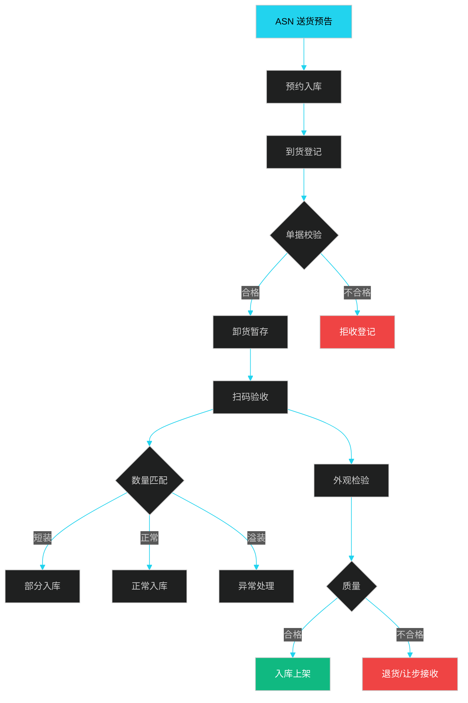

### 3.5.2 三单匹配

**三单匹配 = PO + GR + INV（采购订单 + 收货单 + 发票）**

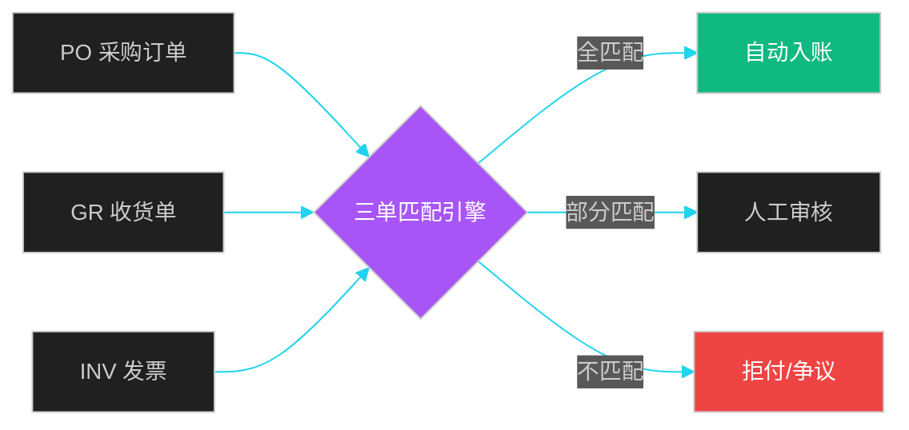

### 5.5.3 三单匹配算法

```java
/**
 * 三单匹配服务
 */
@Service
public class ThreeWayMatchingService {

    /**
     * 三单匹配
     * 容差范围：单价 ±1%，金额 ±10 元
     */
    public MatchResult match(String poNo, String grNo, String invNo) {
        PurchaseOrder po = poRepository.findByPoNo(poNo);
        GoodsReceipt gr = grRepository.findByGrNo(grNo);
        Invoice inv = invoiceRepository.findByInvNo(invNo);

        MatchResult result = new MatchResult();

        // 1. PO 与 GR 匹配
        if (!matchPoAndGr(po, gr, result)) {
            result.setStatus(REJECT);
            return result;
        }

        // 2. PO 与 INV 匹配
        if (!matchPoAndInv(po, inv, result)) {
            result.setStatus(REJECT);
            return result;
        }

        // 3. GR 与 INV 匹配
        if (!matchGrAndInv(gr, inv, result)) {
            result.setStatus(REJECT);
            return result;
        }

        // 4. 全部匹配通过
        if (result.getStatus() != REJECT) {
            result.setStatus(MATCHED);
            // 触发应付
            apService.createPayable(inv);
        }

        return result;
    }

    /**
     * PO 与 INV 匹配
     */
    private boolean matchPoAndInv(PurchaseOrder po, Invoice inv, MatchResult result) {
        // 1. 供应商匹配
        if (!po.getSupplierId().equals(inv.getSupplierId())) {
            result.setRejectReason("发票供应商与 PO 不一致");
            return false;
        }

        // 2. 金额匹配（容差）
        BigDecimal priceDiff = inv.getUnitPrice().subtract(po.getUnitPrice()).abs();
        BigDecimal priceTolerance = po.getUnitPrice()
            .multiply(BigDecimal.valueOf(0.01));  // 1% 容差
        if (priceDiff.compareTo(priceTolerance) > 0) {
            result.setRejectReason("单价偏差超过 1%");
            return false;
        }

        // 3. 数量匹配
        if (inv.getQuantity().compareTo(po.getQuantity()) > 0) {
            result.setRejectReason("发票数量超过 PO");
            return false;
        }

        return true;
    }
}
```

### 3.5.4 异常处理

| 异常类型 | 描述 | 处理方式 |
|---------|------|---------|
| **短装** | 实收 < 应发 | 按实收入库，差异走 PO 变更 |
| **溢装** | 实收 > 应发 | 通知采购，超 5% 拒收 |
| **错品** | SKU 不符 | 拒收，退回 |
| **质量不合格** | 质检不通过 | 退货、让步接收、降级 |
| **票面错误** | 发票信息错 | 退回重开 |
| **价格不符** | 单价超容差 | 议价/拒付 |
| **重复发票** | 同号发票 | 拦截 + 报警 |

---

## 3.6 付款与对账

### 3.6.1 付款全流程

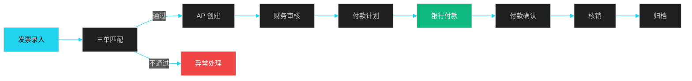

### 3.6.2 付款方式

| 方式 | 描述 | 适用 | 风险 |
|------|------|------|------|
| **预付** | 下单前付款 | 定制、稀缺 | 高 |
| **货到付款** | 收货后付款 | 标准品 | 中 |
| **月结** | 月底结算 | 长协 | 中 |
| **票到付款** | 收到发票付款 | 大客户 | 低 |
| **货到票到** | 货票齐后付款 | 标准 | 低 |
| **分期付款** | 按里程碑 | 工程 | 中 |

### 3.6.3 账期与资金成本

```java
/**
 * 付款排程服务
 */
@Service
public class PaymentScheduler {

    /**
     * 根据账期和现金流优化付款时点
     */
    public List<PaymentSchedule> schedule(List<Payable> payables, Date dueDate, double cashFlow) {
        List<PaymentSchedule> schedules = new ArrayList<>();

        // 1. 按到期日排序
        payables.sort(Comparator.comparing(Payable::getDueDate));

        // 2. 现金流约束下优化
        double runningCash = cashFlow;
        for (Payable p : payables) {
            // 折扣期内付款可享受现金折扣
            if (p.getDiscountDate() != null && p.getDiscountDate().after(new Date())) {
                double discountRate = p.getDiscountRate();
                // 年化收益 = (1 - 折扣) / 折扣 / 剩余天数 * 365
                double annualizedReturn = (p.getDiscountRate() / (1 - p.getDiscountRate()))
                    * (365.0 / daysBetween(new Date(), p.getDiscountDate()));
                if (annualizedReturn > 0.05) {  // 年化收益 > 5% 应付款
                    // 折扣期内付款
                    schedules.add(new PaymentSchedule(p, p.getDiscountDate(),
                        p.getAmount().multiply(BigDecimal.valueOf(1 - discountRate))));
                    continue;
                }
            }

            // 在账期内付款
            schedules.add(new PaymentSchedule(p, p.getDueDate(), p.getAmount()));
        }

        return schedules;
    }
}
```

### 3.6.4 对账机制

| 对账类型 | 频率 | 内容 |
|---------|------|------|
| **业务对账** | 月 | PO/GR/INV 三单核对 |
| **资金对账** | 日 | 银行流水与系统 |
| **发票对账** | 月 | 进项税核对 |
| **库存对账** | 日 | 实物与系统 |
| **应付对账** | 月 | 供应商往来 |

---

## 3.7 采购成本与数据分析

### 3.7.1 TCO 总拥有成本

**TCO（Total Cost of Ownership）** 不只是采购价，而是**全生命周期成本**：

```
TCO = 采购价 + 运费 + 关税 + 仓储费 + 管理费 + 风险成本
```

| 成本项 | 直接采购 | 间接采购 | 计算方式 |
|--------|---------|---------|---------|
| 采购价 | √ | √ | PO 单价 |
| 运费 | √ | - | 物流费 |
| 关税 | √ | - | 进口税率 |
| 仓储 | √ | - | 库存持有成本 |
| 资金成本 | √ | - | 占用资金 × 利率 |
| 风险成本 | √ | - | 缺货、呆滞 |
| 处置成本 | √ | - | 报废成本 |

### 3.7.2 采购节约分析

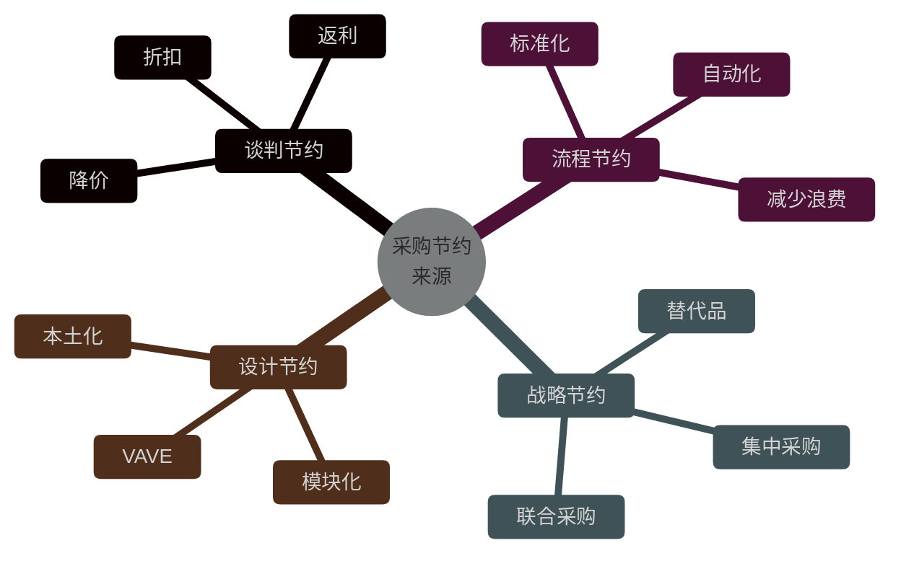

### 3.7.3 采购驾驶舱

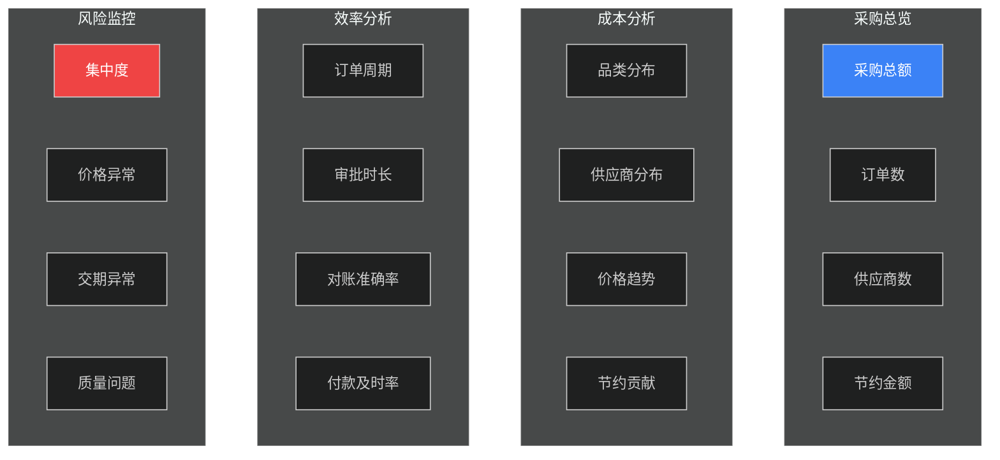

### 3.7.4 案例：宝洁的采购成本分析

**宝洁经典的"4 个 5%"模型**：

- 节约 5% 直接物料成本
- 节约 5% 间接物料成本
- 节约 5% 物流成本
- 节约 5% 资金成本

**CIF（Cost, Insurance, Freight）成本分析**：

```java
/**
 * CIF 成本分析
 */
@Service
public class CostAnalysisService {

    /**
     * 计算到岸成本
     */
    public CifCost calcCifCost(SkuCost cost) {
        // 1. FOB 离岸价
        BigDecimal fob = cost.getFobPrice();

        // 2. 海运费
        BigDecimal oceanFreight = cost.getOceanFreight()
            .divide(cost.getQuantity(), 4, RoundingMode.HALF_UP);

        // 3. 保险费
        BigDecimal insurance = fob.multiply(BigDecimal.valueOf(0.001));  // 0.1%

        // 4. CIF 价
        BigDecimal cif = fob.add(oceanFreight).add(insurance);

        // 5. 关税
        BigDecimal tariff = cif.multiply(cost.getTariffRate());

        // 6. 增值税
        BigDecimal vat = cif.add(tariff).multiply(BigDecimal.valueOf(0.13));

        // 7. 仓储费（按 30 天持有）
        BigDecimal storage = cost.getStorageFeePerDay()
            .multiply(BigDecimal.valueOf(30));

        // 8. 资金成本（年化 6%）
        BigDecimal capital = cif.add(tariff)
            .multiply(BigDecimal.valueOf(0.06 * 30 / 365));

        // 9. 总成本
        BigDecimal totalCost = cif.add(tariff).add(vat).add(storage).add(capital);

        return CifCost.builder()
            .fob(fob).cif(cif).tariff(tariff).vat(vat)
            .storage(storage).capitalCost(capital)
            .totalCost(totalCost)
            .build();
    }
}
```

---

## 本章小结

采购系统是供应链的"业务执行中枢"，覆盖**从需求到付款**的 9 大单据流转。9 大单据（PR/RFQ/Quote/Tender/Bid/PO/ASN/GR/QI/INV）通过状态机引擎有序联动，**三单匹配**是采购财务一体化的核心。

6 大采购模式（直接/询比价/竞争性谈判/公开招标/框架协议/JIT/VMI）按品类和场景灵活组合。**卡拉杰克矩阵**提供战略采购的品类分类方法。**TCO 总拥有成本**超越单价视角，关注全生命周期成本。

下一章将进入**订单管理 OMS**，介绍供应链执行的"大脑"。

---

## 面试高频问题

**1. 采购系统的核心单据有哪些？状态如何流转？**

参考答案要点：9 大单据 PR（采购需求）→ RFQ（询价）→ Quote（报价）→ PO（订单）→ ASN（送货预告）→ GR（收货）→ QI（质检）→ Put-away（入库）→ INV（发票）→ Payment（付款）。每个单据有独立状态机，通过事件驱动联动。

**2. 什么是三单匹配？核心规则是什么？**

参考答案要点：三单匹配 = PO（采购订单）+ GR（收货单）+ INV（发票）三方核对。核心规则：① 供应商一致；② 物料一致；③ 数量 PO ≥ GR ≥ INV；④ 单价容差（±1%）；⑤ 金额容差（±10元）。任一不通过则进入异常处理。

**3. 卡拉杰克矩阵如何应用？**

参考答案要点：卡拉杰克矩阵按"供应风险 × 收益影响"分 4 象限：① 战略采购（高风险高收益）— 长期合作、战略伙伴；② 杠杆采购（低风险高收益）— 招标压价、多源竞争；③ 瓶颈采购（高风险低收益）— 保证供应、高安全库存；④ 常规采购（低风险低收益）— 标准化、JIT。

**4. JIT 和 VMI 的区别？**

参考答案要点：JIT（Just In Time）准时制，看板拉动，小批量高频次，库存归买方，零库存为理想；VMI（Vendor Managed Inventory）供应商管库存，供应商决定补货，库存归供应商，消耗结算。VMI 适合强势供应商 + 标准化物料。

**5. 询比价与招标的区别？何时用哪个？**

参考答案要点：询比价——3+ 供应商报价，简化评标，快速决策，周期 5-10 天，适合标准品；招标——公开竞标，文件齐备，评标规范，周期 30-60 天，适合大额、工程、政府项目。

**6. 采购的 TCO 如何计算？**

参考答案要点：TCO = 采购价 + 运费 + 关税 + 仓储费 + 资金成本 + 风险成本 + 处置成本。例如进口采购的 CIF 价 = FOB + 海运费 + 保险费；持有成本按"库存金额 × 资金成本率 × 持有天数 / 365"计算。

**7. 智能比价引擎的设计要点？**

参考答案要点：① 多维度评分（价格 50% + 交期 25% + 资质 15% + 服务 10%）；② 价格基准（目标价、历史均价、市场价、协议价）；③ 异常检测（同比波动 ±10%、与市场偏离 ±20%）；④ 历史曲线分析（避免单点异常）。

**8. 收货异常如何处理？**

参考答案要点：① 短装——按实收入库，PO 变更，差额挂账；② 溢装——通知采购，超 5% 拒收；③ 错品——拒收退回；④ 质量不合格——退货/让步接收/降级使用；⑤ 所有异常需拍照存档 + 供应商确认 + 系统记录。

**9. 采购节约的来源有哪些？**

参考答案要点：① 谈判节约（降价、折扣、返利）；② 流程节约（自动化、标准化）；③ 战略节约（集中采购、联合采购、替代品）；④ 设计节约（VAVE 价值工程、本土化、模块化）。宝洁的"4 个 5%"是经典模型。

**10. 应付账款的优化策略？**

参考答案要点：① 在折扣期内付款（如 2/10 net 30，享受 2% 折扣相当于年化 36% 收益）；② 利用供应链金融（反向保理、ABS）；③ 付款排程（按现金流优化付款时点）；④ 议价延长账期；⑤ 动态折扣（Dynamic Discounting）。
