# 第 4 章 订单管理 OMS（Order Management System）

> 本章定位：供应链执行的"大脑"，负责订单全链路履约——从下单到签收的正向流程，从退货到退款的逆向流程。
>
> **学习建议**：OMS 是供应链系统最复杂的模块，建议先理解状态机，再看库存分配和履约调度。

---

## 4.1 OMS 在供应链中的位置

OMS 是电商前台与履约后台的"中间层"，**接单 + 调度 + 状态同步**。

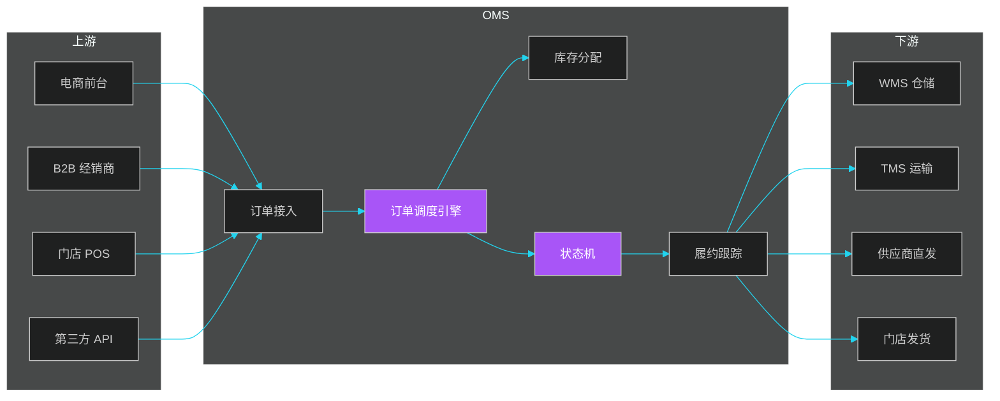

### 4.1.1 三类 OMS 的区别

| 类型 | 服务对象 | 订单来源 | 库存粒度 | 典型场景 |
|------|---------|---------|---------|---------|
| **电商 OMS** | C 端消费者 | 电商前台、APP | SKU + 仓 | 天猫、京东 |
| **批发 OMS** | B 端经销商 | EDI、批发商城 | SKU + 批次 + 仓 | 麦德龙经销商 |
| **全渠道 OMS** | 全渠道 | 门店 + 电商 + B2B | 多仓多店 | 苏宁、优衣库 |
| **跨境 OMS** | 海外消费者 | 跨境平台 | 海外仓 | SHEIN |

### 4.1.2 OMS 核心能力

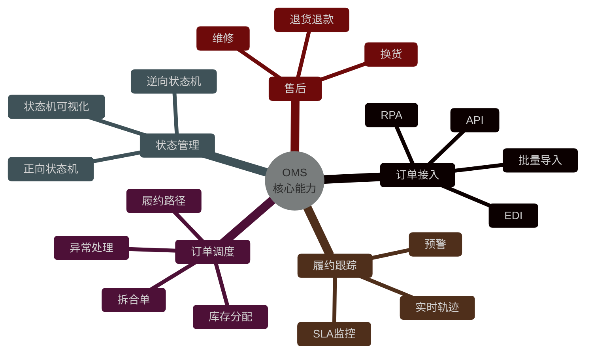

---

## 4.2 订单全链路状态机

OMS 状态机是整个系统的核心，**正逆向订单**有独立的状态机。

### 4.2.1 正向订单状态机

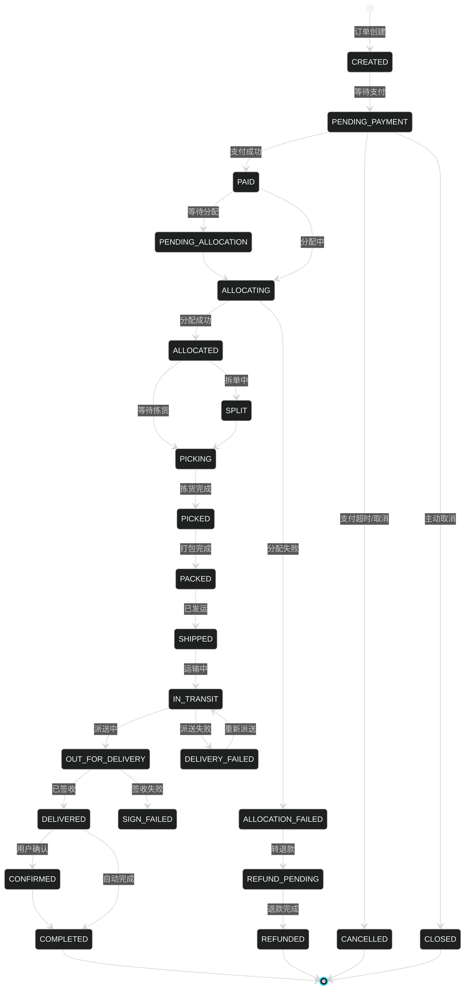

### 4.2.2 逆向订单状态机

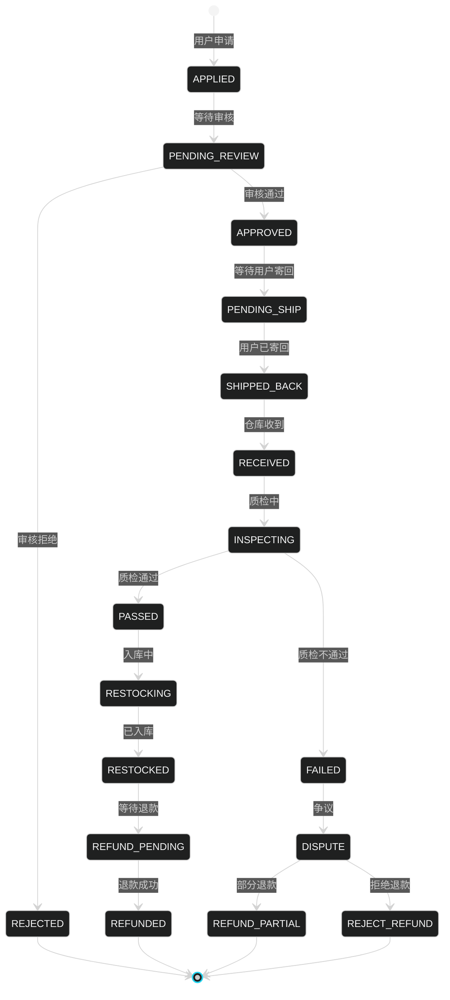

### 4.2.3 状态机引擎

```java
/**
 * 订单状态机（基于 Spring State Machine）
 */
@Component
public class OrderStateMachineConfig extends StateMachineConfigurerAdapter<OrderStatus, OrderEvent> {

    @Override
    public void configure(StateMachineStateConfigurer<OrderStatus, OrderEvent> states) {
        states.withStates()
            .initial(CREATED)
            .end(COMPLETED)
            .end(CANCELLED)
            .end(REFUNDED)
            .state(PENDING_PAYMENT, this::entryPendingPayment)
            .state(PAID, this::entryPaid)
            .state(ALLOCATING, this::entryAllocating)
            .state(ALLOCATED, this::entryAllocated)
            .state(PICKING, this::entryPicking)
            .state(SHIPPED, this::entryShipped)
            .state(IN_TRANSIT, this::entryInTransit)
            .state(DELIVERED, this::entryDelivered);
    }

    @Override
    public void configure(StateMachineTransitionConfigurer<OrderStatus, OrderEvent> transitions) {
        transitions
            .withExternal()
                .source(CREATED).target(PENDING_PAYMENT).event(SUBMIT)
                .and()
            .withExternal()
                .source(PENDING_PAYMENT).target(PAID).event(PAY_SUCCESS)
                .and()
            .withExternal()
                .source(PAID).target(ALLOCATING).event(START_ALLOCATE)
                .guard(allocationGuard())
                .and()
            .withExternal()
                .source(ALLOCATING).target(ALLOCATED).event(ALLOCATE_SUCCESS)
                .action(allocatedAction())
                .and()
            .withExternal()
                .source(ALLOCATED).target(PICKING).event(SEND_PICK)
                .action(sendToWmsAction())
                .and()
            .withExternal()
                .source(PICKING).target(SHIPPED).event(SHIP)
                .action(sendToTmsAction())
                .and()
            .withExternal()
                .source(SHIPPED).target(IN_TRANSIT).event(TRACK_UPDATE)
                .and()
            .withExternal()
                .source(IN_TRANSIT).target(DELIVERED).event(SIGN)
                .guard(signGuard());
    }
}
```

### 4.2.4 状态机分布式实现

```java
/**
 * 分布式状态机
 * 1. 持久化到 Redis
 * 2. 事件溯源
 * 3. 乐观锁
 */
@Service
public class DistributedOrderStateMachine {

    @Autowired
    private RedisTemplate<String, OrderState> redisTemplate;

    @Autowired
    private OrderEventRepository eventRepository;

    /**
     * 触发状态变更（分布式实现）
     */
    public boolean fire(String orderId, OrderEvent event) {
        String key = "order:state:" + orderId;

        // 1. Redis 乐观锁
        OrderState current = redisTemplate.opsForValue().get(key);
        if (current == null) {
            // 2. 从 DB 加载
            current = orderRepository.findStateById(orderId);
            redisTemplate.opsForValue().set(key, current);
        }

        // 3. 校验合法性
        if (!canTransition(current.getStatus(), event)) {
            throw new InvalidStateTransitionException(orderId, current, event);
        }

        // 4. 计算新状态
        OrderStatus newStatus = computeNewStatus(current.getStatus(), event);

        // 5. CAS 更新
        OrderState newState = OrderState.builder()
            .orderId(orderId)
            .status(newStatus)
            .version(current.getVersion() + 1)
            .updatedAt(Instant.now())
            .build();

        Boolean success = redisTemplate.opsForValue()
            .setIfAbsent(key, newState);  // 简化版 CAS

        if (Boolean.TRUE.equals(success)) {
            // 6. 持久化事件
            eventRepository.save(OrderEventLog.builder()
                .orderId(orderId)
                .fromStatus(current.getStatus())
                .toStatus(newStatus)
                .event(event)
                .timestamp(Instant.now())
                .build());

            // 7. 异步同步 DB
            orderRepository.updateState(orderId, newStatus, current.getVersion());

            // 8. 触发后续业务
            eventBus.publish(new OrderStateChangedEvent(orderId, current.getStatus(), newStatus));

            return true;
        }
        throw new ConcurrentStateException("状态变更冲突，请重试");
    }
}
```

---

## 4.3 正向订单履约

### 4.3.1 履约时序

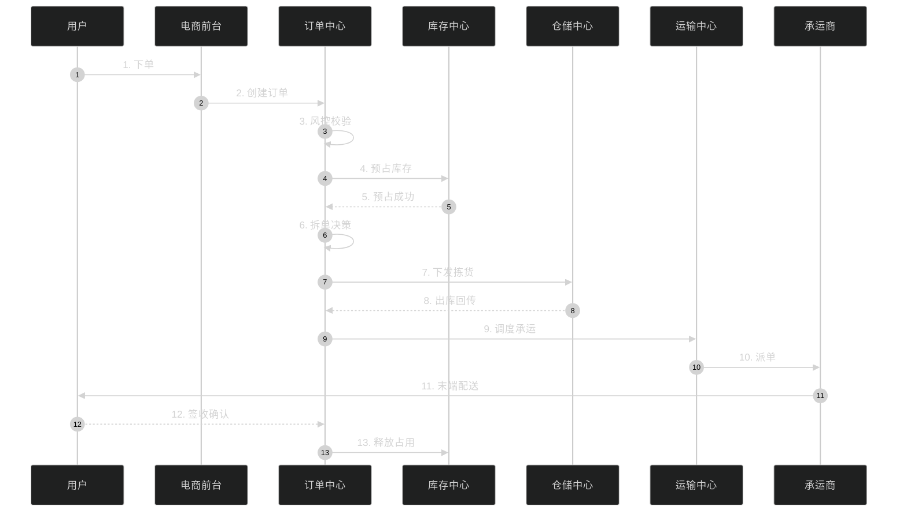

### 4.3.2 库存分配策略

| 策略 | 描述 | 适用 |
|------|------|------|
| **就近** | 距离消费者最近的仓 | 时效优先 |
| **就快** | 出库最快的仓 | 紧急 |
| **就廉** | 履约成本最低 | 成本敏感 |
| **就信用** | 信用最好的仓 | 重要客户 |
| **就库存** | 库存最多的仓 | 大件/重货 |
| **轮询** | 多个仓轮询 | 库存均衡 |
| **加权** | 多因子加权 | 复杂场景 |

```java
/**
 * 智能库存分配引擎
 */
@Service
public class InventoryAllocationEngine {

    /**
     * 多因子加权分配
     * 评分 = 距离分 * 0.3 + 时效分 * 0.3 + 成本分 * 0.2 + 库存分 * 0.2
     */
    public AllocationResult allocate(OrderRequest request) {
        // 1. 获取候选仓（库存满足的仓）
        List<Warehouse> candidates = inventoryService.findCandidateWarehouses(request);

        // 2. 评分
        List<WarehouseScore> scores = candidates.stream()
            .map(w -> {
                double distanceScore = calcDistanceScore(w, request.getAddress());
                double speedScore = calcSpeedScore(w, request.getExpectedArrival());
                double costScore = calcCostScore(w, request);
                double stockScore = calcStockScore(w, request);

                double total = distanceScore * 0.3 + speedScore * 0.3
                    + costScore * 0.2 + stockScore * 0.2;
                return new WarehouseScore(w, total);
            })
            .sorted(Comparator.comparing(WarehouseScore::getScore).reversed())
            .collect(toList());

        // 3. 选择最优仓
        WarehouseScore best = scores.get(0);
        Warehouse w = best.getWarehouse();

        // 4. 预占库存
        InventoryLock lock = inventoryService.lock(w, request);

        return AllocationResult.builder()
            .warehouse(w)
            .lock(lock)
            .score(best.getScore())
            .build();
    }

    /**
     * 距离评分：越近分越高
     */
    private double calcDistanceScore(Warehouse w, Address addr) {
        double distance = geoService.calcDistance(w.getLngLat(), addr.getLngLat());
        if (distance < 100) return 100;
        if (distance > 1000) return 0;
        return 100 - (distance - 100) / 9;  // 100km 到 1000km 线性递减
    }
}
```

### 4.3.3 拆单规则

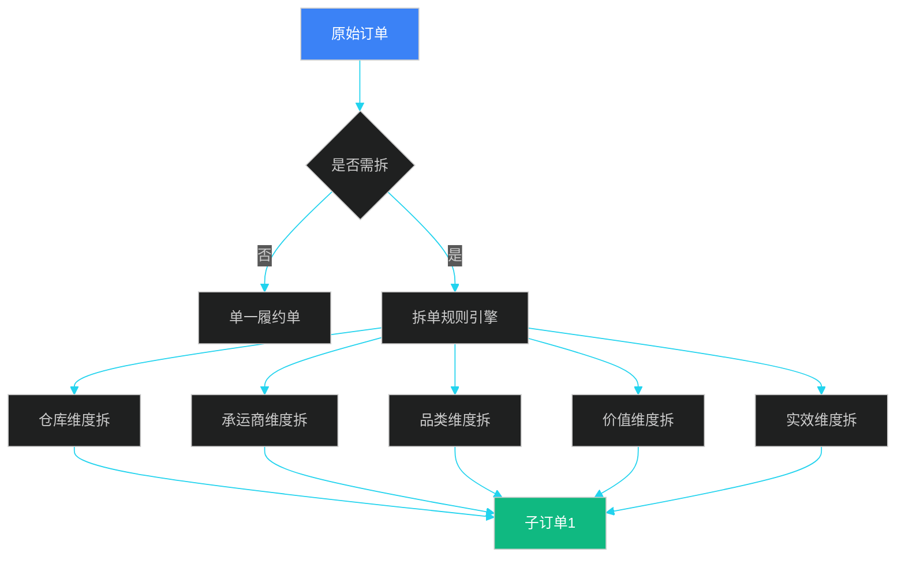

| 拆单类型 | 触发条件 | 案例 |
|---------|---------|------|
| **仓库拆** | 多仓库存 | 商品 A 在上海仓，商品 B 在广州仓 |
| **承运商拆** | 不同承运商 | 大家电用日日顺，3C 用顺丰 |
| **品类拆** | 分类分温层 | 冷冻品和常温品 |
| **价值拆** | 价值过高 | 奢侈品和普通品 |
| **时效拆** | 不同时效 | 当日达 + 常规 |

```java
/**
 * 拆单引擎
 */
@Service
public class OrderSplitEngine {

    /**
     * 拆单决策
     */
    public List<SubOrder> split(Order order) {
        // 1. 按仓库分组
        Map<String, List<OrderItem>> byWarehouse = order.getItems().stream()
            .collect(groupingBy(item -> inventoryService.getWarehouse(item.getSku())));

        if (byWarehouse.size() == 1) {
            // 单仓不拆
            return List.of(toSubOrder(order, byWarehouse.values().iterator().next()));
        }

        // 2. 多仓需要拆单
        List<SubOrder> subOrders = new ArrayList<>();
        for (Map.Entry<String, List<OrderItem>> entry : byWarehouse.entrySet()) {
            SubOrder sub = new SubOrder();
            sub.setParentOrderId(order.getId());
            sub.setWarehouseCode(entry.getKey());
            sub.setItems(entry.getValue());
            sub.setStatus(SUB_CREATED);
            sub.setShipFee(calcShipFee(entry.getValue()));
            sub.setEstimatedArrival(calcETA(entry.getValue(), entry.getKey()));
            subOrders.add(sub);
        }

        // 3. 拆分订单号
        return subOrders;
    }
}
```

---

## 4.4 逆向订单与售后

### 4.4.1 退货流程

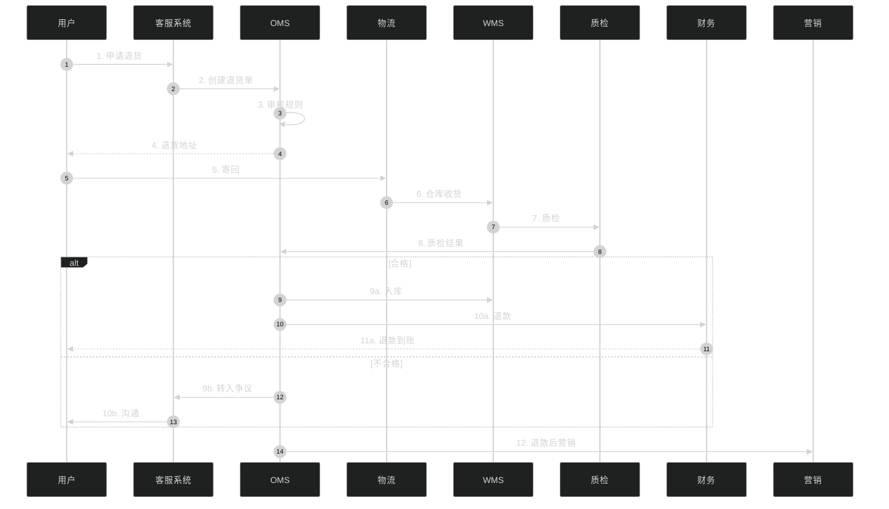

### 4.4.2 拒收退货 vs 拦截退货

| 类型 | 触发时机 | 货物流向 | 状态 |
|------|---------|---------|------|
| **拒收退货** | 用户拒签 | 仓库 → 退仓 → 退款 | 已发货后拒签 |
| **拦截退货** | 已发货但未签收 | 快递拦截 → 退回仓库 | 中途拦截 |
| **正常退货** | 已签收 | 用户寄回 → 仓库 → 质检 → 退款 | 已签收后退货 |

### 4.4.3 退款优先级

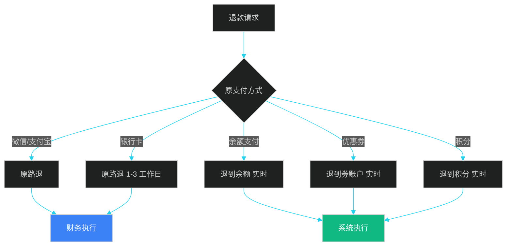

| 支付方式 | 退款通道 | 到账时间 | 系统能力 |
|---------|---------|---------|---------|
| **微信/支付宝** | 原路退 | 实时 | 自动 |
| **银行卡** | 银联 | 1-3 工作日 | 异步 |
| **余额** | 内部账户 | 实时 | 自动 |
| **优惠券** | 券账户 | 实时 | 自动 |
| **积分** | 积分账户 | 实时 | 自动 |

### 4.4.4 退货售后系统设计

```java
/**
 * 售后服务编排
 */
@Service
public class AfterSalesService {

    /**
     * 售后类型决策
     */
    public AfterSalesType decideType(Order order, ReturnRequest request) {
        // 1. 仅退款
        if (request.getReason() == Reason.NOT_RECEIVED) {
            return AfterSalesType.REFUND_ONLY;
        }

        // 2. 退货退款
        if (request.getReason() == Reason.QUALITY_ISSUE) {
            return AfterSalesType.RETURN_REFUND;
        }

        // 3. 换货
        if (request.getType() == Type.EXCHANGE) {
            return AfterSalesType.EXCHANGE;
        }

        // 4. 维修
        if (request.getReason() == Reason.BROKEN) {
            return AfterSalesType.REPAIR;
        }

        return AfterSalesType.RETURN_REFUND;
    }

    /**
     * 退款计算（含优惠券回退）
     */
    public RefundDetail calcRefund(Order order, ReturnRequest request) {
        RefundDetail detail = new RefundDetail();

        // 1. 货款
        BigDecimal itemPrice = request.getItemAmount();
        detail.setItemAmount(itemPrice);

        // 2. 运费（用户原因退 → 不退；商家原因退 → 退）
        if (request.getReason().isUserFault()) {
            detail.setShippingFee(BigDecimal.ZERO);
        } else {
            detail.setShippingFee(order.getShippingFee());
        }

        // 3. 优惠券回退
        if (request.isReturnCoupon()) {
            detail.setReturnedCoupons(returnCouponService
                .returnCoupons(order, request.getItemSkus()));
        }

        // 4. 积分回退
        if (request.isReturnPoints()) {
            detail.setReturnedPoints(order.getPointsUsed());
        }

        // 5. 退款总金额
        detail.setTotalRefund(itemPrice.add(detail.getShippingFee()));

        return detail;
    }
}
```

---

## 4.5 全渠道库存共享

### 4.5.1 库存共享模型

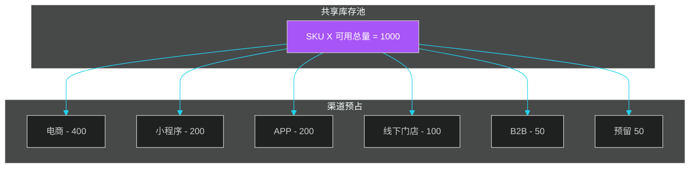

### 4.5.2 库存预占与释放

```java
/**
 * 库存预占服务
 */
@Service
public class InventoryLockService {

    /**
     * 预占库存（支持多种粒度）
     */
    public LockResult lock(LockRequest request) {
        // 1. 校验库存
        Inventory inv = inventoryRepository
            .findBySkuAndWarehouse(request.getSku(), request.getWarehouse());

        if (inv.getAvailable() < request.getQuantity()) {
            return LockResult.fail("库存不足");
        }

        // 2. 预占（Redis 原子操作）
        String key = "inv:lock:" + request.getSku() + ":" + request.getWarehouse();
        Long locked = redisTemplate.opsForValue().increment(key, request.getQuantity());

        if (locked > inv.getAvailable()) {
            // 回滚
            redisTemplate.opsForValue().decrement(key, request.getQuantity());
            return LockResult.fail("库存不足");
        }

        // 3. 持久化
        LockRecord record = new LockRecord();
        record.setOrderId(request.getOrderId());
        record.setSku(request.getSku());
        record.setWarehouse(request.getWarehouse());
        record.setQuantity(request.getQuantity());
        record.setExpireAt(Instant.now().plusSeconds(1800));  // 30 分钟过期
        lockRepository.save(record);

        // 4. 延迟消息：超时自动释放
        mqService.sendDelayMessage("inv-lock-expire", record.getId(), 30 * 60 * 1000);

        return LockResult.success(locked);
    }

    /**
     * 释放库存
     */
    public void release(String orderId) {
        List<LockRecord> locks = lockRepository.findByOrderId(orderId);
        for (LockRecord lock : locks) {
            String key = "inv:lock:" + lock.getSku() + ":" + lock.getWarehouse();
            redisTemplate.opsForValue().decrement(key, lock.getQuantity());
        }
        lockRepository.deleteAll(locks);
    }

    /**
     * 确认扣减（发货后）
     */
    public void confirm(String orderId) {
        List<LockRecord> locks = lockRepository.findByOrderId(orderId);
        for (LockRecord lock : locks) {
            // 物理库存扣减
            inventoryRepository.deduct(lock.getSku(), lock.getWarehouse(), lock.getQuantity());
            // 预占量扣减
            String key = "inv:lock:" + lock.getSku() + ":" + lock.getWarehouse();
            redisTemplate.opsForValue().decrement(key, lock.getQuantity());
        }
    }
}
```

### 4.5.3 防止超卖

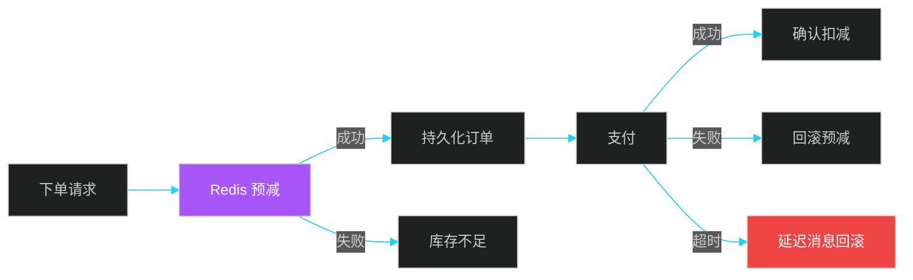

```java
/**
 * Redis 原子预减库存
 */
@Service
public class RedisInventoryDeductor {

    private static final String DEDUCT_SCRIPT =
        "local stock = tonumber(redis.call('GET', KEYS[1]))\n" +
        "if stock == nil then return -1 end\n" +
        "if stock < tonumber(ARGV[1]) then return 0 end\n" +
        "redis.call('DECRBY', KEYS[1], ARGV[1])\n" +
        "return 1\n";

    /**
     * 预减库存（Lua 脚本保证原子性）
     */
    public boolean tryDeduct(String sku, int quantity) {
        String key = "inv:" + sku;
        Long result = redisTemplate.execute(
            new DefaultRedisScript<>(DEDUCT_SCRIPT, Long.class),
            List.of(key),
            String.valueOf(quantity)
        );
        return result != null && result == 1;
    }
}
```

---

## 4.6 履约调度与 SLA

### 4.6.1 履约路径

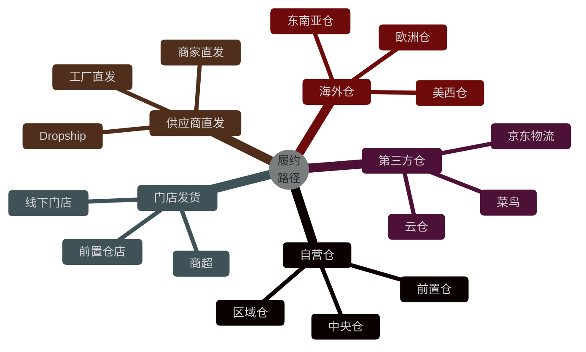

### 4.6.2 履约策略引擎

```java
/**
 * 履约策略引擎
 * 根据订单特性、用户偏好、库存分布选择最优履约路径
 */
@Service
public class FulfillmentStrategyEngine {

    public FulfillmentPlan plan(Order order) {
        // 1. 收集可用履约点
        List<FulfillmentNode> nodes = nodeService.findAvailableNodes(order);

        // 2. SLA 评估
        for (FulfillmentNode node : nodes) {
            node.setSla(calcSla(node, order));
            node.setCost(calcCost(node, order));
            node.setQuality(calcQuality(node, order));
        }

        // 3. 评分
        for (FulfillmentNode node : nodes) {
            double score = node.getSla() * 0.4 + node.getCost() * 0.4 + node.getQuality() * 0.2;
            node.setScore(score);
        }

        // 4. 选择最优节点
        FulfillmentNode best = nodes.stream()
            .max(Comparator.comparing(FulfillmentNode::getScore))
            .orElseThrow();

        // 5. 编排履约计划
        FulfillmentPlan plan = new FulfillmentPlan();
        plan.setOrderId(order.getId());
        plan.setNode(best);
        plan.setEstimatedShipTime(calcShipTime(best, order));
        plan.setEstimatedArrival(calcArrival(best, order));
        plan.setPromise(generatePromise(best, order));  // 配送承诺

        return plan;
    }

    /**
     * 计算 SLA
     * SLA = 出库时长 + 干线时长 + 末端时长
     */
    private double calcSla(FulfillmentNode node, Order order) {
        double pickingTime = calcPickingTime(node, order);  // 2-6 小时
        double lineHaulTime = calcLineHaulTime(node, order); // 12-48 小时
        double lastMileTime = calcLastMileTime(node, order); // 2-8 小时
        return pickingTime + lineHaulTime + lastMileTime;
    }
}
```

### 4.6.3 SLA 监控

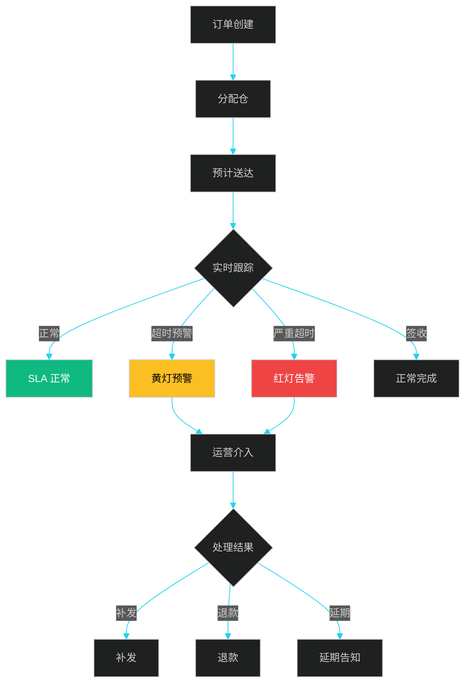

---

## 4.7 OMS 案例与架构

### 4.7.1 京东 OMS 架构

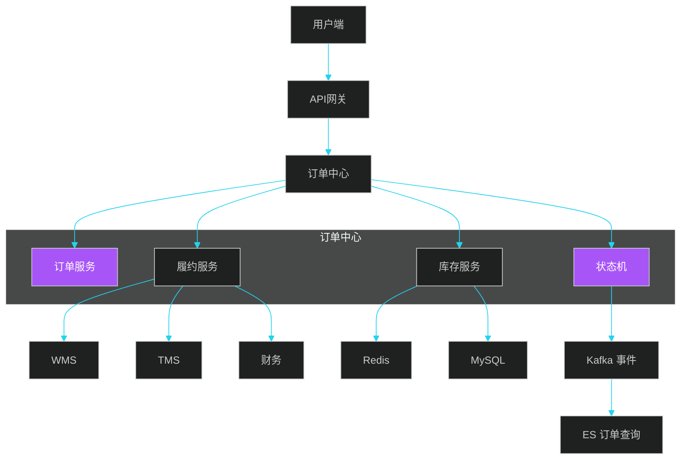

### 4.7.2 高并发设计

| 挑战 | 方案 | 效果 |
|------|------|------|
| **大促下单洪峰** | 排队、限流、削峰 | 10W+ QPS 稳定 |
| **库存超卖** | Redis Lua 预减 | 0 超卖 |
| **状态机并发** | 乐观锁 + 事件溯源 | 状态一致 |
| **幂等** | 业务唯一键 + 状态机 | 不重复处理 |
| **订单查询** | ES 异构 + 读写分离 | 100ms 响应 |

### 4.7.3 OMS 与外部系统 API

```java
/**
 * OMS 对外 API（部分）
 */
@RestController
@RequestMapping("/api/oms/v1")
public class OmsApi {

    /**
     * 创建订单
     * POST /api/oms/v1/orders
     */
    @PostMapping("/orders")
    public OrderResponse createOrder(@RequestBody OrderCreateRequest request) {
        return orderService.create(request);
    }

    /**
     * 取消订单
     * POST /api/oms/v1/orders/{orderId}/cancel
     */
    @PostMapping("/orders/{orderId}/cancel")
    public void cancelOrder(@PathVariable String orderId, @RequestBody CancelRequest request) {
        orderService.cancel(orderId, request);
    }

    /**
     * 订单跟踪
     * GET /api/oms/v1/orders/{orderId}/track
     */
    @GetMapping("/orders/{orderId}/track")
    public OrderTrackResponse trackOrder(@PathVariable String orderId) {
        return trackService.track(orderId);
    }

    /**
     * 申请退货
     * POST /api/oms/v1/returns
     */
    @PostMapping("/returns")
    public ReturnResponse applyReturn(@RequestBody ReturnRequest request) {
        return afterSalesService.applyReturn(request);
    }
}
```

### 4.7.4 案例：优衣库的全渠道库存共享

**优衣库的"店仓一体"实践**：

- 全国 800+ 门店作为前置仓
- 门店库存 = 线上可售库存
- 库存共享：天猫、京东、官网、APP、门店实时同步
- 离店 50 公里内发货：24 小时达

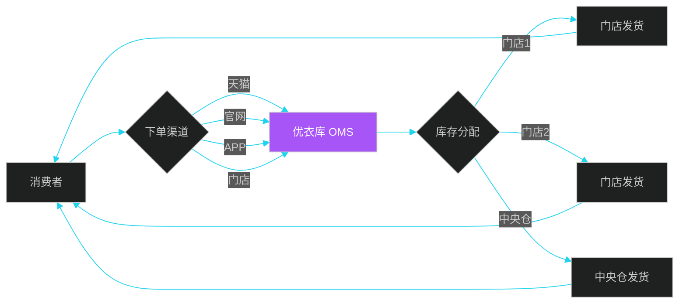

**关键收益**：

- 库存周转率提升 30%
- 履约时效从 48 小时缩短到 24 小时
- 履约成本降低 25%

---

## 本章小结

OMS 是供应链执行的"大脑"，核心是**状态机引擎 + 履约调度 + 库存预占**。正向订单状态机涵盖 14 个状态，从 CREATED 到 COMPLETED，逆向订单状态机涵盖 12 个状态。**分布式状态机**采用 Redis 乐观锁 + 事件溯源实现。

库存预占是 OMS 的关键设计：Redis Lua 脚本保证原子性，30 分钟 TTL 自动释放，消息队列异步回滚。**多因子加权分配**（距离 30% + 时效 30% + 成本 20% + 库存 20%）是常见算法。**全渠道库存共享**（如优衣库）使门店成为前置仓，提升履约效率。

OMS 与 WMS、TMS、SRM、Finance 通过事件 + API 协同。下一章将进入**仓储管理 WMS**，详细介绍库内作业。

---

## 面试高频问题

**1. OMS 状态机的核心状态有哪些？**

参考答案要点：正向 14 状态（CREATED → PENDING_PAYMENT → PAID → ALLOCATING → ALLOCATED → PICKING → PICKED → PACKED → SHIPPED → IN_TRANSIT → OUT_FOR_DELIVERY → DELIVERED → CONFIRMED → COMPLETED）；逆向 12 状态（APPLIED → PENDING_REVIEW → APPROVED → PENDING_SHIP → SHIPPED_BACK → RECEIVED → INSPECTING → PASSED → RESTOCKING → RESTOCKED → REFUND_PENDING → REFUNDED）。每个状态都有进入/退出条件。

**2. 如何防止库存超卖？**

参考答案要点：① Redis Lua 脚本原子预减（先 GET 后 DECRBY 不安全，必须用 Lua）；② 数据库乐观锁（version 字段）；③ 预占订单 30 分钟 TTL 过期自动释放；④ 异步消息确保最终一致；⑤ 库存回滚机制（支付失败、订单取消）。

**3. 库存分配策略有哪些？**

参考答案要点：① 就近（距离消费者最近的仓）；② 就快（出库最快的仓）；③ 就廉（履约成本最低的仓）；④ 就信用（信用最好的仓）；⑤ 加权（多因子加权算法：距离 30% + 时效 30% + 成本 20% + 库存 20%）。

**4. 拆单的规则有哪些？**

参考答案要点：① 仓库拆（多仓库存）；② 承运商拆（不同承运商）；③ 品类拆（分类分温层）；④ 价值拆（高价值品单独发）；⑤ 时效拆（不同时效要求）。拆单后子订单独立履约、独立结算、独立 SLA。

**5. 分布式状态机如何实现？**

参考答案要点：① Redis 乐观锁（CAS + version）；② 状态机持久化（DB + 事件日志）；③ 事件溯源（Event Sourcing，状态变更作为事件存储）；④ Saga 模式（长事务拆分为子事务 + 补偿）；⑤ TCC 模式（Try-Confirm-Cancel 三阶段）。

**6. 全渠道库存共享的核心设计？**

参考答案要点：① 统一库存池（共享的可用量）；② 渠道预占（按渠道配额分配）；③ 实时同步（消息总线广播库存变更）；④ 门店作为前置仓（店仓一体）；⑤ 库存可视化（BI 看板）。

**7. 拒收退货和正常退货的区别？**

参考答案要点：拒收退货——已发货但用户拒签，快递返回仓库后入库/退款；正常退货——已签收后用户申请退货，寄回仓库→质检→入库→退款。拒收退货省去用户寄回环节，流程更短。

**8. 退款优先级如何处理？**

参考答案要点：① 原路退（微信/支付宝实时、银联 1-3 工作日）；② 余额退（实时）；③ 优惠券退（实时到券账户）；④ 积分退（实时到积分账户）。多种支付方式时按金额比例退到各渠道。

**9. 履约路径如何选择？**

参考答案要点：① 自营仓（中央仓 + 区域仓 + 前置仓）；② 第三方仓（京东物流、菜鸟）；③ 门店发货（线下门店作为前置仓）；④ 供应商直发（工厂直发、商家直发）；⑤ 海外仓（美西、欧洲、东南亚）。按 SLA、成本、库存综合评分选择。

**10. OMS 的高并发设计要点？**

参考答案要点：① 排队（MQ 削峰）；② 限流（Sentinel、令牌桶）；③ 库存预减（Redis Lua）；④ 状态机乐观锁；⑤ 业务幂等（唯一键 + 状态机）；⑥ 读写分离（订单查询走 ES）；⑦ 缓存预热（大促前提前加载）；⑧ 监控告警（全链路追踪 + SLA 监控）。
