# 第 5 章 仓储管理 WMS（Warehouse Management System）

> 本章定位：仓库的"操作系统"——管库位、管作业、管设备。供应链系统中**作业最密集**的模块。
>
> **学习建议**：WMS 是"重操作、轻架构"的系统，但库位模型、波次拣选、库存准确性是核心难点。

---

## 5.1 WMS 在供应链中的位置

WMS 是 OMS 和 IMS 的"执行手臂"，负责仓库内**人、货、场、设**的协同。

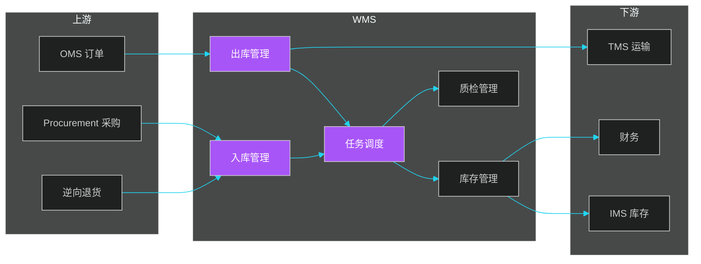

### 5.1.1 WMS 的核心模块

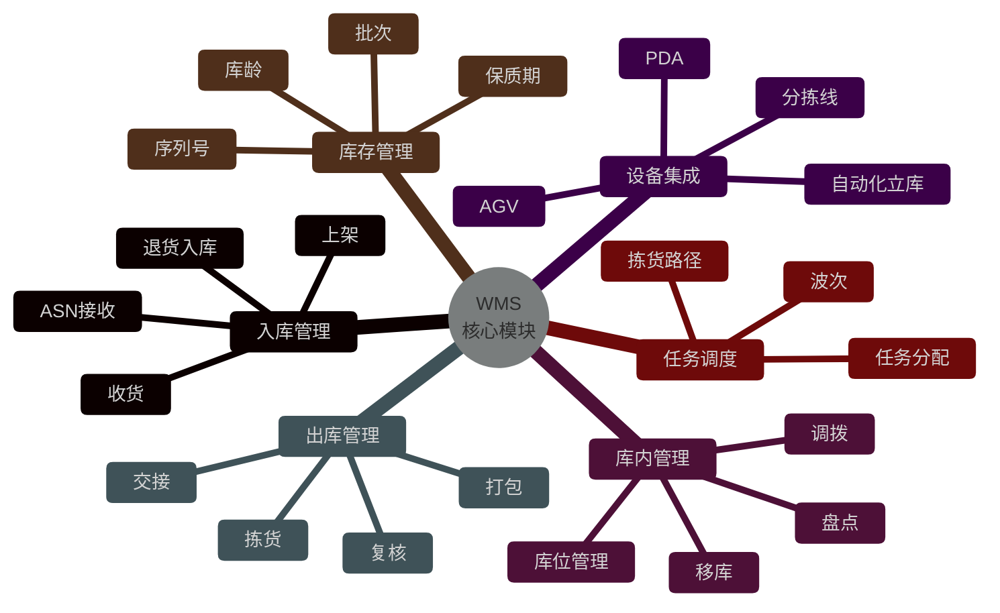

### 5.1.2 WMS 的 3 个层级

| 层级 | 描述 | 业务特点 |
|------|------|---------|
| **WMS Core** | 核心业务系统 | 入库、出库、库存、报表 |
| **WMS Control** | 调度控制 | 任务编排、设备调度、AGV |
| **WMS Execution** | 现场执行 | PDA、RF、电子标签、灯光 |

---

## 5.2 库位模型

库位（Location）是 WMS 的核心抽象，**库位设计**决定了仓库作业效率。

### 5.2.1 库位模型

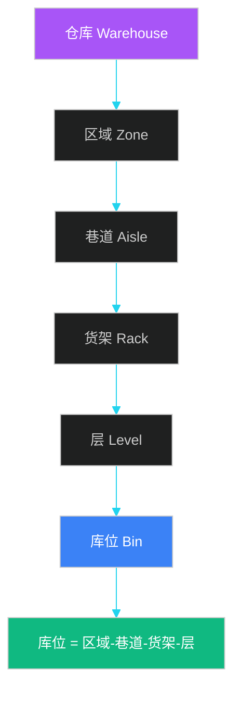

**库位编码规则**：

| 库位类型 | 编码规则 | 示例 |
|---------|---------|------|
| **平库** | 区域-排-列-层 | A-01-03-02 |
| **立体库** | 区-巷-排-列-层 | Z1-A02-R03-C05-L02 |
| **阁楼库** | 楼-区-排-列-层 | 2F-A-01-03-02 |
| **流利式** | 区-排-列-层-位 | FL-A-01-03-02-A |
| **地堆** | 区-排 | PILE-A-01 |

### 5.2.2 库位分类

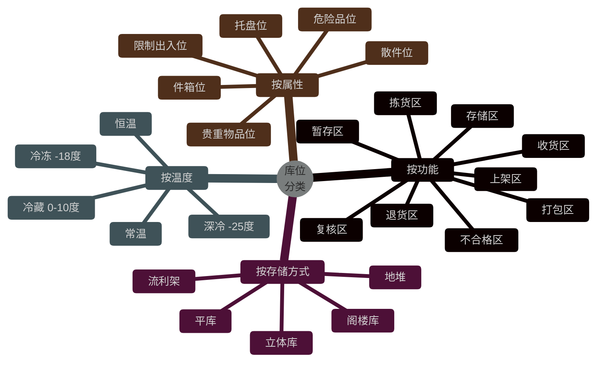

### 5.2.3 库位核心数据模型

```sql
-- ============ 库位主表 ============
CREATE TABLE t_warehouse_location (
    id              BIGINT PRIMARY KEY AUTO_INCREMENT,
    warehouse_code  VARCHAR(32) NOT NULL COMMENT '仓库编码',
    zone_code       VARCHAR(16) NOT NULL COMMENT '区域编码',
    aisle_code      VARCHAR(16) COMMENT '巷道',
    rack_code       VARCHAR(16) COMMENT '货架',
    level_no        INT COMMENT '层',
    bin_code        VARCHAR(16) COMMENT '库位',
    location_code   VARCHAR(64) GENERATED ALWAYS AS (
        CONCAT(warehouse_code, '-', zone_code, IFNULL(CONCAT('-', aisle_code), ''),
               IFNULL(CONCAT('-', rack_code), ''),
               IFNULL(CONCAT('-', level_no), ''))
    ) STORED COMMENT '库位完整编码',
    location_type   VARCHAR(16) COMMENT '库位类型',
    storage_type    VARCHAR(16) COMMENT '存储方式',
    capacity_volume DECIMAL(10,3) COMMENT '容积 m³',
    capacity_weight DECIMAL(10,3) COMMENT '承重 kg',
    length          DECIMAL(8,2),
    width           DECIMAL(8,2),
    height          DECIMAL(8,2),
    status          VARCHAR(16) COMMENT '库位状态',
    category_limit  VARCHAR(128) COMMENT '品类限制',
    temperature     VARCHAR(16) COMMENT '温度',
    is_blocked      TINYINT DEFAULT 0 COMMENT '是否锁定',
    blocked_reason  VARCHAR(256),
    UNIQUE KEY uk_location (warehouse_code, location_code),
    INDEX idx_warehouse_zone (warehouse_code, zone_code)
) ENGINE=InnoDB COMMENT='库位主表';

-- ============ 库位状态表 ============
CREATE TABLE t_location_status (
    location_id     BIGINT PRIMARY KEY,
    location_code   VARCHAR(64),
    status          VARCHAR(16) COMMENT 'EMPTY/STORED/ASSIGNED/PICKING/PICKED',
    current_sku     VARCHAR(64),
    current_qty     INT,
    locked_at       DATETIME,
    last_count_at   DATETIME COMMENT '上次盘点时间',
    version         BIGINT DEFAULT 0 COMMENT '乐观锁'
) ENGINE=InnoDB COMMENT='库位实时状态';

-- ============ 库内库存表 ============
CREATE TABLE t_inventory (
    id              BIGINT PRIMARY KEY AUTO_INCREMENT,
    warehouse_code  VARCHAR(32) NOT NULL,
    location_code   VARCHAR(64) NOT NULL,
    sku_code        VARCHAR(64) NOT NULL,
    batch_no        VARCHAR(32) COMMENT '批次',
    serial_no       VARCHAR(64) COMMENT '序列号',
    quantity        INT NOT NULL DEFAULT 0,
    available_qty   INT NOT NULL DEFAULT 0 COMMENT '可用量',
    locked_qty      INT DEFAULT 0 COMMENT '锁定量',
    production_date DATE COMMENT '生产日期',
    expire_date     DATE COMMENT '过期日期',
    inbound_date    DATE COMMENT '入库日期',
    quality_status  VARCHAR(16) COMMENT 'QUA/PRE/UNQ',
    owner_code      VARCHAR(32) COMMENT '货主',
    UNIQUE KEY uk_inv (warehouse_code, location_code, sku_code, batch_no),
    INDEX idx_sku (sku_code),
    INDEX idx_expire (expire_date)
) ENGINE=InnoDB COMMENT='库内库存';
```

### 5.2.4 库位推荐算法

```java
/**
 * 库位推荐引擎
 * 上架时推荐最优库位
 */
@Service
public class LocationRecommendationEngine {

    /**
     * 推荐上架库位
     */
    public List<Location> recommend(InboundTask task) {
        // 1. 候选库位过滤
        List<Location> candidates = locationRepository.findCandidates(
            task.getWarehouse(),
            task.getSku(),
            task.getQuantity(),
            task.getVolume(),
            task.getWeight()
        );

        // 2. 评分
        return candidates.stream()
            .map(loc -> {
                // 距离分（离作业区近）
                double distanceScore = calcDistanceScore(loc, task.getWorkArea());

                // 饱和度分（空置率 30%-70% 最佳）
                double saturation = loc.getCurrentVolume() / loc.getCapacityVolume();
                double saturationScore = calcSaturationScore(saturation);

                // 同 SKU 集中分（SKU 集中存放）
                double sameSkuScore = isSameSkuArea(loc) ? 100 : 50;

                // 批次管理分（同批次相邻）
                double batchScore = isNearSameBatch(loc, task.getBatchNo()) ? 100 : 50;

                // 综合分
                double total = distanceScore * 0.3 + saturationScore * 0.2
                    + sameSkuScore * 0.3 + batchScore * 0.2;
                loc.setScore(total);
                return loc;
            })
            .sorted(Comparator.comparing(Location::getScore).reversed())
            .limit(5)  // Top 5 推荐
            .collect(toList());
    }
}
```

---

## 5.3 入库管理

### 5.3.1 入库流程

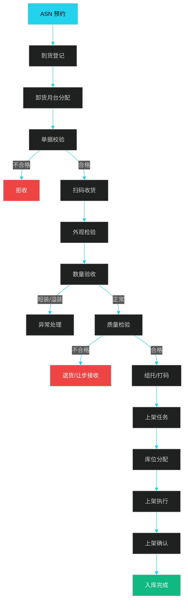

### 5.3.2 ASN（提前送货通知）

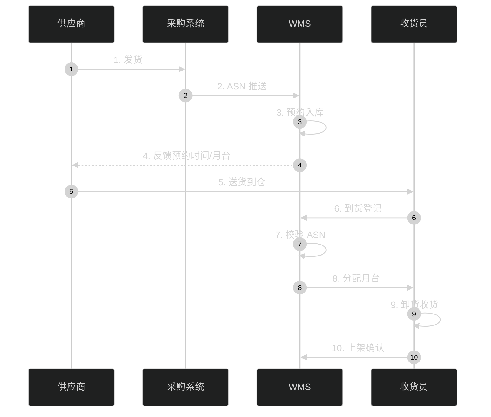

### 5.3.3 上架策略

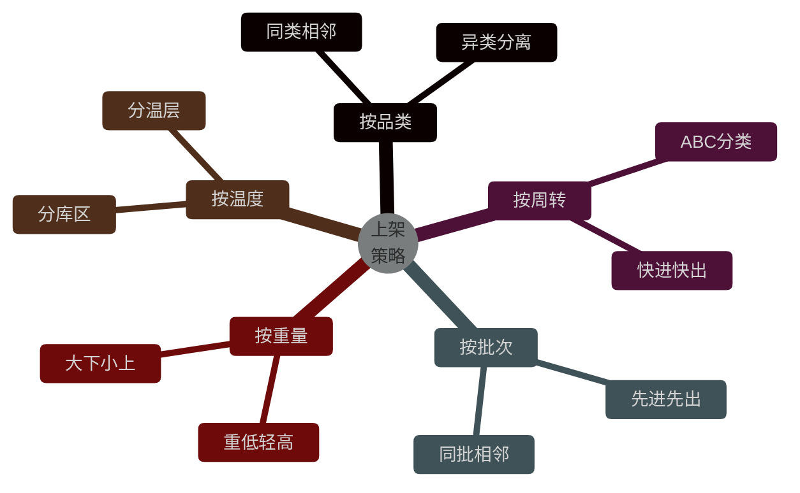

```java
/**
 * 上架策略
 */
public enum PutAwayStrategy {
    /**
     * 指定库位
     */
    FIXED_LOCATION,
    /**
     * 随机库位
     */
    RANDOM_LOCATION,
    /**
     * 同 SKU 集中
     */
    SKU_CONSOLIDATION,
    /**
     * 批次管理（FIFO）
     */
    BATCH_FIFO,
    /**
     * ABC 分类（快进快出）
     */
    ABC_FAST_MOVER,
    /**
     * 近库位（拣货区优先）
     */
    NEAR_PICKING_AREA
}
```

---

## 5.4 库存管理

### 5.4.1 库存状态

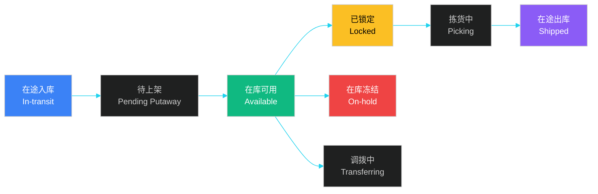

### 5.4.2 库存状态机

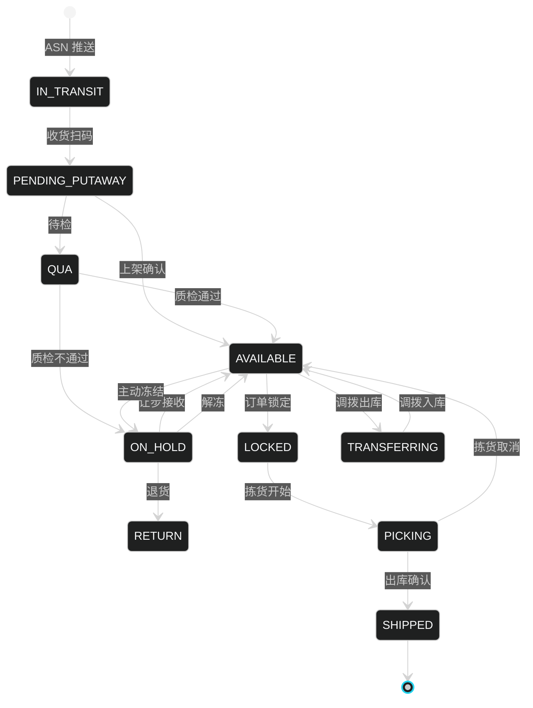

### 5.4.3 批次与序列号

```java
/**
 * 批次管理
 */
public class BatchManagementService {

    /**
     * FEFO (First Expired First Out) 拣货建议
     */
    public List<PickSuggestion> suggestPickEfFo(Sku sku, int quantity) {
        // 按到期日升序（先过期的先出）
        return inventoryRepository.findBySkuAndStatus(sku, AVAILABLE)
            .stream()
            .sorted(Comparator.comparing(Inventory::getExpireDate))
            .limit(quantity)
            .map(inv -> new PickSuggestion(inv))
            .collect(toList());
    }

    /**
     * 批次追溯
     */
    public BatchTrace trace(String batchNo) {
        BatchTrace trace = new BatchTrace();

        // 上游：哪个供应商、什么时候生产的
        trace.setSupplier(supplierService.getByBatchNo(batchNo));
        trace.setProductionDate(batchService.getProductionDate(batchNo));

        // 当前分布：哪些仓、哪些库位
        trace.setLocations(inventoryRepository.findByBatchNo(batchNo));

        // 下游：哪些订单、哪些客户
        trace.setOrders(orderService.getByBatchNo(batchNo));

        return trace;
    }
}
```

### 5.4.4 序列号管理

```sql
-- ============ 序列号表 ============
CREATE TABLE t_serial_number (
    id              BIGINT PRIMARY KEY AUTO_INCREMENT,
    serial_no       VARCHAR(64) NOT NULL UNIQUE,
    sku_code        VARCHAR(64) NOT NULL,
    batch_no        VARCHAR(32),
    warehouse_code  VARCHAR(32),
    location_code   VARCHAR(64),
    status          VARCHAR(16) COMMENT 'IN_STOCK/SHIPPED/RETURNED/SCRAPPED',
    inbound_date    DATE,
    outbound_date   DATE,
    warranty_end    DATE COMMENT '保修截止',
    owner           VARCHAR(64) COMMENT '当前持有客户',
    INDEX idx_serial (serial_no),
    INDEX idx_sku (sku_code)
) ENGINE=InnoDB COMMENT='序列号表';
```

---

## 5.5 库内作业

### 5.5.1 移库

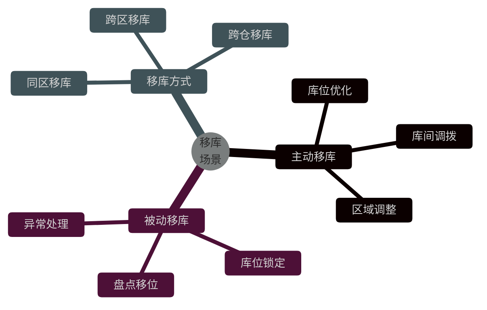

### 5.5.2 盘点

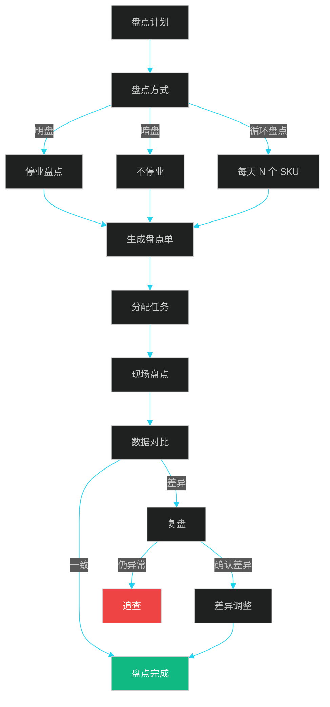

| 盘点方式 | 描述 | 优点 | 缺点 |
|---------|------|------|------|
| **明盘** | 停业整体盘点 | 数据准 | 影响业务 |
| **暗盘** | 不停业盘点 | 不影响 | 需精确 |
| **循环盘点** | 每天 N 个 SKU | 持续 | 周期长 |
| **抽样盘点** | 按比例抽盘 | 快速 | 不全面 |
| **动态盘点** | 边作业边盘 | 实时 | 干扰大 |

```java
/**
 * 盘点差异处理
 */
@Service
public class StocktakingService {

    public StocktakingResult compare(StocktakingTask task) {
        StocktakingResult result = new StocktakingResult();

        for (StocktakingDetail detail : task.getDetails()) {
            Inventory inv = inventoryRepository.findByLocationAndSku(
                detail.getLocationCode(), detail.getSkuCode());

            // 账面数 vs 实盘数
            BigDecimal bookQty = inv.getQuantity();
            BigDecimal actualQty = detail.getCountedQty();
            BigDecimal diff = actualQty.subtract(bookQty);

            if (diff.compareTo(BigDecimal.ZERO) != 0) {
                // 差异记录
                DifferenceRecord record = new DifferenceRecord();
                record.setLocationCode(detail.getLocationCode());
                record.setSkuCode(detail.getSkuCode());
                record.setBookQty(bookQty);
                record.setActualQty(actualQty);
                record.setDiffQty(diff);
                record.setReason(detail.getDifferenceReason());

                // 自动复盘
                if (detail.isNeedRecount()) {
                    record.setStatus(PENDING_RECOUNT);
                } else {
                    // 直接调整
                    inventoryAdjustService.adjust(record);
                    record.setStatus(ADJUSTED);
                }
                differenceRepository.save(record);
            }
        }

        // 计算盘点准确率
        result.setAccuracyRate(calcAccuracyRate(task));
        return result;
    }
}
```

### 5.5.3 库间调拨

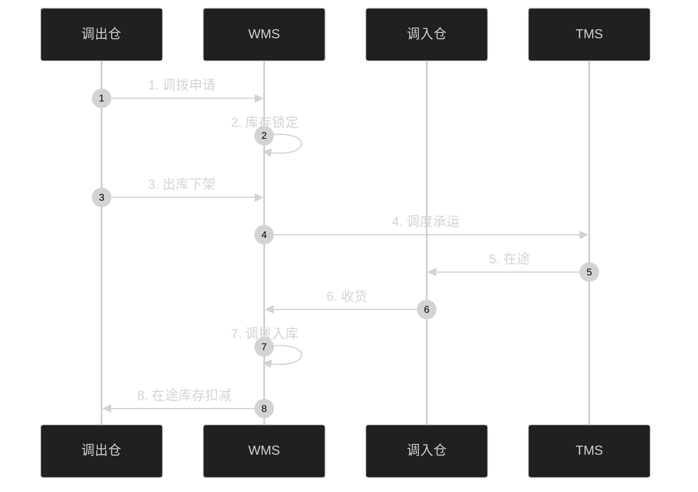

---

## 5.6 出库管理（拣货）

### 5.6.1 拣货方式

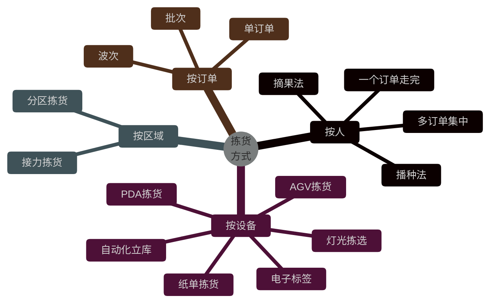

### 5.6.2 摘果法 vs 播种法

| 维度 | 摘果法 | 播种法 |
|------|--------|--------|
| **作业方式** | 一个拣货员走完一个订单 | 一个拣货员拣多个订单的同一 SKU |
| **行走路径** | 长 | 短 |
| **适合场景** | 订单大、SKU 少 | 订单小、SKU 多 |
| **设备** | PDA、RF | 分拣机、电子标签 |
| **效率** | 较低 | 高（波次合并） |
| **错误率** | 较低 | 较高 |

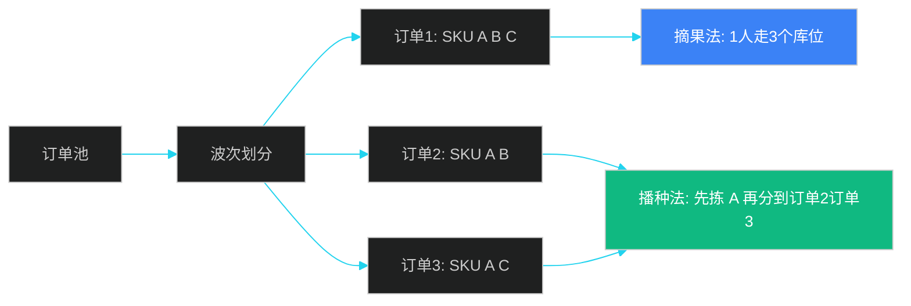

### 5.6.3 波次规划

```java
/**
 * 波次规划引擎
 * 决定哪些订单合并成一波
 */
@Service
public class WavePlanningEngine {

    /**
     * 生成波次
     */
    public List<Wave> planWaves(List<Order> orders, WaveRule rule) {
        // 1. 订单聚类
        Map<ClusterKey, List<Order>> clusters = clusterOrders(orders, rule);

        // 2. 评分排序
        List<ClusterScore> scored = clusters.entrySet().stream()
            .map(entry -> scoreCluster(entry.getKey(), entry.getValue()))
            .sorted(Comparator.comparing(ClusterScore::getScore).reversed())
            .collect(toList());

        // 3. 生成波次
        List<Wave> waves = new ArrayList<>();
        for (ClusterScore score : scored) {
            Wave wave = new Wave();
            wave.setCode(generateWaveCode());
            wave.setOrders(score.getOrders());
            wave.setPriority(score.getPriority());
            wave.setCutoffTime(score.getCutoffTime());
            wave.setStatus(CREATED);
            waves.add(wave);
        }

        return waves;
    }

    /**
     * 订单聚类
     * 同一波次的订单要求：
     * 1. 同一仓库
     * 2. 同一承运商
     * 3. 同一配送区域
     * 4. 相近 SKU 分布
     */
    private Map<ClusterKey, List<Order>> clusterOrders(List<Order> orders, WaveRule rule) {
        return orders.stream().collect(groupingBy(order ->
            new ClusterKey(
                order.getWarehouseCode(),
                order.getCarrierCode(),
                order.getShipRegion(),
                order.getPriority()
            )
        ));
    }
}
```

### 5.6.4 拣货路径优化

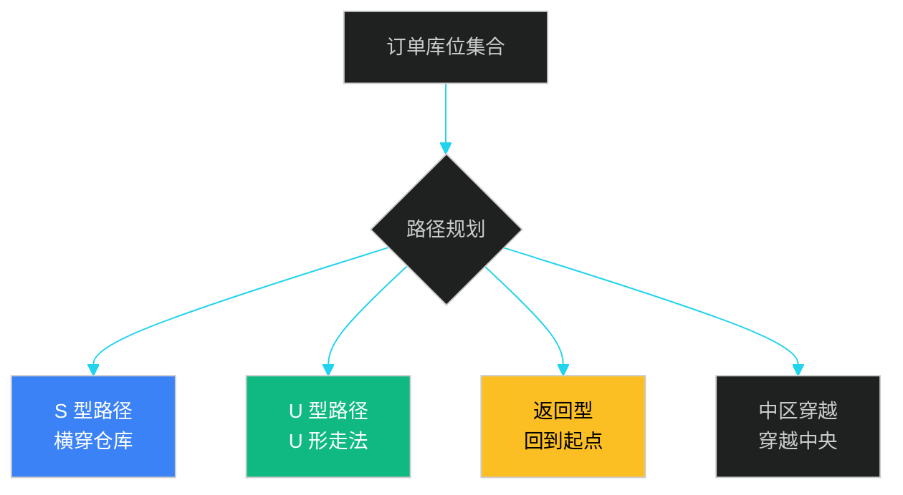

```java
/**
 * 拣货路径优化（S 型算法）
 */
public class PickPathOptimizer {

    /**
     * S 型路径：从入口到出口，横穿每个巷道
     */
    public List<PickTask> optimizeSPickPath(List<PickTask> tasks) {
        // 1. 按巷道分组
        Map<String, List<PickTask>> byAisle = tasks.stream()
            .collect(groupingBy(t -> extractAisle(t.getLocationCode())));

        // 2. 巷道排序
        List<String> sortedAisles = new ArrayList<>(byAisle.keySet());
        Collections.sort(sortedAisles);

        // 3. S 型走法：奇数巷道从左到右，偶数巷道从右到左
        List<PickTask> optimized = new ArrayList<>();
        boolean reverse = false;
        for (int i = 0; i < sortedAisles.size(); i++) {
            List<PickTask> aisleTasks = byAisle.get(sortedAisles.get(i));
            if (reverse) {
                // 偶数巷道从右到左
                aisleTasks.sort(Comparator.comparing(t -> extractRack(t.getLocationCode())).reversed());
            } else {
                aisleTasks.sort(Comparator.comparing(t -> extractRack(t.getLocationCode())));
            }
            optimized.addAll(aisleTasks);
            reverse = !reverse;
        }
        return optimized;
    }
}
```

### 5.6.5 出库全流程

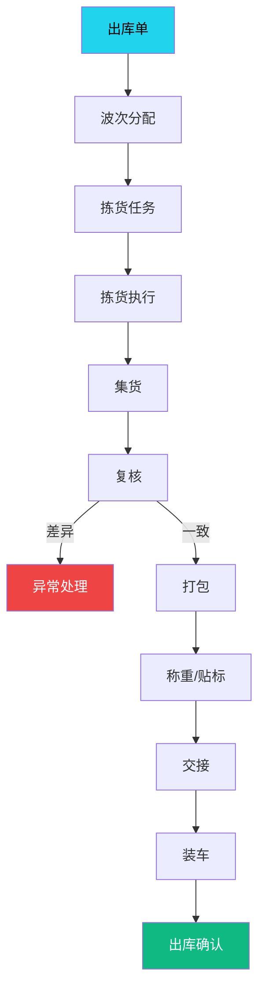

---

## 5.7 设备集成

### 5.7.1 设备类型

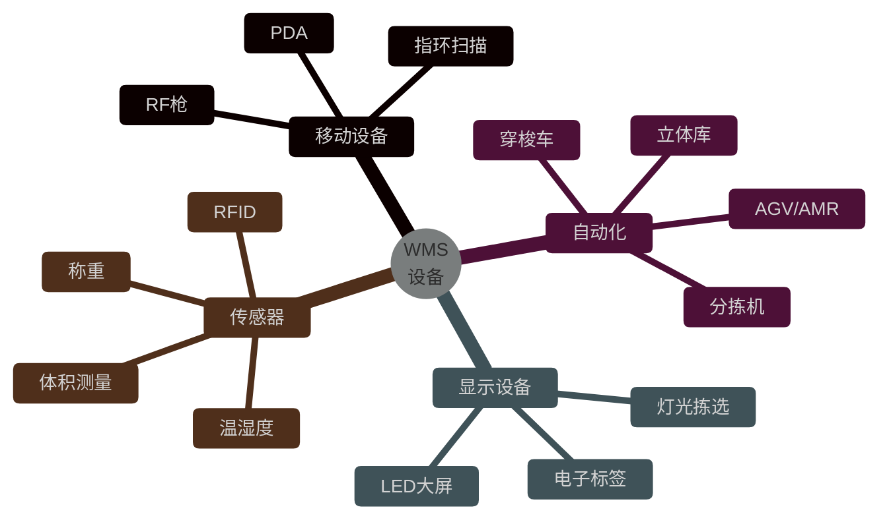

### 5.7.2 PDA 拣货流程

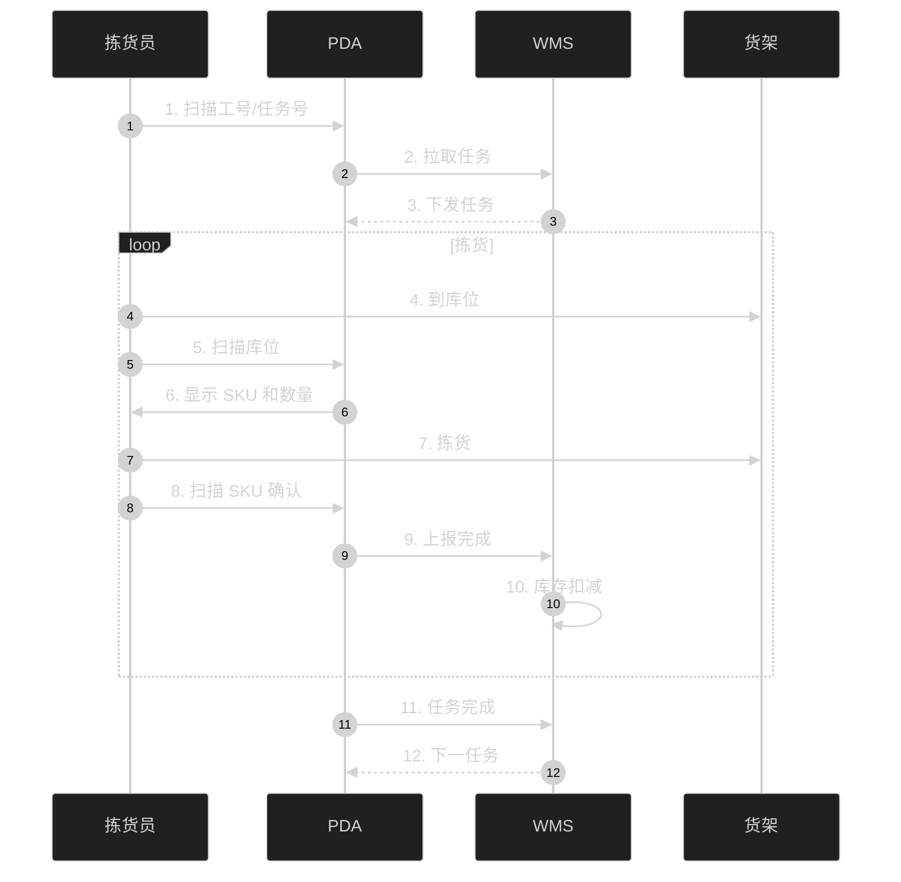

### 5.7.3 WMS 与自动化设备集成

```java
/**
 * WMS 与自动化立库（WCS）集成
 */
@Service
public class WcsIntegrationService {

    /**
     * 发送入库任务给 WCS
     */
    public WcsTaskResponse sendInboundTask(InboundTask task) {
        WcsTaskRequest request = new WcsTaskRequest();
        request.setTaskType("INBOUND");
        request.setSku(task.getSku());
        request.setQuantity(task.getQuantity());
        request.setPalletNo(task.getPalletNo());
        request.setTargetLocation(recommendLocation(task));  // 推荐库位

        return wcsClient.execute(request);
    }

    /**
     * 接收 WCS 回调
     */
    @PostMapping("/wcs/callback")
    public void handleWcsCallback(@RequestBody WcsCallback callback) {
        switch (callback.getTaskType()) {
            case "INBOUND_COMPLETE":
                inventoryService.confirmInbound(callback);
                break;
            case "OUTBOUND_COMPLETE":
                inventoryService.confirmOutbound(callback);
                break;
            case "EXCEPTION":
                exceptionService.handle(callback);
                break;
        }
    }
}
```

---

## 5.8 案例与最佳实践

### 5.8.1 京东物流"亚洲一号"自动化仓

**核心特点**：

- 立体库 + 穿梭车 + AGV 三维一体
- 单仓 10 万+ 库位
- 单 SKU 平均拣货时间 < 30 秒
- 准确率 99.99%


### 5.8.2 亚马逊 Kiva 机器人

**创新**：

- **货到人**：货架自动走到拣货员面前
- **AGV 网络**：上千台机器人协同
- **效率提升 3 倍**：相比传统人找货

**关键算法**：

- 路径规划：实时避障 + A* 算法
- 任务分配：多目标优化（最短路径 + 均衡负载）
- 充电策略：低电量自动回充

### 5.8.3 Zara 的极速配送中心

**特点**：

- 中央仓辐射全球门店
- 单 SKU 从入库到门店 < 24 小时
- 自动化分拣：识别 SKU → 分配门店 → 装车
- 不规则 SKU 处理：3D 视觉识别

### 5.8.4 菜鸟网络的智慧仓

**仓配一体化**：

- 全国 3000+ 仓库
- 统一 WMS 平台
- 智能补货 + 库存共享
- 仓内自动化覆盖率 30%+

---

## 本章小结

WMS 是供应链系统的**作业密集型模块**，覆盖入库、库内、出库三大场景。**库位模型**是核心抽象（仓库-区域-巷道-货架-层-库位 6 级），**库位推荐算法**综合距离、饱和度、SKU 集中度、批次相邻度评分。

**入库流程**涵盖 ASN 预约、收货、上架、质检等环节，支持指定库位、随机库位、SKU 集中、批次管理、ABC 分类等多种上架策略。**库存管理**支持批次、序列号、效期、库龄等多维度，FEFO 拣货建议和双向追溯是关键能力。

**出库拣货**是 WMS 的核心难题，摘果法 vs 播种法的选择、波次规划、S 型/U 型拣货路径优化、自动化设备集成（立库/AGV/PDA/电子标签）是关键设计。京东"亚洲一号"、亚马逊 Kiva、Zara 中央仓、菜鸟智慧仓是行业代表案例。

下一章将深入**库存管理 IMS**，介绍多级库存、可用量计算、安全库存等核心算法。

---

## 面试高频问题

**1. 库位模型的核心抽象是什么？**

参考答案要点：6 级库位编码（仓库-区域-巷道-货架-层-库位）。库位有多种分类方式：按功能（收货/存储/拣货/退货）、按存储方式（平库/立体库/阁楼库）、按温度（常温/冷藏/冷冻）、按属性（件箱位/托盘位/贵重品）。

**2. 库位推荐算法的核心因子？**

参考答案要点：① 距离分（离作业区近）；② 饱和度分（空置率 30%-70% 最佳）；③ 同 SKU 集中分（SKU 集中存放）；④ 批次管理分（同批次相邻）。综合分 = 距离 0.3 + 饱和 0.2 + 同 SKU 0.3 + 批次 0.2。

**3. 摘果法和播种法的区别？何时用哪个？**

参考答案要点：摘果法——一个拣货员走完一个订单，适合订单大、SKU 少；播种法——一个拣货员拣多个订单的同一 SKU，适合订单小、SKU 多。播种法效率高但错误率高，需要复核。

**4. 拣货路径优化有哪些算法？**

参考答案要点：S 型路径（横穿仓库，主流）、U 型路径（U 形走法）、返回型（回到起点）、中区穿越（穿越中央）。S 型是行业最常用，奇数巷道从左到右、偶数巷道从右到左。

**5. FEFO 和 FIFO 的区别？**

参考答案要点：FEFO（First Expired First Out）先到期先出，按过期日期排序；FIFO（First In First Out）先进先出，按入库日期排序。FEFO 适合有保质期的商品（食品、药品、化妆品），FIFO 适合无保质期的商品。

**6. 批次追溯如何实现？**

参考答案要点：库存表带 batch_no 字段，所有流转单据（入库/出库/调拨/退货）都记录 batch_no。追溯查询：根据 batch_no 关联供应商、生产日期、当前库位、下游订单、客户。

**7. 库间调拨的状态机？**

参考答案要点：在库 → 调拨中（在途）→ 在库。库存预占（调出仓）+ 在途库存（不计入调出仓可用量，但调入仓可预测）+ 调拨入库（调入仓库存增加）。整个流程涉及调出仓下架、运输跟踪、调入仓收货。

**8. 盘点方式有哪些？各自适用场景？**

参考答案要点：① 明盘（停业整体盘点，数据准但影响业务）；② 暗盘（不停业盘点，需精确）；③ 循环盘点（每天 N 个 SKU，持续）；④ 抽样盘点（按比例抽盘，快速）；⑤ 动态盘点（边作业边盘，实时）。差异处理：自动复盘 → 复盘仍异常 → 追查 → 调整。

**9. WMS 与 WCS（仓储控制系统）的关系？**

参考答案要点：WMS 是业务系统（管人/货/场/设），WCS 是设备调度系统（管 AGV/堆垛机/穿梭车）。WMS 下发任务给 WCS，WCS 控制设备执行，设备状态回调 WMS。分层架构：WMS（业务）→ WCS（调度）→ 设备（执行）。

**10. 立体库的库位编码有何特殊？**

参考答案要点：立体库使用堆垛机存取，库位编码更复杂：区-巷-排-列-层 5 级，如 Z1-A02-R03-C05-L02。立体库库位有 XY 坐标定位，堆垛机通过 x、y 坐标自动寻址。库位推荐还需考虑堆垛机效率、货位平衡、紧急出口等。
