# 第 6 章 库存管理 IMS（Inventory Management System）

> 本章定位：库存的"账本系统"——管多级库存、管批次、管在途、管安全库存。**WMS 管"实体"，IMS 管"账本"**。
>
> **学习建议**：库存是供应链的"血液"，本章的核心是**可用量计算**、**批次管理**、**多级库存协同**三大主题。

---

## 6.1 IMS 在供应链中的位置

IMS 是连接 WMS、OMS、采购、财务的"数据中心"，负责库存的**账面一致性**。

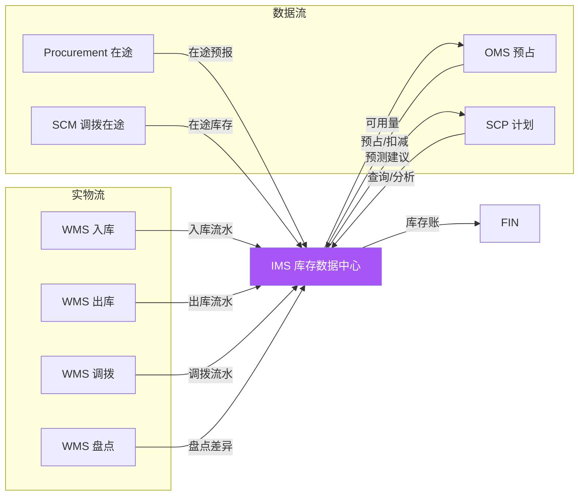

### 6.1.1 IMS 与 WMS 的边界

| 维度 | WMS | IMS |
|------|-----|-----|
| **视角** | 物理实体 | 账面账本 |
| **粒度** | 库位、批次 | SKU、批次、汇总 |
| **操作** | 收货、上架、拣货 | 调拨、锁定、预占 |
| **准确性** | 实时（秒级） | 准实时（分钟级） |
| **系统位置** | 现场执行 | 数据中心 |

### 6.1.2 库存类型总览

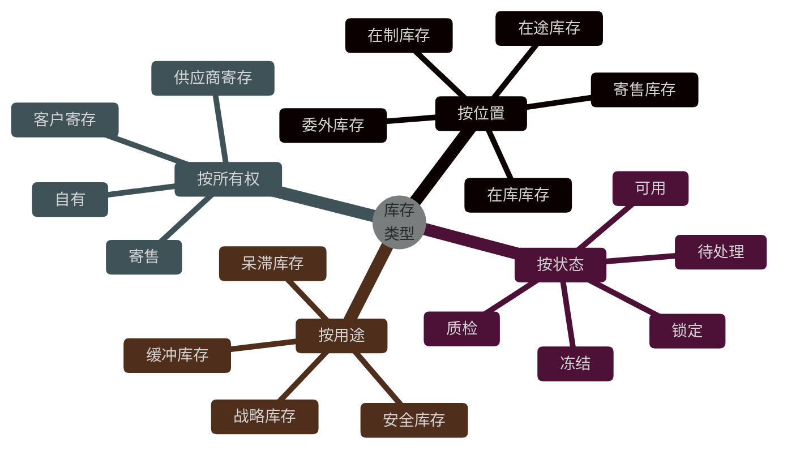

---

## 6.2 库存数据模型

### 6.2.1 库存核心表

```sql
-- ============ 库存汇总表（按 SKU+仓 聚合）============
CREATE TABLE t_inventory_summary (
    id              BIGINT PRIMARY KEY AUTO_INCREMENT,
    sku_code        VARCHAR(64) NOT NULL,
    warehouse_code  VARCHAR(32) NOT NULL,
    owner_code      VARCHAR(32) DEFAULT 'OWN' COMMENT '货主',
    batch_strategy  VARCHAR(16) DEFAULT 'FIFO' COMMENT '批次策略',
    
    on_hand_qty     INT DEFAULT 0 COMMENT '在库数量',
    available_qty   INT DEFAULT 0 COMMENT '可用数量',
    locked_qty      INT DEFAULT 0 COMMENT '锁定数量',
    on_hold_qty     INT DEFAULT 0 COMMENT '冻结数量',
    in_transit_qty  INT DEFAULT 0 COMMENT '在途数量',
    inspection_qty  INT DEFAULT 0 COMMENT '质检数量',
    
    avg_cost        DECIMAL(18,4) COMMENT '加权平均成本',
    total_value     DECIMAL(18,2) COMMENT '库存总价值',
    
    last_in_date    DATE COMMENT '最后入库日',
    last_out_date   DATE COMMENT '最后出库日',
    last_count_date DATE COMMENT '最后盘点日',
    
    version         BIGINT DEFAULT 0 COMMENT '乐观锁',
    updated_at      DATETIME ON UPDATE CURRENT_TIMESTAMP,
    
    UNIQUE KEY uk_inv (sku_code, warehouse_code, owner_code)
) ENGINE=InnoDB COMMENT='库存汇总表';

-- ============ 库存明细表（按 SKU+仓+库位+批次）============
CREATE TABLE t_inventory_detail (
    id              BIGINT PRIMARY KEY AUTO_INCREMENT,
    sku_code        VARCHAR(64) NOT NULL,
    warehouse_code  VARCHAR(32) NOT NULL,
    location_code   VARCHAR(64) NOT NULL,
    batch_no        VARCHAR(32) NOT NULL DEFAULT 'DEFAULT',
    serial_no       VARCHAR(64) COMMENT '序列号',
    owner_code      VARCHAR(32) DEFAULT 'OWN',
    
    quantity        INT DEFAULT 0 COMMENT '数量',
    available_qty   INT DEFAULT 0 COMMENT '可用',
    locked_qty      INT DEFAULT 0 COMMENT '锁定',
    
    production_date DATE,
    expire_date     DATE,
    inbound_date    DATE,
    shelf_life_days INT,
    
    quality_status  VARCHAR(16) DEFAULT 'QUA' COMMENT 'QUA/PRE/UNQ/HOLD',
    inbound_order   VARCHAR(32) COMMENT '入库单',
    
    UNIQUE KEY uk_detail (sku_code, warehouse_code, location_code, batch_no, serial_no),
    INDEX idx_batch (batch_no),
    INDEX idx_expire (expire_date)
) ENGINE=InnoDB COMMENT='库存明细表';

-- ============ 在途库存表 ============
CREATE TABLE t_inventory_in_transit (
    id              BIGINT PRIMARY KEY AUTO_INCREMENT,
    sku_code        VARCHAR(64) NOT NULL,
    from_warehouse  VARCHAR(32) COMMENT '调出仓',
    to_warehouse    VARCHAR(32) COMMENT '调入仓',
    supplier_code   VARCHAR(32) COMMENT '供应商',
    po_no           VARCHAR(32) COMMENT '采购单',
    transfer_no     VARCHAR(32) COMMENT '调拨单',
    
    quantity        INT NOT NULL,
    shipped_qty     INT DEFAULT 0,
    received_qty    INT DEFAULT 0,
    
    expected_date   DATE COMMENT '预计到达',
    shipped_date    DATE,
    received_date   DATE,
    
    status          VARCHAR(16) COMMENT 'PENDING/SHIPPED/PARTIAL/RECEIVED',
    
    INDEX idx_sku (sku_code),
    INDEX idx_destination (to_warehouse, status)
) ENGINE=InnoDB COMMENT='在途库存表';
```

### 6.2.2 库存状态机

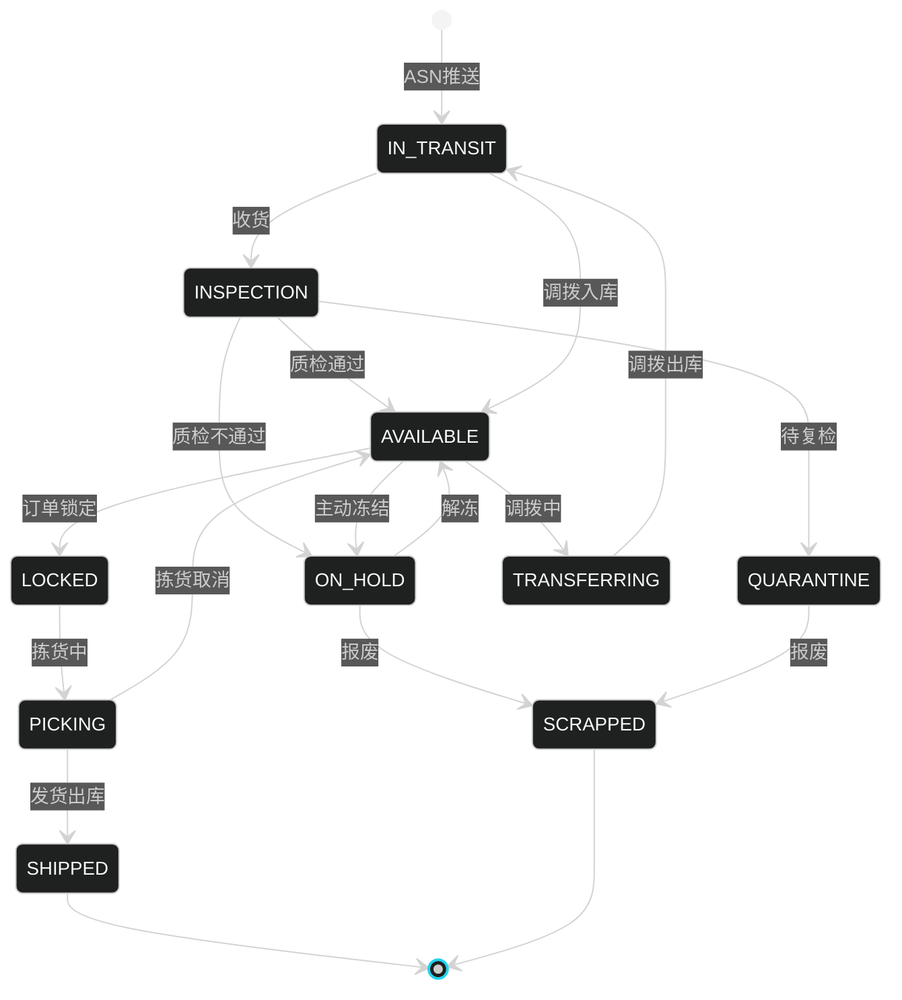

---

## 6.3 可用量计算（ATP）

### 6.3.1 可用量公式

**ATP（Available to Promise）** 是库存最核心的概念：

```
ATP = 物理在库 - 已锁定 - 安全库存
    = on_hand - locked - safety_stock
```

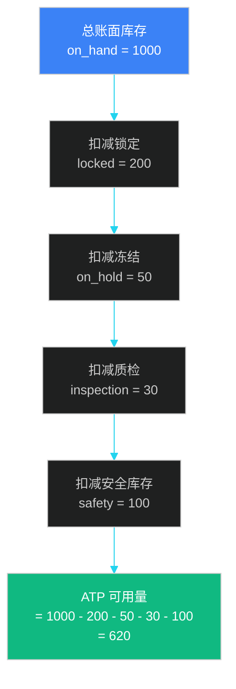

### 6.3.2 多维 ATP

```java
/**
 * 多维 ATP 计算
 */
@Service
public class AtpService {

    /**
     * 全局 ATP（按 SKU 汇总所有仓）
     */
    public AtpResult globalAtp(String skuCode) {
        List<InventorySummary> summaries = summaryRepository.findBySku(skuCode);
        AtpResult result = new AtpResult();

        int totalOnHand = 0;
        int totalLocked = 0;
        int totalOnHold = 0;
        int totalInspection = 0;
        int totalSafety = 0;
        int totalInTransit = 0;

        for (InventorySummary s : summaries) {
            totalOnHand += s.getOnHandQty();
            totalLocked += s.getLockedQty();
            totalOnHold += s.getOnHoldQty();
            totalInspection += s.getInspectionQty();
            totalSafety += getSafetyStock(skuCode, s.getWarehouseCode());
            totalInTransit += s.getInTransitQty();
        }

        result.setOnHand(totalOnHand);
        result.setLocked(totalLocked);
        result.setOnHold(totalOnHold);
        result.setInspection(totalInspection);
        result.setSafetyStock(totalSafety);
        result.setInTransit(totalInTransit);
        result.setAtp(totalOnHand - totalLocked - totalOnHold
            - totalInspection - totalSafety);
        result.setEAtp(result.getAtp() + totalInTransit);  // 扩展可用量

        return result;
    }

    /**
     * 单仓 ATP
     */
    public int warehouseAtp(String skuCode, String warehouseCode) {
        InventorySummary s = summaryRepository
            .findBySkuAndWarehouse(skuCode, warehouseCode);
        if (s == null) return 0;

        int safety = getSafetyStock(skuCode, warehouseCode);
        return s.getOnHandQty() - s.getLockedQty()
            - s.getOnHoldQty() - s.getInspectionQty() - safety;
    }

    /**
     * CTP（Capable to Promise，考虑生产/采购）
     */
    public AtpResult ctp(String skuCode, Date requiredDate) {
        AtpResult result = globalAtp(skuCode);

        // 在 requiredDate 之前能到货的补货
        List<InboundPlan> inbounds = inboundService
            .findArrivingBy(requiredDate, skuCode);
        int inboundQty = inbounds.stream()
            .mapToInt(InboundPlan::getQuantity).sum();

        // 减去 requiredDate 之前的需求
        List<OutboundPlan> outbounds = outboundService
            .findRequiredBy(requiredDate, skuCode);
        int outboundQty = outbounds.stream()
            .mapToInt(OutboundPlan::getQuantity).sum();

        result.setAtp(result.getAtp() + inboundQty - outboundQty);
        return result;
    }
}
```

### 6.3.3 库存共享（防超卖）

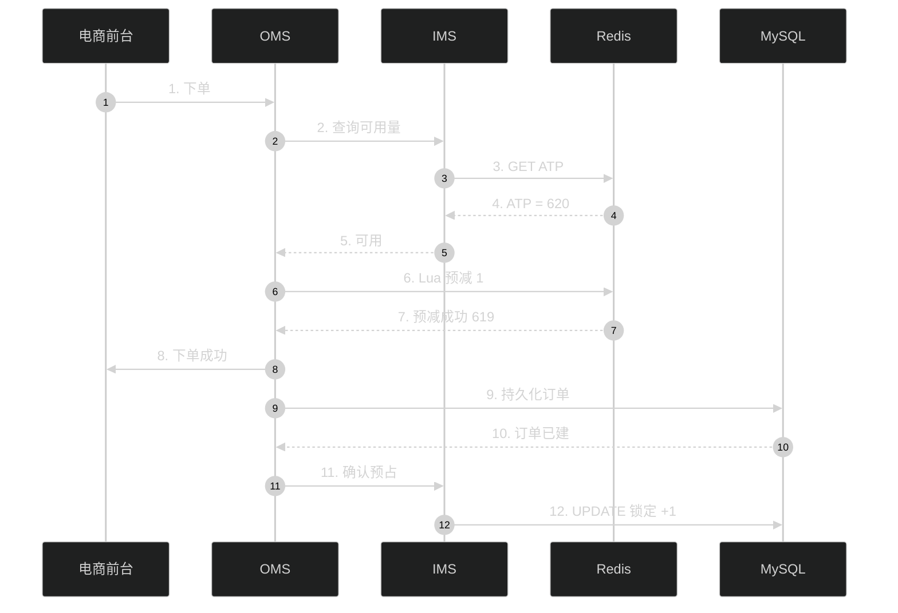

### 6.3.4 预占的原子性

```java
/**
 * Redis Lua 原子预占
 */
public class RedisInventoryDeductor {

    private static final String DEDUCT_SCRIPT =
        "local available = tonumber(redis.call('GET', KEYS[1]))\n" +
        "if available == nil then return -1 end\n" +
        "if available < tonumber(ARGV[1]) then return 0 end\n" +
        "redis.call('DECRBY', KEYS[1], ARGV[1])\n" +
        "redis.call('INCRBY', KEYS[2], ARGV[1])\n" +
        "return 1\n";

    /**
     * 预占（Lua 保证原子性）
     */
    public boolean tryDeduct(String sku, String warehouse, int quantity) {
        String availableKey = "inv:atp:" + sku + ":" + warehouse;
        String lockedKey = "inv:locked:" + sku + ":" + warehouse;

        Long result = redisTemplate.execute(
            new DefaultRedisScript<>(DEDUCT_SCRIPT, Long.class),
            List.of(availableKey, lockedKey),
            String.valueOf(quantity)
        );
        return result != null && result == 1;
    }

    /**
     * 释放预占
     */
    public void release(String sku, String warehouse, int quantity) {
        String availableKey = "inv:atp:" + sku + ":" + warehouse;
        String lockedKey = "inv:locked:" + sku + ":" + warehouse;

        String releaseScript =
            "redis.call('INCRBY', KEYS[1], ARGV[1])\n" +
            "redis.call('DECRBY', KEYS[2], ARGV[1])\n";
        redisTemplate.execute(
            new DefaultRedisScript<>(releaseScript),
            List.of(availableKey, lockedKey),
            String.valueOf(quantity)
        );
    }
}
```

---

## 6.4 批次与序列号

### 6.4.1 批次管理模型

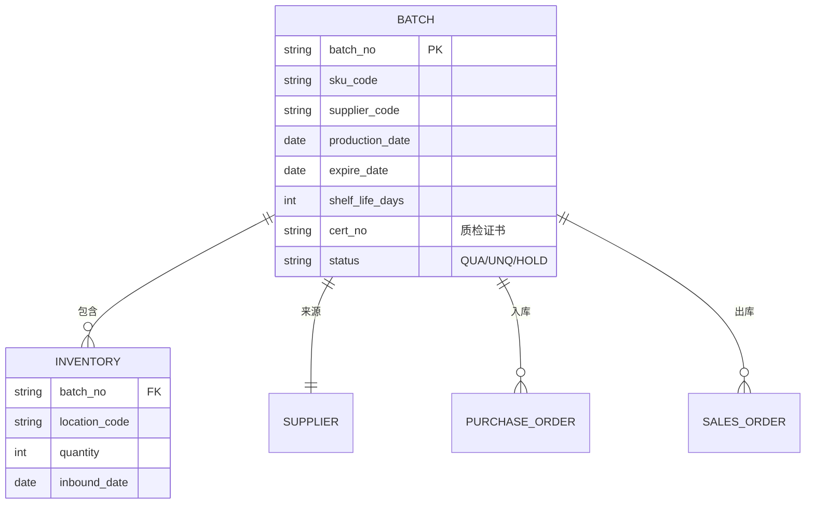

### 6.4.2 批次策略

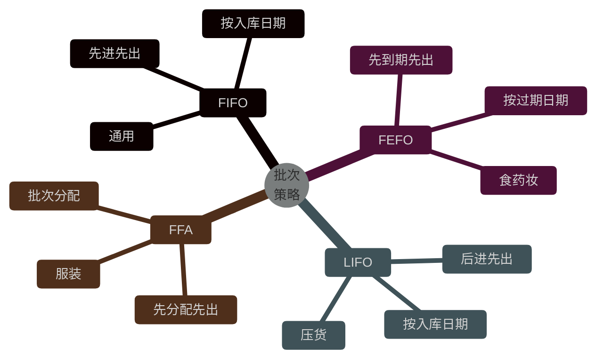

```java
/**
 * 批次拣货建议
 */
@Service
public class BatchPickService {

    /**
     * FEFO 拣货建议
     */
    public List<PickBatch> suggestPickFeFo(String sku, int quantity) {
        // 1. 查询可用批次
        List<InventoryDetail> batches = inventoryDetailRepository
            .findBySkuAndStatus(sku, AVAILABLE);

        // 2. 按过期日期升序
        batches.sort(Comparator.comparing(
            InventoryDetail::getExpireDate,
            Comparator.nullsLast(Comparator.naturalOrder())
        ));

        // 3. 累计达到目标数量
        List<PickBatch> suggestions = new ArrayList<>();
        int remaining = quantity;
        for (InventoryDetail batch : batches) {
            if (remaining <= 0) break;
            int pickQty = Math.min(batch.getAvailableQty(), remaining);

            // 临期预警
            if (isNearExpire(batch)) {
                pickQty = batch.getAvailableQty();  // 临期批次全出
            }

            PickBatch suggestion = new PickBatch();
            suggestion.setBatchNo(batch.getBatchNo());
            suggestion.setLocationCode(batch.getLocationCode());
            suggestion.setPickQty(pickQty);
            suggestion.setExpireDate(batch.getExpireDate());
            suggestions.add(suggestion);

            remaining -= pickQty;
        }

        return suggestions;
    }

    /**
     * 临期判断（保质期 < 30%）
     */
    private boolean isNearExpire(InventoryDetail batch) {
        LocalDate today = LocalDate.now();
        LocalDate expire = batch.getExpireDate().toLocalDate();
        long totalDays = ChronoUnit.DAYS.between(batch.getProductionDate().toLocalDate(), expire);
        long remainDays = ChronoUnit.DAYS.between(today, expire);
        return (double) remainDays / totalDays < 0.3;
    }
}
```

### 6.4.3 序列号管理

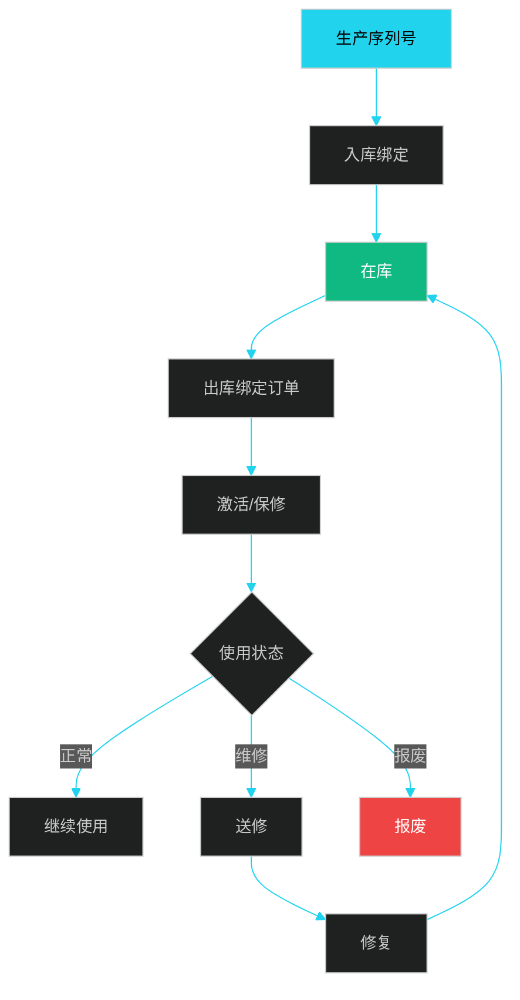

### 6.4.4 双向追溯


```java
/**
 * 双向追溯服务
 */
@Service
public class TraceabilityService {

    /**
     * 正向追溯（从原料到消费者）
     */
    public TraceNode forwardTrace(String batchNo) {
        TraceNode root = new TraceNode();
        root.setBatchNo(batchNo);

        // 上游：原料
        List<RawMaterial> materials = materialService.findByBatch(batchNo);
        root.setMaterials(materials);

        // 当前：库存
        List<InventoryDetail> inventories = inventoryRepo.findByBatchNo(batchNo);
        root.setInventories(inventories);

        // 下游：订单/消费者
        List<OrderItem> orders = orderService.findByBatchNo(batchNo);
        root.setOrders(orders);

        return root;
    }

    /**
     * 反向追溯（从消费者到原料）
     */
    public List<TraceNode> backwardTrace(String orderId) {
        // 1. 订单 → 出库单
        OutboundOrder outbound = outboundService.findByOrder(orderId);
        // 2. 出库单 → 批次
        List<String> batches = outbound.getItems().stream()
            .map(Item::getBatchNo)
            .distinct()
            .collect(toList());
        // 3. 批次 → 采购单
        // 4. 采购单 → 供应商
        // 5. 供应商 → 原料
        return buildTraceChain(batches);
    }
}
```

---

## 6.5 多级库存

### 6.5.1 多级库存模型

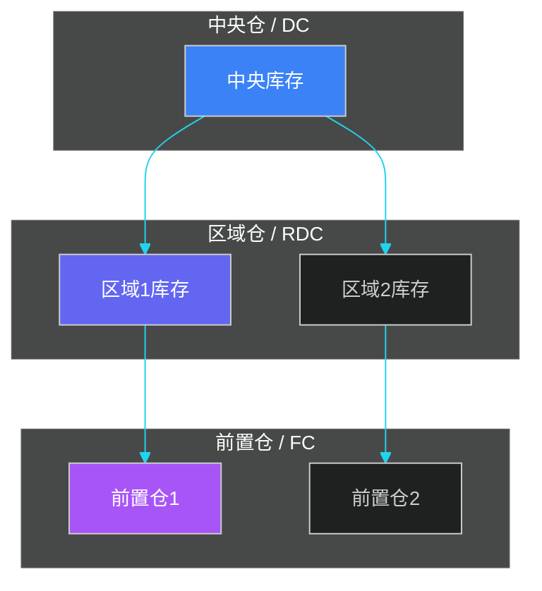

### 6.5.2 多级调拨决策

```java
/**
 * 多级调拨决策
 */
@Service
public class MultiEchelonTransferService {

    /**
     * 调拨决策
     * 触发条件：
     * 1. 某前置仓缺货
     * 2. 区域仓有货
     * 3. 调拨成本 < 紧急采购成本
     */
    public TransferPlan decide(String sku, String fcWarehouse) {
        InventorySummary fcInv = summaryRepo.findBySkuAndWarehouse(sku, fcWarehouse);
        InventorySummary rdcInv = summaryRepo.findByRdcForFc(sku, fcWarehouse);
        InventorySummary dcInv = summaryRepo.findByDcForRdc(sku, fcWarehouse);

        TransferPlan plan = new TransferPlan();

        // 场景 1：前置仓缺货 → 从 RDC 调
        if (fcInv.getAtp() < SAFETY_STOCK) {
            if (rdcInv.getAtp() > SAFETY_STOCK * 2) {
                int transferQty = Math.min(rdcInv.getAtp() - SAFETY_STOCK, REPLENISH_QTY);
                plan.setFromWarehouse(rdcInv.getWarehouseCode());
                plan.setToWarehouse(fcWarehouse);
                plan.setQuantity(transferQty);
                plan.setReason("RDC2FC");
                return plan;
            }

            // 场景 2：RDC 也缺 → 从 DC 调
            if (dcInv.getAtp() > SAFETY_STOCK * 2) {
                int transferQty = Math.min(dcInv.getAtp() - SAFETY_STOCK * 2, REPLENISH_QTY);
                plan.setFromWarehouse(dcInv.getWarehouseCode());
                plan.setToWarehouse(rdcInv.getWarehouseCode());
                plan.setQuantity(transferQty);
                plan.setReason("DC2RDC");
                return plan;
            }

            // 场景 3：DC 也缺 → 紧急采购
            plan.setReason("URGENT_PO");
            return plan;
        }

        return null;  // 不需要调拨
    }
}
```

### 6.5.3 调拨 vs 补货

| 维度 | 调拨 | 补货 |
|------|------|------|
| **来源** | 仓间 | 供应商/工厂 |
| **速度** | 快（小时-天） | 慢（天-周） |
| **成本** | 内部转运费 | 采购价 + 运费 |
| **数量** | 小批量 | 中大批量 |
| **触发** | 缺货响应 | 周期性 |

---

## 6.6 安全库存

### 6.6.1 安全库存公式

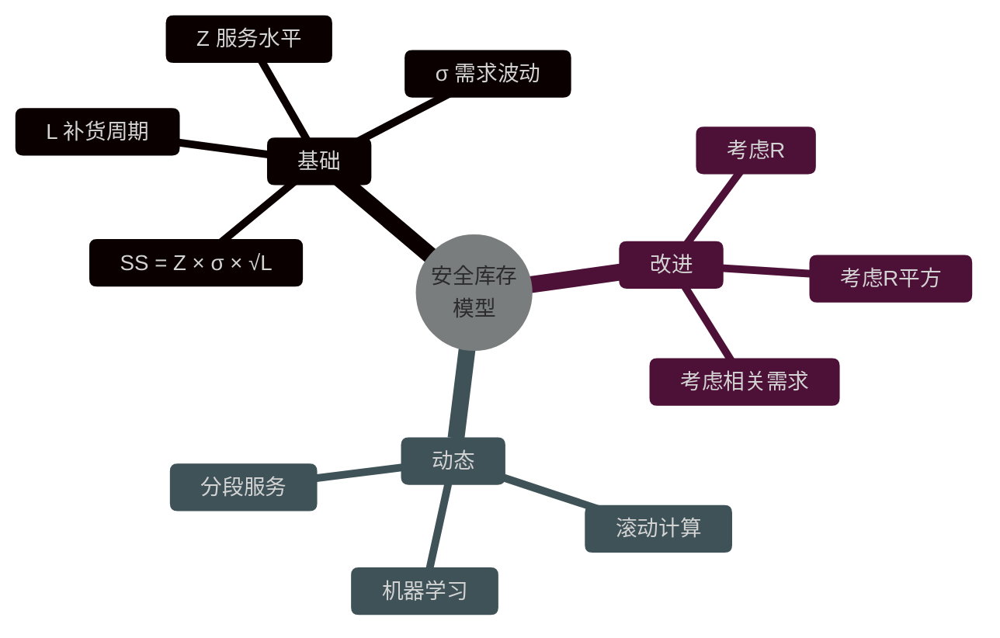

### 6.6.2 标准安全库存公式

```
SS = Z × σ_d × √L
```

其中：
- **SS**：安全库存
- **Z**：服务水平对应的 Z 值（95% → 1.65, 99% → 2.33）
- **σ_d**：日需求标准差
- **L**：补货前置期

```java
/**
 * 安全库存计算
 */
@Service
public class SafetyStockService {

    /**
     * 基础安全库存
     */
    public int calculate(String sku, String warehouse, double serviceLevel) {
        // 历史需求统计（过去 90 天）
        DemandStats stats = demandRepo.getStats(sku, warehouse, 90);
        double avgDailyDemand = stats.getAvgDailyDemand();
        double stdDevDaily = stats.getStdDevDaily();

        // 当前补货前置期
        int leadTimeDays = supplierService.getLeadTime(sku);

        // Z 值
        double z = normalDistribution.inverseCumulativeProbability(serviceLevel);

        // SS = Z × σ × √L
        double ss = z * stdDevDaily * Math.sqrt(leadTimeDays);

        return (int) Math.ceil(ss);
    }

    /**
     * 考虑前置期波动的安全库存
     * SS = Z × √(L × σ_d² + D² × σ_L²)
     */
    public int calculateWithLeadTimeVariance(String sku, String warehouse,
                                             double serviceLevel) {
        DemandStats stats = demandRepo.getStats(sku, warehouse, 90);
        double avgLeadTime = stats.getAvgLeadTime();
        double stdDevLeadTime = stats.getStdDevLeadTime();
        double avgDailyDemand = stats.getAvgDailyDemand();
        double stdDevDaily = stats.getStdDevDaily();

        double z = normalDistribution.inverseCumulativeProbability(serviceLevel);

        // SS = Z × √(L × σ_d² + D² × σ_L²)
        double variance = avgLeadTime * Math.pow(stdDevDaily, 2)
            + Math.pow(avgDailyDemand, 2) * Math.pow(stdDevLeadTime, 2);
        double ss = z * Math.sqrt(variance);

        return (int) Math.ceil(ss);
    }
}
```

### 6.6.3 动态安全库存

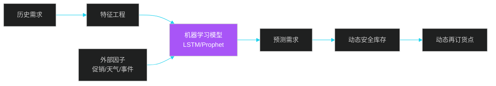

---

## 6.7 库存优化

### 6.7.1 ABC 分类

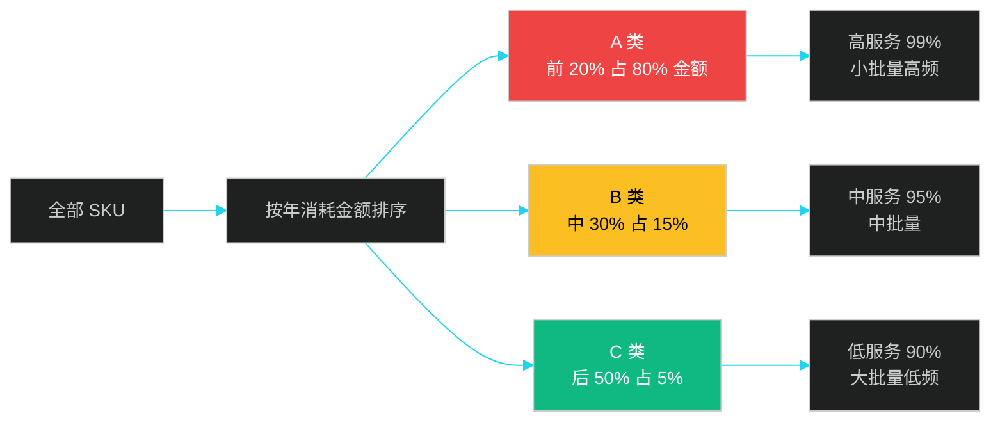

```java
/**
 * ABC 分类
 */
@Service
public class AbcClassificationService {

    public List<AbcClass> classify(String warehouse) {
        // 1. 计算每个 SKU 的年消耗金额
        List<SkuValue> skuValues = inventoryRepo.findAllSkus(warehouse).stream()
            .map(sku -> {
                DemandStats stats = demandRepo.getAnnualStats(sku.getCode());
                double annualValue = stats.getAnnualQty() * sku.getUnitPrice();
                return new SkuValue(sku.getCode(), annualValue);
            })
            .sorted(Comparator.comparing(SkuValue::getValue).reversed())
            .collect(toList());

        // 2. 累计占比
        double totalValue = skuValues.stream()
            .mapToDouble(SkuValue::getValue).sum();
        double cumulative = 0;
        List<AbcClass> classes = new ArrayList<>();

        for (SkuValue sv : skuValues) {
            cumulative += sv.getValue();
            double percent = cumulative / totalValue;

            String classification;
            if (percent <= 0.80) classification = "A";
            else if (percent <= 0.95) classification = "B";
            else classification = "C";

            AbcClass cls = new AbcClass();
            cls.setSkuCode(sv.getSkuCode());
            cls.setClassification(classification);
            classes.add(cls);
        }

        return classes;
    }
}
```

### 6.7.2 呆滞库存管理

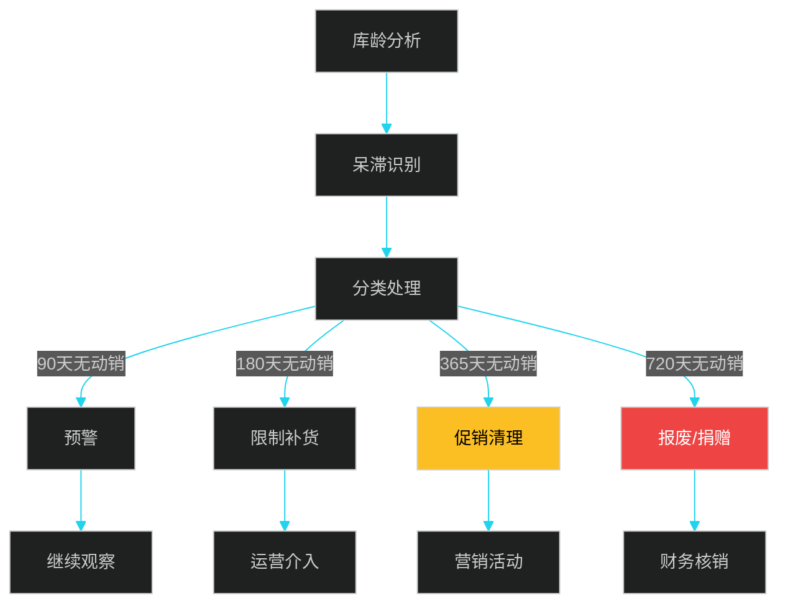

### 6.7.3 库存周转率

```java
/**
 * 库存健康度分析
 */
@Service
public class InventoryHealthService {

    public InventoryHealth analyze(String warehouse) {
        InventoryHealth health = new InventoryHealth();

        // 1. 库存周转率
        double annualCogs = outboundRepo.getAnnualCogs(warehouse);
        double avgInventory = inventoryRepo.getAvgInventory(warehouse);
        double turnover = annualCogs / avgInventory;
        health.setTurnover(turnover);

        // 2. 售罄率
        double salesRatio = salesRepo.getAnnualSalesQty(warehouse)
            / inventoryRepo.getAvgInventoryQty(warehouse);
        health.setSalesRatio(salesRatio);

        // 3. 缺货率
        double stockoutCount = orderRepo.getStockoutCount(warehouse);
        double totalOrders = orderRepo.getTotalOrders(warehouse);
        health.setStockoutRate(stockoutCount / totalOrders);

        // 4. 呆滞率
        double slowMovingValue = inventoryRepo.getSlowMovingValue(warehouse, 90);
        health.setSlowMovingRate(slowMovingValue / avgInventory);

        // 5. 健康度评分
        double score = 0;
        if (turnover >= 8) score += 30;  // 行业基准 8 次
        if (stockoutRate < 0.05) score += 30;  // 缺货率 < 5%
        if (slowMovingRate < 0.10) score += 20;  // 呆滞率 < 10%
        if (salesRatio >= 6) score += 20;  // 售罄率
        health.setHealthScore(score);

        return health;
    }
}
```

---

## 6.8 在途库存

### 6.8.1 在途库存分类

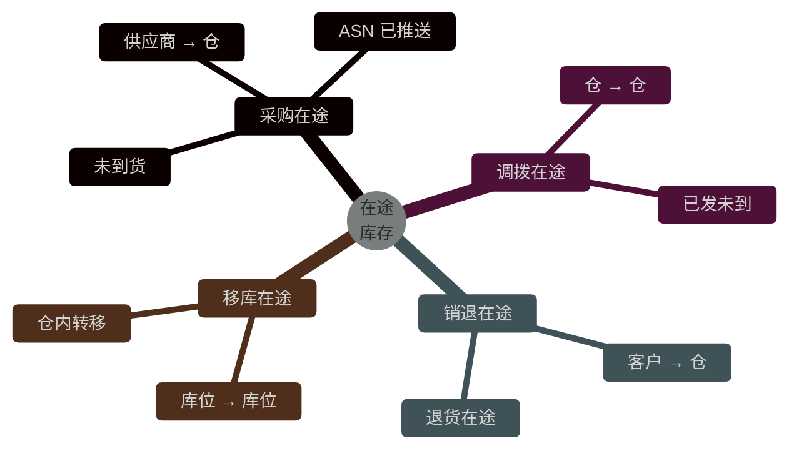

### 6.8.2 在途库存管理

```java
/**
 * 在途库存管理
 */
@Service
public class InTransitService {

    /**
     * 推送 ASN
     */
    public void pushAsn(AsnRequest request) {
        // 1. 在途库存表增加记录
        InventoryInTransit inTransit = new InventoryInTransit();
        inTransit.setSkuCode(request.getSkuCode());
        inTransit.setToWarehouse(request.getToWarehouse());
        inTransit.setSupplierCode(request.getSupplierCode());
        inTransit.setPoNo(request.getPoNo());
        inTransit.setQuantity(request.getQuantity());
        inTransit.setExpectedDate(request.getExpectedDate());
        inTransit.setStatus("PENDING");
        inTransitRepo.save(inTransit);

        // 2. 扩展可用量
        inventoryService.addEAtp(request.getSkuCode(),
            request.getToWarehouse(), request.getQuantity());
    }

    /**
     * 实际到货
     */
    public void confirmArrival(String poNo, int actualQty) {
        InventoryInTransit inTransit = inTransitRepo.findByPoNo(poNo);

        // 1. 状态更新
        inTransit.setReceivedQty(actualQty);
        if (actualQty >= inTransit.getQuantity()) {
            inTransit.setStatus("RECEIVED");
        } else {
            inTransit.setStatus("PARTIAL");
        }
        inTransitRepo.save(inTransit);

        // 2. 减少扩展可用量
        inventoryService.subEAtp(inTransit.getSkuCode(),
            inTransit.getToWarehouse(), actualQty);

        // 3. 增加在库
        inventoryService.addOnHand(inTransit.getSkuCode(),
            inTransit.getToWarehouse(), actualQty);
    }
}
```

---

## 6.9 库存可视化

### 6.9.1 库存看板

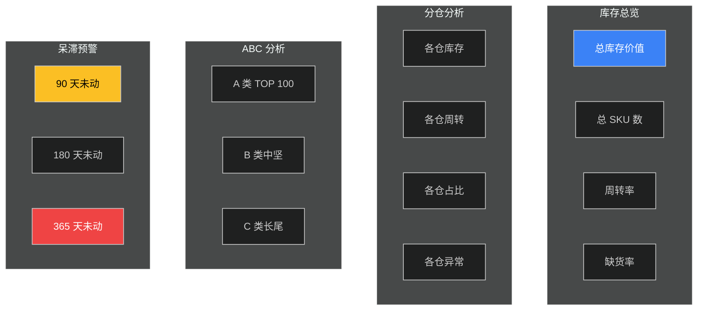

### 6.9.2 案例：Zara 的库存管理

**Zara 的极速库存周转**：

- 设计到门店：2 周
- 单 SKU 首批 5000 件
- 周转次数：12+ 次/年（行业平均 4 次）
- 售罄率：85%
- 折扣率：< 10%

**核心做法**：

1. **小批量**：首批小，根据销售追加
2. **快速响应**：销售数据 24 小时回流
3. **款式多样**：年 12000+ 新款
4. **全球调拨**：热销地区紧急调货

### 6.9.3 案例：京东的库存 ABC-XYZ 分类

**双维度分类**：

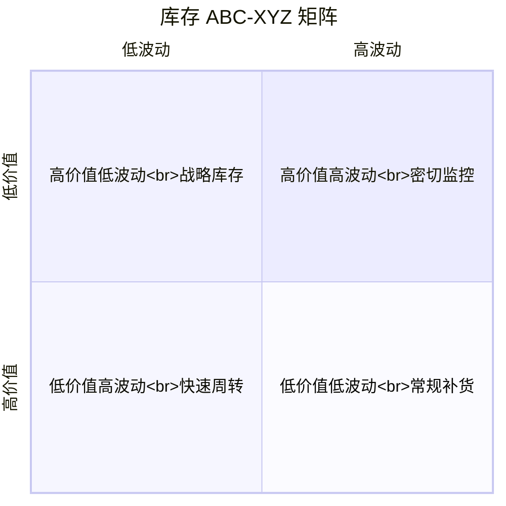

| 分类 | A（高价值） | B（中价值） | C（低价值） |
|------|-------------|-------------|-------------|
| **X（低波动）** | 战略库存 | 安全库存 | 常规补货 |
| **Y（中波动）** | 密切监控 | 安全库存 | 大批量 |
| **Z（高波动）** | 动态 SS | 周期盘点 | JIT |

---

## 本章小结

IMS 是供应链的"账本系统"，核心是**可用量（ATP）计算**、**批次管理**、**多级库存协同**。ATP 公式：可用 = 在库 - 锁定 - 冻结 - 质检 - 安全库存 + 在途。Redis Lua 脚本保证预占原子性，30 分钟 TTL 自动释放，消息队列异步回滚。

**批次管理**支持 FIFO/FEFO/LIFO/FFA 等多种策略，FEFO 是食药妆行业标准。**双向追溯**通过 batch_no 关联上游供应商、原料和下游订单、客户，满足监管要求。

**多级库存**（DC → RDC → FC）需要智能调拨决策：前置仓缺货时优先从 RDC 调，RDC 缺货时从 DC 调，DC 缺货时紧急采购。**安全库存**基础公式 SS = Z × σ × √L，动态安全库存结合机器学习考虑促销、天气、事件等外部因子。

**库存优化**通过 ABC 分类（价值维度）+ XYZ 分类（波动维度）的双维度矩阵，差异化策略管理。Zara 的极速周转、京东的 ABC-XYZ 矩阵是行业典型案例。

下一章将进入**自动化与机器人仓储**，介绍 AGV/AMR、立体库、数字孪生等前沿技术。

---

## 面试高频问题

**1. ATP 的计算公式是什么？多维 ATP 如何计算？**

参考答案要点：ATP = 物理在库 - 已锁定 - 冻结 - 质检 - 安全库存。考虑在途：E-ATP = ATP + 在途入库。考虑生产/采购：CTP = E-ATP + 在 requiredDate 前能到货 - 同期需求。多维 ATP 包括全局（所有仓）、单仓、渠道、批次等不同维度。

**2. FEFO 和 FIFO 的区别？**

参考答案要点：FIFO（First In First Out）按入库日期升序，适合无保质期商品；FEFO（First Expired First Out）按过期日期升序，适合有保质期商品（食品、药品、化妆品）。FEFO 优先出临期批次，避免过期损失。

**3. 多级库存如何决策调拨路径？**

参考答案要点：① 前置仓缺货 → 优先从 RDC 调拨（速度快）；② RDC 也缺 → 从 DC 调拨；③ DC 也缺 → 紧急采购。决策因子：① 调拨成本 vs 紧急采购成本；② 调拨前置期 vs 紧急采购前置期；③ 上下游安全库存水位。

**4. 库存预占的原子性如何保证？**

参考答案要点：Redis Lua 脚本保证 GET + DECRBY 原子性。同时操作可用量（atp）和锁定量（locked）两个 Key，要么都成功要么都失败。MySQL 层面用乐观锁（version 字段）保证。预占有 30 分钟 TTL，过期自动释放。

**5. 安全库存的公式和动态调整？**

参考答案要点：基础公式 SS = Z × σ_d × √L（Z 服务水平，σ_d 需求标准差，L 补货前置期）。考虑前置期波动：SS = Z × √(L × σ_d² + D² × σ_L²)。动态安全库存结合机器学习（LSTM/Prophet）预测需求，叠加促销、天气、事件等外部因子。

**6. ABC 分类的判断标准？**

参考答案要点：按年消耗金额排序，累计占比 0-80% 为 A 类（前 20% SKU），80-95% 为 B 类（中 30% SKU），95-100% 为 C 类（后 50% SKU）。A 类高服务水平（99%）、小批量高频；C 类低服务水平（90%）、大批量低频。

**7. 双向追溯如何实现？**

参考答案要点：所有流转单据（入库/出库/调拨/退货）都记录 batch_no。追溯查询：① 正向（从原料到消费者）通过 batch_no 关联采购单、入库单、库存、出库单、订单；② 反向（从消费者到原料）通过订单号反向查找出库单 → 批次 → 采购单 → 供应商 → 原料。

**8. 在途库存如何管理？**

参考答案要点：在途库存表记录采购、调拨、退货在途记录。状态机：PENDING → SHIPPED → PARTIAL → RECEIVED。考虑在途库存时，扩展可用量 E-ATP = ATP + 在途。实际到货时，在途减少、在库增加，并触发扩展可用量同步。

**9. 库存周转率如何计算？行业基准？**

参考答案要点：库存周转率 = 年销货成本 / 平均库存金额。行业基准：零售 6-8 次，电商 8-12 次，快时尚 12+ 次，制造业 4-6 次。Zara 12+、沃尔玛 8+、京东 10+。提高周转率方法：① 优化 SKU 结构；② 加快动销；③ 清理呆滞；④ 精准补货。

**10. 库存健康度的关键指标？**

参考答案要点：① 库存周转率（核心）；② 售罄率（销售/库存）；③ 缺货率（缺货订单/总订单）；④ 呆滞率（90+ 天未动销金额/总库存）；⑤ 库龄分布；⑥ 库存准确率（99.9% 目标）。综合评分 0-100，< 60 警告、60-80 良好、> 80 优秀。
