# 第 7 章 自动化仓储与机器人

> 本章定位：从**仓储自动化的演进路径**出发，系统讲解**自动化立体库（AS/RS）、AGV/AMR、无人车配送、自动化分拣、数字孪生**等前沿技术在仓储环节的落地，并给出从"自动化"迈向"智能化"的升级路线图。
>
> **学习建议**：本章内容偏"硬件+算法+系统集成"，重点关注 WMS/WCS 与设备的协同、AGV 调度算法、数字孪生仿真三个核心话题。

---

## 7.1 仓储自动化的演进

仓储自动化的发展可以划分为 **4 个阶段**——从纯人工到智能化，背后的驱动力是**劳动力成本上升、电商时效要求、IoT/AI 技术成熟**。

### 7.1.1 四个阶段

| 阶段 | 时间 | 核心特征 | 设备 | 典型场景 |
|------|------|---------|------|---------|
| L1 人工 | 1950s 之前 | 完全人工作业 | 手工 + 简单工具 | 小作坊、夫妻店 |
| L2 机械化 | 1950s-1990s | 机械辅助、传送带 | 叉车、堆高机、传送带 | 制造业成品库 |
| L3 自动化 | 1990s-2010s | 设备自动执行、固定路径 | 堆垛机、输送线、WMS | 立体库、自动分拣 |
| L4 智能化 | 2010s-至今 | AI 决策、自学习、柔性 | AGV/AMR、无人车、数字孪生 | 亚马逊 Kiva、京东无人仓 |

### 7.1.2 演进路径

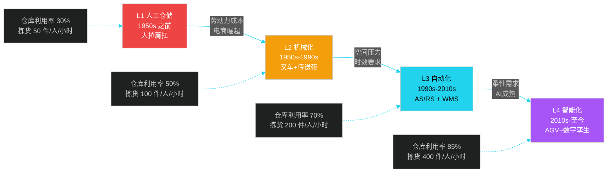

### 7.1.3 自动化的核心驱动力

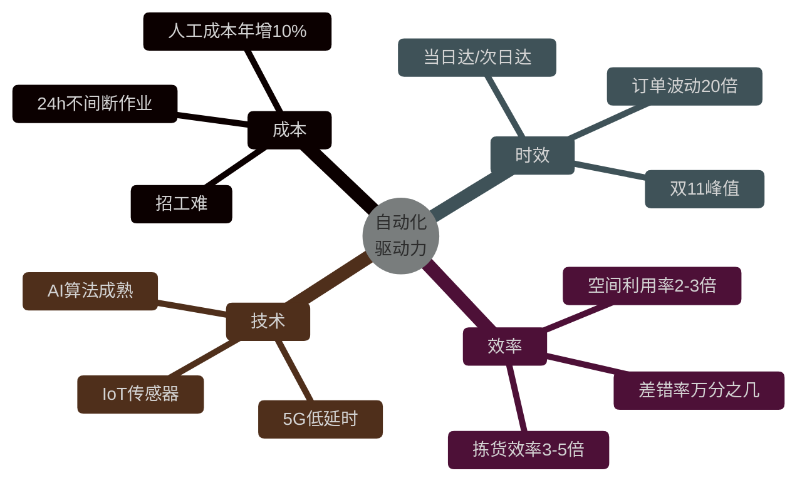

**关键观察**：从 L3 到 L4 不是"设备的简单升级"，而是**"控制系统从确定式走向智能式"**——L3 阶段 WCS（Warehouse Control System）下发固定指令，L4 阶段 WCS 与 AI 调度引擎协同，根据实时状态动态决策。

---

## 7.2 自动化立体库（AS/RS）

**AS/RS**（Automated Storage and Retrieval System）是仓储自动化的标志性系统，通过**堆垛机、穿梭车、货架**等设备实现"高密度存储 + 无人化存取"。

### 7.2.1 立体库结构

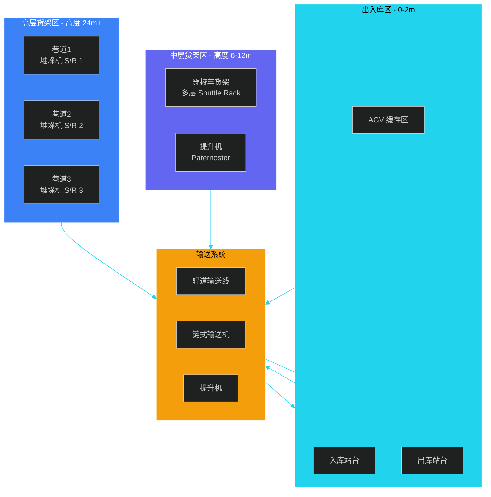

### 7.2.2 三大核心设备对比

| 设备 | 工作原理 | 适用场景 | 效率 | 成本 |
|------|---------|---------|------|------|
| **堆垛机**（S/R Machine） | 沿巷道 X/Y 轴行走，货叉伸缩存取 | 高密度立体库、整托盘存取 | 40-60 次/小时 | 高（百万级） |
| **穿梭车**（Shuttle） | 在货架内轨道水平移动，配合提升机换层 | 中高密度、流利货架、按 SKU 分散 | 100-200 次/小时 | 中（十万级） |
| **AGV/AMR** | 自由路径或磁条导航，移动货架或货箱 | 柔性化、料箱到人、托盘到人 | 视调度而定 | 中高 |

### 7.2.3 WMS 与 WCS 集成架构

WMS（仓储管理系统）负责**业务逻辑**，WCS（仓储控制系统）负责**设备调度**，两者通过标准化接口集成：

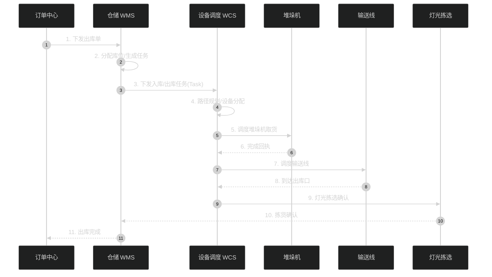

**WMS 与 WCS 的边界**：

| 维度 | WMS | WCS |
|------|-----|-----|
| 职责 | 业务规则、库存、策略 | 设备指令、路径、节拍 |
| 任务颗粒度 | "拣这个 SKU" | "堆垛机 #2 去 A1-3-2 取货" |
| 响应速度 | 秒级 | 毫秒级 |
| 数据来源 | 订单/库存/策略 | 设备 PLC、传感器 |

### 7.2.4 堆垛机调度伪代码

堆垛机调度的核心问题是**任务排序 + 路径优化**。在多任务并存时，需要在**最短路径、最少换层、最低能耗**之间权衡：

```java
/**
 * 堆垛机（Stacker/Retriever）调度器
 * 核心策略：S-shape 启发式 + 换层惩罚
 */
public class StackerScheduler {

    /**
     * 任务排序：S-shape 算法
     * 思路：把同一巷道、同方向的连续任务合并执行
     */
    public List<Task> sortBySShape(List<Task> pendingTasks, int aisle) {
        // 1. 按巷道过滤
        List<Task> aisleTasks = pendingTasks.stream()
            .filter(t -> t.getAisle() == aisle)
            .collect(Collectors.toList());

        // 2. 入库任务和出库任务分离
        List<Task> inbound  = aisleTasks.stream()
            .filter(t -> t.getType() == TaskType.INBOUND)
            .sorted(Comparator.comparingInt(Task::getLevel))
            .collect(Collectors.toList());

        List<Task> outbound = aisleTasks.stream()
            .filter(t -> t.getType() == TaskType.OUTBOUND)
            .sorted(Comparator.comparingInt(Task::getLevel))
            .collect(Collectors.toList());

        // 3. 交叉合并：先入后出，减少堆垛机空跑
        List<Task> merged = new ArrayList<>();
        int i = 0, j = 0;
        while (i < inbound.size() || j < outbound.size()) {
            if (i < inbound.size()) merged.add(inbound.get(i++));
            if (j < outbound.size()) merged.add(outbound.get(j++));
        }
        return merged;
    }

    /**
     * 路径代价评估：考虑换层惩罚
     * cost = 水平距离 + 垂直换层 * 换层权重
     */
    public double evaluatePath(Point from, Point to) {
        double horizontalDist = Math.abs(from.x - to.x);
        double verticalDist   = Math.abs(from.y - to.y);
        double LEVEL_PENALTY  = 2.0;  // 换层代价是水平移动的 2 倍
        return horizontalDist + verticalDist * LEVEL_PENALTY;
    }

    /**
     * 主调度循环
     */
    public void dispatch(Stacker stacker, List<Task> tasks) {
        Point currentPos = stacker.getCurrentPosition();
        for (Task task : tasks) {
            // 1. 计算最优路径
            double cost = evaluatePath(currentPos, task.getLocation());
            // 2. 预占用货位（避免冲突）
            if (lockSlot(task.getLocation(), stacker.getId())) {
                // 3. 下发指令到 PLC
                stacker.moveTo(task.getLocation());
                stacker.pickOrPut(task);
                // 4. 释放货位
                unlockSlot(task.getLocation(), stacker.getId());
                currentPos = task.getLocation();
            }
        }
    }
}
```

**关键优化点**：
- **S-shape 排序**：把同巷道任务合并，减少堆垛机空跑
- **换层惩罚**：堆垛机垂直移动速度（2m/s）远低于水平（4m/s），算法上要给换层更高权重
- **货位预占**：避免两台堆垛机同时进入同一货位

---

## 7.3 AGV 与 AMR

**AGV**（Automated Guided Vehicle，自动导引车）和 **AMR**（Autonomous Mobile Robot，自主移动机器人）是现代柔性仓储的核心。

### 7.3.1 AGV vs AMR 对比

| 维度 | AGV | AMR |
|------|-----|-----|
| 导航方式 | 磁条、二维码、磁钉（**固定路径**） | SLAM、激光雷达（**自由路径**） |
| 路径规划 | 预设路线 | 实时计算 |
| 环境适应性 | 弱（路线变化需重新铺设） | 强（动态避障） |
| 部署成本 | 低（硬件） | 中（需要建图） |
| 单台成本 | 5-15 万 | 10-30 万 |
| 适用场景 | 产线配送、制造业固定路线 | 电商仓储、柔性拣选 |
| 典型厂商 | 海康、极智嘉（部分） | Geek+、快仓、亚马逊 Kiva |

### 7.3.2 AGV 调度系统架构

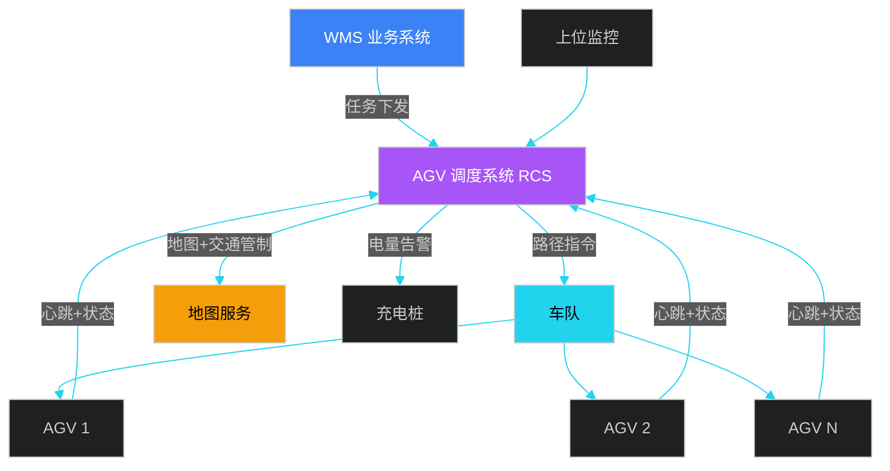

**核心模块**：
- **RCS**（Robot Control System）：任务分配、路径规划、交通管制
- **地图服务**：实时地图 + 障碍物图层
- **车队**：执行单元，毫秒级状态上报

### 7.3.3 路径规划算法对比

| 算法 | 特点 | 适用 | 时间复杂度 |
|------|------|------|-----------|
| **A\*** | 静态地图最优路径 | 已知环境、单机 | O(b^d) |
| **D\*** | 动态增量重规划 | 环境部分已知、需实时调整 | O(b^d) 增量更新 |
| **SLAM** | 边建图边定位 | 未知环境 | 视实现而定 |
| **RRT** | 快速随机探索 | 高维空间 | 指数级 |
| **CBS**（冲突搜索） | 多 AGV 协同 | 多车路径冲突 | NP-Hard |

### 7.3.4 多 AGV 调度伪代码（A\* + 冲突避免）

```java
/**
 * 多 AGV 调度器：基于 A* + 时空冲突检测
 */
public class MultiAgvScheduler {
    private Map<Long, Agv> agvFleet;   // 车队
    private GridMap map;                // 栅格地图
    private List<Reservation> reserved; // 时空预约表

    /**
     * A* 寻路
     */
    public Path aStar(Point start, Point goal) {
        PriorityQueue<Node> open = new PriorityQueue<>(
            Comparator.comparingDouble(n -> n.fScore));
        Map<Point, Double> gScore = new HashMap<>();
        Map<Point, Point> cameFrom = new HashMap<>();

        gScore.put(start, 0.0);
        open.add(new Node(start, heuristic(start, goal)));

        while (!open.isEmpty()) {
            Node current = open.poll();
            if (current.point.equals(goal)) {
                return reconstructPath(cameFrom, current.point);
            }
            for (Point neighbor : getNeighbors(current.point)) {
                if (!map.isWalkable(neighbor)) continue;

                double tentativeG = gScore.get(current.point) + 1;
                if (tentativeG < gScore.getOrDefault(neighbor, Double.MAX_VALUE)) {
                    cameFrom.put(neighbor, current.point);
                    gScore.put(neighbor, tentativeG);
                    double f = tentativeG + heuristic(neighbor, goal);
                    open.add(new Node(neighbor, f));
                }
            }
        }
        return null; // 无解
    }

    /**
     * 时空冲突检测 + 路径规划
     * 关键：每个 AGV 路径上的 (时间, 位置) 不能冲突
     */
    public Path planPathWithConflictAvoidance(long agvId, Point start, Point goal) {
        // 1. 基础 A* 路径
        Path path = aStar(start, goal);

        // 2. 时空冲突检测
        for (int t = 0; t < path.size(); t++) {
            Point pos = path.get(t);
            for (Reservation r : reserved) {
                if (r.agvId == agvId) continue;        // 自己的预约忽略
                if (r.timeStep == t && r.position.equals(pos)) {
                    // 3. 冲突：等待或绕行
                    if (canWait(r, agvId)) {
                        path.insertWait(t, r.timeStep);
                    } else {
                        // 4. 重新规划：考虑冲突点为障碍
                        map.temporarilyBlock(pos, t);
                        Path newPath = aStar(start, goal);
                        map.unblock(pos);
                        return newPath;
                    }
                }
            }
        }

        // 5. 登记预约
        for (int t = 0; t < path.size(); t++) {
            reserved.add(new Reservation(agvId, t, path.get(t)));
        }
        return path;
    }

    private double heuristic(Point a, Point b) {
        return Math.abs(a.x - b.x) + Math.abs(a.y - b.y); // 曼哈顿距离
    }
}
```

**核心思想**：A\* 解决"单机最优路径"，时空预约表解决"多车冲突"，两者结合实现**多 AGV 协同**。

### 7.3.5 行业案例

#### 案例 1：亚马逊 Kiva 机器人

- **规模**：2012 年收购 Kiva，全球部署 75 万+ 台
- **模式**：**货到人（Goods-to-Person）**，货架整体搬运
- **效果**：拣货效率提升 3 倍，运营成本下降 20%
- **核心创新**：黄色 Kiva 机器人在地面二维码网格上运行，货架被顶起后整体搬运

#### 案例 2：京东 AGV 仓

- **规模**：上海"亚洲一号"部署上千台 AGV
- **技术栈**：SLAM 导航 + 5G 通信 + 自研调度系统
- **场景**：3C、图书、小家电
- **效果**：仓库拣货效率提升 5 倍，人员减少 70%

#### 案例 3：菜鸟无锡无人仓

- **特点**：国内最大 AGV 集群，500+ 台机器人协同
- **技术亮点**：自研 RCS 调度系统，支持 500+ AGV 实时调度
- **算法**：CBS 冲突搜索 + 强化学习动态调参

---

## 7.4 无人车配送

无人车配送是**"最后一公里"**的颠覆性技术，2016 年以来进入快速落地期。

### 7.4.1 自动驾驶分级

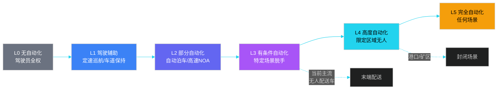

**无人配送车的定位**：目前主流为 **L4 级限定区域自动驾驶**，运行在园区、大学城、社区等结构化道路。

### 7.4.2 无人配送车类型对比

| 类型 | 速度 | 载重 | 续航 | 适用场景 | 代表 |
|------|------|------|------|---------|------|
| **室外无人配送车** | 25-50 km/h | 100-500 kg | 100 km | 城市末端配送 | Nuro、美团、京东 |
| **园区无人车** | 10-20 km/h | 50-200 kg | 30 km | 校园、产业园 | 菜鸟小蛮驴、京东 |
| **楼宇机器人** | 室内 1-2 m/s | 20-50 kg | 8h | 酒店、医院、写字楼 | YOGO、九号 |
| **无人机配送** | 50-80 km/h | 5-20 kg | 30 km | 山区、海岛、急件 | 顺丰丰翼、亚马逊 Prime Air |

### 7.4.3 无人车配送业务流程

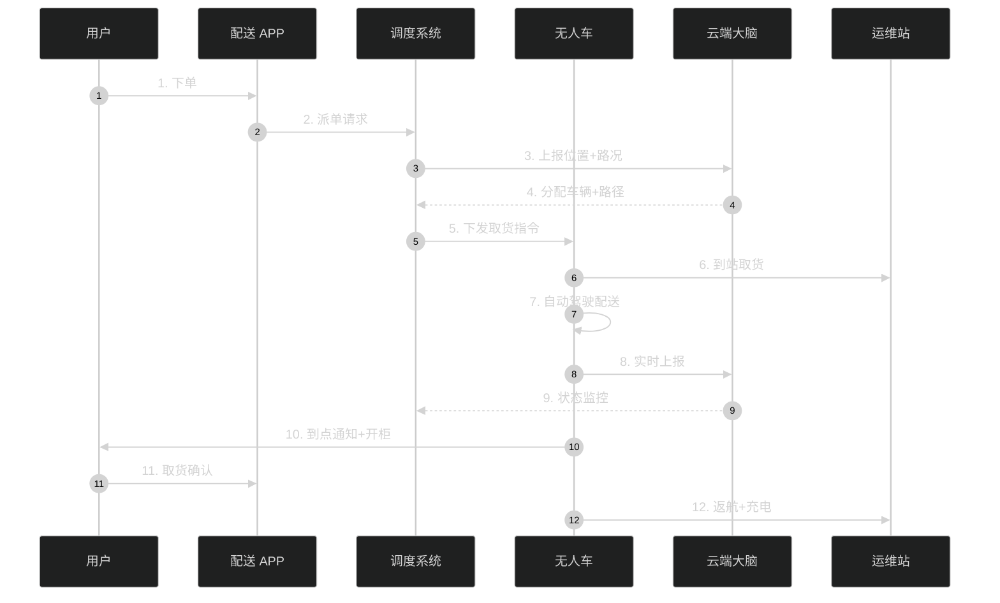

### 7.4.4 行业案例

#### 案例 1：Nuro（美国）

- **首款 L4 量产无人配送车**：R2
- **合作方**：Domino's 披萨、Kroger 超市、沃尔玛
- **特点**：无方向盘、无座椅、双温区货舱
- **运营数据**：截至 2024 年累计配送 200 万单

#### 案例 2：京东无人车

- **车型**：3.5 米、5 米两款
- **场景**：城市配送、园区配送
- **数据**：覆盖 30+ 城市，单车日均配送 50-100 单
- **政策**：已在 20+ 城市获得路测牌照

#### 案例 3：美团无人配送

- **车型**：魔袋 20
- **场景**：北京顺义、深圳龙华等示范区
- **数据**：日均配送 1 万+ 单
- **技术亮点**：5G 远程监控、激光雷达 + 摄像头多传感器融合

#### 案例 4：菜鸟小蛮驴

- **场景**：校园末端配送（清华、浙大等 200+ 高校）
- **特点**：专为校园设计，体积小、造价低
- **数据**：日均单台 200+ 单

---

## 7.5 自动化分拣系统

分拣是仓储出库的"咽喉环节"。一个日处理 100 万单的电商仓，分拣系统效率直接决定出库时效。

### 7.5.1 主流分拣设备对比

| 设备 | 原理 | 效率 | 适用物品 | 成本 | 代表案例 |
|------|------|------|---------|------|---------|
| **交叉带分拣机** | 小车带式循环，可左右转向 | 1-2 万件/小时 | 箱、盒、包装 | 高（千万级） | 京东、菜鸟 |
| **滑块分拣机** | 滑块横向滑动分拣 | 5 千-1 万件/小时 | 软包、扁平件 | 中 | 顺丰、申通 |
| **AGV 分拣** | AGV 顶起货架到指定格口 | 5 千-1 万件/小时 | 中小件、SKU 多 | 中高 | 京东、菜鸟 |
| **机器人分拣** | 机械臂 + 3D 视觉 | 1 千-3 千件/小时 | 不规则件 | 高 | 菜鸟、亚马逊 |

### 7.5.2 交叉带分拣流程

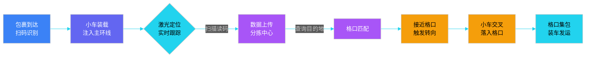

### 7.5.3 AGV 分拣 vs 传统分拣

| 维度 | 传统交叉带 | AGV 分拣 |
|------|-----------|---------|
| 建设成本 | 高（钢构、电机） | 中（机器人） |
| 部署周期 | 6-12 个月 | 1-3 个月 |
| 扩展性 | 难（钢结构） | 易（增加 AGV） |
| 维护 | 集中（设备房） | 分布式（机器人独立） |
| 适合 | 大流量固定分拣 | 中等流量、灵活调整 |
| 噪音 | 大 | 小 |
| 单件成本 | 0.05-0.1 元 | 0.1-0.2 元 |

**趋势**：随着 AGV 成本下降和算法成熟，AGV 分拣在中小流量场景逐步替代传统交叉带。

### 7.5.4 分拣系统关键指标

| 指标 | 定义 | 行业基准 | 影响因素 |
|------|------|---------|---------|
| **分拣效率** | 件/小时 | 1-2 万件/小时 | 设备速度、节拍 |
| **准确率** | 正确分拣件数 / 总件数 | 99.99%+ | 扫码识别、控制系统 |
| **格口利用率** | 格口实际使用 / 总格口 | 70-85% | 订单分布、预测 |
| **破损率** | 破损件 / 总件数 | < 0.01% | 落差、设备精度 |

---

## 7.6 数字孪生在仓储的应用

**数字孪生**（Digital Twin）是通过 3D 建模 + 实时数据，构建物理仓库的"虚拟镜像"，实现**仿真、监控、优化**三位一体。

### 7.6.1 数字孪生仓的 5 层架构

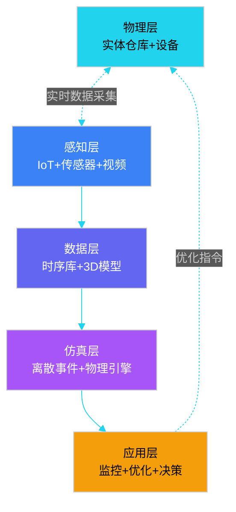

**每一层的关键技术**：

| 层级 | 关键技术 | 工具/引擎 |
|------|---------|-----------|
| 物理层 | 仓库、货架、AGV、堆垛机 | 物理实体 |
| 感知层 | RFID、激光雷达、摄像头、温湿度 | MQTT、5G |
| 数据层 | 时序库、3D 模型、BIM | TimescaleDB、Three.js、Unity |
| 仿真层 | 离散事件仿真、物理引擎 | FlexSim、AnyLogic、Unity Physics |
| 应用层 | 大屏、报警、决策建议 | Grafana、Cesium、自研应用 |

### 7.6.2 数字孪生应用场景

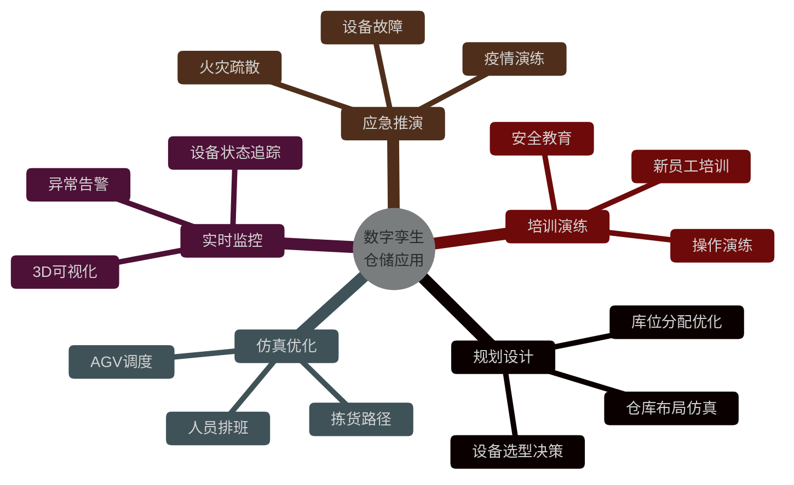

### 7.6.3 仿真引擎伪代码

```java
/**
 * 离散事件仿真引擎：用于仓储作业仿真
 * 核心思想：事件驱动 + 时间跳跃
 */
public class WarehouseSimulator {

    private PriorityQueue<Event> eventQueue;   // 事件队列
    private double currentTime;                  // 当前仿真时间
    private WarehouseState state;                // 仓库状态

    /**
     * 主仿真循环
     */
    public void run(double endTime) {
        while (currentTime < endTime && !eventQueue.isEmpty()) {
            // 1. 取出下一个事件
            Event event = eventQueue.poll();
            currentTime = event.time;

            // 2. 处理事件
            switch (event.type) {
                case ORDER_ARRIVE:
                    handleOrderArrive((OrderEvent) event);
                    break;
                case AGV_MOVE_COMPLETE:
                    handleAgvMove((AgvEvent) event);
                    break;
                case PICK_COMPLETE:
                    handlePickComplete((PickEvent) event);
                    break;
                case EQUIPMENT_FAILURE:
                    handleEquipmentFailure((FailureEvent) event);
                    break;
            }

            // 3. 采集仿真数据
            state.collectMetrics(currentTime);
        }
    }

    /**
     * AGV 移动事件处理
     */
    private void handleAgvMove(AgvEvent event) {
        Agv agv = state.getAgv(event.agvId);
        agv.setPosition(event.targetPos);
        agv.setStatus(AgvStatus.IDLE);

        // 检查是否有新任务可分配
        Task nextTask = state.getNextPendingTask();
        if (nextTask != null) {
            // 计算路径 + 时间
            Path path = pathPlanner.plan(agv.getPosition(), nextTask.fromPos);
            double moveTime = path.estimateTime();
            agv.assignTask(nextTask);

            // 派发"到达"事件
            eventQueue.add(new AgvEvent(
                currentTime + moveTime,
                agv.getId(),
                nextTask.fromPos
            ));
        }
    }

    /**
     * 性能分析：仿真结束后输出 KPI
     */
    public SimulationReport analyze() {
        return SimulationReport.builder()
            .totalOrders(state.getCompletedOrders().size())
            .avgPickTime(state.getAvgPickTime())
            .agvUtilization(state.getAgvUtilization())
            .bottleneck(state.findBottleneck())   // 找瓶颈
            .build();
    }
}

/**
 * 事件基类
 */
class Event implements Comparable<Event> {
    double time;       // 事件时间
    EventType type;    // 事件类型
    @Override
    public int compareTo(Event o) {
        return Double.compare(this.time, o.time);
    }
}
```

**关键点**：
- **事件驱动**：仿真按事件时间跳跃，效率比逐秒模拟高 1000 倍
- **状态快照**：仿真过程中持续采集数据，事后可回放
- **瓶颈识别**：自动识别"设备空闲/排队"的环节

### 7.6.4 行业案例

#### 京东数字孪生仓

- **规模**：亚洲一号全面数字孪生化
- **技术栈**：Unity 3D + 实时数据 + AI 预测
- **应用**：
  - 仓库建设前用孪生体仿真选型，缩短建设周期 30%
  - 运营中实时监控 AGV、机器人状态
  - 双 11 前用孪生体模拟峰值压力，提前扩容
- **效果**：单仓运营效率提升 15%

#### 西门子安贝格工厂

- **特点**：全球最先进数字孪生工厂
- **应用**：从产品设计、生产到运营全流程孪生化
- **效果**：产品缺陷率 0.001%

---

## 7.7 智能化升级路径

从"自动化"到"智能化"不是一蹴而就，而是**渐进式升级**。

### 7.7.1 智能化升级路线图

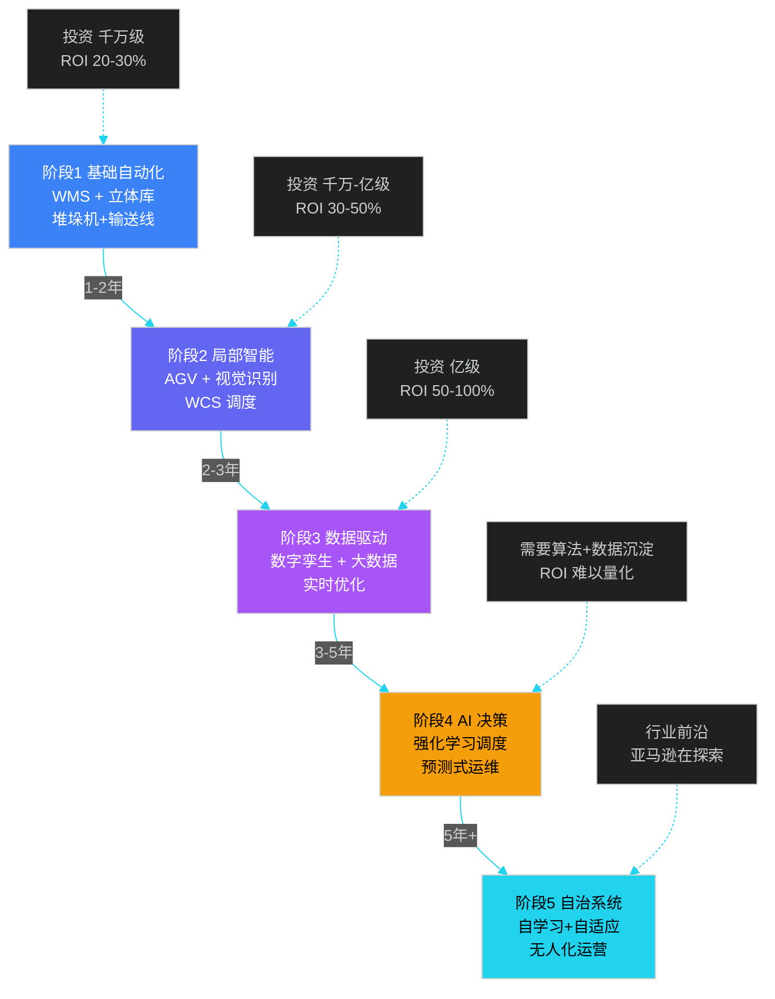

### 7.7.2 AI 在仓储的应用图谱

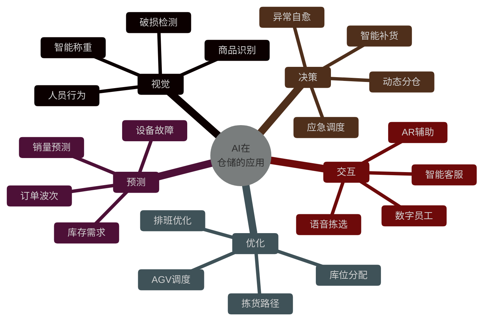

### 7.7.3 智能化核心算法清单

| 算法/技术 | 应用场景 | 价值 | 难度 |
|----------|---------|------|------|
| **深度学习视觉** | 商品识别、破损检测、行为分析 | 替代人工，准确率 99%+ | 中 |
| **强化学习** | AGV 调度、库存决策 | 适应动态环境 | 高 |
| **时序预测** | 销量、库存、需求预测 | 提升预测准确率 10-20% | 中 |
| **运筹优化** | 路径、库位、排班 | 降本 5-15% | 高 |
| **LLM 大模型** | 智能客服、文档处理、决策辅助 | 提升交互效率 | 中 |
| **数字孪生** | 仿真、监控、推演 | 缩短建设周期 30% | 高 |

### 7.7.4 智能调度系统伪代码

```java
/**
 * 智能调度引擎：基于强化学习的 AGV 调度
 * 核心思想：状态 + 奖励 + 动作 持续学习
 */
public class RLScheduler {

    private QNetwork qNetwork;        // Q 值网络
    private ReplayBuffer buffer;      // 经验回放
    private double epsilon = 0.1;     // 探索率

    /**
     * 状态定义
     * - 每台 AGV 的位置、电量、状态
     * - 等待任务队列
     * - 拥堵区域
     */
    public State observeState() {
        return new State(
            agvFleet.stream().map(Agv::getFeature).collect(toList()),
            pendingTasks.stream().map(Task::getFeature).collect(toList()),
            congestionMap.getHotspots()
        );
    }

    /**
     * 动作：任务到 AGV 的分配
     */
    public Action selectAction(State state) {
        if (random.nextDouble() < epsilon) {
            // 探索：随机分配
            return randomAssignment(state);
        }
        // 利用：Q 网络推荐
        return qNetwork.predictBestAction(state);
    }

    /**
     * 奖励设计
     * 目标：最小化订单完成时间 + 最小化能耗
     */
    public double calculateReward(Action action, State nextState) {
        double reward = 0;
        // 完成订单 +10
        reward += action.completedOrders * 10;
        // 单均完成时间越短越好
        reward -= action.avgCompletionTime * 0.5;
        // 能耗
        reward -= action.totalEnergy * 0.01;
        // 拥堵惩罚
        reward -= nextState.congestionLevel * 2;
        return reward;
    }

    /**
     * 在线学习循环
     */
    public void train() {
        // 1. 从经验回放采样
        List<Experience> batch = buffer.sample(BATCH_SIZE);

        // 2. 计算目标 Q 值
        for (Experience exp : batch) {
            double target = exp.reward
                + GAMMA * qNetwork.maxQ(exp.nextState);
            qNetwork.update(exp.state, exp.action, target);
        }

        // 3. 衰减探索率
        epsilon = Math.max(0.01, epsilon * 0.995);
    }
}
```

**关键点**：
- **状态工程**：状态设计是 RL 效果的天花板
- **奖励塑形**：奖励函数决定优化方向
- **安全约束**：必须保留硬规则兜底（如电量低于 10% 强制充电）

### 7.7.5 升级路径建议

| 企业规模 | 建议起点 | 关键投入 | 预期 ROI |
|---------|---------|---------|---------|
| **小仓（日单 < 1 万）** | 阶段 1 | WMS + 立体库 | 2-3 年 |
| **中仓（日单 1-10 万）** | 阶段 2 | AGV + 智能分拣 | 2-3 年 |
| **大仓（日单 10-100 万）** | 阶段 3 | 数字孪生 + 预测 | 3-5 年 |
| **超大型（> 100 万单）** | 阶段 4 | AI 决策 + 自治 | 5 年+ |

**避坑指南**：
- **不要一步到位**：智能化升级是高投入、长周期项目
- **先标准化**：基础数据不准确，再智能也白搭
- **业务驱动**：从最痛的环节切入（如拣货效率低 → 上 AGV）
- **数据先行**：先建数据采集、再做分析、最后做智能

---

## 本章小结

本章系统讲解了自动化仓储与机器人技术的**7 大主题**：

1. **演进路径**：从 L1 人工到 L4 智能化，本质是"控制系统从确定式走向智能式"
2. **AS/RS 立体库**：堆垛机/穿梭车/AGV 三大设备的组合，WMS-WCS-设备三级协同
3. **AGV/AMR**：固定路径 vs 自由路径，核心是多车协同调度（A\* + 时空冲突避免）
4. **无人车配送**：L4 级限定区域自动驾驶，Nuro/京东/美团等已规模化运营
5. **自动化分拣**：交叉带 / 滑块 / AGV 分拣三大方案，AGV 分拣在中小流量场景逐步替代
6. **数字孪生**：5 层架构、3 类核心场景（设计/监控/推演），是智能化升级的"操作系统"
7. **智能化升级**：5 阶段路线图，AI 在视觉/预测/优化/决策/交互 5 大方向全面渗透

**核心心法**：
- **系统思维**：仓储自动化不是单点技术，而是 WMS + WCS + 设备 + 算法的整体协同
- **数据先行**：没有高质量数据，智能化就是空中楼阁
- **业务驱动**：技术服务于业务，从最痛处切入，避免"为技术而技术"

后续章节将围绕**库存优化、跨境物流、智能调度**等主题展开。

---

## 面试高频问题

**1. 自动化立体库（AS/RS）由哪些核心设备组成？WMS 和 WCS 有什么区别？**

参考答案要点：①核心设备：堆垛机（巷道存取）、穿梭车（货架内移动）、提升机（上下层）、输送线（出入库连接）、货架。②WMS 负责业务逻辑（库存、策略、单据），任务颗粒度是"拣这个 SKU"；WCS 负责设备调度（路径、节拍），任务颗粒度是"堆垛机 #2 去 A1-3-2 取货"。③WMS → WCS → 设备 PLC 是三级控制架构。

**2. AGV 和 AMR 的核心区别是什么？分别适合什么场景？**

参考答案要点：①导航方式：AGV 走固定路径（磁条/二维码），AMR 走自由路径（SLAM/激光雷达）。②灵活性：AMR 可动态避障，AGV 路径变更需重新铺设。③成本：AGV 单台 5-15 万，AMR 10-30 万。④场景：AGV 适合产线配送、制造业固定路线；AMR 适合电商仓储、柔性拣选。⑤技术演进：AMR 是趋势，但 AGV 在结构化场景仍有成本优势。

**3. 多 AGV 调度的核心算法是什么？如何避免路径冲突？**

参考答案要点：①核心算法：A\*（单机最优路径）+ 时空冲突检测（多车协同）。②冲突类型：节点冲突（同一时间同一点）、边冲突（同一时间对向移动）。③解决方案：等待策略（原地等冲突车离开）、重规划（将冲突点临时设为障碍）、优先级（高优先级车先行）。④工业级方案：RCS（Robot Control System）调度系统 + 地图服务 + 心跳上报。⑤进阶：强化学习调度，根据实时拥堵自适应分配。

**4. 数字孪生在仓储中的具体应用场景？建设一个数字孪生仓需要哪些技术栈？**

参考答案要点：①应用场景：仓库规划设计（仿真选型）、实时监控（3D 可视化）、作业优化（拣货路径、AGV 调度）、应急推演（疫情/火灾/故障）、员工培训。②技术栈：3D 引擎（Unity/Three.js/Unreal）、物理引擎（FlexSim/AnyLogic）、时序数据库（TimescaleDB/InfluxDB）、IoT 平台（MQTT/EMQX）、BIM 模型。③典型案例：京东亚洲一号孪生体、西门子安贝格工厂。④价值：缩短建设周期 30%、运营效率提升 15%。

**5. 无人配送车目前的自动驾驶分级是多少？主要落地难点是什么？**

参考答案要点：①分级：主流为 L4 级限定区域自动驾驶，运行在园区、大学城、社区等结构化道路。②落地难点：政策（路测牌照、交通事故责任）、技术（恶劣天气感知、复杂路口决策）、成本（单车 20-50 万 vs 配送员成本）、场景（开放式小区、楼梯、门禁）。③代表案例：Nuro（美国，已商业化）、京东（30+ 城市）、美团（顺义示范区）、菜鸟小蛮驴（200+ 高校）。

**6. 自动化分拣有哪些主流方案？如何选型？**

参考答案要点：①主流方案：交叉带分拣机（1-2 万件/小时，适合大流量）、滑块分拣机（5 千-1 万件/小时，适合软包）、AGV 分拣（5 千-1 万件/小时，灵活扩展）、机器人分拣（1-3 千件/小时，适合不规则件）。②选型维度：流量（万件/小时门槛）、物品类型（箱/软包/异形）、扩展性（业务增长）、成本（建设 + 运维）。③趋势：AGV 分拣在中等流量场景逐步替代交叉带，机器人分拣在不规则件场景不可替代。

**7. 仓储智能化升级的路线图是什么？如何分阶段投入？**

参考答案要点：①5 阶段：基础自动化（WMS + 立体库）→ 局部智能（AGV + 视觉）→ 数据驱动（数字孪生 + 大数据）→ AI 决策（强化学习）→ 自治系统。②投入建议：小仓先做阶段 1，中仓进入阶段 2，大仓进入阶段 3。③关键原则：先标准化（数据准确）→ 再自动化（设备替代人工）→ 后智能化（AI 优化）。④避坑：不要一步到位，避免"为技术而技术"，从最痛的环节切入。

**8. WMS、WCS、ERP 三者如何协作？边界在哪里？**

参考答案要点：①ERP：企业级资源计划，财务、采购、订单主数据（业务上层）。②WMS：仓储管理，库存、出入库、库内作业（仓储业务层）。③WCS：仓储控制，设备指令、路径、节拍（设备执行层）。④协作流：ERP 下发采购单 → WMS 收货入库 → WCS 调度设备存取 → WMS 库存更新 → ERP 同步。⑤边界原则：ERP 管"钱和单据"，WMS 管"库内业务"，WCS 管"设备动作"，各司其职、不越界。
